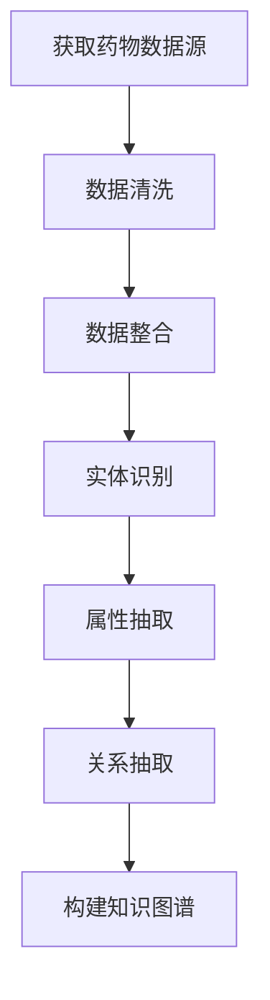
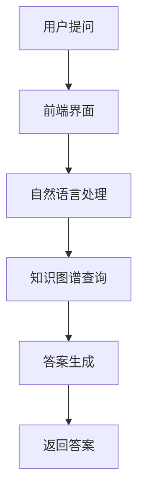

                 

# 基于药物知识图谱的自动问答系统

## 关键词

- 自动问答系统
- 药物知识图谱
- 知识图谱构建
- 查询优化
- 药物信息推荐

## 摘要

本文旨在探讨基于药物知识图谱的自动问答系统的设计与实现。首先，介绍了自动问答系统的基本概念和作用，以及药物知识图谱的重要性。接着，详细阐述了药物知识图谱的构建过程，包括数据源的获取、处理和整合，以及知识图谱的实体识别、属性抽取和关系抽取。随后，讨论了自动问答系统的架构设计、查询优化方法以及系统的开发实现和性能评估。最后，通过具体的应用案例，展示了自动问答系统在药物信息查询、副作用预测和推荐系统等领域的实际应用，并对未来的发展趋势和挑战进行了分析。本文不仅为读者提供了全面的技术解读，还通过实际案例和实践经验，为相关领域的研究和开发提供了有价值的参考。

## 《基于药物知识图谱的自动问答系统》目录大纲

### 第一部分：引言

#### 第1章：自动问答系统概述

1.1 自动问答系统的定义与作用

自动问答系统（Automated Question-Answering System），简称AQA系统，是一种能够通过自然语言处理技术（NLP）理解和解答用户提出问题的系统。它广泛应用于各个领域，如医疗、金融、教育、电子商务等，为用户提供便捷的信息查询和决策支持。

自动问答系统的核心目标是实现人机对话的智能化，使得计算机能够理解和生成自然语言的回答。其作用主要体现在以下几个方面：

1. 提高信息检索效率：自动问答系统能够快速、准确地回答用户的问题，节省了用户在信息检索过程中花费的大量时间。

2. 减轻人力负担：自动问答系统可以替代部分人工查询工作，减轻人力资源的负担，降低运营成本。

3. 个性化服务：自动问答系统可以根据用户的提问历史和兴趣偏好，提供个性化的信息推荐和决策支持。

4. 促进跨领域交流：自动问答系统可以跨越不同领域的知识边界，为用户提供跨领域的问答服务。

1.2 自动问答系统的发展历程

自动问答系统的发展可以追溯到20世纪50年代，当时主要是基于规则的方法。随着计算技术和自然语言处理技术的不断进步，自动问答系统经历了多个发展阶段：

1. 基于规则的方法：20世纪50年代至80年代，自动问答系统主要采用基于规则的方法，通过编写大量的规则来模拟人类的思维过程。

2. 基于模板匹配的方法：20世纪80年代至90年代，自动问答系统开始采用基于模板匹配的方法，通过预先定义好的模板来匹配用户提问，从而生成回答。

3. 基于知识图谱的方法：21世纪初，随着知识图谱技术的兴起，自动问答系统开始引入知识图谱，利用图谱结构来表示和存储知识，从而提高问答的准确性和灵活性。

4. 基于深度学习的方法：近年来，深度学习技术在自然语言处理领域取得了显著成果，自动问答系统也开始采用深度学习方法，如序列到序列模型（Seq2Seq）、注意力机制（Attention Mechanism）等，进一步提高了问答系统的性能。

1.3 药物知识图谱的重要性

药物知识图谱是用于表示和存储药物相关信息的一种结构化数据表示方法。它通过图形化的方式，将药物实体、属性和关系进行组织，从而形成一个全面、精准的知识体系。

药物知识图谱的重要性主要体现在以下几个方面：

1. 促进药物研发：药物知识图谱为药物研发提供了丰富的背景知识，有助于研究人员发现新的药物靶点和治疗策略。

2. 改善临床用药：药物知识图谱可以提供药物相互作用、副作用等信息，帮助医生和患者更好地选择和使用药物，降低用药风险。

3. 提高信息检索效率：药物知识图谱使得药物信息检索更加高效和准确，为医疗、科研等领域提供了强大的信息支持。

4. 优化药物监管：药物知识图谱可以协助药物监管机构对药物的安全性、有效性进行评估，提高药物监管的科学性和公正性。

### 第二部分：药物知识图谱构建

#### 第2章：药物知识图谱数据源

2.1 药物数据源的获取

药物知识图谱的构建依赖于丰富的药物数据源。数据源的获取可以从以下几个方面进行：

1. 公共数据库：如NCBI（National Center for Biotechnology Information）、FDA（Food and Drug Administration）等，这些数据库提供了大量的药物基本信息、临床试验数据、药物副作用等。

2. 文献资源：如PubMed、Medline等医学文献数据库，通过检索相关文献，可以获取药物的研究进展、药效学、药代动力学等信息。

3. 药品说明书：药品说明书包含了药物的详细信息，如药品名称、成分、适应症、不良反应等，是获取药物数据的宝贵来源。

4. 行业报告：相关行业报告提供了市场调研、竞争分析、药物研发进展等信息，有助于补充药物知识图谱的数据。

2.2 药物数据源的质量评估

数据源的质量直接影响到药物知识图谱的构建效果。因此，在获取数据源后，需要进行质量评估。主要从以下几个方面进行评估：

1. 完整性：数据源是否包含了所需的所有药物信息，如名称、成分、适应症、副作用等。

2. 准确性：数据源的准确性直接影响知识图谱的准确性，需要排除错误数据、过时信息等。

3. 一致性：数据源之间的信息是否一致，如药物名称是否统一，数据格式是否一致。

4. 可扩展性：数据源是否易于扩展，能否适应未来新增的药物信息。

2.3 药物数据源的处理与整合

获取到的药物数据源通常包含多种数据格式，如文本、表格、XML等。为了构建高质量的药物知识图谱，需要对数据进行预处理和整合。

1. 数据清洗：去除重复、错误、无关的数据，保证数据的准确性。

2. 数据转换：将不同格式的数据转换为统一格式，如将文本数据转换为表格数据。

3. 数据整合：将来自不同数据源的信息进行整合，形成一个完整的药物知识库。

4. 数据标准化：对药物名称、单位、数值等数据进行标准化处理，确保数据的一致性。

#### 第3章：药物知识图谱的构建方法

3.1 知识图谱的基本概念

知识图谱是一种用于表示和存储知识的数据结构，通过图的形式，将实体、属性和关系进行组织。知识图谱的基本概念包括：

1. 实体（Entity）：知识图谱中的基本单位，如药物、医生、患者等。

2. 属性（Attribute）：实体的特征描述，如药物名称、化学成分、适应症等。

3. 关系（Relationship）：实体之间的关系，如药物与药物之间的相互作用、医生与患者之间的诊断关系等。

4. 节点（Node）：知识图谱中的点，代表实体或属性。

5. 边（Edge）：知识图谱中的线，代表关系。

3.2 药物知识图谱的实体识别

实体识别是知识图谱构建的第一步，主要任务是识别文本数据中的实体。药物知识图谱中的实体主要包括药物、医生、患者、症状等。

1. 基于规则的方法：通过预定义的规则，识别文本中的药物实体。例如，根据药物名称的命名规则，识别文本中的药物名称。

2. 基于统计的方法：通过统计方法，识别文本中的药物实体。例如，利用词频、词性、命名实体识别（NER）等技术，识别文本中的药物实体。

3. 基于机器学习的方法：通过训练机器学习模型，识别文本中的药物实体。例如，利用支持向量机（SVM）、决策树（Decision Tree）等算法，对药物实体进行分类。

3.3 药物知识图谱的属性抽取

属性抽取是从文本数据中提取实体属性的过程。药物知识图谱中的属性主要包括药物的名称、成分、适应症、副作用等。

1. 基于规则的方法：通过预定义的规则，从文本中提取药物属性。例如，根据药品说明书的结构，提取药物的名称、适应症等。

2. 基于统计的方法：通过统计方法，从文本中提取药物属性。例如，利用词频、词性、句法结构等特征，提取药物的名称、成分等。

3. 基于机器学习的方法：通过训练机器学习模型，从文本中提取药物属性。例如，利用朴素贝叶斯（Naive Bayes）、线性回归（Linear Regression）等算法，对药物属性进行预测。

3.4 药物知识图谱的关系抽取

关系抽取是从文本数据中提取实体关系的过程。药物知识图谱中的关系主要包括药物与药物之间的相互作用、药物与症状之间的关联等。

1. 基于规则的方法：通过预定义的规则，从文本中提取药物关系。例如，根据药物命名规则，提取药物与药物之间的相互作用。

2. 基于统计的方法：通过统计方法，从文本中提取药物关系。例如，利用共现关系、关键词共现等特征，提取药物与症状之间的关联。

3. 基于机器学习的方法：通过训练机器学习模型，从文本中提取药物关系。例如，利用条件随机场（CRF）、卷积神经网络（CNN）等算法，对药物关系进行分类。

#### 第4章：自动问答系统架构设计

4.1 自动问答系统架构概述

自动问答系统的架构主要包括三个部分：前端界面、中间层和后端服务。

1. 前端界面：负责与用户进行交互，接收用户的提问，并将问题传递给后端服务。

2. 中间层：负责处理用户的提问，包括自然语言处理、语义解析等。

3. 后端服务：负责从药物知识图谱中查询答案，并将答案返回给前端界面。

4.2 自动问答系统的模块划分

自动问答系统可以划分为多个模块，包括自然语言处理模块、知识图谱查询模块、答案生成模块等。

1. 自然语言处理模块：负责对用户的提问进行分词、词性标注、命名实体识别等预处理操作，将自然语言文本转换为机器可处理的格式。

2. 知识图谱查询模块：负责从药物知识图谱中查询与用户提问相关的信息，包括实体识别、关系抽取等操作。

3. 答案生成模块：负责根据查询结果，生成自然语言回答，并将其呈现给用户。

4.3 自动问答系统的关键技术

自动问答系统的关键技术包括自然语言处理、知识图谱查询、答案生成等。

1. 自然语言处理：自然语言处理技术是实现自动问答系统的关键，包括分词、词性标注、命名实体识别、语义解析等。

2. 知识图谱查询：知识图谱查询技术用于从药物知识图谱中获取与用户提问相关的信息，包括实体识别、关系抽取等。

3. 答案生成：答案生成技术用于根据查询结果，生成自然语言回答，包括模板匹配、语义模板匹配等。

### 第三部分：自动问答系统设计与实现

#### 第5章：药物知识图谱的查询优化

5.1 查询优化的重要性

查询优化是自动问答系统中至关重要的一环，其目标是在有限的计算资源下，快速、准确地返回用户所需的答案。

查询优化的重要性主要体现在以下几个方面：

1. 提高查询效率：通过优化查询算法和数据结构，可以显著提高查询速度，减少响应时间。

2. 提高查询准确性：优化查询算法和数据结构，可以减少查询过程中的误差，提高查询结果的准确性。

3. 节省计算资源：优化查询过程，可以减少计算资源的需求，降低系统的负载。

5.2 查询优化算法

查询优化算法主要包括以下几种：

1. 模式匹配算法：通过预定义的匹配模式，快速定位用户提问与知识图谱中的匹配点，适用于简单的问答场景。

2. 短语匹配算法：通过提取用户提问中的关键词和短语，在知识图谱中进行匹配，适用于长文本查询。

3. 语义匹配算法：通过语义解析技术，理解用户提问的意图，与知识图谱中的语义进行匹配，适用于复杂查询。

4. 图遍历算法：通过在知识图谱中进行深度优先或广度优先搜索，逐步扩大查询范围，适用于范围查询。

5.3 查询优化的实践案例

以下是一个简单的查询优化实践案例：

假设用户提问：“哪种药物可以治疗高血压？”

1. 模式匹配算法：可以预定义一个匹配模式：“治疗+疾病名称”，在知识图谱中查找包含此模式的药物实体。

2. 短语匹配算法：提取用户提问中的关键词“药物”、“治疗”、“高血压”，在知识图谱中进行匹配。

3. 语义匹配算法：理解用户提问的意图是寻找治疗高血压的药物，与知识图谱中的药物实体进行语义匹配。

4. 图遍历算法：从知识图谱中的药物实体出发，逐步扩大查询范围，寻找所有治疗高血压的药物。

#### 第6章：自动问答系统的实现

6.1 自动问答系统的开发环境搭建

在搭建自动问答系统开发环境时，需要安装以下软件和库：

1. 操作系统：Ubuntu 18.04或Windows 10

2. 编程语言：Python 3.7及以上版本

3. 依赖库：Numpy、Pandas、Scikit-learn、TensorFlow、PyTorch等

4. 数据库：Neo4j或MongoDB

5. 知识图谱工具：OpenKG、RDF4J等

6.2 自动问答系统的源代码实现

自动问答系统的源代码实现主要包括以下几个模块：

1. 自然语言处理模块：负责对用户的提问进行预处理，包括分词、词性标注、命名实体识别等。

2. 知识图谱查询模块：负责从药物知识图谱中查询与用户提问相关的信息。

3. 答案生成模块：负责根据查询结果，生成自然语言回答。

以下是一个简单的自动问答系统源代码实现：

```python
# 导入相关库
import numpy as np
import pandas as pd
from sklearn.feature_extraction.text import TfidfVectorizer
from sklearn.metrics.pairwise import cosine_similarity

# 加载药物知识图谱
knowledge_graph = pd.read_csv('knowledge_graph.csv')

# 自然语言处理模块
def preprocess_question(question):
    # 对问题进行分词、词性标注等预处理操作
    # ...
    return preprocessed_question

# 知识图谱查询模块
def query_knowledge_graph(preprocessed_question):
    # 利用TF-IDF模型进行文本相似度计算
    vectorizer = TfidfVectorizer()
    question_vector = vectorizer.fit_transform([preprocessed_question])
    similarity_scores = cosine_similarity(question_vector, knowledge_graph['question_vector'])
    top_k_indices = np.argpartition(similarity_scores, k)[:k]
    top_k_answers = knowledge_graph.iloc[top_k_indices]['answer']
    return top_k_answers

# 答案生成模块
def generate_answer(top_k_answers):
    # 根据查询结果，生成自然语言回答
    # ...
    return answer

# 主函数
def main():
    question = input("请输入问题：")
    preprocessed_question = preprocess_question(question)
    top_k_answers = query_knowledge_graph(preprocessed_question)
    answer = generate_answer(top_k_answers)
    print("答案：", answer)

if __name__ == '__main__':
    main()
```

6.3 自动问答系统的性能评估

自动问答系统的性能评估可以从以下几个方面进行：

1. 查询响应时间：测量系统从接收用户提问到返回答案的时间，评估系统的响应速度。

2. 查询准确率：评估系统返回的答案与用户实际需求的相关程度，通常使用F1值、准确率等指标。

3. 查询覆盖度：评估系统对用户提问的覆盖范围，测量系统返回的答案数量与用户提问的相关性。

4. 用户满意度：通过用户调查或反馈，评估系统在实际应用中的用户体验和满意度。

### 第四部分：案例分析与应用

#### 第7章：基于药物知识图谱的自动问答系统应用案例

7.1 案例一：药物相互作用查询系统

药物相互作用查询系统是自动问答系统在药物信息查询领域的一个典型应用。该系统通过药物知识图谱，实现了用户对药物相互作用的快速查询。

1. 用户提问：“阿司匹林和布洛芬可以一起使用吗？”

2. 系统处理：系统通过预处理用户提问，提取关键词“阿司匹林”、“布洛芬”、“一起使用”，在药物知识图谱中查找相关药物实体和关系。

3. 答案生成：系统根据查询结果，生成自然语言回答：“阿司匹林和布洛芬可以一起使用，但需要注意剂量控制，以避免不良反应。”

7.2 案例二：药物副作用查询系统

药物副作用查询系统是自动问答系统在药物信息查询领域的另一个重要应用。该系统通过药物知识图谱，实现了用户对药物副作用的快速查询。

1. 用户提问：“服用阿托品可能会出现哪些副作用？”

2. 系统处理：系统通过预处理用户提问，提取关键词“阿托品”、“副作用”，在药物知识图谱中查找相关药物实体和关系。

3. 答案生成：系统根据查询结果，生成自然语言回答：“服用阿托品可能会出现视力模糊、口干、心悸等副作用。”

7.3 案例三：药物信息推荐系统

药物信息推荐系统是自动问答系统在药物信息推荐领域的一个创新应用。该系统通过药物知识图谱和用户历史数据，实现了个性化药物信息推荐。

1. 用户提问：“请推荐一种治疗高血压的药物。”

2. 系统处理：系统通过预处理用户提问，提取关键词“治疗”、“高血压”，结合用户历史数据，在药物知识图谱中查找相关药物实体和推荐策略。

3. 答案生成：系统根据查询结果和推荐策略，生成自然语言回答：“基于您的需求，我们推荐您使用贝那普利，它是一种常用的治疗高血压的药物。”

#### 第8章：未来发展趋势与挑战

8.1 自动问答系统的未来发展趋势

随着人工智能技术的不断发展，自动问答系统在医疗、金融、教育、电子商务等领域的应用前景广阔。未来发展趋势主要包括以下几个方面：

1. 智能化：自动问答系统将更加智能化，能够更好地理解用户提问的意图，提供更准确、更个性化的回答。

2. 多模态：自动问答系统将支持多种模态的信息输入，如语音、图像、视频等，提供更加丰富的交互体验。

3. 跨领域：自动问答系统将跨越不同领域的知识边界，实现跨领域的问答服务，提高信息检索和决策支持的能力。

4. 实时性：自动问答系统将实现实时查询和回答，降低响应时间，提高系统的实时性。

8.2 自动问答系统面临的挑战

自动问答系统在发展过程中也面临着一系列挑战：

1. 数据质量：药物知识图谱的数据质量直接影响到自动问答系统的性能，需要确保数据源的完整性、准确性和一致性。

2. 语义理解：自动问答系统需要更好地理解自然语言语义，提高问答的准确性和智能化水平。

3. 查询效率：查询优化是实现自动问答系统高效运行的关键，需要进一步研究高效的查询算法和数据结构。

4. 安全性：自动问答系统需要保证用户隐私和安全，防范恶意攻击和滥用。

8.3 自动问答系统的解决方案

针对自动问答系统面临的挑战，可以采取以下解决方案：

1. 数据质量提升：通过数据清洗、数据整合、数据标准化等技术，提高药物知识图谱的数据质量。

2. 语义理解增强：利用深度学习、自然语言处理等技术，提高自动问答系统的语义理解能力。

3. 查询效率优化：研究高效的查询算法和数据结构，如图数据库、索引技术等，提高系统的查询效率。

4. 安全保障：采取数据加密、权限控制、审计追踪等措施，确保自动问答系统的安全性。

### 附录

#### 附录A：相关工具与资源

A.1 药物知识图谱构建工具

1. OpenKG：一款开源的知识图谱构建工具，支持实体识别、关系抽取、属性抽取等功能。

2. RDF4J：一款基于RDF（Resource Description Framework）的知识图谱工具，提供数据存储、查询、可视化等功能。

3. Neo4j：一款基于图形数据库的知识图谱工具，支持图数据库的操作和查询。

A.2 自动问答系统开发工具

1. TensorFlow：一款开源的机器学习框架，支持自然语言处理、知识图谱查询等任务。

2. PyTorch：一款开源的机器学习框架，支持深度学习模型的设计和训练。

3. NLTK：一款开源的自然语言处理库，提供词性标注、命名实体识别、语义解析等功能。

A.3 药物知识图谱数据集

1. DrugBank：一个包含药物信息的数据集，包括药物名称、成分、适应症、副作用等。

2. PubMed：一个包含医学文献的数据集，可以用于获取药物研究的相关信息。

3. FDA Drug Label：一个包含药品说明书的数据集，可以用于获取药物的详细信息。

#### 附录B：Mermaid 流程图

B.1 药物知识图谱构建流程



B.2 自动问答系统架构流程



#### 附录C：核心算法原理与伪代码

C.1 实体识别算法原理与伪代码

实体识别算法的目标是从文本中识别出药物实体。以下是一个简单的基于规则和统计的实体识别算法：

```python
def entity_recognition(text):
    # 预定义药物名称列表
    drugs = ["阿司匹林", "布洛芬", "阿托品"]

    # 对文本进行分词
    words = text.split()

    # 遍历分词结果，判断是否为药物实体
    entities = []
    for word in words:
        if word in drugs:
            entities.append(word)

    return entities
```

C.2 属性抽取算法原理与伪代码

属性抽取算法的目标是从文本中提取药物实体的属性。以下是一个简单的基于规则和统计的属性抽取算法：

```python
def attribute_extraction(text, entity):
    # 预定义药物属性列表
    attributes = ["名称", "成分", "适应症", "副作用"]

    # 对文本进行分词
    words = text.split()

    # 遍历分词结果，判断是否为药物属性
    attributes_found = []
    for word in words:
        if word in attributes:
            attributes_found.append(word)

    # 根据实体和属性，提取属性值
    attribute_values = {}
    for attr in attributes_found:
        if attr == "名称":
            attribute_values[attr] = entity
        elif attr == "成分":
            attribute_values[attr] = extract成分(text, entity)
        elif attr == "适应症":
            attribute_values[attr] = extract适应症(text, entity)
        elif attr == "副作用":
            attribute_values[attr] = extract副作用(text, entity)

    return attribute_values
```

C.3 关系抽取算法原理与伪代码

关系抽取算法的目标是从文本中识别出药物实体之间的关系。以下是一个简单的基于规则和统计的关系抽取算法：

```python
def relationship_extraction(text, entities):
    # 预定义药物关系列表
    relationships = ["相互作用", "关联疾病"]

    # 对文本进行分词
    words = text.split()

    # 遍历分词结果，判断是否为药物关系
    relationships_found = []
    for word in words:
        if word in relationships:
            relationships_found.append(word)

    # 根据实体和关系，提取关系值
    relationship_values = {}
    for rel in relationships_found:
        if rel == "相互作用":
            relationship_values[rel] = extract相互作用(text, entities)
        elif rel == "关联疾病":
            relationship_values[rel] = extract关联疾病(text, entities)

    return relationship_values
```

#### 附录D：数学模型与公式

D.1 药物相互作用风险预测模型

药物相互作用风险预测模型可以使用逻辑回归（Logistic Regression）进行构建。以下是一个简单的逻辑回归模型：

$$
P(Y=1|X) = \frac{1}{1 + e^{-(\beta_0 + \beta_1X_1 + \beta_2X_2 + \cdots + \beta_nX_n})}
$$

其中，$P(Y=1|X)$表示药物相互作用的风险概率，$X_1, X_2, \cdots, X_n$表示特征变量，$\beta_0, \beta_1, \beta_2, \cdots, \beta_n$表示模型的参数。

D.2 药物副作用预测模型

药物副作用预测模型可以使用决策树（Decision Tree）进行构建。以下是一个简单的决策树模型：

$$
y = \sum_{i=1}^{n} \omega_i h(x_i)
$$

其中，$y$表示药物副作用的预测值，$x_i$表示特征变量，$h(x_i)$表示决策树节点的分类结果，$\omega_i$表示节点权重。

D.3 药物信息推荐模型

药物信息推荐模型可以使用协同过滤（Collaborative Filtering）进行构建。以下是一个简单的协同过滤模型：

$$
r_{ui} = \frac{\sum_{j \in N(u)} r_{uj} w_{uj}}{\sum_{j \in N(u)} w_{uj}}
$$

其中，$r_{ui}$表示用户$u$对药物$i$的评分预测值，$r_{uj}$表示用户$u$对药物$j$的实际评分，$w_{uj}$表示用户$u$和药物$j$的相似度权重，$N(u)$表示用户$u$的邻居用户集合。

