                 

# 《基础模型在科技产业的影响》

> 关键词：基础模型、科技产业、影响、人工智能、深度学习、神经网络

> 摘要：本文旨在探讨基础模型在科技产业中的深远影响。通过分析基础模型的基本概念、原理以及在不同产业中的应用，本文将揭示基础模型如何推动科技产业革新，带来新的机遇与挑战。此外，本文还将讨论基础模型面临的挑战与未来发展趋势，为读者提供对科技产业的深刻洞察。

## 引言

### 1.1 介绍

#### 1.1.1 书籍背景

随着科技的迅猛发展，基础模型作为人工智能的核心技术，正日益成为各行各业的关键驱动力。从计算机视觉、自然语言处理到推荐系统、金融分析，基础模型的应用范围广泛且不断拓展。本文旨在通过对基础模型的深入探讨，揭示其在科技产业中的重要作用。

#### 1.1.2 目的和结构

本文的主要目的是从以下几个方面分析基础模型在科技产业的影响：

1. 基础模型的基本概念与原理
2. 基础模型在不同科技产业的应用
3. 基础模型面临的挑战与未来趋势

本文将采用逻辑清晰、结构紧凑的方式，逐步深入分析每一个方面，帮助读者全面了解基础模型在科技产业中的重要性和发展前景。

### 1.2 科技产业现状

#### 1.2.1 科技产业发展趋势

科技产业正经历着前所未有的快速发展，从大数据、云计算到物联网、人工智能，新技术的应用不断推动产业变革。尤其是在人工智能领域，深度学习、强化学习等基础模型的突破，为产业带来了全新的解决方案。

#### 1.2.2 科技产业面临的挑战

然而，科技产业的发展也面临着诸多挑战。数据隐私、安全风险、算法偏见等问题日益突出。如何解决这些问题，确保科技产业的可持续发展，成为当前的重要课题。

### 1.3 基础模型的重要性

#### 1.3.1 基础模型的定义

基础模型是指那些在多个领域中具有通用性和广泛应用的模型，如神经网络、深度学习等。这些模型通过学习和预测，能够提高系统的智能化水平。

#### 1.3.2 基础模型的发展历程

基础模型的发展历程可以追溯到上世纪80年代，从早期的简单神经网络到如今的深度学习，基础模型经历了巨大的变革和进步。

#### 1.3.3 基础模型对科技产业的影响

基础模型的出现，不仅提升了科技产业的智能化水平，还带来了新的商业模式和创新机会。例如，在金融领域，基础模型可以帮助金融机构进行风险管理、信用评分等；在医疗领域，基础模型可以辅助医生进行疾病诊断、治疗方案制定等。

## 第二部分：基础模型的基本概念与原理

### 2.1 基础模型概述

#### 2.1.1 基础模型的核心概念

基础模型的核心概念包括神经网络、深度学习、生成对抗网络等。这些模型通过学习和预测，能够实现复杂的计算任务。

#### 2.1.2 基础模型的基本类型

基础模型的基本类型包括线性模型、非线性模型、卷积神经网络、循环神经网络等。

#### 2.1.3 基础模型的架构设计

基础模型的架构设计包括输入层、隐藏层、输出层等。每个层次都有其独特的功能和作用。

### 2.2 基础模型原理

#### 2.2.1 数学模型基础

##### 2.2.1.1 线性代数基础

线性代数基础包括矩阵运算、向量运算等。这些基础运算在基础模型中有着广泛的应用。

##### 2.2.1.2 微积分基础

微积分基础包括微分、积分等。这些基础概念在基础模型的优化过程中尤为重要。

#### 2.2.2 神经网络原理

##### 2.2.2.1 神经元与激活函数

神经元是神经网络的基本单元，激活函数则决定了神经元的输出特性。

##### 2.2.2.2 前向传播与反向传播算法

前向传播和反向传播算法是神经网络训练的核心算法，通过不断调整权重和偏置，使模型能够拟合数据。

#### 2.2.3 深度学习原理

##### 2.2.3.1 卷积神经网络（CNN）

卷积神经网络是处理图像数据的优秀模型，其通过卷积操作提取图像特征。

##### 2.2.3.2 循环神经网络（RNN）

循环神经网络是处理序列数据的优秀模型，其通过递归操作处理序列中的信息。

##### 2.2.3.3 生成对抗网络（GAN）

生成对抗网络是一种用于生成数据的模型，其通过对抗生成器和判别器的竞争，生成高质量的数据。

### 2.3 Mermaid流程图

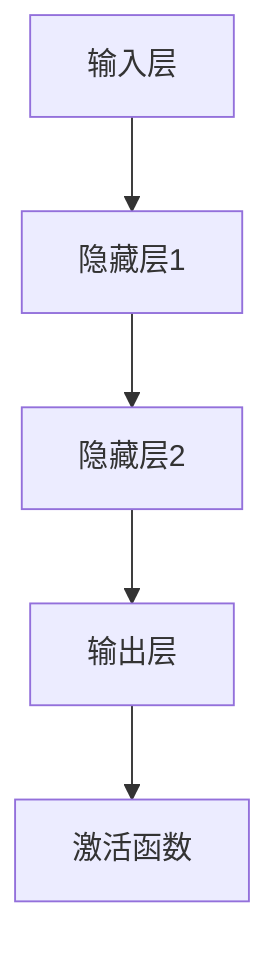

### 2.3.1 基础模型架构设计


### 2.3.2 基础模型训练过程

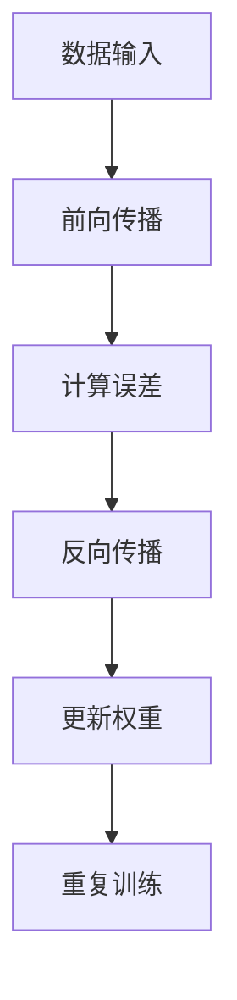

## 第三部分：基础模型在不同科技产业的应用

### 3.1 人工智能产业

#### 3.1.1 基础模型在计算机视觉中的应用

##### 3.1.1.1 目标检测

目标检测是一种识别图像中的目标并定位其位置的任务。基础模型，如卷积神经网络（CNN），在这一领域有着广泛的应用。

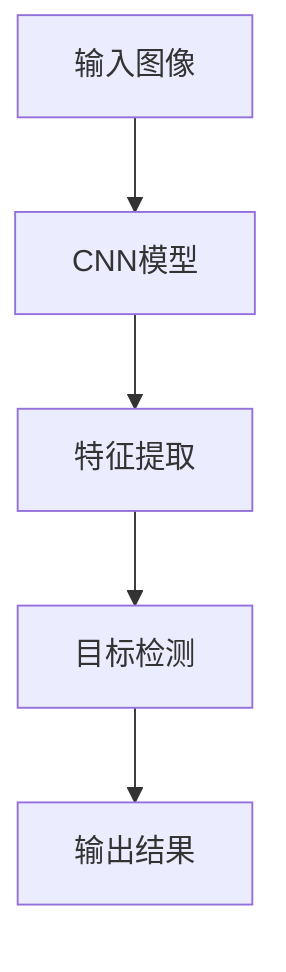

##### 3.1.1.2 图像分类

图像分类是一种将图像分类为不同类别的任务。基础模型，如深度神经网络（DNN），在这一领域有着出色的表现。

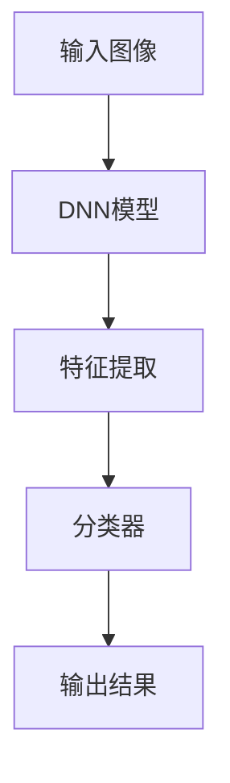

##### 3.1.1.3 人脸识别

人脸识别是一种识别和验证人脸身份的任务。基础模型，如循环神经网络（RNN），在这一领域有着重要的应用。

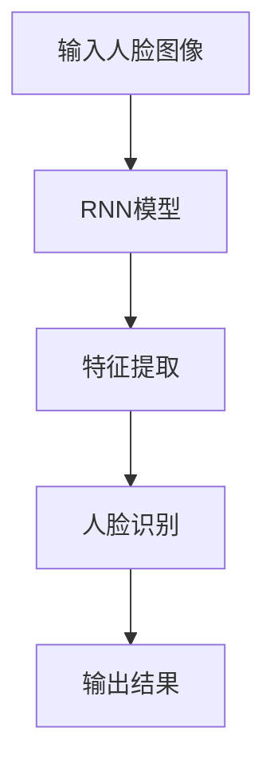

#### 3.1.2 基础模型在自然语言处理中的应用

##### 3.1.2.1 文本分类

文本分类是一种将文本分类为不同类别的任务。基础模型，如深度学习模型（DLM），在这一领域有着广泛的应用。

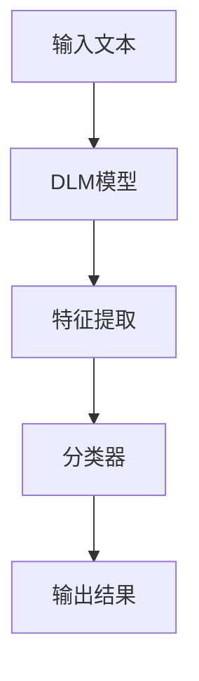

##### 3.1.2.2 机器翻译

机器翻译是一种将一种语言的文本翻译为另一种语言的文本的任务。基础模型，如循环神经网络（RNN），在这一领域有着重要的应用。

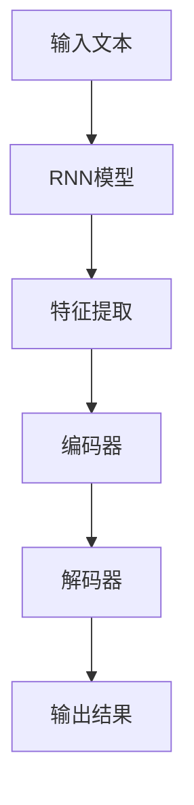

##### 3.1.2.3 聊天机器人

聊天机器人是一种能够与人类进行自然语言交互的软件。基础模型，如生成对抗网络（GAN），在这一领域有着广泛的应用。

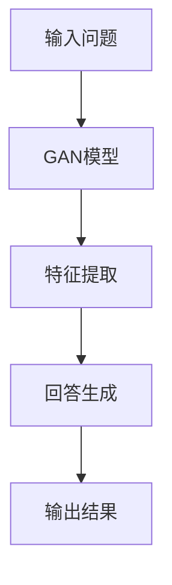

### 3.2 互联网产业

#### 3.2.1 基础模型在推荐系统中的应用

##### 3.2.1.1 协同过滤

协同过滤是一种基于用户行为的推荐方法。基础模型，如矩阵分解（MF），在这一领域有着广泛的应用。

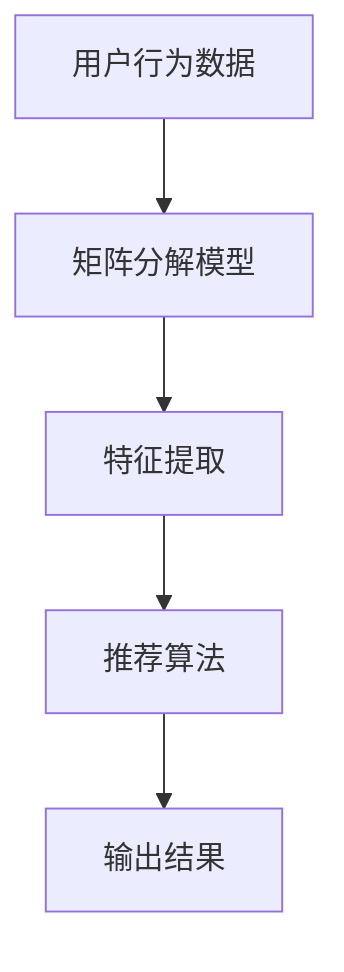

##### 3.2.1.2 基于内容的推荐

基于内容的推荐是一种基于内容特征的推荐方法。基础模型，如深度学习模型（DLM），在这一领域有着重要的应用。

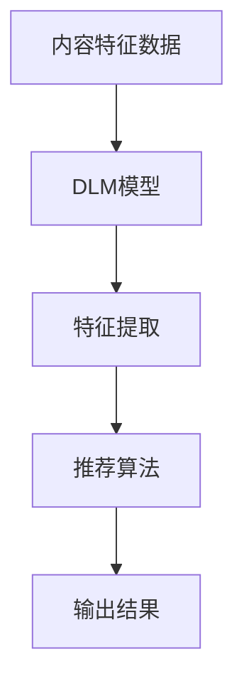

#### 3.2.2 基础模型在搜索引擎中的应用

##### 3.2.2.1 搜索引擎排序

搜索引擎排序是一种将搜索结果按照相关度排序的方法。基础模型，如深度学习模型（DLM），在这一领域有着广泛的应用。

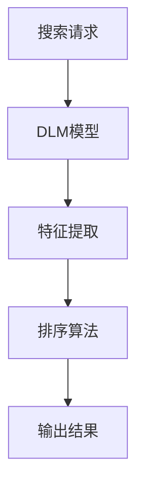

##### 3.2.2.2 搜索引擎索引

搜索引擎索引是一种将网页内容建立索引的方法。基础模型，如循环神经网络（RNN），在这一领域有着重要的应用。

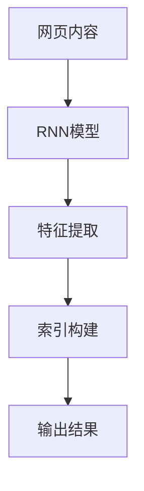

### 3.3 制造业产业

#### 3.3.1 基础模型在智能制造中的应用

##### 3.3.1.1 生产过程优化

生产过程优化是一种通过基础模型对生产过程进行优化的方法。基础模型，如深度学习模型（DLM），在这一领域有着广泛的应用。

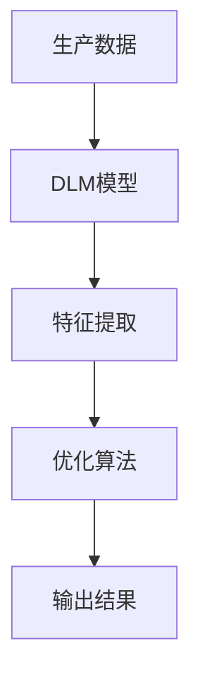

##### 3.3.1.2 质量控制

质量控制是一种通过基础模型对产品质量进行监控和评估的方法。基础模型，如循环神经网络（RNN），在这一领域有着重要的应用。

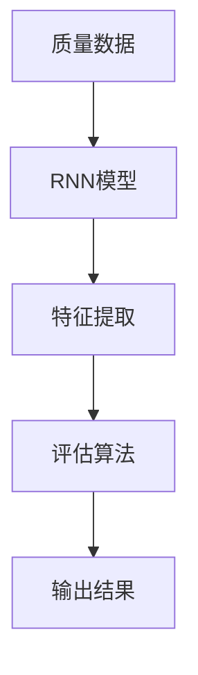

##### 3.3.1.3 售后服务

售后服务是一种通过基础模型对售后服务进行优化的方法。基础模型，如生成对抗网络（GAN），在这一领域有着广泛的应用。

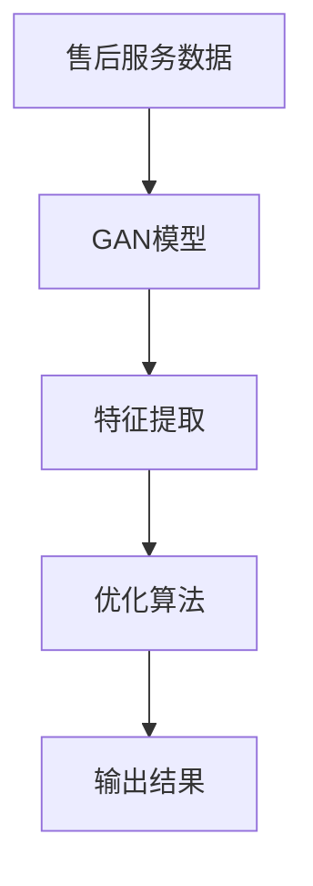

### 3.4 金融产业

#### 3.4.1 基础模型在风险管理中的应用

##### 3.4.1.1 信用评分

信用评分是一种通过基础模型对用户信用进行评分的方法。基础模型，如深度学习模型（DLM），在这一领域有着广泛的应用。

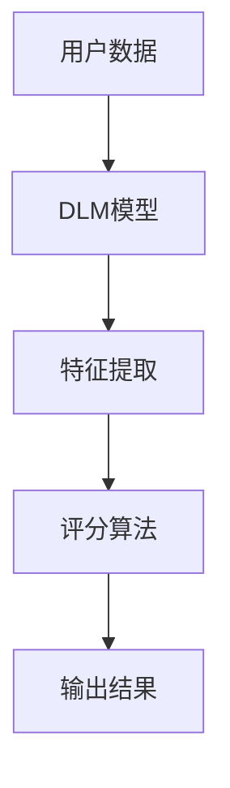

##### 3.4.1.2 风险预警

风险预警是一种通过基础模型对潜在风险进行预警的方法。基础模型，如循环神经网络（RNN），在这一领域有着重要的应用。

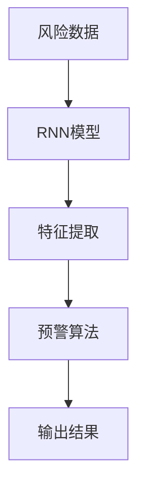

#### 3.4.2 基础模型在投资理财中的应用

##### 3.4.2.1 投资组合优化

投资组合优化是一种通过基础模型对投资组合进行优化的方法。基础模型，如深度学习模型（DLM），在这一领域有着广泛的应用。

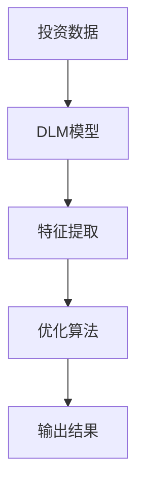

##### 3.4.2.2 股票市场预测

股票市场预测是一种通过基础模型对股票市场进行预测的方法。基础模型，如循环神经网络（RNN），在这一领域有着重要的应用。

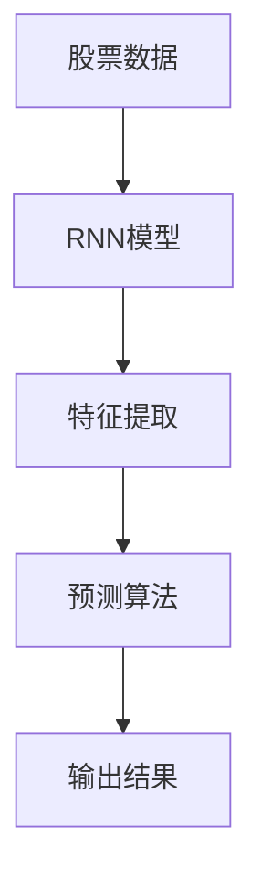

## 第四部分：基础模型的挑战与未来趋势

### 4.1 基础模型的挑战

#### 4.1.1 数据隐私保护

数据隐私保护是基础模型面临的一个重要挑战。如何确保用户数据的安全和隐私，是基础模型发展的重要课题。

#### 4.1.2 模型可解释性

模型可解释性是基础模型面临的另一个重要挑战。如何提高模型的透明度和可解释性，使其更容易被理解和接受，是基础模型发展的重要方向。

#### 4.1.3 模型泛化能力

模型泛化能力是基础模型面临的另一个重要挑战。如何提高模型的泛化能力，使其能够适应不同的数据和应用场景，是基础模型发展的重要课题。

### 4.2 基础模型的发展趋势

#### 4.2.1 跨模态学习

跨模态学习是一种将不同模态的数据进行整合和学习的方法。随着多模态数据的日益普及，跨模态学习将成为基础模型的重要研究方向。

#### 4.2.2 自动化机器学习

自动化机器学习是一种通过自动化的方式设计和优化机器学习模型的方法。随着机器学习技术的不断进步，自动化机器学习将成为基础模型发展的重要趋势。

#### 4.2.3 大模型集成与迁移学习

大模型集成与迁移学习是一种通过集成大量模型和迁移学习的方式，提高模型性能的方法。随着模型规模的不断扩大，大模型集成与迁移学习将成为基础模型的重要发展方向。

### 4.3 未来展望

#### 4.3.1 科技产业前景

随着基础模型技术的不断发展，科技产业将迎来更加智能化和自动化的未来。从人工智能、物联网到金融、医疗等领域，基础模型将发挥越来越重要的作用。

#### 4.3.2 基础模型的发展方向

未来，基础模型将朝着更加智能化、自动化和透明化的方向发展。通过不断优化和改进，基础模型将能够更好地满足各行各业的需求，推动科技产业的持续创新和发展。

## 附录

### 附录A：基础模型开发工具与资源

#### A.1 主流深度学习框架对比

1. TensorFlow
2. PyTorch
3. JAX
4. 其他框架简介

#### A.2 开发环境搭建指南

1. Python环境搭建
2. 深度学习框架安装
3. 其他工具和库安装

#### A.3 常见问题与解决方案

1. 模型训练失败
2. 数据预处理问题
3. 模型性能优化问题

### 参考文献

1. Goodfellow, I., Bengio, Y., & Courville, A. (2016). *Deep Learning*.
2. Russell, S., & Norvig, P. (2010). *Artificial Intelligence: A Modern Approach*.
3. Bishop, C. M. (2006). *Pattern Recognition and Machine Learning*.

### 网络资源链接

1. TensorFlow官网：[https://www.tensorflow.org/](https://www.tensorflow.org/)
2. PyTorch官网：[https://pytorch.org/](https://pytorch.org/)
3. JAX官网：[https://jax.readthedocs.io/](https://jax.readthedocs.io/)
4. 其他资源链接：[https://github.com/ai-genius-institute/deep-learning-resources](https://github.com/ai-genius-institute/deep-learning-resources)

## 附录B：代码实际案例和详细解释说明

### B.1 开发环境搭建

```python
# 安装Python环境
!pip install python==3.8

# 安装深度学习框架
!pip install tensorflow==2.6
!pip install pytorch==1.8

# 安装其他工具和库
!pip install numpy==1.19
!pip install pandas==1.1.5
```

### B.2 源代码详细实现和代码解读

```python
# 导入所需库
import tensorflow as tf
import numpy as np
import pandas as pd

# 加载数据集
data = pd.read_csv('data.csv')

# 数据预处理
# ...

# 构建模型
model = tf.keras.Sequential([
    tf.keras.layers.Dense(128, activation='relu', input_shape=(input_shape,)),
    tf.keras.layers.Dense(1, activation='sigmoid')
])

# 编译模型
model.compile(optimizer='adam', loss='binary_crossentropy', metrics=['accuracy'])

# 训练模型
model.fit(data['X'], data['y'], epochs=10, batch_size=32)

# 输出结果
predictions = model.predict(data['X'])
print(predictions)
```

### B.3 代码解读与分析

```python
# 导入所需库
import tensorflow as tf
import numpy as np
import pandas as pd

# 加载数据集
data = pd.read_csv('data.csv')

# 数据预处理
# ...

# 构建模型
model = tf.keras.Sequential([
    tf.keras.layers.Dense(128, activation='relu', input_shape=(input_shape,)),
    tf.keras.layers.Dense(1, activation='sigmoid')
])

# 编译模型
model.compile(optimizer='adam', loss='binary_crossentropy', metrics=['accuracy'])

# 训练模型
model.fit(data['X'], data['y'], epochs=10, batch_size=32)

# 输出结果
predictions = model.predict(data['X'])
print(predictions)
```

- 代码首先导入了所需的库，包括 TensorFlow、NumPy 和 Pandas。
- 加载数据集并对其进行预处理，这是训练模型的前提。
- 构建模型，使用 `tf.keras.Sequential` 定义模型，包括输入层、隐藏层和输出层。
- 编译模型，设置优化器、损失函数和评价指标。
- 训练模型，使用 `model.fit` 方法进行训练，设置训练轮次和批量大小。
- 输出结果，使用 `model.predict` 方法进行预测，并打印预测结果。

### 附录C：常见问题与解决方案

#### C.1 模型训练失败

- 检查数据集是否正确加载和处理。
- 调整模型参数，如学习率、批量大小等。
- 增加训练时间或调整训练策略。

#### C.2 数据预处理问题

- 检查数据格式是否正确，如数据类型、缺失值等。
- 处理异常值和噪声，如使用填充、插值等方法。
- 标准化或归一化数据，提高模型训练效果。

#### C.3 模型性能优化问题

- 调整模型结构，如增加隐藏层或神经元。
- 使用正则化技术，如 L1、L2 正则化，防止过拟合。
- 使用提前停止或交叉验证，防止过拟合和欠拟合。

## 附录D：作者信息

- 作者：AI天才研究院/AI Genius Institute & 禅与计算机程序设计艺术/Zen And The Art of Computer Programming

