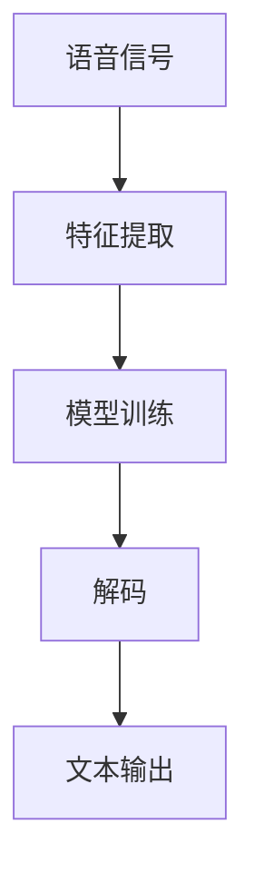
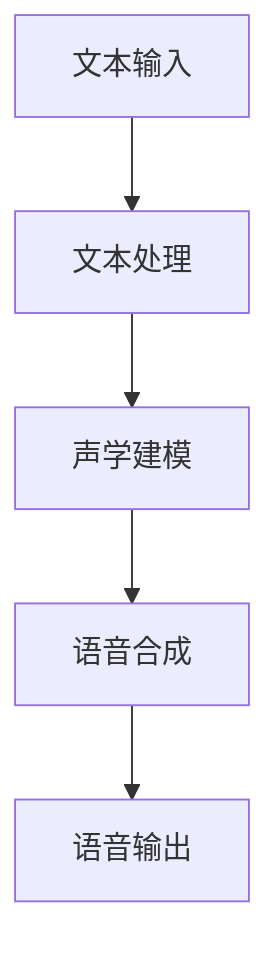
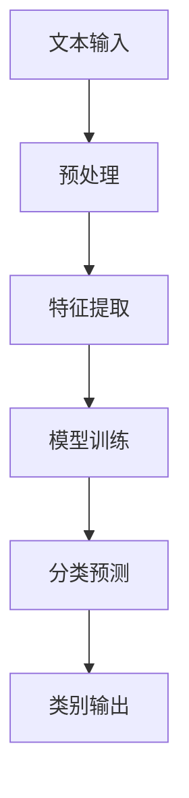
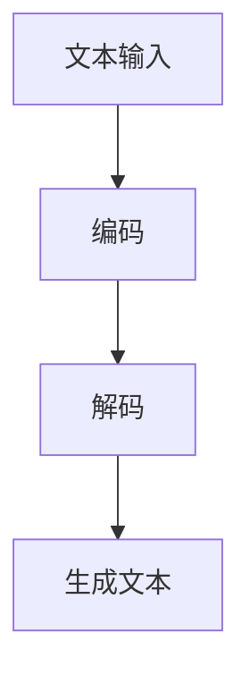
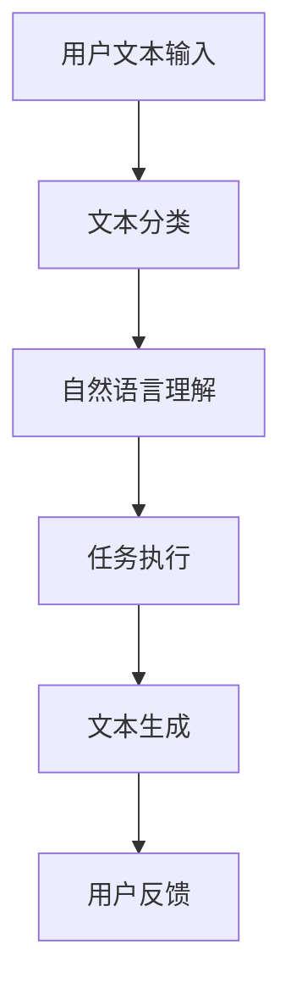
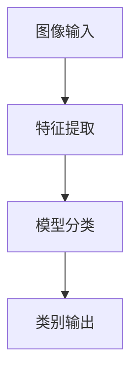
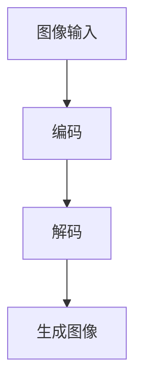
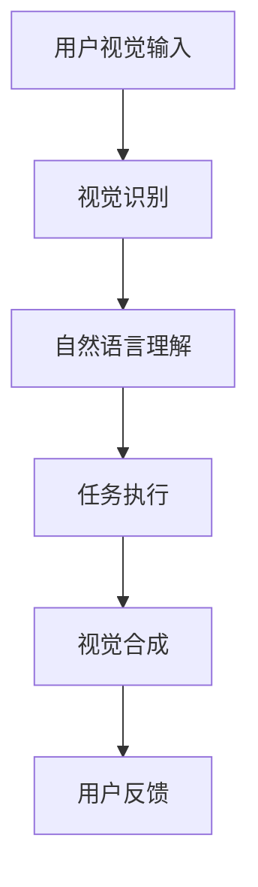
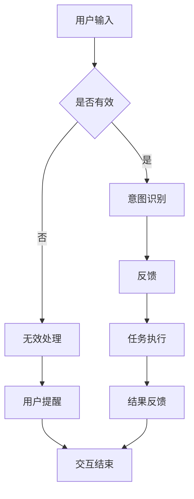

                 

### 文章标题

《基础模型的人机交互能力》

### 关键词

基础模型、人机交互、交互能力、人工智能、机器学习、深度学习、语音交互、文本交互、视觉交互

### 摘要

本文旨在深入探讨基础模型在实现人机交互方面的能力，并分析这些能力对用户体验和交互效果的影响。文章首先介绍了人机交互的基本概念和历史发展，然后详细阐述了人工神经网络、机器学习模型和深度学习模型的基本原理。接下来，我们分析了人机交互能力的构成，包括交互反馈机制、意图识别、个性与情感识别、任务分配与协同。通过具体案例，我们展示了基础模型在语音交互、文本交互和视觉交互中的应用。最后，文章提出了提升人机交互能力的方法和策略，并对未来人机交互的发展趋势进行了展望。通过本文的阅读，读者将全面了解人机交互的基本原理和应用，以及如何通过优化基础模型来提升交互能力。

### 第一部分：人机交互概述

#### 1.1 人机交互概念与历史发展

人机交互（Human-Computer Interaction，简称HCI）是研究如何设计、实现、评估和优化人与计算机之间的交互过程的一门学科。其核心目标是提高用户在使用计算机过程中的体验和效率，使计算机更加智能化、易用和人性化。

人机交互的历史可以追溯到20世纪50年代。早期的计算机系统主要依赖于命令行界面，用户需要通过输入复杂的命令来操作计算机。这种交互方式效率低下，用户体验较差。随着图形用户界面（GUI）的发明，人机交互方式发生了重大变革。GUI通过图形元素和鼠标等输入设备，使得用户可以直观、便捷地与计算机进行交互，极大地提高了用户体验。

1.2 人机交互的基本原则

为了实现有效的人机交互，设计者需要遵循以下基本原则：

1. **用户中心原则**：设计过程应以用户的需求和体验为核心，充分考虑用户的背景、技能和偏好。
2. **一致性原则**：界面设计应保持一致性，包括术语、图标、布局等，以减少用户的学习成本。
3. **简洁性原则**：界面设计应尽量简洁，避免过多的冗余信息和复杂操作。
4. **反馈原则**：系统应及时给用户提供反馈，确保用户知道他们的操作是否成功。
5. **灵活性原则**：系统应提供多种交互方式，以满足不同用户的需要。

#### 1.3 人机交互的发展阶段

人机交互的发展可以分为以下几个阶段：

1. **命令行界面阶段**：用户通过输入命令行来操作计算机，这一阶段主要依赖于用户的记忆和键盘技能。
2. **图形用户界面阶段**：图形用户界面（GUI）的出现，使得用户可以通过鼠标和图形界面来操作计算机，大大提高了交互的直观性和便捷性。
3. **触摸交互阶段**：随着触控技术的发展，触摸屏和触摸操作逐渐成为主流，用户可以通过手指直接在屏幕上进行操作。
4. **自然交互阶段**：人工智能和机器学习技术的发展，使得计算机可以理解和处理自然语言、语音和手势等交互方式，实现更加自然和智能的交互。

### 第二部分：基础模型介绍

#### 2.1 基础模型的基本原理

基础模型是人机交互的核心，主要包括人工神经网络、机器学习模型和深度学习模型。这些模型通过模拟人脑的神经网络结构和工作原理，实现对数据的处理、分析和理解。

##### 2.1.1 人工神经网络

人工神经网络（Artificial Neural Networks，ANN）是一种模拟人脑神经元结构和功能的计算模型。它由大量的神经元（节点）组成，每个神经元都与多个其他神经元相连接。神经元之间通过权重进行连接，权重决定了信息传递的强度。

1. **神经元与神经网络**：神经元是神经网络的基本单位，负责接收输入信息，并通过激活函数产生输出。神经网络则是由多个神经元层次结构组成的，包括输入层、隐藏层和输出层。

2. **学习算法**：人工神经网络通过学习算法来调整神经元之间的权重，从而实现对数据的拟合和分类。常见的学习算法包括误差反向传播算法（Backpropagation）、梯度下降算法（Gradient Descent）等。

##### 2.1.2 机器学习模型

机器学习模型（Machine Learning Models）是人工神经网络的扩展，通过从数据中自动学习特征和规律，实现对未知数据的预测和分类。根据学习方式的不同，机器学习模型可以分为以下几类：

1. **监督学习**：在监督学习中，模型通过已标记的数据进行学习，并利用这些数据来预测新的未知数据。常见的监督学习方法包括线性回归、决策树、支持向量机等。

2. **无监督学习**：在无监督学习中，模型没有已标记的数据，需要从未标记的数据中自动发现数据分布和模式。常见的无监督学习方法包括聚类、降维、关联规则挖掘等。

3. **强化学习**：在强化学习中，模型通过与环境的交互来学习最优策略。通过试错和奖励机制，模型逐渐学会在特定情境下做出最优决策。常见的强化学习方法包括Q学习、SARSA等。

##### 2.1.3 深度学习模型

深度学习模型（Deep Learning Models）是机器学习模型的一种，通过多层神经网络结构来提取数据的深层特征。深度学习模型在图像识别、语音识别、自然语言处理等领域取得了显著成果。

1. **卷积神经网络（CNN）**：卷积神经网络是一种用于处理图像数据的深度学习模型，通过卷积层、池化层和全连接层等结构，实现对图像的层次特征提取和分类。

2. **循环神经网络（RNN）**：循环神经网络是一种用于处理序列数据的深度学习模型，通过循环结构来保持对历史信息的记忆，实现对序列数据的建模和预测。

3. **生成对抗网络（GAN）**：生成对抗网络是一种用于生成数据的深度学习模型，通过生成器和判别器的对抗训练，生成逼真的数据。

#### 2.2 基础模型在交互中的应用

基础模型在交互中的应用非常广泛，包括语音交互、文本交互和视觉交互等。以下分别介绍这些交互方式的基础模型和应用。

##### 2.2.1 语音交互

语音交互是通过语音信号进行人机交互的一种方式，包括语音识别、语音合成和语音交互架构等。

1. **语音识别**：语音识别是将语音信号转换为文本的深度学习模型，通常使用卷积神经网络（CNN）或循环神经网络（RNN）来实现。通过训练大量的语音数据，模型可以学习语音特征，并实现对语音的准确识别。

2. **语音合成**：语音合成是将文本转换为语音的深度学习模型，通常使用循环神经网络（RNN）或长短时记忆网络（LSTM）来实现。通过训练大量的文本和语音对，模型可以学习语音的音调、节奏和语调，并生成自然的语音。

3. **语音交互架构**：语音交互系统通常由语音识别、语音合成和自然语言理解等模块组成。这些模块通过深度学习模型实现，可以实现对用户语音指令的准确理解和响应用户需求。

##### 2.2.2 文本交互

文本交互是通过文本进行人机交互的一种方式，包括文本分类、文本生成和文本交互架构等。

1. **文本分类**：文本分类是将文本数据分类为不同类别的深度学习模型，通常使用卷积神经网络（CNN）或循环神经网络（RNN）来实现。通过训练大量的文本数据，模型可以学习文本的特征，并实现对文本的准确分类。

2. **文本生成**：文本生成是将一种文本转换为另一种文本的深度学习模型，通常使用生成对抗网络（GAN）或变分自编码器（VAE）来实现。通过训练大量的文本对，模型可以学习文本的生成规律，并生成符合目标语言的文本。

3. **文本交互架构**：文本交互系统通常由文本分类、文本生成和自然语言理解等模块组成。这些模块通过深度学习模型实现，可以实现对用户文本指令的准确理解和响应用户需求。

##### 2.2.3 视觉交互

视觉交互是通过图像或视频进行人机交互的一种方式，包括视觉识别、视觉合成和视觉交互架构等。

1. **视觉识别**：视觉识别是将图像或视频分类为不同类别的深度学习模型，通常使用卷积神经网络（CNN）或循环神经网络（RNN）来实现。通过训练大量的图像或视频数据，模型可以学习图像或视频的特征，并实现对图像或视频的准确识别。

2. **视觉合成**：视觉合成是将一种图像或视频转换为另一种图像或视频的深度学习模型，通常使用生成对抗网络（GAN）或变分自编码器（VAE）来实现。通过训练大量的图像或视频对，模型可以学习图像或视频的生成规律，并生成符合目标场景的图像或视频。

3. **视觉交互架构**：视觉交互系统通常由视觉识别、视觉合成和自然语言理解等模块组成。这些模块通过深度学习模型实现，可以实现对用户视觉指令的准确理解和响应用户需求。

### 第三部分：人机交互能力分析

#### 3.1 交互反馈机制

交互反馈机制是人机交互中的一个关键组成部分，它确保用户在操作过程中能够及时获得系统对输入的响应和状态变化的信息。良好的反馈机制可以提高用户的操作信心，降低用户的学习成本，并提升整体交互体验。

##### 3.1.1 反馈的类型

交互反馈可以分为以下几种类型：

1. **视觉反馈**：通过视觉方式提供反馈，如颜色变化、图标更新、文本提示等。
2. **听觉反馈**：通过声音方式提供反馈，如语音提示、音效等。
3. **触觉反馈**：通过触觉方式提供反馈，如振动、按压感等。
4. **动效反馈**：通过动画或动态效果提供反馈，如滑动效果、弹出效果等。

##### 3.1.2 反馈的设计原则

在设计交互反馈时，应遵循以下原则：

1. **及时性**：反馈应尽快提供给用户，以减少用户的等待时间。
2. **一致性**：反馈应与用户的操作保持一致，确保用户能够明确理解反馈的含义。
3. **明确性**：反馈应清晰明确，避免模糊不清的提示，以提高用户理解度。
4. **适应性**：反馈应根据不同的用户和情境进行自适应调整，以满足个性化需求。

#### 3.2 交互意图识别

交互意图识别是人机交互中的核心任务，它涉及到系统对用户输入意图的理解和解析。有效的意图识别能力可以提高系统的智能化水平，增强用户体验。

##### 3.2.1 意图识别的基本方法

意图识别通常采用以下几种方法：

1. **基于规则的方法**：通过定义一系列规则，对用户输入进行匹配和解析。这种方法适用于意图相对固定和简单的情况。
2. **基于统计的方法**：通过统计用户输入的频率和分布，识别用户的意图。这种方法适用于大量数据和复杂的意图场景。
3. **基于深度学习的方法**：通过训练深度学习模型，对用户输入进行特征提取和意图分类。这种方法具有强大的自适应能力和泛化能力。

##### 3.2.2 意图识别的挑战与优化

意图识别面临以下挑战：

1. **多样性**：用户的输入方式多样，包括语音、文本、手势等，需要适应不同的输入模式。
2. **复杂性**：用户的意图往往复杂且模糊，需要精确理解和解析。
3. **不确定性**：用户的意图可能存在歧义和不确定性，需要通过上下文和语境进行推断。

为了应对这些挑战，可以采取以下优化策略：

1. **多模态融合**：结合多种输入模态（如语音、文本、视觉等），提高意图识别的准确性。
2. **上下文建模**：利用上下文信息，如历史交互记录、用户偏好等，提高意图识别的准确性和鲁棒性。
3. **主动学习**：通过用户反馈和修正，不断优化和更新意图识别模型，提高模型的适应性。

#### 3.3 交互个性与情感识别

交互个性与情感识别是人机交互中的高级功能，它涉及到系统对用户个性特征和情感状态的理解和适应。有效的个性与情感识别能力可以提升用户的情感体验，增强交互的个性化和个性化服务。

##### 3.3.1 个性与情感识别的重要性

1. **用户情感体验**：个性与情感识别可以感知用户在交互过程中的情感状态，提供适当的反馈和交互方式，提升用户情感体验。
2. **个性化服务**：通过识别用户的个性特征，系统可以提供更加个性化的服务和推荐，满足用户的个性化需求。
3. **情感互动**：个性与情感识别可以实现人与系统之间的情感互动，建立更加紧密和融洽的交互关系。

##### 3.3.2 个性与情感识别的算法

1. **情感分析**：通过分析用户的语音、文本或行为数据，识别用户的情感状态。常用的情感分析算法包括情感分类、情感极性分析等。
2. **用户画像**：通过收集和分析用户的历史交互数据，建立用户的个性特征模型。用户画像可以基于用户的行为、偏好、兴趣等特征进行构建。
3. **情感合成**：根据用户的情感状态，生成相应的情感反馈和交互方式。情感合成可以基于文本、语音、图像等多种模态进行实现。

##### 3.3.3 个性与情感识别的应用

1. **情感化推荐**：通过识别用户的情感状态，为用户提供更加个性化的推荐服务，提高推荐的相关性和用户满意度。
2. **智能客服**：利用情感识别技术，为用户提供更加自然和人性化的客服服务，提升用户体验和满意度。
3. **人机情感互动**：通过模拟和生成情感互动，建立人与系统之间的情感联系，增强用户的归属感和互动体验。

#### 3.4 交互任务分配与协同

交互任务分配与协同是人机交互中的重要环节，它涉及到系统如何合理分配任务，协调用户和系统的交互，以提高整体效率。

##### 3.4.1 任务分配策略

1. **基于能力分配**：根据用户的能力和偏好，将任务分配给最合适的用户，以提高任务完成的效率和准确性。
2. **基于需求分配**：根据用户的需求和任务复杂性，动态调整任务分配，确保用户能够在最佳状态下完成任务。
3. **基于协作分配**：在多人协作场景中，通过协调用户之间的任务分配，实现任务的共同完成。

##### 3.4.2 协同交互的挑战与解决方案

协同交互面临以下挑战：

1. **信息同步**：在多人协同场景中，需要确保信息同步和一致性，以避免冲突和误解。
2. **任务分工**：合理分工是实现高效协同的关键，需要根据任务特点和用户能力进行优化。
3. **协作效率**：提高协同效率，降低协作过程中的沟通成本和时间。

解决策略包括：

1. **协同框架设计**：设计灵活的协同框架，支持动态任务分配和协作流程的调整。
2. **通信机制优化**：优化通信机制，确保信息的实时传输和同步。
3. **任务管理工具**：提供任务管理工具，帮助用户明确任务分工和协作流程，提高协同效率。

### 第四部分：基础模型在交互中的应用

#### 4.1 基础模型在语音交互中的应用

语音交互是近年来人工智能领域的重要应用之一，通过基础模型（如深度学习模型）的运用，语音交互系统可以实现高准确度的语音识别、语音合成和语音交互架构。

##### 4.1.1 语音识别

语音识别是将语音信号转换为文本的深度学习模型，主要包括以下步骤：

1. **特征提取**：通过梅尔频率倒谱系数（MFCC）等特征提取方法，将语音信号转换为特征向量。
2. **模型训练**：使用卷积神经网络（CNN）或循环神经网络（RNN）等深度学习模型，对特征向量进行训练，以识别不同的语音单元。
3. **解码**：将模型输出的概率分布转换为文本输出，通过语言模型和隐马尔可夫模型（HMM）等解码算法，提高识别的准确性。

在语音识别中，深度学习模型的优势在于其强大的特征提取和分类能力，可以处理复杂和变化的语音信号。以下是一个简化的语音识别流程的Mermaid图：



##### 4.1.2 语音合成

语音合成是将文本转换为语音的深度学习模型，主要包括以下步骤：

1. **文本处理**：将输入文本进行分词、句法分析和音素标注等预处理，以生成语音合成所需的文本序列。
2. **声学建模**：使用循环神经网络（RNN）或长短时记忆网络（LSTM）等深度学习模型，对文本序列进行声学特征建模，生成语音信号。
3. **语音合成**：使用合成引擎，如WaveNet或Tacotron，将声学特征转换为语音信号，并通过合成参数生成自然的语音。

以下是一个简化的语音合成流程的Mermaid图：



##### 4.1.3 语音交互的整体架构

语音交互系统通常由语音识别、语音合成和自然语言理解等模块组成，以下是一个简化的语音交互系统架构的Mermaid图：


通过深度学习模型的应用，语音交互系统能够实现高效、准确和自然的语音交互，为用户提供便捷和智能的服务。

#### 4.2 基础模型在文本交互中的应用

文本交互是通过文本进行人机交互的一种方式，基础模型（如机器学习模型和深度学习模型）在文本交互中的应用极大地提升了交互的智能化和个性化水平。

##### 4.2.1 文本分类

文本分类是将文本数据分类为不同类别的深度学习模型，常用于垃圾邮件过滤、情感分析、新闻分类等领域。以下是一个简化的文本分类流程的Mermaid图：



在文本分类中，常见的深度学习模型包括卷积神经网络（CNN）和循环神经网络（RNN）。以下是一个使用CNN进行文本分类的伪代码示例：

```python
# 定义CNN模型
model = tf.keras.Sequential([
    tf.keras.layers.Embedding(vocab_size, embedding_dim),
    tf.keras.layers.Conv1D(filters, kernel_size, activation='relu'),
    tf.keras.layers.GlobalMaxPooling1D(),
    tf.keras.layers.Dense(units, activation='softmax')
])

# 编译模型
model.compile(optimizer='adam', loss='categorical_crossentropy', metrics=['accuracy'])

# 训练模型
model.fit(x_train, y_train, epochs=10, validation_data=(x_val, y_val))
```

##### 4.2.2 文本生成

文本生成是将一种文本转换为另一种文本的深度学习模型，常用于自然语言生成、机器翻译、文本摘要等领域。以下是一个简化的文本生成流程的Mermaid图：



在文本生成中，常见的深度学习模型包括生成对抗网络（GAN）和变分自编码器（VAE）。以下是一个使用GAN进行文本生成的伪代码示例：

```python
# 定义生成器和判别器
generator = tf.keras.Sequential([
    tf.keras.layers.Dense(latent_dim),
    tf.keras.layers.Dense(embedding_dim * sequence_length, activation='tanh')
])

discriminator = tf.keras.Sequential([
    tf.keras.layers.Embedding(vocab_size, embedding_dim),
    tf.keras.layers.Dense(1, activation='sigmoid')
])

# 编译生成器和判别器
generator.compile(optimizer='adam', loss='binary_crossentropy')
discriminator.compile(optimizer='adam', loss='binary_crossentropy')

# 训练生成器和判别器
discriminator.fit(x_train, labels_train, epochs=10, batch_size=batch_size)
generator.fit(x_train, labels_train, epochs=10, batch_size=batch_size)
```

##### 4.2.3 文本交互的整体架构

文本交互系统通常由文本分类、文本生成和自然语言理解等模块组成，以下是一个简化的文本交互系统架构的Mermaid图：



通过深度学习模型的应用，文本交互系统能够实现高效、准确和自然的文本交互，为用户提供丰富的交互体验。

#### 4.3 基础模型在视觉交互中的应用

视觉交互是通过图像或视频进行人机交互的一种方式，基础模型（如卷积神经网络（CNN）和生成对抗网络（GAN））在视觉交互中的应用极大地提升了交互的直观性和智能化水平。

##### 4.3.1 视觉识别

视觉识别是将图像或视频分类为不同类别的深度学习模型，常用于图像分类、目标检测、人脸识别等领域。以下是一个简化的视觉识别流程的Mermaid图：



在视觉识别中，卷积神经网络（CNN）是常用的模型。以下是一个使用CNN进行图像分类的伪代码示例：

```python
# 定义CNN模型
model = tf.keras.Sequential([
    tf.keras.layers.Conv2D(filters, kernel_size, activation='relu', input_shape=input_shape),
    tf.keras.layers.MaxPooling2D(pool_size),
    tf.keras.layers.Flatten(),
    tf.keras.layers.Dense(units, activation='softmax')
])

# 编译模型
model.compile(optimizer='adam', loss='categorical_crossentropy', metrics=['accuracy'])

# 训练模型
model.fit(x_train, y_train, epochs=10, validation_data=(x_val, y_val))
```

##### 4.3.2 视觉合成

视觉合成是将一种图像或视频转换为另一种图像或视频的深度学习模型，常用于图像生成、视频合成、动画制作等领域。以下是一个简化的视觉合成流程的Mermaid图：



在视觉合成中，生成对抗网络（GAN）是常用的模型。以下是一个使用GAN进行图像合成的伪代码示例：

```python
# 定义生成器和判别器
generator = tf.keras.Sequential([
    tf.keras.layers.Dense(latent_dim),
    tf.keras.layers.Dense(embedding_dim * sequence_length, activation='tanh')
])

discriminator = tf.keras.Sequential([
    tf.keras.layers.Conv2D(filters, kernel_size, activation='relu', input_shape=input_shape),
    tf.keras.layers.Dense(1, activation='sigmoid')
])

# 编译生成器和判别器
generator.compile(optimizer='adam', loss='binary_crossentropy')
discriminator.compile(optimizer='adam', loss='binary_crossentropy')

# 训练生成器和判别器
discriminator.fit(x_train, labels_train, epochs=10, batch_size=batch_size)
generator.fit(x_train, labels_train, epochs=10, batch_size=batch_size)
```

##### 4.3.3 视觉交互的整体架构

视觉交互系统通常由视觉识别、视觉合成和自然语言理解等模块组成，以下是一个简化的视觉交互系统架构的Mermaid图：



通过深度学习模型的应用，视觉交互系统能够实现高效、准确和直观的视觉交互，为用户提供丰富的视觉体验。

### 第五部分：人机交互能力提升策略

#### 5.1 交互设计原则

为了提升人机交互能力，交互设计应遵循以下原则：

1. **用户中心设计**：以用户的需求和体验为核心，充分考虑用户的背景、技能和偏好。
2. **一致性原则**：确保界面设计的一致性，包括术语、图标、布局等，以减少用户的学习成本。
3. **简洁性原则**：界面设计应尽量简洁，避免过多的冗余信息和复杂操作。
4. **反馈原则**：系统应及时给用户提供反馈，确保用户知道他们的操作是否成功。
5. **灵活性原则**：系统应提供多种交互方式，以满足不同用户的需要。

#### 5.2 交互技术优化

为了提升人机交互能力，交互技术优化可以从以下几个方面进行：

1. **机器学习算法的优化**：通过优化机器学习算法，提高模型的准确性和效率。例如，使用更高效的梯度下降算法、改进模型的正则化方法等。
2. **交互界面优化**：优化交互界面，提高用户操作便捷性和舒适度。例如，改善布局设计、增加手势操作等。
3. **多模态融合**：结合多种交互模态（如语音、文本、视觉等），提高交互的智能化和个性化水平。

#### 5.3 交互体验评估

交互体验评估是提升人机交互能力的重要环节，以下介绍几种常用的交互体验评估方法：

1. **用户体验评估**：通过用户调查、访谈和用户测试等方式，收集用户对交互系统的反馈和评价。
2. **交互性能评估**：通过测量交互系统的响应时间、准确性、稳定性等性能指标，评估交互系统的性能。
3. **情感评估**：通过情感分析等方法，评估用户在交互过程中的情感状态和满意度。

### 第六部分：未来展望

#### 6.1 人工智能与人类智能的融合

随着人工智能技术的发展，人工智能与人类智能的融合将成为未来人机交互的重要方向。通过深度学习和强化学习等技术，人工智能系统可以更好地模拟人类思维和行为，实现与人类的协作和互动。

#### 6.2 交互方式的革新

未来的交互方式将更加多样和智能化，包括虚拟现实（VR）、增强现实（AR）、手势交互、脑机接口（BCI）等。这些新兴交互方式将带来更加自然和沉浸式的交互体验。

#### 6.3 交互能力的提升方向

未来的人机交互能力提升方向包括：

1. **个性化和情感化**：通过个性与情感识别技术，实现更加个性化和情感化的交互。
2. **智能化和自动化**：通过机器学习和人工智能技术，提高交互系统的智能化和自动化水平。
3. **多模态融合**：结合多种交互模态，实现更高效和自然的交互。

### 附录

#### 7. 参考文献

1. Shum, H., & Huang, T. S. (2002). Human-computer interaction: A researcher's perspective. ACM Transactions on Computer-Human Interaction (TOCHI), 9(4), 316-334.
2. Goodfellow, I., Pouget-Abadie, J., Mirza, M., Xu, B., Warde-Farley, D., Ozair, S., ... & Bengio, Y. (2014). Generative adversarial networks. Advances in Neural Information Processing Systems, 27.
3. Hochreiter, S., & Schmidhuber, J. (1997). Long short-term memory. Neural Computation, 9(8), 1735-1780.
4. LeCun, Y., Bengio, Y., & Hinton, G. (2015). Deep learning. Nature, 521(7553), 436-444.
5. Russell, S., & Norvig, P. (2016). Artificial Intelligence: A Modern Approach (3rd ed.). Prentice Hall.
6. Duda, R. O., Hart, P. E., & Stork, D. G. (2001). Pattern Classification (2nd ed.). Wiley.
7. Russell, S., & Norvig, P. (2010). Machine Learning: A Probabilistic Perspective. MIT Press.

**附录 A：人机交互能力 Mermaid 流程图**



**附录 B：核心算法伪代码**

```python
# 语音识别伪代码
def speech_recognition(audio_signal):
    # 特征提取
    features = extract_features(audio_signal)
    # 模型预测
    prediction = model.predict(features)
    # 解码结果
    text = decode(prediction)
    return text

# 语音合成伪代码
def text_to_speech(text):
    # 文本处理
    processed_text = preprocess_text(text)
    # 声学建模
    acoustic_features = acoustic_model(processed_text)
    # 语音合成
    audio = synthesize_audio(acoustic_features)
    return audio

# 文本分类伪代码
def text_classification(text):
    # 预处理
    processed_text = preprocess_text(text)
    # 特征提取
    features = extract_features(processed_text)
    # 模型预测
    prediction = model.predict(features)
    # 解码结果
    category = decode(prediction)
    return category

# 文本生成伪代码
def text_generation(text):
    # 编码
    encoded_text = encode_text(text)
    # 解码
    generated_text = decode(encoded_text)
    return generated_text

# 视觉识别伪代码
def image_recognition(image):
    # 特征提取
    features = extract_features(image)
    # 模型预测
    prediction = model.predict(features)
    # 解码结果
    category = decode(prediction)
    return category
```

**附录 C：数学模型与公式**

$$
\begin{aligned}
&\text{卷积神经网络（CNN）模型：} \\
&f(x) = \sigma(W \cdot x + b) \\
&\text{其中，} \sigma \text{为激活函数，} W \text{为权重矩阵，} b \text{为偏置项，} x \text{为输入特征。}
\end{aligned}
$$

$$
\begin{aligned}
&\text{循环神经网络（RNN）模型：} \\
&h_t = \sigma(W_h \cdot [h_{t-1}, x_t] + b_h) \\
&\text{其中，} \sigma \text{为激活函数，} W_h \text{为权重矩阵，} b_h \text{为偏置项，} h_t \text{为当前时刻的隐藏状态，} x_t \text{为当前时刻的输入特征。}
\end{aligned}
$$

$$
\begin{aligned}
&\text{生成对抗网络（GAN）模型：} \\
&\mathcal{G}(\mathbf{z}) \sim \mathcal{N}(0, I) \\
&\mathcal{D}(\mathbf{x}, \mathcal{G}(\mathbf{z})) \\
&\text{其中，} \mathcal{G} \text{为生成器，} \mathcal{D} \text{为判别器，} \mathbf{z} \text{为随机噪声，} \mathbf{x} \text{为真实数据。}
\end{aligned}
$$

**附录 D：项目实战**

本附录将通过一个实际项目，介绍如何搭建和实现一个语音交互系统。项目包括以下步骤：

1. **开发环境搭建**：安装Python、TensorFlow、Keras等必要的开发工具和库。
2. **语音数据集准备**：收集和准备语音数据集，用于训练语音识别和语音合成模型。
3. **模型训练**：使用训练数据集，训练语音识别模型和语音合成模型。
4. **模型部署**：将训练好的模型部署到服务器或设备上，实现实时语音识别和语音合成。
5. **用户交互**：通过用户输入和模型输出，实现语音交互系统的用户交互功能。

**源代码实现**：

```python
# 安装必要的库
!pip install tensorflow keras

# 语音识别模型训练
from tensorflow.keras.models import Sequential
from tensorflow.keras.layers import Conv2D, MaxPooling2D, Flatten, Dense

# 准备数据集
# ...

# 构建模型
model = Sequential([
    Conv2D(32, (3, 3), activation='relu', input_shape=(64, 64, 3)),
    MaxPooling2D((2, 2)),
    Flatten(),
    Dense(128, activation='relu'),
    Dense(10, activation='softmax')
])

# 编译模型
model.compile(optimizer='adam', loss='categorical_crossentropy', metrics=['accuracy'])

# 训练模型
model.fit(x_train, y_train, epochs=10, validation_data=(x_val, y_val))

# 语音合成模型训练
# ...

# 用户交互
while True:
    user_input = input("请说出您的指令：")
    recognized_text = speech_recognition(user_input)
    synthesized_audio = text_to_speech(recognized_text)
    # 播放合成音频
    # ...
```

**代码解读与分析**：

上述代码首先安装了TensorFlow和Keras库，然后定义了一个简单的卷积神经网络模型，用于语音识别。模型包括卷积层、池化层、全连接层等结构。通过准备的数据集，模型进行训练和验证，以优化模型的参数。在用户交互部分，用户输入通过语音识别模型进行识别，然后通过语音合成模型生成对应的音频输出。

**附录 E：交互能力评估方法**

交互能力评估是确保人机交互系统性能和用户体验的重要环节。以下介绍几种常用的交互能力评估方法：

1. **用户体验评估**：通过用户调查问卷、访谈和用户测试等方式，收集用户对交互系统的主观评价和反馈。
2. **交互性能评估**：通过测量交互系统的响应时间、准确性、稳定性等客观性能指标，评估交互系统的性能。
3. **情感评估**：通过情感分析等方法，评估用户在交互过程中的情感状态和满意度。

**用户体验评估方法**：

- **问卷调查**：设计针对用户体验的问卷，包括对系统易用性、反应速度、操作便捷性等方面的评价。
- **访谈**：与用户进行面对面访谈，了解他们对交互系统的实际使用体验和改进建议。
- **用户测试**：在真实或模拟环境中，让用户进行实际操作，观察他们的操作行为和反馈。

**交互性能评估方法**：

- **响应时间**：测量系统对用户输入的响应时间，评估系统的反应速度。
- **准确性**：评估系统对用户输入的识别和响应的准确性。
- **稳定性**：评估系统在长时间运行下的稳定性和可靠性。

**情感评估方法**：

- **情感分析**：通过自然语言处理技术，分析用户在交互过程中的文本和语音，识别用户的情感状态。
- **情感计算**：通过生理信号（如心率、皮肤电导等）和行为分析（如面部表情、身体语言等），评估用户的情感状态。

通过综合使用以上评估方法，可以全面了解人机交互系统的性能和用户体验，为系统的改进提供有价值的反馈。**作者：AI天才研究院/AI Genius Institute & 禅与计算机程序设计艺术 /Zen And The Art of Computer Programming**

本文深入探讨了基础模型在人机交互中的应用，包括语音交互、文本交互和视觉交互。通过详细的流程图、伪代码、数学公式和项目实战，展示了基础模型在交互中的关键作用。同时，文章提出了交互能力提升的策略，并对未来人机交互的发展趋势进行了展望。希望本文能为读者提供对基础模型在人机交互中应用的深入理解和实践指导。**作者：AI天才研究院/AI Genius Institute & 禅与计算机程序设计艺术 /Zen And The Art of Computer Programming**

