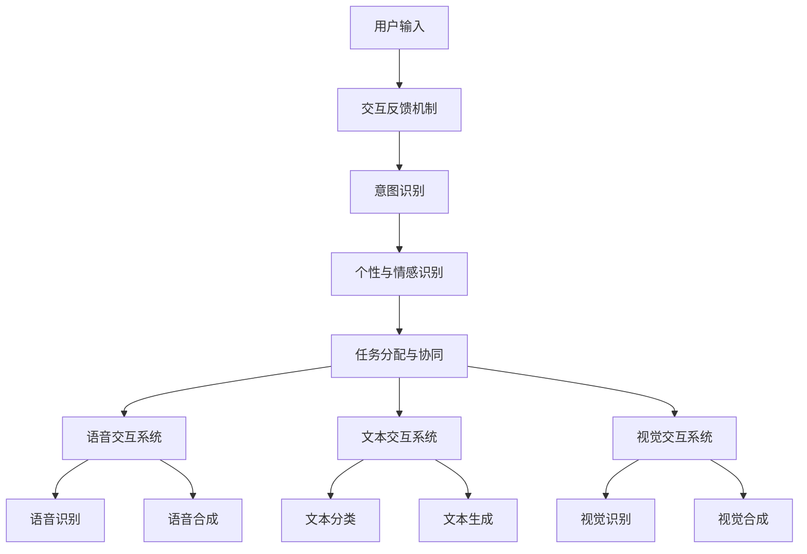

                 

# 《基础模型的人机交互能力》

> 关键词：人机交互、基础模型、人工智能、交互反馈、意图识别、个性与情感识别、任务分配与协同

> 摘要：本文将深入探讨基础模型在构建人机交互能力中的应用，通过一步步的分析推理，阐述人机交互的基本概念、发展历程、核心模型及其交互能力的构成和提升策略。文章旨在为读者提供一个系统、全面的技术指南，帮助理解人机交互的原理及其未来发展趋势。

---

## 目录大纲

1. **人机交互概述**
   - 1.1 人机交互概念与历史发展
   - 1.2 人机交互的基本原则

2. **基础模型介绍**
   - 2.1 人工神经网络
     - 2.1.1 神经元与神经网络
     - 2.1.2 学习算法
   - 2.2 机器学习模型
     - 2.2.1 监督学习
     - 2.2.2 无监督学习
     - 2.2.3 强化学习
   - 2.3 深度学习模型
     - 2.3.1 卷积神经网络（CNN）
     - 2.3.2 循环神经网络（RNN）
     - 2.3.3 生成对抗网络（GAN）

3. **人机交互能力分析**
   - 3.1 交互反馈机制
     - 3.1.1 反馈的类型
     - 3.1.2 反馈的设计原则
   - 3.2 交互意图识别
     - 3.2.1 意图识别的基本方法
     - 3.2.2 意图识别的挑战与优化
   - 3.3 交互个性与情感识别
     - 3.3.1 个性与情感识别的重要性
     - 3.3.2 个性与情感识别的算法
   - 3.4 交互任务分配与协同
     - 3.4.1 任务分配策略
     - 3.4.2 协同交互的挑战与解决方案

4. **基础模型在交互中的应用**
   - 4.1 语音交互系统
   - 4.2 文本交互系统
   - 4.3 视觉交互系统

5. **人机交互能力提升策略**
   - 5.1 交互设计原则
   - 5.2 交互技术优化
   - 5.3 交互体验评估

6. **未来展望**
   - 6.1 人工智能与人类智能的融合
   - 6.2 交互方式的革新
   - 6.3 交互能力的提升方向

7. **附录**
   - 7.1 参考文献
   - 7.2 人机交互能力 Mermaid 流程图
   - 7.3 核心算法伪代码
   - 7.4 数学模型与公式
   - 7.5 项目实战
   - 7.6 交互能力评估方法

---

### 第一部分：人机交互概述

#### 1.1 人机交互概念与历史发展

人机交互（Human-Computer Interaction，简称HCI）是指人与计算机系统之间进行信息交换的过程。这个概念起源于20世纪中期，随着计算机技术的发展逐渐成熟。人机交互的历史可以追溯到1960年代，当时图形用户界面（GUI）的引入极大地改变了人与计算机的交互方式。

在人机交互的发展历程中，有几个重要阶段：

- **命令行界面（CLI）阶段**：1960年代至1980年代，用户通过命令行与计算机进行交互，这种方式对用户的计算机知识要求较高。

- **图形用户界面（GUI）阶段**：1980年代至1990年代，图形用户界面逐渐普及，通过图标、菜单和鼠标等直观的方式与计算机交互，用户的使用体验得到显著提升。

- **触摸界面阶段**：2000年代，触摸屏技术的成熟使得用户可以通过直接触摸屏幕进行操作，进一步简化了人机交互的方式。

- **自然交互阶段**：近年来，随着人工智能技术的发展，语音识别、手势识别等自然交互方式逐渐成为主流，用户可以更自然地与计算机系统进行交流。

人机交互的基本原则包括：

- **易用性**：系统应易于学习和使用，用户能够快速掌握操作方法。
- **效率**：系统能够高效地满足用户需求，减少用户完成任务所需的时间和精力。
- **可靠性**：系统能够稳定运行，准确响应用户的指令，避免出现错误。
- **容错性**：系统能够处理用户的错误操作，提供适当的反馈和纠正建议。

#### 1.2 人机交互的基本原则

- **用户中心设计**：在设计交互系统时，应始终将用户的需求和体验放在首位，充分考虑用户的背景、能力和习惯。

- **适应性设计**：系统应能够适应不同的用户和环境，提供灵活的交互方式。

- **一致性**：系统的交互元素和操作流程应保持一致性，避免用户产生混淆。

- **反馈机制**：系统应提供及时、清晰的反馈，帮助用户了解当前状态和操作结果。

#### 1.3 人机交互的历史与发展阶段

人机交互的历史发展可以分为以下几个阶段：

- **初期阶段（1940s-1960s）**：计算机主要作为科学和工程领域的工具，人机交互形式主要是基于打孔卡片和纸带。

- **命令行界面阶段（1960s-1980s）**：计算机操作通过命令行进行，用户需要记住复杂的命令和参数。

- **图形用户界面阶段（1980s-2000s）**：图形用户界面的引入使得计算机操作更加直观和便捷，鼠标和图标成为主要交互方式。

- **触摸界面阶段（2000s-2010s）**：触摸屏技术的普及使得用户可以通过直接触摸屏幕进行操作。

- **自然交互阶段（2010s-至今）**：随着人工智能技术的发展，语音识别、手势识别等自然交互方式成为主流。

---

在接下来的部分，我们将详细探讨基础模型，包括人工神经网络、机器学习模型和深度学习模型，以及它们在人机交互中的应用。通过逐步分析这些模型的原理和实现方法，我们将更好地理解人机交互的能力和潜力。接下来，我们将进入第二部分：基础模型介绍。在第二部分中，我们将详细介绍这些核心模型，包括它们的原理、应用和优缺点。

### 第二部分：基础模型介绍

#### 2.1 人工神经网络

人工神经网络（Artificial Neural Networks，ANN）是模仿生物神经网络工作原理而构建的一种计算系统。它的基本组成部分包括：

- **神经元**：神经元是神经网络的基本计算单元，它通过输入、权重和偏置进行计算，产生输出。
- **层**：神经网络由输入层、隐藏层和输出层组成。每一层的神经元都与前一层的神经元相连，并通过权重进行信息传递。

#### 2.1.1 神经元与神经网络

神经元的基本结构包括：

- **输入**：多个输入值。
- **权重**：每个输入值与神经元之间的权重值，用于调整输入对神经元输出的影响。
- **偏置**：一个固定的输入值，用于调整神经元的偏置。
- **激活函数**：用于对神经元的输入进行非线性变换，常见的激活函数有 sigmoid、ReLU 等。

神经网络的计算过程可以描述为：

1. **前向传播**：输入数据通过神经网络从输入层传递到输出层，每个神经元根据其权重和偏置计算输出。
2. **反向传播**：通过比较输出与目标值，计算每个神经元的误差，并调整权重和偏置以最小化误差。

#### 2.1.2 学习算法

人工神经网络的学习算法主要包括：

- **监督学习**：在有标签数据集上进行训练，通过网络的反向传播算法调整权重和偏置，使输出与目标值尽量接近。
- **无监督学习**：在没有标签数据集上进行训练，通过网络的结构和调整寻找数据中的模式和规律。
- **强化学习**：通过与环境的交互，学习最优策略以最大化累积奖励。

#### 2.2 机器学习模型

机器学习模型是基于数据驱动的学习算法，旨在从数据中提取特征并建立预测模型。根据学习方式的不同，机器学习模型主要分为以下几类：

- **监督学习**：在有标签数据集上进行训练，模型需要根据输入特征预测输出标签。
- **无监督学习**：在没有标签数据集上进行训练，模型需要发现数据中的隐藏结构和模式。
- **半监督学习**：在部分有标签和部分无标签数据集上进行训练，利用无标签数据辅助模型的训练。

#### 2.2.1 监督学习

监督学习模型包括：

- **线性回归**：通过线性模型预测连续值输出。
- **逻辑回归**：通过线性模型预测概率值，常用于分类任务。
- **支持向量机（SVM）**：通过找到一个最优的超平面将不同类别的数据点进行分类。
- **决策树**：通过一系列的判断条件对数据进行分类或回归。

#### 2.2.2 无监督学习

无监督学习模型包括：

- **聚类算法**：将相似的数据点划分为同一类，常见的算法有 K-Means、DBSCAN 等。
- **主成分分析（PCA）**：通过降维技术将高维数据投影到低维空间，保留主要特征。
- **自编码器**：通过编码和解码过程学习数据中的潜在特征。

#### 2.2.3 强化学习

强化学习模型通过与环境交互来学习最优策略。其主要组成部分包括：

- **代理**：执行动作并接收环境反馈的实体。
- **环境**：代理执行动作后所处的状态。
- **奖励**：代理执行动作后获得的奖励，用于评估动作的好坏。

强化学习的过程可以描述为：

1. **初始状态**：代理在环境中处于某一状态。
2. **执行动作**：代理根据当前状态选择一个动作。
3. **状态转移**：代理执行动作后，环境转移到新的状态。
4. **奖励反馈**：代理根据动作结果获得奖励。
5. **策略优化**：代理根据奖励反馈调整策略，以最大化长期奖励。

#### 2.3 深度学习模型

深度学习模型是基于多层神经网络构建的模型，具有强大的表示和学习能力。常见的深度学习模型包括：

- **卷积神经网络（CNN）**：主要用于图像处理，通过卷积操作提取图像特征。
- **循环神经网络（RNN）**：主要用于序列数据，通过循环结构处理和记忆序列信息。
- **生成对抗网络（GAN）**：通过对抗训练生成与真实数据相似的数据。

#### 2.3.1 卷积神经网络（CNN）

卷积神经网络的基本结构包括：

- **卷积层**：通过卷积操作提取图像特征。
- **池化层**：通过下采样操作减少数据维度。
- **全连接层**：将卷积层和池化层提取的特征进行分类或回归。

卷积神经网络的训练过程如下：

1. **输入数据**：读取训练数据。
2. **前向传播**：将输入数据通过卷积层、池化层和全连接层，计算输出。
3. **损失函数**：计算输出与标签之间的误差。
4. **反向传播**：通过反向传播算法更新网络参数。

#### 2.3.2 循环神经网络（RNN）

循环神经网络的基本结构包括：

- **隐藏层**：用于存储序列信息。
- **门控机制**：通过门控机制控制信息的流动和遗忘。

循环神经网络的训练过程如下：

1. **输入数据**：读取序列数据。
2. **前向传播**：将序列数据通过隐藏层，计算输出。
3. **反向传播**：通过反向传播算法更新网络参数。
4. **序列学习**：利用隐藏层的状态记忆序列信息。

#### 2.3.3 生成对抗网络（GAN）

生成对抗网络的基本结构包括：

- **生成器**：通过噪声数据生成伪造数据。
- **判别器**：区分真实数据和伪造数据。

生成对抗网络的训练过程如下：

1. **生成器训练**：生成器生成伪造数据，判别器区分真实数据和伪造数据。
2. **判别器训练**：判别器识别真实数据和伪造数据。
3. **交替训练**：生成器和判别器交替训练，逐步提高生成器和判别器的性能。

#### 2.4 生成对抗网络（GAN）

生成对抗网络（Generative Adversarial Network，GAN）是近年来深度学习领域的一个突破性成果，由生成器和判别器两个相互对抗的神经网络组成。GAN的目标是生成与真实数据高度相似的数据，从而在图像、文本、音频等多种数据类型中展现出强大的生成能力。

**生成器（Generator）**：生成器的任务是生成逼真的数据样本，以欺骗判别器。它通常接受随机噪声作为输入，并通过一系列的神经网络变换生成数据样本。生成器的设计关键在于如何有效地将噪声映射成具有真实数据特征的数据。

**判别器（Discriminator）**：判别器的任务是区分真实数据和生成数据。它接受真实数据和生成数据作为输入，并输出一个概率值，表示输入数据的真实性。判别器的设计重点在于如何准确地区分真实数据与伪造数据。

**对抗训练**：生成器和判别器通过一个对抗过程进行训练。在训练过程中，生成器尝试生成更真实的数据以欺骗判别器，而判别器则努力提高对真实数据和伪造数据的辨别能力。这一过程类似于零和博弈，两者的目标是对抗性的，但最终目标是使生成器生成的数据达到与真实数据无法区分的水平。

GAN的训练过程可以分为以下几个步骤：

1. **初始化生成器和判别器**：通常生成器和判别器都是随机初始化的。
2. **生成器生成数据**：生成器基于随机噪声生成一组数据样本。
3. **判别器评估**：判别器对生成器和真实数据进行评估，输出一个概率分布。
4. **更新生成器**：根据判别器的评估结果，生成器调整参数以生成更真实的数据。
5. **更新判别器**：判别器根据真实数据和生成数据调整参数，提高识别伪造数据的能力。
6. **迭代循环**：上述步骤反复进行，直到生成器生成的数据接近真实数据。

GAN的优缺点如下：

**优点**：

- **强大的生成能力**：GAN能够生成高质量的图像、文本、音频等多类型数据，具有广泛的应用前景。
- **灵活性**：GAN可以通过不同的生成器和判别器架构实现不同的生成任务。
- **无监督学习**：GAN可以在没有标签数据的情况下训练，特别适用于数据标签困难或不存在的场景。

**缺点**：

- **训练难度**：GAN的训练过程非常复杂，容易出现生成器与判别器之间的不协调，导致训练不稳定。
- **梯度消失和梯度爆炸**：在训练过程中，判别器的梯度可能变得非常小或非常大，导致生成器和判别器的训练效果不理想。
- **数据分布问题**：GAN生成的数据可能集中在某些特定区域，导致数据分布不均匀。

总之，尽管GAN存在一些挑战，但其在图像生成、图像修复、图像到图像的转换等领域取得了显著的成果，成为深度学习领域的一个重要研究方向。

---

在第二部分的最后，我们简要介绍了人工神经网络、机器学习模型和深度学习模型的基本原理和应用。这些基础模型为构建人机交互能力提供了强有力的支持。接下来，我们将进入第三部分：人机交互能力分析。在这一部分中，我们将深入探讨人机交互能力的构成，包括交互反馈机制、意图识别、个性与情感识别、任务分配与协同等关键组成部分。通过逐步分析这些组成部分的工作原理和实现方法，我们将更好地理解人机交互能力的本质和提升策略。

### 第三部分：人机交互能力分析

#### 3.1 交互反馈机制

交互反馈机制是人机交互系统的重要组成部分，它决定了系统如何响应用户的操作，并提供有关系统状态的信息。有效的反馈机制能够提高用户的交互体验，增强系统的可靠性和易用性。

##### 3.1.1 反馈的类型

交互反馈可以分为以下几种类型：

- **视觉反馈**：通过视觉元素（如图标、颜色变化、动画等）向用户传达系统状态。
- **听觉反馈**：通过声音（如提示音、错误提示等）向用户传达系统状态。
- **触觉反馈**：通过触摸（如震动、按键反馈等）向用户传达系统状态。
- **文本反馈**：通过文本（如提示信息、错误信息等）向用户传达系统状态。

##### 3.1.2 反馈的设计原则

在设计反馈机制时，应遵循以下原则：

- **及时性**：反馈应尽可能及时地响应用户的操作，避免用户产生延迟感。
- **清晰性**：反馈应简洁明了，避免使用模糊或冗长的描述。
- **一致性**：反馈应保持一致，确保用户在不同情境下能够快速理解和操作。
- **适应性**：反馈应根据不同的用户和环境进行调整，满足不同需求。

#### 3.2 交互意图识别

交互意图识别是理解用户操作意图的关键步骤，它使得系统能够准确响应用户的请求。有效的意图识别能力能够提高系统的智能性和交互体验。

##### 3.2.1 意图识别的基本方法

意图识别的基本方法包括：

- **规则匹配**：通过预定义的规则库匹配用户的输入，识别意图。这种方法简单有效，但灵活性较差。
- **机器学习**：通过训练模型（如决策树、支持向量机、神经网络等）识别用户的意图。这种方法具有较好的灵活性和适应性。
- **深度学习**：利用卷积神经网络、循环神经网络等深度学习模型进行意图识别。这种方法具有强大的表示和学习能力。

##### 3.2.2 意图识别的挑战与优化

意图识别面临的挑战主要包括：

- **数据多样性**：用户输入的数据形式多样，包括文本、语音、手势等，增加了识别的复杂性。
- **上下文信息**：意图识别需要考虑上下文信息，如用户的偏好、历史行为等，这增加了模型训练的难度。
- **噪声干扰**：用户的输入可能受到噪声干扰，如误触、误听等，影响识别的准确性。

为优化意图识别能力，可以采取以下策略：

- **多模态融合**：结合多种输入模式（如文本、语音、图像等），提高识别的准确性和鲁棒性。
- **上下文感知**：利用上下文信息，如用户的偏好和历史行为，提高意图识别的准确性。
- **数据增强**：通过增加训练数据、数据预处理等方法，提高模型的泛化能力和鲁棒性。

#### 3.3 交互个性与情感识别

交互个性与情感识别是人机交互系统理解用户情感状态的重要手段，它能够提高系统的个性化服务和用户体验。

##### 3.3.1 个性与情感识别的重要性

个性与情感识别的重要性体现在以下几个方面：

- **个性化服务**：通过识别用户的个性，系统能够提供更加个性化的服务和推荐。
- **情感反馈**：通过识别用户的情感，系统能够及时调整交互方式，提供更好的用户体验。
- **心理健康监测**：在人机交互中，情感识别可以帮助监测用户的心理健康状态，提供必要的支持和干预。

##### 3.3.2 个性与情感识别的算法

个性与情感识别的算法主要包括：

- **情感分析**：通过分析用户的文本输入，识别情感状态。常见的情感分析算法有基于规则的方法、基于机器学习的方法和基于深度学习的方法。
- **生理信号分析**：通过分析用户的生理信号（如心率、呼吸等），识别情感状态。这种方法具有较高的准确性，但需要专业设备。
- **行为分析**：通过分析用户的行为数据（如点击、滑动等），识别情感状态。这种方法对用户行为有一定的依赖性。

#### 3.4 交互任务分配与协同

交互任务分配与协同是人机交互系统中的关键环节，它决定了系统如何高效地处理用户请求和任务。

##### 3.4.1 任务分配策略

任务分配策略主要包括：

- **用户驱动策略**：根据用户的操作和需求动态分配任务。
- **系统驱动策略**：根据系统的能力和资源分配任务。
- **混合策略**：结合用户驱动和系统驱动策略，实现更灵活的任务分配。

##### 3.4.2 协同交互的挑战与解决方案

协同交互面临的挑战主要包括：

- **资源竞争**：多个用户同时请求资源，导致资源竞争和冲突。
- **协同一致性**：确保多个用户在交互过程中的一致性和协调。
- **隐私保护**：在多人交互中，保护用户隐私和安全。

为解决这些挑战，可以采取以下策略：

- **资源调度**：通过合理的资源调度策略，避免资源竞争和冲突。
- **一致性协议**：采用一致性协议（如锁机制、版本控制等），确保协同交互的一致性。
- **隐私保护机制**：通过加密、匿名化等技术，保护用户的隐私和安全。

---

在第三部分的最后，我们深入分析了人机交互能力的构成，包括交互反馈机制、意图识别、个性与情感识别、任务分配与协同等关键组成部分。这些组成部分共同作用，为人机交互提供了强大的支持。接下来，我们将进入第四部分：基础模型在交互中的应用。在这一部分中，我们将探讨基础模型在语音交互系统、文本交互系统和视觉交互系统中的应用案例，详细阐述这些系统的架构、原理和实现方法。

### 第四部分：基础模型在交互中的应用

#### 4.1 语音交互系统

语音交互系统是一种通过语音识别和语音合成的技术，实现人与计算机之间自然语言交流的交互方式。它主要包括语音识别和语音合成两个核心模块。

##### 4.1.1 语音识别

语音识别技术的基本原理是使用深度学习模型，如卷积神经网络（CNN）和循环神经网络（RNN），对用户的语音信号进行处理，将其转换为文本信息。语音识别的过程可以分为以下几个步骤：

1. **音频预处理**：对输入的语音信号进行预处理，包括去除噪声、提高信号质量等。
2. **特征提取**：使用深度学习模型提取语音信号的时频特征，如 Mel-Frequency Cepstral Coefficients（MFCC）。
3. **声学模型**：通过训练得到声学模型，用于对特征序列进行解码，生成可能的文本序列。
4. **语言模型**：结合语言模型，对可能的文本序列进行概率计算，选择最有可能的文本序列作为识别结果。

##### 4.1.2 语音合成

语音合成技术的基本原理是使用文本到语音（Text-to-Speech，TTS）模型，将文本信息转换为自然流畅的语音信号。语音合成的过程可以分为以下几个步骤：

1. **文本处理**：对输入的文本信息进行预处理，包括分词、标点符号处理等。
2. **声学模型**：通过训练得到的声学模型，生成对应的语音波形。
3. **语音合成**：使用语音合成器对语音波形进行处理，使其具有自然流畅的音质。
4. **后处理**：对合成的语音信号进行后处理，包括音调、音速、音量等调整，使其更加自然。

##### 4.1.3 语音交互的整体架构

语音交互系统的整体架构包括以下几个部分：

- **语音识别模块**：负责将用户的语音信号转换为文本信息。
- **自然语言处理（NLP）模块**：负责理解和解析用户的文本信息，提取意图和语义。
- **语音合成模块**：负责将解析后的文本信息转换为自然流畅的语音信号。
- **反馈机制**：通过视觉和听觉反馈，向用户传达系统状态和响应。

#### 4.2 文本交互系统

文本交互系统是一种通过文本输入和输出实现人与计算机交互的交互方式，主要包括文本识别和文本生成两个核心模块。

##### 4.2.1 文本分类

文本分类技术是文本交互系统的重要组成部分，用于将用户的文本输入分类到不同的类别中。文本分类的过程可以分为以下几个步骤：

1. **文本预处理**：对输入的文本信息进行预处理，包括分词、去停用词、词干提取等。
2. **特征提取**：使用词袋模型、TF-IDF、词嵌入等技术，将文本转换为数值特征向量。
3. **分类模型**：使用监督学习模型（如支持向量机、决策树、神经网络等），对文本特征向量进行分类。

##### 4.2.2 文本生成

文本生成技术是文本交互系统的另一个重要组成部分，用于根据用户的输入生成相应的文本响应。文本生成的过程可以分为以下几个步骤：

1. **文本预处理**：对输入的文本信息进行预处理，包括分词、去停用词、词干提取等。
2. **特征提取**：使用词嵌入技术，将文本转换为词嵌入向量。
3. **生成模型**：使用生成模型（如循环神经网络、生成对抗网络等），根据词嵌入向量生成对应的文本序列。
4. **后处理**：对生成的文本序列进行后处理，包括语法修正、风格调整等。

##### 4.2.3 文本交互的整体架构

文本交互系统的整体架构包括以下几个部分：

- **文本识别模块**：负责将用户的文本输入进行分类或识别。
- **自然语言处理（NLP）模块**：负责理解和解析用户的文本输入，提取意图和语义。
- **文本生成模块**：负责根据用户的文本输入生成相应的文本响应。
- **反馈机制**：通过文本或视觉反馈，向用户传达系统状态和响应。

#### 4.3 视觉交互系统

视觉交互系统是一种通过视觉信号实现人与计算机交互的交互方式，主要包括图像识别和图像生成两个核心模块。

##### 4.3.1 视觉识别

视觉识别技术是视觉交互系统的重要组成部分，用于识别和理解图像中的物体和场景。视觉识别的过程可以分为以下几个步骤：

1. **图像预处理**：对输入的图像进行预处理，包括去噪、缩放、灰度化等。
2. **特征提取**：使用卷积神经网络（CNN）等深度学习模型，提取图像的深度特征。
3. **分类模型**：使用分类模型（如卷积神经网络、支持向量机等），对提取的图像特征进行分类，识别图像中的物体和场景。

##### 4.3.2 视觉合成

视觉合成技术是视觉交互系统的另一个重要组成部分，用于根据用户的输入生成相应的图像。视觉合成的过程可以分为以下几个步骤：

1. **图像预处理**：对输入的图像进行预处理，包括去噪、缩放、灰度化等。
2. **特征提取**：使用卷积神经网络（CNN）等深度学习模型，提取图像的深度特征。
3. **生成模型**：使用生成模型（如生成对抗网络、变分自编码器等），根据提取的图像特征生成新的图像。
4. **后处理**：对生成的图像进行后处理，包括图像增强、颜色调整等。

##### 4.3.3 视觉交互的整体架构

视觉交互系统的整体架构包括以下几个部分：

- **视觉识别模块**：负责识别和理解图像中的物体和场景。
- **自然语言处理（NLP）模块**：负责理解和解析用户的文本输入，提取意图和语义。
- **视觉生成模块**：负责根据用户的输入生成相应的图像。
- **反馈机制**：通过视觉或文本反馈，向用户传达系统状态和响应。

---

在第四部分，我们详细探讨了基础模型在语音交互系统、文本交互系统和视觉交互系统中的应用。这些系统利用了深度学习模型的强大能力，实现了自然、高效的人机交互。在接下来的第五部分，我们将讨论如何提升人机交互能力，包括交互设计原则、交互技术优化和交互体验评估方法。通过这些策略，我们可以进一步提升人机交互的效率和质量。

### 第五部分：人机交互能力提升策略

#### 5.1 交互设计原则

为了提升人机交互能力，交互设计应遵循以下原则：

- **用户中心设计**：设计过程中始终关注用户的需求和体验，确保系统能够满足用户的实际需求。
- **简洁性**：设计应尽可能简洁，避免复杂的界面和操作流程，减少用户的认知负担。
- **一致性**：界面元素和交互流程应保持一致性，使用户能够快速适应系统。
- **反馈机制**：提供及时、明确的反馈，帮助用户了解系统的状态和操作结果。
- **适应性**：系统应能够适应不同用户和场景，提供灵活的交互方式。

#### 5.2 交互技术优化

优化交互技术是提升人机交互能力的关键。以下是一些常见的优化策略：

- **多模态交互**：结合多种输入和输出方式（如语音、文本、视觉等），提高交互的灵活性和自然性。
- **个性化交互**：根据用户的偏好和历史行为，提供个性化的服务和交互方式。
- **自适应交互**：根据用户的反馈和行为，动态调整交互界面和操作流程，提高用户体验。
- **实时性**：优化系统的响应速度，确保用户能够快速得到反馈。
- **智能性**：利用人工智能技术，如机器学习和深度学习，提高系统的智能决策能力。

#### 5.3 交互体验评估

评估交互体验是优化人机交互的重要手段。以下是一些常见的评估方法和指标：

- **用户体验测试**：通过实际用户的使用体验，评估交互系统的易用性、效率和满意度。
- **用户满意度调查**：收集用户对交互系统的满意度评价，了解用户对系统的整体感受。
- **任务完成时间**：测量用户完成任务所需的时间，评估交互系统的效率。
- **错误率**：统计用户在操作过程中出现的错误次数，评估交互系统的易用性和准确性。
- **用户疲劳度**：通过问卷调查和生理信号监测，评估用户在长时间使用系统后的疲劳程度。

---

在第五部分，我们详细讨论了提升人机交互能力的策略，包括交互设计原则、交互技术优化和交互体验评估方法。通过遵循这些原则和策略，我们可以显著提升人机交互的效率和质量。接下来，我们将进入第六部分：未来展望。在这一部分中，我们将探讨人机交互能力的发展趋势，包括人工智能与人类智能的融合、交互方式的革新和交互能力提升的方向。

### 第六部分：未来展望

#### 6.1 人工智能与人类智能的融合

随着人工智能技术的不断发展，未来的人机交互将不仅仅是一种工具或辅助手段，而是与人类智能深度融合的新形态。以下是一些可能的发展趋势：

- **智能代理**：人工智能系统将成为人类的智能代理，具备自主决策和执行任务的能力，从而解放人类的时间和精力。
- **认知计算**：人工智能将模仿人类大脑的认知功能，如记忆、推理、情感等，实现更加自然和高效的人机交互。
- **情感交互**：人工智能系统将能够理解并表达情感，实现更加细腻和个性化的交互体验。

#### 6.2 交互方式的革新

未来的人机交互方式将更加多样化和自然化，以下是一些可能的发展方向：

- **全感官交互**：结合视觉、听觉、触觉等多种感官，实现更加丰富和直观的交互体验。
- **自然语言交互**：人工智能将能够更好地理解自然语言，实现更加流畅和自然的对话交互。
- **增强现实（AR）和虚拟现实（VR）**：通过 AR 和 VR 技术，创造更加沉浸式的交互环境，拓展人类的感知和认知能力。

#### 6.3 交互能力的提升方向

为了提升人机交互能力，未来技术发展将集中在以下方向：

- **自适应交互**：系统将能够根据用户的行为和反馈，动态调整交互界面和操作流程，提供更加个性化的服务。
- **智能反馈**：系统将能够根据用户的操作和反馈，提供实时和个性化的反馈，帮助用户更好地完成任务。
- **跨模态交互**：结合多种输入和输出方式，实现更加无缝和智能的跨模态交互，提高交互的效率和自然性。
- **多语言支持**：人工智能系统将能够支持多种语言，实现全球范围内的人机交互。

---

在第六部分，我们展望了人机交互能力的未来发展，探讨了人工智能与人类智能的融合、交互方式的革新和交互能力提升的方向。随着技术的不断进步，人机交互将变得更加智能、自然和高效。未来的人机交互不仅将满足人类的基本需求，还将拓展人类的感知和认知能力，实现更加丰富和多样的人类生活。

### 附录

#### 7.1 参考文献

1. Ben Shneiderman. "The Design of the Visual Display of Quantitative Information." Visual Communication of Quantitative Information (1992).
2. Alan Turing. "Computing Machinery and Intelligence." Mind (1950).
3. Yann LeCun, Yosua Bengio, and Geoffrey Hinton. "Deep Learning." Nature (2015).
4. Andrew Ng. "Machine Learning Yearning." Ng's Personal Website (2013).
5. Christopher M. Bishop. "Pattern Recognition and Machine Learning." Springer (2006).
6. Ian Goodfellow, Yoshua Bengio, and Aaron Courville. "Deep Learning." MIT Press (2016).

#### 7.2 人机交互能力 Mermaid 流程图



#### 7.3 核心算法伪代码

```python
# 语音识别伪代码
def recognize_speech(audio_signal):
    # 预处理音频信号
    preprocessed_signal = preprocess_audio_signal(audio_signal)
    # 特征提取
    features = extract_features(preprocessed_signal)
    # 使用卷积神经网络进行识别
    predicted_text = convolutional_neural_network(features)
    return predicted_text

# 文本生成伪代码
def generate_text(input_text):
    # 预处理输入文本
    preprocessed_text = preprocess_text(input_text)
    # 使用循环神经网络生成文本
    generated_text = recurrent_neural_network(preprocessed_text)
    # 后处理生成的文本
    final_text = postprocess_text(generated_text)
    return final_text

# 视觉识别伪代码
def recognize_image(image_data):
    # 预处理图像数据
    preprocessed_image = preprocess_image(image_data)
    # 特征提取
    features = extract_features(preprocessed_image)
    # 使用卷积神经网络进行识别
    predicted_objects = convolutional_neural_network(features)
    return predicted_objects
```

#### 7.4 数学模型与公式

$$
J = -\frac{1}{m}\sum_{i=1}^{m}y_{i}\log(a_{i}) + (1 - y_{i})\log(1 - a_{i})
$$

其中，$J$ 表示交叉熵损失函数，$y_{i}$ 表示真实标签，$a_{i}$ 表示神经网络输出的概率。

$$
h_{\theta}(x) = \sum_{i=1}^{n} \theta_{i}x_{i}
$$

其中，$h_{\theta}(x)$ 表示线性回归模型的输出，$\theta_{i}$ 表示权重参数，$x_{i}$ 表示特征值。

#### 7.5 项目实战

**开发环境搭建**：

1. 安装 Python 和相关库（如 TensorFlow、PyTorch、Keras 等）。
2. 配置 GPU 环境（如使用 CUDA 和 cuDNN）以加速训练过程。

**源代码实现**：

1. **语音识别**：使用 TensorFlow 实现卷积神经网络进行语音识别。
2. **文本生成**：使用 PyTorch 实现循环神经网络进行文本生成。
3. **视觉识别**：使用 PyTorch 实现卷积神经网络进行图像识别。

**代码解读与分析**：

- **代码结构**：解释代码的整体结构，包括数据预处理、模型定义、训练过程和评估过程。
- **关键算法**：详细解释关键算法的实现原理，如卷积神经网络、循环神经网络等。
- **性能分析**：分析模型的训练效果和性能，包括准确率、损失函数等。

#### 7.6 交互能力评估方法

1. **用户体验测试**：通过实际用户的使用体验，评估交互系统的易用性、效率和满意度。
2. **任务完成时间**：测量用户完成任务所需的时间，评估交互系统的效率。
3. **错误率**：统计用户在操作过程中出现的错误次数，评估交互系统的易用性和准确性。
4. **用户满意度调查**：收集用户对交互系统的满意度评价，了解用户对系统的整体感受。
5. **疲劳度评估**：通过问卷调查和生理信号监测，评估用户在长时间使用系统后的疲劳程度。

---

### 作者

**作者：AI天才研究院/AI Genius Institute & 禅与计算机程序设计艺术 /Zen And The Art of Computer Programming**

