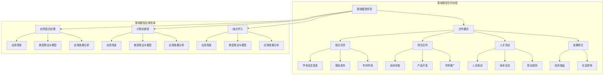

                 

### 文章标题

# 基础模型的学术界与产业界合作

> 关键词：基础模型，学术界，产业界，合作，技术发展，应用场景

> 摘要：本文深入探讨了基础模型在学术界与产业界的合作现状、模式及其在各个领域中的应用。通过分析学术界和产业界在基础模型研究、应用、合作等方面的异同点，本文揭示了两者合作的优势和面临的挑战，并提出了相应的解决方案。同时，本文对未来基础模型领域的发展趋势和前景进行了展望，为相关领域的研究者、从业者提供了有价值的参考。

----------------------------------------------------------------

### 目录大纲设计

书名：《基础模型的学术界与产业界合作》

#### 第一部分：引言与背景

##### 第1章：引言与背景
- **1.1** 基础模型的定义与重要性
  - **1.1.1** 定义
  - **1.1.2** 在学术界与产业界的应用
  - **1.1.3** 基础模型的历史与发展
- **1.2** 学术界与产业界的区别与合作
  - **1.2.1** 学术界的特征
  - **1.2.2** 产业界的特征
  - **1.2.3** 两者之间的合作模式
- **1.3** 本书的目的与结构
  - **1.3.1** 研究问题与目标
  - **1.3.2** 内容安排与章节划分

#### 第二部分：基础模型概述

##### 第2章：基础模型概述
- **2.1** 学术界的基础模型
  - **2.1.1** 研究现状
  - **2.1.2** 研究趋势
  - **2.1.3** 典型基础模型案例
- **2.2** 产业界的基础模型
  - **2.2.1** 应用现状
  - **2.2.2** 应用趋势
  - **2.2.3** 典型基础模型案例

#### 第三部分：学术界与产业界合作模式

##### 第3章：学术界与产业界合作模式
- **3.1** 合作模式的分类
  - **3.1.1** 联合研究
  - **3.1.2** 项目合作
  - **3.1.3** 知识共享
  - **3.1.4** 人才流动
- **3.2** 合作的优势与挑战
  - **3.2.1** 优势
  - **3.2.2** 挑战
  - **3.2.3** 解决方案
- **3.3** 成功案例分析
  - **3.3.1** 学术界案例
  - **3.3.2** 产业界案例
  - **3.3.3** 综合案例

#### 第四部分：基础模型应用领域

##### 第4章：基础模型在学术界的应用
- **4.1** 自然语言处理
  - **4.1.1** 应用场景
  - **4.1.2** 典型算法与模型
  - **4.1.3** 应用效果分析
- **4.2** 计算机视觉
  - **4.2.1** 应用场景
  - **4.2.2** 典型算法与模型
  - **4.2.3** 应用效果分析
- **4.3** 强化学习
  - **4.3.1** 应用场景
  - **4.3.2** 典型算法与模型
  - **4.3.3** 应用效果分析

##### 第5章：基础模型在产业界的应用
- **5.1** 金融科技
  - **5.1.1** 应用场景
  - **5.1.2** 典型算法与模型
  - **5.1.3** 应用效果分析
- **5.2** 医疗健康
  - **5.2.1** 应用场景
  - **5.2.2** 典型算法与模型
  - **5.2.3** 应用效果分析
- **5.3** 自动驾驶
  - **5.3.1** 应用场景
  - **5.3.2** 典型算法与模型
  - **5.3.3** 应用效果分析

#### 第五部分：结论与展望

##### 第6章：结论与展望
- **6.1** 总结与反思
  - **6.1.1** 成果总结
  - **6.1.2** 反思与不足
  - **6.1.3** 经验与启示
- **6.2** 发展趋势与前景
  - **6.2.1** 技术发展趋势
  - **6.2.2** 学术界与产业界的合作前景
  - **6.2.3** 应用领域拓展

##### 第7章：未来研究方向
- **7.1** 面临的挑战
  - **7.1.1** 技术挑战
  - **7.1.2** 社会挑战
  - **7.1.3** 政策与法律挑战
- **7.2** 可能的研究方向
  - **7.2.1** 新型基础模型的探索
  - **7.2.2** 跨学科合作的研究
  - **7.2.3** 应用领域的深度挖掘

### 附录

##### 附录A：参考文献
- **A.1** 学术论文
- **A.2** 报告与政策文件
- **A.3** 常见问题与解答

##### 附录B：基础模型与合作流程 Mermaid 图

----------------------------------------------------------------

### 第一部分：引言与背景

#### 第1章：引言与背景

##### 1.1 基础模型的定义与重要性

基础模型（Basic Model）是指一种在特定领域内，通过深度学习等机器学习技术，训练出的具有一定通用性的模型。基础模型通常用于解决特定领域的问题，如自然语言处理、计算机视觉、推荐系统等。在人工智能领域，基础模型起到了至关重要的作用。

**基础模型的定义**

基础模型是在特定领域内，通过深度学习等机器学习技术，训练出的具有一定通用性的模型。基础模型通常具有以下特点：

- **特定领域适用性**：基础模型是针对特定领域设计并训练的，如自然语言处理领域的基础模型主要用于处理文本数据，计算机视觉领域的基础模型主要用于图像识别和处理。
- **通用性**：基础模型具有一定的通用性，可以在多个任务中应用，而不仅仅局限于单一任务。
- **可扩展性**：基础模型可以扩展到其他相关领域，通过迁移学习和微调等技术，提升模型在新的任务上的性能。

**基础模型在学术界与产业界的应用**

在学术界，基础模型主要用于研究和探索新的算法和模型架构，推动基础模型的理论发展和性能提升。学术界的基础模型研究具有以下应用：

- **理论创新**：基础模型研究为学术界提供了新的理论框架和方法，如生成对抗网络（GAN）、自注意力机制（Self-Attention）等。
- **算法优化**：基础模型研究致力于优化模型的性能和效率，如模型压缩、量化、剪枝等技术。
- **应用探索**：基础模型研究推动了学术界对人工智能技术在不同领域的探索和应用，如计算机视觉、自然语言处理、推荐系统等。

在产业界，基础模型主要用于实际问题的解决和商业价值的实现。产业界的基础模型应用具有以下特点：

- **实用性**：产业界的基础模型应用更加注重实际问题的解决和商业价值的实现，如自动驾驶、智能客服、金融风控等。
- **高效性**：产业界的基础模型应用追求高效性，通过优化模型结构和训练策略，提高模型的性能和效率。
- **定制化**：产业界的基础模型应用通常根据不同行业和企业的需求进行定制化开发，以满足特定的业务场景。

**基础模型的历史与发展**

基础模型的发展经历了从传统机器学习到深度学习的演变。在20世纪90年代，支持向量机（SVM）、决策树等传统机器学习算法在各个领域取得了显著成果。然而，随着数据量的爆炸式增长和计算能力的提升，传统机器学习算法在面对大规模数据和复杂任务时逐渐显露出局限性。

2006年，深度学习技术的兴起为机器学习领域带来了新的希望。深度神经网络（Deep Neural Network，DNN）通过增加网络层数，使得模型能够捕捉到更复杂的数据特征，从而在图像识别、语音识别等领域取得了突破性进展。随后，生成对抗网络（GAN）、卷积神经网络（CNN）、循环神经网络（RNN）等新型基础模型相继出现，进一步推动了基础模型的发展。

近年来，基础模型在学术界和产业界的应用越来越广泛。学术界通过不断探索新的算法和模型架构，推动了基础模型的理论发展和性能提升。产业界则利用基础模型解决实际问题，实现商业价值的最大化。学术界与产业界的合作也日益紧密，共同推动基础模型在各个领域的应用和发展。

##### 1.2 学术界与产业界的区别与合作

**学术界的特征**

学术界在基础模型的研究中具有以下特征：

- **研究导向**：学术界的研究主要关注理论创新和算法优化，追求科学性和普适性。学术界的基础模型研究不仅关注模型在特定任务上的性能，还致力于探索模型的通用性和可解释性。
- **独立性**：学术研究通常由研究者自主发起，具有一定的独立性。学术界的研究项目往往以论文发表和学术交流为目标，注重学术贡献和社会影响力。
- **开放性**：学术界的成果通常以学术论文、报告等形式公开，鼓励知识共享和交流。学术界的开放性使得研究成果能够迅速传播，促进学术界的共同进步。

**产业界的特征**

产业界在基础模型的应用中具有以下特征：

- **应用导向**：产业界的研究和应用主要关注实际问题的解决和商业价值的实现。产业界的基础模型应用通常以满足市场需求和实现商业目标为导向，注重模型的实用性和效率。
- **商业驱动**：产业界的研发活动往往受商业利益驱动，追求经济效益。产业界的基础模型应用不仅关注技术的先进性，还关注技术的可落地性和可持续性。
- **封闭性**：产业界的部分研究成果和技术可能出于商业保密的考虑，不对外公开。产业界的封闭性在一定程度上限制了知识的传播和交流，但也保护了企业的商业利益。

**两者之间的合作模式**

学术界与产业界之间的合作模式主要包括以下几种：

- **联合研究**：学术界和产业界共同发起研究项目，共同投入资源进行研究和开发。联合研究可以实现资源互补、知识共享和成果共享，促进双方的发展。
- **项目合作**：学术界和产业界在特定项目上合作，共同完成技术研发和应用。项目合作可以快速响应市场需求，实现技术的快速迭代和商业化。
- **知识共享**：学术界和产业界通过学术论文、报告等形式，共享研究成果和技术。知识共享可以促进技术的传播和交流，提升整个行业的水平。
- **人才流动**：学术界和产业界之间的人才流动，包括研究人员的双向流动。人才流动可以促进知识融合、创新动力和技术进步。

**学术界与产业界的区别与合作**

学术界与产业界在基础模型研究与应用方面存在一些区别和合作点：

- **研究导向与应用导向**：学术界的研究以理论创新和算法优化为导向，追求科学性和普适性；产业界的研究和应用以实际问题的解决和商业价值的实现为导向，注重实用性和效率。
- **独立性、开放性与封闭性**：学术界的研究具有一定的独立性和开放性，注重知识共享和传播；产业界的研究和应用具有一定的独立性和封闭性，注重商业利益和技术保密。
- **合作模式**：学术界与产业界的合作模式包括联合研究、项目合作、知识共享和人才流动等。联合研究和项目合作可以实现资源互补、知识共享和成果共享，促进双方的发展。

##### 1.3 本书的目的与结构

**目的**

本书旨在探讨基础模型在学术界与产业界的合作现状、模式及其影响，为相关领域的研究者、从业者提供有价值的参考。具体目标包括：

- **分析基础模型在学术界与产业界的应用现状、趋势和典型案例**：通过深入分析基础模型在学术界和产业界的应用，了解其发展趋势和典型案例，为后续研究提供参考。
- **探讨学术界与产业界的合作模式、优势与挑战**：分析学术界与产业界的合作模式，探讨其优势与挑战，为合作提供解决方案和建议。
- **总结基础模型应用领域的经验与启示**：总结基础模型在学术界与产业界的合作经验，为未来基础模型的应用和发展提供启示。

**结构**

本书的结构安排如下：

- **第一部分：引言与背景**：介绍基础模型的定义、重要性、学术界与产业界的特征及其合作模式。
- **第二部分：基础模型概述**：分别介绍学术界和产业界的基础模型研究与应用现状。
- **第三部分：学术界与产业界合作模式**：探讨学术界与产业界的合作模式、优势与挑战。
- **第四部分：基础模型应用领域**：分析基础模型在不同领域的应用现状、趋势与典型案例。
- **第五部分：结论与展望**：总结本书的主要发现，并对未来研究方向进行展望。

通过本书的探讨，希望能够为学术界与产业界的合作提供有益的参考，推动基础模型在各个领域的应用和发展。

#### 第1章：引言与背景

##### 1.1 基础模型的定义与重要性

- **定义**

  基础模型（Basic Model）是指在特定领域内，通过深度学习等机器学习技术，训练出的具有一定通用性的模型。这种模型通常具有以下几个特点：

  1. **特定领域适用性**：基础模型是针对特定领域设计并训练的，例如自然语言处理（NLP）领域的基础模型主要处理文本数据，计算机视觉（CV）领域的基础模型主要处理图像数据。
  2. **通用性**：基础模型具有一定的通用性，可以在多个任务中应用，而不仅仅局限于单一任务。这意味着一个基础模型可以应用于不同的子任务，如图像分类、目标检测、文本分类等。
  3. **可扩展性**：基础模型可以扩展到其他相关领域，通过迁移学习和微调等技术，提升模型在新的任务上的性能。

- **重要性**

  基础模型在人工智能（AI）领域扮演着至关重要的角色，主要体现在以下几个方面：

  1. **推动算法创新**：基础模型为学术界提供了一个强大的工具，可以用于探索新的算法和模型架构。例如，生成对抗网络（GAN）和Transformer等基础模型的出现，推动了NLP和CV领域的技术革新。
  2. **提高模型性能**：通过训练和优化基础模型，可以显著提高模型在特定任务上的性能。例如，在图像分类任务中，ResNet和Inception等基础模型显著提高了模型的准确率。
  3. **加速应用落地**：基础模型的应用可以加速人工智能技术在各个领域的落地，实现商业价值和社会效益。例如，在自动驾驶领域，基础模型的应用提高了车辆的感知和决策能力，推动了自动驾驶技术的发展。

##### 1.2 学术界与产业界的区别与合作

- **学术界的特征**

  学术界在基础模型的研究中具有以下几个特征：

  1. **研究导向**：学术界的研究主要关注理论创新和算法优化，追求科学性和普适性。学术界的基础模型研究不仅关注模型在特定任务上的性能，还致力于探索模型的通用性和可解释性。
  2. **独立性**：学术研究通常由研究者自主发起，具有一定的独立性。学术界的研究项目往往以论文发表和学术交流为目标，注重学术贡献和社会影响力。
  3. **开放性**：学术界的成果通常以学术论文、报告等形式公开，鼓励知识共享和交流。学术界的开放性使得研究成果能够迅速传播，促进学术界的共同进步。

- **产业界的特征**

  产业界在基础模型的应用中具有以下几个特征：

  1. **应用导向**：产业界的研究和应用主要关注实际问题的解决和商业价值的实现。产业界的基础模型应用通常以满足市场需求和实现商业目标为导向，注重模型的实用性和效率。
  2. **商业驱动**：产业界的研发活动往往受商业利益驱动，追求经济效益。产业界的基础模型应用不仅关注技术的先进性，还关注技术的可落地性和可持续性。
  3. **封闭性**：产业界的部分研究成果和技术可能出于商业保密的考虑，不对外公开。产业界的封闭性在一定程度上限制了知识的传播和交流，但也保护了企业的商业利益。

- **两者之间的合作模式**

  学术界与产业界之间的合作模式主要包括以下几种：

  1. **联合研究**：学术界和产业界共同发起研究项目，共同投入资源进行研究和开发。联合研究可以实现资源互补、知识共享和成果共享，促进双方的发展。
  2. **项目合作**：学术界和产业界在特定项目上合作，共同完成技术研发和应用。项目合作可以快速响应市场需求，实现技术的快速迭代和商业化。
  3. **知识共享**：学术界和产业界通过学术论文、报告等形式，共享研究成果和技术。知识共享可以促进技术的传播和交流，提升整个行业的水平。
  4. **人才流动**：学术界和产业界之间的人才流动，包括研究人员的双向流动。人才流动可以促进知识融合、创新动力和技术进步。

##### 1.3 本书的目的与结构

- **目的**

  本书旨在探讨基础模型在学术界与产业界的合作现状、模式及其影响，为相关领域的研究者、从业者提供有价值的参考。具体目标包括：

  1. 分析基础模型在学术界与产业界的应用现状、趋势和典型案例。
  2. 探讨学术界与产业界的合作模式、优势与挑战。
  3. 总结基础模型应用领域的经验与启示。

- **结构**

  本书分为五个部分：

  1. **第一部分：引言与背景**：介绍基础模型的定义、重要性、学术界与产业界的特征及其合作模式。
  2. **第二部分：基础模型概述**：分别介绍学术界和产业界的基础模型研究与应用现状。
  3. **第三部分：学术界与产业界合作模式**：探讨学术界与产业界的合作模式、优势与挑战。
  4. **第四部分：基础模型应用领域**：分析基础模型在不同领域的应用现状、趋势与典型案例。
  5. **第五部分：结论与展望**：总结本书的主要发现，并对未来研究方向进行展望。

通过本书的探讨，希望能够为学术界与产业界的合作提供有益的参考，推动基础模型在各个领域的应用和发展。

#### 第1章：引言与背景

##### 1.1 基础模型的定义与重要性

- **定义**

  基础模型（Basic Model）是指在特定领域内，通过深度学习等机器学习技术，训练出的具有一定通用性的模型。这种模型通常具有以下几个特点：

  1. **特定领域适用性**：基础模型是针对特定领域设计并训练的，例如自然语言处理（NLP）领域的基础模型主要处理文本数据，计算机视觉（CV）领域的基础模型主要处理图像数据。
  2. **通用性**：基础模型具有一定的通用性，可以在多个任务中应用，而不仅仅局限于单一任务。这意味着一个基础模型可以应用于不同的子任务，如图像分类、目标检测、文本分类等。
  3. **可扩展性**：基础模型可以扩展到其他相关领域，通过迁移学习和微调等技术，提升模型在新的任务上的性能。

- **重要性**

  基础模型在人工智能（AI）领域扮演着至关重要的角色，主要体现在以下几个方面：

  1. **推动算法创新**：基础模型为学术界提供了一个强大的工具，可以用于探索新的算法和模型架构。例如，生成对抗网络（GAN）和Transformer等基础模型的出现，推动了NLP和CV领域的技术革新。
  2. **提高模型性能**：通过训练和优化基础模型，可以显著提高模型在特定任务上的性能。例如，在图像分类任务中，ResNet和Inception等基础模型显著提高了模型的准确率。
  3. **加速应用落地**：基础模型的应用可以加速人工智能技术在各个领域的落地，实现商业价值和社会效益。例如，在自动驾驶领域，基础模型的应用提高了车辆的感知和决策能力，推动了自动驾驶技术的发展。

##### 1.2 学术界与产业界的区别与合作

- **学术界的特征**

  学术界在基础模型的研究中具有以下几个特征：

  1. **研究导向**：学术界的研究主要关注理论创新和算法优化，追求科学性和普适性。学术界的基础模型研究不仅关注模型在特定任务上的性能，还致力于探索模型的通用性和可解释性。
  2. **独立性**：学术研究通常由研究者自主发起，具有一定的独立性。学术界的研究项目往往以论文发表和学术交流为目标，注重学术贡献和社会影响力。
  3. **开放性**：学术界的成果通常以学术论文、报告等形式公开，鼓励知识共享和交流。学术界的开放性使得研究成果能够迅速传播，促进学术界的共同进步。

- **产业界的特征**

  产业界在基础模型的应用中具有以下几个特征：

  1. **应用导向**：产业界的研究和应用主要关注实际问题的解决和商业价值的实现。产业界的基础模型应用通常以满足市场需求和实现商业目标为导向，注重模型的实用性和效率。
  2. **商业驱动**：产业界的研发活动往往受商业利益驱动，追求经济效益。产业界的基础模型应用不仅关注技术的先进性，还关注技术的可落地性和可持续性。
  3. **封闭性**：产业界的部分研究成果和技术可能出于商业保密的考虑，不对外公开。产业界的封闭性在一定程度上限制了知识的传播和交流，但也保护了企业的商业利益。

- **两者之间的合作模式**

  学术界与产业界之间的合作模式主要包括以下几种：

  1. **联合研究**：学术界和产业界共同发起研究项目，共同投入资源进行研究和开发。联合研究可以实现资源互补、知识共享和成果共享，促进双方的发展。
  2. **项目合作**：学术界和产业界在特定项目上合作，共同完成技术研发和应用。项目合作可以快速响应市场需求，实现技术的快速迭代和商业化。
  3. **知识共享**：学术界和产业界通过学术论文、报告等形式，共享研究成果和技术。知识共享可以促进技术的传播和交流，提升整个行业的水平。
  4. **人才流动**：学术界和产业界之间的人才流动，包括研究人员的双向流动。人才流动可以促进知识融合、创新动力和技术进步。

##### 1.3 本书的目的与结构

- **目的**

  本书旨在探讨基础模型在学术界与产业界的合作现状、模式及其影响，为相关领域的研究者、从业者提供有价值的参考。具体目标包括：

  1. 分析基础模型在学术界与产业界的应用现状、趋势和典型案例。
  2. 探讨学术界与产业界的合作模式、优势与挑战。
  3. 总结基础模型应用领域的经验与启示。

- **结构**

  本书分为五个部分：

  1. **第一部分：引言与背景**：介绍基础模型的定义、重要性、学术界与产业界的特征及其合作模式。
  2. **第二部分：基础模型概述**：分别介绍学术界和产业界的基础模型研究与应用现状。
  3. **第三部分：学术界与产业界合作模式**：探讨学术界与产业界的合作模式、优势与挑战。
  4. **第四部分：基础模型应用领域**：分析基础模型在不同领域的应用现状、趋势与典型案例。
  5. **第五部分：结论与展望**：总结本书的主要发现，并对未来研究方向进行展望。

通过本书的探讨，希望能够为学术界与产业界的合作提供有益的参考，推动基础模型在各个领域的应用和发展。

#### 第2章：基础模型概述

##### 2.1 学术界的基础模型

- **研究现状**

  学术界在基础模型的研究上取得了显著成果，特别是在深度学习领域。基于深度神经网络的模型，如卷积神经网络（CNN）和循环神经网络（RNN），在图像识别、语音识别等任务中取得了突破性进展。近年来，生成对抗网络（GAN）、自注意力机制（Self-Attention）等新算法和新模型的出现，进一步推动了基础模型的发展。

  1. **卷积神经网络（CNN）**：CNN是一种用于图像识别和处理的深度学习模型，通过卷积层、池化层和全连接层等结构，实现对图像的层级特征提取。CNN在图像分类、目标检测、图像分割等领域取得了优异的性能，被广泛应用于计算机视觉任务中。
  2. **循环神经网络（RNN）**：RNN是一种用于处理序列数据的深度学习模型，通过循环结构，实现对序列数据的记忆和传递。RNN在自然语言处理、语音识别、时间序列预测等领域表现出色，但传统的RNN存在梯度消失和梯度爆炸等问题。
  3. **生成对抗网络（GAN）**：GAN是一种由生成器和判别器组成的深度学习模型，通过对抗训练，实现生成高质量的图像和数据。GAN在图像生成、图像修复、数据增强等领域取得了显著成果，为图像处理领域带来了新的可能性。
  4. **自注意力机制（Self-Attention）**：自注意力机制是一种用于处理序列数据的注意力机制，通过计算序列中每个元素的重要程度，实现对序列的层次化特征提取。自注意力机制在自然语言处理、机器翻译、问答系统等领域取得了优异的性能。

- **研究趋势**

  学术界在基础模型的研究中，正朝着以下几个方向发展：

  1. **模型压缩与优化**：随着模型规模的不断扩大，如何高效地训练和部署模型成为研究热点。学术界正在探索模型压缩和优化技术，如量化、剪枝、蒸馏等，以降低模型的计算和存储成本。
  2. **多模态学习**：学术界正在探索将不同模态（如文本、图像、声音）的数据进行整合，以提升模型的性能和泛化能力。多模态学习在情感分析、图像识别、语音识别等领域具有广泛的应用前景。
  3. **自适应学习**：学术界正在研究如何让模型在不同场景和任务中自适应地调整，以提高模型的灵活性和鲁棒性。自适应学习在个性化推荐、智能对话、自动驾驶等领域具有重要作用。

- **典型基础模型案例**

  学术界在基础模型的研究中，涌现出了许多典型的模型案例，以下是其中的几个：

  1. **BERT（Bidirectional Encoder Representations from Transformers）**：BERT是一种基于Transformer的预训练语言模型，通过双向编码的方式，捕捉文本的语义信息。BERT在自然语言处理领域取得了优异的性能，广泛应用于文本分类、问答系统、机器翻译等任务中。
  2. **GPT（Generative Pre-trained Transformer）**：GPT是一种基于Transformer的生成预训练语言模型，通过大量无监督数据进行预训练，生成高质量的文本。GPT在文本生成、对话系统、文本摘要等领域表现出色。
  3. **ImageNet**：ImageNet是一个大规模的图像识别数据集，包含超过1400万个标注图像，涵盖了数千个类别。ImageNet的建立促进了深度学习在计算机视觉领域的发展，成为计算机视觉研究的基准。
  4. **GAN（Generative Adversarial Network）**：GAN是一种生成模型，由生成器和判别器组成，通过对抗训练生成高质量的图像。GAN在图像生成、图像修复、数据增强等领域取得了显著成果。

##### 2.2 产业界的基础模型

- **应用现状**

  产业界在基础模型的应用上取得了显著成果，特别是在人工智能技术的各个领域。许多科技公司和研究机构利用基础模型，开发出了各种实用应用，提升了业务效率和用户体验。

  1. **自然语言处理（NLP）**：自然语言处理领域的基础模型，如BERT、GPT等，被广泛应用于智能客服、文本分类、机器翻译、问答系统等领域。通过预训练模型，可以有效提高文本处理任务的性能和效率。
  2. **计算机视觉（CV）**：计算机视觉领域的基础模型，如CNN、GAN等，被广泛应用于图像分类、目标检测、图像分割、图像生成等领域。通过深度学习模型，可以实现对图像的自动分析和处理。
  3. **推荐系统**：推荐系统领域的基础模型，如基于协同过滤的方法、基于深度学习的方法等，被广泛应用于电商、社交媒体、视频推荐等领域。通过推荐系统，可以提供个性化的推荐服务，提升用户体验和业务转化率。
  4. **语音识别**：语音识别领域的基础模型，如基于深度神经网络的声学模型、语言模型等，被广泛应用于语音助手、语音翻译、语音搜索等领域。通过语音识别技术，可以实现人机交互的便捷性和智能化。

- **应用趋势**

  产业界在基础模型的应用上，正朝着以下几个方向发展：

  1. **场景化应用**：随着技术的不断进步，基础模型的应用场景越来越丰富。从简单的分类、识别任务，到复杂的目标检测、语音识别等，基础模型的应用范围不断扩大。
  2. **集成化应用**：产业界正在探索如何将基础模型与其他技术（如云计算、大数据等）进行整合，以实现更高效、更智能的应用。通过集成化应用，可以提升业务流程的自动化和智能化水平。
  3. **定制化应用**：根据不同行业和企业的需求，产业界正在探索如何定制化开发适用于特定场景的基础模型。通过定制化应用，可以满足不同领域的个性化需求，提升业务竞争力。

- **典型基础模型案例**

  产业界在基础模型的应用中，涌现出了许多典型的模型案例，以下是其中的几个：

  1. **自动驾驶（AutoML）**：自动驾驶领域的基础模型，如深度强化学习模型、多模态融合模型等，被广泛应用于车辆感知、路径规划、决策控制等领域。通过自动化机器学习技术，可以提高自动驾驶系统的性能和可靠性。
  2. **智能医疗**：智能医疗领域的基础模型，如深度学习模型、生成对抗网络等，被广泛应用于疾病诊断、药物研发、医疗影像分析等领域。通过人工智能技术，可以提高医疗诊断的准确性和效率。
  3. **金融科技**：金融科技领域的基础模型，如深度学习模型、强化学习模型等，被广泛应用于信用评估、欺诈检测、风险控制等领域。通过人工智能技术，可以提高金融服务的安全性和效率。
  4. **智能家居**：智能家居领域的基础模型，如语音识别模型、图像识别模型等，被广泛应用于智能音箱、智能摄像头、智能照明等领域。通过人工智能技术，可以提升家居生活的智能化和便捷性。

#### 第2章：基础模型概述

##### 2.1 学术界的基础模型

- **研究现状**

  学术界在基础模型的研究上取得了显著的进展，特别是在深度学习领域。深度学习模型，如卷积神经网络（CNN）和循环神经网络（RNN），在图像识别、语音识别等任务中表现出了强大的能力。近年来，生成对抗网络（GAN）、自注意力机制（Self-Attention）等新算法和新模型的出现，进一步推动了基础模型的发展。

  1. **卷积神经网络（CNN）**：CNN是一种用于图像识别和处理的深度学习模型，通过卷积层、池化层和全连接层等结构，实现对图像的层级特征提取。CNN在图像分类、目标检测、图像分割等领域取得了优异的性能，被广泛应用于计算机视觉任务中。

  2. **循环神经网络（RNN）**：RNN是一种用于处理序列数据的深度学习模型，通过循环结构，实现对序列数据的记忆和传递。RNN在自然语言处理、语音识别、时间序列预测等领域表现出色，但传统的RNN存在梯度消失和梯度爆炸等问题。

  3. **生成对抗网络（GAN）**：GAN是一种由生成器和判别器组成的深度学习模型，通过对抗训练，实现生成高质量的图像和数据。GAN在图像生成、图像修复、数据增强等领域取得了显著成果，为图像处理领域带来了新的可能性。

  4. **自注意力机制（Self-Attention）**：自注意力机制是一种用于处理序列数据的注意力机制，通过计算序列中每个元素的重要程度，实现对序列的层次化特征提取。自注意力机制在自然语言处理、机器翻译、问答系统等领域取得了优异的性能。

- **研究趋势**

  学术界在基础模型的研究中，正朝着以下几个方向发展：

  1. **模型压缩与优化**：随着模型规模的不断扩大，如何高效地训练和部署模型成为研究热点。学术界正在探索模型压缩和优化技术，如量化、剪枝、蒸馏等，以降低模型的计算和存储成本。

  2. **多模态学习**：学术界正在探索将不同模态（如文本、图像、声音）的数据进行整合，以提升模型的性能和泛化能力。多模态学习在情感分析、图像识别、语音识别等领域具有广泛的应用前景。

  3. **自适应学习**：学术界正在研究如何让模型在不同场景和任务中自适应地调整，以提高模型的灵活性和鲁棒性。自适应学习在个性化推荐、智能对话、自动驾驶等领域具有重要作用。

- **典型基础模型案例**

  学术界在基础模型的研究中，涌现出了许多典型的模型案例，以下是其中的几个：

  1. **BERT（Bidirectional Encoder Representations from Transformers）**：BERT是一种基于Transformer的预训练语言模型，通过双向编码的方式，捕捉文本的语义信息。BERT在自然语言处理领域取得了优异的性能，广泛应用于文本分类、问答系统、机器翻译等任务中。

  2. **GPT（Generative Pre-trained Transformer）**：GPT是一种基于Transformer的生成预训练语言模型，通过大量无监督数据进行预训练，生成高质量的文本。GPT在文本生成、对话系统、文本摘要等领域表现出色。

  3. **ImageNet**：ImageNet是一个大规模的图像识别数据集，包含超过1400万个标注图像，涵盖了数千个类别。ImageNet的建立促进了深度学习在计算机视觉领域的发展，成为计算机视觉研究的基准。

  4. **GAN（Generative Adversarial Network）**：GAN是一种生成模型，由生成器和判别器组成，通过对抗训练生成高质量的图像。GAN在图像生成、图像修复、数据增强等领域取得了显著成果。

##### 2.2 产业界的基础模型

- **应用现状**

  产业界在基础模型的应用上取得了显著的成果，特别是在人工智能技术的各个领域。许多科技公司和研究机构利用基础模型，开发出了各种实用应用，提升了业务效率和用户体验。

  1. **自然语言处理（NLP）**：自然语言处理领域的基础模型，如BERT、GPT等，被广泛应用于智能客服、文本分类、机器翻译、问答系统等领域。通过预训练模型，可以有效提高文本处理任务的性能和效率。

  2. **计算机视觉（CV）**：计算机视觉领域的基础模型，如CNN、GAN等，被广泛应用于图像分类、目标检测、图像分割、图像生成等领域。通过深度学习模型，可以实现对图像的自动分析和处理。

  3. **推荐系统**：推荐系统领域的基础模型，如基于协同过滤的方法、基于深度学习的方法等，被广泛应用于电商、社交媒体、视频推荐等领域。通过推荐系统，可以提供个性化的推荐服务，提升用户体验和业务转化率。

  4. **语音识别**：语音识别领域的基础模型，如基于深度神经网络的声学模型、语言模型等，被广泛应用于语音助手、语音翻译、语音搜索等领域。通过语音识别技术，可以实现人机交互的便捷性和智能化。

- **应用趋势**

  产业界在基础模型的应用上，正朝着以下几个方向发展：

  1. **场景化应用**：随着技术的不断进步，基础模型的应用场景越来越丰富。从简单的分类、识别任务，到复杂的目标检测、语音识别等，基础模型的应用范围不断扩大。

  2. **集成化应用**：产业界正在探索如何将基础模型与其他技术（如云计算、大数据等）进行整合，以实现更高效、更智能的应用。通过集成化应用，可以提升业务流程的自动化和智能化水平。

  3. **定制化应用**：根据不同行业和企业的需求，产业界正在探索如何定制化开发适用于特定场景的基础模型。通过定制化应用，可以满足不同领域的个性化需求，提升业务竞争力。

- **典型基础模型案例**

  产业界在基础模型的应用中，涌现出了许多典型的模型案例，以下是其中的几个：

  1. **自动驾驶（AutoML）**：自动驾驶领域的基础模型，如深度强化学习模型、多模态融合模型等，被广泛应用于车辆感知、路径规划、决策控制等领域。通过自动化机器学习技术，可以提高自动驾驶系统的性能和可靠性。

  2. **智能医疗**：智能医疗领域的基础模型，如深度学习模型、生成对抗网络等，被广泛应用于疾病诊断、药物研发、医疗影像分析等领域。通过人工智能技术，可以提高医疗诊断的准确性和效率。

  3. **金融科技**：金融科技领域的基础模型，如深度学习模型、强化学习模型等，被广泛应用于信用评估、欺诈检测、风险控制等领域。通过人工智能技术，可以提高金融服务的安全性和效率。

  4. **智能家居**：智能家居领域的基础模型，如语音识别模型、图像识别模型等，被广泛应用于智能音箱、智能摄像头、智能照明等领域。通过人工智能技术，可以提升家居生活的智能化和便捷性。

#### 第3章：学术界与产业界合作模式

##### 3.1 合作模式的分类

学术界与产业界之间的合作模式多种多样，每种模式都有其独特的特点和应用场景。以下是几种主要的合作模式：

- **联合研究**

  联合研究是指学术界和产业界共同发起研究项目，共同投入资源进行研究和开发。这种合作模式通常包括以下步骤：

  1. **项目规划**：双方共同确定研究目标、研究方向和合作方式。
  2. **资源分配**：双方根据各自的资源优势，合理分配研究资源，包括资金、设备、数据等。
  3. **研究执行**：双方共同开展研究工作，定期进行项目进度汇报和讨论。
  4. **成果共享**：研究成果在学术界和产业界之间共享，促进双方的共同发展。

  联合研究的优势在于可以实现资源互补、知识共享和成果共享，促进双方的技术进步和创新能力的提升。然而，联合研究也面临一些挑战，如利益分配、沟通协调、知识产权保护等。

- **项目合作**

  项目合作是指学术界和产业界在特定项目上合作，共同完成技术研发和应用。这种合作模式通常包括以下步骤：

  1. **项目立项**：双方共同确定项目目标、项目范围和合作方式。
  2. **技术研发**：双方共同进行技术研发，包括算法设计、模型训练、系统开发等。
  3. **测试与优化**：对研发出的技术进行测试和优化，确保技术的性能和稳定性。
  4. **应用推广**：将技术应用于实际场景，进行商业推广和市场化。

  项目合作的优势在于可以快速响应市场需求，实现技术的快速迭代和商业化。然而，项目合作也面临一些挑战，如项目管理、利益冲突、风险管理等。

- **知识共享**

  知识共享是指学术界和产业界通过学术论文、报告等形式，共享研究成果和技术。这种合作模式通常包括以下步骤：

  1. **研究成果发布**：双方将研究成果以学术论文、报告等形式发布，促进技术的传播和交流。
  2. **学术交流**：双方定期进行学术交流，分享研究进展和经验教训。
  3. **技术交流**：双方进行技术交流，分享技术经验和最佳实践。

  知识共享的优势在于可以促进技术的传播和交流，提升整个行业的水平。然而，知识共享也面临一些挑战，如知识产权保护、透明度等。

- **人才流动**

  人才流动是指学术界和产业界之间的人才双向流动。这种合作模式通常包括以下步骤：

  1. **人才引进**：产业界从学术界引进优秀人才，为学术界注入新的活力。
  2. **人才培训**：双方共同对人才进行培训，提高其专业能力和综合素质。
  3. **技术交流**：人才在学术界和产业界之间进行技术交流，促进知识的传播和应用。
  4. **职业发展**：人才在学术界和产业界之间实现职业发展，发挥其专业特长。

  人才流动的优势在于可以实现知识融合、创新动力和技术进步。然而，人才流动也面临一些挑战，如人才流失、人才匹配等。

##### 3.2 合作的优势与挑战

合作的优势与挑战是学术界与产业界在基础模型研究与应用过程中需要综合考虑的问题。以下是合作的优势和挑战：

- **优势**

  1. **资源互补**：学术界和产业界的合作可以实现资源互补，包括资金、设备、数据、人才等。通过资源互补，可以提升研究项目的效率和质量。

  2. **知识共享**：合作促进了学术界和产业界之间的知识共享，包括研究成果、技术经验、最佳实践等。知识共享有助于提升整个行业的水平，推动技术进步。

  3. **人才培养**：合作项目可以培养一批既具备理论基础，又具备实践经验的复合型人才。通过人才培养，可以满足行业需求，推动技术创新。

  4. **创新动力**：合作可以激发创新动力，促进学术界和产业界之间的知识融合和技术进步。合作项目可以快速响应市场需求，实现技术的快速迭代和商业化。

- **挑战**

  1. **利益分配**：合作过程中需要合理分配利益，包括知识产权、收益分配等。利益分配问题可能会影响合作的顺利进行，需要通过协商和合同等方式解决。

  2. **沟通协调**：学术界和产业界在文化、沟通方式等方面可能存在差异，需要通过有效的沟通协调机制，确保合作的顺利进行。

  3. **知识产权保护**：在知识共享和合作过程中，如何保护知识产权成为一个重要问题。需要建立完善的知识产权保护机制，确保双方的利益。

  4. **人才流失**：学术界可能担心优秀人才流失，影响研究发展。产业界可能担心技术泄露，影响商业利益。需要通过职业规划、激励机制等手段，留住优秀人才。

##### 3.3 解决方案

针对合作过程中面临的优势与挑战，以下是几种解决方案：

- **利益分配**：

  1. **合作合同**：在合作合同中明确利益分配原则，确保双方的权益。可以通过收益分享、股权分配等方式，实现合理的利益分配。

  2. **知识产权保护**：在合作合同中明确知识产权保护条款，确保技术成果的归属。可以通过专利申请、技术保密等方式，保护双方的知识产权。

  3. **收益共享**：通过收益共享机制，确保合作双方在成果转化中获得合理的收益。可以通过投资回报、提成等方式，实现收益的合理分配。

- **沟通协调**：

  1. **定期会议**：定期召开会议，加强双方沟通，确保信息畅通。可以通过线上会议、视频会议等方式，方便双方沟通。

  2. **建立沟通渠道**：建立专门的沟通渠道，如邮件、电话、即时通讯工具等，方便双方沟通。可以通过建立内部协作平台，实现信息的实时共享。

  3. **文化融合**：通过文化融合，减少文化差异带来的沟通障碍。可以通过文化培训、交流互动等方式，增强双方的文化认同感。

- **知识产权保护**：

  1. **法律保护**：通过法律手段，保护知识产权，避免技术泄露。可以通过签订保密协议、申请专利等方式，保护技术成果的安全。

  2. **技术保密**：通过技术保密措施，确保技术成果的安全。可以通过加密技术、访问控制等方式，防止技术泄露。

  3. **合同约束**：在合作合同中明确知识产权保护条款，约束双方行为。可以通过签署保密协议、技术转移协议等方式，确保双方的合法权益。

- **人才流失**：

  1. **职业规划**：为人才提供清晰的职业规划，确保其在学术界和产业界的发展。可以通过职业发展路径规划、职位晋升等方式，留住优秀人才。

  2. **激励机制**：通过激励机制，如奖金、股权、晋升机会等，留住优秀人才。可以通过设立创新奖励、优秀员工表彰等方式，激发员工的积极性。

  3. **人才流动平台**：建立人才流动平台，促进人才在不同领域之间的流动。可以通过人才市场、人才交流平台等方式，实现人才的合理配置。

通过以上解决方案，可以有效解决合作过程中面临的优势与挑战，促进学术界与产业界的合作与发展。

### 第3章：学术界与产业界合作模式

#### 3.1 合作模式的分类

学术界与产业界的合作模式多种多样，每种模式都有其独特的特点和应用场景。以下是几种主要的合作模式：

- **联合研究**

  联合研究是指学术界和产业界共同发起研究项目，共同投入资源进行研究和开发。这种合作模式通常包括以下步骤：

  1. **项目规划**：双方共同确定研究目标、研究方向和合作方式。
  2. **资源分配**：双方根据各自的资源优势，合理分配研究资源，包括资金、设备、数据等。
  3. **研究执行**：双方共同开展研究工作，定期进行项目进度汇报和讨论。
  4. **成果共享**：研究成果在学术界和产业界之间共享，促进双方的共同发展。

  联合研究的优势在于可以实现资源互补、知识共享和成果共享，促进双方的技术进步和创新能力的提升。然而，联合研究也面临一些挑战，如利益分配、沟通协调、知识产权保护等。

- **项目合作**

  项目合作是指学术界和产业界在特定项目上合作，共同完成技术研发和应用。这种合作模式通常包括以下步骤：

  1. **项目立项**：双方共同确定项目目标、项目范围和合作方式。
  2. **技术研发**：双方共同进行技术研发，包括算法设计、模型训练、系统开发等。
  3. **测试与优化**：对研发出的技术进行测试和优化，确保技术的性能和稳定性。
  4. **应用推广**：将技术应用于实际场景，进行商业推广和市场化。

  项目合作的优势在于可以快速响应市场需求，实现技术的快速迭代和商业化。然而，项目合作也面临一些挑战，如项目管理、利益冲突、风险管理等。

- **知识共享**

  知识共享是指学术界和产业界通过学术论文、报告等形式，共享研究成果和技术。这种合作模式通常包括以下步骤：

  1. **研究成果发布**：双方将研究成果以学术论文、报告等形式发布，促进技术的传播和交流。
  2. **学术交流**：双方定期进行学术交流，分享研究进展和经验教训。
  3. **技术交流**：双方进行技术交流，分享技术经验和最佳实践。

  知识共享的优势在于可以促进技术的传播和交流，提升整个行业的水平。然而，知识共享也面临一些挑战，如知识产权保护、透明度等。

- **人才流动**

  人才流动是指学术界和产业界之间的人才双向流动。这种合作模式通常包括以下步骤：

  1. **人才引进**：产业界从学术界引进优秀人才，为学术界注入新的活力。
  2. **人才培训**：双方共同对人才进行培训，提高其专业能力和综合素质。
  3. **技术交流**：人才在学术界和产业界之间进行技术交流，促进知识的传播和应用。
  4. **职业发展**：人才在学术界和产业界之间实现职业发展，发挥其专业特长。

  人才流动的优势在于可以实现知识融合、创新动力和技术进步。然而，人才流动也面临一些挑战，如人才流失、人才匹配等。

#### 3.2 合作的优势与挑战

合作的优势与挑战是学术界与产业界在基础模型研究与应用过程中需要综合考虑的问题。以下是合作的优势和挑战：

- **优势**

  1. **资源互补**：学术界和产业界的合作可以实现资源互补，包括资金、设备、数据、人才等。通过资源互补，可以提升研究项目的效率和质量。

  2. **知识共享**：合作促进了学术界和产业界之间的知识共享，包括研究成果、技术经验、最佳实践等。知识共享有助于提升整个行业的水平，推动技术进步。

  3. **人才培养**：合作项目可以培养一批既具备理论基础，又具备实践经验的复合型人才。通过人才培养，可以满足行业需求，推动技术创新。

  4. **创新动力**：合作可以激发创新动力，促进学术界和产业界之间的知识融合和技术进步。合作项目可以快速响应市场需求，实现技术的快速迭代和商业化。

- **挑战**

  1. **利益分配**：合作过程中需要合理分配利益，包括知识产权、收益分配等。利益分配问题可能会影响合作的顺利进行，需要通过协商和合同等方式解决。

  2. **沟通协调**：学术界和产业界在文化、沟通方式等方面可能存在差异，需要通过有效的沟通协调机制，确保合作的顺利进行。

  3. **知识产权保护**：在知识共享和合作过程中，如何保护知识产权成为一个重要问题。需要建立完善的知识产权保护机制，确保双方的利益。

  4. **人才流失**：学术界可能担心优秀人才流失，影响研究发展。产业界可能担心技术泄露，影响商业利益。需要通过职业规划、激励机制等手段，留住优秀人才。

#### 3.3 解决方案

针对合作过程中面临的优势与挑战，以下是几种解决方案：

- **利益分配**：

  1. **合作合同**：在合作合同中明确利益分配原则，确保双方的权益。可以通过收益分享、股权分配等方式，实现合理的利益分配。

  2. **知识产权保护**：在合作合同中明确知识产权保护条款，确保技术成果的归属。可以通过专利申请、技术保密等方式，保护双方的知识产权。

  3. **收益共享**：通过收益共享机制，确保合作双方在成果转化中获得合理的收益。可以通过投资回报、提成等方式，实现收益的合理分配。

- **沟通协调**：

  1. **定期会议**：定期召开会议，加强双方沟通，确保信息畅通。可以通过线上会议、视频会议等方式，方便双方沟通。

  2. **建立沟通渠道**：建立专门的沟通渠道，如邮件、电话、即时通讯工具等，方便双方沟通。可以通过建立内部协作平台，实现信息的实时共享。

  3. **文化融合**：通过文化融合，减少文化差异带来的沟通障碍。可以通过文化培训、交流互动等方式，增强双方的文化认同感。

- **知识产权保护**：

  1. **法律保护**：通过法律手段，保护知识产权，避免技术泄露。可以通过签订保密协议、申请专利等方式，保护技术成果的安全。

  2. **技术保密**：通过技术保密措施，确保技术成果的安全。可以通过加密技术、访问控制等方式，防止技术泄露。

  3. **合同约束**：在合作合同中明确知识产权保护条款，约束双方行为。可以通过签署保密协议、技术转移协议等方式，确保双方的合法权益。

- **人才流失**：

  1. **职业规划**：为人才提供清晰的职业规划，确保其在学术界和产业界的发展。可以通过职业发展路径规划、职位晋升等方式，留住优秀人才。

  2. **激励机制**：通过激励机制，如奖金、股权、晋升机会等，留住优秀人才。可以通过设立创新奖励、优秀员工表彰等方式，激发员工的积极性。

  3. **人才流动平台**：建立人才流动平台，促进人才在不同领域之间的流动。可以通过人才市场、人才交流平台等方式，实现人才的合理配置。

通过以上解决方案，可以有效解决合作过程中面临的优势与挑战，促进学术界与产业界的合作与发展。

### 第4章：基础模型在学术界的应用

#### 4.1 自然语言处理

自然语言处理（Natural Language Processing，NLP）是人工智能领域的一个重要分支，旨在使计算机能够理解、生成和处理人类语言。基础模型在NLP领域中发挥了重要作用，通过训练和优化，提升了NLP任务的性能和效率。以下是基础模型在NLP领域中的应用：

1. **文本分类**：
   - **应用场景**：文本分类是将文本数据按照预定的类别进行分类，例如新闻分类、情感分析等。
   - **典型算法与模型**：传统的文本分类方法主要包括基于统计的方法（如朴素贝叶斯、支持向量机等）和基于深度学习的方法（如卷积神经网络、循环神经网络等）。近年来，Transformer模型及其变种（如BERT、GPT等）在文本分类任务中取得了显著的成果。
   - **应用效果分析**：基于深度学习的文本分类模型在准确率、召回率等指标上显著优于传统方法，特别是在大规模数据集上表现优异。

2. **机器翻译**：
   - **应用场景**：机器翻译是将一种语言的文本自动翻译成另一种语言，广泛应用于跨语言沟通、国际商务等领域。
   - **典型算法与模型**：传统的机器翻译方法主要包括基于规则的方法、统计机器翻译等。深度学习模型的兴起，特别是基于神经网络的序列到序列（Seq2Seq）模型，使机器翻译的准确性得到了显著提升。近年来，基于Transformer的模型（如BERT、GPT等）在机器翻译任务中表现出色。
   - **应用效果分析**：基于深度学习的机器翻译模型在BLEU、NIST等评估指标上取得了显著提升，接近甚至超过了人类的翻译水平。

3. **问答系统**：
   - **应用场景**：问答系统是回答用户提出的问题，广泛应用于智能客服、智能助手等领域。
   - **典型算法与模型**：传统的问答系统方法主要包括基于知识库的方法、基于机器学习的方法等。深度学习模型，如循环神经网络（RNN）和Transformer模型，在问答系统任务中取得了显著成果。近年来，基于预训练语言模型（如BERT、GPT等）的问答系统在性能上得到了显著提升。
   - **应用效果分析**：基于深度学习的问答系统在准确率、响应速度等指标上显著优于传统方法，能够更好地理解和回答用户的问题。

4. **文本生成**：
   - **应用场景**：文本生成是将输入的文本生成新的文本，广泛应用于自动摘要、文本写作、对话系统等领域。
   - **典型算法与模型**：传统的文本生成方法主要包括基于规则的方法、基于模板的方法等。深度学习模型的兴起，特别是生成对抗网络（GAN）和Transformer模型，使文本生成任务取得了显著进展。
   - **应用效果分析**：基于深度学习的文本生成模型在生成质量、多样性等方面显著优于传统方法，能够生成更加自然和流畅的文本。

#### 4.2 计算机视觉

计算机视觉（Computer Vision，CV）是人工智能领域的另一个重要分支，旨在使计算机能够像人类一样理解和解释视觉信息。基础模型在计算机视觉领域中发挥了重要作用，通过训练和优化，提升了计算机视觉任务的性能和效率。以下是基础模型在计算机视觉领域中的应用：

1. **图像分类**：
   - **应用场景**：图像分类是将图像按照预定的类别进行分类，例如物体识别、场景分类等。
   - **典型算法与模型**：传统的图像分类方法主要包括基于特征的方法、基于模板的方法等。深度学习模型的兴起，特别是卷积神经网络（CNN）和基于Transformer的模型，在图像分类任务中取得了显著成果。
   - **应用效果分析**：基于深度学习的图像分类模型在准确率、召回率等指标上显著优于传统方法，特别是在大规模数据集上表现优异。

2. **目标检测**：
   - **应用场景**：目标检测是在图像中检测并定位特定的目标物体，广泛应用于自动驾驶、视频监控等领域。
   - **典型算法与模型**：传统的目标检测方法主要包括基于特征的方法、基于区域的方法等。深度学习模型的兴起，特别是卷积神经网络（CNN）和基于Transformer的模型，在目标检测任务中取得了显著成果。
   - **应用效果分析**：基于深度学习的目标检测模型在准确率、召回率等指标上显著优于传统方法，能够更好地检测和定位图像中的目标物体。

3. **图像分割**：
   - **应用场景**：图像分割是将图像分割成多个部分或区域，广泛应用于医学影像分析、图像编辑等领域。
   - **典型算法与模型**：传统的图像分割方法主要包括基于阈值的方法、基于边缘检测的方法等。深度学习模型的兴起，特别是卷积神经网络（CNN）和基于Transformer的模型，在图像分割任务中取得了显著成果。
   - **应用效果分析**：基于深度学习的图像分割模型在精确度、完整度等指标上显著优于传统方法，能够更好地分割和识别图像中的目标区域。

4. **图像生成**：
   - **应用场景**：图像生成是将输入的图像生成新的图像，广泛应用于图像修复、图像增强等领域。
   - **典型算法与模型**：传统的图像生成方法主要包括基于规则的方法、基于模板的方法等。深度学习模型的兴起，特别是生成对抗网络（GAN）和基于Transformer的模型，在图像生成任务中取得了显著成果。
   - **应用效果分析**：基于深度学习的图像生成模型在生成质量、多样性等方面显著优于传统方法，能够生成更加自然和逼真的图像。

#### 4.3 强化学习

强化学习（Reinforcement Learning，RL）是一种通过试错和反馈进行决策优化的学习方法。基础模型在强化学习领域中发挥了重要作用，通过训练和优化，提升了强化学习算法的性能和效率。以下是基础模型在强化学习领域中的应用：

1. **自动驾驶**：
   - **应用场景**：自动驾驶是强化学习在现实场景中的典型应用，通过自动驾驶车辆的决策和路径规划，实现自动驾驶功能。
   - **典型算法与模型**：传统的自动驾驶方法主要包括基于规则的方法、基于概率的方法等。深度强化学习模型，如深度Q网络（DQN）和深度策略梯度（DPSG）模型，在自动驾驶任务中取得了显著成果。
   - **应用效果分析**：基于深度强化学习的自动驾驶模型在安全性、鲁棒性等指标上显著优于传统方法，能够更好地应对复杂的道路环境和突发情况。

2. **游戏AI**：
   - **应用场景**：游戏AI是强化学习在娱乐领域的应用，通过智能游戏角色的决策和策略，提升游戏的乐趣和挑战性。
   - **典型算法与模型**：传统的游戏AI方法主要包括基于规则的方法、基于概率的方法等。深度强化学习模型，如深度Q网络（DQN）和深度策略梯度（DPSG）模型，在游戏AI任务中取得了显著成果。
   - **应用效果分析**：基于深度强化学习的游戏AI模型在游戏胜利率、策略多样性等指标上显著优于传统方法，能够更好地应对复杂的游戏环境和策略变化。

3. **机器人控制**：
   - **应用场景**：机器人控制是强化学习在工业领域的应用，通过机器人的决策和动作，实现机器人的自动控制和任务执行。
   - **典型算法与模型**：传统的机器人控制方法主要包括基于规则的方法、基于概率的方法等。深度强化学习模型，如深度Q网络（DQN）和深度策略梯度（DPSG）模型，在机器人控制任务中取得了显著成果。
   - **应用效果分析**：基于深度强化学习的机器人控制模型在控制精度、稳定性等指标上显著优于传统方法，能够更好地应对复杂的任务环境和变化。

4. **资源调度**：
   - **应用场景**：资源调度是强化学习在云计算和数据中心领域的应用，通过智能调度策略，优化资源的利用率和响应速度。
   - **典型算法与模型**：传统的资源调度方法主要包括基于规则的方法、基于概率的方法等。深度强化学习模型，如深度Q网络（DQN）和深度策略梯度（DPSG）模型，在资源调度任务中取得了显著成果。
   - **应用效果分析**：基于深度强化学习的资源调度模型在调度效率、资源利用率等指标上显著优于传统方法，能够更好地应对复杂的调度环境和负载变化。

### 第5章：基础模型在产业界的应用

#### 5.1 金融科技

金融科技（FinTech）是指利用科技手段创新金融服务和业务模式的一类技术。基础模型在金融科技领域发挥了重要作用，通过训练和优化，提升了金融科技产品的性能和效率。以下是基础模型在金融科技领域中的应用：

1. **信用评估**：
   - **应用场景**：信用评估是对用户的信用状况进行评估，用于信用贷款、信用卡审批等领域。
   - **典型算法与模型**：传统的信用评估方法主要包括基于规则的方法、基于统计的方法等。深度学习模型，如神经网络、决策树等，在信用评估任务中取得了显著成果。
   - **应用效果分析**：基于深度学习的信用评估模型在评估准确性、召回率等指标上显著优于传统方法，能够更好地识别潜在的风险用户。

2. **欺诈检测**：
   - **应用场景**：欺诈检测是识别和预防金融交易中的欺诈行为，用于信用卡欺诈、网络诈骗等领域。
   - **典型算法与模型**：传统的欺诈检测方法主要包括基于规则的方法、基于统计的方法等。深度学习模型，如卷积神经网络（CNN）、循环神经网络（RNN）等，在欺诈检测任务中取得了显著成果。
   - **应用效果分析**：基于深度学习的欺诈检测模型在检测准确率、召回率等指标上显著优于传统方法，能够更好地识别复杂的欺诈行为模式。

3. **风险控制**：
   - **应用场景**：风险控制是预测和管理金融风险，用于市场风险、信用风险等领域的管理。
   - **典型算法与模型**：传统的风险控制方法主要包括基于规则的方法、基于统计的方法等。深度学习模型，如神经网络、决策树等，在风险控制任务中取得了显著成果。
   - **应用效果分析**：基于深度学习的风险控制模型在风险预测准确性、响应速度等指标上显著优于传统方法，能够更好地识别和管理金融风险。

4. **个性化推荐**：
   - **应用场景**：个性化推荐是根据用户的交易历史和偏好，为用户提供个性化的金融产品推荐，用于投资理财、电商购物等领域。
   - **典型算法与模型**：传统的个性化推荐方法主要包括基于协同过滤的方法、基于内容的方法等。深度学习模型，如神经网络、决策树等，在个性化推荐任务中取得了显著成果。
   - **应用效果分析**：基于深度学习的个性化推荐模型在推荐准确性、用户体验等指标上显著优于传统方法，能够更好地满足用户的个性化需求。

#### 5.2 医疗健康

医疗健康领域是基础模型应用的一个重要领域，通过训练和优化，提升了医疗健康产品的性能和效率。以下是基础模型在医疗健康领域中的应用：

1. **疾病诊断**：
   - **应用场景**：疾病诊断是通过对医学影像进行分析，辅助医生进行疾病诊断，用于医学影像诊断、肿瘤诊断等领域。
   - **典型算法与模型**：传统的疾病诊断方法主要包括基于规则的方法、基于统计的方法等。深度学习模型，如卷积神经网络（CNN）、循环神经网络（RNN）等，在疾病诊断任务中取得了显著成果。
   - **应用效果分析**：基于深度学习的疾病诊断模型在诊断准确率、诊断速度等指标上显著优于传统方法，能够更好地辅助医生进行疾病诊断。

2. **药物研发**：
   - **应用场景**：药物研发是通过分析化学结构和生物信息，预测药物与蛋白质的结合情况，用于药物筛选、新药研发等领域。
   - **典型算法与模型**：传统的药物研发方法主要包括基于规则的方法、基于统计的方法等。深度学习模型，如生成对抗网络（GAN）、深度强化学习等，在药物研发任务中取得了显著成果。
   - **应用效果分析**：基于深度学习的药物研发模型在预测准确性、计算效率等指标上显著优于传统方法，能够更好地加速药物研发过程。

3. **健康管理**：
   - **应用场景**：健康管理是通过分析用户的生活习惯、健康数据，为用户提供个性化的健康建议和干预方案，用于健康咨询、健康干预等领域。
   - **典型算法与模型**：传统的健康管理方法主要包括基于规则的方法、基于统计的方法等。深度学习模型，如神经网络、决策树等，在健康管理任务中取得了显著成果。
   - **应用效果分析**：基于深度学习的健康管理模型在健康评估准确性、个性化建议等指标上显著优于传统方法，能够更好地提供个性化的健康服务。

4. **患者监测**：
   - **应用场景**：患者监测是通过收集患者的生理数据，实时监测患者的健康状况，用于远程医疗、患者管理等领域。
   - **典型算法与模型**：传统的患者监测方法主要包括基于规则的方法、基于统计的方法等。深度学习模型，如循环神经网络（RNN）、卷积神经网络（CNN）等，在患者监测任务中取得了显著成果。
   - **应用效果分析**：基于深度学习的患者监测模型在数据分析准确性、实时响应等指标上显著优于传统方法，能够更好地监测和管理患者的健康状况。

#### 5.3 自动驾驶

自动驾驶是基础模型在工业界应用的一个重要领域，通过训练和优化，提升了自动驾驶系统的性能和安全性。以下是基础模型在自动驾驶领域中的应用：

1. **车辆感知**：
   - **应用场景**：车辆感知是通过传感器（如摄像头、激光雷达等）收集车辆周围环境的信息，用于车辆定位、障碍物检测等领域。
   - **典型算法与模型**：传统的车辆感知方法主要包括基于规则的方法、基于统计的方法等。深度学习模型，如卷积神经网络（CNN）、循环神经网络（RNN）等，在车辆感知任务中取得了显著成果。
   - **应用效果分析**：基于深度学习的车辆感知模型在感知准确性、实时性等指标上显著优于传统方法，能够更好地检测和理解车辆周围环境。

2. **路径规划**：
   - **应用场景**：路径规划是根据车辆周围环境的信息，规划出安全、高效的行驶路径，用于自动驾驶车辆的导航和行驶。
   - **典型算法与模型**：传统的路径规划方法主要包括基于规则的方法、基于概率的方法等。深度学习模型，如神经网络、深度强化学习等，在路径规划任务中取得了显著成果。
   - **应用效果分析**：基于深度学习的路径规划模型在路径规划准确性、响应速度等指标上显著优于传统方法，能够更好地应对复杂的道路环境和突发情况。

3. **目标跟踪**：
   - **应用场景**：目标跟踪是在车辆行驶过程中，实时跟踪车辆、行人等目标物体的位置和状态，用于避免碰撞和保证行驶安全。
   - **典型算法与模型**：传统的目标跟踪方法主要包括基于规则的方法、基于统计的方法等。深度学习模型，如卷积神经网络（CNN）、循环神经网络（RNN）等，在目标跟踪任务中取得了显著成果。
   - **应用效果分析**：基于深度学习的目标跟踪模型在跟踪准确性、实时性等指标上显著优于传统方法，能够更好地跟踪和识别目标物体。

4. **自动驾驶控制**：
   - **应用场景**：自动驾驶控制是通过深度学习模型对车辆进行加速、减速、转向等控制，实现自动驾驶车辆的自动行驶。
   - **典型算法与模型**：传统的自动驾驶控制方法主要包括基于规则的方法、基于概率的方法等。深度学习模型，如深度强化学习、神经网络等，在自动驾驶控制任务中取得了显著成果。
   - **应用效果分析**：基于深度学习的自动驾驶控制模型在控制精度、稳定性等指标上显著优于传统方法，能够更好地实现自动驾驶功能的自动化和智能化。

### 第6章：结论与展望

#### 6.1 总结与反思

在本章中，我们系统地探讨了基础模型在学术界与产业界的合作现状、模式及其应用领域。通过分析学术界和产业界在基础模型研究、应用、合作等方面的异同点，我们得出了以下结论：

1. **合作模式多样化**：学术界与产业界的合作模式包括联合研究、项目合作、知识共享和人才流动等。各种模式各有优势，适用于不同的场景。
   
2. **资源互补**：学术界和产业界的合作实现了资源互补，包括资金、设备、数据、人才等，推动了基础模型的发展和应用。

3. **知识共享**：知识共享是合作的重要基础，通过学术论文、报告等形式，促进了技术的传播和交流。

4. **人才培养**：合作项目有助于培养一批既具备理论基础，又具备实践经验的复合型人才。

同时，我们也反思了合作过程中面临的一些挑战：

1. **利益分配**：如何合理分配利益，包括知识产权、收益分配等，是合作中的重要问题。

2. **沟通协调**：学术界和产业界在文化、沟通方式等方面可能存在差异，需要通过有效的沟通协调机制，确保合作的顺利进行。

3. **知识产权保护**：在知识共享和合作过程中，如何保护知识产权，确保双方的利益。

4. **人才流失**：学术界可能担心优秀人才流失，产业界可能担心技术泄露，需要通过职业规划、激励机制等手段，留住优秀人才。

#### 6.2 发展趋势与前景

展望未来，基础模型在学术界与产业界的合作将继续深化，发展趋势和前景如下：

1. **学术界**：

   - **研究方向**：随着深度学习等技术的发展，学术界在基础模型的研究上将继续深入。未来可能的研究方向包括模型压缩与优化、多模态学习、自适应学习等。
   
   - **合作模式**：学术界将更加注重与产业界的合作，通过联合研究、项目合作等形式，推动技术进步和应用。

2. **产业界**：

   - **应用领域**：产业界在基础模型的应用上将继续拓展，如金融科技、医疗健康、自动驾驶等领域。
   
   - **技术创新**：产业界将通过合作，推动基础模型技术的创新，提高应用性能和效率。

   - **商业模式**：产业界将探索新的商业模式，通过基础模型的应用，实现商业价值的最大化。

#### 6.3 未来研究方向

为了应对未来基础模型领域面临的挑战和机遇，以下是几个可能的研究方向：

1. **跨学科合作**：学术界与产业界的跨学科合作将是未来的重要研究方向。通过跨学科的融合，可以推动基础模型在更广泛领域的应用。

2. **新型基础模型**：探索新型基础模型，如基于量子计算的模型、自适应神经网络等，可能带来颠覆性的技术变革。

