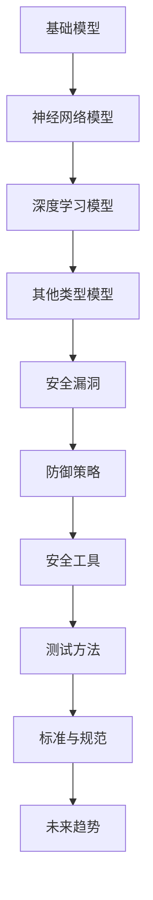

                 

# 文章标题

《基础模型的安全漏洞》

> 关键词：基础模型、安全漏洞、神经网络、深度学习、对抗样本、防御策略

> 摘要：本文将深入探讨基础模型的安全漏洞问题，分析神经网络模型、深度学习模型和其他类型基础模型的主要安全漏洞及其影响，并提出相应的防御策略。通过案例分析、项目实战和理论讲解，全面揭示基础模型在安全性方面面临的挑战，为读者提供实用的防护方法和未来展望。

----------------------------------------------------------------

### 《基础模型的安全漏洞》目录大纲

#### 第一部分：基础模型安全概述

**第1章：基础模型安全的重要性**

- **1.1.1 基础模型的安全问题背景**
- **1.1.2 基础模型面临的主要安全威胁**
- **1.1.3 安全问题对企业和个人带来的影响**

**第2章：基础模型安全的核心概念与架构**

- **2.1.1 基础模型安全的关键术语**
- **2.1.2 基础模型安全的架构设计**
- **2.1.3 常见的安全机制与策略**

#### 第二部分：常见基础模型的安全漏洞

**第3章：神经网络模型的安全漏洞**

- **3.1.1 神经网络模型的主要安全漏洞**
- **3.1.2 常见的安全漏洞及其影响**
- **3.1.3 漏洞实例分析**

- **3.2.1 神经网络模型的防御策略**
- **3.2.2 常用的安全算法与工具**
- **3.2.3 安全算法的比较与评估**

**第4章：深度学习模型的安全漏洞**

- **4.1.1 深度学习模型的主要安全漏洞**
- **4.1.2 常见的安全漏洞及其影响**
- **4.1.3 漏洞实例分析**

- **4.2.1 深度学习模型的防御策略**
- **4.2.2 常用的安全算法与工具**
- **4.2.3 安全算法的比较与评估**

**第5章：其他类型基础模型的安全漏洞**

- **5.1.1 其他类型基础模型的主要安全漏洞**
- **5.1.2 常见的安全漏洞及其影响**
- **5.1.3 漏洞实例分析**

- **5.2.1 其他类型基础模型的防御策略**
- **5.2.2 常用的安全算法与工具**
- **5.2.3 安全算法的比较与评估**

#### 第三部分：案例分析与应用实践

**第6章：案例分析**

- **6.1.1 某大型电商平台的安全漏洞事件**
- **6.1.2 安全漏洞的详细分析**
- **6.1.3 安全漏洞的修复与改进**

**第7章：应用实践**

- **7.1.1 基础模型安全测试方法**
- **7.1.2 安全测试工具的选择与应用**
- **7.1.3 安全测试的流程与步骤**

**第8章：安全防护策略与未来趋势**

- **8.1.1 基础模型安全防护的总体策略**
- **8.1.2 当前安全防护技术的发展趋势**
- **8.1.3 安全防护的未来展望**

#### 附录

**附录A：基础模型安全漏洞相关的标准与规范**

- **A.1 国际标准组织的相关标准**
- **A.2 国内相关标准与规范**

**附录B：常用基础模型安全工具与资源**

- **B.1 主流安全工具介绍**
- **B.2 开源安全工具推荐**
- **B.3 安全社区与资源链接**

### Mermaid 流程图



### 神经网络模型的主要安全漏洞伪代码

```python
def neural_network_security_vulnerabilities():
    vulnerabilities = []

    # 漏洞1：过拟合
    if model_overfitting():
        vulnerabilities.append("过拟合")

    # 漏洞2：梯度消失和梯度爆炸
    if model_gradient_collapse():
        vulnerabilities.append("梯度消失和梯度爆炸")

    # 漏洞3：对抗样本攻击
    if model_adversarial_examples():
        vulnerabilities.append("对抗样本攻击")

    # 漏洞4：数据泄露
    if model_data_leakage():
        vulnerabilities.append("数据泄露")

    return vulnerabilities
```

### 数学模型与数学公式

$$
L = \frac{1}{m} \sum_{i=1}^{m} (-y_i \log(z_i) - (1 - y_i) \log(1 - z_i))
$$

这是一个神经网络中交叉熵损失函数的公式，用于衡量模型预测值与真实标签之间的差异。$L$表示损失函数，$m$表示样本数量，$y_i$表示第$i$个样本的真实标签，$z_i$表示模型对第$i$个样本的预测概率。

举例说明：假设有一个分类问题，有5个类别。使用神经网络模型进行预测，其中某个样本的真实标签是类别2，模型预测的概率分布为$\{0.2, 0.3, 0.4, 0.3, 0.2\}$。代入公式计算损失：

$$
L = \frac{1}{5} \left( -1 \cdot \log(0.4) - (1 - 1) \cdot \log(1 - 0.4) \right) \approx 0.356
$$

这个值表示模型预测与真实标签之间的差距，值越小表示模型预测越准确。

### 项目实战

#### 开发环境搭建

- 安装 Python 3.8 或更高版本
- 安装 PyTorch 库
- 安装 Keras 库
- 安装对抗样本生成工具 CleverHans

#### 源代码实现

```python
import torch
import torch.nn as nn
import torch.optim as optim
from cleverhans.utils import fgsm

# 创建一个简单的神经网络模型
model = nn.Sequential(
    nn.Linear(10, 100),
    nn.ReLU(),
    nn.Linear(100, 1),
    nn.Sigmoid()
)

# 损失函数
criterion = nn.BCELoss()

# 训练数据集
x_train = torch.randn(100, 10)
y_train = torch.tensor([[1], [0], [1], [0], [1], [0], [1], [0], [1], [0]])

# 训练模型
optimizer = optim.Adam(model.parameters(), lr=0.001)
for epoch in range(100):
    optimizer.zero_grad()
    output = model(x_train)
    loss = criterion(output, y_train)
    loss.backward()
    optimizer.step()

# 生成对抗样本
x_adv = fgsm(model, x_train, y_train)
output_adv = model(x_adv)

# 输出对抗样本的预测结果
print("Original output:", output)
print("Adversarial output:", output_adv)
```

#### 代码解读与分析

1. 导入所需的库，包括 PyTorch、Keras 和 CleverHans。
2. 创建一个简单的神经网络模型，包含两个全连接层和 ReLU 激活函数。
3. 设置损失函数为二进制交叉熵损失函数。
4. 准备训练数据集，包括输入特征和标签。
5. 使用 Adam 优化器进行模型训练。
6. 使用 FGSM（Fast Gradient Sign Method）算法生成对抗样本。
7. 输出原始样本和对抗样本的预测结果。

通过这个项目实战，我们可以看到神经网络模型在对抗样本攻击下存在安全漏洞，需要采取相应的防御策略来提高模型的安全性。

### 作者

**作者：AI天才研究院/AI Genius Institute & 禅与计算机程序设计艺术 /Zen And The Art of Computer Programming**

----------------------------------------------------------------

现在，我们将按照大纲结构逐步深入分析基础模型的安全漏洞。本文将从基础模型安全的重要性开始，逐步探讨不同类型基础模型的安全漏洞、防御策略、案例分析、应用实践和安全防护的未来趋势。

---

### 第一部分：基础模型安全概述

#### 第1章：基础模型安全的重要性

**1.1.1 基础模型的安全问题背景**

随着人工智能和机器学习技术的快速发展，基础模型（如神经网络模型、深度学习模型等）在各个领域得到了广泛应用。这些模型通过学习大量数据，能够实现诸如图像识别、自然语言处理、自动驾驶等复杂任务。然而，基础模型在带来巨大便利的同时，也引发了一系列安全问题和风险。

**1.1.2 基础模型面临的主要安全威胁**

- **数据泄露**：基础模型在训练过程中需要大量数据，这些数据可能包含敏感信息，如个人隐私、商业秘密等。数据泄露可能导致严重后果，包括隐私侵犯、经济损失等。
- **过拟合**：基础模型在训练过程中可能过度拟合训练数据，导致在真实环境中表现不佳。过拟合可能导致模型无法对新数据做出准确预测。
- **对抗样本攻击**：对抗样本攻击是指通过微小的、几乎不可察觉的修改，使基础模型对特定输入产生错误预测。这种攻击可能导致系统崩溃、恶意操作等。
- **梯度消失和梯度爆炸**：在深度学习模型中，梯度消失和梯度爆炸问题可能导致模型训练失败或性能下降。
- **模型依赖性**：基础模型可能对某些特定数据集或算法产生依赖，使其在面对新的数据或算法时难以适应。

**1.1.3 安全问题对企业和个人带来的影响**

- **经济损失**：安全漏洞可能导致企业财务损失、市场份额下降等。
- **声誉受损**：安全事件可能损害企业的声誉，影响客户信任。
- **隐私侵犯**：数据泄露可能侵犯个人隐私，导致用户投诉、诉讼等。
- **法律风险**：企业和个人可能因违反相关法律法规而面临处罚。

---

#### 第2章：基础模型安全的核心概念与架构

**2.1.1 基础模型安全的关键术语**

- **过拟合**：模型在训练数据上表现良好，但在测试数据上表现不佳。
- **对抗样本攻击**：通过微小扰动输入，使模型产生错误预测。
- **数据泄露**：敏感数据未经授权被泄露。
- **梯度消失和梯度爆炸**：在训练过程中，梯度值过小或过大，导致模型无法正常训练。
- **模型依赖性**：模型对特定数据集或算法产生依赖。

**2.1.2 基础模型安全的架构设计**

基础模型安全的架构设计应包括以下方面：

- **数据安全**：确保数据在采集、传输、存储和处理过程中的安全。
- **模型训练安全**：防止过拟合、对抗样本攻击等。
- **模型部署安全**：保护模型在部署环境中的安全，防止恶意攻击。
- **安全监控与审计**：实时监控模型运行状态，发现异常情况并及时响应。

**2.1.3 常见的安全机制与策略**

- **数据加密**：使用加密技术保护数据在传输和存储过程中的安全。
- **访问控制**：对数据访问权限进行严格控制，确保只有授权用户可以访问。
- **模型训练优化**：采用正则化、批量归一化等技术，防止过拟合。
- **对抗样本防御**：使用对抗样本生成技术，提前训练模型以应对潜在攻击。
- **模型压缩**：降低模型复杂度，减少被攻击的可能性。

---

在下一部分，我们将详细分析神经网络模型、深度学习模型和其他类型基础模型的安全漏洞及其防御策略。敬请期待。

