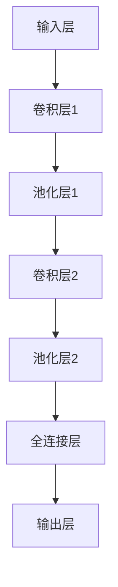
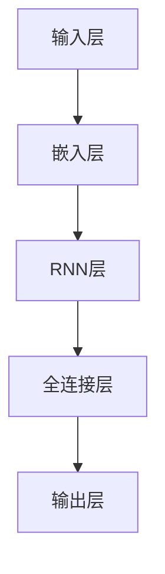

                 

# 《基础模型的技术进步与挑战》

> 关键词：基础模型、技术进步、挑战、深度学习、神经网络

> 摘要：本文旨在探讨基础模型在技术进步与挑战中的发展。通过对基础模型的概述、核心技术、训练与优化、数学基础、应用实践以及技术挑战和未来发展趋势的深入分析，旨在为读者提供关于基础模型的全面理解，并探讨其在实际应用中的潜力和限制。

## 第一部分：基础模型的技术进步

### 第1章：基础模型概述与历史演进

#### 1.1.1 基础模型的概念

基础模型是深度学习中最基本的构件，它们通过多层非线性变换来学习数据中的特征。基础模型通常由一系列神经网络层组成，每个层对输入数据进行特征提取和变换，最终输出目标结果。

#### 1.1.2 基础模型的发展历程

基础模型的发展可以追溯到20世纪50年代，当时神经网络的概念首次被提出。然而，由于计算资源和算法的限制，神经网络在很长一段时间内没有得到广泛应用。直到21世纪初，随着计算能力的提升和大数据的涌现，神经网络尤其是深度学习开始迅速发展。这一阶段的重要里程碑包括2006年Hinton提出的深度信念网络（DBN）和2012年AlexNet在ImageNet图像识别挑战中取得的突破性成果。

#### 1.1.3 当前基础模型的主要类别

当前，基础模型主要包括以下几类：

1. **卷积神经网络（CNN）**：适用于处理图像、音频和视频等具有空间或时间结构的数据。
2. **循环神经网络（RNN）与长短时记忆网络（LSTM）**：适用于处理序列数据，如时间序列预测和自然语言处理。
3. **生成对抗网络（GAN）**：适用于生成具有真实感的数据，如图像和文本。
4. **变分自编码器（VAE）**：适用于数据生成和特征提取。

### 第2章：基础模型的核心技术

#### 2.1.1 神经网络基础

神经网络由大量的简单计算单元——神经元组成。每个神经元接收多个输入，通过激活函数进行非线性变换，最后输出一个值。常见的激活函数包括sigmoid、ReLU和tanh。

#### 2.1.1.1 神经元模型

神经元模型通常由以下几个部分组成：

- 输入层：接收外部输入数据。
- 隐藏层：对输入数据进行特征提取和变换。
- 输出层：输出预测结果或分类标签。

#### 2.1.1.2 前向传播与反向传播算法

神经网络的学习过程包括前向传播和反向传播两个阶段。在前向传播过程中，输入数据通过神经网络各层传递，最终得到输出。在反向传播过程中，计算输出误差，并沿着前向传播路径更新各层的参数。

#### 2.1.2 深度学习架构

深度学习架构包括多种不同的网络结构，如卷积神经网络（CNN）、循环神经网络（RNN）、长短时记忆网络（LSTM）等。每种架构都有其特定的应用场景和优势。

#### 2.1.2.1 卷积神经网络（CNN）

卷积神经网络是处理图像数据的一种常用架构，其主要特点是使用卷积层来提取图像特征。卷积层通过滑动窗口对输入图像进行卷积运算，从而提取局部特征。

#### 2.1.2.2 循环神经网络（RNN）与长短时记忆网络（LSTM）

循环神经网络是处理序列数据的一种常用架构，其主要特点是具有循环结构，可以处理变长序列。长短时记忆网络（LSTM）是RNN的一种改进，通过引入门控机制来缓解长短期依赖问题。

#### 2.1.3 监督学习、无监督学习与半监督学习

基础模型的学习过程可以分为监督学习、无监督学习和半监督学习三种。监督学习需要标注数据来训练模型，无监督学习不需要标注数据，但需要确定数据的分布或结构，半监督学习则介于两者之间。

### 第3章：基础模型的训练与优化

#### 3.1.1 训练数据准备

训练数据是基础模型训练的重要资源。为了提高模型的泛化能力，通常需要准备足够多的训练数据，并对数据进行预处理和增强。

#### 3.1.1.1 数据预处理

数据预处理包括数据清洗、归一化和标准化等操作，以消除数据中的噪声和不一致性。

#### 3.1.1.2 数据增强

数据增强是通过一系列操作来生成新的训练样本，以提高模型的泛化能力。常见的数据增强方法包括随机裁剪、旋转、翻转和颜色调整等。

#### 3.1.2 模型优化

模型优化是提高基础模型性能的关键步骤。常见的优化方法包括学习率调整、正则化技术和超参数调优等。

#### 3.1.2.1 学习率调整

学习率是模型训练过程中一个重要的超参数，它决定了模型在训练过程中参数更新的步长。合适的学习率可以使模型在较短时间内达到较好的性能，但过大会导致训练不稳定，过小则会收敛速度过慢。

#### 3.1.2.2 正则化技术

正则化技术是防止模型过拟合的重要手段。常见的正则化技术包括L1正则化、L2正则化和Dropout等。

#### 3.1.3 模型评估与调整

模型评估是判断模型性能的重要环节。常见的评估指标包括准确率、召回率、F1分数和交叉验证误差等。通过模型评估，可以识别模型的不足之处，并进行相应的调整和优化。

### 第4章：深度学习的数学基础

#### 4.1.1 微积分基础

微积分是深度学习的基础数学工具，主要包括导数、偏导数和梯度下降算法。

#### 4.1.1.1 导数与偏导数

导数是衡量函数变化率的重要概念，偏导数是多元函数在某一方向上的变化率。

#### 4.1.1.2 梯度下降算法

梯度下降算法是深度学习中最常用的优化算法，通过计算损失函数的梯度来更新模型参数。

#### 4.1.2 线性代数基础

线性代数是深度学习中的另一个重要数学工具，主要包括矩阵与向量运算、特征值与特征向量等。

#### 4.1.2.1 矩阵与向量运算

矩阵与向量运算是线性代数中最基本的概念，包括矩阵乘法、矩阵求逆和向量点积等。

#### 4.1.2.2 特征值与特征向量

特征值与特征向量是矩阵的一个重要属性，可以用于矩阵的分解和特征提取。

### 第5章：基础模型的应用实践

#### 5.1.1 图像识别应用

图像识别是基础模型的一个重要应用领域，主要包括图像分类、目标检测和图像分割等任务。

#### 5.1.1.1 数据集准备与预处理

图像识别应用的第一步是准备和预处理数据集。常见的数据集包括CIFAR-10、ImageNet和Open Images等。

#### 5.1.1.2 模型训练与优化

在图像识别应用中，通常使用卷积神经网络（CNN）作为基础模型。通过调整模型结构和训练参数，可以实现较高的识别准确率。

#### 5.1.2 自然语言处理应用

自然语言处理是基础模型的另一个重要应用领域，主要包括语言模型、文本分类和情感分析等任务。

#### 5.1.2.1 语言模型构建

语言模型是自然语言处理的基础，用于预测下一个词或词组。常见的语言模型包括n元语法模型和循环神经网络（RNN）模型。

#### 5.1.2.2 文本分类与情感分析

文本分类和情感分析是自然语言处理中的常见任务，通过训练基础模型来实现。常见的模型包括卷积神经网络（CNN）和循环神经网络（RNN）等。

### 第6章：基础模型的技术挑战

#### 6.1.1 计算资源消耗

基础模型通常需要大量的计算资源进行训练，这给实际应用带来了很大的挑战。为了降低计算资源消耗，可以采用以下几种策略：

- 模型压缩：通过模型压缩技术，如量化、剪枝和蒸馏等，减少模型的大小和计算量。
- 并行计算：利用并行计算和分布式训练，提高模型的训练速度。
- 特定硬件优化：针对特定硬件平台，如GPU和TPU，进行模型优化和加速。

#### 6.1.2 模型可解释性

模型可解释性是基础模型应用中的一个重要问题，它关系到模型的可靠性和透明度。提高模型可解释性可以采用以下几种方法：

- 层级解释：通过对模型各层的输出进行分析，理解模型的决策过程。
- 特征重要性分析：通过分析模型对各个特征的依赖程度，识别关键特征。
- 可解释模型：设计可解释性更强的模型，如决策树和线性模型等。

#### 6.1.3 数据隐私与安全

基础模型在处理敏感数据时，需要考虑数据隐私和安全问题。为了保护数据隐私，可以采用以下几种方法：

- 数据加密：对数据进行加密处理，确保数据在传输和存储过程中的安全。
- 同态加密：在加密状态下对数据进行计算和处理，确保数据隐私的同时保持计算效率。
- 隐私联邦学习：通过分布式训练和模型聚合，实现多方数据的安全联合学习。

### 第7章：未来基础模型发展趋势

#### 7.1.1 新型基础模型的出现

随着深度学习技术的不断发展，新型基础模型不断涌现，如生成对抗网络（GAN）、变分自编码器（VAE）和多模态学习等。这些新型模型在图像生成、特征提取和数据增强等方面具有显著优势。

#### 7.1.2 基础模型在多领域的融合应用

基础模型在多领域的融合应用是未来发展趋势之一。例如，在医疗健康领域，基础模型可以用于疾病预测、诊断和治疗方案推荐；在工业制造领域，基础模型可以用于设备故障预测、生产优化和质量控制等。

## 第二部分：基础模型的技术进步与挑战

### 第8章：基础模型的技术进步案例研究

#### 8.1.1 案例一：卷积神经网络在图像识别中的应用

在本案例中，我们将探讨卷积神经网络（CNN）在图像识别中的应用，通过一个实际项目来展示CNN的设计、训练和优化过程。

#### 8.1.1.1 数据集准备

我们选择CIFAR-10数据集作为案例，该数据集包含10个类别，每个类别有6000张32x32的彩色图像。首先，我们需要将数据集分为训练集和测试集，通常使用80%的数据作为训练集，20%的数据作为测试集。

#### 8.1.1.2 模型设计与实现

在模型设计阶段，我们选择了一个简单的CNN架构，包括两个卷积层、一个池化层和一个全连接层。具体实现如下：



卷积层1：使用32个3x3的卷积核，激活函数为ReLU。
池化层1：使用2x2的最大池化。
卷积层2：使用64个3x3的卷积核，激活函数为ReLU。
池化层2：使用2x2的最大池化。
全连接层：使用128个神经元，激活函数为ReLU。
输出层：使用10个神经元，每个神经元对应一个类别，激活函数为Softmax。

#### 8.1.1.3 模型训练与优化

在模型训练阶段，我们使用随机梯度下降（SGD）算法来优化模型参数。训练过程中，我们需要选择合适的学习率、批次大小和迭代次数。具体实现如下：

```python
import tensorflow as tf

model = ...  # 定义模型
optimizer = tf.keras.optimizers.SGD(learning_rate=0.001)
loss_function = tf.keras.losses.SparseCategoricalCrossentropy(from_logits=True)

for epoch in range(num_epochs):
    for batch in train_dataset:
        with tf.GradientTape() as tape:
            predictions = model(batch[0], training=True)
            loss = loss_function(batch[1], predictions)
        gradients = tape.gradient(loss, model.trainable_variables)
        optimizer.apply_gradients(zip(gradients, model.trainable_variables))
    print(f"Epoch {epoch+1}, Loss: {loss.numpy()}")
```

训练完成后，我们使用测试集对模型进行评估，计算模型的准确率。

```python
test_loss, test_accuracy = model.evaluate(test_dataset)
print(f"Test Accuracy: {test_accuracy}")
```

#### 8.1.2 案例二：循环神经网络在时间序列预测中的应用

在本案例中，我们将探讨循环神经网络（RNN）在时间序列预测中的应用，通过一个实际项目来展示RNN的设计、训练和优化过程。

#### 8.1.2.1 数据集准备

我们选择了一个常见的时间序列数据集——Stock Market Price Data，该数据集包含了股票价格的日收盘价。首先，我们需要对数据集进行预处理，将其转换为适合RNN训练的格式。

```python
import pandas as pd

# 读取数据集
data = pd.read_csv("stock_price_data.csv")
data["Price"] = pd.to_numeric(data["Price"])

# 数据预处理
data = data[data["Price"] > 0]
data = data.reset_index(drop=True)

# 创建时间窗口
window_size = 30
X = []
y = []

for i in range(window_size, len(data) - 1):
    X.append(data["Price"][i - window_size: i])
    y.append(data["Price"][i + 1])

X = np.array(X)
y = np.array(y)

# 划分训练集和测试集
X_train, X_test, y_train, y_test = train_test_split(X, y, test_size=0.2, random_state=42)
```

#### 8.1.2.2 模型设计与实现

在模型设计阶段，我们选择了一个简单的RNN架构，包括一个嵌入层、一个RNN层和一个全连接层。具体实现如下：



嵌入层：将输入序列转换为固定大小的向量。
RNN层：使用一个LSTM单元来处理输入序列。
全连接层：将RNN层的输出转换为预测值。
输出层：使用线性激活函数，输出预测的下一个时间点的价格。

```python
import tensorflow as tf

model = tf.keras.Sequential([
    tf.keras.layers.Embedding(input_dim=window_size, output_dim=64),
    tf.keras.layers.LSTM(128, return_sequences=False),
    tf.keras.layers.Dense(1)
])

model.compile(optimizer='adam', loss='mean_squared_error')
```

#### 8.1.2.3 模型训练与优化

在模型训练阶段，我们使用均方误差（MSE）作为损失函数，并使用Adam优化器来优化模型参数。具体实现如下：

```python
model.fit(X_train, y_train, epochs=100, batch_size=32, validation_data=(X_test, y_test))
```

训练完成后，我们使用测试集对模型进行评估，计算模型的均方误差。

```python
test_loss = model.evaluate(X_test, y_test)
print(f"Test Loss: {test_loss}")
```

### 第9章：基础模型的技术挑战与解决策略

#### 9.1.1 计算资源优化

计算资源优化是基础模型应用中的一个重要挑战。为了降低计算资源消耗，可以采用以下几种策略：

- 模型压缩：通过模型压缩技术，如量化、剪枝和蒸馏等，减少模型的大小和计算量。
- 并行计算：利用并行计算和分布式训练，提高模型的训练速度。
- 特定硬件优化：针对特定硬件平台，如GPU和TPU，进行模型优化和加速。

#### 9.1.2 模型可解释性提升

模型可解释性是基础模型应用中的一个重要问题，它关系到模型的可靠性和透明度。为了提高模型可解释性，可以采用以下几种方法：

- 层级解释：通过对模型各层的输出进行分析，理解模型的决策过程。
- 特征重要性分析：通过分析模型对各个特征的依赖程度，识别关键特征。
- 可解释模型：设计可解释性更强的模型，如决策树和线性模型等。

#### 9.1.3 数据隐私保护

基础模型在处理敏感数据时，需要考虑数据隐私和安全问题。为了保护数据隐私，可以采用以下几种方法：

- 数据加密：对数据进行加密处理，确保数据在传输和存储过程中的安全。
- 同态加密：在加密状态下对数据进行计算和处理，确保数据隐私的同时保持计算效率。
- 隐私联邦学习：通过分布式训练和模型聚合，实现多方数据的安全联合学习。

### 第10章：基础模型的未来发展与应用展望

#### 10.1.1 新型基础模型的出现

随着深度学习技术的不断发展，新型基础模型不断涌现，如生成对抗网络（GAN）、变分自编码器（VAE）和多模态学习等。这些新型模型在图像生成、特征提取和数据增强等方面具有显著优势。

#### 10.1.2 基础模型在多领域的深度融合

基础模型在多领域的融合应用是未来发展趋势之一。例如，在医疗健康领域，基础模型可以用于疾病预测、诊断和治疗方案推荐；在工业制造领域，基础模型可以用于设备故障预测、生产优化和质量控制等。

## 附录

### 附录A：基础模型学习资源与工具

#### A.1.1 常用深度学习框架

- TensorFlow：Google开发的开源深度学习框架，广泛应用于工业和学术领域。
- PyTorch：Facebook开发的开源深度学习框架，以其动态计算图和易用性著称。

#### A.1.2 基础模型学习书籍推荐

- 《深度学习》（Goodfellow et al.）：深度学习领域的经典教材，全面介绍了深度学习的基本概念和技术。
- 《神经网络与深度学习》（邱锡鹏）：中文深度学习教材，适合初学者和进阶者阅读。

### 附录B：数学公式与算法伪代码

#### B.1.1 梯度下降算法

$$
\frac{\partial J(\theta)}{\partial \theta} = \text{梯度}
$$

#### B.1.1.1 梯度下降伪代码

```python
# 初始化模型参数θ
初始化θ

# 对于每个训练样本(x, y)：
for each training sample (x, y)：
    # 计算预测值hθ(x)
    y_pred = model(x)

    # 计算损失函数J(θ)
    loss = loss_function(y, y_pred)

    # 计算梯度∇θJ(θ)
    gradients = model.compute_gradients()

    # 更新θ：θ = θ - α∇θJ(θ)
    θ = update_parameters(θ, gradients, learning_rate)
```

#### B.1.2 线性回归模型

$$
y = \theta_0 + \theta_1x
$$

#### B.1.3 线性回归梯度计算

$$
\frac{\partial J(\theta)}{\partial \theta_0} = -\sum(y - h\theta(x))
$$

$$
\frac{\partial J(\theta)}{\partial \theta_1} = -\sum(x(y - h\theta(x)))
$$

### 附录C：深度学习框架使用指南

#### C.1.1 TensorFlow使用指南

- TensorFlow安装与配置：介绍如何在不同的操作系统上安装和配置TensorFlow。
- TensorFlow基本API使用：介绍TensorFlow的主要API，包括Tensor、Operation、Session等。

#### C.1.2 PyTorch使用指南

- PyTorch安装与配置：介绍如何在不同的操作系统上安装和配置PyTorch。
- PyTorch基本API使用：介绍PyTorch的主要API，包括Tensor、autograd等。

### 附录D：基础模型代码实例

#### D.1.1 卷积神经网络代码实例

- 数据集准备：介绍如何准备和预处理图像数据。
- 模型设计与实现：介绍如何使用TensorFlow或PyTorch构建和训练卷积神经网络。
- 模型训练与优化：介绍如何使用不同的优化策略和损失函数来训练和优化卷积神经网络。

#### D.1.2 循环神经网络代码实例

- 数据集准备：介绍如何准备和预处理时间序列数据。
- 模型设计与实现：介绍如何使用TensorFlow或PyTorch构建和训练循环神经网络。
- 模型训练与优化：介绍如何使用不同的优化策略和损失函数来训练和优化循环神经网络。

### 作者

**作者：AI天才研究院/AI Genius Institute & 禅与计算机程序设计艺术 /Zen And The Art of Computer Programming**

