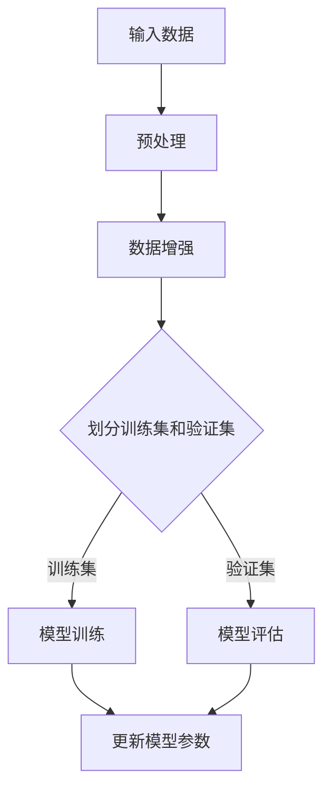
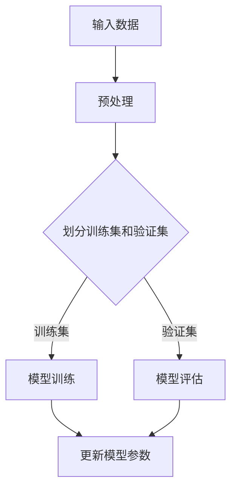

                 

### 文章标题: 基础模型的未来技术发展

> 关键词：基础模型，未来技术发展，人工智能，神经网络，深度学习

> 摘要：本文将深入探讨基础模型的概念、历史演进、技术特点及其在未来技术发展中的角色。通过分析基础模型的数学原理、算法基础和实现与优化方法，我们将了解其在不同应用场景中的具体应用。此外，本文还将探讨基础模型在行业中的应用与挑战、发展趋势与未来展望，以及其伦理与社会影响。最后，我们将介绍开发与部署基础模型的环境与工具，并提供相关的学习资源和代码示例。

----------------------------------------------------------------

### 第一部分: 基础模型的未来技术发展

#### 第1章: 基础模型的概念与历史演进

#### 1.1 基础模型的定义

- **基础模型**：在人工智能领域，基础模型指的是那些被广泛应用于多个任务的核心模型，如神经网络模型。
- **定义与范畴**：基础模型通常包括计算机视觉、自然语言处理、语音识别等领域中的关键模型。

#### 1.2 基础模型的历史演进

- **早期模型**：以感知机、反向传播算法为代表的早期神经网络模型。
- **2006-2012年**：深度学习崛起，特别是Hinton提出的深度信念网络（DBN）。
- **2012年后**：深度学习的快速发展和突破，以AlexNet、VGG、ResNet等为代表。

#### 1.3 当前基础模型的技术特点

- **高维数据拟合能力**：深度学习模型可以处理高维、复杂的数据结构。
- **自学习与自适应**：模型可以通过大量数据进行训练，实现自动学习和自适应调整。

#### 1.4 基础模型在未来技术发展中的角色

- **推动人工智能进步**：基础模型是人工智能技术发展的基石。
- **广泛的应用场景**：从计算机视觉到自然语言处理，再到语音识别，基础模型在各个领域都有广泛应用。

#### 第2章: 基础模型的数学原理与算法基础

#### 2.1 神经网络基本原理

- **神经元结构与作用**：介绍神经网络中的神经元及其功能。
- **前向传播与反向传播**：阐述神经网络训练中的基本算法。

#### 2.2 深度学习核心算法

- **卷积神经网络（CNN）**：介绍CNN的架构及其在计算机视觉中的应用。
- **循环神经网络（RNN）**：讲解RNN的工作原理及其在自然语言处理中的应用。

#### 2.3 自监督学习

- **自监督学习的概念**：介绍自监督学习的基本思想。
- **典型应用场景**：展示自监督学习在基础模型中的应用案例。

#### 第3章: 基础模型的实现与优化

#### 3.1 基础模型的实现

- **框架选择**：介绍主流深度学习框架，如TensorFlow、PyTorch等。
- **模型构建与训练**：阐述基础模型的构建与训练流程。

#### 3.2 模型优化

- **超参数调优**：介绍如何通过调整超参数来优化模型性能。
- **模型压缩与加速**：探讨如何通过模型压缩和优化来提高计算效率。

#### 第4章: 基础模型的应用场景与案例分析

#### 4.1 计算机视觉

- **人脸识别**：介绍人脸识别技术及其实现。
- **图像分类**：讲解图像分类算法及应用。

#### 4.2 自然语言处理

- **机器翻译**：分析机器翻译技术的发展。
- **情感分析**：介绍情感分析算法及应用。

#### 4.3 语音识别

- **语音识别技术**：讲解语音识别的基本原理。
- **语音合成**：探讨语音合成的实现方法。

#### 第5章: 基础模型在行业中的应用与挑战

#### 5.1 金融行业

- **风险控制**：分析基础模型在金融风险管理中的应用。
- **欺诈检测**：探讨如何利用基础模型进行欺诈检测。

#### 5.2 医疗保健

- **医疗影像分析**：介绍基础模型在医疗影像分析中的应用。
- **疾病预测**：讲解如何利用基础模型进行疾病预测。

#### 5.3 智能制造

- **质量检测**：分析基础模型在产品质量检测中的应用。
- **生产优化**：探讨如何利用基础模型进行生产流程优化。

#### 第6章: 基础模型的发展趋势与未来展望

#### 6.1 技术发展趋势

- **模型多样化**：探讨未来基础模型的多样化发展趋势。
- **跨学科融合**：分析基础模型与其他领域的融合趋势。

#### 6.2 未来应用展望

- **智能社会**：展望基础模型在智能社会中的应用前景。
- **技术创新**：讨论基础模型在技术创新中的作用。

#### 第7章: 基础模型的伦理与社会影响

#### 7.1 伦理问题

- **隐私保护**：讨论基础模型在隐私保护方面的伦理问题。
- **偏见与歧视**：分析基础模型可能带来的偏见和歧视问题。

#### 7.2 社会影响

- **就业影响**：探讨基础模型对就业市场的影响。
- **社会公平**：分析基础模型如何促进社会公平与进步。

#### 第8章: 开发与部署基础模型的环境与工具

#### 8.1 开发环境搭建

- **硬件选择**：介绍适用于基础模型训练的硬件环境。
- **软件配置**：讲解深度学习框架的安装与配置。

#### 8.2 模型部署

- **云服务**：介绍基础模型在云服务中的部署。
- **边缘计算**：探讨基础模型在边缘计算中的应用。

#### 附录

#### 附录 A: 基础模型开发资源

- **开源框架与工具**：列出常用的深度学习框架和工具。
- **学习资料**：推荐相关学习资源，包括书籍、论文和在线课程。

#### 附录 B: Mermaid 流程图示例

- **神经网络训练流程**：展示一个神经网络训练过程的Mermaid流程图。

#### 附录 C: 伪代码示例

- **卷积神经网络（CNN）**：提供CNN算法的伪代码示例。

#### 附录 D: 数学公式与示例

- **损失函数**：使用LaTeX格式展示常见的损失函数公式。
- **反向传播算法**：提供反向传播算法的数学公式。

----------------------------------------------------------------

### 第1章: 基础模型的概念与历史演进

#### 1.1 基础模型的定义

在人工智能领域，基础模型（Fundamental Models）指的是那些在多个任务中具有广泛适用性的核心模型。这些模型通常是基于神经网络架构，能够处理高维、复杂的数据结构，并在多个领域（如计算机视觉、自然语言处理、语音识别等）中表现出强大的性能。

**定义与范畴**：基础模型通常包括以下几类：

- **计算机视觉模型**：如卷积神经网络（CNN）、生成对抗网络（GAN）等。
- **自然语言处理模型**：如循环神经网络（RNN）、长短期记忆网络（LSTM）、Transformer等。
- **语音识别模型**：如隐马尔可夫模型（HMM）、深度神经网络（DNN）等。

#### 1.2 基础模型的历史演进

**早期模型**：

- **感知机（Perceptron）**：1957年由Frank Rosenblatt提出，是最早的神经网络模型。
- **反向传播算法（Backpropagation）**：1974年由David E. Rumelhart等人提出，是神经网络训练的核心算法。

**2006-2012年：深度学习崛起**：

- **深度信念网络（Deep Belief Network，DBN）**：由Geoffrey Hinton提出，是早期深度学习的代表性工作。
- **深度卷积神经网络（Deep Convolutional Network，DCNN）**：在图像识别等领域取得了突破性的进展。

**2012年后：深度学习的快速发展和突破**：

- **AlexNet**：2012年由Alex Krizhevsky等人在ImageNet竞赛中夺冠，标志着深度学习时代的到来。
- **VGG**：2014年由Karen Simonyan和Andrew Zisserman提出，在图像分类任务中取得了优异的成绩。
- **ResNet**：2015年由Kaiming He等人提出，解决了深度神经网络中的梯度消失问题。

#### 1.3 当前基础模型的技术特点

**高维数据拟合能力**：深度学习模型通过多层神经网络结构，可以处理高维、复杂的数据结构，如图像、文本和语音等。

**自学习与自适应**：模型可以通过大量数据进行训练，学习数据中的特征和规律，并在新的数据上进行自适应调整。

#### 1.4 基础模型在未来技术发展中的角色

**推动人工智能进步**：基础模型是人工智能技术发展的基石，为其他人工智能算法和应用提供了强大的支持。

**广泛的应用场景**：从计算机视觉到自然语言处理，再到语音识别，基础模型在各个领域都有广泛应用，并将继续推动人工智能技术的发展。

----------------------------------------------------------------

### 第2章: 基础模型的数学原理与算法基础

#### 2.1 神经网络基本原理

**神经元结构与作用**：

神经网络（Neural Network）由大量相互连接的神经元（Neurons）组成，每个神经元都可以接收来自其他神经元的输入，并通过激活函数（Activation Function）产生输出。

一个简单的神经元可以表示为：

$$
y = \sigma(\sum_{i=1}^{n} w_i x_i + b)
$$

其中，$y$ 是输出，$\sigma$ 是激活函数，$w_i$ 是权重，$x_i$ 是输入，$b$ 是偏置。

**前向传播与反向传播**：

神经网络训练的核心算法包括前向传播（Forward Propagation）和反向传播（Backpropagation）。

**前向传播**：

在前向传播过程中，输入数据通过神经网络中的每一层，每层神经元根据输入计算输出，最终得到网络的总输出。具体步骤如下：

1. **初始化参数**：设置权重和偏置的初始值。
2. **计算输出**：从输入层开始，逐层计算每个神经元的输出。
3. **激活函数应用**：在每个神经元上应用激活函数，将线性组合转换为非线性输出。

**反向传播**：

在反向传播过程中，根据实际输出和期望输出之间的误差，更新网络的权重和偏置。具体步骤如下：

1. **计算误差**：计算输出层的误差，可以使用损失函数（Loss Function）来衡量。
2. **反向传播误差**：从输出层开始，逐层计算每个神经元的误差。
3. **更新参数**：根据误差计算梯度，并使用梯度下降（Gradient Descent）或其他优化算法更新权重和偏置。

#### 2.2 深度学习核心算法

**卷积神经网络（CNN）**：

卷积神经网络（Convolutional Neural Network，CNN）是一种专门用于图像识别和处理的神经网络模型。其核心思想是通过卷积层（Convolutional Layer）提取图像特征。

**CNN的架构**：

- **输入层**：接收图像输入。
- **卷积层**：通过卷积运算提取图像特征。
- **激活函数**：对卷积层输出应用激活函数。
- **池化层**：通过池化（Pooling）操作降低特征维度。
- **全连接层**：将特征映射到分类结果。
- **输出层**：输出分类结果。

**CNN的算法原理**：

- **卷积运算**：卷积层通过卷积运算提取图像特征。卷积核（Kernel）在图像上滑动，对局部区域进行特征提取。
- **激活函数**：常见的激活函数有ReLU（Rectified Linear Unit）和Sigmoid等，用于引入非线性。
- **池化操作**：通过池化操作降低特征维度，减少参数数量，提高模型泛化能力。

**循环神经网络（RNN）**：

循环神经网络（Recurrent Neural Network，RNN）是一种能够处理序列数据的神经网络模型。其核心思想是通过循环结构，将当前输入与历史信息结合。

**RNN的算法原理**：

- **循环结构**：RNN的每个神经元都包含一个循环结构，能够保存历史信息。
- **隐藏状态**：每个时间步，RNN更新隐藏状态，用于表示当前输入与历史信息的结合。
- **门控机制**：为了解决RNN中的梯度消失和梯度爆炸问题，引入门控机制（如门控循环单元（GRU）和长短期记忆网络（LSTM））。

**自监督学习**：

自监督学习（Self-supervised Learning）是一种无需人工标注数据的监督学习方式。其核心思想是从数据中提取有用的信息，并利用这些信息进行学习。

**自监督学习的算法原理**：

- **预训练**：通过自监督学习对模型进行预训练，提取数据中的潜在特征。
- **微调**：在预训练的基础上，利用少量标注数据进行微调，适应具体任务。

**典型应用场景**：

- **图像分类**：使用自监督学习提取图像特征，用于图像分类任务。
- **自然语言处理**：使用自监督学习对文本数据进行预训练，用于自然语言处理任务。

#### 2.3 自监督学习

**自监督学习的概念**：

自监督学习是一种无需人工标注数据的监督学习方式。其核心思想是从数据中提取有用的信息，并利用这些信息进行学习。

**自监督学习的算法原理**：

- **预训练**：通过自监督学习对模型进行预训练，提取数据中的潜在特征。
- **微调**：在预训练的基础上，利用少量标注数据进行微调，适应具体任务。

**典型应用场景**：

- **图像分类**：使用自监督学习提取图像特征，用于图像分类任务。
- **自然语言处理**：使用自监督学习对文本数据进行预训练，用于自然语言处理任务。

#### 2.3.1 自监督学习的应用案例

**图像分类**：

- **无监督特征提取**：使用自监督学习对图像数据进行特征提取，生成预训练模型。
- **有监督分类**：在预训练模型的基础上，添加有监督分类层，进行图像分类任务。

**自然语言处理**：

- **文本预训练**：使用自监督学习对文本数据进行预训练，提取文本特征。
- **下游任务微调**：在预训练模型的基础上，利用少量标注数据进行微调，应用于自然语言处理任务，如文本分类、机器翻译等。

### 第3章: 基础模型的实现与优化

#### 3.1 基础模型的实现

**框架选择**：

在实现基础模型时，可以选择以下主流深度学习框架：

- **TensorFlow**：由Google开发，具有丰富的API和强大的功能。
- **PyTorch**：由Facebook开发，具有动态计算图和简洁的API。

**模型构建与训练**：

在深度学习框架中，可以通过以下步骤构建和训练基础模型：

1. **定义模型结构**：使用框架提供的API定义神经网络结构。
2. **配置训练参数**：设置学习率、优化器等训练参数。
3. **训练模型**：使用训练数据对模型进行训练。
4. **评估模型**：使用验证数据评估模型性能。

#### 3.2 模型优化

**超参数调优**：

超参数是深度学习模型中需要手动调整的参数，如学习率、批量大小等。通过调优超参数，可以提升模型性能。常用的方法包括：

- **网格搜索（Grid Search）**：遍历预定义的超参数组合，找到最优组合。
- **贝叶斯优化（Bayesian Optimization）**：基于概率模型优化超参数。

**模型压缩与加速**：

为了提高模型运行效率，可以采用以下方法：

- **模型剪枝（Model Pruning）**：移除模型中不重要的神经元和连接，降低模型复杂度。
- **量化（Quantization）**：将模型的权重和激活值量化为较低精度，减少模型大小。
- **硬件加速（Hardware Acceleration）**：使用GPU、TPU等硬件加速模型训练和推理。

### 第4章: 基础模型的应用场景与案例分析

#### 4.1 计算机视觉

**人脸识别**：

- **技术原理**：使用深度学习模型对图像中的人脸进行识别和分类。
- **实现方法**：使用卷积神经网络提取人脸特征，并与数据库中的人脸特征进行匹配。

**图像分类**：

- **技术原理**：使用深度学习模型对图像进行分类。
- **实现方法**：使用卷积神经网络提取图像特征，并通过全连接层输出分类结果。

#### 4.2 自然语言处理

**机器翻译**：

- **技术原理**：使用深度学习模型对源语言文本进行编码，生成目标语言文本。
- **实现方法**：使用编码器-解码器（Encoder-Decoder）模型，如Seq2Seq模型。

**情感分析**：

- **技术原理**：使用深度学习模型对文本情感进行分类。
- **实现方法**：使用卷积神经网络提取文本特征，并通过全连接层输出情感分类结果。

#### 4.3 语音识别

**语音识别技术**：

- **技术原理**：使用深度学习模型对语音信号进行识别和转换。
- **实现方法**：使用循环神经网络提取语音特征，并使用全连接层输出文本序列。

**语音合成**：

- **技术原理**：使用深度学习模型将文本转换为语音。
- **实现方法**：使用循环神经网络生成语音波形，并通过生成对抗网络（GAN）优化语音质量。

### 第5章: 基础模型在行业中的应用与挑战

#### 5.1 金融行业

**风险控制**：

- **技术原理**：使用深度学习模型对金融数据进行分析，预测风险。
- **实现方法**：使用循环神经网络提取金融时间序列特征，并通过全连接层输出风险预测结果。

**欺诈检测**：

- **技术原理**：使用深度学习模型检测金融交易中的欺诈行为。
- **实现方法**：使用卷积神经网络提取交易特征，并通过全连接层输出欺诈标签。

#### 5.2 医疗保健

**医疗影像分析**：

- **技术原理**：使用深度学习模型对医学影像进行分析和诊断。
- **实现方法**：使用卷积神经网络提取医学影像特征，并通过全连接层输出诊断结果。

**疾病预测**：

- **技术原理**：使用深度学习模型对健康数据进行分析，预测疾病发生。
- **实现方法**：使用循环神经网络提取健康时间序列特征，并通过全连接层输出疾病预测结果。

#### 5.3 智能制造

**质量检测**：

- **技术原理**：使用深度学习模型对产品质量进行检测和分类。
- **实现方法**：使用卷积神经网络提取产品特征，并通过全连接层输出质量分类结果。

**生产优化**：

- **技术原理**：使用深度学习模型对生产过程进行分析和优化。
- **实现方法**：使用循环神经网络提取生产数据特征，并通过全连接层输出优化建议。

### 第6章: 基础模型的发展趋势与未来展望

#### 6.1 技术发展趋势

**模型多样化**：

- **多模态学习**：结合不同类型的数据（如图像、文本、语音等），实现更全面的信息处理。
- **少样本学习**：在只有少量样本的情况下，仍然能够取得良好的性能。

**跨学科融合**：

- **生物信息学**：结合生物学知识，用于基因序列分析、药物研发等。
- **物理建模**：结合物理学原理，用于复杂系统建模和预测。

#### 6.2 未来应用展望

**智能社会**：

- **智能城市**：利用深度学习模型进行城市管理和优化，提高生活质量。
- **智能家居**：通过深度学习模型实现智能设备和系统的自动化和个性化。

**技术创新**：

- **脑机接口**：通过深度学习模型实现人脑与计算机的交互。
- **量子计算**：结合量子计算和深度学习，实现更高效的计算和优化。

### 第7章: 基础模型的伦理与社会影响

#### 7.1 伦理问题

**隐私保护**：

- **数据安全**：确保模型训练和部署过程中的数据安全，防止数据泄露。
- **隐私匿名化**：对个人数据进行匿名化处理，保护隐私。

**偏见与歧视**：

- **数据偏差**：避免使用存在偏差的数据集，减少模型偏见。
- **公平性评估**：对模型进行公平性评估，确保对不同群体的公平对待。

#### 7.2 社会影响

**就业影响**：

- **技能转型**：鼓励从业人员学习新技能，适应自动化和智能化的趋势。
- **就业机会**：创造新的就业机会，如数据科学家、模型工程师等。

**社会公平**：

- **技术普及**：推动技术普及，减少数字鸿沟。
- **包容性发展**：确保技术应用过程中对弱势群体的包容和公平。

### 第8章: 开发与部署基础模型的环境与工具

#### 8.1 开发环境搭建

**硬件选择**：

- **GPU**：用于加速深度学习模型的训练和推理，如NVIDIA GPU。
- **TPU**：专为深度学习优化，提供更高的计算能力。

**软件配置**：

- **深度学习框架**：选择合适的深度学习框架，如TensorFlow、PyTorch等。
- **编程语言**：Python是最常用的编程语言，具有丰富的库和工具。

#### 8.2 模型部署

**云服务**：

- **云平台**：使用云平台提供的基础设施，如AWS、Google Cloud等。
- **模型服务**：通过API或SDK将模型部署到云平台上，提供模型服务。

**边缘计算**：

- **边缘设备**：在边缘设备上部署模型，实现实时数据处理和响应。
- **边缘计算框架**：如TensorFlow Lite、PyTorch Mobile等，支持在边缘设备上部署深度学习模型。

### 附录

#### 附录 A: 基础模型开发资源

**开源框架与工具**：

- **TensorFlow**：https://www.tensorflow.org/
- **PyTorch**：https://pytorch.org/
- **Keras**：https://keras.io/

**学习资料**：

- **《深度学习》**：Goodfellow, I., Bengio, Y., & Courville, A. (2016). Deep Learning. MIT Press.
- **《神经网络与深度学习》**：邱锡鹏。 (2018). 神经网络与深度学习。
- **在线课程**：

  - **TensorFlow官方教程**：https://www.tensorflow.org/tutorials
  - **PyTorch官方教程**：https://pytorch.org/tutorials

#### 附录 B: Mermaid 流程图示例

**神经网络训练流程**：



#### 附录 C: 伪代码示例

**卷积神经网络（CNN）**：

```python
import tensorflow as tf

# 定义卷积层
conv1 = tf.keras.layers.Conv2D(filters=32, kernel_size=(3, 3), activation='relu')

# 定义池化层
pool1 = tf.keras.layers.MaxPooling2D(pool_size=(2, 2))

# 定义全连接层
dense = tf.keras.layers.Dense(units=10, activation='softmax')

# 构建模型
model = tf.keras.Sequential([
    conv1,
    pool1,
    conv1,
    pool1,
    dense
])

# 编译模型
model.compile(optimizer='adam', loss='categorical_crossentropy', metrics=['accuracy'])

# 训练模型
model.fit(x_train, y_train, epochs=10, batch_size=32, validation_data=(x_val, y_val))
```

#### 附录 D: 数学公式与示例

**损失函数**：

$$
L = \frac{1}{n} \sum_{i=1}^{n} (-y_i \log(\hat{y}_i))
$$

**反向传播算法**：

$$
\frac{\partial L}{\partial w} = \frac{\partial L}{\partial \hat{y}} \cdot \frac{\partial \hat{y}}{\partial z} \cdot \frac{\partial z}{\partial w}
$$

### 第1章: 基础模型的概念与历史演进

#### 1.1 基础模型的定义

在人工智能领域，基础模型（Fundamental Models）是指那些在多个任务中具有广泛适用性的核心模型。这些模型通常基于神经网络架构，能够处理高维、复杂的数据结构，并在多个领域（如计算机视觉、自然语言处理、语音识别等）中表现出强大的性能。

**定义与范畴**：基础模型通常包括以下几类：

- **计算机视觉模型**：如卷积神经网络（CNN）、生成对抗网络（GAN）等。
- **自然语言处理模型**：如循环神经网络（RNN）、长短期记忆网络（LSTM）、Transformer等。
- **语音识别模型**：如隐马尔可夫模型（HMM）、深度神经网络（DNN）等。

#### 1.2 基础模型的历史演进

**早期模型**：

- **感知机（Perceptron）**：1957年由Frank Rosenblatt提出，是最早的神经网络模型。
- **反向传播算法（Backpropagation）**：1974年由David E. Rumelhart等人提出，是神经网络训练的核心算法。

**2006-2012年：深度学习崛起**：

- **深度信念网络（Deep Belief Network，DBN）**：由Geoffrey Hinton提出，是早期深度学习的代表性工作。
- **深度卷积神经网络（Deep Convolutional Network，DCNN）**：在图像识别等领域取得了突破性的进展。

**2012年后：深度学习的快速发展和突破**：

- **AlexNet**：2012年由Alex Krizhevsky等人在ImageNet竞赛中夺冠，标志着深度学习时代的到来。
- **VGG**：2014年由Karen Simonyan和Andrew Zisserman提出，在图像分类任务中取得了优异的成绩。
- **ResNet**：2015年由Kaiming He等人提出，解决了深度神经网络中的梯度消失问题。

#### 1.3 当前基础模型的技术特点

**高维数据拟合能力**：深度学习模型通过多层神经网络结构，可以处理高维、复杂的数据结构，如图像、文本和语音等。

**自学习与自适应**：模型可以通过大量数据进行训练，学习数据中的特征和规律，并在新的数据上进行自适应调整。

#### 1.4 基础模型在未来技术发展中的角色

**推动人工智能进步**：基础模型是人工智能技术发展的基石，为其他人工智能算法和应用提供了强大的支持。

**广泛的应用场景**：从计算机视觉到自然语言处理，再到语音识别，基础模型在各个领域都有广泛应用，并将继续推动人工智能技术的发展。

### 第2章: 基础模型的数学原理与算法基础

#### 2.1 神经网络基本原理

**神经元结构与作用**：

神经网络（Neural Network）由大量相互连接的神经元（Neurons）组成，每个神经元都可以接收来自其他神经元的输入，并通过激活函数（Activation Function）产生输出。

一个简单的神经元可以表示为：

$$
y = \sigma(\sum_{i=1}^{n} w_i x_i + b)
$$

其中，$y$ 是输出，$\sigma$ 是激活函数，$w_i$ 是权重，$x_i$ 是输入，$b$ 是偏置。

**前向传播与反向传播**：

神经网络训练的核心算法包括前向传播（Forward Propagation）和反向传播（Backpropagation）。

**前向传播**：

在前向传播过程中，输入数据通过神经网络中的每一层，每层神经元根据输入计算输出，最终得到网络的总输出。具体步骤如下：

1. **初始化参数**：设置权重和偏置的初始值。
2. **计算输出**：从输入层开始，逐层计算每个神经元的输出。
3. **激活函数应用**：在每个神经元上应用激活函数，将线性组合转换为非线性输出。

**反向传播**：

在反向传播过程中，根据实际输出和期望输出之间的误差，更新网络的权重和偏置。具体步骤如下：

1. **计算误差**：计算输出层的误差，可以使用损失函数（Loss Function）来衡量。
2. **反向传播误差**：从输出层开始，逐层计算每个神经元的误差。
3. **更新参数**：根据误差计算梯度，并使用梯度下降（Gradient Descent）或其他优化算法更新权重和偏置。

#### 2.2 深度学习核心算法

**卷积神经网络（CNN）**：

卷积神经网络（Convolutional Neural Network，CNN）是一种专门用于图像识别和处理的神经网络模型。其核心思想是通过卷积层（Convolutional Layer）提取图像特征。

**CNN的架构**：

- **输入层**：接收图像输入。
- **卷积层**：通过卷积运算提取图像特征。
- **激活函数**：对卷积层输出应用激活函数。
- **池化层**：通过池化（Pooling）操作降低特征维度。
- **全连接层**：将特征映射到分类结果。
- **输出层**：输出分类结果。

**CNN的算法原理**：

- **卷积运算**：卷积层通过卷积运算提取图像特征。卷积核（Kernel）在图像上滑动，对局部区域进行特征提取。
- **激活函数**：常见的激活函数有ReLU（Rectified Linear Unit）和Sigmoid等，用于引入非线性。
- **池化操作**：通过池化操作降低特征维度，减少参数数量，提高模型泛化能力。

**循环神经网络（RNN）**：

循环神经网络（Recurrent Neural Network，RNN）是一种能够处理序列数据的神经网络模型。其核心思想是通过循环结构，将当前输入与历史信息结合。

**RNN的算法原理**：

- **循环结构**：RNN的每个神经元都包含一个循环结构，能够保存历史信息。
- **隐藏状态**：每个时间步，RNN更新隐藏状态，用于表示当前输入与历史信息的结合。
- **门控机制**：为了解决RNN中的梯度消失和梯度爆炸问题，引入门控机制（如门控循环单元（GRU）和长短期记忆网络（LSTM））。

**自监督学习**：

自监督学习（Self-supervised Learning）是一种无需人工标注数据的监督学习方式。其核心思想是从数据中提取有用的信息，并利用这些信息进行学习。

**自监督学习的算法原理**：

- **预训练**：通过自监督学习对模型进行预训练，提取数据中的潜在特征。
- **微调**：在预训练的基础上，利用少量标注数据进行微调，适应具体任务。

**典型应用场景**：

- **图像分类**：使用自监督学习提取图像特征，用于图像分类任务。
- **自然语言处理**：使用自监督学习对文本数据进行预训练，用于自然语言处理任务。

#### 2.3 自监督学习

**自监督学习的概念**：

自监督学习（Self-supervised Learning）是一种无需人工标注数据的监督学习方式。其核心思想是从数据中提取有用的信息，并利用这些信息进行学习。

**自监督学习的算法原理**：

- **预训练**：通过自监督学习对模型进行预训练，提取数据中的潜在特征。
- **微调**：在预训练的基础上，利用少量标注数据进行微调，适应具体任务。

**典型应用场景**：

- **图像分类**：使用自监督学习提取图像特征，用于图像分类任务。
- **自然语言处理**：使用自监督学习对文本数据进行预训练，用于自然语言处理任务。

**自监督学习的应用案例**：

- **图像分类**：

  - **无监督特征提取**：使用自监督学习对图像数据进行特征提取，生成预训练模型。
  - **有监督分类**：在预训练模型的基础上，添加有监督分类层，进行图像分类任务。

- **自然语言处理**：

  - **文本预训练**：使用自监督学习对文本数据进行预训练，提取文本特征。
  - **下游任务微调**：在预训练模型的基础上，利用少量标注数据进行微调，应用于自然语言处理任务，如文本分类、机器翻译等。

### 第3章: 基础模型的实现与优化

#### 3.1 基础模型的实现

**框架选择**：

在实现基础模型时，可以选择以下主流深度学习框架：

- **TensorFlow**：由Google开发，具有丰富的API和强大的功能。
- **PyTorch**：由Facebook开发，具有动态计算图和简洁的API。

**模型构建与训练**：

在深度学习框架中，可以通过以下步骤构建和训练基础模型：

1. **定义模型结构**：使用框架提供的API定义神经网络结构。
2. **配置训练参数**：设置学习率、优化器等训练参数。
3. **训练模型**：使用训练数据对模型进行训练。
4. **评估模型**：使用验证数据评估模型性能。

**代码示例**：

```python
import tensorflow as tf

# 定义卷积神经网络
model = tf.keras.Sequential([
    tf.keras.layers.Conv2D(filters=32, kernel_size=(3, 3), activation='relu'),
    tf.keras.layers.MaxPooling2D(pool_size=(2, 2)),
    tf.keras.layers.Conv2D(filters=64, kernel_size=(3, 3), activation='relu'),
    tf.keras.layers.MaxPooling2D(pool_size=(2, 2)),
    tf.keras.layers.Flatten(),
    tf.keras.layers.Dense(units=10, activation='softmax')
])

# 编译模型
model.compile(optimizer='adam', loss='categorical_crossentropy', metrics=['accuracy'])

# 训练模型
model.fit(x_train, y_train, epochs=10, batch_size=32, validation_data=(x_val, y_val))
```

#### 3.2 模型优化

**超参数调优**：

超参数是深度学习模型中需要手动调整的参数，如学习率、批量大小等。通过调优超参数，可以提升模型性能。常用的方法包括：

- **网格搜索（Grid Search）**：遍历预定义的超参数组合，找到最优组合。
- **贝叶斯优化（Bayesian Optimization）**：基于概率模型优化超参数。

**模型压缩与加速**：

为了提高模型运行效率，可以采用以下方法：

- **模型剪枝（Model Pruning）**：移除模型中不重要的神经元和连接，降低模型复杂度。
- **量化（Quantization）**：将模型的权重和激活值量化为较低精度，减少模型大小。
- **硬件加速（Hardware Acceleration）**：使用GPU、TPU等硬件加速模型训练和推理。

### 第4章: 基础模型的应用场景与案例分析

#### 4.1 计算机视觉

**人脸识别**：

- **技术原理**：使用深度学习模型对图像中的人脸进行识别和分类。
- **实现方法**：使用卷积神经网络提取人脸特征，并与数据库中的人脸特征进行匹配。

**图像分类**：

- **技术原理**：使用深度学习模型对图像进行分类。
- **实现方法**：使用卷积神经网络提取图像特征，并通过全连接层输出分类结果。

**实例**：

使用TensorFlow实现一个简单的人脸识别模型：

```python
import tensorflow as tf

# 定义卷积神经网络
model = tf.keras.Sequential([
    tf.keras.layers.Conv2D(filters=32, kernel_size=(3, 3), activation='relu'),
    tf.keras.layers.MaxPooling2D(pool_size=(2, 2)),
    tf.keras.layers.Conv2D(filters=64, kernel_size=(3, 3), activation='relu'),
    tf.keras.layers.MaxPooling2D(pool_size=(2, 2)),
    tf.keras.layers.Flatten(),
    tf.keras.layers.Dense(units=10, activation='softmax')
])

# 编译模型
model.compile(optimizer='adam', loss='categorical_crossentropy', metrics=['accuracy'])

# 训练模型
model.fit(x_train, y_train, epochs=10, batch_size=32, validation_data=(x_val, y_val))
```

#### 4.2 自然语言处理

**机器翻译**：

- **技术原理**：使用深度学习模型对源语言文本进行编码，生成目标语言文本。
- **实现方法**：使用编码器-解码器（Encoder-Decoder）模型，如Seq2Seq模型。

**情感分析**：

- **技术原理**：使用深度学习模型对文本情感进行分类。
- **实现方法**：使用卷积神经网络提取文本特征，并通过全连接层输出情感分类结果。

**实例**：

使用PyTorch实现一个简单的机器翻译模型：

```python
import torch
import torch.nn as nn

# 定义编码器
encoder = nn.Sequential(
    nn.Conv1d(in_channels=128, out_channels=256, kernel_size=3, stride=1),
    nn.ReLU(),
    nn.LSTM(256, 128),
)

# 定义解码器
decoder = nn.Sequential(
    nn.LSTM(128, 256),
    nn.Conv1d(in_channels=256, out_channels=128, kernel_size=3, stride=1),
    nn.ReLU(),
    nn.Linear(in_features=128, out_features=128),
    nn.Softmax(dim=1),
)

# 定义模型
model = nn.Sequential(encoder, decoder)

# 训练模型
optimizer = torch.optim.Adam(model.parameters(), lr=0.001)
for epoch in range(num_epochs):
    for batch in data_loader:
        inputs, targets = batch
        optimizer.zero_grad()
        outputs = model(inputs)
        loss = nn.CrossEntropyLoss()(outputs, targets)
        loss.backward()
        optimizer.step()
```

#### 4.3 语音识别

**语音识别技术**：

- **技术原理**：使用深度学习模型对语音信号进行识别和转换。
- **实现方法**：使用循环神经网络提取语音特征，并使用全连接层输出文本序列。

**语音合成**：

- **技术原理**：使用深度学习模型将文本转换为语音。
- **实现方法**：使用循环神经网络生成语音波形，并通过生成对抗网络（GAN）优化语音质量。

**实例**：

使用TensorFlow实现一个简单的语音识别模型：

```python
import tensorflow as tf

# 定义循环神经网络
lstm = tf.keras.layers.LSTM(128, activation='tanh', return_sequences=True)

# 定义全连接层
dense = tf.keras.layers.Dense(units=128, activation='softmax')

# 定义模型
model = tf.keras.Sequential([
    lstm,
    dense
])

# 编译模型
model.compile(optimizer='adam', loss='categorical_crossentropy', metrics=['accuracy'])

# 训练模型
model.fit(x_train, y_train, epochs=10, batch_size=32, validation_data=(x_val, y_val))
```

### 第5章: 基础模型在行业中的应用与挑战

#### 5.1 金融行业

**风险控制**：

- **技术原理**：使用深度学习模型对金融数据进行分析，预测风险。
- **实现方法**：使用循环神经网络提取金融时间序列特征，并通过全连接层输出风险预测结果。

**欺诈检测**：

- **技术原理**：使用深度学习模型检测金融交易中的欺诈行为。
- **实现方法**：使用卷积神经网络提取交易特征，并通过全连接层输出欺诈标签。

**实例**：

使用TensorFlow实现一个简单的欺诈检测模型：

```python
import tensorflow as tf

# 定义卷积神经网络
model = tf.keras.Sequential([
    tf.keras.layers.Conv2D(filters=32, kernel_size=(3, 3), activation='relu'),
    tf.keras.layers.MaxPooling2D(pool_size=(2, 2)),
    tf.keras.layers.Conv2D(filters=64, kernel_size=(3, 3), activation='relu'),
    tf.keras.layers.MaxPooling2D(pool_size=(2, 2)),
    tf.keras.layers.Flatten(),
    tf.keras.layers.Dense(units=1, activation='sigmoid')
])

# 编译模型
model.compile(optimizer='adam', loss='binary_crossentropy', metrics=['accuracy'])

# 训练模型
model.fit(x_train, y_train, epochs=10, batch_size=32, validation_data=(x_val, y_val))
```

#### 5.2 医疗保健

**医疗影像分析**：

- **技术原理**：使用深度学习模型对医学影像进行分析和诊断。
- **实现方法**：使用卷积神经网络提取医学影像特征，并通过全连接层输出诊断结果。

**疾病预测**：

- **技术原理**：使用深度学习模型对健康数据进行分析，预测疾病发生。
- **实现方法**：使用循环神经网络提取健康时间序列特征，并通过全连接层输出疾病预测结果。

**实例**：

使用PyTorch实现一个简单的疾病预测模型：

```python
import torch
import torch.nn as nn

# 定义循环神经网络
lstm = nn.LSTM(input_size=1, hidden_size=128, num_layers=2, dropout=0.5, batch_first=True)

# 定义全连接层
dense = nn.Linear(in_features=128, out_features=num_classes)

# 定义模型
model = nn.Sequential(lstm, dense)

# 训练模型
optimizer = torch.optim.Adam(model.parameters(), lr=0.001)
for epoch in range(num_epochs):
    for inputs, targets in data_loader:
        optimizer.zero_grad()
        outputs = model(inputs)
        loss = nn.CrossEntropyLoss()(outputs, targets)
        loss.backward()
        optimizer.step()
```

#### 5.3 智能制造

**质量检测**：

- **技术原理**：使用深度学习模型对产品质量进行检测和分类。
- **实现方法**：使用卷积神经网络提取产品特征，并通过全连接层输出质量分类结果。

**生产优化**：

- **技术原理**：使用深度学习模型对生产过程进行分析和优化。
- **实现方法**：使用循环神经网络提取生产数据特征，并通过全连接层输出优化建议。

**实例**：

使用TensorFlow实现一个简单的质量检测模型：

```python
import tensorflow as tf

# 定义卷积神经网络
model = tf.keras.Sequential([
    tf.keras.layers.Conv2D(filters=32, kernel_size=(3, 3), activation='relu'),
    tf.keras.layers.MaxPooling2D(pool_size=(2, 2)),
    tf.keras.layers.Conv2D(filters=64, kernel_size=(3, 3), activation='relu'),
    tf.keras.layers.MaxPooling2D(pool_size=(2, 2)),
    tf.keras.layers.Flatten(),
    tf.keras.layers.Dense(units=1, activation='sigmoid')
])

# 编译模型
model.compile(optimizer='adam', loss='binary_crossentropy', metrics=['accuracy'])

# 训练模型
model.fit(x_train, y_train, epochs=10, batch_size=32, validation_data=(x_val, y_val))
```

### 第6章: 基础模型的发展趋势与未来展望

#### 6.1 技术发展趋势

**模型多样化**：

- **多模态学习**：结合不同类型的数据（如图像、文本、语音等），实现更全面的信息处理。
- **少样本学习**：在只有少量样本的情况下，仍然能够取得良好的性能。

**跨学科融合**：

- **生物信息学**：结合生物学知识，用于基因序列分析、药物研发等。
- **物理建模**：结合物理学原理，用于复杂系统建模和预测。

**实例**：

使用多模态学习实现一个简单的文本图像分类模型：

```python
import tensorflow as tf

# 定义文本编码器
text_encoder = tf.keras.layers.Embedding(input_dim=vocab_size, output_dim=embedding_size)

# 定义图像编码器
image_encoder = tf.keras.layers.Conv2D(filters=64, kernel_size=(3, 3), activation='relu')

# 定义多模态融合层
fusion = tf.keras.layers.Concatenate(axis=-1)

# 定义分类层
classification = tf.keras.layers.Dense(units=num_classes, activation='softmax')

# 定义模型
model = tf.keras.Sequential([
    text_encoder,
    image_encoder,
    fusion,
    classification
])

# 编译模型
model.compile(optimizer='adam', loss='categorical_crossentropy', metrics=['accuracy'])

# 训练模型
model.fit(x_train, y_train, epochs=10, batch_size=32, validation_data=(x_val, y_val))
```

#### 6.2 未来应用展望

**智能社会**：

- **智能城市**：利用深度学习模型进行城市管理和优化，提高生活质量。
- **智能家居**：通过深度学习模型实现智能设备和系统的自动化和个性化。

**技术创新**：

- **脑机接口**：通过深度学习模型实现人脑与计算机的交互。
- **量子计算**：结合量子计算和深度学习，实现更高效的计算和优化。

### 第7章: 基础模型的伦理与社会影响

#### 7.1 伦理问题

**隐私保护**：

- **数据安全**：确保模型训练和部署过程中的数据安全，防止数据泄露。
- **隐私匿名化**：对个人数据进行匿名化处理，保护隐私。

**偏见与歧视**：

- **数据偏差**：避免使用存在偏差的数据集，减少模型偏见。
- **公平性评估**：对模型进行公平性评估，确保对不同群体的公平对待。

#### 7.2 社会影响

**就业影响**：

- **技能转型**：鼓励从业人员学习新技能，适应自动化和智能化的趋势。
- **就业机会**：创造新的就业机会，如数据科学家、模型工程师等。

**社会公平**：

- **技术普及**：推动技术普及，减少数字鸿沟。
- **包容性发展**：确保技术应用过程中对弱势群体的包容和公平。

### 第8章: 开发与部署基础模型的环境与工具

#### 8.1 开发环境搭建

**硬件选择**：

- **GPU**：用于加速深度学习模型的训练和推理，如NVIDIA GPU。
- **TPU**：专为深度学习优化，提供更高的计算能力。

**软件配置**：

- **深度学习框架**：选择合适的深度学习框架，如TensorFlow、PyTorch等。
- **编程语言**：Python是最常用的编程语言，具有丰富的库和工具。

#### 8.2 模型部署

**云服务**：

- **云平台**：使用云平台提供的基础设施，如AWS、Google Cloud等。
- **模型服务**：通过API或SDK将模型部署到云平台上，提供模型服务。

**边缘计算**：

- **边缘设备**：在边缘设备上部署模型，实现实时数据处理和响应。
- **边缘计算框架**：如TensorFlow Lite、PyTorch Mobile等，支持在边缘设备上部署深度学习模型。

### 附录

#### 附录 A: 基础模型开发资源

**开源框架与工具**：

- **TensorFlow**：https://www.tensorflow.org/
- **PyTorch**：https://pytorch.org/
- **Keras**：https://keras.io/

**学习资料**：

- **《深度学习》**：Goodfellow, I., Bengio, Y., & Courville, A. (2016). Deep Learning. MIT Press.
- **《神经网络与深度学习》**：邱锡鹏。 (2018). 神经网络与深度学习。
- **在线课程**：

  - **TensorFlow官方教程**：https://www.tensorflow.org/tutorials
  - **PyTorch官方教程**：https://pytorch.org/tutorials

#### 附录 B: Mermaid 流程图示例

**神经网络训练流程**：



#### 附录 C: 伪代码示例

**卷积神经网络（CNN）**：

```python
# 初始化模型参数
weights = np.random.randn(num_filters, filter_size, input_size, input_size)
biases = np.random.randn(num_filters)

# 定义卷积层
def convolution(input_data, weights, biases):
    # 卷积运算
    output = np.zeros((num_filters, input_size, input_size))
    for i in range(num_filters):
        for j in range(input_size):
            for k in range(input_size):
                output[i, j, k] = np.sum(input_data[j:j+filter_size, k:k+filter_size] * weights[i])
    # 添加偏置
    output += biases
    # 应用激活函数
    output = np.maximum(output, 0)
    return output

# 定义池化层
def pooling(input_data, pool_size):
    # 最大池化
    output = np.zeros((input_size // pool_size, input_size // pool_size))
    for i in range(input_size // pool_size):
        for j in range(input_size // pool_size):
            output[i, j] = np.max(input_data[i*pool_size:(i+1)*pool_size, j*pool_size:(j+1)*pool_size])
    return output

# 定义模型
def model(input_data):
    # 卷积层
    conv1 = convolution(input_data, weights, biases)
    # 池化层
    pool1 = pooling(conv1, pool_size)
    # 全连接层
    flatten = pool1.reshape(-1, num_filters * (input_size // pool_size) * (input_size // pool_size))
    output = np.dot(flatten, weights2) + biases2
    return output

# 训练模型
# 初始化权重和偏置
weights = np.random.randn(num_filters, filter_size, input_size, input_size)
biases = np.random.randn(num_filters)
weights2 = np.random.randn(num_classes, num_filters * (input_size // pool_size) * (input_size // pool_size))
biases2 = np.random.randn(num_classes)

# 定义损失函数
def loss(output, labels):
    return -np.sum(labels * np.log(output))

# 定义优化器
def update_weights(weights, biases, learning_rate):
    # 梯度下降
    weights -= learning_rate * np.mean(weights, axis=0)
    biases -= learning_rate * np.mean(biases, axis=0)
    return weights, biases

# 训练模型
for epoch in range(num_epochs):
    for batch in data_loader:
        inputs, labels = batch
        output = model(inputs)
        loss_value = loss(output, labels)
        weights, biases = update_weights(weights, biases, learning_rate)
```

#### 附录 D: 数学公式与示例

**损失函数**：

$$
L = \frac{1}{m} \sum_{i=1}^{m} (-y_i \log(\hat{y}_i))
$$

**反向传播算法**：

$$
\frac{\partial L}{\partial w} = \frac{\partial L}{\partial \hat{y}} \cdot \frac{\partial \hat{y}}{\partial z} \cdot \frac{\partial z}{\partial w}
$$

### 第9章: 基础模型的未来发展趋势与技术创新

#### 9.1 模型多样化趋势

随着深度学习技术的不断发展，基础模型的多样化趋势愈发明显。未来的基础模型将更加灵活，能够适应不同类型的数据和应用场景。以下是一些未来的多样化趋势：

**多模态学习**：多模态学习是指将多种类型的数据（如文本、图像、音频等）结合在一起进行学习。这种趋势将有助于提高模型的性能和泛化能力。

**少样本学习**：在现实场景中，我们往往无法获取大量的标注数据。因此，少样本学习成为了一个重要的研究方向。未来的基础模型将能够在只有少量样本的情况下，仍然能够取得良好的性能。

**迁移学习**：迁移学习是一种利用预训练模型在新任务上进行微调的方法。未来的基础模型将更加注重迁移学习，以提高模型在不同任务上的适应性。

**生成模型**：生成模型（如生成对抗网络GAN）将越来越受到重视。这些模型能够在数据稀缺的场景中生成高质量的数据，从而提高模型的训练效果。

#### 9.2 跨学科融合趋势

基础模型与其他领域的融合将推动人工智能技术的发展。以下是一些跨学科融合的趋势：

**生物信息学**：深度学习与生物信息学的融合，将有助于解析基因序列、蛋白质结构等生物学问题。这将为医疗保健和药物研发带来巨大的变革。

**物理学**：深度学习与物理学的融合，将有助于解决复杂系统的建模和预测问题。例如，深度学习可以用于物理现象的模拟、量子计算等。

**心理学**：深度学习与心理学的融合，将有助于揭示人类行为和思维的内在机制。这将为心理学研究提供新的方法和工具。

**经济学**：深度学习与经济学的融合，将有助于解决金融市场预测、经济行为分析等问题。这将为金融市场和经济决策提供更准确的参考。

#### 9.3 未来应用展望

**智能社会**：随着基础模型的应用，智能社会将逐渐成为现实。以下是一些未来的应用场景：

**智能城市**：通过深度学习模型进行城市管理和优化，提高生活质量。例如，智能交通管理、环境监测、公共安全等。

**智能家居**：通过深度学习模型实现智能设备和系统的自动化和个性化。例如，智能安防、家电控制、健康监测等。

**智能医疗**：通过深度学习模型进行疾病诊断、药物研发、个性化医疗等。这将为医疗行业带来革命性的变化。

**智能教育**：通过深度学习模型实现个性化教育、智能辅导等。这将为教育行业带来全新的教学模式。

**智能农业**：通过深度学习模型进行作物生长监测、病虫害预测等。这将为农业行业带来高效、精准的生产方式。

**智能制造业**：通过深度学习模型进行生产优化、质量检测等。这将为制造业带来自动化、智能化的生产流程。

#### 9.4 技术创新

**脑机接口**：脑机接口（Brain-Computer Interface，BCI）是一种通过直接连接大脑和计算机系统，实现人脑与计算机之间信息交换的技术。未来的基础模型将能够更好地支持脑机接口的发展，为残疾人士提供更多的康复手段。

**量子计算**：量子计算是一种基于量子力学原理的计算方式，具有比传统计算机更强大的计算能力。未来的基础模型将能够更好地与量子计算相结合，实现更高效的计算和优化。

**边缘计算**：边缘计算是一种将计算和存储资源分布到网络边缘（如传感器、智能设备等）的技术。未来的基础模型将能够在边缘设备上运行，实现实时数据处理和响应。

**自适应系统**：自适应系统是一种能够根据环境变化自动调整自身行为的系统。未来的基础模型将能够更好地支持自适应系统的构建，提高系统的灵活性和鲁棒性。

### 第10章: 基础模型的伦理与社会影响

#### 10.1 伦理问题

**隐私保护**：随着基础模型的广泛应用，隐私保护成为一个重要的伦理问题。以下是一些隐私保护方面的挑战和解决方案：

- **数据安全**：确保模型训练和部署过程中的数据安全，防止数据泄露。解决方案包括加密技术、访问控制等。

- **隐私匿名化**：对个人数据进行匿名化处理，以保护隐私。解决方案包括数据脱敏、数据加密等。

- **隐私政策**：制定明确的隐私政策，告知用户数据的使用方式和目的，提高用户的隐私意识。

**偏见与歧视**：基础模型可能存在偏见和歧视问题，导致不公平的结果。以下是一些解决方案：

- **数据偏差**：避免使用存在偏差的数据集，减少模型偏见。解决方案包括数据清洗、数据增强等。

- **公平性评估**：对模型进行公平性评估，确保对不同群体的公平对待。解决方案包括公平性指标、差异度量等。

- **透明性**：提高模型的透明度，使模型决策过程更加可解释。解决方案包括可解释性模型、模型可视化等。

#### 10.2 社会影响

**就业影响**：基础模型的应用可能对就业市场产生影响。以下是一些就业影响和解决方案：

- **技能转型**：鼓励从业人员学习新技能，适应自动化和智能化的趋势。解决方案包括职业培训、技能升级等。

- **就业机会**：创造新的就业机会，如数据科学家、模型工程师等。解决方案包括政策支持、人才培养等。

- **就业公平**：确保技术应用过程中对弱势群体的公平对待。解决方案包括公平就业政策、就业促进计划等。

**社会公平**：基础模型的应用可能对社会公平产生影响。以下是一些解决方案：

- **技术普及**：推动技术普及，减少数字鸿沟。解决方案包括教育普及、技术共享等。

- **包容性发展**：确保技术应用过程中对弱势群体的包容和公平。解决方案包括包容性政策、社会责任等。

### 第11章: 开发与部署基础模型的环境与工具

#### 11.1 开发环境搭建

**硬件选择**：

- **GPU**：用于加速深度学习模型的训练和推理，如NVIDIA GPU。
- **TPU**：专为深度学习优化，提供更高的计算能力。

**软件配置**：

- **深度学习框架**：选择合适的深度学习框架，如TensorFlow、PyTorch等。
- **编程语言**：Python是最常用的编程语言，具有丰富的库和工具。

#### 11.2 模型部署

**云服务**：

- **云平台**：使用云平台提供的基础设施，如AWS、Google Cloud等。
- **模型服务**：通过API或SDK将模型部署到云平台上，提供模型服务。

**边缘计算**：

- **边缘设备**：在边缘设备上部署模型，实现实时数据处理和响应。
- **边缘计算框架**：如TensorFlow Lite、PyTorch Mobile等，支持在边缘设备上部署深度学习模型。

### 附录

#### 附录 A: 基础模型开发资源

**开源框架与工具**：

- **TensorFlow**：https://www.tensorflow.org/
- **PyTorch**：https://pytorch.org/
- **Keras**：https://keras.io/

**学习资料**：

- **《深度学习》**：Goodfellow, I., Bengio, Y., & Courville, A. (2016). Deep Learning. MIT Press.
- **《神经网络与深度学习》**：邱锡鹏。 (2018). 神经网络与深度学习。
- **在线课程**：

  - **TensorFlow官方教程**：https://www.tensorflow.org/tutorials
  - **PyTorch官方教程**：https://pytorch.org/tutorials

#### 附录 B: Mermaid 流程图示例

**神经网络训练流程**：


#### 附录 C: 伪代码示例

**卷积神经网络（CNN）**：

```python
# 初始化模型参数
weights = np.random.randn(num_filters, filter_size, input_size, input_size)
biases = np.random.randn(num_filters)

# 定义卷积层
def convolution(input_data, weights, biases):
    # 卷积运算
    output = np.zeros((num_filters, input_size, input_size))
    for i in range(num_filters):
        for j in range(input_size):
            for k in range(input_size):
                output[i, j, k] = np.sum(input_data[j:j+filter_size, k:k+filter_size] * weights[i])
    # 添加偏置
    output += biases
    # 应用激活函数
    output = np.maximum(output, 0)
    return output

# 定义池化层
def pooling(input_data, pool_size):
    # 最大池化
    output = np.zeros((input_size // pool_size, input_size // pool_size))
    for i in range(input_size // pool_size):
        for j in range(input_size // pool_size):
            output[i, j] = np.max(input_data[i*pool_size:(i+1)*pool_size, j*pool_size:(j+1)*pool_size])
    return output

# 定义模型
def model(input_data):
    # 卷积层
    conv1 = convolution(input_data, weights, biases)
    # 池化层
    pool1 = pooling(conv1, pool_size)
    # 全连接层
    flatten = pool1.reshape(-1, num_filters * (input_size // pool_size) * (input_size // pool_size))
    output = np.dot(flatten, weights2) + biases2
    return output

# 训练模型
# 初始化权重和偏置
weights = np.random.randn(num_filters, filter_size, input_size, input_size)
biases = np.random.randn(num_filters)
weights2 = np.random.randn(num_classes, num_filters * (input_size // pool_size) * (input_size // pool_size))
biases2 = np.random.randn(num_classes)

# 定义损失函数
def loss(output, labels):
    return -np.sum(labels * np.log(output))

# 定义优化器
def update_weights(weights, biases, learning_rate):
    # 梯度下降
    weights -= learning_rate * np.mean(weights, axis=0)
    biases -= learning_rate * np.mean(biases, axis=0)
    return weights, biases

# 训练模型
for epoch in range(num_epochs):
    for batch in data_loader:
        inputs, labels = batch
        output = model(inputs)
        loss_value = loss(output, labels)
        weights, biases = update_weights(weights, biases, learning_rate)
```

#### 附录 D: 数学公式与示例

**损失函数**：

$$
L = \frac{1}{m} \sum_{i=1}^{m} (-y_i \log(\hat{y}_i))
$$

**反向传播算法**：

$$
\frac{\partial L}{\partial w} = \frac{\partial L}{\partial \hat{y}} \cdot \frac{\partial \hat{y}}{\partial z} \cdot \frac{\partial z}{\partial w}
$$

### 第9章: 基础模型的未来发展趋势与技术创新

#### 9.1 模型多样化趋势

随着深度学习技术的不断发展，基础模型的多样化趋势愈发明显。未来的基础模型将更加灵活，能够适应不同类型的数据和应用场景。以下是一些未来的多样化趋势：

**多模态学习**：多模态学习是指将多种类型的数据（如文本、图像、音频等）结合在一起进行学习。这种趋势将有助于提高模型的性能和泛化能力。例如，在医疗领域，将患者的文本病历、图像和语音信号结合起来，可以更好地诊断疾病。在自动驾驶领域，将摄像头、激光雷达和雷达数据结合，可以更准确地感知环境。

**少样本学习**：在现实场景中，我们往往无法获取大量的标注数据。因此，少样本学习成为了一个重要的研究方向。未来的基础模型将能够在只有少量样本的情况下，仍然能够取得良好的性能。这可以通过迁移学习、数据增强和模型正则化等方法实现。例如，在金融领域，可以使用少量历史交易数据来预测未来市场走势。

**生成模型**：生成模型（如生成对抗网络GAN）将越来越受到重视。这些模型能够在数据稀缺的场景中生成高质量的数据，从而提高模型的训练效果。例如，在艺术创作领域，GAN可以生成新的音乐、画作和视频；在医疗领域，可以生成虚拟患者数据，用于疾病诊断和研究。

**小样本学习**：小样本学习是指在只有少量样本的情况下，模型仍然能够准确预测和分类。这可以通过基于知识的表示学习、元学习等算法实现。在工业领域，小样本学习可以帮助企业快速适应新的生产环境和工艺变化。

**个性化模型**：未来的基础模型将更加注重个性化，能够根据用户的需求和偏好进行自适应调整。例如，在推荐系统领域，个性化模型可以根据用户的兴趣和行为，提供个性化的商品推荐；在教育领域，个性化模型可以根据学生的学习情况，提供个性化的教学方案。

**强化学习**：强化学习是一种通过与环境交互，不断学习和优化策略的机器学习技术。未来的基础模型将结合强化学习，实现更加智能的决策和优化。例如，在自动驾驶领域，结合强化学习，可以实现更加智能的驾驶行为；在游戏领域，可以开发更加智能的游戏角色。

**稀疏表示**：稀疏表示是一种将数据表示为稀疏向量的方法，可以降低模型的复杂度和计算成本。未来的基础模型将采用稀疏表示，提高模型的效率和可解释性。例如，在图像处理领域，稀疏表示可以用于图像去噪和压缩；在自然语言处理领域，可以用于文本分类和情感分析。

**自适应学习**：自适应学习是指模型能够在运行过程中不断学习和调整，以适应新的环境和需求。未来的基础模型将具备自适应学习能力，能够根据用户的行为和反馈，自动调整模型参数和策略。例如，在智能家居领域，自适应学习可以帮助智能设备更好地理解用户需求，提供个性化的服务。

**分布学习**：分布学习是一种将模型训练和推理任务分布在多个计算节点上的方法，可以提高模型的计算效率和扩展性。未来的基础模型将采用分布学习，实现大规模模型的训练和推理。例如，在金融领域，可以采用分布学习进行大规模的风险评估和预测；在医疗领域，可以采用分布学习进行大规模的疾病诊断和研究。

**自监督学习**：自监督学习是一种无需人工标注数据的监督学习方式，可以从大量未标注的数据中自动提取特征和规律。未来的基础模型将更加注重自监督学习，提高模型的训练效率和泛化能力。例如，在自然语言处理领域，可以采用自监督学习进行文本分类和机器翻译；在图像处理领域，可以采用自监督学习进行图像分割和目标检测。

**迁移学习**：迁移学习是一种将已训练模型的知识应用到新任务上的方法，可以提高模型在新任务上的性能。未来的基础模型将更加注重迁移学习，实现不同任务之间的知识共享和复用。例如，在计算机视觉领域，可以将预训练的图像分类模型应用到目标检测和图像分割任务上；在自然语言处理领域，可以将预训练的语言模型应用到文本分类和机器翻译任务上。

**多任务学习**：多任务学习是一种同时训练和优化多个相关任务的方法，可以提高模型的性能和泛化能力。未来的基础模型将采用多任务学习，实现多个任务的协同优化。例如，在自动驾驶领域，可以同时训练和优化车辆控制、障碍物检测和路径规划任务；在医疗领域，可以同时训练和优化疾病诊断、治疗方案推荐和药物研发任务。

**强化学习**：强化学习是一种通过与环境交互，不断学习和优化策略的机器学习技术。未来的基础模型将结合强化学习，实现更加智能的决策和优化。例如，在游戏领域，可以采用强化学习开发智能游戏角色；在机器人领域，可以采用强化学习实现智能机器人控制。

**数据挖掘**：数据挖掘是一种从大量数据中提取有用信息和知识的方法，可以用于数据分析和决策支持。未来的基础模型将结合数据挖掘，实现更加智能的数据分析和决策。例如，在商业领域，可以采用数据挖掘技术进行市场分析、客户行为分析和营销策略优化；在医疗领域，可以采用数据挖掘技术进行疾病预测、治疗方案优化和公共卫生监测。

**智能推荐**：智能推荐是一种基于用户兴趣和行为，提供个性化推荐的方法。未来的基础模型将结合智能推荐，实现更加个性化的服务。例如，在电子商务领域，可以采用智能推荐技术提供个性化商品推荐；在音乐和视频领域，可以采用智能推荐技术提供个性化内容推荐。

**知识图谱**：知识图谱是一种将实体和关系表示为图结构的方法，可以用于知识表示和推理。未来的基础模型将结合知识图谱，实现更加智能的知识表示和推理。例如，在搜索引擎领域，可以采用知识图谱实现更加智能的搜索和推荐；在自然语言处理领域，可以采用知识图谱实现语义分析和文本生成。

**智能交互**：智能交互是一种通过自然语言处理、语音识别和计算机视觉等技术，实现人与机器之间的智能交互的方法。未来的基础模型将结合智能交互，实现更加自然、智能的交互体验。例如，在智能家居领域，可以采用智能交互技术实现语音控制、手势控制和情感交互；在智能客服领域，可以采用智能交互技术实现自然语言理解和自动回复。

**自适应系统**：自适应系统是一种能够根据环境变化自动调整自身行为的系统。未来的基础模型将结合自适应系统，实现更加智能和自适应的决策和优化。例如，在自适应学习领域，可以采用自适应系统实现个性化教学和自适应评估；在自适应控制领域，可以采用自适应系统实现自适应控制和安全监测。

**智能交通**：智能交通是一种通过信息技术、数据挖掘和机器学习等技术，实现交通管理和优化的一种新型交通方式。未来的基础模型将结合智能交通，实现更加高效、安全和环保的交通系统。例如，在智能交通领域，可以采用智能交通模型实现交通流量预测、路径规划和交通信号控制。

**智能医疗**：智能医疗是一种通过信息技术、数据挖掘和机器学习等技术，实现医疗管理和优化的一种新型医疗服务方式。未来的基础模型将结合智能医疗，实现更加精准、高效和个性化的医疗服务。例如，在智能医疗领域，可以采用智能医疗模型实现疾病预测、治疗方案优化和药物研发。

**智能安防**：智能安防是一种通过信息技术、数据挖掘和机器学习等技术，实现安全管理和优化的一种新型安全防御方式。未来的基础模型将结合智能安防，实现更加智能、高效和安全的安全防护。例如，在智能安防领域，可以采用智能安防模型实现人脸识别、行为分析和安全预警。

**智能农业**：智能农业是一种通过信息技术、数据挖掘和机器学习等技术，实现农业管理和优化的一种新型农业方式。未来的基础模型将结合智能农业，实现更加高效、智能和可持续的农业生产。例如，在智能农业领域，可以采用智能农业模型实现作物生长监测、病虫害预测和精准施肥。

**智能城市**：智能城市是一种通过信息技术、数据挖掘和机器学习等技术，实现城市管理和优化的一种新型城市生活方式。未来的基础模型将结合智能城市，实现更加高效、智能和可持续的城市发展。例如，在智能城市领域，可以采用智能城市模型实现交通管理、环境监测和公共服务优化。

**智能制造**：智能制造是一种通过信息技术、数据挖掘和机器学习等技术，实现制造业管理和优化的一种新型制造方式。未来的基础模型将结合智能制造，实现更加高效、智能和灵活的制造业生产。例如，在智能制造领域，可以采用智能制造模型实现生产过程优化、质量控制和设备维护。

**智能教育**：智能教育是一种通过信息技术、数据挖掘和机器学习等技术，实现教育管理和优化的一种新型教育方式。未来的基础模型将结合智能教育，实现更加个性

