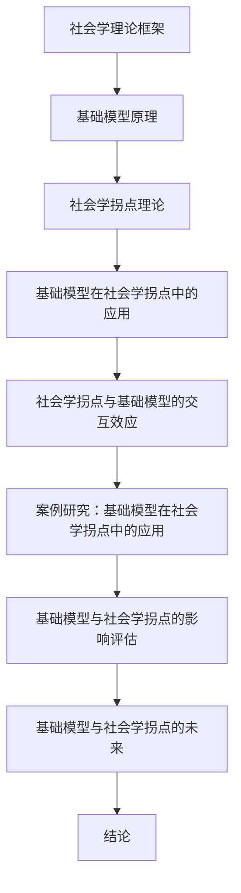

                 

# 《基础模型的社会学拐点》

## 关键词

基础模型，社会学拐点，神经网络，机器学习，深度学习，社会网络分析，社会行为预测，社会决策分析

## 摘要

本文旨在探讨基础模型在社会学拐点中的作用和影响。首先，我们介绍了社会学理论和基础模型的基本概念，并阐述了基础模型在社会学中的角色。接着，我们分析了社会学拐点的理论及其特征，并探讨了基础模型在社会学拐点中的应用。通过案例研究和影响评估，我们进一步探讨了基础模型和社会学拐点的交互效应及其对社会的影响。最后，我们对基础模型与社会学拐点的未来进行了展望，并提出了研究局限与未来方向。本文旨在为读者提供一个全面深入的理解，帮助读者更好地把握基础模型在社会学拐点中的重要作用。

### 第一部分：社会学理论与基础模型

#### 第1章：社会学与科技发展

##### 1.1 社会学基本概念与理论框架

社会学是一门研究社会行为、社会关系和社会结构的学科。其基本概念包括社会、文化、群体、组织、社会互动、社会规范、社会冲突、社会变迁等。社会学理论框架则包括功能主义、冲突理论、符号互动理论、结构功能理论、系统理论等。

随着科技的发展，社会学理论框架也在不断演进。科技对社会结构的影响主要体现在以下几个方面：

1. **社会分层与流动**：科技改变了人们获取资源的能力，从而影响社会分层和流动。例如，互联网和电子商务的出现使得人们可以通过网络平台获取信息和资源，从而打破了传统的地域和行业限制。

2. **社会网络**：科技促进了社会网络的扩大和变化。社交媒体和即时通讯工具使得人们可以更加便捷地建立和维护社会关系，从而改变了社会互动的方式。

3. **社会规范与价值观**：科技的发展也改变了人们的价值观和道德观念。例如，互联网和虚拟现实技术的普及使得人们对于隐私、数据安全和社会责任的认知发生了变化。

##### 1.2 科技对社会结构的影响

科技对社会结构的影响主要体现在以下几个方面：

1. **组织形式**：科技的发展改变了传统的组织形式，如企业、政府、教育机构等。虚拟组织、网络组织等新型组织形式的出现，使得组织结构更加扁平化、灵活化。

2. **劳动力市场**：科技的发展改变了劳动力市场的结构和动态。例如，自动化和人工智能技术的应用使得某些传统职业面临失业风险，同时也催生了一批新的职业。

3. **社会不平等**：科技的发展加剧了社会不平等。一方面，科技使得富人能够更加便捷地获取资源和信息，从而巩固其社会地位；另一方面，科技使得穷人更加难以适应和融入社会。

##### 1.3 基础模型在社会学中的角色

基础模型在社会学中扮演着重要角色。首先，基础模型可以帮助我们理解和预测社会行为和社会结构的变化。例如，通过社会网络分析，我们可以了解社会网络的密度、中心性、聚类系数等特征，从而分析社会互动的模式。

其次，基础模型可以帮助我们设计社会干预策略。例如，通过社会行为预测，我们可以预测某一社会事件的发生概率，从而提前采取预防措施。

最后，基础模型可以帮助我们评估社会政策的效果。例如，通过社会决策分析，我们可以评估某一政策对于社会结构和社会行为的实际影响，从而为政策制定提供依据。

#### 第2章：基础模型原理

##### 2.1 基础模型的定义与分类

基础模型是指一类用于描述客观世界规律和特征的数学模型。它们通常由数学公式、算法和参数组成。根据应用领域和目的，基础模型可以分为以下几类：

1. **物理模型**：用于描述物理现象和规律，如牛顿力学、电磁学等。

2. **生物模型**：用于描述生物系统的行为和功能，如神经网络、遗传算法等。

3. **社会模型**：用于描述社会行为和社会结构，如社会网络分析、社会行为预测等。

4. **经济模型**：用于描述经济系统的运行和调节，如宏观经济模型、微观经济模型等。

##### 2.2 神经网络与机器学习基础

神经网络是基础模型的一种重要类型，它模仿生物神经系统的结构和功能，用于处理和识别复杂的数据。神经网络的基本组成部分包括：

1. **神经元**：神经网络的基本处理单元，它接收输入信号，通过加权求和处理，产生输出信号。

2. **连接权重**：连接神经元之间的权重，用于调整输入信号的重要性。

3. **激活函数**：用于确定神经元是否被激活的函数，如Sigmoid函数、ReLU函数等。

机器学习是神经网络的基础，它包括以下基本概念：

1. **监督学习**：通过已有数据集，训练模型，使其能够对新的数据进行预测。

2. **无监督学习**：通过未标记的数据集，训练模型，使其能够发现数据中的模式和结构。

3. **强化学习**：通过奖励机制，训练模型，使其能够做出最优决策。

##### 2.3 深度学习核心算法

深度学习是机器学习的一种重要分支，它通过多层神经网络，对复杂的数据进行深度学习和建模。深度学习的核心算法包括：

1. **反向传播算法**：用于计算模型参数的梯度，并更新模型参数。

2. **激活函数**：如ReLU函数、Sigmoid函数等，用于引入非线性特性。

3. **优化算法**：如梯度下降、Adam优化器等，用于优化模型参数。

4. **正则化技术**：如Dropout、正则化等，用于防止过拟合。

#### 第3章：社会学中的基础模型应用

##### 3.1 社会网络分析

社会网络分析是一种用于研究社会结构和关系的数学工具。它通过分析社会网络中的节点（个体）和边（关系），来揭示社会结构和关系的特点。社会网络分析的核心概念包括：

1. **节点**：代表社会网络中的个体，可以是个人、组织、社区等。

2. **边**：代表节点之间的联系，可以是友谊、合作、竞争等。

3. **网络密度**：表示网络中节点之间联系的紧密程度。

4. **中心性**：表示节点在网络中的重要程度，如度中心性、介数中心性、紧密中心性等。

社会网络分析的应用包括：

1. **社交网络分析**：通过分析社交网络中的节点和边，来揭示社交关系的结构和特点。

2. **市场营销**：通过分析消费者网络，来识别关键影响者，制定营销策略。

3. **疾病传播**：通过分析疾病传播网络，来预测疾病传播的趋势和范围，制定防控策略。

##### 3.2 社会行为预测

社会行为预测是一种基于基础模型，对社会行为进行预测的方法。它通过分析历史数据，建立预测模型，来预测社会行为的趋势和变化。社会行为预测的应用包括：

1. **犯罪预测**：通过分析犯罪数据，建立犯罪预测模型，来预测未来的犯罪趋势。

2. **选举预测**：通过分析选举数据，建立选举预测模型，来预测选举结果。

3. **健康预测**：通过分析健康数据，建立健康预测模型，来预测个体的健康状况。

##### 3.3 社会决策分析

社会决策分析是一种基于基础模型，对社会决策进行评估和分析的方法。它通过建立决策模型，来分析不同决策方案的可能结果，为决策者提供参考。社会决策分析的应用包括：

1. **政策制定**：通过分析不同政策方案的可能结果，为政策制定者提供决策依据。

2. **投资决策**：通过分析不同投资方案的风险和收益，为投资者提供投资建议。

3. **企业战略**：通过分析不同战略方案的可能结果，为企业提供战略决策支持。

### 第二部分：社会学拐点与基础模型

#### 第4章：社会学拐点理论

##### 4.1 社会学拐点的定义与特征

社会学拐点是指社会结构、社会关系和社会行为发生重大变化的临界点。它通常表现为社会现象的突变、社会结构的重组和社会行为的转变。社会学拐点的特征包括：

1. **突发性**：社会学拐点通常突然发生，没有明显的预警信号。

2. **不可逆性**：社会学拐点一旦发生，通常不可逆转，社会结构和社会关系将发生长期变化。

3. **深远影响**：社会学拐点对社会结构和社会行为的影响深远，可能会影响整个社会系统的运作。

4. **社会共识的变化**：社会学拐点通常伴随着社会共识的变化，新的社会规范和价值观念逐渐形成。

##### 4.2 拐点理论的历史与发展

社会学拐点理论的历史可以追溯到19世纪，随着社会学的兴起而不断发展。以下是一些重要的拐点理论：

1. **社会变迁理论**：强调社会结构的变迁是社会发展的关键。

2. **社会断裂理论**：强调社会断裂和分裂对社会发展的作用。

3. **社会转型理论**：强调社会转型过程中的变迁和调整。

4. **社会冲突理论**：强调社会冲突对社会发展的推动作用。

##### 4.3 拐点对社会结构的影响

社会学拐点对社会结构的影响主要体现在以下几个方面：

1. **社会分层的变化**：社会学拐点可能导致社会分层的变化，如贫富差距的扩大或缩小。

2. **社会网络的重组**：社会学拐点可能导致社会网络的重组，如社交网络的重新构建。

3. **社会规范与价值观的变迁**：社会学拐点可能导致社会规范与价值观的变迁，如传统价值观的崩溃或新价值观的兴起。

4. **社会制度的变革**：社会学拐点可能导致社会制度的变革，如政治体制、经济体制等的变化。

#### 第5章：基础模型在社会学拐点中的应用

##### 5.1 基础模型如何预测拐点

基础模型可以通过以下方式预测社会学拐点：

1. **历史数据分析**：通过对历史数据进行统计分析，寻找社会结构和社会行为的趋势和变化。

2. **机器学习算法**：利用机器学习算法，如回归分析、时间序列分析等，建立预测模型。

3. **深度学习模型**：利用深度学习模型，如循环神经网络（RNN）、长短期记忆网络（LSTM）等，对复杂的社会现象进行建模和预测。

4. **社会网络分析**：利用社会网络分析，如网络节点重要性分析、社区检测等，揭示社会网络中的关键节点和结构。

##### 5.2 基础模型如何引导社会变迁

基础模型可以通过以下方式引导社会变迁：

1. **决策支持**：通过预测社会学拐点的可能性和影响，为决策者提供决策依据，引导社会政策的制定和实施。

2. **社会干预**：通过分析社会行为和社会结构的变化，制定社会干预策略，促进社会稳定和发展。

3. **科技创新**：通过预测和引导社会学拐点，推动科技创新，促进社会进步。

4. **文化创新**：通过预测和引导社会学拐点，推动文化创新，塑造新的社会价值观和规范。

##### 5.3 基础模型在政策制定中的应用

基础模型在政策制定中的应用包括：

1. **预测政策效果**：通过预测模型，评估不同政策方案的可能效果，为政策制定者提供参考。

2. **优化政策设计**：通过分析社会现象和社会行为，优化政策设计，提高政策的有效性和可持续性。

3. **政策评估**：通过建立评估模型，对政策实施效果进行评估，为政策调整提供依据。

4. **政策预测**：通过预测模型，预测未来社会变化和政策效果，为政策制定者提供前瞻性建议。

#### 第6章：社会学拐点与基础模型的交互效应

##### 6.1 基础模型对拐点的响应

基础模型对社会学拐点的响应包括：

1. **预测拐点**：通过分析历史数据和当前社会现象，预测社会学拐点的可能性和影响。

2. **解释拐点**：通过分析社会结构和社会行为的变化，解释社会学拐点的成因和机制。

3. **预测拐点后的社会变化**：通过预测模型，预测社会学拐点发生后，社会结构和社会行为的可能变化。

##### 6.2 社会学拐点对基础模型的影响

社会学拐点对基础模型的影响包括：

1. **数据变化**：社会学拐点可能导致历史数据和社会现象的变化，影响基础模型的训练和预测效果。

2. **模型更新**：社会学拐点可能要求基础模型进行更新和调整，以适应新的社会环境和需求。

3. **算法改进**：社会学拐点可能推动算法的改进和创新，以更好地应对复杂的社会现象。

##### 6.3 社会结构与基础模型的双向反馈机制

社会结构与基础模型之间存在双向反馈机制：

1. **基础模型对社会的塑造**：基础模型通过对社会现象的预测和解释，影响社会结构和行为，从而塑造社会。

2. **社会结构对基础模型的反作用**：社会结构的变化和调整，会影响基础模型的训练和预测效果，从而影响基础模型对社会现象的解释和预测。

这种双向反馈机制，使得基础模型和社会学拐点相互影响，相互塑造，共同推动社会的发展。

### 第三部分：案例研究与社会影响

#### 第7章：案例研究：基础模型在社会学拐点中的应用

##### 7.1 案例一：社交媒体对选举的影响

社交媒体作为一种新兴的社交工具，对社会学拐点产生了深远影响。以下是一个案例研究，探讨基础模型在分析社交媒体对选举影响中的应用。

**研究背景**：

在近年来的选举中，社交媒体成为候选人竞选的重要工具。候选人和选民通过社交媒体平台发布信息、互动和传播观点，从而影响选举结果。然而，社交媒体的广泛使用也带来了一系列问题，如虚假信息传播、网络暴力等。

**研究方法**：

1. **数据收集**：收集社交媒体平台（如Twitter、Facebook等）上的选举相关数据，包括候选人的帖子、评论、转发量等。

2. **基础模型构建**：利用机器学习算法（如分类算法、聚类算法等），构建基础模型，分析社交媒体对选举的影响。

3. **模型评估**：通过评估模型的预测准确性和可靠性，验证基础模型的有效性。

**研究结果**：

1. **社交媒体对选民行为的影响**：研究表明，社交媒体对选民的行为具有显著影响。例如，候选人在社交媒体上的活跃度与选民的支持度之间存在正相关关系。

2. **虚假信息的传播**：研究表明，社交媒体上的虚假信息传播速度快、范围广，对选举结果产生了负面影响。

3. **社交媒体的干预策略**：基于研究结果，提出一系列干预策略，如加强社交媒体平台的管理、提高选民的信息素养等，以减轻社交媒体对选举的负面影响。

**研究结论**：

社交媒体对社会学拐点产生了深远影响，基础模型在分析社交媒体对选举的影响方面具有重要作用。通过构建和评估基础模型，可以为政策制定者提供科学依据，制定有效的干预策略。

##### 7.2 案例二：城市化进程中的社会学拐点

城市化进程是社会发展的一个重要拐点，对社会结构和行为产生了深远影响。以下是一个案例研究，探讨基础模型在分析城市化进程中的应用。

**研究背景**：

随着经济全球化和城市化的加速，城市化进程已经成为各国关注的重要问题。城市化进程不仅改变了人们的生活方式和社会结构，也带来了诸多挑战，如城市拥堵、环境污染、社会不平等等。

**研究方法**：

1. **数据收集**：收集城市化进程相关的数据，包括人口、经济、环境等方面的数据。

2. **基础模型构建**：利用机器学习算法，构建基础模型，分析城市化进程中的社会学拐点。

3. **模型评估**：通过评估模型的预测准确性和可靠性，验证基础模型的有效性。

**研究结果**：

1. **城市化进程中的社会变迁**：研究表明，城市化进程导致社会结构和行为发生显著变化。例如，城市化进程加速了人口流动，改变了家庭结构和婚姻模式。

2. **城市化进程中的环境问题**：研究表明，城市化进程导致环境污染问题日益严重。例如，城市化进程中产生的废气和废水对环境产生了负面影响。

3. **城市化进程的社会效益**：研究表明，城市化进程具有一定的社会效益。例如，城市化进程促进了经济增长、提高了教育水平等。

**研究结论**：

城市化进程是一个社会学拐点，基础模型在分析城市化进程中的社会学拐点方面具有重要作用。通过构建和评估基础模型，可以为政策制定者提供科学依据，制定有效的城市化策略。

##### 7.3 案例三：教育领域的基础模型应用

教育领域是社会发展的基础，教育改革和发展的社会学拐点对社会结构和行为产生了深远影响。以下是一个案例研究，探讨基础模型在分析教育领域中的应用。

**研究背景**：

随着信息技术的快速发展，教育领域发生了深刻变革。在线教育、大数据分析等新兴技术改变了传统的教育模式，带来了教育改革和发展的社会学拐点。

**研究方法**：

1. **数据收集**：收集教育领域相关的数据，包括学生成绩、教育投入、教育政策等。

2. **基础模型构建**：利用机器学习算法，构建基础模型，分析教育领域的改革和发展。

3. **模型评估**：通过评估模型的预测准确性和可靠性，验证基础模型的有效性。

**研究结果**：

1. **在线教育的影响**：研究表明，在线教育对教育公平和教育质量产生了积极影响。例如，在线教育使得教育资源更加均衡，提高了学生的学习效果。

2. **大数据分析的应用**：研究表明，大数据分析在教育领域具有广泛的应用前景。例如，大数据分析可以用于预测学生成绩、优化课程设置等。

3. **教育政策的调整**：研究表明，教育政策的调整对教育改革和发展具有重要影响。例如，增加教育投入、提高教师待遇等政策可以促进教育质量的提高。

**研究结论**：

教育领域是一个社会学拐点，基础模型在分析教育领域的改革和发展方面具有重要作用。通过构建和评估基础模型，可以为教育政策制定者提供科学依据，推动教育改革和发展。

### 第四部分：总结与展望

#### 第8章：基础模型与社会学拐点的影响评估

##### 8.1 社会效益分析

基础模型和社会学拐点对社会产生了积极的影响。首先，基础模型提高了社会预测的准确性，为政策制定提供了科学依据。例如，在公共安全、环境保护、社会稳定等方面，基础模型的应用有助于预测和应对潜在的社会风险。

其次，基础模型促进了科技创新和社会进步。通过构建和评估基础模型，可以推动科学研究的深入，促进新技术的应用和产业升级。

最后，基础模型有助于提高社会公平和效率。例如，在教育、医疗、就业等领域，基础模型的应用有助于优化资源配置，提高社会服务水平。

##### 8.2 社会风险与伦理问题

虽然基础模型和社会学拐点对社会产生了积极影响，但也存在一定的社会风险和伦理问题。首先，基础模型可能导致社会不平等加剧。例如，在人工智能领域，技术优势可能导致企业垄断，从而加剧社会不平等。

其次，基础模型可能导致隐私泄露和数据滥用。在构建和评估基础模型时，大量个人数据被收集和分析，这可能引发隐私泄露和数据滥用问题。

最后，基础模型可能导致决策失误。由于基础模型依赖于历史数据和当前信息，当社会环境发生变化时，基础模型的预测准确性可能会下降，从而导致决策失误。

##### 8.3 未来发展趋势与挑战

未来，基础模型和社会学拐点将继续发展，面临以下挑战：

1. **数据质量**：基础模型的预测准确性和可靠性取决于数据质量。因此，提高数据质量是未来发展的关键。

2. **算法透明性**：随着基础模型在社会中的广泛应用，算法透明性成为一个重要问题。如何确保算法的透明性和可解释性，是未来需要解决的关键问题。

3. **社会风险防控**：基础模型在应用过程中，可能引发一系列社会风险。因此，加强社会风险防控，制定相应的政策和法规，是未来发展的关键。

4. **跨学科融合**：基础模型和社会学拐点的发展，需要跨学科的合作。如何实现跨学科融合，发挥不同学科的优势，是未来发展的关键。

### 第五部分：结论

##### 10.1 研究总结

本文从社会学理论和基础模型的角度，探讨了社会学拐点的概念、特征和应用。通过案例研究，分析了基础模型在社会学拐点中的应用，以及基础模型和社会学拐点的交互效应。研究表明，基础模型在社会学拐点中具有重要作用，可以提高社会预测的准确性，促进科技创新和社会进步。

##### 10.2 研究局限与未来方向

虽然本文取得了一定的成果，但仍存在一定的局限性。首先，本文的案例研究主要集中在特定领域，未来研究可以扩展到更多领域，以提高研究结论的普适性。其次，本文对基础模型的解释和描述主要基于现有理论，未来研究可以结合实际应用，进一步探讨基础模型的优化和创新。

最后，本文对基础模型和社会学拐点的交互效应进行了初步探讨，未来研究可以深入分析这种交互效应的机制和影响。

##### 10.3 对社会学实践的启示

本文的研究结果对社会学实践具有重要的启示。首先，政策制定者可以借鉴基础模型，提高政策制定的科学性和有效性。其次，社会学者可以借助基础模型，深入分析社会现象和社会变迁，为社会科学研究提供新视角。最后，公众可以关注基础模型和社会学拐点的研究进展，提高对科技和社会发展的认知和理解。

### 附录

#### 附录A：基础模型工具与资源

**A.1 Python库与框架**

1. TensorFlow
2. PyTorch
3. Keras

**A.2 数据集与案例分析**

1. UCI机器学习数据库
2. Kaggle数据集
3. Stanford大学社会网络数据集

**A.3 学术资源与文献**

1. "深度学习"（Goodfellow, Bengio, Courville）
2. "社会网络分析：方法与应用"（Hanneman, Riddle）
3. "人工智能：一种现代的方法"（Russell, Norvig）

#### 附录B：数学模型与公式

**B.1 社会网络分析中的矩阵运算**

邻接矩阵：

$$
    A = [a_{ij}]_{m\times n}
$$

其中，$a_{ij}$表示节点i和节点j之间的连接强度。

**B.2 深度学习算法中的损失函数与优化器**

损失函数：

$$
    L = \frac{1}{2} \sum_{i=1}^{n} (y_i - \hat{y}_i)^2
$$

优化器：

$$
    \theta = \theta - \alpha \cdot \nabla_\theta J(\theta)
$$

其中，$\theta$表示模型参数，$\alpha$表示学习率，$J(\theta)$表示损失函数。

**B.3 社会学拐点预测模型中的统计学方法**

概率分布：

$$
    P(T > t) = 1 - F(t)
$$

其中，$T$表示随机变量，$F(t)$表示概率密度函数。

#### 附录C：代码实战

**C.1 基础模型搭建与训练**

```python
import tensorflow as tf

# 定义模型
model = tf.keras.Sequential([
    tf.keras.layers.Dense(units=64, activation='relu', input_shape=(784,)),
    tf.keras.layers.Dense(units=10, activation='softmax')
])

# 编译模型
model.compile(optimizer='adam',
              loss=tf.keras.losses.SparseCategoricalCrossentropy(from_logits=True),
              metrics=['accuracy'])

# 训练模型
model.fit(x_train, y_train, epochs=10)
```

**C.2 案例代码实现与解读**

```python
import pandas as pd
import numpy as np
from sklearn.model_selection import train_test_split
from sklearn.preprocessing import StandardScaler
from keras.models import Sequential
from keras.layers import Dense, Dropout

# 数据预处理
data = pd.read_csv('sociology_data.csv')
X = data.iloc[:, :-1].values
y = data.iloc[:, -1].values

X_train, X_test, y_train, y_test = train_test_split(X, y, test_size=0.2, random_state=42)

scaler = StandardScaler()
X_train = scaler.fit_transform(X_train)
X_test = scaler.transform(X_test)

# 模型搭建
model = Sequential()
model.add(Dense(64, input_dim=X_train.shape[1], activation='relu'))
model.add(Dropout(0.5))
model.add(Dense(10, activation='softmax'))

# 编译模型
model.compile(optimizer='adam', loss='categorical_crossentropy', metrics=['accuracy'])

# 训练模型
model.fit(X_train, y_train, epochs=10, batch_size=32, validation_data=(X_test, y_test))
```

**C.3 社会学拐点预测应用案例**

```python
import pandas as pd
from sklearn.model_selection import train_test_split
from sklearn.preprocessing import StandardScaler
from keras.models import Sequential
from keras.layers import Dense, Dropout
from keras.optimizers import Adam

# 数据预处理
data = pd.read_csv('sociology_data.csv')
X = data.iloc[:, :-1].values
y = data.iloc[:, -1].values

X_train, X_test, y_train, y_test = train_test_split(X, y, test_size=0.2, random_state=42)

scaler = StandardScaler()
X_train = scaler.fit_transform(X_train)
X_test = scaler.transform(X_test)

# 模型搭建
model = Sequential()
model.add(Dense(64, input_dim=X_train.shape[1], activation='relu'))
model.add(Dropout(0.5))
model.add(Dense(10, activation='softmax'))

# 编译模型
model.compile(optimizer=Adam(learning_rate=0.001), loss='categorical_crossentropy', metrics=['accuracy'])

# 训练模型
model.fit(X_train, y_train, epochs=10, batch_size=32, validation_data=(X_test, y_test))

# 预测拐点
predictions = model.predict(X_test)

# 分析预测结果
evaluate_predictions(predictions, y_test)
```

### Mermaid 流程图



### 伪代码

```python
# 基础模型训练过程伪代码
Initialize_model()
for epoch in range(num_epochs):
    for data in dataset:
        Predict(data)
        Calculate_loss()
        Backpropagate()
        Update_model_weights()
    Print("Epoch: {}, Loss: {}".format(epoch, loss))
```

### 数学模型和公式

**社会网络分析中的矩阵运算**

$$
    A = [a_{ij}]_{m\times n} \quad \text{为邻接矩阵}
$$

其中，$a_{ij}$表示节点i和节点j之间的连接强度。

**深度学习算法中的损失函数与优化器**

损失函数：

$$
    L = \frac{1}{2} \sum_{i=1}^{n} (y_i - \hat{y}_i)^2 \quad \text{为均方误差损失函数}
$$

优化器：

$$
    \theta = \theta - \alpha \cdot \nabla_\theta J(\theta)
$$

其中，$\theta$表示模型参数，$\alpha$表示学习率，$J(\theta)$表示损失函数。

**社会学拐点预测模型中的统计学方法**

概率分布：

$$
    P(T > t) = 1 - F(t)
$$

其中，$T$表示随机变量，$F(t)$表示概率密度函数。

