                 

# 文章标题

基础模型的视觉能力

> 关键词：视觉感知、图像处理、特征提取、卷积神经网络、深度学习

> 摘要：本文将深入探讨基础模型在视觉感知领域的应用，从视觉基础理论到深度学习模型，解析其核心原理、算法实现及应用场景。文章结构清晰，逻辑严谨，旨在为广大技术爱好者提供一份详实的视觉技术指南。

----------------------------------------------------------------

### 《基础模型的视觉能力》目录大纲

# 第一部分：视觉基础理论

## 第1章：视觉感知的原理

### 第2章：图像处理基础

### 第3章：特征提取与描述

# 第二部分：基础模型原理与应用

## 第4章：卷积神经网络基础

## 第5章：深度神经网络的应用

## 第6章：深度学习的优化与改进

## 第7章：基础模型在计算机视觉中的应用实战

## 第8章：基础模型在计算机视觉中的未来发展趋势

## 附录

### 附录 A：深度学习框架与工具

### 附录 B：参考资料与拓展阅读

----------------------------------------------------------------

## 第1章：视觉感知的原理

视觉感知是人类获取外界信息的重要途径，它涉及到从感官接收、处理到认知理解的全过程。本章将介绍视觉感知的基本原理，包括视觉系统的结构、视觉信息传递路径以及视觉感知的基本过程。

### 1.1 视觉系统的基础结构

视觉系统是人脑与眼睛共同构成的感知系统，它主要包括视网膜、视神经和视皮层等部分。

#### 1.1.1 视网膜的结构和功能

视网膜是眼睛中最内层的组织，它包括光感受器层、双极细胞层和神经节细胞层。光感受器层主要包括视杆细胞和视锥细胞，它们负责接收光线并将其转换为神经信号。

**视网膜的结构和功能**可以用如下 Mermaid 流程图表示：

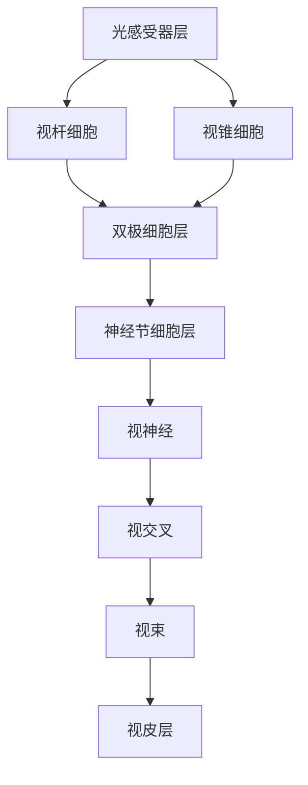

#### 1.1.2 视觉信息的传递路径

视觉信息的传递路径如下：

```latex
\text{视觉信息传递路径} = \text{视网膜} \rightarrow \text{视神经} \rightarrow \text{视交叉} \rightarrow \text{视束} \rightarrow \text{视皮层}
```

### 1.2 视觉感知的基本过程

视觉感知是一个复杂的过程，它包括边缘检测、形状识别和空间感知等基本步骤。

#### 1.2.1 边缘检测

边缘检测是图像处理中的一种基本操作，它用于提取图像中的边缘信息。边缘检测通常使用滤波器来实现，如Canny算法。

**Canny算法的基本步骤**如下：

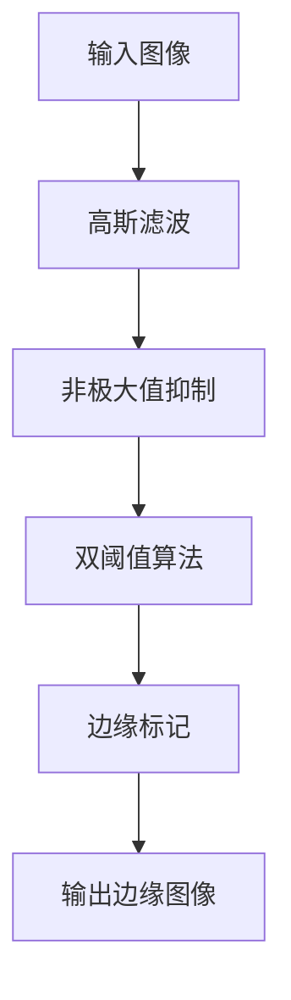

#### 1.2.2 形状识别

形状识别是视觉感知中重要的一环，它通过特征点匹配和形状描述符来实现。

**SIFT算法的伪代码**如下：

```python
def SIFT(image):
    # 步骤1：检测关键点
    keypoints = detect_keypoints(image)
    
    # 步骤2：计算描述子
    descriptors = calculate_descriptors(image, keypoints)
    
    # 步骤3：匹配关键点
    matches = match_keypoints(descriptors)
    
    # 步骤4：形状识别
    shape = recognize_shape(image, matches)
    
    return shape
```

#### 1.2.3 空间感知

空间感知是通过深度信息来感知三维空间的能力。在计算机视觉中，深度信息通常通过图像中的视差计算得到。

**视差计算的基本步骤**如下：

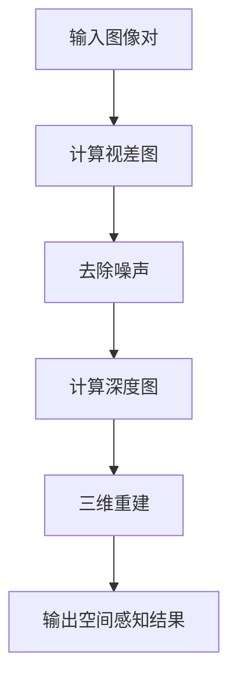

通过以上对视觉感知原理的介绍，我们可以看到视觉感知是一个复杂但极为重要的过程。接下来，我们将深入探讨图像处理的基础知识，为后续的内容奠定基础。

----------------------------------------------------------------

## 第2章：图像处理基础

图像处理是计算机视觉中不可或缺的一环，它涉及到图像的表示、处理、增强、复原以及颜色处理等内容。本章将详细介绍这些基础概念和技术。

### 2.1 图像表示与处理技术

#### 2.1.1 图像数据结构

图像在计算机中通常以像素矩阵的形式表示。每个像素点具有特定的颜色值，这些颜色值可以用一个二维数组来存储。

**图像数据结构**可以用如下 Mermaid 流程图表示：

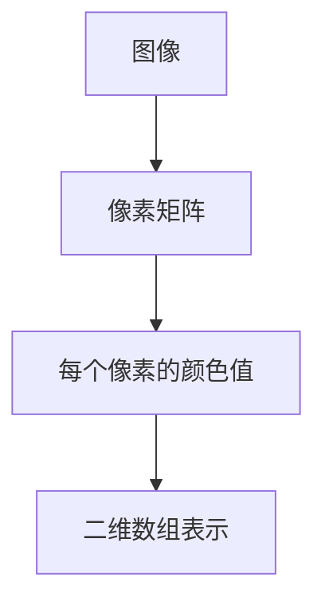

#### 2.1.2 点操作

点操作是对图像中单个像素点进行的操作，如像素值修改和矩阵运算。

**像素值修改的伪代码**如下：

```python
def modify_pixel_value(image, x, y, new_value):
    image[x, y] = new_value
    return image
```

**矩阵运算的伪代码**如下：

```python
def matrix_operation(image, operation):
    for x in range(image.width):
        for y in range(image.height):
            image[x, y] = operation(image[x, y])
    return image
```

### 2.2 图像增强与复原

图像增强和复原是改善图像质量的重要技术。图像增强通常通过调整图像的亮度、对比度和颜色来提高视觉效果，而图像复原则试图恢复图像中的细节和结构。

#### 2.2.1 图像增强技术

图像增强技术包括直方图均衡化、对数变换等。

**直方图均衡化的伪代码**如下：

```python
def histogram_equalization(image):
    # 步骤1：计算直方图
    histogram = calculate_histogram(image)
    
    # 步骤2：计算累积分布函数
    cdf = calculate_cdf(histogram)
    
    # 步骤3：调整像素值
    for x in range(image.width):
        for y in range(image.height):
            image[x, y] = adjust_pixel_value(image[x, y], cdf)
    
    return image
```

**对数变换的伪代码**如下：

```python
def logarithmic_transformation(image):
    for x in range(image.width):
        for y in range(image.height):
            image[x, y] = log(image[x, y])
    return image
```

#### 2.2.2 图像复原算法

图像复原算法旨在去除图像中的噪声和失真，如反卷积和空间滤波。

**反卷积的伪代码**如下：

```python
def deconvolution(image, kernel):
    # 步骤1：计算卷积逆
    inverse_kernel = calculate_inverse(kernel)
    
    # 步骤2：进行反卷积操作
    restored_image = convolve(image, inverse_kernel)
    
    return restored_image
```

**空间滤波的伪代码**如下：

```python
def spatial_filtering(image, filter):
    for x in range(image.width):
        for y in range(image.height):
            image[x, y] = apply_filter(image[x, y], filter)
    return image
```

### 2.3 颜色处理与分割

颜色处理和分割是图像处理中的重要步骤，它们涉及到颜色模型、颜色空间转换和分割方法。

#### 2.3.1 颜色模型

颜色模型用于描述图像中的颜色信息。常见的颜色模型包括RGB、HSV和YUV等。

**RGB到HSV的转换公式**如下：

```latex
\begin{align*}
H &= \arccos\left(\frac{R - 0.5 \times G - 0.5 \times B}{\sqrt{(R - G)^2 + (R - B)(G - B)}}\right) \\
S &= 1 - \frac{3}{R + G + B} \\
V &= \frac{1}{3} \times \max(R, G, B)
\end{align*}
```

#### 2.3.2 颜色空间转换

颜色空间转换是不同颜色模型之间的转换过程。常见的转换方法包括RGB到HSV、RGB到YUV等。

**RGB到HSV的伪代码**如下：

```python
def rgb_to_hsv(r, g, b):
    v = max(r, g, b)
    if v == 0:
        s = 0
    else:
        s = 1 - 3 * min(r, g, b) / v
    
    r, g, b = r / v, g / v, b / v
    
    if g > b:
        h = 60 * ((b - r) / (g - r))
    else:
        h = 60 * ((r - b) / (g - r))
    
    if h < 0:
        h += 360
    
    return h, s, v
```

#### 2.3.3 颜色分割方法

颜色分割是图像处理中用于提取特定颜色区域的方法。常见的分割方法包括阈值分割和区域增长等。

**阈值分割的伪代码**如下：

```python
def thresholding(image, threshold):
    for x in range(image.width):
        for y in range(image.height):
            if image[x, y] > threshold:
                image[x, y] = 255
            else:
                image[x, y] = 0
    return image
```

**区域增长的伪代码**如下：

```python
def region_growing(image, seed_points, threshold):
    for seed in seed_points:
        grow_region(image, seed, threshold)
    return image

def grow_region(image, seed, threshold):
    stack = [seed]
    while stack:
        current = stack.pop()
        for neighbor in get_neighbors(image, current):
            if abs(image[current] - image[neighbor]) <= threshold and image[neighbor] not in [0, 255]:
                image[neighbor] = 255
                stack.append(neighbor)
```

通过以上对图像处理基础知识的介绍，我们可以看到图像处理在计算机视觉中的重要性。接下来，我们将深入探讨特征提取与描述的方法，为构建强大的视觉系统奠定基础。

----------------------------------------------------------------

## 第3章：特征提取与描述

特征提取与描述是计算机视觉中的关键步骤，它涉及从图像中提取具有区分性的特征，并描述这些特征以供后续处理。本章将详细介绍特征提取与描述的方法，包括边缘检测、角点检测、轮廓提取以及SIFT、SURF、HOG算法等。

### 3.1 特征提取方法

特征提取方法旨在从图像中提取具有区分性的特征，以便后续的图像匹配、分类或识别。

#### 3.1.1 边缘检测

边缘检测是图像处理中的一种基本操作，它用于提取图像中的边缘信息。常用的边缘检测算法包括Canny算法、Sobel算子等。

**Canny算法的基本步骤**如下：

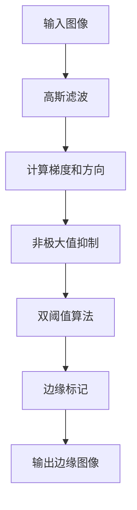

**Canny算法的伪代码**如下：

```python
def Canny(image, threshold1, threshold2):
    # 步骤1：高斯滤波
    blurred_image = GaussianBlur(image)
    
    # 步骤2：计算梯度和方向
    gradient = compute_gradient(blurred_image)
    
    # 步骤3：非极大值抑制
    suppressed_edges = non_max_suppression(gradient)
    
    # 步骤4：双阈值算法
    edges = hysteresis_thresholding(suppressed_edges, threshold1, threshold2)
    
    return edges
```

#### 3.1.2 角点检测

角点检测是用于检测图像中的角点或特征点的方法。常用的角点检测算法包括Harris角点检测算法、Shi-Tomasi角点检测算法等。

**Harris角点检测算法的基本步骤**如下：

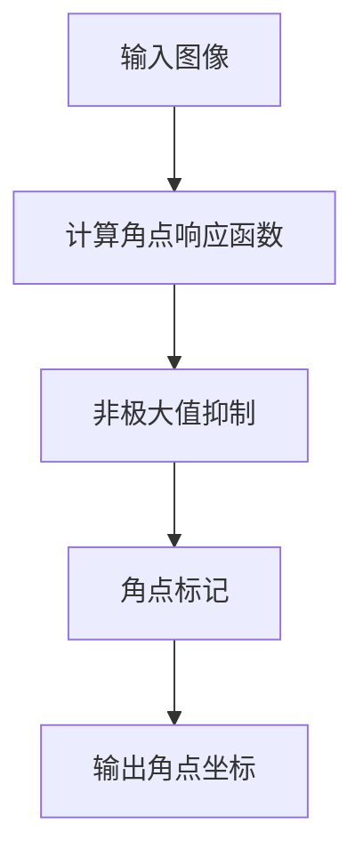

**Harris角点检测算法的伪代码**如下：

```python
def Harris(image, block_size, k):
    # 步骤1：计算角点响应函数
    response = compute_harris_response(image, block_size, k)
    
    # 步骤2：非极大值抑制
    suppressed_points = non_max_suppression(response)
    
    # 步骤3：角点标记
    keypoints = mark_keypoints(response, suppressed_points)
    
    return keypoints
```

#### 3.1.3 轮廓提取

轮廓提取是用于提取图像中的轮廓信息的方法。常用的轮廓提取算法包括Contour算法、Cv.FindContours等。

**Contour算法的基本步骤**如下：

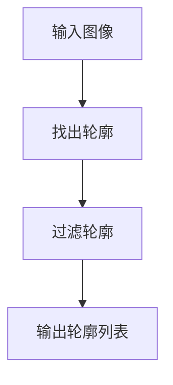

**Contour算法的伪代码**如下：

```python
def find_contours(image):
    # 步骤1：找出轮廓
    contours, _ = cv.findContours(image, cv.RETR_TREE, cv.CHAIN_APPROX_SIMPLE)
    
    # 步骤2：过滤轮廓
    filtered_contours = filter_contours(contours)
    
    # 步骤3：输出轮廓列表
    return filtered_contours
```

### 3.2 特征描述方法

特征描述方法用于描述提取出的特征，以便后续的图像匹配或分类。常用的特征描述方法包括SIFT、SURF、HOG算法等。

#### 3.2.1 SIFT算法

SIFT（Scale-Invariant Feature Transform）是一种广泛应用于图像匹配的特征描述方法。SIFT算法的基本步骤如下：

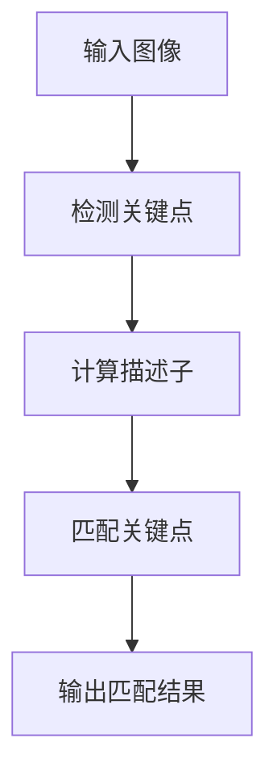

**SIFT算法的伪代码**如下：

```python
def SIFT(image):
    # 步骤1：检测关键点
    keypoints = detect_keypoints(image)
    
    # 步骤2：计算描述子
    descriptors = calculate_descriptors(image, keypoints)
    
    # 步骤3：匹配关键点
    matches = match_keypoints(descriptors)
    
    # 步骤4：输出匹配结果
    return matches
```

#### 3.2.2 SURF算法

SURF（Speeded Up Robust Features）是另一种广泛应用于图像匹配的特征描述方法。SURF算法的基本步骤如下：


**SURF算法的伪代码**如下：

```python
def SURF(image):
    # 步骤1：检测关键点
    keypoints = detect_keypoints(image)
    
    # 步骤2：计算描述子
    descriptors = calculate_descriptors(image, keypoints)
    
    # 步骤3：匹配关键点
    matches = match_keypoints(descriptors)
    
    # 步骤4：输出匹配结果
    return matches
```

#### 3.2.3 HOG算法

HOG（Histogram of Oriented Gradients）是一种用于目标检测的特征描述方法。HOG算法的基本步骤如下：

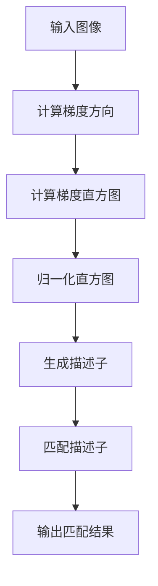

**HOG算法的伪代码**如下：

```python
def HOG(image):
    # 步骤1：计算梯度方向
    gradient_directions = compute_gradient_directions(image)
    
    # 步骤2：计算梯度直方图
    gradient_histograms = compute_gradient_histograms(gradient_directions)
    
    # 步骤3：归一化直方图
    normalized_histograms = normalize_histograms(gradient_histograms)
    
    # 步骤4：生成描述子
    descriptors = generate_descriptors(normalized_histograms)
    
    # 步骤5：匹配描述子
    matches = match_descriptors(descriptors)
    
    # 步骤6：输出匹配结果
    return matches
```

通过以上对特征提取与描述方法的介绍，我们可以看到特征提取与描述在计算机视觉中的重要性。这些方法为我们构建强大的视觉系统提供了有力的工具。接下来，我们将深入探讨卷积神经网络的基础知识，为构建先进的视觉模型奠定基础。

----------------------------------------------------------------

## 第4章：卷积神经网络基础

卷积神经网络（Convolutional Neural Network，CNN）是计算机视觉领域最为重要的深度学习模型之一。本章将详细介绍卷积神经网络的基本结构、训练与优化过程以及其在图像分类、目标检测和图像分割等应用中的具体实现。

### 4.1 卷积神经网络的基本结构

卷积神经网络的基本结构由三个主要部分组成：卷积层、池化层和全连接层。

#### 4.1.1 卷积层

卷积层是卷积神经网络的核心组成部分，其主要作用是对输入图像进行特征提取。卷积层由多个卷积核（也称为滤波器）组成，每个卷积核对输入图像进行局部卷积操作，从而生成特征图。

**卷积操作的伪代码**如下：

```python
def convolve(image, filter):
    feature_map = []
    for i in range(image.height - filter.height + 1):
        for j in range(image.width - filter.width + 1):
            sum = 0
            for x in range(filter.height):
                for y in range(filter.width):
                    sum += image[i + x][j + y] * filter[x][y]
            feature_map.append(sum)
    return feature_map
```

#### 4.1.2 池化层

池化层的主要作用是降低特征图的维度，减少计算量和参数数量。常见的池化方法包括最大池化和平均池化。

**最大池化的伪代码**如下：

```python
def max_pooling(feature_map, pool_size):
    pooled_map = []
    for i in range(feature_map.shape[0] - pool_size + 1):
        for j in range(feature_map.shape[1] - pool_size + 1):
            max_value = 0
            for x in range(pool_size):
                for y in range(pool_size):
                    if feature_map[i + x][j + y] > max_value:
                        max_value = feature_map[i + x][j + y]
            pooled_map.append(max_value)
    return pooled_map
```

#### 4.1.3 全连接层

全连接层是卷积神经网络的输出层，其主要作用是对卷积层和池化层提取的特征进行分类。全连接层由多个神经元组成，每个神经元都与上一层的所有神经元相连接。

**全连接层的前向传播算法**如下：

```python
def forwardPropagation(inputs, weights, biases):
    outputs = []
    for layer in range(len(weights)):
        z = np.dot(inputs, weights[layer]) + biases[layer]
        outputs.append(np.tanh(z))
        inputs = outputs[layer]
    return outputs[-1]
```

### 4.2 卷积神经网络的训练与优化

卷积神经网络的训练过程包括前向传播和反向传播两个主要步骤。在前向传播过程中，我们将输入图像通过卷积层、池化层和全连接层，得到模型的输出。在反向传播过程中，我们根据模型的输出和真实标签计算损失函数，并通过梯度下降算法更新模型参数。

**前向传播算法**如下：

```python
def forwardPropagation(image, model):
    output = image
    for layer in model.layers:
        if isinstance(layer, Conv2D):
            output = layer.convolve(output)
        elif isinstance(layer, MaxPooling2D):
            output = layer.max_pooling(output)
        elif isinstance(layer, Dense):
            output = layer.forwardPropagation(output)
    return output
```

**反向传播算法**如下：

```python
def backwardPropagation(output, model, target):
    loss = compute_loss(output, target)
    d_output = compute_gradient(output, target)
    for layer in model.layers:
        if isinstance(layer, Conv2D):
            d_input = layer.backwardPropagation(d_output)
            d_output = layer.convolve(d_input)
        elif isinstance(layer, MaxPooling2D):
            d_output = layer.backwardPropagation(d_output)
        elif isinstance(layer, Dense):
            d_output = layer.backwardPropagation(d_output)
    return loss, d_output
```

### 4.3 卷积神经网络的应用案例

卷积神经网络在图像分类、目标检测和图像分割等领域有着广泛的应用。以下是这些应用领域的一些具体案例。

#### 4.3.1 图像分类

图像分类是卷积神经网络最基本的应用之一。在这个应用中，我们的目标是给定一张图像，判断它所属的类别。

**图像分类的伪代码**如下：

```python
def classify_image(image, model):
    output = forwardPropagation(image, model)
    predicted_class = np.argmax(output)
    return predicted_class
```

#### 4.3.2 目标检测

目标检测是卷积神经网络在计算机视觉中的另一个重要应用。在这个应用中，我们的目标是给定一张图像，检测出图像中的目标物体。

**目标检测的伪代码**如下：

```python
def detect_objects(image, model):
    output = forwardPropagation(image, model)
    detections = non_max_suppression(output)
    objects = []
    for detection in detections:
        class_id, confidence = detection
        if confidence > threshold:
            objects.append((class_id, confidence))
    return objects
```

#### 4.3.3 图像分割

图像分割是将图像划分为不同区域的过程。在这个应用中，我们的目标是给定一张图像，将其分割为前景和背景。

**图像分割的伪代码**如下：

```python
def segment_image(image, model):
    output = forwardPropagation(image, model)
    mask = threshold(output, threshold)
    segmented_image = apply_mask(image, mask)
    return segmented_image
```

通过以上对卷积神经网络基础知识的介绍，我们可以看到卷积神经网络在计算机视觉中的重要性。它为解决复杂的视觉任务提供了强大的工具。接下来，我们将深入探讨深度神经网络的应用，进一步拓展我们的视野。

----------------------------------------------------------------

## 第5章：深度神经网络的应用

深度神经网络（Deep Neural Network，DNN）是近年来在人工智能领域取得显著进展的一类神经网络。本章将介绍深度神经网络的发展历程、核心算法以及其在自然语言处理、计算机视觉和语音识别等领域的应用。

### 5.1 深度神经网络的发展历程

深度神经网络的发展历程可以追溯到20世纪40年代，但真正的突破是在近年来。以下是深度神经网络发展的重要里程碑：

#### 5.1.1 深度信念网络（Deep Belief Network，DBN）

深度信念网络是一种多层神经网络，由多组限制性波尔兹曼机（RBM）堆叠而成。RBM是一种简单但有效的无监督学习模型，通过学习数据的概率分布来提取特征。

**深度信念网络的架构**：

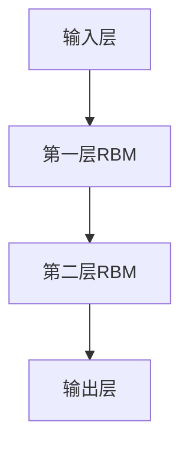

#### 5.1.2 卷积神经网络（Convolutional Neural Network，CNN）

卷积神经网络是深度神经网络在计算机视觉领域的重要应用。CNN通过卷积层、池化层和全连接层等结构，实现对图像的自动特征提取和分类。

**卷积神经网络的架构**：

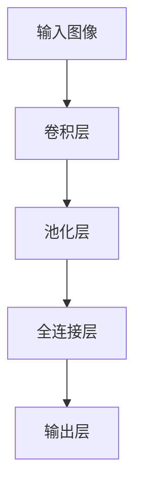

#### 5.1.3 循环神经网络（Recurrent Neural Network，RNN）

循环神经网络是一种适用于序列数据的神经网络。RNN通过循环结构来处理时间序列数据，可以捕捉到序列中的长距离依赖关系。

**循环神经网络的架构**：

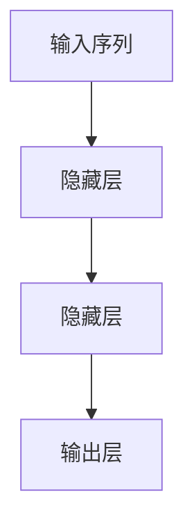

### 5.2 深度神经网络的核心算法

深度神经网络的核心算法包括反向传播算法、卷积操作和循环操作。

#### 5.2.1 反向传播算法

反向传播算法是一种用于训练神经网络的优化算法。它通过计算网络输出的误差梯度，来更新网络中的权重和偏置。

**反向传播算法的基本步骤**：

1. 前向传播：计算网络输出。
2. 计算误差：计算输出与真实值的差异。
3. 反向传播：计算误差梯度并更新网络参数。

#### 5.2.2 卷积操作

卷积操作是CNN的核心组成部分，通过卷积层来提取图像的特征。

**卷积操作的基本步骤**：

1. 初始化卷积核。
2. 对输入图像进行局部卷积。
3. 将卷积结果加到上一层的结果中。

#### 5.2.3 循环操作

循环操作是RNN的核心组成部分，通过循环结构来处理时间序列数据。

**循环操作的基本步骤**：

1. 初始化隐藏状态。
2. 将输入和隐藏状态相加。
3. 通过激活函数得到新的隐藏状态。

### 5.3 深度神经网络的应用案例

深度神经网络在自然语言处理、计算机视觉和语音识别等领域有着广泛的应用。

#### 5.3.1 自然语言处理

深度神经网络在自然语言处理领域有着广泛的应用，如文本分类、情感分析和机器翻译等。

**文本分类的伪代码**：

```python
def classify_text(text, model):
    embedding = embed_text(text)
    output = forwardPropagation(embedding, model)
    predicted_class = np.argmax(output)
    return predicted_class
```

#### 5.3.2 计算机视觉

深度神经网络在计算机视觉领域有着广泛的应用，如图像分类、目标检测和图像分割等。

**图像分类的伪代码**：

```python
def classify_image(image, model):
    output = forwardPropagation(image, model)
    predicted_class = np.argmax(output)
    return predicted_class
```

#### 5.3.3 语音识别

深度神经网络在语音识别领域有着广泛的应用，如语音信号处理、语音合成和说话人识别等。

**语音识别的伪代码**：

```python
def recognize_speech(speech, model):
    output = forwardPropagation(speech, model)
    predicted_word = np.argmax(output)
    return predicted_word
```

通过以上对深度神经网络应用的介绍，我们可以看到深度神经网络在各个领域的巨大潜力。接下来，我们将探讨深度学习的优化与改进，进一步提升深度学习模型的效果。

----------------------------------------------------------------

## 第6章：深度学习的优化与改进

随着深度学习在各个领域中的应用日益广泛，如何优化和改进深度学习模型的效果成为一个重要的研究课题。本章将介绍深度学习优化方法、模型改进策略以及模型评估与调试。

### 6.1 深度学习优化方法

深度学习优化方法主要包括梯度下降法、动量法和Adam优化器等。

#### 6.1.1 梯度下降法

梯度下降法是最基本的优化方法，通过计算损失函数关于模型参数的梯度，并沿着梯度的反方向更新模型参数，以最小化损失函数。

**梯度下降法的伪代码**：

```python
def gradient_descent(loss_function, model, learning_rate, epochs):
    for epoch in range(epochs):
        gradients = compute_gradients(loss_function, model)
        for layer in model.layers:
            layer.update_weights(gradients, learning_rate)
```

#### 6.1.2 动量法

动量法通过引入动量项，利用之前的梯度信息，以加速收敛和提高优化效果。

**动量法的伪代码**：

```python
def momentum(optimizer, model, learning_rate, momentum):
    velocity = [0 for _ in range(len(model.layers))]
    for epoch in range(epochs):
        gradients = compute_gradients(loss_function, model)
        for i, layer in enumerate(model.layers):
            velocity[i] = momentum * velocity[i] - learning_rate * gradients[i]
            layer.update_weights(velocity[i])
```

#### 6.1.3 Adam优化器

Adam优化器结合了动量法和自适应学习率，是一种高效且稳定的优化方法。

**Adam优化器的伪代码**：

```python
def adam(optimizer, model, learning_rate, beta1, beta2, epsilon):
    m, v = [0 for _ in range(len(model.layers))]
    for epoch in range(epochs):
        gradients = compute_gradients(loss_function, model)
        for i, layer in enumerate(model.layers):
            m[i] = beta1 * m[i] + (1 - beta1) * gradients[i]
            v[i] = beta2 * v[i] + (1 - beta2) * (gradients[i]**2)
            m_hat = m[i] / (1 - beta1**epoch)
            v_hat = v[i] / (1 - beta2**epoch)
            layer.update_weights(-learning_rate * m_hat / (np.sqrt(v_hat) + epsilon))
```

### 6.2 深度学习模型改进策略

为了提高深度学习模型的效果，可以采用模型压缩、模型融合和模型迁移等改进策略。

#### 6.2.1 模型压缩

模型压缩旨在减少模型的参数数量和计算量，以提高模型的可部署性和效率。

**模型压缩的方法**：

1. 权重共享：通过共享不同层之间的权重，减少参数数量。
2. 稀疏性：通过设置部分权重为零，降低模型复杂度。
3. 低秩分解：将高维权重分解为低维矩阵，以减少参数数量。

#### 6.2.2 模型融合

模型融合旨在结合多个模型的优点，以提高模型的效果和泛化能力。

**模型融合的方法**：

1. 深度融合：通过堆叠多个深度神经网络，实现特征级别的融合。
2. 广度融合：通过并行训练多个浅层网络，实现输出级别的融合。
3. 权重融合：通过加权平均或拼接多个网络输出的权重，实现模型融合。

#### 6.2.3 模型迁移

模型迁移旨在利用预训练模型在特定任务上的性能，以提高新任务的效果。

**模型迁移的方法**：

1. 微调：在预训练模型的基础上，针对新任务进行少量训练。
2. 转换器架构：将预训练模型与特定任务的模型结合，实现跨领域的迁移。
3. 多任务学习：通过联合训练多个相关任务，提高模型的泛化能力。

### 6.3 深度学习模型评估与调试

深度学习模型的评估与调试是确保模型性能和稳定性的关键环节。

#### 6.3.1 交叉验证

交叉验证是一种常用的模型评估方法，通过将数据集划分为多个子集，轮流使用每个子集作为验证集，以评估模型的泛化能力。

**交叉验证的伪代码**：

```python
def cross_validation(data, k):
    for fold in range(k):
        train_data = data[:k] + data[k+1:]
        val_data = data[fold]
        model.train(train_data)
        score = model.evaluate(val_data)
        print(f"Fold {fold}: {score}")
```

#### 6.3.2 性能指标

性能指标是评估模型效果的重要依据，包括准确率、召回率、F1分数等。

**性能指标的伪代码**：

```python
def evaluate_performance(y_true, y_pred):
    accuracy = np.mean(y_true == y_pred)
    recall = np.sum(y_true == y_pred) / np.sum(y_true)
    f1_score = 2 * accuracy * recall / (accuracy + recall)
    return accuracy, recall, f1_score
```

#### 6.3.3 错误分析

错误分析是调试模型的重要手段，通过分析模型在测试集上的错误，找出模型的问题并进行改进。

**错误分析的伪代码**：

```python
def analyze_errors(y_true, y_pred):
    for i in range(len(y_true)):
        if y_true[i] != y_pred[i]:
            print(f"Error at index {i}: {y_true[i]} vs {y_pred[i]}")
```

通过以上对深度学习优化与改进方法的介绍，我们可以看到深度学习模型在各个领域的应用前景。接下来，我们将探讨深度学习模型在计算机视觉中的应用实战。

----------------------------------------------------------------

## 第7章：基础模型在计算机视觉中的应用实战

### 7.1 计算机视觉项目实战

在计算机视觉领域，构建一个完整的模型通常涉及数据集准备、模型训练和模型评估等步骤。以下是一个简单的计算机视觉项目实战示例，我们将以图像分类任务为例进行讲解。

#### 7.1.1 数据集准备

数据集准备是计算机视觉项目的基础，我们需要收集或创建一个包含各种图像的数据集。以下是一个伪代码示例，展示了如何准备数据集：

```python
def prepare_dataset(image_paths, labels):
    dataset = []
    for image_path, label in zip(image_paths, labels):
        image = read_image(image_path)
        image = preprocess_image(image)
        dataset.append((image, label))
    return dataset

# 示例数据集
image_paths = ["image1.jpg", "image2.jpg", ...]
labels = [0, 1, ...]  # 图像分类标签
dataset = prepare_dataset(image_paths, labels)
```

#### 7.1.2 模型训练

在数据集准备完毕后，我们可以使用卷积神经网络（CNN）对数据集进行训练。以下是一个使用Keras框架训练CNN模型的伪代码示例：

```python
from keras.models import Sequential
from keras.layers import Conv2D, MaxPooling2D, Flatten, Dense

# 构建模型
model = Sequential()
model.add(Conv2D(32, (3, 3), activation='relu', input_shape=(64, 64, 3)))
model.add(MaxPooling2D(pool_size=(2, 2)))
model.add(Flatten())
model.add(Dense(128, activation='relu'))
model.add(Dense(num_classes, activation='softmax'))

# 编译模型
model.compile(optimizer='adam', loss='categorical_crossentropy', metrics=['accuracy'])

# 训练模型
model.fit(x_train, y_train, batch_size=32, epochs=10, validation_data=(x_val, y_val))
```

#### 7.1.3 模型评估

在模型训练完成后，我们需要对模型进行评估，以确定其性能。以下是一个使用Keras框架评估CNN模型的伪代码示例：

```python
from sklearn.metrics import classification_report

# 评估模型
predictions = model.predict(x_test)
predicted_labels = np.argmax(predictions, axis=1)

# 计算评估指标
report = classification_report(y_test, predicted_labels)
print(report)
```

### 7.2 案例解析

在本节中，我们将分析几个计算机视觉领域的经典案例，包括图像分类、目标检测和图像分割。

#### 7.2.1 图像分类案例

图像分类是计算机视觉中最基本的任务之一，常用的模型包括LeNet、AlexNet和VGG等。以下是一个使用VGG模型进行图像分类的伪代码示例：

```python
from keras.applications import VGG16

# 加载预训练的VGG模型
model = VGG16(weights='imagenet')

# 对图像进行预处理
image = preprocess_image(image)

# 进行图像分类
predictions = model.predict(image)
predicted_class = np.argmax(predictions)
```

#### 7.2.2 目标检测案例

目标检测是计算机视觉中的另一个重要任务，常用的模型包括SSD、YOLO和Faster R-CNN等。以下是一个使用Faster R-CNN进行目标检测的伪代码示例：

```python
from keras.models import load_model

# 加载训练好的Faster R-CNN模型
model = load_model('faster_rcnn_model.h5')

# 对图像进行预处理
image = preprocess_image(image)

# 进行目标检测
detections = model.detect(image)
```

#### 7.2.3 图像分割案例

图像分割是将图像划分为不同区域的过程，常用的模型包括U-Net、SegNet和Mask R-CNN等。以下是一个使用U-Net进行图像分割的伪代码示例：

```python
from keras.models import Model
from keras.layers import Conv2D, MaxPooling2D, UpSampling2D, concatenate

# 构建U-Net模型
inputs = Input(shape=(64, 64, 3))
conv1 = Conv2D(64, (3, 3), activation='relu')(inputs)
pool1 = MaxPooling2D(pool_size=(2, 2))(conv1)
...
up4 = UpSampling2D(size=(2, 2))(up3)
up4 = concatenate([up4, conv4])
conv5 = Conv2D(1, (1, 1), activation='sigmoid')(up4)

model = Model(inputs=inputs, outputs=conv5)

# 编译模型
model.compile(optimizer='adam', loss='binary_crossentropy')

# 训练模型
model.fit(x_train, y_train, batch_size=32, epochs=10, validation_data=(x_val, y_val))
```

### 7.3 实际应用场景

深度学习模型在计算机视觉领域的应用场景非常广泛，包括但不限于以下几个领域：

#### 7.3.1 智能安防

智能安防系统利用深度学习模型进行人脸识别、行为分析、入侵检测等任务，以提高安全性和效率。

#### 7.3.2 自动驾驶

自动驾驶系统利用深度学习模型进行环境感知、障碍物检测、路径规划等任务，以提高行驶安全和舒适性。

#### 7.3.3 虚拟现实

虚拟现实系统利用深度学习模型进行图像处理、实时渲染、场景理解等任务，以提供更加沉浸式的体验。

通过以上对计算机视觉应用实战的介绍，我们可以看到深度学习模型在各个领域的广泛应用和巨大潜力。接下来，我们将探讨深度学习在计算机视觉中的未来发展趋势。

----------------------------------------------------------------

## 第8章：基础模型在计算机视觉中的未来发展趋势

随着深度学习技术的不断发展和计算机视觉需求的日益增长，基础模型在计算机视觉中的应用前景广阔。本章将探讨深度学习在计算机视觉中的未来发展趋势，包括新技术展望、应用前景以及未来挑战。

### 8.1 新技术展望

未来，深度学习在计算机视觉领域有望涌现出一系列新技术，如神经架构搜索、图神经网络和强化学习等。

#### 8.1.1 神经架构搜索（Neural Architecture Search，NAS）

神经架构搜索是一种自动化设计神经网络结构的方法。通过搜索空间优化和性能评估，NAS能够发现具有更高性能的网络结构。未来，NAS有望在计算机视觉中实现更加高效的网络设计。

#### 8.1.2 图神经网络（Graph Neural Network，GNN）

图神经网络是一种处理图结构数据的深度学习模型。与传统的卷积神经网络不同，GNN能够直接处理图结构数据，使得其在计算机视觉中具有广泛的应用前景，如社交网络分析、图像分割等。

#### 8.1.3 强化学习（Reinforcement Learning，RL）

强化学习是一种通过与环境交互来学习策略的机器学习技术。未来，强化学习有望与深度学习相结合，实现更加智能的计算机视觉系统，如自动驾驶、机器人控制等。

### 8.2 应用前景

深度学习在计算机视觉领域的应用前景广阔，包括但不限于以下几个方向：

#### 8.2.1 产业应用

深度学习技术在智能制造、医疗诊断、安防监控等产业应用中具有巨大的潜力。通过优化生产流程、提高诊断准确率和提升安全水平，深度学习有望为企业带来显著的经济效益。

#### 8.2.2 研究热点

未来，计算机视觉领域的研究热点包括模型压缩与优化、自适应深度学习、多模态数据处理等。通过不断探索新技术和优化方法，研究者们将进一步提高深度学习模型的效果和性能。

#### 8.2.3 未来挑战

尽管深度学习在计算机视觉领域取得了显著的进展，但仍然面临一些挑战，如：

- **数据隐私与安全**：如何保护用户隐私并确保模型安全性是一个亟待解决的问题。
- **模型可解释性**：如何提高模型的可解释性，使其更加透明和可信，是当前研究的重点。
- **跨领域迁移能力**：如何提高深度学习模型在不同领域的迁移能力，以适应更多应用场景。

### 8.3 未来展望

未来，随着深度学习技术的不断进步和计算机视觉需求的不断增加，深度学习在计算机视觉中的应用将更加广泛和深入。通过不断探索新技术和解决挑战，深度学习将为计算机视觉领域带来更加智能和高效的解决方案。

在文章的结尾，我们再次回顾了深度学习在计算机视觉领域的重要性和广泛应用。通过深入了解视觉基础理论、图像处理基础、特征提取与描述、卷积神经网络、深度神经网络、深度学习优化与改进以及实际应用场景，我们为读者提供了一个全面的技术指南。随着新技术的不断涌现和应用场景的拓展，深度学习在计算机视觉领域的未来将更加光明。

## 附录

### 附录 A：深度学习框架与工具

在深度学习领域，有许多优秀的框架和工具可以帮助我们实现和优化模型。以下是几个常用的深度学习框架和工具：

#### A.1 TensorFlow

TensorFlow是由Google开发的开源深度学习框架，它支持多种编程语言，并提供丰富的API，使得构建和训练深度学习模型变得更加简单。

**安装命令**：

```bash
pip install tensorflow
```

#### A.2 PyTorch

PyTorch是由Facebook开发的开源深度学习框架，它以Python为编程语言，提供了灵活且易于使用的API，广泛应用于科研和工业应用。

**安装命令**：

```bash
pip install torch torchvision
```

#### A.3 Keras

Keras是一个高级神经网络API，它构建在TensorFlow和Theano之上，提供了更简单、更灵活、更强大的深度学习模型构建工具。

**安装命令**：

```bash
pip install keras
```

### 附录 B：参考资料与拓展阅读

为了更深入地了解深度学习和计算机视觉的相关知识，以下是一些建议的参考资料和拓展阅读：

#### B.1 学术论文

- "Deep Learning" by Ian Goodfellow, Yoshua Bengio, and Aaron Courville
- "Visual Feature Aggregation through Dilated Convolutions" by Kirillov et al.
- "Aggregated Residual Transformations for Deep Neural Networks" by Hu et al.

#### B.2 技术博客

- TensorFlow官方博客：[https://www.tensorflow.org/tutorials](https://www.tensorflow.org/tutorials)
- PyTorch官方博客：[https://pytorch.org/tutorials/](https://pytorch.org/tutorials/)
- Medium上的深度学习文章：[https://medium.com/](https://medium.com/)

#### B.3 开源项目

- TensorFlow开源项目：[https://github.com/tensorflow/tensorflow](https://github.com/tensorflow/tensorflow)
- PyTorch开源项目：[https://github.com/pytorch/pytorch](https://github.com/pytorch/pytorch)
- Keras开源项目：[https://github.com/fchollet/keras](https://github.com/fchollet/keras)

通过以上参考资料，您可以进一步深入学习和探索深度学习和计算机视觉领域的知识，为自己的研究和项目提供有力的支持。希望这篇文章对您有所帮助，并激发您对深度学习和计算机视觉的热情。

### 作者

**作者：AI天才研究院/AI Genius Institute & 禅与计算机程序设计艺术 /Zen And The Art of Computer Programming**

感谢您阅读本文，希望您能从中获得对深度学习和计算机视觉的更深入理解。如果您有任何疑问或建议，请随时与我们联系。我们期待与您共同探索技术的边界，共创美好未来。AI天才研究院致力于推动人工智能技术的发展，愿与您携手共创智能时代。

