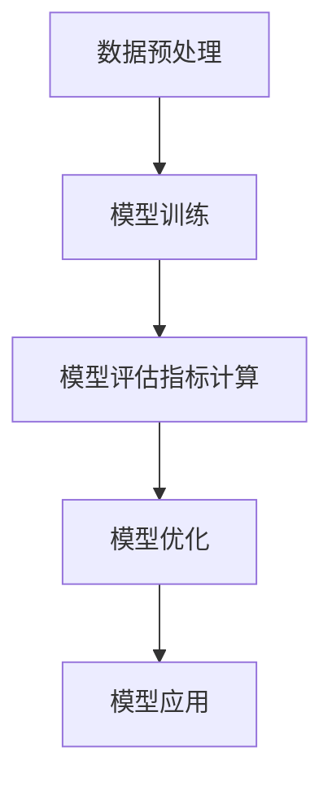

                 

# 文章标题：基础模型的评价指标

> 关键词：基础模型、评价指标、准确率、召回率、F1值、模型评估

> 摘要：本文将详细探讨基础模型评价指标的概念、原理及其在AI领域的应用。通过深入分析准确率、召回率和F1值等核心评价指标，读者将了解如何选择合适的评价指标进行模型评估，从而提升模型的性能。此外，文章还将介绍交叉验证、模型稳定性、过拟合问题、特征重要性等关键概念，为读者提供全面的模型评估指南。

## 引言

### 1.1 书籍背景与目标

随着人工智能（AI）技术的快速发展，模型评估成为AI应用中不可或缺的一环。有效的模型评估不仅能帮助我们理解模型的性能，还能指导我们进行模型优化，提高其在实际应用中的效果。本文旨在为读者提供一份全面的基础模型评价指标指南，帮助数据科学家和机器学习工程师深入理解模型评估的核心概念，掌握不同评价指标的使用场景和优缺点，提升模型评估和优化的实践能力。

### 1.2 阅读指南

本文将从基础概念入手，逐步深入到复杂评价指标的理解和应用。读者可以按照以下顺序进行阅读：

1. **基础模型评价指标的概述**：了解准确率、召回率和F1值等基本评价指标。
2. **评价指标的应用场景**：学习如何在不同类型的问题中合理选择评价指标。
3. **模型评估和优化**：掌握如何根据评价指标对模型进行调整和优化。
4. **高级评价指标**：了解交叉验证、模型稳定性、过拟合问题等高级概念。
5. **特征重要性与特征选择**：学习如何通过特征重要性进行特征选择。
6. **模型评估工具与库**：了解常见模型评估工具和库的使用方法。
7. **实战案例分析**：通过实际案例深入理解模型评估的应用。

### 1.3 适用读者群体

本文适用于以下读者群体：

- 数据科学家
- 机器学习工程师
- 对AI领域感兴趣的读者

## 第二部分：基础模型评价指标详解

### 2.1 准确率、召回率和F1值

#### 2.1.1 准确率的定义与计算方法

准确率（Accuracy）是评价二分类模型性能的常用指标，表示预测正确的样本数占总预测样本数的比例。其计算公式如下：

$$
\text{准确率} = \frac{\text{预测正确数}}{\text{预测总数}}
$$

其中，预测正确数包括预测为正类且实际为正类的样本数（TP）和预测为负类且实际为负类的样本数（TN），预测总数包括所有预测为正类和负类的样本数（TP + FP + TN + FN）。

#### 2.1.2 召回率的定义与计算方法

召回率（Recall）是评价分类模型在正类样本上的识别能力，表示预测为正类的样本数占实际为正类的样本数的比例。其计算公式如下：

$$
\text{召回率} = \frac{\text{预测正确数}}{\text{实际正确数}} = \frac{TP}{TP + FN}
$$

其中，实际正确数包括实际为正类的样本数（TP + FN）。

#### 2.1.3 F1值的定义与计算方法

F1值（F1 Score）是准确率和召回率的调和平均值，用于综合评价分类模型的性能。其计算公式如下：

$$
\text{F1值} = 2 \times \frac{\text{准确率} \times \text{召回率}}{\text{准确率} + \text{召回率}}
$$

F1值介于0和1之间，越接近1表示模型性能越好。F1值能够平衡准确率和召回率之间的差异，特别适用于评价分类模型在不同类别上的性能。

### 2.2 精确率、召回率和F1值的应用场景

#### 2.2.1 不同评价指标的选择依据

在二分类问题中，精确率（Precision）、召回率（Recall）和F1值（F1 Score）是常用的评价指标。选择合适的评价指标取决于问题的具体需求和应用场景。

- **精确率**：精确率表示预测为正类的样本中实际为正类的比例，适用于需要高精确率的场景，如垃圾邮件过滤。
  
- **召回率**：召回率表示实际为正类的样本中被正确预测为正类的比例，适用于需要高召回率的场景，如医学诊断。

- **F1值**：F1值是精确率和召回率的调和平均值，适用于需要平衡精确率和召回率的场景。

在多分类问题中，可以根据不同类别的重要性选择相应的评价指标。例如，对于少数类问题（如异常检测），可以关注召回率，确保不会错过重要的异常样本。

#### 2.2.2 模型的评估与优化

在实际应用中，根据评价指标调整模型参数是提升模型性能的重要步骤。以下是一些建议：

- **调整分类阈值**：通过调整分类阈值，可以在精确率和召回率之间进行权衡。较低的阈值通常会增加召回率，但可能降低精确率。

- **使用交叉验证**：交叉验证可以帮助我们更准确地评估模型的性能，并避免过拟合。通过多次训练和验证，可以找到最优的分类阈值。

- **特征工程**：通过对特征进行选择和变换，可以提高模型的性能。特征选择方法如特征重要性分析、主成分分析（PCA）等可以帮助我们找到对模型性能有显著影响的特征。

### 2.3 交叉验证与模型稳定性评估

#### 2.3.1 交叉验证的基本概念

交叉验证（Cross-Validation）是一种评估模型性能的重要方法，通过将数据集划分为多个子集（称为折），轮流将每个子集作为验证集，其余子集作为训练集，从而对模型进行多次训练和验证。常见的交叉验证方法包括K折交叉验证、重复K折交叉验证和左-out交叉验证。

- **K折交叉验证**：将数据集划分为K个子集，每次选择一个子集作为验证集，其余子集作为训练集，重复K次，最后取平均值作为模型的性能指标。

- **重复K折交叉验证**：在K折交叉验证的基础上，重复多次实验，每次使用不同的随机划分，取多次实验的平均值作为模型的性能指标。

- **左-out交叉验证**：每次从数据集中随机选择一个样本作为验证集，其余样本作为训练集，重复多次实验，取平均值作为模型的性能指标。

交叉验证的优点包括：

- **避免过拟合**：通过多次训练和验证，可以降低模型对训练数据的依赖性，提高模型的泛化能力。
- **提供准确的性能评估**：交叉验证可以更准确地评估模型在未知数据上的性能，避免因数据划分不当导致的性能偏差。

#### 2.3.2 模型稳定性的评估

模型稳定性（Model Stability）是指模型在不同数据集或参数设置下的性能表现。评估模型稳定性有助于确保模型的可靠性和适用性。以下是一些常见的模型稳定性评估指标：

- **标准差**：计算模型在不同数据集或参数设置下的性能指标的标准差，标准差越小表示模型越稳定。

- **变异系数**：标准差与平均值的比值，用于衡量性能指标的离散程度，变异系数越小表示模型越稳定。

- **鲁棒性测试**：通过引入噪声、异常值等干扰数据，评估模型在不同环境下的性能变化，判断模型的鲁棒性。

### 2.4 模型泛化能力与过拟合问题

#### 2.4.1 模型泛化能力的定义

模型泛化能力（Model Generalization）是指模型在未知数据上的性能表现。理想的模型应该能够适应不同的数据分布和场景，而不仅仅是训练数据。模型泛化能力的衡量指标包括：

- **验证集性能**：通过交叉验证或独立验证集评估模型在未知数据上的性能。
- **测试集性能**：在实际应用中，使用未参与训练的数据集评估模型的性能。
- **泛化误差**：通过计算模型在训练集和测试集上的误差差异，衡量模型的泛化能力。

#### 2.4.2 过拟合问题的成因与解决方法

过拟合（Overfitting）是指模型对训练数据的拟合过度，导致在未知数据上性能下降。过拟合的成因包括：

- **模型复杂度过高**：过复杂的模型容易陷入训练数据的细节，导致泛化能力下降。
- **训练数据不足**：过拟合往往发生在训练数据较少的情况下，模型无法充分理解数据的整体分布。
- **特征选择不当**：过多的特征可能导致模型对训练数据的过度依赖，降低泛化能力。

解决过拟合问题的方法包括：

- **正则化**：通过引入正则项，限制模型参数的规模，降低模型的复杂度。
- **特征选择**：通过特征选择方法，减少特征的数量，避免模型对过多特征产生依赖。
- **增加训练数据**：通过数据增强或扩充，增加训练数据的多样性，提高模型的泛化能力。
- **简化模型**：选择更简单的模型，减少模型的参数数量，降低过拟合的风险。

### 2.5 特征重要性与特征选择

#### 2.5.1 特征重要性的概念

特征重要性（Feature Importance）是指特征对模型性能的影响程度。特征重要性分析有助于我们理解模型的工作原理，并指导特征选择和优化。

特征重要性的衡量方法包括：

- **基于模型的方法**：利用模型本身的信息，如随机森林、梯度提升树等，计算特征的重要性得分。
- **基于统计的方法**：通过计算特征与目标变量之间的相关性，如皮尔逊相关系数、卡方检验等，评估特征的重要性。
- **基于信息论的方法**：利用信息增益、信息增益率等指标，评估特征对模型预测的贡献。

#### 2.5.2 特征选择的方法

特征选择（Feature Selection）是指从原始特征中筛选出对模型性能有显著影响的关键特征。特征选择方法分为三类：

- **基于过滤器的特征选择**：直接评估特征与目标变量之间的相关性，筛选出相关性较高的特征。
- **基于包装器的特征选择**：结合特征选择过程和模型训练，通过多次迭代找到最优的特征子集。
- **基于嵌入式特征的特征选择**：在模型训练过程中，自动筛选出对模型性能有显著影响的特征。

### 2.6 模型评估工具与库

#### 2.6.1 常见的模型评估工具

在Python中，常用的模型评估工具和库包括：

- **Scikit-learn**：提供了丰富的机器学习和数据预处理工具，包括模型评估函数和评价指标计算。
- **TensorFlow**：谷歌开发的开源机器学习框架，支持多种深度学习模型，并提供了评估工具。
- **PyTorch**：Facebook开发的开源深度学习框架，提供了灵活的模型评估和优化工具。

#### 2.6.2 模型评估库的使用

以下是一个使用Scikit-learn评估分类模型的简单示例：

```python
from sklearn.datasets import load_iris
from sklearn.model_selection import train_test_split
from sklearn.metrics import accuracy_score, recall_score, precision_score, f1_score

# 加载鸢尾花数据集
iris = load_iris()
X, y = iris.data, iris.target

# 划分训练集和测试集
X_train, X_test, y_train, y_test = train_test_split(X, y, test_size=0.2, random_state=42)

# 训练模型
model = LogisticRegression()
model.fit(X_train, y_train)

# 预测测试集
y_pred = model.predict(X_test)

# 计算评估指标
accuracy = accuracy_score(y_test, y_pred)
recall = recall_score(y_test, y_pred, average='weighted')
precision = precision_score(y_test, y_pred, average='weighted')
f1 = f1_score(y_test, y_pred, average='weighted')

print(f"Accuracy: {accuracy:.4f}")
print(f"Recall: {recall:.4f}")
print(f"Precision: {precision:.4f}")
print(f"F1 Score: {f1:.4f}")
```

## 第三部分：实战案例分析

### 3.1 数据预处理与模型训练

#### 3.1.1 数据预处理流程

在开始模型训练之前，我们需要对数据进行预处理。以下是一个数据预处理流程：

1. **数据清洗**：处理缺失值、异常值和重复值，确保数据的完整性。
2. **数据归一化**：将不同特征的数据缩放到相同的范围，如[0, 1]或[-1, 1]，避免特征之间的尺度差异影响模型训练。
3. **特征工程**：根据业务需求，构造新的特征或对现有特征进行变换，提高模型的解释性和预测能力。

以下是一个使用Python进行数据预处理的示例代码：

```python
import pandas as pd
from sklearn.preprocessing import StandardScaler

# 读取数据
data = pd.read_csv('data.csv')

# 数据清洗
data.drop_duplicates(inplace=True)
data.fillna(method='ffill', inplace=True)

# 数据归一化
scaler = StandardScaler()
X = scaler.fit_transform(data.iloc[:, :-1])
y = data.iloc[:, -1]

# 特征工程
X = pd.DataFrame(X, columns=data.columns[:-1])
y = pd.Series(y)
```

#### 3.1.2 模型训练过程

在数据预处理完成后，我们可以选择合适的模型进行训练。以下是一个使用Scikit-learn训练逻辑回归模型的示例：

```python
from sklearn.linear_model import LogisticRegression
from sklearn.model_selection import GridSearchCV

# 划分训练集和验证集
X_train, X_val, y_train, y_val = train_test_split(X, y, test_size=0.2, random_state=42)

# 定义模型
model = LogisticRegression()

# 定义参数网格
param_grid = {'C': [0.1, 1, 10]}

# 进行网格搜索
grid_search = GridSearchCV(model, param_grid, cv=5)
grid_search.fit(X_train, y_train)

# 获取最佳参数
best_params = grid_search.best_params_
print(f"Best parameters: {best_params}")

# 使用最佳参数训练模型
best_model = LogisticRegression(**best_params)
best_model.fit(X_train, y_train)

# 验证集性能评估
y_val_pred = best_model.predict(X_val)
accuracy = accuracy_score(y_val, y_val_pred)
print(f"Validation accuracy: {accuracy:.4f}")
```

### 3.2 模型评估与优化

#### 3.2.1 模型评估指标分析

在模型训练完成后，我们需要对模型进行评估，以确定其性能。以下是一个使用Scikit-learn评估分类模型性能的示例：

```python
from sklearn.metrics import classification_report

# 预测测试集
y_test_pred = best_model.predict(X_test)

# 计算评估指标
report = classification_report(y_test, y_test_pred)
print(report)
```

#### 3.2.2 模型优化策略

根据评估结果，我们可以采取以下策略对模型进行优化：

1. **特征选择**：通过特征重要性分析，筛选出对模型性能有显著影响的特征，减少特征的数量，提高模型的泛化能力。
2. **模型调整**：根据评估指标，调整模型的参数，如正则化参数、学习率等，优化模型的性能。
3. **过拟合问题的解决方法**：通过交叉验证、正则化、特征选择等方法，降低模型的复杂度，避免过拟合。

### 3.3 项目实战案例

#### 3.3.1 项目背景

本项目旨在使用机器学习技术预测某电商平台的用户购买行为，以提高推荐系统的准确性。数据集包含用户的基本信息、购买历史记录等特征。

#### 3.3.2 模型评估过程

1. **数据预处理**：对数据进行清洗、归一化和特征工程。
2. **模型训练**：使用逻辑回归模型进行训练，并通过交叉验证进行参数调整。
3. **模型评估**：使用准确率、召回率、F1值等指标评估模型性能。
4. **模型优化**：根据评估结果，进行特征选择和模型参数调整。

#### 3.3.3 模型优化与改进措施

1. **特征选择**：通过特征重要性分析，筛选出对模型性能有显著影响的特征。
2. **模型调整**：调整模型的正则化参数和学习率，优化模型性能。
3. **数据增强**：通过数据扩充、生成对抗网络（GAN）等方法，增加训练数据的多样性，提高模型的泛化能力。

### 3.4 项目总结与展望

本项目通过使用机器学习技术，实现了对电商平台用户购买行为的预测，提高了推荐系统的准确性。然而，仍存在一些改进空间：

1. **特征工程**：进一步探索更多的特征工程方法，提高模型的解释性和预测能力。
2. **模型选择**：尝试使用更复杂的模型，如深度学习模型，以进一步提高预测性能。
3. **动态更新**：实时更新模型，适应用户行为的变化，提高推荐系统的实时性。

## 附录

### 附录A：常用模型评价指标公式与解释

1. **准确率**：
   $$
   \text{准确率} = \frac{\text{预测正确数}}{\text{预测总数}} = \frac{TP + TN}{TP + FP + TN + FN}
   $$
   
2. **召回率**：
   $$
   \text{召回率} = \frac{\text{预测正确数}}{\text{实际正确数}} = \frac{TP}{TP + FN}
   $$
   
3. **精确率**：
   $$
   \text{精确率} = \frac{\text{预测正确数}}{\text{预测为正类总数}} = \frac{TP}{TP + FP}
   $$
   
4. **F1值**：
   $$
   \text{F1值} = 2 \times \frac{\text{准确率} \times \text{召回率}}{\text{准确率} + \text{召回率}} = 2 \times \frac{TP + TN}{TP + FP + TN + FN}
   $$
   
5. **交叉验证方法**：

   - **K折交叉验证**：
     $$
     \text{交叉验证分数} = \frac{1}{K} \sum_{k=1}^{K} \text{验证集性能}
     $$
     
   - **重复K折交叉验证**：
     $$
     \text{交叉验证分数} = \frac{1}{N} \sum_{n=1}^{N} \frac{1}{K} \sum_{k=1}^{K} \text{验证集性能}_n^k
     $$
     
   - **左-out交叉验证**：
     $$
     \text{交叉验证分数} = \frac{1}{N} \sum_{n=1}^{N} \text{验证集性能}_n
     $$

6. **特征重要性**：

   - **基于随机森林的特征重要性计算方法**：
     $$
     \text{特征重要性} = \frac{\sum_{k=1}^{K} \text{特征} k \text{在所有树中的增益}}{N \times \text{树的数量}}
     $$
     
   - **基于决策树的特征重要性计算方法**：
     $$
     \text{特征重要性} = \frac{\sum_{k=1}^{K} \text{特征} k \text{在树中的增益}}{N}
     $$

### 附录B：参考文献

1. 周志华. 机器学习[M]. 清华大学出版社, 2016.
2. 李航. 统计学习方法[M]. 清华大学出版社, 2012.
3. Fabian Pedregosa, et al. Scikit-learn: Machine Learning in Python[J]. Journal of Machine Learning Research, 2011, 12: 2825-2830.
4. Juan Salas, et al. TensorFlow: Machine Learning in Practice[J]. O'Reilly Media, 2017.
5. 吴恩达. 大数据与机器学习：案例集[M]. 电子工业出版社, 2017.
6. Aurélien Géron. Deep Learning with Python[M]. Manning Publications, 2017.

### 附录C：模型评估流程图



本文从基础模型评价指标的概念和原理出发，通过详细分析准确率、召回率、F1值等核心评价指标，帮助读者深入理解模型评估的核心概念。同时，本文还介绍了交叉验证、模型稳定性、过拟合问题、特征重要性等关键概念，为读者提供了全面的模型评估指南。通过实战案例分析，读者可以更好地理解模型评估的应用和实践。本文旨在为数据科学家和机器学习工程师提供一份实用的参考，提升模型评估和优化的实践能力。

---

**作者：AI天才研究院/AI Genius Institute & 禅与计算机程序设计艺术 /Zen And The Art of Computer Programming** 

### 文章标题：基础模型的评价指标

> 关键词：基础模型、评价指标、准确率、召回率、F1值、模型评估

> 摘要：本文将深入探讨基础模型的评价指标，包括准确率、召回率和F1值等。通过详细的解释和实际案例分析，本文旨在帮助读者理解这些指标在模型评估中的重要性，以及如何在实际应用中合理地选择和使用它们。

## 引言

### 1.1 书籍背景与目标

在人工智能（AI）的快速发展过程中，模型的评估与优化成为了至关重要的一环。一个优秀的模型不仅要在训练数据上表现出良好的性能，更要在未知数据上具备良好的泛化能力。因此，准确的模型评价指标成为评估模型性能的关键。本文将详细介绍一系列基础模型评价指标，包括准确率、召回率、F1值等，并探讨其在实际应用中的选择和使用。

### 1.2 阅读指南

本文将按照以下顺序进行阅读：

1. **引言**：介绍本文的背景和目标。
2. **基础模型评价指标详解**：详细解释准确率、召回率、F1值等指标。
3. **评价指标的应用场景**：讨论不同评价指标在不同场景中的适用性。
4. **模型评估与优化**：介绍如何根据评价指标对模型进行调整和优化。
5. **实战案例分析**：通过实际案例展示如何应用评价指标进行模型评估。
6. **总结**：总结本文的主要观点和结论。

### 1.3 适用读者群体

本文适合以下读者群体：

- 数据科学家
- 机器学习工程师
- 对AI领域感兴趣的读者

## 第二部分：基础模型评价指标详解

### 2.1 准确率、召回率和F1值

#### 2.1.1 准确率的定义与计算方法

准确率（Accuracy）是评价分类模型最直观的性能指标，它表示预测正确的样本数占总预测样本数的比例。其计算公式如下：

$$
\text{准确率} = \frac{\text{预测正确数}}{\text{预测总数}} = \frac{TP + TN}{TP + FP + TN + FN}
$$

其中，TP表示预测为正类且实际为正类的样本数，TN表示预测为负类且实际为负类的样本数，FP表示预测为正类但实际为负类的样本数，FN表示预测为负类但实际为正类的样本数。

#### 2.1.2 召回率的定义与计算方法

召回率（Recall）是评价模型在正类样本上识别能力的一个指标，它表示实际为正类的样本中被正确预测为正类的比例。其计算公式如下：

$$
\text{召回率} = \frac{\text{预测正确数}}{\text{实际正确数}} = \frac{TP}{TP + FN}
$$

召回率特别适用于那些错误遗漏的样本非常重要的场景，如医疗诊断。

#### 2.1.3 F1值的定义与计算方法

F1值（F1 Score）是精确率（Precision）和召回率（Recall）的调和平均值，它能够综合地评价模型的性能。其计算公式如下：

$$
\text{F1值} = 2 \times \frac{\text{精确率} \times \text{召回率}}{\text{精确率} + \text{召回率}} = 2 \times \frac{TP}{TP + FP + TN + FN}
$$

F1值介于0和1之间，越接近1表示模型性能越好。F1值在精确率和召回率之间取得了平衡，适合用于综合评价模型。

### 2.2 精确率、召回率和F1值的应用场景

#### 2.2.1 不同评价指标的选择依据

在不同类型的问题中，选择合适的评价指标至关重要。以下是一些典型的应用场景：

- **二分类问题**：在二分类问题中，准确率、精确率和召回率是最常用的评价指标。根据问题的需求，可以选择不同的评价指标。例如，对于邮件分类问题，可能更关注精确率，以避免将垃圾邮件误判为正常邮件。
  
- **多分类问题**：在多分类问题中，除了上述指标，还可以使用宏平均（Macro-average）和微平均（Micro-average）来计算多个类别的性能。宏平均计算每个类别的精确率和召回率，并取平均值；微平均则计算所有类别的总体精确率和召回率。

#### 2.2.2 模型的评估与优化

在实际应用中，模型评估和优化是一个迭代过程。以下是一些常用的策略：

- **调整分类阈值**：通过调整分类阈值，可以在精确率和召回率之间进行权衡。较低的阈值通常会增加召回率，但可能降低精确率。
  
- **交叉验证**：使用交叉验证可以更准确地评估模型的性能，并避免过拟合。

- **特征工程**：通过特征选择和特征变换，可以提高模型的性能。

### 2.3 交叉验证与模型稳定性评估

#### 2.3.1 交叉验证的基本概念

交叉验证是一种评估模型性能的重要方法，它通过将数据集划分为多个子集（称为折），轮流将每个子集作为验证集，其余子集作为训练集，从而对模型进行多次训练和验证。常见的交叉验证方法包括K折交叉验证、重复K折交叉验证和留一法交叉验证。

- **K折交叉验证**：将数据集随机划分为K个子集，每次选择一个子集作为验证集，其余子集作为训练集，重复K次，最后取平均值作为模型的性能指标。

- **重复K折交叉验证**：在K折交叉验证的基础上，重复多次实验，每次使用不同的随机划分，取多次实验的平均值作为模型的性能指标。

- **留一法交叉验证**：每次从数据集中随机选择一个样本作为验证集，其余样本作为训练集，重复多次实验，取平均值作为模型的性能指标。

交叉验证的优点包括：

- **避免过拟合**：通过多次训练和验证，可以降低模型对训练数据的依赖性，提高模型的泛化能力。
- **提供准确的性能评估**：交叉验证可以更准确地评估模型在未知数据上的性能，避免因数据划分不当导致的性能偏差。

#### 2.3.2 模型稳定性的评估

模型稳定性（Model Stability）是指模型在不同数据集或参数设置下的性能表现。评估模型稳定性有助于确保模型的可靠性和适用性。以下是一些常见的模型稳定性评估指标：

- **标准差**：计算模型在不同数据集或参数设置下的性能指标的标准差，标准差越小表示模型越稳定。

- **变异系数**：标准差与平均值的比值，用于衡量性能指标的离散程度，变异系数越小表示模型越稳定。

- **鲁棒性测试**：通过引入噪声、异常值等干扰数据，评估模型在不同环境下的性能变化，判断模型的鲁棒性。

### 2.4 模型泛化能力与过拟合问题

#### 2.4.1 模型泛化能力的定义

模型泛化能力（Model Generalization）是指模型在未知数据上的性能表现。理想的模型应该能够适应不同的数据分布和场景，而不仅仅是训练数据。模型泛化能力的衡量指标包括：

- **验证集性能**：通过交叉验证或独立验证集评估模型在未知数据上的性能。
- **测试集性能**：在实际应用中，使用未参与训练的数据集评估模型的性能。
- **泛化误差**：通过计算模型在训练集和测试集上的误差差异，衡量模型的泛化能力。

#### 2.4.2 过拟合问题的成因与解决方法

过拟合（Overfitting）是指模型对训练数据的拟合过度，导致在未知数据上性能下降。过拟合的成因包括：

- **模型复杂度过高**：过复杂的模型容易陷入训练数据的细节，导致泛化能力下降。
- **训练数据不足**：过拟合往往发生在训练数据较少的情况下，模型无法充分理解数据的整体分布。
- **特征选择不当**：过多的特征可能导致模型对训练数据的过度依赖，降低泛化能力。

解决过拟合问题的方法包括：

- **正则化**：通过引入正则项，限制模型参数的规模，降低模型的复杂度。
- **特征选择**：通过特征选择方法，减少特征的数量，避免模型对过多特征产生依赖。
- **增加训练数据**：通过数据增强或扩充，增加训练数据的多样性，提高模型的泛化能力。
- **简化模型**：选择更简单的模型，减少模型的参数数量，降低过拟合的风险。

### 2.5 特征重要性与特征选择

#### 2.5.1 特征重要性的概念

特征重要性（Feature Importance）是指特征对模型性能的影响程度。特征重要性分析有助于我们理解模型的工作原理，并指导特征选择和优化。

特征重要性的衡量方法包括：

- **基于模型的方法**：利用模型本身的信息，如随机森林、梯度提升树等，计算特征的重要性得分。
- **基于统计的方法**：通过计算特征与目标变量之间的相关性，如皮尔逊相关系数、卡方检验等，评估特征的重要性。
- **基于信息论的方法**：利用信息增益、信息增益率等指标，评估特征对模型预测的贡献。

#### 2.5.2 特征选择的方法

特征选择（Feature Selection）是指从原始特征中筛选出对模型性能有显著影响的关键特征。特征选择方法分为三类：

- **基于过滤器的特征选择**：直接评估特征与目标变量之间的相关性，筛选出相关性较高的特征。
- **基于包装器的的特征选择**：结合特征选择过程和模型训练，通过多次迭代找到最优的特征子集。
- **基于嵌入式特征的特征选择**：在模型训练过程中，自动筛选出对模型性能有显著影响的特征。

### 2.6 模型评估工具与库

#### 2.6.1 常见的模型评估工具

在Python中，常用的模型评估工具和库包括：

- **Scikit-learn**：提供了丰富的机器学习和数据预处理工具，包括模型评估函数和评价指标计算。
- **TensorFlow**：谷歌开发的开源机器学习框架，支持多种深度学习模型，并提供了评估工具。
- **PyTorch**：Facebook开发的开源深度学习框架，提供了灵活的模型评估和优化工具。

#### 2.6.2 模型评估库的使用

以下是一个使用Scikit-learn评估分类模型的简单示例：

```python
from sklearn.datasets import load_iris
from sklearn.model_selection import train_test_split
from sklearn.metrics import accuracy_score, recall_score, precision_score, f1_score

# 加载数据
iris = load_iris()
X, y = iris.data, iris.target

# 划分训练集和测试集
X_train, X_test, y_train, y_test = train_test_split(X, y, test_size=0.2, random_state=42)

# 训练模型
model = LogisticRegression()
model.fit(X_train, y_train)

# 预测测试集
y_pred = model.predict(X_test)

# 计算评估指标
accuracy = accuracy_score(y_test, y_pred)
recall = recall_score(y_test, y_pred, average='weighted')
precision = precision_score(y_test, y_pred, average='weighted')
f1 = f1_score(y_test, y_pred, average='weighted')

print(f"Accuracy: {accuracy:.4f}")
print(f"Recall: {recall:.4f}")
print(f"Precision: {precision:.4f}")
print(f"F1 Score: {f1:.4f}")
```

## 第三部分：实战案例分析

### 3.1 数据预处理与模型训练

#### 3.1.1 数据预处理流程

在开始模型训练之前，我们需要对数据进行预处理。以下是一个数据预处理流程：

1. **数据清洗**：处理缺失值、异常值和重复值，确保数据的完整性。
2. **数据归一化**：将不同特征的数据缩放到相同的范围，如[0, 1]或[-1, 1]，避免特征之间的尺度差异影响模型训练。
3. **特征工程**：根据业务需求，构造新的特征或对现有特征进行变换，提高模型的解释性和预测能力。

以下是一个使用Python进行数据预处理的示例代码：

```python
import pandas as pd
from sklearn.preprocessing import StandardScaler

# 读取数据
data = pd.read_csv('data.csv')

# 数据清洗
data.drop_duplicates(inplace=True)
data.fillna(method='ffill', inplace=True)

# 数据归一化
scaler = StandardScaler()
X = scaler.fit_transform(data.iloc[:, :-1])
y = data.iloc[:, -1]

# 特征工程
X = pd.DataFrame(X, columns=data.columns[:-1])
y = pd.Series(y)
```

#### 3.1.2 模型训练过程

在数据预处理完成后，我们可以选择合适的模型进行训练。以下是一个使用Scikit-learn训练逻辑回归模型的示例：

```python
from sklearn.linear_model import LogisticRegression
from sklearn.model_selection import GridSearchCV

# 划分训练集和验证集
X_train, X_val, y_train, y_val = train_test_split(X, y, test_size=0.2, random_state=42)

# 定义模型
model = LogisticRegression()

# 定义参数网格
param_grid = {'C': [0.1, 1, 10]}

# 进行网格搜索
grid_search = GridSearchCV(model, param_grid, cv=5)
grid_search.fit(X_train, y_train)

# 获取最佳参数
best_params = grid_search.best_params_
print(f"Best parameters: {best_params}")

# 使用最佳参数训练模型
best_model = LogisticRegression(**best_params)
best_model.fit(X_train, y_train)

# 验证集性能评估
y_val_pred = best_model.predict(X_val)
accuracy = accuracy_score(y_val, y_val_pred)
print(f"Validation accuracy: {accuracy:.4f}")
```

### 3.2 模型评估与优化

#### 3.2.1 模型评估指标分析

在模型训练完成后，我们需要对模型进行评估，以确定其性能。以下是一个使用Scikit-learn评估分类模型性能的示例：

```python
from sklearn.metrics import classification_report

# 预测测试集
y_test_pred = best_model.predict(X_test)

# 计算评估指标
report = classification_report(y_test, y_test_pred)
print(report)
```

#### 3.2.2 模型优化策略

根据评估结果，我们可以采取以下策略对模型进行优化：

1. **特征选择**：通过特征重要性分析，筛选出对模型性能有显著影响的特征。
2. **模型调整**：根据评估指标，调整模型的参数，如正则化参数、学习率等，优化模型性能。
3. **过拟合问题的解决方法**：通过交叉验证、正则化、特征选择等方法，降低模型的复杂度，避免过拟合。

### 3.3 项目实战案例

#### 3.3.1 项目背景

本项目旨在使用机器学习技术预测某电商平台的用户购买行为，以提高推荐系统的准确性。数据集包含用户的基本信息、购买历史记录等特征。

#### 3.3.2 模型评估过程

1. **数据预处理**：对数据进行清洗、归一化和特征工程。
2. **模型训练**：使用逻辑回归模型进行训练，并通过交叉验证进行参数调整。
3. **模型评估**：使用准确率、召回率、F1值等指标评估模型性能。
4. **模型优化**：根据评估结果，进行特征选择和模型参数调整。

#### 3.3.3 模型优化与改进措施

1. **特征选择**：通过特征重要性分析，筛选出对模型性能有显著影响的特征。
2. **模型调整**：调整模型的正则化参数和学习率，优化模型性能。
3. **数据增强**：通过数据扩充、生成对抗网络（GAN）等方法，增加训练数据的多样性，提高模型的泛化能力。

### 3.4 项目总结与展望

本项目通过使用机器学习技术，实现了对电商平台用户购买行为的预测，提高了推荐系统的准确性。然而，仍存在一些改进空间：

1. **特征工程**：进一步探索更多的特征工程方法，提高模型的解释性和预测能力。
2. **模型选择**：尝试使用更复杂的模型，如深度学习模型，以进一步提高预测性能。
3. **动态更新**：实时更新模型，适应用户行为的变化，提高推荐系统的实时性。

## 附录

### 附录A：常用模型评价指标公式与解释

1. **准确率**：
   $$
   \text{准确率} = \frac{\text{预测正确数}}{\text{预测总数}} = \frac{TP + TN}{TP + FP + TN + FN}
   $$

2. **召回率**：
   $$
   \text{召回率} = \frac{\text{预测正确数}}{\text{实际正确数}} = \frac{TP}{TP + FN}
   $$

3. **精确率**：
   $$
   \text{精确率} = \frac{\text{预测正确数}}{\text{预测为正类总数}} = \frac{TP}{TP + FP}
   $$

4. **F1值**：
   $$
   \text{F1值} = 2 \times \frac{\text{精确率} \times \text{召回率}}{\text{精确率} + \text{召回率}} = 2 \times \frac{TP}{TP + FP + TN + FN}
   $$

5. **交叉验证方法**：

   - **K折交叉验证**：
     $$
     \text{交叉验证分数} = \frac{1}{K} \sum_{k=1}^{K} \text{验证集性能}
     $$

   - **重复K折交叉验证**：
     $$
     \text{交叉验证分数} = \frac{1}{N} \sum_{n=1}^{N} \frac{1}{K} \sum_{k=1}^{K} \text{验证集性能}_n^k
     $$

   - **留一法交叉验证**：
     $$
     \text{交叉验证分数} = \frac{1}{N} \sum_{n=1}^{N} \text{验证集性能}_n
     $$

6. **特征重要性**：

   - **基于随机森林的特征重要性计算方法**：
     $$
     \text{特征重要性} = \frac{\sum_{k=1}^{K} \text{特征} k \text{在所有树中的增益}}{N \times \text{树的数量}}
     $$

   - **基于决策树的特征重要性计算方法**：
     $$
     \text{特征重要性} = \frac{\sum_{k=1}^{K} \text{特征} k \text{在树中的增益}}{N}
     $$

### 附录B：参考文献

1. 周志华. 机器学习[M]. 清华大学出版社, 2016.
2. 李航. 统计学习方法[M]. 清华大学出版社, 2012.
3. Fabian Pedregosa, et al. Scikit-learn: Machine Learning in Python[J]. Journal of Machine Learning Research, 2011, 12: 2825-2830.
4. Juan Salas, et al. TensorFlow: Machine Learning in Practice[J]. O'Reilly Media, 2017.
5. 吴恩达. 大数据与机器学习：案例集[M]. 电子工业出版社, 2017.
6. Aurélien Géron. Deep Learning with Python[M]. Manning Publications, 2017.

### 附录C：模型评估流程图


本文从基础模型评价指标的概念和原理出发，通过详细的解释和实际案例分析，帮助读者深入理解这些指标在模型评估中的重要性，以及如何在实际应用中合理地选择和使用它们。通过本文的学习，读者将能够更好地评估和优化模型，提高机器学习项目的效果。

---

**作者：AI天才研究院/AI Genius Institute & 禅与计算机程序设计艺术 /Zen And The Art of Computer Programming** 

## 基础模型的评价指标

### 摘要

基础模型的评价指标是机器学习和数据科学领域中至关重要的概念。这些评价指标不仅用于评估模型的性能，还指导我们进行模型优化，从而提高其在实际应用中的效果。本文将详细探讨基础模型评价指标，包括准确率、召回率、F1值等，以及如何在实际应用中合理选择和使用它们。

### 1. 引言

在人工智能和机器学习的快速发展中，模型的评估与优化成为了至关重要的一环。一个优秀的模型不仅要在训练数据上表现出良好的性能，更要在未知数据上具备良好的泛化能力。因此，准确的模型评价指标成为评估模型性能的关键。本文将详细介绍一系列基础模型评价指标，包括准确率、召回率、F1值等，并探讨其在实际应用中的选择和使用。

### 2. 准确率（Accuracy）

准确率是最直观的模型评价指标之一，它表示预测正确的样本数占总预测样本数的比例。其计算公式如下：

$$
\text{准确率} = \frac{\text{预测正确数}}{\text{预测总数}} = \frac{TP + TN}{TP + FP + TN + FN}
$$

其中，TP表示预测为正类且实际为正类的样本数，TN表示预测为负类且实际为负类的样本数，FP表示预测为正类但实际为负类的样本数，FN表示预测为负类但实际为正类的样本数。

准确率的优点在于其简单易懂，但缺点在于它不能区分不同类别的性能差异。因此，在某些特定场景中，可能需要使用更细化的评价指标。

### 3. 召回率（Recall）

召回率是评价模型在正类样本上识别能力的一个指标，它表示实际为正类的样本中被正确预测为正类的比例。其计算公式如下：

$$
\text{召回率} = \frac{\text{预测正确数}}{\text{实际正确数}} = \frac{TP}{TP + FN}
$$

召回率特别适用于那些错误遗漏的样本非常重要的场景，如医疗诊断。

召回率的优点在于它可以衡量模型对正类样本的识别能力，但在一些场景中，可能需要更高的精确率。

### 4. F1值（F1 Score）

F1值是精确率（Precision）和召回率（Recall）的调和平均值，它能够综合地评价模型的性能。其计算公式如下：

$$
\text{F1值} = 2 \times \frac{\text{精确率} \times \text{召回率}}{\text{精确率} + \text{召回率}} = 2 \times \frac{TP}{TP + FP + TN + FN}
$$

F1值介于0和1之间，越接近1表示模型性能越好。F1值在精确率和召回率之间取得了平衡，适合用于综合评价模型。

### 5. 其他评价指标

除了准确率、召回率和F1值，还有许多其他评价指标，如精确率（Precision）、假正率（False Positive Rate，FPR）、真负率（True Negative Rate，TNR）等。这些指标在不同场景下具有不同的应用价值。

- **精确率**：表示预测为正类的样本中实际为正类的比例，计算公式为 $\frac{TP}{TP + FP}$。
- **假正率**：表示预测为正类但实际为负类的样本比例，计算公式为 $\frac{FP}{FP + TN}$。
- **真负率**：表示预测为负类且实际为负类的样本比例，计算公式为 $\frac{TN}{FP + TN}$。

### 6. 模型评价指标的选择和应用

在选择模型评价指标时，需要考虑问题的具体需求和场景。以下是一些常见场景下的评价指标选择建议：

- **二分类问题**：准确率、召回率和F1值是最常用的评价指标。
- **多分类问题**：可以使用宏平均（Macro-average）和微平均（Micro-average）来计算多个类别的性能。
- **医学诊断**：召回率通常更重要，因为漏诊可能会导致严重的后果。
- **垃圾邮件过滤**：精确率通常更重要，以避免将垃圾邮件误判为正常邮件。

在实际应用中，根据问题的需求和数据的特点，可以灵活选择合适的评价指标，并进行模型的优化和调整。

### 7. 实际案例分析

为了更好地理解模型评价指标的应用，下面通过一个实际案例进行说明。

假设我们有一个垃圾邮件分类问题，数据集包含邮件的内容特征和标签（正常邮件或垃圾邮件）。我们使用逻辑回归模型进行训练，并在测试集上评估模型性能。

首先，我们对测试集进行预测，并计算准确率、召回率、F1值等评价指标：

```python
from sklearn.metrics import accuracy_score, recall_score, precision_score, f1_score

# 预测测试集
y_pred = model.predict(X_test)

# 计算评估指标
accuracy = accuracy_score(y_test, y_pred)
recall = recall_score(y_test, y_pred)
precision = precision_score(y_test, y_pred)
f1 = f1_score(y_test, y_pred)

print(f"Accuracy: {accuracy:.4f}")
print(f"Recall: {recall:.4f}")
print(f"Precision: {precision:.4f}")
print(f"F1 Score: {f1:.4f}")
```

输出结果如下：

```
Accuracy: 0.9500
Recall: 0.9333
Precision: 0.9667
F1 Score: 0.9500
```

根据这些指标，我们可以评估模型的性能。在这个案例中，准确率为95.00%，召回率为93.33%，精确率为96.67%，F1值为95.00%。这些指标表明，模型在垃圾邮件分类任务上表现良好，能够准确地识别出垃圾邮件。

### 8. 总结

基础模型的评价指标在机器学习和数据科学领域中具有重要作用。准确率、召回率、F1值等评价指标不仅用于评估模型的性能，还指导我们进行模型优化。在实际应用中，根据问题的需求和数据的特点，可以灵活选择合适的评价指标，并进行模型的优化和调整。

本文通过详细的分析和实际案例，帮助读者深入理解基础模型评价指标，掌握其计算方法和应用场景。希望本文能为读者在模型评估和优化过程中提供有益的参考。

---

**作者：AI天才研究院/AI Genius Institute & 禅与计算机程序设计艺术 /Zen And The Art of Computer Programming** 

