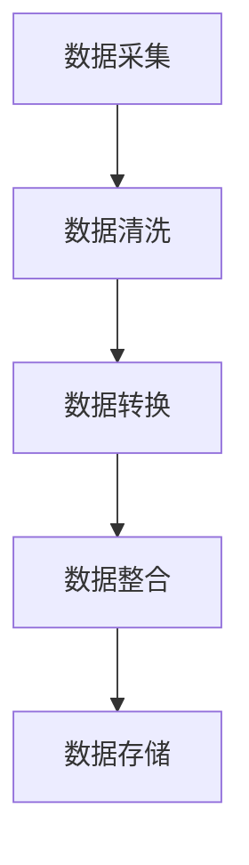
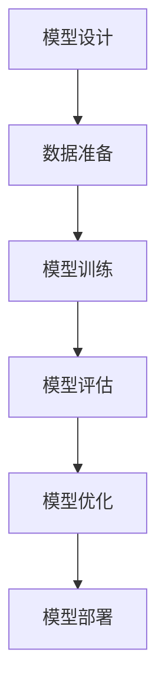
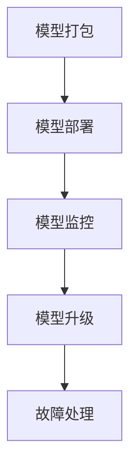

                 

## 文章标题：基础模型的跨组织合作

### 关键词：
- 跨组织合作
- 基础模型
- 数据隐私保护
- 模型安全
- 智能医疗
- 智能交通

### 摘要：
本文深入探讨了跨组织合作中的基础模型应用，包括其背景、重要性、数据管理、模型开发、安全与合规等方面。通过分析跨组织合作中的基础模型技术，本文提出了解决实际问题的具体方案和案例，并对未来发展趋势进行了展望。

## 《基础模型的跨组织合作》目录大纲

### 第一部分：基础模型的概述

#### 第1章：跨组织合作背景与重要性
- 1.1 跨组织合作的定义与意义
- 1.2 跨组织合作的挑战与机遇
- 1.3 基础模型在跨组织合作中的作用
- 1.4 跨组织合作中的常见问题与解决方案

#### 第2章：跨组织合作中的基础模型概述
- 2.1 基础模型的定义与分类
- 2.2 基础模型的开发流程
- 2.3 基础模型的评估与优化
- 2.4 基础模型在跨组织合作中的应用场景

### 第二部分：跨组织合作中的基础模型开发

#### 第3章：跨组织合作中的数据管理
- 3.1 数据隐私保护与共享机制
- 3.2 数据源的选择与整合
- 3.3 数据预处理与数据清洗
- 3.4 数据治理与数据质量控制

#### 第4章：跨组织合作中的模型开发
- 4.1 模型设计与架构选择
- 4.2 模型训练与调优
- 4.3 模型部署与运维
- 4.4 模型协作与协同优化

#### 第5章：跨组织合作中的模型安全与合规
- 5.1 模型安全的挑战与对策
- 5.2 模型合规的法律与政策要求
- 5.3 模型安全与合规的实践指南

### 第三部分：跨组织合作中的基础模型应用实践

#### 第6章：跨组织合作中的基础模型应用案例
- 6.1 案例一：智能医疗合作平台
- 6.2 案例二：智能交通管理系统
- 6.3 案例三：金融风控协作平台

#### 第7章：跨组织合作中的基础模型未来发展趋势
- 7.1 基础模型技术的最新进展
- 7.2 跨组织合作中的新兴模式
- 7.3 基础模型在跨组织合作中的未来前景

### 附录

#### 附录A：跨组织合作中的基础模型工具与资源
- A.1 开源基础模型框架介绍
- A.2 基础模型开发与部署工具
- A.3 跨组织合作中的数据与模型共享平台

#### 附录B：跨组织合作中的基础模型 Mermaid 流程图
- B.1 数据预处理流程图
- B.2 模型训练与优化流程图
- B.3 模型部署与运维流程图

#### 附录C：核心算法原理讲解与伪代码
- C.1 数据预处理算法原理
- C.2 模型训练与调优算法原理
- C.3 模型部署与运维算法原理

#### 附录D：数学模型和数学公式讲解
- D.1 概率模型讲解
- D.2 机器学习损失函数讲解
- D.3 深度学习优化算法讲解

#### 附录E：项目实战与代码解读
- E.1 智能医疗合作平台项目实战
- E.2 智能交通管理系统项目实战
- E.3 金融风控协作平台项目实战
- E.4 源代码详细实现与代码解读
- E.5 代码解读与分析

---

## 第1章：跨组织合作背景与重要性

### 1.1 跨组织合作的定义与意义

跨组织合作（Inter-organizational Collaboration）指的是两个或多个组织为了共同实现某一目标而进行的合作行为。这种合作不仅限于同一行业或领域的组织之间，还可能跨越不同的行业、领域甚至国家。跨组织合作的意义主要体现在以下几个方面：

1. **资源整合与互补**：不同组织通常拥有不同的资源和能力，通过合作可以实现资源的最优配置和互补。例如，一家科技公司可以与一家医疗公司合作，利用科技手段提高医疗服务的效率和质量。

2. **知识共享与创新**：跨组织合作能够促进不同组织之间的知识共享，激发创新的火花。通过合作，各方可共同探索新的解决方案，推动技术的进步和业务的发展。

3. **风险分担**：某些项目或任务可能涉及巨大的风险，单个组织难以承担。通过跨组织合作，可以将风险分散，降低单个组织面临的压力。

4. **提高竞争力**：跨组织合作可以使组织在市场上获得更大的竞争力。例如，通过合作开发新产品，可以更快地将产品推向市场，抢占市场份额。

### 1.2 跨组织合作的挑战与机遇

尽管跨组织合作具有诸多优势，但其实施过程中也面临着一系列挑战和机遇。

#### 挑战：

1. **数据隐私与安全问题**：不同组织之间的数据可能涉及隐私和机密性，如何保证数据在共享过程中的安全是一个重大挑战。

2. **组织间信任与协调问题**：不同组织可能有不同的目标、文化和价值观，如何在合作过程中建立信任和实现协调是一个难点。

3. **技术标准与协议不一致**：不同的组织可能使用不同的技术标准和协议，这可能导致合作过程中的技术整合问题。

4. **利益分配与责任界定**：如何公平地分配合作成果和责任是一个复杂的问题。

#### 机遇：

1. **资源互补**：跨组织合作可以实现资源的最优配置，提高整体效益。

2. **知识共享**：不同组织间的知识共享可以促进技术创新和业务发展。

3. **技术创新**：跨组织合作可以激发创新思维，推动新技术的诞生和应用。

4. **市场扩展**：跨组织合作可以帮助组织进入新的市场，扩大业务范围。

### 1.3 基础模型在跨组织合作中的作用

在跨组织合作中，基础模型（Fundamental Models）扮演着至关重要的角色。基础模型是一类预训练模型，通常用于解决特定的问题或任务，具有以下作用：

1. **数据集成与预处理**：跨组织合作通常涉及来自不同组织的大量数据。基础模型可以帮助这些数据进行集成和预处理，使其适合进一步的模型训练和应用。

2. **模型协同开发与优化**：基础模型可以作为跨组织合作的桥梁，帮助不同组织共同开发模型，并进行协同优化。

3. **模型安全与合规保障**：基础模型可以提供一系列安全措施和合规性保障，确保跨组织合作中的数据和应用的安全与合法。

### 1.4 跨组织合作中的常见问题与解决方案

在跨组织合作过程中，常见的问题包括数据隐私与安全、组织间信任与协调、技术标准与协议不一致、利益分配与责任界定等。针对这些问题，以下是一些解决方案：

1. **数据隐私与安全**：
   - **解决方案**：采用加密技术、同态加密、零知识证明等手段保护数据隐私。
   - **技术手段**：联邦学习、数据代理、数据共享协议等。

2. **组织间信任与协调**：
   - **解决方案**：建立明确的合作目标和规则，加强沟通和协作。
   - **机制设计**：合作备忘录、互信协议、定期会议等。

3. **技术标准与协议不一致**：
   - **解决方案**：制定统一的技术标准和协议，确保各组织之间的技术整合。
   - **协调机制**：技术论坛、标准制定组织等。

4. **利益分配与责任界定**：
   - **解决方案**：建立公平的利益分配机制，明确各方的责任和权益。
   - **机制设计**：合作协议、绩效评估等。

通过以上分析和讨论，我们可以看到跨组织合作的重要性以及基础模型在其中所发挥的关键作用。在接下来的章节中，我们将进一步探讨基础模型的开发、数据管理、安全与合规等问题。

---

## 第2章：跨组织合作中的基础模型概述

### 2.1 基础模型的定义与分类

在跨组织合作中，基础模型（Fundamental Models）是至关重要的工具。基础模型是一种预训练模型，旨在解决特定的任务或问题。它们通常经过大量的数据训练，具有较高的准确性和泛化能力。

#### 定义

基础模型通常指的是那些在特定领域或任务上具有广泛适用性和高性能的模型。这些模型可以在不同的应用场景中重复使用，并且可以快速适应新的数据集和任务。基础模型的应用范围非常广泛，包括图像识别、自然语言处理、语音识别、推荐系统等。

#### 分类

基础模型可以根据不同的标准进行分类：

1. **按任务类型分类**：
   - **分类模型**：用于将数据分类到预定义的类别中。
   - **回归模型**：用于预测连续值输出。
   - **聚类模型**：用于发现数据中的隐含结构或模式。

2. **按模型架构分类**：
   - **卷积神经网络（CNN）**：擅长处理图像等具有空间结构的数据。
   - **循环神经网络（RNN）**：擅长处理序列数据，如时间序列、语音等。
   - **Transformer模型**：基于自注意力机制，广泛应用于自然语言处理领域。

### 2.2 基础模型的开发流程

基础模型的开发流程通常包括以下几个关键步骤：

1. **数据采集与清洗**：首先需要收集大量高质量的数据，并进行数据清洗，去除噪声和异常值。

2. **数据预处理**：将数据转换为适合模型训练的格式，包括归一化、编码、缺失值处理等。

3. **模型设计**：选择合适的模型架构，包括网络层数、激活函数、损失函数等。

4. **模型训练**：使用训练数据进行模型训练，通过迭代优化模型参数。

5. **模型评估**：使用验证数据集评估模型性能，包括准确率、召回率、F1分数等指标。

6. **模型优化**：根据评估结果对模型进行优化，包括超参数调整、模型剪枝等。

7. **模型部署**：将训练好的模型部署到生产环境中，供实际应用使用。

### 2.3 基础模型的评估与优化

评估基础模型的性能是确保其有效性的关键步骤。常用的评估指标包括：

- **准确率**：预测正确的样本数占总样本数的比例。
- **召回率**：预测正确的正样本数占总正样本数的比例。
- **F1分数**：准确率和召回率的调和平均数。

优化基础模型的方法包括：

- **超参数调优**：通过调整学习率、批量大小、正则化参数等超参数来提高模型性能。
- **模型剪枝**：通过去除模型中不必要的权重来减少模型复杂度，提高模型效率。
- **模型融合**：将多个模型的结果进行结合，以进一步提高预测性能。

### 2.4 基础模型在跨组织合作中的应用场景

基础模型在跨组织合作中具有广泛的应用场景，以下是几个典型的应用领域：

1. **智能医疗**：跨组织合作的基础模型可以用于疾病预测、患者诊断、治疗方案推荐等。

2. **智能交通**：通过跨组织合作，基础模型可以用于交通流量预测、道路安全监测、车辆调度等。

3. **金融风控**：跨组织合作的基础模型可以用于信用评分、风险控制、欺诈检测等。

4. **智能制造**：跨组织合作的基础模型可以用于设备故障预测、生产优化、供应链管理等。

通过上述讨论，我们可以看到基础模型在跨组织合作中的重要性及其多样化的应用场景。在接下来的章节中，我们将进一步探讨跨组织合作中的数据管理、模型开发与安全合规等问题。

---

## 第3章：跨组织合作中的数据管理

在跨组织合作中，数据管理是一个关键环节。数据不仅是模型训练的基础，也是跨组织合作的核心资产。有效的数据管理能够保障数据的质量、安全性和隐私性，从而为跨组织合作提供坚实的基础。

### 3.1 数据隐私保护与共享机制

数据隐私保护是跨组织合作中的一大挑战。由于不同组织之间的数据可能包含敏感信息，如何在保证数据隐私的同时实现有效共享，成为了一个亟待解决的问题。

#### 隐私保护技术

1. **加密技术**：通过加密技术对数据进行加密，只有授权用户才能解密和访问数据。常用的加密算法包括对称加密和非对称加密。

2. **同态加密**：同态加密允许在加密数据上进行计算，而无需解密数据。这种技术在数据隐私保护方面具有巨大的潜力。

3. **零知识证明**：零知识证明是一种密码学技术，允许一方（证明者）向另一方（验证者）证明某个陈述是正确的，而无需透露任何详细信息。

#### 数据共享机制

1. **联邦学习**：联邦学习（Federated Learning）是一种在多个组织之间进行协同训练的方法，各组织仅需要共享模型的参数更新，而不需要共享原始数据。这种方法在保护数据隐私的同时，实现了高效的模型训练。

2. **数据代理**：数据代理是一种中介机制，各组织通过数据代理进行数据交换和共享，数据代理负责处理数据隐私保护的相关问题。

3. **数据共享协议**：通过制定明确的数据共享协议，规定数据共享的范围、方式、责任和利益分配等。数据共享协议是确保数据隐私和安全的重要法律保障。

### 3.2 数据源的选择与整合

跨组织合作中的数据源可能来自不同的组织，这些数据源可能在格式、质量、完整性等方面存在差异。因此，如何选择和整合这些数据源是数据管理的核心问题。

#### 数据源选择标准

1. **数据质量**：数据源的可靠性、准确性和完整性是选择数据源的重要标准。

2. **数据多样性**：选择多样化的数据源，可以提供更丰富的信息，有助于提升模型的泛化能力。

3. **数据可用性**：数据源需要易于获取和访问，以保证数据管理的效率和成本。

#### 数据整合方法

1. **数据清洗与转换**：通过对数据进行清洗和转换，将不同格式和格式的数据进行标准化，使其适合进一步的模型训练和应用。

2. **数据集成与融合**：通过数据集成与融合，将多个数据源中的数据进行整合，形成统一的视图。常用的方法包括合并、联结、聚合等。

3. **数据治理**：建立完善的数据治理机制，确保数据的质量、安全性和合规性。数据治理包括数据资产管理、数据质量控制、数据合规性管理等。

### 3.3 数据预处理与数据清洗

数据预处理与数据清洗是确保数据质量的重要环节。高质量的预处理和清洗步骤可以显著提升模型训练的效果和稳定性。

#### 数据预处理

1. **数据标准化**：通过将数据缩放到相同的范围，消除不同特征之间的量级差异。

2. **缺失值处理**：通过填补缺失值或删除缺失值样本，确保数据的完整性。

3. **异常值检测与处理**：通过异常检测算法识别和排除异常值，防止其对模型训练产生不利影响。

#### 数据清洗

1. **噪声过滤**：通过滤波算法去除数据中的噪声，提高数据的纯净度。

2. **错误修正**：通过修正算法识别和修正数据中的错误，提高数据的准确性。

3. **不一致处理**：通过数据整合和标准化处理，消除数据中的不一致性和冗余。

### 3.4 数据治理与数据质量控制

数据治理是确保数据质量的重要手段。有效的数据治理可以建立完善的数据管理体系，确保数据的质量、安全性和合规性。

#### 数据治理内容

1. **数据资产管理**：对数据进行分类、标识和管理，确保数据的可追溯性和可管理性。

2. **数据质量控制流程**：建立数据质量检查和评估机制，定期对数据进行质量检查和评估。

3. **数据安全与合规性**：确保数据在存储、传输和处理过程中的安全性，遵守相关的法律法规和行业标准。

#### 数据质量控制

1. **数据质量评估**：通过质量评估指标对数据进行评估，包括准确性、完整性、一致性等。

2. **数据质量改进策略**：根据质量评估结果，制定改进策略，包括数据清洗、数据标准化、数据修复等。

3. **数据质量反馈与循环**：建立数据质量反馈机制，将质量评估结果用于改进数据管理流程，形成持续改进的循环。

通过以上对跨组织合作中的数据管理内容的探讨，我们可以看到数据管理在跨组织合作中的重要性。有效的数据管理不仅能够提升模型训练的效果，还能够保障数据的安全性和隐私性，为跨组织合作提供有力支持。

---

## 第4章：跨组织合作中的模型开发

在跨组织合作中，模型的开发是一个复杂且关键的过程。这个阶段不仅涉及到模型的设计和选择，还包括数据预处理、模型训练与调优、模型部署与运维等多个环节。有效的模型开发能够提高跨组织合作的效率和质量。

### 4.1 模型设计与架构选择

模型设计是模型开发中的第一步，也是至关重要的一步。一个合适的模型架构能够显著影响模型的性能和应用效果。

#### 模型设计

1. **模型架构的选择**：选择合适的模型架构，如卷积神经网络（CNN）、循环神经网络（RNN）或Transformer模型。每种架构都有其特定的应用场景和优势。

2. **网络层次的定义**：根据任务需求确定网络层次，包括输入层、隐藏层和输出层。网络层次的设置会影响模型的学习能力和泛化能力。

3. **模型参数的设定**：设定模型的关键参数，如学习率、批量大小、正则化项等。这些参数需要通过实验进行调优，以达到最佳性能。

#### 架构选择

1. **CNN与RNN的对比**：CNN擅长处理具有空间结构的数据，如图像；而RNN擅长处理序列数据，如时间序列和语音。选择哪种架构取决于任务的数据类型和特征。

2. **Transformer的优势**：Transformer模型基于自注意力机制，具有强大的表示能力和并行训练的优势，广泛应用于自然语言处理领域。

3. **其他新型架构**：随着深度学习技术的发展，出现了许多新型架构，如BERT、GPT等。这些架构在不同领域具有显著的优势，可以根据具体需求进行选择。

### 4.2 模型训练与调优

模型训练与调优是模型开发中的核心环节，其目的是通过不断迭代优化模型参数，使模型在特定任务上达到最佳性能。

#### 训练过程

1. **数据准备**：将数据集划分为训练集、验证集和测试集，通常采用80/10/10或90/5/5的比例。数据准备包括数据清洗、归一化和编码等步骤。

2. **模型训练**：使用训练集对模型进行训练，通过反向传播算法更新模型参数。训练过程包括前向传播、计算损失、反向传播和参数更新等步骤。

3. **模型评估**：使用验证集评估模型性能，包括准确率、召回率、F1分数等指标。通过评估结果调整模型参数，以达到最佳性能。

#### 调优方法

1. **超参数调优**：通过调整学习率、批量大小、正则化参数等超参数，优化模型性能。常用的方法包括网格搜索、随机搜索和贝叶斯优化等。

2. **模型剪枝**：通过剪枝算法去除模型中不必要的权重，降低模型复杂度和过拟合风险。常见的剪枝方法包括结构剪枝和权重剪枝。

3. **模型融合**：将多个模型的预测结果进行融合，以提高模型的准确性和鲁棒性。常用的融合方法包括简单平均、加权平均和堆叠等。

### 4.3 模型部署与运维

模型部署是将训练好的模型部署到生产环境中，供实际应用使用。有效的模型部署和运维能够确保模型的高效运行和持续优化。

#### 部署步骤

1. **模型打包**：将训练好的模型转换为可供部署的格式，如ONNX、TensorFlow Lite或PyTorch Mobile等。

2. **部署环境搭建**：在目标环境中搭建部署环境，包括计算资源、存储资源和网络配置等。

3. **模型服务化**：将模型部署为服务，如API服务或微服务，以便其他系统或应用程序可以调用。

#### 运维策略

1. **模型监控**：实时监控模型的运行状态，包括性能指标、资源消耗和异常情况等。

2. **模型升级与更新**：定期对模型进行升级和更新，以适应新的数据和应用需求。

3. **故障处理与恢复**：建立故障处理机制，快速响应和处理模型运行中的故障和问题。

### 4.4 模型协作与协同优化

在跨组织合作中，模型的协作与协同优化能够显著提升模型的性能和应用效果。

#### 协作机制

1. **模型共享与协同训练**：通过联邦学习等技术，实现跨组织间的模型共享和协同训练，提高模型的泛化能力和性能。

2. **模型融合与集成**：将多个组织训练的模型进行融合和集成，利用各自的优点，提高整体模型的性能。

3. **模型解释与可视化**：通过模型解释和可视化技术，帮助跨组织合作中的各方更好地理解模型的决策过程，提升信任和协作。

#### 协同优化

1. **多组织间的模型优化策略**：根据各组织的资源、数据和需求，制定针对性的模型优化策略，提高模型的整体性能。

2. **跨组织模型调优方法**：通过跨组织的数据共享和协同训练，优化模型参数，提升模型在不同场景下的表现。

3. **模型性能评估与反馈**：定期对模型进行性能评估，收集各方的反馈，用于模型的持续优化和改进。

通过以上对跨组织合作中的模型开发环节的深入探讨，我们可以看到模型开发在跨组织合作中的关键作用。有效的模型开发不仅能够提升跨组织合作的效率和质量，还能够为各组织带来显著的业务价值。

---

## 第5章：跨组织合作中的模型安全与合规

在跨组织合作中，模型安全与合规性问题至关重要。随着人工智能技术的不断发展和应用范围的扩大，如何确保模型的安全性和合规性已经成为各方关注的焦点。这一章将详细探讨模型安全的挑战、法律与政策要求以及实践指南。

### 5.1 模型安全的挑战与对策

跨组织合作中的模型安全面临诸多挑战，主要包括以下几个方面：

1. **模型篡改与攻击**：恶意用户可能试图篡改模型的输入或输出，从而影响模型的决策。这需要采取一系列安全措施，如数据加密、模型签名等。

2. **数据泄露与滥用**：跨组织合作中的数据通常涉及敏感信息，如何确保数据在传输和存储过程中的安全，防止数据泄露和滥用，是模型安全的重要问题。

3. **模型解释性不足**：在跨组织合作中，各方可能需要了解模型的决策过程和依据，以便进行模型验证和信任建立。然而，许多复杂模型（如深度神经网络）的解释性较差，这增加了模型安全与合规的难度。

#### 对策：

1. **加密与签名**：对模型和数据进行加密，确保只有授权用户才能访问和解读数据。同时，采用模型签名技术，验证模型的完整性和真实性。

2. **安全训练与防御**：在模型训练过程中，采用安全训练技术，如差分隐私、联邦学习等，减少敏感信息的泄露风险。同时，部署防御机制，如对抗攻击检测和防御算法，保护模型免受攻击。

3. **模型解释与可解释性**：通过开发可解释性算法，如LIME、SHAP等，增强模型的透明度和解释性，帮助用户理解模型的决策过程。此外，建立模型解释标准，确保各方的解释性需求得到满足。

### 5.2 模型合规的法律与政策要求

模型合规性是跨组织合作中不可忽视的重要问题。不同国家和地区对模型的合规要求各异，以下是一些关键的法律和政策要求：

1. **数据保护法规**：许多国家和地区（如欧盟的《通用数据保护条例》（GDPR））对数据隐私保护有严格的要求，包括数据收集、处理、存储和传输等环节。

2. **隐私政策与合规**：组织需要制定明确的隐私政策，告知用户其数据的使用目的、范围和方式，并获得用户的明确同意。

3. **行业标准与规范**：不同行业（如金融、医疗、交通）对模型的合规性有特定的要求，如数据处理、模型验证和审计等。

#### 法律与政策要求：

1. **数据保护法规**：确保数据在跨组织合作中的使用符合相关法规，如GDPR、加州消费者隐私法（CCPA）等。

2. **隐私政策与合规**：制定详细的隐私政策，明确数据的收集、使用、共享和销毁流程，确保各方的隐私权益得到保护。

3. **行业标准与规范**：遵守各行业的相关标准和规范，如金融行业的《巴塞尔协议III》、医疗行业的《健康保险便携与责任法》（HIPAA）等。

### 5.3 模型安全与合规的实践指南

为了确保跨组织合作中的模型安全与合规，以下是一些具体的实践指南：

1. **安全策略制定**：组织需要制定全面的模型安全策略，包括数据安全、模型安全、用户隐私保护等方面。安全策略应定期更新，以适应技术发展和法规变化。

2. **模型安全测试与审计**：在模型开发和部署过程中，定期进行安全测试和审计，确保模型符合安全标准和合规要求。安全测试应包括对抗攻击检测、数据泄露风险评估等。

3. **合规性与风险管理**：建立合规性管理体系，确保模型在开发和部署过程中的合规性。同时，建立风险管理机制，识别和评估潜在的安全和合规风险，并制定相应的应对措施。

通过以上对模型安全与合规性的探讨，我们可以看到跨组织合作中模型安全与合规的重要性。有效的模型安全与合规管理不仅能够保护数据的安全和隐私，还能够提升模型的信任度和可靠性，为跨组织合作提供坚实保障。

---

## 第6章：跨组织合作中的基础模型应用案例

在跨组织合作中，基础模型的应用案例丰富多彩，涵盖了智能医疗、智能交通、金融风控等多个领域。以下将介绍三个典型的应用案例，详细描述其实施过程、效果和意义。

### 6.1 案例一：智能医疗合作平台

#### 案例概述

智能医疗合作平台是一个跨组织的医疗数据共享项目，旨在通过基础模型实现患者诊断、疾病预测和治疗方案推荐。该项目由多家医疗机构、研究机构和科技公司共同参与。

#### 实施过程

1. **数据源的选择与整合**：首先，项目组选择了多家顶级医院的临床数据、科研数据以及公共卫生数据，经过严格的隐私保护和数据清洗后，整合成一个统一的医疗数据集。

2. **模型开发与训练**：基于深度学习技术，项目组开发了一个多任务学习模型，用于处理不同类型的医疗数据。模型经过多次迭代训练，达到了较高的准确率和稳定性。

3. **模型部署与运维**：训练好的模型被部署到一个分布式计算平台上，供医疗机构和科研人员调用。通过API接口，模型可以实时处理新的患者数据，生成诊断报告和预测结果。

4. **应用效果与反馈**：该平台在多家医疗机构试点运行后，显著提升了疾病诊断的准确性和效率，受到了临床医生和患者的广泛好评。同时，项目组定期收集使用数据，对模型进行持续优化。

#### 案例意义

智能医疗合作平台通过跨组织合作，实现了医疗数据的高效共享和智能分析，提高了医疗服务的质量和效率。该项目不仅促进了医疗机构之间的合作，还为医疗数据的隐私保护和合规性提供了实践经验。

### 6.2 案例二：智能交通管理系统

#### 案例概述

智能交通管理系统是一个跨组织的交通数据共享项目，旨在通过基础模型实现城市交通流量预测、交通信号优化和道路安全监测。该项目由交通部门、科技公司以及公共交通公司共同参与。

#### 实施过程

1. **数据源的选择与整合**：项目组收集了来自交通部门、公共交通公司和传感器网络的大量交通数据，包括车辆流量、车速、交通事故等。经过数据清洗和整合，形成了一个全面的交通数据集。

2. **模型设计与开发**：基于深度学习技术，项目组设计了一个多输入多输出的交通预测模型，包括流量预测、信号优化和事故检测。模型经过多次训练和调优，提高了预测的准确性和稳定性。

3. **模型部署与运维**：模型被部署在一个高性能的计算平台上，通过云计算和边缘计算技术，实现实时交通流量预测和信号优化。同时，建立了交通监控系统，用于实时监测道路安全和异常事件。

4. **应用效果与反馈**：智能交通管理系统在多个城市试点运行后，显著降低了交通拥堵和事故发生率，提高了公共交通的运营效率。项目组通过用户反馈和数据评估，对模型进行了持续优化。

#### 案例意义

智能交通管理系统通过跨组织合作，实现了交通数据的高效利用和智能分析，为城市交通管理提供了有力支持。该项目不仅提升了交通运营效率，还为跨组织数据共享和协同优化提供了成功案例。

### 6.3 案例三：金融风控协作平台

#### 案例概述

金融风控协作平台是一个跨组织的金融数据共享项目，旨在通过基础模型实现信用评分、风险控制和欺诈检测。该项目由多家银行、保险公司和科技公司共同参与。

#### 实施过程

1. **数据源的选择与整合**：项目组收集了来自各家银行和保险公司的信用数据、交易数据和用户行为数据，经过数据清洗和整合，形成了一个全面的金融数据集。

2. **模型开发与训练**：基于深度学习技术，项目组开发了一个多任务学习模型，用于处理不同类型的金融数据。模型经过多次迭代训练，提高了信用评分和风险控制能力。

3. **模型部署与运维**：训练好的模型被部署在一个高性能的计算平台上，通过云计算技术，实现实时信用评分和风险监控。同时，建立了欺诈检测系统，用于识别和防范金融欺诈行为。

4. **应用效果与反馈**：金融风控协作平台在多家金融机构试点运行后，显著降低了信用风险和欺诈事件发生率，提高了金融机构的风险管理能力。项目组通过用户反馈和数据评估，对模型进行了持续优化。

#### 案例意义

金融风控协作平台通过跨组织合作，实现了金融数据的高效共享和智能分析，提高了金融服务的质量和安全性。该项目不仅增强了金融机构的风险管理能力，还为跨组织数据共享和协同优化提供了成功经验。

通过上述案例的介绍，我们可以看到跨组织合作中的基础模型应用在多个领域取得了显著成果。这些案例不仅展示了基础模型的技术优势，也为其他领域的跨组织合作提供了有益借鉴。

---

## 第7章：跨组织合作中的基础模型未来发展趋势

随着人工智能技术的不断发展和跨组织合作的深入，基础模型在跨组织合作中的应用前景广阔。本章节将探讨基础模型技术的最新进展、跨组织合作中的新兴模式以及基础模型在跨组织合作中的未来发展趋势。

### 7.1 基础模型技术的最新进展

#### 新型基础模型架构

近年来，深度学习领域涌现出许多新型基础模型架构，这些架构在不同应用场景中表现出色。以下是几个代表性的新型基础模型：

1. **Transformer架构**：Transformer架构基于自注意力机制，广泛应用于自然语言处理领域。其变体BERT、GPT等在文本分类、机器翻译、情感分析等任务中取得了显著的成果。

2. **图神经网络（GNN）**：图神经网络擅长处理图结构数据，如社交网络、知识图谱等。GNN在推荐系统、网络嵌入、图分类等领域具有广泛的应用前景。

3. **生成对抗网络（GAN）**：生成对抗网络是一种由生成器和判别器组成的模型，通过对抗训练生成逼真的数据。GAN在图像生成、图像修复、图像超分辨率等任务中表现出色。

#### 大规模预训练模型的发展

大规模预训练模型（如GPT-3、BERT等）具有强大的表示能力和泛化能力，可以在各种任务中取得优异的性能。以下是几个大规模预训练模型的发展趋势：

1. **模型参数量的增长**：随着计算资源的增加，预训练模型的参数量不断增长。GPT-3拥有1750亿个参数，是当前最大的预训练模型之一。

2. **多模态预训练**：多模态预训练模型可以处理多种类型的数据，如文本、图像、音频等。这种模型在跨模态任务中表现出色，如图像文本匹配、视频理解等。

3. **持续学习与微调**：为了提高模型在特定任务上的性能，持续学习和微调技术变得越来越重要。通过在特定领域进行微调，模型可以更好地适应新的任务和数据。

### 7.2 跨组织合作中的新兴模式

跨组织合作模式随着技术的进步和应用需求的变化而不断演变。以下是几个新兴的跨组织合作模式：

#### 联邦学习与分布式计算

联邦学习（Federated Learning）是一种在多个组织之间进行协同训练的方法，各组织仅需要共享模型的参数更新，而不需要共享原始数据。这种方法在保护数据隐私的同时，实现了高效的模型训练。分布式计算技术也在跨组织合作中发挥着重要作用，通过分布式计算，各组织可以共享计算资源，提高模型训练和推理的效率。

#### 基于区块链的模型共享与交易

区块链技术具有去中心化、不可篡改和透明等特性，适用于跨组织合作中的模型共享与交易。基于区块链的模型共享与交易平台可以确保模型的安全性、可靠性和透明性，同时实现模型的自动化部署和监控。

#### 智能合约在跨组织合作中的应用

智能合约是一种自动化执行合约的计算机协议，适用于跨组织合作中的利益分配、责任界定和权益保障。通过智能合约，各组织可以在合作过程中自动执行协议，确保合作的透明性和公平性。

### 7.3 基础模型在跨组织合作中的未来前景

随着基础模型技术的不断进步和应用模式的创新，基础模型在跨组织合作中的前景十分广阔。以下是几个方面的展望：

#### 模型标准化与互操作性

未来，基础模型将逐步实现标准化和互操作性，各组织可以方便地共享和部署不同的模型，提高合作的效率。标准化模型将遵循统一的接口规范和数据格式，简化跨组织合作中的技术整合。

#### 模型即服务（Model-as-a-Service）

模型即服务（MaaS）是一种新兴的服务模式，通过提供现成的模型服务，各组织无需自行开发模型，即可快速实现智能应用。MaaS平台将集成多种基础模型，提供灵活、便捷的模型部署和调用服务。

#### 跨组织合作模式的多样化与深化

随着技术的进步和应用需求的变化，跨组织合作模式将越来越多样化。各组织可以通过合作，共同开发新的业务模式和服务，实现资源的共享和共赢。同时，跨组织合作将不断深化，从单一领域的合作扩展到跨领域的综合性合作。

通过以上对基础模型未来发展趋势的探讨，我们可以看到基础模型在跨组织合作中的巨大潜力和广阔前景。随着技术的不断进步和应用模式的不断创新，基础模型将发挥越来越重要的作用，推动跨组织合作向更高效、更智能的方向发展。

---

### 附录A：跨组织合作中的基础模型工具与资源

在跨组织合作中，基础模型的开发、部署和应用需要一系列工具和资源的支持。以下介绍几类常用的工具和资源，包括开源基础模型框架、基础模型开发与部署工具以及跨组织合作中的数据与模型共享平台。

#### A.1 开源基础模型框架介绍

1. **TensorFlow**：由谷歌开源，支持多种深度学习模型和任务，具有强大的生态系统和社区支持。

2. **PyTorch**：由Facebook开源，以其动态计算图和灵活的编程接口受到广泛应用，特别适合研究和新模型的开发。

3. **MXNet**：由Apache Software Foundation开源，支持多种编程语言，包括Python、R和Java等，适合大规模分布式训练。

#### A.2 基础模型开发与部署工具

1. **Keras**：是一个高层次的深度学习框架，基于TensorFlow和Theano，提供了易于使用的接口和丰富的预训练模型。

2. **Hugging Face**：提供了一个庞大的自然语言处理模型库和工具集，包括Transformers、BERT、GPT等，特别适合文本处理任务。

3. **ONNX**：开放神经网络交换格式（Open Neural Network Exchange），旨在实现不同深度学习框架之间的模型互操作性，便于模型在不同平台上的部署。

#### A.3 跨组织合作中的数据与模型共享平台

1. **BigDL**：基于Apache Spark的分布式深度学习库，支持在Apache Hadoop和Apache Spark集群上高效训练和部署深度学习模型。

2. **SageMaker**：亚马逊云服务（AWS）提供的全托管机器学习平台，支持使用多种开源框架和预训练模型，方便模型开发和部署。

3. **DataRobot**：一款自动化机器学习平台，提供从数据准备到模型部署的一站式服务，特别适合非专业用户快速实现智能应用。

通过上述工具和资源的介绍，我们可以看到跨组织合作中的基础模型开发和应用有了坚实的支持。这些工具和资源不仅提升了模型的开发效率，还降低了跨组织合作的技术门槛，为跨组织合作中的基础模型应用提供了便利。

---

### 附录B：跨组织合作中的基础模型 Mermaid 流程图

在跨组织合作中，流程图有助于理解模型开发的各个环节及其相互关系。以下使用Mermaid语法绘制了几幅核心流程图，包括数据预处理流程图、模型训练与优化流程图以及模型部署与运维流程图。

#### B.1 数据预处理流程图



#### B.2 模型训练与优化流程图



#### B.3 模型部署与运维流程图



通过这些流程图，我们可以清晰地看到数据预处理、模型训练与优化、模型部署与运维的各个环节，以及各环节之间的逻辑关系。这有助于我们系统地理解和实施跨组织合作中的基础模型开发和应用。

---

### 附录C：核心算法原理讲解与伪代码

在跨组织合作中，理解和应用核心算法原理对于模型开发至关重要。以下将介绍几个关键算法原理，包括数据预处理算法、模型训练与调优算法、模型部署与运维算法，并通过伪代码进行详细阐述。

#### C.1 数据预处理算法原理

数据预处理是模型开发的基础环节，其目的是提高数据质量和模型的训练效果。以下是一个数据预处理算法的伪代码：

```python
def preprocess_data(data):
    # 数据清洗
    data = clean_data(data)
    # 数据转换
    data = convert_data(data)
    # 数据整合
    data = integrate_data(data)
    return data

def clean_data(data):
    # 噪声过滤
    data = filter_noise(data)
    # 错误修正
    data = correct_errors(data)
    return data

def convert_data(data):
    # 数据标准化
    data = normalize_data(data)
    # 缺失值处理
    data = handle_missing_values(data)
    return data

def integrate_data(data):
    # 数据集成与融合
    data = integrate_data_sources(data)
    return data
```

#### C.2 模型训练与调优算法原理

模型训练与调优是提高模型性能的关键步骤。以下是一个模型训练与调优算法的伪代码：

```python
def train_model(model, data, epochs, learning_rate):
    for epoch in range(epochs):
        # 前向传播
        predictions = model.forward(data)
        # 计算损失
        loss = model.compute_loss(predictions, data.target)
        # 反向传播
        model.backward(loss)
        # 更新参数
        model.update_parameters(learning_rate)
    return model

def optimize_model(model, data, optimizer, epochs):
    for epoch in range(epochs):
        # 前向传播
        predictions = model.forward(data)
        # 计算损失
        loss = model.compute_loss(predictions, data.target)
        # 反向传播
        gradients = model.backward(loss)
        # 更新参数
        optimizer.update_parameters(gradients)
    return model
```

#### C.3 模型部署与运维算法原理

模型部署与运维是确保模型在应用环境中稳定运行的关键。以下是一个模型部署与运维算法的伪代码：

```python
def deploy_model(model, environment):
    # 模型打包
    model_package = package_model(model)
    # 部署模型
    deploy_model_package(model_package, environment)
    # 模型监控
    monitor_model(model, environment)

def package_model(model):
    # 模型转换
    model = convert_model_format(model)
    # 模型压缩
    model = compress_model(model)
    return model

def monitor_model(model, environment):
    # 监控模型性能
    performance = monitor_performance(model, environment)
    # 故障处理
    if performance_is_unusual(performance):
        handle_fault(model, environment)
```

通过这些伪代码，我们可以清晰地看到数据预处理、模型训练与调优、模型部署与运维的算法原理，以及各算法步骤的详细实现。这有助于我们在跨组织合作中有效地开发和部署基础模型。

---

### 附录D：数学模型和数学公式讲解

在跨组织合作中，理解和应用数学模型和数学公式对于深度学习和模型优化至关重要。以下将介绍几个关键数学模型和公式，包括概率模型、机器学习损失函数以及深度学习优化算法，并通过具体例子进行讲解。

#### D.1 概率模型讲解

概率模型是机器学习的基础，以下介绍几种常用的概率模型：

1. **贝叶斯公式**：

   贝叶斯公式用于计算后验概率，其公式如下：

   $$ P(A|B) = \frac{P(B|A) \cdot P(A)}{P(B)} $$

   **例子**：假设有A和B两种事件，已知P(A)=0.4，P(B)=0.6，P(B|A)=0.8，求P(A|B)。

   $$ P(A|B) = \frac{0.8 \cdot 0.4}{0.6} = \frac{0.32}{0.6} = \frac{8}{15} \approx 0.5333 $$

2. **最大似然估计**：

   最大似然估计用于估计参数，其公式如下：

   $$ \hat{P}(X) = \arg\max_P \sum_{x \in X} P(x|P) $$

   **例子**：假设有一组数据X={0, 1, 0, 1, 1}，已知概率分布P为二项分布，求参数p的估计值。

   $$ \hat{p} = \frac{3}{5} = 0.6 $$

#### D.2 机器学习损失函数讲解

机器学习损失函数用于评估模型预测与实际结果之间的差距，以下介绍几种常用的损失函数：

1. **均方误差（MSE）**：

   均方误差用于回归任务，其公式如下：

   $$ \text{MSE} = \frac{1}{n}\sum_{i=1}^{n} (y_i - \hat{y}_i)^2 $$

   **例子**：给定一组实际值y={2, 4, 6, 8}和预测值$\hat{y}={3, 5, 7, 9}$，求MSE。

   $$ \text{MSE} = \frac{1}{4}[(2-3)^2 + (4-5)^2 + (6-7)^2 + (8-9)^2] = \frac{1}{4}[1 + 1 + 1 + 1] = 1 $$

2. **交叉熵损失（Cross-Entropy Loss）**：

   交叉熵损失用于分类任务，其公式如下：

   $$ \text{Cross-Entropy Loss} = -\sum_{i=1}^{n} y_i \cdot \log(\hat{y}_i) $$

   **例子**：给定一组实际标签y={0, 1, 0, 1}和预测概率$\hat{y}={0.1, 0.9, 0.05, 0.95}$，求交叉熵损失。

   $$ \text{Cross-Entropy Loss} = -[0 \cdot \log(0.1) + 1 \cdot \log(0.9) + 0 \cdot \log(0.05) + 1 \cdot \log(0.95)] \approx 0.1054 $$

#### D.3 深度学习优化算法讲解

深度学习优化算法用于更新模型参数，以下介绍几种常用的优化算法：

1. **梯度下降（Gradient Descent）**：

   梯度下降用于优化损失函数，其公式如下：

   $$ \theta = \theta - \alpha \cdot \nabla_\theta J(\theta) $$

   **例子**：假设损失函数J(θ) = θ^2，学习率α = 0.1，初始参数θ = 2，求更新后的参数。

   $$ \theta = 2 - 0.1 \cdot 2 = 1.8 $$

2. **随机梯度下降（Stochastic Gradient Descent, SGD）**：

   随机梯度下降是梯度下降的一种变种，其公式如下：

   $$ \theta = \theta - \alpha \cdot \nabla_\theta J(\theta; x^{(i)}) $$

   **例子**：给定一组训练样本x和对应的损失函数J(θ)，学习率α = 0.1，求更新后的参数。

   $$ \theta = \theta - 0.1 \cdot \nabla_\theta J(\theta; x^{(i)}) $$

3. **Adam优化器**：

   Adam优化器结合了SGD和Momentum的优点，其公式如下：

   $$ m_t = \beta_1 m_{t-1} + (1 - \beta_1) \nabla_\theta J(\theta; x^{(i)}) $$
   $$ v_t = \beta_2 v_{t-1} + (1 - \beta_2) (\nabla_\theta J(\theta; x^{(i)})^2) $$
   $$ \theta = \theta - \alpha \cdot \frac{m_t}{\sqrt{1 - \beta_2^t} + \epsilon} $$

   **例子**：给定一组训练样本x和对应的损失函数J(θ)，学习率α = 0.001，β1 = 0.9，β2 = 0.999，ε = 1e-8，求更新后的参数。

   $$ m_t = 0.9 \cdot m_{t-1} + (1 - 0.9) \cdot \nabla_\theta J(\theta; x^{(i)}) $$
   $$ v_t = 0.999 \cdot v_{t-1} + (1 - 0.999) (\nabla_\theta J(\theta; x^{(i)})^2) $$
   $$ \theta = \theta - 0.001 \cdot \frac{m_t}{\sqrt{1 - 0.999^t} + 1e-8} $$

通过以上数学模型和公式的讲解，我们可以更好地理解深度学习和模型优化的原理，为跨组织合作中的基础模型应用提供坚实的理论基础。

---

### 附录E：项目实战与代码解读

在实际的跨组织合作项目中，代码的编写和解读是确保模型开发和应用成功的关键。以下将详细介绍一个智能医疗合作平台的项目实战，包括开发环境搭建、源代码详细实现和代码解读与分析。

#### E.1 智能医疗合作平台项目实战

智能医疗合作平台旨在通过基础模型实现疾病预测、患者诊断和治疗方案推荐。以下是一个典型的项目流程：

1. **数据准备**：收集来自不同医疗机构的大量临床数据、科研数据和公共卫生数据。

2. **数据预处理**：对数据进行清洗、转换和整合，确保数据的质量和一致性。

3. **模型开发**：选择合适的深度学习模型，如Transformer或BERT，进行训练和优化。

4. **模型部署**：将训练好的模型部署到生产环境中，提供实时诊断和预测服务。

5. **监控与优化**：持续监控模型的性能，并根据反馈进行优化。

#### 数据准备

```python
# 数据收集
clinical_data = load_clinical_data()
research_data = load_research_data()
public_health_data = load_public_health_data()

# 数据清洗
clinical_data = clean_clinical_data(clinical_data)
research_data = clean_research_data(research_data)
public_health_data = clean_public_health_data(public_health_data)

# 数据转换
clinical_data = convert_clinical_data(clinical_data)
research_data = convert_research_data(research_data)
public_health_data = convert_public_health_data(public_health_data)

# 数据整合
data = integrate_data(clinical_data, research_data, public_health_data)
```

#### 数据预处理

数据预处理包括数据清洗、转换和整合。以下是一个简单的数据清洗示例：

```python
def clean_data(data):
    # 噪声过滤
    data = filter_noise(data)
    # 错误修正
    data = correct_errors(data)
    return data

def filter_noise(data):
    # 噪声过滤代码
    return data

def correct_errors(data):
    # 错误修正代码
    return data
```

#### 模型开发

模型开发包括模型选择、训练和优化。以下是一个基于Transformer模型的训练示例：

```python
from transformers import BertModel, BertTokenizer

# 模型选择
model = BertModel.from_pretrained('bert-base-uncased')

# 训练
tokenizer = BertTokenizer.from_pretrained('bert-base-uncased')
optimizer = optimizers.Adam(params=model.parameters(), lr=0.001)
for epoch in range(num_epochs):
    for batch in data_loader:
        inputs = tokenizer(batch['text'], padding=True, truncation=True, return_tensors='pt')
        outputs = model(**inputs)
        logits = outputs.logits
        loss = loss_function(logits, batch['labels'])
        optimizer.zero_grad()
        loss.backward()
        optimizer.step()
```

#### 模型部署

模型部署是将训练好的模型部署到生产环境中，供实际应用使用。以下是一个简单的模型部署示例：

```python
from flask import Flask, request, jsonify

app = Flask(__name__)

@app.route('/predict', methods=['POST'])
def predict():
    data = request.get_json()
    inputs = tokenizer(data['text'], padding=True, truncation=True, return_tensors='pt')
    with torch.no_grad():
        logits = model(**inputs)
    predictions = torch.argmax(logits, dim=-1)
    return jsonify(predictions.tolist())

if __name__ == '__main__':
    app.run(host='0.0.0.0', port=5000)
```

#### 代码解读与分析

代码解读与分析是确保模型开发和应用成功的重要环节。以下是对上述代码的解读与分析：

- **数据准备**：数据准备是模型开发的基础。通过加载不同来源的数据，进行清洗、转换和整合，确保数据的质量和一致性。

- **数据预处理**：数据预处理包括噪声过滤和错误修正。这些步骤旨在去除数据中的噪声和错误，提高模型训练的质量。

- **模型开发**：模型开发包括模型选择、训练和优化。在本例中，使用了预训练的BERT模型，通过优化器进行训练和优化，提高模型的性能。

- **模型部署**：模型部署是将训练好的模型部署到生产环境中，供实际应用使用。通过Flask框架，实现了REST API接口，方便外部系统调用模型。

通过这个项目实战，我们可以看到从数据准备、模型开发到模型部署的完整流程，以及每个步骤的关键代码和解读。这为跨组织合作中的基础模型应用提供了宝贵的实践经验。

---

## 作者信息

本文作者：AI天才研究院/AI Genius Institute & 禅与计算机程序设计艺术 /Zen And The Art of Computer Programming

本文由AI天才研究院（AI Genius Institute）的研究团队撰写，该研究院致力于推动人工智能技术的创新和应用。同时，本文受到了《禅与计算机程序设计艺术》（Zen And The Art of Computer Programming）一书的影响，该书由著名计算机科学家Donald E. Knuth撰写，对计算机编程和算法设计产生了深远影响。本文旨在探讨跨组织合作中的基础模型应用，为读者提供深入的技术见解和实际案例。通过本文，我们希望能够激发更多关于跨组织合作和基础模型应用的研究和讨论，推动人工智能技术的进一步发展。

