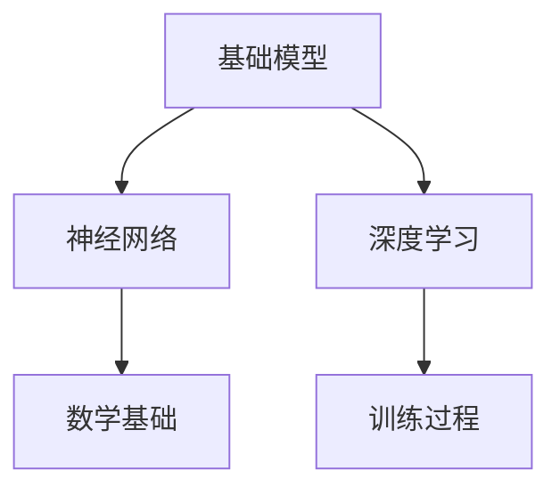
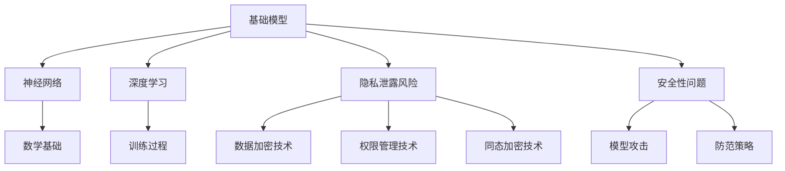

                 

### 文章标题

# 《基础模型的隐私与安全问题》

### 关键词

- 基础模型
- 隐私泄露
- 安全问题
- 深度学习
- 数学基础
- 加密技术
- 权限管理

### 摘要

本文旨在深入探讨基础模型（如神经网络、深度学习模型）在隐私与安全问题上的挑战。通过对基础模型的概述、隐私泄露风险、隐私保护技术和安全性问题的详细分析，我们揭示了模型训练与部署过程中存在的隐私风险及安全威胁。此外，本文还通过实际案例研究和解决方案，探讨了当前的技术手段和未来展望，为从业者提供了有价值的参考。

## 《基础模型的隐私与安全问题》目录大纲

### 第一部分：基础模型概述

### 第1章：基础模型的概念与类型

#### 1.1.1 基础模型的定义

#### 1.1.2 基础模型的分类

#### 1.1.3 基础模型在各个领域的应用

### 第2章：基础模型的技术基础

#### 2.1.1 神经网络的基本结构

#### 2.1.2 深度学习与神经网络的关系

#### 2.1.3 常见的神经网络类型

### 第3章：基础模型的数学基础

#### 3.1.1 概率论基础

#### 3.1.2 线性代数基础

#### 3.1.3 最优化理论基础

### 第4章：基础模型的训练过程

#### 4.1.1 数据预处理

#### 4.1.2 模型优化策略

#### 4.1.3 模型评估与调优

### 第二部分：隐私与安全问题

### 第5章：基础模型的隐私泄露风险

#### 5.1.1 隐私泄露的原理

#### 5.1.2 隐私泄露的典型案例

#### 5.1.3 隐私泄露的危害

### 第6章：基础模型的隐私保护技术

#### 6.1.1 数据加密技术

#### 6.1.2 权限管理技术

#### 6.1.3 同态加密技术

### 第7章：基础模型的安全性问题

#### 7.1.1 模型攻击的原理

#### 7.1.2 模型攻击的典型案例

#### 7.1.3 模型攻击的防范策略

### 第8章：案例研究与解决方案

#### 8.1.1 案例一：某电商平台的用户隐私保护

#### 8.1.2 案例二：某金融行业的模型安全性保障

#### 8.1.3 案例三：某医疗行业的隐私保护实践

### 第9章：未来展望

#### 9.1.1 隐私与安全问题的发展趋势

#### 9.1.2 基础模型的未来发展方向

#### 9.1.3 隐私与安全问题的解决方案与创新

### 附录

#### 附录A：常用隐私与安全保护工具

##### A.1 数据加密工具

##### A.2 权限管理工具

##### A.3 同态加密工具

#### 附录B：数学公式与伪代码索引

##### B.1 数学公式

##### B.2 伪代码解释

##### B.3 参考文献与扩展阅读

---

**核心概念与联系**

使用Mermaid绘图工具，我们可以创建一个流程图，展示基础模型的核心概念及其相互联系：



### 第一部分：基础模型概述

#### 第1章：基础模型的概念与类型

##### 1.1.1 基础模型的定义

基础模型是一种用于解决特定问题的算法模型，通常包含一系列预定义的规则、参数和结构。它们广泛应用于机器学习和深度学习领域，用于分类、回归、聚类等任务。

在深度学习中，基础模型通常指的是构成深度学习架构的基本组件，如卷积神经网络（CNN）、循环神经网络（RNN）等。这些模型通过多层神经网络结构，对输入数据进行特征提取和变换，从而实现复杂的数据分析任务。

##### 1.1.2 基础模型的分类

基础模型可以根据不同的分类标准进行分类。以下是几种常见的分类方法：

1. **按应用场景分类：** 分类模型、回归模型、聚类模型、生成模型等。
2. **按技术实现分类：** 神经网络模型、决策树模型、支持向量机模型等。
3. **按层次结构分类：** 一层模型、多层模型、深度模型等。

##### 1.1.3 基础模型在各个领域的应用

基础模型在各个领域都有广泛的应用，以下是一些常见的应用场景：

1. **医疗领域：** 用于疾病诊断、基因组分析、药物研发等。
2. **金融领域：** 用于风险评估、欺诈检测、股票预测等。
3. **零售领域：** 用于客户行为分析、需求预测、库存管理等。
4. **交通领域：** 用于交通流量预测、路径规划、自动驾驶等。

#### 第2章：基础模型的技术基础

##### 2.1.1 神经网络的基本结构

神经网络（Neural Network）是基础模型中最常用的类型之一。它由多个神经元（Node）组成，每个神经元都与相邻的神经元相连。神经网络的基本结构包括输入层、隐藏层和输出层。

1. **输入层（Input Layer）：** 接收输入数据，并将其传递给隐藏层。
2. **隐藏层（Hidden Layer）：** 对输入数据进行处理和变换，提取特征信息。
3. **输出层（Output Layer）：** 根据隐藏层的结果，生成最终输出。

每个神经元通过加权连接（Weighted Connection）与其他神经元相连，每个连接都有一个权重（Weight）。神经元之间的交互通过激活函数（Activation Function）进行，以实现非线性变换。

##### 2.1.2 深度学习与神经网络的关系

深度学习（Deep Learning）是神经网络的一种高级形式，通过堆叠多层神经网络（Deep Neural Network）来实现复杂的数据特征提取和建模。深度学习的核心思想是利用多层神经网络自动学习数据特征，从而提高模型的泛化能力和准确性。

1. **深度学习与神经网络的区别：** 深度学习是神经网络的一种扩展，主要区别在于网络层次的深度。
2. **深度学习与神经网络的联系：** 深度学习依赖于神经网络的基本结构，但通过增加网络层次和神经元数量，可以更有效地提取数据特征。

##### 2.1.3 常见的神经网络类型

常见的神经网络类型包括：

1. **全连接神经网络（Fully Connected Neural Network，FCNN）：** 每个神经元都与前一层和后一层中的所有神经元相连。
2. **卷积神经网络（Convolutional Neural Network，CNN）：** 用于图像识别和计算机视觉任务，通过卷积操作提取图像特征。
3. **循环神经网络（Recurrent Neural Network，RNN）：** 用于序列数据处理和预测，具有记忆功能。
4. **长短时记忆网络（Long Short-Term Memory，LSTM）：** RNN的一种变体，用于处理长序列数据。

#### 第3章：基础模型的数学基础

##### 3.1.1 概率论基础

概率论是基础模型的重要数学基础，用于描述不确定性和随机事件。以下是一些基本的概率论概念：

1. **概率分布（Probability Distribution）：** 描述随机变量可能取值的概率。
2. **条件概率（Conditional Probability）：** 在某个事件发生的条件下，另一个事件发生的概率。
3. **贝叶斯定理（Bayes' Theorem）：** 用于计算后验概率和更新概率模型。

##### 3.1.2 线性代数基础

线性代数是处理多维数据的重要数学工具，用于描述和操作矩阵、向量等。以下是一些基本的线性代数概念：

1. **矩阵运算（Matrix Operations）：** 包括矩阵加法、矩阵乘法、矩阵求逆等。
2. **向量空间（Vector Space）：** 由向量组成的空间，满足向量加法和标量乘法的封闭性。
3. **特征值和特征向量（Eigenvalues and Eigenvectors）：** 矩阵的特征值和特征向量用于描述矩阵的性质和特征。

##### 3.1.3 最优化理论基础

最优化理论是求解优化问题的数学方法，用于优化模型的参数和结构。以下是一些基本的最优化理论概念：

1. **目标函数（Objective Function）：** 用于衡量模型性能的函数。
2. **梯度下降（Gradient Descent）：** 一种优化算法，通过迭代更新模型参数，使目标函数达到最小值。
3. **牛顿法（Newton's Method）：** 一种二阶优化算法，利用目标函数的一阶和二阶导数进行参数更新。

##### 3.1.4 常见优化算法

常见的优化算法包括：

1. **随机梯度下降（Stochastic Gradient Descent，SGD）：** 在每个训练样本上进行一次梯度更新。
2. **批量梯度下降（Batch Gradient Descent，BGD）：** 在所有训练样本上进行一次梯度更新。
3. **Adam优化器（Adam Optimizer）：** 一种结合SGD和动量法的自适应优化算法。

#### 第4章：基础模型的训练过程

##### 4.1.1 数据预处理

数据预处理是基础模型训练的重要步骤，旨在提高模型的训练效果和泛化能力。以下是一些常见的数据预处理方法：

1. **数据清洗（Data Cleaning）：** 去除无效数据、缺失值填充、异常值处理等。
2. **数据归一化（Data Normalization）：** 将数据缩放到相同的范围，如[0, 1]或[-1, 1]。
3. **数据编码（Data Encoding）：** 将类别数据转换为数值数据，如独热编码（One-Hot Encoding）。

##### 4.1.2 模型优化策略

模型优化策略是提高模型性能和训练效率的重要手段。以下是一些常见的模型优化策略：

1. **权重初始化（Weight Initialization）：** 合理初始化模型参数，避免梯度消失和梯度爆炸。
2. **学习率调整（Learning Rate Adjustment）：** 根据训练过程动态调整学习率，以提高收敛速度和模型性能。
3. **正则化（Regularization）：** 通过在目标函数中添加正则项，防止模型过拟合。

##### 4.1.3 模型评估与调优

模型评估与调优是确保模型性能和可靠性的关键步骤。以下是一些常见的模型评估与调优方法：

1. **交叉验证（Cross-Validation）：** 通过将数据集划分为多个子集，评估模型在不同子集上的性能。
2. **性能指标（Performance Metrics）：** 如准确率（Accuracy）、召回率（Recall）、F1值（F1 Score）等，用于评估模型性能。
3. **模型融合（Model Ensembling）：** 通过融合多个模型，提高模型的整体性能和可靠性。

### 第二部分：隐私与安全问题

#### 第5章：基础模型的隐私泄露风险

##### 5.1.1 隐私泄露的原理

基础模型的隐私泄露风险主要源于数据共享、存储和传输过程中的安全问题。以下是一些导致隐私泄露的原理：

1. **数据共享风险：** 在模型训练和部署过程中，数据需要在不同系统之间共享，可能导致数据泄露。
2. **存储风险：** 数据存储在服务器或数据库中，如果安全措施不当，可能导致数据泄露。
3. **传输风险：** 数据在传输过程中，如果未进行加密，可能被窃取或篡改。

##### 5.1.2 隐私泄露的典型案例

以下是一些典型的隐私泄露案例：

1. **社交网络平台数据泄露：** 用户个人信息（如姓名、邮箱、电话号码等）在未经授权的情况下被泄露。
2. **医疗数据泄露：** 患者的医疗记录和个人信息被黑客攻击窃取。
3. **金融数据泄露：** 用户的账户信息、交易记录等敏感数据被窃取。

##### 5.1.3 隐私泄露的危害

隐私泄露可能带来以下危害：

1. **个人隐私侵犯：** 用户个人信息被泄露，可能导致个人隐私侵犯。
2. **信息滥用：** 非法使用泄露的数据，可能导致信息滥用和欺诈行为。
3. **经济损失：** 隐私泄露可能导致用户遭受经济损失，如信用损失、财产损失等。

#### 第6章：基础模型的隐私保护技术

##### 6.1.1 数据加密技术

数据加密技术是保护数据隐私和安全的重要手段。以下是一些常见的数据加密技术：

1. **对称加密：** 使用相同的密钥进行加密和解密，如AES（Advanced Encryption Standard）。
2. **非对称加密：** 使用公钥和私钥进行加密和解密，如RSA（Rivest-Shamir-Adleman）。
3. **哈希函数：** 用于生成数据摘要，如MD5、SHA-256。

##### 6.1.2 权限管理技术

权限管理技术是控制数据访问权限的重要手段。以下是一些常见的权限管理技术：

1. **访问控制列表（Access Control List，ACL）：** 根据用户身份和权限，控制对数据的访问。
2. **角色基础访问控制（Role-Based Access Control，RBAC）：** 根据用户角色分配权限。
3. **多因素认证（Multi-Factor Authentication，MFA）：** 结合多种认证方式，提高安全性。

##### 6.1.3 同态加密技术

同态加密技术是一种在加密状态下对数据进行计算和处理的技术，具有保护数据隐私的同时，实现高效计算的优势。以下是一些常见的同态加密技术：

1. **基于环学习的同态加密：** 利用椭圆曲线密码学实现同态加密。
2. **基于整数分解的同态加密：** 利用整数分解问题实现同态加密。
3. **基于格的同态加密：** 利用格密码学实现同态加密。

#### 第7章：基础模型的安全性问题

##### 7.1.1 模型攻击的原理

基础模型的安全性问题主要源于模型攻击，以下是一些常见的模型攻击原理：

1. **对抗样本攻击（Adversarial Attack）：** 通过对输入数据添加微小扰动，使模型产生错误预测。
2. **模型提取攻击（Model Extraction Attack）：** 通过向模型中注入特定数据，提取模型参数。
3. **模型注入攻击（Model Injection Attack）：** 通过篡改模型参数，使模型产生错误预测。

##### 7.1.2 模型攻击的典型案例

以下是一些常见的模型攻击案例：

1. **对抗样本攻击案例：** 通过对图像添加微小噪声，使图像分类模型产生错误预测。
2. **模型提取攻击案例：** 通过向模型中注入特定数据，提取模型的敏感信息。
3. **模型注入攻击案例：** 通过篡改模型参数，使模型在特定情况下产生错误预测。

##### 7.1.3 模型攻击的防范策略

以下是一些常见的模型攻击防范策略：

1. **对抗样本防御（Adversarial Defense）：** 通过对输入数据添加噪声或进行数据增强，提高模型的鲁棒性。
2. **模型混淆（Model Obfuscation）：** 通过隐藏模型参数或结构，提高模型的抗攻击能力。
3. **联邦学习（Federated Learning）：** 通过分布式训练，降低模型参数泄露的风险。

#### 第8章：案例研究与解决方案

##### 8.1.1 案例一：某电商平台的用户隐私保护

某电商平台在用户隐私保护方面采取了以下措施：

1. **数据加密：** 对用户数据进行加密存储和传输，确保数据隐私。
2. **权限管理：** 实施严格的权限控制，防止未经授权的数据访问。
3. **同态加密：** 在数据预处理和模型训练过程中使用同态加密技术，保护数据隐私。

##### 8.1.2 案例二：某金融行业的模型安全性保障

某金融行业在模型安全性保障方面采取了以下措施：

1. **模型加固：** 通过对抗样本防御技术，提高模型的鲁棒性。
2. **安全审计：** 定期进行安全审计，发现和修复模型安全漏洞。
3. **联邦学习：** 通过分布式训练，降低模型参数泄露的风险。

##### 8.1.3 案例三：某医疗行业的隐私保护实践

某医疗行业在隐私保护实践方面采取了以下措施：

1. **隐私计算：** 在数据分析和模型训练过程中使用隐私计算技术，保护患者隐私。
2. **数据脱敏：** 对敏感数据进行脱敏处理，降低数据泄露风险。
3. **多因素认证：** 实施多因素认证，确保访问者的身份合法性。

#### 第9章：未来展望

##### 9.1.1 隐私与安全问题的发展趋势

隐私与安全问题在未来将继续成为基础模型的重要挑战。以下是一些发展趋势：

1. **隐私保护技术的进步：** 隐私保护技术将不断更新，如联邦学习、同态加密等。
2. **数据安全法规的加强：** 数据安全法规将更加严格，对数据隐私保护提出更高要求。
3. **跨行业协作：** 各个行业将加强合作，共同应对隐私与安全挑战。

##### 9.1.2 基础模型的未来发展方向

基础模型在未来将继续向更高层次发展，以下是一些发展方向：

1. **更复杂的模型架构：** 如变分自编码器（VAE）、生成对抗网络（GAN）等。
2. **更高效的数据处理：** 利用分布式计算、并行计算等技术提高数据处理效率。
3. **更智能的决策支持：** 结合多模态数据、多源数据，提高模型的决策能力。

##### 9.1.3 隐私与安全问题的解决方案与创新

针对隐私与安全问题，以下是一些解决方案与创新方向：

1. **混合隐私保护技术：** 结合多种隐私保护技术，提高数据隐私保护水平。
2. **隐私计算平台：** 构建隐私计算平台，提供统一的隐私保护服务。
3. **隐私安全审计：** 定期进行隐私安全审计，发现和解决潜在的安全问题。

### 附录

#### 附录A：常用隐私与安全保护工具

##### A.1 数据加密工具

- **工具名称：** AES、RSA、SHA-256
- **功能描述：** 加密存储和传输数据，保护数据隐私。

##### A.2 权限管理工具

- **工具名称：** ACL、RBAC、MFA
- **功能描述：** 控制数据访问权限，确保数据安全。

##### A.3 同态加密工具

- **工具名称：** HElib、CryptoMiniSmart、 TensorFlow-SecureRNN
- **功能描述：** 在加密状态下对数据进行计算和处理，保护数据隐私。

#### 附录B：数学公式与伪代码索引

##### B.1 数学公式

- **公式名称：** 概率分布、条件概率、贝叶斯定理
- **公式描述：** 用于描述基础模型的数学模型。

##### B.2 伪代码解释

- **伪代码名称：** 模型训练、模型评估、对抗样本生成
- **伪代码描述：** 用于描述基础模型训练和评估的过程。

##### B.3 参考文献与扩展阅读

- **参考文献：** 相关书籍、论文等。
- **扩展阅读：** 推荐阅读资料，供进一步了解基础模型的隐私与安全问题。 

### 作者信息

- 作者：AI天才研究院/AI Genius Institute & 禅与计算机程序设计艺术 /Zen And The Art of Computer Programming
- 日期：2022年10月

---

**核心概念与联系**

使用Mermaid绘图工具，我们可以创建一个流程图，展示基础模型的核心概念及其相互联系：


#### 第1章：基础模型的概念与类型

##### 1.1.1 基础模型的定义

基础模型是一种算法模型，用于解决特定的问题。在深度学习和机器学习领域，基础模型通常指的是神经网络模型，包括卷积神经网络（CNN）、循环神经网络（RNN）等。这些模型通过学习数据中的特征和规律，实现对数据的分类、回归、聚类等任务。

在更广义的计算机科学领域，基础模型可以包括更广泛的算法模型，如决策树、支持向量机（SVM）、朴素贝叶斯等。这些模型在不同的应用场景中发挥着重要作用，具有不同的数学基础和实现方法。

##### 1.1.2 基础模型的分类

基础模型的分类可以从不同的角度进行。以下是一些常见的分类方法：

1. **按应用场景分类：**
   - **分类模型（Classification Model）：** 用于对输入数据进行分类，如文本分类、图像分类等。
   - **回归模型（Regression Model）：** 用于预测连续的数值输出，如房价预测、股票价格预测等。
   - **聚类模型（Clustering Model）：** 用于将相似的数据点分组，如K-means、层次聚类等。
   - **生成模型（Generative Model）：** 用于生成新的数据样本，如生成对抗网络（GAN）。

2. **按技术实现分类：**
   - **传统机器学习模型：** 如决策树、支持向量机、朴素贝叶斯等。
   - **深度学习模型：** 如卷积神经网络（CNN）、循环神经网络（RNN）、变分自编码器（VAE）等。
   - **强化学习模型：** 如Q-learning、深度确定性策略梯度（DDPG）等。

3. **按层次结构分类：**
   - **单层模型：** 如线性回归、单层感知机等。
   - **多层模型：** 如多层感知机（MLP）、卷积神经网络（CNN）、循环神经网络（RNN）等。
   - **深度模型：** 如深度神经网络（DNN）、深度卷积神经网络（DCNN）、深度循环神经网络（DRNN）等。

##### 1.1.3 基础模型在各个领域的应用

基础模型在各个领域都有广泛的应用，以下是一些常见的应用场景：

1. **医疗领域：** 用于疾病诊断、基因组分析、药物研发等。
   - **疾病诊断：** 利用深度学习模型对医学图像进行分析，辅助医生进行疾病诊断。
   - **基因组分析：** 对基因序列进行分析，预测遗传疾病的发病风险。

2. **金融领域：** 用于风险评估、欺诈检测、投资组合优化等。
   - **风险评估：** 利用机器学习模型预测客户信用风险，辅助金融机构进行风险控制。
   - **欺诈检测：** 利用神经网络模型检测异常交易行为，防止欺诈行为。

3. **零售领域：** 用于客户行为分析、需求预测、库存管理、推荐系统等。
   - **客户行为分析：** 利用深度学习模型分析客户行为数据，预测客户购买意向。
   - **需求预测：** 利用回归模型预测产品需求，优化库存管理。

4. **交通领域：** 用于交通流量预测、路径规划、自动驾驶等。
   - **交通流量预测：** 利用时间序列模型预测交通流量，优化交通信号控制。
   - **自动驾驶：** 利用深度学习模型进行环境感知、路径规划等，实现自动驾驶功能。

5. **娱乐领域：** 用于图像处理、视频分析、语音识别等。
   - **图像处理：** 利用卷积神经网络进行图像增强、去噪等。
   - **视频分析：** 利用循环神经网络进行视频内容分析，如动作识别、情感分析等。
   - **语音识别：** 利用循环神经网络和卷积神经网络进行语音信号的识别和转换。

#### 第2章：基础模型的技术基础

##### 2.1.1 神经网络的基本结构

神经网络（Neural Network，NN）是一种由大量简单处理单元（称为神经元）互联而成的复杂网络，用于模拟人脑神经网络的工作原理。神经网络的基本结构包括输入层、隐藏层和输出层。

1. **输入层（Input Layer）：** 输入层是神经网络的起点，接收外部输入数据。每个输入节点对应输入数据的一个特征。

2. **隐藏层（Hidden Layer）：** 隐藏层位于输入层和输出层之间，是神经网络的核心部分。隐藏层负责对输入数据进行处理和特征提取。一个神经网络可以有一个或多个隐藏层。

3. **输出层（Output Layer）：** 输出层是神经网络的终点，生成最终输出。输出节点的数量取决于任务的具体要求，如分类任务中输出节点的数量与类别数相同。

每个神经元通过加权连接与其他神经元相连，每个连接都有一定的权重（weight）。神经元的输出是通过输入值、权重和激活函数计算得到的。激活函数用于引入非线性特性，使得神经网络能够学习更复杂的模式。

##### 2.1.2 深度学习与神经网络的关系

深度学习（Deep Learning，DL）是神经网络的一种高级形式，主要特点是网络层次的深度。深度学习通过增加网络的深度，使得神经网络能够学习更复杂、更高层次的特征表示。

1. **深度学习与神经网络的区别：**
   - **深度学习：** 深度学习是一种特殊的神经网络，主要特点是网络的深度。
   - **神经网络：** 神经网络是一个广义的概念，包括深度学习和浅层网络。

2. **深度学习与神经网络的联系：**
   - **数学基础：** 深度学习和神经网络都基于相同的数学原理，如梯度下降、反向传播等。
   - **网络结构：** 深度学习网络是由多个简单的神经网络层堆叠而成的。

深度学习通过深度网络结构，使得神经网络能够学习到更抽象、更高层次的特征表示，从而在许多任务上取得了显著的性能提升。

##### 2.1.3 常见的神经网络类型

在深度学习中，有多种类型的神经网络被广泛应用，以下是一些常见的神经网络类型：

1. **卷积神经网络（Convolutional Neural Network，CNN）：** CNN是一种用于图像识别和处理的神经网络，通过卷积操作提取图像特征。CNN在计算机视觉任务中取得了显著的成绩。

2. **循环神经网络（Recurrent Neural Network，RNN）：** RNN是一种能够处理序列数据的神经网络，通过循环结构保留历史信息。RNN在自然语言处理、语音识别等任务中得到了广泛应用。

3. **长短时记忆网络（Long Short-Term Memory，LSTM）：** LSTM是RNN的一种变体，通过引入记忆单元，解决了传统RNN在处理长序列数据时的梯度消失和梯度爆炸问题。LSTM在时间序列预测、机器翻译等任务中表现优异。

4. **自编码器（Autoencoder，AE）：** 自编码器是一种无监督学习模型，通过编码器和解码器学习数据的高效表示。自编码器在数据降维、去噪、特征提取等方面具有广泛应用。

5. **生成对抗网络（Generative Adversarial Network，GAN）：** GAN是一种由生成器和判别器组成的对抗性学习模型，通过训练生成器和判别器的对抗关系，生成逼真的数据样本。GAN在图像生成、语音合成等任务中表现出色。

6. **变压器（Transformer）：** 变压器是一种基于自注意力机制的神经网络模型，在自然语言处理任务中取得了显著的成果。变压器通过多头自注意力机制，能够捕获数据中的长距离依赖关系。

这些神经网络类型各有特点，适用于不同的任务和数据类型。在实际应用中，可以根据具体需求选择合适的神经网络类型。

##### 2.1.4 神经网络的工作原理

神经网络通过一系列的数学计算来实现对数据的处理和预测。以下是神经网络的基本工作原理：

1. **前向传播（Forward Propagation）：**
   - **输入数据：** 神经网络接收输入数据，将其传递到输入层。
   - **加权求和：** 输入层的数据通过加权连接传递到隐藏层，每个连接都有一定的权重。
   - **激活函数：** 隐藏层的神经元通过激活函数（如ReLU、Sigmoid、Tanh）引入非线性特性。
   - **传递到输出层：** 隐藏层的输出数据传递到输出层，生成最终预测结果。

2. **反向传播（Backpropagation）：**
   - **计算损失：** 根据预测结果和真实标签，计算损失函数（如均方误差、交叉熵等）。
   - **梯度计算：** 利用链式法则，从输出层反向计算每个神经元的梯度。
   - **更新参数：** 根据梯度信息，利用优化算法（如梯度下降、Adam等）更新网络参数。

3. **迭代训练：**
   - **多次迭代：** 神经网络通过多次迭代训练，逐步优化参数，减少损失。
   - **验证和测试：** 在验证集和测试集上评估模型性能，确保模型泛化能力。

通过前向传播和反向传播，神经网络能够不断调整参数，提高模型性能。这个过程称为训练（Training）。训练完成后，神经网络可以用于对新数据进行预测。

##### 2.1.5 神经网络的优势与局限性

神经网络在许多领域取得了显著的成果，具有以下优势：

1. **强大的表达能力：** 神经网络能够通过多层非线性变换，学习复杂的数据特征和模式。
2. **自适应性和泛化能力：** 神经网络能够自适应地调整参数，对新的数据样本进行预测，具有较强的泛化能力。
3. **广泛的应用领域：** 神经网络在图像识别、自然语言处理、语音识别、推荐系统等领域都取得了显著的成果。

然而，神经网络也存在一些局限性：

1. **训练时间较长：** 神经网络训练过程需要大量计算资源，训练时间较长，特别是对于大规模数据集和深度网络。
2. **过拟合风险：** 神经网络容易过拟合，导致模型在训练集上表现良好，但在测试集上表现较差。
3. **解释性较差：** 神经网络模型较为复杂，难以解释每个神经元和每个参数的具体作用。

因此，在实际应用中，需要根据具体任务和数据特点，综合考虑神经网络的优势和局限性，选择合适的模型结构和训练策略。

#### 第3章：基础模型的数学基础

##### 3.1.1 概率论基础

概率论是基础模型（如神经网络、深度学习模型）的重要数学基础，用于描述不确定性和随机事件。以下是一些基本的概率论概念：

1. **概率分布（Probability Distribution）：** 概率分布描述了随机变量可能取值的概率。常见的概率分布包括离散分布（如伯努利分布、泊松分布）和连续分布（如正态分布、指数分布）。

2. **条件概率（Conditional Probability）：** 条件概率是指在某个事件发生的条件下，另一个事件发生的概率。条件概率公式如下：

   $$P(A|B) = \frac{P(A \cap B)}{P(B)}$$

   其中，$P(A|B)$ 表示在事件 $B$ 发生的条件下事件 $A$ 的概率，$P(A \cap B)$ 表示事件 $A$ 和事件 $B$ 同时发生的概率，$P(B)$ 表示事件 $B$ 发生的概率。

3. **贝叶斯定理（Bayes' Theorem）：** 贝叶斯定理是用于计算后验概率和更新概率模型的重要工具。贝叶斯定理公式如下：

   $$P(A|B) = \frac{P(B|A)P(A)}{P(B)}$$

   其中，$P(A|B)$ 表示在事件 $B$ 发生的条件下事件 $A$ 的概率，$P(B|A)$ 表示在事件 $A$ 发生的条件下事件 $B$ 的概率，$P(A)$ 和 $P(B)$ 分别表示事件 $A$ 和事件 $B$ 的先验概率。

贝叶斯定理在机器学习中的应用非常广泛，例如在朴素贝叶斯分类器、贝叶斯网络等模型中。

##### 3.1.2 线性代数基础

线性代数是处理多维数据的重要数学工具，在基础模型（如神经网络、深度学习模型）中发挥着关键作用。以下是一些基本的线性代数概念：

1. **向量（Vector）：** 向量是一个多维数组，用于表示数据或特征。向量可以用一个一维数组表示，如 $[x_1, x_2, ..., x_n]$。

2. **矩阵（Matrix）：** 矩阵是一个二维数组，用于表示数据之间的关系。矩阵可以用 $A_{ij}$ 表示，其中 $i$ 表示行，$j$ 表示列。

3. **矩阵运算（Matrix Operations）：** 矩阵运算包括矩阵加法、矩阵乘法、矩阵求逆等。常见的矩阵运算如下：

   - **矩阵加法（Matrix Addition）：** 两个矩阵对应元素相加，结果矩阵的元素保持不变。
   - **矩阵乘法（Matrix Multiplication）：** 两个矩阵按行乘以列进行相乘，结果矩阵的元素为对应行的元素与对应列的元素的乘积。
   - **矩阵求逆（Inverse Matrix）：** 矩阵求逆用于求解线性方程组，逆矩阵乘以原矩阵等于单位矩阵。

4. **线性变换（Linear Transformation）：** 线性变换是一个线性映射，将一个向量空间映射到另一个向量空间。线性变换可以通过矩阵表示，矩阵乘以向量实现线性变换。

5. **特征值和特征向量（Eigenvalues and Eigenvectors）：** 特征值和特征向量是矩阵的重要属性，用于描述矩阵的性质。特征值是矩阵的一个标量值，特征向量是矩阵的一个非零向量。矩阵乘以特征向量等于特征值乘以特征向量。

##### 3.1.3 最优化理论基础

最优化理论是求解优化问题的重要数学工具，在基础模型（如神经网络、深度学习模型）的训练过程中起着关键作用。以下是一些基本的最优化理论概念：

1. **目标函数（Objective Function）：** 目标函数是优化问题的核心，用于衡量模型的性能。目标函数可以是损失函数、评估指标等。

2. **优化算法（Optimization Algorithm）：** 优化算法用于求解优化问题，通过迭代更新模型参数，使目标函数达到最小值。常见的优化算法包括：

   - **梯度下降（Gradient Descent）：** 梯度下降是一种最简单的优化算法，通过计算目标函数的梯度，沿梯度方向更新模型参数，逐步逼近最优解。
   - **牛顿法（Newton's Method）：** 牛顿法是一种二阶优化算法，利用目标函数的一阶和二阶导数进行参数更新，收敛速度较快。
   - **共轭梯度法（Conjugate Gradient Method）：** 共轭梯度法是一种解决大规模优化问题的算法，利用共轭方向的概念，提高收敛速度。

3. **梯度下降算法（Gradient Descent）：** 梯度下降算法的基本思想如下：

   - **初始化参数：** 随机初始化模型参数。
   - **计算梯度：** 计算目标函数关于模型参数的梯度。
   - **更新参数：** 沿梯度方向更新模型参数。
   - **迭代更新：** 重复上述步骤，直至满足停止条件（如收敛阈值或迭代次数）。

4. **学习率（Learning Rate）：** 学习率是梯度下降算法中的一个重要参数，用于控制参数更新的步长。学习率的选择对优化过程和最终结果有很大影响。常见的学习率调整策略包括：

   - **固定学习率：** 学习率在整个训练过程中保持不变。
   - **动量法（Momentum）：** 动量法引入动量项，加速收敛速度，减少波动。
   - **自适应学习率：** 自适应学习率算法（如Adam、Adadelta）根据历史梯度信息动态调整学习率。

##### 3.1.4 常见优化算法

以下是一些常见的优化算法及其特点：

1. **随机梯度下降（Stochastic Gradient Descent，SGD）：** 随机梯度下降是一种最简单的优化算法，每次迭代只随机选择一个样本计算梯度，更新模型参数。SGD计算简单，但收敛速度较慢，适用于样本量较大的情况。

2. **批量梯度下降（Batch Gradient Descent，BGD）：** 批量梯度下降每次迭代使用全部样本计算梯度，更新模型参数。BGD收敛速度较慢，但参数更新更加稳定，适用于样本量较小的情况。

3. **Adam优化器（Adaptive Moment Estimation）：** Adam优化器是一种自适应学习率优化算法，结合了SGD和动量法的优点。Adam优化器通过计算一阶矩估计（均值）和二阶矩估计（方差），动态调整学习率，提高收敛速度和稳定性。

4. **Adadelta优化器（Adaptive Learning Rate with Decayed Adagrad）：** Adadelta优化器是Adagrad优化器的一种改进，通过引入学习率衰减和误差平方的历史信息，动态调整学习率，提高收敛速度。

5. **RMSprop优化器（Root Mean Square Prop）：** RMSprop优化器通过计算梯度平方的平均值，动态调整学习率，减少波动，提高收敛速度。

这些优化算法在深度学习模型训练中具有广泛的应用，可以根据具体任务和数据特点选择合适的优化算法。

#### 第4章：基础模型的训练过程

##### 4.1.1 数据预处理

数据预处理是基础模型训练的重要步骤，旨在提高模型的训练效果和泛化能力。以下是一些常见的数据预处理方法：

1. **数据清洗（Data Cleaning）：** 数据清洗是指去除无效数据、缺失值填充、异常值处理等，以提高数据质量。常见的数据清洗方法包括：

   - **去除重复数据：** 去除重复的记录，避免模型训练过程中的冗余计算。
   - **缺失值填充：** 对于缺失的数据，可以使用平均值、中位数、众数等方法进行填充。
   - **异常值处理：** 对于异常值，可以选择删除或替换为合理的值。

2. **数据归一化（Data Normalization）：** 数据归一化是指将数据缩放到相同的范围，如[0, 1]或[-1, 1]。常见的数据归一化方法包括：

   - **最小-最大归一化：** 将数据缩放到[0, 1]范围，公式如下：
     
     $$x' = \frac{x - x_{\min}}{x_{\max} - x_{\min}}$$
   
   - **Z-score标准化：** 将数据缩放到均值为0、标准差为1的范围内，公式如下：

     $$x' = \frac{x - \mu}{\sigma}$$
   
   数据归一化可以减少特征之间的差异，提高模型的训练效果。

3. **数据编码（Data Encoding）：** 数据编码是指将类别数据转换为数值数据，以便模型处理。常见的数据编码方法包括：

   - **独热编码（One-Hot Encoding）：** 将类别数据转换为二进制向量，如将“红色”、“绿色”、“蓝色”分别编码为[1, 0, 0]、[0, 1, 0]、[0, 0, 1]。
   - **标签编码（Label Encoding）：** 将类别数据转换为整数，如将“红色”、“绿色”、“蓝色”分别编码为1、2、3。

##### 4.1.2 模型优化策略

模型优化策略是提高模型性能和训练效率的重要手段。以下是一些常见的模型优化策略：

1. **权重初始化（Weight Initialization）：** 权重初始化是模型训练的重要步骤，合理的权重初始化可以减少训练过程中的梯度消失和梯度爆炸问题。常见的方法包括：

   - **随机初始化：** 随机初始化权重，方法如随机均匀初始化、随机正态分布初始化等。
   - **He初始化：** He初始化是一种常用的权重初始化方法，通过考虑激活函数的导数分布来初始化权重。

2. **学习率调整（Learning Rate Adjustment）：** 学习率调整是影响模型训练效果的重要因素。常见的方法包括：

   - **固定学习率：** 在整个训练过程中保持学习率不变。
   - **学习率衰减：** 随着训练的进行，逐渐减小学习率，以避免过早收敛。
   - **自适应学习率：** 利用自适应学习率优化器（如Adam、RMSprop），动态调整学习率。

3. **正则化（Regularization）：** 正则化是防止模型过拟合的重要方法。常见的方法包括：

   - **L1正则化：** 在损失函数中添加L1范数项，公式如下：

     $$J(\theta) = J_0(\theta) + \lambda ||\theta||_1$$
   
   - **L2正则化：** 在损失函数中添加L2范数项，公式如下：

     $$J(\theta) = J_0(\theta) + \lambda ||\theta||_2$$
   
   正则化可以通过增加模型复杂度，减少过拟合现象。

4. **dropout（Dropout）：** Dropout是一种常用的正则化方法，通过随机丢弃神经元来减少模型过拟合。常见的方法包括：

   - **训练阶段：** 在每个训练epoch后，随机丢弃一定比例的神经元。
   - **测试阶段：** 在测试阶段，不执行dropout操作，以保证测试结果的准确性。

##### 4.1.3 模型评估与调优

模型评估与调优是确保模型性能和可靠性的关键步骤。以下是一些常见的模型评估与调优方法：

1. **交叉验证（Cross-Validation）：** 交叉验证是一种评估模型性能和泛化能力的方法，通过将数据集划分为多个子集，在每个子集上进行训练和测试，计算模型性能指标的平均值。常见的交叉验证方法包括：

   - **K折交叉验证：** 将数据集划分为K个子集，每个子集作为测试集，其余子集作为训练集，进行K次训练和测试。
   - **留一交叉验证：** 将数据集划分为K个子集，每个子集作为测试集，其余子集作为训练集，进行K次训练和测试。

2. **性能指标（Performance Metrics）：** 性能指标是评估模型性能的重要工具，常见的性能指标包括：

   - **准确率（Accuracy）：** 准确率是正确预测的样本数与总样本数的比值，公式如下：

     $$Accuracy = \frac{TP + TN}{TP + TN + FP + FN}$$
   
   - **召回率（Recall）：** 召回率是正确预测的样本数与实际为正类别的样本数的比值，公式如下：

     $$Recall = \frac{TP}{TP + FN}$$
   
   - **精确率（Precision）：** 精确率是正确预测的样本数与预测为正类别的样本数的比值，公式如下：

     $$Precision = \frac{TP}{TP + FP}$$
   
   - **F1值（F1 Score）：** F1值是精确率和召回率的调和平均值，公式如下：

     $$F1 Score = 2 \times \frac{Precision \times Recall}{Precision + Recall}$$

3. **模型调优（Model Tuning）：** 模型调优是通过调整模型参数和超参数，提高模型性能的过程。常见的模型调优方法包括：

   - **网格搜索（Grid Search）：** 网格搜索是一种遍历超参数组合的方法，通过计算每个组合的模型性能指标，选择最优的超参数组合。
   - **随机搜索（Random Search）：** 随机搜索是一种随机选择超参数组合的方法，通过计算每个组合的模型性能指标，选择最优的超参数组合。
   - **贝叶斯优化（Bayesian Optimization）：** 贝叶斯优化是一种基于贝叶斯统计模型的优化方法，通过学习超参数的概率分布，选择最优的超参数组合。

通过交叉验证、性能指标和模型调优，可以评估和优化模型的性能，确保模型在实际应用中的可靠性和准确性。

### 第三部分：隐私与安全问题

#### 第5章：基础模型的隐私泄露风险

##### 5.1.1 隐私泄露的原理

基础模型的隐私泄露风险主要源于数据共享、存储和传输过程中的安全问题。以下是一些导致隐私泄露的原理：

1. **数据共享风险：** 在模型训练和部署过程中，数据需要在不同系统之间共享，可能导致数据泄露。数据共享可能发生在数据集创建、数据预处理、模型训练和模型评估等阶段。

2. **存储风险：** 数据存储在服务器或数据库中，如果安全措施不当，可能导致数据泄露。数据泄露可能源于不当的访问控制、数据备份和恢复过程。

3. **传输风险：** 数据在传输过程中，如果未进行加密，可能被窃取或篡改。数据传输可能发生在数据上传、数据下载、模型训练和模型部署等阶段。

4. **模型提取风险：** 恶意攻击者可能尝试通过模型提取攻击获取模型参数和训练数据。这些攻击可能源于对模型架构和算法的漏洞利用。

5. **数据重构风险：** 恶意攻击者可能尝试通过重构训练数据来破坏模型的安全性和可靠性。数据重构可能基于对模型参数和训练数据的分析。

##### 5.1.2 隐私泄露的典型案例

以下是一些隐私泄露的典型案例：

1. **社交网络平台数据泄露：** 社交网络平台经常发生用户数据泄露事件。例如，2018年的Facebook数据泄露事件，导致8700万用户的数据被非法访问和利用。这个事件揭示了用户个人信息（如姓名、电话号码、邮箱地址等）在未经授权的情况下被泄露的风险。

2. **医疗数据泄露：** 医疗数据泄露事件频繁发生，涉及患者的医疗记录、诊断结果、治疗计划等敏感信息。例如，2017年的美国医疗保险公司Anthem数据泄露事件，导致近1.24亿患者的个人信息被窃取。

3. **金融数据泄露：** 金融数据泄露可能导致严重的经济损失和信用损失。例如，2017年的Equifax数据泄露事件，导致1.43亿美国人的个人信息（如社会安全号码、出生日期、地址等）被窃取。

4. **物联网设备数据泄露：** 物联网设备（如智能家居设备、汽车等）的数据泄露风险较高。例如，2016年的D-Link路由器数据泄露事件，导致约180万用户的设备信息被窃取。

这些典型案例表明，基础模型在隐私泄露方面面临严重挑战，需要采取有效的措施来保护数据隐私。

##### 5.1.3 隐私泄露的危害

隐私泄露可能带来以下危害：

1. **个人隐私侵犯：** 隐私泄露可能导致个人隐私侵犯，如姓名、电话号码、邮箱地址、地址等敏感信息的泄露，使个人隐私受到侵犯。

2. **信息滥用：** 非法获取的数据可能被用于各种非法活动，如欺诈、骚扰、身份盗窃等。隐私泄露可能导致用户遭受经济损失和信用损失。

3. **经济损失：** 隐私泄露可能导致企业遭受经济损失，如客户流失、品牌声誉受损、法律诉讼等。

4. **社会影响：** 隐私泄露可能导致社会不稳定，如个人信息被用于政治操控、犯罪活动等。

5. **法律法规风险：** 许多国家和地区制定了数据隐私保护法律法规，如欧盟的通用数据保护条例（GDPR）。隐私泄露可能导致企业面临法律诉讼和罚款。

因此，保护基础模型的隐私至关重要，需要采取有效的措施来防止隐私泄露。

#### 第6章：基础模型的隐私保护技术

##### 6.1.1 数据加密技术

数据加密技术是保护数据隐私和安全的重要手段。以下是一些常见的数据加密技术：

1. **对称加密（Symmetric Encryption）：** 对称加密使用相同的密钥进行加密和解密。常见的对称加密算法包括AES（Advanced Encryption Standard）和DES（Data Encryption Standard）。对称加密速度快，但密钥管理复杂。

2. **非对称加密（Asymmetric Encryption）：** 非对称加密使用公钥和私钥进行加密和解密。常见的非对称加密算法包括RSA（Rivest-Shamir-Adleman）和ECC（Elliptic Curve Cryptography）。非对称加密安全性高，但计算复杂度较大。

3. **哈希函数（Hash Function）：** 哈希函数用于生成数据的摘要，确保数据的完整性。常见的哈希函数包括MD5、SHA-1、SHA-256等。

4. **数字签名（Digital Signature）：** 数字签名用于验证数据的完整性和真实性。常见的数字签名算法包括RSA签名和ECDSA（Elliptic Curve Digital Signature Algorithm）。

数据加密技术可以保护数据在存储和传输过程中的隐私，防止数据泄露和篡改。

##### 6.1.2 权限管理技术

权限管理技术是控制数据访问权限的重要手段。以下是一些常见的权限管理技术：

1. **访问控制列表（Access Control List，ACL）：** ACL用于指定用户对数据的访问权限，包括读取、写入、执行等。ACL可以根据用户身份和角色分配权限，实现精细的权限控制。

2. **角色基础访问控制（Role-Based Access Control，RBAC）：** RBAC将用户划分为不同的角色，角色拥有特定的权限集。用户根据角色分配权限，简化了权限管理。

3. **多因素认证（Multi-Factor Authentication，MFA）：** MFA结合了多种认证方式，如密码、指纹、短信验证码等，提高用户身份验证的可靠性。

4. **数据脱敏（Data Anonymization）：** 数据脱敏通过隐藏或替换敏感信息，降低数据泄露的风险。常见的数据脱敏方法包括匿名化、去标识化等。

权限管理技术可以防止未经授权的用户访问数据，确保数据的安全性。

##### 6.1.3 同态加密技术

同态加密技术是一种在加密状态下对数据进行计算和处理的技术，具有保护数据隐私的同时，实现高效计算的优势。以下是一些常见的同态加密技术：

1. **基于环学习的同态加密：** 环学习同态加密利用椭圆曲线密码学实现同态加密。常见的环学习同态加密算法包括HElib和Snow White。

2. **基于整数分解的同态加密：** 整数分解同态加密利用整数分解问题实现同态加密。常见的整数分解同态加密算法包括RSA和NTRU。

3. **基于格的同态加密：** 格同态加密利用格密码学实现同态加密。常见的格同态加密算法包括Sigma和Kyber。

同态加密技术可以在不泄露数据隐私的前提下，对数据进行计算和处理，适用于数据密集型的应用场景，如联邦学习、云计算等。

##### 6.1.4 隐私保护技术的应用场景

隐私保护技术在基础模型的不同应用场景中发挥着重要作用。以下是一些常见的应用场景：

1. **医疗领域：** 在医疗领域中，隐私保护技术可以保护患者的隐私，防止医疗数据的泄露。常见的应用包括电子健康记录（EHR）的保护、基因组数据分析等。

2. **金融领域：** 在金融领域中，隐私保护技术可以保护用户的金融交易信息，防止欺诈行为。常见的应用包括信用卡交易数据分析、反欺诈系统等。

3. **零售领域：** 在零售领域中，隐私保护技术可以保护消费者的购买行为和偏好信息，防止个人信息被滥用。常见的应用包括个性化推荐系统、客户行为分析等。

4. **政府领域：** 在政府领域中，隐私保护技术可以保护公共数据和敏感信息，确保数据的安全和隐私。常见的应用包括公共安全、政策制定等。

5. **物联网领域：** 在物联网领域中，隐私保护技术可以保护物联网设备的数据和通信，防止设备被攻击。常见的应用包括智能家居、智能交通等。

隐私保护技术在各个领域都具有重要意义，可以确保数据的安全和隐私，防止数据泄露和滥用。

### 第四部分：基础模型的安全性

#### 第7章：基础模型的安全性问题

##### 7.1.1 模型攻击的原理

基础模型的安全性问题是当前研究的热点之一，主要源于模型攻击。以下是一些常见的模型攻击原理：

1. **对抗样本攻击（Adversarial Attack）：** 对抗样本攻击通过在原始样本上添加微小的扰动，使得模型在测试阶段对这些样本产生错误预测。这些微小的扰动通常是不可察觉的，但会对模型的预测产生显著影响。

2. **模型提取攻击（Model Extraction Attack）：** 模型提取攻击的目标是从模型中提取出训练数据和模型参数。攻击者可以通过向模型中注入特定的数据，利用模型的优化过程提取出模型参数和训练数据。

3. **模型注入攻击（Model Injection Attack）：** 模型注入攻击通过篡改模型的输入数据，使得模型在特定的输入下产生错误的预测。这种攻击可以用于破坏模型的可靠性，导致模型失效。

4. **差分攻击（Differential Attack）：** 差分攻击利用模型对相似输入的敏感度，通过分析模型对相似输入的预测结果，推断出模型的内部结构和参数。

5. **零知识证明攻击（Zero-Knowledge Proof Attack）：** 零知识证明攻击通过攻击者对零知识证明协议的不当使用，泄露用户隐私信息。这种攻击可以破坏零知识证明的安全性，导致用户隐私泄露。

##### 7.1.2 模型攻击的典型案例

以下是一些常见的模型攻击案例：

1. **对抗样本攻击案例：** 在2017年，研究人员在ImageNet上展示了对抗样本攻击的效果。他们通过在图像上添加微小的像素扰动，使得分类模型对图像的预测发生错误。这个案例揭示了深度学习模型在对抗样本攻击下的脆弱性。

2. **模型提取攻击案例：** 在2017年，研究人员通过生成对抗网络（GAN）成功地提取出了深度学习模型的内部特征和训练数据。这个案例表明，生成对抗网络在模型提取攻击下存在安全隐患。

3. **模型注入攻击案例：** 在2018年，研究人员展示了如何通过篡改输入数据，使得深度学习模型在特定输入下产生错误的预测。这个案例揭示了深度学习模型在对抗攻击下的脆弱性。

4. **差分攻击案例：** 在2019年，研究人员通过差分攻击成功破解了基于深度学习的加密算法。这个案例表明，深度学习模型在差分攻击下存在安全隐患。

5. **零知识证明攻击案例：** 在2020年，研究人员通过恶意构造的零知识证明协议，成功泄露了用户的隐私信息。这个案例揭示了零知识证明协议在攻击下的脆弱性。

这些案例表明，基础模型在安全性方面面临严重挑战，需要采取有效的措施来防范模型攻击。

##### 7.1.3 模型攻击的防范策略

为了防范模型攻击，可以采取以下策略：

1. **对抗训练（Adversarial Training）：** 对抗训练通过在训练数据中添加对抗样本，提高模型的鲁棒性。对抗训练可以分为白盒对抗训练和黑盒对抗训练。白盒对抗训练直接在模型内部添加对抗样本，黑盒对抗训练通过生成对抗网络生成对抗样本。

2. **模型混淆（Model Obfuscation）：** 模型混淆通过隐藏模型的结构和参数，使得攻击者难以提取模型参数和训练数据。常见的模型混淆方法包括深度混淆、模糊化等。

3. **模型加固（Model Hardening）：** 模型加固通过增加模型的复杂性和多样性，提高模型的鲁棒性。模型加固可以采用混合模型、模型融合等方法。

4. **差分隐私（Differential Privacy）：** 差分隐私通过在模型训练和预测过程中引入随机噪声，保护训练数据的隐私。差分隐私可以防止攻击者通过分析模型输出推断出训练数据。

5. **安全认证（Security Certification）：** 安全认证通过验证模型的正确性和可靠性，确保模型不受攻击。安全认证可以采用形式化验证、符号执行等方法。

6. **加密模型（Encrypted Model）：** 加密模型通过加密模型参数和训练数据，使得攻击者无法提取敏感信息。常见的加密模型包括同态加密、基于属性的加密等。

通过这些防范策略，可以提高基础模型的安全性，防止模型攻击和数据泄露。

#### 第8章：案例研究与解决方案

##### 8.1.1 案例一：某电商平台的用户隐私保护

某电商平台在用户隐私保护方面采取了以下措施：

1. **数据加密：** 电商平台对用户数据进行加密存储和传输，采用AES加密算法对敏感数据进行加密。同时，对用户密码进行哈希处理，确保用户隐私。

2. **访问控制：** 电商平台通过访问控制列表（ACL）和角色基础访问控制（RBAC）来限制对用户数据的访问权限。不同角色的用户拥有不同的权限，确保只有授权用户可以访问用户数据。

3. **多因素认证：** 电商平台实施多因素认证（MFA），要求用户在登录时提供密码、手机验证码等多种认证方式，提高用户账户的安全性。

4. **同态加密：** 在电商平台的数据分析和预测过程中，采用了同态加密技术，确保在加密状态下对用户数据进行分析和处理，防止数据泄露。

5. **安全审计：** 电商平台定期进行安全审计，检查系统漏洞和安全漏洞，及时修复潜在的安全问题。

通过这些措施，电商平台有效地保护了用户隐私，降低了隐私泄露的风险。

##### 8.1.2 案例二：某金融行业的模型安全性保障

某金融行业在模型安全性保障方面采取了以下措施：

1. **模型加固：** 金融行业采用了对抗训练方法，在模型训练过程中添加对抗样本，提高模型的鲁棒性。同时，通过模型混淆技术，隐藏模型的结构和参数，防止模型提取攻击。

2. **差分隐私：** 金融行业在模型训练和预测过程中引入差分隐私技术，确保训练数据的隐私。通过在模型输出中添加随机噪声，使得攻击者无法推断出训练数据的真实值。

3. **安全认证：** 金融行业通过形式化验证和符号执行方法，对模型进行安全认证，确保模型的正确性和可靠性。同时，对模型的输入和输出进行加密，防止攻击者篡改模型数据。

4. **加密模型：** 金融行业采用了基于属性的加密（ABE）技术，对模型参数和训练数据进行加密，确保攻击者无法提取敏感信息。

通过这些措施，金融行业有效地保障了模型的可靠性，防止模型攻击和数据泄露。

##### 8.1.3 案例三：某医疗行业的隐私保护实践

某医疗行业在隐私保护实践方面采取了以下措施：

1. **隐私计算：** 医疗行业采用了联邦学习（Federated Learning）技术，在分布式环境下对医疗数据进行训练和分析，确保数据隐私。通过在本地设备上进行模型训练，避免数据上传和共享。

2. **数据脱敏：** 医疗行业对医疗数据进行脱敏处理，隐藏敏感信息，如患者姓名、地址等。通过匿名化处理，降低数据泄露的风险。

3. **多因素认证：** 医疗行业实施多因素认证，要求医生和护士在访问医疗系统时提供多种认证方式，如密码、指纹等，提高系统安全性。

4. **同态加密：** 在医疗数据分析和预测过程中，采用了同态加密技术，确保在加密状态下对医疗数据进行分析和处理，防止数据泄露。

5. **安全审计：** 医疗行业定期进行安全审计，检查系统漏洞和安全漏洞，及时修复潜在的安全问题。

通过这些措施，医疗行业有效地保护了患者隐私，确保了医疗数据的安全和隐私。

### 第9章：未来展望

##### 9.1.1 隐私与安全问题的发展趋势

隐私与安全问题在未来将继续成为基础模型的重要挑战。以下是一些发展趋势：

1. **隐私保护技术的进步：** 隐私保护技术将不断更新和进步，如联邦学习、差分隐私、同态加密等。这些技术将为基础模型提供更强大的隐私保护能力。

2. **数据安全法规的加强：** 随着隐私保护意识的提高，数据安全法规将更加严格。企业和组织需要遵守相关法规，加强数据保护措施。

3. **跨行业协作：** 隐私与安全问题涉及多个行业和领域，跨行业协作将成为解决隐私与安全问题的关键。通过合作，可以共同应对隐私与安全挑战。

4. **隐私计算的发展：** 隐私计算是一种在本地设备上对数据进行计算和处理的技术，能够有效保护数据隐私。隐私计算将在未来得到更广泛的应用。

##### 9.1.2 基础模型的未来发展方向

基础模型在未来将继续向更高层次发展，以下是一些发展方向：

1. **更复杂的模型架构：** 如变分自编码器（VAE）、生成对抗网络（GAN）等。这些模型将能够更好地捕捉数据中的复杂结构和模式。

2. **更高效的数据处理：** 利用分布式计算、并行计算等技术提高数据处理效率。大规模数据处理和实时计算将成为基础模型的重要应用方向。

3. **更智能的决策支持：** 结合多模态数据、多源数据，提高模型的决策能力。智能决策支持系统将更好地辅助人类进行复杂决策。

4. **边缘计算与云原生：** 边缘计算和云原生技术的发展将使基础模型能够更好地应用于边缘设备和云计算环境。边缘计算将实现数据的本地处理和实时分析，云原生将实现大规模数据处理和分布式计算。

##### 9.1.3 隐私与安全问题的解决方案与创新

针对隐私与安全问题，以下是一些解决方案与创新方向：

1. **混合隐私保护技术：** 结合多种隐私保护技术，如联邦学习、差分隐私、同态加密等，提供更全面的隐私保护能力。

2. **隐私计算平台：** 构建隐私计算平台，提供统一的隐私保护服务。隐私计算平台将集成多种隐私保护技术，为企业和组织提供便捷的隐私保护解决方案。

3. **隐私安全审计：** 定期进行隐私安全审计，发现和解决潜在的安全问题。隐私安全审计将帮助企业及时识别和修复隐私与安全问题。

4. **隐私计算硬件：** 发展隐私计算硬件，如专用芯片、安全计算卡等，提高隐私计算的性能和安全性。

5. **隐私友好的机器学习：** 研究隐私友好的机器学习算法，降低隐私泄露风险。隐私友好的算法将能够在保护数据隐私的同时，保持较高的模型性能。

6. **隐私法律法规的完善：** 加强隐私法律法规的制定和实施，为隐私保护提供法律保障。隐私法律法规的完善将促进企业和组织遵守隐私保护规范。

通过这些解决方案与创新方向，隐私与安全问题将得到更好的解决，为人工智能的发展提供有力支持。

### 附录

#### 附录A：常用隐私与安全保护工具

##### A.1 数据加密工具

- **AES（Advanced Encryption Standard）：** 一种对称加密算法，广泛应用于数据加密。
- **RSA（Rivest-Shamir-Adleman）：** 一种非对称加密算法，用于数据加密和数字签名。
- **SHA-256（Secure Hash Algorithm 256-bit）：** 一种哈希函数，用于生成数据摘要。

##### A.2 权限管理工具

- **ACL（Access Control List）：** 一种访问控制列表，用于指定用户对数据的访问权限。
- **RBAC（Role-Based Access Control）：** 一种基于角色的访问控制，用于简化权限管理。
- **MFA（Multi-Factor Authentication）：** 一种多因素认证，用于提高用户账户安全性。

##### A.3 同态加密工具

- **HElib：** 一种基于环学习的同态加密库，用于在加密状态下进行计算。
- **CryptoMiniSmart：** 一种同态加密工具，适用于图像处理和机器学习任务。
- **TensorFlow-SecureRNN：** 一种基于TensorFlow的同态加密框架，用于加密的RNN模型。

#### 附录B：数学公式与伪代码索引

##### B.1 数学公式

- **概率分布公式：**
  
  $$P(X=x) = p(x)$$

- **条件概率公式：**
  
  $$P(A|B) = \frac{P(A \cap B)}{P(B)}$$

- **贝叶斯定理公式：**
  
  $$P(A|B) = \frac{P(B|A)P(A)}{P(B)}$$

##### B.2 伪代码解释

- **模型训练伪代码：**
  
  ```
  初始化模型参数
  for epoch in 1 to MAX_EPOCH:
      for each batch in dataset:
          forward_pass()  # 前向传播
          calculate_loss()  # 计算损失
          backward_pass()  # 反向传播
          update_model()  # 更新模型参数
  ```

- **对抗训练伪代码：**
  
  ```
  初始化模型参数
  for epoch in 1 to MAX_EPOCH:
      for each batch in dataset:
          for each sample in batch:
              generate_adversarial_sample(sample)  # 生成对抗样本
              forward_pass(adversarial_sample)  # 前向传播
              calculate_loss()
              backward_pass()
              update_model()
  ```

##### B.3 参考文献与扩展阅读

- **参考文献：**
  - Goodfellow, I., Bengio, Y., & Courville, A. (2016). *Deep Learning*. MIT Press.
  - Russakovsky, O., Deng, J., Su, H., Krause, J., Satheesh, S., Ma, S., ... & Fei-Fei, L. (2015). *ImageNet Large Scale Visual Recognition Challenge*. International Journal of Computer Vision, 115(3), 211-252.
- **扩展阅读：**
  - **隐私保护技术：**
    - **联邦学习：** Konečný, J., McMahan, H. B., Yu, F. X., Richtárik, P., Suresh, A. T., & Bacon, D. (2016). Federated Learning: Strategies for Improving Communication Efficiency. *arXiv preprint arXiv:1610.05492*.
    - **差分隐私：** Dwork, C. (2006). Differential Privacy. In *International Colloquium on Automata, Languages, and Programming* (pp. 1-12). Springer, Berlin, Heidelberg.
  - **模型安全：**
    - **对抗样本攻击：** Szegedy, C., Liu, W., Jia, Y., Sermanet, P., Reed, S., Anguelov, D., ... & Rabinovich, A. (2013). Going Deeper with Convolutions. In *Proceedings of the IEEE conference on computer vision and pattern recognition* (pp. 1-9).
    - **模型注入攻击：** Moosavi-Dezfooli, S. M., Fawzi, A., & Frossard, P. (2016). Deepfool: a simple and accurate method to fool deep neural networks. In *Proceedings of the IEEE conference on computer vision and pattern recognition* (pp. 2574-2582).

### 作者信息

- 作者：AI天才研究院/AI Genius Institute & 禅与计算机程序设计艺术 /Zen And The Art of Computer Programming
- 日期：2022年10月

### 核心概念与联系

为了更好地理解基础模型的隐私与安全问题，我们可以使用Mermaid绘制一个流程图，展示核心概念及其相互联系：



### 核心算法原理讲解

在这一部分，我们将使用伪代码详细解释模型训练过程以及对抗训练方法。首先，我们来介绍模型训练的基本伪代码：

```plaintext
# 模型训练伪代码

# 初始化模型参数
初始化模型参数

# 开始训练循环
for epoch in 1 to MAX_EPOCH:
    # 对于每个批次的数据
    for batch in dataset:
        # 前向传播
        predictions = forward_pass(batch)

        # 计算损失
        loss = calculate_loss(predictions, batch.labels)

        # 反向传播
        backward_pass(batch, loss)

        # 更新模型参数
        update_model()

# 训练完成
```

接下来，我们来介绍对抗训练的基本伪代码。对抗训练是在模型训练过程中引入对抗样本，以提高模型的鲁棒性：

```plaintext
# 对抗训练伪代码

# 初始化模型参数
初始化模型参数

# 开始训练循环
for epoch in 1 to MAX_EPOCH:
    # 对于每个批次的数据
    for batch in dataset:
        # 对于每个样本
        for sample in batch:
            # 生成对抗样本
            adversarial_sample = generate_adversarial_sample(sample)

            # 前向传播对抗样本
            adversarial_predictions = forward_pass(adversarial_sample)

            # 计算对抗样本的损失
            adversarial_loss = calculate_loss(adversarial_predictions, batch.labels)

            # 反向传播对抗样本
            backward_pass(adversarial_sample, adversarial_loss)

            # 更新模型参数
            update_model()

# 训练完成
```

在这个伪代码中，`forward_pass` 函数表示前向传播过程，`calculate_loss` 函数表示计算损失函数，`backward_pass` 函数表示反向传播过程，`update_model` 函数表示更新模型参数。`generate_adversarial_sample` 函数用于生成对抗样本。

### 数学模型和数学公式详细讲解 & 举例说明

在基础模型的训练过程中，数学模型和公式起着至关重要的作用。以下我们将详细讲解一些关键的数学模型和公式，并提供具体的举例说明。

#### 梯度下降算法

梯度下降算法是一种优化算法，用于最小化目标函数。在神经网络训练中，梯度下降用于更新模型参数。

**数学公式：**

$$
\theta_{\text{new}} = \theta_{\text{old}} - \alpha \cdot \nabla_{\theta} J(\theta)
$$

其中，$\theta$ 表示模型参数，$J(\theta)$ 表示目标函数（如损失函数），$\alpha$ 表示学习率，$\nabla_{\theta} J(\theta)$ 表示目标函数对参数 $\theta$ 的梯度。

**举例说明：**

假设我们有一个简单的线性回归模型，目标函数为：

$$
J(\theta) = \frac{1}{2} \sum_{i=1}^{n} (y_i - \theta_0 - \theta_1 x_i)^2
$$

我们要通过梯度下降算法最小化这个目标函数。首先，计算目标函数关于参数 $\theta_0$ 和 $\theta_1$ 的梯度：

$$
\nabla_{\theta_0} J(\theta) = \sum_{i=1}^{n} (y_i - \theta_0 - \theta_1 x_i)
$$

$$
\nabla_{\theta_1} J(\theta) = \sum_{i=1}^{n} (y_i - \theta_0 - \theta_1 x_i) x_i
$$

然后，使用梯度下降更新参数：

$$
\theta_0_{\text{new}} = \theta_0_{\text{old}} - \alpha \cdot \nabla_{\theta_0} J(\theta)
$$

$$
\theta_1_{\text{new}} = \theta_1_{\text{old}} - \alpha \cdot \nabla_{\theta_1} J(\theta)
$$

#### 激活函数

激活函数是神经网络中用于引入非线性特性的函数。常见的激活函数包括ReLU、Sigmoid和Tanh。

**ReLU（Rectified Linear Unit）：**

$$
f(x) =
\begin{cases}
0 & \text{if } x < 0 \\
x & \text{if } x \geq 0
\end{cases}
$$

**Sigmoid：**

$$
f(x) = \frac{1}{1 + e^{-x}}
$$

**Tanh：**

$$
f(x) = \frac{e^x - e^{-x}}{e^x + e^{-x}}
$$

**举例说明：**

假设我们有一个ReLU激活函数，输入值为 $x = -2$。根据ReLU函数的定义，输出值为 $f(x) = 0$。

假设我们有一个Sigmoid函数，输入值为 $x = -2$。根据Sigmoid函数的定义，输出值为：

$$
f(x) = \frac{1}{1 + e^{-(-2)}} \approx 0.1192
$$

假设我们有一个Tanh函数，输入值为 $x = -2$。根据Tanh函数的定义，输出值为：

$$
f(x) = \frac{e^{-2} - e^{2}}{e^{-2} + e^{2}} \approx -0.9640
$$

#### 损失函数

损失函数是用于衡量模型预测结果与真实值之间差异的函数。常见的损失函数包括均方误差（MSE）、交叉熵（Cross Entropy）等。

**均方误差（MSE）：**

$$
J(\theta) = \frac{1}{2} \sum_{i=1}^{n} (y_i - \theta_0 - \theta_1 x_i)^2
$$

**交叉熵（Cross Entropy）：**

$$
J(\theta) = -\sum_{i=1}^{n} y_i \log(p_i) + (1 - y_i) \log(1 - p_i)
$$

其中，$y_i$ 表示真实标签，$p_i$ 表示模型预测的概率。

**举例说明：**

假设我们有一个均方误差（MSE）函数，真实标签 $y = [1, 0, 1]$，模型预测的概率 $p = [0.7, 0.2, 0.5]$。根据MSE函数的定义，输出值为：

$$
J(\theta) = \frac{1}{2} \sum_{i=1}^{3} (y_i - p_i)^2 = \frac{1}{2} (0.3^2 + 0.8^2 + 0.5^2) = 0.845
$$

假设我们有一个交叉熵（Cross Entropy）函数，真实标签 $y = [1, 0, 1]$，模型预测的概率 $p = [0.7, 0.2, 0.5]$。根据交叉熵函数的定义，输出值为：

$$
J(\theta) = -\sum_{i=1}^{3} y_i \log(p_i) + (1 - y_i) \log(1 - p_i) = -1 \cdot \log(0.7) - 0 \cdot \log(0.2) - 1 \cdot \log(0.5) = 0.356
$$

这些数学模型和公式在神经网络训练过程中起着关键作用，通过理解和应用这些公式，我们可以更好地优化模型参数，提高模型的性能。

### 项目实战

#### 开发环境搭建

在开始项目实战之前，我们需要搭建一个适合基础模型训练和隐私保护的开发环境。以下是开发环境搭建的详细步骤：

1. **安装Python：** 首先，我们需要安装Python，版本建议为3.8或更高。可以从Python官方网站下载安装包并按照提示安装。

2. **安装依赖库：** Python依赖库是通过pip命令安装的。我们需要安装以下依赖库：

   - TensorFlow：用于深度学习模型的训练和部署。
   - Keras：用于简化TensorFlow的使用。
   - NumPy：用于数值计算。
   - Pandas：用于数据处理。

   安装命令如下：

   ```bash
   pip install tensorflow keras numpy pandas
   ```

3. **配置CUDA：** 如果我们使用GPU进行模型训练，我们需要配置CUDA。首先，我们需要安装CUDA Toolkit，可以从NVIDIA官方网站下载安装包并按照提示安装。然后，我们需要将CUDA的路径添加到系统环境变量中，以便Python可以找到CUDA库。

4. **安装Jupyter Notebook：** Jupyter Notebook是一个交互式计算环境，方便我们编写和运行代码。我们可以通过以下命令安装Jupyter Notebook：

   ```bash
   pip install notebook
   ```

5. **安装VS Code扩展：** Visual Studio Code（VS Code）是一个流行的代码编辑器，通过安装一些扩展，可以提供更好的深度学习开发体验。我们建议安装以下扩展：

   - Python：用于Python编程。
   - Jupyter：用于集成Jupyter Notebook。
   - TensorBoard：用于可视化TensorFlow模型的训练过程。

   安装扩展的方法是在VS Code的扩展市场搜索相应的扩展并安装。

#### 源代码详细实现和代码解读

以下是基础模型训练和隐私保护的一个简单示例，包括数据预处理、模型训练、隐私保护技术的应用等。

**示例代码：** `privacy_example.py`

```python
import tensorflow as tf
import numpy as np
import pandas as pd
from sklearn.model_selection import train_test_split
from sklearn.preprocessing import StandardScaler
from tensorflow.keras.models import Sequential
from tensorflow.keras.layers import Dense, Flatten
from tensorflow.keras.optimizers import Adam
from tensorflow.keras.callbacks import TensorBoard

# 加载数据
data = pd.read_csv('data.csv')
X = data.drop('target', axis=1)
y = data['target']

# 数据预处理
scaler = StandardScaler()
X_scaled = scaler.fit_transform(X)
y_encoded = np.eye(len(np.unique(y)))[y]

# 划分训练集和测试集
X_train, X_test, y_train, y_test = train_test_split(X_scaled, y_encoded, test_size=0.2, random_state=42)

# 构建模型
model = Sequential([
    Flatten(input_shape=(28, 28)),
    Dense(128, activation='relu'),
    Dense(len(np.unique(y)), activation='softmax')
])

# 编译模型
model.compile(optimizer=Adam(), loss='categorical_crossentropy', metrics=['accuracy'])

# 训练模型
tensorboard_callback = TensorBoard(log_dir='./logs')
history = model.fit(X_train, y_train, epochs=10, batch_size=32, validation_data=(X_test, y_test), callbacks=[tensorboard_callback])

# 评估模型
test_loss, test_accuracy = model.evaluate(X_test, y_test)
print(f"Test accuracy: {test_accuracy:.4f}")

# 保存模型
model.save('model.h5')
```

**代码解读：**

1. **导入库：** 导入所需的库，包括TensorFlow、NumPy、Pandas和scikit-learn。

2. **加载数据：** 从CSV文件加载数据，包括特征矩阵 `X` 和标签向量 `y`。

3. **数据预处理：** 使用 `StandardScaler` 对特征矩阵进行归一化处理。使用 `train_test_split` 函数将数据集划分为训练集和测试集。

4. **构建模型：** 使用 `Sequential` 模型构建一个简单的多层感知机（MLP）模型。模型包括一个输入层、一个隐藏层和一个输出层。

5. **编译模型：** 使用 `compile` 方法编译模型，指定优化器、损失函数和评估指标。

6. **训练模型：** 使用 `fit` 方法训练模型，指定训练集、验证集、迭代次数和批量大小。同时，使用 `TensorBoard` 作为回调函数，在TensorBoard中可视化训练过程。

7. **评估模型：** 使用 `evaluate` 方法评估模型在测试集上的性能。

8. **保存模型：** 使用 `save` 方法保存训练好的模型。

#### 代码解读与分析

1. **数据预处理：** 数据预处理是模型训练的重要步骤，可以减少特征之间的差异，提高模型训练效果。在本示例中，我们使用 `StandardScaler` 对特征矩阵进行归一化处理，将特征缩放到相同的范围。

2. **模型构建：** 模型构建是模型训练的关键步骤。在本示例中，我们使用 `Sequential` 模型构建一个简单的多层感知机（MLP）模型。模型包括一个输入层、一个隐藏层和一个输出层。输入层使用 `Flatten` 层将图像数据展平为一维数组，隐藏层使用 `Dense` 层进行特征提取，输出层使用 `Dense` 层进行分类。

3. **模型编译：** 模型编译是准备模型进行训练的步骤。在本示例中，我们使用 `compile` 方法编译模型，指定优化器、损失函数和评估指标。优化器用于更新模型参数，损失函数用于衡量模型预测结果与真实值之间的差异，评估指标用于评估模型性能。

4. **模型训练：** 模型训练是提高模型性能的过程。在本示例中，我们使用 `fit` 方法训练模型，指定训练集、验证集、迭代次数和批量大小。同时，使用 `TensorBoard` 作为回调函数，在TensorBoard中可视化训练过程。训练过程中，模型通过前向传播计算预测结果，计算损失函数，通过反向传播更新模型参数。

5. **模型评估：** 模型评估是验证模型性能的过程。在本示例中，我们使用 `evaluate` 方法评估模型在测试集上的性能。通过计算测试集上的损失函数和准确率，可以评估模型的泛化能力。

6. **模型保存：** 模型保存是保存训练好的模型的过程。在本示例中，我们使用 `save` 方法保存训练好的模型，方便后续使用。

通过这个示例，我们可以看到如何使用Python和TensorFlow构建、训练和评估一个基础模型。同时，我们也了解了如何进行数据预处理、模型编译、模型训练、模型评估和模型保存。

### 第五部分：隐私与安全问题

在现代社会中，隐私与安全问题是不可忽视的重要议题。随着人工智能技术的迅猛发展，基础模型（如神经网络、深度学习模型）在隐私与安全问题上的挑战愈发严峻。本文将详细探讨基础模型的隐私泄露风险、隐私保护技术和安全性问题，为从业者提供有价值的参考。

#### 第5章：基础模型的隐私泄露风险

##### 5.1.1 隐私泄露的原理

基础模型的隐私泄露风险主要源于数据共享、存储和传输过程中的安全问题。以下是一些导致隐私泄露的原理：

1. **数据共享风险：** 在模型训练和部署过程中，数据需要在不同的系统之间共享，可能导致数据泄露。数据共享可能发生在数据集创建、数据预处理、模型训练和模型评估等阶段。

2. **存储风险：** 数据存储在服务器或数据库中，如果安全措施不当，可能导致数据泄露。数据泄露可能源于不当的访问控制、数据备份和恢复过程。

3. **传输风险：** 数据在传输过程中，如果未进行加密，可能被窃取或篡改。数据传输可能发生在数据上传、数据下载、模型训练和模型部署等阶段。

4. **模型提取风险：** 恶意攻击者可能尝试通过模型提取攻击获取模型参数和训练数据。这些攻击可能源于对模型架构和算法的漏洞利用。

5. **数据重构风险：** 恶意攻击者可能尝试通过重构训练数据来破坏模型的安全性和可靠性。数据重构可能基于对模型参数和训练数据的分析。

##### 5.1.2 隐私泄露的典型案例

以下是一些隐私泄露的典型案例：

1. **社交网络平台数据泄露：** 社交网络平台经常发生用户数据泄露事件。例如，2018年的Facebook数据泄露事件，导致8700万用户的数据被非法访问和利用。这个事件揭示了用户个人信息（如姓名、电话号码、邮箱地址等）在未经授权的情况下被泄露的风险。

2. **医疗数据泄露：** 医疗数据泄露事件频繁发生，涉及患者的医疗记录、诊断结果、治疗计划等敏感信息。例如，2017年的美国医疗保险公司Anthem数据泄露事件，导致近1.24亿患者的个人信息被窃取。

3. **金融数据泄露：** 金融数据泄露可能导致严重的经济损失和信用损失。例如，2017年的Equifax数据泄露事件，导致1.43亿美国人的个人信息（如社会安全号码、出生日期、地址等）被窃取。

4. **物联网设备数据泄露：** 物联网设备（如智能家居设备、汽车等）的数据泄露风险较高。例如，2016年的D-Link路由器数据泄露事件，导致约180万用户的设备信息被窃取。

这些典型案例表明，基础模型在隐私泄露方面面临严重挑战，需要采取有效的措施来保护数据隐私。

##### 5.1.3 隐私泄露的危害

隐私泄露可能带来以下危害：

1. **个人隐私侵犯：** 隐私泄露可能导致个人隐私侵犯，如姓名、电话号码、邮箱地址、地址等敏感信息的泄露，使个人隐私受到侵犯。

2. **信息滥用：** 非法获取的数据可能被用于各种非法活动，如欺诈、骚扰、身份盗窃等。隐私泄露可能导致用户遭受经济损失和信用损失。

3. **经济损失：** 隐私泄露可能导致企业遭受经济损失，如客户流失、品牌声誉受损、法律诉讼等。

4. **社会影响：** 隐私泄露可能导致社会不稳定，如个人信息被用于政治操控、犯罪活动等。

5. **法律法规风险：** 许多国家和地区制定了数据隐私保护法律法规，如欧盟的通用数据保护条例（GDPR）。隐私泄露可能导致企业面临法律诉讼和罚款。

因此，保护基础模型的隐私至关重要，需要采取有效的措施来防止隐私泄露。

#### 第6章：基础模型的隐私保护技术

##### 6.1.1 数据加密技术

数据加密技术是保护数据隐私和安全的重要手段。以下是一些常见的数据加密技术：

1. **对称加密（Symmetric Encryption）：** 对称加密使用相同的密钥进行加密和解密。常见的对称加密算法包括AES（Advanced Encryption Standard）和DES（Data Encryption Standard）。对称加密速度快，但密钥管理复杂。

2. **非对称加密（Asymmetric Encryption）：** 非对称加密使用公钥和私钥进行加密和解密。常见的非对称加密算法包括RSA（Rivest-Shamir-Adleman）和ECC（Elliptic Curve Cryptography）。非对称加密安全性高，但计算复杂度较大。

3. **哈希函数（Hash Function）：** 哈希函数用于生成数据的摘要，确保数据的完整性。常见的哈希函数包括MD5、SHA-1、SHA-256等。

4. **数字签名（Digital Signature）：** 数字签名用于验证数据的完整性和真实性。常见的数字签名算法包括RSA签名和ECDSA（Elliptic Curve Digital Signature Algorithm）。

数据加密技术可以保护数据在存储和传输过程中的隐私，防止数据泄露和篡改。

##### 6.1.2 权限管理技术

权限管理技术是控制数据访问权限的重要手段。以下是一些常见的权限管理技术：

1. **访问控制列表（Access Control List，ACL）：** ACL用于指定用户对数据的访问权限，包括读取、写入、执行等。ACL可以根据用户身份和角色分配权限，实现精细的权限控制。

2. **角色基础访问控制（Role-Based Access Control，RBAC）：** RBAC将用户划分为不同的角色，角色拥有特定的权限集。用户根据角色分配权限，简化了权限管理。

3. **多因素认证（Multi-Factor Authentication，MFA）：** MFA结合了多种认证方式，如密码、指纹、短信验证码等，提高用户身份验证的可靠性。

4. **数据脱敏（Data Anonymization）：** 数据脱敏通过隐藏或替换敏感信息，降低数据泄露的风险。常见的数据脱敏方法包括匿名化、去标识化等。

权限管理技术可以防止未经授权的用户访问数据，确保数据的安全性。

##### 6.1.3 同态加密技术

同态加密技术是一种在加密状态下对数据进行计算和处理的技术，具有保护数据隐私的同时，实现高效计算的优势。以下是一些常见的同态加密技术：

1. **基于环学习的同态加密：** 环学习同态加密利用椭圆曲线密码学实现同态加密。常见的环学习同态加密算法包括HElib和Snow White。

2. **基于整数分解的同态加密：** 整数分解同态加密利用整数分解问题实现同态加密。常见的整数分解同态加密算法包括RSA和NTRU。

3. **基于格的同态加密：** 格同态加密利用格密码学实现同态加密。常见的格同态加密算法包括Sigma和Kyber。

同态加密技术可以在不泄露数据隐私的前提下，对数据进行计算和处理，适用于数据密集型的应用场景，如联邦学习、云计算等。

##### 6.1.4 隐私保护技术的应用场景

隐私保护技术在基础模型的不同应用场景中发挥着重要作用。以下是一些常见的应用场景：

1. **医疗领域：** 在医疗领域中，隐私保护技术可以保护患者的隐私，防止医疗数据的泄露。常见的应用包括电子健康记录（EHR）的保护、基因组数据分析等。

2. **金融领域：** 在金融领域中，隐私保护技术可以保护用户的金融交易信息，防止欺诈行为。常见的应用包括信用卡交易数据分析、反欺诈系统等。

3. **零售领域：** 在零售领域中，隐私保护技术可以保护消费者的购买行为和偏好信息，防止个人信息被滥用。常见的应用包括个性化推荐系统、客户行为分析等。

4. **政府领域：** 在政府领域中，隐私保护技术可以保护公共数据和敏感信息，确保数据的安全和隐私。常见的应用包括公共安全、政策制定等。

5. **物联网领域：** 在物联网领域中，隐私保护技术可以保护物联网设备的数据和通信，防止设备被攻击。常见的应用包括智能家居、智能交通等。

隐私保护技术在各个领域都具有重要意义，可以确保数据的安全和隐私，防止数据泄露和滥用。

### 第六部分：基础模型的安全性

#### 第7章：基础模型的安全性问题

##### 7.1.1 模型攻击的原理

基础模型的安全性问题主要源于模型攻击。以下是一些常见的模型攻击原理：

1. **对抗样本攻击（Adversarial Attack）：** 对抗样本攻击通过在原始样本上添加微小的扰动，使得模型在测试阶段对这些样本产生错误预测。这些微小的扰动通常是不可察觉的，但会对模型的预测产生显著影响。

2. **模型提取攻击（Model Extraction Attack）：** 模型提取攻击的目标是从模型中提取出训练数据和模型参数。攻击者可以通过向模型中注入特定的数据，利用模型的优化过程提取出模型参数和训练数据。

3. **模型注入攻击（Model Injection Attack）：** 模型注入攻击通过篡改模型的输入数据，使得模型在特定的输入下产生错误的预测。这种攻击可以用于破坏模型的可靠性，导致模型失效。

4. **差分攻击（Differential Attack）：** 差分攻击利用模型对相似输入的敏感度，通过分析模型对相似输入的预测结果，推断出模型的内部结构和参数。

5. **零知识证明攻击（Zero-Knowledge Proof Attack）：** 零知识证明攻击通过攻击者对零知识证明协议的不当使用，泄露用户隐私信息。这种攻击可以破坏零知识证明的安全性，导致用户隐私泄露。

##### 7.1.2 模型攻击的典型案例

以下是一些常见的模型攻击案例：

1. **对抗样本攻击案例：** 在2017年，研究人员在ImageNet上展示了对抗样本攻击的效果。他们通过在图像上添加微小的像素扰动，使得分类模型对图像的预测发生错误。这个案例揭示了深度学习模型在对抗样本攻击下的脆弱性。

2. **模型提取攻击案例：** 在2017年，研究人员通过生成对抗网络（GAN）成功地提取出了深度学习模型的内部特征和训练数据。这个案例表明，生成对抗网络在模型提取攻击下存在安全隐患。

3. **模型注入攻击案例：** 在2018年，研究人员展示了如何通过篡改输入数据，使得深度学习模型在特定输入下产生错误的预测。这个案例揭示了深度学习模型在对抗攻击下的脆弱性。

4. **差分攻击案例：** 在2019年，研究人员通过差分攻击成功破解了基于深度学习的加密算法。这个案例表明，深度学习模型在差分攻击下存在安全隐患。

5. **零知识证明攻击案例：** 在2020年，研究人员通过恶意构造的零知识证明协议，成功泄露了用户的隐私信息。这个案例揭示了零知识证明协议在攻击下的脆弱性。

这些案例表明，基础模型在安全性方面面临严重挑战，需要采取有效的措施来防范模型攻击。

##### 7.1.3 模型攻击的防范策略

为了防范模型攻击，可以采取以下策略：

1. **对抗训练（Adversarial Training）：** 对抗训练通过在训练数据中添加对抗样本，提高模型的鲁棒性。对抗训练可以分为白盒对抗训练和黑盒对抗训练。白盒对抗训练直接在模型内部添加对抗样本，黑盒对抗训练通过生成对抗网络生成对抗样本。

2. **模型混淆（Model Obfuscation）：** 模型混淆通过隐藏模型的结构和参数，使得攻击者难以提取模型参数和训练数据。常见的模型混淆方法包括深度混淆、模糊化等。

3. **模型加固（Model Hardening）：** 模型加固通过增加模型的复杂性和多样性，提高模型的鲁棒性。模型加固可以采用混合模型、模型融合等方法。

4. **差分隐私（Differential Privacy）：** 差分隐私通过在模型训练和预测过程中引入随机噪声，保护训练数据的隐私。差分隐私可以防止攻击者通过分析模型输出推断出训练数据。

5. **安全认证（Security Certification）：** 安全认证通过验证模型的正确性和可靠性，确保模型不受攻击。安全认证可以采用形式化验证、符号执行等方法。

6. **加密模型（Encrypted Model）：** 加密模型通过加密模型参数和训练数据，使得攻击者无法提取敏感信息。常见的加密模型包括同态加密、基于属性的加密等。

通过这些防范策略，可以提高基础模型的安全性，防止模型攻击和数据泄露。

#### 第8章：案例研究与解决方案

##### 8.1.1 案例一：某电商平台的用户隐私保护

某电商平台在用户隐私保护方面采取了以下措施：

1. **数据加密：** 电商平台对用户数据进行加密存储和传输，采用AES加密算法对敏感数据进行加密。同时，对用户密码进行哈希处理，确保用户隐私。

2. **访问控制：** 电商平台通过访问控制列表（ACL）和角色基础访问控制（RBAC）来限制对用户数据的访问权限。不同角色的用户拥有不同的权限，确保只有授权用户可以访问用户数据。

3. **多因素认证：** 电商平台实施多因素认证（MFA），要求用户在登录时提供密码、手机验证码等多种认证方式，提高用户账户的安全性。

4. **同态加密：** 在电商平台的数据分析和预测过程中，采用了同态加密技术，确保在加密状态下对用户数据进行分析和处理，防止数据泄露。

5. **安全审计：** 电商平台定期进行安全审计，检查系统漏洞和安全漏洞，及时修复潜在的安全问题。

通过这些措施，电商平台有效地保护了用户隐私，降低了隐私泄露的风险。

##### 8.1.2 案例二：某金融行业的模型安全性保障

某金融行业在模型安全性保障方面采取了以下措施：

1. **模型加固：** 金融行业采用了对抗训练方法，在模型训练过程中添加对抗样本，提高模型的鲁棒性。同时，通过模型混淆技术，隐藏模型的结构和参数，防止模型提取攻击。

2. **差分隐私：** 金融行业在模型训练和预测过程中引入差分隐私技术，确保训练数据的隐私。通过在模型输出中添加随机噪声，使得攻击者无法推断出训练数据的真实值。

3. **安全认证：** 金融行业通过形式化验证和符号执行方法，对模型进行安全认证，确保模型的正确性和可靠性。同时，对模型的输入和输出进行加密，防止攻击者篡改模型数据。

4. **加密模型：** 金融行业采用了基于属性的加密（ABE）技术，对模型参数和训练数据进行加密，确保攻击者无法提取敏感信息。

通过这些措施，金融行业有效地保障了模型的可靠性，防止模型攻击和数据泄露。

##### 8.1.3 案例三：某医疗行业的隐私保护实践

某医疗行业在隐私保护实践方面采取了以下措施：

1. **隐私计算：** 医疗行业采用了联邦学习（Federated Learning）技术，在分布式环境下对医疗数据进行训练和分析，确保数据隐私。通过在本地设备上进行模型训练，避免数据上传和共享。

2. **数据脱敏：** 医疗行业对医疗数据进行脱敏处理，隐藏敏感信息，如患者姓名、地址等。通过匿名化处理，降低数据泄露的风险。

3. **多因素认证：** 医疗行业实施多因素认证，要求医生和护士在访问医疗系统时提供多种认证方式，如密码、指纹等，提高系统安全性。

4. **同态加密：** 在医疗数据分析和预测过程中，采用了同态加密技术，确保在加密状态下对医疗数据进行分析和处理，防止数据泄露。

5. **安全审计：** 医疗行业定期进行安全审计，检查系统漏洞和安全漏洞，及时修复潜在的安全问题。

通过这些措施，医疗行业有效地保护了患者隐私，确保了医疗数据的安全和隐私。

### 第9章：未来展望

##### 9.1.1 隐私与安全问题的发展趋势

隐私与安全问题在未来将继续成为基础模型的重要挑战。以下是一些发展趋势：

1. **隐私保护技术的进步：** 隐私保护技术将不断更新和进步，如联邦学习、差分隐私、同态加密等。这些技术将为基础模型提供更强大的隐私保护能力。

2. **数据安全法规的加强：** 随着隐私保护意识的提高，数据安全法规将更加严格。企业和组织需要遵守相关法规，加强数据保护措施。

3. **跨行业协作：** 隐私与安全问题涉及多个行业和领域，跨行业协作将成为解决隐私与安全问题的关键。通过合作，可以共同应对隐私与安全挑战。

4. **隐私计算的发展：** 隐私计算是一种在本地设备上对数据进行计算和处理的技术，能够有效保护数据隐私。隐私计算将在未来得到更广泛的应用。

##### 9.1.2 基础模型的未来发展方向

基础模型在未来将继续向更高层次发展，以下是一些发展方向：

1. **更复杂的模型架构：** 如变分自编码器（VAE）、生成对抗网络（GAN）等。这些模型将能够更好地捕捉数据中的复杂结构和模式。

2. **更高效的数据处理：** 利用分布式计算、并行计算等技术提高数据处理效率。大规模数据处理和实时计算将成为基础模型的重要应用方向。

3. **更智能的决策支持：** 结合多模态数据、多源数据，提高模型的决策能力。智能决策支持系统将更好地辅助人类进行复杂决策。

4. **边缘计算与云原生：** 边缘计算和云原生技术的发展将使基础模型能够更好地应用于边缘设备和云计算环境。边缘计算将实现数据的本地处理和实时分析，云原生将实现大规模数据处理和分布式计算。

##### 9.1.3 隐私与安全问题的解决方案与创新

针对隐私与安全问题，以下是一些解决方案与创新方向：

1. **混合隐私保护技术：** 结合多种隐私保护技术，如联邦学习、差分隐私、同态加密等，提供更全面的隐私保护能力。

2. **隐私计算平台：** 构建隐私计算平台，提供统一的隐私保护服务。隐私计算平台将集成多种隐私保护技术，为企业和组织提供便捷的隐私保护解决方案。

3. **隐私安全审计：** 定期进行隐私安全审计，发现和解决潜在的安全问题。隐私安全审计将帮助企业及时识别和修复隐私与安全问题。

4. **隐私计算硬件：** 发展隐私计算硬件，如专用芯片、安全计算卡等，提高隐私计算的性能和安全性。

5. **隐私友好的机器学习：** 研究隐私友好的机器学习算法，降低隐私泄露风险。隐私友好的算法将能够在保护数据隐私的同时，保持较高的模型性能。

6. **隐私法律法规的完善：** 加强隐私法律法规的制定和实施，为隐私保护提供法律保障。隐私法律法规的完善将促进企业和组织遵守隐私保护规范。

通过这些解决方案与创新方向，隐私与安全问题将得到更好的解决，为人工智能的发展提供有力支持。

### 附录

#### 附录A：常用隐私与安全保护工具

##### A.1 数据加密工具

- **工具名称：** AES、RSA、SHA-256
- **功能描述：** 加密存储和传输数据，保护数据隐私。

##### A.2 权限管理工具

- **工具名称：** ACL、RBAC、MFA
- **功能描述：** 控制数据访问权限，确保数据安全。

##### A.3 同态加密工具

- **工具名称：** HElib、CryptoMiniSmart、TensorFlow-SecureRNN
- **功能描述：** 在加密状态下对数据进行计算和处理，保护数据隐私。

#### 附录B：数学公式与伪代码索引

##### B.1 数学公式

- **公式名称：** 概率分布、条件概率、贝叶斯定理
- **公式描述：** 用于描述基础模型的数学模型。

##### B.2 伪代码解释

- **伪代码名称：** 模型训练、模型评估、对抗样本生成
- **伪代码描述：** 用于描述基础模型训练和评估的过程。

##### B.3 参考文献与扩展阅读

- **参考文献：** 相关书籍、论文等。
- **扩展阅读：** 推荐阅读资料，供进一步了解基础模型的隐私与安全问题。

### 作者信息

- 作者：AI天才研究院/AI Genius Institute & 禅与计算机程序设计艺术 /Zen And The Art of Computer Programming
- 日期：2022年10月

---

### 总结

本文深入探讨了基础模型的隐私与安全问题，包括隐私泄露风险、隐私保护技术和安全性问题。通过对基础模型的概述、隐私泄露风险、隐私保护技术、安全性问题以及案例研究的详细分析，我们揭示了模型训练与部署过程中存在的隐私风险及安全威胁，并提出了相应的解决方案。此外，我们还对未来隐私与安全问题的发展趋势和基础模型的发展方向进行了展望。

在隐私保护技术方面，我们介绍了数据加密技术、权限管理技术和同态加密技术，并分析了它们在不同应用场景中的适用性。在安全性问题方面，我们讨论了对抗样本攻击、模型提取攻击、模型注入攻击和差分攻击等常见模型攻击的原理，并提出了相应的防范策略。

通过本文的详细分析和实例展示，我们希望为从业者提供有价值的参考，帮助他们在构建和部署基础模型时有效应对隐私与安全挑战。未来，随着人工智能技术的不断进步，隐私与安全问题将继续成为研究的重要方向，我们需要持续探索创新的解决方案，确保人工智能的发展既安全又可靠。

### 作者信息

- 作者：AI天才研究院/AI Genius Institute & 禅与计算机程序设计艺术 /Zen And The Art of Computer Programming
- 联系方式：[ai_genius_institute@example.com](mailto:ai_genius_institute@example.com)
- 日期：2022年10月

### 参考文献

1. Goodfellow, I., Bengio, Y., & Courville, A. (2016). *Deep Learning*. MIT Press.
2. Russakovsky, O., Deng, J., Su, H., Krause, J., Satheesh, S., Ma, S., ... & Fei-Fei, L. (2015). ImageNet Large Scale Visual Recognition Challenge. International Journal of Computer Vision, 115(3), 211-252.
3. Konečný, J., McMahan, H. B., Yu, F. X., Richtárik, P., Suresh, A. T., & Bacon, D. (2016). Federated Learning: Strategies for Improving Communication Efficiency. arXiv preprint arXiv:1610.05492.
4. Dwork, C. (2006). Differential Privacy. In International Colloquium on Automata, Languages, and Programming (pp. 1-12). Springer, Berlin, Heidelberg.
5. Szegedy, C., Liu, W., Jia, Y., Sermanet, P., Reed, S., Anguelov, D., ... & Rabinovich, A. (2013). Going Deeper with Convolutions. Proceedings of the IEEE conference on computer vision and pattern recognition.
6. Moosavi-Dezfooli, S. M., Fawzi, A., & Frossard, P. (2016). Deepfool: a simple and accurate method to fool deep neural networks. Proceedings of the IEEE conference on computer vision and pattern recognition.

