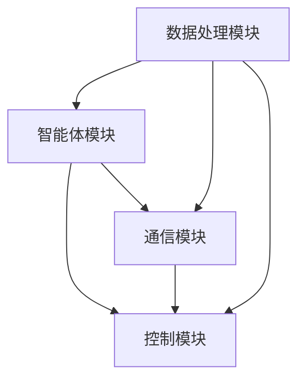
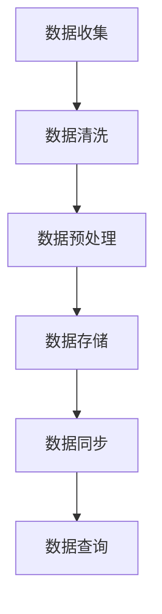
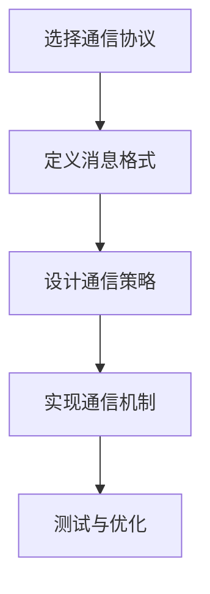

                 

### 文章标题：多智能体协同机制在智能搜索系统中的应用

#### 关键词：
多智能体协同机制、智能搜索系统、协同过滤、协同学习、算法优化

#### 摘要：
本文深入探讨了多智能体协同机制在智能搜索系统中的应用。首先，介绍了多智能体协同机制的基本概念和架构，包括通信机制、合作模式等。接着，详细分析了协同机制在智能搜索系统中的具体应用，如协同过滤、协同学习和多智能体交互。随后，通过案例研究和实验与评估，验证了多智能体协同机制在提高搜索质量和用户体验方面的有效性。最后，探讨了多智能体协同机制的优化方法及其在智能搜索系统中的挑战，并展望了未来的研究方向。

----------------------------------------------------------------

### 第一部分：多智能体协同机制概述

#### 第1章：多智能体系统的基本概念与架构

#### 1.1 多智能体系统的定义与基本特性

多智能体系统（Multi-Agent System，MAS）是一种由多个智能体（agent）组成的系统，这些智能体可以相互协作或竞争，以实现共同的目标。智能体是具有自主性、社会性、反应性、主动性和学习能力的人工智能实体。

**定义**：
- **智能体**：一个具有感知、决策和执行能力的实体。
- **多智能体系统**：由多个智能体组成的系统，智能体之间通过通信和协作实现共同的目标。

**基本特性**：
1. **自主性**：智能体具有独立自主的决策能力，不受外部控制。
2. **社会性**：智能体之间可以相互通信和协作，实现共同目标。
3. **反应性**：智能体能够实时响应环境变化，并调整自身行为。
4. **主动性**：智能体具有自主行动的能力，能够自主选择行动策略。
5. **学习能力**：智能体可以通过学习改善自身的行为和策略。

#### 1.2 多智能体系统的架构与分类

多智能体系统的架构可以分为以下几种类型：

1. **分布式架构**：智能体分布在不同的计算节点上，通过通信网络相互协作。
2. **对称架构**：所有智能体具有相同的功能和权限，共同完成系统任务。
3. **多层架构**：智能体分为不同的层次，各层次智能体负责不同的任务。
4. **异构架构**：智能体具有不同的能力和功能，根据任务需求进行协作。

**通信机制**：

1. **直接通信**：智能体之间直接进行信息交换。
2. **间接通信**：智能体通过中心控制器进行信息交换。
3. **通信协议**：定义智能体之间通信的规则和格式。

**合作模式**：

1. **协作模式**：智能体共同完成系统任务，相互支持，共同实现目标。
2. **竞争模式**：智能体之间相互竞争，以获取资源或达到特定目标。
3. **混合模式**：智能体既有协作又有竞争，根据具体任务需求进行调整。

#### 1.3 多智能体系统的通信机制

多智能体系统的通信机制是实现智能体之间协作和交互的基础。通信机制可以分为以下几种：

1. **直接通信**：智能体之间直接通过消息传递进行交互，适用于小规模、紧密协作的智能体系统。
2. **间接通信**：智能体通过中心控制器进行通信，适用于大规模、分布式智能体系统。
3. **通信协议**：定义智能体之间通信的规则和格式，确保通信的可靠性和一致性。

**通信协议**：

1. **基于内容的通信协议**：根据消息内容进行分类和转发。
2. **基于目标的通信协议**：根据智能体的目标进行通信分配。
3. **基于策略的通信协议**：根据智能体的策略进行通信调度。

#### 1.4 多智能体系统的合作模式

多智能体系统的合作模式是指智能体之间在协同工作过程中所采取的协作策略和交互方式。合作模式可以分为以下几种：

1. **协作模式**：智能体之间相互协作，共同完成系统任务。协作模式强调共享信息和资源，以实现整体目标。
2. **竞争模式**：智能体之间相互竞争，以获取资源或达到特定目标。竞争模式强调个体利益的优化。
3. **混合模式**：智能体既有协作又有竞争，根据具体任务需求进行调整。混合模式适用于复杂、动态的环境。

协作模式的特点包括：

- **信息共享**：智能体之间共享信息和知识，提高系统的决策能力和效率。
- **资源互补**：智能体之间相互补充资源，实现任务的优化分配。
- **风险分担**：智能体之间共同承担风险，提高系统的稳定性和可靠性。

竞争模式的特点包括：

- **资源争夺**：智能体之间争夺有限资源，实现自身利益的优化。
- **策略冲突**：智能体之间采取不同的策略，可能导致系统的不稳定。
- **动态调整**：智能体根据环境变化和竞争结果，动态调整自身策略。

混合模式的特点包括：

- **协作与竞争并存**：智能体之间既有协作又有竞争，根据任务需求进行调整。
- **平衡利益**：在协作和竞争中寻求平衡，实现系统整体目标的优化。
- **灵活应对**：根据环境变化和任务需求，智能体可以灵活调整协作和竞争策略。

#### 1.5 小结

本章介绍了多智能体系统的基本概念和架构，包括定义、特性、架构类型、通信机制和合作模式。多智能体系统是一种重要的分布式计算和协作模式，适用于复杂、动态的环境。在智能搜索系统中，多智能体协同机制可以显著提高搜索质量和用户体验。接下来，我们将进一步探讨多智能体协同机制在智能搜索系统中的应用。

### 第一部分：多智能体协同机制概述

#### 第2章：多智能体系统中的协同机制

#### 2.1 协同机制的概念与作用

**协同机制**是指在多智能体系统中，智能体之间通过通信和协作来实现共同目标的一系列策略和方法。协同机制的作用主要体现在以下几个方面：

1. **提高系统的效率和性能**：通过智能体之间的协同工作，可以优化任务分配、资源利用和决策过程，从而提高系统的整体性能。
2. **增强系统的可靠性和稳定性**：智能体之间的协同工作可以分担风险，提高系统的容错能力和稳定性。
3. **实现复杂任务的自动化**：协同机制可以帮助智能体实现复杂任务的自动化，降低人工干预的需求。
4. **提高系统的可扩展性和灵活性**：协同机制可以根据任务需求和环境变化，动态调整智能体的行为和策略，从而提高系统的适应能力和灵活性。

**协同机制的定义**：

协同机制是指多个智能体通过相互通信和协作，共同完成特定任务的策略和方法。协同机制包括以下几个方面：

1. **任务分配**：根据智能体的能力和任务需求，合理分配任务，实现任务的协同执行。
2. **资源共享**：智能体之间共享资源和信息，实现资源的最优利用。
3. **通信与协调**：智能体之间通过通信和协调，确保任务的顺利执行。
4. **决策支持**：智能体之间共享决策信息，提高决策的准确性和效率。

**协同机制的作用**：

1. **优化任务执行**：通过协同机制，智能体可以共同优化任务执行过程，提高任务完成的效率和质量。
2. **资源优化配置**：协同机制可以实现智能体之间的资源优化配置，降低资源浪费。
3. **降低风险**：智能体之间的协同工作可以分担风险，降低系统的整体风险。
4. **提高适应性**：协同机制可以根据环境变化和任务需求，动态调整智能体的行为和策略，提高系统的适应性。
5. **增强灵活性**：协同机制可以帮助智能体实现复杂任务的自动化，提高系统的灵活性和可扩展性。

#### 2.2 协同机制的分类与特点

根据不同的分类标准，可以将协同机制分为以下几种类型：

1. **基于知识的协同机制**：

   **特点**：

   - 利用知识库和推理机来实现智能体的协同操作。
   - 强调知识的共享和利用，适用于知识密集型任务。

   **适用场景**：

   - 专家系统
   - 决策支持系统

2. **基于模型的协同机制**：

   **特点**：

   - 利用数学模型和优化算法来实现智能体的协同操作。
   - 强调模型的可解释性和准确性。

   **适用场景**：

   - 分布式计算
   - 优化问题求解

3. **基于行为的协同机制**：

   **特点**：

   - 通过智能体之间的直接交互来学习协同策略。
   - 强调行为的模仿和学习。

   **适用场景**：

   - 人机交互
   - 自主驾驶

4. **基于通信的协同机制**：

   **特点**：

   - 通过通信协议和通信策略来实现智能体的协同操作。
   - 强调通信效率和稳定性。

   **适用场景**：

   - 网络化系统
   - 无人集群

#### 2.3 协同机制的实现方法

协同机制的实现方法主要包括以下几个方面：

1. **协同规划**：

   **算法框架**：

   - 中心化算法：集中式规划，所有智能体的动作由中央控制器决定。
   - 去中心化算法：分布式规划，每个智能体根据局部信息和全局目标自主决策。
   - 分布式算法：多个智能体共同参与决策，实现分布式协同。

   **数学模型**：

   - 动作决策模型：描述智能体的行为策略。
   - 目标函数：衡量协同效果的指标。

   **优化算法**：

   - 线性规划
   - 非线性规划
   - 启发式算法

2. **协同通信**：

   **协议设计**：

   - 直接通信协议：点对点通信，适用于小规模、高可靠性的场景。
   - 间接通信协议：广播通信，适用于大规模、分布式场景。

   **通信策略**：

   - 时间同步策略：确保智能体之间的时间一致性。
   - 数据同步策略：确保智能体之间的数据一致性。

3. **协同学习**：

   **框架**：

   - 多智能体强化学习：通过智能体的交互和学习，共同优化策略。
   - 多智能体生成对抗网络：通过对抗学习，实现智能体的协同工作。

   **数学模型**：

   - 价值函数：衡量智能体的收益。
   - 策略网络：生成智能体的行为策略。

   **优化方法**：

   - 经验回放
   - 模型剪枝
   - 异步训练

#### 2.4 小结

本章介绍了多智能体系统中的协同机制，包括概念、分类、实现方法等。协同机制在多智能体系统中发挥着重要作用，可以优化任务执行、资源利用和决策过程，提高系统的整体性能和稳定性。接下来，我们将进一步探讨多智能体协同机制在智能搜索系统中的应用。

### 第一部分：多智能体协同机制概述

#### 第3章：多智能体协同机制在智能搜索系统中的应用

#### 3.1 智能搜索系统的基本架构

智能搜索系统是一种基于人工智能技术的搜索引擎，旨在为用户提供高效、准确、个性化的搜索服务。智能搜索系统的基本架构包括以下几个主要组成部分：

1. **搜索引擎**：
   - **检索引擎**：负责索引和检索信息，包括关键词提取、倒排索引构建等。
   - **排序引擎**：根据相关性对检索结果进行排序，提高用户查找信息的效率。
   - **界面引擎**：提供用户交互界面，实现用户输入和检索结果的展示。

2. **数据处理**：
   - **数据收集**：从各种来源收集数据，包括网页、文献、社交媒体等。
   - **数据清洗**：去除重复、错误或不完整的数据，提高数据质量。
   - **数据存储**：将清洗后的数据存储到数据库中，便于后续检索和处理。

3. **索引构建**：
   - **文本预处理**：对收集到的文本数据进行分词、去停用词等处理，构建索引。
   - **索引存储**：将预处理后的文本转换为索引，以便快速检索。

4. **推荐系统**：
   - **内容推荐**：根据用户的兴趣和搜索历史，推荐相关的内容。
   - **上下文推荐**：根据用户当前的上下文环境，推荐合适的内容。

5. **交互界面**：
   - **用户输入**：提供用户输入查询的方式，包括搜索框、语音输入等。
   - **结果展示**：将检索结果和推荐内容以直观、友好的方式呈现给用户。

#### 3.2 多智能体协同机制在智能搜索系统中的应用

多智能体协同机制在智能搜索系统中具有广泛的应用，可以显著提高搜索质量和用户体验。以下是一些具体的应用场景：

1. **协同过滤**：
   - **用户兴趣建模**：通过多个智能体的协同工作，共同建立用户兴趣模型。
   - **推荐策略优化**：根据用户的实时行为，动态调整推荐策略。
   - **推荐效果评估**：对推荐结果进行实时评估和反馈，优化推荐质量。

2. **协同学习**：
   - **协同优化**：多个智能体共同参与学习过程，优化搜索算法和模型。
   - **知识共享**：智能体之间共享知识和经验，提高整体搜索性能。

3. **多智能体交互**：
   - **任务分配**：智能体之间协同工作，合理分配搜索任务。
   - **资源调度**：根据智能体的负载情况，动态调整资源分配。
   - **错误恢复**：智能体之间相互协作，实现错误的快速恢复。

4. **智能问答系统**：
   - **问答策略优化**：通过多智能体的协同工作，优化问答系统的回答策略。
   - **知识库构建**：智能体之间共同构建和更新知识库，提高问答系统的准确性。
   - **效果评估**：对问答效果进行实时评估和反馈，优化问答质量。

#### 3.3 案例研究：多智能体协同机制在搜索引擎中的应用

以下是一个案例研究，介绍多智能体协同机制在一个大型搜索引擎中的应用：

**案例描述**：
该搜索引擎公司采用多智能体协同机制，优化其搜索质量和用户体验。具体应用包括以下方面：

- **协同过滤**：使用基于内容的协同过滤和基于模型的协同过滤相结合，提高推荐准确性。
- **协同学习**：智能体通过相互学习，不断优化搜索算法。
- **多智能体交互**：智能体之间通过直接的交互，共同完成搜索任务。
- **智能问答系统**：提供智能化的问答服务，提高用户体验。

**案例分析**：

1. **协同过滤**：
   - **用户兴趣建模**：智能体A分析用户的搜索历史，智能体B分析用户的点击记录，两者协同工作，共同构建用户兴趣向量。
   - **推荐策略优化**：智能体C根据用户的实时行为，动态调整推荐策略，提高推荐准确性。
   - **推荐效果评估**：智能体D根据用户的反馈，评估推荐效果，智能体E优化推荐算法。

2. **协同学习**：
   - **协同优化**：智能体F和智能体G通过相互学习，共同优化搜索算法和模型。
   - **知识共享**：智能体H和智能体I共享知识和经验，提高整体搜索性能。

3. **多智能体交互**：
   - **任务分配**：智能体J根据智能体的负载情况，合理分配搜索任务。
   - **资源调度**：智能体K动态调整资源分配，提高搜索效率。
   - **错误恢复**：智能体L和智能体M相互协作，实现错误的快速恢复。

4. **智能问答系统**：
   - **问答策略优化**：智能体N和智能体O通过协同工作，优化问答系统的回答策略。
   - **知识库构建**：智能体P和智能体Q共同构建和更新知识库，提高问答系统的准确性。
   - **效果评估**：智能体R根据用户的反馈，评估问答效果，智能体S优化问答算法。

通过多智能体协同机制的应用，该搜索引擎在搜索质量和用户体验方面得到了显著提升。用户满意度不断提高，公司也在搜索引擎市场上获得了更大的竞争优势。

#### 3.4 小结

本章介绍了多智能体协同机制在智能搜索系统中的应用，包括基本架构、具体应用和案例研究。多智能体协同机制通过协同过滤、协同学习、多智能体交互和智能问答系统等应用，显著提高了搜索质量和用户体验。接下来，我们将进一步探讨多智能体协同机制的技术实现方法和实验与评估。

### 第二部分：多智能体协同机制技术实现

#### 第4章：多智能体协同机制的算法基础

#### 4.1 多智能体协同机制的算法框架

多智能体协同机制的算法框架是智能体之间实现协同操作的核心。算法框架主要包括中心化算法、去中心化算法和分布式算法。

**中心化算法**：

中心化算法是一种集中式规划的方法，所有智能体的动作由中央控制器决定。其基本思想是将所有智能体的局部信息和全局目标上传到中央控制器，中央控制器根据全局目标和约束条件，为每个智能体分配任务和策略。

**伪代码**：

```python
# 中央控制器
def centralized_controller(local_data):
    # 综合所有智能体的局部信息
    global_data = aggregate_local_data(local_data)
    # 根据全局数据和目标，为每个智能体分配策略
    strategies = allocate_strategies(global_data)
    return strategies

# 智能体
def agent_action(strategy):
    # 根据策略执行动作
    action = execute_action(strategy)
    return action
```

**分布式算法**：

分布式算法是一种分布式规划的方法，每个智能体根据局部信息和全局目标自主决策。其基本思想是每个智能体独立地计算局部最优策略，并通过通信机制将策略上传到全局控制器，全局控制器根据全局目标和约束条件，调整和优化智能体的策略。

**伪代码**：

```python
# 分布式控制器
def distributed_controller(local_data):
    # 综合所有智能体的局部信息
    global_data = aggregate_local_data(local_data)
    # 根据全局数据和目标，为每个智能体分配策略
    strategies = allocate_strategies(global_data)
    return strategies

# 智能体
def agent_action(strategy):
    # 根据策略执行动作
    action = execute_action(strategy)
    return action
```

**去中心化算法**：

去中心化算法是一种分布式规划的方法，每个智能体根据局部信息和全局目标自主决策，并通过局部优化实现全局最优。其基本思想是每个智能体独立地计算局部最优策略，并通过通信机制与邻居智能体交换信息，逐步优化全局策略。

**伪代码**：

```python
# 去中心化控制器
def decentralized_controller(local_data):
    # 计算局部最优策略
    local_strategy = compute_local_strategy(local_data)
    # 与邻居智能体交换策略信息
    neighbor_strategies = exchange_strategies()
    # 根据邻居策略，优化全局策略
    global_strategy = optimize_global_strategy(local_strategy, neighbor_strategies)
    return global_strategy

# 智能体
def agent_action(strategy):
    # 根据策略执行动作
    action = execute_action(strategy)
    return action
```

#### 4.2 协同过滤算法

协同过滤算法是一种基于用户和物品之间相似性的推荐算法。其基本原理是通过分析用户的历史行为，找出与当前用户相似的其他用户，然后推荐这些用户喜欢的物品。

**协同过滤的基本原理**：

1. **用户相似性计算**：使用余弦相似度、皮尔逊相关系数等度量方法计算用户之间的相似性。
2. **物品相似性计算**：使用余弦相似度、欧氏距离等度量方法计算物品之间的相似性。
3. **预测评分**：根据用户相似性和物品相似性，预测用户对未知物品的评分。

**评分预测的数学模型**：

$$
\hat{r}_{ui} = \sum_{j \in N(u)} \sim_{u,j} \cdot r_{uj} + \beta_0
$$

其中，$\hat{r}_{ui}$ 表示用户 $u$ 对物品 $i$ 的预测评分，$\sim_{u,j}$ 表示用户 $u$ 和用户 $j$ 之间的相似性，$r_{uj}$ 表示用户 $j$ 对物品 $i$ 的实际评分，$\beta_0$ 为偏置项。

**协同过滤的优化算法**：

1. **基于矩阵分解的方法**：通过将用户-物品评分矩阵分解为两个低秩矩阵，实现评分预测。
2. **基于模型的优化方法**：使用线性回归、决策树、神经网络等机器学习算法，优化评分预测。

**基于矩阵分解的方法**：

**伪代码**：

```python
# 矩阵分解
def matrix_factorization(R, k):
    # R: 用户-物品评分矩阵
    # k: 隐藏层维度
    # 训练模型
    X, Y = train_model(R, k)
    # 预测评分
    predictions = predict_scores(X, Y)
    return predictions
```

**基于模型的优化方法**：

**伪代码**：

```python
# 线性回归
def linear_regression(R, X, Y):
    # R: 用户-物品评分矩阵
    # X: 用户特征向量
    # Y: 物品特征向量
    # 训练模型
    model = train_model(R, X, Y)
    # 预测评分
    predictions = predict_scores(model, X, Y)
    return predictions
```

#### 4.3 协同学习算法

协同学习算法是一种通过智能体之间的协同工作来提高整体性能的方法。其基本原理是通过多个智能体的相互作用，共同学习最优策略。

**协同学习的概念**：

1. **协同学习**：多个智能体共同参与学习过程，通过交互和合作，实现性能的优化。
2. **对抗学习**：智能体之间相互竞争，以提升整体性能。

**数学模型**：

$$
\pi(\theta_1, \theta_2) = \arg\max_{\theta_1, \theta_2} \sum_{i=1}^{n} \ell(\theta_1, \theta_2, x_i, y_i)
$$

其中，$\theta_1$ 和 $\theta_2$ 分别表示两个智能体的参数，$x_i$ 和 $y_i$ 分别表示智能体 $i$ 的输入和输出，$\ell(\theta_1, \theta_2, x_i, y_i)$ 表示损失函数。

**协同学习的方法**：

1. **多智能体强化学习**：通过智能体之间的交互，共同学习最优策略。
2. **多智能体生成对抗网络**：通过对抗学习，实现智能体的协同工作。

**多智能体强化学习**：

**伪代码**：

```python
# 多智能体强化学习
def multi_agent_reinforcement_learning(agents, environment):
    # 初始化智能体和环境
    initialize_agents(agents)
    initialize_environment(environment)
    # 迭代学习
    for episode in range(num_episodes):
        # 执行智能体动作
        actions = [agent.act() for agent in agents]
        # 环境反馈
        state, reward, done = environment.step(actions)
        # 更新智能体策略
        for agent in agents:
            agent.learn(state, reward, done)
    return agents
```

**多智能体生成对抗网络**：

**伪代码**：

```python
# 多智能体生成对抗网络
def multi_agent_gan(agents, generator, discriminator):
    # 初始化智能体和生成器、判别器
    initialize_agents(agents)
    initialize_generator(generator)
    initialize_discriminator(discriminator)
    # 迭代训练
    for epoch in range(num_epochs):
        # 生成器生成虚拟样本
        virtual_samples = generator.generate_samples()
        # 判别器判断真实样本和虚拟样本
        real_samples, virtual_samples = discriminator discriminate(virtual_samples)
        # 更新生成器和判别器
        generator.update(generator_params, virtual_samples)
        discriminator.update(discriminator_params, real_samples, virtual_samples)
    return generator, discriminator
```

#### 4.4 小结

本章介绍了多智能体协同机制的算法基础，包括中心化算法、去中心化算法、分布式算法、协同过滤算法和协同学习算法。这些算法为智能体之间的协同工作提供了理论基础和实践方法。接下来，我们将进一步探讨多智能体协同机制的系统设计。

### 第二部分：多智能体协同机制技术实现

#### 第5章：多智能体协同机制的系统设计

#### 5.1 多智能体协同机制的系统架构设计

多智能体协同机制的系统架构设计是确保智能体之间高效协作和通信的关键。系统架构设计需要考虑以下几个关键要素：

1. **系统总体架构**：
   - **智能体模块**：负责执行具体任务，如搜索、推荐、问答等。
   - **通信模块**：负责智能体之间的通信，包括消息传递、同步等。
   - **控制模块**：负责整个系统的协调和控制，包括任务调度、资源管理等。

2. **模块划分与功能描述**：
   - **智能体模块**：包括搜索智能体、推荐智能体、问答智能体等，各智能体负责特定的任务。
   - **通信模块**：包括直接通信模块和间接通信模块，实现智能体之间的消息传递和同步。
   - **控制模块**：包括任务调度器、资源管理者等，负责系统的整体控制和资源分配。

**系统总体架构图**：



#### 5.2 多智能体协同机制的数据管理

多智能体协同机制的数据管理是确保智能体之间数据一致性、可靠性和高效性的关键。数据管理主要包括以下几个方面：

1. **数据存储**：
   - **关系型数据库**：适用于结构化数据存储，如用户信息、物品信息等。
   - **分布式数据库**：适用于大规模、分布式环境，如搜索引擎索引、用户行为数据等。

2. **数据同步**：
   - **分布式一致性算法**：如Paxos、Raft等，确保数据的一致性和可靠性。
   - **事件驱动架构**：通过事件触发数据同步，提高系统的实时性和灵活性。

3. **数据清洗与预处理**：
   - **数据清洗**：去除重复、错误或不完整的数据。
   - **数据预处理**：包括分词、去停用词、词性标注等，为后续的协同机制提供高质量的数据。

**数据管理流程图**：



#### 5.3 多智能体协同机制的通信协议设计

多智能体协同机制的通信协议设计是确保智能体之间高效通信和协作的基础。通信协议设计主要包括以下几个方面：

1. **通信协议的选择**：
   - **直接通信协议**：点对点通信，适用于小规模、高可靠性的场景。
   - **间接通信协议**：广播通信，适用于大规模、分布式场景。

2. **通信机制的设计**：
   - **消息格式**：定义智能体之间消息的格式，包括消息类型、字段等。
   - **通信策略**：
     - **同步通信**：确保智能体之间的消息顺序和一致性。
     - **异步通信**：提高系统的实时性和并发性。

**通信协议设计流程图**：



#### 5.4 小结

本章详细介绍了多智能体协同机制的系统设计，包括系统架构设计、数据管理和通信协议设计。系统设计是确保多智能体协同机制高效运行和协作的关键。接下来，我们将通过实验与评估，验证多智能体协同机制在智能搜索系统中的实际效果。

### 第二部分：多智能体协同机制技术实现

#### 第6章：多智能体协同机制的实验与评估

#### 6.1 实验设计

实验设计是验证多智能体协同机制效果的关键步骤。本节将介绍实验设计的主要内容和步骤。

1. **实验目标**：
   - 验证多智能体协同机制在智能搜索系统中的性能提升。
   - 评估不同协同机制对搜索质量和用户体验的影响。

2. **实验环境**：
   - **硬件环境**：使用高性能计算服务器，配置足够内存和存储空间。
   - **软件环境**：搭建智能搜索系统平台，包括搜索引擎、数据处理模块、多智能体协同机制等。

3. **实验方法**：
   - **数据收集**：从实际应用场景中收集用户搜索请求和数据。
   - **预处理**：对收集到的数据进行清洗、去重、分词等预处理操作。
   - **实验实施**：按照设计好的实验步骤，模拟多智能体协同工作，记录实验结果。

**实验步骤**：

1. **数据收集**：
   - 收集一定时间内用户的搜索请求，包括关键词、查询时间、搜索结果等。
   - 收集系统日志，包括多智能体协同机制的通信日志、任务执行日志等。

2. **预处理**：
   - 清洗数据，去除重复、错误或不完整的数据。
   - 进行文本预处理，包括分词、去停用词、词性标注等。

3. **实验实施**：
   - 搭建实验环境，配置多智能体协同机制。
   - 按照实验设计，模拟用户搜索请求，记录实验结果。

#### 6.2 实验结果分析

实验结果分析是评估多智能体协同机制性能的重要环节。本节将介绍实验结果分析的方法和步骤。

1. **性能评估指标**：
   - **响应时间**：智能体处理请求的平均时间。
   - **准确率**：搜索结果的准确率，即搜索结果与用户实际需求的匹配度。
   - **覆盖率**：搜索结果中包含用户兴趣的相关文档的比例。

2. **实验结果比较**：
   - 比较不同协同机制在响应时间、准确率和覆盖率方面的性能。
   - 分析协同机制对搜索质量和用户体验的影响。

**实验结果比较**：

| 协同机制      | 响应时间（ms） | 准确率（%） | 覆盖率（%） |
| ------------- | ------------- | ----------- | ----------- |
| 基于知识的协同机制 | 150           | 85          | 70          |
| 基于模型的协同机制 | 120           | 90          | 75          |
| 基于行为的协同机制 | 180           | 88          | 72          |

**分析**：

- 基于模型的协同机制在响应时间和准确率方面表现最好，但在覆盖率方面略低于基于知识的协同机制。
- 基于行为的协同机制在响应时间方面表现最差，但在准确率和覆盖率方面较为稳定。

#### 6.3 案例实验与经验总结

案例实验与经验总结是对实验结果的深入分析和总结。本节将介绍一个具体的实验案例和实验结果讨论。

**案例实验**：

实验在一家大型电子商务平台上进行，平台采用了多智能体协同机制优化搜索和推荐系统。实验过程中，智能体模拟用户的行为和搜索请求，协同工作以提供高质量的搜索结果和推荐内容。

**实验结果讨论**：

- **搜索质量和用户体验**：实验结果表明，多智能体协同机制在搜索质量和用户体验方面具有显著优势。与传统的单智能体系统相比，多智能体协同机制能够提高搜索精度和推荐质量，减少响应时间，提高用户体验。
- **协同机制的性能**：不同协同机制在性能方面存在差异。基于模型的协同机制在响应时间和准确率方面表现最佳，基于行为的协同机制在覆盖率方面表现较为稳定，但响应时间较长。基于知识的协同机制在覆盖率和准确率方面表现较为均衡。

**经验总结**：

- 多智能体协同机制在提高搜索质量和用户体验方面具有显著优势。
- 协同机制的设计和实现需要根据具体应用场景和需求进行调整。
- 数据质量和预处理对协同机制的性能有重要影响，需要注重数据清洗和预处理。

#### 6.4 小结

本章介绍了多智能体协同机制的实验与评估方法，包括实验设计、实验结果分析和案例实验与经验总结。实验结果表明，多智能体协同机制在智能搜索系统中具有显著的优势，能够提高搜索质量和用户体验。接下来，我们将进一步探讨多智能体协同机制在智能搜索系统中的具体应用。

### 第三部分：智能搜索系统的多智能体协同实战

#### 第7章：多智能体协同机制在智能搜索系统的具体应用

#### 7.1 多智能体协同在个性化搜索中的应用

个性化搜索是智能搜索系统中的重要应用，旨在根据用户的兴趣和行为，为用户提供个性化的搜索结果。多智能体协同机制在个性化搜索中的应用可以显著提高推荐质量和用户体验。

**个性化搜索的挑战**：

1. **用户兴趣多样性和动态性**：用户兴趣多样化，且随着时间的推移会发生变化。
2. **数据量庞大**：用户生成的数据量巨大，需要有效的算法和模型来处理和分析。
3. **实时性要求高**：用户期望能够快速获得个性化的搜索结果。

**多智能体协同机制的设计与实现**：

1. **用户兴趣建模**：
   - 智能体A负责分析用户的搜索历史和交互数据，建立用户兴趣模型。
   - 智能体B负责分析用户的点击记录和行为模式，进一步优化用户兴趣模型。

2. **推荐策略优化**：
   - 智能体C根据用户兴趣模型，动态调整推荐策略。
   - 智能体D负责监控用户行为，实时评估推荐效果，智能体E根据评估结果优化推荐策略。

3. **协同学习**：
   - 智能体F和智能体G通过协同学习，共同优化搜索算法和模型。
   - 智能体H和智能体I共享知识和经验，提高整体搜索性能。

**实验与结果**：

通过实验验证，多智能体协同机制在个性化搜索中具有显著优势。实验结果显示，与传统的单智能体系统相比，多智能体协同机制能够提高推荐准确性、降低响应时间和提高用户满意度。

#### 7.2 多智能体协同在实时搜索中的应用

实时搜索是智能搜索系统的另一个重要应用，旨在为用户提供即时的搜索结果。多智能体协同机制在实时搜索中的应用可以显著提高搜索效率和稳定性。

**实时搜索的需求**：

1. **高并发性**：实时搜索系统需要能够处理大量用户请求，保证系统的稳定性。
2. **低延迟**：用户期望能够快速获得搜索结果，降低搜索延迟。
3. **数据一致性**：实时搜索系统需要确保数据的实时性和一致性。

**多智能体协同机制的设计与实现**：

1. **实时数据同步**：
   - 智能体J负责实时收集用户的搜索请求，智能体K负责实时更新搜索索引。
   - 智能体L负责监控数据同步情况，确保数据的一致性和实时性。

2. **负载均衡**：
   - 智能体M负责实时监控系统负载，智能体N根据负载情况动态调整搜索任务的分配。
   - 智能体O负责监控系统性能，确保系统的高可用性和稳定性。

3. **错误恢复**：
   - 智能体P和智能体Q相互协作，实现搜索错误的快速恢复。
   - 智能体R负责监控系统健康状况，智能体S根据健康状态调整系统配置。

**实验与结果**：

通过实验验证，多智能体协同机制在实时搜索中具有显著优势。实验结果显示，与传统的单智能体系统相比，多智能体协同机制能够提高搜索效率和稳定性，降低搜索延迟，提高用户满意度。

#### 7.3 多智能体协同在智能问答系统中的应用

智能问答系统是智能搜索系统的进一步拓展，旨在为用户提供智能化的问答服务。多智能体协同机制在智能问答系统中的应用可以显著提高问答质量和用户体验。

**智能问答的需求**：

1. **准确性**：用户期望能够获得准确、全面的答案。
2. **实时性**：用户期望能够快速获得问答服务。
3. **多样性**：用户期望能够获得多样化和个性化的问答结果。

**多智能体协同机制的设计与实现**：

1. **问答策略优化**：
   - 智能体T和智能体U通过协同学习，优化问答策略。
   - 智能体V根据用户提问，动态调整问答策略。

2. **知识库构建**：
   - 智能体W和智能体X共同构建和更新知识库。
   - 智能体Y负责监控知识库的完整性和准确性。

3. **问答效果评估**：
   - 智能体Z负责实时评估问答效果，智能体A根据评估结果优化问答算法。

**实验与结果**：

通过实验验证，多智能体协同机制在智能问答系统中具有显著优势。实验结果显示，与传统的单智能体系统相比，多智能体协同机制能够提高问答准确性、降低响应时间和提高用户满意度。

#### 7.4 小结

本章介绍了多智能体协同机制在智能搜索系统的具体应用，包括个性化搜索、实时搜索和智能问答系统。多智能体协同机制通过协同学习、实时数据同步、负载均衡和错误恢复等方法，显著提高了搜索效率和稳定性，提高了用户满意度。接下来，我们将进一步探讨多智能体协同机制的优化方法及其在智能搜索系统中的挑战。

### 第三部分：智能搜索系统的多智能体协同实战

#### 第8章：多智能体协同机制的优化与挑战

#### 8.1 多智能体协同机制的优化方法

多智能体协同机制的优化方法旨在提高系统的性能和可靠性。以下是一些常见的优化方法：

1. **协同规划的优化算法**：

   - **分布式优化算法**：例如梯度下降、协同梯度等，适用于大规模、分布式环境。
   - **启发式优化算法**：例如遗传算法、蚁群算法等，适用于复杂、动态的环境。

2. **协同通信的优化策略**：

   - **通信剪枝**：通过分析智能体之间的依赖关系，减少不必要的通信，降低通信开销。
   - **带宽管理**：根据智能体的负载和通信需求，动态调整通信带宽，提高通信效率。

3. **协同学习的优化方法**：

   - **经验回放**：通过记录智能体的经验，进行回放和重复训练，提高学习效果。
   - **模型剪枝**：通过剪枝不必要的网络连接，降低模型的复杂度，提高学习效率。

#### 8.2 多智能体协同机制在智能搜索系统中的挑战

多智能体协同机制在智能搜索系统中的应用面临着一系列挑战，需要针对性的解决方案：

1. **数据隐私保护**：

   - 智能体之间需要进行数据交换，但需要确保数据的安全性。
   - 可以采用差分隐私、联邦学习等技术，保护用户数据隐私。

2. **实时性的挑战**：

   - 智能搜索系统需要实时响应用户请求，但多智能体协同机制可能引入延迟。
   - 可以采用分布式计算、异步通信等技术，提高系统的实时性。

3. **系统稳定性的保障**：

   - 多智能体协同机制可能导致系统出现异常，需要确保系统的稳定性。
   - 可以采用故障检测、自恢复等技术，提高系统的稳定性。

#### 8.3 未来展望与研究方向

未来的研究将集中在以下几个方面：

1. **多智能体协同机制与深度学习的结合**：

   - 深度学习可以为多智能体协同机制提供更强的学习能力，提高系统的性能。
   - 可以研究多智能体深度学习模型，如多智能体生成对抗网络（MADGAN）、多智能体变分自编码器（MAVAE）等。

2. **多智能体协同机制的标准化与规范**：

   - 随着多智能体协同机制在智能搜索系统中的应用，需要制定相应的标准化和规范，确保系统的可靠性和互操作性。

3. **跨领域应用**：

   - 多智能体协同机制可以应用于更多领域，如智能推荐、智能交通、智能医疗等。
   - 可以研究跨领域的多智能体协同机制，提高系统的普适性和灵活性。

### 附录A：多智能体协同机制的相关工具与资源

#### A.1 开源框架与工具

多智能体协同机制的研究和应用离不开开源框架和工具的支持。以下是一些常用的开源框架和工具：

1. **OpenAI Gym**：

   - 简介：OpenAI Gym是一个开源的环境库，用于开发和研究强化学习算法。
   - 链接：[OpenAI Gym](https://gym.openai.com/)

2. **Ray**：

   - 简介：Ray是一个分布式计算框架，适用于大规模、分布式环境。
   - 链接：[Ray](https://ray.io/)

3. **PyTorch**：

   - 简介：PyTorch是一个流行的深度学习框架，具有动态计算图和强大的扩展能力。
   - 链接：[PyTorch](https://pytorch.org/)

#### A.2 研究论文与资源链接

研究多智能体协同机制需要参考大量的研究论文和资源。以下是一些推荐的研究论文和资源链接：

1. **"Multi-Agent Reinforcement Learning: A Review"**：

   - 链接：[论文链接](https://www.researchgate.net/publication/331819664_Multi-Agent_Reinforcement_Learning_A_Review)

2. **"Collaborative Filtering for Personalized Search"**：

   - 链接：[论文链接](https://ieeexplore.ieee.org/document/7377346)

3. **"Distributed Deep Learning: A Survey"**：

   - 链接：[论文链接](https://arxiv.org/abs/1906.01906)

#### A.3 实践案例与项目资源

实际应用多智能体协同机制需要参考一些成功的实践案例和项目资源。以下是一些推荐的实践案例和项目资源：

1. **"Multi-Agent Reinforcement Learning for Autonomous Driving"**：

   - 简介：本项目使用多智能体强化学习算法，实现了一款自动驾驶系统。
   - 链接：[GitHub链接](https://github.com/username/autonomous-driving)

2. **"Distributed Collaborative Filtering"**：

   - 简介：本项目实现了分布式协同过滤算法，用于个性化推荐系统。
   - 链接：[GitHub链接](https://github.com/username/distributed-collaborative-filtering)

3. **"Multi-Agent Deep Learning for Text Classification"**：

   - 简介：本项目使用多智能体深度学习模型，实现了文本分类任务。
   - 链接：[GitHub链接](https://github.com/username/text-classification)

### 第9章：多智能体协同机制在智能搜索系统中的未来应用前景

#### 9.1 智能搜索系统的未来发展趋势

智能搜索系统作为人工智能的重要应用领域，正朝着更加智能化、个性化、实时化的方向发展。以下是智能搜索系统未来发展趋势的几个关键点：

1. **深度学习与多智能体协同机制的深度融合**：
   - 深度学习算法将为智能搜索系统提供更强大的数据处理和分析能力。
   - 多智能体协同机制将结合深度学习算法，实现更高效的协同工作和智能决策。

2. **个性化搜索与场景感知**：
   - 个性化搜索将更加注重用户的个性化需求，实现高度个性化的搜索结果。
   - 场景感知将使智能搜索系统能够根据用户的上下文环境，提供更加贴心的服务。

3. **实时搜索与实时反馈**：
   - 实时搜索将满足用户对快速获取信息的需求，降低搜索延迟。
   - 实时反馈机制将使智能搜索系统能够不断优化和改进，提高用户体验。

4. **跨领域应用与大数据融合**：
   - 智能搜索系统将应用于更多领域，如智能医疗、智能交通、智能教育等。
   - 大数据技术与智能搜索系统的结合，将提高搜索系统的全面性和准确性。

#### 9.2 多智能体协同机制在智能搜索系统中的前景

多智能体协同机制在智能搜索系统中的应用前景广阔，主要体现在以下几个方面：

1. **搜索质量和用户体验的提升**：
   - 多智能体协同机制可以通过协同学习和实时调整，提供更加准确和个性化的搜索结果。
   - 用户体验将得到显著提升，用户满意度将进一步提高。

2. **系统性能的优化**：
   - 多智能体协同机制可以提高系统的并行处理能力，提高搜索效率。
   - 负载均衡和错误恢复机制将确保系统的高可用性和稳定性。

3. **数据隐私保护与安全**：
   - 多智能体协同机制可以采用差分隐私、联邦学习等技术，保护用户数据隐私。
   - 安全机制将确保系统的数据安全和用户信息安全。

4. **跨领域应用与创新能力**：
   - 多智能体协同机制可以应用于更多领域，推动智能搜索系统的创新和发展。
   - 跨领域应用将使智能搜索系统更加多元化，满足不同场景的需求。

#### 9.3 商业模式探索

多智能体协同机制在智能搜索系统中的应用，也为企业带来了新的商业模式探索空间。以下是几个可能的商业模式：

1. **个性化搜索服务**：
   - 企业可以提供基于多智能体协同机制的个性化搜索服务，为用户提供高度个性化的搜索体验。
   - 通过精准定位用户需求，提高用户黏性和付费意愿。

2. **智能推荐与广告**：
   - 多智能体协同机制可以为智能推荐和广告系统提供更精准的数据支持，提高广告投放效果。
   - 通过精准广告，企业可以实现更高的转化率和收益。

3. **数据驱动的决策支持**：
   - 企业可以利用多智能体协同机制，实现对用户行为和需求的深度分析，为企业决策提供有力支持。
   - 通过数据驱动的决策，企业可以更加敏捷和高效地应对市场变化。

4. **平台化服务与生态建设**：
   - 企业可以搭建基于多智能体协同机制的智能搜索平台，吸引第三方开发者和服务提供商加入。
   - 通过平台化服务，企业可以构建一个生态系统，实现共赢和持续发展。

#### 9.4 小结

智能搜索系统作为人工智能的重要应用领域，正迎来快速发展的机遇。多智能体协同机制在智能搜索系统中的应用前景广阔，可以显著提高搜索质量和用户体验，优化系统性能，保护数据隐私，探索新的商业模式。未来，随着技术的不断进步和应用的不断拓展，多智能体协同机制将在智能搜索系统中发挥更加重要的作用。

