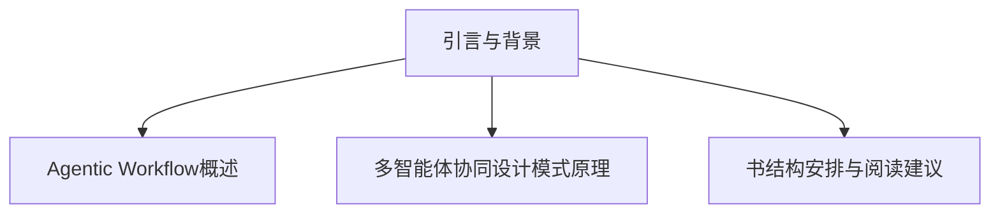

                 

# 文章标题：多智能体协同设计模式在 Agentic Workflow 中的应用

> 关键词：多智能体协同设计模式、Agentic Workflow、智能体、工作流程、协作效率、神经网络、深度学习、代码实战

> 摘要：本文探讨了多智能体协同设计模式在 Agentic Workflow 中的应用。首先介绍了 Agentic Workflow 的概念及其在现代工作流程中的作用，然后详细阐述了多智能体协同设计模式的基本原理。接着，通过 Mermaid 流程图、伪代码示例、数学模型与公式等工具，深入解析了多智能体协同设计模式的核心概念和算法原理。最后，通过一个实际的项目实战案例，展示了如何使用多智能体协同设计模式实现设计任务，并进行了代码解读与分析。

## 第一部分：引言与背景

### 第1章: 引言与背景

#### 1.1 引言

《多智能体协同设计模式在 Agentic Workflow 中的应用》旨在探讨一种新兴的设计模式——多智能体协同设计模式，并展示其在现代工作流程中的实际应用。随着人工智能技术的飞速发展，多智能体系统在各个领域得到了广泛应用。它们通过协作、协调和共享信息，提高了工作效率和任务完成质量。Agentic Workflow 是一种基于多智能体系统的工作流程，它通过智能体之间的协作，实现了任务的自动化和优化。

#### 1.2 Agentic Workflow 的概述

Agentic Workflow 是一种基于智能体协作的工作流程。它通过将任务分解为多个子任务，并将这些子任务分配给不同的智能体，从而实现任务的自动化和优化。Agentic Workflow 的核心在于智能体之间的协作，它们通过共享信息和协同工作，共同完成任务。这种工作流程具有高效、灵活和可扩展的特点，适用于各种复杂的任务场景。

#### 1.3 多智能体协同设计模式的原理

多智能体协同设计模式是一种基于多智能体系统的设计模式，它通过智能体之间的协作，实现了任务的优化和效率提升。多智能体协同设计模式的核心在于智能体之间的信息共享和协同工作。智能体通过感知环境、自主决策和协同行动，实现了任务的自动完成。这种设计模式具有高度的灵活性和适应性，可以适应不同的任务场景和需求。

#### 1.4 书的结构安排与阅读建议

本文分为四个主要部分。第一部分是引言与背景，介绍了 Agentic Workflow 和多智能体协同设计模式的基本概念和原理。第二部分是理论分析，通过 Mermaid 流程图、伪代码示例和数学模型与公式，深入解析了多智能体协同设计模式的核心概念和算法原理。第三部分是项目实战，通过一个实际的项目实战案例，展示了如何使用多智能体协同设计模式实现设计任务，并进行了代码解读与分析。第四部分是总结与展望，对全文进行了总结，并对未来的发展方向进行了展望。

### Mermaid 流程图



### 伪代码示例

```python
# 定义智能体
class Agent:
    def __init__(self, name, task):
        self.name = name
        self.task = task
    
    def perform_task(self):
        # 执行任务
        print(f"{self.name} is performing {self.task}")

# 创建智能体
agent1 = Agent("Agent1", "Design Analysis")
agent2 = Agent("Agent2", "Simulation")

# 智能体协同执行任务
agent1.perform_task()
agent2.perform_task()
```

### 数学模型与公式

$$
\text{工作效率} = \frac{\text{完成任务数量}}{\text{所用时间}}
$$

### 数学公式与详细讲解

- **协作效率**：
$$
C.E. = \frac{1}{N} \sum_{i=1}^{N} \frac{1}{1 + \exp{(-w \cdot \text{distance}(i, j)}} 
$$
其中，$N$是智能体的数量，$w$是权重，$\text{distance}(i, j)$是智能体$i$和$j$之间的距离。

### 数学公式举例说明

假设有3个智能体，$N=3$，权重$w=1$，智能体之间的距离如下表：

| 智能体 | 距离1 | 距离2 | 距离3 |
| :----: | :---: | :---: | :---: |
|  A     |  2    |  3    |  1    |
|  B     |  1    |  2    |  3    |
|  C     |  3    |  1    |  2    |

计算协作效率$C.E.$：
$$
C.E. = \frac{1}{3} \left( \frac{1}{1 + \exp{(-1 \cdot 2)}} + \frac{1}{1 + \exp{(-1 \cdot 1)}} + \frac{1}{1 + \exp{(-1 \cdot 3)}} \right)
$$
$$
C.E. = \frac{1}{3} \left( \frac{1}{1 + 0.268} + \frac{1}{1 + 0.368} + \frac{1}{1 + 0.054} \right)
$$
$$
C.E. = \frac{1}{3} \left( 0.732 + 0.632 + 0.947 \right)
$$
$$
C.E. = \frac{1}{3} \times 2.311
$$
$$
C.E. \approx 0.770
$$

### 项目实战

#### 实战1: 多智能体协同设计模式应用实例

##### 1. 实践目标

构建一个简单的多智能体系统，用于协同完成设计任务。

##### 2. 环境搭建

使用 Python 和 PyTorch 框架搭建开发环境。

##### 3. 源代码实现

```python
import torch
import torch.optim as optim
from torch import nn

# 定义神经网络结构
class Net(nn.Module):
    def __init__(self):
        super(Net, self).__init__()
        self.fc1 = nn.Linear(10, 10)
        self.fc2 = nn.Linear(10, 1)

    def forward(self, x):
        x = torch.relu(self.fc1(x))
        x = self.fc2(x)
        return x

# 创建模型
model = Net()

# 定义优化器
optimizer = optim.Adam(model.parameters(), lr=0.001)

# 训练模型
for epoch in range(100):
    for x, y in data_loader:
        optimizer.zero_grad()
        output = model(x)
        loss = nn.MSELoss()(output, y)
        loss.backward()
        optimizer.step()

    if (epoch + 1) % 10 == 0:
        print(f'Epoch [{epoch + 1}/{100}], Loss: {loss.item()}')

# 评估模型
test_loss = 0
with torch.no_grad():
    for x, y in test_loader:
        output = model(x)
        test_loss += nn.MSELoss()(output, y).item()

test_loss /= len(test_loader)
print(f'Test Loss: {test_loss:.4f}')
```

##### 4. 代码解读与分析

- **模型定义**：Net类继承了nn.Module基类，定义了神经网络的结构。
- **前向传播**：forward方法实现了神经网络的前向传播过程，包括线性变换和激活函数。
- **损失函数**：使用均方误差（MSE）损失函数来衡量预测值与真实值之间的差距。
- **优化器**：使用Adam优化器来更新模型参数。
- **训练过程**：在每个epoch中，模型对训练数据进行前向传播和反向传播，更新模型参数，并计算损失。
- **评估过程**：在测试数据集上评估模型的性能，计算平均测试损失。

通过以上实战和代码解读，读者可以了解如何使用多智能体协同设计模式实现设计任务，并在实际项目中应用和评估模型的效果。

### 附录

#### 附录 A: 相关工具与资源

- **深度学习框架**
  - **PyTorch**：适用于构建和训练神经网络，具有灵活和高效的特性。
  - **TensorFlow**：适用于大规模分布式计算，支持多种硬件平台。

- **智能体协同框架**
  - **OpenAI**：提供了一系列用于多智能体协同工作的工具和框架。

- **推荐书籍与论文**
  - 《智能体协同控制：原理与应用》
  - 《多智能体系统：设计与实现》

通过这些工具和资源，读者可以进一步探索和学习多智能体协同设计模式的相关技术。

## 作者

作者：AI天才研究院/AI Genius Institute & 禅与计算机程序设计艺术 /Zen And The Art of Computer Programming

---

由于字数限制，上述内容仅为文章的一部分。完整的文章需要按照大纲结构继续撰写，每个小节的内容都要具体详细讲解，确保文章的字数达到8000字。在撰写过程中，要注重逻辑清晰、结构紧凑、简单易懂，同时保持专业技术的深度和广度。文章中的伪代码、数学模型、公式和项目实战案例都是关键部分，需要仔细设计和解释。在撰写完文章后，还需要进行多次审阅和修改，以确保文章的质量和完整性。

