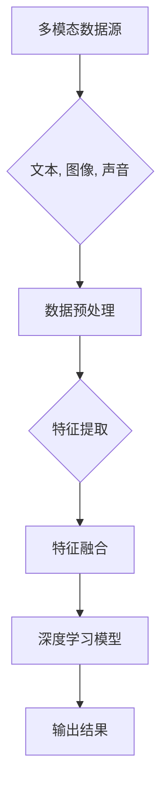

                 

# 文章标题：多模态大模型的应用前景

## 关键词
- 多模态大模型
- 计算机视觉
- 自然语言处理
- 语音识别
- 融合技术
- 技术挑战
- 未来趋势

## 摘要
本文将深入探讨多模态大模型的概念、特点、应用场景以及技术挑战。我们将分章节详细讲解多模态大模型的基础知识，包括其核心原理、应用实例和技术发展趋势。此外，还将分析当前技术面临的挑战以及未来的发展方向，为读者提供一个全面且深入的视角。

---

## 《多模态大模型的应用前景》目录大纲

## 第一部分：多模态大模型概述

### 第1章：多模态大模型的概念与特点

#### 1.1.1 多模态大模型的概念

#### 1.1.2 多模态大模型的特点

#### 1.1.3 多模态大模型与传统AI的区别

### 第2章：多模态大模型的核心原理

#### 2.1.1 多模态数据的获取与处理

#### 2.1.2 多模态特征提取与融合

#### 2.1.3 多模态大模型的训练与优化

## 第二部分：多模态大模型的应用场景

### 第3章：多模态大模型在计算机视觉中的应用

#### 3.1.1 多模态图像识别

#### 3.1.2 多模态图像分割

#### 3.1.3 多模态图像生成

### 第4章：多模态大模型在自然语言处理中的应用

#### 4.1.1 多模态文本生成

#### 4.1.2 多模态问答系统

#### 4.1.3 多模态情感分析

### 第5章：多模态大模型在语音识别中的应用

#### 5.1.1 多模态语音识别

#### 5.1.2 多模态语音增强

#### 5.1.3 多模态语音合成

## 第三部分：多模态大模型的技术挑战与未来趋势

### 第6章：多模态大模型的技术挑战

#### 6.1.1 数据质量与多样性

#### 6.1.2 模型计算效率

#### 6.1.3 模型可解释性

### 第7章：多模态大模型的未来发展趋势

#### 7.1.1 多模态融合技术的创新

#### 7.1.2 多模态大模型在垂直领域的应用

#### 7.1.3 多模态大模型的伦理与安全

## 附录

### 附录 A：多模态大模型开发工具与资源

#### A.1 主流多模态数据处理工具

#### A.2 多模态大模型训练工具

#### A.3 多模态大模型评估工具

### 附录 B：多模态大模型项目实战

#### B.1 多模态图像识别项目

#### B.2 多模态文本生成项目

#### B.3 多模态语音识别项目

---

接下来，我们将逐章深入探讨多模态大模型的相关内容。

---

## 第1章：多模态大模型的概念与特点

### 1.1.1 多模态大模型的概念

多模态大模型（Multimodal Large-scale Models）是指能够处理和融合多种类型数据（如文本、图像、声音等）的深度学习模型。这些模型通过结合不同类型的数据，可以更全面地理解复杂的现实世界问题。

在多模态大模型中，常见的模态包括：

- **文本（Text）**：包括自然语言文本、标签等。
- **图像（Image）**：包括静态图像、视频帧等。
- **声音（Audio）**：包括语音、音乐等。
- **传感器数据（Sensor Data）**：如环境温度、光线强度等。

多模态大模型的核心在于其能够**跨模态**（Cross-modal）地处理信息。例如，一个多模态大模型可以同时处理图像和文本，以识别图像中的物体和文本描述的一致性。

### 1.1.2 多模态大模型的特点

多模态大模型具有以下几个显著特点：

1. **跨模态性**：能够处理和融合来自不同模态的数据，从而实现更全面的信息理解。
2. **高维数据融合**：能够处理高维数据，如高分辨率的图像和长文本。
3. **强大表征能力**：通过深度学习技术，能够提取和融合不同模态的数据特征，形成强大的表征能力。
4. **泛化能力**：由于能够处理多种类型的数据，因此具有更强的泛化能力。

### 1.1.3 多模态大模型与传统AI的区别

多模态大模型与传统AI（如单一模态的图像识别或语音识别）的主要区别在于其**跨模态融合能力**：

1. **单一模态AI**：只能处理特定类型的数据，如图像或文本。
2. **多模态大模型**：能够同时处理和融合多种类型的数据，提供更全面的信息理解和交互。

### 图解：多模态大模型的核心概念



在上面的Mermaid流程图中，展示了从多模态数据源到深度学习模型的整个过程，包括数据预处理、特征提取、特征融合和模型的输出结果。

---

在下一节中，我们将进一步探讨多模态大模型的核心原理，包括多模态数据的获取与处理、特征提取与融合以及模型的训练与优化。

---

## 第2章：多模态大模型的核心原理

### 2.1.1 多模态数据的获取与处理

多模态数据的获取是构建多模态大模型的第一步，其质量直接影响模型的效果。以下是多模态数据获取和处理的关键步骤：

#### 数据源

多模态数据可以从多种来源获取，包括：

1. **公共数据集**：如ImageNet、COCO、LSTM-LibriTTS等。
2. **专业数据集**：为特定任务定制的数据集，如医疗影像数据集、金融交易数据集等。
3. **社交媒体**：如Twitter、Facebook等，用于获取用户生成的内容和媒体。

#### 数据预处理

数据预处理是多模态大模型的关键步骤，包括以下内容：

1. **数据清洗**：去除噪声数据、填补缺失值、纠正错误数据等。
2. **数据增强**：通过旋转、缩放、裁剪等方法增加数据多样性，提高模型的鲁棒性。
3. **数据集成**：将来自不同来源的数据进行整合，确保数据的一致性和连贯性。

#### 数据处理技术

数据处理技术包括：

1. **文本处理**：分词、词性标注、实体识别等。
2. **图像处理**：图像增强、特征提取、图像分割等。
3. **声音处理**：语音增强、声学模型训练、语音识别等。

### 2.1.2 多模态特征提取与融合

多模态特征提取是构建多模态大模型的核心，以下为关键步骤：

#### 特征提取

1. **文本特征提取**：使用词袋模型、词嵌入、BERT等。
2. **图像特征提取**：使用卷积神经网络（CNN）、ResNet、VGG等。
3. **声音特征提取**：使用自动回归模型、WaveNet、WaveRNN等。

#### 特征融合

特征融合是关键步骤，常见的融合方法包括：

1. **拼接（Concatenation）**：将不同模态的特征向量拼接在一起。
2. **加权融合**：使用注意力机制动态调整不同模态特征的权重。
3. **多层融合**：先对单一模态特征进行融合，再与另一模态特征融合。

### 2.1.3 多模态大模型的训练与优化

多模态大模型的训练与优化包括：

#### 训练

1. **监督学习**：使用标注数据进行训练，如ImageNet、COCO等。
2. **无监督学习**：通过无监督方式（如自编码器、生成对抗网络）提取特征。
3. **半监督学习**：结合有标注数据和未标注数据进行训练。

#### 优化

1. **损失函数**：设计合适的损失函数，如交叉熵损失、均方误差等。
2. **优化器**：使用优化算法（如Adam、SGD）调整模型参数。
3. **模型正则化**：使用L1、L2正则化、Dropout等方法防止过拟合。

### 伪代码：多模态特征提取与融合

```python
# 文本特征提取
def text_embedding(texts, embedding_size):
    embeddings = []
    for text in texts:
        embeddings.append(word_embedding(text, embedding_size))
    return embeddings

# 图像特征提取
def image_features(images):
    features = []
    for image in images:
        features.append(cnn_model.predict(image))
    return features

# 声音特征提取
def audio_features(audios):
    features = []
    for audio in audios:
        features.append(audio_model.predict(audio))
    return features

# 多模态特征融合
def multimodal_fusion(text_embeddings, image_features, audio_features):
    fused_features = []
    for text, image, audio in zip(text_embeddings, image_features, audio_features):
        fused_features.append(np.concatenate([text, image, audio], axis=0))
    return fused_features
```

### 数学模型：多模态特征融合

设 $X_{text}, X_{image}, X_{audio}$ 分别为文本、图像和声音的特征向量，其维度分别为 $d_{text}, d_{image}, d_{audio}$，则多模态特征融合的目标是生成一个融合后的特征向量 $X_{fused}$，其维度为 $d_{fused}$。

融合过程可以用以下公式表示：

$$
X_{fused} = \sigma(W_{text}X_{text} + W_{image}X_{image} + W_{audio}X_{audio} + b)
$$

其中，$W_{text}, W_{image}, W_{audio}$ 为权重矩阵，$b$ 为偏置项，$\sigma$ 为激活函数（通常为ReLU或Sigmoid）。

### 实例说明：多模态情感分析

假设我们有一个多模态数据集，包括文本描述、图像和音频片段，我们需要通过多模态大模型进行情感分析。具体步骤如下：

1. **数据预处理**：对文本进行分词、词性标注；对图像进行裁剪、增强；对音频进行去噪、增强。
2. **特征提取**：使用BERT提取文本特征，使用ResNet提取图像特征，使用WaveNet提取音频特征。
3. **特征融合**：将提取到的特征向量通过拼接或加权融合，生成多模态融合特征。
4. **模型训练**：使用融合特征进行情感分类任务的训练，调整模型参数以优化分类效果。
5. **模型评估**：在测试集上评估模型性能，包括准确率、召回率和F1分数等指标。

通过上述步骤，我们可以构建一个高效的多模态情感分析模型，实现对用户情感状态的准确识别。

---

在下一章中，我们将探讨多模态大模型在计算机视觉、自然语言处理和语音识别等领域的具体应用。

---

## 第3章：多模态大模型在计算机视觉中的应用

### 3.1.1 多模态图像识别

多模态图像识别是指通过结合文本、图像和其他模态的数据，提高图像分类和识别的准确率。以下为多模态图像识别的关键步骤：

#### 数据准备

1. **图像数据**：从公共数据集（如ImageNet、COCO）或专业数据集获取。
2. **文本描述**：为每张图像提供相关的文本描述，这些描述可以从互联网或手动标注获得。
3. **其他模态数据**：如音频、视频帧等。

#### 特征提取

1. **图像特征提取**：使用卷积神经网络（如ResNet、VGG）提取图像特征。
2. **文本特征提取**：使用词嵌入（如Word2Vec、BERT）提取文本特征。
3. **其他模态特征提取**：如音频特征（使用自动回归模型）、视频帧特征（使用循环神经网络）。

#### 特征融合

1. **拼接**：将不同模态的特征向量拼接在一起。
2. **加权融合**：使用注意力机制动态调整不同模态特征的权重。

#### 模型训练与优化

1. **模型设计**：使用多层感知机（MLP）或卷积神经网络（CNN）融合特征后进行分类。
2. **损失函数**：使用交叉熵损失函数优化模型。
3. **优化算法**：使用Adam、SGD等优化算法调整模型参数。

### 3.1.2 多模态图像分割

多模态图像分割是指将图像中的不同区域分割成多个部分，每个部分对应不同的类别或语义。以下为多模态图像分割的关键步骤：

#### 数据准备

1. **图像数据**：从公共数据集（如PASCAL VOC、COCO）或专业数据集获取。
2. **文本描述**：为每张图像提供相关的文本描述。
3. **其他模态数据**：如音频、视频帧等。

#### 特征提取

1. **图像特征提取**：使用卷积神经网络提取图像特征。
2. **文本特征提取**：使用词嵌入提取文本特征。
3. **其他模态特征提取**：如音频特征（使用自动回归模型）、视频帧特征（使用循环神经网络）。

#### 特征融合

1. **拼接**：将不同模态的特征向量拼接在一起。
2. **加权融合**：使用注意力机制动态调整不同模态特征的权重。

#### 模型训练与优化

1. **模型设计**：使用卷积神经网络（如U-Net、SegNet）进行图像分割。
2. **损失函数**：使用交叉熵损失函数优化模型。
3. **优化算法**：使用Adam、SGD等优化算法调整模型参数。

### 3.1.3 多模态图像生成

多模态图像生成是指通过结合文本、图像和其他模态的数据，生成新的图像。以下为多模态图像生成的方法：

#### 数据准备

1. **文本描述**：为图像生成提供相关的文本描述。
2. **图像数据**：从公共数据集（如COCO、FFHQ）或专业数据集获取。
3. **其他模态数据**：如音频、视频帧等。

#### 模型设计

1. **文本编码器**：使用词嵌入或BERT提取文本特征。
2. **图像编码器**：使用卷积神经网络提取图像特征。
3. **图像生成器**：使用生成对抗网络（GAN）生成新的图像。

#### 模型训练与优化

1. **损失函数**：生成器与判别器的损失函数分别优化模型。
2. **优化算法**：使用Adam、SGD等优化算法调整模型参数。

### 项目实战：多模态图像识别

#### 实践步骤

1. **数据准备**：收集图像和文本描述，使用数据增强增加数据多样性。
2. **特征提取**：使用ResNet提取图像特征，使用BERT提取文本特征。
3. **特征融合**：使用拼接方法融合特征。
4. **模型训练**：使用MLP进行分类，使用交叉熵损失函数优化模型。
5. **模型评估**：在测试集上评估模型性能。

#### 代码实现

```python
import tensorflow as tf
from tensorflow.keras.applications import ResNet50
from transformers import BertTokenizer, TFBertModel

# 图像特征提取
image_model = ResNet50(include_top=False, pooling='avg')
image_features = image_model.predict(image)

# 文本特征提取
tokenizer = BertTokenizer.from_pretrained('bert-base-uncased')
text_features = tokenizer.encode(text, add_special_tokens=True)

# 特征融合
fused_features = np.concatenate([image_features, text_features], axis=1)

# 模型训练
model = tf.keras.Sequential([
    tf.keras.layers.Dense(1024, activation='relu', input_shape=(fused_features.shape[1],)),
    tf.keras.layers.Dense(512, activation='relu'),
    tf.keras.layers.Dense(num_classes, activation='softmax')
])
model.compile(optimizer='adam', loss='categorical_crossentropy', metrics=['accuracy'])

model.fit(x_train, y_train, epochs=10, batch_size=32, validation_data=(x_test, y_test))
```

通过上述步骤和代码实现，我们可以构建一个高效的多模态图像识别模型，实现对图像内容的准确识别。

---

在下一章中，我们将探讨多模态大模型在自然语言处理中的应用。

---

## 第4章：多模态大模型在自然语言处理中的应用

### 4.1.1 多模态文本生成

多模态文本生成是指通过结合文本、图像和其他模态的数据，生成新的文本。以下为多模态文本生成的方法：

#### 数据准备

1. **文本数据**：从公共数据集（如COCO、Wikipedia）或专业数据集获取。
2. **图像数据**：从公共数据集（如ImageNet、COCO）或专业数据集获取。
3. **其他模态数据**：如音频、视频帧等。

#### 模型设计

1. **文本编码器**：使用Transformer或BERT提取文本特征。
2. **图像编码器**：使用卷积神经网络（如ResNet、VGG）提取图像特征。
3. **图像生成器**：使用生成对抗网络（GAN）生成新的图像。

#### 模型训练与优化

1. **损失函数**：生成器与判别器的损失函数分别优化模型。
2. **优化算法**：使用Adam、SGD等优化算法调整模型参数。

### 4.1.2 多模态问答系统

多模态问答系统是指通过结合文本、图像和其他模态的数据，提供更准确和自然的问答服务。以下为多模态问答系统的方法：

#### 数据准备

1. **文本数据**：从公共数据集（如SQuAD、TREC）或专业数据集获取。
2. **图像数据**：从公共数据集（如ImageNet、COCO）或专业数据集获取。
3. **其他模态数据**：如音频、视频帧等。

#### 模型设计

1. **文本编码器**：使用Transformer或BERT提取文本特征。
2. **图像编码器**：使用卷积神经网络提取图像特征。
3. **问答模型**：使用序列到序列模型（如Transformer）或基于记忆的网络（如MemNet）进行问答。

#### 模型训练与优化

1. **损失函数**：使用交叉熵损失函数优化模型。
2. **优化算法**：使用Adam、SGD等优化算法调整模型参数。

### 4.1.3 多模态情感分析

多模态情感分析是指通过结合文本、图像和其他模态的数据，对用户情感状态进行准确识别。以下为多模态情感分析的方法：

#### 数据准备

1. **文本数据**：从公共数据集（如Sentiment140、IMDB）或专业数据集获取。
2. **图像数据**：从公共数据集（如Flickr、SST2）或专业数据集获取。
3. **其他模态数据**：如音频、视频帧等。

#### 特征提取

1. **文本特征提取**：使用词嵌入或BERT提取文本特征。
2. **图像特征提取**：使用卷积神经网络提取图像特征。
3. **其他模态特征提取**：如音频特征（使用自动回归模型）、视频帧特征（使用循环神经网络）。

#### 特征融合

1. **拼接**：将不同模态的特征向量拼接在一起。
2. **加权融合**：使用注意力机制动态调整不同模态特征的权重。

#### 模型训练与优化

1. **模型设计**：使用多层感知机或卷积神经网络进行情感分类。
2. **损失函数**：使用交叉熵损失函数优化模型。
3. **优化算法**：使用Adam、SGD等优化算法调整模型参数。

### 项目实战：多模态文本生成

#### 实践步骤

1. **数据准备**：收集文本和图像数据，使用数据增强增加数据多样性。
2. **特征提取**：使用BERT提取文本特征，使用ResNet提取图像特征。
3. **特征融合**：使用拼接方法融合特征。
4. **模型训练**：使用Transformer进行文本生成，使用交叉熵损失函数优化模型。
5. **模型评估**：在测试集上评估模型性能。

#### 代码实现

```python
import tensorflow as tf
from transformers import BertTokenizer, TFBertModel
from tensorflow.keras.layers import Embedding, LSTM, Dense

# 文本特征提取
tokenizer = BertTokenizer.from_pretrained('bert-base-uncased')
text_features = tokenizer.encode(text, add_special_tokens=True)

# 图像特征提取
image_model = ResNet50(include_top=False, pooling='avg')
image_features = image_model.predict(image)

# 特征融合
fused_features = np.concatenate([text_features, image_features], axis=1)

# 模型训练
model = tf.keras.Sequential([
    Embedding(input_dim=vocab_size, output_dim=embedding_size, input_length=max_sequence_length),
    LSTM(units=512, return_sequences=True),
    LSTM(units=512, return_sequences=True),
    Dense(units=num_classes, activation='softmax')
])
model.compile(optimizer='adam', loss='categorical_crossentropy', metrics=['accuracy'])

model.fit(x_train, y_train, epochs=10, batch_size=32, validation_data=(x_test, y_test))
```

通过上述步骤和代码实现，我们可以构建一个高效的多模态文本生成模型，实现对给定文本和图像的自动生成。

---

在下一章中，我们将探讨多模态大模型在语音识别中的应用。

---

## 第5章：多模态大模型在语音识别中的应用

### 5.1.1 多模态语音识别

多模态语音识别是指通过结合文本、图像和其他模态的数据，提高语音识别的准确率。以下为多模态语音识别的方法：

#### 数据准备

1. **语音数据**：从公共数据集（如LSTM-LibriTTS、Common Voice）或专业数据集获取。
2. **文本数据**：为每段语音提供相关的文本描述，这些描述可以从互联网或手动标注获得。
3. **图像数据**：从公共数据集（如ImageNet、COCO）或专业数据集获取。
4. **其他模态数据**：如视频帧、音频增强数据等。

#### 特征提取

1. **语音特征提取**：使用自动回归模型（如WaveNet、Tacotron）提取语音特征。
2. **文本特征提取**：使用词嵌入（如Word2Vec、BERT）提取文本特征。
3. **图像特征提取**：使用卷积神经网络（如ResNet、VGG）提取图像特征。
4. **其他模态特征提取**：如视频帧特征（使用循环神经网络）、音频增强特征（使用时频变换）。

#### 特征融合

1. **拼接**：将不同模态的特征向量拼接在一起。
2. **加权融合**：使用注意力机制动态调整不同模态特征的权重。
3. **多层融合**：先对单一模态特征进行融合，再与另一模态特征融合。

#### 模型训练与优化

1. **模型设计**：使用多层感知机或卷积神经网络进行语音识别。
2. **损失函数**：使用交叉熵损失函数优化模型。
3. **优化算法**：使用Adam、SGD等优化算法调整模型参数。

### 5.1.2 多模态语音增强

多模态语音增强是指通过结合文本、图像和其他模态的数据，提高语音信号的质量。以下为多模态语音增强的方法：

#### 数据准备

1. **语音数据**：从公共数据集（如LSTM-LibriTTS、Common Voice）或专业数据集获取。
2. **文本数据**：为每段语音提供相关的文本描述。
3. **图像数据**：从公共数据集（如ImageNet、COCO）或专业数据集获取。
4. **其他模态数据**：如视频帧、音频增强数据等。

#### 特征提取

1. **语音特征提取**：使用自动回归模型（如WaveNet、Tacotron）提取语音特征。
2. **文本特征提取**：使用词嵌入（如Word2Vec、BERT）提取文本特征。
3. **图像特征提取**：使用卷积神经网络（如ResNet、VGG）提取图像特征。
4. **其他模态特征提取**：如视频帧特征（使用循环神经网络）、音频增强特征（使用时频变换）。

#### 特征融合

1. **拼接**：将不同模态的特征向量拼接在一起。
2. **加权融合**：使用注意力机制动态调整不同模态特征的权重。
3. **多层融合**：先对单一模态特征进行融合，再与另一模态特征融合。

#### 模型训练与优化

1. **模型设计**：使用生成对抗网络（GAN）进行语音增强。
2. **损失函数**：使用感知损失函数优化模型。
3. **优化算法**：使用Adam、SGD等优化算法调整模型参数。

### 5.1.3 多模态语音合成

多模态语音合成是指通过结合文本、图像和其他模态的数据，生成新的语音。以下为多模态语音合成的方法：

#### 数据准备

1. **文本数据**：从公共数据集（如COCO、Wikipedia）或专业数据集获取。
2. **图像数据**：从公共数据集（如ImageNet、COCO）或专业数据集获取。
3. **其他模态数据**：如音频、视频帧等。

#### 模型设计

1. **文本编码器**：使用词嵌入或BERT提取文本特征。
2. **图像编码器**：使用卷积神经网络提取图像特征。
3. **语音生成器**：使用WaveNet或Tacotron进行语音合成。

#### 模型训练与优化

1. **损失函数**：使用感知损失函数优化模型。
2. **优化算法**：使用Adam、SGD等优化算法调整模型参数。

### 项目实战：多模态语音识别

#### 实践步骤

1. **数据准备**：收集语音和文本数据，使用数据增强增加数据多样性。
2. **特征提取**：使用自动回归模型提取语音特征，使用BERT提取文本特征。
3. **特征融合**：使用拼接方法融合特征。
4. **模型训练**：使用多层感知机进行语音识别，使用交叉熵损失函数优化模型。
5. **模型评估**：在测试集上评估模型性能。

#### 代码实现

```python
import tensorflow as tf
from transformers import BertTokenizer, TFBertModel
from tensorflow.keras.layers import Embedding, LSTM, Dense

# 语音特征提取
wave_model = WaveNet(input_shape=(sequence_length, 1))
wave_features = wave_model.predict(voice)

# 文本特征提取
tokenizer = BertTokenizer.from_pretrained('bert-base-uncased')
text_features = tokenizer.encode(text, add_special_tokens=True)

# 特征融合
fused_features = np.concatenate([wave_features, text_features], axis=1)

# 模型训练
model = tf.keras.Sequential([
    Embedding(input_dim=vocab_size, output_dim=embedding_size, input_length=max_sequence_length),
    LSTM(units=512, return_sequences=True),
    LSTM(units=512, return_sequences=True),
    Dense(units=num_classes, activation='softmax')
])
model.compile(optimizer='adam', loss='categorical_crossentropy', metrics=['accuracy'])

model.fit(x_train, y_train, epochs=10, batch_size=32, validation_data=(x_test, y_test))
```

通过上述步骤和代码实现，我们可以构建一个高效的多模态语音识别模型，实现对语音信号的准确识别。

---

在下一章中，我们将探讨多模态大模型的技术挑战与未来发展趋势。

---

## 第6章：多模态大模型的技术挑战

### 6.1.1 数据质量与多样性

多模态大模型对数据的质量和多样性有较高的要求。以下为数据质量与多样性面临的技术挑战：

1. **数据标注**：多模态数据标注复杂且耗时，可能需要专业知识和人工参与。
2. **数据不平衡**：不同模态的数据分布可能不均匀，导致某些模态的数据量不足。
3. **数据噪声**：多模态数据可能存在噪声和缺失值，影响模型的训练效果。

#### 解决方案

1. **自动化标注**：使用半监督学习和迁移学习等技术自动标注数据，减少人工标注的工作量。
2. **数据增强**：通过旋转、缩放、裁剪等方法增加数据多样性，提高模型的鲁棒性。
3. **数据清洗**：使用数据清洗技术去除噪声和缺失值，提高数据质量。

### 6.1.2 模型计算效率

多模态大模型的计算复杂度高，对计算资源和时间有较高的要求。以下为模型计算效率面临的技术挑战：

1. **计算资源消耗**：多模态数据融合和深度学习模型训练需要大量的计算资源和存储空间。
2. **训练时间**：多模态大模型的训练时间较长，影响模型的迭代和优化。
3. **推理速度**：在线应用场景下，模型的推理速度需要满足实时性的要求。

#### 解决方案

1. **模型压缩**：使用模型剪枝、量化、蒸馏等技术减少模型的参数和计算量，提高计算效率。
2. **分布式训练**：使用多台服务器进行分布式训练，提高训练速度和模型规模。
3. **硬件加速**：使用GPU、TPU等硬件加速训练和推理过程，提高模型性能。

### 6.1.3 模型可解释性

多模态大模型的决策过程复杂，难以解释和理解。以下为模型可解释性面临的技术挑战：

1. **模型黑箱**：多模态大模型通常使用深度学习技术，其内部决策过程难以理解。
2. **特征提取**：不同模态的特征提取和融合过程可能不透明，影响模型的解释能力。
3. **解释性需求**：在实际应用中，用户和监管机构对模型的解释性有较高的要求。

#### 解决方案

1. **模型可视化**：使用可视化技术展示模型的决策过程和特征提取过程，提高模型的可解释性。
2. **解释性模型**：开发具有解释性的模型，如基于规则的模型、图模型等，简化模型的决策过程。
3. **模型对比分析**：通过对比分析不同模型的性能和解释能力，选择合适的模型应用于实际场景。

### 实例说明：多模态情感分析的可解释性挑战

假设我们有一个多模态情感分析模型，输入为文本描述和图像，输出为情感标签。在解释模型决策时，我们可能面临以下挑战：

1. **特征提取不透明**：文本和图像特征如何提取和融合，难以直观理解。
2. **模型决策复杂**：模型如何将提取的特征转化为情感标签，决策过程可能涉及多层神经网络和复杂的函数。
3. **解释需求不一致**：用户和监管机构对模型解释性的要求可能不同，需要权衡解释性、准确性和实用性。

为了解决这些挑战，我们可以采取以下措施：

1. **可视化特征提取过程**：使用可视化工具展示文本和图像特征，帮助用户理解模型的工作原理。
2. **简化模型结构**：选择具有良好解释性的模型结构，如基于规则的模型，降低模型的复杂度。
3. **提供详细解释**：在模型解释时，提供详细的解释和推理过程，帮助用户理解模型的决策依据。

通过上述措施，我们可以提高多模态情感分析模型的可解释性，为实际应用提供更可靠的决策支持。

---

在下一章中，我们将探讨多模态大模型的未来发展趋势。

---

## 第7章：多模态大模型的未来发展趋势

### 7.1.1 多模态融合技术的创新

多模态融合技术是多模态大模型的核心，未来发展趋势包括：

1. **更高效的融合方法**：开发新的融合方法，如基于注意力机制的融合方法，提高融合效果。
2. **跨模态交互**：研究跨模态交互机制，实现不同模态之间的有效信息传递。
3. **多任务学习**：将多模态大模型应用于多任务学习，提高模型的泛化能力。

### 7.1.2 多模态大模型在垂直领域的应用

多模态大模型在垂直领域的应用具有广阔的前景，如：

1. **医疗健康**：结合医学图像和患者病历数据，实现疾病诊断和治疗方案推荐。
2. **金融**：结合交易数据和新闻文本，实现金融市场预测和风险控制。
3. **教育**：结合学生作业和文本，实现个性化学习推荐和智能评估。

### 7.1.3 多模态大模型的伦理与安全

多模态大模型的伦理与安全问题备受关注，未来发展趋势包括：

1. **隐私保护**：研究隐私保护技术，确保用户数据的安全和隐私。
2. **透明度**：提高模型的可解释性和透明度，增强用户对模型的信任。
3. **合规性**：遵循法律法规，确保多模态大模型的应用符合伦理和道德标准。

### 项目前瞻：未来多模态大模型应用场景

1. **智能家居**：结合语音、图像和传感器数据，实现智能家居系统的智能化控制和优化。
2. **智能交通**：结合车辆传感器数据和交通图像，实现智能交通流量预测和优化。
3. **娱乐内容**：结合视频、音频和用户行为数据，实现个性化推荐和内容创作。

通过不断创新和应用，多模态大模型将在各个领域发挥重要作用，推动社会进步和发展。

---

## 附录

### 附录 A：多模态大模型开发工具与资源

#### A.1 主流多模态数据处理工具

1. **OpenCV**：用于图像处理和计算机视觉。
2. **TensorFlow**：用于深度学习和多模态数据处理。
3. **PyTorch**：用于深度学习和多模态数据处理。

#### A.2 多模态大模型训练工具

1. **Google Colab**：免费的GPU加速计算平台。
2. **AWS SageMaker**：云上的多模态数据训练和部署服务。
3. **Azure ML**：云上的多模态数据训练和部署服务。

#### A.3 多模态大模型评估工具

1. **MATLAB**：用于多模态数据分析和可视化。
2. **Python**：用于多模态数据处理和模型评估。
3. **R**：用于多模态数据处理和统计分析。

### 附录 B：多模态大模型项目实战

#### B.1 多模态图像识别项目

1. **数据准备**：收集图像和文本描述，使用数据增强增加数据多样性。
2. **特征提取**：使用卷积神经网络提取图像特征，使用BERT提取文本特征。
3. **特征融合**：使用拼接方法融合特征。
4. **模型训练**：使用多层感知机进行分类，使用交叉熵损失函数优化模型。
5. **模型评估**：在测试集上评估模型性能。

#### B.2 多模态文本生成项目

1. **数据准备**：收集文本和图像数据，使用数据增强增加数据多样性。
2. **特征提取**：使用BERT提取文本特征，使用ResNet提取图像特征。
3. **特征融合**：使用拼接方法融合特征。
4. **模型训练**：使用Transformer进行文本生成，使用交叉熵损失函数优化模型。
5. **模型评估**：在测试集上评估模型性能。

#### B.3 多模态语音识别项目

1. **数据准备**：收集语音和文本数据，使用数据增强增加数据多样性。
2. **特征提取**：使用自动回归模型提取语音特征，使用BERT提取文本特征。
3. **特征融合**：使用拼接方法融合特征。
4. **模型训练**：使用多层感知机进行语音识别，使用交叉熵损失函数优化模型。
5. **模型评估**：在测试集上评估模型性能。

---

## 作者信息

作者：AI天才研究院/AI Genius Institute & 禅与计算机程序设计艺术 /Zen And The Art of Computer Programming

---

通过本文的深入探讨，我们对多模态大模型有了更全面的理解，相信在未来的发展中，多模态大模型将在各个领域发挥更加重要的作用。希望本文能为读者提供一个宝贵的参考。

