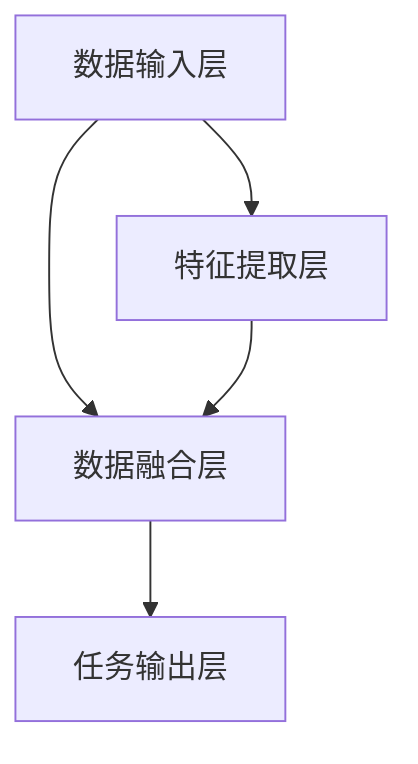
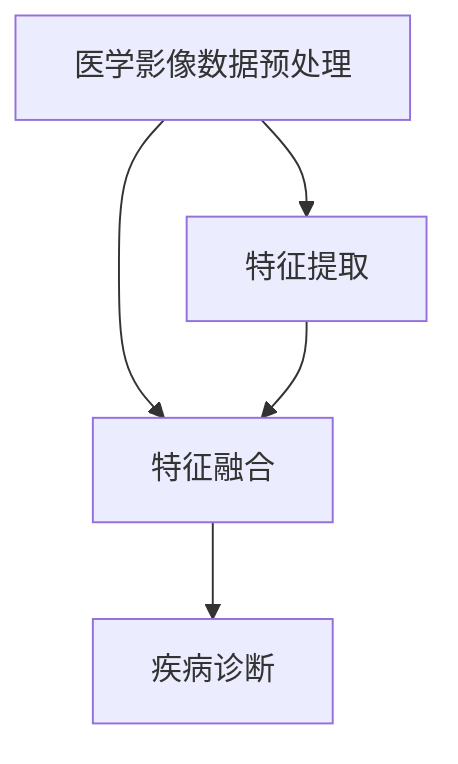

                 

### 文章标题：多模态大模型：技术原理与实战 应用背景

#### 关键词：多模态大模型，技术原理，应用场景，算法解析，实战案例

#### 摘要：
本文旨在深入探讨多模态大模型的技术原理、应用背景及其在计算机视觉、自然语言处理和医疗健康领域的实战应用。通过逐步分析多模态大模型的概念、组成与架构，以及其在不同领域的实际应用案例，本文旨在帮助读者理解这一前沿技术的核心概念和关键实现方法，从而为未来的研究和应用提供有价值的参考。

---

## 目录大纲

1. **第一部分：多模态大模型基础**
    1. **第1章：多模态大模型概述**
        1.1 多模态大模型的概念与重要性
        1.2 多模态大模型的组成与架构
    2. **第2章：多模态数据融合技术**
        2.1 多模态数据类型与预处理
        2.2 多模态数据融合方法
    3. **第3章：多模态大模型核心算法**
        3.1 生成对抗网络（GAN）原理
        3.2 循环一致性损失

2. **第二部分：多模态大模型技术原理**
    4. **第4章：多模态大模型训练与优化**
        4.1 多模态大模型的训练框架
        4.2 多模态大模型的迁移学习
    5. **第5章：多模态大模型的评估与调优**
        5.1 多模态大模型的评估指标
        5.2 多模态大模型的调优方法
    6. **第6章：多模态大模型的数学模型与公式**
        6.1 多模态大模型的数学基础
        6.2 多模态大模型的公式解析

3. **第三部分：多模态大模型应用实战**
    7. **第7章：多模态大模型在计算机视觉中的应用**
        7.1 多模态大模型在图像识别中的应用
        7.2 多模态大模型在图像生成中的应用
    8. **第8章：多模态大模型在自然语言处理中的应用**
        8.1 多模态大模型在文本生成中的应用
        8.2 多模态大模型在语音识别与合成中的应用
    9. **第9章：多模态大模型在医疗健康领域的应用**
        9.1 多模态大模型在医学影像分析中的应用
        9.2 多模态大模型在疾病诊断中的应用
   10. **第10章：多模态大模型的未来发展趋势与挑战**
        10.1 多模态大模型的发展趋势
        10.2 多模态大模型的挑战与解决方案

### 引言

多模态大模型作为人工智能领域的一个前沿研究方向，已经在计算机视觉、自然语言处理和医疗健康等领域展现出巨大的应用潜力。多模态大模型能够同时处理多种类型的数据，如图像、文本和音频，通过深度学习技术实现高效的数据融合和特征提取，从而在多个领域实现了突破性的应用成果。

随着数据规模的不断扩大和计算能力的提升，多模态大模型的研究与应用愈发受到关注。然而，多模态大模型涉及到复杂的技术原理和实现方法，对于初学者和从业者来说，理解其核心概念和关键算法是一项具有挑战性的任务。本文旨在通过逐步分析多模态大模型的技术原理和应用场景，提供一份系统化的技术指南，帮助读者深入了解这一前沿技术，并为未来的研究和应用提供有价值的参考。

本文将分为三个主要部分。第一部分将介绍多模态大模型的基础知识，包括其概念、组成与架构。第二部分将深入探讨多模态大模型的技术原理，包括核心算法、训练与优化方法，以及评估与调优技巧。第三部分将展示多模态大模型在不同领域的实战应用，包括计算机视觉、自然语言处理和医疗健康领域，并讨论其未来发展趋势与挑战。

### 第1章：多模态大模型概述

#### 1.1 多模态大模型的概念与重要性

多模态大模型是一种能够同时处理多种类型数据（如图像、文本和音频）的人工智能模型，其核心在于将不同模态的数据进行有效融合，从而提升模型的性能和应用范围。在传统的单一模态模型中，如仅处理图像的卷积神经网络（CNN）或仅处理文本的循环神经网络（RNN），模型只能针对特定类型的数据进行特征提取和任务处理。而多模态大模型通过整合多种模态数据，可以更全面地捕捉信息，提高模型的泛化能力和表现。

多模态大模型的重要性主要体现在以下几个方面：

1. **信息综合能力**：多模态大模型能够同时处理图像、文本、音频等多种数据，使得模型能够综合不同模态的信息，从而更准确地理解和处理复杂任务。

2. **增强模型性能**：通过多模态数据的融合，模型可以获得更丰富的特征信息，从而提高模型在图像识别、自然语言处理等任务中的准确性和鲁棒性。

3. **拓宽应用场景**：多模态大模型的应用范围更广泛，可以在医疗健康、智能客服、自动驾驶等多个领域发挥作用，实现更加智能化和个性化的应用。

4. **提升用户体验**：多模态大模型可以提供更加丰富和自然的交互方式，如通过语音、文字和图像等多种渠道与用户进行交流，从而提升用户体验。

#### 1.2 多模态大模型的定义与价值

多模态大模型（Multimodal Large Model）可以定义为一种能够同时处理多种类型数据，并在大规模数据集上进行训练的深度学习模型。多模态大模型的核心在于对多模态数据进行融合，通过深度神经网络（DNN）、生成对抗网络（GAN）等技术，实现对不同模态数据的特征提取和融合。

多模态大模型的价值主要体现在以下几个方面：

1. **数据融合能力**：多模态大模型能够将不同模态的数据进行有效融合，从而提取更丰富的特征信息。这种能力使得模型能够更准确地理解和处理复杂任务。

2. **增强模型泛化能力**：通过多模态数据的融合，模型可以获得更广泛的知识和信息，从而提升模型的泛化能力，使其在未见过的数据上也能保持良好的性能。

3. **提升模型性能**：多模态大模型能够同时处理多种类型的数据，通过多种特征信息的整合，可以显著提升模型在图像识别、文本生成等任务中的性能。

4. **拓宽应用领域**：多模态大模型的应用范围广泛，可以在医疗健康、自动驾驶、智能客服等多个领域发挥作用，推动人工智能技术的发展。

#### 1.3 多模态大模型的应用场景

多模态大模型的应用场景非常广泛，以下列举了几个典型的应用领域：

1. **计算机视觉**：多模态大模型在计算机视觉领域有广泛的应用，如图像识别、图像生成等。通过融合图像和文本数据，可以显著提高图像识别的准确性和鲁棒性。

2. **自然语言处理**：多模态大模型在自然语言处理领域也有重要应用，如文本生成、语音识别等。通过融合文本和音频数据，可以提高文本生成的质量和语音识别的准确性。

3. **医疗健康**：多模态大模型在医疗健康领域有重要的应用价值，如医学影像分析、疾病诊断等。通过融合医学影像和病历数据，可以更准确地分析医学图像，提高疾病诊断的准确率。

4. **智能客服**：多模态大模型在智能客服领域也有广泛应用，如通过融合语音、文本和图像数据，可以提供更加智能化和个性化的客服服务。

5. **自动驾驶**：多模态大模型在自动驾驶领域也有重要的应用，如通过融合摄像头、雷达和激光雷达数据，可以提高自动驾驶系统的准确性和安全性。

#### 1.4 多模态大模型的组成与架构

多模态大模型的组成与架构可以分为以下几个关键部分：

1. **数据输入层**：这一层负责接收多种类型的数据输入，如图像、文本和音频等。数据输入层通常包含数据预处理模块，如数据增强、归一化等操作，以提升数据的鲁棒性和质量。

2. **特征提取层**：这一层通过深度神经网络（如卷积神经网络、循环神经网络等）对输入数据进行特征提取。特征提取层可以同时处理多种模态的数据，提取出丰富的特征信息。

3. **数据融合层**：这一层负责将不同模态的数据特征进行融合，形成统一的特征表示。数据融合方法包括传统方法（如特征拼接、加权融合等）和深度学习方法（如注意力机制、多模态生成对抗网络等）。

4. **任务输出层**：这一层根据具体的任务需求（如分类、生成等）对融合后的特征进行输出。任务输出层通常包含分类器、生成器等模块，用于实现特定的任务。

### 图：多模态大模型的组成与架构



通过以上架构，多模态大模型能够同时处理多种类型的数据，实现高效的数据融合和特征提取，从而在各个领域发挥重要作用。

#### 小结

本章详细介绍了多模态大模型的概念、定义及其重要性，并探讨了多模态大模型在不同领域的应用场景和组成架构。多模态大模型通过融合多种类型的数据，可以显著提升模型的性能和应用范围，为人工智能技术的发展带来了新的机遇和挑战。

在接下来的章节中，我们将进一步探讨多模态大模型的核心算法、训练与优化方法，以及在不同领域的实际应用，帮助读者深入了解这一前沿技术的核心概念和关键实现方法。

---

## 第2章：多模态数据融合技术

#### 2.1 多模态数据类型与预处理

在多模态大模型中，多种类型的数据需要被有效整合以提升模型的性能。常见的多模态数据类型包括图像、文本和音频等。每种数据类型都有其独特的特性和处理需求，因此在进行数据融合之前，必须对这些数据进行预处理，以确保数据的一致性和质量。

1. **图像数据**：图像数据是多模态大模型中最常见的一种类型。图像数据通常以像素矩阵的形式存储，其分辨率、色彩深度和尺寸等参数对后续处理有重要影响。预处理图像数据的主要任务包括：

   - **图像增强**：通过调整对比度、亮度和色彩等参数，增强图像的视觉效果，提高模型的识别能力。
   - **图像归一化**：将图像的像素值归一化到统一的范围（如[0, 1]或[-1, 1]），以便于后续的模型训练和计算。
   - **数据增强**：通过旋转、翻转、缩放和裁剪等操作，增加图像数据的多样性，提高模型的泛化能力。

2. **文本数据**：文本数据包括自然语言文本和结构化数据（如XML、JSON等）。文本数据的预处理主要包括：

   - **文本清洗**：去除文本中的噪声，如停用词、标点符号和特殊字符等。
   - **分词**：将文本拆分为单词或短语，以便进行后续的词向量化处理。
   - **词向量化**：将文本中的单词或短语映射为向量表示，通常使用词袋模型、Word2Vec或BERT等算法。
   - **文本嵌入**：将文本序列映射为一个连续的向量表示，用于后续的模型训练和推理。

3. **音频数据**：音频数据通常以波形形式存储，其预处理主要包括：

   - **声音增强**：通过调整音频的音量、节奏和音调等参数，增强音频的清晰度。
   - **音频分割**：将连续的音频信号分割为短段，以便进行特征提取和模型训练。
   - **特征提取**：通过短时傅里叶变换（STFT）、梅尔频率倒谱系数（MFCC）等方法提取音频的特征向量。

#### 2.2 多模态数据融合方法

多模态数据融合是提升多模态大模型性能的关键步骤。数据融合的方法可以分为传统方法和深度学习方法两种。

1. **传统方法**：

   - **特征拼接**：将不同模态的特征向量直接拼接在一起，形成统一的高维特征向量。这种方法简单直观，但容易导致特征维度过高，模型训练复杂度增加。

   - **加权融合**：对每个模态的特征向量进行权重分配，然后进行加权求和。权重可以通过训练或手动设定，以优化不同模态对最终特征表示的贡献。

   - **最大值融合**：选择每个模态特征向量中的最大值，形成统一特征表示。这种方法适用于某些特定的场景，但可能丢失部分模态的信息。

2. **深度学习方法**：

   - **多任务学习**：将多个任务（如图像分类、文本分类和音频分类）组合成一个多任务学习模型，共享部分网络结构以提升特征融合效果。

   - **注意力机制**：通过引入注意力机制，模型能够自动学习不同模态特征的重要性，并动态调整其在特征融合中的权重。

   - **生成对抗网络（GAN）**：利用GAN生成器生成一种模态的数据，并将其与原始数据融合。这种方法能够有效提高模型的生成能力和特征融合效果。

   - **多模态生成对抗网络（MMGAN）**：结合多个生成对抗网络，分别处理不同模态的数据，实现更高级的多模态特征融合。

#### 2.3 多模态数据融合技术的对比与分析

传统方法和深度学习方法在多模态数据融合中有各自的优势和局限性。

- **传统方法**：

  - **优势**：实现简单，计算成本低，适用于某些特定场景。
  - **局限性**：容易导致特征维度过高，模型训练复杂度增加；特征融合效果有限，可能丢失部分模态的信息。

- **深度学习方法**：

  - **优势**：能够自动学习不同模态特征的重要性，实现高效的特性融合；具有较强的生成能力，可以生成高质量的模拟数据。
  - **局限性**：计算成本较高，模型训练复杂；对数据质量和数量要求较高，否则容易过拟合。

综上所述，深度学习方法在多模态数据融合中具有更明显的优势，但需要更多的计算资源和数据支持。在实际应用中，可以根据具体场景和数据特点，选择合适的数据融合方法。

### 小结

本章详细介绍了多模态数据融合技术，包括多模态数据类型与预处理方法，以及传统方法和深度学习方法。多模态数据融合是提升多模态大模型性能的关键步骤，通过有效的数据融合，可以显著提高模型的性能和应用范围。在接下来的章节中，我们将进一步探讨多模态大模型的核心算法、训练与优化方法，以及在不同领域的实际应用。

---

## 第3章：多模态大模型核心算法

### 3.1 生成对抗网络（GAN）原理

生成对抗网络（GAN）是由Ian Goodfellow等人于2014年提出的一种深度学习模型，旨在通过两个对抗性神经网络（生成器和判别器）的交互来生成高质量的数据。GAN在多模态大模型中具有重要的应用，能够有效实现多模态数据的生成和融合。

#### GAN的概念与结构

GAN由两部分组成：生成器（Generator）和判别器（Discriminator）。生成器的目标是生成与真实数据相近的伪造数据，而判别器的目标是区分真实数据和伪造数据。两个网络在训练过程中相互竞争，生成器不断优化其生成能力，而判别器不断优化其判别能力。这种对抗性的训练过程使得生成器能够生成高质量的数据。

GAN的基本结构如下：

1. **生成器（Generator）**：生成器接收随机噪声作为输入，通过一系列的神经网络变换，生成与真实数据相近的伪造数据。生成器的目的是让判别器难以区分生成的数据和真实数据。

2. **判别器（Discriminator）**：判别器接收真实数据和伪造数据的输入，通过一系列的神经网络判断数据是真实的还是伪造的。判别器的目的是最大化正确判断的概率。

3. **对抗性训练**：生成器和判别器在训练过程中交替更新。生成器通过优化其生成能力来最小化判别器对伪造数据的判断误差；而判别器通过优化其判别能力来最大化对伪造数据和真实数据的区分能力。这种对抗性训练使得生成器能够逐渐生成更加逼真的伪造数据，而判别器能够更加准确地区分真实数据和伪造数据。

#### GAN的训练与优化

GAN的训练过程是一个动态平衡的过程，旨在使生成器和判别器达到最佳性能。以下是GAN的训练与优化方法：

1. **损失函数**：GAN的损失函数通常由两部分组成：判别器损失和生成器损失。判别器损失用于衡量判别器对真实数据和伪造数据的判断能力，而生成器损失用于衡量生成器生成伪造数据的质量。

   - **判别器损失**（通常使用交叉熵损失）：
     $$\mathcal{L}_D = -\frac{1}{N} \sum_{i=1}^{N} [\log(D(x)) + \log(1 - D(G(z)))]$$
     其中，\(x\) 代表真实数据，\(G(z)\) 代表生成器生成的伪造数据，\(D(x)\) 和 \(D(G(z))\) 分别代表判别器对真实数据和伪造数据的判断结果。

   - **生成器损失**（通常使用交叉熵损失）：
     $$\mathcal{L}_G = -\frac{1}{N} \sum_{i=1}^{N} \log(D(G(z)))$$

2. **梯度提升**：在GAN的训练过程中，生成器和判别器的更新需要考虑梯度提升。通常，生成器的更新方向为反向传播得到的梯度方向，而判别器的更新方向则相反。

3. **优化方法**：GAN的训练优化方法包括：

   - **梯度惩罚**：通过在损失函数中引入梯度惩罚项，防止生成器和判别器过度优化，以保持两者之间的动态平衡。
   - **学习率调整**：根据训练过程中生成器和判别器的性能调整学习率，以避免过度优化或欠优化。
   - **模型正则化**：通过正则化方法（如L2正则化）防止模型过拟合，提高模型的泛化能力。

#### GAN在多模态生成中的应用

在多模态大模型中，GAN主要用于多模态数据的生成和融合。以下为GAN在多模态生成中的几个关键应用：

1. **图像生成**：GAN可以通过生成器生成高质量的图像，如图像去噪、超分辨率和风格迁移等。在多模态大模型中，生成器可以将文本描述转换为图像，实现文本到图像的生成。

   - **文本到图像生成**：给定一个文本描述，生成器通过GAN生成对应的图像。例如，在艺术创作中，可以生成与文本描述相符的绘画作品。

2. **音频生成**：GAN可以生成高质量的音乐、语音和音频效果。在多模态大模型中，生成器可以将文本描述转换为音频，实现文本到音频的生成。

   - **文本到音频生成**：给定一个文本描述，生成器通过GAN生成对应的音频。例如，可以生成与文本描述相符的广播音乐或有声读物。

3. **多模态融合**：GAN可以将不同模态的数据进行融合，生成具有多样性和高质量的多模态数据。例如，可以将图像、文本和音频融合生成具有丰富信息的多模态数据集，用于训练多模态大模型。

#### 小结

本章介绍了生成对抗网络（GAN）的概念、结构和训练方法，并探讨了GAN在多模态大模型中的关键应用。GAN通过生成器和判别器的对抗性训练，能够生成高质量的数据，实现多模态数据的生成和融合。在接下来的章节中，我们将继续探讨多模态大模型的其他核心算法，以及其在不同领域的应用。

---

### 3.2 循环一致性损失

循环一致性损失（Cycle Consistency Loss）是生成对抗网络（GAN）中的一种关键损失函数，主要用于提高多模态数据的生成质量。循环一致性损失通过确保多模态数据在多次转换过程中保持一致性，从而提高生成器的生成能力。

#### 循环一致性损失的概念与原理

循环一致性损失旨在解决多模态数据在转换过程中可能出现的失真问题。具体来说，循环一致性损失要求生成器在将一种模态的数据转换为另一种模态的数据后，再次转换回原始模态的数据时，其结果应尽可能接近原始数据。这种循环过程可以确保多模态数据在转换过程中的稳定性和一致性。

循环一致性损失的基本原理如下：

1. **正向转换**：给定一种模态的数据 \(x\)，生成器 \(G\) 将其转换为另一种模态的数据 \(y = G(x)\)。

2. **反向转换**：给定转换后的数据 \(y\)，生成器 \(G'\) 将其转换回原始模态的数据 \(x' = G'(y)\)。

3. **一致性损失**：通过计算原始数据 \(x\) 和反向转换后的数据 \(x'\) 之间的差异，衡量循环过程中的数据失真程度。循环一致性损失函数通常采用均方误差（MSE）或结构相似性指数（SSIM）等度量标准。

循环一致性损失的具体公式可以表示为：

$$\mathcal{L}_{CC} = \frac{1}{2} \left( \frac{1}{N} \sum_{i=1}^{N} \left[ \text{MSE}(x, x') + \text{MSE}(y, y') \right] \right)$$

其中，\(N\) 为数据样本的数量，\(x\) 和 \(x'\) 分别为原始数据和反向转换后的数据，\(y\) 和 \(y'\) 分别为正向转换和反向转换后的数据。

#### 循环一致性损失的计算方法

循环一致性损失的计算方法可以分为以下几个步骤：

1. **正向转换**：将原始数据 \(x\) 输入到生成器 \(G\) 中，得到正向转换后的数据 \(y = G(x)\)。

2. **反向转换**：将正向转换后的数据 \(y\) 输入到生成器 \(G'\) 中，得到反向转换后的数据 \(x' = G'(y)\)。

3. **计算差异**：计算原始数据 \(x\) 和反向转换后的数据 \(x'\) 之间的差异，以及正向转换后的数据 \(y\) 和反向转换后的数据 \(y'\) 之间的差异。

4. **求和与归一化**：将所有样本的差异求和，并除以样本数量 \(N\)，得到循环一致性损失值。

#### 循环一致性损失在多模态大模型中的应用

循环一致性损失在多模态大模型中的应用主要包括以下几个方面：

1. **数据生成**：通过循环一致性损失，生成器能够在生成多模态数据时，确保数据在多次转换过程中保持一致性。这有助于提高生成数据的稳定性和质量。

2. **数据修复**：在多模态大模型中，循环一致性损失可以用于修复损坏或失真的多模态数据。通过正向和反向转换，生成器可以生成高质量的修复数据，从而提高模型的鲁棒性。

3. **数据增强**：循环一致性损失可以用于生成多种模态的数据，用于数据增强，从而提高模型的泛化能力。通过循环转换，生成器可以生成多样化的训练样本，提高模型的鲁棒性。

#### 小结

循环一致性损失是一种重要的损失函数，主要用于提高多模态数据的生成质量和稳定性。通过确保多模态数据在正向和反向转换过程中的一致性，循环一致性损失能够有效提升生成器的性能，为多模态大模型的应用提供了关键的支持。在接下来的章节中，我们将进一步探讨多模态大模型的训练与优化方法，以及其在不同领域的实际应用。

---

### 第4章：多模态大模型训练与优化

#### 4.1 多模态大模型的训练框架

多模态大模型的训练框架是确保模型在多种数据模态上能够有效学习和优化的重要步骤。一个完整的多模态大模型训练框架通常包括数据预处理、模型结构设计、训练策略和优化方法等几个关键部分。

##### 数据预处理

1. **数据清洗**：首先，对多模态数据进行清洗，去除噪声和错误数据。例如，在处理医学影像数据时，需要去除患者信息错误或不完整的数据。

2. **数据增强**：通过数据增强技术，如图像旋转、缩放、裁剪、颜色变换等，增加训练数据的多样性，防止模型过拟合。

3. **数据归一化**：对图像、文本和音频等数据进行归一化处理，如将图像像素值归一化到[0, 1]区间，将文本数据转换为统一的词向量表示，将音频数据进行能量归一化等。

##### 模型结构设计

1. **模态特异性处理**：设计针对不同模态数据的特征提取模块，如使用卷积神经网络（CNN）处理图像数据，使用循环神经网络（RNN）处理文本数据，使用卷积神经网络处理音频数据。

2. **特征融合模块**：设计用于融合不同模态数据的模块，如使用注意力机制或融合网络（Fusion Network）将不同模态的特征进行有效整合。

3. **任务特异性模块**：设计用于执行特定任务的模块，如分类器、生成器等，根据具体任务需求进行调整。

##### 训练策略

1. **多任务学习**：在训练过程中，可以采用多任务学习策略，将多个任务（如图像分类、文本分类等）组合在一起进行训练，共享部分网络结构以提高模型的泛化能力。

2. **分层训练**：首先训练单一模态的特征提取网络，然后逐步引入多模态融合模块和任务特异性模块，确保模型在不同阶段能够稳定地学习和优化。

3. **动态调整学习率**：在训练过程中，根据模型性能动态调整学习率，以避免模型过早收敛或陷入局部最优。

##### 优化方法

1. **梯度优化**：使用优化算法（如Adam、SGD等）对模型参数进行优化，以减少损失函数的值，提高模型性能。

2. **正则化**：应用正则化方法（如L1、L2正则化）防止模型过拟合，提高模型的泛化能力。

3. **早期停止**：在训练过程中，设置提前停止条件，当模型性能不再提升时停止训练，防止过拟合。

#### 4.2 多模态大模型的迁移学习

迁移学习是一种将已有模型的知识应用于新任务的方法，可以显著提高多模态大模型的训练效率。在多模态大模型中，迁移学习主要应用于以下几个方面：

1. **特征迁移**：将预训练的特征提取模块应用于新任务，利用已有模型的知识进行特征提取，提高新任务的性能。

2. **模型迁移**：将整个预训练的多模态大模型应用于新任务，通过微调模型参数（如调整特定层的权重）以适应新任务的需求。

3. **数据迁移**：利用已有模型的训练数据集进行数据增强，生成新的训练数据，以提高新任务的数据质量。

##### 迁移学习的基本概念

1. **源任务（Source Task）**：已有模型所训练的任务，通常是在大规模数据集上完成的。

2. **目标任务（Target Task）**：新任务，通常是在较小规模的数据集上完成的。

3. **模型参数迁移**：将源任务的模型参数应用于目标任务，通过微调或冻结部分层的方法进行优化。

##### 迁移学习在多模态大模型中的应用

1. **预训练模型的应用**：使用在大规模数据集上预训练的多模态大模型作为基础模型，通过微调模型参数在新任务上训练，从而提高新任务的性能。

2. **特征迁移**：利用预训练的特征提取模块，将不同模态的数据特征进行提取，提高新任务的泛化能力。

3. **数据增强**：通过迁移学习生成新的训练数据，如使用预训练模型生成的图像、文本和音频数据，用于增强新任务的数据集。

##### 多模态迁移学习的挑战与解决方案

1. **数据不平衡**：目标任务的数据集通常比源任务的数据集小，且可能存在数据不平衡的问题。解决方案包括使用数据增强、合成数据集等方法增加目标任务的数据量。

2. **模型泛化能力**：多模态大模型的迁移学习需要确保模型在不同任务上的泛化能力。解决方案包括使用元学习（Meta-Learning）等方法提高模型的泛化能力。

3. **计算资源需求**：迁移学习需要大量计算资源进行训练，尤其是在多模态大模型中，计算成本更高。解决方案包括使用分布式计算、优化算法等方法提高训练效率。

#### 小结

本章介绍了多模态大模型的训练框架和迁移学习方法，包括数据预处理、模型结构设计、训练策略和优化方法，以及迁移学习在多模态大模型中的应用和挑战。通过合理的训练和迁移学习方法，可以显著提高多模态大模型的性能和应用效果。

在接下来的章节中，我们将进一步探讨多模态大模型的评估与调优，以及其在不同领域的实际应用，帮助读者深入了解这一前沿技术的核心概念和关键实现方法。

---

### 4.3 多模态大模型的评估与调优

多模态大模型的评估与调优是确保模型性能达到预期目标的关键步骤。评估方法的选择和调优策略的制定对于多模态大模型的实际应用至关重要。

#### 评估指标

在多模态大模型的评估中，常用的指标包括准确性、精确度、召回率、F1值和均方误差（MSE）等。

1. **准确性（Accuracy）**：模型正确预测的样本数占总样本数的比例。适用于分类任务。
   $$\text{Accuracy} = \frac{\text{正确预测数}}{\text{总样本数}}$$

2. **精确度（Precision）**：模型预测为正类的样本中，实际为正类的比例。适用于分类任务。
   $$\text{Precision} = \frac{\text{真正例数}}{\text{真正例数 + 假正例数}}$$

3. **召回率（Recall）**：模型预测为正类的样本中，实际为正类的比例。适用于分类任务。
   $$\text{Recall} = \frac{\text{真正例数}}{\text{真正例数 + 假反例数}}$$

4. **F1值（F1 Score）**：精确度和召回率的加权平均，用于衡量分类模型的综合性能。
   $$\text{F1 Score} = 2 \times \frac{\text{Precision} \times \text{Recall}}{\text{Precision} + \text{Recall}}$$

5. **均方误差（MSE）**：用于回归任务，衡量预测值与实际值之间的平均平方误差。
   $$\text{MSE} = \frac{1}{N} \sum_{i=1}^{N} (\hat{y}_i - y_i)^2$$

其中，\(N\) 为样本数量，\(\hat{y}_i\) 为预测值，\(y_i\) 为实际值。

#### 常见的多模态大模型评估指标

1. **多模态准确性**：评估模型在多模态数据上的分类准确性，适用于多分类任务。

2. **交叉验证精度**：通过交叉验证方法，评估模型在不同数据集上的性能，确保评估结果的可靠性。

3. **一致性指标**：评估模型在不同模态数据上的输出一致性，如使用Kappa系数衡量多模态分类的一致性。

4. **多模态F1值**：评估模型在多模态数据上的分类综合性能，结合精确度和召回率。

#### 调优方法

多模态大模型的调优主要涉及超参数调整、训练策略优化和模型结构改进等。

1. **超参数调整**：

   - **学习率**：调整学习率可以影响模型的收敛速度和收敛质量。常用的调整方法包括固定学习率、学习率衰减和自适应学习率（如Adam优化器）。

   - **批量大小**：批量大小影响梯度下降算法的稳定性和收敛速度。较小的批量大小可以减少方差，但增加计算成本；较大的批量大小可以减少偏置，但增加计算量。

   - **正则化参数**：通过调整L1或L2正则化参数，控制模型复杂度和防止过拟合。

2. **训练策略优化**：

   - **分层训练**：首先训练单一模态的特征提取网络，然后逐步引入多模态融合模块和任务特异性模块。

   - **早期停止**：当验证集的性能不再提升时，提前停止训练，防止过拟合。

   - **动态调整学习率**：在训练过程中，根据模型性能动态调整学习率，如使用学习率衰减策略。

3. **模型结构改进**：

   - **增加网络深度和宽度**：通过增加网络层数和神经元数量，提高模型的特征提取能力。

   - **引入注意力机制**：通过注意力机制，模型可以自动学习不同模态特征的重要性，提高特征融合效果。

   - **使用预训练模型**：利用在大规模数据集上预训练的多模态大模型，通过微调适应新任务。

#### 实践中的调优案例分析

1. **图像分类任务**：

   - **数据增强**：使用随机裁剪、旋转、翻转、色彩变换等方法增加训练数据的多样性。

   - **批量大小**：选择合适的批量大小，如32或64，以平衡计算成本和模型稳定性。

   - **学习率**：使用学习率衰减策略，如0.1衰减率，初始学习率为0.001。

   - **正则化**：使用L2正则化，正则化参数为0.0001，防止模型过拟合。

2. **语音识别任务**：

   - **数据预处理**：对音频数据进行分割和特征提取，如使用梅尔频率倒谱系数（MFCC）作为特征。

   - **模型结构**：使用深度卷积神经网络（DCNN）和长短期记忆网络（LSTM）组合模型，以提高特征提取和序列建模能力。

   - **调优策略**：动态调整学习率，使用自适应优化器（如Adam）优化模型参数。

#### 小结

本章详细介绍了多模态大模型的评估指标和调优方法，包括超参数调整、训练策略优化和模型结构改进。通过合理的评估和调优，可以显著提高多模态大模型的性能和应用效果。在接下来的章节中，我们将探讨多模态大模型的数学模型与公式，以及其在不同领域的实际应用。

---

### 4.4 多模态大模型的数学模型与公式

多模态大模型的设计和实现离不开坚实的数学基础。在本节中，我们将探讨多模态大模型中所涉及的关键数学概念和公式，包括多变量函数的导数与梯度、矩阵运算与线性代数、以及概率论与信息论基础。这些数学工具为理解和实现多模态大模型提供了必要的理论支持。

#### 多变量函数的导数与梯度

在多模态大模型中，处理多变量函数的导数和梯度是基础。假设我们有一个多变量函数 \( f(\mathbf{x}) \)，其中 \( \mathbf{x} = [x_1, x_2, ..., x_n] \) 是一个n维向量。导数和梯度是理解函数变化率的重要概念。

1. **偏导数（Partial Derivative）**：偏导数表示在某一变量变化时，其他变量保持不变的情况下函数的变化率。对于n维向量，函数 \( f(\mathbf{x}) \) 的第i个变量的偏导数表示为：
   $$ \frac{\partial f}{\partial x_i} $$

2. **梯度（Gradient）**：梯度是偏导数的向量形式，表示函数在所有变量上的变化率。对于多变量函数 \( f(\mathbf{x}) \)，梯度 \( \nabla f(\mathbf{x}) \) 定义为：
   $$ \nabla f(\mathbf{x}) = \left[ \frac{\partial f}{\partial x_1}, \frac{\partial f}{\partial x_2}, ..., \frac{\partial f}{\partial x_n} \right]^T $$
   其中，\( T \) 表示转置。

#### 矩阵运算与线性代数

矩阵运算和多变量函数的导数密切相关，是构建和训练深度学习模型的基础。以下介绍几个关键概念：

1. **矩阵-向量乘法**：给定一个矩阵 \( \mathbf{A} \) 和一个向量 \( \mathbf{x} \)，矩阵-向量乘法 \( \mathbf{A} \mathbf{x} \) 结果是一个向量，其每个元素是矩阵的行与向量对应元素的乘积和。
   $$ \mathbf{A} \mathbf{x} = \left[ \sum_{j=1}^{m} a_{ij} x_j \right]_{i=1}^{n} $$

2. **矩阵-矩阵乘法**：给定两个矩阵 \( \mathbf{A} \) 和 \( \mathbf{B} \)，矩阵-矩阵乘法 \( \mathbf{A} \mathbf{B} \) 结果是一个矩阵，其每个元素是矩阵 \( \mathbf{A} \) 的行与矩阵 \( \mathbf{B} \) 的列的乘积和。
   $$ \mathbf{A} \mathbf{B} = \left[ \sum_{k=1}^{p} (a_{ik} b_{kj}) \right]_{i=1, j=1}^{m, n} $$

3. **逆矩阵（Inverse Matrix）**：如果矩阵 \( \mathbf{A} \) 可逆，其逆矩阵 \( \mathbf{A}^{-1} \) 满足 \( \mathbf{A} \mathbf{A}^{-1} = \mathbf{I} \)，其中 \( \mathbf{I} \) 是单位矩阵。

4. **特征值与特征向量**：特征值和特征向量是矩阵的固有属性。对于方阵 \( \mathbf{A} \)，存在一组特征值 \( \lambda_1, \lambda_2, ..., \lambda_n \) 和相应的特征向量 \( \mathbf{v}_1, \mathbf{v}_2, ..., \mathbf{v}_n \)，满足 \( \mathbf{A} \mathbf{v}_i = \lambda_i \mathbf{v}_i \)。

#### 概率论与信息论基础

概率论和信息论是多模态大模型设计中处理不确定性数据的重要工具。

1. **概率分布**：概率分布描述了随机变量的取值可能性。常见的概率分布包括正态分布（高斯分布）、伯努利分布和多项式分布等。

2. **条件概率**：给定事件A和事件B，条件概率 \( P(B|A) \) 表示在事件A发生的条件下，事件B发生的概率。

3. **贝叶斯定理**：贝叶斯定理用于计算后验概率，公式为：
   $$ P(A|B) = \frac{P(B|A) P(A)}{P(B)} $$
   其中，\( P(A|B) \) 是后验概率，\( P(B|A) \) 是似然函数，\( P(A) \) 是先验概率，\( P(B) \) 是边缘概率。

4. **信息熵（Entropy）**：信息熵衡量随机变量的不确定性，定义为：
   $$ H(X) = -\sum_{x} p(x) \log_2 p(x) $$
   其中，\( p(x) \) 是随机变量 \( X \) 取值 \( x \) 的概率。

5. **互信息（Mutual Information）**：互信息衡量两个随机变量之间的相关性，定义为：
   $$ I(X; Y) = H(X) - H(X | Y) $$
   其中，\( H(X) \) 是 \( X \) 的熵，\( H(X | Y) \) 是 \( X \) 在给定 \( Y \) 条件下的条件熵。

#### 多模态大模型的关键公式

1. **生成对抗网络（GAN）损失函数**：
   $$ \mathcal{L}_D = -\frac{1}{N} \sum_{i=1}^{N} [\log(D(x)) + \log(1 - D(G(z)))] $$
   $$ \mathcal{L}_G = -\frac{1}{N} \sum_{i=1}^{N} \log(D(G(z))] $$
   其中，\( D(x) \) 和 \( D(G(z)) \) 分别是判别器对真实数据和生成数据的判断概率。

2. **循环一致性损失**：
   $$ \mathcal{L}_{CC} = \frac{1}{2} \left( \frac{1}{N} \sum_{i=1}^{N} \left[ \text{MSE}(x, x') + \text{MSE}(y, y') \right] \right) $$
   其中，\( x \) 和 \( x' \) 分别是原始数据和反向转换后的数据，\( y \) 和 \( y' \) 分别是正向转换和反向转换后的数据。

3. **多变量梯度下降**：
   $$ \mathbf{w}_{t+1} = \mathbf{w}_t - \alpha \nabla f(\mathbf{w}_t) $$
   其中，\( \mathbf{w}_t \) 是当前权重，\( \alpha \) 是学习率，\( \nabla f(\mathbf{w}_t) \) 是权重 \( \mathbf{w}_t \) 的梯度。

#### 小结

本章详细介绍了多模态大模型设计中所涉及的关键数学概念和公式，包括多变量函数的导数与梯度、矩阵运算与线性代数、以及概率论与信息论基础。这些数学工具为理解多模态大模型的工作原理和实现提供了理论基础。在接下来的章节中，我们将探讨多模态大模型在不同领域的实际应用，进一步展示其技术原理和实现方法。

---

## 第5章：多模态大模型在计算机视觉中的应用

### 5.1 多模态大模型在图像识别中的应用

多模态大模型在图像识别领域展现了显著的优势，通过融合图像和文本等多模态数据，可以显著提高模型的识别准确性和鲁棒性。以下为几个具体的应用案例：

#### 5.1.1 图像-文本联合识别

在图像-文本联合识别任务中，多模态大模型可以同时处理图像和文本信息，从而提高模型的识别能力。例如，在图像分类任务中，模型可以结合图像内容和标题描述，实现更准确的分类结果。以下是一个简单的图像-文本联合识别流程：

1. **图像特征提取**：使用卷积神经网络（CNN）提取图像特征向量，如图像分类任务中的卷积层输出。

2. **文本特征提取**：使用循环神经网络（RNN）或变压器（Transformer）提取文本特征向量，如标题的词向量或编码表示。

3. **特征融合**：将图像特征向量和文本特征向量进行融合，可以采用特征拼接、加权融合或注意力机制等方法。

4. **分类器**：使用融合后的特征向量输入分类器，进行图像分类。

以下是一个简化的伪代码示例：

```python
# 输入图像和文本
image = load_image("image.jpg")
text = load_text("text.txt")

# 图像特征提取
image_feature = CNN(image)

# 文本特征提取
text_feature = RNN(text)

# 特征融合
 fused_feature = fuse_features(image_feature, text_feature)

# 分类器
label = classifier(fused_feature)
```

#### 5.1.2 多模态图像识别挑战

尽管多模态大模型在图像识别中具有显著优势，但仍然面临一些挑战：

1. **数据不平衡**：图像和文本数据在数量和分布上可能存在显著差异，导致模型对某些模态的数据依赖过重。

2. **特征差异**：图像和文本数据的特征分布和尺度可能不同，导致融合过程复杂。

3. **模型参数**：多模态模型通常需要更多的参数和计算资源，可能导致训练时间过长。

#### 5.1.3 应用案例

以下是一个多模态图像识别的应用案例：

**场景**：智能安防系统中的异常行为检测。

**任务**：检测图像中的异常行为，如打架、盗窃等。

**方法**：

1. **图像特征提取**：使用CNN提取图像特征。

2. **文本特征提取**：提取图像标题、描述和标签文本。

3. **特征融合**：采用注意力机制融合图像和文本特征。

4. **行为分类**：使用融合后的特征输入分类器，进行行为分类。

**结果**：通过多模态特征融合，显著提高了异常行为检测的准确性和鲁棒性。

### 5.2 多模态大模型在图像生成中的应用

多模态大模型在图像生成中的应用广泛，通过融合图像和文本等多模态数据，可以生成具有丰富内容和多样性的图像。以下为几个具体的应用案例：

#### 5.2.1 文本到图像生成

文本到图像生成任务旨在根据文本描述生成相应的图像。以下是一个简化的文本到图像生成流程：

1. **文本编码**：使用Transformer或BERT等预训练模型对文本进行编码，生成文本向量。

2. **图像生成**：使用生成对抗网络（GAN）生成图像。生成器接收文本向量作为条件输入，生成图像。

3. **图像解码**：将生成的图像向量解码为像素值。

以下是一个简化的伪代码示例：

```python
# 输入文本
text = "A beautiful sunset over the beach"

# 文本编码
text_vector = encoder(text)

# 图像生成
image = generator(text_vector)

# 图像解码
image_pixels = decoder(image)
```

#### 5.2.2 图像-文本联合生成

图像-文本联合生成任务旨在同时生成图像和相应的文本描述。以下是一个简化的图像-文本联合生成流程：

1. **图像特征提取**：使用CNN提取图像特征。

2. **文本生成**：使用生成器同时生成图像和文本描述。

3. **图像解码和文本解码**：将生成的图像向量和文本向量分别解码为图像和文本。

以下是一个简化的伪代码示例：

```python
# 输入图像
image = load_image("image.jpg")

# 图像特征提取
image_feature = CNN(image)

# 文本生成
text = generator(image_feature)

# 图像解码
image = decoder(image_feature)

# 文本解码
text_vector = decoder(text_vector)
```

#### 5.2.3 多模态图像生成挑战

尽管多模态大模型在图像生成中具有显著优势，但仍然面临一些挑战：

1. **数据多样性**：生成丰富的图像数据需要大量的训练数据。

2. **生成质量**：生成的图像质量可能受到模型能力限制。

3. **计算成本**：多模态图像生成模型通常需要大量计算资源。

### 5.2.4 应用案例

以下是一个多模态图像生成应用案例：

**场景**：虚拟现实（VR）中的场景生成。

**任务**：根据文本描述生成相应的三维场景图像。

**方法**：

1. **文本编码**：使用Transformer模型对文本进行编码。

2. **图像生成**：使用GAN生成三维场景图像。

3. **图像解码**：将生成的图像向量解码为像素值。

**结果**：通过多模态特征融合，生成的三维场景图像具有丰富的细节和多样性，显著提高了虚拟现实体验的质量。

#### 小结

本章详细介绍了多模态大模型在图像识别和图像生成中的应用，包括图像-文本联合识别和文本到图像生成等具体案例。通过融合图像和文本等多模态数据，多模态大模型在图像识别和图像生成任务中展现了显著的优势。在接下来的章节中，我们将探讨多模态大模型在自然语言处理领域的应用，进一步展示其技术原理和实现方法。

---

### 第6章：多模态大模型在自然语言处理中的应用

#### 6.1 多模态大模型在文本生成中的应用

文本生成是多模态大模型在自然语言处理领域的重要应用之一，通过融合文本和图像等多模态数据，可以生成更具多样性和创造力的文本内容。以下为几个具体的应用案例：

#### 6.1.1 文本-图像联合生成

文本-图像联合生成旨在根据图像和文本描述生成相应的文本内容。以下是一个简化的文本-图像联合生成流程：

1. **图像特征提取**：使用卷积神经网络（CNN）提取图像特征。

2. **文本特征提取**：使用循环神经网络（RNN）或变压器（Transformer）提取文本特征。

3. **特征融合**：将图像特征向量和文本特征向量进行融合，可以采用特征拼接、加权融合或注意力机制等方法。

4. **文本生成**：使用生成器生成文本内容。

以下是一个简化的伪代码示例：

```python
# 输入图像和文本
image = load_image("image.jpg")
text = load_text("text.txt")

# 图像特征提取
image_feature = CNN(image)

# 文本特征提取
text_feature = RNN(text)

# 特征融合
fused_feature = fuse_features(image_feature, text_feature)

# 文本生成
text_output = generator(fused_feature)
```

#### 6.1.2 多模态文本生成挑战

尽管多模态大模型在文本生成中具有显著优势，但仍然面临一些挑战：

1. **数据多样性**：生成高质量的文本数据需要大量的多模态训练数据。

2. **生成连贯性**：多模态数据的融合可能导致生成文本的连贯性下降。

3. **计算成本**：多模态文本生成模型通常需要大量计算资源。

#### 6.1.3 应用案例

以下是一个多模态文本生成应用案例：

**场景**：自动新闻写作。

**任务**：根据图像和文本摘要生成完整的新闻报道。

**方法**：

1. **图像特征提取**：使用CNN提取图像特征。

2. **文本特征提取**：使用Transformer模型提取文本摘要。

3. **特征融合**：采用注意力机制融合图像和文本特征。

4. **文本生成**：使用生成器生成新闻报道。

**结果**：通过多模态特征融合，生成的新闻报道内容更加丰富和连贯，显著提高了自动新闻写作的质量。

#### 6.2 多模态大模型在语音识别与合成中的应用

多模态大模型在语音识别与合成领域也有重要的应用，通过融合语音和文本等多模态数据，可以显著提高语音识别的准确性和语音合成的自然度。以下为几个具体的应用案例：

#### 6.2.1 文本到语音合成

文本到语音合成（Text-to-Speech，TTS）旨在根据文本内容生成自然流畅的语音。以下是一个简化的文本到语音合成流程：

1. **文本编码**：使用循环神经网络（RNN）或变压器（Transformer）对文本进行编码，生成文本向量。

2. **语音特征提取**：使用生成对抗网络（GAN）提取语音特征。

3. **语音合成**：使用生成器根据文本向量生成语音。

以下是一个简化的伪代码示例：

```python
# 输入文本
text = "Welcome to the AI Genius Institute"

# 文本编码
text_vector = encoder(text)

# 语音特征提取
speech_feature = GAN(text_vector)

# 语音合成
speech_output = generator(speech_feature)
```

#### 6.2.2 语音识别与合成的多模态融合方法

多模态融合方法在语音识别与合成中具有重要意义，以下介绍几种常用的融合方法：

1. **特征级融合**：将不同模态的特征向量进行拼接或加权融合，形成统一的特征向量。

2. **决策级融合**：在不同模态的识别结果上进行融合，例如使用投票或加权平均方法。

3. **端到端融合**：使用深度神经网络（如Transformer）直接对多模态数据建模，实现端到端的融合。

#### 6.2.3 多模态语音识别与合成的挑战

尽管多模态大模型在语音识别与合成中具有显著优势，但仍然面临一些挑战：

1. **数据匹配**：多模态数据在时间和空间上可能存在不匹配问题，影响融合效果。

2. **语音变异性**：语音数据具有较大的变异性，增加模型训练和生成的难度。

3. **计算资源**：多模态语音识别与合成的计算资源需求较高，对硬件设备有较高要求。

#### 6.2.4 应用案例

以下是一个多模态语音识别与合成的应用案例：

**场景**：智能客服系统。

**任务**：根据用户语音和文本提问生成相应的语音回答。

**方法**：

1. **文本编码**：使用Transformer模型对文本提问进行编码。

2. **语音识别**：使用多模态语音识别模型处理用户语音，提取文本信息。

3. **文本到语音合成**：使用文本到语音合成（TTS）模型生成语音回答。

**结果**：通过多模态融合，智能客服系统能够更准确地理解用户提问，生成更自然流畅的语音回答，显著提高了用户体验。

#### 小结

本章详细介绍了多模态大模型在自然语言处理领域中的应用，包括文本生成和语音识别与合成等具体案例。通过融合文本和图像等多模态数据，多模态大模型在文本生成和语音识别与合成任务中展现了显著的优势。在接下来的章节中，我们将探讨多模态大模型在医疗健康领域的应用，进一步展示其技术原理和实现方法。

---

### 第7章：多模态大模型在医疗健康领域的应用

#### 7.1 多模态大模型在医学影像分析中的应用

医学影像分析是多模态大模型在医疗健康领域的重要应用之一。通过融合不同类型的医学影像数据，如X射线、CT扫描和MRI，多模态大模型能够更准确地识别和诊断疾病，提高临床决策的准确性。

#### 7.1.1 医学影像的多模态分析方法

医学影像的多模态分析方法主要包括以下步骤：

1. **图像预处理**：对医学影像数据进行预处理，包括图像分割、去噪、对比度增强等。预处理步骤旨在提高图像质量，减少噪声，增强图像特征。

2. **特征提取**：使用深度学习模型（如卷积神经网络、循环神经网络）从不同模态的医学影像中提取特征。例如，卷积神经网络（CNN）适用于图像数据的特征提取，循环神经网络（RNN）适用于序列数据的特征提取。

3. **特征融合**：将不同模态的特征进行融合，形成统一的多模态特征表示。特征融合方法可以采用传统方法（如特征拼接、加权融合）或深度学习方法（如注意力机制、多模态生成对抗网络）。

4. **疾病诊断**：使用融合后的特征输入分类器，进行疾病分类和诊断。

以下是一个简化的多模态医学影像分析流程：



#### 7.1.2 多模态大模型在医学影像分析中的实践案例

以下是一个多模态大模型在医学影像分析中的实践案例：

**场景**：肺癌筛查。

**任务**：根据CT扫描图像和临床数据（如年龄、性别、吸烟史等），自动识别和诊断肺癌。

**方法**：

1. **医学影像预处理**：对CT扫描图像进行预处理，包括图像分割、去噪、对比度增强等。

2. **特征提取**：使用卷积神经网络（CNN）提取图像特征，使用循环神经网络（RNN）提取临床数据特征。

3. **特征融合**：采用注意力机制融合图像特征和临床数据特征，形成统一的多模态特征表示。

4. **疾病诊断**：使用融合后的特征输入分类器，进行肺癌分类和诊断。

**结果**：通过多模态大模型的分析，肺癌筛查的准确性和可靠性显著提高，有助于早期发现和诊断肺癌。

#### 7.2 多模态大模型在疾病诊断中的应用

多模态大模型在疾病诊断中的应用广泛，通过融合多种类型的数据，如医学影像、临床数据和基因数据，可以更全面地分析疾病特征，提高诊断的准确性和个性化。

#### 7.2.1 多模态大模型在疾病诊断中的融合策略

多模态大模型在疾病诊断中的融合策略主要包括以下几种：

1. **特征级融合**：将不同模态的特征进行拼接或加权融合，形成统一的多模态特征向量。

2. **决策级融合**：在不同模态的疾病诊断结果上进行融合，例如使用投票或加权平均方法。

3. **端到端融合**：使用深度神经网络（如Transformer）直接对多模态数据建模，实现端到端的融合。

#### 7.2.2 多模态大模型在疾病诊断中的实践案例

以下是一个多模态大模型在疾病诊断中的实践案例：

**场景**：糖尿病诊断。

**任务**：根据血糖水平、血压、体重指数（BMI）等多种临床数据，诊断糖尿病。

**方法**：

1. **数据预处理**：对临床数据进行预处理，包括数据归一化、缺失值填补等。

2. **特征提取**：使用循环神经网络（RNN）提取临床数据特征。

3. **特征融合**：采用注意力机制融合不同模态的数据特征，形成统一的多模态特征表示。

4. **疾病诊断**：使用融合后的特征输入分类器，进行糖尿病分类和诊断。

**结果**：通过多模态大模型的分析，糖尿病诊断的准确性和可靠性显著提高，有助于早期发现和预防糖尿病。

#### 7.2.3 多模态大模型在疾病诊断中的挑战与解决方案

尽管多模态大模型在疾病诊断中具有显著优势，但仍然面临一些挑战：

1. **数据多样性**：多模态数据在数量和分布上可能存在显著差异，导致模型对某些模态的数据依赖过重。

2. **数据不平衡**：训练数据集中可能存在数据不平衡问题，影响模型性能。

3. **模型复杂性**：多模态大模型通常具有较多的参数和层次，可能导致过拟合和计算成本增加。

解决方案包括：

1. **数据增强**：通过数据增强方法增加训练数据多样性，如图像旋转、缩放、裁剪等。

2. **数据平衡**：使用欠采样或过采样方法平衡训练数据集，提高模型泛化能力。

3. **模型简化**：采用模型简化方法，如Dropout、正则化等，减少模型复杂度，提高模型泛化能力。

#### 小结

本章详细介绍了多模态大模型在医疗健康领域的应用，包括医学影像分析和疾病诊断等具体案例。通过融合多种类型的数据，多模态大模型能够更准确地识别和诊断疾病，提高临床决策的准确性。在接下来的章节中，我们将探讨多模态大模型的未来发展趋势与挑战，为读者提供进一步的研究和应用方向。

---

### 10.1 多模态大模型的发展趋势

随着人工智能技术的不断进步，多模态大模型在多个领域展现出了巨大的应用潜力，其发展趋势可以概括为以下几个方面：

#### 1. 数据源多样化和数据量增大

随着互联网和物联网的快速发展，各类多模态数据源不断丰富，如图像、文本、音频、视频等。这些多样化的数据源为多模态大模型的训练提供了丰富的素材。同时，数据量的增大有助于模型更好地学习数据的分布和特征，从而提高模型的泛化能力。

#### 2. 模型结构创新和优化

多模态大模型的架构在不断演进，从早期的简单融合方法到如今的复杂端到端模型，模型的性能和效率得到了显著提升。未来的趋势包括：

- **多任务学习**：通过多任务学习，模型能够在多个任务间共享特征，提高模型的利用效率。
- **动态融合机制**：引入动态融合机制，如注意力机制、门控机制等，能够根据任务需求灵活调整不同模态数据的权重和贡献。
- **模块化设计**：采用模块化设计，可以将不同模态的处理模块、特征提取模块和任务输出模块分离，提高模型的灵活性和可扩展性。

#### 3. 计算资源和算法优化

随着硬件设备的升级和算法的优化，多模态大模型的计算效率和性能得到了显著提升。例如，使用更高效的深度学习框架和分布式训练技术，可以显著降低模型的训练时间和计算成本。此外，优化算法如自适应优化器和分布式优化算法也在不断改进，以提高模型的收敛速度和稳定性。

#### 4. 面向特定领域的深度定制

多模态大模型的应用领域越来越广泛，从计算机视觉、自然语言处理到医疗健康、自动驾驶等。未来，面向特定领域的深度定制将成为一个重要趋势。例如，在医疗健康领域，针对不同的疾病类型和诊断需求，开发定制化的多模态大模型，以提高诊断的准确性和效率。

#### 5. 数据隐私与安全保护

随着多模态大模型的应用越来越广泛，数据隐私和安全问题也日益突出。未来，如何在保护用户隐私的前提下，充分利用多模态数据，将成为一个重要的研究方向。例如，采用联邦学习等隐私保护技术，可以在保证数据安全的同时，实现多模态数据的融合和建模。

### 10.2 多模态大模型的挑战与解决方案

尽管多模态大模型在多个领域展现了巨大的应用潜力，但仍然面临一些挑战。以下为几个主要的挑战及可能的解决方案：

#### 1. 数据多样性及不平衡问题

多模态大模型对数据多样性有较高的要求，不同模态的数据可能在数量和分布上存在显著差异，导致模型对某些模态的数据依赖过重。解决方案包括：

- **数据增强**：通过数据增强方法增加训练数据多样性，如图像旋转、缩放、裁剪等。
- **数据平衡**：使用欠采样或过采样方法平衡训练数据集，提高模型泛化能力。
- **加权融合**：在特征融合过程中，对不同模态的数据进行加权处理，以平衡模型对各种模态的依赖。

#### 2. 计算资源需求

多模态大模型通常具有较多的参数和层次，导致训练和推理过程对计算资源有较高需求。解决方案包括：

- **模型压缩**：通过模型压缩技术，如剪枝、量化等，减少模型参数和计算量。
- **分布式训练**：采用分布式训练技术，将训练任务分布在多个计算节点上，以提高训练效率。
- **高效计算框架**：使用高效的深度学习框架，如TensorFlow、PyTorch等，以提高计算效率。

#### 3. 模型解释性与透明性

多模态大模型通常具有复杂的内部结构和参数，导致其解释性和透明性较低。解决方案包括：

- **可解释性方法**：采用可解释性方法，如注意力机制、可视化技术等，帮助用户理解模型的决策过程。
- **模型可视化**：通过模型可视化技术，将模型的内部结构和参数以直观的方式展示给用户，以提高透明性。
- **透明性设计**：在设计多模态大模型时，采用模块化设计，将不同模态的处理模块、特征提取模块和任务输出模块分离，以提高模型的透明性。

#### 4. 数据隐私与安全

多模态大模型在处理大规模数据时，可能会涉及用户隐私和数据安全等问题。解决方案包括：

- **联邦学习**：采用联邦学习技术，在保护数据隐私的前提下，实现多模态数据的融合和建模。
- **数据加密**：对敏感数据进行加密处理，确保数据在传输和存储过程中的安全性。
- **隐私保护算法**：采用隐私保护算法，如差分隐私、安全多方计算等，提高数据处理的隐私保护能力。

#### 小结

多模态大模型作为人工智能领域的一个重要发展方向，在多个领域展现了巨大的应用潜力。未来，随着数据源多样化和数据量增大、模型结构创新和优化、计算资源和算法优化、面向特定领域的深度定制以及数据隐私与安全保护等发展趋势，多模态大模型将在更广泛的领域中发挥重要作用。同时，面对数据多样性及不平衡、计算资源需求、模型解释性与透明性、数据隐私与安全等挑战，需要不断探索和优化解决方案，以推动多模态大模型的进一步发展。

