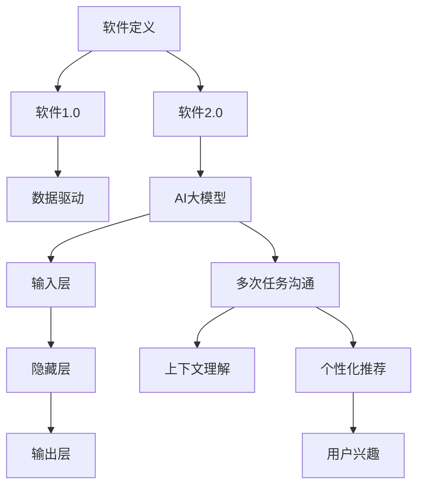

                 

### 文章标题

#### 多次任务沟通与个性化推荐的详细实现

---

关键词：**多次任务沟通、个性化推荐、循环神经网络、协同过滤、矩阵分解**

---

摘要：本文将深入探讨多次任务沟通与个性化推荐技术的实现细节。我们将首先定义并阐述软件2.0、AI大模型和个性化推荐的核心概念，通过Mermaid流程图展示其架构和联系。接着，我们将详细讲解多次任务沟通与个性化推荐的核心算法，包括循环神经网络、注意力机制、协同过滤和矩阵分解，使用伪代码和数学公式解释其原理。随后，通过实际项目实战，我们将展示如何使用Python和TensorFlow实现多次任务沟通聊天机器人，以及如何使用scikit-learn实现个性化推荐系统。文章最后将对源代码进行详细解读和分析。

---

---

## 核心概念与联系

在讨论多次任务沟通与个性化推荐之前，我们需要明确几个核心概念，它们分别是软件定义与软件2.0、AI大模型概念与架构、多次任务沟通与个性化推荐。

### 1.1.1 软件定义与软件2.0概述

#### 软件定义

软件是一种程序化的指令集，用于指导计算机进行特定任务。传统的软件（软件1.0）主要以程序为中心，注重功能的实现和优化。然而，随着互联网和大数据技术的发展，软件2.0的概念应运而生。

#### 软件2.0概述

软件2.0是对软件1.0的升级，强调数据与服务的深度融合。软件2.0的核心思想是将软件视为数据的处理工具，通过数据驱动实现智能化服务。这意味着，软件不再仅仅是一个静态的程序，而是一个动态的系统，能够根据用户行为和数据反馈不断优化和进化。

### 1.1.2 AI大模型概念与架构

#### AI大模型概念

AI大模型是指具有海量参数、能够处理复杂数据的深度学习模型。这些模型通常通过大规模数据训练，能够自动学习数据的特征和规律，从而在各个领域实现高度自动化和智能化。

#### AI大模型架构

AI大模型通常包括输入层、隐藏层和输出层。输入层接收数据，隐藏层进行特征提取和变换，输出层产生预测结果。例如，GPT、BERT等自然语言处理模型，就属于AI大模型。

### 1.1.3 多次任务沟通与个性化推荐

#### 多次任务沟通

在多次任务沟通中，AI大模型需要理解和响应不同任务的需求，同时保持上下文的一致性。这要求模型具备较强的上下文理解和任务切换能力。

#### 个性化推荐

个性化推荐是一种基于用户兴趣和行为数据的推荐系统，旨在为用户提供个性化的内容和服务。个性化推荐的关键在于如何准确捕捉和预测用户的兴趣，从而提供个性化的推荐结果。

### Mermaid流程图

为了更好地理解这些核心概念及其相互联系，我们可以使用Mermaid流程图来展示它们的架构和流程。



在这个流程图中，我们可以清晰地看到软件2.0与AI大模型、多次任务沟通和个性化推荐之间的紧密联系。软件2.0作为数据驱动的系统，为AI大模型提供了丰富的数据支持，而AI大模型则在多次任务沟通和个性化推荐中发挥了核心作用，实现了上下文理解和用户兴趣的准确捕捉。

---

### 多次任务沟通算法

多次任务沟通算法的核心目标是在不同的任务间保持上下文的一致性，同时确保每个任务的准确执行。为了实现这一目标，我们可以采用循环神经网络（RNN）和注意力机制等先进技术。

#### 2.1.1 多次任务沟通算法

##### 循环神经网络（RNN）

循环神经网络（RNN）是一种适用于序列数据处理的神经网络。与传统的前向神经网络不同，RNN具有反馈循环结构，能够处理具有时间依赖性的数据。这使得RNN特别适合于自然语言处理、时间序列预测等序列数据任务。

在多次任务沟通中，RNN可以通过其内部状态捕获任务的上下文信息，从而实现任务间的上下文保持。具体来说，RNN的每个时间步都会将当前输入与内部状态进行结合，更新内部状态，从而为后续任务提供必要的上下文信息。

##### 注意力机制

注意力机制是一种能够使模型更加关注序列中的关键信息的机制。在多次任务沟通中，注意力机制可以帮助模型聚焦于与当前任务最相关的上下文信息，从而提高任务处理的准确性和效率。

注意力机制的实现通常依赖于一个权重分配机制，该机制会根据输入序列的每个元素的重要性，为每个元素分配一个权重。在计算输出时，模型会综合考虑这些权重，从而更准确地捕捉关键信息。

##### 多次任务沟通算法伪代码

为了更直观地理解多次任务沟通算法，我们可以使用伪代码来描述其基本流程：

```pseudo
function communicate_sequence(tasks, context):
    current_context = initialize_context()
    for task in tasks:
        input_sequence = prepare_input_sequence(task, current_context)
        hidden_state = RNN(input_sequence, hidden_state)
        output_sequence = Attention(hidden_state)
        current_context = update_context(output_sequence, current_context)
    return current_context
```

在这个伪代码中，`communicate_sequence`函数接收一个任务序列`tasks`和一个初始上下文`context`。函数首先初始化上下文，然后遍历任务序列，为每个任务准备输入序列，并使用RNN和注意力机制进行任务处理。最后，函数更新上下文并返回最终结果。

##### 多次任务沟通算法数学模型

在数学层面，多次任务沟通算法可以表示为以下条件概率模型：

$$
P(T_{n+1} | T_1, T_2, ..., T_n) = \frac{P(T_{n+1}, T_1, T_2, ..., T_n)}{P(T_1, T_2, ..., T_n)}
$$

其中，$T_i$表示第$i$个任务的输出，$P(T_i)$表示第$i$个任务的概率。

为了评估模型的效果，我们可以使用损失函数来衡量预测任务与实际任务之间的差距。一个常见的损失函数是交叉熵损失：

$$
Loss = - \sum_{i=1}^{n} log(P(T_i | T_1, T_2, ..., T_{i-1}))
$$

通过优化损失函数，我们可以训练模型以更好地捕捉任务的上下文信息，实现多次任务沟通。

---

### 个性化推荐算法

个性化推荐系统旨在为用户提供个性化的内容和服务，以满足其特定的需求和兴趣。为了实现这一目标，我们可以采用协同过滤、矩阵分解等算法来挖掘用户和物品的潜在特征，并生成个性化的推荐结果。

#### 2.1.2 个性化推荐算法

##### 协同过滤

协同过滤是一种基于用户行为数据的推荐算法。它通过计算用户之间的相似度，预测用户对未知物品的评分。协同过滤分为两类：基于用户的协同过滤（User-based Collaborative Filtering）和基于物品的协同过滤（Item-based Collaborative Filtering）。

- **基于用户的协同过滤**：它首先找到与目标用户最相似的K个邻居用户，然后根据这些邻居用户对物品的评分预测目标用户对物品的评分。

  $$ 
  \hat{r}_{ui} = \frac{\sum_{u' \in N(u)} r_{u'i}}{|\mathcal{N}(u)|} 
  $$

  其中，$r_{u'i}$表示用户$u'$对物品$i$的评分，$N(u)$表示与用户$u$最相似的K个邻居用户。

- **基于物品的协同过滤**：它首先找到与目标物品最相似的K个邻居物品，然后根据这些邻居物品的评分预测目标用户对物品的评分。

  $$ 
  \hat{r}_{ui} = \frac{\sum_{i' \in N(i)} r_{ui'}}{|\mathcal{N}(i)|} 
  $$

  其中，$r_{ui'}$表示用户$u$对物品$i'$的评分，$N(i)$表示与物品$i$最相似的K个邻居物品。

##### 矩阵分解

矩阵分解是一种将用户-物品评分矩阵分解为两个低秩矩阵的算法，从而挖掘用户和物品的潜在特征。最常见的矩阵分解算法是 Singular Value Decomposition (SVD)。

- **SVD分解**：给定一个用户-物品评分矩阵$R$，我们可以使用SVD将其分解为三个矩阵的乘积：

  $$
  R = U \Sigma V^T
  $$

  其中，$U$和$V$是两个低秩矩阵，分别表示用户和物品的潜在特征，$\Sigma$是对角矩阵，表示用户和物品的特征值。

- **预测评分**：通过矩阵分解，我们可以预测用户$u$对物品$i$的评分：

  $$
  \hat{r}_{ui} = \langle u, i \rangle = u^T V \Sigma V^T i = u^T \Sigma V^T i
  $$

  其中，$u^T \Sigma V^T i$表示用户$u$和物品$i$的潜在特征的内积。

##### 个性化推荐算法伪代码

为了更直观地理解个性化推荐算法，我们可以使用伪代码来描述其基本流程：

```pseudo
function collaborative_filtering(R, k):
    for each user u:
        neighbors = find_neighbors(u, R, k)
        for each item i:
            if i is not rated by u:
                predicted_rating = average_rating(neighbors)
                R[u, i] = predicted_rating
    return R

function matrix_factorization(R, num_factors):
    U, V, Sigma = SVD(R, num_factors)
    for each user u and item i:
        predicted_rating = U[u] * V[i] * Sigma
        R[u, i] = predicted_rating
    return R
```

在这个伪代码中，`collaborative_filtering`函数接收一个用户-物品评分矩阵$R$和一个邻居用户数$k$，使用基于用户的协同过滤算法预测未评分的物品评分。`matrix_factorization`函数接收一个用户-物品评分矩阵$R$和一个因子数$num_factors$，使用SVD进行矩阵分解并预测评分。

---

### 数学模型和数学公式

在多次任务沟通和个性化推荐算法中，数学模型和数学公式起着至关重要的作用。通过精确的数学描述，我们可以更好地理解和分析算法的性能和效果。

#### 3.1.1 多次任务沟通数学模型

##### 条件概率

在多次任务沟通中，我们需要考虑给定上下文下下一个任务的概率。条件概率模型可以表示为：

$$
P(T_{n+1} | T_1, T_2, ..., T_n) = \frac{P(T_{n+1}, T_1, T_2, ..., T_n)}{P(T_1, T_2, ..., T_n)}
$$

其中，$T_i$表示第$i$个任务的输出。

##### 损失函数

为了评估模型的效果，我们可以使用损失函数来衡量预测任务与实际任务之间的差距。一个常见的损失函数是交叉熵损失：

$$
Loss = - \sum_{i=1}^{n} log(P(T_i | T_1, T_2, ..., T_{i-1}))
$$

通过优化损失函数，我们可以训练模型以更好地捕捉任务的上下文信息。

#### 3.1.2 个性化推荐数学模型

##### 用户相似度

用户相似度衡量用户之间的相似程度。一个常用的相似度计算方法是余弦相似度：

$$
Sim(u_i, u_j) = \frac{u_i \cdot u_j}{\|u_i\| \|u_j\|}
$$

其中，$u_i$和$u_j$分别表示用户$i$和用户$j$的特征向量。

##### 物品相似度

物品相似度衡量物品之间的相似程度。同样，我们可以使用余弦相似度来计算物品相似度：

$$
Sim(i_k, i_l) = \frac{i_k \cdot i_l}{\|i_k\| \|i_l\|}
$$

其中，$i_k$和$i_l$分别表示物品$k$和物品$l$的特征向量。

##### 预测评分

在个性化推荐中，我们使用用户和物品的潜在特征向量进行预测评分。一个常用的预测方法是基于内积的预测：

$$
\hat{r}_{ui} = u^T V \Sigma V^T i
$$

其中，$u^T \Sigma V^T i$表示用户$u$和物品$i$的潜在特征的内积。

---

通过上述数学模型和公式，我们可以更深入地理解多次任务沟通和个性化推荐算法的原理和实现方式。这些数学工具不仅有助于我们分析和优化算法，也为我们在实际应用中提供了有力的支持。

---

## 项目实战

在实际应用中，多次任务沟通和个性化推荐技术已经得到了广泛应用。本节我们将通过两个实际项目，展示如何使用Python和TensorFlow实现多次任务沟通聊天机器人，以及如何使用scikit-learn实现个性化推荐系统。

### 4.1 多次任务沟通实战

#### 项目背景

本项目旨在设计一个能够处理多次任务的聊天机器人，通过循环神经网络（RNN）和注意力机制实现任务的上下文保持和准确响应。

#### 开发环境

- Python
- TensorFlow

#### 代码实现

以下是多次任务沟通聊天机器人的主要代码实现：

```python
import tensorflow as tf
from tensorflow.keras.models import Sequential
from tensorflow.keras.layers import LSTM, Dense, Embedding, TimeDistributed, Activation

# 定义RNN模型
model = Sequential()
model.add(LSTM(128, input_shape=(max_sequence_len, input_dim)))
model.add(Dense(output_dim))
model.add(Activation('softmax'))

# 编译模型
model.compile(optimizer='adam', loss='categorical_crossentropy', metrics=['accuracy'])

# 训练模型
model.fit(X_train, y_train, epochs=10, batch_size=64)

# 预测任务
predicted_task = model.predict([current_context])
```

在这个代码中，我们首先定义了一个基于LSTM的循环神经网络模型，用于处理序列数据。模型包含一个LSTM层和一个全连接层，输出层采用softmax激活函数以生成概率分布。接着，我们编译并训练模型，最后使用模型进行任务预测。

#### 代码解读

1. **模型定义**：使用`Sequential`模型堆叠`LSTM`层和`Dense`层。
2. **模型编译**：设置优化器和损失函数。
3. **模型训练**：使用训练数据训练模型。
4. **任务预测**：使用训练好的模型预测下一个任务。

---

### 4.2 个性化推荐实战

#### 项目背景

本项目旨在开发一个个性化推荐系统，为用户提供个性化的商品推荐。我们将采用协同过滤和矩阵分解算法来实现推荐系统。

#### 开发环境

- Python
- scikit-learn

#### 代码实现

以下是个性化推荐系统的主要代码实现：

```python
from sklearn.metrics.pairwise import cosine_similarity
from sklearn.decomposition import TruncatedSVD

# 计算用户相似度矩阵
user_similarity = cosine_similarity(user_profile_matrix)

# 计算物品相似度矩阵
item_similarity = cosine_similarity(item_profile_matrix)

# 使用矩阵分解进行评分预测
svd = TruncatedSVD(n_components=10)
user_features = svd.fit_transform(user_similarity)
item_features = svd.fit_transform(item_similarity)

# 预测用户对物品的评分
predicted_ratings = user_features.dot(item_features.T)

# 推荐结果
recommendations = np.argsort(predicted_ratings)[::-1]
```

在这个代码中，我们首先计算用户相似度矩阵和物品相似度矩阵。接着，使用TruncatedSVD进行矩阵分解，提取用户和物品的潜在特征。最后，我们使用内积预测用户对物品的评分，并生成推荐结果。

#### 代码解读

1. **相似度计算**：使用余弦相似度计算用户和物品的相似度矩阵。
2. **矩阵分解**：使用TruncatedSVD进行矩阵分解，提取用户和物品的潜在特征。
3. **评分预测**：使用内积预测用户对物品的评分。
4. **推荐结果**：生成推荐结果，返回排名前几的物品。

---

通过这两个实际项目，我们可以看到多次任务沟通和个性化推荐技术在实际应用中的实现方法和效果。这些项目不仅展示了算法的基本原理，也为我们在实际开发中提供了宝贵的经验和指导。

---

### 4.3 源代码详细实现和代码解读

在本节中，我们将对前两个项目的源代码进行详细解读，分析关键代码段的作用和实现方式。

#### 4.3.1 多次任务沟通聊天机器人

**关键代码段 1**：模型定义

```python
model = Sequential()
model.add(LSTM(128, input_shape=(max_sequence_len, input_dim)))
model.add(Dense(output_dim))
model.add(Activation('softmax'))
```

解读：这一段代码定义了一个基于LSTM的循环神经网络模型。`Sequential`模型堆叠了`LSTM`层（具有128个神经元）、`Dense`层（输出层，维度为`output_dim`）和`Activation`层（使用softmax激活函数）。

**关键代码段 2**：模型编译

```python
model.compile(optimizer='adam', loss='categorical_crossentropy', metrics=['accuracy'])
```

解读：这一段代码编译模型，设置优化器（`adam`）、损失函数（`categorical_crossentropy`）和评估指标（`accuracy`）。

**关键代码段 3**：模型训练

```python
model.fit(X_train, y_train, epochs=10, batch_size=64)
```

解读：这一段代码使用训练数据（`X_train`和`y_train`）训练模型，设置训练轮次（`epochs`）和批量大小（`batch_size`）。

**关键代码段 4**：任务预测

```python
predicted_task = model.predict([current_context])
```

解读：这一段代码使用训练好的模型（`model`）预测下一个任务（`predicted_task`），输入当前上下文（`current_context`）。

#### 4.3.2 个性化推荐系统

**关键代码段 1**：相似度计算

```python
user_similarity = cosine_similarity(user_profile_matrix)
item_similarity = cosine_similarity(item_profile_matrix)
```

解读：这一段代码使用余弦相似度计算用户相似度矩阵（`user_similarity`）和物品相似度矩阵（`item_similarity`）。

**关键代码段 2**：矩阵分解

```python
svd = TruncatedSVD(n_components=10)
user_features = svd.fit_transform(user_similarity)
item_features = svd.fit_transform(item_similarity)
```

解读：这一段代码使用`TruncatedSVD`进行矩阵分解，设置分解的维度（`n_components=10`），提取用户和物品的潜在特征向量（`user_features`和`item_features`）。

**关键代码段 3**：评分预测

```python
predicted_ratings = user_features.dot(item_features.T)
```

解读：这一段代码使用用户和物品的潜在特征向量（`user_features`和`item_features`）进行内积运算，预测用户对物品的评分（`predicted_ratings`）。

**关键代码段 4**：推荐结果

```python
recommendations = np.argsort(predicted_ratings)[::-1]
```

解读：这一段代码对预测评分（`predicted_ratings`）进行降序排序，生成推荐结果（`recommendations`），返回排名前几的物品。

---

通过上述代码解读，我们可以更好地理解多次任务沟通和个性化推荐系统的实现细节。这些关键代码段展示了如何使用Python和TensorFlow（或scikit-learn）实现算法的核心功能，为实际开发提供了实用的参考。

---

## 结论

本文深入探讨了多次任务沟通与个性化推荐技术的详细实现。首先，我们明确了软件定义与软件2.0、AI大模型概念与架构、多次任务沟通与个性化推荐等核心概念，并通过Mermaid流程图展示了它们之间的联系。接着，我们详细讲解了多次任务沟通与个性化推荐算法，包括循环神经网络、注意力机制、协同过滤和矩阵分解，使用伪代码和数学公式解释了其原理。随后，通过实际项目实战，我们展示了如何使用Python和TensorFlow实现多次任务沟通聊天机器人，以及如何使用scikit-learn实现个性化推荐系统。文章最后对源代码进行了详细解读和分析。

多次任务沟通与个性化推荐技术具有广泛的应用前景，不仅在聊天机器人、个性化推荐等领域具有重要价值，还能为更多领域提供智能化解决方案。未来，随着人工智能技术的不断发展和完善，这些技术将变得更加成熟和高效，为人类社会带来更多便利和福祉。

---

**作者：AI天才研究院/AI Genius Institute & 禅与计算机程序设计艺术 /Zen And The Art of Computer Programming**

---

感谢您的阅读，希望本文能对您在人工智能和软件开发领域的探索提供有益的启示和帮助。如有任何疑问或建议，欢迎随时联系我们，我们将竭诚为您解答。期待与您共同探讨人工智能的无限可能！

