                 

# 大数据与AI学习的关系

> 关键词：大数据、人工智能、机器学习、深度学习、数据挖掘

> 摘要：本文将探讨大数据与人工智能（AI）之间的紧密联系，通过逻辑分析逐步深入探讨大数据对AI学习的影响、AI在大数据环境中的应用，以及二者融合所带来的变革。文章结构清晰，包含对大数据与AI基础概念的介绍、数据处理技术的阐述、AI技术的基础理论，以及大数据与AI在各个领域中的应用和未来发展趋势。旨在为读者提供一个全面、深入的大数据与AI学习关系解析。

## 目录

### 《大数据与AI学习的关系》目录

## 第一部分：大数据与AI概述

### 第1章：大数据与AI的基础概念

#### 1.1 大数据的定义与特点

#### 1.2 AI的定义与发展历程

#### 1.3 大数据与AI的关系

### 第2章：大数据处理技术

#### 2.1 数据采集与存储

#### 2.2 数据清洗与预处理

#### 2.3 数据分析与挖掘

### 第3章：AI技术基础

#### 3.1 机器学习基础

#### 3.2 深度学习原理

#### 3.3 AI模型训练与优化

## 第二部分：大数据与AI融合应用

### 第4章：大数据与AI在金融领域的应用

#### 4.1 金融风控

#### 4.2 金融市场预测

### 第5章：大数据与AI在医疗领域的应用

#### 5.1 医疗数据分析

#### 5.2 智能医疗诊断

### 第6章：大数据与AI在交通领域的应用

#### 6.1 交通流量预测

#### 6.2 自动驾驶技术

### 第7章：大数据与AI在零售领域的应用

#### 7.1 个性化推荐系统

#### 7.2 零售数据挖掘

### 第8章：大数据与AI的未来发展趋势

#### 8.1 AI技术的发展趋势

#### 8.2 大数据应用前景

### 附录

#### 附录A：大数据与AI工具与资源

## 第一部分：大数据与AI概述

### 第1章：大数据与AI的基础概念

#### 1.1 大数据的定义与特点

大数据（Big Data）是指无法使用传统数据处理工具在合理时间内对大量数据进行存储、管理和分析的数据集合。其具有如下四个主要特点，通常被称为“4V”：

- **Volume（体量）**：大数据的体量巨大，涉及的数据量超过传统数据库的处理能力。
- **Velocity（速度）**：大数据的处理速度要求极高，需要实时或近实时地进行数据处理和分析。
- **Variety（多样性）**：大数据来源广泛，格式多样，包括结构化数据、半结构化数据和非结构化数据。
- **Value（价值）**：大数据蕴含着巨大的潜在价值，但同时也带来了数据处理的挑战。

**Mermaid 流程图**：

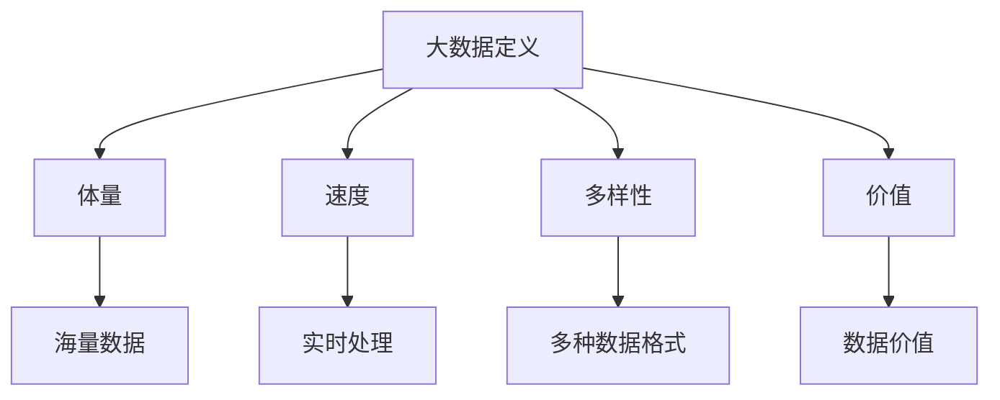

#### 1.2 AI的定义与发展历程

人工智能（AI，Artificial Intelligence）是指通过计算机程序和算法实现人类智能行为的科学。AI的发展历程大致可以分为以下几个阶段：

- **符号主义阶段**：以规则和符号为基础，通过形式逻辑推理进行问题求解。
- **连接主义阶段**：以神经网络为基础，通过大量数据训练模型实现智能行为。
- **知识工程阶段**：通过构建知识库和推理机，模拟人类的决策过程。
- **机器学习阶段**：以算法和统计模型为基础，通过数据驱动实现智能行为。

**Mermaid 流程图**：

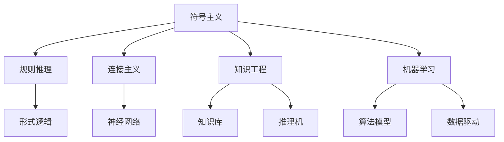

#### 1.3 大数据与AI的关系

大数据为AI的发展提供了坚实的基础，二者相辅相成。大数据的特点决定了AI的发展方向和应用场景：

- **大数据对AI的影响**：大数据的体量和多样性为AI算法提供了丰富的训练数据，提高了模型的准确性和泛化能力；大数据的实时性要求推动了AI算法的实时处理和优化。
- **AI在大数据时代的应用**：AI算法在大数据处理中发挥着重要作用，包括数据预处理、特征提取、模式识别等；AI技术在数据分析和挖掘中，如机器学习、深度学习等，为大数据价值的挖掘提供了强大工具。

**Mermaid 流程图**：

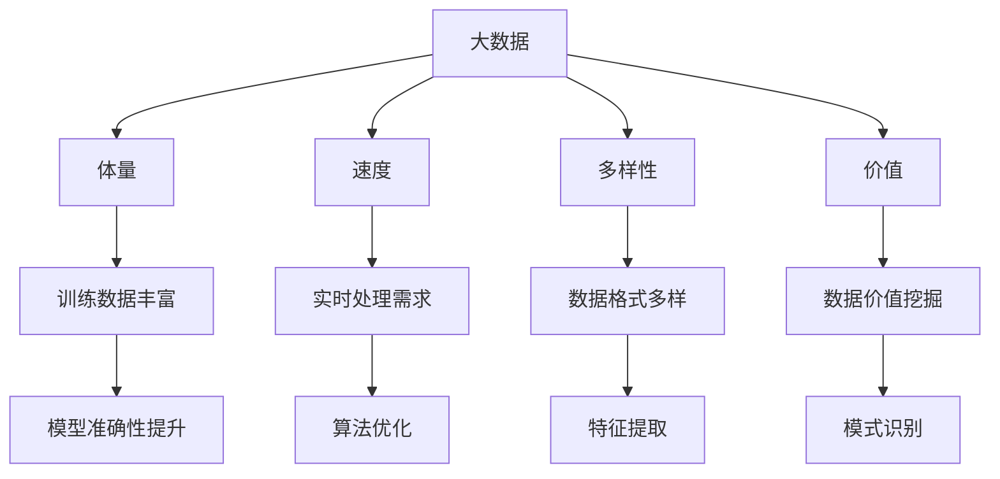

### 第2章：大数据处理技术

#### 2.1 数据采集与存储

数据采集是大数据处理的第一步，涉及数据的来源、类型和采集方法。常见的数据采集技术包括：

- **网络爬虫**：通过爬取互联网上的公开数据，如网页、社交媒体等。
- **物联网设备**：通过物联网设备采集环境、设备运行状态等数据。
- **数据库**：通过连接数据库获取结构化数据。

数据存储则需要满足大数据的4V特点，常见的技术有：

- **关系型数据库**：如MySQL、PostgreSQL等，适用于结构化数据存储。
- **NoSQL数据库**：如MongoDB、Cassandra等，适用于半结构化和非结构化数据存储。
- **分布式存储系统**：如Hadoop Distributed File System（HDFS）、Ceph等，适用于大规模数据的分布式存储。

**Mermaid 流程图**：

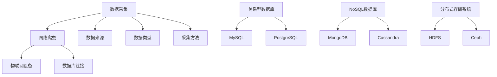

#### 2.2 数据清洗与预处理

数据清洗与预处理是大数据处理的关键步骤，涉及数据质量评估、异常值处理、缺失值填补和数据格式转换等。数据清洗与预处理的常见方法包括：

- **异常值处理**：通过统计分析和可视化方法检测并处理数据中的异常值。
- **缺失值填补**：通过插补方法（如均值插补、中值插补等）填补数据中的缺失值。
- **数据格式转换**：通过数据转换方法（如数据标准化、归一化等）将数据格式转换为适合分析的格式。

**伪代码**：

```python
def data_cleaning(data):
    # 检测并处理异常值
    for record in data:
        if is_anomaly(record):
            remove_anomaly(record)
    
    # 填补缺失值
    for record in data:
        if has_missing_values(record):
            fill_missing_values(record)
    
    # 数据格式转换
    for record in data:
        convert_format(record)
    
    return cleaned_data
```

#### 2.3 数据分析与挖掘

数据分析与挖掘是大数据处理的核心步骤，涉及数据探索性分析、特征工程、模型选择和评估等。数据分析与挖掘的常见方法包括：

- **数据探索性分析**：通过统计分析、可视化等方法对数据的基本特征和分布进行初步分析。
- **特征工程**：通过特征提取、特征选择等方法，从原始数据中提取出对分析任务有帮助的特征。
- **模型选择与评估**：通过选择合适的机器学习算法和评估方法，对数据进行分析和预测。

**Mermaid 流weise**：

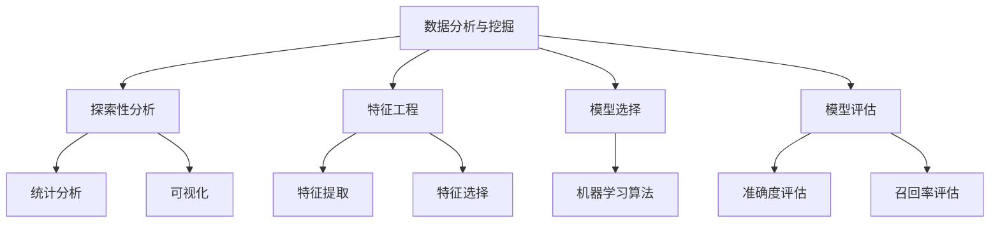

### 第3章：AI技术基础

#### 3.1 机器学习基础

机器学习（Machine Learning）是AI的核心组成部分，通过算法和统计模型，使计算机能够从数据中学习并做出决策。机器学习的基本概念包括：

- **监督学习**：通过已知标签的数据进行训练，使模型能够预测未知数据的标签。
- **无监督学习**：在没有标签的数据上进行训练，使模型能够发现数据的内在结构和模式。
- **强化学习**：通过与环境互动，使模型能够学会做出最优决策。

**Mermaid 流程图**：

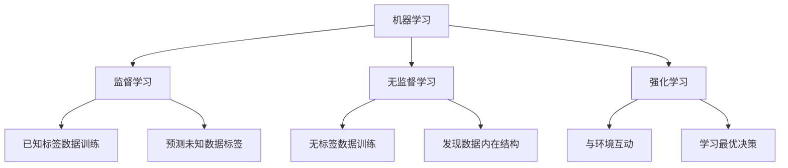

#### 3.2 深度学习原理

深度学习（Deep Learning）是机器学习的一个重要分支，通过多层神经网络（Neural Networks）对数据进行建模和分析。深度学习的基本概念包括：

- **神经网络**：由多个神经元组成的网络，通过前向传播和反向传播算法进行数据建模。
- **深度神经网络**：由多层神经网络组成的网络，能够更好地捕捉数据的复杂结构。
- **激活函数**：用于引入非线性特性，使神经网络能够学习复杂的函数关系。

**Mermaid 流程图**：

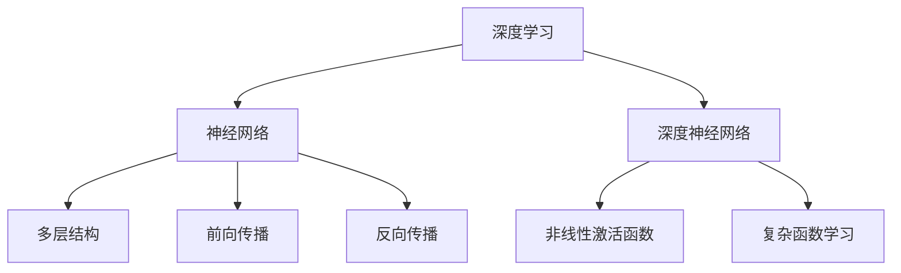

#### 3.3 AI模型训练与优化

AI模型的训练与优化是大数据与AI融合应用的重要环节。模型训练包括以下几个步骤：

- **数据准备**：对训练数据进行预处理，包括数据清洗、归一化等。
- **模型选择**：根据问题特点选择合适的机器学习算法和模型架构。
- **模型训练**：通过训练数据训练模型，调整模型参数。
- **模型评估**：通过验证集和测试集评估模型性能。

模型优化包括以下几个方面：

- **超参数调整**：通过调整模型的超参数，如学习率、正则化参数等，优化模型性能。
- **模型集成**：通过集成多个模型，提高模型的预测准确性和稳定性。
- **模型压缩**：通过模型压缩技术，降低模型的复杂度和计算成本。

**伪代码**：

```python
def train_model(data, model):
    # 数据准备
    prepared_data = preprocess_data(data)
    
    # 模型训练
    model.train(prepared_data)
    
    # 模型评估
    performance = model.evaluate(test_data)
    
    # 模型优化
    optimized_model = optimize_model(model, performance)
    
    return optimized_model
```

### 第二部分：大数据与AI融合应用

#### 第4章：大数据与AI在金融领域的应用

#### 4.1 金融风控

金融风控是金融领域的重要应用，通过大数据与AI技术，可以对金融机构的风险进行有效管理和控制。金融风控的主要任务包括：

- **信用评估**：通过大数据和AI技术，对客户的信用情况进行评估，降低信用风险。
- **欺诈检测**：通过大数据和AI技术，对交易行为进行实时监测，识别潜在的欺诈行为。
- **风险预警**：通过大数据分析，对市场风险和信用风险进行预警，帮助金融机构及时采取应对措施。

**Mermaid 流程图**：

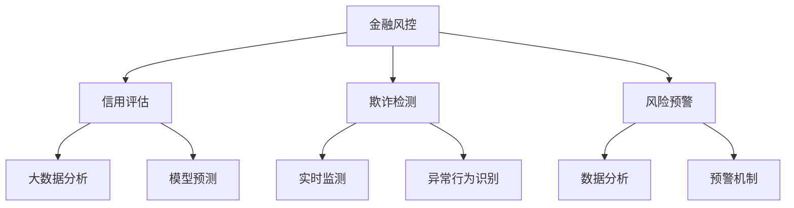

#### 4.2 金融市场预测

金融市场预测是大数据与AI技术在金融领域的另一个重要应用，通过对历史数据和实时数据的分析，预测金融市场的走势，为投资者提供决策支持。金融市场预测的主要任务包括：

- **股票市场预测**：通过大数据和AI技术，对股票市场的走势进行预测，帮助投资者制定投资策略。
- **期货市场预测**：通过大数据和AI技术，对期货市场的价格波动进行预测，帮助投资者进行套利和风险控制。

**Mermaid 流程图**：

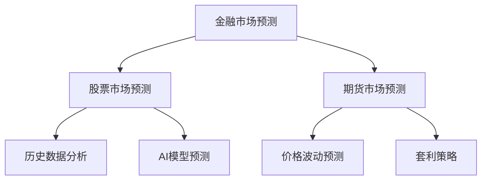

#### 第5章：大数据与AI在医疗领域的应用

#### 5.1 医疗数据分析

医疗数据分析是大数据与AI技术在医疗领域的重要应用，通过对大量医疗数据的分析，可以提取出有价值的信息，提高医疗服务的质量和效率。医疗数据分析的主要任务包括：

- **患者数据分析**：通过对患者数据的分析，了解患者的健康状况和疾病趋势，为疾病预防和治疗提供依据。
- **医学影像分析**：通过对医学影像的分析，辅助医生进行诊断和治疗。

**Mermaid 流程图**：

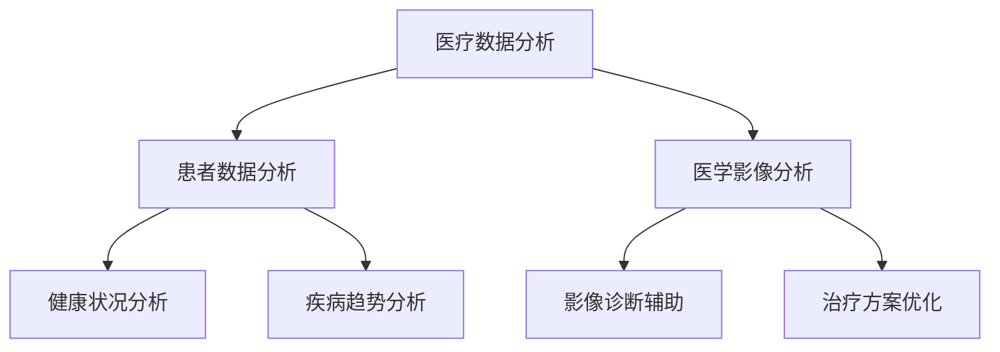

#### 5.2 智能医疗诊断

智能医疗诊断是大数据与AI技术在医疗领域的另一个重要应用，通过深度学习和自然语言处理等技术，可以辅助医生进行疾病诊断。智能医疗诊断的主要任务包括：

- **医学文本分析**：通过对医学文本的分析，提取出有价值的医学信息，辅助医生进行诊断。
- **医学图像识别**：通过对医学图像的分析，识别出疾病的相关特征，辅助医生进行诊断。

**Mermaid 流程图**：

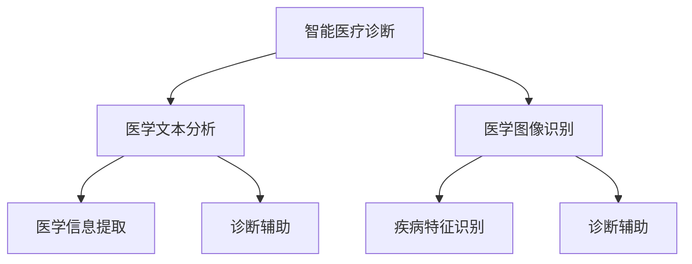

#### 第6章：大数据与AI在交通领域的应用

#### 6.1 交通流量预测

交通流量预测是大数据与AI技术在交通领域的重要应用，通过对历史交通数据和实时交通数据的分析，可以预测未来某个时间点的交通流量，为交通管理和规划提供依据。交通流量预测的主要任务包括：

- **交通数据分析**：通过对交通数据的分析，了解交通状况和流量分布。
- **流量预测模型**：通过机器学习和深度学习算法，建立交通流量预测模型。

**Mermaid 流程图**：

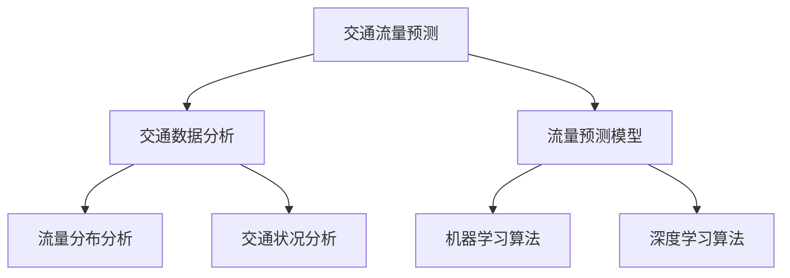

#### 6.2 自动驾驶技术

自动驾驶技术是大数据与AI技术在交通领域的另一个重要应用，通过传感器、摄像头等设备收集环境数据，利用深度学习和强化学习等技术，实现汽车的自主驾驶。自动驾驶技术的主要任务包括：

- **环境感知**：通过传感器和摄像头收集环境数据，实现对周围环境的感知和理解。
- **路径规划**：通过机器学习和深度学习算法，实现车辆的路径规划，避开障碍物和规划最优路径。

**Mermaid 流程图**：

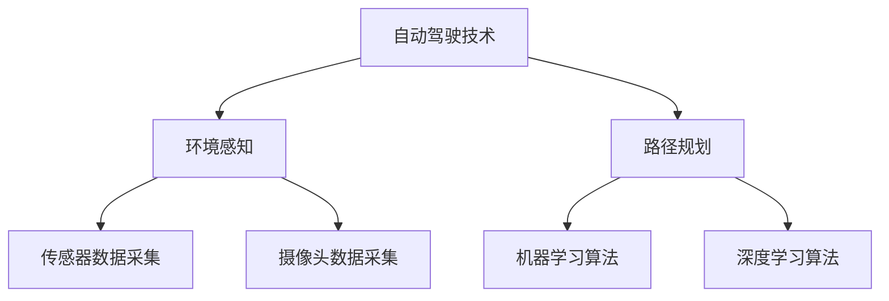

#### 第7章：大数据与AI在零售领域的应用

#### 7.1 个性化推荐系统

个性化推荐系统是大数据与AI技术在零售领域的重要应用，通过对用户行为数据的分析，为用户提供个性化的商品推荐。个性化推荐系统的主要任务包括：

- **用户行为分析**：通过对用户行为数据的分析，了解用户的喜好和购买习惯。
- **推荐算法**：通过机器学习和深度学习算法，建立推荐模型，为用户推荐合适的商品。

**Mermaid 流程图**：

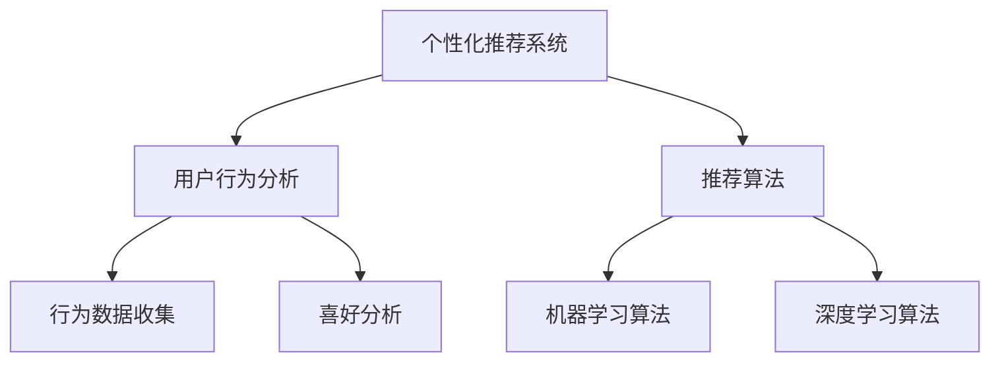

#### 7.2 零售数据挖掘

零售数据挖掘是大数据与AI技术在零售领域的重要应用，通过对零售数据的分析，提取出有价值的信息，帮助零售企业优化经营策略和提升销售业绩。零售数据挖掘的主要任务包括：

- **销售数据分析**：通过对销售数据的分析，了解销售趋势和销售业绩。
- **库存管理**：通过对库存数据的分析，优化库存管理，降低库存成本。

**Mermaid 流程图**：

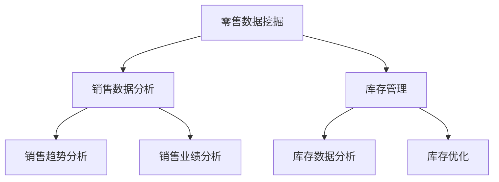

### 第8章：大数据与AI的未来发展趋势

#### 8.1 AI技术的发展趋势

AI技术在未来将继续快速发展，深度学习、强化学习等传统算法将不断完善，同时新兴的AI技术，如生成对抗网络（GAN）、迁移学习、联邦学习等，也将不断涌现。AI技术的发展趋势将呈现以下特点：

- **算法优化**：通过对现有算法的优化，提高模型的性能和效率。
- **模型压缩**：通过模型压缩技术，降低模型的复杂度和计算成本。
- **跨领域应用**：AI技术将逐渐从单一领域扩展到多个领域，实现跨领域应用。

**Mermaid 流程图**：

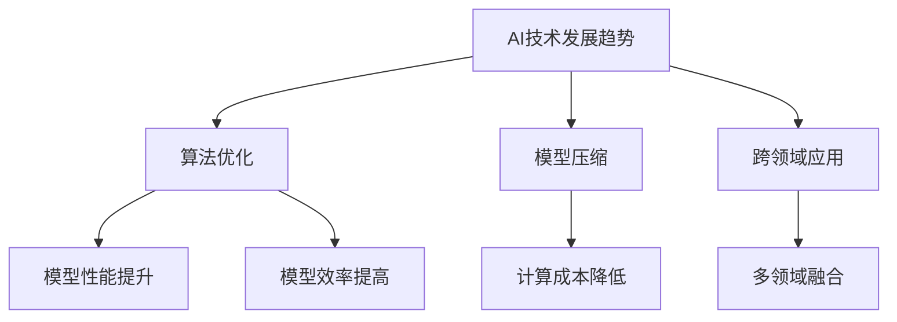

#### 8.2 大数据应用前景

大数据在未来将继续发挥重要作用，随着数据源的不断扩展和数据采集技术的进步，大数据应用将不断深入。大数据应用的前景包括：

- **行业应用**：大数据将在医疗、金融、零售、交通等领域发挥重要作用，推动行业的发展和变革。
- **政府治理**：大数据技术将助力政府提升治理能力，实现精细化管理和智能化决策。
- **社会服务**：大数据技术将提升社会服务的质量和效率，如智慧城市、智慧医疗等。

**Mermaid 流程图**：

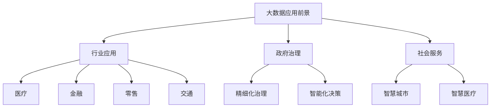

### 附录

#### 附录A：大数据与AI工具与资源

**A.1 大数据工具**

- **Hadoop**：一个分布式数据存储和处理框架，适用于大规模数据的存储和处理。
- **Spark**：一个快速的分布式计算框架，适用于大规模数据的快速处理和分析。

**A.2 AI工具**

- **TensorFlow**：一个开源的机器学习框架，适用于构建和训练各种机器学习模型。
- **PyTorch**：一个开源的机器学习框架，适用于构建和训练深度学习模型。

**A.3 实践项目案例**

- **金融风控项目**：通过大数据和AI技术，实现金融机构的信用评估和欺诈检测。
- **医疗数据分析项目**：通过大数据和AI技术，实现医疗数据的分析和智能诊断。
- **自动驾驶项目**：通过大数据和AI技术，实现自动驾驶汽车的路径规划和环境感知。
- **零售个性化推荐项目**：通过大数据和AI技术，实现零售商的个性化推荐系统。

**A.4 学习资源**

- **相关书籍推荐**：如《深度学习》、《Python数据分析基础》等。
- **在线课程与教程**：如Coursera、edX等在线教育平台上的相关课程。
- **论文与研究报告**：如arXiv、ACM、IEEE等学术期刊上的最新论文和研究报告。

### 作者

作者：AI天才研究院/AI Genius Institute & 禅与计算机程序设计艺术 /Zen And The Art of Computer Programming

