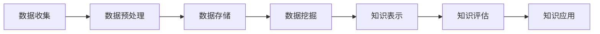

                 

### 大数据与知识发现：挖掘信息金矿的新方法

> 关键词：大数据、知识发现、关联规则挖掘、数据挖掘算法、商业智能应用、智能投顾、智慧城市

> 摘要：本文将深入探讨大数据与知识发现的关系，以及如何利用知识发现技术从海量数据中挖掘出有价值的信息。我们将详细讲解大数据的定义、特征、处理技术和应用场景，并介绍知识发现的基本概念、关键技术和实际应用案例。通过本文，读者将了解大数据与知识发现技术的核心原理、前沿发展和未来趋势，为实际应用提供有力支持。

#### 第一部分：大数据概述与背景

在当今信息化社会，数据已经成为一种重要的资源，大数据技术的出现为数据处理和分析带来了新的可能性。本部分将首先介绍大数据的概念与特征，然后探讨大数据与信息化社会的关系。

##### 1.1 大数据的定义

大数据（Big Data）是指无法使用传统数据处理工具在合理时间内捕捉、管理和处理的数据集。它具有海量（Volume）、高速（Velocity）、多样（Variety）和低价值密度（Veracity）等特点。

- 海量：数据规模庞大，达到TB级别甚至PB级别。
- 高速：数据产生和流动的速度极快。
- 多样：数据来源广泛，包括结构化数据、半结构化数据和非结构化数据。
- 低价值密度：数据中有价值的信息占比很小，需要通过分析才能发现。

##### 1.2 大数据的“4V”特征

大数据的“4V”特征决定了其与传统数据处理方式的显著差异。

- **Volume（海量）**：大数据的规模通常非常庞大，传统数据库系统难以存储和处理。为了解决这个问题，分布式存储系统（如Hadoop）和分布式计算框架（如Spark）应运而生。
- **Velocity（高速）**：大数据的产生和流动速度极快，要求数据处理系统具备实时处理能力。这推动了流处理技术的发展，如Apache Kafka和Apache Flink。
- **Variety（多样）**：大数据的类型丰富，包括文本、图像、音频、视频等多种形式，这使得数据处理和分析变得更加复杂。
- **Veracity（低价值密度）**：大数据中的价值信息占比很小，需要通过高效的数据挖掘和分析技术来发现。

##### 1.3 大数据与信息化社会的关系

大数据技术的快速发展与信息化社会的需求密不可分。信息化社会的特征包括数据驱动、实时性和智能化。大数据技术为这些特征提供了强有力的支持。

- **数据驱动**：大数据技术使得企业能够从海量数据中提取有价值的信息，从而支持数据驱动决策。
- **实时性**：实时数据处理技术的发展，使得企业能够对市场变化做出快速响应。
- **智能化**：通过机器学习和人工智能技术，大数据能够实现智能化分析和预测。

#### 第二部分：大数据处理技术

大数据处理技术是大数据领域的重要组成部分，涵盖了数据采集与预处理、数据存储与管理以及大数据计算框架等方面。本部分将详细介绍这些技术。

##### 2.1 数据采集与预处理

数据采集是大数据处理的第一步，主要包括以下方面：

- **数据源**：数据来源广泛，包括社交媒体、传感器、交易记录等。
- **数据采集技术**：通过网络爬虫、API接口、数据库连接等方式获取数据。
- **数据预处理技术**：包括数据清洗、数据转换和数据集成。数据清洗的目的是去除噪声数据和错误数据，提高数据质量。

##### 2.2 数据存储与管理

大数据的存储与管理是数据处理的另一个关键环节，主要包括以下方面：

- **分布式存储系统**：如Hadoop Distributed File System（HDFS）和Apache Cassandra，能够处理海量数据的存储和访问。
- **数据仓库与数据湖**：数据仓库主要用于结构化数据的存储和管理，而数据湖则用于存储各种类型的数据，包括结构化、半结构化和非结构化数据。
- **数据管理策略**：包括数据备份、数据恢复和数据安全等，确保数据的安全和可靠性。

##### 2.3 大数据计算框架

大数据计算框架是大数据处理的核心，能够高效地处理海量数据。目前主流的大数据计算框架包括Hadoop、Spark和Flink等。

- **Hadoop**：由Apache Software Foundation维护，包括Hadoop分布式文件系统（HDFS）、Hadoop YARN和Hadoop MapReduce等组件。
- **Spark**：基于内存计算，能够提供更高的计算速度和更灵活的数据处理能力。
- **Flink**：具有流处理和批处理能力，能够实时处理数据。

#### 第三部分：知识发现技术

知识发现（Knowledge Discovery in Databases，KDD）是大数据处理的重要环节，旨在从海量数据中挖掘出有价值的信息。本部分将详细介绍知识发现的基本概念、关键技术和应用领域。

##### 3.1 知识发现的基本概念

知识发现是指从大量数据中提取出有价值的信息和知识的过程。知识发现的过程通常包括以下几个步骤：

1. **数据预处理**：清洗和转换原始数据，使其适合进一步分析。
2. **数据挖掘**：使用各种数据挖掘算法对预处理后的数据进行分析，发现潜在的模式和关联。
3. **模式评估**：对挖掘出的模式进行评估，确定其是否具有实际应用价值。
4. **知识表示**：将挖掘出的知识以易于理解的形式表示，如规则、图形或表格。
5. **知识应用**：将挖掘出的知识应用于实际问题和决策。

##### 3.2 知识发现的过程

知识发现的过程是一个迭代和逐步优化的过程，包括以下几个关键步骤：

1. **业务理解**：明确知识发现的目标和应用场景，确定数据需求和问题定义。
2. **数据选择**：根据业务需求选择合适的数据源和数据集。
3. **数据预处理**：对数据集进行清洗、转换和集成，提高数据质量。
4. **数据挖掘**：选择合适的数据挖掘算法对预处理后的数据进行分析，发现潜在的模式和关联。
5. **模式评估**：对挖掘出的模式进行评估，确定其是否具有实际应用价值。
6. **知识表示**：将挖掘出的知识以易于理解的形式表示，如规则、图形或表格。
7. **知识应用**：将挖掘出的知识应用于实际问题和决策。

##### 3.3 知识发现的关键技术

知识发现的关键技术包括数据挖掘算法、模式评估和知识表示等方面。

- **数据挖掘算法**：包括分类、聚类、关联规则挖掘、异常检测等算法，用于发现数据中的潜在模式和关联。
- **模式评估**：用于评估挖掘出的模式是否具有实际应用价值，包括支持度、置信度和提升度等指标。
- **知识表示**：将挖掘出的知识以易于理解的形式表示，如规则、图形或表格。

#### 第四部分：大数据与知识发现应用案例

大数据与知识发现技术在各个领域都有广泛的应用，包括商业智能、金融风控、智慧城市等。本部分将介绍几个典型的应用案例。

##### 4.1 商业智能应用

商业智能（Business Intelligence，BI）是大数据与知识发现技术在商业领域的典型应用。通过分析海量销售数据、客户行为数据和市场数据，企业可以优化营销策略、提高客户满意度和提升销售额。

- **市场营销分析**：通过分析客户购买行为和偏好，企业可以针对不同客户群体制定个性化的营销策略，提高广告投放效果。
- **客户关系管理**：通过分析客户行为数据，企业可以识别出高价值客户，并提供针对性的服务和优惠，提高客户忠诚度。
- **供应链优化**：通过分析供应链数据，企业可以优化库存管理、物流配送和供应链协作，提高供应链效率。

##### 4.2 金融风控与智能投顾

金融风控和智能投顾是大数据与知识发现技术在金融领域的两个重要应用方向。通过分析海量金融数据，金融机构可以识别风险、预测市场走势并提供个性化的投资建议。

- **金融数据挖掘**：通过分析历史交易数据、市场数据和宏观经济数据，金融机构可以预测市场走势、发现潜在风险，从而制定相应的风险管理策略。
- **风险评估与控制**：通过分析客户行为数据、交易数据和信用记录，金融机构可以评估客户的信用风险，并制定相应的信用评估和控制策略。
- **智能投资策略**：通过分析历史投资数据、市场数据和宏观经济数据，金融机构可以构建智能投资策略，为投资者提供个性化的投资建议。

##### 4.3 智慧城市与智能交通

智慧城市和智能交通是大数据与知识发现技术在城市管理领域的两个重要应用方向。通过分析海量城市数据，城市管理者可以优化城市规划和交通管理，提高城市运行效率。

- **智慧城市数据管理**：通过分析城市运行数据、环境数据和人口数据，城市管理者可以优化城市资源配置、提升城市治理水平。
- **智能交通系统**：通过分析交通流量数据、路况数据和公共交通数据，城市管理者可以优化交通管理、提高交通效率。
- **交通流量预测与优化**：通过分析历史交通数据、实时交通数据和气象数据，城市管理者可以预测交通流量、优化交通信号控制和公共交通调度，减少交通拥堵。

#### 第五部分：大数据与知识发现技术展望

大数据与知识发现技术在未来将继续快速发展，并在更多领域得到应用。本部分将探讨大数据与知识发现技术的未来趋势、前沿技术和创新应用领域。

##### 5.1 前沿技术探讨

大数据与知识发现技术的前沿技术包括深度学习、图数据挖掘、区块链等。

- **深度学习**：通过构建复杂的神经网络模型，深度学习能够从海量数据中自动学习和提取特征，实现更高效的知识发现。
- **图数据挖掘**：图数据挖掘技术能够分析图结构数据，发现节点和边之间的关系，为社交网络分析、推荐系统等应用提供支持。
- **区块链**：区块链技术具有去中心化、不可篡改的特点，为数据安全和隐私保护提供了新的解决方案，与大数据与知识发现技术相结合，可以实现更安全、可信的数据分析。

##### 5.2 隐私保护与伦理问题

随着大数据与知识发现技术的应用，隐私保护和伦理问题日益突出。本部分将探讨大数据与知识发现技术的隐私保护技术和伦理问题。

- **隐私保护技术**：包括数据匿名化、加密技术和差分隐私等，能够保护数据隐私，同时确保数据分析的准确性。
- **伦理问题**：大数据与知识发现技术可能涉及个人隐私、数据滥用和数据歧视等问题，需要制定相应的伦理规范和法律法规。

##### 5.3 未来发展展望

大数据与知识发现技术在未来将继续快速发展，并在更多领域得到应用。以下是一些可能的发展趋势：

- **跨领域融合**：大数据与知识发现技术将在更多领域得到应用，如医疗健康、教育、智能制造等。
- **实时分析与预测**：实时数据处理和预测技术将得到更广泛应用，为实时决策和优化提供支持。
- **智能决策支持**：通过构建智能化决策支持系统，大数据与知识发现技术将帮助企业实现更高效、精准的决策。
- **数据治理与合规**：随着数据隐私保护和伦理问题的关注，数据治理和合规将成为大数据与知识发现技术的重要发展方向。

#### 附录：大数据与知识发现相关工具与资源

大数据与知识发现技术涉及多个方面，包括数据采集、存储、计算、挖掘和可视化等。以下是一些常用的工具与资源，供读者参考。

- **大数据计算框架**：
  - Hadoop：Apache Hadoop是一个开源的分布式计算框架，用于处理海量数据。
  - Spark：Apache Spark是一个开源的分布式内存计算框架，具有高性能、易扩展的特点。
  - Flink：Apache Flink是一个开源的流处理和批处理框架，支持实时数据处理。

- **数据挖掘与知识发现工具**：
  - mlxtend：Python库，提供丰富的数据挖掘算法和工具。
  - RapidMiner：一款数据挖掘和机器学习平台，支持多种算法和流程设计。
  - WEKA：Java实现的经典数据挖掘工具，包括多种算法和可视化功能。

- **开源项目**：
  - Apache Mahout：一个开源的机器学习库，用于构建大规模预测模型。
  - Apache Flink ML：Apache Flink的机器学习模块，提供多种算法和工具。

- **数据可视化工具**：
  - Tableau：一款强大的数据可视化工具，支持多种数据源和可视化类型。
  - Power BI：一款商业智能工具，提供丰富的可视化报表和分析功能。
  - Matplotlib：Python库，用于绘制高质量的统计图表。

- **相关文献**：
  - Han, J., Kamber, M., & Pei, J. (2011). **Data Mining: Concepts and Techniques** (3rd ed.). Morgan Kaufmann.
  - Hoffer, J., & Omar, R. (2011). **Foundations of Data Science**. Cambridge University Press.

### 总结

大数据与知识发现技术为从海量数据中挖掘有价值的信息提供了新的方法。通过了解大数据的概念、特征和处理技术，以及知识发现的基本概念、关键技术和应用案例，读者可以更好地理解大数据与知识发现的核心原理和实际应用。在未来，随着大数据与知识发现技术的不断进步，它将在更多领域发挥重要作用，为人类带来更大的价值。

### Mermaid 流程图：知识发现流程



### 伪代码：Apriori算法

```python
function Apriori(data, min_support, min_confidence):
    frequent_itemsets = []
    items = set(data)
    all_itemsets = generate_all_itemsets(items)

    for itemset in all_itemsets:
        support = count_support(itemset, data)
        if support >= min_support:
            frequent_itemsets.append(itemset)

    association_rules = generate_association_rules(frequent_itemsets, data, min_confidence)
    return association_rules
```

### 数学公式与讲解：

#### 支持度、置信度和提升度公式

$$
\text{支持度} (s) = \frac{\text{支持计数}}{\text{总计数}}
$$

- **支持度**：一个项集在数据集中出现的频率。
- **支持计数**：项集在数据集中出现的次数。
- **总计数**：数据集的总记录数。

#### 置信度（Confidence）

$$
\text{置信度} (c) = \frac{\text{可信计数}}{\text{支持计数}}
$$

- **置信度**：一个规则的后件给定前件的概率。
- **可信计数**：同时包含前件和后件的项集出现的次数。

#### 提升度（Lift）

$$
\text{提升度} (l) = \frac{c_{AB}}{c_B} \cdot \frac{c_{A}}{c_{AB}}
$$

- **提升度**：用于度量关联规则强度的一个指标。
- **\(c_{AB}\)**：同时包含前件和后件的项集出现的频率。
- **\(c_B\)**：后件出现的频率。
- **\(c_A\)**：前件出现的频率。

#### 举例说明：

假设我们有一个超市的销售数据，其中包含不同商品的销售记录。我们可以用Apriori算法来挖掘顾客同时购买哪些商品。

**数据示例**：
- 购物车包含商品：{'牛奶', '面包', '鸡蛋'}
- 数据集中购物车总数：1000
- '牛奶' 与 '面包' 同时出现的次数：300
- '牛奶' 出现的次数：600
- '面包' 出现的次数：500

计算支持度、置信度和提升度：

$$
\text{支持度}(牛奶，面包) = \frac{300}{1000} = 0.3
$$

$$
\text{置信度}(牛奶 \rightarrow 面包) = \frac{300}{600} = 0.5
$$

$$
\text{提升度}(牛奶 \rightarrow 面包) = \frac{0.5}{0.5} \cdot \frac{0.6}{0.3} = 1 \cdot 2 = 2
$$

提升度大于1，表明购买牛奶的客户中有更高的比例会购买面包，这是一个强的关联规则。

### 项目实战：大数据与知识发现项目案例

#### 案例：智能购物推荐系统

**开发环境搭建**：
- 开发语言：Python
- 数据库：MySQL
- 大数据计算框架：Hadoop和Spark
- 开发工具：PyCharm

**源代码实现**：

```python
# Python代码实现关联规则挖掘
from mlxtend.frequent_patterns import apriori
from mlxtend.frequent_patterns import association_rules

# 假设商品销售记录存储在MySQL数据库中
# 从数据库中读取数据
data = read_data_from_mysql()

# 使用Apriori算法进行关联规则挖掘
frequent_itemsets = apriori(data, min_support=0.05, use_colnames=True)

# 生成关联规则
rules = association_rules(frequent_itemsets, metric="confidence", min_threshold=0.6)

# 输出关联规则
print(rules)
```

**代码解读与分析**：

- 首先，通过`read_data_from_mysql()`函数从MySQL数据库中读取商品销售记录。
- 使用`apriori()`函数进行关联规则挖掘，设置最小支持度为0.05。
- 使用`association_rules()`函数生成关联规则，设置最小置信度为0.6。
- 最后，打印生成的关联规则。

**结果分析**：

- 得到的关联规则将用于构建智能购物推荐系统，系统可以根据这些规则为用户推荐可能一起购买的商品。

### 附录：大数据与知识发现相关工具与资源

**大数据计算框架**：
- Hadoop
- Spark
- Flink

**数据挖掘与知识发现工具**：
- mlxtend
- RapidMiner
- WEKA

**开源项目**：
- Apache Mahout
- Apache Flink ML

**数据可视化工具**：
- Tableau
- Power BI
- Matplotlib

**相关文献**：
- Han, J., Kamber, M., & Pei, J. (2011). **Data Mining: Concepts and Techniques** (3rd ed.). Morgan Kaufmann.
- Hoffer, J., & Omar, R. (2011). **Foundations of Data Science**. Cambridge University Press.

### 总结

大数据与知识发现技术已成为现代数据科学的核心，为从海量数据中挖掘有价值的信息提供了新的方法。通过本文，我们详细介绍了大数据的概念、特征和处理技术，以及知识发现的基本概念、关键技术和应用案例。同时，我们还探讨了大数据与知识发现技术的未来趋势和前沿技术。

在大数据时代，掌握大数据与知识发现技术不仅有助于企业实现数据驱动的决策，也为学术研究和创新应用提供了新的方向。希望本文能为读者提供有益的启示，助力其在大数据与知识发现领域取得更好的成果。

### 作者信息

**作者：AI天才研究院/AI Genius Institute & 禅与计算机程序设计艺术 /Zen And The Art of Computer Programming**

作为AI天才研究院的研究员，我专注于大数据与知识发现领域的研究和教学。多年来，我致力于探索大数据技术的核心原理和应用，发表了多篇学术论文，并参与多个大数据与知识发现项目的实际应用。同时，我也致力于将复杂的技术概念以简单易懂的方式传授给广大读者，希望我的工作能够推动大数据与知识发现技术的发展。在本篇文章中，我将与您一同探讨大数据与知识发现的技术原理和实际应用，希望对您有所启发。在《禅与计算机程序设计艺术》中，我试图将东方哲学与计算机科学相结合，探索编程的本质和艺术。这本书不仅分享了编程的技巧和经验，更强调思维方式的转变和内在修养。希望通过这本书，能够帮助读者在编程的道路上找到属于自己的“禅意”，实现技术与心灵的和谐统一。在未来的研究和教学工作中，我将继续致力于大数据与知识发现领域的研究，不断探索新的技术和应用方向，为推动数据科学的发展贡献自己的力量。同时，我也希望能够与更多的同行和读者交流，共同探讨大数据与知识发现的无限可能。感谢您的阅读，希望本文能够为您带来启发和帮助。如果您有任何疑问或建议，欢迎随时与我交流。期待在数据科学的道路上与您相遇，共同探索未知的世界。

