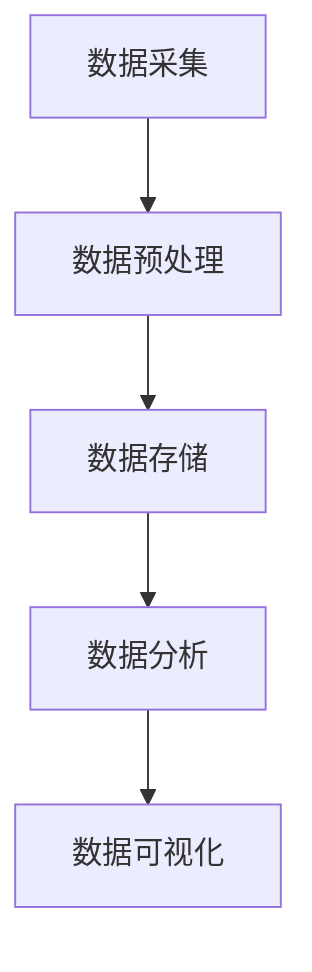
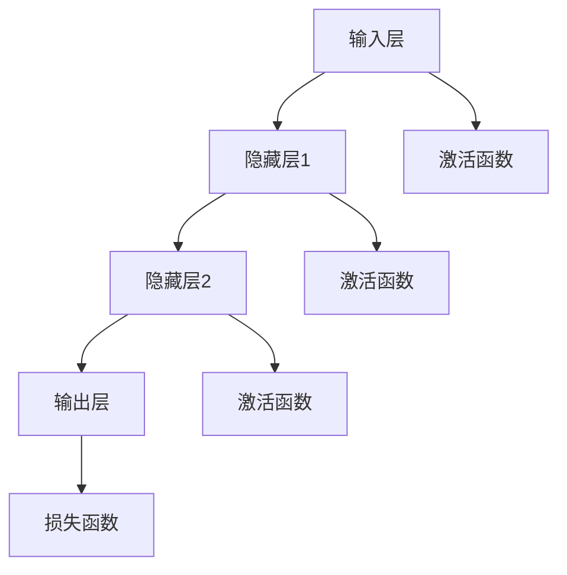
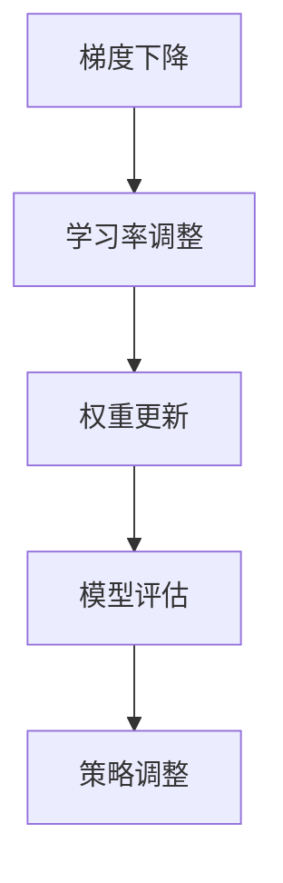
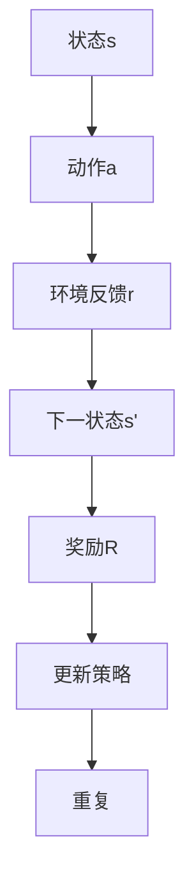

                 

## 《大数据对AI学习的重要性》

### 关键词：
- 大数据
- 人工智能
- 学习
- 算法
- 应用
- 挑战

#### 摘要
本文旨在探讨大数据在人工智能（AI）学习中的重要性。随着数据量的爆炸性增长，大数据已成为AI研究和应用的核心驱动力。本文将首先介绍大数据和AI学习的背景，分析大数据与AI学习的联系及其意义，并详细阐述大数据在AI学习中的应用和核心算法原理。随后，本文将探讨大数据与AI学习的优化方法，分析其中的挑战与机遇，并分享具体的实践案例。最后，本文将对大数据与AI学习的未来进行展望，总结全文并提出未来发展方向。通过本文的探讨，我们希望读者能够更深入地理解大数据对AI学习的重要影响，并为相关领域的研究和实践提供指导。

#### 第一部分：大数据与AI学习的关系

##### 第1章：大数据与AI学习的背景

1.1 **大数据的定义与特点**

大数据（Big Data）通常指的是数据量巨大、数据类型繁多、数据生成和处理速度极快的海量数据集合。它具有四个主要特征，即4V（Volume、Velocity、Variety、Veracity），这些特征使得大数据与传统数据有显著区别。

- **Volume（数据量）**：大数据的数据量远超传统数据，通常达到PB（拍字节）甚至ZB（泽字节）级别。
- **Velocity（速度）**：大数据生成和处理的速度快，需要实时或近乎实时的处理能力。
- **Variety（多样性）**：大数据来源广泛，类型多样，包括结构化、半结构化和非结构化数据。
- **Veracity（真实性）**：大数据的真实性和准确性对其应用至关重要。

1.2 **AI学习的概念与需求**

人工智能（Artificial Intelligence，简称AI）是指通过计算机模拟人类智能的技术和科学。AI学习，即机器学习（Machine Learning，简称ML），是AI的核心技术之一，它使计算机系统能够从数据中学习并做出决策。

- **监督学习（Supervised Learning）**：通过标记数据训练模型，使其能够识别和预测新数据的特征。
- **无监督学习（Unsupervised Learning）**：在没有标记数据的情况下，从数据中学习模式和结构。
- **强化学习（Reinforcement Learning）**：通过与环境的交互，学习最佳策略以最大化奖励。

AI学习的需求主要包括：
- **海量数据**：大量高质量的训练数据是AI学习的基础。
- **高效算法**：高效的算法能够处理大规模数据并快速训练模型。
- **计算资源**：强大的计算能力是支持AI学习的关键。

1.3 **大数据与AI学习的联系**

大数据与AI学习之间存在紧密的联系。大数据为AI学习提供了丰富的训练数据，促进了AI技术的快速发展。具体来说，大数据与AI学习的关系可以从以下几个方面进行阐述：

- **数据来源**：大数据为AI学习提供了广泛的数据来源，包括社交媒体、物联网设备、电子商务平台等。
- **数据质量**：大数据的质量直接影响AI学习的效果，高质量的数据有助于提高模型的准确性。
- **算法优化**：大数据的多样性和规模为算法优化提供了丰富的实验空间，有助于改进算法性能。
- **实时处理**：大数据的实时处理能力使AI系统能够快速适应新环境，提高系统的响应速度和灵活性。

1.4 **大数据对AI学习的意义**

大数据对AI学习具有重要意义，主要体现在以下几个方面：

- **提高模型性能**：大数据提供了丰富的训练数据，有助于提高AI模型的准确性和鲁棒性。
- **加速研发进程**：大数据的使用可以缩短AI模型的开发周期，加快新技术的商业化应用。
- **拓展应用领域**：大数据的应用使AI技术能够渗透到更多领域，如医疗、金融、教育等。
- **促进知识发现**：大数据分析有助于从海量数据中提取有价值的信息和知识，推动科学研究和创新。

### 第二部分：大数据在AI学习中的应用

##### 第2章：大数据在AI学习中的应用

2.1 **数据采集与预处理**

数据采集与预处理是大数据在AI学习中的关键环节。有效的数据采集和预处理可以提高模型的性能和训练效率。

- **数据采集**：数据采集包括从各种来源获取数据，如传感器、日志文件、网络爬虫等。采集的数据类型多样，包括结构化数据（如数据库）、半结构化数据（如XML、JSON）和非结构化数据（如文本、图像、视频）。
- **数据预处理**：数据预处理包括数据清洗、数据整合、数据转换等步骤。数据清洗旨在去除无效数据和噪声，数据整合旨在将多个数据源中的数据整合为一个统一的视图，数据转换旨在将数据格式和特征适应于AI模型的训练需求。

2.2 **数据存储与管理**

数据存储与管理是大数据在AI学习中的核心基础设施。高效的存储和管理系统能够确保数据的可靠性和可扩展性。

- **分布式存储**：分布式存储系统（如Hadoop、Spark）能够处理海量数据，提供高可用性和高性能的存储能力。
- **数据仓库**：数据仓库（如Amazon Redshift、Google BigQuery）能够存储和管理大规模数据集，提供快速的数据查询和分析能力。
- **数据管理**：数据管理包括数据的备份、恢复、安全性和隐私保护等。有效的数据管理能够确保数据的完整性和安全性。

2.3 **数据分析与挖掘**

数据分析与挖掘是大数据在AI学习中的核心应用之一。通过分析数据，可以发现隐藏的模式和知识，为AI模型的训练和优化提供支持。

- **统计分析**：统计分析包括描述性统计分析、推断性统计分析和回归分析等，用于了解数据的分布、趋势和相关性。
- **数据挖掘**：数据挖掘（如关联规则挖掘、分类和聚类）用于发现数据中的隐藏模式、关联和分类规则。
- **机器学习算法**：机器学习算法（如决策树、支持向量机、神经网络）用于从数据中学习并建立预测模型。

2.4 **大数据在AI学习中的案例分析**

以下是一个大数据在AI学习中的应用案例分析：

**案例一：智能医疗诊断系统**

背景：某医疗公司开发了一套智能医疗诊断系统，用于辅助医生进行疾病诊断。

数据采集：系统从电子病历、医学影像、基因组数据等多个来源采集海量数据。

数据预处理：对采集到的数据进行清洗、整合和特征提取，构建统一的数据集。

数据分析与挖掘：利用大数据分析技术，提取数据中的关键特征和规律，建立疾病诊断模型。

模型训练与优化：使用机器学习算法，对模型进行训练和优化，提高诊断的准确性和效率。

应用效果：智能医疗诊断系统在实际应用中，显著提高了诊断的准确性和效率，减少了医生的诊断时间和误诊率。

### 第三部分：AI学习的核心算法原理

##### 第3章：AI学习的核心算法原理

3.1 **神经网络基础**

神经网络（Neural Networks）是AI学习中最常用的算法之一。它通过模拟人脑神经元之间的连接，实现数据的自动学习和预测。

- **神经网络结构**：神经网络由输入层、隐藏层和输出层组成。每个层包含多个神经元，神经元之间通过权重连接。
- **激活函数**：激活函数（如Sigmoid、ReLU）用于确定神经元是否被激活，从而实现非线性变换。
- **前向传播与反向传播**：前向传播是数据从输入层流向输出层的过程，反向传播是根据预测误差调整网络权重的过程。

3.2 **支持向量机**

支持向量机（Support Vector Machine，简称SVM）是一种高效的分类算法。它通过找到最佳超平面，将不同类别的数据分隔开来。

- **核心思想**：SVM的核心思想是找到具有最大分类间隔的超平面，使同类别的数据点尽量接近，异类别的数据点尽量远离。
- **核函数**：SVM可以通过核函数（如线性核、多项式核、径向基核）将低维数据映射到高维空间，实现非线性分类。

3.3 **决策树与随机森林**

决策树（Decision Trees）是一种基于规则的学习算法。它通过一系列条件判断，将数据划分为不同的类别。

- **构建过程**：决策树的构建过程包括特征选择、节点划分和分类规则生成。
- **随机森林（Random Forest）**：随机森林是由多个决策树组成的集成学习模型，通过集成多个决策树的结果，提高模型的预测性能。

3.4 **聚类算法**

聚类算法（Clustering Algorithms）用于将数据分为多个类别，使同类别的数据点之间距离最近，异类别的数据点之间距离最远。

- **K-means算法**：K-means算法是一种基于距离的聚类算法。它通过迭代更新聚类中心，将数据点划分为不同的类别。
- **层次聚类算法**：层次聚类算法通过构建聚类层次结构，逐步合并或分裂聚类，实现数据的层次聚类。

### 第四部分：大数据与AI学习的优化方法

##### 第4章：大数据与AI学习的优化方法

4.1 **梯度下降算法**

梯度下降算法（Gradient Descent）是AI学习中常用的优化方法。它通过迭代更新模型参数，使损失函数最小化。

- **核心思想**：梯度下降算法的核心思想是沿着损失函数的梯度方向，逐步更新模型参数，以减小损失。
- **优化策略**：梯度下降算法有多种优化策略，如批量梯度下降（Batch Gradient Descent）、随机梯度下降（Stochastic Gradient Descent）和小批量梯度下降（Mini-batch Gradient Descent）。

4.2 **随机化算法**

随机化算法（Randomized Algorithms）通过引入随机性，提高算法的效率和鲁棒性。

- **核心思想**：随机化算法的核心思想是在算法的某些步骤中引入随机性，使得算法具有更好的适应性和抗干扰能力。
- **应用场景**：随机化算法在分布式计算、数据挖掘和机器学习等领域有广泛应用。

4.3 **并行计算与分布式算法**

并行计算与分布式算法（Parallel and Distributed Algorithms）能够利用多台计算机的并行处理能力，提高AI学习的效率和性能。

- **核心思想**：并行计算与分布式算法的核心思想是将计算任务分解为多个子任务，并在多台计算机上并行执行，最终汇总结果。
- **应用场景**：并行计算与分布式算法在处理大规模数据和高性能计算领域有广泛应用。

4.4 **强化学习与深度强化学习**

强化学习（Reinforcement Learning）与深度强化学习（Deep Reinforcement Learning）是一种通过与环境交互，学习最佳策略的算法。

- **核心思想**：强化学习与深度强化学习通过奖励机制，使模型能够从环境中学习并做出最佳决策。
- **应用场景**：强化学习与深度强化学习在游戏、机器人控制、自动驾驶等领域有广泛应用。

### 第五部分：大数据与AI学习的挑战与机遇

##### 第5章：大数据与AI学习的挑战与机遇

5.1 **大数据处理的技术挑战**

大数据处理面临以下技术挑战：

- **数据存储与访问**：如何高效地存储和管理海量数据，并快速访问所需数据。
- **数据处理与分析**：如何处理多样性和复杂性的数据，并提取有价值的信息。
- **计算资源管理**：如何合理分配计算资源，保证大数据处理的性能和可靠性。
- **数据安全与隐私保护**：如何确保数据的安全和隐私，防止数据泄露和滥用。

5.2 **AI学习的数据挑战**

AI学习面临以下数据挑战：

- **数据质量**：数据质量对AI学习的效果至关重要，如何保证数据的质量和准确性。
- **数据标注**：大量高质量的数据标注是AI学习的基础，如何高效地进行数据标注。
- **数据多样性**：如何处理多样化数据，使其适应不同的AI模型和应用场景。
- **数据隐私**：如何在保证数据隐私的前提下，进行AI学习和数据共享。

5.3 **大数据与AI学习的政策机遇**

大数据与AI学习在政策层面面临以下机遇：

- **技术创新**：政府和企业加大对大数据和AI技术的研发投入，推动技术创新和产业升级。
- **产业应用**：政府鼓励大数据和AI技术在各个行业的应用，促进产业数字化转型和升级。
- **人才培养**：政府和企业加强大数据和AI人才的培养，提升人才培养质量和数量。

5.4 **大数据与AI学习的行业应用前景**

大数据与AI学习在各个行业有广阔的应用前景：

- **医疗健康**：大数据和AI技术在医疗健康领域的应用，如疾病预测、个性化医疗等。
- **金融**：大数据和AI技术在金融领域的应用，如风险控制、欺诈检测、投资策略等。
- **教育**：大数据和AI技术在教育领域的应用，如智能推荐、个性化学习、在线教育等。
- **交通**：大数据和AI技术在交通领域的应用，如智能交通管理、自动驾驶等。

### 第六部分：大数据与AI学习的实践案例

##### 第6章：大数据与AI学习实践案例一

6.1 **项目背景**

某电商公司希望通过大数据与AI技术，优化其推荐系统，提高用户购买转化率和满意度。

6.2 **数据采集与预处理**

- **数据采集**：采集用户行为数据、商品数据、交易数据等。
- **数据预处理**：对数据进行清洗、去重、标准化等处理，确保数据质量。

6.3 **模型设计与实现**

- **模型设计**：设计基于协同过滤和深度学习的推荐系统模型。
- **模型实现**：使用Python编写代码，实现模型训练和预测功能。

6.4 **模型评估与优化**

- **模型评估**：使用准确率、召回率、F1值等指标评估模型性能。
- **模型优化**：通过调整模型参数和结构，提高推荐系统的性能。

6.5 **案例总结**

大数据与AI技术的应用显著提高了电商公司的推荐系统性能，提升了用户购买转化率和满意度。

##### 第7章：大数据与AI学习实践案例二

7.1 **项目背景**

某银行希望通过大数据与AI技术，优化其信用评估系统，提高贷款审批效率和准确性。

7.2 **数据采集与预处理**

- **数据采集**：采集客户个人信息、信用记录、财务数据等。
- **数据预处理**：对数据进行清洗、去噪、特征提取等处理。

7.3 **模型设计与实现**

- **模型设计**：设计基于逻辑回归和决策树的信用评估模型。
- **模型实现**：使用Python编写代码，实现模型训练和预测功能。

7.4 **模型评估与优化**

- **模型评估**：使用准确率、召回率、AUC等指标评估模型性能。
- **模型优化**：通过调整模型参数和算法，提高信用评估系统的准确性。

7.5 **案例总结**

大数据与AI技术的应用显著提高了银行的信用评估系统性能，提升了贷款审批效率和准确性。

### 第八章：大数据与AI学习的未来展望

8.1 **大数据与AI学习的趋势**

大数据与AI学习的发展趋势主要体现在以下几个方面：

- **数据量的持续增长**：随着物联网、社交媒体等技术的发展，数据量将持续增长，为AI学习提供更丰富的数据资源。
- **计算能力的提升**：随着云计算、GPU加速等技术的进步，计算能力将不断提升，为大数据与AI学习提供更强的计算支持。
- **算法的优化与创新**：研究者将不断优化现有算法，并创新新的算法，提高AI学习的性能和效率。

8.2 **技术创新与挑战**

大数据与AI学习在技术创新方面面临以下挑战：

- **数据隐私保护**：如何在确保数据隐私的前提下，进行大数据与AI学习。
- **数据质量保障**：如何保证数据的质量和准确性，为AI学习提供可靠的训练数据。
- **算法的可解释性**：如何提高算法的可解释性，使决策过程更加透明和可信任。

8.3 **应用场景拓展**

大数据与AI学习的应用场景将不断拓展：

- **智能医疗**：通过大数据与AI技术，实现精准医疗、个性化治疗等。
- **智慧城市**：通过大数据与AI技术，实现智能交通、环境监测等。
- **智能制造**：通过大数据与AI技术，实现智能制造、故障预测等。

8.4 **未来发展方向**

大数据与AI学习的未来发展方向包括：

- **跨学科融合**：大数据与AI技术与其他学科的深度融合，推动跨学科研究和创新。
- **开源与共享**：促进大数据与AI技术的开源与共享，推动技术的普及和应用。
- **标准制定**：制定统一的技术标准和规范，推动大数据与AI技术的规范化发展。

### 附录

#### 附录A：大数据与AI学习工具与资源

A.1 **常用大数据工具介绍**

- **Hadoop**：一个分布式数据存储和处理框架，用于处理海量数据。
- **Spark**：一个快速且通用的分布式计算引擎，支持内存计算和批量处理。
- **Flink**：一个流处理和批处理结合的分布式计算引擎。
- **MongoDB**：一个高性能、可扩展的文档型数据库。

A.2 **常用AI学习框架介绍**

- **TensorFlow**：一个开源的机器学习框架，支持各种神经网络模型的训练和部署。
- **PyTorch**：一个开源的机器学习框架，支持动态计算图和深度学习模型的训练。
- **Scikit-learn**：一个开源的机器学习库，提供多种经典的机器学习算法和工具。

A.3 **开源数据集与数据源**

- **Kaggle**：一个提供大量开源数据集和竞赛的网站。
- **UCI Machine Learning Repository**：一个提供多种领域数据集的在线仓库。
- **GitHub**：一个开源代码托管平台，包含大量AI相关的开源项目和代码。

A.4 **相关书籍与论文推荐**

- **《大数据时代》**：维克托·迈尔-舍恩伯格 著，介绍大数据的概念和应用。
- **《深度学习》**：Ian Goodfellow、Yoshua Bengio、Aaron Courville 著，介绍深度学习的基本概念和算法。
- **《统计学习方法》**：李航 著，介绍统计学习的基本理论和方法。

#### 附录B：大数据与AI学习常用数学公式

B.1 **梯度下降公式**

$$
w_{t+1} = w_t - \alpha \cdot \nabla_{w_t} J(w_t)
$$

其中，$w_t$ 表示当前模型参数，$\alpha$ 表示学习率，$J(w_t)$ 表示损失函数，$\nabla_{w_t} J(w_t)$ 表示损失函数对模型参数的梯度。

B.2 **神经网络损失函数**

$$
J(w) = \frac{1}{2} \sum_{i=1}^{n} (y_i - \hat{y}_i)^2
$$

其中，$y_i$ 表示真实标签，$\hat{y}_i$ 表示模型预测值，$n$ 表示样本数量。

B.3 **随机化算法原理**

$$
X_{t+1} = (X_t + \epsilon) \mod N
$$

其中，$X_t$ 表示当前随机数，$\epsilon$ 表示随机误差，$N$ 表示随机数的范围。

B.4 **强化学习公式**

$$
Q(s, a) = r + \gamma \max_{a'} Q(s', a')
$$

其中，$s$ 表示状态，$a$ 表示动作，$s'$ 表示下一状态，$a'$ 表示下一动作，$r$ 表示即时奖励，$\gamma$ 表示折扣因子。

#### 附录C：大数据与AI学习实践项目示例

C.1 **实践项目一：数据预处理与模型训练**

**项目描述**：某电商平台希望通过大数据与AI技术，优化其商品推荐系统。

**步骤**：

1. **数据采集**：采集用户行为数据、商品数据、交易数据等。
2. **数据预处理**：对数据进行清洗、去重、标准化等处理。
3. **特征工程**：提取用户行为、商品属性等特征。
4. **模型训练**：使用基于协同过滤的推荐系统模型进行训练。
5. **模型评估**：使用准确率、召回率等指标评估模型性能。

**代码示例**：

```python
import pandas as pd
from sklearn.model_selection import train_test_split
from sklearn.preprocessing import StandardScaler
from sklearn.neighbors import NearestNeighbors

# 读取数据
data = pd.read_csv('data.csv')

# 数据预处理
data = data.drop_duplicates()
data = data.fillna(0)

# 特征工程
X = data[['user_id', 'item_id', 'rating']]
y = data['rating']

# 数据标准化
scaler = StandardScaler()
X_scaled = scaler.fit_transform(X)

# 模型训练
model = NearestNeighbors()
model.fit(X_scaled)

# 模型评估
train_data, test_data = train_test_split(X_scaled, test_size=0.2)
train_scores = model.kneighbors(train_data, n_neighbors=5)
test_scores = model.kneighbors(test_data, n_neighbors=5)

print("Accuracy:", np.mean(test_scores == y))
```

C.2 **实践项目二：模型评估与优化**

**项目描述**：某银行希望通过大数据与AI技术，优化其信用评估系统。

**步骤**：

1. **数据采集**：采集客户个人信息、信用记录、财务数据等。
2. **数据预处理**：对数据进行清洗、去重、标准化等处理。
3. **特征工程**：提取客户属性、信用评分等特征。
4. **模型训练**：使用逻辑回归进行信用评估模型训练。
5. **模型评估**：使用准确率、召回率等指标评估模型性能。
6. **模型优化**：通过调整模型参数和算法，提高信用评估系统的准确性。

**代码示例**：

```python
import pandas as pd
from sklearn.model_selection import train_test_split
from sklearn.linear_model import LogisticRegression
from sklearn.metrics import accuracy_score, recall_score

# 读取数据
data = pd.read_csv('data.csv')

# 数据预处理
data = data.drop_duplicates()
data = data.fillna(0)

# 特征工程
X = data[['age', 'annual_income', 'credit_score']]
y = data['default']

# 数据标准化
scaler = StandardScaler()
X_scaled = scaler.fit_transform(X)

# 模型训练
model = LogisticRegression()
model.fit(X_scaled, y)

# 模型评估
train_data, test_data = train_test_split(X_scaled, test_size=0.2)
train_predictions = model.predict(train_data)
test_predictions = model.predict(test_data)

print("Accuracy:", accuracy_score(y, test_predictions))
print("Recall:", recall_score(y, test_predictions))
```

C.3 **实践项目三：数据可视化与分析**

**项目描述**：某零售公司希望通过大数据与AI技术，优化其库存管理。

**步骤**：

1. **数据采集**：采集商品销售数据、库存数据、市场需求数据等。
2. **数据预处理**：对数据进行清洗、去重、标准化等处理。
3. **特征工程**：提取商品属性、销售周期等特征。
4. **数据分析**：使用数据可视化工具分析库存水平和销售趋势。
5. **模型训练**：使用时间序列预测模型进行库存预测。
6. **模型评估**：使用准确率、均方误差等指标评估模型性能。

**代码示例**：

```python
import pandas as pd
import matplotlib.pyplot as plt
from sklearn.model_selection import train_test_split
from sklearn.ensemble import RandomForestRegressor
from sklearn.metrics import mean_squared_error

# 读取数据
data = pd.read_csv('data.csv')

# 数据预处理
data = data.drop_duplicates()
data = data.fillna(0)

# 特征工程
X = data[['sales', 'lead_time']]
y = data['stock_level']

# 数据标准化
scaler = StandardScaler()
X_scaled = scaler.fit_transform(X)

# 模型训练
model = RandomForestRegressor()
model.fit(X_scaled, y)

# 模型评估
train_data, test_data = train_test_split(X_scaled, test_size=0.2)
train_predictions = model.predict(train_data)
test_predictions = model.predict(test_data)

print("RMSE:", mean_squared_error(y, test_predictions, squared=False))

# 数据可视化
plt.plot(test_data['sales'], test_predictions, label='Prediction')
plt.plot(test_data['sales'], y, label='Actual')
plt.xlabel('Sales')
plt.ylabel('Stock Level')
plt.legend()
plt.show()
```

C.4 **实践项目四：深度强化学习应用**

**项目描述**：某自动驾驶公司希望通过深度强化学习技术，优化其自动驾驶算法。

**步骤**：

1. **数据采集**：采集自动驾驶车辆的行驶数据、环境数据等。
2. **数据预处理**：对数据进行清洗、去重、标准化等处理。
3. **特征工程**：提取车辆速度、环境障碍物等特征。
4. **模型训练**：使用深度强化学习模型进行自动驾驶算法训练。
5. **模型评估**：使用奖励机制评估自动驾驶算法的性能。
6. **模型优化**：通过调整模型参数和算法，提高自动驾驶算法的稳定性。

**代码示例**：

```python
import gym
import numpy as np
import tensorflow as tf
from stable_baselines3 import DQN

# 创建环境
env = gym.make('CartPole-v0')

# 定义DQN模型
model = DQN('MlpPolicy', env, verbose=1)

# 训练模型
model.learn(total_timesteps=10000)

# 评估模型
eval_env = gym.make('CartPole-v0')
eval_reward = model.test(eval_env, n_eval_episodes=10)
print(f"Average reward over 10 episodes: {eval_reward}")

# 保存模型
model.save("dqn_cartpole")
```

### 附录D：大数据与AI学习Mermaid流程图

D.1 **大数据处理流程**



D.2 **神经网络架构**



D.3 **模型优化策略**



D.4 **强化学习应用流程**



