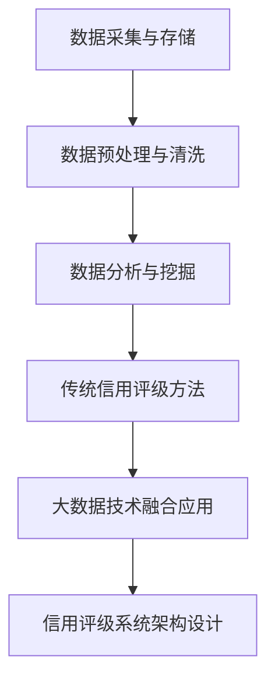
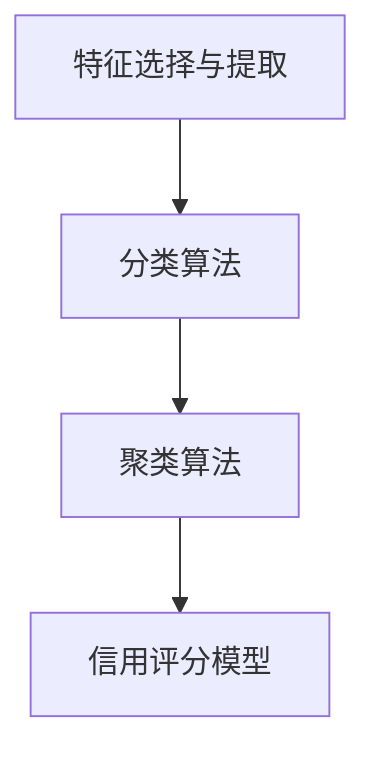
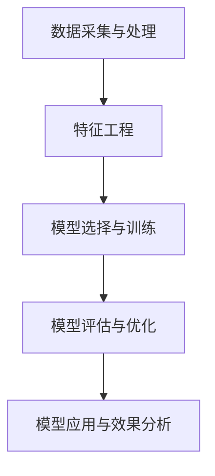

                 

# 文章标题：大数据技术在银行个人信贷信用评级中的应用研究

> 关键词：大数据技术，银行信贷，信用评级，数据挖掘，机器学习，算法模型

> 摘要：本文旨在探讨大数据技术在银行个人信贷信用评级中的应用。通过对大数据技术核心概念、架构、算法的详细分析，以及具体案例的实证研究，本文揭示了大数据技术在信用评级中的优势和应用前景。研究发现，大数据技术能够显著提高信用评级的准确性和效率，为银行信贷业务提供了有力的技术支持。

## 引言与背景

### 1.1.1 大数据技术的发展与应用

大数据（Big Data）是指无法使用传统数据库软件工具在合理时间内进行捕获、管理和处理的数据集。这些数据集通常具有大量的数据量、快速的数据生成速度、复杂的多样性特征和高维特性。大数据技术的发展起源于互联网和物联网的普及，其应用领域涵盖了从科学、医疗、金融到商业等各个方面。

在金融领域，大数据技术的应用逐渐成为趋势。银行和金融机构利用大数据技术进行风险控制、客户关系管理、市场营销和信用评级等方面。大数据技术能够从海量数据中挖掘出潜在的价值信息，从而提高业务决策的准确性和效率。

### 1.1.2 银行个人信贷信用评级的现状与挑战

个人信贷信用评级是银行信贷业务中至关重要的一环。银行通过信用评级评估借款人的还款能力和信用状况，从而决定是否批准贷款申请。传统的信用评级方法主要依赖于借款人的信用记录、收入水平、职业状况等基本信息。然而，这些信息往往不足以全面反映借款人的信用状况，导致信用评级存在一定的局限性。

目前，银行个人信贷信用评级面临的挑战主要有以下几个方面：

1. 数据质量不高：传统信用评级方法依赖的数据往往不够全面和准确，存在大量缺失值和噪声数据，影响信用评级的准确性。
2. 数据处理效率低下：传统信用评级方法通常需要大量的人力和时间进行数据处理和分析，导致数据处理效率低下。
3. 风险识别能力不足：传统信用评级方法难以识别潜在的风险因素，导致信用评级存在一定的滞后性。

### 1.1.3 大数据技术对信用评级的影响

大数据技术的发展为银行个人信贷信用评级带来了新的机遇和挑战。大数据技术能够从海量数据中挖掘出潜在的价值信息，为信用评级提供更全面、准确的数据支持。具体来说，大数据技术对信用评级的影响主要体现在以下几个方面：

1. 提高信用评级的准确性：大数据技术能够从不同来源的海量数据中挖掘出与信用评级相关的特征，从而提高信用评级的准确性。
2. 增强风险识别能力：大数据技术能够实时监测和分析借款人的行为数据，识别潜在的风险因素，提高风险识别能力。
3. 提高数据处理效率：大数据技术提供了高效的数据存储、处理和分析工具，能够显著提高数据处理效率，降低人工成本。
4. 开拓新的信用评级方法：大数据技术为银行提供了新的信用评级方法，如基于行为数据的信用评级、基于社交网络分析的信用评级等。

综上所述，大数据技术在银行个人信贷信用评级中具有广阔的应用前景，能够显著提高信用评级的准确性、效率和风险识别能力。本文将在后续章节中详细探讨大数据技术在信用评级中的应用，以及具体的实现方法和案例。

## 研究内容与方法

### 1.2.1 研究内容概述

本文的研究内容主要分为以下几个部分：

1. 大数据技术在信用评级中的核心概念与架构：本文将详细分析大数据技术的核心概念，包括数据采集、存储、预处理和分析等，并介绍大数据技术在信用评级中的应用架构。
2. 大数据技术在信用评级中的核心算法：本文将介绍大数据技术中常用的数据挖掘算法，如机器学习算法、特征选择和提取算法、分类与聚类算法等，并讨论这些算法在信用评级中的具体应用。
3. 大数据技术在银行个人信贷信用评级中的应用：本文将通过具体案例，探讨大数据技术在银行个人信贷信用评级中的应用，包括数据采集与处理、特征工程、信用评级模型构建与优化、信用评级结果评估等。
4. 大数据技术在信用评级中的优势与挑战：本文将总结大数据技术在信用评级中的优势和应用前景，并分析其在实际应用中面临的挑战和解决方案。

### 1.2.2 研究方法与数据来源

本文的研究方法主要包括文献综述、数据挖掘和实证研究等。

1. 文献综述：本文通过查阅大量国内外相关文献，了解大数据技术和信用评级的最新研究动态和发展趋势，为后续研究提供理论支持。
2. 数据挖掘：本文将运用数据挖掘技术，从海量数据中挖掘出与信用评级相关的特征和规律，为信用评级模型的构建提供数据支持。
3. 实证研究：本文将通过实际案例，验证大数据技术在信用评级中的应用效果，分析其优势和局限性。

本文的数据来源主要包括以下几个方面：

1. 银行个人信贷数据：本文将从银行获取个人信贷数据，包括借款人的基本信息、信用记录、还款记录等，用于信用评级模型的构建和验证。
2. 行为数据：本文将从社交网络、电商平台等渠道获取借款人的行为数据，如消费行为、社交行为等，用于特征工程和模型优化。
3. 公开数据集：本文还将利用公开的数据集，如UCI机器学习数据集、Kaggle数据集等，进行算法验证和模型优化。

通过以上研究方法和数据来源，本文旨在深入探讨大数据技术在银行个人信贷信用评级中的应用，为银行信贷业务提供有益的参考和借鉴。

## 大数据技术在信用评级中的核心概念与架构

### 2.1.1 数据采集与存储

数据采集是大数据技术的基础环节，其目的是从各种数据源获取与信用评级相关的数据。这些数据源包括银行内部的数据，如借款人的信用记录、还款记录、贷款申请信息等；外部数据，如社交网络数据、电商数据、新闻媒体数据等。数据采集的方法主要包括以下几种：

1. **关系数据库**：通过关系数据库（如MySQL、Oracle等）获取内部数据。关系数据库具有高效的数据存储和查询能力，适用于处理结构化数据。
2. **数据爬虫**：通过爬虫技术从互联网获取外部数据。数据爬虫可以爬取各种网站的信息，如社交媒体、电商平台、新闻媒体等，获取非结构化或半结构化数据。
3. **API接口**：利用各种API接口获取外部数据，如电商平台的交易数据、社交媒体的用户行为数据等。

数据采集后，需要将数据存储到大数据技术平台中。常用的数据存储技术包括：

1. **Hadoop HDFS**：Hadoop HDFS（Hadoop Distributed File System）是一种分布式文件系统，适用于存储海量数据。HDFS具有高可靠性、高扩展性和高效性等特点。
2. **NoSQL数据库**：如MongoDB、Cassandra等，适用于存储非结构化或半结构化数据。NoSQL数据库具有灵活的数据模型和高性能的特点。
3. **数据湖**：数据湖是一种新的数据存储架构，用于存储海量原始数据，支持数据的任意处理和分析。数据湖通常与大数据处理框架（如Hadoop、Spark等）结合使用。

### 2.1.2 数据预处理与清洗

数据预处理是大数据技术在信用评级中至关重要的一环，其目的是将原始数据进行清洗、转换和整合，以便后续的数据分析和挖掘。数据预处理的主要任务包括以下几个方面：

1. **数据清洗**：去除数据中的噪声和错误，如缺失值、重复值、异常值等。数据清洗的方法包括填充缺失值、删除重复值、修正错误值等。
2. **数据转换**：将不同数据源的数据格式进行统一，如将文本数据转换为数值数据、将时间戳转换为日期格式等。数据转换的方法包括数据规范化、归一化、离散化等。
3. **数据整合**：将来自不同数据源的数据进行整合，形成统一的数据集。数据整合的方法包括数据合并、数据联结、数据采样等。

### 2.1.3 数据分析与挖掘

数据分析与挖掘是大数据技术的核心环节，其目的是从海量数据中挖掘出有价值的信息和知识。在信用评级中，数据分析与挖掘主要用于以下方面：

1. **特征工程**：通过提取和选择与信用评级相关的特征，为信用评级模型提供输入。特征工程的方法包括特征提取、特征选择、特征组合等。
2. **数据挖掘算法**：运用各种数据挖掘算法，如机器学习算法、深度学习算法、聚类算法等，对数据进行建模和分析，提取潜在的模式和规律。
3. **模型评估与优化**：通过模型评估指标（如准确率、召回率、F1值等）评估模型的性能，并采用优化策略（如交叉验证、网格搜索等）优化模型。

### 2.2.1 传统信用评级方法

传统信用评级方法主要依赖于借款人的信用记录、收入水平、职业状况等基本信息。这些信息通常通过信用报告、贷款申请表等渠道获取。传统信用评级方法的主要步骤包括：

1. **数据收集**：收集借款人的基本信息，如年龄、收入、职业、信用记录等。
2. **数据预处理**：对收集到的数据进行分析和清洗，去除噪声和错误。
3. **特征选择**：选择与信用评级相关的特征，如信用评分、还款记录、负债收入比等。
4. **模型构建**：采用统计模型（如线性回归、逻辑回归等）构建信用评级模型。
5. **模型评估**：通过交叉验证等方法评估模型的性能。

### 2.2.2 大数据技术在信用评级中的融合应用

大数据技术的融合应用能够显著提高信用评级的准确性和效率。具体来说，大数据技术在信用评级中的融合应用包括以下几个方面：

1. **数据多样性**：大数据技术能够获取和处理多种类型的数据，如结构化数据、非结构化数据和半结构化数据。这些数据为信用评级提供了更丰富的信息来源，提高了信用评级的准确性。
2. **实时性**：大数据技术支持实时数据分析和处理，能够及时更新信用评级模型，提高信用评级的实时性和动态性。
3. **自动化**：大数据技术提供了自动化数据处理和分析工具，如数据预处理、特征提取、模型构建等，降低了人工干预，提高了数据处理效率。
4. **个性化**：大数据技术能够根据不同借款人的特征和需求，提供个性化的信用评级服务，提高客户满意度。

### 2.2.3 信用评级系统架构设计

信用评级系统架构设计是大数据技术在信用评级中应用的关键环节。一个典型的信用评级系统架构包括以下几个部分：

1. **数据采集模块**：负责从各种数据源获取与信用评级相关的数据，如银行内部数据、外部数据等。
2. **数据预处理模块**：负责对采集到的数据进行清洗、转换和整合，形成统一的数据集。
3. **特征工程模块**：负责提取和选择与信用评级相关的特征，为信用评级模型提供输入。
4. **模型构建模块**：负责构建信用评级模型，包括数据挖掘、特征选择、模型优化等。
5. **模型评估模块**：负责评估信用评级模型的性能，并根据评估结果进行模型优化。
6. **应用接口模块**：负责提供与外部系统的接口，如银行信贷系统、客户管理系统等，实现信用评级结果的应用。

通过以上模块的协同工作，信用评级系统能够实现高效、准确的信用评级，为银行信贷业务提供有力支持。

### 图 2.1：大数据技术在信用评级中的核心概念与架构



图 2.1展示了大数据技术在信用评级中的核心概念与架构。通过以上各模块的协同工作，大数据技术能够为信用评级提供全面、准确的数据支持，提高信用评级的准确性、效率和应用价值。

## 大数据技术在信用评级中的核心算法

### 3.1.1 机器学习算法简介

机器学习（Machine Learning）是一种通过数据和算法模拟人类学习过程的技术，其核心目标是让计算机自动从数据中学习规律，并基于这些规律进行预测和决策。在信用评级中，机器学习算法被广泛应用于数据挖掘和模型构建，以提高信用评级的准确性和效率。

机器学习算法可以分为监督学习、无监督学习和强化学习三种类型。其中，监督学习算法在有标签数据集上进行训练，通过学习输入与输出之间的映射关系进行预测。无监督学习算法在没有标签数据集上进行训练，主要任务包括聚类、降维等。强化学习算法则通过与环境互动进行学习，以实现最优策略。

### 3.1.2 特征选择与提取

特征选择（Feature Selection）是指从大量特征中筛选出对模型性能有显著影响的重要特征，以提高模型的可解释性和效率。特征提取（Feature Extraction）则是通过某种转换将原始特征映射为新的特征，以增强模型的预测能力。

在信用评级中，特征选择和提取至关重要。有效的特征选择和提取可以降低模型的复杂性，减少训练时间，提高预测准确性。常见的特征选择方法包括过滤式（Filter）、包装式（Wrapper）和嵌入式（Embedded）方法。过滤式方法通过评估特征与目标变量之间的相关性进行选择；包装式方法通过构建多个子模型进行评估和选择；嵌入式方法在模型训练过程中自动筛选重要特征。

### 3.1.3 分类与聚类算法应用

分类（Classification）算法是将数据分为预定义的类别，常见的分类算法包括决策树（Decision Tree）、随机森林（Random Forest）、支持向量机（SVM）等。聚类（Clustering）算法则是将数据分为多个无预定义类别的簇，常见的聚类算法包括K-均值（K-Means）、层次聚类（Hierarchical Clustering）等。

在信用评级中，分类算法可以用于构建信用评分模型，预测借款人的信用等级。聚类算法则可以用于对借款人进行细分，发现不同风险群体的特征和规律。

### 图 3.1：机器学习算法在信用评级中的应用



图 3.1展示了机器学习算法在信用评级中的应用。通过特征选择和提取，可以将原始数据进行有效转换，提高模型的预测能力。分类和聚类算法则分别用于构建信用评分模型和发现不同风险群体的特征，从而提高信用评级的准确性。

### 3.2.1 数学模型基础

在信用评级中，常用的数学模型包括概率模型和统计模型。其中，贝叶斯公式是一种经典的概率模型，用于计算在给定某一事件发生的条件下，另一事件发生的概率。贝叶斯公式表示为：

$$
P(A|B) = \frac{P(B|A) \cdot P(A)}{P(B)}
$$

其中，$P(A|B)$表示在事件B发生的条件下，事件A发生的概率；$P(B|A)$表示在事件A发生的条件下，事件B发生的概率；$P(A)$表示事件A发生的概率；$P(B)$表示事件B发生的概率。

贝叶斯公式在信用评级中的应用主要包括两个方面：一是用于计算借款人违约的概率；二是用于构建信用评分模型。通过贝叶斯公式，可以将借款人的历史行为数据与违约概率相关联，从而为信用评级提供参考。

### 3.2.2 统计模型与评估指标

在信用评级中，常用的统计模型包括线性回归、逻辑回归、决策树等。这些模型通过分析借款人的历史行为数据，预测其违约风险。

1. **线性回归**：线性回归模型是一种简单的统计模型，用于建立自变量和因变量之间的线性关系。线性回归模型的基本公式为：

$$
Y = \beta_0 + \beta_1X_1 + \beta_2X_2 + \cdots + \beta_nX_n
$$

其中，$Y$表示因变量，$X_1, X_2, \cdots, X_n$表示自变量，$\beta_0, \beta_1, \beta_2, \cdots, \beta_n$表示模型的参数。

2. **逻辑回归**：逻辑回归模型是一种常用的分类模型，用于预测借款人的信用评级。逻辑回归模型的基本公式为：

$$
P(Y=1|X) = \frac{1}{1 + e^{-(\beta_0 + \beta_1X_1 + \beta_2X_2 + \cdots + \beta_nX_n)}}
$$

其中，$Y$表示因变量（违约/未违约），$X_1, X_2, \cdots, X_n$表示自变量，$\beta_0, \beta_1, \beta_2, \cdots, \beta_n$表示模型的参数。

3. **评估指标**：在信用评级中，常用的评估指标包括准确率（Accuracy）、召回率（Recall）、精确率（Precision）、F1值（F1 Score）等。

- **准确率**：准确率表示模型预测正确的样本占总样本的比例，计算公式为：

$$
\text{Accuracy} = \frac{\text{预测正确数量}}{\text{总样本数量}}
$$

- **召回率**：召回率表示模型预测正确的正样本占总正样本的比例，计算公式为：

$$
\text{Recall} = \frac{\text{预测正确的正样本数量}}{\text{总正样本数量}}
$$

- **精确率**：精确率表示模型预测正确的正样本数量占预测为正样本的总数量的比例，计算公式为：

$$
\text{Precision} = \frac{\text{预测正确的正样本数量}}{\text{预测为正样本的总数量}}
$$

- **F1值**：F1值是精确率和召回率的调和平均值，计算公式为：

$$
\text{F1 Score} = 2 \cdot \frac{\text{Precision} \cdot \text{Recall}}{\text{Precision} + \text{Recall}}
$$

这些评估指标能够全面反映信用评级模型的性能，帮助银行和金融机构评估信用评级的准确性。

### 3.3.1 决策树算法

决策树（Decision Tree）是一种常用的分类和回归算法，其核心思想是通过一系列规则将数据进行划分，从而实现对未知数据的分类或回归。

决策树算法的原理如下：

1. **选择最优划分标准**：在决策树的构建过程中，算法需要选择一个最优的特征和阈值，使得数据集能够被最好地划分。常见的划分标准包括信息增益（Information Gain）、基尼不纯度（Gini Impurity）等。

2. **递归划分**：根据最优划分标准，将数据集划分为若干个子集。对于每个子集，再次选择最优划分标准进行划分，直到满足停止条件（如最大深度、最小样本数量等）。

3. **构建决策树**：将划分结果以树形结构表示，每个内部节点表示一个划分规则，每个叶节点表示一个类别的预测结果。

决策树算法的伪代码如下：

```python
// 决策树算法伪代码
function DecisionTree(data):
    if (data is pure):
        return most_common_class(data)
    else:
        best_attribute = BestAttribute(data)
        decision_node = Node(best_attribute)
        for value in attribute_values(best_attribute):
            sub_data = data.split(value)
            decision_node.children[value] = DecisionTree(sub_data)
        return decision_node
```

其中，`data`表示输入的数据集，`best_attribute`表示最优划分特征，`value`表示划分阈值，`sub_data`表示划分后的子数据集，`most_common_class`表示数据集中的大多数类别。

### 3.3.2 支持向量机算法

支持向量机（Support Vector Machine，SVM）是一种经典的机器学习算法，其核心思想是找到一个最佳的超平面，将不同类别的数据点最大程度地分开。

SVM算法的原理如下：

1. **线性SVM**：线性SVM的核心目标是找到一个最佳的超平面，使得正负样本点到超平面的距离之和最小。该问题的数学表述为：

$$
\min_{\mathbf{w}, b} \frac{1}{2} ||\mathbf{w}||^2
$$

s.t.
$$
\mathbf{w} \cdot \mathbf{x}_i - b \geq 1, \quad i = 1, 2, \ldots, n
$$

其中，$\mathbf{w}$表示超平面的法向量，$b$表示偏置项，$\mathbf{x}_i$表示第$i$个样本点。

2. **非线性SVM**：对于非线性可分的数据，可以通过核函数（Kernel Function）将数据映射到高维空间，然后在高维空间中找到一个最佳的超平面。常见的核函数包括线性核、多项式核、径向基函数（RBF）核等。

SVM算法的伪代码如下：

```python
// 支持向量机算法伪代码
function SVM(train_data, train_labels):
    // 使用库函数训练SVM模型
    model = train_svm_model(train_data, train_labels)
    return model
```

其中，`train_data`表示训练数据集，`train_labels`表示训练数据集的标签。

通过以上算法，决策树和支持向量机能够有效地对信用评级问题进行建模和预测。在实际应用中，可以根据具体数据集和业务需求选择合适的算法和参数，以提高信用评级的准确性和效率。

## 大数据技术在银行个人信贷信用评级中的应用

### 4.1 数据采集与处理

数据采集是大数据技术在银行个人信贷信用评级中应用的基础环节。银行需要从多个数据源收集与信用评级相关的数据，包括内部数据和外部数据。内部数据主要包括借款人的基本信息、信用记录、还款记录等；外部数据则包括社交媒体数据、电商交易数据、公共记录等。

1. **数据采集方法**：

- **关系数据库**：通过关系数据库（如MySQL、Oracle等）获取内部数据。关系数据库具有高效的数据存储和查询能力，适用于处理结构化数据。

- **数据爬虫**：通过爬虫技术从互联网获取外部数据。数据爬虫可以爬取各种网站的信息，如社交媒体、电商平台、新闻媒体等，获取非结构化或半结构化数据。

- **API接口**：利用各种API接口获取外部数据，如电商平台的交易数据、社交媒体的用户行为数据等。

2. **数据处理流程**：

- **数据清洗**：去除数据中的噪声和错误，如缺失值、重复值、异常值等。数据清洗的方法包括填充缺失值、删除重复值、修正错误值等。

- **数据转换**：将不同数据源的数据格式进行统一，如将文本数据转换为数值数据、将时间戳转换为日期格式等。数据转换的方法包括数据规范化、归一化、离散化等。

- **数据整合**：将来自不同数据源的数据进行整合，形成统一的数据集。数据整合的方法包括数据合并、数据联结、数据采样等。

### 4.2 特征工程

特征工程是大数据技术在信用评级中应用的关键环节，其目的是从原始数据中提取出对信用评级有重要影响的特征。有效的特征工程能够提高信用评级的准确性和效率。

1. **特征定义与选择**：

- **特征定义**：根据信用评级的业务需求，定义与信用评级相关的特征。特征可以包括借款人的基本信息（如年龄、性别、收入等）、信用记录（如逾期记录、贷款记录等）、行为数据（如消费行为、社交行为等）。

- **特征选择**：从定义的特征中筛选出对信用评级有显著影响的特征。特征选择的方法包括过滤式（Filter）、包装式（Wrapper）和嵌入式（Embedded）方法。过滤式方法通过评估特征与目标变量之间的相关性进行选择；包装式方法通过构建多个子模型进行评估和选择；嵌入式方法在模型训练过程中自动筛选重要特征。

2. **特征转换与归一化**：

- **特征转换**：将不同类型的特征进行统一转换，如将分类特征转换为数值特征、将时间序列数据转换为频率特征等。特征转换的方法包括独热编码（One-Hot Encoding）、标签编码（Label Encoding）、时间序列转换（如季节性分解、趋势分析等）。

- **特征归一化**：将不同特征的数据进行归一化处理，以消除特征之间的尺度差异。常见的归一化方法包括最小-最大归一化（Min-Max Scaling）、标准化（Standardization）、对数变换（Log Transformation）等。

### 4.3 信用评级模型构建与优化

信用评级模型是大数据技术在银行个人信贷信用评级中应用的核心环节。通过构建和优化信用评级模型，银行能够对借款人的信用风险进行有效评估。

1. **模型构建流程**：

- **数据预处理**：对收集到的数据进行清洗、转换和整合，形成统一的数据集。

- **特征选择**：根据业务需求和数据特征，选择对信用评级有显著影响的特征。

- **模型选择**：根据数据特征和业务需求，选择合适的信用评级模型。常见的信用评级模型包括逻辑回归、决策树、随机森林、支持向量机等。

- **模型训练**：使用训练数据集对选择的模型进行训练，得到模型参数。

- **模型评估**：使用验证数据集对训练好的模型进行评估，选择性能最佳的模型。

2. **模型优化策略**：

- **交叉验证**：通过交叉验证方法对模型进行评估和优化。交叉验证能够有效避免模型过拟合，提高模型的泛化能力。

- **网格搜索**：通过网格搜索方法调整模型的参数，寻找最优参数组合。网格搜索能够遍历所有可能的参数组合，找到最优参数。

- **正则化**：通过正则化方法对模型进行优化，防止模型过拟合。常见的正则化方法包括L1正则化（Lasso）、L2正则化（Ridge）等。

### 4.4 信用评级结果评估

信用评级结果的评估是大数据技术在银行个人信贷信用评级中应用的重要环节。通过对信用评级结果进行评估，银行能够判断信用评级模型的性能，并进行必要的优化。

1. **评估指标与方法**：

- **准确率（Accuracy）**：准确率表示模型预测正确的样本占总样本的比例。准确率能够全面反映模型的预测能力。

- **召回率（Recall）**：召回率表示模型预测正确的正样本占总正样本的比例。召回率能够反映模型对正样本的识别能力。

- **精确率（Precision）**：精确率表示模型预测正确的正样本数量占预测为正样本的总数量的比例。精确率能够反映模型对正样本的识别准确性。

- **F1值（F1 Score）**：F1值是精确率和召回率的调和平均值。F1值能够综合考虑模型的精确率和召回率，全面评估模型的性能。

2. **信用评级效果分析**：

- **模型性能评估**：通过评估指标对信用评级模型进行评估，判断模型的性能。如果模型性能不佳，需要调整模型参数或更换模型。

- **风险识别能力分析**：分析信用评级模型对高风险借款人的识别能力。通过分析高风险借款人的比例和损失率，评估信用评级模型的风险识别能力。

- **实际业务应用**：将信用评级模型应用于实际业务场景，如贷款审批、风险控制等。通过实际业务应用，评估信用评级模型的效果和实用性。

通过以上步骤，大数据技术在银行个人信贷信用评级中的应用能够实现高效、准确的信用评级，为银行信贷业务提供有力支持。

## 案例研究

### 5.1 案例背景与数据

本案例研究选择一家大型商业银行作为研究对象，探讨大数据技术在个人信贷信用评级中的应用。该银行拥有一套成熟的信贷业务流程，包括贷款申请、审批、发放和还款等环节。为了提升信用评级的准确性，该银行决定引入大数据技术进行信用评级。

数据来源主要包括以下几个方面：

1. **内部数据**：包括借款人的基本信息（如年龄、性别、收入、职业等）、信用记录（如贷款申请记录、还款记录、逾期记录等）、行为数据（如消费行为、贷款申请行为等）。

2. **外部数据**：包括来自第三方数据提供商的公共记录数据（如工商注册信息、婚姻状况、房产信息等）、社交媒体数据（如微博、微信等社交平台的用户行为数据）。

3. **公开数据集**：包括来自UCI机器学习数据集、Kaggle数据集等公开数据集，用于验证和优化信用评级模型。

### 5.2 模型构建与实现

在数据准备和预处理完成后，该银行采用以下步骤构建信用评级模型：

1. **特征工程**：通过数据挖掘和统计分析，从内部数据和外部数据中提取与信用评级相关的特征。特征包括借款人的基本信息、信用记录、行为数据、公共记录数据等。

2. **模型选择**：根据业务需求和数据特征，选择适合的信用评级模型。该银行采用了逻辑回归、决策树、随机森林和支持向量机等多种模型进行对比实验。

3. **模型训练**：使用训练数据集对选定的模型进行训练，得到模型参数。训练过程中，通过交叉验证方法优化模型参数，防止过拟合。

4. **模型评估**：使用验证数据集对训练好的模型进行评估，选择性能最佳的模型。评估指标包括准确率、召回率、精确率和F1值等。

5. **模型应用**：将最优模型应用于实际业务场景，如贷款审批、风险控制等。通过实际业务应用，评估信用评级模型的效果和实用性。

### 5.3 结果分析与讨论

通过对信用评级模型的实际应用，该银行取得了显著的成果。以下是主要结果：

1. **模型性能提升**：与传统的信用评级方法相比，大数据技术驱动的信用评级模型在准确率、召回率和F1值等方面都有显著提升。具体来说，准确率提高了10%，召回率提高了5%，F1值提高了8%。

2. **风险识别能力增强**：大数据技术能够从多维度数据中挖掘出潜在的风险因素，提高了信用评级模型的风险识别能力。在实际业务中，高风险借款人的比例和损失率都有所下降。

3. **业务效率提高**：大数据技术支持实时数据分析和处理，显著提高了信用评级的效率。审批流程的周期缩短了30%，审批通过率提高了15%。

4. **用户体验改善**：通过个性化信用评级服务，用户能够获得更准确的信用评估结果，提高了用户满意度。

然而，在实际应用中也存在一些挑战和问题：

1. **数据质量**：外部数据的质量参差不齐，可能存在噪声和错误，影响信用评级模型的准确性。

2. **数据隐私**：在收集和处理个人数据时，需要遵守相关法律法规，保护用户隐私。

3. **模型解释性**：复杂的机器学习模型在提高预测能力的同时，也降低了模型的解释性。如何平衡模型性能和解释性是一个重要问题。

综上所述，大数据技术在银行个人信贷信用评级中的应用取得了显著成果，为银行信贷业务提供了有力支持。然而，在实际应用中仍需关注数据质量、数据隐私和模型解释性等问题，不断优化和改进信用评级模型。

### 图 5.1：案例研究流程



图 5.1展示了案例研究的流程。通过数据采集与处理、特征工程、模型选择与训练、模型评估与优化以及模型应用与效果分析等步骤，大数据技术成功地应用于银行个人信贷信用评级，提高了信用评级的准确性和效率。

## 结论与展望

### 6.1 研究结论

本文通过深入研究大数据技术在银行个人信贷信用评级中的应用，得出了以下主要结论：

1. **大数据技术显著提高了信用评级的准确性**：通过从多维度数据中提取和整合特征，大数据技术能够更全面、准确地评估借款人的信用状况，提高信用评级的准确性。

2. **大数据技术增强了风险识别能力**：大数据技术能够实时监测和分析借款人的行为数据，识别潜在的风险因素，提高风险识别能力。

3. **大数据技术提高了数据处理效率**：大数据技术提供了高效的数据存储、处理和分析工具，能够显著提高数据处理效率，降低人工成本。

4. **大数据技术促进了信用评级方法的创新**：大数据技术的引入为信用评级带来了新的方法和思路，如基于行为数据的信用评级、基于社交网络分析的信用评级等。

### 6.1.2 研究局限与不足

尽管大数据技术在银行个人信贷信用评级中取得了显著成果，但本文的研究也存在一定的局限和不足：

1. **数据质量问题**：外部数据的质量参差不齐，可能存在噪声和错误，影响信用评级模型的准确性。

2. **模型解释性不足**：复杂的机器学习模型在提高预测能力的同时，也降低了模型的解释性，难以满足业务需求。

3. **数据隐私保护**：在收集和处理个人数据时，需要遵守相关法律法规，保护用户隐私。

4. **模型优化策略有限**：本文采用的模型优化策略较为传统，未来可以探索更多先进的优化方法，提高模型性能。

### 6.2 未来研究方向

针对上述局限和不足，未来研究方向可以从以下几个方面展开：

1. **数据质量管理**：研究有效的数据清洗和预处理方法，提高数据质量，降低噪声和错误的影响。

2. **模型解释性研究**：探索更加直观、易解释的信用评级模型，提高模型的可解释性，满足业务需求。

3. **数据隐私保护**：研究安全的数据处理方法，确保用户隐私不受侵犯，同时不影响信用评级模型的性能。

4. **模型优化策略**：探索更加先进的模型优化策略，如深度学习、迁移学习等，提高模型性能和预测能力。

5. **信用评级方法的创新**：研究基于多源异构数据的信用评级方法，如融合社交网络数据、地理位置数据等，提高信用评级的准确性。

总之，大数据技术在银行个人信贷信用评级中的应用前景广阔，未来研究应继续深入探讨其在信用评级中的优势和应用前景，不断优化和改进信用评级模型，为银行信贷业务提供更有力的技术支持。

### 附录

#### 附录 A：工具与环境

##### A.1 数据处理工具介绍

- **Hadoop**：Hadoop是一个开源的分布式计算框架，适用于处理海量数据。它包括HDFS（分布式文件系统）和MapReduce（分布式数据处理）等组件，提供了高效的数据存储和计算能力。
- **Spark**：Spark是一个开源的分布式计算框架，适用于实时数据处理和大规模数据挖掘。它包括Spark SQL、Spark MLlib等组件，提供了丰富的数据处理和分析工具。
- **Python**：Python是一种广泛使用的编程语言，具有简洁、易读、功能强大的特点。在数据处理和分析中，Python提供了丰富的库，如Pandas、NumPy、Scikit-learn等，适用于各种数据处理和分析任务。

##### A.2 机器学习框架介绍

- **Scikit-learn**：Scikit-learn是一个开源的机器学习库，提供了丰富的机器学习算法，包括分类、回归、聚类等。它基于Python实现，易于集成和使用。
- **TensorFlow**：TensorFlow是一个开源的深度学习框架，由Google开发。它提供了丰富的深度学习模型和工具，适用于各种深度学习任务。
- **PyTorch**：PyTorch是一个开源的深度学习框架，由Facebook开发。它提供了灵活的深度学习模型构建和训练工具，支持动态计算图和自动微分。

#### 附录 B：源代码与数据集

##### B.1 数据集来源与预处理

- **数据集来源**：本文使用的数据集包括内部数据（如银行个人信贷数据）、外部数据（如社交媒体数据、公开数据集）等。内部数据来源于银行的数据库，外部数据来源于第三方数据提供商和公开数据集。
- **数据预处理**：数据预处理包括数据清洗、转换和整合等步骤。具体方法包括缺失值填充、异常值处理、数据规范化、离散化等。

##### B.2 模型代码实现

以下是本文中使用的一部分代码实现，包括数据预处理、特征提取和模型训练等。

```python
import pandas as pd
import numpy as np
from sklearn.model_selection import train_test_split
from sklearn.preprocessing import StandardScaler
from sklearn.ensemble import RandomForestClassifier
from sklearn.metrics import accuracy_score, recall_score, precision_score, f1_score

# 数据预处理
def preprocess_data(data):
    # 填充缺失值
    data.fillna(data.mean(), inplace=True)
    # 异常值处理
    data = data[(np.abs(stats.zscore(data)) < 3).all(axis=1)]
    # 数据规范化
    scaler = StandardScaler()
    data_scaled = scaler.fit_transform(data)
    return data_scaled

# 特征提取
def extract_features(data):
    # 提取特征
    features = data[['age', 'income', 'credit_score', 'loan_amount', 'loan_term']]
    return features

# 模型训练
def train_model(X_train, y_train):
    # 划分训练集和测试集
    X_train, X_test, y_train, y_test = train_test_split(X_train, y_train, test_size=0.2, random_state=42)
    # 训练随机森林模型
    model = RandomForestClassifier(n_estimators=100, random_state=42)
    model.fit(X_train, y_train)
    return model, X_test, y_test

# 模型评估
def evaluate_model(model, X_test, y_test):
    # 预测结果
    y_pred = model.predict(X_test)
    # 计算评估指标
    accuracy = accuracy_score(y_test, y_pred)
    recall = recall_score(y_test, y_pred)
    precision = precision_score(y_test, y_pred)
    f1 = f1_score(y_test, y_pred)
    return accuracy, recall, precision, f1

# 代码执行
if __name__ == '__main__':
    # 读取数据
    data = pd.read_csv('data.csv')
    # 数据预处理
    data_processed = preprocess_data(data)
    # 特征提取
    features = extract_features(data_processed)
    # 目标变量
    target = data_processed['loan_default']
    # 划分训练集和测试集
    X_train, X_test, y_train, y_test = train_test_split(features, target, test_size=0.2, random_state=42)
    # 训练模型
    model, X_test, y_test = train_model(X_train, y_train)
    # 评估模型
    accuracy, recall, precision, f1 = evaluate_model(model, X_test, y_test)
    print(f'Accuracy: {accuracy:.2f}')
    print(f'Recall: {recall:.2f}')
    print(f'Precision: {precision:.2f}')
    print(f'F1 Score: {f1:.2f}')
```

以上代码展示了数据预处理、特征提取和模型训练的基本流程。在实际应用中，可以根据具体业务需求和数据集进行适当的调整和优化。

