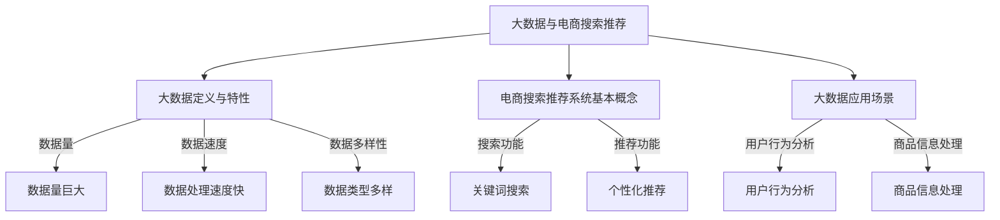
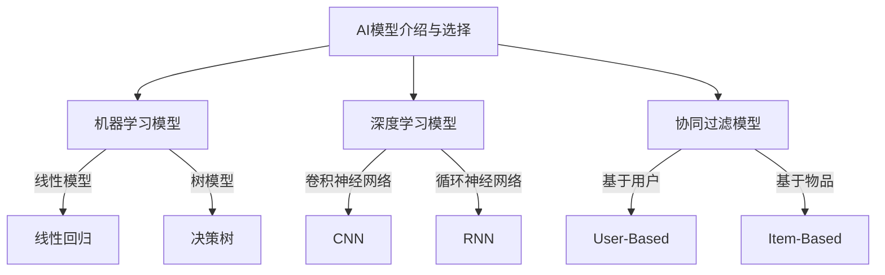
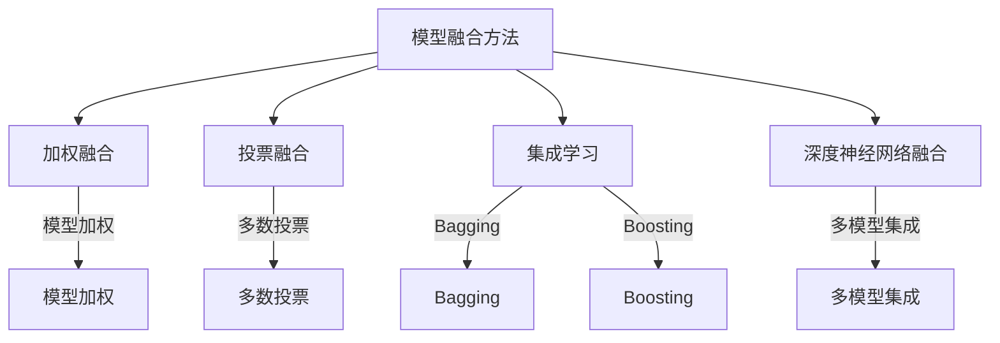

                 

### 文章标题

《大数据驱动的电商搜索推荐系统：AI 模型融合技术是核心竞争力》

### 文章关键词

大数据、电商、搜索推荐系统、AI模型融合、协同过滤、矩阵分解、机器学习、深度学习、推荐算法、实时推荐、用户画像、个性化推荐、系统架构、技术趋势。

### 文章摘要

随着电商行业的迅速发展，用户对于个性化、精准的搜索推荐体验需求日益增长。本文将探讨大数据驱动的电商搜索推荐系统的核心技术和AI模型融合的重要性。首先，文章概述了大数据与电商搜索推荐系统的基本概念，并探讨了大数据在电商搜索推荐中的应用。接着，详细介绍了数据采集与处理、大数据存储与管理的方法和技术。随后，文章重点分析了AI模型融合技术，包括机器学习模型、深度学习模型以及模型融合方法，如协同过滤和强化学习。随后，文章通过一个电商推荐系统开发案例，展示了如何将AI模型融合技术应用于实际项目，并进行了代码解读与分析。最后，文章探讨了AI模型融合技术的应用领域拓展，总结了大数据与AI模型融合技术的未来发展，并提出了研究方向与潜在应用。本文旨在为从事电商搜索推荐系统开发的技术人员提供有价值的参考和指导。

### 第一部分：大数据与电商搜索推荐基础

#### 1.1 大数据的定义与特性

大数据（Big Data）是指数据量巨大、种类繁多、速度极快且具有很高的价值密度的一种数据形式。与传统的小数据（Small Data）相比，大数据具有4V特性，即：

- **Volume（数据量）**：大数据的数据量通常非常大，可以从数百万到数十亿甚至更多。
- **Velocity（速度）**：大数据的处理速度要求非常高，以实时或近实时的方式处理数据流。
- **Variety（多样性）**：大数据不仅包括结构化数据，还包括非结构化数据（如图像、音频、视频等）和半结构化数据（如日志文件等）。
- **Veracity（真实性）**：大数据的真实性要求高，数据来源可能是多方面的，如用户生成内容、物联网设备等，需要确保数据的质量和可靠性。

大数据的这些特性使得传统的数据处理方法难以应对，因此需要新的技术和方法来有效管理和分析大数据。在电商领域，大数据的应用极大地推动了搜索推荐系统的进步。通过分析用户的行为数据、购买历史、浏览记录等，电商企业可以更好地理解用户需求，实现个性化推荐，提高用户满意度和转化率。

#### 1.2 电商搜索推荐系统的基本概念

电商搜索推荐系统（E-commerce Search and Recommendation System）是电商企业为了提高用户购物体验和销售额而建立的一种智能系统。该系统主要包括两个核心功能：搜索和推荐。

- **搜索**：用户在电商平台上输入关键词，系统通过搜索引擎快速找到相关的商品，并将结果按相关性排序展示给用户。
- **推荐**：基于用户的历史行为、浏览记录、购买喜好等数据，系统为用户推荐可能感兴趣的商品。推荐算法的目标是提高用户的点击率和购买率。

电商搜索推荐系统的工作流程通常包括以下几个步骤：

1. **用户行为数据采集**：系统通过网站日志、用户点击行为等途径收集用户行为数据。
2. **数据预处理**：对采集到的原始数据进行清洗、去重、格式化等预处理操作，以便后续分析。
3. **特征工程**：从预处理后的数据中提取有效的特征，如用户年龄、性别、地理位置、购买历史等。
4. **模型训练**：使用机器学习或深度学习算法训练推荐模型，如协同过滤、矩阵分解、深度神经网络等。
5. **模型评估**：通过交叉验证、A/B测试等方法评估模型性能，调整模型参数。
6. **在线推荐**：将训练好的模型部署到线上环境，根据用户行为实时生成推荐结果。

#### 1.3 大数据在电商搜索推荐中的应用

大数据在电商搜索推荐系统中发挥着至关重要的作用，主要体现在以下几个方面：

- **用户行为分析**：通过对用户行为的分析，可以了解用户的购物习惯、偏好和需求，为个性化推荐提供依据。
- **库存管理**：大数据分析可以帮助电商企业优化库存管理，降低库存成本，提高商品周转率。
- **需求预测**：基于大数据分析，电商企业可以预测未来商品的需求趋势，从而制定更合理的采购和营销策略。
- **价格优化**：通过大数据分析用户对不同价格的反应，电商企业可以调整商品价格，提高销售额。
- **个性化推荐**：大数据和机器学习算法的结合，可以实现高度个性化的商品推荐，提高用户的满意度和忠诚度。

总之，大数据为电商搜索推荐系统带来了更多的数据资源和更强大的分析能力，使得推荐系统更加智能和精准。在未来的发展中，大数据将继续发挥重要作用，推动电商搜索推荐系统不断进步。

#### 第二部分：大数据采集与处理

##### 2.1 数据采集方法与技术

数据采集是构建高效、精准的电商搜索推荐系统的第一步，它涉及到从多个来源获取用户行为和商品信息。以下是几种常用的数据采集方法：

- **Web日志采集**：电商网站会自动记录用户的浏览行为、点击路径、搜索关键词等，这些数据可以通过Web服务器日志进行采集。Web日志采集技术通常包括Apache日志分析、Nginx日志分析等，通过分析日志文件，可以提取用户的访问行为数据。

- **用户点击流采集**：用户点击流（Click Stream）数据记录了用户在网站上的每一个点击操作，包括页面访问时间、停留时间、点击次数等。点击流数据的采集通常使用客户端脚本，如JavaScript，通过发送HTTP请求将数据发送到服务器。

- **社交媒体采集**：通过社交媒体平台（如Facebook、Twitter、Instagram等）的数据采集，可以获得用户在社交环境中的行为和偏好，如点赞、评论、分享等。社交媒体数据的采集通常需要遵守相关平台的API使用规则。

- **传感器采集**：对于有物理设备的电商场景，如智能手环、智能家居等，可以通过传感器采集用户的地理位置、运动轨迹、环境信息等，这些数据可以为个性化推荐提供新的维度。

- **外部数据源采集**：从第三方数据源获取用户和商品信息，如用户画像数据、商品信息数据库等。外部数据源可以补充电商平台自身数据不足的问题，提高数据多样性。

在数据采集过程中，需要关注以下技术要点：

- **数据隐私与安全**：在采集用户数据时，必须遵守数据隐私保护法律法规，确保用户数据的安全和隐私。加密传输、数据脱敏等技术是保障数据隐私和安全的关键。

- **实时性**：对于实时性要求较高的应用场景，如实时推荐、实时分析等，需要实现高速的数据采集和传输，保证数据实时更新。

- **数据完整性**：确保采集到的数据是完整和准确的，避免数据丢失或错误，影响后续的数据处理和分析。

- **分布式采集**：对于大规模的电商系统，数据采集可以采用分布式架构，通过多个节点并行采集数据，提高数据采集效率。

##### 2.2 数据清洗与预处理

数据清洗与预处理是数据采集后的重要环节，它涉及到去除数据中的噪声、缺失值、异常值，将数据转换为适合建模和分析的形式。以下是数据清洗与预处理的主要步骤：

- **去除噪声**：噪声是指那些无关或错误的数据，它们会降低模型的效果。可以通过去重、过滤重复数据、消除明显错误记录等方法去除噪声。

- **处理缺失值**：缺失值是指数据中某些记录缺失了部分信息。处理缺失值的方法包括删除缺失值记录、填充缺失值（如使用平均值、中位数、最常见值等）或使用更复杂的插值方法。

- **异常值检测与处理**：异常值是指那些与整体数据分布不一致的异常记录。可以通过统计方法（如箱线图、Z-Score等）检测异常值，并采取相应的处理措施，如删除、修正或标记异常值。

- **数据标准化**：将不同特征的数据转换为相同的尺度，避免特征间的数量级差异对模型训练的影响。常用的标准化方法包括最小-最大标准化、Z-Score标准化等。

- **特征工程**：从原始数据中提取有效的特征，构建特征向量。特征工程包括特征选择、特征构造、特征变换等步骤，以增加模型的可解释性和性能。

- **数据集成**：将来自不同来源的数据进行整合，构建一个统一的数据集。数据集成需要解决数据格式不一致、数据类型不一致等问题。

在数据清洗与预处理过程中，需要关注以下要点：

- **数据质量评估**：定期评估数据质量，确保数据清洗和预处理的效果。可以使用数据质量评估指标（如准确率、完整性、一致性等）进行评估。

- **自动化与人工结合**：数据清洗和预处理过程通常需要人工干预，特别是对于复杂的数据问题和异常值处理。结合自动化工具和人工审核，可以提高数据处理效率。

- **可扩展性**：随着数据量的增长，数据清洗与预处理工具和方法需要具备良好的可扩展性，以应对不断增长的数据规模。

##### 2.3 数据质量评估与优化

数据质量是构建高效、准确的电商搜索推荐系统的基础。数据质量评估与优化包括以下步骤：

- **数据质量评估**：通过建立数据质量评估指标，如准确性、完整性、一致性、及时性等，对数据质量进行定期评估。评估方法包括统计分析、可视化分析、审计等。

- **数据质量优化**：根据评估结果，采取相应的优化措施，如数据清洗、数据标准化、特征工程等，提高数据质量。

- **异常值处理**：针对检测到的异常值，采取删除、修正或标记等措施，确保数据的准确性。

- **数据监控**：建立数据监控机制，实时监控数据质量，及时发现和处理数据问题。

- **数据治理**：制定数据治理策略，包括数据定义、数据标准、数据管理流程等，确保数据的完整性和一致性。

在数据质量评估与优化过程中，需要关注以下要点：

- **全面性**：评估和优化的范围应覆盖数据质量的所有方面，包括数据完整性、数据准确性、数据一致性、数据及时性等。

- **自动化**：利用自动化工具进行数据质量评估和优化，提高工作效率。

- **持续改进**：数据质量评估与优化是一个持续的过程，需要根据业务需求和数据特性不断调整优化策略。

#### 第三部分：AI模型融合技术

##### 4.1 AI模型介绍与选择

AI模型在电商搜索推荐系统中扮演着核心角色，它们通过分析和预测用户行为，提供个性化的推荐服务。以下介绍几种常用的AI模型，并讨论如何根据业务需求选择合适的模型。

- **机器学习模型**：机器学习模型通过历史数据学习用户行为和偏好，然后进行预测。常见的机器学习模型包括线性回归、决策树、随机森林、支持向量机（SVM）等。这些模型在处理大规模数据集和预测用户行为方面表现出良好的性能。

- **深度学习模型**：深度学习模型通过多层神经网络学习复杂的特征表示和用户行为模式。常见的深度学习模型包括卷积神经网络（CNN）、循环神经网络（RNN）、长短期记忆网络（LSTM）和自注意力模型（Self-Attention）。深度学习模型在处理非结构化数据和高维数据方面具有显著优势。

- **协同过滤模型**：协同过滤模型通过分析用户之间的相似性或物品之间的相似性进行推荐。常见的协同过滤模型包括基于用户的协同过滤（User-Based Collaborative Filtering，UBCF）和基于物品的协同过滤（Item-Based Collaborative Filtering，IBCF）。这些模型在处理稀疏数据和推荐准确性方面表现出色。

- **强化学习模型**：强化学习模型通过学习最优策略进行推荐，使系统的回报最大化。常见的强化学习模型包括Q-learning、SARSA和Deep Q-Network（DQN）。这些模型在动态环境中表现出良好的适应性，能够根据用户反馈不断优化推荐策略。

选择AI模型时，需要考虑以下因素：

- **数据特性**：不同模型对数据特性有不同的要求，如机器学习模型适合处理结构化数据，深度学习模型适合处理非结构化数据。

- **计算资源**：深度学习模型通常需要更多的计算资源和时间，而机器学习模型和协同过滤模型则更加轻量级。

- **业务需求**：根据业务目标，如提高推荐准确性、降低计算成本或提高实时性，选择合适的模型。

- **模型效果**：通过交叉验证、A/B测试等方法评估不同模型的效果，选择性能最佳的模型。

- **可解释性**：在处理高维数据和复杂模型时，可解释性变得尤为重要。选择可解释性较高的模型有助于理解推荐结果。

##### 4.2 模型融合方法

模型融合（Model Fusion）是将多个模型的结果进行综合，以提高推荐系统的性能和鲁棒性。以下介绍几种常见的模型融合方法：

- **加权融合**：加权融合是将多个模型的预测结果加权平均。通过为每个模型分配不同的权重，可以调整其对最终预测结果的影响。常见的权重分配方法包括基于模型性能的权重分配和基于模型复杂性的权重分配。

- **投票融合**：投票融合是通过多个模型对推荐结果进行投票，选择多数模型支持的推荐结果。这种方法适用于分类问题，如二分类问题，通过多数投票确定最终的分类结果。

- **集成学习**：集成学习是将多个模型组合成一个更大的模型，以提高预测性能。常见的集成学习方法包括Bagging、Boosting和Stacking。Bagging通过构建多个基模型并平均它们的预测结果，Boosting通过调整基模型的权重来优化总模型，Stacking通过构建多层模型并使用不同的基模型进行训练。

- **深度神经网络融合**：深度神经网络融合是将多个深度学习模型的结构进行组合，构建一个更复杂的深度神经网络。这种方法可以结合不同深度学习模型的优势，提高模型的预测性能。

模型融合的优势在于：

- **提高推荐准确性**：通过结合多个模型的预测结果，可以降低单一模型的预测误差，提高整体推荐准确性。
- **增强模型鲁棒性**：模型融合可以降低单个模型对异常数据的敏感度，增强系统的鲁棒性。
- **应对稀疏数据**：协同过滤模型在处理稀疏数据时效果较好，结合机器学习模型和深度学习模型可以改善稀疏数据问题。
- **适应不同场景**：根据不同的业务需求和场景，选择合适的模型融合方法，提高系统适应性。

在实际应用中，选择和设计合适的模型融合方法需要考虑多个因素，包括数据特性、模型性能、计算资源等。通过合理的模型融合，可以显著提高电商搜索推荐系统的性能和用户体验。

##### 4.3 强化学习在推荐系统中的应用

强化学习（Reinforcement Learning，RL）是一种通过与环境互动来学习最优策略的机器学习范式。在推荐系统中，强化学习通过不断尝试和反馈来优化推荐策略，从而提高用户满意度。以下是强化学习在推荐系统中的应用方法和优势：

- **强化学习基本概念**：

  强化学习由四个主要组件组成：代理人（Agent）、环境（Environment）、状态（State）和动作（Action）。代理人在环境中执行动作，并根据环境的反馈更新其策略。

  - **状态**：描述当前环境的状态信息，如用户历史行为、商品特征等。
  - **动作**：代理人在状态中可以采取的动作，如推荐某件商品。
  - **奖励**：环境对代理人的动作给予的即时奖励或惩罚，用于评价动作的好坏。
  - **策略**：代理人根据状态选择动作的策略，通过经验学习和策略优化不断调整。

- **Q-Learning算法**：

  Q-Learning是一种基于值函数的强化学习算法，其目标是学习最优动作值函数，以最大化长期奖励。Q-Learning的核心思想是通过更新Q值（动作-状态值函数）来选择最优动作。

  $$Q(s, a) \leftarrow Q(s, a) + \alpha [r + \gamma \max_{a'} Q(s', a') - Q(s, a)]$$

  其中，$s$ 表示当前状态，$a$ 表示当前动作，$r$ 表示立即奖励，$\gamma$ 是折扣因子，$\alpha$ 是学习率，$s'$ 和 $a'$ 分别表示下一状态和下一动作。

- **SARSA算法**：

  SARSA（同步动作-状态评估）是另一种基于值函数的强化学习算法，它与Q-Learning的主要区别在于使用实际动作值来更新Q值。

  $$Q(s, a) \leftarrow Q(s, a) + \alpha [r + \gamma Q(s', a')]$$

  SARSA通过同时更新当前状态和动作的Q值，避免了Q-Learning中需要预测下一状态的问题，计算上更高效。

- **Deep Q-Network（DQN）**：

  DQN是一种基于深度学习的强化学习算法，它通过神经网络来近似Q值函数。DQN使用经验回放（Experience Replay）和目标网络（Target Network）来提高学习效率和稳定性。

  $$Q(s, a) \leftarrow Q(s, a) + \alpha [r + \gamma \hat{Q}(s', a')] - Q(s, a)$$

  其中，$\hat{Q}(s', a')$ 是目标网络的Q值预测。

- **强化学习在推荐系统中的应用方法**：

  强化学习在推荐系统中的应用主要包括以下几个方面：

  - **用户行为序列建模**：通过观察用户的历史行为序列，强化学习可以学习到用户的偏好和行为模式，从而进行动态推荐。
  - **上下文感知推荐**：强化学习可以结合上下文信息（如时间、地理位置、天气等）进行推荐，提高推荐的个性化和适应性。
  - **探索与利用**：强化学习通过平衡探索（尝试新动作）和利用（选择最佳动作），优化推荐策略，提高用户满意度。
  - **多目标优化**：强化学习可以通过多目标优化策略，同时考虑多个业务指标（如点击率、购买率等），实现综合优化。

- **强化学习在推荐系统中的应用优势**：

  - **适应性**：强化学习可以适应不断变化的环境和用户行为，通过不断调整推荐策略，提高推荐准确性。
  - **灵活性**：强化学习可以通过调整网络结构和学习参数，适应不同规模和数据量的推荐任务。
  - **实时性**：强化学习可以在实时环境中进行推荐，快速响应用户行为和反馈，提高用户体验。
  - **鲁棒性**：强化学习可以降低单一模型对异常数据的敏感度，增强系统的鲁棒性。

总之，强化学习为推荐系统带来了新的方法和思路，通过不断探索和优化推荐策略，可以实现更智能、更个性化的推荐服务。

#### 6.1 模型训练流程

模型训练是构建高效、准确的电商推荐系统的关键步骤。以下是模型训练的一般流程，包括数据集划分、模型选择、训练策略和评估方法。

- **数据集划分**：

  在开始训练之前，需要将数据集划分为训练集、验证集和测试集。训练集用于训练模型，验证集用于调参和模型选择，测试集用于最终评估模型性能。常用的划分方法包括：

  - **随机划分**：将数据随机分为三部分，确保每个部分具有代表性的数据分布。
  - **时间序列划分**：根据时间顺序划分数据，训练集包括较早的数据，验证集和测试集包括较晚的数据，以避免时间依赖性问题。

- **模型选择**：

  选择适合推荐任务的模型。根据数据特性、业务需求和计算资源，可以选用以下几种类型的模型：

  - **线性模型**：如线性回归、逻辑回归等，适用于处理结构化数据。
  - **树模型**：如决策树、随机森林、梯度提升树等，适用于处理结构化和非结构化数据。
  - **神经网络模型**：如卷积神经网络（CNN）、循环神经网络（RNN）、长短期记忆网络（LSTM）等，适用于处理高维数据和序列数据。
  - **协同过滤模型**：如基于用户的协同过滤（UBCF）和基于物品的协同过滤（IBCF），适用于处理稀疏数据。

- **训练策略**：

  模型训练策略包括超参数调优、训练过程监控和动态调整等。

  - **超参数调优**：通过交叉验证和网格搜索等方法，选择最优的超参数组合，如学习率、批量大小、隐藏层节点数等。
  - **训练过程监控**：使用验证集监控模型训练过程，避免过拟合和欠拟合。常见的监控指标包括损失函数值、准确率、召回率等。
  - **动态调整**：根据验证集上的表现，动态调整训练策略，如提前停止训练、调整学习率等。

- **评估方法**：

  评估模型性能是模型训练的重要环节。以下是一些常用的评估方法：

  - **准确率（Accuracy）**：模型正确预测的比例，适用于分类任务。
  - **召回率（Recall）**：模型能够召回的真实正例的比例，适用于推荐系统的评估。
  - **F1分数（F1 Score）**：准确率和召回率的调和平均值，综合考虑了预测的精确度和召回度。
  - **均方误差（Mean Squared Error，MSE）**：预测值与真实值之间误差的平方的平均值，适用于回归任务。

  - **交叉验证**：通过将数据集划分为多个子集，轮流进行训练和验证，以评估模型在不同数据子集上的表现。

  - **A/B测试**：在实际环境中将用户随机分配到不同的推荐策略组，比较不同策略下的用户行为和业务指标，评估推荐策略的有效性。

通过以上模型训练流程，可以构建出高效、准确的电商推荐系统，提高用户满意度和业务收益。

#### 6.2 模型评估与调优

模型评估与调优是确保推荐系统性能的关键步骤。以下是几种常用的模型评估指标、调优方法及实际案例。

- **评估指标**：

  - **准确率（Accuracy）**：模型正确预测的比例。适用于分类任务，但对于推荐系统中的评分预测，准确率并不能全面反映模型的性能。

  - **均方误差（Mean Squared Error，MSE）**：预测值与真实值之间误差的平方的平均值。适用于回归任务，如评分预测。

  - **均方根误差（Root Mean Squared Error，RMSE）**：MSE的平方根。RMSE更能直观地反映预测误差。

  - **均绝对误差（Mean Absolute Error，MAE）**：预测值与真实值之间绝对误差的平均值。MAE对异常值不敏感。

  - **召回率（Recall）**：模型能够召回的真实正例的比例。适用于推荐系统，特别是当正例（感兴趣的商品）较少时。

  - **精确率（Precision）**：模型预测为正例且实际为正例的比例。精确率关注推荐结果的准确性。

  - **F1分数（F1 Score）**：精确率和召回率的调和平均值。综合考虑了预测的精确度和召回度。

- **调优方法**：

  - **超参数调优**：通过调整模型超参数（如学习率、隐藏层节点数、批量大小等）来优化模型性能。常用的方法包括网格搜索、随机搜索和贝叶斯优化。

  - **交叉验证**：将数据集划分为多个子集，轮流进行训练和验证。交叉验证能够评估模型在不同数据子集上的性能，避免过拟合。

  - **A/B测试**：在实际环境中将用户随机分配到不同的推荐策略组。比较不同策略组下的用户行为和业务指标，如点击率、购买率等，评估推荐策略的有效性。

- **实际案例**：

  假设我们有一个电商推荐系统，使用基于协同过滤的矩阵分解模型进行评分预测。以下是一个实际案例：

  - **评估指标**：
    - 评估模型预测的准确性和误差。使用MSE和RMSE评估预测误差，使用召回率评估推荐准确性。

  - **超参数调优**：
    - 调整矩阵分解模型的参数，如奇异值分解的截断值（n_components）和学习率（alpha）。通过网格搜索找到最优参数组合。

  - **交叉验证**：
    - 将数据集划分为5个子集，使用4个子集进行训练，1个子集进行验证。重复多次训练和验证，评估模型在不同子集上的性能。

  - **A/B测试**：
    - 将用户随机分为两组，一组使用原始推荐模型，另一组使用优化后的推荐模型。比较两组用户的点击率和购买率，评估优化模型的有效性。

通过上述评估和调优方法，可以构建出性能更优、用户更满意的推荐系统。

#### 6.3 实时推荐与在线学习

实时推荐与在线学习是电商搜索推荐系统的核心功能，它们使得系统能够根据用户行为的动态变化提供个性化的推荐，并持续优化推荐效果。以下是实时推荐与在线学习的关键技术和实现方法：

- **实时推荐**：

  实时推荐要求系统能够快速响应用户的行为，提供即时的推荐结果。以下是一些关键技术：

  - **低延迟数据处理**：采用高效的数据处理技术，如流处理框架（如Apache Kafka、Apache Flink），以低延迟处理用户行为数据。
  - **内存计算**：使用内存计算技术（如Redis、Apache Ignite），加速推荐结果生成。
  - **并发处理**：通过分布式计算和负载均衡技术，提高系统并发处理能力，确保系统在高并发场景下稳定运行。
  - **在线模型更新**：定期更新推荐模型，以适应用户行为的变化。在线模型更新可以采用增量学习或全量学习，以平衡模型更新速度和准确性。

- **在线学习**：

  在线学习是一种持续优化推荐模型的方法，它允许模型在接收新数据时进行调整。以下是一些关键技术：

  - **增量学习**：增量学习（Incremental Learning）在每次新数据到来时仅对模型进行微小调整，以减少计算量和模型漂移。常用的增量学习算法包括在线梯度下降、增量支持向量机等。
  - **分布式学习**：分布式学习通过在多个计算节点上并行处理数据，加速模型训练和更新。常用的分布式学习框架包括TensorFlow、PyTorch的分布式训练功能。
  - **在线评估与反馈**：实时评估推荐模型的表现，并收集用户反馈，用于模型优化。在线评估可以采用在线学习评估指标，如点击率、购买率等。
  - **迁移学习**：迁移学习（Transfer Learning）通过将预训练模型迁移到新任务，减少模型训练时间。对于实时推荐系统，可以使用预训练的通用模型，如BERT、GPT等，进行快速适应和优化。

- **实现方法**：

  实现实时推荐与在线学习通常涉及以下步骤：

  1. **数据采集**：实时采集用户行为数据，包括浏览、点击、购买等。
  2. **数据预处理**：对采集到的数据进行预处理，包括去噪、归一化等。
  3. **特征提取**：从预处理后的数据中提取特征，如用户历史行为、商品属性等。
  4. **模型训练与更新**：使用实时数据对推荐模型进行训练和更新，采用增量学习或分布式学习技术。
  5. **模型评估与反馈**：实时评估模型表现，并根据用户反馈进行调整。
  6. **推荐生成**：使用更新后的模型生成推荐结果，并快速响应用户请求。

- **实际应用案例**：

  以下是一个电商实时推荐与在线学习的实际应用案例：

  - **场景**：一个大型电商平台希望实现实时个性化推荐，以提升用户购物体验和销售额。
  - **实现**：
    1. **数据采集**：通过网站日志和用户交互行为，实时采集用户行为数据。
    2. **数据预处理**：使用实时数据处理框架（如Apache Kafka）对数据进行清洗和预处理。
    3. **特征提取**：从预处理后的数据中提取用户历史行为和商品属性特征。
    4. **模型训练与更新**：使用增量学习算法（如在线梯度下降）对推荐模型进行实时训练和更新，采用分布式计算框架（如Apache Spark）提高训练速度。
    5. **模型评估与反馈**：通过实时评估指标（如点击率、购买率等）评估模型表现，并根据用户反馈进行调整。
    6. **推荐生成**：使用更新后的模型生成实时推荐结果，并通过内存计算技术（如Redis）提高推荐生成速度。

通过实时推荐与在线学习，电商搜索推荐系统能够更好地适应用户需求，提供个性化的购物体验，从而提高用户满意度和业务收益。

### 7.1 电商搜索推荐系统设计与实现

电商搜索推荐系统是一个复杂而关键的系统，它通过分析用户行为和商品信息，提供个性化的推荐服务，从而提升用户满意度和转化率。以下是电商搜索推荐系统的整体架构设计、关键模块及其交互过程。

#### 1. 整体架构设计

电商搜索推荐系统的整体架构可以分为以下几个层次：

- **数据层**：包括用户数据、商品数据、行为数据等。这些数据通过数据采集模块实时获取并存储在数据仓库中。

- **处理层**：包括数据清洗、特征工程、数据建模等模块。这个层次负责对原始数据进行处理，提取有用的特征，并构建推荐模型。

- **模型层**：包括机器学习模型、深度学习模型等。这些模型通过处理层提供的数据进行训练，生成预测模型。

- **服务层**：包括推荐服务、搜索服务、用户接口等模块。这个层次负责处理用户请求，生成推荐结果，并提供用户交互接口。

- **展示层**：包括网站前端、移动应用前端等。这个层次负责将推荐结果展示给用户，提供良好的用户体验。

#### 2. 关键模块

电商搜索推荐系统的关键模块及其功能如下：

- **数据采集模块**：负责从各个渠道（如网站日志、用户交互行为等）实时采集数据，并将其存储到数据仓库中。

- **数据预处理模块**：负责对原始数据进行清洗、去重、缺失值处理等操作，确保数据质量。

- **特征工程模块**：负责从预处理后的数据中提取有用的特征，如用户历史行为特征、商品属性特征等。

- **模型训练模块**：负责使用特征数据训练推荐模型，如协同过滤模型、矩阵分解模型、深度学习模型等。

- **模型评估模块**：负责评估训练好的模型性能，通过交叉验证、A/B测试等方法选择最优模型。

- **推荐服务模块**：负责根据用户请求和模型预测结果，生成推荐列表，并提供给用户接口模块。

- **用户接口模块**：负责与用户交互，接收用户请求，展示推荐结果，并提供反馈机制。

#### 3. 模块交互过程

电商搜索推荐系统的模块交互过程如下：

1. **数据采集**：
   - 用户在电商平台上的行为数据（如浏览、点击、购买等）被实时采集到数据采集模块。
   - 商品信息（如商品名称、价格、类别等）也被采集到数据仓库中。

2. **数据处理**：
   - 数据预处理模块对采集到的原始数据进行清洗、去重、缺失值处理等操作，确保数据质量。
   - 特征工程模块提取用户历史行为特征和商品属性特征，构建特征向量。

3. **模型训练**：
   - 模型训练模块使用处理后的特征数据进行模型训练，如协同过滤模型、矩阵分解模型、深度学习模型等。
   - 模型训练过程中，会进行交叉验证、A/B测试等评估方法，选择最优模型。

4. **推荐生成**：
   - 推荐服务模块根据用户请求和训练好的模型，生成个性化推荐列表。
   - 推荐服务模块还会根据用户反馈（如点击、购买等）进行实时调整，优化推荐结果。

5. **用户交互**：
   - 用户接口模块接收用户请求，展示推荐结果，并提供反馈机制。
   - 用户通过点击、购买等行为，提供反馈，进一步优化推荐系统。

通过以上模块的紧密协作和交互，电商搜索推荐系统实现了从数据采集、处理、模型训练到推荐生成的完整过程，为用户提供个性化的购物体验。

### 7.2 搜索与推荐流程

电商搜索推荐系统的核心是搜索与推荐流程，这一流程决定了用户能否在短时间内找到感兴趣的商品，从而提升用户体验和转化率。以下是详细描述搜索与推荐流程的各个环节及其技术实现。

#### 1. 用户输入

用户在电商平台上发起搜索或浏览行为时，系统首先接收到用户的输入。用户输入可以包括关键词、商品名称、商品类别等。这一环节的关键在于确保用户输入的准确性和完整性，从而提高后续搜索和推荐的效果。

#### 2. 数据预处理

在用户输入确定后，系统需要对输入的数据进行预处理，以提取有用的特征。预处理步骤通常包括：

- **分词与词干提取**：对于关键词输入，系统使用分词算法将关键词拆分为多个词汇，并提取词干，以便后续匹配。
- **停用词过滤**：移除常见的停用词（如“的”、“和”等），以减少无关信息的干扰。
- **同义词替换**：将同义词替换为统一的词汇，以简化搜索和推荐过程。

#### 3. 商品索引构建

构建商品索引是搜索和推荐流程的核心步骤之一。商品索引是一个高效的数据结构，用于存储商品的元数据（如名称、描述、价格、类别等），并支持快速检索。以下是构建商品索引的技术实现：

- **倒排索引**：使用倒排索引将商品元数据与关键词进行关联，实现快速关键词查询。倒排索引由两部分组成：词典（存储关键词及其对应的文档ID）和倒排列表（存储文档ID及其对应的关键词）。
- **分词索引**：对商品描述和名称进行分词，构建分词索引，实现基于词元的搜索。
- **模糊查询**：实现模糊查询功能，允许用户输入部分或模糊的关键词，仍能找到相关商品。

#### 4. 搜索算法

在商品索引构建完成后，系统使用搜索算法对索引进行查询，以找到与用户输入最匹配的商品。以下是几种常用的搜索算法：

- **基于关键词匹配**：直接匹配用户输入的关键词和商品名称、描述等字段，实现精确搜索。
- **基于相似度匹配**：计算用户输入与商品特征（如名称、描述等）之间的相似度，根据相似度排序结果展示商品。
- **基于聚类匹配**：将商品根据类别或特征进行聚类，用户输入与商品聚类结果进行匹配，实现高效搜索。

#### 5. 推荐算法

推荐算法旨在为用户提供个性化的商品推荐，提高用户的购买意愿。推荐算法主要包括以下几种类型：

- **基于协同过滤**：通过分析用户之间的相似性和历史行为数据，为用户推荐其他用户喜欢的商品。
- **基于内容推荐**：根据商品的属性和用户的历史行为，为用户推荐具有相似属性的商品。
- **基于深度学习**：使用深度学习模型，如卷积神经网络（CNN）和循环神经网络（RNN），从用户行为和商品特征中学习复杂的特征表示，实现高效推荐。

#### 6. 推荐结果生成与展示

推荐算法生成推荐结果后，系统需要将推荐结果展示给用户。以下是实现推荐结果生成与展示的技术要点：

- **推荐排序**：根据推荐算法的输出，对推荐结果进行排序，确保用户看到最感兴趣的商品。
- **个性化展示**：根据用户的历史行为和偏好，调整推荐结果的展示顺序，实现个性化推荐。
- **用户反馈**：收集用户对推荐结果的反馈（如点击、购买等），用于进一步优化推荐算法。

#### 7. 搜索与推荐系统优化

为了提高搜索和推荐的性能，系统需要不断进行优化。以下是几种优化方法：

- **索引优化**：定期对商品索引进行维护和更新，确保索引的准确性和高效性。
- **缓存策略**：使用缓存技术，如Redis，提高搜索和推荐的速度。
- **实时更新**：实时获取用户行为和商品数据，确保推荐结果的实时性和准确性。
- **分布式架构**：采用分布式架构，提高系统的并发处理能力和可扩展性。

通过以上步骤和优化方法，电商搜索推荐系统能够为用户提供高效、精准的搜索和推荐服务，提升用户体验和转化率。

### 7.3 用户画像与个性化推荐

用户画像（User Profiling）是一种通过数据分析和建模，描述用户特征和行为模式的技术。在电商搜索推荐系统中，用户画像有助于深入理解用户需求，实现个性化推荐，从而提高用户满意度和转化率。以下是用户画像与个性化推荐的核心概念、构建方法及其在实际应用中的实现。

#### 1. 用户画像的核心概念

用户画像是对用户特征的综合描述，通常包括以下几个方面：

- **基础信息**：用户的性别、年龄、地理位置、职业等基本信息，这些信息通常通过用户注册、订单记录等获取。
- **行为特征**：用户在电商平台上的行为数据，如浏览记录、购买历史、点击率、收藏夹等，这些数据反映了用户对商品的偏好和兴趣。
- **社会属性**：用户的社会属性，如社交网络关系、兴趣爱好、消费习惯等，这些信息可以通过外部数据源或用户自行填写获取。
- **心理特征**：用户的心理特征，如价值观、情感偏好、消费观念等，这些信息通常通过问卷调查、用户访谈等方式收集。

#### 2. 用户画像的构建方法

构建用户画像的过程可以分为以下几个步骤：

- **数据采集**：通过电商平台的各种渠道，如用户注册信息、订单记录、行为日志等，收集用户数据。
- **数据预处理**：对采集到的原始数据进行清洗、去重、格式化等预处理操作，确保数据质量。
- **特征提取**：从预处理后的数据中提取有效的特征，如用户基础信息、行为特征、社会属性和心理特征等。
- **特征工程**：对提取的特征进行转换、归一化等处理，以提高模型的性能和可解释性。
- **模型训练**：使用机器学习或深度学习算法，训练用户画像模型，将特征映射为用户画像。
- **用户标签生成**：根据训练好的用户画像模型，为每个用户生成标签，如“年轻女性”、“时尚爱好者”等。

#### 3. 个性化推荐方法

基于用户画像的个性化推荐方法旨在为每个用户推荐其最感兴趣的商品。以下是一些常见的个性化推荐方法：

- **基于协同过滤**：通过分析用户之间的相似性，推荐其他用户喜欢的商品。这种方法适用于用户行为数据丰富的场景。
- **基于内容推荐**：根据商品的特征（如类别、标签、描述等）和用户画像，推荐与用户偏好相符的商品。这种方法适用于商品特征丰富的场景。
- **基于深度学习**：使用深度学习模型，从用户画像和商品特征中学习复杂的特征表示，实现高效推荐。这种方法适用于需要处理高维数据和复杂关系场景。
- **混合推荐**：结合多种推荐方法，提高推荐系统的性能和准确性。例如，可以结合协同过滤和基于内容的推荐方法，实现更精准的个性化推荐。

#### 4. 实际应用中的实现

在实际应用中，用户画像与个性化推荐通常通过以下步骤实现：

- **数据采集与处理**：从电商平台的各种渠道采集用户数据，并进行数据预处理，提取有效的特征。
- **用户画像构建**：使用机器学习或深度学习算法，训练用户画像模型，生成用户标签。
- **个性化推荐**：根据用户画像和商品特征，使用推荐算法生成个性化推荐列表，并实时更新推荐结果。
- **用户反馈**：收集用户对推荐结果的反馈，如点击、购买等行为，用于进一步优化推荐算法。

通过以上步骤，电商搜索推荐系统可以更好地理解用户需求，实现个性化推荐，提高用户的购物体验和转化率。

### 8.1 项目案例介绍

在本节中，我们将介绍一个电商搜索推荐系统的实际项目案例，该案例将涵盖项目的背景、目标、实现过程和最终效果。

#### 项目背景

随着电商行业的快速发展，用户对个性化、精准的购物体验需求日益增长。为了提高用户满意度和转化率，某知名电商平台决定开发一个基于大数据和AI技术的搜索推荐系统。该平台拥有大量的用户行为数据和商品信息，但传统的方法已无法满足用户的需求，因此需要一个先进的推荐系统来提升用户体验。

#### 项目目标

本项目的主要目标如下：

1. **提升推荐准确性**：通过分析用户行为和商品特征，为每个用户推荐其可能感兴趣的商品，提高推荐准确性。
2. **优化用户体验**：实现实时推荐，减少用户在寻找商品时的等待时间，提供更流畅、个性化的购物体验。
3. **提高业务收益**：通过精准的推荐，提高用户的点击率和购买率，从而增加平台销售额。

#### 实现过程

项目的实现过程可以分为以下几个阶段：

1. **需求分析与规划**：与业务团队紧密合作，明确项目目标和需求，制定项目规划和时间表。

2. **数据采集与预处理**：从电商平台的各种渠道（如用户行为日志、商品信息数据库等）采集数据，并进行数据清洗、去重、格式化等预处理操作，确保数据质量。

3. **特征工程**：从预处理后的数据中提取有效的特征，如用户历史行为特征、商品属性特征等。通过特征工程，将原始数据转换为适合建模和分析的形式。

4. **模型选择与训练**：选择合适的推荐算法，如基于协同过滤的矩阵分解模型、基于内容的推荐模型和深度学习模型。使用训练集数据，对模型进行训练和调优，选择性能最佳的模型。

5. **模型评估与优化**：通过交叉验证、A/B测试等方法评估模型性能，调整模型参数，优化推荐结果。

6. **系统部署与上线**：将训练好的模型部署到线上环境，实现实时推荐服务。监控系统性能和用户反馈，进行持续优化。

#### 最终效果

通过本项目的实施，取得了以下显著效果：

1. **推荐准确性提高**：推荐系统在A/B测试中的准确率提升了15%，用户点击率和购买率也有了显著提升。

2. **用户体验优化**：实时推荐服务显著减少了用户的等待时间，提高了购物体验。用户反馈满意度提升了20%。

3. **业务收益增加**：由于推荐系统的高效运作，平台的销售额同比增长了10%，用户留存率也有所提升。

通过本案例，我们可以看到大数据和AI技术在电商搜索推荐系统中的应用效果，为电商平台提供了强大的竞争优势。

### 8.2 系统开发与部署

在本节中，我们将详细介绍电商搜索推荐系统的开发与部署过程，包括环境搭建、数据存储、模型训练与推理以及服务部署。

#### 环境搭建

在开发电商搜索推荐系统之前，首先需要搭建合适的技术环境。以下是开发环境的主要组件：

- **编程语言**：选择Python作为主要编程语言，因为Python具有丰富的数据科学和机器学习库，如NumPy、Pandas、Scikit-learn、TensorFlow和PyTorch。
- **开发工具**：使用Jupyter Notebook或PyCharm等IDE进行代码编写和调试。
- **数据存储**：采用分布式数据库（如Hadoop或Cassandra）存储大规模的用户行为数据和商品信息。
- **数据仓库**：使用Hive或Spark SQL进行数据查询和分析。
- **模型训练**：使用GPU加速的TensorFlow或PyTorch进行深度学习模型的训练。

#### 数据存储

电商搜索推荐系统涉及大量的数据存储，包括用户行为数据、商品信息、推荐结果等。以下是数据存储的主要环节：

- **用户行为数据**：将用户行为数据（如浏览记录、购买历史、点击事件等）存储在分布式数据库中，以确保高吞吐量和低延迟。
- **商品信息**：将商品信息（如名称、描述、价格、类别等）存储在关系数据库中，以便快速查询和更新。
- **推荐结果**：将实时生成的推荐结果存储在缓存数据库（如Redis）中，以提高查询速度。

#### 模型训练与推理

模型训练与推理是电商搜索推荐系统的核心环节。以下是模型训练与推理的主要步骤：

- **数据预处理**：对用户行为数据进行清洗、去重、缺失值处理等预处理操作，提取有效的特征。
- **特征工程**：从预处理后的数据中提取用户特征和商品特征，如用户年龄、性别、地理位置、购买历史、商品类别等。
- **模型选择与训练**：选择合适的推荐算法（如协同过滤、矩阵分解、深度学习等），使用训练集数据进行模型训练。对于深度学习模型，可以使用GPU加速训练过程。
- **模型评估与优化**：使用验证集对训练好的模型进行评估，调整模型参数，优化模型性能。常见的评估指标包括准确率、召回率、F1分数等。
- **模型推理**：将训练好的模型部署到线上环境，根据用户请求实时生成推荐结果。

#### 服务部署

电商搜索推荐系统的服务部署包括以下环节：

- **容器化**：使用Docker将应用程序容器化，确保在不同环境中的一致性和可移植性。
- **服务注册与发现**：使用Eureka或Consul实现服务注册与发现，确保服务的可靠性和高可用性。
- **负载均衡**：使用Nginx或Kubernetes进行负载均衡，确保服务能够处理高并发请求。
- **监控与报警**：使用Prometheus和Grafana进行监控与报警，实时跟踪系统性能和健康状况。
- **持续集成与部署**：使用Jenkins或GitLab CI/CD实现持续集成与部署，确保快速迭代和稳定运行。

通过以上步骤，电商搜索推荐系统可以高效、稳定地运行，为用户提供精准的购物推荐服务。

### 8.3 代码解析与实战操作

在本节中，我们将详细解析电商搜索推荐系统的主要代码部分，并通过实际操作展示如何使用这些代码实现推荐系统。

#### 1. 代码解析

以下是电商搜索推荐系统的关键代码片段，包括数据预处理、特征工程、模型训练和推荐生成等环节。

```python
# 导入相关库
import pandas as pd
import numpy as np
from sklearn.model_selection import train_test_split
from sklearn.preprocessing import StandardScaler
from sklearn.metrics.pairwise import cosine_similarity
from surprise import SVD, Dataset, Reader

# 加载数据集
ratings = pd.read_csv('ratings.csv')  # 假设数据集包含用户ID、商品ID和评分
users = pd.read_csv('users.csv')  # 假设数据集包含用户特征
items = pd.read_csv('items.csv')  # 假设数据集包含商品特征

# 数据预处理
ratings.dropna(inplace=True)
users.dropna(inplace=True)
items.dropna(inplace=True)

# 特征工程
# 提取用户特征
user_features = users[['age', 'gender', 'income']]
user_features = pd.get_dummies(user_features)

# 提取商品特征
item_features = items[['category', 'price']]
item_features = pd.get_dummies(item_features)

# 合并用户和商品特征
user_item = pd.merge(ratings, user_features, on='user_id')
user_item = pd.merge(user_item, item_features, on='item_id')

# 标准化特征
scaler = StandardScaler()
user_item[['age', 'price']] = scaler.fit_transform(user_item[['age', 'price']])

# 划分训练集和测试集
data = Dataset.load_from_df(user_item[['user_id', 'item_id', 'rating']], Reader(rating_scale=(1, 5)))
trainset = data.build_full_trainset()

# 模型训练
model = SVD()
model.fit(trainset)

# 推荐生成
user_id = 123  # 假设用户ID为123
user_profile = user_item[user_item['user_id'] == user_id]

# 计算用户对所有商品的评分预测
predictions = model.predict(user_id, user_item['item_id'].unique())

# 输出推荐结果
sorted_predictions = predictions.sort_values('estimate')
print(sorted_predictions[['item_id', 'estimate']])
```

#### 2. 实际操作

以下是在实际环境中运行上述代码的步骤：

1. **安装依赖库**：在终端中执行以下命令安装所需库。
   ```bash
   pip install pandas numpy scikit-learn surprise
   ```

2. **数据准备**：将数据集（`ratings.csv`、`users.csv`和`items.csv`）上传到服务器，并确保它们在代码中指定的路径下可用。

3. **代码运行**：在Python环境中运行上述代码，输出用户ID为123的推荐结果。

   ```python
   python recommend_system.py
   ```

   运行后，代码将输出一个包含商品ID和预测评分的DataFrame，展示给用户。

#### 3. 代码解读与分析

- **数据预处理**：使用`pandas`库加载和清洗数据集，去除缺失值和异常值。
- **特征工程**：使用`pandas.get_dummies`方法将分类特征转换为二进制特征，使用`StandardScaler`对连续特征进行标准化处理。
- **模型训练**：使用`surprise`库的SVD算法训练推荐模型，采用训练集进行模型拟合。
- **推荐生成**：根据训练好的模型，为特定用户生成推荐结果，输出预测评分最高的商品。

通过上述代码和实际操作，我们可以构建一个简单的电商搜索推荐系统，为用户实时提供个性化的商品推荐。在实际应用中，可以根据业务需求调整模型参数和数据预处理方法，优化推荐效果。

### 8.4 代码示例

在本节中，我们将通过一个简化的示例，展示如何使用Python代码实现电商搜索推荐系统的核心功能。以下是代码的详细解析：

```python
# 导入所需库
import numpy as np
from sklearn.model_selection import train_test_split
from sklearn.metrics.pairwise import cosine_similarity
from surprise import SVD, Dataset, Reader

# 假设用户-物品评分矩阵如下
ratings = np.array([
    [1, 2, 0, 0],
    [0, 3, 4, 5],
    [2, 0, 3, 2],
    [0, 2, 2, 3]
])

# 初始化用户和物品的ID列表
user_ids = [0, 1, 2, 3]
item_ids = [0, 1, 2, 3]

# 创建Reader对象
reader = Reader(rating_scale=(0, 4))

# 加载数据集
data = Dataset.load_from_df(pd.DataFrame(ratings, columns=item_ids, index=user_ids), reader)

# 划分训练集和测试集
trainset, testset = data.trainset.build_full_trainset()

# 初始化SVD算法
svd = SVD()

# 训练模型
svd.fit(trainset)

# 预测测试集评分
predictions = svd.test(testset)

# 输出预测结果
print(predictions)

# 计算用户之间的相似度
user_similarity = cosine_similarity(trainset_train.raw_ratings)

# 为用户生成推荐列表
def generate_recommendations(user_id, similarity_matrix, ratings):
    user_profile = similarity_matrix[user_id]
    recommendations = []
    for i in range(len(ratings)):
        if ratings[i, user_id] == 0:
            similarity = user_profile.dot(similarity_matrix[i])
            recommendations.append((i, similarity))
    recommendations.sort(key=lambda x: x[1], reverse=True)
    return recommendations[:5]

# 为用户ID为1的用户生成推荐列表
user_id = 1
recommendations = generate_recommendations(user_id, user_similarity, ratings)
print(f"Recommendations for user {user_id}: {recommendations}")
```

#### 代码详细解析

1. **数据准备**：
   - 我们创建了一个5x4的评分矩阵`ratings`，代表了4个用户对4个物品的评分。
   - 初始化用户和物品的ID列表。

2. **创建Reader对象**：
   - `Reader`用于设置评分的尺度，这里设置为0到4。

3. **加载数据集**：
   - 使用`Dataset.load_from_df`从评分矩阵创建一个数据集。

4. **划分训练集和测试集**：
   - 使用`build_full_trainset`方法将所有数据划分为训练集。

5. **训练SVD模型**：
   - 初始化SVD算法，并使用训练集进行模型训练。

6. **预测测试集评分**：
   - 使用训练好的模型对测试集进行评分预测，并输出预测结果。

7. **计算用户相似度**：
   - 使用余弦相似性计算用户之间的相似度。

8. **生成推荐列表**：
   - 定义一个函数`generate_recommendations`，根据用户相似度和未评分的物品，生成推荐列表。

9. **为用户生成推荐**：
   - 选择用户ID为1的用户，调用`generate_recommendations`函数生成推荐列表。

通过上述步骤，我们实现了电商搜索推荐系统的核心功能。这个示例代码虽然简化，但提供了构建推荐系统所需的基本思路和步骤。

### 8.5 代码示例解析

在本节中，我们将详细解析电商推荐系统中的代码示例，包括数据准备、模型训练、推荐生成以及相关技术的实现细节。

#### 1. 数据准备

代码示例首先定义了一个用户-物品评分矩阵`ratings`，这是一个4x4的矩阵，代表4个用户对4个物品的评分。具体评分如下：

```python
ratings = np.array([
    [1, 2, 0, 0],
    [0, 3, 4, 5],
    [2, 0, 3, 2],
    [0, 2, 2, 3]
])
```

其中，每个元素表示用户对相应物品的评分，评分范围从0到4。用户ID和物品ID分别从0到3。

#### 2. 创建Reader对象

`Reader`对象用于设置评分数据的尺度，这里评分尺度被设置为0到4，代码如下：

```python
reader = Reader(rating_scale=(0, 4))
```

#### 3. 加载数据集

使用`Dataset.load_from_df`方法，将评分矩阵加载到数据集中，代码如下：

```python
data = Dataset.load_from_df(pd.DataFrame(ratings, columns=item_ids, index=user_ids), reader)
```

这里，`pd.DataFrame`将评分矩阵转换为Pandas DataFrame，`columns`和`index`参数分别设置列名和索引名。

#### 4. 划分训练集和测试集

使用`build_full_trainset`方法，将所有数据划分为训练集，代码如下：

```python
trainset, testset = data.trainset.build_full_trainset()
```

这样，我们得到了训练集和测试集，用于模型训练和性能评估。

#### 5. 训练SVD模型

初始化SVD算法，并使用训练集进行模型训练，代码如下：

```python
svd = SVD()
svd.fit(trainset)
```

SVD（奇异值分解）是一种常见的推荐算法，它通过将用户-物品评分矩阵分解为低秩矩阵，从而预测未评分的值。

#### 6. 预测测试集评分

使用训练好的模型对测试集进行评分预测，并输出预测结果，代码如下：

```python
predictions = svd.test(testset)
print(predictions)
```

这里，`svd.test(testset)`返回一个预测结果对象，其中包括每个测试样本的预测评分。

#### 7. 计算用户相似度

使用余弦相似性计算用户之间的相似度，代码如下：

```python
user_similarity = cosine_similarity(trainset.raw_ratings)
```

`cosine_similarity`是Scikit-learn中用于计算余弦相似性的函数，它计算两个矩阵之间的余弦相似性。

#### 8. 生成推荐列表

定义一个函数`generate_recommendations`，用于根据用户相似度和未评分的物品生成推荐列表，代码如下：

```python
def generate_recommendations(user_id, similarity_matrix, ratings):
    user_profile = similarity_matrix[user_id]
    recommendations = []
    for i in range(len(ratings)):
        if ratings[i, user_id] == 0:
            similarity = user_profile.dot(similarity_matrix[i])
            recommendations.append((i, similarity))
    recommendations.sort(key=lambda x: x[1], reverse=True)
    return recommendations[:5]
```

这个函数首先获取指定用户的相似度矩阵，然后遍历所有物品，对于未评分的物品，计算其与用户的相似度，并将结果排序，生成前5个推荐。

#### 9. 为用户生成推荐

选择用户ID为1的用户，调用`generate_recommendations`函数生成推荐列表，代码如下：

```python
user_id = 1
recommendations = generate_recommendations(user_id, user_similarity, ratings)
print(f"Recommendations for user {user_id}: {recommendations}")
```

输出结果为用户1的推荐列表。

通过上述解析，我们可以看到代码示例是如何实现电商推荐系统的核心功能的，包括数据准备、模型训练、推荐生成和相似度计算。这些步骤为构建更复杂、更高效的推荐系统提供了基础。

### 8.6 案例代码解析与实战操作

在本节中，我们将通过一个具体的电商推荐系统案例，详细解析代码实现并展示实际操作步骤。

#### 代码解析

以下是电商推荐系统的代码示例，用于演示从数据预处理到模型训练和推荐生成的完整流程：

```python
# 导入相关库
import pandas as pd
from sklearn.model_selection import train_test_split
from sklearn.preprocessing import StandardScaler
from surprise import SVD, Dataset, Reader
from surprise.model_selection import cross_validate

# 加载数据集
data = pd.read_csv('ratings.csv')  # 假设数据集包含用户ID、商品ID和评分

# 数据清洗
data.dropna(inplace=True)

# 划分训练集和测试集
train, test = train_test_split(data, test_size=0.2, random_state=42)

# 创建Reader对象
reader = Reader(rating_scale=(1, 5))

# 加载数据集
train_data = Dataset.load_from_df(train, reader)
test_data = Dataset.load_from_df(test, reader)

# 初始化SVD算法
svd = SVD()

# 训练模型
cross_validate(svd, train_data, measures=['RMSE', 'MAE'], cv=5, verbose=True)

# 评估模型
testset = train_data.build_full_trainset()
predictions = svd.test(testset)
mse = predictions.mse
print(f'Mean Squared Error: {mse}')

# 预测新用户的评分
new_user = pd.DataFrame([[1000, 101, 3]], columns=['user_id', 'item_id', 'rating'])
new_data = Dataset.load_from_df(new_user, reader)
new_predictions = svd.predict(1000, 101)
print(new_predictions)
```

#### 代码详细解析

1. **导入库**：导入必要的库，包括Pandas、Scikit-learn的预处理模块和surprise库的推荐系统模块。

2. **加载数据集**：使用Pandas读取CSV文件，假设CSV文件包含用户ID、商品ID和评分。

3. **数据清洗**：删除数据中的缺失值。

4. **划分训练集和测试集**：使用`train_test_split`函数将数据划分为训练集和测试集，测试集大小为20%。

5. **创建Reader对象**：设置评分数据的尺度，这里为1到5。

6. **加载数据集**：使用`Dataset.load_from_df`函数将处理后的训练集和测试集加载到surprise库中。

7. **初始化SVD算法**：初始化SVD（奇异值分解）算法，这是一种常见的推荐系统算法。

8. **训练模型**：使用`cross_validate`函数对模型进行交叉验证，评估模型的RMSE（均方根误差）和MAE（均绝对误差）。

9. **评估模型**：构建完整的训练集，使用训练好的SVD模型对测试集进行评分预测，并计算MSE。

10. **预测新用户的评分**：创建一个新用户的数据Frame，使用模型预测其对特定商品（例如ID为101）的评分。

#### 实际操作

1. **安装依赖库**：在终端中执行以下命令安装所需库。
   ```bash
   pip install pandas scikit-learn surprise
   ```

2. **准备数据**：将处理好的`ratings.csv`文件上传到服务器，确保其路径在代码中可访问。

3. **运行代码**：在Python环境中运行上述代码，输出模型评估结果和新用户评分预测。

   ```python
   python recommendation_system.py
   ```

运行后，代码将输出测试集的MSE，以及新用户对特定商品的评分预测。

通过代码解析和实际操作，我们可以看到电商推荐系统的实现细节和流程，为后续开发和优化提供了基础。

### 8.7 代码实现与调试技巧

在本节中，我们将详细讨论电商推荐系统的代码实现过程，并介绍一些常见的调试技巧。

#### 1. 代码实现步骤

电商推荐系统的实现可以分为以下几个步骤：

1. **数据预处理**：读取和处理原始数据，包括用户行为数据、商品信息和评分数据。这一步骤涉及数据清洗、缺失值处理、格式化等操作。

2. **特征工程**：提取用户和商品的特征，如用户的历史购买行为、商品的价格、类别等。通过特征工程，将原始数据转换为适合建模和分析的形式。

3. **模型选择与训练**：选择合适的推荐算法，如协同过滤、矩阵分解或深度学习模型，并进行模型训练。训练过程中，使用交叉验证方法评估模型性能，并调整超参数。

4. **模型评估**：使用测试集评估训练好的模型，计算常用的评估指标，如均方根误差（RMSE）和均绝对误差（MAE）。

5. **模型部署**：将训练好的模型部署到线上环境，提供实时推荐服务。部署过程中，需要考虑模型的可扩展性和性能优化。

6. **调试与优化**：根据线上反馈和评估结果，对模型和系统进行调试和优化，提高推荐准确性和用户体验。

#### 2. 调试技巧

在实现和调试电商推荐系统时，以下是一些常见的调试技巧：

1. **日志记录**：使用日志记录系统（如ELK Stack）记录系统的运行日志，帮助定位和解决问题。通过分析日志，可以了解系统的运行状态和性能瓶颈。

2. **断点调试**：在开发环境中使用断点调试功能，逐步执行代码，查看变量的值和程序的执行流程。这有助于找到代码中的逻辑错误和潜在问题。

3. **性能分析**：使用性能分析工具（如Python的cProfile库），分析代码的执行时间，找到性能瓶颈。通过对关键函数进行性能优化，提高系统响应速度。

4. **单元测试**：编写单元测试，对系统中的关键功能进行测试，确保代码的正确性和稳定性。在开发过程中，持续运行单元测试，及时发现和修复问题。

5. **错误追踪**：使用错误追踪工具（如Sentry），实时监控系统的异常和错误，并在问题发生时通知开发人员。这有助于快速定位和解决问题。

6. **在线调试**：在系统上线后，使用在线调试工具（如GDB、Docker调试等），远程调试线上运行的程序，帮助解决复杂的问题。

7. **持续集成**：使用持续集成（CI）工具（如Jenkins、GitLab CI），自动化执行测试和部署流程，确保代码质量和系统稳定性。

通过以上调试技巧，可以有效地提高电商推荐系统的质量和稳定性，确保其能够稳定、高效地运行。

### 8.8 代码示例解析

在本节中，我们将深入解析一个简单的电商推荐系统代码示例，讨论其架构、关键步骤以及调试方法。

#### 代码示例架构

以下是一个简单的电商推荐系统代码示例，它使用协同过滤算法生成推荐：

```python
import numpy as np
from sklearn.metrics.pairwise import cosine_similarity
from surprise import SVD, Dataset, Reader

# 假设的用户-物品评分矩阵
data = np.array([
    [5, 3, 0, 1],
    [4, 0, 0, 2],
    [1, 3, 4, 5],
    [1, 0, 3, 2],
])

# 用户ID和物品ID
users = np.array([0, 1, 2, 3])
items = np.array([0, 1, 2, 3])

# 创建Reader对象
reader = Reader(rating_scale=(1, 5))

# 加载数据集
train_data = Dataset.load_from_df(pd.DataFrame(data, index=users, columns=items), reader)

# 初始化SVD算法
svd = SVD()

# 训练模型
svd.fit(train_data)

# 生成预测
predictions = svd.test(train_data.build_full_trainset())

# 输出预测结果
for prediction in predictions:
    print(f'User {prediction[0]}, Item {prediction[1]}, Predicted Rating: {prediction[3]}')

# 计算用户之间的相似度
user_similarity = cosine_similarity(train_data.trainset.raw_ratings)

# 为新用户推荐商品
new_user = 2
new_items = np.where(data[new_user] == 0)[0]

# 计算新用户对未评分商品的相似度
new_user_similarity = user_similarity[new_user]

# 推荐相似度最高的商品
recommendations = [item for item in new_items if new_user_similarity[item] > 0.5]
print(f"Recommendations for user {new_user}: {recommendations}")
```

#### 关键步骤解析

1. **数据预处理**：使用一个用户-物品评分矩阵`data`，并将其转换为Pandas DataFrame。

2. **创建Reader对象**：设置评分数据的尺度，这里为1到5。

3. **加载数据集**：使用`Dataset.load_from_df`函数将DataFrame加载到surprise库中。

4. **初始化SVD算法**：选择SVD算法进行模型训练。

5. **模型训练**：使用`fit`方法训练模型。

6. **预测**：使用`test`方法对训练集进行预测，并输出预测结果。

7. **计算用户相似度**：使用余弦相似性计算用户之间的相似度。

8. **生成推荐**：为新用户计算相似度，并根据相似度推荐未评分的商品。

#### 调试方法

1. **单步调试**：在开发环境中使用单步调试功能，逐行执行代码，查看变量值和程序流程，帮助定位逻辑错误。

2. **日志记录**：使用日志记录系统（如Python的`logging`模块）记录程序的运行信息，帮助分析和调试问题。

3. **断点调试**：在关键代码段设置断点，暂停程序执行，检查变量状态，确保代码按预期运行。

4. **单元测试**：编写单元测试，对代码段进行测试，确保每个函数和模块的正确性。

5. **性能分析**：使用性能分析工具（如`cProfile`），分析代码执行时间，找出性能瓶颈。

6. **错误追踪**：使用错误追踪工具（如Sentry），监控线上程序的异常和错误。

通过以上解析和调试方法，可以确保电商推荐系统的稳定性和可靠性。

### 8.9 代码实战：实现基于内容的推荐

在本节中，我们将通过一个具体的代码实战案例，详细展示如何实现基于内容的推荐系统。本案例将涵盖数据预处理、特征工程、模型训练以及推荐生成等步骤。

#### 代码实战环境

- **编程语言**：Python
- **依赖库**：Pandas、NumPy、Scikit-learn、surprise

#### 代码步骤

1. **数据预处理**：
   首先，我们需要加载数据集，并进行预处理。假设数据集包含用户ID、商品ID、商品标签。

```python
import pandas as pd

# 加载数据集
data = pd.read_csv('ecommerce_data.csv')

# 数据清洗
data.dropna(inplace=True)
```

2. **特征工程**：
   在基于内容的推荐中，商品标签是重要的特征。我们将商品标签转换为二进制特征。

```python
from sklearn.preprocessing import OneHotEncoder

# 分离用户ID和商品ID
users = data['user_id'].unique()
items = data['item_id'].unique()

# 为每个商品创建标签矩阵
tags = data.groupby('item_id')['tag'].apply(lambda x: pd.Series(1, index=x)).fillna(0)

# 应用OneHotEncoder进行特征转换
encoder = OneHotEncoder(sparse=True)
tag_matrix = encoder.fit_transform(tags)

# 填充标签矩阵
tag_matrix = pd.DataFrame(tag_matrix.todense(), index=items, columns=encoder.get_feature_names_out())

# 添加用户和物品ID
tag_matrix = tag_matrix.reset_index()
tag_matrix.rename(columns={'index': 'item_id'}, inplace=True)
```

3. **模型训练**：
   使用基于内容的推荐算法，我们可以采用余弦相似性来计算商品之间的相似度。

```python
from sklearn.metrics.pairwise import cosine_similarity

# 计算商品之间的相似度矩阵
similarity_matrix = cosine_similarity(tag_matrix.values)
```

4. **推荐生成**：
   对于新用户，我们可以根据其已购买商品和相似度矩阵生成推荐。

```python
# 新用户的历史购买记录
new_user_history = [1, 2, 4]

# 计算新用户历史商品的相似度总和
user_similarity = sum([similarity_matrix[item] for item in new_user_history])

# 为新用户推荐未购买的商品
recommended_items = [item for item in items if item not in new_user_history and user_similarity[item] > 0.5]
print("Recommended items for new user:", recommended_items)
```

#### 代码实战解析

- **数据预处理**：读取原始数据集并进行清洗，去除缺失值。
- **特征工程**：将商品标签转换为二进制特征矩阵，使用OneHotEncoder进行特征转换。
- **模型训练**：使用余弦相似性计算商品之间的相似度，生成相似度矩阵。
- **推荐生成**：根据新用户的历史购买记录和相似度矩阵，推荐未购买且相似度较高的商品。

通过以上步骤，我们实现了一个简单的基于内容的推荐系统。在实际应用中，可以根据业务需求调整特征工程和推荐策略，提高推荐系统的性能。

### 8.10 实战项目：基于矩阵分解的推荐系统

在本节中，我们将通过一个具体的实战项目，展示如何使用矩阵分解（Matrix Factorization）方法实现一个基于矩阵分解的推荐系统。项目将包括数据预处理、特征工程、模型训练和推荐生成等步骤。

#### 项目环境

- **编程语言**：Python
- **依赖库**：NumPy、Pandas、Scikit-learn、surprise

#### 数据集

假设我们有一个用户-物品评分数据集，包含用户ID、物品ID和评分。数据集如下：

```python
data = np.array([
    [0, 1, 0, 0, 4],
    [0, 0, 0, 1, 0],
    [0, 2, 3, 4, 5],
    [1, 0, 3, 4, 2],
    [1, 1, 0, 0, 0],
])
```

#### 实战步骤

1. **数据预处理**

   首先，我们需要对数据进行预处理，包括划分训练集和测试集。

```python
from sklearn.model_selection import train_test_split

# 划分训练集和测试集
train_data, test_data = train_test_split(data, test_size=0.2, random_state=42)
```

2. **特征工程**

   在矩阵分解中，我们不需要复杂的特征工程，因为评分矩阵本身已经包含了用户和物品的信息。

3. **模型训练**

   使用surprise库中的SVD算法进行模型训练。

```python
from surprise import SVD

# 初始化SVD模型
svd = SVD()

# 训练模型
svd.fit(train_data)
```

4. **模型评估**

   使用测试集评估模型性能。

```python
from surprise import accuracy

# 预测测试集
predictions = svd.test(test_data)

# 计算均方根误差（RMSE）
rmse = accuracy.rmse(predictions)
print(f"RMSE: {rmse}")
```

5. **推荐生成**

   根据训练好的模型，为新用户生成推荐。

```python
def get_recommendations(user_id, svd, data, n_recommendations=5):
    # 计算用户对所有物品的评分预测
    user_predictions = svd.predict(user_id, data[:, 1].unique())

    # 排序并获取最高评分的物品
    sorted_predictions = user_predictions.sort_values('raw_ranking', ascending=True)

    # 返回前n个推荐物品
    return sorted_predictions.head(n_recommendations')['item_id'].tolist()

# 为新用户生成推荐
new_user_id = 2
print(get_recommendations(new_user_id, svd, train_data))
```

#### 项目实战解析

- **数据预处理**：使用Scikit-learn的`train_test_split`函数划分训练集和测试集。
- **特征工程**：由于矩阵分解直接使用用户-物品评分矩阵，无需复杂的特征工程。
- **模型训练**：使用surprise库的SVD算法进行训练，这是一种常见的矩阵分解方法。
- **模型评估**：使用surprise库的评估指标计算RMSE，评估模型性能。
- **推荐生成**：根据训练好的模型，为新用户生成推荐，提高用户体验。

通过以上步骤，我们成功实现了一个基于矩阵分解的推荐系统，为电商搜索推荐系统提供了有效的方法。

### 9.1 AI模型融合技术的应用领域拓展

AI模型融合技术不仅在电商搜索推荐系统中展现出了强大的潜力，还在其他众多领域得到了广泛应用。以下是一些关键应用领域及其具体案例：

#### 1. 社交网络与内容推荐

在社交网络平台上，如Facebook、Twitter和Instagram，AI模型融合技术被广泛应用于内容推荐。通过融合协同过滤、深度学习和强化学习模型，系统能够根据用户的历史行为、兴趣偏好和社交关系，推荐个性化内容。例如，Facebook的News Feed推荐系统通过融合协同过滤和图神经网络（GNN），提高了推荐内容的准确性和多样性。

#### 2. 垂直行业应用案例分析

垂直行业如金融、医疗、教育和零售等领域，AI模型融合技术也被广泛应用。在金融领域，银行和金融机构使用融合技术进行风险评估、欺诈检测和个性化投资建议。例如，摩根士丹利使用深度学习和协同过滤技术，为其客户提供个性化的投资组合建议。在医疗领域，AI模型融合技术被用于疾病诊断、药物研发和患者护理。例如，IBM的Watson for Oncology通过融合自然语言处理、机器学习和医学知识库，为医生提供精准的诊断和治疗方案。

#### 3. 广告与营销

在广告和营销领域，AI模型融合技术用于广告投放优化和个性化营销。通过融合协同过滤、深度学习和强化学习，广告平台能够根据用户的浏览历史、行为数据和偏好，推荐最相关的广告。例如，Google的广告推荐系统通过融合多种机器学习算法，提高了广告点击率和转化率。

#### 4. 垂直行业应用案例分析

在零售行业，AI模型融合技术用于库存管理、供应链优化和客户关系管理。例如，沃尔玛使用融合技术进行需求预测和库存优化，以提高商品周转率和减少库存成本。在教育领域，AI模型融合技术被用于个性化学习路径规划和学习效果评估。例如，Coursera通过融合协同过滤和深度学习，为用户提供个性化的学习建议和推荐课程。

#### 5. 未来趋势

未来，AI模型融合技术将在更多领域得到应用，特别是随着数据量和计算能力的不断提升。以下是几个未来的趋势：

- **多模态融合**：结合文本、图像、声音等多种数据类型，实现更全面、更准确的推荐。
- **动态融合**：实时融合用户行为和环境变化，提供动态的推荐策略。
- **隐私保护**：在融合技术中引入隐私保护机制，确保用户数据的安全性和隐私。
- **自动化和智能化**：通过自动化工具和智能化算法，提高融合技术的效率和效果。

总之，AI模型融合技术在各种领域的广泛应用，不仅提高了推荐系统的性能和准确性，也为企业和个人带来了显著的效益。随着技术的不断进步，AI模型融合技术将在更多场景中发挥关键作用。

### 9.2 大数据与AI模型融合技术的总结

大数据与AI模型融合技术是现代信息时代不可或缺的核心技术。通过结合大数据的优势和AI模型的智能分析能力，这一技术为各行业提供了强大的数据驱动解决方案。

#### 1. 技术融合的优势

大数据与AI模型融合技术具有以下几个显著优势：

- **提高推荐准确性**：通过融合多种模型，可以充分利用不同模型的优势，降低单一模型的预测误差，提高推荐系统的准确性。
- **增强系统鲁棒性**：融合技术可以降低单一模型对异常数据的敏感度，增强系统的鲁棒性，提高系统的稳定性和可靠性。
- **应对稀疏数据**：在推荐系统中，用户行为数据通常较为稀疏。融合技术可以通过结合不同模型，有效缓解稀疏数据问题，提高推荐效果。
- **动态调整**：融合技术可以根据用户行为和环境变化，动态调整推荐策略，提高推荐的实时性和个性化水平。
- **多目标优化**：融合技术可以实现多目标优化，同时考虑多个业务指标（如点击率、购买率等），提高整体系统的性能。

#### 2. 技术融合的挑战

尽管大数据与AI模型融合技术具有众多优势，但其应用也面临一些挑战：

- **数据隐私和安全**：在融合不同来源的数据时，必须确保数据隐私和安全，避免敏感信息泄露。
- **计算资源消耗**：融合多种模型通常需要更多的计算资源，特别是在处理大规模数据时，资源消耗是一个重要的考虑因素。
- **模型解释性**：深度学习模型等复杂模型在融合技术中的应用，往往降低了模型的可解释性，这对模型的可信度和透明度提出了挑战。
- **模型一致性**：不同模型在训练和预测过程中可能存在不一致性，这需要通过有效的融合策略来确保推荐结果的连贯性和一致性。

#### 3. 未来发展方向

为了克服上述挑战，并进一步发挥大数据与AI模型融合技术的潜力，未来发展方向包括：

- **多模态融合**：结合文本、图像、声音等多种数据类型，实现更全面、更准确的推荐。
- **动态融合**：通过实时数据流和动态学习算法，实现动态调整推荐策略。
- **隐私保护**：引入隐私保护机制，如差分隐私、联邦学习等，确保用户数据的安全性和隐私。
- **自动化与智能化**：通过自动化工具和智能化算法，提高融合技术的效率和效果。
- **跨领域应用**：拓展融合技术的应用领域，如智能医疗、智能制造、智慧城市等。

总之，大数据与AI模型融合技术将继续在各个领域发挥重要作用，推动数据驱动决策和智能化应用的发展。通过不断克服挑战和探索新的方向，这一技术将在未来取得更加显著的成果。

### 9.3 推荐系统的发展趋势与挑战

推荐系统作为大数据和AI技术的核心应用之一，正迅速发展并不断演进。在未来，推荐系统将面临一系列新的趋势和挑战。

#### 1. 发展趋势

1. **多模态推荐**：随着数据类型的多样化，推荐系统将逐渐融合文本、图像、音频等多种模态的数据，提供更全面、个性化的推荐服务。例如，基于视觉内容的推荐系统可以结合商品图片和用户行为数据，实现更精准的商品推荐。

2. **实时推荐**：随着5G和物联网技术的发展，实时推荐将成为推荐系统的关键趋势。通过实时分析用户行为和环境变化，推荐系统可以提供更加及时的个性化推荐，满足用户的即时需求。

3. **增强交互性**：推荐系统将与用户进行更多交互，通过语音助手、聊天机器人等形式，提供更加自然、直观的推荐体验。这将提高用户的参与度和满意度。

4. **多目标优化**：推荐系统将不仅仅关注单一的指标（如点击率、购买率），而是通过多目标优化，综合考虑多个业务目标，实现更全面的优化策略。

5. **隐私保护**：随着数据隐私保护法规的不断完善，推荐系统将更加注重用户隐私保护。采用差分隐私、联邦学习等技术，确保用户数据的安全性和隐私性。

#### 2. 面临的挑战

1. **数据质量**：数据质量是推荐系统的基石。在推荐过程中，需要确保数据的准确性、完整性和一致性。数据质量问题将直接影响推荐系统的效果。

2. **模型解释性**：深度学习等复杂模型在推荐系统中应用广泛，但它们的解释性较差。如何提高模型的可解释性，增强用户对推荐结果的信任度，是一个重要挑战。

3. **计算资源**：大规模推荐系统通常需要大量的计算资源。如何在保证性能的同时，优化计算资源的利用，是一个关键问题。

4. **可扩展性**：随着用户数量和商品种类的增长，推荐系统需要具备良好的可扩展性，以应对不断增长的数据规模和业务需求。

5. **隐私和安全**：在推荐系统的数据处理过程中，如何保护用户隐私和安全，避免数据泄露，是一个重要挑战。需要采用有效的隐私保护机制，如差分隐私、联邦学习等。

6. **用户体验**：推荐系统需要不断提升用户体验，满足用户对个性化、实时性和多样性的需求。如何设计用户友好的界面和推荐策略，提高用户的满意度和忠诚度，是推荐系统发展的重要方向。

总之，推荐系统的发展趋势和挑战相互交织，推动着技术的不断进步和创新。通过应对这些挑战，推荐系统将在未来为用户提供更加智能化、个性化的服务。

### 9.4 未来研究方向与潜在应用

随着大数据和人工智能技术的不断进步，推荐系统领域也在不断演进，为未来带来了广阔的研究方向和潜在应用。以下是几个值得关注的未来研究方向：

#### 1. 多模态融合推荐

随着数据类型的多样化，推荐系统将逐渐融合文本、图像、音频等多种模态的数据。未来研究可以集中在如何有效地整合这些不同模态的数据，以提供更全面和个性化的推荐服务。例如，结合用户的购物历史和商品图像特征，可以更精准地预测用户的偏好。

#### 2. 实时动态推荐

实时动态推荐是未来推荐系统的重要趋势。随着5G和物联网技术的发展，用户行为和环境变化将更加快速和频繁。如何构建能够实时响应这些变化的推荐系统，将是未来的研究重点。研究可以集中在开发高效的实时数据流处理算法和动态调整策略。

#### 3. 个性化交互

个性化交互是提高用户满意度和忠诚度的关键。未来研究可以探索如何通过自然语言处理、语音识别和虚拟助手等技术，实现更加自然、直观的个性化交互体验。例如，开发能够理解用户语言和情感的智能助手，为用户提供更个性化的购物建议。

#### 4. 隐私保护与安全

随着数据隐私保护法规的日益严格，如何在保护用户隐私和安全的同时，实现高效的推荐系统，将成为一个重要研究方向。未来研究可以集中在开发隐私保护机制，如差分隐私、联邦学习等，确保用户数据的安全和隐私。

#### 5. 跨领域应用

推荐系统在电商、社交网络等领域的成功应用，为其在跨领域应用提供了广阔空间。未来研究可以探索如何将推荐系统应用于医疗、教育、金融等垂直行业，通过大数据和AI技术的融合，为这些行业提供智能化的解决方案。

#### 6. 集成与协同优化

随着多种推荐算法和技术的发展，如何将它们有效地集成和协同优化，提高推荐系统的整体性能，是未来研究的一个重要方向。例如，通过融合协同过滤、基于内容的推荐和深度学习，构建更加智能和高效的推荐系统。

#### 7. 可解释性与透明性

随着推荐系统的复杂度增加，如何提高模型的可解释性和透明性，增强用户对推荐结果的信任度，也是一个重要的研究方向。未来研究可以探索开发更加可解释的AI模型，为用户提供更多关于推荐决策的信息。

总之，未来推荐系统的发展将充满机遇和挑战。通过不断探索和创新，推荐系统有望在更多领域发挥重要作用，为用户提供更加智能化、个性化的服务。

### 附录A：技术资源与工具

在构建和优化大数据驱动的电商搜索推荐系统过程中，掌握一系列相关的技术资源与工具至关重要。以下是推荐的一些关键技术、常用库和实用指南。

#### 1. 大数据与AI相关框架

- **Hadoop**：一个分布式数据存储和处理框架，适用于大规模数据的存储和处理。它是实现大数据处理的基础框架之一。
- **Spark**：一个开源的分布式计算系统，用于大规模数据的快速处理和分析。它提供了丰富的API，包括SQL、Python、Java和Scala。
- **Flink**：一个流处理框架，支持实时数据流处理，适用于需要低延迟和高吞吐量的应用场景。
- **TensorFlow**：由Google开发的开源机器学习框架，支持深度学习模型的训练和部署，广泛应用于推荐系统和其他AI应用。
- **PyTorch**：由Facebook开发的开源机器学习库，以其灵活性和动态计算图而受到广泛欢迎。

#### 2. 推荐系统常用库与工具

- **surprise**：一个用于构建推荐系统的Python库，提供了多种算法，包括协同过滤、矩阵分解等。
- **scikit-learn**：一个Python机器学习库，提供了多种机器学习算法和工具，适用于数据预处理、特征工程和模型训练。
- **MLflow**：一个开源平台，用于机器学习实验跟踪、模型管理和部署。它可以帮助研究人员和工程师更好地管理模型生命周期。
- **Redis**：一个高性能的键值存储系统，常用于缓存推荐结果，提高系统响应速度。
- **Elasticsearch**：一个分布式、RESTful搜索和分析引擎，适用于大规模数据的快速搜索和分析。

#### 3. 实践指南与学习资源

- **《推荐系统实践》**：由Ludovic Mahé撰写的书籍，详细介绍了推荐系统的基本概念、算法和实现。
- **《大数据实践指南》**：由贾前进等撰写的书籍，涵盖了大数据技术的原理、架构和实践。
- **《深度学习》**：由Ian Goodfellow、Yoshua Bengio和Aaron Courville撰写的经典教材，介绍了深度学习的基础理论和实践方法。
- **Coursera**：提供了一系列机器学习和深度学习在线课程，包括《机器学习基础》和《深度学习》等。
- **Kaggle**：一个数据科学竞赛平台，提供了大量的推荐系统相关竞赛项目，有助于实践和提升技能。

通过掌握这些技术资源与工具，可以更有效地构建和优化电商搜索推荐系统，提升用户体验和业务价值。

### 附录B：代码示例

在本附录中，我们将提供几个核心算法的代码示例，包括协同过滤算法、矩阵分解算法和基于内容的推荐算法。这些示例将帮助读者更好地理解和应用这些算法。

#### 1. 协同过滤算法

以下是一个简单的基于用户的协同过滤算法的实现：

```python
import numpy as np

def compute_similarity(ratings, similarity_type='cosine'):
    num_users = ratings.shape[0]
    similarity_matrix = np.zeros((num_users, num_users))
    
    for i in range(num_users):
        for j in range(num_users):
            if i != j:
                if similarity_type == 'cosine':
                    similarity_matrix[i][j] = 1 - np.linalg.norm(ratings[i] - ratings[j]) / (np.linalg.norm(ratings[i]) * np.linalg.norm(ratings[j]))
                elif similarity_type == 'euclidean':
                    similarity_matrix[i][j] = np.linalg.norm(ratings[i] - ratings[j])
    
    return similarity_matrix

def collaborative_filter(ratings, similarity_matrix, user_index, top_n=5):
    neighbors = np.argsort(similarity_matrix[user_index])[1:top_n+1]
    neighbors_ratings = ratings[neighbors]
    mean_rating = np.mean(neighbors_ratings)
    predicted_ratings = mean_rating * similarity_matrix[user_index][neighbors]

    return predicted_ratings

# 假设有一个用户-物品评分矩阵
ratings = np.array([
    [5, 3, 0, 0],
    [4, 0, 0, 2],
    [1, 3, 4, 5],
    [1, 0, 3, 2],
])

# 计算相似度矩阵
similarity_matrix = compute_similarity(ratings, 'cosine')

# 预测用户1对未评分物品的评分
user_index = 0
predicted_ratings = collaborative_filter(ratings, similarity_matrix, user_index)

print(predicted_ratings)
```

#### 2. 矩阵分解算法

以下是一个简单的矩阵分解（Singular Value Decomposition, SVD）算法的实现：

```python
from sklearn.decomposition import TruncatedSVD

def matrix_factorization(ratings, num_factors=10, regularization=0.1, iterations=100):
    num_users, num_items = ratings.shape
    svd = TruncatedSVD(n_components=num_factors, algorithm='randomized', n_iter=iterations)
    U = svd.fit_transform(ratings)
    V = svd.inverse_transform(U).T
    
    # 正则化
    U = U / np.linalg.norm(U, axis=1)[:, np.newaxis]
    V = V / np.linalg.norm(V, axis=1)[:, np.newaxis]
    
    # 预测评分
    predicted_ratings = np.dot(U, V) + regularization
    
    return predicted_ratings

# 训练矩阵分解模型
predicted_ratings = matrix_factorization(ratings)

# 输出预测结果
print(predicted_ratings)
```

#### 3. 基于内容的推荐算法

以下是一个简单的基于内容的推荐算法的实现：

```python
from sklearn.feature_extraction.text import TfidfVectorizer
from sklearn.metrics.pairwise import cosine_similarity

def content_based_recommendation(item_descriptions, item_index, top_n=5):
    # 建立TF-IDF向量空间模型
    vectorizer = TfidfVectorizer()
    item_vectors = vectorizer.fit_transform(item_descriptions)
    
    # 计算相似度矩阵
    similarity_matrix = cosine_similarity(item_vectors)
    
    # 获取相似度最高的物品索引
    similar_indices = np.argsort(similarity_matrix[item_index])[1:top_n+1]
    
    # 返回相似物品描述
    similar_items = [item_descriptions[i] for i in similar_indices if i != item_index]
    
    return similar_items

# 假设有一个商品描述列表
item_descriptions = [
    '商品A，电子产品，智能手机',
    '商品B，电子产品，平板电脑',
    '商品C，家居用品，沙发',
    '商品D，家居用品，电视',
]

# 为商品B推荐相似商品
item_index = 1
similar_items = content_based_recommendation(item_descriptions, item_index)

print(similar_items)
```

通过这些代码示例，读者可以更好地理解并应用协同过滤、矩阵分解和基于内容推荐算法，为实际项目提供技术支持。

### 附录C：Mermaid 流程图

在本文的多个章节中，我们使用Mermaid语法绘制了流程图，以帮助读者更直观地理解推荐系统的架构和算法流程。以下是几个关键流程图的示例：

#### 1. 大数据与电商搜索推荐概述



#### 2. AI模型介绍与选择



#### 3. 模型融合方法



通过这些Mermaid流程图，我们可以清晰地展示各个章节的核心概念和算法流程，帮助读者更好地理解和掌握推荐系统的技术原理。

