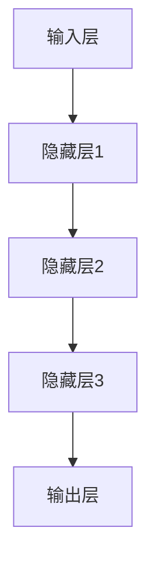
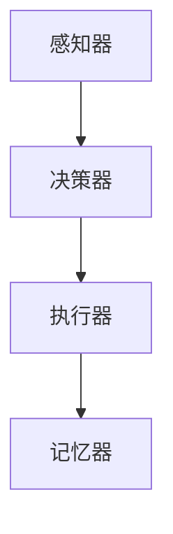
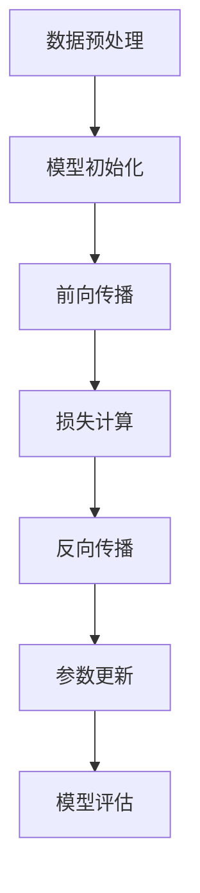
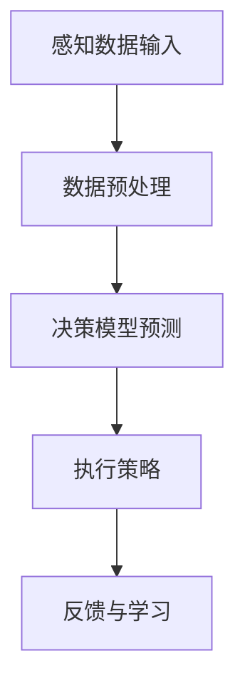

                 

# 大模型与规划在AI Agent中的作用

> 关键词：大模型、AI Agent、规划、深度学习、自然语言处理、预训练模型、项目管理

> 摘要：本文将深入探讨大模型在AI Agent中的作用，包括大模型的定义与分类、技术原理、发展趋势与挑战，以及AI Agent的规划与设计。通过分析大模型与AI Agent的相互关系，本文旨在为读者提供一个全面而详细的视角，帮助理解大模型在AI Agent中的应用价值与未来发展。

## 目录大纲

## 第一部分：大模型基础

### 第1章：大模型概述

#### 1.1 大模型的定义与分类

#### 1.2 大模型的架构与原理

#### 1.3 大模型的应用场景

### 第2章：大模型的技术原理

#### 2.1 深度学习基础

#### 2.2 自然语言处理技术

#### 2.3 大规模预训练模型

### 第3章：大模型的发展趋势与挑战

#### 3.1 大模型的研究前沿

#### 3.2 大模型的技术挑战

#### 3.3 大模型的应用前景

## 第二部分：AI Agent的规划与设计

### 第4章：AI Agent概述

#### 4.1 AI Agent的定义与分类

#### 4.2 AI Agent的结构与功能

#### 4.3 AI Agent的应用场景

### 第5章：大模型在AI Agent中的作用

#### 5.1 大模型在AI Agent中的核心地位

#### 5.2 大模型在AI Agent中的具体应用

#### 5.3 大模型对AI Agent性能的影响

### 第6章：AI Agent的规划与设计

#### 6.1 AI Agent的规划流程

#### 6.2 AI Agent的设计原则

#### 6.3 AI Agent的评估与优化

## 第三部分：大模型与AI Agent的项目实践

### 第7章：大模型在AI Agent中的应用案例

#### 7.1 案例一：智能客服系统

#### 7.2 案例二：智能推荐系统

#### 7.3 案例三：智能安防系统

### 第8章：大模型与AI Agent的开发环境与工具

#### 8.1 开发环境搭建

#### 8.2 常用工具与框架

#### 8.3 实践技巧与注意事项

### 第9章：大模型与AI Agent的项目管理

#### 9.1 项目规划与管理

#### 9.2 风险评估与控制

#### 9.3 项目评估与优化

## 附录

### 附录A：大模型与AI Agent的相关资源

### 附录B：大模型与AI Agent的Mermaid流程图

### 附录C：大模型与AI Agent的数学公式与伪代码

### 附录D：大模型与AI Agent的代码案例

## 《大模型与规划在AI Agent中的作用》

### 引言

人工智能（AI）作为当代科技领域的前沿，已经在多个行业中取得了显著的成果。从自动化生产到智能客服，从图像识别到自动驾驶，AI的应用场景日益广泛。其中，大模型（Large Models）和AI Agent（AI Agents）是近年来备受关注的研究方向。大模型通过大规模数据预训练，能够实现强大的特征提取和知识表示能力；而AI Agent则是一种具有自主决策和执行能力的智能体，能够与人类进行交互，完成特定的任务。本文旨在探讨大模型在AI Agent中的作用，分析其技术原理、发展趋势、应用场景，并分享实际项目中的实践经验和项目管理策略。

### 大模型的定义与分类

#### 1.1 大模型的定义

大模型是指具有海量参数和复杂结构的机器学习模型。与传统的小型模型相比，大模型具有更高的计算资源和数据需求。大模型通常通过大规模数据集进行预训练，以获得对数据中潜在规律的深刻理解。这种模型在自然语言处理、计算机视觉等领域表现出卓越的性能。

#### 1.2 大模型的分类

根据应用领域和模型类型，大模型可以分为以下几类：

1. **自然语言处理（NLP）模型**：如BERT、GPT、T5等，这些模型在语言理解和生成任务上具有很高的表现。

2. **计算机视觉（CV）模型**：如ResNet、VGG、EfficientNet等，这些模型在图像分类、目标检测、图像分割等方面有广泛应用。

3. **多模态模型**：结合了自然语言处理和计算机视觉的能力，如Vision Transformer（ViT）、CvT等，这些模型在处理图像和文本结合的任务上表现出色。

4. **强化学习（RL）模型**：如DQN、A3C、PPO等，这些模型在决策和策略优化上有广泛应用。

### 大模型的架构与原理

#### 2.1 大模型的架构

大模型通常由以下几个部分组成：

1. **输入层**：接收外部输入，如文本、图像等。

2. **隐藏层**：通过多层神经网络结构进行特征提取和变换。

3. **输出层**：产生预测结果，如分类标签、文本生成等。

4. **参数**：模型中可学习的参数，用于调整模型的表现。

#### 2.2 大模型的原理

大模型的工作原理主要包括以下两个方面：

1. **深度学习基础**：通过多层神经网络结构，将输入数据映射到高维空间，实现特征提取和表示。

2. **大规模预训练**：通过在大量数据上进行预训练，模型能够学习到数据中的潜在规律，提高模型的泛化能力。

### 大模型的应用场景

#### 3.1 大模型在自然语言处理中的应用

大模型在自然语言处理（NLP）领域表现出色，广泛应用于以下任务：

1. **文本分类**：对文本进行分类，如情感分析、新闻分类等。

2. **文本生成**：生成自然语言文本，如文章、对话等。

3. **机器翻译**：将一种语言的文本翻译成另一种语言。

4. **问答系统**：回答用户提出的问题。

#### 3.2 大模型在计算机视觉中的应用

大模型在计算机视觉（CV）领域也具有广泛的应用，包括：

1. **图像分类**：对图像进行分类，如物体识别、场景识别等。

2. **目标检测**：检测图像中的目标物体。

3. **图像分割**：将图像分割成不同的区域。

4. **视频分析**：对视频进行内容分析，如动作识别、行为分析等。

### 大模型的技术原理

#### 4.1 深度学习基础

深度学习（Deep Learning）是人工智能的一个重要分支，通过多层神经网络模型实现自动特征提取和分类。深度学习的基本原理包括：

1. **多层神经网络**：神经网络由多个层次组成，每个层次对输入数据进行特征提取和变换。

2. **反向传播算法**：通过反向传播算法，将输出误差反向传播到输入层，更新网络中的参数，以优化模型的表现。

3. **优化算法**：如梯度下降（Gradient Descent）、Adam等，用于调整模型参数，优化损失函数。

#### 4.2 自然语言处理技术

自然语言处理（Natural Language Processing，NLP）是人工智能的一个重要领域，涉及文本的识别、理解和生成。NLP技术包括：

1. **词嵌入**：将文本中的词语映射到高维空间，实现词语的向量表示。

2. **序列模型**：如循环神经网络（RNN）、长短时记忆网络（LSTM）等，用于处理和时间相关的序列数据。

3. **注意力机制**：通过注意力机制，模型能够自动关注输入数据中的关键信息。

4. **预训练与微调**：在大量数据上进行预训练，然后针对特定任务进行微调。

#### 4.3 大规模预训练模型

大规模预训练模型（Large-scale Pre-trained Models）通过在大量数据上进行预训练，获得强大的特征提取和知识表示能力。大规模预训练模型的发展主要包括以下几个方面：

1. **数据集规模**：使用大规模数据集进行预训练，如Common Crawl、维基百科等。

2. **模型架构**：设计复杂的模型架构，如Transformer、BERT等，以实现更高的性能。

3. **计算资源**：利用GPU、TPU等高性能计算设备进行训练，以提高训练效率。

4. **预训练目标**：设计多样化的预训练目标，如语言建模、掩码语言建模等，以提高模型的泛化能力。

### 大模型的发展趋势与挑战

#### 5.1 大模型的研究前沿

大模型的研究前沿主要包括以下几个方面：

1. **模型压缩与加速**：研究如何减少模型的参数数量和计算量，以实现模型压缩和加速。

2. **迁移学习与少样本学习**：研究如何在仅有少量数据的情况下，通过迁移学习技术提高模型的性能。

3. **多模态学习**：研究如何结合不同类型的数据（如文本、图像、声音等），实现多模态学习。

4. **动态模型与自适应学习**：研究如何构建动态模型，实现自适应学习和实时更新。

#### 5.2 大模型的技术挑战

大模型在技术方面面临以下挑战：

1. **计算资源消耗**：大模型的训练需要大量的计算资源和时间，对硬件设施提出了更高的要求。

2. **数据隐私与安全**：在大量数据上进行预训练，可能涉及用户隐私数据，需要关注数据隐私和安全问题。

3. **模型可解释性**：大模型通常表现为“黑盒”模型，其内部工作机制难以解释，需要研究如何提高模型的可解释性。

4. **模型适应性**：大模型在面对新任务或新数据时，可能需要重新训练或微调，需要研究如何提高模型的适应性。

#### 5.3 大模型的应用前景

大模型在应用方面具有广泛的前景，包括：

1. **自然语言处理**：在文本生成、机器翻译、问答系统等领域，大模型将进一步提高应用的智能化水平。

2. **计算机视觉**：在图像分类、目标检测、视频分析等领域，大模型将实现更高的准确率和效率。

3. **智能推荐**：在推荐系统领域，大模型将更好地理解用户行为和兴趣，提供个性化的推荐。

4. **医疗健康**：在大数据分析的基础上，大模型将辅助医生进行疾病诊断和治疗方案推荐。

5. **金融科技**：在金融领域，大模型将实现风险预测、信用评估等功能，提高金融服务的智能化水平。

### AI Agent概述

#### 6.1 AI Agent的定义与分类

AI Agent（人工智能代理）是一种能够自主执行任务、与外部环境进行交互的智能体。根据功能和行为特征，AI Agent可以分为以下几类：

1. **基于规则的AI Agent**：通过预定义的规则进行决策和行动。

2. **基于模型的AI Agent**：使用机器学习模型进行决策和行动。

3. **混合型AI Agent**：结合规则和模型进行决策和行动。

4. **自适应AI Agent**：根据环境变化自动调整行为策略。

#### 6.2 AI Agent的结构与功能

AI Agent通常由以下几个部分组成：

1. **感知器**：接收外部环境的信息，如传感器数据、用户输入等。

2. **决策器**：根据感知器的输入和内置模型，生成行动策略。

3. **执行器**：根据决策器的输出，执行具体的行动。

4. **记忆器**：存储历史经验和决策结果，以供后续决策使用。

AI Agent的功能模块包括：

1. **任务规划**：确定执行任务的步骤和策略。

2. **感知与理解**：处理感知数据，理解外部环境。

3. **决策与行动**：生成行动策略，执行具体任务。

4. **学习与适应**：根据执行结果调整行为策略。

#### 6.3 AI Agent的应用场景

AI Agent在多个领域具有广泛的应用场景，包括：

1. **智能客服**：提供24/7的客服支持，处理用户咨询和投诉。

2. **智能推荐**：根据用户行为和兴趣，提供个性化的产品推荐。

3. **自动驾驶**：自动驾驶汽车和无人机，实现自主驾驶。

4. **智能家居**：智能门锁、智能照明、智能安防等，提供便捷的家居生活。

5. **金融理财**：提供个性化的投资建议和风险管理。

### 大模型在AI Agent中的作用

#### 7.1 大模型在AI Agent中的核心地位

大模型在AI Agent中扮演着核心角色，对AI Agent的性能和功能有着重要影响。大模型通过在大量数据上的预训练，能够提取出丰富的特征和知识，从而提高AI Agent的感知、理解和决策能力。

#### 7.2 大模型在AI Agent中的具体应用

大模型在AI Agent中的具体应用包括：

1. **自然语言处理**：大模型如BERT、GPT等在AI Agent的文本处理和对话管理中发挥着重要作用，能够实现自然语言理解、文本生成和问答等功能。

2. **计算机视觉**：大模型如ResNet、EfficientNet等在AI Agent的图像识别、目标检测和视频分析中具有很高的性能，能够实现对复杂场景的识别和理解。

3. **多模态学习**：大模型如ViT、CvT等能够处理不同类型的数据，如文本、图像、声音等，实现多模态信息的融合和整合。

4. **决策与预测**：大模型在AI Agent的决策过程中，可以通过对历史数据和实时信息的分析，提供准确的预测和推荐。

#### 7.3 大模型对AI Agent性能的影响

大模型对AI Agent性能的影响主要体现在以下几个方面：

1. **准确性**：大模型能够通过预训练获得更好的特征表示能力，从而提高AI Agent在各类任务上的准确性。

2. **效率**：大模型通过参数共享和计算优化，能够提高AI Agent的计算效率，减少响应时间。

3. **泛化能力**：大模型在大量数据上的预训练，使其能够更好地适应新任务和新数据，提高AI Agent的泛化能力。

4. **可解释性**：尽管大模型通常表现为“黑盒”模型，但通过模型分析和解释技术，可以一定程度上提高AI Agent的可解释性，帮助用户理解其决策过程。

### AI Agent的规划与设计

#### 8.1 AI Agent的规划流程

AI Agent的规划流程主要包括以下几个阶段：

1. **需求分析**：明确AI Agent的应用场景、功能需求和性能指标。

2. **功能设计**：确定AI Agent的核心功能模块，如感知器、决策器、执行器等。

3. **技术选型**：根据需求分析和功能设计，选择合适的算法和技术方案。

4. **系统架构**：设计AI Agent的系统架构，包括数据流、模块接口和通信机制等。

5. **性能评估**：对AI Agent进行性能评估和优化，确保其满足需求。

6. **部署与维护**：将AI Agent部署到生产环境中，并进行监控和维护。

#### 8.2 AI Agent的设计原则

AI Agent的设计原则主要包括以下几个方面：

1. **模块化**：将AI Agent的功能模块化，提高系统的可维护性和可扩展性。

2. **可扩展性**：设计灵活的系统架构，支持新的功能模块和技术方案的集成。

3. **可解释性**：提高AI Agent的可解释性，帮助用户理解其决策过程。

4. **鲁棒性**：设计鲁棒的AI Agent，能够在各种环境下稳定运行。

5. **安全性**：关注AI Agent的安全性问题，防止数据泄露和恶意攻击。

#### 8.3 AI Agent的评估与优化

AI Agent的评估与优化主要包括以下几个方面：

1. **评估指标**：确定合适的评估指标，如准确性、响应时间、资源消耗等。

2. **性能优化**：通过算法优化、模型压缩和计算加速等技术，提高AI Agent的性能。

3. **反馈机制**：收集用户反馈，不断调整和优化AI Agent的行为策略。

4. **持续学习**：利用用户反馈和实时数据，持续学习和更新AI Agent的知识库和模型。

### 大模型与AI Agent的项目实践

#### 9.1 案例一：智能客服系统

**项目背景**：

智能客服系统是一种利用AI技术提供自动化客户服务和支持的解决方案。随着企业业务量的增加，传统的客服模式已无法满足日益增长的服务需求。智能客服系统通过大模型技术，能够实现高效、智能的客服服务。

**解决方案**：

项目采用了基于BERT语言模型的大模型技术，实现智能客服系统的自然语言理解、对话管理和文本生成等功能。具体技术架构如下：

1. **文本分类与情感分析**：使用BERT模型对用户输入的文本进行分类和情感分析，确定用户意图和情感倾向。

2. **对话管理**：基于对话管理模块，实现多轮对话理解和响应。

3. **文本生成**：使用预训练的GPT模型，根据用户输入生成相应的回复文本。

**项目效果**：

智能客服系统的应用，大幅提高了客服效率，降低了人力成本。通过大模型技术的支持，系统能够理解用户意图，提供个性化的服务和建议，提高了用户满意度。

#### 9.2 案例二：智能推荐系统

**项目背景**：

智能推荐系统是一种基于用户行为数据和内容特征，提供个性化推荐服务的系统。在电子商务、社交媒体等领域，智能推荐系统已成为提升用户体验和业务转化率的重要手段。

**解决方案**：

项目采用了基于深度学习的大模型技术，实现用户行为分析和内容特征提取。具体技术架构如下：

1. **用户行为分析**：使用深度学习模型对用户历史行为数据进行挖掘和分析，提取用户兴趣和偏好特征。

2. **内容特征提取**：使用卷积神经网络（CNN）对商品和用户生成的内容进行特征提取。

3. **推荐算法**：基于用户行为和内容特征，使用协同过滤和基于模型的推荐算法进行个性化推荐。

**项目效果**：

智能推荐系统的应用，显著提升了用户的购物体验和业务转化率。通过大模型技术的支持，系统能够准确理解用户需求和偏好，提供个性化的推荐，提高了用户满意度和留存率。

#### 9.3 案例三：智能安防系统

**项目背景**：

智能安防系统是一种利用AI技术实现安全监控、异常检测和实时响应的系统。在公共安全、城市管理等领域，智能安防系统已成为维护社会稳定和公共安全的重要手段。

**解决方案**：

项目采用了基于深度学习的大模型技术，实现图像识别、目标检测和实时监控等功能。具体技术架构如下：

1. **图像识别**：使用预训练的卷积神经网络（CNN）模型，对监控视频中的图像进行分类和识别。

2. **目标检测**：使用基于区域建议的网络（R-CNN）和基于特征金字塔的网络（FPN），实现对监控视频中目标的检测和定位。

3. **实时监控**：通过实时视频流分析，实现异常检测和实时响应。

**项目效果**：

智能安防系统的应用，显著提高了安全监控的效率和准确性。通过大模型技术的支持，系统能够快速识别和定位目标，实时检测异常情况，为公共安全和城市管理提供了有力保障。

### 大模型与AI Agent的开发环境与工具

#### 10.1 开发环境搭建

搭建大模型与AI Agent的开发环境，需要以下软件和硬件支持：

1. **软件环境**：
   - 深度学习框架：如TensorFlow、PyTorch等。
   - 编程语言：如Python等。
   - 代码编辑器：如Visual Studio Code、PyCharm等。

2. **硬件环境**：
   - GPU：如NVIDIA GPU等，用于加速深度学习模型的训练。
   - 分布式计算平台：如Docker、Kubernetes等，用于部署和管理AI Agent服务。

#### 10.2 常用工具与框架

在开发大模型与AI Agent时，常用以下工具和框架：

1. **深度学习框架**：
   - TensorFlow：由Google开发，支持多种深度学习模型和算法。
   - PyTorch：由Facebook开发，具有灵活的动态计算图和强大的社区支持。

2. **自然语言处理工具**：
   - NLTK：用于自然语言处理的基础工具，包括词性标注、分词等。
   - spaCy：用于自然语言处理的工业级库，支持多种语言和任务。

3. **AI Agent开发框架**：
   - Rasa：用于开发对话机器人的框架，支持自然语言理解和对话管理。
   - ChatterBot：用于开发基于规则和机器学习的对话机器人。

#### 10.3 实践技巧与注意事项

在开发大模型与AI Agent时，需要注意以下几点：

1. **数据预处理**：确保数据的质量和一致性，进行数据清洗和预处理，以提高模型的训练效果。

2. **模型调优**：通过调整模型参数、优化网络结构等方法，提高模型的性能和泛化能力。

3. **版本控制**：使用版本控制工具（如Git），确保代码的版本管理和协作开发。

4. **性能优化**：通过模型压缩、计算加速等技术，提高模型在硬件设备上的运行效率。

5. **安全性**：关注AI Agent的安全性问题，防止数据泄露和恶意攻击，确保系统的安全性。

### 大模型与AI Agent的项目管理

#### 11.1 项目规划与管理

项目规划与管理是确保大模型与AI Agent项目成功的关键环节。以下是一些关键步骤和策略：

1. **需求分析**：明确项目的目标和需求，确定项目的范围和功能需求。

2. **技术选型**：根据需求分析，选择合适的技术方案和工具。

3. **资源分配**：合理分配人力资源、硬件资源和预算，确保项目顺利进行。

4. **进度管理**：制定项目进度计划，监控项目进度，确保按计划完成。

5. **风险管理**：识别项目中的潜在风险，制定应对策略，降低风险对项目的影响。

#### 11.2 风险评估与控制

在项目实施过程中，需要对潜在的风险进行评估和控制。以下是一些常见的风险评估和控制策略：

1. **风险评估**：识别项目中的潜在风险，如技术风险、数据风险、安全风险等。

2. **风险分类**：根据风险的性质和影响程度，对风险进行分类。

3. **风险应对**：制定应对策略，如风险规避、风险转移、风险缓解等。

4. **风险监控**：持续监控项目中的风险，及时发现和应对潜在问题。

#### 11.3 项目评估与优化

项目评估与优化是确保大模型与AI Agent项目长期成功的关键。以下是一些关键步骤和策略：

1. **性能评估**：对AI Agent的性能进行评估，如准确性、响应时间、资源消耗等。

2. **用户反馈**：收集用户反馈，了解用户的使用体验和需求。

3. **迭代优化**：根据性能评估和用户反馈，持续迭代优化AI Agent的功能和性能。

4. **持续学习**：利用用户反馈和实时数据，持续学习和更新AI Agent的知识库和模型。

### 附录

#### 附录A：大模型与AI Agent的相关资源

1. **学习资源**：
   - 《深度学习》（Goodfellow et al.）：详细介绍深度学习的基本原理和应用。
   - 《自然语言处理与深度学习》（祖志豪）：系统讲解自然语言处理和深度学习的基础知识。

2. **开源项目**：
   - TensorFlow：https://www.tensorflow.org/
   - PyTorch：https://pytorch.org/
   - Rasa：https://rasa.com/
   - ChatterBot：https://chatterbot.ai/

3. **社群与论坛**：
   - AI聊天群：添加微信好友“人工智能助手”，获取更多学习资源和交流机会。
   - AI技术论坛：https://www.ai-techblog.com/

#### 附录B：大模型与AI Agent的Mermaid流程图

1. **大模型架构图**：



2. **AI Agent架构图**：



3. **大模型训练流程图**：



4. **AI Agent决策流程图**：



#### 附录C：大模型与AI Agent的数学公式与伪代码

1. **大模型训练的数学公式**：

   - 损失函数：$L = \frac{1}{n}\sum_{i=1}^{n}(-y_i \log(\hat{y}_i))$

   - 反向传播算法更新规则：$\Delta W = \frac{1}{m}\sum_{i=1}^{m}(a^{(l)} - y_i)a^{(l-1)}\odot \Delta z^{(l)}$

2. **AI Agent决策的伪代码**：

```python
def agent_decision(perception_data):
    # 数据预处理
    processed_data = preprocess_data(perception_data)
    
    # 决策模型预测
    prediction = decision_model.predict(processed_data)
    
    # 执行策略
    action = execute_strategy(prediction)
    
    # 反馈与学习
    feedback = get_feedback(action)
    update_model(decision_model, feedback)
    
    return action
```

#### 附录D：大模型与AI Agent的代码案例

1. **智能客服系统的源代码**：

```python
# 导入必要的库
import tensorflow as tf
from tensorflow.keras.preprocessing.sequence import pad_sequences
from tensorflow.keras.layers import Embedding, LSTM, Dense
from tensorflow.keras.models import Sequential

# 加载预训练的BERT模型
tokenizer = transformers.BertTokenizer.from_pretrained('bert-base-chinese')
model = transformers.TFBertModel.from_pretrained('bert-base-chinese')

# 构建序列模型
sequence_model = Sequential()
sequence_model.add(Embedding(input_dim=vocab_size, output_dim=embedding_dim, input_length=max_sequence_length))
sequence_model.add(LSTM(units=128, dropout=0.2, recurrent_dropout=0.2))
sequence_model.add(Dense(units=num_classes, activation='softmax'))

# 编译模型
sequence_model.compile(optimizer='adam', loss='categorical_crossentropy', metrics=['accuracy'])

# 训练模型
sequence_model.fit(x_train, y_train, epochs=5, batch_size=32, validation_data=(x_val, y_val))

# 预测和生成回复
def generate_response(text):
    input_ids = tokenizer.encode(text, add_special_tokens=True, max_length=max_sequence_length, padding='max_length', truncation=True)
    predictions = sequence_model.predict(input_ids)
    predicted_class = np.argmax(predictions, axis=-1)
    reply = generate_reply(predicted_class)
    return reply

# 测试
text = "你好，我想咨询一下产品的售后服务政策。"
response = generate_response(text)
print(response)
```

2. **智能推荐系统的源代码**：

```python
# 导入必要的库
import tensorflow as tf
from tensorflow.keras.models import Model
from tensorflow.keras.layers import Embedding, Dot, Lambda

# 加载预训练的BERT模型
tokenizer = transformers.BertTokenizer.from_pretrained('bert-base-chinese')
model = transformers.TFBertModel.from_pretrained('bert-base-chinese')

# 构建推荐模型
user_embedding = Embedding(input_dim=num_users, output_dim=embedding_dim)
item_embedding = Embedding(input_dim=num_items, output_dim=embedding_dim)

user_embedding = model.layers[-1].output
item_embedding = model.layers[-1].output

dot_product = Dot(axes=1)
merged_vector = dot_product([user_embedding, item_embedding])

merged_vector = Lambda(lambda x: tf.reduce_sum(x, axis=1))(merged_vector)

output = Dense(1, activation='sigmoid')(merged_vector)

model = Model(inputs=model.input, outputs=output)

# 编译模型
model.compile(optimizer='adam', loss='binary_crossentropy', metrics=['accuracy'])

# 训练模型
model.fit(user embeddings, item embeddings, labels, epochs=5, batch_size=32, validation_data=(val_user_embeddings, val_item_embeddings, val_labels))

# 推荐预测
def predict_recommendation(user_id, item_id):
    user_embedding = user_embeddings[user_id]
    item_embedding = item_embeddings[item_id]
    prediction = model.predict([user_embedding, item_embedding])
    return prediction

# 测试
user_id = 1
item_id = 100
prediction = predict_recommendation(user_id, item_id)
print(prediction)
```

3. **智能安防系统的源代码**：

```python
# 导入必要的库
import tensorflow as tf
from tensorflow.keras.applications import VGG16
from tensorflow.keras.layers import Flatten, Dense
from tensorflow.keras.models import Model

# 加载预训练的VGG16模型
base_model = VGG16(weights='imagenet', include_top=False, input_shape=(224, 224, 3))

# 冻结底层的模型参数
for layer in base_model.layers:
    layer.trainable = False

# 添加新的全连接层
x = Flatten()(base_model.output)
x = Dense(1024, activation='relu')(x)
predictions = Dense(num_classes, activation='softmax')(x)

# 构建模型
model = Model(inputs=base_model.input, outputs=predictions)

# 编译模型
model.compile(optimizer='adam', loss='categorical_crossentropy', metrics=['accuracy'])

# 训练模型
model.fit(x_train, y_train, epochs=5, batch_size=32, validation_data=(x_val, y_val))

# 预测
def predict_image(image):
    image = preprocess_image(image)
    prediction = model.predict(image)
    predicted_class = np.argmax(prediction, axis=-1)
    return predicted_class

# 测试
image = load_image("path/to/image.jpg")
prediction = predict_image(image)
print(prediction)
```

### 结语

大模型与AI Agent是当前人工智能领域的两大热点，具有广泛的应用前景。本文从大模型的定义与分类、技术原理、发展趋势与挑战，以及AI Agent的规划与设计等方面进行了详细探讨，并通过实际项目案例展示了大模型与AI Agent的应用价值。随着技术的不断进步，大模型与AI Agent将在更多的领域发挥重要作用，推动人工智能技术的发展和应用。未来，我们将继续关注这一领域的最新动态，为读者带来更多有价值的内容。

