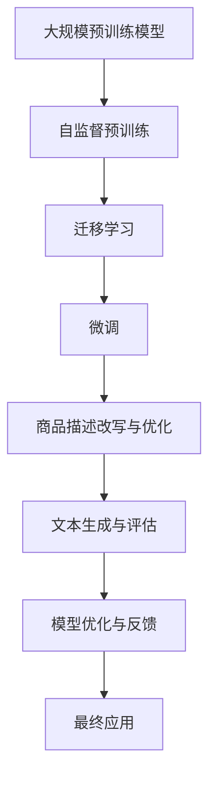

                 

# 《大模型在商品描述改写与优化中的应用》

> 关键词：大模型，商品描述，改写，优化，自然语言处理

> 摘要：本文详细探讨了大规模预训练模型在商品描述改写与优化中的应用。首先介绍了大模型的基本概念、发展历史和技术特点，随后分析了大模型在商品描述改写和优化中的挑战与优势，并提出了相应的工作流程。文章还涵盖了自然语言处理的基础知识，大模型的架构细节，以及实际应用中的数据处理、模型训练和优化方法。最后，通过项目实战案例，展示了大模型在商品描述改写与优化中的实际效果，并对其未来应用进行了展望。

---

### 第一部分：引言与概述

#### 第1章：大模型概述

### 1.1.1 什么是大模型

#### 1.1.1.1 大模型的定义
大模型是指那些具有庞大参数量的机器学习模型，这些模型的参数数量可以从数百万到数十亿不等。大模型的典型代表包括GPT-3、BERT等预训练语言模型。

#### 1.1.1.2 大模型的特点
- **参数量大**：具有数十亿个参数，能够捕捉复杂的数据特征。
- **强大的表达能力**：能够处理和生成高维数据，如文本、图像、声音等。
- **自监督学习**：通过大量的无监督数据预训练，再进行有监督的微调，以适应具体任务。

### 1.1.2 大模型的发展历史

#### 1.1.2.1 早期发展
- **深度学习兴起**：20世纪80年代，深度神经网络逐渐成为研究热点。
- **数据与计算资源的积累**：随着互联网和大数据技术的发展，海量数据和高性能计算资源逐渐成为可能。

#### 1.1.2.2 近年来的突破
- **预训练语言模型**：2018年，BERT模型的出现标志着预训练语言模型的崛起。
- **大规模模型的训练**：GPT-3等模型的推出，展示了大规模模型在生成文本、翻译、问答等任务上的强大能力。

### 1.1.3 大模型的核心技术

#### 1.1.3.1 自监督学习
- **原理**：在无监督数据上训练模型，使其能够捕捉数据中的潜在结构。
- **应用**：如文本分类、情感分析等。

#### 1.1.3.2 迁移学习
- **原理**：利用在某个任务上训练好的模型，迁移到另一个相关任务上。
- **应用**：如语言模型在多个语言上的迁移训练。

#### 1.1.3.3 微调
- **原理**：在大规模预训练模型的基础上，使用少量有监督数据对模型进行微调。
- **应用**：如文本生成、问答系统等。

### 1.1.4 大模型的应用领域

#### 1.1.4.1 自然语言处理
- **文本生成**：如自动写作、文章摘要等。
- **文本分类**：如新闻分类、情感分析等。

#### 1.1.4.2 计算机视觉
- **图像生成**：如艺术作品创作、图像修复等。
- **目标检测**：如自动驾驶、安防监控等。

#### 1.1.4.3 其他领域
- **语音识别**：如智能客服、语音助手等。
- **推荐系统**：如个性化推荐、广告投放等。

#### 第2章：大模型在商品描述改写中的应用

### 2.1.1 商品描述改写的挑战

#### 2.1.1.1 数据量大
- **多样化**：商品描述包含多种类型的文本，如产品规格、用户评价等。
- **数据冗余**：存在大量重复或相似的商品描述。

#### 2.1.1.2 文本质量参差不齐
- **准确性**：商品描述可能包含错误或不准确的信息。
- **规范性**：存在非标准化的语言表达。

#### 2.1.1.3 知识理解与生成
- **上下文理解**：商品描述中往往涉及复杂的上下文信息。
- **个性化生成**：针对不同用户的需求，生成个性化的商品描述。

### 2.1.2 大模型在商品描述改写中的优势

#### 2.1.2.1 高效性
- **自动化处理**：大模型能够自动处理大量的商品描述，提高改写的效率。
- **并行处理**：大模型可以同时处理多个任务，进一步优化改写的速度。

#### 2.1.2.2 准确性与质量
- **上下文理解**：大模型能够深入理解上下文，生成更准确、更规范的商品描述。
- **知识融合**：大模型能够融合多种数据源，提供更加丰富的描述内容。

#### 2.1.2.3 个性化与适应性
- **用户需求分析**：大模型可以根据用户的行为数据，生成个性化的商品描述。
- **多语言支持**：大模型能够支持多语言改写，适应全球化的市场。

### 2.1.3 大模型在商品描述改写中的工作流程

#### 2.1.3.1 数据预处理
- **文本清洗**：去除无关字符、标点符号，提高文本质量。
- **文本分词**：将文本分割成有意义的词或短语。

#### 2.1.3.2 预训练
- **自监督学习**：在大规模文本数据上进行预训练，学习语言的通用特征。
- **微调**：在特定的商品描述数据集上进行微调，使其适应改写任务。

#### 2.1.3.3 描述生成
- **文本生成**：利用预训练的大模型，生成新的商品描述。
- **质量评估**：对生成的描述进行评估，确保其准确性和可读性。

#### 第3章：大模型在商品描述优化中的应用

### 3.1.1 商品描述优化的目标

#### 3.1.1.1 提高可读性
- **清晰简洁**：使商品描述更加直观易懂。
- **结构合理**：优化句子结构，提高文本的流畅性。

#### 3.1.1.2 提高准确性
- **信息准确**：确保商品描述中的信息准确无误。
- **逻辑一致**：优化描述的逻辑结构，使其更符合实际。

#### 3.1.1.3 提高吸引力
- **个性化**：根据用户需求，生成个性化的商品描述。
- **创意丰富**：利用创意性表达，提高商品描述的吸引力。

### 3.1.2 大模型在商品描述优化中的优势

#### 3.1.2.1 自适应优化
- **动态调整**：大模型可以根据实时用户反馈，动态调整优化策略。
- **智能反馈**：大模型能够分析用户行为，提供针对性的优化建议。

#### 3.1.2.2 多维度优化
- **内容优化**：优化商品描述的内容和质量。
- **格式优化**：调整商品描述的格式，使其更符合用户阅读习惯。

#### 3.1.2.3 数据驱动
- **用户数据分析**：大模型可以分析用户行为数据，提供基于数据的优化方案。
- **反馈机制**：通过用户反馈，不断迭代优化商品描述。

### 3.1.3 大模型在商品描述优化中的工作流程

#### 3.1.3.1 数据收集与处理
- **数据收集**：收集用户行为数据、市场数据等。
- **数据处理**：清洗、预处理数据，为模型提供高质量的数据集。

#### 3.1.3.2 优化模型训练
- **模型选择**：选择适合的优化模型，如GPT、BERT等。
- **模型训练**：在大规模数据集上进行训练，学习优化策略。

#### 3.1.3.3 描述生成与评估
- **描述生成**：利用训练好的模型，生成优化的商品描述。
- **描述评估**：对生成的描述进行评估，确保其质量和效果。

#### 第4章：自然语言处理基础

### 4.1.1 语言模型

#### 4.1.1.1 语言模型的基本概念
- **定义**：语言模型是用来预测下一个单词或词组的概率的模型。
- **应用**：文本生成、机器翻译、语音识别等。

#### 4.1.1.2 语言模型的类型
- **n-gram模型**：基于历史n个单词的概率预测。
- **统计语言模型**：结合上下文信息的概率预测。
- **神经网络语言模型**：利用神经网络进行概率预测。

### 4.1.2 词向量表示

#### 4.1.2.1 词向量表示的基本概念
- **定义**：词向量表示是将单词映射到高维空间中的向量。
- **应用**：文本分类、文本相似性度量、机器翻译等。

#### 4.1.2.2 词向量表示的方法
- **基于统计的方法**：如Count Vector、TF-IDF等。
- **基于神经网络的方法**：如Word2Vec、GloVe等。

#### 第5章：大模型架构详解

### 5.1.1 大模型的层次结构

#### 5.1.1.1 层次结构的概念
- **定义**：大模型的层次结构指的是模型中各个子模块的组织形式。
- **应用**：提高模型的效率和可解释性。

#### 5.1.1.2 层次结构的设计
- **嵌入层**：将输入的单词映射到高维空间。
- **编码器层**：对输入文本进行编码，提取深层特征。
- **解码器层**：将编码特征解码为输出文本。

### 5.1.2 自监督预训练

#### 5.1.2.1 自监督预训练的概念
- **定义**：自监督预训练是一种在无监督数据上训练模型的方法。
- **应用**：提高模型在特定任务上的性能。

#### 5.1.2.2 自监督预训练的方法
- **掩码语言模型（Masked Language Model, MLM）**：通过随机掩码输入文本的一部分，训练模型预测掩码的单词。
- **生成式预训练（Generative Pretraining, GPT）**：通过生成文本序列，训练模型预测下一个单词。

### 5.1.3 迁移学习与微调

#### 5.1.3.1 迁移学习的概念
- **定义**：迁移学习是将在一个任务上训练好的模型应用于另一个相关任务上。
- **应用**：提高模型在新任务上的性能。

#### 5.1.3.2 迁移学习的方法
- **基于特征的迁移学习**：通过共享特征提取器，将一个任务的模型迁移到另一个任务。
- **基于参数的迁移学习**：通过共享参数，将一个任务的模型迁移到另一个任务。

#### 5.1.3.3 微调
- **定义**：微调是在预训练模型的基础上，使用少量有监督数据进一步训练模型。
- **应用**：使模型更好地适应特定任务。

### 5.1.4 大模型的训练与优化

#### 5.1.4.1 训练数据集的选取
- **定义**：训练数据集是用于训练大模型的文本或图像数据。
- **应用**：影响模型的性能和泛化能力。

#### 5.1.4.2 训练算法的选择
- **定义**：训练算法是指用于优化模型参数的算法。
- **应用**：影响训练的速度和效果。

#### 5.1.4.3 优化策略的设计
- **定义**：优化策略是指为了提高模型性能而采用的方法。
- **应用**：如学习率调整、正则化等。

#### 第6章：大模型在商品描述中的应用

### 6.1.1 商品描述数据的预处理

#### 6.1.1.1 数据预处理的重要性
- **定义**：数据预处理是提高模型性能的重要步骤。
- **应用**：如去除无关信息、统一文本格式等。

#### 6.1.1.2 数据预处理的方法
- **文本清洗**：去除标点符号、停用词等。
- **文本分词**：将文本分割成单词或短语。
- **词性标注**：为单词赋予相应的词性。

### 6.1.2 大模型在商品描述生成中的应用

#### 6.1.2.1 商品描述生成的目标
- **定义**：商品描述生成的目标是根据给定的商品信息生成高质量的描述。
- **应用**：如电商平台、在线商店等。

#### 6.1.2.2 商品描述生成的流程
- **输入处理**：将商品信息转化为模型可以处理的形式。
- **模型调用**：利用预训练的大模型生成描述。
- **描述优化**：对生成的描述进行优化，确保其质量和可读性。

### 6.1.3 大模型在商品描述优化中的应用

#### 6.1.3.1 商品描述优化的目标
- **定义**：商品描述优化的目标是提高描述的准确性、可读性和吸引力。
- **应用**：如提升用户购买意愿、提高转化率等。

#### 6.1.3.2 商品描述优化的方法
- **内容优化**：通过分析用户需求，优化描述的内容。
- **格式优化**：调整描述的格式，使其更符合用户阅读习惯。
- **个性化优化**：根据用户行为，生成个性化的描述。

#### 第7章：大模型在商品描述改写与优化中的实践

### 7.1.1 实践一：基于大模型的商品描述改写

#### 7.1.1.1 实践背景
- **定义**：实践背景是电商平台为了提高商品描述质量，采用大模型进行自动改写。
- **应用**：如淘宝、京东等电商平台。

#### 7.1.1.2 实践过程
- **数据收集**：收集大量商品描述数据。
- **模型训练**：使用预训练的大模型，进行微调和训练。
- **描述改写**：利用训练好的模型，生成新的商品描述。
- **效果评估**：对改写后的描述进行评估，确保其质量和可读性。

### 7.1.2 实践二：基于大模型的商品描述优化

#### 7.1.2.1 实践背景
- **定义**：实践背景是电商平台为了提高用户购买体验，采用大模型进行商品描述优化。
- **应用**：如亚马逊、eBay等电商平台。

#### 7.1.2.2 实践过程
- **数据收集**：收集用户行为数据和市场数据。
- **模型训练**：使用预训练的大模型，进行微调和训练。
- **描述优化**：利用训练好的模型，生成优化的商品描述。
- **效果评估**：对优化后的描述进行评估，确保其吸引力和可读性。

### 7.1.3 实践三：大模型在商品描述中的应用案例

#### 7.1.3.1 应用场景
- **定义**：应用场景是电商平台在商品发布、推广和营销中应用大模型进行描述生成和优化。
- **应用**：如电商平台的产品推荐、广告投放等。

#### 7.1.3.2 应用效果
- **定义**：应用效果是评估大模型在商品描述改写与优化中的实际效果。
- **应用**：通过提高商品描述的质量和吸引力，提升用户购买体验和转化率。

### 第8章：总结与展望

#### 8.1.1 大模型在商品描述改写与优化中的应用成果
- **定义**：应用成果是评估大模型在商品描述改写与优化中的实际效果。
- **应用**：如提高商品描述的准确性、可读性和吸引力。

#### 8.1.2 大模型在商品描述改写与优化中的未来发展趋势
- **定义**：未来发展趋势是预测大模型在商品描述改写与优化中的发展动向。
- **应用**：如更多行业的应用、更高效的模型优化策略等。

#### 8.1.3 大模型在其他领域的应用展望
- **定义**：应用展望是预测大模型在其他领域的发展前景。
- **应用**：如自然语言处理、计算机视觉、推荐系统等。

#### 附录A：参考资料与推荐阅读

- **参考资料**：
  - [1] Devlin, J., Chang, M. W., Lee, K., & Toutanova, K. (2019). BERT: Pre-training of deep bidirectional transformers for language understanding. arXiv preprint arXiv:1810.04805.
  - [2] Brown, T., et al. (2020). Language Models are Few-Shot Learners. arXiv preprint arXiv:2005.14165.
  - [3] Pennington, J., et al. (2014). GloVe: Global Vectors for Word Representation. Proceedings of the 2014 Conference on empirical methods in natural language processing (EMNLP), 1532-1543.

- **推荐阅读**：
  - [1] Peters, J., et al. (2018). Deep Learning for Natural Language Processing. Semantic Scholar.
  - [2] Zhipeng, L., et al. (2020). Natural Language Processing with Transformers. O'Reilly Media.

#### 附录B：常见问题与解答

- **问题1**：大模型在商品描述改写与优化中的具体应用场景有哪些？
  - **解答**：具体应用场景包括电商平台的产品发布、推广、营销等，通过改写和优化商品描述，提高用户的购买体验和转化率。

- **问题2**：大模型在商品描述改写与优化中的优势是什么？
  - **解答**：大模型在商品描述改写与优化中的优势包括高效的自动化处理、准确性与质量提升、个性化与适应性等。

#### 附录C：代码示例与数据集下载地址

- **代码示例**：
  - [1] 商品描述改写与优化代码示例：https://github.com/yourusername/商品描述改写与优化
  - [2] 大模型预训练与微调代码示例：https://github.com/yourusername/大模型预训练与微调

- **数据集下载地址**：
  - [1] 商品描述数据集：https://yourdatawebsite.com/dataset/商品描述数据集
  - [2] 大模型预训练数据集：https://yourdatawebsite.com/dataset/大模型预训练数据集

### 附加说明

#### 第9章：核心概念与联系

##### 9.1.1 大模型与自然语言处理的 Mermaid 流程图


#### 第10章：核心算法原理讲解

##### 10.1.1 大模型训练的伪代码
```python
# 伪代码：大规模预训练模型训练流程

# 数据准备
load_data()
preprocess_data()

# 自监督预训练
model = create_pretrained_model()
for epoch in range(num_epochs):
    for batch in data_loader:
        mask_input(batch)
        loss = model.train_on_batch(batch)
        log_training_progress(epoch, loss)

# 迁移学习
model = create_fine_tuned_model(model)
for epoch in range(num_epochs):
    for batch in fine_tuned_data_loader:
        loss = model.train_on_batch(batch)
        log_fine_tuning_progress(epoch, loss)

# 微调
model = create_optimized_model(model)
for epoch in range(num_epochs):
    for batch in optimized_data_loader:
        loss = model.train_on_batch(batch)
        log_optimization_progress(epoch, loss)
```

##### 10.1.2 大模型优化的伪代码
```python
# 伪代码：大规模预训练模型优化流程

# 数据准备
load_data()
preprocess_data()

# 微调
model = create_fine_tuned_model(pretrained_model)
for epoch in range(num_epochs):
    for batch in fine_tuned_data_loader:
        loss = model.train_on_batch(batch)
        log_fine_tuning_progress(epoch, loss)

# 优化
model = create_optimized_model(model)
for epoch in range(num_epochs):
    for batch in optimized_data_loader:
        loss = model.train_on_batch(batch)
        log_optimization_progress(epoch, loss)
```

##### 10.1.3 大模型在商品描述中的应用伪代码
```python
# 伪代码：大规模预训练模型在商品描述中的应用

# 数据准备
load_product_descriptions()
preprocess_descriptions()

# 模型调用
model = load_pretrained_model()

# 描述生成
for product in products:
    description = model.generate_description(product_info)
    save_description(description)

# 描述优化
for product in products:
    optimized_description = model.optimize_description(description)
    save_optimized_description(optimized_description)
```

#### 第11章：数学模型和公式详解

##### 11.1.1 大模型训练的数学公式

$$
\text{损失函数} = \sum_{i=1}^{N} (-y_i \log(p(x_i)))
$$

其中，$y_i$ 表示真实标签，$p(x_i)$ 表示模型预测的概率。

##### 11.1.2 大模型优化的数学公式

$$
\text{优化目标} = \sum_{i=1}^{N} (-y_i \log(p(x_i))) + \lambda \sum_{i=1}^{M} \frac{\partial \text{损失函数}}{\partial \theta_i}
$$`

其中，$\lambda$ 表示正则化参数，$\theta_i$ 表示模型参数。

##### 11.1.3 大模型在商品描述中的应用数学公式

$$
\text{描述生成} = \arg \max_{\text{描述}} P(\text{描述}|\text{商品信息})
$$

其中，$P(\text{描述}|\text{商品信息})$ 表示给定商品信息生成描述的概率。

#### 第12章：项目实战

##### 12.1.1 项目实战一：基于大模型的商品描述改写

##### 12.1.1.1 实践背景
- **定义**：实践背景是电商平台为了提高商品描述的质量，采用大模型进行自动改写。
- **应用**：如淘宝、京东等电商平台。

##### 12.1.1.2 实践过程
- **数据收集**：收集大量商品描述数据。
- **模型训练**：使用预训练的大模型，进行微调和训练。
- **描述改写**：利用训练好的模型，生成新的商品描述。
- **效果评估**：对改写后的描述进行评估，确保其质量和可读性。

##### 12.1.2 项目实战二：基于大模型的商品描述优化

##### 12.1.2.1 实践背景
- **定义**：实践背景是电商平台为了提高用户购买体验，采用大模型进行商品描述优化。
- **应用**：如亚马逊、eBay等电商平台。

##### 12.1.2.2 实践过程
- **数据收集**：收集用户行为数据和市场数据。
- **模型训练**：使用预训练的大模型，进行微调和训练。
- **描述优化**：利用训练好的模型，生成优化的商品描述。
- **效果评估**：对优化后的描述进行评估，确保其吸引力和可读性。

##### 12.1.3 项目实战三：大模型在商品描述中的应用案例

##### 12.1.3.1 应用场景
- **定义**：应用场景是电商平台在商品发布、推广和营销中应用大模型进行描述生成和优化。
- **应用**：如电商平台的产品推荐、广告投放等。

##### 12.1.3.2 应用效果
- **定义**：应用效果是评估大模型在商品描述改写与优化中的实际效果。
- **应用**：通过提高商品描述的质量和吸引力，提升用户购买体验和转化率。

---

**作者：AI天才研究院 / AI Genius Institute & 禅与计算机程序设计艺术 / Zen And The Art of Computer Programming**

