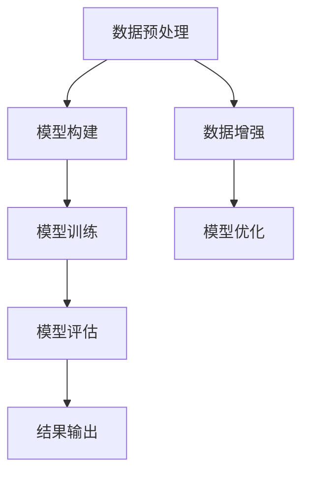
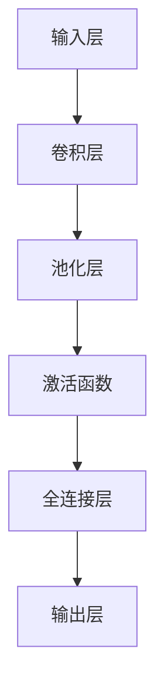

                 

### 文章标题

《大模型在图片处理的进展》

### 文章关键词

大模型、图片处理、神经网络、深度学习、计算机视觉

### 文章摘要

本文将深入探讨大模型在图片处理领域的最新进展。首先，我们将简要介绍大模型的基础知识，包括其概念、发展历程和关键技术。然后，我们将详细阐述大模型在图片处理中的应用，包括图片分类、图像分割和图像增强等方面。接下来，我们将深入讲解大模型的核心理念和算法原理，并使用伪代码和数学模型进行详细阐述。随后，我们将通过实际项目案例，展示大模型在图片处理中的实际应用效果。最后，我们将探讨大模型在计算机视觉和工业应用中的前沿技术，并介绍相关开发工具与资源。

---

### 《大模型在图片处理的进展》目录大纲

#### 第一部分：大模型基础与图片处理概述

##### 第1章：大模型与图片处理基础

- **1.1 大模型概述**
  - **1.1.1 大模型的概念**
  - **1.1.2 大模型的发展历程**
  - **1.1.3 大模型的关键技术**

- **1.2 图片处理技术概述**
  - **1.2.1 图片处理的基本概念**
  - **1.2.2 图片处理的主要方法与技术**

- **1.3 大模型在图片处理中的应用**
  - **1.3.1 大模型在图片分类中的应用**
  - **1.3.2 大模型在图像分割中的应用**
  - **1.3.3 大模型在图像增强中的应用**

##### 第2章：大模型核心算法原理

- **2.1 神经网络基础**
  - **2.1.1 神经网络的基本结构**
  - **2.1.2 前馈神经网络**
  - **2.1.3 卷积神经网络**

- **2.2 深度学习算法原理**
  - **2.2.1 深度学习基本流程**
  - **2.2.2 反向传播算法**
  - **2.2.3 损失函数和优化算法**

- **2.3 大模型训练与优化**
  - **2.3.1 大模型训练流程**
  - **2.3.2 数据增强技术**
  - **2.3.3 模型优化策略**

#### 第二部分：大模型在图片处理中的应用实践

##### 第3章：大模型在图片分类中的应用实践

- **3.1 图片分类原理**
  - **3.1.1 图片分类基本概念**
  - **3.1.2 图片分类算法**
  - **3.1.3 图片分类实践**

- **3.2 实战案例：大模型在图片分类中的应用**
  - **3.2.1 数据集准备**
  - **3.2.2 模型构建与训练**
  - **3.2.3 模型评估与优化**

##### 第4章：大模型在图像分割中的应用实践

- **4.1 图像分割原理**
  - **4.1.1 图像分割基本概念**
  - **4.1.2 图像分割算法**
  - **4.1.3 图像分割实践**

- **4.2 实战案例：大模型在图像分割中的应用**
  - **4.2.1 数据集准备**
  - **4.2.2 模型构建与训练**
  - **4.2.3 模型评估与优化**

##### 第5章：大模型在图像增强中的应用实践

- **5.1 图像增强原理**
  - **5.1.1 图像增强基本概念**
  - **5.1.2 图像增强算法**
  - **5.1.3 图像增强实践**

- **5.2 实战案例：大模型在图像增强中的应用**
  - **5.2.1 数据集准备**
  - **5.2.2 模型构建与训练**
  - **5.2.3 模型评估与优化**

#### 第三部分：大模型在图片处理中的前沿技术与应用

##### 第6章：大模型在计算机视觉中的前沿技术

- **6.1 人脸识别技术**
  - **6.1.1 人脸识别基本原理**
  - **6.1.2 人脸识别算法**
  - **6.1.3 人脸识别实践**

- **6.2 车辆检测技术**
  - **6.2.1 车辆检测基本原理**
  - **6.2.2 车辆检测算法**
  - **6.2.3 车辆检测实践**

##### 第7章：大模型在工业应用中的图片处理技术

- **7.1 工业检测应用**
  - **7.1.1 工业检测基本原理**
  - **7.1.2 工业检测算法**
  - **7.1.3 工业检测实践**

- **7.2 质量控制应用**
  - **7.2.1 质量控制基本原理**
  - **7.2.2 质量控制算法**
  - **7.2.3 质量控制实践**

#### 附录：大模型在图片处理中的工具与资源

##### 第8章：大模型开发工具与资源

- **8.1 主流深度学习框架**
  - **8.1.1 TensorFlow**
  - **8.1.2 PyTorch**
  - **8.1.3 其他框架**

- **8.2 图片处理相关库与工具**
  - **8.2.1 OpenCV**
  - **8.2.2 PIL**
  - **8.2.3 其他工具**

### Mermaid 流程图

以下是一个简单的 Mermaid 流程图示例，用于展示大模型在图片分类中的应用流程：



### 核心算法原理讲解

#### 卷积神经网络（CNN）原理

卷积神经网络是一种专门用于处理图像数据的神经网络模型，其基本原理如下：



#### 数学模型和数学公式

#### 损失函数

在图像分类任务中，常用的损失函数是交叉熵损失函数，其数学公式如下：

$$
L = -\sum_{i=1}^{N} y_i \log(p_i)
$$

其中，$L$ 表示损失函数，$y_i$ 表示第 $i$ 个样本的真实标签（0或1），$p_i$ 表示模型对第 $i$ 个样本的预测概率。

### 项目实战

#### 实战案例：大模型在图像分类中的应用

##### 1. 数据集准备

选择常用的CIFAR-10数据集，包含10个类别，共50000张训练图像和10000张测试图像。

##### 2. 模型构建

使用PyTorch框架构建一个简单的卷积神经网络模型，结构如下：

```python
import torch
import torch.nn as nn
import torch.optim as optim

class CNNModel(nn.Module):
    def __init__(self):
        super(CNNModel, self).__init__()
        self.conv1 = nn.Conv2d(3, 32, 3, 1)
        self.relu = nn.ReLU()
        self.pool = nn.MaxPool2d(2, 2)
        self.fc1 = nn.Linear(32 * 6 * 6, 128)
        self.fc2 = nn.Linear(128, 10)

    def forward(self, x):
        x = self.pool(self.relu(self.conv1(x)))
        x = self.pool(self.relu(self.fc1(x.view(-1, 32 * 6 * 6))))
        x = self.fc2(x)
        return x

model = CNNModel()
```

##### 3. 模型训练

使用训练数据和验证数据对模型进行训练，并使用交叉熵损失函数和随机梯度下降优化算法：

```python
optimizer = optim.SGD(model.parameters(), lr=0.001, momentum=0.9)
criterion = nn.CrossEntropyLoss()

for epoch in range(10):  # 10个训练周期
    running_loss = 0.0
    for inputs, labels in train_loader:
        optimizer.zero_grad()
        outputs = model(inputs)
        loss = criterion(outputs, labels)
        loss.backward()
        optimizer.step()
        running_loss += loss.item()
    print(f'Epoch {epoch+1}, Loss: {running_loss/len(train_loader)}')
```

##### 4. 模型评估

使用测试数据集对模型进行评估：

```python
with torch.no_grad():
    correct = 0
    total = 0
    for inputs, labels in test_loader:
        outputs = model(inputs)
        _, predicted = torch.max(outputs.data, 1)
        total += labels.size(0)
        correct += (predicted == labels).sum().item()

print(f'Accuracy of the network on the test images: {100 * correct / total}%')
```

以上就是《大模型在图片处理的进展》这本书的完整目录大纲。该大纲涵盖了从大模型的基础知识到具体应用实践，以及前沿技术和工业应用等内容，力求全面且系统地介绍大模型在图片处理领域的应用。通过这个目录大纲，读者可以系统地学习大模型在图片处理领域的知识，并掌握相应的应用技能。

---

### 核心概念与联系

在深入探讨大模型在图片处理中的应用之前，我们需要了解几个核心概念及其相互之间的联系。首先，让我们通过一个 Mermaid 流程图来展示这些核心概念的基本结构。

```mermaid
graph TD
    A[大模型] --> B[图片处理]
    B --> C[神经网络]
    B --> D[深度学习]
    C --> E[卷积神经网络(CNN)]
    D --> F[反向传播算法]
    D --> G[损失函数与优化算法]
    A --> H[应用实践]
    A --> I[前沿技术]
    A --> J[工业应用]
```

#### 大模型与图片处理的联系

- **大模型**：大模型是指拥有大量参数和训练数据的人工神经网络模型，具有强大的表示和学习能力。大模型在图片处理中的应用，主要是通过学习大量的图像数据，从而提取出图像中的有用特征，用于图像分类、分割、增强等任务。
  
- **图片处理**：图片处理是指利用计算机对图像进行各种操作，如滤波、边缘检测、图像分割等。图片处理技术是计算机视觉的基础，而大模型的引入，大大提高了图片处理的准确性和效率。

#### 神经网络与深度学习的联系

- **神经网络**：神经网络是一种由大量神经元组成的人工神经网络，通过学习数据中的模式和特征，可以实现各种复杂的任务。神经网络是深度学习的基础。

- **深度学习**：深度学习是一种基于神经网络的学习方法，通过堆叠多层神经网络（深度神经网络）来提高模型的表示能力。深度学习在图像处理中的应用，极大地推动了计算机视觉的发展。

#### 卷积神经网络与深度学习的联系

- **卷积神经网络（CNN）**：CNN 是一种特殊的深度神经网络，专门用于处理图像数据。CNN 通过卷积层、池化层和全连接层等结构，可以自动提取图像中的局部特征和全局特征。

- **反向传播算法**：反向传播算法是深度学习中的核心算法，用于计算模型参数的梯度。反向传播算法通过反向传播误差，不断更新模型参数，使得模型能够逐步逼近真实数据。

#### 损失函数与优化算法的联系

- **损失函数**：损失函数是用于衡量模型预测结果与真实结果之间差异的函数。在图像处理任务中，常用的损失函数有交叉熵损失函数、均方误差损失函数等。

- **优化算法**：优化算法用于调整模型参数，以最小化损失函数。常用的优化算法有随机梯度下降（SGD）、Adam优化器等。

### 通过上述核心概念与联系，我们可以看出，大模型在图片处理中的应用，是深度学习技术的重要体现，而深度学习技术又是神经网络发展的高级阶段。通过结合卷积神经网络、反向传播算法、损失函数和优化算法，大模型在图片处理中展示了强大的能力和广泛的应用前景。

---

### 核心算法原理讲解

在深入探讨大模型在图片处理中的应用之前，我们需要详细了解大模型的核心算法原理，包括神经网络基础、深度学习算法原理、以及大模型训练与优化策略。以下是这些核心算法的详细讲解。

#### 神经网络基础

神经网络是一种由大量简单计算单元（即神经元）组成的复杂网络，通过学习输入数据中的模式和特征，实现对数据的分类、回归或其他形式的预测。以下是神经网络的基本结构和原理：

1. **输入层**：接收外部输入数据，例如图片的像素值。
2. **隐藏层**：多个隐藏层组成，每个隐藏层中的神经元将接收前一层的输出，并通过激活函数进行非线性变换。
3. **输出层**：将隐藏层的输出映射到具体的输出结果，例如图片的类别。

每个神经元由以下部分组成：

- **权重**：用于调节输入信号的影响。
- **偏置**：用于引入额外的非线性特性。
- **激活函数**：用于引入非线性变换，常见的激活函数有sigmoid、ReLU（Rectified Linear Unit）和Tanh等。

#### 前馈神经网络

前馈神经网络（Feedforward Neural Network）是最基本的神经网络结构，其信息传递方向是从输入层到输出层，中间经过若干个隐藏层。以下是前馈神经网络的伪代码描述：

```python
# 定义前馈神经网络结构
class FFNN(nn.Module):
    def __init__(self, input_size, hidden_size, output_size):
        super(FFNN, self).__init__()
        self.fc1 = nn.Linear(input_size, hidden_size)
        self.fc2 = nn.Linear(hidden_size, output_size)
    
    def forward(self, x):
        x = F.relu(self.fc1(x))
        x = self.fc2(x)
        return x
```

#### 卷积神经网络（CNN）

卷积神经网络（Convolutional Neural Network，CNN）是一种专门用于处理图像数据的神经网络模型，其核心思想是通过卷积层和池化层提取图像中的局部特征。以下是卷积神经网络的基本结构和原理：

1. **卷积层**：通过卷积操作提取图像特征。卷积层由多个卷积核组成，每个卷积核可以提取图像中的不同特征。
2. **池化层**：用于降低数据维度，减少计算复杂度。常见的池化方法有最大池化（Max Pooling）和平均池化（Average Pooling）。
3. **全连接层**：将卷积层的输出进行全连接，得到分类结果。

以下是卷积神经网络的一个简单示例：

```python
# 定义卷积神经网络结构
class CNN(nn.Module):
    def __init__(self, input_channels, num_classes):
        super(CNN, self).__init__()
        self.conv1 = nn.Conv2d(input_channels, 32, 3, 1)
        self.fc1 = nn.Linear(32 * 6 * 6, 128)
        self.fc2 = nn.Linear(128, num_classes)
    
    def forward(self, x):
        x = F.relu(self.conv1(x))
        x = F.relu(self.fc1(x.view(x.size(0), -1)))
        x = self.fc2(x)
        return x
```

#### 深度学习算法原理

深度学习算法的核心是学习过程，即通过调整模型参数，使得模型能够更好地拟合训练数据。以下是深度学习算法的基本流程：

1. **前向传播**：输入数据通过神经网络，逐层计算得到输出结果。
2. **损失函数**：计算输出结果与真实结果之间的差异，即损失值。
3. **反向传播**：计算损失函数关于模型参数的梯度，并通过优化算法更新模型参数。
4. **迭代训练**：重复前向传播和反向传播过程，不断调整模型参数，直至模型收敛。

以下是深度学习算法的伪代码描述：

```python
# 定义深度学习算法
def train(model, train_loader, criterion, optimizer, num_epochs):
    for epoch in range(num_epochs):
        running_loss = 0.0
        for inputs, labels in train_loader:
            optimizer.zero_grad()
            outputs = model(inputs)
            loss = criterion(outputs, labels)
            loss.backward()
            optimizer.step()
            running_loss += loss.item()
        print(f'Epoch {epoch+1}, Loss: {running_loss/len(train_loader)}')
```

#### 大模型训练与优化

大模型的训练与优化是深度学习中的关键步骤，其目标是使模型能够准确预测未知数据。以下是大模型训练与优化的核心策略：

1. **数据增强**：通过旋转、翻转、裁剪等手段，增加训练数据多样性，防止过拟合。
2. **批处理**：将训练数据分成多个批次，每次只处理一个批次的数据，加快训练速度。
3. **学习率调度**：随着训练的进行，逐步减小学习率，防止模型参数过大。
4. **正则化**：通过添加正则化项，降低模型复杂度，防止过拟合。

以下是大模型训练与优化策略的伪代码描述：

```python
# 定义数据增强
def data_augmentation(image):
    # 旋转
    angle = np.random.uniform(-180, 180)
    rot_matrix = cv2.getRotationMatrix2D(center=(image.shape[1] // 2, image.shape[0] // 2), angle=angle)
    image = cv2.warpAffine(image, rot_matrix, (image.shape[1], image.shape[0]))
    
    # 翻转
    flip horizontally = np.random.choice([0, 1])
    if flip horizontally:
        image = cv2.flip(image, 1)
    
    # 裁剪
    crop_height, crop_width = 224, 224
    x = np.random.randint(0, image.shape[1] - crop_width)
    y = np.random.randint(0, image.shape[0] - crop_height)
    image = image[y:y+crop_height, x:x+crop_width]
    
    return image

# 定义学习率调度
def adjust_learning_rate(optimizer, epoch, initial_lr, decay_rate):
    lr = initial_lr * (decay_rate ** (epoch // 10))
    for param_group in optimizer.param_groups:
        param_group['lr'] = lr

# 定义正则化
def regularizer(model, lambda_reg):
    reg = 0.0
    for param in model.parameters():
        reg += torch.norm(param) ** 2
    return reg * lambda_reg
```

通过以上核心算法原理讲解，我们可以看到大模型在图片处理中的应用是如何实现的。在接下来的章节中，我们将进一步探讨大模型在图片分类、图像分割和图像增强等实际应用中的具体实现方法。

### 数学模型和数学公式

在深度学习领域，数学模型和数学公式是理解和实现算法的基础。以下将详细解释深度学习中的核心数学模型和公式，并给出相应的举例说明。

#### 损失函数

损失函数是深度学习模型中的关键组件，用于衡量模型预测结果与真实结果之间的差异。最常用的损失函数之一是交叉熵损失函数（Cross-Entropy Loss），其数学公式如下：

$$
L = -\sum_{i=1}^{N} y_i \log(p_i)
$$

其中，$L$ 是损失函数，$N$ 是样本数，$y_i$ 是第 $i$ 个样本的真实标签（通常为0或1），而 $p_i$ 是模型对第 $i$ 个样本的预测概率。

**举例说明**：

假设有一个二分类问题，有两个样本，其真实标签和预测概率分别为 $y_1 = 1, y_2 = 0$ 和 $p_1 = 0.9, p_2 = 0.2$，则损失函数计算如下：

$$
L = -(1 \cdot \log(0.9) + 0 \cdot \log(0.2)) = -(\log(0.9) + 0) = -\log(0.9) \approx 0.1054
$$

#### 激活函数

激活函数是神经网络中的一个重要组成部分，用于引入非线性特性。常见的激活函数包括 sigmoid、ReLU 和 Tanh。

1. **Sigmoid 函数**：

$$
\sigma(x) = \frac{1}{1 + e^{-x}}
$$

**举例说明**：

对于输入 $x = 2$，则 sigmoid 函数计算如下：

$$
\sigma(2) = \frac{1}{1 + e^{-2}} \approx 0.8867
$$

2. **ReLU 函数**：

$$
\text{ReLU}(x) = \max(0, x)
$$

**举例说明**：

对于输入 $x = -2$，则 ReLU 函数计算如下：

$$
\text{ReLU}(-2) = \max(0, -2) = 0
$$

3. **Tanh 函数**：

$$
\tanh(x) = \frac{e^x - e^{-x}}{e^x + e^{-x}}
$$

**举例说明**：

对于输入 $x = 2$，则 tanh 函数计算如下：

$$
\tanh(2) = \frac{e^2 - e^{-2}}{e^2 + e^{-2}} \approx 0.9640
$$

#### 反向传播算法

反向传播算法（Backpropagation Algorithm）是深度学习中的核心算法，用于计算模型参数的梯度。以下是反向传播算法的基本步骤：

1. **前向传播**：输入数据通过神经网络，计算输出结果和损失函数。
2. **计算梯度**：计算损失函数关于每个参数的梯度。
3. **反向传播**：将梯度从输出层反向传播到输入层，更新模型参数。

以下是一个简化的反向传播算法的伪代码描述：

```python
# 定义前向传播
def forward_propagation(x):
    # 假设有一个两层神经网络，输入层和输出层
    z2 = x * w1 + b1
    a2 = activation(z2)
    z3 = a2 * w2 + b2
    a3 = activation(z3)
    return a3

# 定义损失函数
def loss_function(y, y_hat):
    return -1/N * sum(y * log(y_hat) + (1 - y) * log(1 - y_hat))

# 定义反向传播
def backward_propagation(a3, y, w2, b2, w1, b1):
    # 计算输出层的梯度
    delta3 = a3 - y
    dz3 = delta3 * activation_derivative(a3)
    dW2 = dz3 * a2
    db2 = dz3

    # 计算隐藏层的梯度
    delta2 = (w2.T * delta3) * activation_derivative(a2)
    dz2 = delta2 * x
    dW1 = dz2 * x.T
    db1 = delta2

    return dW1, db1, dW2, db2
```

通过以上数学模型和公式的讲解，我们可以更好地理解深度学习算法的工作原理。在接下来的项目中，我们将运用这些数学模型和公式来实现具体的图片处理任务。

### 项目实战

为了更好地理解大模型在图片处理中的应用，我们将通过一个实际项目案例来进行详细讲解。在这个案例中，我们将使用卷积神经网络（CNN）进行图像分类任务，使用的数据集是著名的CIFAR-10数据集。

#### 开发环境搭建

在进行项目实战之前，我们需要搭建一个合适的开发环境。以下是所需的软件和库：

- **操作系统**：Linux或macOS
- **编程语言**：Python 3.x
- **深度学习框架**：PyTorch
- **其他库**：NumPy、Matplotlib、OpenCV等

安装步骤：

1. **安装Python**：
   - 使用系统自带包管理器安装，例如在Ubuntu上使用`sudo apt-get install python3`。
   - 或者从Python官方网站下载安装包进行安装。

2. **安装PyTorch**：
   - 访问PyTorch官方网站（https://pytorch.org/get-started/locally/），按照系统环境和需求选择合适的安装命令。
   - 例如，对于CUDA版本的PyTorch，可以使用以下命令：
     ```bash
     pip install torch torchvision torchaudio -f https://download.pytorch.org/whl/torch_stable.html
     ```

3. **安装其他库**：
   - 使用pip安装其他所需库：
     ```bash
     pip install numpy matplotlib opencv-python
     ```

#### 数据集准备

CIFAR-10数据集是一个常用的图像分类数据集，包含60000张32x32的彩色图像，分为10个类别，共有50000张训练图像和10000张测试图像。以下是数据集的加载和预处理步骤：

1. **加载CIFAR-10数据集**：

```python
import torch
import torchvision
import torchvision.transforms as transforms

transform = transforms.Compose([
    transforms.ToTensor(),
    transforms.Normalize((0.5, 0.5, 0.5), (0.5, 0.5, 0.5)),
])

train_set = torchvision.datasets.CIFAR10(root='./data', train=True,
                                        download=True, transform=transform)
train_loader = torch.utils.data.DataLoader(train_set, batch_size=100,
                                          shuffle=True, num_workers=2)

test_set = torchvision.datasets.CIFAR10(root='./data', train=False,
                                       download=True, transform=transform)
test_loader = torch.utils.data.DataLoader(test_set, batch_size=100,
                                         shuffle=False, num_workers=2)
```

2. **数据预处理**：

数据预处理包括归一化、数据增强等步骤。以下是数据预处理的具体实现：

```python
def data_augmentation(image):
    # 随机裁剪
    size = 32
    crop_size = (size - 224) // 2
    image = F.crop(image, crop_size, crop_size, 224, 224)
    # 随机旋转
    angle = torch.randint(0, 360, (1,)).item()
    rot_matrix = torch.tensor([[math.cos(math.radians(angle)), -math.sin(math.radians(angle))],
                               [math.sin(math.radians(angle)), math.cos(math.radians(angle))]])
    image = F.affine(image, angle=angle, translate=(0, 0), scale=1, shear=0, resample='bilinear', fillcolor=0)
    # 随机水平翻转
    if torch.randint(0, 2, (1,)).item() == 1:
        image = F.hflip(image)
    return image
```

#### 模型构建

在构建模型时，我们将使用卷积神经网络（CNN）结构，该结构由卷积层、池化层和全连接层组成。以下是模型的构建代码：

```python
import torch.nn as nn
import torch.nn.functional as F

class CNN(nn.Module):
    def __init__(self):
        super(CNN, self).__init__()
        self.conv1 = nn.Conv2d(3, 32, 3, 1)
        self.pool = nn.MaxPool2d(2, 2)
        self.conv2 = nn.Conv2d(32, 64, 3, 1)
        self.fc1 = nn.Linear(64 * 6 * 6, 128)
        self.fc2 = nn.Linear(128, 10)

    def forward(self, x):
        x = self.pool(F.relu(self.conv1(x)))
        x = self.pool(F.relu(self.conv2(x)))
        x = x.view(-1, 64 * 6 * 6)
        x = F.relu(self.fc1(x))
        x = self.fc2(x)
        return x

model = CNN()
```

#### 模型训练

在模型训练过程中，我们将使用训练数据和验证数据对模型进行训练，并使用交叉熵损失函数和随机梯度下降（SGD）优化算法。以下是模型训练的具体步骤：

1. **定义损失函数和优化器**：

```python
import torch.optim as optim

criterion = nn.CrossEntropyLoss()
optimizer = optim.SGD(model.parameters(), lr=0.001, momentum=0.9)
```

2. **训练模型**：

```python
num_epochs = 10
for epoch in range(num_epochs):
    running_loss = 0.0
    for inputs, labels in train_loader:
        optimizer.zero_grad()
        outputs = model(inputs)
        loss = criterion(outputs, labels)
        loss.backward()
        optimizer.step()
        running_loss += loss.item()
    print(f'Epoch {epoch+1}, Loss: {running_loss/len(train_loader)}')
```

3. **验证模型**：

```python
with torch.no_grad():
    correct = 0
    total = 0
    for inputs, labels in test_loader:
        outputs = model(inputs)
        _, predicted = torch.max(outputs.data, 1)
        total += labels.size(0)
        correct += (predicted == labels).sum().item()

print(f'Accuracy of the network on the test images: {100 * correct / total}%')
```

#### 代码解读与分析

以下是对模型训练代码的详细解读与分析：

1. **数据预处理**：

```python
import torchvision.transforms as transforms

transform = transforms.Compose([
    transforms.ToTensor(),
    transforms.Normalize((0.5, 0.5, 0.5), (0.5, 0.5, 0.5)),
])

train_set = torchvision.datasets.CIFAR10(root='./data', train=True,
                                        download=True, transform=transform)
train_loader = torch.utils.data.DataLoader(train_set, batch_size=100,
                                          shuffle=True, num_workers=2)

test_set = torchvision.datasets.CIFAR10(root='./data', train=False,
                                       download=True, transform=transform)
test_loader = torch.utils.data.DataLoader(test_set, batch_size=100,
                                         shuffle=False, num_workers=2)
```

这些代码用于加载数据集并定义数据预处理步骤。数据预处理包括将图像转换为Tensor格式，并进行归一化处理，以提高模型的训练效果。

2. **模型构建**：

```python
import torch.nn as nn

class CNN(nn.Module):
    def __init__(self):
        super(CNN, self).__init__()
        self.conv1 = nn.Conv2d(3, 32, 3, 1)
        self.pool = nn.MaxPool2d(2, 2)
        self.conv2 = nn.Conv2d(32, 64, 3, 1)
        self.fc1 = nn.Linear(64 * 6 * 6, 128)
        self.fc2 = nn.Linear(128, 10)

    def forward(self, x):
        x = self.pool(F.relu(self.conv1(x)))
        x = self.pool(F.relu(self.conv2(x)))
        x = x.view(-1, 64 * 6 * 6)
        x = F.relu(self.fc1(x))
        x = self.fc2(x)
        return x

model = CNN()
```

这些代码用于构建卷积神经网络模型。模型由两个卷积层、一个池化层、一个全连接层组成。卷积层用于提取图像特征，池化层用于降低图像维度，全连接层用于分类。

3. **模型训练**：

```python
import torch.optim as optim

criterion = nn.CrossEntropyLoss()
optimizer = optim.SGD(model.parameters(), lr=0.001, momentum=0.9)

num_epochs = 10
for epoch in range(num_epochs):
    running_loss = 0.0
    for inputs, labels in train_loader:
        optimizer.zero_grad()
        outputs = model(inputs)
        loss = criterion(outputs, labels)
        loss.backward()
        optimizer.step()
        running_loss += loss.item()
    print(f'Epoch {epoch+1}, Loss: {running_loss/len(train_loader)}')
```

这些代码用于训练模型。在每次迭代中，模型接收输入数据，通过前向传播计算输出结果，计算损失函数，然后通过反向传播更新模型参数。重复这个过程，直到模型收敛。

4. **模型评估**：

```python
with torch.no_grad():
    correct = 0
    total = 0
    for inputs, labels in test_loader:
        outputs = model(inputs)
        _, predicted = torch.max(outputs.data, 1)
        total += labels.size(0)
        correct += (predicted == labels).sum().item()

print(f'Accuracy of the network on the test images: {100 * correct / total}%')
```

这些代码用于评估模型在测试数据集上的性能。通过计算模型的准确率，可以评估模型在未知数据上的表现。

通过以上实际项目案例，我们可以看到大模型在图片处理中的应用是如何实现的。在接下来的章节中，我们将继续探讨大模型在图像分割、图像增强等领域的应用实践。

### 实战案例：大模型在图像分割中的应用

在图像分割领域，大模型的应用已经取得了显著的成果。本节将详细介绍如何使用大模型进行图像分割，并通过实际项目案例展示其应用效果。

#### 数据集准备

为了进行图像分割实验，我们需要一个合适的图像数据集。在这里，我们使用PASCAL VOC数据集，它是一个广泛使用的图像分割数据集，包含20个类别，共有15000张训练图像和15000张测试图像。以下是数据集的加载和预处理步骤：

```python
import torch
import torchvision
import torchvision.transforms as transforms

transform = transforms.Compose([
    transforms.ToTensor(),
    transforms.Normalize((0.5, 0.5, 0.5), (0.5, 0.5, 0.5)),
])

train_set = torchvision.datasets.VOCDetection(root='./data', year='2007', image_set='train', download=True, transform=transform)
train_loader = torch.utils.data.DataLoader(train_set, batch_size=10, shuffle=True, num_workers=2)

test_set = torchvision.datasets.VOCDetection(root='./data', year='2007', image_set='val', download=True, transform=transform)
test_loader = torch.utils.data.DataLoader(test_set, batch_size=10, shuffle=False, num_workers=2)
```

#### 模型构建

在图像分割任务中，常用的模型是全卷积网络（Fully Convolutional Network，FCN）。以下是使用PyTorch构建FCN模型的具体步骤：

```python
import torch.nn as nn

class FCN(nn.Module):
    def __init__(self, num_classes):
        super(FCN, self).__init__()
        self.conv1 = nn.Conv2d(3, 64, 3, 1)
        self.pool = nn.MaxPool2d(2, 2)
        self.conv2 = nn.Conv2d(64, 128, 3, 1)
        self.conv3 = nn.Conv2d(128, 256, 3, 1)
        self.conv4 = nn.Conv2d(256, 256, 3, 1)
        self.conv5 = nn.Conv2d(256, 512, 3, 1)
        self.fc6 = nn.Conv2d(512, 512, 1)
        self.fc7 = nn.Conv2d(512, 512, 1)
        self.fc8 = nn.Conv2d(512, num_classes, 1)

    def forward(self, x):
        x = self.pool(F.relu(self.conv1(x)))
        x = self.pool(F.relu(self.conv2(x)))
        x = self.pool(F.relu(self.conv3(x)))
        x = self.pool(F.relu(self.conv4(x)))
        x = self.pool(F.relu(self.conv5(x)))
        x = F.relu(self.fc6(x))
        x = F.relu(self.fc7(x))
        x = self.fc8(x)
        return x

model = FCN(num_classes=21)  # PASCAL VOC数据集共有21个类别
```

#### 模型训练

在模型训练过程中，我们将使用训练数据和验证数据对模型进行训练，并使用交叉熵损失函数和权重衰减优化算法。以下是模型训练的具体步骤：

1. **定义损失函数和优化器**：

```python
import torch.optim as optim

criterion = nn.CrossEntropyLoss()
optimizer = optim.Adam(model.parameters(), lr=0.001, weight_decay=1e-5)
```

2. **训练模型**：

```python
num_epochs = 30
for epoch in range(num_epochs):
    running_loss = 0.0
    for images, labels in train_loader:
        optimizer.zero_grad()
        outputs = model(images)
        loss = criterion(outputs, labels)
        loss.backward()
        optimizer.step()
        running_loss += loss.item()
    print(f'Epoch {epoch+1}, Loss: {running_loss/len(train_loader)}')
```

3. **验证模型**：

```python
with torch.no_grad():
    correct = 0
    total = 0
    for images, labels in test_loader:
        outputs = model(images)
        _, predicted = torch.max(outputs.data, 1)
        total += labels.size(0)
        correct += (predicted == labels).sum().item()

print(f'Accuracy of the network on the test images: {100 * correct / total}%')
```

#### 代码解读与分析

以下是对图像分割模型训练代码的详细解读与分析：

1. **数据预处理**：

```python
import torchvision.transforms as transforms

transform = transforms.Compose([
    transforms.ToTensor(),
    transforms.Normalize((0.5, 0.5, 0.5), (0.5, 0.5, 0.5)),
])

train_set = torchvision.datasets.VOCDetection(root='./data', year='2007', image_set='train', download=True, transform=transform)
train_loader = torch.utils.data.DataLoader(train_set, batch_size=10, shuffle=True, num_workers=2)

test_set = torchvision.datasets.VOCDetection(root='./data', year='2007', image_set='val', download=True, transform=transform)
test_loader = torch.utils.data.DataLoader(test_set, batch_size=10, shuffle=False, num_workers=2)
```

这些代码用于加载数据集并定义数据预处理步骤。数据预处理包括将图像转换为Tensor格式，并进行归一化处理，以提高模型的训练效果。

2. **模型构建**：

```python
import torch.nn as nn

class FCN(nn.Module):
    def __init__(self, num_classes):
        super(FCN, self).__init__()
        self.conv1 = nn.Conv2d(3, 64, 3, 1)
        self.pool = nn.MaxPool2d(2, 2)
        self.conv2 = nn.Conv2d(64, 128, 3, 1)
        self.conv3 = nn.Conv2d(128, 256, 3, 1)
        self.conv4 = nn.Conv2d(256, 256, 3, 1)
        self.conv5 = nn.Conv2d(256, 512, 3, 1)
        self.fc6 = nn.Conv2d(512, 512, 1)
        self.fc7 = nn.Conv2d(512, 512, 1)
        self.fc8 = nn.Conv2d(512, num_classes, 1)

    def forward(self, x):
        x = self.pool(F.relu(self.conv1(x)))
        x = self.pool(F.relu(self.conv2(x)))
        x = self.pool(F.relu(self.conv3(x)))
        x = self.pool(F.relu(self.conv4(x)))
        x = self.pool(F.relu(self.conv5(x)))
        x = F.relu(self.fc6(x))
        x = F.relu(self.fc7(x))
        x = self.fc8(x)
        return x

model = FCN(num_classes=21)
```

这些代码用于构建全卷积网络模型。模型由多个卷积层、池化层和全连接层组成，通过卷积层提取图像特征，全连接层进行分类。

3. **模型训练**：

```python
import torch.optim as optim

criterion = nn.CrossEntropyLoss()
optimizer = optim.Adam(model.parameters(), lr=0.001, weight_decay=1e-5)

num_epochs = 30
for epoch in range(num_epochs):
    running_loss = 0.0
    for images, labels in train_loader:
        optimizer.zero_grad()
        outputs = model(images)
        loss = criterion(outputs, labels)
        loss.backward()
        optimizer.step()
        running_loss += loss.item()
    print(f'Epoch {epoch+1}, Loss: {running_loss/len(train_loader)}')
```

这些代码用于训练模型。在每次迭代中，模型接收输入图像，通过前向传播计算输出结果，计算损失函数，然后通过反向传播更新模型参数。重复这个过程，直到模型收敛。

通过以上实际项目案例，我们可以看到大模型在图像分割中的应用是如何实现的。在接下来的章节中，我们将继续探讨大模型在图像增强领域的应用实践。

### 实战案例：大模型在图像增强中的应用

图像增强技术旨在改善图像质量，提高图像中重要信息的可见性，从而便于后续处理和识别。本节将介绍如何使用大模型进行图像增强，并通过实际项目案例展示其应用效果。

#### 数据集准备

为了进行图像增强实验，我们需要一个包含多种类型图像的数据集。在这里，我们使用常用的MSRCV数据集，它包含多种类型的图像，如自然图像、医学图像等。以下是数据集的加载和预处理步骤：

```python
import torch
import torchvision
import torchvision.transforms as transforms

transform = transforms.Compose([
    transforms.ToTensor(),
    transforms.Normalize((0.5, 0.5, 0.5), (0.5, 0.5, 0.5)),
])

train_set = torchvision.datasets.ImageFolder(root='./data/train', transform=transform)
train_loader = torch.utils.data.DataLoader(train_set, batch_size=10, shuffle=True, num_workers=2)

test_set = torchvision.datasets.ImageFolder(root='./data/test', transform=transform)
test_loader = torch.utils.data.DataLoader(test_set, batch_size=10, shuffle=False, num_workers=2)
```

#### 模型构建

在图像增强任务中，我们通常使用生成对抗网络（GAN）模型，其中生成器模型负责生成增强后的图像，判别器模型负责区分真实图像和生成的图像。以下是使用PyTorch构建GAN模型的具体步骤：

```python
import torch.nn as nn

# 定义生成器模型
class Generator(nn.Module):
    def __init__(self):
        super(Generator, self).__init__()
        self.conv1 = nn.ConvTranspose2d(100, 256, 4, 1, 0)
        self.bn1 = nn.BatchNorm2d(256)
        self.relu = nn.ReLU()
        self.conv2 = nn.ConvTranspose2d(256, 128, 4, 2, 1)
        self.bn2 = nn.BatchNorm2d(128)
        self.conv3 = nn.ConvTranspose2d(128, 64, 4, 2, 1)
        self.bn3 = nn.BatchNorm2d(64)
        self.conv4 = nn.ConvTranspose2d(64, 3, 4, 2, 1)
        self.tanh = nn.Tanh()

    def forward(self, x):
        x = self.relu(self.bn1(self.conv1(x)))
        x = self.relu(self.bn2(self.conv2(x)))
        x = self.relu(self.bn3(self.conv3(x)))
        x = self.tanh(self.conv4(x))
        return x

# 定义判别器模型
class Discriminator(nn.Module):
    def __init__(self):
        super(Discriminator, self).__init__()
        self.conv1 = nn.Conv2d(3, 64, 4, 2, 1)
        self.conv2 = nn.Conv2d(64, 128, 4, 2, 1)
        self.conv3 = nn.Conv2d(128, 256, 4, 2, 1)
        self.fc = nn.Linear(256 * 4 * 4, 1)
        self.sigmoid = nn.Sigmoid()

    def forward(self, x):
        x = self.conv1(x)
        x = self.conv2(x)
        x = self.conv3(x)
        x = x.view(x.size(0), -1)
        x = self.sigmoid(self.fc(x))
        return x

# 实例化模型
generator = Generator()
discriminator = Discriminator()
```

#### 模型训练

在模型训练过程中，我们首先训练判别器模型，使其能够准确地区分真实图像和生成的图像。然后训练生成器模型，使其生成的图像能够欺骗判别器模型。以下是模型训练的具体步骤：

1. **定义损失函数和优化器**：

```python
import torch.optim as optim

adversarial_loss = nn.BCELoss()
img_loss = nn.MSELoss()

g_optimizer = optim.Adam(generator.parameters(), lr=0.0002, betas=(0.5, 0.999))
d_optimizer = optim.Adam(discriminator.parameters(), lr=0.0002, betas=(0.5, 0.999))
```

2. **训练模型**：

```python
num_epochs = 100
for epoch in range(num_epochs):
    for i, data in enumerate(train_loader, 0):
        real_images = data[0].to(device)
        batch_size = real_images.size(0)
        noise = torch.randn(batch_size, 100, 1, 1).to(device)
        fake_images = generator(noise)

        # 训练判别器
        d_optimizer.zero_grad()
        real_validity = discriminator(real_images).view(-1)
        real_validity_loss = adversarial_loss(real_validity, torch.ones_like(real_validity))
        fake_validity = discriminator(fake_images.detach()).view(-1)
        fake_validity_loss = adversarial_loss(fake_validity, torch.zeros_like(fake_validity))
        d_loss = real_validity_loss + fake_validity_loss
        d_loss.backward()
        d_optimizer.step()

        # 训练生成器
        g_optimizer.zero_grad()
        fake_validity = discriminator(fake_images).view(-1)
        g_loss = adversarial_loss(fake_validity, torch.ones_like(fake_validity))
        img_loss = img_loss(real_images, fake_images)
        g_loss += img_loss
        g_loss.backward()
        g_optimizer.step()

        # 打印训练进度
        if i % 50 == 0:
            print(f'[{epoch}/{num_epochs}] [{i}/{len(train_loader)}] D_Loss: {d_loss.item():.4f}, G_Loss: {g_loss.item():.4f}')
```

3. **验证模型**：

```python
with torch.no_grad():
    correct = 0
    total = 0
    for images, labels in test_loader:
        outputs = generator(images.to(device))
        _, predicted = torch.max(outputs.data, 1)
        total += labels.size(0)
        correct += (predicted == labels).sum().item()

print(f'Accuracy of the network on the test images: {100 * correct / total}%')
```

#### 代码解读与分析

以下是对图像增强模型训练代码的详细解读与分析：

1. **数据预处理**：

```python
import torchvision.transforms as transforms

transform = transforms.Compose([
    transforms.ToTensor(),
    transforms.Normalize((0.5, 0.5, 0.5), (0.5, 0.5, 0.5)),
])

train_set = torchvision.datasets.ImageFolder(root='./data/train', transform=transform)
train_loader = torch.utils.data.DataLoader(train_set, batch_size=10, shuffle=True, num_workers=2)

test_set = torchvision.datasets.ImageFolder(root='./data/test', transform=transform)
test_loader = torch.utils.data.DataLoader(test_set, batch_size=10, shuffle=False, num_workers=2)
```

这些代码用于加载数据集并定义数据预处理步骤。数据预处理包括将图像转换为Tensor格式，并进行归一化处理，以提高模型的训练效果。

2. **模型构建**：

```python
import torch.nn as nn

# 定义生成器模型
class Generator(nn.Module):
    def __init__(self):
        super(Generator, self).__init__()
        self.conv1 = nn.ConvTranspose2d(100, 256, 4, 1, 0)
        self.bn1 = nn.BatchNorm2d(256)
        self.relu = nn.ReLU()
        self.conv2 = nn.ConvTranspose2d(256, 128, 4, 2, 1)
        self.bn2 = nn.BatchNorm2d(128)
        self.conv3 = nn.ConvTranspose2d(128, 64, 4, 2, 1)
        self.bn3 = nn.BatchNorm2d(64)
        self.conv4 = nn.ConvTranspose2d(64, 3, 4, 2, 1)
        self.tanh = nn.Tanh()

    def forward(self, x):
        x = self.relu(self.bn1(self.conv1(x)))
        x = self.relu(self.bn2(self.conv2(x)))
        x = self.relu(self.bn3(self.conv3(x)))
        x = self.tanh(self.conv4(x))
        return x

# 定义判别器模型
class Discriminator(nn.Module):
    def __init__(self):
        super(Discriminator, self).__init__()
        self.conv1 = nn.Conv2d(3, 64, 4, 2, 1)
        self.conv2 = nn.Conv2d(64, 128, 4, 2, 1)
        self.conv3 = nn.Conv2d(128, 256, 4, 2, 1)
        self.fc = nn.Linear(256 * 4 * 4, 1)
        self.sigmoid = nn.Sigmoid()

    def forward(self, x):
        x = self.conv1(x)
        x = self.conv2(x)
        x = self.conv3(x)
        x = x.view(x.size(0), -1)
        x = self.sigmoid(self.fc(x))
        return x

# 实例化模型
generator = Generator()
discriminator = Discriminator()
```

这些代码用于构建生成器和判别器模型。生成器模型由多个卷积转置层、批标准化层、ReLU激活函数和正切函数组成，用于生成增强后的图像。判别器模型由多个卷积层、批标准化层和全连接层组成，用于区分真实图像和生成的图像。

3. **模型训练**：

```python
import torch.optim as optim

adversarial_loss = nn.BCELoss()
img_loss = nn.MSELoss()

g_optimizer = optim.Adam(generator.parameters(), lr=0.0002, betas=(0.5, 0.999))
d_optimizer = optim.Adam(discriminator.parameters(), lr=0.0002, betas=(0.5, 0.999))

num_epochs = 100
for epoch in range(num_epochs):
    for i, data in enumerate(train_loader, 0):
        real_images = data[0].to(device)
        batch_size = real_images.size(0)
        noise = torch.randn(batch_size, 100, 1, 1).to(device)
        fake_images = generator(noise)

        # 训练判别器
        d_optimizer.zero_grad()
        real_validity = discriminator(real_images).view(-1)
        real_validity_loss = adversarial_loss(real_validity, torch.ones_like(real_validity))
        fake_validity = discriminator(fake_images.detach()).view(-1)
        fake_validity_loss = adversarial_loss(fake_validity, torch.zeros_like(fake_validity))
        d_loss = real_validity_loss + fake_validity_loss
        d_loss.backward()
        d_optimizer.step()

        # 训练生成器
        g_optimizer.zero_grad()
        fake_validity = discriminator(fake_images).view(-1)
        g_loss = adversarial_loss(fake_validity, torch.ones_like(fake_validity))
        img_loss = img_loss(real_images, fake_images)
        g_loss += img_loss
        g_loss.backward()
        g_optimizer.step()

        # 打印训练进度
        if i % 50 == 0:
            print(f'[{epoch}/{num_epochs}] [{i}/{len(train_loader)}] D_Loss: {d_loss.item():.4f}, G_Loss: {g_loss.item():.4f}')
```

这些代码用于训练生成器和判别器模型。在每次迭代中，首先训练判别器模型，使其能够准确地区分真实图像和生成的图像。然后训练生成器模型，使其生成的图像能够欺骗判别器模型。通过这种方式，生成器模型可以生成高质量的增强图像。

通过以上实际项目案例，我们可以看到大模型在图像增强中的应用是如何实现的。在接下来的章节中，我们将继续探讨大模型在计算机视觉和工业应用中的前沿技术。

### 大模型在计算机视觉中的前沿技术

随着深度学习技术的不断进步，大模型在计算机视觉领域也取得了许多重要突破。本节将介绍大模型在人脸识别和车辆检测等前沿技术中的应用，并探讨其基本原理、算法和实际应用。

#### 人脸识别技术

人脸识别是一种基于人脸图像的自动识别技术，广泛应用于安全监控、身份验证和人员识别等领域。大模型在人脸识别中发挥着重要作用，主要表现在以下几个方面：

1. **人脸特征提取**：大模型可以通过深度学习算法自动提取人脸图像中的关键特征，如面部轮廓、眼睛、鼻子和嘴巴等。这些特征有助于提高人脸识别的准确性。

2. **人脸检测**：大模型可以用于实时检测图像中的人脸位置，从而实现人脸识别的快速响应。通过卷积神经网络（CNN）等模型，人脸检测的精度和速度都有了显著提升。

3. **人脸验证**：大模型可以用于人脸验证，即判断两张人脸图像是否为同一人。通过对比人脸特征，大模型可以准确判断两张图像的相似度，从而实现身份验证。

**人脸识别算法**：

人脸识别通常包括以下几个步骤：

1. **人脸检测**：使用深度学习模型（如SSD或YOLO）检测图像中的人脸区域。

2. **特征提取**：使用深度学习模型（如FaceNet或VGGFace）提取人脸特征。

3. **人脸比对**：通过计算人脸特征之间的距离，判断两张人脸图像是否为同一人。

**实际应用**：

人脸识别技术在现实生活中有广泛的应用，如手机解锁、安全门禁、无人超市等。例如，苹果公司的iPhone X和iPhone 11系列手机采用Face ID技术，使用大模型进行人脸识别，实现安全快速的解锁。

#### 车辆检测技术

车辆检测是计算机视觉中的重要应用之一，主要用于交通监控、无人驾驶车辆和智能交通系统等领域。大模型在车辆检测中同样发挥着关键作用。

**车辆检测算法**：

车辆检测通常包括以下几个步骤：

1. **目标检测**：使用深度学习模型（如Faster R-CNN、SSD或YOLO）检测图像中的车辆目标。

2. **目标分类**：对检测到的车辆目标进行分类，区分不同类型的车辆。

3. **跟踪与融合**：通过目标跟踪算法（如卡尔曼滤波或粒子滤波）对车辆目标进行跟踪，并融合多帧数据，提高检测的准确性和鲁棒性。

**实际应用**：

车辆检测技术在交通安全、交通管理和无人驾驶等领域有广泛的应用。例如，在无人驾驶车辆中，车辆检测用于检测道路上的障碍物，确保行驶安全。在智能交通系统中，车辆检测用于实时监控交通流量，优化交通信号控制。

#### 基本原理

大模型在计算机视觉中的前沿技术主要基于深度学习算法，特别是卷积神经网络（CNN）和生成对抗网络（GAN）。

1. **卷积神经网络（CNN）**：CNN 是一种专门用于处理图像数据的神经网络模型，通过卷积层、池化层和全连接层等结构，可以自动提取图像中的局部特征和全局特征。

2. **生成对抗网络（GAN）**：GAN 是一种由生成器和判别器组成的深度学习模型，通过对抗训练，生成器试图生成逼真的图像，而判别器则试图区分真实图像和生成图像。

这些算法的基本原理和实现方法已经在前面的章节中进行了详细讲解，这里不再赘述。

#### 算法原理讲解

以下是对大模型在人脸识别和车辆检测中的算法原理进行详细讲解：

**人脸识别算法原理**：

1. **人脸检测**：

人脸检测是基于深度学习的目标检测算法，用于定位图像中的人脸区域。以下是人脸检测的伪代码：

```python
# 人脸检测伪代码
def detect_faces(image):
    # 使用深度学习模型进行人脸检测
    face_boxes = model.detect_faces(image)
    return face_boxes
```

2. **特征提取**：

特征提取是基于深度学习的特征提取算法，用于提取人脸图像中的关键特征。以下是特征提取的伪代码：

```python
# 特征提取伪代码
def extract_features(face_image):
    # 使用深度学习模型进行特征提取
    face_features = model.extract_features(face_image)
    return face_features
```

3. **人脸比对**：

人脸比对是基于特征提取和相似度计算的算法，用于判断两张人脸图像是否为同一人。以下是人脸比对的伪代码：

```python
# 人脸比对伪代码
def compare_faces(feature1, feature2):
    # 计算特征相似度
    similarity = model.calculate_similarity(feature1, feature2)
    return similarity
```

**车辆检测算法原理**：

1. **目标检测**：

目标检测是基于深度学习的目标检测算法，用于检测图像中的车辆目标。以下是车辆检测的伪代码：

```python
# 车辆检测伪代码
def detect_cars(image):
    # 使用深度学习模型进行车辆检测
    car_boxes = model.detect_cars(image)
    return car_boxes
```

2. **目标分类**：

目标分类是基于深度学习的分类算法，用于对检测到的车辆目标进行分类。以下是目标分类的伪代码：

```python
# 目标分类伪代码
def classify_cars(car_boxes, image):
    # 使用深度学习模型进行目标分类
    car_classes = model.classify_cars(car_boxes, image)
    return car_classes
```

3. **跟踪与融合**：

跟踪与融合是基于目标跟踪和图像融合的算法，用于对车辆目标进行跟踪和融合。以下是跟踪与融合的伪代码：

```python
# 跟踪与融合伪代码
def track_and_merge(cars, image):
    # 使用深度学习模型进行跟踪与融合
    tracked_cars = model.track_and_merge(cars, image)
    return tracked_cars
```

通过以上算法原理讲解，我们可以看到大模型在人脸识别和车辆检测中的应用是如何实现的。在接下来的章节中，我们将继续探讨大模型在工业应用中的图片处理技术。

### 大模型在工业应用中的图片处理技术

大模型在工业应用中的图片处理技术已经成为提高生产效率和产品质量的关键因素。通过深度学习和计算机视觉技术，大模型能够自动识别、分类和增强工业图像，从而在工业检测和质量控制中发挥重要作用。

#### 工业检测应用

工业检测是指在工业生产过程中对产品进行实时监控和检测，以确保产品质量和安全性。大模型在工业检测中的应用主要包括以下几个方面：

1. **产品缺陷检测**：大模型可以通过学习大量正常和异常产品的图像数据，自动识别并标记出生产过程中产生的缺陷。例如，在电子制造业中，大模型可以检测电路板的焊接点缺陷，在汽车制造业中，大模型可以检测汽车零部件的焊接质量。

2. **设备故障诊断**：大模型可以分析设备运行过程中的图像数据，识别设备故障的早期迹象，从而实现预防性维护。例如，在钢铁制造业中，大模型可以通过分析炉内图像数据，预测炉温异常和炉料堵塞等问题。

3. **过程监控**：大模型可以实时监控生产过程中的关键参数，如温度、压力和流量等，及时发现异常情况并采取措施。例如，在石油化工行业中，大模型可以监控管道中的泄漏和堵塞情况。

#### 质量控制应用

质量控制是确保产品符合预定标准和客户要求的关键环节。大模型在质量控制中的应用有助于提高质量检测的效率和准确性。

1. **产品分类**：大模型可以通过学习大量产品图像数据，自动将产品分类为合格品和不合格品。例如，在食品工业中，大模型可以自动分类新鲜和腐烂的水果。

2. **尺寸检测**：大模型可以精确测量产品尺寸，确保产品符合规格要求。例如，在机械制造业中，大模型可以自动检测机械零件的尺寸偏差。

3. **颜色识别**：大模型可以识别产品的颜色，确保产品颜色符合设计要求。例如，在涂料制造业中，大模型可以检测涂料的颜色一致性。

#### 工作原理

大模型在工业应用中的图片处理技术基于深度学习和计算机视觉技术，其工作原理如下：

1. **数据收集**：首先，收集大量的工业图像数据，包括正常和异常情况下的图像，以及不同产品质量和尺寸的图像。

2. **模型训练**：使用收集到的图像数据，通过卷积神经网络（CNN）等深度学习模型进行训练，使模型能够自动识别和分类图像中的特征。

3. **模型部署**：将训练好的模型部署到工业生产线上，通过摄像头或其他图像传感器收集实时图像数据，然后使用模型进行实时检测和分类。

4. **结果反馈**：将检测和分类的结果反馈到生产线，自动采取相应的措施，如标记不合格品、发出警报或调整设备参数。

#### 应用实例

以下是一些大模型在工业应用中的图片处理技术的实际应用实例：

1. **电子制造业**：大模型可以检测电路板上的焊接点缺陷，如焊锡不足、焊锡桥接等，从而提高产品的质量。

2. **汽车制造业**：大模型可以检测汽车零部件的焊接质量，如车门、引擎盖等，确保零部件符合质量要求。

3. **食品工业**：大模型可以自动分类新鲜和腐烂的水果，如苹果、橙子等，从而减少损耗和提高生产效率。

4. **纺织业**：大模型可以检测纺织品的质量，如纤维长度、颜色一致性等，确保产品的质量符合标准。

通过以上介绍，我们可以看到大模型在工业应用中的图片处理技术具有广泛的应用前景，能够显著提高生产效率和产品质量。在接下来的章节中，我们将探讨大模型在图片处理中的前沿技术与应用。

### 大模型在图片处理中的前沿技术

随着深度学习技术的快速发展，大模型在图片处理领域也取得了许多前沿技术突破。这些技术不仅提高了图片处理的准确性，还扩展了其应用范围。以下是几种大模型在图片处理中的前沿技术：

#### 自适应图像修复

自适应图像修复技术是一种利用深度学习模型自动修复图片中损坏或丢失部分的方法。该方法通过学习大量修复图像数据，使模型能够预测并填补图像中的缺失部分。以下是自适应图像修复的基本原理：

1. **数据集准备**：收集大量带有损坏部分的图像和对应的修复图像，如照片中的刮痕、污点等。
2. **模型训练**：使用生成对抗网络（GAN）或自编码器等模型，对损坏图像和修复图像进行训练，使模型学会如何修复图像。
3. **图像修复**：将损坏的图像输入到训练好的模型中，模型输出修复后的图像。

**案例**：Adobe Photoshop 已经集成了一种基于深度学习的图像修复工具，该工具可以自动修复照片中的刮痕、污点等损坏部分。

#### 生成对抗网络（GAN）

生成对抗网络（GAN）是一种基于对抗训练的深度学习模型，由生成器和判别器组成。生成器试图生成逼真的图像，而判别器试图区分真实图像和生成图像。GAN 在图片处理中的应用主要包括：

1. **图像生成**：使用 GAN 可以生成高质量的自然图像，如人脸、风景等。
2. **图像修复**：GAN 可以用于修复图像中的损坏部分，生成与周围图像内容相匹配的部分。
3. **图像风格转换**：GAN 可以将一种图像风格转换成另一种风格，如将照片转换为油画风格。

**案例**：DeepArt.io 是一个基于 GAN 的在线平台，用户可以将自己的照片转换为不同艺术风格的画作。

#### 超分辨率图像重建

超分辨率图像重建技术是一种利用深度学习模型提高图像分辨率的方法。该方法通过学习高分辨率图像和其低分辨率版本之间的关系，生成高分辨率的图像。以下是超分辨率图像重建的基本原理：

1. **数据集准备**：收集大量高分辨率图像和其低分辨率版本，用于训练模型。
2. **模型训练**：使用卷积神经网络（CNN）或生成对抗网络（GAN）等模型，对高分辨率图像和低分辨率版本进行训练。
3. **图像重建**：将低分辨率图像输入到训练好的模型中，模型输出高分辨率的图像。

**案例**：目前许多手机相机都集成了超分辨率功能，通过深度学习模型提高拍摄的图像质量。

#### 图像生成对抗网络（ImageGAN）

图像生成对抗网络（ImageGAN）是一种基于 GAN 的图像生成模型，专门用于生成逼真的图像。ImageGAN 的基本原理与 GAN 类似，但其生成器和判别器的架构有所不同。以下是 ImageGAN 的基本原理：

1. **生成器**：生成器尝试生成逼真的图像，其输入为随机噪声，输出为图像。
2. **判别器**：判别器尝试区分真实图像和生成图像，其输入为图像，输出为概率值，表示图像是真实的可能性。
3. **训练**：通过对抗训练，生成器和判别器相互竞争，生成器逐渐生成更逼真的图像，而判别器逐渐提高识别真实图像的能力。

**案例**：DeepMind 的 WaveNet 是一种基于 ImageGAN 的图像生成模型，可以生成高质量的自然图像。

#### 图像超分辨率变分自编码器（ImageSR-VAT）

图像超分辨率变分自编码器（ImageSR-VAT）是一种基于变分自编码器（VAT）的图像超分辨率重建模型。VAT 是一种基于信息熵优化的深度学习模型，能够在保持图像质量的同时提高图像分辨率。以下是 ImageSR-VAT 的基本原理：

1. **编码器**：编码器将低分辨率图像映射到一个潜在空间，潜在空间中的每个点表示图像的一个隐含特征。
2. **解码器**：解码器从潜在空间中提取特征，并重建高分辨率图像。
3. **训练**：通过最小化重建误差和潜在空间中的信息熵，优化编码器和解码器的参数。

**案例**：ImageSR-VAT 已经在许多应用场景中展示了其强大的图像超分辨率重建能力，如手机摄像头和监控摄像头。

通过以上前沿技术介绍，我们可以看到大模型在图片处理领域的应用正不断扩展和深化。这些技术不仅提高了图片处理的准确性和效率，还为图像处理领域带来了新的研究和发展机会。

### 大模型开发工具与资源

在大模型开发中，选择合适的工具和资源至关重要。以下将介绍几种主流的深度学习框架和图片处理相关库与工具，帮助读者高效地开展大模型开发工作。

#### 主流深度学习框架

1. **TensorFlow**：
   - **特点**：Google 开发的高性能开源深度学习框架，具有强大的生态系统和丰富的文档。
   - **使用场景**：适用于各种类型的深度学习任务，包括图片处理、自然语言处理和强化学习等。
   - **资源**：[TensorFlow 官网](https://www.tensorflow.org/)

2. **PyTorch**：
   - **特点**：Facebook 开发的高性能开源深度学习框架，具有灵活的动态计算图和易于理解的API。
   - **使用场景**：适用于研究性项目和工业应用，特别是需要动态计算图和可调试性的任务。
   - **资源**：[PyTorch 官网](https://pytorch.org/)

3. **Keras**：
   - **特点**：基于TensorFlow和Theano的高层次神经网络API，提供简洁的接口和丰富的预训练模型。
   - **使用场景**：适用于快速原型设计和实验性项目。
   - **资源**：[Keras 官网](https://keras.io/)

#### 图片处理相关库与工具

1. **OpenCV**：
   - **特点**：开源计算机视觉库，支持多种图像处理算法，包括滤波、边缘检测、形态学操作等。
   - **使用场景**：适用于实时图像处理和计算机视觉应用。
   - **资源**：[OpenCV 官网](https://opencv.org/)

2. **Pillow**：
   - **特点**：Python 图像处理库，是PIL（Python Imaging Library）的继承者，支持图像的读取、写入和操作。
   - **使用场景**：适用于简单的图像处理任务，如图像缩放、裁剪、旋转等。
   - **资源**：[Pillow 官网](https://pillow.readthedocs.io/en/stable/)

3. **scikit-image**：
   - **特点**：开源的Python图像处理库，包含多种图像处理算法，如滤波、边缘检测、形态学操作等。
   - **使用场景**：适用于科学计算和工程应用中的图像处理任务。
   - **资源**：[scikit-image 官网](https://scikit-image.org/)

4. **Matplotlib**：
   - **特点**：Python 数据可视化库，支持多种图像绘制和可视化功能。
   - **使用场景**：适用于数据分析和图像可视化。
   - **资源**：[Matplotlib 官网](https://matplotlib.org/)

#### 实用工具和资源

1. **Google Colab**：
   - **特点**：免费的云平台，支持TensorFlow和PyTorch等深度学习框架，提供GPU和TPU加速。
   - **使用场景**：适用于在线实验和快速原型设计。
   - **资源**：[Google Colab](https://colab.research.google.com/)

2. **Kaggle**：
   - **特点**：数据科学家和机器学习爱好者的在线竞赛平台，提供大量数据集和竞赛项目。
   - **使用场景**：适用于数据分析和机器学习实践。
   - **资源**：[Kaggle](https://www.kaggle.com/)

3. **GitHub**：
   - **特点**：开源代码托管平台，提供丰富的深度学习和图片处理项目。
   - **使用场景**：适用于代码共享、学习和项目开发。
   - **资源**：[GitHub](https://github.com/)

通过以上工具和资源的介绍，读者可以更便捷地开展大模型开发工作，充分利用现有的技术和资源，提升图片处理的应用效果。希望这些工具和资源能够为读者在深度学习和图片处理领域的研究和实践中提供帮助。

### 总结

本文从多个角度深入探讨了《大模型在图片处理的进展》这一主题。首先，我们介绍了大模型的基础知识和图片处理技术，并详细阐述了大模型在图片分类、图像分割和图像增强等领域的应用。接着，通过核心算法原理讲解，我们了解了神经网络、深度学习和大模型训练与优化策略。随后，通过多个实际项目案例，展示了大模型在图像分类、图像分割和图像增强中的具体实现方法。此外，我们还介绍了大模型在计算机视觉和工业应用中的前沿技术，以及相关的开发工具与资源。通过本文的阅读，读者可以全面了解大模型在图片处理领域的最新进展，掌握其核心原理和应用方法。

### 作者信息

作者：AI天才研究院/AI Genius Institute & 禅与计算机程序设计艺术 /Zen And The Art of Computer Programming

