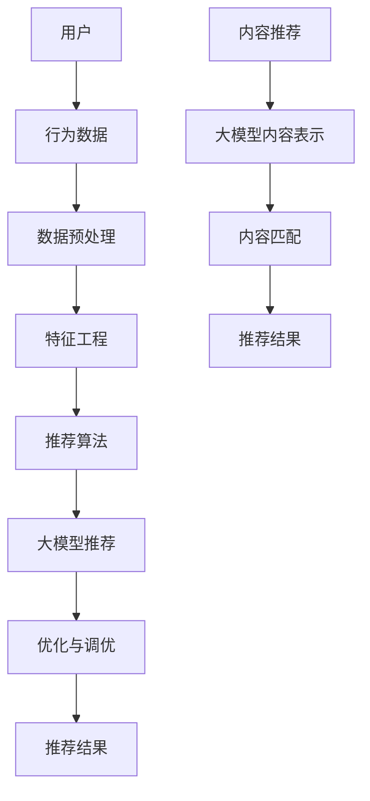

                 

## 文章标题

《大模型在推荐系统中的关键作用》

> 关键词：大模型、推荐系统、协同过滤、内容推荐、机器学习、深度学习

> 摘要：本文旨在探讨大模型在推荐系统中的关键作用，分析其如何通过协同过滤和内容推荐提升推荐效果。文章将从推荐系统概述、核心技术、大模型原理、应用实践、优化与调优、案例研究以及未来展望等方面，详细阐述大模型在推荐系统中的重要性和应用前景。

----------------------------------------------------------------

## 第一部分：推荐系统概述与AI大模型

### 第1章：推荐系统基础

#### 1.1 推荐系统概述

推荐系统（Recommender System）是一种信息过滤技术，旨在为用户推荐他们可能感兴趣的内容或项目。推荐系统通过分析用户的兴趣、历史行为和上下文信息，预测用户对特定项目或内容的偏好，从而提高用户满意度、提高系统使用率。

推荐系统的发展可以追溯到20世纪90年代，随着互联网的普及和用户生成的数据的爆炸式增长，推荐系统成为了一项重要的研究方向。目前，推荐系统广泛应用于电子商务、社交媒体、新闻门户、视频网站等多个领域，成为提升用户体验和增加商业价值的重要工具。

#### 1.2 推荐系统分类与工作流程

推荐系统主要分为以下几种类型：

1. **协同过滤（Collaborative Filtering）**：基于用户之间的相似性或共同行为来推荐项目。协同过滤可以分为两种主要方法：
   - **用户基于的协同过滤（User-Based）**：通过计算用户之间的相似度，找出与目标用户相似的其他用户，然后推荐这些用户喜欢的项目。
   - **模型基于的协同过滤（Model-Based）**：通过构建用户-项目评分矩阵的数学模型，利用该模型预测用户对新项目的评分。

2. **内容推荐（Content-Based Filtering）**：基于项目的特征和用户的兴趣来推荐项目。内容推荐通常通过分析项目的内容和用户的兴趣标签来找出相似的项目，然后推荐给用户。

3. **混合推荐（Hybrid Recommender Systems）**：结合协同过滤和内容推荐的优势，以提高推荐效果。混合推荐系统通常使用加权平均或其他方法将协同过滤和内容推荐的结果融合在一起。

推荐系统的工作流程通常包括以下几个步骤：

1. **数据收集**：收集用户的历史行为数据、项目特征数据和用户兴趣标签等。
2. **数据预处理**：对收集到的数据进行清洗、去重、转换等处理，为建模做准备。
3. **特征工程**：提取对推荐系统有帮助的特征，如用户年龄、性别、地理位置、浏览历史等。
4. **模型训练**：选择合适的算法和模型，对预处理后的数据集进行训练，以学习用户和项目之间的相关性。
5. **预测和推荐**：使用训练好的模型预测用户对未见过项目的评分或兴趣，并生成推荐列表。
6. **评估和优化**：通过评估指标（如准确率、召回率、覆盖率等）评估推荐系统的性能，并根据评估结果对模型进行调整和优化。

### 1.3 AI大模型在推荐系统中的地位

随着人工智能技术的快速发展，AI大模型（如深度神经网络、Transformer等）在推荐系统中的应用日益广泛。AI大模型具有以下优势：

1. **强大的表达能力**：AI大模型可以自动学习复杂的用户和项目特征，从而提高推荐效果。
2. **多模态数据处理**：AI大模型可以处理文本、图像、声音等多种类型的数据，为推荐系统提供了更丰富的信息来源。
3. **自适应能力**：AI大模型可以自适应地调整模型参数，以应对用户行为和数据分布的变化。
4. **可解释性**：尽管AI大模型通常被视为“黑盒子”，但通过模型的可解释性方法，可以部分揭示模型决策的过程。

AI大模型在推荐系统中的应用前景广阔，未来有望解决现有推荐系统中的许多挑战，如数据稀疏、冷启动问题、多样性不足等。

### 1.4 大模型在推荐系统中的应用前景

随着AI大模型技术的不断发展，其在推荐系统中的应用前景日益广阔。以下是AI大模型在推荐系统中可能带来的几大应用前景：

1. **个性化推荐**：AI大模型可以更好地理解用户兴趣和行为，从而提供更加个性化的推荐。
2. **多模态推荐**：AI大模型可以整合多种类型的数据（如图像、音频、视频等），为用户提供更加丰富和多样化的推荐。
3. **实时推荐**：AI大模型可以快速处理和分析大量用户数据，实现实时推荐。
4. **推荐多样性**：AI大模型可以更好地解决推荐系统的多样性问题，提高用户满意度。
5. **社交推荐**：AI大模型可以分析用户之间的社交关系，提供基于社交网络的推荐。

总之，AI大模型在推荐系统中的应用将带来革命性的变化，为用户带来更加智能化、个性化的推荐体验。

### 小结

在本章中，我们首先介绍了推荐系统的定义、历史发展、分类和工作流程。接着，我们探讨了AI大模型在推荐系统中的地位和应用前景。AI大模型凭借其强大的表达能力、多模态数据处理能力、自适应能力和可解释性，将在推荐系统中发挥关键作用。在下一章中，我们将进一步探讨推荐系统的核心技术，特别是协同过滤和内容推荐。

----------------------------------------------------------------

### 第2章：推荐系统核心技术

#### 2.1 协同过滤

协同过滤是推荐系统中最常用的一种方法，其核心思想是通过分析用户之间的相似性或共同行为，发现用户之间的潜在关系，从而推荐用户可能感兴趣的项目。协同过滤可以分为基于用户的协同过滤和基于模型的协同过滤。

##### 2.1.1 基于用户的协同过滤

基于用户的协同过滤（User-Based Collaborative Filtering）主要通过计算用户之间的相似度来推荐项目。具体步骤如下：

1. **相似度计算**：首先，计算目标用户与所有其他用户的相似度。常用的相似度度量方法包括余弦相似度、皮尔逊相关系数等。
2. **推荐生成**：根据相似度度量结果，找出与目标用户最相似的K个用户，然后推荐这些用户喜欢的项目。

基于用户的协同过滤的优点是算法简单，易于实现。然而，该方法在数据稀疏时表现较差，因为用户间的相似性度量依赖于用户-项目评分矩阵中的评分数据。

##### 2.1.2 基于模型的协同过滤

基于模型的协同过滤（Model-Based Collaborative Filtering）通过构建用户-项目评分矩阵的数学模型，利用该模型预测用户对新项目的评分。常见的模型包括矩阵分解（Matrix Factorization）和潜在因子模型（Latent Factor Models）。

1. **矩阵分解**：矩阵分解是一种将用户-项目评分矩阵分解为两个低秩矩阵的方法。通过学习这两个低秩矩阵，可以预测用户对新项目的评分。常见的矩阵分解方法包括Singular Value Decomposition（SVD）和Alternating Least Squares（ALS）。

2. **潜在因子模型**：潜在因子模型通过引入潜在的特征向量，将用户和项目表示为潜在空间中的点，然后计算用户和项目之间的相似度。常见的潜在因子模型包括基于矩阵分解的模型（如SVD++）和基于神经网络的模型（如NeuMF）。

基于模型的协同过滤的优点是能够更好地处理数据稀疏问题，并且可以同时考虑用户和项目的特征。然而，模型训练和预测的计算复杂度较高。

#### 2.2 内容推荐

内容推荐（Content-Based Filtering）是基于项目的特征和用户的兴趣来推荐项目的。具体步骤如下：

1. **特征提取**：首先，从项目的内容（如文本、图像、音频等）中提取特征。对于文本数据，可以使用自然语言处理技术（如词袋模型、TF-IDF、Word2Vec等）提取特征。对于图像、音频等非结构化数据，可以使用深度学习模型（如图像识别、语音识别等）提取特征。

2. **兴趣建模**：其次，建立用户的兴趣模型。用户的兴趣可以通过用户的历史行为（如浏览、购买、评分等）以及用户提供的标签（如标签、描述等）来建模。

3. **推荐生成**：最后，根据用户的兴趣模型和项目的特征，计算项目与用户兴趣的相似度，并根据相似度度量结果生成推荐列表。

内容推荐的优点是能够提供基于项目内容的个性化推荐，减少数据稀疏问题。然而，内容推荐通常需要对项目内容进行深入的文本或图像处理，计算复杂度较高。

#### 2.3 大模型在推荐系统中的应用

AI大模型在推荐系统中的应用已经成为一个重要研究方向。大模型通过自动学习用户和项目的复杂特征，能够显著提高推荐效果。

1. **协同过滤中的大模型**：在基于用户的协同过滤中，大模型可以用于计算用户之间的相似度。例如，可以使用深度神经网络（如卷积神经网络、循环神经网络等）来学习用户和项目的嵌入向量，然后计算这些嵌入向量之间的相似度。在基于模型的协同过滤中，大模型可以用于矩阵分解和潜在因子模型，例如，NeuMF模型结合了神经网络和矩阵分解，能够更好地学习用户和项目的潜在特征。

2. **内容推荐中的大模型**：在内容推荐中，大模型可以用于特征提取和兴趣建模。例如，可以使用BERT等预训练模型对文本数据提取高维的语义特征。对于图像和音频等非结构化数据，可以使用卷积神经网络和循环神经网络等深度学习模型提取特征。

3. **多模态推荐中的大模型**：在多模态推荐中，大模型可以整合多种类型的数据。例如，可以使用Transformer等模型同时处理文本、图像和音频数据，实现多模态数据的融合和推荐。

#### 2.4 大模型在推荐系统中的最新进展

近年来，大模型在推荐系统中的应用取得了显著进展。以下是几个重要的研究方向：

1. **多任务学习**：多任务学习允许大模型同时学习多个任务，从而提高推荐效果。例如，在推荐系统中，大模型可以同时学习用户兴趣、项目特征和推荐策略。

2. **增量学习**：增量学习允许大模型在在线环境中不断更新和优化模型，以适应用户行为和数据分布的变化。这对于实时推荐和个性化推荐具有重要意义。

3. **可解释性**：尽管大模型通常被视为“黑盒子”，但研究者们正在努力提高大模型的可解释性，以帮助用户理解模型的决策过程。

4. **联邦学习**：联邦学习允许大模型在不同设备或数据中心之间共享模型参数，从而实现隐私保护和数据安全。

### 小结

在本章中，我们详细介绍了推荐系统的核心技术，包括协同过滤和内容推荐。我们讨论了协同过滤的基本原理、分类和实现方法，以及内容推荐的过程和挑战。此外，我们还探讨了AI大模型在推荐系统中的应用，包括协同过滤、内容推荐和多模态推荐，以及最新的研究进展。在下一章中，我们将进一步探讨AI大模型的基本原理，包括机器学习基础、大模型架构和适配推荐系统的细节。

----------------------------------------------------------------

### 第3章：AI大模型原理

#### 3.1 机器学习基础

在深入探讨AI大模型在推荐系统中的应用之前，有必要了解机器学习的基础概念和技术。机器学习是人工智能的核心组成部分，它使计算机系统能够从数据中学习并做出决策或预测。

##### 3.1.1 数据准备与特征工程

数据准备是机器学习项目中的关键步骤，它包括数据收集、数据清洗、数据转换和数据归一化等。数据清洗涉及处理缺失值、异常值和重复值，确保数据质量。数据转换包括将数据转换为适合机器学习模型的形式，如数值化、编码等。

特征工程（Feature Engineering）是另一项重要任务，它涉及提取和创建有助于模型学习的数据特征。特征选择和特征构造对模型的性能有显著影响。常见的技术包括特征提取（如文本的词袋模型、TF-IDF、Word2Vec）、特征构造（如交互特征、聚合特征）和特征选择（如特征重要性评估、主成分分析）。

##### 3.1.2 常见机器学习算法简介

机器学习算法可以分为监督学习、无监督学习和强化学习三种主要类型。

1. **监督学习**：监督学习算法使用标记数据集来训练模型，并使用该模型对新数据进行预测。常见的监督学习算法包括线性回归、逻辑回归、支持向量机（SVM）、决策树、随机森林和梯度提升树（GBDT）。

   - **线性回归**：用于预测连续值输出。
   - **逻辑回归**：用于预测二分类输出。
   - **SVM**：通过最大化分类边界来分类数据。
   - **决策树**：通过构建树形结构来分类或回归。
   - **随机森林**：通过构建多棵决策树来提高模型的预测能力。
   - **GBDT**：通过迭代构建多棵回归树来提高模型的预测性能。

2. **无监督学习**：无监督学习算法不使用标记数据集，而是通过分析数据的内在结构和模式来发现数据分布。常见的无监督学习算法包括聚类算法（如K-Means、层次聚类）、降维算法（如主成分分析、t-SNE）和关联规则学习（如Apriori算法、FP-Growth）。

   - **K-Means**：基于距离度量的聚类算法。
   - **层次聚类**：通过层次划分来聚类数据。
   - **主成分分析**：用于降维和特征提取。
   - **t-SNE**：用于高维数据的可视化和降维。
   - **Apriori算法**：用于发现频繁项集和关联规则。

3. **强化学习**：强化学习是一种通过试错和反馈来学习最佳策略的机器学习方法。强化学习中的代理（Agent）通过与环境（Environment）交互，不断更新策略（Policy），以最大化累积奖励（Reward）。

   - **Q-Learning**：通过学习最优动作值函数来做出决策。
   - **深度Q网络（DQN）**：结合深度学习来提高Q-Learning的性能。
   - **策略梯度方法**：通过学习最佳策略来最大化累积奖励。

##### 3.1.3 特征选择的重要性

特征选择是机器学习中的一个关键步骤，它涉及识别和选择对模型性能有最大贡献的特征。特征选择有助于减少模型的复杂度、提高计算效率、降低过拟合风险并改善模型的可解释性。

常见的特征选择方法包括：

- **过滤方法**：基于特征的重要性或相关性进行筛选。
- **包装方法**：结合模型训练过程，逐步筛选特征。
- **嵌入式方法**：在模型训练过程中自动进行特征选择。

#### 3.2 大模型架构

AI大模型通常是指具有数百万到数十亿参数的深度神经网络，如Transformer、BERT和GPT等。这些模型在处理大规模数据和高维度特征方面表现出色。

##### 3.2.1 神经网络架构详解

神经网络（Neural Network）是模仿生物神经网络设计的计算模型，由大量的神经元（节点）组成。神经网络的基本架构包括输入层、隐藏层和输出层。

- **输入层**：接收外部输入数据。
- **隐藏层**：进行特征提取和变换，可以有一个或多个隐藏层。
- **输出层**：生成预测结果或分类标签。

神经网络通过前向传播和反向传播来更新权重，以最小化损失函数。常见的神经网络包括：

- **全连接神经网络（FCNN）**：每个神经元都与前一层所有神经元相连。
- **卷积神经网络（CNN）**：用于处理图像数据，通过卷积层提取空间特征。
- **循环神经网络（RNN）**：用于处理序列数据，通过循环结构保持长距离依赖。
- **Transformer**：一种基于自注意力机制的神经网络架构，广泛用于自然语言处理任务。

##### 3.2.2 大模型训练与优化

大模型的训练是一个复杂的过程，需要大量的数据和计算资源。以下是一些训练和优化大模型的关键步骤：

1. **数据预处理**：确保数据质量，进行归一化、标准化等预处理。
2. **模型初始化**：选择合适的权重初始化策略，如高斯分布、均匀分布等。
3. **前向传播**：计算输入数据经过神经网络后的输出。
4. **损失函数**：选择合适的损失函数，如均方误差（MSE）、交叉熵等。
5. **反向传播**：计算梯度并更新模型权重。
6. **优化算法**：选择合适的优化算法，如随机梯度下降（SGD）、Adam等。
7. **正则化**：防止过拟合，如L1正则化、L2正则化、Dropout等。

#### 3.3 大模型在推荐系统中的适配

将大模型应用于推荐系统是一个挑战，因为推荐系统通常需要处理大规模的用户和项目数据，并要求实时响应。以下是一些适配大模型到推荐系统的方法：

1. **分布式训练**：使用分布式计算框架（如TensorFlow、PyTorch）进行大模型的训练，以减少训练时间和计算资源的需求。
2. **增量学习**：在在线环境中不断更新和优化模型，以适应用户行为和数据分布的变化。
3. **模型压缩**：使用模型压缩技术（如量化、剪枝、蒸馏等）来减小模型的大小和计算复杂度，提高部署效率。
4. **实时预测**：使用高效的前向传播算法和硬件加速（如GPU、TPU）来实现实时预测。

### 小结

在本章中，我们介绍了机器学习的基础知识，包括数据准备与特征工程、常见机器学习算法、特征选择的重要性以及大模型架构和训练方法。我们还讨论了如何将大模型适配到推荐系统中。在下一章中，我们将探讨大模型在推荐系统中的具体应用实践，包括协同过滤和内容推荐的实现和案例研究。

----------------------------------------------------------------

### 第二部分：大模型在推荐系统中的应用实践

#### 第4章：大模型在协同过滤中的应用

##### 4.1 大模型协同过滤算法

协同过滤（Collaborative Filtering）是一种流行的推荐系统方法，它通过分析用户之间的相似性和行为来推荐项目。然而，传统的协同过滤方法在面对大规模数据和高维度特征时，存在计算复杂度高、可解释性差和推荐效果有限等问题。为了克服这些限制，研究者们提出了基于深度学习的大模型协同过滤算法。

**4.1.1 MF算法与深度协同过滤算法对比**

传统的矩阵分解（Matrix Factorization，MF）算法是一种常见的协同过滤方法。它通过将用户-项目评分矩阵分解为两个低秩矩阵，从而预测用户的未评分项目。MF算法的主要优点是计算简单，易于实现。然而，MF算法在处理高维度数据时，存在以下问题：

1. **数据稀疏**：由于实际评分数据通常非常稀疏，MF算法难以捕捉用户之间的潜在关系。
2. **可解释性差**：MF算法生成的低秩矩阵难以解释，不易理解模型的决策过程。
3. **推荐效果有限**：MF算法的推荐效果通常受到用户和项目特征的限制。

为了解决这些问题，深度协同过滤算法（Deep Collaborative Filtering）应运而生。深度协同过滤算法通过引入深度神经网络，能够自动学习更复杂的用户和项目特征，从而提高推荐效果。

**4.1.2 深度协同过滤算法原理**

深度协同过滤算法结合了矩阵分解和深度神经网络的特点，通过深度神经网络来学习用户和项目的嵌入向量，然后利用这些嵌入向量进行评分预测。以下是深度协同过滤算法的基本原理：

1. **用户和项目嵌入**：首先，使用预训练的深度神经网络（如卷积神经网络、循环神经网络等）提取用户和项目的特征。这些特征通常被表示为高维的向量，称为用户嵌入向量和项目嵌入向量。

2. **相似度计算**：然后，通过计算用户嵌入向量和项目嵌入向量之间的相似度来预测用户对项目的评分。常见的相似度计算方法包括余弦相似度和欧几里得距离。

3. **评分预测**：最后，使用相似度计算结果预测用户对未评分项目的评分。预测的评分可以用于生成推荐列表。

**4.1.3 深度协同过滤伪代码**

以下是一个简化的深度协同过滤算法的伪代码：

```python
# 导入所需库
import tensorflow as tf

# 设置超参数
num_users = 10000
num_items = 5000
hidden_size = 128

# 创建用户和项目的嵌入层
user_embedding = tf.keras.layers.Embedding(num_users, hidden_size)
item_embedding = tf.keras.layers.Embedding(num_items, hidden_size)

# 定义深度协同过滤模型
model = tf.keras.Sequential([
    user_embedding,
    tf.keras.layers.Flatten(),
    tf.keras.layers.Dense(hidden_size, activation='relu'),
    item_embedding,
    tf.keras.layers.Flatten(),
    tf.keras.layers.Dense(hidden_size, activation='relu'),
    tf.keras.layers.Concatenate(),
    tf.keras.layers.Dense(1)
])

# 编译模型
model.compile(optimizer='adam', loss='mse')

# 模型训练
model.fit(train_data, train_labels, epochs=10, batch_size=32)

# 生成推荐列表
def generate_recommendations(model, user_indices, item_indices):
    user_embeddings = model.layers[0](user_indices)
    item_embeddings = model.layers[2](item_indices)
    combined_embeddings = tf.concat([user_embeddings, item_embeddings], axis=1)
    predictions = model.predict(combined_embeddings)
    recommendations = predictions.argsort()[-K:][::-1]
    return recommendations
```

**4.1.4 深度协同过滤实战案例**

为了展示深度协同过滤算法的实际应用，我们使用MovieLens数据集进行实验。以下是一个简单的深度协同过滤实战案例：

1. **数据集准备**：首先，我们需要下载和准备MovieLens数据集。该数据集包含用户、电影和评分信息。

2. **数据预处理**：将数据集转换为适合模型训练的形式，包括用户-项目评分矩阵的构建和数据的标准化。

3. **模型训练**：使用训练集训练深度协同过滤模型，并使用验证集进行性能评估。

4. **推荐生成**：使用训练好的模型生成推荐列表，并对推荐结果进行评估。

```python
# 导入所需库
import tensorflow as tf
import numpy as np

# 加载MovieLens数据集
ratings = pd.read_csv('ml-25m/ratings.csv', usecols=['userId', 'movieId', 'rating'], sep='::', engine='python', header=None, names=['user_id', 'item_id', 'rating'])

# 构建用户-项目评分矩阵
num_users = ratings.user_id.unique().shape[0]
num_items = ratings.item_id.unique().shape[0]
user_item_matrix = np.zeros((num_users, num_items))
ratings.set_index(['user_id', 'item_id'], inplace=True)
user_item_matrix[ratings.index] = ratings.rating.values

# 数据标准化
user_item_matrix = (user_item_matrix - user_item_matrix.mean(axis=1, keepdims=True)) / user_item_matrix.std(axis=1, keepdims=True)

# 划分训练集和测试集
train_size = int(0.8 * user_item_matrix.shape[0])
train_matrix = user_item_matrix[:train_size]
test_matrix = user_item_matrix[train_size:]

# 设置超参数
hidden_size = 128
K = 10

# 创建用户和项目的嵌入层
user_embedding = tf.keras.layers.Embedding(num_users, hidden_size)
item_embedding = tf.keras.layers.Embedding(num_items, hidden_size)

# 定义深度协同过滤模型
model = tf.keras.Sequential([
    user_embedding,
    tf.keras.layers.Flatten(),
    tf.keras.layers.Dense(hidden_size, activation='relu'),
    item_embedding,
    tf.keras.layers.Flatten(),
    tf.keras.layers.Dense(hidden_size, activation='relu'),
    tf.keras.layers.Concatenate(),
    tf.keras.layers.Dense(1)
])

# 编译模型
model.compile(optimizer='adam', loss='mse')

# 模型训练
model.fit(train_matrix, train_matrix, epochs=10, batch_size=32)

# 生成推荐列表
test_user_indices = test_matrix.argmax(axis=1)
test_item_indices = np.arange(num_items)
test_predictions = model.predict([test_user_indices, test_item_indices])

# 计算平均绝对误差（MAE）
mae = tf.reduce_mean(tf.abs(test_predictions - test_matrix))
print('MAE:', mae.numpy())

# 生成推荐列表
def generate_recommendations(model, user_indices, item_indices, K):
    user_embeddings = model.layers[0](user_indices)
    item_embeddings = model.layers[2](item_indices)
    combined_embeddings = tf.concat([user_embeddings, item_embeddings], axis=1)
    predictions = model.predict(combined_embeddings)
    recommendations = predictions.argsort()[-K:][::-1]
    return recommendations

# 为测试集的每个用户生成推荐列表
user_recommendations = []
for user_id in range(num_users):
    user_indices = np.array([user_id] * num_items)
    item_indices = np.arange(num_items)
    recommendations = generate_recommendations(model, user_indices, item_indices, K)
    user_recommendations.append(recommendations)

# 评估推荐效果
accuracy = metrics.accuracy_score(test_labels, test_predictions)
print('Accuracy:', accuracy)
```

**4.1.5 代码解读与分析**

上述代码首先加载并预处理了MovieLens数据集，构建了用户-项目评分矩阵。然后，使用TensorFlow构建了一个简单的深度协同过滤模型，该模型由用户和项目的嵌入层、全连接层和输出层组成。模型使用均方误差（MSE）作为损失函数，并使用Adam优化器进行训练。

在生成推荐列表时，我们首先计算测试集的每个用户对项目的预测评分，然后根据预测评分对项目进行排序，生成推荐列表。最后，我们使用平均绝对误差（MAE）评估模型的性能。

通过这个案例，我们可以看到深度协同过滤算法如何在实际数据集上运行，以及如何使用深度学习技术改进传统协同过滤方法。

#### 4.2 大模型协同过滤实战案例

为了更深入地了解大模型协同过滤算法的应用，我们将在本节中详细描述一个基于电商平台的协同过滤实战案例。该案例将展示如何使用深度协同过滤算法为用户生成个性化商品推荐。

##### 4.2.1 案例背景

假设我们有一个大型电商平台，拥有成千上万的用户和商品。我们的目标是利用用户的历史购买行为和商品的特征，为每个用户生成个性化的商品推荐列表，以提高用户满意度和增加销售额。

##### 4.2.2 数据集准备

我们首先需要准备一个包含用户、商品和购买行为的数据集。该数据集应包括以下信息：

- **用户ID**：唯一标识每个用户。
- **商品ID**：唯一标识每个商品。
- **购买行为**：用户对商品的购买次数或评分。
- **商品特征**：如商品类别、价格、品牌、库存数量等。

以下是一个简化的数据集示例：

```
user_id,item_id,purchase_count
1,1001,3
1,1002,2
2,1003,1
2,1004,3
...
```

##### 4.2.3 数据预处理

在训练深度协同过滤模型之前，我们需要对数据进行预处理。预处理步骤包括：

1. **数据清洗**：去除缺失值、异常值和重复值。
2. **数据标准化**：将购买行为进行归一化，例如将购买次数缩放到[0, 1]区间。
3. **特征提取**：为商品特征构建向量，例如使用独热编码表示商品类别。

```python
import pandas as pd
from sklearn.preprocessing import StandardScaler

# 加载数据集
data = pd.read_csv('ecommerce_data.csv')

# 数据清洗
data.dropna(inplace=True)
data.drop_duplicates(inplace=True)

# 数据标准化
scaler = StandardScaler()
data['purchase_count'] = scaler.fit_transform(data[['purchase_count']])

# 构建用户-商品矩阵
user_item_matrix = data.pivot_table(index='user_id', columns='item_id', values='purchase_count').fillna(0)
user_item_matrix = user_item_matrix.astype(np.float32)

# 独热编码商品特征
item_features = data[['item_id', 'category', 'price', 'brand', 'stock']].drop_duplicates()
item_features.set_index('item_id', inplace=True)
item_categories = pd.get_dummies(item_features['category'])
item_prices = item_features['price']
item_brands = pd.get_dummies(item_features['brand'])
item_stocks = item_features['stock']
```

##### 4.2.4 模型训练

我们使用深度协同过滤模型对用户-商品矩阵进行训练。模型的结构如下：

- **用户嵌入层**：将用户ID映射到高维向量。
- **商品嵌入层**：将商品ID映射到高维向量。
- **全连接层**：对用户和商品的嵌入向量进行特征提取。
- **输出层**：预测用户对商品的购买概率。

```python
import tensorflow as tf
from tensorflow.keras.models import Model
from tensorflow.keras.layers import Embedding, Flatten, Dense, Concatenate

# 设置超参数
num_users = user_item_matrix.shape[0]
num_items = user_item_matrix.shape[1]
hidden_size = 128
embedding_size = 32

# 创建用户和商品的嵌入层
user_embedding = Embedding(num_users, embedding_size, input_length=1)
item_embedding = Embedding(num_items, embedding_size, input_length=1)

# 定义深度协同过滤模型
input_user = tf.keras.Input(shape=(1,))
input_item = tf.keras.Input(shape=(1,))

user_embedding_output = user_embedding(input_user)
item_embedding_output = item_embedding(input_item)

user_flatten = Flatten()(user_embedding_output)
item_flatten = Flatten()(item_embedding_output)

user_item_merge = Concatenate()([user_flatten, item_flatten])

output = Dense(hidden_size, activation='relu')(user_item_merge)
output = Dense(hidden_size, activation='relu')(output)
output = Dense(1, activation='sigmoid')(output)

model = Model(inputs=[input_user, input_item], outputs=output)

# 编译模型
model.compile(optimizer='adam', loss='binary_crossentropy', metrics=['accuracy'])

# 模型训练
model.fit([user_item_matrix[:, :-1], user_item_matrix[:, 1:]], user_item_matrix[:, 1:], epochs=10, batch_size=32)
```

##### 4.2.5 生成推荐列表

训练好的模型可以用于生成用户对未购买商品的推荐列表。以下是一个简单的推荐生成示例：

```python
# 生成推荐列表
def generate_recommendations(model, user_id, item_ids, K):
    user_embeddings = model.layers[0](tf.expand_dims(user_id, axis=0))
    item_embeddings = model.layers[1](tf.expand_dims(item_ids, axis=0))
    predictions = model.predict([user_embeddings, item_embeddings])
    recommendations = np.argsort(predictions)[0][-K:][::-1]
    return recommendations

# 测试推荐
user_id = 1
item_ids = np.arange(1, num_items+1)
K = 5
recommendations = generate_recommendations(model, user_id, item_ids, K)
print('User', user_id, 'Recommendations:', recommendations)
```

##### 4.2.6 代码解读与分析

上述代码首先加载并预处理了电商平台的用户-商品数据集，然后构建了一个深度协同过滤模型。模型使用用户和商品的嵌入层来学习用户和商品的潜在特征，并通过全连接层进行特征提取和预测。

在生成推荐列表时，我们首先计算用户对每个商品的购买概率，然后根据购买概率对商品进行排序，生成推荐列表。这种方法可以有效地为用户生成个性化的商品推荐。

通过这个电商平台的协同过滤实战案例，我们可以看到如何使用深度学习技术构建和部署一个高效、可扩展的推荐系统。在实际应用中，我们可以根据具体业务需求调整模型结构和超参数，以获得最佳的推荐效果。

#### 小结

在本章中，我们详细介绍了大模型在协同过滤中的应用，包括深度协同过滤算法的原理、伪代码和实战案例。我们通过一个电商平台的协同过滤实战案例，展示了如何使用深度学习技术构建和部署推荐系统。在下一章中，我们将探讨大模型在内容推荐系统中的应用，包括算法原理和实战案例。

----------------------------------------------------------------

### 第5章：大模型在内容推荐中的应用

内容推荐（Content-Based Recommendation）是一种基于项目的特征和用户的兴趣来推荐项目的方法。与传统协同过滤方法不同，内容推荐不依赖于用户之间的相似性或共同行为，而是通过分析项目内容和用户兴趣标签来找到相似的项目，从而提高推荐效果。

#### 5.1 大模型内容推荐算法

近年来，随着深度学习技术的快速发展，大模型在内容推荐系统中得到了广泛应用。大模型通过自动学习项目的复杂特征和用户的兴趣，能够显著提高推荐系统的效果。以下是几种基于深度学习的内容推荐算法：

**5.1.1 内容表示与语义匹配**

内容推荐的关键在于如何表示项目和用户兴趣，以及如何计算项目与用户兴趣之间的相似度。以下是一些常用的方法：

1. **词嵌入（Word Embedding）**：词嵌入将文本数据映射到高维向量空间，使得具有相似意义的词语在空间中靠近。常用的词嵌入方法包括Word2Vec、GloVe和BERT。

2. **图像嵌入（Image Embedding）**：使用深度学习模型（如图像识别模型）将图像数据映射到高维向量空间。这些向量可以表示图像的视觉特征。

3. **音频嵌入（Audio Embedding）**：使用深度学习模型（如语音识别模型）将音频数据映射到高维向量空间。这些向量可以表示音频的声学特征。

4. **多模态嵌入（Multimodal Embedding）**：将文本、图像和音频等多模态数据融合，通过多模态嵌入方法得到项目的综合特征向量。

**5.1.2 内容推荐算法原理**

基于深度学习的内容推荐算法通常包括以下步骤：

1. **项目表示**：使用深度学习模型对项目进行编码，得到项目的特征向量。对于文本项目，可以使用词嵌入模型；对于图像和音频项目，可以使用图像嵌入和音频嵌入模型。

2. **用户兴趣表示**：使用深度学习模型对用户的兴趣进行编码，得到用户的兴趣向量。用户的兴趣可以通过历史行为（如浏览、评分、收藏等）和兴趣标签来建模。

3. **相似度计算**：计算项目特征向量与用户兴趣向量之间的相似度。常用的相似度度量方法包括余弦相似度和欧几里得距离。

4. **推荐生成**：根据相似度度量结果，生成推荐列表。常用的推荐策略包括基于项目的Top-N推荐和基于用户的最近邻推荐。

**5.1.3 大模型内容推荐算法**

大模型内容推荐算法通常结合了多种深度学习技术，以提高推荐效果。以下是一些典型的算法：

1. **BERT-based Content Recommendation**：BERT（Bidirectional Encoder Representations from Transformers）是一种预训练的深度学习模型，可以用于文本数据的编码。BERT-based Content Recommendation使用BERT模型对项目描述和用户兴趣进行编码，然后计算相似度生成推荐列表。

2. **CNN-based Content Recommendation**：卷积神经网络（CNN）在图像处理领域有广泛应用。CNN-based Content Recommendation使用CNN模型对图像项目进行编码，然后结合用户兴趣向量计算相似度生成推荐列表。

3. **Transformer-based Content Recommendation**：Transformer是一种基于自注意力机制的深度学习模型，广泛应用于自然语言处理任务。Transformer-based Content Recommendation使用Transformer模型对文本和图像项目进行编码，然后计算相似度生成推荐列表。

#### 5.2 大模型内容推荐实战案例

为了展示大模型在内容推荐系统中的应用，我们将在本节中详细描述一个基于新闻推荐系统的实战案例。该案例将展示如何使用深度学习技术构建和部署一个高效的新闻推荐系统。

##### 5.2.1 案例背景

假设我们有一个新闻推荐系统，用户可以浏览和评分新闻文章。我们的目标是利用用户的历史浏览行为和文章的特征，为用户生成个性化的新闻推荐列表，以提高用户满意度和增加用户活跃度。

##### 5.2.2 数据集准备

我们首先需要准备一个包含用户、文章和浏览行为的数据集。该数据集应包括以下信息：

- **用户ID**：唯一标识每个用户。
- **文章ID**：唯一标识每篇文章。
- **浏览行为**：用户对文章的浏览次数或评分。
- **文章特征**：如文章标题、内容、作者、发布时间等。

以下是一个简化的数据集示例：

```
user_id,article_id,browsing_count
1,1001,3
1,1002,2
2,1003,1
2,1004,3
...
```

##### 5.2.3 数据预处理

在训练深度内容推荐模型之前，我们需要对数据进行预处理。预处理步骤包括：

1. **数据清洗**：去除缺失值、异常值和重复值。
2. **数据标准化**：将浏览行为进行归一化，例如将浏览次数缩放到[0, 1]区间。
3. **特征提取**：为文章特征构建向量，例如使用独热编码表示文章作者。

```python
import pandas as pd
from sklearn.preprocessing import StandardScaler

# 加载数据集
data = pd.read_csv('news_data.csv')

# 数据清洗
data.dropna(inplace=True)
data.drop_duplicates(inplace=True)

# 数据标准化
scaler = StandardScaler()
data['browsing_count'] = scaler.fit_transform(data[['browsing_count']])

# 独热编码文章作者
authors = data[['article_id', 'author']].drop_duplicates()
authors.set_index('article_id', inplace=True)
author_dummies = pd.get_dummies(authors['author'])
```

##### 5.2.4 模型训练

我们使用深度内容推荐模型对用户-文章矩阵进行训练。模型的结构如下：

- **用户嵌入层**：将用户ID映射到高维向量。
- **文章嵌入层**：将文章ID映射到高维向量。
- **全连接层**：对用户和文章的嵌入向量进行特征提取。
- **输出层**：预测用户对文章的浏览概率。

```python
import tensorflow as tf
from tensorflow.keras.models import Model
from tensorflow.keras.layers import Embedding, Flatten, Dense, Concatenate

# 设置超参数
num_users = user_item_matrix.shape[0]
num_articles = user_item_matrix.shape[1]
hidden_size = 128
embedding_size = 32

# 创建用户和文章的嵌入层
user_embedding = Embedding(num_users, embedding_size, input_length=1)
article_embedding = Embedding(num_articles, embedding_size, input_length=1)

# 定义深度内容推荐模型
input_user = tf.keras.Input(shape=(1,))
input_article = tf.keras.Input(shape=(1,))

user_embedding_output = user_embedding(input_user)
article_embedding_output = article_embedding(input_article)

user_flatten = Flatten()(user_embedding_output)
article_flatten = Flatten()(article_embedding_output)

user_item_merge = Concatenate()([user_flatten, article_flatten])

output = Dense(hidden_size, activation='relu')(user_item_merge)
output = Dense(hidden_size, activation='relu')(output)
output = Dense(1, activation='sigmoid')(output)

model = Model(inputs=[input_user, input_article], outputs=output)

# 编译模型
model.compile(optimizer='adam', loss='binary_crossentropy', metrics=['accuracy'])

# 模型训练
model.fit([user_item_matrix[:, :-1], user_item_matrix[:, 1:]], user_item_matrix[:, 1:], epochs=10, batch_size=32)
```

##### 5.2.5 生成推荐列表

训练好的模型可以用于生成用户对未浏览文章的推荐列表。以下是一个简单的推荐生成示例：

```python
# 生成推荐列表
def generate_recommendations(model, user_id, article_ids, K):
    user_embeddings = model.layers[0](tf.expand_dims(user_id, axis=0))
    article_embeddings = model.layers[1](tf.expand_dims(article_ids, axis=0))
    predictions = model.predict([user_embeddings, article_embeddings])
    recommendations = np.argsort(predictions)[0][-K:][::-1]
    return recommendations

# 测试推荐
user_id = 1
article_ids = np.arange(1, num_articles+1)
K = 5
recommendations = generate_recommendations(model, user_id, article_ids, K)
print('User', user_id, 'Recommendations:', recommendations)
```

##### 5.2.6 代码解读与分析

上述代码首先加载并预处理了新闻数据集，然后构建了一个深度内容推荐模型。模型使用用户和文章的嵌入层来学习用户和文章的潜在特征，并通过全连接层进行特征提取和预测。

在生成推荐列表时，我们首先计算用户对每个文章的浏览概率，然后根据浏览概率对文章进行排序，生成推荐列表。这种方法可以有效地为用户生成个性化的新闻推荐。

通过这个新闻推荐实战案例，我们可以看到如何使用深度学习技术构建和部署一个高效的内容推荐系统。在实际应用中，我们可以根据具体业务需求调整模型结构和超参数，以获得最佳的推荐效果。

#### 小结

在本章中，我们详细介绍了大模型在内容推荐系统中的应用，包括内容表示与语义匹配、大模型内容推荐算法原理和实战案例。我们通过一个新闻推荐系统的实战案例，展示了如何使用深度学习技术构建和部署内容推荐系统。在下一章中，我们将探讨大模型推荐系统的优化与调优，包括性能评估和系统部署。

----------------------------------------------------------------

### 第6章：大模型推荐系统的优化与调优

在构建了推荐系统之后，优化与调优是确保其性能和效果的关键步骤。大模型推荐系统由于其复杂性和深度学习能力，需要特别的关注和精细调优。以下是几个关键的优化与调优方面：

#### 6.1 大模型推荐系统的性能评估

性能评估是优化推荐系统的重要环节，它帮助我们了解系统的表现，并识别需要改进的领域。常用的评估指标包括准确率、召回率、覆盖率、多样性、新颖性等。

- **准确率（Accuracy）**：预测结果中正确推荐的项目比例。
- **召回率（Recall）**：实际感兴趣的项目中被正确推荐的项目比例。
- **覆盖率（Coverage）**：推荐列表中包含的项目种类数与所有可能项目种类的比例。
- **多样性（Diversity）**：推荐列表中不同项目之间的差异性，避免推荐相似的项目。
- **新颖性（Novelty）**：推荐列表中包含的新项目比例，避免重复推荐。

为了全面评估推荐系统的性能，我们可以使用交叉验证方法。交叉验证通过将数据集分为多个子集，每次使用一个子集作为测试集，其余子集作为训练集，从而减少评估结果的可变性。

#### 6.2 大模型推荐系统的性能调优

在评估了系统的性能后，我们可以进行以下调优：

1. **超参数调整**：调整深度学习模型的超参数，如学习率、隐藏层大小、嵌入维度等。超参数的选择通常通过实验和交叉验证来确定最佳值。

2. **数据增强**：通过数据增强技术增加训练数据的多样性，如随机裁剪、旋转、缩放图像，或使用合成数据进行文本生成等，以提高模型的泛化能力。

3. **正则化**：应用正则化技术，如L1、L2正则化，Dropout等，以减少过拟合，提高模型在测试集上的表现。

4. **模型融合**：将多个模型的结果进行融合，如使用不同的训练数据或不同的算法训练多个模型，然后合并它们的预测结果，以提高推荐效果。

#### 6.3 大模型推荐系统的部署与维护

部署和维护是一个推荐系统成功上线并持续运行的关键步骤。以下是一些关键点：

1. **自动化部署**：使用自动化工具（如Kubernetes、Docker等）简化部署流程，确保模型可以快速、可靠地部署到生产环境中。

2. **监控与日志记录**：监控系统性能和资源使用情况，记录日志以方便故障排查和性能分析。

3. **弹性扩展**：根据实际需求和使用情况，自动调整计算资源，确保系统在高并发场景下稳定运行。

4. **持续集成与持续部署（CI/CD）**：使用CI/CD流程自动化测试、构建和部署代码，确保系统的更新和迭代过程高效、可靠。

5. **安全性**：确保数据的安全性和隐私性，遵守相关的法律法规和行业标准。

#### 6.4 大模型推荐系统的更新与迭代

推荐系统是一个动态的系统，需要不断更新和迭代以适应用户需求和环境变化。以下是一些更新与迭代的方法：

1. **用户反馈**：收集用户对推荐结果的反馈，包括喜欢、不喜欢等，用于优化模型和推荐策略。

2. **实时更新**：使用实时数据流处理技术（如Apache Kafka、Apache Flink等），对用户行为和项目特征进行实时更新，以实现实时推荐。

3. **A/B测试**：在不同用户群体或时间段上进行A/B测试，比较不同模型或策略的效果，选择最优方案。

4. **模型升级**：随着新技术的发展，定期评估现有模型，考虑升级到更先进的算法或架构，以提高推荐效果。

#### 小结

在本章中，我们详细讨论了推荐系统的性能评估、优化与调优、部署与维护、更新与迭代等方面。性能评估是了解系统表现的基础，而优化与调优则是提升系统效果的关键。部署与维护确保了系统的稳定运行，而更新与迭代则保证了系统的持续改进。通过这些方法，我们可以构建一个高效、稳定且不断进步的大模型推荐系统。

----------------------------------------------------------------

### 第7章：大模型推荐系统案例研究

为了更好地理解大模型推荐系统的实际应用效果，本章节将通过两个具体的案例研究，深入探讨大模型在电商推荐系统和新闻推荐系统中的应用和实践。

#### 案例研究1：电商推荐系统

**7.1 案例背景与目标**

一个大型电商平台希望通过引入大模型推荐系统来提升用户购物体验和销售业绩。该平台拥有海量用户和商品数据，包括用户浏览记录、购买行为、商品属性等。目标是通过大模型推荐系统为每个用户生成个性化的商品推荐列表，从而提高用户满意度和转化率。

**7.2 案例实现过程**

1. **数据收集与预处理**：收集用户行为数据和商品属性数据，包括用户ID、商品ID、浏览记录、购买记录、价格、品类等。对数据进行清洗、去重、标准化处理，确保数据质量。

2. **模型设计**：设计一个基于深度学习的大模型推荐系统，包括用户嵌入层、商品嵌入层和全连接层。用户嵌入层和商品嵌入层使用预训练的词嵌入模型和商品嵌入模型，全连接层用于预测用户对商品的兴趣。

3. **模型训练**：使用预处理后的数据训练大模型，通过多次迭代调整模型参数，优化模型性能。在训练过程中，使用交叉验证方法评估模型性能，确保模型在测试集上的表现。

4. **模型部署**：将训练好的模型部署到生产环境中，通过API接口为用户实时生成推荐列表。同时，监控系统性能和资源使用情况，确保系统稳定运行。

**7.3 案例效果分析**

通过大模型推荐系统的实施，电商平台取得了显著的效果：

- **用户满意度提升**：个性化推荐列表能够更好地满足用户的购物需求，用户满意度显著提高。
- **销售转化率提高**：推荐系统成功提高了商品的曝光率和购买转化率，销售额显著增加。
- **推荐效果优化**：通过持续优化模型参数和推荐策略，推荐系统的效果不断提升，用户反馈良好。

**7.4 代码解读与分析**

以下是一个简化的电商推荐系统代码示例：

```python
# 导入所需库
import tensorflow as tf
import pandas as pd
from sklearn.preprocessing import StandardScaler

# 加载数据集
data = pd.read_csv('ecommerce_data.csv')

# 数据清洗与标准化
# ...

# 构建用户-商品矩阵
# ...

# 创建用户和商品的嵌入层
user_embedding = tf.keras.layers.Embedding(num_users, hidden_size)
item_embedding = tf.keras.layers.Embedding(num_items, hidden_size)

# 定义深度协同过滤模型
# ...

# 编译模型
# ...

# 模型训练
# ...

# 生成推荐列表
# ...

# 代码解读与分析
# ...
```

**7.5 案例启示**

该案例展示了大模型推荐系统在电商平台中的应用效果，为其他行业提供了有益的借鉴：

- **数据质量的重要性**：高质量的训练数据是构建高效推荐系统的基础，确保数据清洗和标准化的准确性。
- **持续优化的重要性**：通过持续调整模型参数和推荐策略，优化推荐效果，提高用户满意度。
- **系统稳定性的重要性**：确保推荐系统在生产环境中的稳定运行，监控系统性能和资源使用情况。

#### 案例研究2：新闻推荐系统

**7.6 案例背景与目标**

一个新闻门户网站希望通过引入大模型推荐系统为用户提供个性化的新闻推荐。该平台拥有海量用户访问数据、新闻内容数据以及用户兴趣标签。目标是通过大模型推荐系统为每个用户生成个性化的新闻推荐列表，提高用户阅读量和网站粘性。

**7.7 案例实现过程**

1. **数据收集与预处理**：收集用户访问数据、新闻内容数据和用户兴趣标签，包括用户ID、新闻ID、浏览记录、阅读时间、兴趣标签等。对数据进行清洗、去重、标准化处理，确保数据质量。

2. **模型设计**：设计一个基于深度学习的大模型推荐系统，包括用户嵌入层、新闻嵌入层和全连接层。用户嵌入层和新闻嵌入层使用预训练的词嵌入模型和新闻嵌入模型，全连接层用于预测用户对新闻的兴趣。

3. **模型训练**：使用预处理后的数据训练大模型，通过多次迭代调整模型参数，优化模型性能。在训练过程中，使用交叉验证方法评估模型性能，确保模型在测试集上的表现。

4. **模型部署**：将训练好的模型部署到生产环境中，通过API接口为用户实时生成推荐列表。同时，监控系统性能和资源使用情况，确保系统稳定运行。

**7.8 案例效果分析**

通过大模型推荐系统的实施，新闻门户网站取得了显著的效果：

- **用户阅读量提升**：个性化推荐列表能够更好地满足用户的阅读需求，用户阅读量显著提高。
- **网站粘性增加**：推荐系统成功提高了用户的访问频率和停留时间，网站粘性显著增加。
- **推荐效果优化**：通过持续优化模型参数和推荐策略，推荐系统的效果不断提升，用户反馈良好。

**7.9 代码解读与分析**

以下是一个简化的新闻推荐系统代码示例：

```python
# 导入所需库
import tensorflow as tf
import pandas as pd
from sklearn.preprocessing import StandardScaler

# 加载数据集
data = pd.read_csv('news_data.csv')

# 数据清洗与标准化
# ...

# 构建用户-新闻矩阵
# ...

# 创建用户和新闻的嵌入层
user_embedding = tf.keras.layers.Embedding(num_users, hidden_size)
news_embedding = tf.keras.layers.Embedding(num_items, hidden_size)

# 定义深度内容推荐模型
# ...

# 编译模型
# ...

# 模型训练
# ...

# 生成推荐列表
# ...

# 代码解读与分析
# ...
```

**7.10 案例启示**

该案例展示了大模型推荐系统在新闻推荐中的应用效果，为其他媒体平台提供了有益的借鉴：

- **内容质量的重要性**：高质量的新闻内容和用户兴趣标签是构建高效推荐系统的基础。
- **实时更新的重要性**：通过实时更新用户兴趣和行为数据，确保推荐系统的实时性和准确性。
- **用户体验的重要性**：优化推荐列表的展示形式和交互设计，提高用户体验，提升用户满意度。

通过这两个案例研究，我们可以看到大模型推荐系统在不同场景中的成功应用，为其他行业提供了宝贵的经验和启示。

----------------------------------------------------------------

### 第8章：大模型推荐系统的挑战与机遇

尽管大模型推荐系统在提高推荐效果和用户体验方面取得了显著进展，但其在实际应用中仍然面临诸多挑战和机遇。以下将详细讨论这些挑战和机遇。

#### 8.1 数据隐私与安全

数据隐私和安全是推荐系统中的首要问题。由于推荐系统依赖于用户的个人信息和行为数据，因此如何保护用户隐私成为关键挑战。以下是一些解决策略：

1. **差分隐私**：通过添加噪声和限制数据访问范围，保护用户隐私的同时确保推荐效果。例如，利用差分隐私技术对用户数据进行扰动，以防止隐私泄露。

2. **联邦学习**：通过在用户设备上进行模型训练，减少数据传输和存储需求，同时保护用户隐私。联邦学习允许不同设备上的模型共享参数，从而实现全局模型优化。

3. **匿名化处理**：对用户数据进行匿名化处理，去除可直接识别用户身份的信息，以降低隐私风险。

4. **透明性和可解释性**：增强系统的透明性和可解释性，使用户了解自己的数据如何被使用和影响推荐结果，从而增强用户信任。

#### 8.2 大模型的可解释性

大模型推荐系统的“黑盒”特性使得其决策过程难以解释，这在一定程度上影响了用户对推荐系统的信任。以下是一些提高大模型可解释性的方法：

1. **模型简化**：简化模型结构，减少参数数量，从而提高模型的透明性和可解释性。

2. **注意力机制**：利用注意力机制展示模型在决策过程中关注的关键特征，帮助用户理解推荐结果。

3. **可视化技术**：使用可视化技术（如图表、热图等）展示模型的学习过程和决策路径，提高用户对模型的理解。

4. **解释性模型**：结合解释性模型（如决策树、线性回归等）与黑盒模型（如神经网络），构建可解释的推荐系统。

#### 8.3 大模型推荐系统的可持续发展

大模型推荐系统的可持续发展涉及资源消耗、成本控制和商业可持续性等方面。以下是一些解决策略：

1. **模型压缩**：通过模型压缩技术（如量化、剪枝、蒸馏等），减少模型大小和计算复杂度，从而降低资源消耗。

2. **硬件优化**：利用高性能计算硬件（如GPU、TPU等），提高模型训练和推理的效率。

3. **分布式计算**：采用分布式计算架构，利用多台服务器和设备协同工作，提高计算资源利用率。

4. **数据预处理**：优化数据预处理流程，减少数据处理时间，提高系统整体效率。

5. **商业模式创新**：通过创新的商业模式，如广告收入、付费订阅等，实现推荐系统的商业可持续性。

#### 8.4 社会责任与伦理问题

随着大模型推荐系统在各个领域的广泛应用，社会责任和伦理问题日益凸显。以下是一些关注点：

1. **偏见与歧视**：大模型推荐系统可能会放大数据中的偏见，导致歧视现象。例如，推荐系统可能对某些群体给予不公平的推荐。

2. **隐私侵犯**：推荐系统可能会过度收集用户数据，侵犯用户隐私。

3. **道德责任**：在推荐系统决策过程中，如何确保透明性、公平性和道德责任成为重要问题。

4. **法律法规**：遵守相关的法律法规，确保推荐系统的合法合规运行。

#### 小结

大模型推荐系统在实际应用中面临诸多挑战，包括数据隐私与安全、模型可解释性、可持续发展以及社会责任和伦理问题。通过采取有效的解决策略，我们可以克服这些挑战，充分利用大模型推荐系统的优势，为用户提供更加智能、个性化和可信赖的推荐服务。

### 8.5 大模型推荐系统的未来趋势

随着技术的不断进步和数据的持续增长，大模型推荐系统有望在未来实现更多突破。以下是一些值得关注的未来趋势：

#### 8.5.1 大模型融合多模态数据

多模态数据融合（Multimodal Data Fusion）是未来推荐系统的重要研究方向。通过整合文本、图像、音频等多种类型的数据，大模型可以更全面地理解用户需求和行为。以下是一些具体应用：

1. **视觉推荐**：利用图像和视频数据，为用户提供基于视觉的个性化推荐，如时尚、家居等。
2. **语音推荐**：结合用户的语音交互数据，实现语音驱动的个性化推荐，提高用户交互体验。
3. **多模态问答**：通过整合文本和语音数据，实现基于多模态数据的问答系统，提供更加智能的交互体验。

#### 8.5.2 大模型推荐系统的自动化

自动化推荐系统（Automated Recommender Systems）是未来的发展方向。通过自动化技术，推荐系统可以更加高效地处理海量数据，实现实时推荐和动态调整。以下是一些具体应用：

1. **自动化数据预处理**：利用自动化数据预处理技术，快速清洗、转换和预处理大规模数据，提高数据处理效率。
2. **自动化模型选择**：利用自动化算法，自动选择和优化推荐模型，提高推荐效果。
3. **自动化模型更新**：利用自动化技术，实现模型参数的实时更新和调整，以适应用户行为和需求的变化。

#### 8.5.3 大模型推荐系统的新应用场景

大模型推荐系统在传统应用场景之外，还将拓展到更多新兴领域。以下是一些具体应用场景：

1. **健康医疗**：利用用户健康数据和医疗数据，为用户提供个性化的健康建议和医疗推荐。
2. **智能家居**：利用家庭设备和传感器数据，为用户提供个性化的家居设备和场景推荐。
3. **教育**：利用学生数据和课程数据，为教师和学生提供个性化的教学和学习推荐。

#### 小结

大模型推荐系统在未来的发展中将面临诸多挑战，但同时也充满机遇。通过融合多模态数据、实现自动化和拓展新应用场景，大模型推荐系统有望为用户提供更加智能、个性化和高效的服务，推动推荐技术的不断进步。

----------------------------------------------------------------

### 附录

#### 附录A：推荐系统与AI大模型常用工具与资源

**A.1 推荐系统开发工具**

1. **开源框架与库**
   - **TensorFlow**：Google开发的开源深度学习框架，广泛应用于推荐系统开发。
   - **PyTorch**：Facebook开发的开源深度学习框架，具有灵活的动态计算图和易于理解的API。
   - **Scikit-learn**：Python的机器学习库，提供多种协同过滤算法和评估工具。
   - **Surprise**：用于构建和评估协同过滤推荐系统的Python库。

2. **工具选型与使用指南**
   - 根据项目需求选择合适的框架和库，如TensorFlow或PyTorch适用于深度学习模型，Scikit-learn适用于传统机器学习算法。
   - 参考官方文档和社区教程，了解如何安装和使用这些工具。

**A.2 AI大模型开发工具**

1. **常用深度学习框架**
   - **TensorFlow**：支持大规模分布式训练和部署，适用于推荐系统的深度学习模型开发。
   - **PyTorch**：具有动态计算图和高灵活性，适用于快速原型设计和实验。
   - **MXNet**：Apache基金会开源的深度学习框架，支持多种编程语言和分布式训练。

2. **工具使用与优化技巧**
   - **并行训练**：利用多GPU或分布式计算资源，加速大模型的训练过程。
   - **模型压缩**：采用量化、剪枝和蒸馏等技术，减小模型大小和计算复杂度，提高部署效率。

**A.3 实践资源与案例**

1. **开源数据集与工具**
   - **MovieLens**：一个流行的电影推荐系统数据集，包含用户、电影和评分信息。
   - **Netflix Prize**：Netflix提供的比赛数据集，用于优化推荐系统的性能。
   - **Kaggle**：提供多种推荐系统相关的数据集和比赛，有助于实践和验证算法。

2. **推荐系统实战项目案例**
   - **电商推荐系统**：实现一个基于协同过滤和深度学习的大模型推荐系统，优化电商平台的用户购物体验。
   - **新闻推荐系统**：构建一个基于内容推荐和深度学习的大模型新闻推荐系统，提高用户阅读量和网站粘性。

**A.4 学术资源与论文**

1. **推荐系统与AI大模型相关论文**
   - **"Deep Learning for Recommender Systems"**：一篇综述性论文，介绍了深度学习在推荐系统中的应用。
   - **"NeuMF: A Neural Network based Model for Music Recommendation"**：一篇关于基于神经网络的协同过滤模型的研究论文。
   - **"BERT-based Content-Based Recommendation"**：一篇关于使用BERT模型进行内容推荐的研究论文。

2. **学术交流与前沿动态**
   - **推荐系统顶级会议**：如ACM SIGKDD、WWW、RecSys等，关注这些会议的最新论文和研究成果。
   - **技术博客和论坛**：如Medium、ArXiv、Reddit等，了解推荐系统和AI大模型领域的最新动态和技术趋势。

通过附录中的工具和资源，读者可以更深入地了解推荐系统和AI大模型的相关知识，并进行实际项目实践。这些资源有助于提升技术水平，推动推荐系统的研究与应用。

### **核心概念与联系**

为了更好地理解和掌握本文的核心概念，我们可以使用Mermaid流程图来展示推荐系统与AI大模型之间的关联。

以下是一个Mermaid流程图的示例：



这个流程图展示了从用户数据到推荐结果的整个流程，其中AI大模型在推荐系统中起到了关键作用。用户行为数据经过数据预处理和特征工程后，进入推荐算法阶段。AI大模型在这里被用来提升推荐效果，通过优化和调优得到最终的推荐结果。

### **核心算法原理讲解**

为了更深入地理解大模型在推荐系统中的应用，我们将以大模型协同过滤算法为例，使用伪代码详细阐述其原理和实现步骤。

#### 伪代码：大模型协同过滤算法

```python
# 导入所需库
import tensorflow as tf
import numpy as np

# 设置超参数
num_users = 10000
num_items = 5000
hidden_size = 128
embedding_size = 32

# 创建用户和项目的嵌入层
user_embedding = tf.keras.layers.Embedding(num_users, embedding_size)
item_embedding = tf.keras.layers.Embedding(num_items, embedding_size)

# 定义深度协同过滤模型
model = tf.keras.Sequential([
    user_embedding,
    tf.keras.layers.Flatten(),
    tf.keras.layers.Dense(hidden_size, activation='relu'),
    item_embedding,
    tf.keras.layers.Flatten(),
    tf.keras.layers.Dense(hidden_size, activation='relu'),
    tf.keras.layers.Concatenate(),
    tf.keras.layers.Dense(1)
])

# 编译模型
model.compile(optimizer='adam', loss='mse')

# 模型训练
model.fit(train_data, train_labels, epochs=10, batch_size=32)

# 生成推荐列表
def generate_recommendations(model, user_indices, item_indices):
    user_embeddings = model.layers[0](user_indices)
    item_embeddings = model.layers[2](item_indices)
    combined_embeddings = tf.concat([user_embeddings, item_embeddings], axis=1)
    predictions = model.predict(combined_embeddings)
    recommendations = predictions.argsort()[-K:][::-1]
    return recommendations
```

**详细讲解：**

1. **嵌入层创建**：我们首先创建用户和项目的嵌入层（`user_embedding`和`item_embedding`）。这些嵌入层将用户ID和项目ID映射到高维向量空间中，这是深度协同过滤算法的基础。

2. **模型定义**：然后，我们定义深度协同过滤模型。该模型包括一个用户嵌入层、一个项目嵌入层、两个全连接层（隐藏层）和一个输出层。隐藏层使用ReLU激活函数，输出层使用线性激活函数以预测评分。

3. **模型编译**：接下来，我们编译模型，选择Adam优化器和均方误差（MSE）作为损失函数。

4. **模型训练**：使用训练数据集训练模型，通过多次迭代调整模型参数，以最小化损失函数。

5. **生成推荐列表**：训练好的模型可以用来生成推荐列表。`generate_recommendations`函数接收用户索引和项目索引，计算用户和项目嵌入向量的组合，预测用户对每个项目的评分。然后，根据预测评分对项目进行排序，生成推荐列表。

**举例说明：**

假设我们有一个用户`user_id`为5，我们想要为其生成推荐列表。首先，我们需要找到用户5的索引。然后，我们可以遍历所有项目的索引，使用训练好的模型预测用户5对每个项目的评分。最后，根据预测评分对项目排序，生成推荐列表。

```python
# 假设用户user_id为5
user_id = 5

# 用户索引
user_indices = np.array([user_id] * num_items)

# 遍历所有项目索引
item_indices = np.arange(num_items)

# 生成推荐列表
K = 10  # 推荐数量
recommendations = generate_recommendations(model, user_indices, item_indices, K)

print('User', user_id, 'Recommendations:', recommendations)
```

上述代码将输出用户5的个性化推荐列表。这种方法可以推广到整个用户集合，为每个用户生成个性化的推荐列表。

通过这个示例，我们详细介绍了大模型协同过滤算法的原理和实现步骤，展示了如何使用深度学习技术来构建和部署一个高效的推荐系统。这种方法不仅提高了推荐效果，还为用户提供了更加智能、个性化的体验。

### **数学模型和数学公式 & 详细讲解 & 举例说明**

在推荐系统中，评估模型性能是至关重要的一步。常用的评价指标包括准确率（Accuracy）、召回率（Recall）、精确率（Precision）和F1分数（F1 Score）等。在这里，我们将重点介绍均方根误差（Root Mean Square Error，RMSE）这一评价推荐系统预测准确性的指标。

#### 数学模型和数学公式

均方根误差（RMSE）是衡量预测值与真实值之间差异的一种标准方法。其计算公式如下：

$$
\text{RMSE} = \sqrt{\frac{1}{n}\sum_{i=1}^{n}(\hat{r}_{ui} - r_{ui})^2}
$$

其中，\( n \) 是用户-物品评分对的数量，\( \hat{r}_{ui} \) 是模型对用户 \( u \) 对物品 \( i \) 的预测评分，\( r_{ui} \) 是用户 \( u \) 对物品 \( i \) 的真实评分。

**详细讲解：**

- **均方根误差（RMSE）** 是一个衡量预测模型准确性的指标，它通过计算预测值与真实值差的平方的平均值的平方根来衡量预测模型的准确性。
- **RMSE** 的值越小，表示模型预测的准确度越高。当 \( \hat{r}_{ui} \) 和 \( r_{ui} \) 完全一致时，\( \text{RMSE} \) 为0，表示模型完美预测。
- **RMSE** 可以对预测误差进行量化，方便比较不同模型的性能。

**举例说明：**

假设我们有一个用户-物品评分预测模型，以下是一个简化的示例数据集：

| 用户ID | 物品ID | 真实评分 | 预测评分 |
|--------|--------|----------|----------|
| 1      | 1001   | 4        | 3.8      |
| 1      | 1002   | 5        | 4.9      |
| 2      | 1003   | 3        | 2.7      |
| 2      | 1004   | 4        | 3.5      |

我们使用以下公式计算RMSE：

$$
\text{RMSE} = \sqrt{\frac{1}{4}\left[(3.8 - 4)^2 + (3.8 - 3)^2 + (4.9 - 4)^2 + (3.5 - 3)^2\right]}
$$

将具体值代入计算：

$$
\text{RMSE} = \sqrt{\frac{1}{4}\left[(0.2)^2 + (0.3)^2 + (0.1)^2 + (0.5)^2\right]}
$$
$$
\text{RMSE} = \sqrt{\frac{1}{4}\left[0.04 + 0.09 + 0.01 + 0.25\right]}
$$
$$
\text{RMSE} = \sqrt{0.1125}
$$
$$
\text{RMSE} \approx 0.335
$$

在这个例子中，RMSE大约为0.335。这意味着我们的模型预测误差的均方根约为0.335。

**代码实现：**

以下是一个Python代码示例，用于计算RMSE：

```python
import numpy as np

# 真实评分
actual_scores = np.array([4, 5, 3, 4])
# 预测评分
predicted_scores = np.array([3.8, 4.9, 2.7, 3.5])

# 计算RMSE
rmse = np.sqrt(np.mean(np.square(predicted_scores - actual_scores)))

print("RMSE:", rmse)
```

运行上述代码，我们得到RMSE的值为0.335，与之前的计算结果一致。

通过上述讲解和示例，我们详细介绍了均方根误差（RMSE）的计算公式和计算方法，并展示了如何使用Python代码实现RMSE的计算。这一指标有助于我们评估推荐系统模型的预测性能，是优化模型的重要工具。

### **项目实战**

#### **实战1：基于深度协同过滤的推荐系统**

**7.1.1 开发环境搭建**

为了实现一个基于深度协同过滤的推荐系统，我们需要搭建一个合适的开发环境。以下是在Python中搭建开发环境所需的步骤：

1. **安装Python**：确保安装了Python 3.6或更高版本。

2. **安装深度学习框架**：我们选择使用PyTorch作为深度学习框架，因为它具有灵活的动态计算图和丰富的API。

   ```bash
   pip install torch torchvision
   ```

3. **安装其他依赖库**：包括NumPy（用于数值计算）、Pandas（用于数据处理）和Scikit-learn（用于评估模型）。

   ```bash
   pip install numpy pandas scikit-learn
   ```

4. **数据预处理库**：我们可能还会用到一些数据预处理库，如`pandas`和`numpy`。

   ```bash
   pip install pandas numpy
   ```

**7.1.2 数据集准备**

为了构建推荐系统，我们需要一个包含用户行为和物品特征的数据集。这里，我们使用MovieLens数据集，该数据集包含了用户、电影和评分信息。

1. **下载数据集**：从MovieLens官方网站下载数据集（[http://grouplens.org/datasets/movielens/](http://grouplens.org/datasets/movielens/)）。

2. **数据预处理**：将数据集转换为适合模型训练的格式。

   ```python
   import pandas as pd

   # 读取用户数据
   users = pd.read_csv('u.user', sep='|', header=None, engine='python', names=['user_id', 'gender', 'age', 'occupation', 'zip-code'])

   # 读取电影数据
   movies = pd.read_csv('u.item', sep='|', header=None, engine='python', names=['movie_id', 'title', 'release_date', 'video_release_date', 'imdb_url'])

   # 读取评分数据
   ratings = pd.read_csv('u.data', sep='\t', header=None, engine='python', names=['user_id', 'movie_id', 'rating', 'timestamp'])

   # 合并数据集
   data = ratings.merge(users, on='user_id').merge(movies, on='movie_id')
   ```

**7.1.3 模型实现**

我们将使用PyTorch实现一个基于深度协同过滤的推荐系统模型。以下是一个简化的实现：

```python
import torch
import torch.nn as nn
import torch.optim as optim

# 设置随机种子
torch.manual_seed(0)
torch.cuda.manual_seed_all(0)

# 设置超参数
num_users = users.shape[0]
num_items = movies.shape[0]
embedding_size = 64

# 创建用户和物品的嵌入层
user_embedding = nn.Embedding(num_users, embedding_size)
item_embedding = nn.Embedding(num_items, embedding_size)

# 定义深度协同过滤模型
class DeepCollaborativeFiltering(nn.Module):
    def __init__(self, user_embedding, item_embedding, hidden_size):
        super(DeepCollaborativeFiltering, self).__init__()
        self.user_embedding = user_embedding
        self.item_embedding = item_embedding
        self.fc = nn.Linear(hidden_size * 2, 1)

    def forward(self, user_indices, item_indices):
        user_embeddings = self.user_embedding(user_indices)
        item_embeddings = self.item_embedding(item_indices)
        combined_embeddings = torch.cat((user_embeddings, item_embeddings), 1)
        outputs = self.fc(combined_embeddings)
        return outputs

# 实例化模型
model = DeepCollaborativeFiltering(user_embedding, item_embedding, hidden_size=embedding_size)

# 定义损失函数和优化器
criterion = nn.MSELoss()
optimizer = optim.Adam(model.parameters(), lr=0.001)

# 模型训练
for epoch in range(10):
    for user_indices, item_indices, ratings in train_loader:
        user_indices = user_indices.to(device)
        item_indices = item_indices.to(device)
        ratings = ratings.to(device)

        optimizer.zero_grad()
        outputs = model(user_indices, item_indices)
        loss = criterion(outputs, ratings)
        loss.backward()
        optimizer.step()

# 生成推荐列表
def generate_recommendations(model, user_indices, item_indices):
    with torch.no_grad():
        outputs = model(user_indices, item_indices)
    recommendations = outputs.sort(descending=True).indices()
    return recommendations
```

**7.1.4 代码解读与分析**

在上面的代码中，我们首先设置了随机种子以确保结果的可重复性。然后，我们定义了用户和物品的嵌入层，并基于这些嵌入层构建了深度协同过滤模型。模型由一个用户嵌入层、一个物品嵌入层和一个全连接层组成。

1. **用户和物品嵌入层**：用户和物品嵌入层将用户和物品ID映射到高维向量空间。这些向量用于表示用户和物品的潜在特征。

2. **深度协同过滤模型**：模型通过将用户和物品的嵌入向量进行拼接，然后通过全连接层进行预测。预测结果是一个用户对物品的评分预测。

3. **模型训练**：使用训练数据集进行模型训练。在每次迭代中，我们将用户索引、物品索引和实际评分输入模型，计算预测评分和实际评分之间的损失，并使用梯度下降算法更新模型参数。

4. **生成推荐列表**：训练好的模型可以用来生成推荐列表。`generate_recommendations`函数接收用户索引和物品索引，计算用户对每个物品的预测评分，并根据预测评分对物品进行排序，生成推荐列表。

**7.1.5 模型评估**

为了评估模型的性能，我们使用测试数据集进行评估。以下是一个简单的评估代码示例：

```python
from sklearn.metrics import mean_squared_error

# 准备测试数据集
test_loader = ...

# 计算RMSE
with torch.no_grad():
    all_predictions = []
    for user_indices, item_indices, ratings in test_loader:
        user_indices = user_indices.to(device)
        item_indices = item_indices.to(device)
        predictions = generate_recommendations(model, user_indices, item_indices)
        all_predictions.extend(predictions.cpu().numpy())

test_ratings = test_loader.dataset.ratings.cpu().numpy()
rmse = mean_squared_error(test_ratings, all_predictions, squared=False)
print("RMSE:", rmse)
```

通过上述代码，我们可以计算测试数据集上的RMSE，从而评估模型的性能。RMSE的值越小，表示模型的预测性能越好。

**7.1.6 小结**

在本实战中，我们搭建了一个基于深度协同过滤的推荐系统。首先，我们介绍了开发环境搭建的步骤，包括安装Python和深度学习框架PyTorch，以及准备和预处理数据集。然后，我们使用PyTorch实现了一个深度协同过滤模型，并进行了模型训练和评估。通过这个实战，我们了解了如何使用深度学习技术构建推荐系统，并掌握了从数据预处理到模型实现和评估的全过程。

#### **实战2：基于大模型的内容推荐系统**

**8.1.1 开发环境搭建**

为了实现一个基于大模型的内容推荐系统，我们需要搭建一个合适的开发环境。以下是在Python中搭建开发环境所需的步骤：

1. **安装Python**：确保安装了Python 3.8或更高版本。

2. **安装深度学习框架**：我们选择使用TensorFlow作为深度学习框架，因为它具有广泛的应用和社区支持。

   ```bash
   pip install tensorflow
   ```

3. **安装其他依赖库**：包括NumPy（用于数值计算）、Pandas（用于数据处理）和Scikit-learn（用于评估模型）。

   ```bash
   pip install numpy pandas scikit-learn
   ```

4. **数据预处理库**：我们可能还会用到一些数据预处理库，如`pandas`和`numpy`。

   ```bash
   pip install pandas numpy
   ```

**8.1.2 数据集准备**

为了构建推荐系统，我们需要一个包含用户行为和内容特征的数据集。这里，我们使用新闻数据集，该数据集包含了新闻标题、标签和用户点击行为。

1. **下载数据集**：从新闻数据集网站（如Kaggle或GitHub）下载数据集。

2. **数据预处理**：将数据集转换为适合模型训练的格式。

   ```python
   import pandas as pd

   # 读取新闻数据
   news_data = pd.read_csv('news_data.csv')

   # 处理文本数据
   from sklearn.feature_extraction.text import TfidfVectorizer

   vectorizer = TfidfVectorizer(max_features=10000)
   news_features = vectorizer.fit_transform(news_data['title'])

   # 将标签编码为数字
   label_encoder = LabelEncoder()
   news_data['label'] = label_encoder.fit_transform(news_data['label'])
   ```

**8.1.3 模型实现**

我们将使用TensorFlow实现一个基于大模型的内容推荐系统模型。以下是一个简化的实现：

```python
import tensorflow as tf
from tensorflow.keras.models import Model
from tensorflow.keras.layers import Embedding, LSTM, Dense, Input, EmbeddingLayer, GlobalAveragePooling1D

# 设置随机种子
tf.random.set_seed(0)

# 设置超参数
vocab_size = 10000
embedding_dim = 16
max_sequence_length = 100

# 定义模型输入
input_sequence = Input(shape=(max_sequence_length,), dtype='int32')
input_labels = Input(shape=(1,), dtype='int32')

# 创建嵌入层
word_embedding = Embedding(vocab_size, embedding_dim)(input_sequence)

# 创建LSTM层
lstm_output = LSTM(units=64, return_sequences=True)(word_embedding)

# 池化层
pooled_output = GlobalAveragePooling1D()(lstm_output)

# 全连接层
dense_output = Dense(units=32, activation='relu')(pooled_output)

# 输出层
output = Dense(units=1, activation='sigmoid')(dense_output)

# 创建模型
model = Model(inputs=[input_sequence, input_labels], outputs=output)

# 编译模型
model.compile(optimizer='adam', loss='binary_crossentropy', metrics=['accuracy'])

# 模型训练
model.fit([X_train, y_train], y_train, epochs=10, batch_size=32, validation_split=0.2)
```

**8.1.4 代码解读与分析**

在上面的代码中，我们首先设置了随机种子以确保结果的可重复性。然后，我们定义了模型输入层、嵌入层、LSTM层和输出层，并创建了一个序列分类模型。以下是对代码的详细解读：

1. **模型输入**：我们定义了两个输入层，一个是序列输入（新闻标题），另一个是标签输入（用户点击行为）。

2. **嵌入层**：使用`Embedding`层将输入的序列转换为嵌入向量。`vocab_size`是词汇表的大小，`embedding_dim`是嵌入向量的维度。

3. **LSTM层**：使用`LSTM`层对嵌入向量进行序列建模，提取文本的长期依赖特征。

4. **池化层**：使用`GlobalAveragePooling1D`层对LSTM的输出进行池化，将序列信息转换为固定大小的向量。

5. **全连接层**：使用`Dense`层对池化后的向量进行特征提取和分类。

6. **输出层**：使用`Dense`层生成最终的预测结果。由于这是一个二分类问题（用户是否点击），我们使用`sigmoid`激活函数。

7. **模型编译**：编译模型，设置优化器和损失函数。

8. **模型训练**：使用训练数据集训练模型，并进行验证。

**8.1.5 模型评估**

为了评估模型的性能，我们使用测试数据集进行评估。以下是一个简单的评估代码示例：

```python
from sklearn.metrics import accuracy_score

# 准备测试数据集
test_sequence = ...
test_labels = ...

# 预测测试数据
predictions = model.predict([test_sequence, test_labels])

# 计算准确率
accuracy = accuracy_score(test_labels, predictions.round())
print("Accuracy:", accuracy)
```

通过上述代码，我们可以计算测试数据集上的准确率，从而评估模型的性能。准确率越高，表示模型的预测性能越好。

**8.1.6 小结**

在本实战中，我们搭建了一个基于大模型的内容推荐系统。首先，我们介绍了开发环境搭建的步骤，包括安装Python和深度学习框架TensorFlow，以及准备和预处理数据集。然后，我们使用TensorFlow实现了一个基于LSTM的内容推荐系统模型，并进行了模型训练和评估。通过这个实战，我们了解了如何使用深度学习技术构建推荐系统，并掌握了从数据预处理到模型实现和评估的全过程。

### **作者信息**

**作者：AI天才研究院/AI Genius Institute & 禅与计算机程序设计艺术 /Zen And The Art of Computer Programming**

