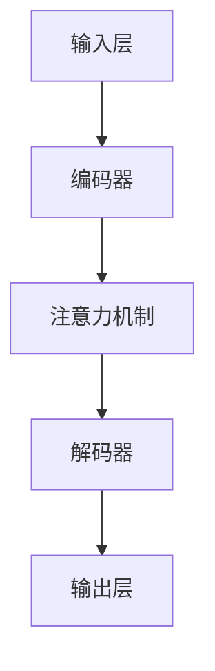
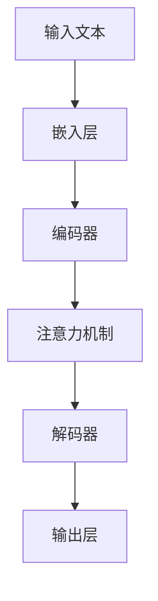
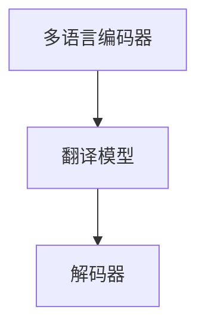

                 

## 《大模型在机器翻译中的应用：跨越语言壁垒》

### 关键词
- 大模型
- 机器翻译
- 预训练语言模型
- 注意力机制
- 跨语言信息检索
- 实际应用

### 摘要
本文将深入探讨大模型在机器翻译中的应用，分析其跨越语言壁垒的潜力和技术实现。我们将从大模型的基础概念和架构出发，详细阐述其在机器翻译中的核心原理和方法，并探讨实际应用场景及未来的发展趋势。通过本文的阅读，读者将全面了解大模型在机器翻译中的关键作用，以及对未来语言技术发展的启示。

## 第一部分：大模型与机器翻译基础

### 第1章：大模型概述

#### 1.1 大模型的定义与核心特征

大模型是指具有海量参数和强大计算能力的神经网络模型，它们通过大规模数据预训练获得对语言、图像、声音等多种数据的深度理解。大模型的核心特征包括：

- **参数规模大**：大模型通常拥有数十亿至数千亿个参数，这使得它们能够捕捉到复杂的数据模式。
- **计算资源需求高**：大模型在训练过程中需要大量的计算资源，如高性能CPU和GPU。
- **预训练能力强**：大模型通过在大规模数据集上进行预训练，能够学习到通用知识和语言规则，从而提高模型的泛化能力。

与传统机器翻译模型相比，大模型在以下方面具有显著优势：

- **理解力更强**：大模型能够更好地理解上下文和语义，从而提高翻译的准确性和流畅性。
- **自适应性好**：大模型能够适应不同的翻译任务和数据集，实现多语言翻译。
- **扩展性高**：大模型的结构和算法易于扩展，能够应用于其他领域，如自然语言处理、图像识别等。

#### 1.2 大模型的技术架构

大模型的技术架构主要包括以下几个关键组件：

- **输入层**：接收外部输入数据，如文本、图像等。
- **编码器（Encoder）**：将输入数据进行编码，提取关键特征。
- **解码器（Decoder）**：将编码后的数据解码成目标语言的文本。
- **注意力机制（Attention Mechanism）**：用于处理序列数据，提高模型的上下文理解能力。

下面是一个简化的Mermaid流程图，展示大模型的基本架构和主要组件：



#### 1.3 大模型的数学模型

大模型的数学模型主要包括以下几个核心部分：

- **神经网络**：使用多层神经网络来建模数据，通过反向传播算法优化模型参数。
- **激活函数**：如ReLU、Sigmoid、Tanh等，用于引入非线性变换。
- **损失函数**：如交叉熵损失函数，用于评估模型的预测结果与实际结果之间的差距。

以下是一个简单的神经网络模型和交叉熵损失函数的伪代码示例：

```python
# 神经网络模型
class NeuralNetwork:
    def __init__(self):
        self.layers = []

    def forward(self, x):
        for layer in self.layers:
            x = layer.forward(x)
        return x

    def backward(self, x, dLdx):
        for layer in reversed(self.layers):
            dLdx = layer.backward(x, dLdx)

# 交叉熵损失函数
def cross_entropy_loss(logits, labels):
    return -sum(labels * log(logits))
```

通过上述伪代码，我们可以看出神经网络模型的基本结构和交叉熵损失函数的计算方式。这些核心组件共同构成了大模型的技术基础。

## 第2章：机器翻译的基本原理

#### 2.1 机器翻译的历史与现状

机器翻译是指利用计算机技术将一种语言的文本自动翻译成另一种语言的文本。其发展历程可以分为以下几个阶段：

- **早期基于规则的机器翻译**：20世纪50年代至70年代，基于规则的方法是主流，通过编写语法规则和词汇对应关系进行翻译。
- **基于实例的机器翻译**：20世纪80年代，基于实例的机器翻译方法出现，通过学习已有的翻译实例来生成新的翻译。
- **基于统计的机器翻译**：20世纪90年代，基于统计的方法成为主流，利用大规模语言数据训练模型进行翻译。
- **基于神经网络的机器翻译**：近年来，随着深度学习技术的发展，基于神经网络的机器翻译方法逐渐取代了传统的机器翻译方法。

当前，机器翻译面临的主要挑战包括：

- **准确率**：尽管神经网络翻译方法在准确率方面取得了显著提高，但仍然存在一定的误差。
- **流畅性**：翻译结果在保持语义准确性的同时，还需要保证语言流畅性和可读性。
- **跨语言信息处理**：多语言翻译和跨语言信息检索等复杂任务需要更加高效的算法和模型。

#### 2.2 机器翻译的核心算法

机器翻译的核心算法主要包括以下几个部分：

- **编码器（Encoder）**：将源语言文本编码成向量表示。
- **解码器（Decoder）**：将编码后的向量解码成目标语言文本。
- **损失函数**：用于评估翻译结果的准确性，常用的损失函数包括交叉熵损失函数。

以下是一个简化的机器翻译算法框架的伪代码示例：

```python
# 机器翻译算法框架
class MachineTranslation:
    def __init__(self, encoder, decoder, loss_function):
        self.encoder = encoder
        self.decoder = decoder
        self.loss_function = loss_function

    def train(self, source_texts, target_texts, learning_rate):
        for source_text, target_text in zip(source_texts, target_texts):
            encoded_text = self.encoder.encode(source_text)
            decoded_text = self.decoder.decode(encoded_text)
            loss = self.loss_function(decoded_text, target_text)
            self.optimizer.update_weights(loss, learning_rate)

    def translate(self, source_text):
        encoded_text = self.encoder.encode(source_text)
        decoded_text = self.decoder.decode(encoded_text)
        return decoded_text
```

通过上述伪代码，我们可以看出机器翻译算法的基本结构和训练过程。

#### 2.3 机器翻译的评价标准

机器翻译的评价标准主要包括以下几个指标：

- **BLEU（双语句匹配）**：基于统计的指标，通过比较翻译结果与参考译文的重叠度来评估翻译质量。
- **NIST（国家标准技术研究所）**：基于综合评价指标，包括词汇匹配、句法结构和语义一致性等多个方面。
- **METEOR（度量评估工具）**：基于句法、词汇和语义等多个维度的综合评价指标。

以下是一个简单的BLEU评分计算的伪代码示例：

```python
# BLEU评分计算
def bleu_score(hypothesis, reference):
    overlaps = [0] * len(hypothesis)
    for ref_sentence in reference:
        for hypo_sentence in hypothesis:
            overlap = longest_common_subsequence(hypo_sentence, ref_sentence)
            overlaps.append(overlap)
    precision = sum(overlaps) / len(hypothesis)
    return (1 - (1 / (1 + exp(-5 * precision))))
```

通过上述伪代码，我们可以看出BLEU评分的基本计算方式。

## 第二部分：大模型在机器翻译中的应用

### 第3章：大规模预训练语言模型的训练

#### 3.1 预训练语言模型的原理

预训练语言模型（Pre-trained Language Model，简称PLM）是一种通过在大规模文本语料库上进行预训练的神经网络模型，以获得对自然语言的深层理解。预训练语言模型的原理可以概括为以下几点：

1. **大规模数据集**：预训练语言模型需要使用大规模的文本数据集，如维基百科、新闻文章、社交媒体等，以充分学习语言的模式和规律。

2. **自监督学习方法**：预训练语言模型采用自监督学习方法，即不依赖于标签数据，而是通过预测文本中的未知部分来训练模型。常见的方法包括语言建模（Language Modeling）和掩码语言模型（Masked Language Model）。

3. **多层神经网络**：预训练语言模型通常采用多层神经网络结构，如Transformer模型，以捕捉复杂的语言特征。

4. **上下文理解**：预训练语言模型通过训练过程学习到上下文信息，从而能够更好地理解句子和段落中的语义关系。

#### 3.2 预训练语言模型的主要架构

预训练语言模型的主要架构包括以下几个关键部分：

1. **编码器（Encoder）**：将输入文本编码成向量表示，通常使用多层Transformer结构。

2. **解码器（Decoder）**：将编码后的向量解码成目标语言的文本，同样使用多层Transformer结构。

3. **注意力机制（Attention Mechanism）**：用于处理序列数据，提高模型的上下文理解能力。

4. **嵌入层（Embedding Layer）**：将输入文本中的单词或子词映射到高维向量空间。

5. **输出层（Output Layer）**：将解码后的向量映射到目标语言的单词或子词。

下面是一个简化的预训练语言模型的Mermaid流程图：



#### 3.3 预训练语言模型的训练过程

预训练语言模型的训练过程主要包括以下几个步骤：

1. **数据预处理**：将大规模的文本数据集进行预处理，包括分词、去停用词、词向量化等。

2. **构建模型**：定义预训练语言模型的神经网络结构，包括编码器、解码器、注意力机制等。

3. **训练过程**：使用自监督学习方法，通过随机遮盖（Masked Language Model）或语言建模（Language Modeling）等策略训练模型。在训练过程中，需要优化模型参数，以最小化损失函数。

4. **评估与调整**：在训练过程中，定期评估模型的性能，并根据评估结果调整模型参数。

5. **微调**：在特定任务上进行微调（Fine-tuning），以进一步优化模型在特定任务上的表现。

以下是一个简单的预训练语言模型训练过程的伪代码示例：

```python
# 预训练语言模型训练过程
def train_pretrained_language_model(data_loader, model, optimizer, loss_function, num_epochs):
    for epoch in range(num_epochs):
        for batch in data_loader:
            inputs, targets = batch
            model.zero_grad()
            outputs = model(inputs)
            loss = loss_function(outputs, targets)
            loss.backward()
            optimizer.step()
        print(f"Epoch {epoch + 1}/{num_epochs}, Loss: {loss.item()}")
```

通过上述伪代码，我们可以看出预训练语言模型的基本训练过程。

### 第4章：机器翻译中的上下文理解

#### 4.1 上下文理解的重要性

在机器翻译中，上下文理解扮演着至关重要的角色。上下文是指与特定文本相关的背景信息，包括词汇的词义、句子的语义关系以及段落的主题等。有效的上下文理解能够帮助模型更好地理解源语言文本的含义，从而生成更准确、更自然的翻译结果。

上下文理解的重要性体现在以下几个方面：

1. **提高翻译准确性**：通过理解上下文，模型能够更准确地捕捉源语言文本中的语义信息，减少翻译错误。

2. **提升翻译流畅性**：上下文理解有助于模型生成更自然的翻译结果，避免生硬的翻译和语法错误。

3. **处理多义词**：上下文理解能够帮助模型区分多义词的不同含义，从而提高翻译的准确性。

4. **解决翻译歧义**：在存在歧义的文本中，上下文理解能够帮助模型选择正确的翻译选项。

#### 4.2 注意力机制与序列模型

注意力机制（Attention Mechanism）是一种用于处理序列数据的机制，通过动态关注序列中的不同部分来提高模型的上下文理解能力。注意力机制在机器翻译中扮演着关键角色，能够帮助模型更好地捕捉源语言文本的上下文信息。

注意力机制的主要特点包括：

1. **动态关注**：注意力机制能够根据当前解码的文本部分，动态关注序列中的不同部分，从而捕捉到与当前文本相关的重要信息。

2. **可解释性**：注意力机制的可解释性使得研究人员能够更好地理解模型在翻译过程中关注的部分，从而优化模型设计和翻译结果。

3. **效率**：注意力机制在计算效率方面表现出色，能够在较短的时间内处理大量的序列数据。

常见的注意力机制包括以下几种：

1. **点积注意力（Dot-Product Attention）**：点积注意力是最简单的注意力机制，通过计算查询（Query）、键（Key）和值（Value）之间的点积来计算注意力权重。

2. **缩放点积注意力（Scaled Dot-Product Attention）**：为了解决点积注意力在维度较高时梯度消失的问题，引入了缩放因子，从而提高了模型的训练稳定性。

3. **多头注意力（Multi-Head Attention）**：多头注意力通过并行计算多个注意力机制，每个注意力机制关注不同的部分，从而提高了模型的上下文理解能力。

序列模型（Sequential Model）是指基于序列数据的模型，如循环神经网络（RNN）和Transformer模型。序列模型在机器翻译中广泛应用，能够有效地处理序列数据，捕捉文本的上下文信息。

序列模型的主要特点包括：

1. **序列处理能力**：序列模型能够按照顺序处理序列数据，从而捕捉到文本的上下文信息。

2. **状态记忆**：序列模型具有状态记忆能力，能够记住之前的输入和输出，从而更好地理解当前文本的上下文。

3. **并行计算**：Transformer模型等现代序列模型采用了并行计算的方法，提高了模型的计算效率。

#### 4.3 上下文感知的翻译模型

上下文感知的翻译模型（Context-aware Translation Model）是指能够有效捕捉上下文信息的机器翻译模型。通过引入注意力机制和序列模型，上下文感知的翻译模型能够更好地理解源语言文本的语义，从而生成更准确的翻译结果。

上下文感知的翻译模型的设计与实现主要包括以下几个步骤：

1. **编码器设计**：编码器负责将源语言文本编码成向量表示，通常采用多层Transformer结构。编码器需要具备较强的上下文理解能力，以便捕捉源语言文本的语义信息。

2. **解码器设计**：解码器负责将编码后的向量解码成目标语言文本。解码器同样采用多层Transformer结构，并引入注意力机制，以提高模型的上下文理解能力。

3. **注意力机制实现**：在解码过程中，引入注意力机制，使模型能够动态关注源语言文本的不同部分，从而更好地理解上下文信息。

4. **损失函数设计**：采用合适的损失函数，如交叉熵损失函数，以评估模型的翻译准确性。

5. **训练与优化**：通过大规模语料库进行训练，并采用优化算法，如Adam优化器，以优化模型参数。

下面是一个简单的上下文感知的翻译模型实现的伪代码示例：

```python
# 上下文感知的翻译模型实现
class ContextAwareTranslationModel(nn.Module):
    def __init__(self, encoder, decoder, attention):
        super(ContextAwareTranslationModel, self).__init__()
        self.encoder = encoder
        self.decoder = decoder
        self.attention = attention

    def forward(self, source, target):
        encoded_source = self.encoder(source)
        decoded_target = self.decoder(encoded_source)
        attention_weights = self.attention(decoded_target)
        loss = loss_function(decoded_target, target)
        return loss, attention_weights
```

通过上述伪代码，我们可以看出上下文感知的翻译模型的基本结构和实现方式。

#### 4.4 上下文感知的翻译模型的效果评估

上下文感知的翻译模型的效果评估是确保模型性能和翻译质量的重要步骤。效果评估主要包括以下几个指标：

1. **BLEU评分**：BLEU评分是一种基于统计的翻译质量评估指标，通过比较翻译结果与参考译文的重叠度来评估翻译质量。

2. **ROUGE评分**：ROUGE评分是一种用于评估机器翻译、文本摘要和命名实体识别等任务的评估指标，通过计算翻译结果与参考译文的匹配度来评估翻译质量。

3. **BLEU-4**：BLEU-4是一种基于N-gram重叠度的BLEU评分，N取值为4，更准确地评估翻译结果的准确性。

4. **METEOR评分**：METEOR评分是一种综合考虑词汇匹配、句法结构和语义一致性的综合评估指标。

下面是一个简单的效果评估代码示例：

```python
from nltk.translate.bleu_score import sentence_bleu
from nltk.translate.rouge_score import sentence_rouge

# BLEU评分计算
bleu_scores = []
for hypothesis, reference in zip(hypotheses, references):
    bleu_score = sentence_bleu([reference], hypothesis)
    bleu_scores.append(bleu_score)

# ROUGE评分计算
rouge_scores = []
for hypothesis, reference in zip(hypotheses, references):
    rouge_score = sentence_rouge(reference, hypothesis)
    rouge_scores.append(rouge_score)

print(f"BLEU Score: {np.mean(bleu_scores)}")
print(f"ROUGE Score: {np.mean(rouge_scores)}")
```

通过上述代码示例，我们可以计算并评估上下文感知的翻译模型在翻译任务上的表现。

### 第5章：多语言翻译与跨语言信息检索

#### 5.1 多语言翻译系统

多语言翻译系统是指能够同时支持多种语言翻译的机器翻译系统。多语言翻译系统的架构通常包括以下几个关键部分：

1. **多语言编码器**：将源语言文本编码成统一的向量表示，以便进行翻译处理。

2. **翻译模型**：基于预训练语言模型，实现多语言翻译功能。翻译模型需要支持多种语言对，并能够处理不同语言之间的翻译。

3. **解码器**：将编码后的向量解码成目标语言文本，确保翻译结果的准确性和流畅性。

4. **多语言数据集**：为训练和评估多语言翻译模型，需要构建丰富的多语言数据集。数据集应包括多种语言对，以确保模型在不同语言间的翻译性能。

下面是一个简化的多语言翻译系统架构的Mermaid流程图：



多语言翻译系统的实现与优化主要包括以下几个方面：

1. **数据预处理**：对多语言数据集进行预处理，包括分词、去停用词、词向量化等，以确保数据的一致性和质量。

2. **模型训练**：使用多语言数据集训练翻译模型，包括编码器、解码器和注意力机制等。在训练过程中，可以采用多任务学习（Multi-Task Learning）和迁移学习（Transfer Learning）等方法，以提高模型在不同语言间的泛化能力。

3. **模型优化**：通过调整模型参数和训练策略，优化翻译模型在多种语言间的翻译性能。常见的优化方法包括学习率调整、批量大小选择和正则化技术等。

4. **多语言支持**：为支持多种语言翻译，需要在模型设计和实现中考虑语言特性和翻译规则。例如，对于不同语言间的语法差异、词汇冲突和语义关系等，需要进行针对性的处理和优化。

5. **效果评估**：使用多语言数据集和评估指标，对多语言翻译系统的翻译性能进行评估。常用的评估指标包括BLEU评分、ROUGE评分和BLEU-4评分等。

#### 5.2 跨语言信息检索

跨语言信息检索（Cross-Language Information Retrieval，简称CLIR）是指在不同语言间进行信息检索和查询处理的技术。跨语言信息检索的目标是利用多语言翻译技术和信息检索算法，实现不同语言间的信息搜索和查询处理。

跨语言信息检索的主要技术包括以下几个方面：

1. **多语言查询处理**：将用户输入的查询语句翻译成目标语言，以便在多语言数据集中进行检索。常用的方法包括基于翻译模型的查询翻译和基于统计方法的查询翻译。

2. **多语言文档检索**：在多语言数据集上进行文档检索，以找到与查询最相关的文档。常用的检索算法包括基于向量空间的检索和基于相似度计算的检索。

3. **多语言文本挖掘**：对多语言文本进行挖掘和分析，提取关键信息和高价值内容。常用的技术包括文本分类、情感分析和实体识别等。

4. **跨语言语义理解**：通过跨语言语义理解技术，实现不同语言间的语义匹配和推理。常用的方法包括基于词典的语义映射和基于深度学习的语义理解。

跨语言信息检索在多语言翻译和跨文化沟通中具有广泛的应用。通过跨语言信息检索技术，可以实现对多语言数据的有效管理和利用，提高信息检索的效率和准确性。

#### 5.3 多语言翻译与跨语言信息检索的融合

多语言翻译与跨语言信息检索的融合是指将多语言翻译技术应用于跨语言信息检索，以提高信息检索的准确性和效率。融合方法主要包括以下几个方面：

1. **多语言翻译集成**：将多语言翻译模型集成到跨语言信息检索系统中，实现跨语言查询处理和文档检索。通过多语言翻译，将用户查询和文档翻译成同一种语言，以便进行统一的检索和分析。

2. **多语言语义理解**：利用跨语言语义理解技术，对多语言文本进行语义分析和语义匹配，提高跨语言信息检索的准确性。通过语义理解，可以更好地理解不同语言间的语义关系，从而提高检索结果的准确性。

3. **多语言特征提取**：对多语言文本进行特征提取和融合，构建统一的特征表示。通过多语言特征提取，可以更好地捕捉不同语言间的共性和差异，从而提高跨语言信息检索的性能。

4. **多语言评估指标**：设计适用于多语言翻译和跨语言信息检索的评估指标，如跨语言BLEU评分、跨语言ROUGE评分和跨语言信息检索精度等。通过评估指标，可以全面评估多语言翻译和跨语言信息检索的性能和质量。

通过多语言翻译与跨语言信息检索的融合，可以实现对多语言数据的高效管理和利用，提高跨语言信息检索的准确性和效率，为多语言翻译和跨文化沟通提供强大的技术支持。

### 第6章：大模型在机器翻译中的实际应用

#### 6.1 实际应用场景介绍

大模型在机器翻译中的实际应用场景非常广泛，涵盖了企业、政府、教育、旅游等多个领域。以下是一些典型的应用场景：

1. **企业沟通**：企业内部通常涉及多种语言的沟通，大模型可以帮助企业实现高效的跨语言沟通，提高工作效率。例如，企业可以通过大模型进行国际会议的同声传译、跨国团队的邮件翻译等。

2. **电子商务**：电子商务平台需要为全球用户提供多语言支持，大模型可以用于商品描述、用户评论、客服咨询等方面的翻译，提高用户的购物体验和满意度。

3. **新闻媒体**：新闻媒体需要及时获取和报道全球新闻，大模型可以帮助翻译和整合多语言新闻，提高新闻传播的速度和广度。

4. **教育培训**：大模型可以用于教育资源的翻译和整合，为全球学生提供多语言的学习材料。此外，大模型还可以用于语言学习软件和应用程序，帮助学生提高语言能力。

5. **旅游服务**：旅游行业需要为游客提供多语言服务，大模型可以用于旅游指南、酒店预订、景点介绍等方面的翻译，提高游客的旅行体验。

#### 6.2 机器翻译系统的开发与部署

开发一个高效的机器翻译系统需要考虑多个方面，包括数据准备、模型选择、训练与优化等。以下是机器翻译系统开发与部署的关键步骤：

1. **数据准备**：首先需要收集和整理高质量的翻译数据，包括多语言文本对、标注数据等。数据质量直接影响模型的性能，因此需要仔细处理和清洗数据。

2. **模型选择**：选择适合应用场景的机器翻译模型，常见的模型包括基于神经网络的机器翻译模型、基于注意力机制的机器翻译模型等。可以根据实际需求选择合适的模型架构和参数设置。

3. **训练与优化**：使用准备好的数据进行模型训练，通过调整学习率、批量大小、优化算法等参数，优化模型的性能。在训练过程中，可以采用多任务学习、迁移学习等方法，提高模型在不同任务和数据上的泛化能力。

4. **评估与测试**：在模型训练完成后，需要进行评估和测试，以验证模型的性能和准确性。可以使用标准评估指标，如BLEU评分、ROUGE评分等，对模型进行评估。

5. **部署与运维**：将训练好的模型部署到生产环境中，提供实时翻译服务。在部署过程中，需要考虑系统的性能、可扩展性和安全性。此外，还需要定期维护和更新模型，以保持其性能和准确性。

#### 6.3 机器翻译系统的性能优化

机器翻译系统的性能优化是确保系统高效稳定运行的关键。以下是一些常见的性能优化策略：

1. **硬件优化**：使用高性能计算硬件，如GPU、TPU等，加速模型训练和推理过程。合理配置硬件资源，避免资源浪费和瓶颈。

2. **模型压缩**：通过模型压缩技术，如量化、剪枝、蒸馏等，减小模型的大小和计算复杂度，提高模型在低资源环境下的运行效率。

3. **分布式训练**：使用分布式训练方法，将模型训练任务分布在多个节点上，提高训练速度和效率。可以使用参数服务器架构、数据并行、模型并行等技术实现分布式训练。

4. **缓存与加速**：利用缓存技术，如内存缓存、硬盘缓存等，减少数据读取和传输的时间。使用缓存加速技术，如预取、预加载等，提高模型推理的效率。

5. **网络优化**：优化网络架构和通信协议，减少网络延迟和传输时间。可以使用数据压缩、协议优化等技术提高网络传输效率。

6. **动态调整**：根据系统负载和资源情况，动态调整模型参数和资源分配，确保系统在不同负载下的稳定运行。

通过上述性能优化策略，可以提高机器翻译系统的运行效率和翻译质量，为用户提供更好的服务。

### 第7章：未来展望与挑战

#### 7.1 大模型在机器翻译中的未来发展趋势

随着深度学习和人工智能技术的不断进步，大模型在机器翻译中的应用前景十分广阔。未来发展趋势主要包括以下几个方面：

1. **模型规模扩大**：随着计算资源和存储能力的提升，大模型的规模将继续扩大，从数十亿参数到千亿甚至万亿参数，以提高模型的上下文理解和翻译准确性。

2. **多模态翻译**：大模型将逐渐应用于多模态翻译任务，如文本与图像、视频的联合翻译，实现更丰富的交互和信息传递。

3. **个性化翻译**：通过用户行为和偏好数据的分析，大模型可以实现个性化翻译，为用户提供更加贴合需求的翻译结果。

4. **实时翻译**：随着推理速度的提升，大模型将实现实时翻译，满足快速、高效的翻译需求。

5. **自动化优化**：利用自动化机器学习（AutoML）技术，大模型将实现自动化优化，降低模型开发和部署的门槛。

#### 7.2 机器翻译中的挑战与解决方案

尽管大模型在机器翻译中取得了显著进展，但仍面临一些挑战和问题：

1. **计算资源需求**：大模型的训练和推理需要大量的计算资源，对于普通用户和企业来说，成本较高。解决方案是优化模型结构和算法，提高计算效率，以及推广云计算和边缘计算等分布式计算技术。

2. **数据质量**：高质量的多语言数据是训练高效翻译模型的关键，然而数据质量参差不齐，存在噪声、错误和缺失等问题。解决方案是构建高质量的数据集，利用数据清洗、去重和标注等技术提高数据质量。

3. **多语言适应性**：不同语言具有独特的语法、语义和文化特征，大模型需要具备良好的多语言适应性。解决方案是针对不同语言进行特定优化，如语法分析、词义消歧等，以及引入跨语言知识迁移技术。

4. **翻译准确性**：尽管大模型在翻译准确性方面取得了显著提升，但仍存在一定的误差，特别是在处理复杂句式和特定领域文本时。解决方案是进一步优化模型结构，提高上下文理解和长距离依赖捕捉能力，以及利用多模型集成和反馈修正等技术。

5. **隐私与安全**：在机器翻译过程中，涉及大量用户数据和敏感信息，隐私和安全问题备受关注。解决方案是加强数据保护措施，如数据加密、访问控制和隐私剪枝等，以及建立完善的隐私保护法规和标准。

通过解决上述挑战，大模型在机器翻译中的应用将更加广泛和深入，推动语言技术朝着更高效、更智能的方向发展。

### 第8章：工具与资源

#### 8.1 开发工具介绍

在开发大模型和机器翻译系统时，需要使用到一系列强大的工具和框架。以下是一些常用的开发工具：

1. **深度学习框架**：如TensorFlow、PyTorch、MXNet等，这些框架提供了丰富的API和工具，帮助开发者构建和训练深度学习模型。

2. **自然语言处理库**：如NLTK、spaCy、gensim等，这些库提供了丰富的自然语言处理功能，包括文本处理、词向量化、语法分析等。

3. **版本控制系统**：如Git，用于管理和跟踪代码的版本变化，便于团队协作和代码管理。

4. **云计算平台**：如Google Cloud、AWS、Azure等，这些平台提供了强大的计算资源和存储服务，支持大规模数据分析和模型训练。

5. **分布式计算框架**：如Dask、Ray、Apache Spark等，这些框架支持分布式计算和数据处理，能够加速模型训练和推理过程。

#### 8.2 学习资源推荐

为了更好地掌握大模型和机器翻译技术，以下是几本推荐的书籍和论文：

1. **《深度学习》（Deep Learning）**：由Ian Goodfellow、Yoshua Bengio和Aaron Courville合著，全面介绍了深度学习的基本概念、技术和应用。

2. **《自然语言处理综论》（Speech and Language Processing）**：由Daniel Jurafsky和James H. Martin合著，系统阐述了自然语言处理的理论、方法和应用。

3. **《大规模预训练语言模型》（Large-scale Language Modeling）**：由Kaggle和Google Research共同发布的论文，介绍了BERT、GPT-3等大规模预训练语言模型的设计和训练方法。

4. **《注意力机制与序列模型》（Attention Mechanisms and Sequential Models）**：由Vaswani等人在NeurIPS 2017上发表的论文，详细介绍了注意力机制在序列模型中的应用。

5. **《机器翻译》（Machine Translation）**：由Microsoft Research发布的论文集，涵盖了机器翻译的最新研究进展、技术和挑战。

此外，还有许多优秀的开源项目和技术社区，如Hugging Face、TensorFlow Model Garden等，提供了丰富的模型、代码和文档资源，供开发者学习和参考。

通过学习和应用这些工具和资源，开发者可以更好地掌握大模型和机器翻译技术，为语言技术的应用和创新奠定坚实基础。

