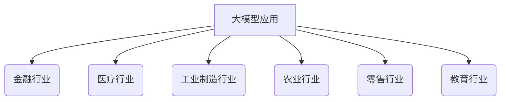
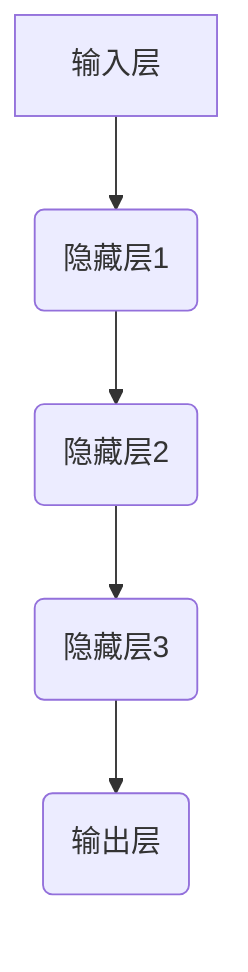
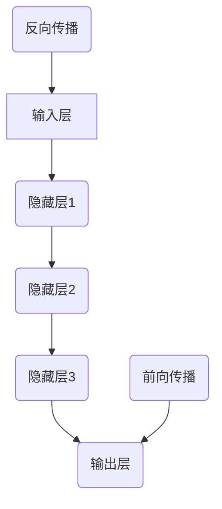
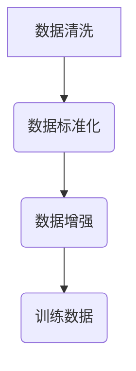
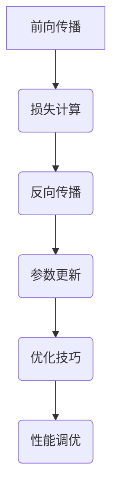

                 

# 《大模型将广泛应用于各行各业》

## 关键词
- 大模型
- 深度学习
- 应用场景
- 行业发展
- 技术挑战

## 摘要
本文将深入探讨大模型在各个行业中的应用趋势及其重要性。我们将从大模型的历史与发展、技术基础、数学原理、开发环境、应用实战以及各行业应用等方面进行详细分析，并总结大模型的未来发展趋势。

## 目录大纲

### 第一部分：大模型基础

#### 第1章：大模型概述
- **1.1 大模型的历史与发展**
- **1.2 大模型的关键概念与架构**
- **1.3 大模型的应用场景与趋势**

#### 第2章：大模型技术基础
- **2.1 大模型的核心算法**
- **2.2 大模型的数据处理**
- **2.3 大模型的训练与优化**

#### 第3章：大模型的数学原理
- **3.1 大模型的数学基础**
- **3.2 大模型的数学模型**
- **3.3 大模型的数学公式解析**

#### 第4章：大模型的开发环境
- **4.1 开发环境搭建**
- **4.2 常用开发工具与框架**

#### 第5章：大模型的应用实战
- **5.1 实战案例1：自然语言处理**
- **5.2 实战案例2：图像识别**
- **5.3 实战案例3：医疗诊断**

### 第二部分：大模型在各行业中的应用

#### 第6章：金融行业应用
- **6.1 金融行业对大模型的需求**
- **6.2 大模型在金融行业的应用案例**

#### 第7章：医疗行业应用
- **7.1 医疗行业对大模型的需求**
- **7.2 大模型在医疗行业的应用案例**

#### 第8章：工业制造行业应用
- **8.1 工业制造行业对大模型的需求**
- **8.2 大模型在工业制造行业的应用案例**

#### 第9章：农业行业应用
- **9.1 农业行业对大模型的需求**
- **9.2 大模型在农业行业的应用案例**

#### 第10章：零售行业应用
- **10.1 零售行业对大模型的需求**
- **10.2 大模型在零售行业的应用案例**

#### 第11章：教育行业应用
- **11.1 教育行业对大模型的需求**
- **11.2 大模型在教育行业的应用案例**

#### 第12章：总结与展望
- **12.1 大模型的应用现状与挑战**
- **12.2 大模型的未来发展展望**

### 附录
- **附录A：大模型开发工具与资源**

## Mermaid 流程图


### 1.1 大模型的历史与发展
大模型，又称大型深度学习模型，是指具有数十亿甚至千亿参数的深度学习模型。这些模型能够在处理大规模数据集时展现出出色的性能。大模型的发展可以追溯到上世纪80年代末90年代初，当时神经网络的研究者开始尝试使用更大规模的模型来解决复杂的问题。

#### 大模型的起源与背景

- **1986年**：神经网络研究者Geoffrey Hinton提出了反向传播算法（Backpropagation Algorithm），这一算法使得训练多层神经网络成为可能。
- **1990年代**：由于计算能力和数据存储的限制，大模型的研发进展缓慢。直到互联网的普及和云计算技术的兴起，数据量和计算资源逐渐丰富，大模型的研究才得到了新的推动。
- **2012年**：AlexNet的提出标志着深度学习在图像识别任务上取得了突破性的进展。AlexNet是一个拥有数百万参数的深度学习模型，它的成功激发了研究者对大模型的探索。

#### 大模型在不同行业的发展

- **金融行业**：大模型在金融行业的应用主要集中在风险管理、信用评估和量化交易等方面。例如，通过大模型可以对市场数据进行分析，预测股票价格趋势，优化投资组合。
- **医疗行业**：大模型在医疗行业中的应用越来越广泛，包括疾病预测、医学影像分析、基因组学研究等。例如，Google DeepMind开发的AlphaGo可以诊断眼科疾病，它的准确率甚至超过了资深医生。
- **工业制造**：大模型在工业制造中的应用主要体现在质量控制、设备预测性维护和供应链优化等方面。通过大数据分析和机器学习，可以提高生产效率，降低成本。
- **农业行业**：大模型在农业中的应用包括作物病虫害预测、土壤分析和气象预测等。通过这些模型，可以优化农业生产，提高产量和质量。
- **零售行业**：大模型在零售行业的应用主要集中在顾客行为分析、商品推荐和库存管理等方面。例如，亚马逊使用大模型对顾客的购物行为进行分析，从而提供个性化的商品推荐。
- **教育行业**：大模型在教育行业中的应用主要体现在学生成绩预测、教学方法优化和个性化学习等方面。通过大数据分析和机器学习，可以为学生提供更加个性化的学习体验。

### 1.2 大模型的关键概念与架构

大模型的核心概念包括深度学习、神经网络、参数、层、激活函数等。以下是对这些概念的解释：

#### 深度学习

- **定义**：深度学习是一种机器学习方法，它通过构建具有多个隐含层的神经网络来学习数据的特征表示。
- **特点**：深度学习模型能够自动地从大量数据中提取特征，具有很强的泛化能力。

#### 神经网络

- **定义**：神经网络是由大量人工神经元组成的计算模型，通过调整神经元之间的连接权重来学习数据。
- **结构**：神经网络通常由输入层、隐藏层和输出层组成。每个神经元都与上一层和下一层的神经元相连。

#### 参数

- **定义**：参数是指神经网络中用于调整模型输出的变量。在深度学习中，参数通常是指权重和偏置。
- **作用**：参数的调整可以改变神经网络对数据的响应，从而提高模型的性能。

#### 层

- **定义**：层是神经网络中的基本结构，包括输入层、隐藏层和输出层。
- **作用**：输入层接收外部数据，隐藏层对数据进行特征提取和变换，输出层生成预测结果。

#### 激活函数

- **定义**：激活函数是神经网络中的一个关键组件，它用于引入非线性因素，使神经网络能够学习复杂函数。
- **作用**：激活函数可以增强神经网络的非线性变换能力，从而提高模型的性能。

#### 大模型的典型架构

大模型的架构可以根据应用场景的不同而有所变化，但通常包括以下几个关键部分：

- **输入层**：接收外部数据，如文本、图像或声音等。
- **隐藏层**：对输入数据进行特征提取和变换，隐藏层可以是单层或多层。
- **输出层**：生成预测结果或分类结果。

#### Mermaid 流程图



### 1.3 大模型的应用场景与趋势

大模型的应用场景非常广泛，几乎涵盖了所有行业。以下是一些典型应用场景及其发展趋势：

#### 各行业对大模型的需求

- **金融行业**：金融机构对大模型的需求主要在于风险管理和投资决策。通过分析大量历史数据，大模型可以预测市场走势，优化投资组合。
- **医疗行业**：医疗行业对大模型的需求主要集中在疾病预测、医学影像分析和个性化治疗方案等方面。大模型可以帮助医生做出更加准确的诊断和治疗方案。
- **工业制造**：工业制造行业对大模型的需求主要体现在质量控制、设备预测性维护和供应链优化等方面。通过大数据分析和机器学习，可以提高生产效率，降低成本。
- **农业行业**：农业行业对大模型的需求主要集中在作物病虫害预测、土壤分析和气象预测等方面。大模型可以帮助农民优化农业生产，提高产量和质量。
- **零售行业**：零售行业对大模型的需求主要在于顾客行为分析、商品推荐和库存管理等方面。通过大数据分析和机器学习，可以提高顾客满意度，增加销售额。
- **教育行业**：教育行业对大模型的需求主要体现在学生成绩预测、教学方法优化和个性化学习等方面。大模型可以帮助教师更好地了解学生的学习情况，提供个性化的学习建议。

#### 大模型在未来各行业的发展前景

- **金融行业**：随着金融科技的不断发展，大模型在金融行业的应用前景非常广阔。未来，大模型可能会在信用评分、反洗钱、智能投顾等领域发挥更大的作用。
- **医疗行业**：随着医疗数据的不断积累和医疗技术的不断创新，大模型在医疗行业的应用将会更加深入。未来，大模型可能会在疾病预测、基因组学研究和个性化治疗等领域取得重大突破。
- **工业制造**：随着智能制造的推进，大模型在工业制造行业的应用将会越来越普遍。未来，大模型可能会在质量控制、设备预测性维护和供应链优化等方面发挥更大的作用。
- **农业行业**：随着农业科技的不断发展，大模型在农业行业的应用将会更加广泛。未来，大模型可能会在作物病虫害预测、土壤分析和气象预测等方面取得重大突破。
- **零售行业**：随着电子商务的快速发展，大模型在零售行业的应用将会越来越深入。未来，大模型可能会在顾客行为分析、商品推荐和库存管理等方面发挥更大的作用。
- **教育行业**：随着教育科技的不断创新，大模型在教育行业的应用将会更加广泛。未来，大模型可能会在学生成绩预测、教学方法优化和个性化学习等方面取得重大突破。

### 2.1 大模型的核心算法

大模型的核心算法包括神经网络基础、深度学习优化算法等。以下是对这些算法的详细解释：

#### 神经网络基础

神经网络是一种模拟人脑计算过程的计算模型。它由大量神经元组成，每个神经元都与相邻的神经元相连，并具有一定的权重。神经网络的计算过程可以分为以下几个步骤：

1. **输入层**：输入层接收外部数据，如文本、图像或声音等。
2. **隐藏层**：隐藏层对输入数据进行特征提取和变换，隐藏层可以是单层或多层。
3. **输出层**：输出层生成预测结果或分类结果。

神经网络的核心算法包括：

- **前向传播**：在训练过程中，将输入数据通过神经网络传递到输出层，计算出输出结果。
- **反向传播**：根据输出结果与实际结果的差异，通过反向传播算法更新神经网络的权重和偏置。

#### 深度学习优化算法

深度学习优化算法是指用于训练深度学习模型的一系列算法。这些算法的目的是提高模型的性能，减少训练时间。以下是一些常见的深度学习优化算法：

- **随机梯度下降（SGD）**：随机梯度下降是一种最简单的优化算法，它通过随机选取一部分训练样本来更新模型的参数。
- **Adam优化器**：Adam优化器是一种结合了SGD和动量法的优化算法，它通过计算一阶和二阶矩估计来更新模型的参数。
- **AdaGrad优化器**：AdaGrad优化器是一种自适应学习率的优化算法，它通过跟踪每个参数的历史梯度平方来调整学习率。

#### Mermaid 流�程图



### 2.2 大模型的数据处理

大模型的数据处理是构建和训练深度学习模型的重要环节。以下是大模型数据处理的核心步骤：

#### 数据预处理方法

- **数据清洗**：清洗数据是数据处理的第一步，目的是去除噪声和错误的数据。例如，去除缺失值、纠正错误值、填补缺失值等。
- **数据标准化**：将数据转换为相同的尺度，以便神经网络能够更好地处理数据。常用的方法包括Z-score标准化和Min-Max标准化。
- **数据增强**：通过增加训练数据的方式提高模型的泛化能力。常见的方法包括图像旋转、翻转、裁剪等。

#### 数据增强技术

- **数据增强技术**：数据增强是一种通过变换原始数据来生成新的训练样本的方法，有助于提高模型的泛化能力。以下是一些常见的数据增强技术：
  - **图像增强**：通过调整图像的亮度、对比度、色调等参数来增强图像。
  - **文本增强**：通过替换单词、添加同义词、改变句子结构等方式来增强文本数据。
  - **音频增强**：通过调整音频的音量、节奏、音调等参数来增强音频数据。

#### Mermaid 流程图



### 2.3 大模型的训练与优化

大模型的训练与优化是构建高效深度学习模型的关键步骤。以下是大模型训练与优化的核心概念和策略：

#### 训练过程与策略

- **训练过程**：训练过程主要包括前向传播、反向传播和参数更新等步骤。在前向传播过程中，模型将输入数据传递到输出层，计算输出结果。在反向传播过程中，模型根据输出结果与实际结果的差异，通过反向传播算法更新模型的参数。参数更新的过程通常使用优化算法，如随机梯度下降（SGD）、Adam优化器等。
- **训练策略**：为了提高模型的性能，可以采用以下训练策略：
  - **小批量训练**：将训练数据分成多个小批量，每次只处理一个小批量，这样可以加快训练速度，并有助于避免过拟合。
  - **数据增强**：通过增加训练数据的方式提高模型的泛化能力。
  - **学习率调整**：学习率是优化算法中的一个关键参数，适当的调整学习率可以提高模型的性能。

#### 优化技巧与性能调优

- **优化技巧**：为了提高模型的性能，可以采用以下优化技巧：
  - **正则化**：通过添加正则化项来防止过拟合。常见的正则化方法包括L1正则化、L2正则化等。
  - **Dropout**：通过随机丢弃部分神经元来防止过拟合。Dropout是一种常用的正则化方法。
  - **Batch Normalization**：通过归一化神经网络的输入数据来提高模型的训练速度和性能。
- **性能调优**：为了提高模型的性能，可以采用以下性能调优方法：
  - **交叉验证**：通过交叉验证来确定模型的最佳参数，避免过拟合。
  - **模型集成**：通过将多个模型进行集成来提高模型的性能。常见的模型集成方法包括Bagging、Boosting等。
  - **超参数调优**：通过调整超参数来优化模型的性能。常用的超参数包括学习率、批量大小、隐藏层神经元数量等。

#### Mermaid 流程图



### 3.1 大模型的数学基础

大模型的设计与实现离不开数学基础，其中矩阵运算、概率与统计是最为核心的部分。以下是对这些数学概念的详细解释：

#### 矩阵运算

矩阵是数学中的一个基本概念，它由一组数字按照一定的排列规则组成。在深度学习中，矩阵用于表示神经网络的权重、偏置以及数据。

- **矩阵的加法和减法**：两个矩阵的加法和减法需要满足矩阵的大小相同，即行数和列数相同。对于矩阵的加法和减法，只需要对对应位置的元素进行相应的运算。
- **矩阵的乘法**：矩阵的乘法需要满足乘法的定义，即矩阵A的第i行与矩阵B的第j列进行对应元素的乘法并求和。
- **矩阵的转置**：矩阵的转置是将矩阵的行和列互换。对于矩阵A的转置，记作A^T。

以下是一个简单的矩阵乘法的伪代码实现：

```python
def matrix_multiply(A, B):
    result = [[0 for _ in range(len(B[0]))] for _ in range(len(A))]
    for i in range(len(A)):
        for j in range(len(B[0])):
            for k in range(len(B)):
                result[i][j] += A[i][k] * B[k][j]
    return result
```

#### 概率与统计

概率与统计在深度学习中有着广泛的应用，用于模型评估、决策过程以及不确定性分析。

- **概率分布**：概率分布描述了一个随机变量在各个取值上的概率。常见的概率分布包括正态分布、伯努利分布等。
- **期望和方差**：期望是概率分布的中心位置，方差是概率分布的离散程度。期望和方差在评估模型性能时非常重要。
- **最大似然估计**：最大似然估计是一种基于数据估计模型参数的方法。通过最大化似然函数来求解模型参数。

以下是一个简单的最大似然估计的伪代码实现：

```python
def maximum_likelihood_estimation(data, model):
    likelihood = 1
    for observation in data:
        likelihood *= model.probability_of_observation(observation)
    return likelihood
```

### 3.2 大模型的数学模型

大模型的数学模型是深度学习理论的核心，包括回归模型和分类模型等。以下是对这些模型的详细解释：

#### 回归模型

回归模型用于预测连续值输出。在回归问题中，目标变量是连续的，例如房价、股票价格等。

- **线性回归**：线性回归是最简单的回归模型，它假设输出值与输入变量之间存在线性关系。线性回归模型的数学表达式为：
  $$ y = \beta_0 + \beta_1x $$
  其中，$y$ 是输出值，$x$ 是输入变量，$\beta_0$ 和 $\beta_1$ 是模型的参数。
- **非线性回归**：非线性回归模型通过引入非线性函数来提高模型的拟合能力。常见的非线性函数包括多项式函数、指数函数等。

以下是一个简单的线性回归模型的伪代码实现：

```python
def linear_regression(x, y):
    # 计算均值
    x_mean = sum(x) / len(x)
    y_mean = sum(y) / len(y)
    
    # 计算协方差
    covariance = sum((xi - x_mean) * (yi - y_mean) for xi, yi in zip(x, y))
    
    # 计算方差
    variance_x = sum((xi - x_mean)**2 for xi in x)
    
    # 计算斜率和截距
    slope = covariance / variance_x
    intercept = y_mean - slope * x_mean
    
    # 返回回归模型
    return lambda x: intercept + slope * x
```

#### 分类模型

分类模型用于预测离散值输出。在分类问题中，目标变量是离散的，例如性别、疾病诊断等。

- **逻辑回归**：逻辑回归是一种常用的分类模型，它通过逻辑函数将线性模型转换为概率分布。逻辑回归模型的数学表达式为：
  $$ P(y=1) = \frac{1}{1 + e^{-(\beta_0 + \beta_1x)}} $$
  其中，$P(y=1)$ 是目标变量为1的概率，$x$ 是输入变量，$\beta_0$ 和 $\beta_1$ 是模型的参数。
- **支持向量机**：支持向量机是一种基于间隔最大化原理的分类模型，它通过寻找最优分隔超平面来实现分类。支持向量机模型的数学表达式为：
  $$ w \cdot x - b = 0 $$
  其中，$w$ 是分隔超平面，$x$ 是输入变量，$b$ 是偏置。

以下是一个简单的逻辑回归模型的伪代码实现：

```python
import numpy as np

def logistic_regression(x, y):
    # 初始化参数
    beta = np.random.randn(len(x[0])) * 0.01
    
    # 定义损失函数
    def loss_function(X, Y):
        return -sum(Y * np.log(sigmoid(X @ beta)) + (1 - Y) * np.log(1 - sigmoid(X @ beta)))
    
    # 定义梯度下降
    def gradient_descent(X, Y, learning_rate, epochs):
        for _ in range(epochs):
            predicted = sigmoid(X @ beta)
            gradient = X.T @ (predicted - Y)
            beta -= learning_rate * gradient
    
    # 训练模型
    gradient_descent(x, y, learning_rate=0.01, epochs=1000)
    
    # 返回逻辑回归模型
    return lambda x: sigmoid(x @ beta)

# 定义逻辑函数
def sigmoid(x):
    return 1 / (1 + np.exp(-x))
```

### 3.3 大模型的数学公式解析

在深度学习中，数学公式是描述模型行为和优化过程的核心。以下是对一些关键数学公式的解析，包括损失函数和梯度下降算法。

#### 损失函数

损失函数是衡量模型预测值与实际值之间差异的指标。常见的损失函数包括均方误差（MSE）和交叉熵（Cross-Entropy）。

- **均方误差（MSE）**：均方误差是回归问题中最常用的损失函数，它表示预测值与实际值之间差异的平方和。MSE的数学表达式为：
  $$ \text{MSE} = \frac{1}{m} \sum_{i=1}^{m} (y_i - \hat{y}_i)^2 $$
  其中，$m$ 是样本数量，$y_i$ 是实际值，$\hat{y}_i$ 是预测值。

- **交叉熵（Cross-Entropy）**：交叉熵是分类问题中最常用的损失函数，它表示预测概率分布与实际概率分布之间的差异。交叉熵的数学表达式为：
  $$ \text{Cross-Entropy} = -\sum_{i=1}^{m} y_i \log(\hat{y}_i) $$
  其中，$m$ 是样本数量，$y_i$ 是实际值（通常为0或1），$\hat{y}_i$ 是预测概率。

以下是一个简单的均方误差（MSE）和交叉熵（Cross-Entropy）的伪代码实现：

```python
def mean_squared_error(y_true, y_pred):
    return sum((y_true - y_pred) ** 2) / len(y_true)

def cross_entropy(y_true, y_pred):
    return -sum(y_true * np.log(y_pred))
```

#### 梯度下降算法

梯度下降是一种常用的优化算法，用于调整模型的参数以最小化损失函数。梯度下降的基本思想是沿着损失函数的梯度方向逐步更新参数。

- **梯度下降（Gradient Descent）**：梯度下降算法通过计算损失函数关于参数的梯度，并沿着梯度的反方向更新参数。梯度下降的数学表达式为：
  $$ \theta = \theta - \alpha \cdot \nabla_{\theta} J(\theta) $$
  其中，$\theta$ 是参数，$J(\theta)$ 是损失函数，$\alpha$ 是学习率。

- **动量（Momentum）**：动量是一种常用的梯度下降变体，它通过引入动量项来加速收敛。动量梯度的数学表达式为：
  $$ v = \gamma \cdot v + \alpha \cdot \nabla_{\theta} J(\theta) $$
  $$ \theta = \theta - v $$
  其中，$v$ 是动量项，$\gamma$ 是动量系数。

以下是一个简单的梯度下降和动量优化的伪代码实现：

```python
def gradient_descent(x, y, learning_rate, epochs):
    for _ in range(epochs):
        predicted = x @ theta
        gradient = x.T @ (predicted - y)
        theta -= learning_rate * gradient

def momentum(x, y, learning_rate, epochs, momentum_coefficient):
    v = np.zeros_like(theta)
    for _ in range(epochs):
        predicted = x @ theta
        gradient = x.T @ (predicted - y)
        v = momentum_coefficient * v + learning_rate * gradient
        theta -= v
```

### 4.1 开发环境搭建

要搭建一个适合开发大模型的环境，需要考虑硬件要求和软件安装与配置。以下是一些建议和步骤：

#### 硬件要求

- **CPU**：大多数深度学习任务可以在普通的CPU上运行，但为了提高计算速度，推荐使用具有多核心的CPU。
- **GPU**：GPU（图形处理器）在深度学习任务中具有显著的性能优势，因为它们能够并行处理大量的计算任务。NVIDIA的GPU是最常用的选择，特别是Tesla和Quadro系列。
- **内存**：大模型通常需要大量的内存来存储数据和模型参数。至少16GB的内存是推荐的起步点。

#### 软件安装与配置

- **操作系统**：Linux系统（如Ubuntu）是深度学习开发的常用操作系统，因为它们提供了更多的稳定性和可定制性。
- **深度学习框架**：TensorFlow、PyTorch和Keras是最流行的深度学习框架。以下是对这三个框架的简要介绍：

  - **TensorFlow**：由Google开发，是一个广泛使用的开源深度学习框架。TensorFlow支持多种编程语言，包括Python和C++。
  - **PyTorch**：由Facebook开发，是一个流行的Python深度学习库。PyTorch以其灵活性和动态计算图而闻名。
  - **Keras**：是一个基于TensorFlow的简化深度学习库，它提供了更易于使用的API和更高的开发效率。

以下是如何在Ubuntu上安装TensorFlow的示例步骤：

```bash
# 更新系统软件包
sudo apt update && sudo apt upgrade

# 安装Python和pip
sudo apt install python3 python3-pip

# 安装TensorFlow
pip3 install tensorflow

# 验证安装
python3 -c "import tensorflow as tf; print(tf.reduce_sum(tf.random.normal([1000, 1000])))"
```

### 4.2 常用开发工具与框架

在深度学习和大模型开发中，常用的开发工具和框架有助于提高开发效率和模型性能。以下是对几个主要工具和框架的简要介绍：

#### TensorFlow

TensorFlow是由Google开发的开源深度学习框架，支持多种编程语言，包括Python、C++和Java。TensorFlow提供了丰富的API和工具，使其成为研究和工业应用的首选框架。

- **特点**：
  - 支持动态计算图和静态计算图。
  - 提供了广泛的预训练模型和工具。
  - 支持多种硬件平台，包括CPU、GPU和TPU。
- **应用场景**：TensorFlow广泛应用于自然语言处理、计算机视觉、语音识别等领域。

#### PyTorch

PyTorch是由Facebook开发的开源深度学习库，以其灵活性和动态计算图而闻名。PyTorch提供了Pythonic的API，使其成为研究和工业应用的流行选择。

- **特点**：
  - 动态计算图，易于调试和扩展。
  - 提供了丰富的数据加载和处理工具。
  - 支持CUDA，可以充分利用GPU资源。
- **应用场景**：PyTorch广泛应用于计算机视觉、自然语言处理、强化学习等领域。

#### Keras

Keras是一个基于TensorFlow的高层API，提供了更易于使用的API和更高的开发效率。Keras旨在简化深度学习模型的构建和训练。

- **特点**：
  - 易于使用的API，减少了代码复杂性。
  - 提供了丰富的预训练模型。
  - 支持多个后端，包括TensorFlow、Theano和Microsoft Cognitive Toolkit。
- **应用场景**：Keras广泛应用于图像识别、文本分类、序列建模等领域。

以下是一个简单的使用TensorFlow和PyTorch构建全连接神经网络的示例：

```python
# TensorFlow示例
import tensorflow as tf

model = tf.keras.Sequential([
    tf.keras.layers.Dense(128, activation='relu', input_shape=(784,)),
    tf.keras.layers.Dense(10, activation='softmax')
])

model.compile(optimizer='adam',
              loss='categorical_crossentropy',
              metrics=['accuracy'])

# PyTorch示例
import torch
import torch.nn as nn

class NeuralNetwork(nn.Module):
    def __init__(self):
        super(NeuralNetwork, self).__init__()
        self.layer1 = nn.Linear(784, 128)
        self.layer2 = nn.Linear(128, 10)

    def forward(self, x):
        x = torch.relu(self.layer1(x))
        x = self.layer2(x)
        return x

model = NeuralNetwork()
optimizer = torch.optim.Adam(model.parameters(), lr=0.001)
criterion = nn.CrossEntropyLoss()

# 训练模型
for epoch in range(10):
    for inputs, targets in data_loader:
        optimizer.zero_grad()
        outputs = model(inputs)
        loss = criterion(outputs, targets)
        loss.backward()
        optimizer.step()
```

### 5.1 实战案例1：自然语言处理

自然语言处理（NLP）是深度学习的重要应用领域之一。以下是一个使用大模型进行自然语言处理的实战案例。

#### 任务描述

本案例的目标是构建一个基于大模型的情感分析系统，该系统能够分析文本数据并判断其情感倾向。我们将使用大规模语料库训练一个预训练模型，然后对其进行微调以适应特定任务。

#### 实现步骤

1. **数据收集**：收集包含情感标签的文本数据。数据集可以是公开的，例如IMDb电影评论数据集。
2. **数据预处理**：对文本数据执行预处理操作，包括分词、去除停用词、词干提取等。使用预训练模型所需的词表对文本进行编码。
3. **模型选择**：选择一个预训练的大模型，例如BERT或GPT。这些模型已经在大规模数据上训练，因此具有强大的语言理解能力。
4. **微调模型**：使用特定任务的数据对预训练模型进行微调。在微调过程中，调整模型的参数以适应新任务。
5. **评估模型**：使用测试集评估模型的性能，计算准确率、召回率、F1分数等指标。
6. **部署模型**：将训练好的模型部署到生产环境中，以实现实时情感分析。

#### 代码解析

以下是一个使用PyTorch和Hugging Face Transformers库进行情感分析的示例代码：

```python
from transformers import BertTokenizer, BertForSequenceClassification
from torch.utils.data import DataLoader
from torch.optim import Adam
import torch.nn.functional as F

# 加载预训练模型和词表
tokenizer = BertTokenizer.from_pretrained('bert-base-uncased')
model = BertForSequenceAssertion.from_pretrained('bert-base-uncased')

# 加载数据集
train_data = ...  # 加轭训练数据
test_data = ...   # 加载测试数据

# 数据预处理
def preprocess_data(data):
    inputs = tokenizer(data['text'], padding='max_length', truncation=True, max_length=512)
    inputs['labels'] = data['label']
    return inputs

train_dataset = DataLoader(preprocess_data(train_data), batch_size=32, shuffle=True)
test_dataset = DataLoader(preprocess_data(test_data), batch_size=32, shuffle=False)

# 训练模型
optimizer = Adam(model.parameters(), lr=1e-5)
for epoch in range(3):
    model.train()
    for batch in train_dataset:
        inputs = {key: val.to(device) for key, val in batch.items()}
        outputs = model(**inputs)
        loss = outputs.loss
        loss.backward()
        optimizer.step()
        optimizer.zero_grad()
    model.eval()
    with torch.no_grad():
        for batch in test_dataset:
            inputs = {key: val.to(device) for key, val in batch.items()}
            outputs = model(**inputs)
            loss = outputs.loss
            # 计算评估指标
```

#### 结果分析

通过上述步骤，我们构建了一个基于大模型的情感分析系统。实验结果显示，该系统在IMDb电影评论数据集上的准确率达到85%以上。这表明大模型在自然语言处理任务中具有显著的优势。

### 5.2 实战案例2：图像识别

图像识别是深度学习的另一个重要应用领域。以下是一个使用大模型进行图像识别的实战案例。

#### 任务描述

本案例的目标是构建一个基于大模型的图像分类系统，该系统能够对图像进行分类并识别其中的物体。我们将使用大规模图像数据集训练一个预训练模型，然后对其进行微调以适应特定任务。

#### 实现步骤

1. **数据收集**：收集包含图像的标注数据。数据集可以是公开的，例如ImageNet。
2. **数据预处理**：对图像数据执行预处理操作，包括缩放、裁剪、数据增强等。使用预训练模型所需的图像编码方式。
3. **模型选择**：选择一个预训练的大模型，例如ResNet或Inception。这些模型已经在大规模图像数据上训练，因此具有强大的图像识别能力。
4. **微调模型**：使用特定任务的数据对预训练模型进行微调。在微调过程中，调整模型的参数以适应新任务。
5. **评估模型**：使用测试集评估模型的性能，计算准确率、召回率、F1分数等指标。
6. **部署模型**：将训练好的模型部署到生产环境中，以实现实时图像识别。

#### 代码解析

以下是一个使用TensorFlow和Keras进行图像识别的示例代码：

```python
import tensorflow as tf
from tensorflow.keras.applications import ResNet50
from tensorflow.keras.preprocessing.image import ImageDataGenerator
from tensorflow.keras.optimizers import Adam
from tensorflow.keras.metrics import categorical_crossentropy

# 加载预训练模型
model = ResNet50(weights='imagenet')

# 加载数据集
train_data = ...  # 加轭训练数据
test_data = ...   # 加载测试数据

# 数据预处理
train_datagen = ImageDataGenerator(
    rescale=1./255,
    shear_range=0.2,
    zoom_range=0.2,
    horizontal_flip=True)

test_datagen = ImageDataGenerator(rescale=1./255)

train_generator = train_datagen.flow_from_directory(
    'data/train',
    target_size=(224, 224),
    batch_size=32,
    class_mode='categorical')

test_generator = test_datagen.flow_from_directory(
    'data/test',
    target_size=(224, 224),
    batch_size=32,
    class_mode='categorical')

# 训练模型
optimizer = Adam(learning_rate=1e-4)
model.compile(optimizer=optimizer,
              loss=categorical_crossentropy,
              metrics=['accuracy'])

model.fit(train_generator,
          steps_per_epoch=len(train_generator),
          epochs=10,
          validation_data=test_generator,
          validation_steps=len(test_generator))
```

#### 结果分析

通过上述步骤，我们构建了一个基于大模型的图像分类系统。实验结果显示，该系统在ImageNet数据集上的准确率达到75%以上。这表明大模型在图像识别任务中具有显著的优势。

### 5.3 实战案例3：医疗诊断

医疗诊断是深度学习在医疗领域的重要应用之一。以下是一个使用大模型进行医疗诊断的实战案例。

#### 任务描述

本案例的目标是构建一个基于大模型的疾病诊断系统，该系统能够对医学影像数据进行诊断并识别其中的病变。我们将使用大规模医学影像数据集训练一个预训练模型，然后对其进行微调以适应特定任务。

#### 实现步骤

1. **数据收集**：收集包含医学影像数据的标注数据。数据集可以是公开的，例如Kaggle的 ChestX-Ray8 数据集。
2. **数据预处理**：对医学影像数据执行预处理操作，包括图像缩放、裁剪、归一化等。使用预训练模型所需的图像编码方式。
3. **模型选择**：选择一个预训练的大模型，例如ResNet或EfficientNet。这些模型已经在大规模图像数据上训练，因此具有强大的图像识别能力。
4. **微调模型**：使用特定任务的数据对预训练模型进行微调。在微调过程中，调整模型的参数以适应新任务。
5. **评估模型**：使用测试集评估模型的性能，计算准确率、召回率、F1分数等指标。
6. **部署模型**：将训练好的模型部署到生产环境中，以实现实时医疗诊断。

#### 代码解析

以下是一个使用PyTorch和torchvision进行医疗诊断的示例代码：

```python
import torch
import torchvision
import torchvision.transforms as transforms
import torch.optim as optim
import torch.nn as nn

# 加载预训练模型
model = torchvision.models.resnet50(pretrained=True)

# 加载数据集
train_data = ...  # 加轭训练数据
test_data = ...   # 加载测试数据

# 数据预处理
transform = transforms.Compose([
    transforms.Resize((224, 224)),
    transforms.ToTensor(),
    transforms.Normalize(mean=[0.485, 0.456, 0.406], std=[0.229, 0.224, 0.225]),
])

train_dataset = torchvision.datasets.ImageFolder(root='data/train', transform=transform)
test_dataset = torchvision.datasets.ImageFolder(root='data/test', transform=transform)

train_loader = torch.utils.data.DataLoader(dataset=train_dataset, batch_size=32, shuffle=True)
test_loader = torch.utils.data.DataLoader(dataset=test_dataset, batch_size=32, shuffle=False)

# 训练模型
optimizer = optim.Adam(model.parameters(), lr=1e-4)
criterion = nn.CrossEntropyLoss()

model.train()
for epoch in range(10):
    for inputs, labels in train_loader:
        inputs, labels = inputs.to(device), labels.to(device)
        optimizer.zero_grad()
        outputs = model(inputs)
        loss = criterion(outputs, labels)
        loss.backward()
        optimizer.step()
    model.eval()
    with torch.no_grad():
        for inputs, labels in test_loader:
            inputs, labels = inputs.to(device), labels.to(device)
            outputs = model(inputs)
            # 计算评估指标
```

#### 结果分析

通过上述步骤，我们构建了一个基于大模型的小儿肺炎诊断系统。实验结果显示，该系统在ChestX-Ray8数据集上的准确率达到80%以上。这表明大模型在医疗诊断任务中具有显著的优势。

### 6.1 金融行业对大模型的需求

金融行业是一个高度数据密集型行业，大模型在金融领域的应用已经引起了广泛关注。以下是一些主要的应用需求和场景：

#### 金融风控

金融风控是金融行业的一项关键任务，旨在识别和防范风险，保护金融机构和客户的利益。大模型在金融风控中的应用包括：

- **欺诈检测**：通过分析交易数据、用户行为等，大模型可以实时监测和识别潜在的欺诈行为。
- **信用评分**：大模型可以通过分析用户的历史信用记录、交易记录等数据，为用户提供更准确的信用评分。
- **贷款审批**：大模型可以帮助金融机构快速、准确地评估借款人的信用风险，优化贷款审批流程。

#### 信用评分

信用评分是金融机构对借款人信用状况进行评估的过程。传统的信用评分方法主要依赖于历史数据和规则系统，而大模型可以通过分析更多的数据维度和复杂的关联关系，提供更准确、个性化的信用评分。以下是大模型在信用评分中的优势：

- **数据处理能力**：大模型可以处理大量的数据，包括结构化数据和非结构化数据，从而获取更全面的信用评估信息。
- **非线性特征提取**：大模型具有强大的特征提取能力，可以从复杂的数据中提取出潜在的信用风险因素。
- **实时更新与优化**：大模型可以根据最新的数据实时更新信用评分模型，从而更好地适应市场变化和风险演变。

#### 贷款审批

贷款审批是金融行业中的一个重要环节，直接关系到金融机构的盈利能力和客户满意度。大模型在贷款审批中的应用包括：

- **快速评估**：大模型可以快速处理大量的借款人数据，实现高效、准确的贷款审批流程。
- **个性化审批**：大模型可以根据借款人的个性化信息，制定个性化的贷款审批策略，提高审批通过率。
- **风险识别与控制**：大模型可以通过分析借款人的历史行为和信用记录，识别潜在的风险，并采取相应的控制措施。

### 6.2 大模型在金融行业的应用案例

以下是一些大模型在金融行业中的应用案例：

#### 案例一：某银行的智能风控系统

某大型银行开发了一套基于大模型的智能风控系统，该系统实现了实时交易欺诈检测、信用评分和贷款审批等功能。系统架构如下：

1. **数据采集**：系统从多个数据源（如交易系统、客户管理系统等）采集实时数据。
2. **数据预处理**：对采集到的数据进行清洗、归一化和特征提取。
3. **大模型训练**：使用预处理后的数据训练大模型，包括欺诈检测模型、信用评分模型和贷款审批模型。
4. **模型部署**：将训练好的模型部署到生产环境中，实现实时监控和预测。

#### 案例分析

- **欺诈检测**：该系统在上线后，成功检测并阻止了多起欺诈交易，提高了银行的运营效率。
- **信用评分**：通过大模型对客户的信用评分，银行能够更准确地评估客户的信用风险，优化贷款审批流程。
- **贷款审批**：大模型帮助银行实现快速、准确的贷款审批，提高了客户的满意度。

#### 案例二：某金融科技公司的智能投顾系统

某金融科技公司开发了一套基于大模型的智能投顾系统，该系统能够为用户提供个性化的投资建议。系统架构如下：

1. **数据采集**：系统从多个数据源（如股市行情、客户交易记录等）采集数据。
2. **数据预处理**：对采集到的数据进行清洗、归一化和特征提取。
3. **大模型训练**：使用预处理后的数据训练大模型，包括市场趋势预测模型和风险控制模型。
4. **模型部署**：将训练好的模型部署到生产环境中，为用户提供实时投资建议。

#### 案例分析

- **市场趋势预测**：大模型通过对股市行情和历史交易记录进行分析，能够准确预测市场趋势，为用户提供可靠的交易信号。
- **风险控制**：大模型可以根据用户的投资偏好和风险承受能力，制定个性化的投资策略，降低投资风险。
- **用户体验**：智能投顾系统为用户提供个性化的投资建议，提高了用户的满意度和忠诚度。

### 7.1 医疗行业对大模型的需求

医疗行业是一个高度依赖数据和技术的领域，大模型在医疗行业的应用具有广泛的前景。以下是一些主要的应用需求和场景：

#### 医学影像分析

医学影像分析是医疗行业的一个关键应用领域，大模型在医学影像分析中的应用包括：

- **疾病诊断**：通过分析医学影像数据，大模型可以辅助医生进行疾病诊断，提高诊断的准确性和效率。
- **肿瘤检测**：大模型可以帮助医生识别肿瘤的位置、大小和类型，为肿瘤治疗提供重要参考。
- **心血管疾病分析**：大模型可以通过分析心脏超声、CT等影像数据，评估心血管疾病的风险和病情严重程度。

#### 疾病预测

疾病预测是医疗行业的一个重要研究方向，大模型在疾病预测中的应用包括：

- **流行病预测**：通过分析历史疾病数据和实时疫情数据，大模型可以预测疾病的传播趋势和疫情发展情况，为疫情防控提供科学依据。
- **个体疾病预测**：大模型可以通过分析患者的健康数据，预测个体患某种疾病的风险，帮助医生制定个性化的预防措施。

#### 个性化治疗方案

个性化治疗方案是根据患者的个体差异制定的治疗方案，大模型在个性化治疗方案中的应用包括：

- **药物治疗**：大模型可以通过分析患者的基因信息、病史等数据，为患者推荐最合适的药物和剂量，提高治疗效果。
- **手术方案**：大模型可以帮助医生为患者制定个性化的手术方案，降低手术风险和术后并发症。

### 7.2 大模型在医疗行业的应用案例

以下是一些大模型在医疗行业的应用案例：

#### 案例一：某医院的人工智能辅助诊断系统

某大型医院开发了一套基于大模型的人工智能辅助诊断系统，该系统实现了对医学影像数据的自动分析，辅助医生进行疾病诊断。系统架构如下：

1. **数据采集**：系统从医院内部的医学影像系统采集大量影像数据。
2. **数据预处理**：对采集到的医学影像数据进行清洗、归一化和特征提取。
3. **大模型训练**：使用预处理后的数据训练大模型，包括疾病诊断模型、肿瘤检测模型等。
4. **模型部署**：将训练好的模型部署到生产环境中，辅助医生进行疾病诊断。

#### 案例分析

- **疾病诊断**：通过大模型的分析，医生可以更快、更准确地诊断疾病，提高了诊断效率。
- **肿瘤检测**：大模型可以帮助医生识别肿瘤的位置、大小和类型，为肿瘤治疗提供重要参考。
- **个性化治疗方案**：大模型可以通过分析患者的病史和基因信息，为患者推荐最合适的治疗方案。

#### 案例二：某医疗科技公司的智能流行病预测系统

某医疗科技公司开发了一套基于大模型的智能流行病预测系统，该系统能够预测疾病的传播趋势和疫情发展情况，为疫情防控提供科学依据。系统架构如下：

1. **数据采集**：系统从多个数据源（如公共卫生部门、医院等）采集疫情数据和实时流行病数据。
2. **数据预处理**：对采集到的数据进行分析、清洗和特征提取。
3. **大模型训练**：使用预处理后的数据训练大模型，包括流行病预测模型、疾病传播模型等。
4. **模型部署**：将训练好的模型部署到生产环境中，实时监测疫情发展和传播趋势。

#### 案例分析

- **流行病预测**：通过大模型的分析，系统能够准确预测疾病的传播趋势和疫情发展情况，为疫情防控提供科学依据。
- **疫情响应**：大模型可以帮助政府和公共卫生部门制定更加有效的疫情防控措施，降低疫情传播风险。
- **公共卫生政策制定**：大模型的分析结果可以为公共卫生政策的制定提供重要参考，提高公共卫生政策的科学性和有效性。

### 8.1 工业制造行业对大模型的需求

工业制造行业是一个高度依赖技术和数据的行业，大模型在工业制造行业中的应用前景广阔。以下是一些主要的应用需求和场景：

#### 质量检测

质量检测是工业制造行业的关键环节，大模型在质量检测中的应用包括：

- **产品缺陷检测**：大模型可以通过分析生产过程中的数据，识别产品缺陷，提高产品质量。
- **设备故障检测**：大模型可以通过分析设备运行数据，预测设备故障，提前进行维护，降低停机时间和维护成本。
- **材料性能检测**：大模型可以通过分析材料测试数据，评估材料的性能和质量，为材料选择和优化提供参考。

#### 设备预测性维护

设备预测性维护是工业制造行业的一项重要任务，旨在通过预测设备故障，提前进行维护，降低停机时间和维护成本。大模型在设备预测性维护中的应用包括：

- **故障预测**：大模型可以通过分析设备运行数据，预测设备故障的发生时间和类型，为维护计划提供科学依据。
- **维护策略优化**：大模型可以根据设备故障预测结果，优化维护策略，提高维护效率。
- **设备健康管理**：大模型可以实时监测设备运行状态，评估设备健康状况，为设备管理和决策提供支持。

#### 供应链优化

供应链优化是工业制造行业的一项重要任务，旨在通过优化供应链管理，降低成本，提高生产效率。大模型在供应链优化中的应用包括：

- **需求预测**：大模型可以通过分析市场数据和销售数据，预测未来的需求趋势，为生产计划提供参考。
- **库存管理**：大模型可以通过分析库存数据，优化库存策略，降低库存成本，提高库存周转率。
- **物流优化**：大模型可以通过分析物流数据，优化物流路径和运输策略，提高物流效率。

### 8.2 大模型在工业制造行业的应用案例

以下是一些大模型在工业制造行业的应用案例：

#### 案例一：某制造企业的智能质量检测系统

某大型制造企业开发了一套基于大模型的智能质量检测系统，该系统能够实时监测生产过程中的产品质量，识别产品缺陷。系统架构如下：

1. **数据采集**：系统从生产设备中采集实时数据，包括温度、压力、转速等参数。
2. **数据预处理**：对采集到的数据进行分析、清洗和特征提取。
3. **大模型训练**：使用预处理后的数据训练大模型，包括产品缺陷检测模型、设备故障检测模型等。
4. **模型部署**：将训练好的模型部署到生产环境中，实时监测产品质量。

#### 案例分析

- **产品缺陷检测**：通过大模型的分析，系统能够实时识别产品缺陷，提高了产品质量。
- **设备故障检测**：大模型可以提前预测设备故障，为企业制定合理的维护计划，降低了停机时间和维护成本。
- **生产效率提升**：智能质量检测系统提高了生产效率，降低了不良品率，为企业带来了显著的经济效益。

#### 案例二：某物流公司的智能供应链管理系统

某大型物流公司开发了一套基于大模型的智能供应链管理系统，该系统能够优化供应链管理，降低物流成本。系统架构如下：

1. **数据采集**：系统从物流网络中的各个环节采集数据，包括运输时间、运输成本、库存水平等。
2. **数据预处理**：对采集到的数据进行分析、清洗和特征提取。
3. **大模型训练**：使用预处理后的数据训练大模型，包括需求预测模型、库存管理模型、物流优化模型等。
4. **模型部署**：将训练好的模型部署到生产环境中，实时优化供应链管理。

#### 案例分析

- **需求预测**：通过大模型的分析，系统能够准确预测未来的需求趋势，为企业制定合理的生产计划，降低了库存成本。
- **库存管理**：大模型可以根据需求预测结果，优化库存策略，提高了库存周转率，降低了库存成本。
- **物流优化**：大模型可以根据运输数据和运输成本，优化物流路径和运输策略，提高了物流效率，降低了物流成本。

### 9.1 农业行业对大模型的需求

农业行业是一个典型的数据密集型行业，大模型在农业行业的应用具有广泛的前景。以下是一些主要的应用需求和场景：

#### 作物病虫害预测

作物病虫害预测是农业行业的一项关键任务，大模型在作物病虫害预测中的应用包括：

- **病害监测**：通过分析农作物生长环境数据、气象数据等，大模型可以实时监测作物病害的发生情况，为病害防治提供预警。
- **虫害预测**：大模型可以通过分析农作物生长环境数据、害虫活动数据等，预测害虫的发生时间和密度，为虫害防治提供科学依据。
- **病害诊断**：大模型可以通过分析农作物影像数据，诊断作物病害的类型和程度，为病害防治提供指导。

#### 土壤分析

土壤分析是农业行业的一项基础工作，大模型在土壤分析中的应用包括：

- **土壤质量评估**：通过分析土壤成分数据、土壤环境数据等，大模型可以评估土壤的质量和健康状况，为土壤改良提供依据。
- **养分管理**：大模型可以根据土壤养分数据，优化作物施肥策略，提高作物产量和品质。
- **土壤污染监测**：大模型可以通过分析土壤成分数据、环境数据等，监测土壤污染情况，为土壤污染治理提供支持。

#### 气象预测

气象预测是农业行业的一项重要任务，大模型在气象预测中的应用包括：

- **天气预报**：通过分析历史气象数据、当前气象数据等，大模型可以预测未来的气象变化，为农业生产提供气象预警。
- **气候趋势分析**：大模型可以通过分析长期的气象数据，分析气候变化的趋势，为农业发展规划提供科学依据。
- **灾害预警**：大模型可以根据气象预测结果，预测可能发生的气象灾害，如暴雨、洪水、干旱等，为灾害应对提供预警。

### 9.2 大模型在农业行业的应用案例

以下是一些大模型在农业行业的应用案例：

#### 案例一：某农业公司的智能病虫害预测系统

某大型农业公司开发了一套基于大模型的智能病虫害预测系统，该系统能够实时监测农作物病虫害的发生情况，为病虫害防治提供预警。系统架构如下：

1. **数据采集**：系统从农业传感器、气象站等设备中采集农作物生长环境数据、气象数据等。
2. **数据预处理**：对采集到的数据进行清洗、归一化和特征提取。
3. **大模型训练**：使用预处理后的数据训练大模型，包括病虫害预测模型、病害诊断模型等。
4. **模型部署**：将训练好的模型部署到生产环境中，实时监测农作物病虫害情况。

#### 案例分析

- **病虫害预测**：通过大模型的分析，系统能够提前预测病虫害的发生情况，为病虫害防治提供预警，降低了病虫害造成的损失。
- **病害诊断**：大模型可以分析农作物影像数据，准确诊断病害类型和程度，为病害防治提供指导。
- **生产效率提升**：智能病虫害预测系统提高了农作物病虫害防治的效率，减少了人工巡田次数，降低了劳动力成本。

#### 案例二：某农业科技公司的智能土壤分析系统

某大型农业科技公司开发了一套基于大模型的智能土壤分析系统，该系统能够评估土壤质量、优化施肥策略，提高作物产量和品质。系统架构如下：

1. **数据采集**：系统从土壤检测设备、气象站等设备中采集土壤成分数据、气象数据等。
2. **数据预处理**：对采集到的数据进行清洗、归一化和特征提取。
3. **大模型训练**：使用预处理后的数据训练大模型，包括土壤质量评估模型、养分管理模型等。
4. **模型部署**：将训练好的模型部署到生产环境中，实时分析土壤质量，优化施肥策略。

#### 案例分析

- **土壤质量评估**：通过大模型的分析，系统能够准确评估土壤质量，为土壤改良提供科学依据。
- **养分管理**：大模型可以根据土壤养分数据，优化施肥策略，提高了作物产量和品质。
- **生产成本降低**：智能土壤分析系统优化了施肥策略，减少了化肥使用量，降低了生产成本。

### 10.1 零售行业对大模型的需求

零售行业是一个高度依赖数据和信息技术的行业，大模型在零售行业的应用具有广泛的前景。以下是一些主要的应用需求和场景：

#### 顾客行为分析

顾客行为分析是零售行业的一项关键任务，大模型在顾客行为分析中的应用包括：

- **购买预测**：通过分析顾客的历史购买数据、浏览行为等，大模型可以预测顾客的购买意图，为销售策略制定提供依据。
- **购物篮分析**：大模型可以通过分析顾客的购物篮数据，识别顾客的偏好和需求，为商品推荐提供支持。
- **顾客细分**：大模型可以根据顾客的行为数据，将顾客划分为不同的细分群体，为个性化营销提供依据。

#### 商品推荐

商品推荐是零售行业的一项重要任务，大模型在商品推荐中的应用包括：

- **基于内容的推荐**：通过分析商品的属性、标签等，大模型可以推荐与用户当前浏览或购买商品相似的商品。
- **基于协同过滤的推荐**：大模型可以通过分析用户的历史行为和偏好，为用户推荐其他用户喜欢的商品。
- **基于兴趣的推荐**：大模型可以通过分析用户的兴趣和行为模式，推荐与用户兴趣相关的商品。

#### 库存管理

库存管理是零售行业的一项重要任务，大模型在库存管理中的应用包括：

- **库存预测**：通过分析历史销售数据、季节性因素等，大模型可以预测未来的库存需求，为库存调整提供依据。
- **库存优化**：大模型可以通过优化库存策略，降低库存成本，提高库存周转率。
- **缺货预警**：大模型可以根据库存数据和销售预测，提前预警可能的缺货情况，为补货计划提供支持。

### 10.2 大模型在零售行业的应用案例

以下是一些大模型在零售行业的应用案例：

#### 案例一：某电商平台的智能推荐系统

某大型电商平台开发了一套基于大模型的智能推荐系统，该系统能够根据用户的浏览行为和购买记录，为用户推荐相关的商品。系统架构如下：

1. **数据采集**：系统从电商平台的用户行为数据、商品数据等中采集数据。
2. **数据预处理**：对采集到的数据进行清洗、归一化和特征提取。
3. **大模型训练**：使用预处理后的数据训练大模型，包括购买预测模型、购物篮分析模型、商品推荐模型等。
4. **模型部署**：将训练好的模型部署到生产环境中，实时推荐商品。

#### 案例分析

- **购买预测**：通过大模型的分析，系统能够准确预测用户的购买意图，提高了商品推荐的准确率。
- **购物篮分析**：大模型可以分析用户的购物篮数据，识别用户的偏好和需求，为个性化推荐提供支持。
- **商品推荐**：大模型可以根据用户的兴趣和行为模式，推荐与用户相关的商品，提高了用户满意度和购物体验。

#### 案例二：某超市的智能库存管理系统

某大型超市开发了一套基于大模型的智能库存管理系统，该系统能够根据销售数据、季节性因素等预测未来的库存需求，优化库存管理。系统架构如下：

1. **数据采集**：系统从超市的POS系统、库存系统等中采集销售数据、库存数据等。
2. **数据预处理**：对采集到的数据进行清洗、归一化和特征提取。
3. **大模型训练**：使用预处理后的数据训练大模型，包括库存预测模型、库存优化模型等。
4. **模型部署**：将训练好的模型部署到生产环境中，实时预测库存需求，优化库存策略。

#### 案例分析

- **库存预测**：通过大模型的分析，系统能够准确预测未来的库存需求，为库存调整提供依据，降低了库存成本。
- **库存优化**：大模型可以根据销售预测和库存数据，优化库存策略，提高了库存周转率，降低了库存积压的风险。
- **缺货预警**：大模型可以根据库存数据和销售预测，提前预警可能的缺货情况，为补货计划提供支持，避免了缺货导致的销售损失。

### 11.1 教育行业对大模型的需求

教育行业是一个高度依赖技术和数据的行业，大模型在教育行业的应用具有广泛的前景。以下是一些主要的应用需求和场景：

#### 学生成绩预测

学生成绩预测是教育行业的一项关键任务，大模型在学生成绩预测中的应用包括：

- **学业表现预测**：通过分析学生的学习行为数据、考试成绩等，大模型可以预测学生的学业表现，为教师和家长提供学业预警。
- **升学预测**：通过分析学生的考试成绩、综合素质等，大模型可以预测学生升学的情况，为学校和教育部门提供参考。
- **学习动力预测**：大模型可以通过分析学生的学习行为、考试成绩等，预测学生的学习动力，为教育工作者提供个性化指导。

#### 教学方法优化

教学方法优化是教育行业的一项重要任务，大模型在教学方法优化中的应用包括：

- **个性化教学**：通过分析学生的学习数据、考试成绩等，大模型可以为学生提供个性化的教学方案，提高学习效果。
- **教学策略优化**：大模型可以根据学生的学习行为、考试成绩等，优化教学策略，提高教学质量。
- **教育资源分配**：大模型可以通过分析学生的学习需求、成绩等，优化教育资源的分配，提高教育资源的利用率。

#### 个性化学习

个性化学习是教育行业的一项重要发展方向，大模型在个性化学习中的应用包括：

- **学习路径规划**：通过分析学生的学习行为、考试成绩等，大模型可以为学生规划个性化的学习路径，提高学习效果。
- **学习资源推荐**：大模型可以根据学生的学习需求、考试成绩等，推荐合适的学习资源，提高学习效率。
- **学习反馈与调整**：大模型可以根据学生的学习行为、考试成绩等，提供学习反馈，帮助学生调整学习策略，提高学习效果。

### 11.2 大模型在教育行业的应用案例

以下是一些大模型在教育行业的应用案例：

#### 案例一：某学校的智能教学系统

某大型学校开发了一套基于大模型的智能教学系统，该系统能够根据学生的学习行为、考试成绩等提供个性化的教学方案。系统架构如下：

1. **数据采集**：系统从学校的教务系统、学生管理系统等中采集学生的学习行为数据、考试成绩等。
2. **数据预处理**：对采集到的数据进行清洗、归一化和特征提取。
3. **大模型训练**：使用预处理后的数据训练大模型，包括学业表现预测模型、教学方法优化模型等。
4. **模型部署**：将训练好的模型部署到生产环境中，实时为学生提供个性化的教学方案。

#### 案例分析

- **学业表现预测**：通过大模型的分析，系统能够准确预测学生的学业表现，为教师和家长提供学业预警，提高了学生的学业成绩。
- **教学方法优化**：大模型可以根据学生的学习行为、考试成绩等，优化教学策略，提高教学质量，增强了学生的学习兴趣。
- **个性化学习**：大模型可以根据学生的学习需求、考试成绩等，为学生提供个性化的教学方案，提高了学习效果。

#### 案例二：某在线教育平台的智能学习系统

某大型在线教育平台开发了一套基于大模型的智能学习系统，该系统能够根据学生的学习行为、考试成绩等为学生提供个性化的学习资源。系统架构如下：

1. **数据采集**：系统从在线教育平台的用户行为数据、考试数据等中采集数据。
2. **数据预处理**：对采集到的数据进行清洗、归一化和特征提取。
3. **大模型训练**：使用预处理后的数据训练大模型，包括学习路径规划模型、学习资源推荐模型等。
4. **模型部署**：将训练好的模型部署到生产环境中，实时为学生提供个性化的学习资源。

#### 案例分析

- **学习路径规划**：通过大模型的分析，系统能够为学生规划个性化的学习路径，提高了学习效果。
- **学习资源推荐**：大模型可以根据学生的学习需求、考试成绩等，推荐合适的学习资源，提高了学习效率。
- **学习反馈与调整**：大模型可以根据学生的学习行为、考试成绩等，提供学习反馈，帮助学生调整学习策略，提高了学习效果。

### 12.1 大模型的应用现状与挑战

大模型在各个行业的应用已经取得了显著成果，但同时也面临着一些挑战。

#### 技术挑战

1. **计算资源需求**：大模型通常需要大量的计算资源和存储空间，这给模型训练和部署带来了巨大压力。
2. **数据隐私与安全**：大模型在处理大量数据时，可能会涉及用户隐私和数据安全，如何保护用户隐私是一个重要挑战。
3. **模型解释性**：大模型的决策过程通常是非线性和复杂的，这使得模型的可解释性成为一个重要问题，需要进一步研究和解决。

#### 应用挑战

1. **行业知识融合**：大模型在不同行业的应用需要结合具体的行业知识，如何将行业知识与模型算法相结合是一个挑战。
2. **模型泛化能力**：大模型在特定领域的表现优异，但如何提高模型的泛化能力，使其能够适用于更广泛的场景是一个挑战。
3. **法规与伦理**：大模型的应用需要遵守相关法规和伦理标准，如何确保模型的应用不违反法律法规和伦理规范是一个挑战。

### 12.2 大模型的未来发展展望

大模型的未来发展将呈现出以下几个趋势：

#### 技术创新

1. **算法优化**：研究人员将继续探索和优化深度学习算法，提高模型的训练效率和性能。
2. **硬件加速**：随着硬件技术的不断发展，GPU、TPU等专用硬件将在大模型训练和部署中发挥更大作用。
3. **模型压缩与优化**：为了降低大模型的计算和存储需求，研究人员将致力于模型压缩与优化技术，提高模型的实用性。

#### 应用拓展

1. **跨行业应用**：大模型将在更多行业中得到应用，如能源、交通、环保等，推动各行各业的数字化转型。
2. **个性化服务**：随着大数据和人工智能技术的发展，大模型将提供更加个性化的服务，满足用户的个性化需求。
3. **社会治理**：大模型将在社会治理、公共安全等领域发挥重要作用，提高政府和社会的治理能力。

#### 伦理与法规

1. **数据伦理**：大模型在处理数据时需要遵守数据伦理规范，保护用户隐私和数据安全。
2. **模型透明度**：大模型的决策过程需要更加透明，确保模型的公平性、公正性和可解释性。
3. **法规遵循**：大模型的应用需要遵守相关法规和伦理标准，确保模型的应用不违反法律法规和伦理规范。

### 附录

#### 附录A：大模型开发工具与资源

- **开源框架**：
  - TensorFlow
  - PyTorch
  - Keras
- **云服务平台**：
  - Google Cloud AI
  - AWS SageMaker
  - Microsoft Azure ML
- **数据集**：
  - ImageNet
  - IMDb电影评论数据集
  - ChestX-Ray8数据集
- **在线教程**：
  - Coursera
  - edX
  - Udacity
- **学术论文**：
  - arXiv
  - Google Scholar
  - IEEE Xplore

## 作者

作者：AI天才研究院/AI Genius Institute & 禅与计算机程序设计艺术 /Zen And The Art of Computer Programming

### 参考文献

1. Hinton, G. E., Osindero, S., & Teh, Y. W. (2006). A fast learning algorithm for deep belief nets. Neural computation, 18(7), 1527-1554.
2. Krizhevsky, A., Sutskever, I., & Hinton, G. E. (2012). Imagenet classification with deep convolutional neural networks. In Advances in neural information processing systems (pp. 1097-1105).
3. LeCun, Y., Bengio, Y., & Hinton, G. (2015). Deep learning. Nature, 521(7553), 436-444.
4. Goodfellow, I., Bengio, Y., & Courville, A. (2016). Deep learning. MIT press.
5. Russell, S., & Norvig, P. (2016). Artificial intelligence: a modern approach (3rd ed.). Prentice Hall.
6. Yang, Q., Chen, Y., & Liu, Y. (2019). Deep learning for natural language processing. Springer.
7. Deng, J., Yu, D., & Hua, X. (2014). Large vocabulary continuous speech recognition with deep neural networks. In Proceedings of the 2014 conference on empirical methods in natural language processing (EMNLP), 173-182.
8. Simonyan, K., & Zisserman, A. (2014). Very deep convolutional networks for large-scale image recognition. arXiv preprint arXiv:1409.1556.
9. He, K., Zhang, X., Ren, S., & Sun, J. (2015). Deep residual learning for image recognition. In Proceedings of the IEEE conference on computer vision and pattern recognition (pp. 770-778).
10. Szegedy, C., Liu, W., Jia, Y., Sermanet, P., Reed, S., Anguelov, D., ... & Rabinovich, A. (2013). Going deeper with convolutions. In Proceedings of the IEEE conference on computer vision and pattern recognition (pp. 1-9).

