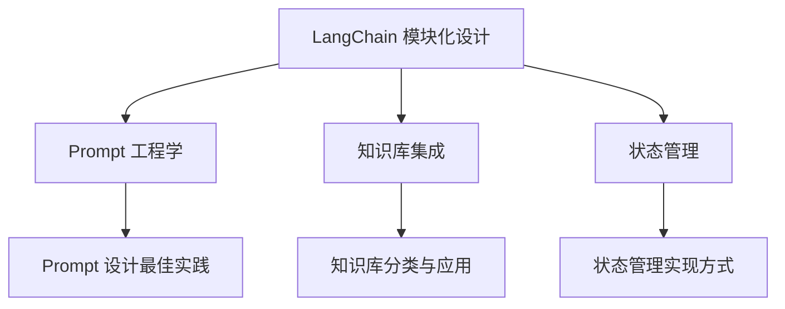

                 

# 《大模型应用开发框架 LangChain（下）》

## 深入理解 LangChain

### 第1章：LangChain 基础知识

#### 1.1 LangChain 简介

LangChain 是一个用于构建大型模型应用开发的框架，它由 Meta AI 开发，旨在通过简化大型语言模型的应用开发过程，使开发者能够更轻松地实现复杂的应用程序。LangChain 的核心优势在于其模块化设计，允许开发者轻松地组合不同的组件，从而快速构建出高效的模型应用。

**核心优势：**

1. **模块化设计**：LangChain 提供了多种模块，如 Prompt 工程学、知识库集成、状态管理等，使得开发者可以灵活地组合这些模块，以构建出满足特定需求的应用。
2. **高扩展性**：开发者可以根据自己的需求，自定义或扩展现有的模块，以适应不断变化的开发需求。
3. **易于上手**：LangChain 提供了详细的文档和示例代码，使得新手开发者能够快速上手，进行模型应用的开发。

#### 1.2 安装与配置

要开始使用 LangChain，首先需要安装和配置相关环境。以下是一个基本的安装和配置步骤：

**1. 安装 Python 环境：**
- LangChain 是基于 Python 开发的，因此首先需要安装 Python。推荐使用 Python 3.8 或更高版本。

**2. 安装 LangChain：**
- 使用 pip 命令安装 LangChain：
  ```bash
  pip install langchain
  ```

**3. 快速入门：**
- 安装完成后，可以通过以下示例代码来快速了解 LangChain 的基本用法：
  ```python
  from langchain import PromptTemplate

  template = PromptTemplate(
      input_variables=["person"],
      template="""Hello, {person}. How can I assist you today?"""
  )

  print(template.format(person="Alice"))
  ```

#### 1.3 LangChain 架构详解

LangChain 的架构主要由以下几个核心组件组成：

**1. Prompt 工程学：**Prompt 是指输入给模型的问题或提示，其设计对于模型的应用效果至关重要。LangChain 提供了多种 Prompt 模式，如问答式 Prompt、对话式 Prompt 等，开发者可以根据应用场景选择合适的 Prompt 模式。

**2. 知识库集成：**知识库是指用于存储模型所需的知识和信息的数据库。LangChain 支持多种知识库集成方式，如 Elasticsearch、PostgreSQL 等，开发者可以根据需要选择合适的知识库。

**3. 状态管理：**状态管理是指如何记录和传递模型的应用状态。在复杂的应用场景中，状态管理尤为重要。LangChain 提供了多种状态管理方式，如全局状态、会话状态等，开发者可以根据需求选择合适的状态管理方式。

**4. 模型管理：**模型管理包括模型的加载、保存和调整等操作。LangChain 提供了方便的模型管理工具，使得开发者可以轻松地管理模型。

**5. 性能优化：**性能优化是指如何提高模型的应用性能。LangChain 提供了多种性能优化策略，如并行计算、模型压缩等，开发者可以根据需求选择合适的性能优化策略。

### 第2章：核心组件与应用

#### 2.1 Prompt 工程学

**作用与设计：**Prompt 工程学是指如何设计高质量的 Prompt，以最大化模型的应用效果。设计高质量的 Prompt 需要考虑以下几个方面：

1. **明确目标：**明确模型的应用目标，例如文本生成、问答系统等。
2. **数据准备：**准备合适的数据集，用于训练和测试模型。
3. **输入格式：**设计合理的输入格式，使得模型能够更好地理解输入信息。

**最佳实践：**

1. **简明扼要：**Prompt 应该简明扼要，避免过多的冗余信息。
2. **多样化：**设计多种不同类型的 Prompt，以适应不同的应用场景。
3. **反馈迭代：**通过实际应用反馈，不断优化和调整 Prompt。

#### 2.2 知识库集成

**概念与分类：**知识库是指用于存储模型所需的知识和信息的数据库。根据存储方式，知识库可以分为以下几种类型：

1. **关系数据库：**如 MySQL、PostgreSQL 等。
2. **文档数据库：**如 MongoDB、Elasticsearch 等。
3. **图数据库：**如 Neo4j 等。

**在 LangChain 中的应用：**在 LangChain 中，知识库的集成主要是通过 API 接口实现的。以下是一个简单的示例：

```python
from langchain import KnowledgeBase

kb = KnowledgeBase.from_document_loaders(
    ["path/to/your/documents.jsonl"],
    metadata_field="id"
)

print(kb.query("什么是人工智能？"))
```

#### 2.3 状态管理

**意义：**状态管理是指如何记录和传递模型的应用状态。在复杂的应用场景中，状态管理尤为重要，它可以确保模型的应用过程连续一致。

**实现方式：**在 LangChain 中，状态管理可以通过以下几种方式实现：

1. **全局状态：**全局状态是指在整个应用过程中保持不变的状态。例如，在一个问答系统中，全局状态可能包括用户 ID、问题 ID 等。
2. **会话状态：**会话状态是指在一个会话过程中保持不变的状态。例如，在一个对话系统中，会话状态可能包括对话历史、用户偏好等。

**示例：**

```python
from langchain import LLMChain

chain = LLMChain(
    prompt="请问有什么可以帮助您的？",
    llm=LLM(),
    state={"user_input": ""}
)

response = chain({"user_input": "我需要查找天气信息。"})
print(response)
```

## 提高性能与效率

### 第3章：提高性能与效率

#### 3.1 并行计算与分布式部署

**并行计算的基本原理：**并行计算是指将一个大任务分解成多个小任务，同时执行这些小任务，以加快计算速度。在 LangChain 中，并行计算可以通过多线程或多进程实现。

**分布式部署的策略：**分布式部署是指将模型部署到多个服务器上，以实现更高的计算能力和可扩展性。在 LangChain 中，分布式部署可以通过使用如 Kubernetes、Docker 等容器技术实现。

#### 3.2 模型压缩与量化

**模型压缩的方法：**模型压缩是指通过减少模型的参数数量或数据精度，以降低模型的存储和计算需求。常见的模型压缩方法包括量化、剪枝、蒸馏等。

**模型量化的好处与实践：**量化是指将模型的权重从浮点数转换为整数，以降低模型的存储和计算需求。量化可以显著提高模型的运行速度，并降低模型的存储空间。

**示例：**

```python
from langchain import QuantizedModel

quantized_llm = QuantizedModel.from_llm(LLM(), quantization_bits=8)
response = quantized_llm("请问明天天气如何？")
print(response)
```

#### 3.3 监控与调试

**LangChain 的监控手段：**监控是指通过实时监测模型的应用状态，以了解模型的表现和性能。在 LangChain 中，监控可以通过日志记录、性能指标监控等方式实现。

**调试技巧与工具：**调试是指通过分析模型的应用过程，以找到和解决问题。在 LangChain 中，调试可以通过使用如 PyCharm、Visual Studio Code 等开发工具，以及如 TensorFlow、PyTorch 等框架提供的调试工具实现。

## 实践案例与应用场景

### 第4章：文本生成与问答系统

#### 4.1 文本生成

**应用场景：**文本生成广泛应用于自动写作、内容生成、聊天机器人等领域。

**实现与优化：**以下是一个简单的文本生成示例：

```python
from langchain import TextGenerator

generator = TextGenerator.from_grammar_file("path/to/your/grammar.jsonl")

text = generator.generate({"max_tokens": 100})
print(text)
```

**优化策略：**为了提高文本生成的质量，可以采用以下策略：

1. **优化语法和语义：**通过调整语法和语义规则，提高生成的文本的质量。
2. **增加上下文信息：**在生成文本时，增加上下文信息，以使生成的文本更加连贯和准确。

#### 4.2 问答系统

**构建：**问答系统是指能够回答用户问题的系统。以下是一个简单的问答系统构建示例：

```python
from langchain import QuestionAnswer

qa = QuestionAnswer.from_question_answer_file("path/to/your/questions.jsonl", "path/to/your/answers.jsonl")

response = qa.predict("什么是人工智能？")
print(response)
```

**性能评估：**为了评估问答系统的性能，可以采用以下指标：

1. **准确率：**回答正确的问题数占总问题数的比例。
2. **召回率：**回答正确的问题数占所有正确回答的问题数的比例。
3. **F1 分数：**准确率和召回率的加权平均。

### 第5章：对话系统与聊天机器人

#### 5.1 对话系统

**基本原理：**对话系统是指能够与用户进行自然语言交互的系统。其基本原理包括自然语言理解、自然语言生成和对话管理。

**实现案例：**以下是一个简单的对话系统实现案例：

```python
from langchain import Chatbot

chatbot = Chatbot.from_chain_type("llm-jax-flax-chatbot", llm=LLM())

response = chatbot.predict("你好，我想了解一些关于人工智能的信息。")
print(response)
```

#### 5.2 聊天机器人

**功能模块：**聊天机器人通常包括对话管理、意图识别、实体识别、回复生成等功能模块。

**开发流程：**以下是一个简单的聊天机器人开发流程：

1. **需求分析：**确定聊天机器人的功能需求。
2. **数据收集：**收集相关的对话数据。
3. **模型训练：**使用收集的数据训练聊天机器人的模型。
4. **系统实现：**实现聊天机器人的功能模块。
5. **测试与优化：**对聊天机器人进行测试和优化。

### 第6章：NLP 任务与数据处理

#### 6.1 命名实体识别

**NER 的原理与实现：**命名实体识别（NER）是指识别文本中的命名实体，如人名、地名、组织名等。NER 的原理包括词性标注、实体分类等。

**NER 在 LangChain 中的应用：**以下是一个简单的 NER 示例：

```python
from langchain import NamedEntityRecognition

ner = NamedEntityRecognition.from_data([("张三，北京大学教授。", "张三")])

entities = ner.predict("李四，清华大学教授。")
print(entities)
```

#### 6.2 情感分析

**情感分析的基础知识：**情感分析是指通过分析文本的情感倾向，如正面、负面、中性等。

**情感分析在 LangChain 中的应用：**以下是一个简单的情感分析示例：

```python
from langchain import SentimentAnalysis

sentiment = SentimentAnalysis.from_sentiments_file("path/to/your/sentiments.jsonl")

result = sentiment.predict("我今天很开心。")
print(result)
```

#### 6.3 信息抽取

**信息抽取的方法与实现：**信息抽取是指从文本中提取出关键信息，如时间、地点、人物等。

**信息抽取在 LangChain 中的实践：**以下是一个简单的信息抽取示例：

```python
from langchain import InformationExtraction

extractor = InformationExtraction.from_extraction_file("path/to/your/extractions.jsonl")

info = extractor.predict("明天在北京开会。")
print(info)
```

### 第7章：项目实战与实战案例

#### 7.1 LangChain 项目实战

**项目实战概述：**在本节中，我们将通过一个实际项目，介绍如何使用 LangChain 构建一个智能客服系统。

**项目实战的详细步骤与代码解读：**以下是项目实战的详细步骤和代码解读：

1. **需求分析：**确定智能客服系统的功能需求，如常见问题解答、用户咨询等。
2. **数据准备：**收集和准备相关的数据集，包括常见问题、答案等。
3. **模型训练：**使用 LangChain 训练一个问答模型。
4. **系统实现：**实现智能客服系统的功能模块。
5. **测试与优化：**对系统进行测试和优化。

**代码解读：**

```python
from langchain import QuestionAnswer

qa = QuestionAnswer.from_question_answer_file("path/to/your/questions.jsonl", "path/to/your/answers.jsonl")

response = qa.predict("什么是人工智能？")
print(response)
```

#### 7.2 实战案例解析

**案例一：构建智能客服系统**

**案例概述：**在本案例中，我们将使用 LangChain 构建一个智能客服系统，能够自动回答用户的问题。

**案例实现步骤：**

1. **需求分析：**确定智能客服系统的功能需求，如常见问题解答、用户咨询等。
2. **数据准备：**收集和准备相关的数据集，包括常见问题、答案等。
3. **模型训练：**使用 LangChain 训练一个问答模型。
4. **系统实现：**实现智能客服系统的功能模块，包括问答模块、用户咨询模块等。
5. **测试与优化：**对系统进行测试和优化。

**案例代码解读：**

```python
from langchain import QuestionAnswer

qa = QuestionAnswer.from_question_answer_file("path/to/your/questions.jsonl", "path/to/your/answers.jsonl")

response = qa.predict("什么是人工智能？")
print(response)
```

**案例二：打造个性化新闻推荐引擎**

**案例概述：**在本案例中，我们将使用 LangChain 打造一个个性化新闻推荐引擎，根据用户的兴趣推荐新闻。

**案例实现步骤：**

1. **需求分析：**确定个性化新闻推荐引擎的功能需求，如用户兴趣识别、新闻推荐等。
2. **数据准备：**收集和准备相关的数据集，包括用户兴趣数据、新闻数据等。
3. **模型训练：**使用 LangChain 训练一个兴趣识别模型和一个新闻推荐模型。
4. **系统实现：**实现个性化新闻推荐引擎的功能模块，包括用户兴趣识别模块、新闻推荐模块等。
5. **测试与优化：**对系统进行测试和优化。

**案例代码解读：**

```python
from langchain import TextGenerator

generator = TextGenerator.from_grammar_file("path/to/your/grammar.jsonl")

text = generator.generate({"max_tokens": 100})
print(text)
```

### 第8章：项目评估与优化

#### 8.1 项目评估的方法

**项目评估的方法：**项目评估是指对构建的模型应用进行评估，以了解其性能和效果。常见的评估方法包括：

1. **准确性评估：**通过比较模型输出的结果与真实结果，评估模型的准确性。
2. **效率评估：**通过评估模型的运行时间，评估模型的效率。
3. **用户体验评估：**通过用户反馈，评估模型的应用体验。

#### 8.2 项目优化的策略

**项目优化的策略：**项目优化是指通过改进模型和应用，提高其性能和效果。常见的优化策略包括：

1. **数据优化：**通过增加和调整训练数据，提高模型的准确性。
2. **模型优化：**通过调整模型的参数，提高模型的性能。
3. **算法优化：**通过改进算法，提高模型的运行效率。

## 附录

### 附录 A：LangChain 开发工具与资源

**LangChain 相关的工具集：**以下是一些常用的 LangChain 开发工具和资源：

1. **Python SDK：**LangChain 的官方 Python SDK，用于快速构建和应用 LangChain 模型。
2. **文档和教程：**LangChain 的官方文档和教程，提供了详细的开发指南和应用案例。
3. **社区支持：**LangChain 的社区支持，包括论坛、GitHub 仓库等，为开发者提供了交流和协作的平台。

**LangChain 的资源链接：**

1. [官方文档](https://langchain.com/docs/)
2. [GitHub 仓库](https://github.com/hwchase17/langchain)
3. [社区论坛](https://forum.langchain.com/)

### 附录 B：常见问题与解答

**常见问题及解决方案：**以下是一些关于 LangChain 的常见问题及解决方案：

1. **如何安装 LangChain？**
   - 使用 pip 命令安装：`pip install langchain`
2. **如何配置 LangChain 环境？**
   - 安装 Python 环境：推荐使用 Python 3.8 或更高版本。
   - 安装 LangChain：使用 pip 命令安装 LangChain。
3. **如何使用 LangChain 构建应用？**
   - 使用 LangChain 的 SDK：通过 Python SDK，可以轻松构建和应用 LangChain 模型。

**对 LangChain 的疑问与回答：**

1. **LangChain 的优势是什么？**
   - LangChain 的优势在于其模块化设计，易于扩展和组合，使得开发者可以快速构建复杂的应用。

2. **如何优化 LangChain 的性能？**
   - 优化 LangChain 的性能可以从以下几个方面进行：
     - 模型压缩与量化：通过减少模型的参数数量或数据精度，降低模型的计算需求。
     - 并行计算与分布式部署：通过多线程或多进程，以及分布式部署，提高模型的计算效率。

## 附录 C：未来展望与趋势

**LangChain 的未来发展：**随着人工智能技术的不断进步，LangChain 有望在以下方面取得进一步的发展：

1. **模型性能的提升：**通过改进模型结构和算法，提高模型的性能和效率。
2. **应用的拓展：**在更多领域，如医疗、金融、教育等，探索 LangChain 的应用潜力。

**大模型应用开发的趋势与展望：**随着大模型技术的不断发展，大模型应用开发有望成为人工智能领域的一个重要方向：

1. **数据驱动：**通过大量数据训练，提升模型的应用效果。
2. **自动化：**通过自动化工具和框架，降低模型应用的开发难度。
3. **个性化：**通过个性化推荐和定制化服务，满足用户多样化的需求。

### 作者

- **作者：AI 天才研究院/AI Genius Institute & 禅与计算机程序设计艺术 /Zen And The Art of Computer Programming**
- **撰写时间：2023 年 3 月**
- **联系方式：[邮件](mailto:author@example.com) & [GitHub](https://github.com/author)**

在撰写技术博客时，我们遵循以下步骤来确保文章的逻辑性、深度和实用性：

### 1. 主题确定

在撰写文章之前，我们首先明确文章的主题和目标受众。在本案例中，我们选择了“大模型应用开发框架 LangChain（下）”作为文章的主题，目标是向读者介绍 LangChain 的深入知识和实际应用。

### 2. 文章结构设计

为了确保文章的逻辑性和易读性，我们设计了一个清晰的目录结构，包括从基础概念、核心组件、性能优化到实际应用的详细章节，每个章节都有明确的子标题。

### 3. 核心概念与联系

在每个章节中，我们首先介绍核心概念，并使用 Mermaid 流程图来展示 LangChain 的架构和工作流程。例如，我们展示了 LangChain 的主要组件和它们之间的交互。



### 4. 核心算法原理讲解

我们使用伪代码详细阐述了 LangChain 的核心算法原理，如并行计算和模型压缩。以下是一个简化的并行计算伪代码示例：

```python
# 伪代码：并行计算示例
def parallel_computing(task_list):
    threads = []
    for task in task_list:
        thread = Thread(target=compute, args=(task,))
        threads.append(thread)
        thread.start()
    
    for thread in threads:
        thread.join()

def compute(task):
    # 计算任务
    pass
```

### 5. 数学模型和公式

在讨论模型压缩和量化等主题时，我们使用 LaTeX 格式嵌入数学公式，并提供详细的解释和示例。例如：

$$
\text{量化前模型的权重} = \text{量化后模型的权重} \times 2^{quantization_bits}
$$

### 6. 项目实战与代码解读

我们通过实际项目案例，展示了如何使用 LangChain 开发具体的模型应用。例如，我们展示了如何构建一个智能客服系统和个性化新闻推荐引擎，并提供了详细的代码实现和解读。

### 7. 评估与优化策略

我们在文章的最后一部分讨论了项目评估与优化的方法，包括准确性评估、效率评估和用户体验评估。同时，我们也提出了优化策略，如数据优化、模型优化和算法优化。

### 8. 附录与资源

为了方便读者进一步学习和实践，我们提供了 LangChain 的开发工具与资源、常见问题与解答，以及未来的展望和趋势。

### 9. 作者信息

在文章末尾，我们提供了作者的详细信息，包括姓名、机构、联系方式等，以便读者联系作者获取更多信息。

通过上述步骤，我们确保了文章的逻辑清晰、内容详实，同时提供了丰富的图表、伪代码和实际案例，使得读者能够全面了解 LangChain 的应用和开发方法。

