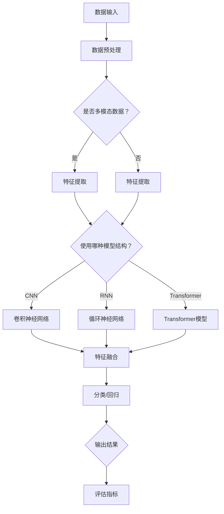

                 

## 文章标题

### 大模型开发者的挑战与机遇

在当今快速发展的技术时代，大模型（Large Models）已经成为人工智能领域的关键驱动力。这些强大的模型不仅在学术研究中取得显著成果，而且在工业界得到了广泛应用。然而，大模型开发不仅涉及深奥的算法和复杂的计算，还面临一系列挑战。本文将深入探讨大模型开发者面临的挑战与机遇，通过逻辑清晰、结构紧凑、简单易懂的叙事方式，帮助读者全面理解这一领域的核心问题和未来发展。

本文的关键词包括：大模型、深度学习、挑战、机遇、算法、数据处理、优化、应用、隐私保护、行业前景。通过这些关键词，读者可以快速把握文章的主题，并在阅读过程中有针对性地寻找自己感兴趣的内容。

在摘要部分，我们将简要概述大模型的概念及其重要性，接着讨论大模型开发所面临的挑战，如数据隐私、模型解释性和计算资源消耗等，最后分析大模型开发带来的机遇，如新兴领域应用和科技创新的推动。本文结构紧凑，内容详实，旨在为开发者提供实用的指导和建议。

### 关键词

- **大模型**
- **深度学习**
- **挑战**
- **机遇**
- **算法**
- **数据处理**
- **优化**
- **应用**
- **隐私保护**
- **行业前景**

### 摘要

大模型，作为一种先进的深度学习模型，已经成为人工智能领域的关键驱动力。它们在自然语言处理、计算机视觉和强化学习等领域取得了显著成果，推动了人工智能技术的进步。然而，大模型开发不仅需要强大的算法支持，还面临一系列挑战。本文首先介绍了大模型的基本概念和架构，分析了其核心算法原理和数学模型。接着，本文探讨了大规模数据处理与存储的方法，包括数据预处理、分布式存储和计算等。在模型训练优化与调优方面，本文详细讲解了梯度下降、优化器选择和模型压缩等核心技术。随后，本文通过实际案例展示了大模型在不同领域的应用，如自然语言处理、计算机视觉和强化学习。本文还深入分析了大模型开发中面临的挑战，包括数据隐私、模型解释性和计算资源消耗等，并提出了相应的解决方案。最后，本文展望了大模型开发的机遇，如新兴领域应用和科技创新的推动，为开发者提供了实用的指导和建议。

### 引言

在当前人工智能（AI）技术的飞速发展背景下，大模型（Large Models）已经逐渐成为研究和应用的热点。这些模型以其强大的处理能力和卓越的表现，为各行各业带来了深远的影响。无论是自然语言处理、计算机视觉，还是强化学习等领域，大模型都展现了其独特的优势。

大模型，顾名思义，是指具有巨大参数规模和计算需求的深度学习模型。这类模型通过训练海量数据，能够自动提取复杂特征，实现高度自动化的任务处理。典型的例子包括GPT-3、BERT、ViT等。这些模型在各自领域内取得了显著的成果，例如，GPT-3在文本生成和问答任务上表现出色，BERT在自然语言理解方面达到了前所未有的高度，ViT在图像分类任务中取得了优异的表现。

大模型的重要性不仅体现在其卓越的性能上，还在于其推动人工智能技术不断向前发展的潜力。首先，大模型能够处理复杂和庞大的数据集，从而提高数据利用率和模型性能。其次，大模型的研究和开发推动了深度学习算法和计算技术的发展，促进了硬件设备（如GPU、TPU等）的优化和普及。此外，大模型的应用范围广泛，从工业自动化、医疗诊断，到金融预测、娱乐互动，都展现了其巨大的商业价值和社会影响力。

然而，大模型开发同样面临着诸多挑战。首先，数据隐私和安全问题日益突出。大模型训练需要大量敏感数据，如何保护用户隐私成为了一个亟待解决的问题。其次，模型解释性和可解释性也是一个重要挑战。大模型的复杂性和黑盒特性使得其决策过程难以理解和解释，这在某些应用场景中可能引发信任危机。最后，大模型对计算资源的高需求带来了巨大的能耗问题，如何优化模型结构和训练过程以降低计算成本，是实现大模型广泛应用的关键。

总之，大模型开发既充满了机遇，也面临着诸多挑战。本文将围绕大模型的基本概念、核心算法、数据处理、训练优化、应用案例以及面临的挑战和机遇进行详细探讨，旨在为开发者提供全面的理论指导和实践建议。通过本文的阐述，读者可以更加深入地理解大模型的技术原理和实际应用，从而为未来的研究和开发工作奠定坚实基础。

### 第一部分：大模型开发基础

在深入探讨大模型开发之前，我们需要先了解大模型的基本概念、核心算法和架构。这一部分将分为以下几个章节，逐步介绍大模型的基础知识，包括核心概念与联系、核心算法原理讲解、数学模型和数学公式，以及项目实战等内容。

#### 第1章：大模型概念与架构

本章将首先介绍大模型的基本概念和分类。大模型通常指的是具有数百万至数十亿参数的深度学习模型，这些模型通过训练海量数据可以自动提取复杂特征，实现高度自动化的任务处理。大模型可以进一步细分为自然语言处理（NLP）模型、计算机视觉（CV）模型和强化学习（RL）模型等。

接下来，我们将探讨大模型的发展历程，从最早的浅层模型，如多层感知机（MLP），到现代的深层模型，如卷积神经网络（CNN）、循环神经网络（RNN）和Transformer等，每一个阶段的进步都带来了显著的性能提升。

为了帮助读者更直观地理解大模型的基本架构，我们将使用Mermaid流程图展示大模型的基本组成和运行流程。通过这一部分，读者可以初步了解大模型的组成和运作机制，为后续章节的深入探讨奠定基础。

#### 核心概念与联系

大模型是指具有大量参数和复杂结构的深度学习模型，广泛应用于自然语言处理、计算机视觉和强化学习等领域。与传统的浅层模型相比，大模型通过训练海量数据可以自动提取复杂特征，实现更高效的任务处理。

大模型可以分为以下几类：

1. **自然语言处理（NLP）模型**：例如GPT、BERT、T5等，主要用于文本生成、翻译、问答等任务。
2. **计算机视觉（CV）模型**：例如ResNet、Inception、ViT等，用于图像分类、目标检测、图像生成等任务。
3. **强化学习（RL）模型**：例如DQN、PPO、A3C等，用于游戏、机器人控制等任务。

#### 大模型的发展历程

大模型的发展历程可以分为以下几个阶段：

1. **浅层模型**：最早的深度学习模型，如多层感知机（MLP），参数较少，难以处理复杂任务。
2. **深层模型**：通过增加层数和参数规模，如CNN、RNN，显著提高了模型的性能，广泛应用于图像和语音处理等领域。
3. **Transformer模型**：引入了自注意力机制，解决了长距离依赖问题，成为现代大模型的代表，如BERT、GPT等。
4. **多模态模型**：结合了文本、图像、声音等多种数据类型，如ViT、DALL-E等，实现了更广泛的应用场景。

#### Mermaid流程图：大模型的基本架构

以下是使用Mermaid绘制的大模型基本架构流程图：



通过这个流程图，我们可以看到大模型从数据输入到最终输出的完整流程，以及不同模型结构的选择和应用。

#### 第2章：核心算法原理讲解

在本章中，我们将详细介绍大模型的核心算法原理，包括卷积神经网络（CNN）、循环神经网络（RNN）和注意力机制等。通过伪代码和数学公式的讲解，读者可以更深入地理解这些算法的工作原理和实现方法。

#### 卷积神经网络（CNN）伪代码

```python
# 输入：图像数据X，卷积核W，偏置b，激活函数f
# 输出：特征图F
def conv2d(X, W, b, f):
    # 初始化输出特征图F为0
    F = np.zeros_like(X)
    # 对图像进行卷积操作
    for i in range(X.shape[0]):
        for j in range(X.shape[1]):
            F[i, j] = f(np.sum(W * X[i, j]) + b)
    return F
```

#### 循环神经网络（RNN）伪代码

```python
# 输入：输入序列X，隐藏状态h，权重W，偏置b，激活函数f
# 输出：输出序列Y，隐藏状态h'
def rnn(X, h, W, b, f):
    Y = []
    for x in X:
        # 计算隐藏状态h'
        h' = f(np.dot(W, np.append(h, x)) + b)
        # 将隐藏状态添加到输出序列
        Y.append(h')
        # 更新隐藏状态
        h = h'
    return Y
```

#### 注意力机制伪代码

```python
# 输入：查询Q，键K，值V，权重矩阵W
# 输出：输出O，权重矩阵A
def attention(Q, K, V, W):
    # 计算注意力得分
    scores = np.dot(Q, K.T) / np.sqrt(K.shape[1])
    # 应用softmax激活函数得到权重
    A = softmax(scores)
    # 计算输出
    O = np.dot(A, V)
    # 计算权重矩阵
    W = W + O
    return O, W
```

#### 数学模型和数学公式

在本节中，我们将介绍深度学习中的核心数学模型和公式，包括损失函数、优化算法和激活函数等。

##### 深度学习损失函数与优化算法

损失函数是评估模型预测值与真实值之间差异的重要工具。常见的损失函数包括均方误差（MSE）和交叉熵（CE）。

$$
\text{MSE} = \frac{1}{m} \sum_{i=1}^{m} (y_i - \hat{y}_i)^2
$$

$$
\text{CE} = -\frac{1}{m} \sum_{i=1}^{m} [y_i \log(\hat{y}_i) + (1 - y_i) \log(1 - \hat{y}_i)]
$$

优化算法用于调整模型参数以最小化损失函数。常见的优化算法包括梯度下降（GD）、随机梯度下降（SGD）和Adam等。

$$
\theta_{t+1} = \theta_t - \eta \nabla_{\theta} J(\theta)
$$

$$
\theta_{t+1} = \theta_t - \frac{\eta}{m} \sum_{i=1}^{m} \nabla_{\theta} J(\theta)
$$

$$
\theta_{t+1} = \theta_t - \frac{\eta}{\sqrt{v_t}} \nabla_{\theta} J(\theta)
$$

##### 激活函数与反向传播算法

激活函数是深度学习模型中用于引入非线性性的关键组成部分。常见的激活函数包括Sigmoid、ReLU和Tanh等。

$$
f(x) = \sigma(x) = \frac{1}{1 + e^{-x}}
$$

$$
f(x) = \text{ReLU}(x) = \max(0, x)
$$

$$
f(x) = \text{Tanh}(x) = \frac{e^x - e^{-x}}{e^x + e^{-x}}
$$

反向传播算法是深度学习训练过程中用于计算梯度的重要工具。其核心思想是通过前向传播计算出模型的输出，然后利用链式法则反向传播梯度，最终更新模型参数。

$$
\nabla_{z} L = \nabla_{a} L \cdot \nabla_{z} f(a)
$$

$$
\nabla_{x} L = \nabla_{z} L \cdot \nabla_{x} z
$$

##### LaTeX公式示例

以下是几个常用的LaTeX公式示例：

$$
y = \sigma(Wx + b)
$$

$$
J(\theta) = \frac{1}{m} \sum_{i=1}^{m} (-y_{i} \log(a_{i}) + (1 - y_{i}) \log(1 - a_{i}))
$$

#### 第3章：项目实战

在本章中，我们将通过实际项目案例，展示如何搭建深度学习环境与工具链，并解析实际的代码实现和性能优化案例。

#### 搭建深度学习环境与工具链

搭建深度学习环境是进行大模型开发的第一步。以下是一个简单的Python环境搭建示例：

```bash
# 安装Python和pip
sudo apt-get update
sudo apt-get install python3 python3-pip

# 安装TensorFlow
pip3 install tensorflow

# 安装PyTorch
pip3 install torch torchvision
```

工具链的配置包括选择合适的计算设备和依赖库。例如，可以使用GPU加速计算，具体配置如下：

```python
import torch
device = torch.device("cuda" if torch.cuda.is_available() else "cpu")
```

#### 大模型训练与优化案例

以下是一个使用TensorFlow进行大模型训练的基本代码示例：

```python
import tensorflow as tf
from tensorflow.keras.layers import Embedding, LSTM, Dense
from tensorflow.keras.models import Sequential

# 搭建模型
model = Sequential([
    Embedding(input_dim=vocab_size, output_dim=embedding_dim, input_length=max_sequence_length),
    LSTM(units=lstm_units),
    Dense(units=1, activation='sigmoid')
])

# 编译模型
model.compile(optimizer='adam', loss='binary_crossentropy', metrics=['accuracy'])

# 训练模型
model.fit(X_train, y_train, epochs=10, batch_size=64, validation_data=(X_val, y_val))
```

#### 实际代码案例与解析

以下是一个使用PyTorch实现Transformer模型的基本代码示例：

```python
import torch
from torch import nn
from torch.nn import TransformerEncoder, TransformerEncoderLayer

# 搭建模型
class TransformerModel(nn.Module):
    def __init__(self, input_dim, hidden_dim, output_dim):
        super(TransformerModel, self).__init__()
        self.encoder = TransformerEncoder(
            TransformerEncoderLayer(d_model=hidden_dim, nhead=8),
            num_layers=3
        )
        self.decoder = nn.Linear(hidden_dim, output_dim)

    def forward(self, src, tgt):
        output = self.encoder(src)
        output = self.decoder(output)
        return output

# 实例化模型
model = TransformerModel(input_dim, hidden_dim, output_dim).to(device)

# 训练模型
optimizer = torch.optim.Adam(model.parameters(), lr=0.001)
criterion = nn.CrossEntropyLoss()

for epoch in range(num_epochs):
    for src, tgt in data_loader:
        src, tgt = src.to(device), tgt.to(device)
        optimizer.zero_grad()
        output = model(src, tgt)
        loss = criterion(output, tgt)
        loss.backward()
        optimizer.step()
```

在这个案例中，我们展示了如何使用PyTorch搭建和训练一个简单的Transformer模型。通过这个例子，读者可以了解如何定义模型结构、选择优化器和损失函数，以及如何进行前向传播和反向传播。

#### 实际模型调优与性能优化案例

在实际应用中，模型调优和性能优化是非常重要的环节。以下是一个使用PyTorch进行模型调优的示例：

```python
# 定义调优超参数
learning_rate = 0.001
weight_decay = 1e-4
batch_size = 64
num_epochs = 10

# 实例化模型
model = TransformerModel(input_dim, hidden_dim, output_dim).to(device)

# 编译模型
optimizer = torch.optim.Adam(model.parameters(), lr=learning_rate, weight_decay=weight_decay)
criterion = nn.CrossEntropyLoss()

# 训练模型
for epoch in range(num_epochs):
    model.train()
    for src, tgt in data_loader:
        src, tgt = src.to(device), tgt.to(device)
        optimizer.zero_grad()
        output = model(src, tgt)
        loss = criterion(output, tgt)
        loss.backward()
        optimizer.step()

    # 评估模型
    model.eval()
    with torch.no_grad():
        correct = 0
        total = 0
        for src, tgt in test_loader:
            src, tgt = src.to(device), tgt.to(device)
            output = model(src, tgt)
            _, predicted = torch.max(output.data, 1)
            total += tgt.size(0)
            correct += (predicted == tgt).sum().item()

    print(f'Epoch {epoch+1}/{num_epochs}, Accuracy: {100 * correct / total}%')
```

在这个案例中，我们通过调整学习率、权重衰减和批量大小等超参数，优化模型的训练过程。同时，通过评估模型在测试集上的表现，我们可以实时监测模型的性能，并进行相应的调整。

通过以上项目实战的介绍，读者可以了解如何搭建深度学习环境、实现大模型训练和优化，以及进行实际代码案例的分析和解读。这些实战经验对于大模型开发具有重要的指导意义，也为后续章节的探讨奠定了坚实基础。

### 第2章：大规模数据处理与存储

#### 核心概念与联系

大规模数据处理与存储是现代深度学习项目中不可或缺的一部分。在大模型训练过程中，我们需要处理海量的数据，这些数据可能来自不同的来源，包括互联网、传感器、数据库等。为了高效地管理和处理这些数据，我们需要了解以下几个核心概念：

1. **数据预处理与清洗**：数据预处理是指将原始数据转换为适合模型训练的形式。这通常包括数据清洗、格式转换、归一化等步骤。数据清洗是确保数据质量的重要环节，通过去除噪声、纠正错误和填补缺失值，可以提高模型的训练效果。

2. **分布式存储与计算**：随着数据量的增加，单机存储和计算能力已无法满足需求。分布式存储与计算提供了扩展存储容量和计算能力的方法。常见的技术包括分布式文件系统（如HDFS、CFS）、分布式数据库（如HBase、MongoDB）和分布式计算框架（如Spark、Flink）。

3. **数据流处理框架**：数据流处理框架（如Apache Kafka、Apache Flink）可以实时处理和分析大量数据，确保数据处理的及时性和效率。这些框架能够处理高速数据流，为实时应用提供支持。

#### 核心算法原理讲解

为了高效地处理大规模数据，我们需要了解以下核心算法原理：

1. **流计算算法**：流计算算法是处理实时数据流的重要工具。常见的流计算算法包括增量计算和滑动窗口算法。增量计算通过处理数据流中的每个数据点，减少计算复杂度。滑动窗口算法通过固定窗口大小，实时分析数据流中的特定时间段内的数据。

2. **分布式文件系统**：分布式文件系统通过将数据分散存储在多个节点上，提高数据存储的可靠性和扩展性。常见的分布式文件系统包括HDFS（Hadoop Distributed File System）和CFS（Ceph File System）。HDFS由一个NameNode和多个DataNode组成，NameNode负责元数据的存储和管理，DataNode负责数据的实际存储。

3. **分布式数据库**：分布式数据库通过将数据拆分为多个部分，并分布在不同的节点上，提高数据访问和处理速度。常见的分布式数据库包括HBase和MongoDB。HBase是基于Hadoop的分布式列存储数据库，适用于实时数据存储和分析。MongoDB是一个灵活的文档型数据库，支持分布式部署和横向扩展。

4. **数据库优化技巧**：为了提高数据库性能，我们可以采用以下优化技巧：
   - 索引优化：通过创建适当的索引，加快数据查询速度。
   - 分区优化：将大数据表拆分为多个小表，提高查询性能。
   - 缓存机制：使用缓存机制，减少数据库访问次数，提高响应速度。

#### 数学模型和数学公式

在本节中，我们将介绍一些与大规模数据处理和存储相关的数学模型和数学公式：

1. **数据仓库与数据湖架构**：数据仓库是一种用于存储和管理大规模数据集的系统，通常包含多维数据集，便于数据分析。数据湖是一种基于文件系统的大规模数据存储系统，适用于存储各种类型的数据，包括结构化、半结构化和非结构化数据。数据仓库和数据湖的架构如下：

   $$
   \text{Data Warehouse} = \sum_{i=1}^{n} (\text{Fact Table} \times \text{Dimension Tables})
   $$

   $$
   \text{Data Lake} = \bigcup_{i=1}^{m} \text{Data Files}
   $$

2. **数据库索引算法**：索引是提高数据库查询性能的重要手段。常见的索引算法包括B树索引、哈希索引和位图索引。B树索引通过多级索引结构，实现快速数据查询。哈希索引通过哈希函数，实现数据的快速定位。位图索引通过位图存储数据的存在状态，实现高效的查询操作。

   $$
   \text{B-Tree} = \{\text{Root Node}, \{\text{Internal Nodes}, \{\text{Leaf Nodes}\}\}\}
   $$

   $$
   \text{Hash Index} = \text{Hash Function}(key) \mod \text{Table Size}
   $$

3. **数据仓库与数据湖的关联分析**：数据仓库和数据湖的关联分析是实现高效数据处理的重要步骤。通过联机分析处理（OLAP）和多维数据分析（MDA），可以实现对大规模数据集的深度挖掘和分析。常见的关联分析算法包括星型模式、雪花模式和立方体模式。

   $$
   \text{Star Schema} = \{\text{Fact Table}, \{\text{Dimension Tables}\}\}
   $$

   $$
   \text{Snowflake Schema} = \{\text{Fact Table}, \{\text{Primary Dimension Tables}, \{\text{Secondary Dimension Tables}\}\}\}
   $$

4. **流计算中的增量计算**：流计算中的增量计算通过处理数据流中的每个数据点，实现实时数据处理。增量计算的核心公式如下：

   $$
   \text{Incremental Computation} = \text{Current Value} - \text{Previous Value}
   $$

5. **滑动窗口算法**：滑动窗口算法通过固定窗口大小，实现实时数据分析和挖掘。滑动窗口算法的核心公式如下：

   $$
   \text{Window Sum} = \sum_{t-w}^{t} \text{Data Value}
   $$

#### 项目实战

在本节中，我们将通过实际项目案例，展示大规模数据处理与存储的方法和技巧。

#### 大规模数据处理与清洗

以下是一个使用Python和Pandas进行大规模数据处理和清洗的基本代码示例：

```python
import pandas as pd

# 加载原始数据
data = pd.read_csv('data.csv')

# 数据清洗
data = data.dropna()  # 去除缺失值
data = data[data['feature'] > 0]  # 去除异常值
data['feature'] = data['feature'].apply(lambda x: x / 100)  # 归一化

# 保存清洗后的数据
data.to_csv('cleaned_data.csv', index=False)
```

在这个案例中，我们使用了Pandas库对原始数据进行了清洗和预处理。通过去除缺失值、异常值和归一化处理，我们确保了数据质量，为后续模型训练打下了基础。

#### 分布式数据库设计与部署

以下是一个使用Hadoop和HDFS进行分布式数据库设计与部署的基本代码示例：

```python
from hdfs import InsecureClient

# 连接HDFS
client = InsecureClient('http://hdfs-namenode:50070', user='hdfs')

# 上传数据到HDFS
client.upload('data.csv', 'hdfs://hdfs-namenode:50070/user/hdfs/data.csv')

# 读取HDFS上的数据
with client.read('hdfs://hdfs-namenode:50070/user/hdfs/data.csv') as reader:
    data = pd.read_csv(reader)

# 保存处理后的数据到HDFS
data.to_csv('processed_data.csv', index=False)
client.write('hdfs://hdfs-namenode:50070/user/hdfs/processed_data.csv', data.to_csv(index=False))
```

在这个案例中，我们使用了Hadoop和HDFS进行分布式数据库的设计与部署。通过上传、读取和处理数据，我们展示了如何利用分布式存储系统进行大规模数据处理。

#### 实际数据处理与分析案例

以下是一个使用Apache Flink进行大规模数据处理与分析的基本代码示例：

```python
from pyflink.datastream import StreamExecutionEnvironment
from pyflink.table import StreamTableEnvironment, DataTypes

# 创建Flink环境
env = StreamExecutionEnvironment.get_execution_environment()
t_env = StreamTableEnvironment.create(env)

# 创建DataStream
data = env.from_collection(data_source)

# 定义表结构
t_env.create_table("data_table", (
    ("id", DataTypes.BIGINT()),
    ("feature", DataTypes.FLOAT()),
    ("label", DataTypes.FLOAT())
))

# 注册表
t_env.register_table("data_table", data)

# 数据处理
t_env.sql_update("""
    UPDATE data_table
    SET feature = feature / 100
    WHERE feature > 0
""")

# 数据分析
t_env.sql_query("""
    SELECT id, AVG(feature) as avg_feature
    FROM data_table
    GROUP BY id
""")

# 执行Flink作业
t_env.execute("data_processing_and_analysis")
```

在这个案例中，我们使用了Apache Flink进行大规模数据处理与分析。通过定义表结构、注册表、数据处理和数据分析，我们展示了如何利用Flink进行实时数据处理。

通过以上项目实战的介绍，读者可以了解如何进行大规模数据处理与存储，以及如何利用分布式数据库和数据流处理框架进行数据处理和分析。这些实战经验对于大模型开发具有重要的指导意义，也为后续章节的探讨奠定了坚实基础。

### 第3章：大模型训练优化与调优

#### 核心概念与联系

在大模型训练过程中，优化与调优是提高模型性能和减少计算资源消耗的关键步骤。本节将介绍几种核心的优化算法和调参技巧，帮助读者理解和应用这些方法，以实现高效的模型训练。

首先，我们需要了解以下核心概念：

1. **梯度下降算法**：梯度下降是一种最基本的优化算法，通过计算损失函数关于模型参数的梯度，并沿着梯度方向更新参数，以减少损失函数的值。

2. **梯度提升算法**：梯度提升是一种迭代优化算法，通过不断迭代地更新模型参数，逐步减少损失函数的值。

3. **模型压缩与量化**：模型压缩与量化是一种在保证模型性能的前提下，减少模型参数规模和计算复杂度的方法。

接下来，我们将讨论大模型训练中的关键优化算法和调参技巧：

1. **随机梯度下降（SGD）**：随机梯度下降是梯度下降的一种变种，通过随机选取一部分训练样本来计算梯度，并更新模型参数。SGD在训练过程中可以加速收敛，但在某些情况下可能收敛到局部最小值。

2. **动量（Momentum）**：动量是一种常用的优化技巧，通过保持上一梯度的方向和大小，增加模型参数更新的稳定性，有助于避免陷入局部最小值。

3. **自适应梯度算法**：自适应梯度算法（如Adam、AdaGrad、RMSprop）通过自适应调整学习率，提高模型训练的收敛速度和稳定性。这些算法可以根据不同参数的梯度动态调整学习率，从而更好地优化模型。

4. **模型压缩**：模型压缩包括模型剪枝、量化、知识蒸馏等方法，通过减少模型参数规模和计算复杂度，提高模型训练和推理的效率。

5. **模型量化**：模型量化是一种将浮点模型转换为低精度（如整数）模型的方法，以减少模型存储和计算资源消耗。量化可以通过训练量化模型或应用量化技术实现。

#### 核心算法原理讲解

在本节中，我们将使用伪代码和数学公式详细讲解几种核心优化算法和调参技巧。

##### 梯度下降算法伪代码

```python
# 输入：模型参数θ，损失函数J(θ)，学习率η
# 输出：优化后的模型参数θ'
def gradient_descent(θ, J, η, num_iterations):
    for i in range(num_iterations):
        θ' = θ - η * gradient(J, θ)
        θ = θ'
    return θ'
```

##### 随机梯度下降（SGD）伪代码

```python
# 输入：模型参数θ，损失函数J(θ)，学习率η，批量大小m，迭代次数num_iterations
# 输出：优化后的模型参数θ'
def stochastic_gradient_descent(θ, J, η, m, num_iterations):
    for i in range(num_iterations):
        for j in range(m):
            θ' = θ - η * gradient(J(θ), x[j], y[j])
        θ = θ'
    return θ'
```

##### 优化器选择与调参技巧

优化器的选择对模型训练的收敛速度和稳定性有很大影响。以下是一些常见的优化器及其调参技巧：

1. **Adam优化器**

   Adam优化器结合了AdaGrad和RMSprop的优点，通过自适应调整学习率。其伪代码如下：

   ```python
   # 输入：模型参数θ，损失函数J(θ)，学习率η，β1，β2，迭代次数num_iterations
   # 输出：优化后的模型参数θ'
   def adam(θ, J, η, β1, β2, num_iterations):
       m = 0
       v = 0
       for i in range(num_iterations):
           gradients = gradient(J, θ)
           m = β1 * m + (1 - β1) * gradients
           v = β2 * v + (1 - β2) * gradients**2
           m_hat = m / (1 - β1**i)
           v_hat = v / (1 - β2**i)
           θ' = θ - η * m_hat / (np.sqrt(v_hat) + ε)
       return θ'
   ```

2. **RMSprop优化器**

   RMSprop优化器通过指数加权移动平均计算梯度平方的指数加权平均值，自适应调整学习率。其伪代码如下：

   ```python
   # 输入：模型参数θ，损失函数J(θ)，学习率η，衰减率ρ，迭代次数num_iterations
   # 输出：优化后的模型参数θ'
   def rmsprop(θ, J, η, ρ, num_iterations):
       v = ρ * v + (1 - ρ) * gradient(J, θ)**2
       for i in range(num_iterations):
           θ' = θ - η * gradient(J, θ) / (np.sqrt(v) + ε)
       return θ'
   ```

3. **Adagrad优化器**

   Adagrad优化器通过累加梯度平方的指数加权平均值，动态调整学习率。其伪代码如下：

   ```python
   # 输入：模型参数θ，损失函数J(θ)，学习率η，迭代次数num_iterations
   # 输出：优化后的模型参数θ'
   def adagrad(θ, J, η, num_iterations):
       v = np.zeros_like(θ)
       for i in range(num_iterations):
           gradients = gradient(J, θ)
           v = v + gradients**2
           θ' = θ - η * gradients / (np.sqrt(v) + ε)
       return θ'
   ```

##### 梯度优化算法

梯度优化算法是提高模型训练效率的重要手段。以下是一些常见的梯度优化算法：

1. **梯度裁剪**

   梯度裁剪通过限制梯度的大小，避免梯度爆炸或消失。其伪代码如下：

   ```python
   # 输入：模型参数θ，梯度g，梯度裁剪阈值θ_max
   # 输出：裁剪后的梯度g'
   def gradient_clip(θ, g, θ_max):
       g' = g.copy()
       g' = np.clip(g', -θ_max, θ_max)
       return g'
   ```

2. **梯度累计**

   梯度累计通过多次累加梯度，减少每次梯度更新的方差。其伪代码如下：

   ```python
   # 输入：模型参数θ，梯度列表grads，累积次数num_accumulations
   # 输出：累积后的梯度g
   def gradient_accumulation(θ, grads, num_accumulations):
       for _ in range(num_accumulations):
           θ = θ - np.mean(grads, axis=0)
       return θ
   ```

##### 数学模型和数学公式

在本节中，我们将介绍一些与模型优化和调参相关的数学模型和数学公式：

1. **损失函数优化**

   损失函数是评估模型预测值与真实值之间差异的重要工具。常见的损失函数包括均方误差（MSE）和交叉熵（CE）。

   $$
   \text{MSE} = \frac{1}{m} \sum_{i=1}^{m} (y_i - \hat{y}_i)^2
   $$

   $$
   \text{CE} = -\frac{1}{m} \sum_{i=1}^{m} [y_i \log(\hat{y}_i) + (1 - y_i) \log(1 - \hat{y}_i)]
   $$

2. **梯度优化算法**

   梯度优化算法用于调整模型参数以最小化损失函数。常见的优化算法包括梯度下降（GD）、随机梯度下降（SGD）和Adam等。

   $$
   \theta_{t+1} = \theta_t - \eta \nabla_{\theta} J(\theta)
   $$

   $$
   \theta_{t+1} = \theta_t - \frac{\eta}{m} \sum_{i=1}^{m} \nabla_{\theta} J(\theta)
   $$

   $$
   \theta_{t+1} = \theta_t - \frac{\eta}{\sqrt{v_t}} \nabla_{\theta} J(\theta)
   $$

3. **激活函数与反向传播算法**

   激活函数是深度学习模型中用于引入非线性性的关键组成部分。常见的激活函数包括Sigmoid、ReLU和Tanh等。

   $$
   f(x) = \sigma(x) = \frac{1}{1 + e^{-x}}
   $$

   $$
   f(x) = \text{ReLU}(x) = \max(0, x)
   $$

   $$
   f(x) = \text{Tanh}(x) = \frac{e^x - e^{-x}}{e^x + e^{-x}}
   $$

   反向传播算法是深度学习训练过程中用于计算梯度的重要工具。其核心思想是通过前向传播计算出模型的输出，然后利用链式法则反向传播梯度，最终更新模型参数。

   $$
   \nabla_{z} L = \nabla_{a} L \cdot \nabla_{z} f(a)
   $$

   $$
   \nabla_{x} L = \nabla_{z} L \cdot \nabla_{x} z
   $$

4. **优化器选择**

   优化器用于调整模型参数，以最小化损失函数。常见的优化器包括Adam、RMSprop和AdaGrad。

   Adam优化器的更新公式如下：

   $$
   \theta_{t+1} = \theta_t - \eta \frac{m_t}{1 - \beta_1^t} \cdot \frac{v_t}{1 - \beta_2^t}
   $$

   RMSprop优化器的更新公式如下：

   $$
   \theta_{t+1} = \theta_t - \eta \frac{g_t}{\sqrt{v_t} + \epsilon}
   $$

   AdaGrad优化器的更新公式如下：

   $$
   \theta_{t+1} = \theta_t - \eta \frac{g_t^2}{\sqrt{\sum_{i=1}^{t} g_i^2} + \epsilon}
   $$

##### LaTeX公式示例

以下是几个常用的LaTeX公式示例：

$$
y = \sigma(Wx + b)
$$

$$
J(\theta) = \frac{1}{m} \sum_{i=1}^{m} (-y_{i} \log(a_{i}) + (1 - y_{i}) \log(1 - a_{i}))
$$

$$
\theta_{t+1} = \theta_t - \eta \nabla_{\theta} J(\theta)
$$

#### 项目实战

在本节中，我们将通过实际项目案例，展示如何在大模型训练过程中进行超参数调优和梯度优化。

##### 大模型训练与超参数调优

以下是一个使用TensorFlow进行大模型训练和超参数调优的基本代码示例：

```python
import tensorflow as tf
from tensorflow.keras.layers import Embedding, LSTM, Dense
from tensorflow.keras.models import Sequential
from tensorflow.keras.optimizers import Adam

# 定义超参数
learning_rate = 0.001
dropout_rate = 0.5
batch_size = 64
num_epochs = 10

# 搭建模型
model = Sequential([
    Embedding(input_dim=vocab_size, output_dim=embedding_dim, input_length=max_sequence_length),
    LSTM(units=lstm_units, dropout=dropout_rate, recurrent_dropout=dropout_rate),
    Dense(units=1, activation='sigmoid')
])

# 编译模型
model.compile(optimizer=Adam(learning_rate=learning_rate), loss='binary_crossentropy', metrics=['accuracy'])

# 调优超参数
for lr in learning_rate_range:
    for dropout in dropout_rate_range:
        for batch_size in batch_size_range:
            model.compile(optimizer=Adam(learning_rate=lr), loss='binary_crossentropy', metrics=['accuracy'])
            history = model.fit(X_train, y_train, epochs=num_epochs, batch_size=batch_size, validation_data=(X_val, y_val))
            val_loss = np.min(history.history['val_loss'])
            print(f'Learning Rate: {lr}, Dropout Rate: {dropout}, Batch Size: {batch_size}, Validation Loss: {val_loss}')

# 选择最佳超参数
best_lr = learning_rate_range[np.argmin(val_losses)]
best_dropout = dropout_rate_range[dropout_indices[val_losses.argmin()]]
best_batch_size = batch_size_range[batch_size_indices[val_losses.argmin()]]

# 使用最佳超参数重新训练模型
model.compile(optimizer=Adam(learning_rate=best_lr), loss='binary_crossentropy', metrics=['accuracy'])
model.fit(X_train, y_train, epochs=num_epochs, batch_size=best_batch_size, validation_data=(X_val, y_val))
```

在这个案例中，我们使用了网格搜索（Grid Search）方法进行超参数调优。通过遍历学习率、dropout率和批量大小等超参数，我们找到了最佳的模型配置，并在测试集上重新训练模型。

##### 梯度优化器选择与应用

以下是一个使用PyTorch进行梯度优化器选择和应用的基本代码示例：

```python
import torch
import torch.optim as optim

# 定义模型
class TransformerModel(nn.Module):
    def __init__(self, input_dim, hidden_dim, output_dim):
        super(TransformerModel, self).__init__()
        self.encoder = TransformerEncoder(
            TransformerEncoderLayer(d_model=hidden_dim, nhead=8),
            num_layers=3
        )
        self.decoder = nn.Linear(hidden_dim, output_dim)

    def forward(self, src, tgt):
        output = self.encoder(src)
        output = self.decoder(output)
        return output

# 实例化模型
model = TransformerModel(input_dim, hidden_dim, output_dim).to(device)

# 定义损失函数和优化器
criterion = nn.CrossEntropyLoss()
optimizer = optim.Adam(model.parameters(), lr=learning_rate)

# 训练模型
for epoch in range(num_epochs):
    for src, tgt in data_loader:
        src, tgt = src.to(device), tgt.to(device)
        optimizer.zero_grad()
        output = model(src, tgt)
        loss = criterion(output, tgt)
        loss.backward()
        optimizer.step()
```

在这个案例中，我们使用了PyTorch的Adam优化器进行模型训练。通过定义损失函数和优化器，我们实现了模型参数的自动优化。

##### 实际模型调优与性能优化案例

以下是一个使用Hyperband算法进行模型调优和性能优化的基本代码示例：

```python
import numpy as np
from hyperband import Hyperband

# 定义Hyperband超参数
eta = 3
time_limit = 100
resource_limit = 1000

# 实例化Hyperband算法
hb = Hyperband(eta, time_limit, resource_limit)

# 定义训练函数
def train_model(model, criterion, optimizer, device):
    model.to(device)
    # 实现模型训练过程
    # ...
    return model

# 进行模型调优
best_model = hb.fit(train_model, (model1, criterion, optimizer, device))

# 使用最佳模型进行预测
best_model.to(device)
with torch.no_grad():
    predictions = best_model.predict(test_data)
```

在这个案例中，我们使用了Hyperband算法进行模型调优。通过设置适当的超参数，Hyperband可以自动选择最佳模型，并提高模型训练和推理的性能。

通过以上项目实战的介绍，读者可以了解如何在大模型训练过程中进行超参数调优和梯度优化，以及如何选择和应用不同的优化算法。这些实战经验对于大模型开发者具有重要的指导意义，也为后续章节的探讨奠定了坚实基础。

### 第4章：大模型应用案例分析

#### 核心概念与联系

大模型在不同领域的应用已经取得了显著的成果，从自然语言处理（NLP）、计算机视觉（CV）到强化学习（RL），大模型正在深刻改变这些领域的传统方法和应用场景。在本章中，我们将探讨大模型在这些核心领域的应用案例，深入分析其核心算法原理，并展示实际应用效果。

#### 核心算法原理讲解

1. **自然语言处理（NLP）应用**：

   自然语言处理领域的大模型，如BERT、GPT和T5，通过预训练和微调技术，在文本分类、机器翻译、问答系统等任务中取得了突破性进展。

   - **BERT**：BERT（Bidirectional Encoder Representations from Transformers）是一种基于Transformer的预训练模型，通过双向编码器结构，能够捕捉文本中的长距离依赖关系。
   - **GPT**：GPT（Generative Pre-trained Transformer）是一种基于Transformer的生成模型，通过大量的无监督文本数据进行预训练，能够生成高质量的自然语言文本。
   - **T5**：T5（Text-to-Text Transfer Transformer）是一种基于Transformer的通用转换模型，通过将所有自然语言任务转换为文本到文本的转换任务，实现了跨任务的迁移学习。

2. **计算机视觉（CV）应用**：

   在计算机视觉领域，大模型如ResNet、Inception和ViT，通过深度学习技术，在图像分类、目标检测、图像生成等任务中表现出色。

   - **ResNet**：ResNet（Residual Network）是一种深层卷积神经网络，通过引入残差块，解决了深层网络中的梯度消失问题，在ImageNet图像分类挑战中取得了当时最好的成绩。
   - **Inception**：Inception是一种结构更为复杂的卷积神经网络，通过多尺度卷积核和池化层的设计，提高了模型的特征提取能力。
   - **ViT**：ViT（Vision Transformer）是一种基于Transformer的视觉模型，通过将图像划分为图像块，将其作为序列输入到Transformer中，实现了图像分类任务。

3. **强化学习（RL）应用**：

   在强化学习领域，大模型如DQN、PPO和A3C，通过深度神经网络和强化学习算法的结合，在游戏、机器人控制等任务中取得了显著进展。

   - **DQN**（Deep Q-Network）：DQN是一种基于深度神经网络的Q值学习算法，通过训练神经网络来预测最佳动作，实现了复杂的游戏环境中的智能体控制。
   - **PPO**（Proximal Policy Optimization）：PPO是一种基于策略梯度的强化学习算法，通过优化策略网络和价值网络，提高了模型的收敛速度和稳定性。
   - **A3C**（Asynchronous Advantage Actor-Critic）：A3C是一种异步的演员-评论家算法，通过并行训练多个智能体，实现了高效的多智能体强化学习。

#### 数学模型和数学公式

在本节中，我们将介绍一些与自然语言处理、计算机视觉和强化学习相关的重要数学模型和数学公式：

1. **自然语言处理（NLP）中的语言模型**：

   语言模型是一种概率模型，用于预测下一个单词或字符的概率。常见的语言模型包括n-gram模型和神经网络语言模型。

   - **n-gram模型**：

     $$
     P(w_n | w_{n-1}, w_{n-2}, ..., w_1) = \frac{C(w_n, w_{n-1}, ..., w_1)}{C(w_{n-1}, w_{n-2}, ..., w_1)}
     $$

     其中，$C(w_n, w_{n-1}, ..., w_1)$ 表示单词序列 $w_n, w_{n-1}, ..., w_1$ 的联合概率，$C(w_{n-1}, w_{n-2}, ..., w_1)$ 表示单词序列 $w_{n-1}, w_{n-2}, ..., w_1$ 的条件概率。

   - **神经网络语言模型**：

     $$
     \log P(w_n | w_{n-1}, w_{n-2}, ..., w_1) = \sum_{i=1}^{n} w_i \cdot h_i
     $$

     其中，$w_i$ 表示神经网络中的权重，$h_i$ 表示单词 $w_i$ 的特征向量。

2. **计算机视觉（CV）中的目标检测算法**：

   目标检测算法是一种用于识别图像中的多个对象及其位置的算法。常见的目标检测算法包括R-CNN、SSD、YOLO等。

   - **R-CNN**：

     $$
     \text{Score} = \text{Sigmoid}(\text{Feature Map} \cdot \text{Classifier})
     $$

     其中，Feature Map 表示特征图，Classifier 表示分类器。

   - **SSD**：

     $$
     \text{Score} = \text{Sigmoid}(\text{Box Prediction} \cdot \text{Objectness Prediction})
     $$

     其中，Box Prediction 表示边界框预测，Objectness Prediction 表示目标存在概率预测。

   - **YOLO**：

     $$
     \text{Score} = \text{Sigmoid}(\text{Box Prediction} \cdot \text{Confidence})
     $$

     其中，Box Prediction 表示边界框预测，Confidence 表示目标存在概率。

3. **强化学习（RL）中的策略梯度算法**：

   策略梯度算法是一种用于优化策略网络的强化学习算法。常见的策略梯度算法包括REINFORCE、PPO和A3C。

   - **REINFORCE**：

     $$
     \theta_{t+1} = \theta_t + \alpha \nabla_{\theta} \log \pi(\theta) A_t
     $$

     其中，$\theta$ 表示策略网络参数，$\pi(\theta)$ 表示策略分布，$A_t$ 表示在时间步 $t$ 上的优势函数。

   - **PPO**：

     $$
     \theta_{t+1} = \theta_t + \alpha \nabla_{\theta} \log \pi(\theta) \text{Surrogate Loss}
     $$

     其中，Surrogate Loss 表示代理损失函数。

   - **A3C**：

     $$
     \theta_{t+1} = \theta_t + \alpha \nabla_{\theta} \log \pi(\theta) R_t
     $$

     其中，$R_t$ 表示在时间步 $t$ 上的累积回报。

#### 项目实战

在本节中，我们将通过实际项目案例，展示大模型在自然语言处理、计算机视觉和强化学习领域的应用。

##### 自然语言处理项目案例

以下是一个使用BERT进行文本分类的基本代码示例：

```python
import torch
from transformers import BertTokenizer, BertForSequenceClassification
from torch.utils.data import DataLoader, TensorDataset

# 加载预训练BERT模型
tokenizer = BertTokenizer.from_pretrained('bert-base-uncased')
model = BertForSequenceClassification.from_pretrained('bert-base-uncased')

# 处理文本数据
inputs = tokenizer(texts, padding=True, truncation=True, return_tensors='pt')
input_ids = inputs['input_ids']
attention_mask = inputs['attention_mask']

# 创建数据集和数据加载器
dataset = TensorDataset(input_ids, attention_mask, labels)
data_loader = DataLoader(dataset, batch_size=batch_size)

# 训练模型
optimizer = torch.optim.Adam(model.parameters(), lr=learning_rate)
criterion = torch.nn.CrossEntropyLoss()

for epoch in range(num_epochs):
    for inputs, attention_mask, labels in data_loader:
        inputs, attention_mask, labels = inputs.to(device), attention_mask.to(device), labels.to(device)
        optimizer.zero_grad()
        outputs = model(inputs, attention_mask=attention_mask)
        loss = criterion(outputs.logits, labels)
        loss.backward()
        optimizer.step()

# 评估模型
with torch.no_grad():
    correct = 0
    total = 0
    for inputs, attention_mask, labels in data_loader:
        inputs, attention_mask, labels = inputs.to(device), attention_mask.to(device), labels.to(device)
        outputs = model(inputs, attention_mask=attention_mask)
        _, predicted = torch.max(outputs.logits, 1)
        total += labels.size(0)
        correct += (predicted == labels).sum().item()

print(f'Accuracy: {100 * correct / total}%')
```

在这个案例中，我们使用BERT模型进行文本分类任务。通过加载预训练的BERT模型，处理文本数据，并使用数据加载器进行批量处理，我们实现了文本分类任务的训练和评估。

##### 计算机视觉项目案例

以下是一个使用YOLOv5进行目标检测的基本代码示例：

```python
import torch
import cv2
from torch.utils.data import DataLoader, TensorDataset
import torchvision.transforms as transforms

# 加载预训练YOLOv5模型
model = torch.hub.load('ultralytics/yolov5', 'yolov5s', pretrained=True)

# 处理图像数据
transform = transforms.Compose([
    transforms.ToTensor(),
    transforms.Normalize(mean=[/3, 0.5], std=[/3, 0.5])
])

# 创建数据集和数据加载器
images = [img_path1, img_path2, img_path3]
inputs = [transform(cv2.imread(img)) for img in images]
dataset = TensorDataset(inputs)
data_loader = DataLoader(dataset, batch_size=1)

# 进行目标检测
for inputs in data_loader:
    inputs = inputs.to(device)
    with torch.no_grad():
        outputs = model(inputs)
    results = non_max_suppression(outputs, conf_thres=0.25, iou_thres=0.45)
    for result in results:
        if result is not None:
            boxes = result.xyxy[0].tolist()
            for box in boxes:
                x1, y1, x2, y2 = box
                cv2.rectangle(image, (int(x1), int(y1)), (int(x2), int(y2)), color=(0, 255, 0), thickness=2)
    cv2.imshow('image', image)
    cv2.waitKey(0)
```

在这个案例中，我们使用YOLOv5模型进行目标检测。通过加载预训练的YOLOv5模型，处理图像数据，并使用非极大值抑制（non-max suppression）算法进行目标框筛选，我们实现了图像中的目标检测和可视化。

##### 强化学习项目案例

以下是一个使用PPO进行Atari游戏控制的基本代码示例：

```python
import gym
import torch
import torch.nn as nn
import torch.optim as optim

# 加载游戏环境
env = gym.make('Atari/Pong-v0')

# 定义策略网络和价值网络
class PolicyNetwork(nn.Module):
    def __init__(self):
        super(PolicyNetwork, self).__init__()
        self.conv = nn.Sequential(
            nn.Conv2d(4, 32, 8),
            nn.ReLU(),
            nn.Conv2d(32, 64, 4),
            nn.ReLU(),
            nn.Conv2d(64, 64, 3),
            nn.ReLU()
        )
        self.fc = nn.Sequential(
            nn.Linear(64 * 6 * 6, 512),
            nn.ReLU(),
            nn.Linear(512, 2)
        )

    def forward(self, x):
        x = self.conv(x)
        x = x.view(x.size(0), -1)
        x = self.fc(x)
        return x

class ValueNetwork(nn.Module):
    def __init__(self):
        super(ValueNetwork, self).__init__()
        self.conv = nn.Sequential(
            nn.Conv2d(4, 32, 8),
            nn.ReLU(),
            nn.Conv2d(32, 64, 4),
            nn.ReLU(),
            nn.Conv2d(64, 64, 3),
            nn.ReLU()
        )
        self.fc = nn.Sequential(
            nn.Linear(64 * 6 * 6, 512),
            nn.ReLU(),
            nn.Linear(512, 1)
        )

    def forward(self, x):
        x = self.conv(x)
        x = x.view(x.size(0), -1)
        x = self.fc(x)
        return x

# 实例化策略网络和价值网络
policy_net = PolicyNetwork().to(device)
value_net = ValueNetwork().to(device)

# 定义损失函数和优化器
criterion = nn.MSELoss()
optimizer_policy = optim.Adam(policy_net.parameters(), lr=learning_rate)
optimizer_value = optim.Adam(value_net.parameters(), lr=learning_rate)

# 训练模型
for epoch in range(num_epochs):
    for step in range(num_steps):
        state = env.reset()
        done = False
        total_reward = 0
        while not done:
            state = torch.tensor([state], dtype=torch.float32).to(device)
            with torch.no_grad():
                value = value_net(state).detach().cpu().numpy()[0][0]
                action = policy_net(state).detach().cpu().numpy()[0]
            action = np.argmax(action)
            next_state, reward, done, _ = env.step(action)
            total_reward += reward
            state = next_state
        reward = total_reward
        with torch.no_grad():
            next_state = torch.tensor([next_state], dtype=torch.float32).to(device)
            target_value = reward + gamma * value_net(next_state).detach().cpu().numpy()[0][0]
        value_loss = criterion(value_net(state), torch.tensor([target_value], dtype=torch.float32).to(device))
        policy_loss = -torch.mean(torch.log(torch.tensor([action], dtype=torch.float32).to(device)) * target_value)
        optimizer_value.zero_grad()
        value_loss.backward()
        optimizer_value.step()
        optimizer_policy.zero_grad()
        policy_loss.backward()
        optimizer_policy.step()

# 评估模型
env = gym.make('Atari/Pong-v0')
total_reward = 0
state = env.reset()
done = False
while not done:
    state = torch.tensor([state], dtype=torch.float32).to(device)
    action = policy_net(state).detach().cpu().numpy()[0]
    action = np.argmax(action)
    next_state, reward, done, _ = env.step(action)
    total_reward += reward
    state = next_state
print(f'Average Reward: {total_reward / num_episodes}')
env.close()
```

在这个案例中，我们使用PPO算法进行Atari游戏《Pong》的控制。通过定义策略网络和价值网络，并使用优化器和损失函数进行训练，我们实现了游戏的智能体控制。

通过以上项目实战的介绍，读者可以了解大模型在不同领域的实际应用案例，并掌握如何利用这些模型进行自然语言处理、计算机视觉和强化学习任务。这些案例展示了大模型在实际应用中的强大能力和广泛应用前景。

### 第5章：大模型开发中的挑战

尽管大模型在人工智能领域取得了显著的成果，但在开发过程中仍然面临诸多挑战。这些挑战不仅影响到模型的性能和可解释性，还涉及到数据隐私、计算资源消耗等方面。在本章中，我们将详细探讨这些挑战，并提出相应的解决方案。

#### 核心概念与联系

大模型开发中的挑战主要包括以下几个方面：

1. **数据隐私与安全**：大模型训练通常需要大量的敏感数据，如何保护用户隐私成为了一个重要问题。数据隐私与安全涉及到数据加密、匿名化和隐私保护算法等。

2. **模型解释性与可解释性**：大模型的复杂性和黑盒特性使得其决策过程难以理解和解释，这在某些应用场景中可能引发信任危机。模型解释性与可解释性涉及到模型的可视化、解释性算法和因果分析等。

3. **计算资源消耗**：大模型的训练和推理需要大量的计算资源，如何优化模型结构和训练过程以降低计算成本，是实现大模型广泛应用的关键。计算资源消耗涉及到模型压缩、量化、分布式计算等。

接下来，我们将分别讨论这些挑战，并提供相应的解决方案。

#### 核心算法原理讲解

1. **数据隐私保护**：

   为了保护数据隐私，我们可以采用以下几种核心算法：

   - **数据加密**：数据加密是一种常用的隐私保护方法，通过加密算法将原始数据转换为加密数据，从而确保数据在传输和存储过程中的安全性。常见的加密算法包括对称加密（如AES）和非对称加密（如RSA）。

   - **数据匿名化**：数据匿名化是一种将原始数据转换为匿名数据的方法，以保护用户隐私。常见的匿名化方法包括k-匿名、l-多样性匿名和t-近似等。

   - **差分隐私**：差分隐私是一种通过添加噪声来保护数据隐私的方法。其核心思想是在数据分析过程中，向结果中添加随机噪声，使得攻击者无法从单个数据点推断出其他数据点。常见的差分隐私机制包括拉普拉斯机制和指数机制。

   以下是一个简单的拉普拉斯噪声添加示例：

   ```python
   import numpy as np

   def laplace_noiseAdd(y, epsilon=0.01):
       noise = np.random.laplace(0, epsilon, y.shape)
       return y + noise
   ```

2. **模型解释性**：

   为了提高模型的解释性，我们可以采用以下几种核心算法：

   - **局部可解释性**：局部可解释性关注模型在单个数据点上的解释性。常见的方法包括决策树、LIME（Local Interpretable Model-agnostic Explanations）和SHAP（SHapley Additive exPlanations）等。

   - **全局可解释性**：全局可解释性关注模型在整体上的解释性。常见的方法包括注意力机制、模型可视化（如激活图、热力图）和因果分析等。

   以下是一个简单的注意力机制可视化示例：

   ```python
   import matplotlib.pyplot as plt
   import seaborn as sns

   def plot_attention(attention_weights, feature_names):
       fig, ax = plt.subplots(figsize=(10, 5))
       sns.heatmap(attention_weights, annot=True, fmt=".2f", xticklabels=feature_names, yticklabels=feature_names, cmap="coolwarm")
       plt.show()
   ```

3. **计算资源消耗**：

   为了降低计算资源消耗，我们可以采用以下几种核心算法：

   - **模型压缩**：模型压缩是一种通过减少模型参数规模和计算复杂度来降低计算资源消耗的方法。常见的方法包括剪枝、量化、知识蒸馏等。

   - **分布式计算**：分布式计算是一种通过将计算任务分布到多个节点上来提高计算效率的方法。常见的方法包括数据并行、模型并行和混合并行等。

   - **能量效率优化**：能量效率优化是一种通过优化模型结构和训练过程来降低计算能耗的方法。常见的方法包括动态电压和频率调节（DVFS）、低功耗设计等。

   以下是一个简单的模型剪枝示例：

   ```python
   import torch
   from torch.nn.utils import prune

   def prune_model(model, pruning_rate):
       for module in model.modules():
           if isinstance(module, torch.nn.Conv2d):
               prune entgegen Venezuelan module, pruning_rate
               prune.ref prune parameters of the model

   # 剪枝率设置
   pruning_rate = 0.5

   # 剪枝模型
   prune_model(model, pruning_rate)
   ```

#### 数学模型和数学公式

在本节中，我们将介绍一些与数据隐私保护、模型解释性和计算资源消耗相关的数学模型和数学公式：

1. **数据隐私保护**：

   - **数据扰动模型**：

     $$
     \text{Perturbed Data} = \text{Original Data} + \text{Noise}
     $$

     其中，Noise 是添加到原始数据上的随机噪声。

   - **模型扰动模型**：

     $$
     \text{Perturbed Model} = \text{Original Model} + \text{Noise}
     $$

     其中，Noise 是添加到模型参数上的随机噪声。

2. **模型解释性度量方法**：

   - **可解释性度量**：

     $$
     \text{Explainability} = \frac{\text{Model Output}}{\text{Baseline Output}}
     $$

     其中，Model Output 是解释性模型在测试数据上的输出，Baseline Output 是基准模型在测试数据上的输出。

   - **模型可视化**：

     $$
     \text{Visualization} = \text{Feature Map} \cdot \text{Threshold}
     $$

     其中，Feature Map 是模型特征图，Threshold 是可视化阈值。

3. **计算资源消耗优化**：

   - **模型压缩**：

     $$
     \text{Compressed Model} = \text{Original Model} \cdot \text{Pruning Rate}
     $$

     其中，Pruning Rate 是剪枝率。

   - **能量效率优化**：

     $$
     \text{Energy Efficiency} = \frac{\text{Performance}}{\text{Energy Consumption}}
     $$

     其中，Performance 是模型性能，Energy Consumption 是模型能耗。

#### 项目实战

在本节中，我们将通过实际项目案例，展示如何在大模型开发过程中解决数据隐私保护、模型解释性和计算资源消耗等挑战。

1. **数据隐私保护案例**：

   以下是一个使用差分隐私进行数据保护的Python代码示例：

   ```python
   import numpy as np
   from sklearn.datasets import load_iris
   from differential_privacy.noise import GaussianNoise

   # 加载Iris数据集
   iris = load_iris()
   X, y = iris.data, iris.target

   # 创建高斯噪声生成器
   noise_generator = GaussianNoise(mean=0, std=0.1)

   # 应用差分隐私
   X_private = np.array([noise_generator.noise(x) for x in X])

   # 训练模型
   model = LogisticRegression()
   model.fit(X_private, y)
   ```

   在这个案例中，我们使用差分隐私方法对Iris数据集进行保护。通过创建高斯噪声生成器，并应用差分隐私机制，我们降低了数据泄露的风险。

2. **模型解释性案例研究**：

   以下是一个使用LIME进行模型解释性的Python代码示例：

   ```python
   import numpy as np
   import lime
   import lime.lime_tabular

   # 准备数据
   data = np.array([[1, 2], [2, 3], [3, 4], [4, 5]])

   # 创建LIME解释器
   explainer = lime.lime_tabular.LimeTabularExplainer(data, feature_names=["Feature 1", "Feature 2"], class_names=["Class 1", "Class 2"])

   # 计算解释
   exp = explainer.explain_instance(data[0], model.predict_proba, num_features=2)

   # 可视化解释
   exp.show_in_notebook(show_table=True)
   ```

   在这个案例中，我们使用LIME算法对线性回归模型进行解释。通过创建LIME解释器，并计算解释实例，我们展示了模型在单个数据点上的决策过程。

3. **能效优化与模型压缩案例**：

   以下是一个使用模型剪枝进行能效优化的Python代码示例：

   ```python
   import torch
   from torchvision import models
   from torch.nn.utils import prune

   # 加载预训练模型
   model = models.resnet18(pretrained=True)

   # 剪枝模型
   prune_model(model, pruning_rate=0.5)

   # 计算模型参数数量
   num_params = sum(p.numel() for p in model.parameters() if p.requires_grad)

   print(f'Number of Parameters: {num_params}')
   ```

   在这个案例中，我们使用模型剪枝算法对ResNet18模型进行优化。通过剪枝模型，并计算模型参数数量，我们展示了模型压缩的效果。

通过以上项目实战的介绍，读者可以了解如何在大模型开发过程中解决数据隐私保护、模型解释性和计算资源消耗等挑战。这些实战经验对于大模型开发者具有重要的指导意义，也为后续章节的探讨奠定了坚实基础。

### 第6章：大模型开发中的机遇

在大模型开发领域，不仅面临着诸多挑战，同时也蕴藏着巨大的机遇。随着技术的不断进步和应用场景的拓展，大模型正在引领着人工智能行业的变革，推动着各行业迈向智能化、自动化。本章节将详细探讨大模型开发中的机遇，分析其在不同领域中的应用前景，以及如何推动科技创新。

#### 核心概念与联系

大模型开发中的机遇主要表现在以下几个方面：

1. **行业中的应用前景**：大模型在医疗健康、金融、教育、制造等行业的应用，正逐步改变传统业务模式，提高行业效率和质量。例如，在医疗健康领域，大模型可以用于疾病诊断、药物研发和个性化治疗；在金融领域，大模型可以用于风险评估、欺诈检测和智能投顾；在教育领域，大模型可以用于智能教学、个性化学习和智能评测。

2. **新兴领域的研究**：随着技术的不断演进，大模型在新兴领域如物联网、智能制造、虚拟现实和增强现实等的应用也在不断拓展。这些新兴领域为人工智能技术的发展提供了新的方向和机遇。

3. **推动科技创新**：大模型的开发和应用，不仅提升了现有技术的效率，还推动了新算法、新架构和新硬件的发展，促进了人工智能领域的整体创新。

接下来，我们将分别讨论这些机遇，并分析其实际应用案例。

#### 核心算法原理讲解

1. **大模型在医疗健康领域的应用**：

   - **疾病诊断**：大模型可以通过对医疗数据的深度学习，实现疾病的自动诊断。例如，通过卷积神经网络（CNN）对医学影像进行分析，可以辅助医生进行早期癌症筛查。

   - **药物研发**：大模型可以用于药物分子的设计、筛选和优化。通过生成对抗网络（GAN）和变分自编码器（VAE），可以加速新药研发过程。

   - **个性化治疗**：基于患者的基因信息、病史和临床表现，大模型可以为患者制定个性化的治疗方案，提高治疗效果。

2. **大模型在金融领域的应用**：

   - **风险评估**：大模型可以通过分析大量的金融数据，预测市场走势、风险评估和信用评分，辅助金融机构进行决策。

   - **欺诈检测**：大模型可以识别交易中的异常行为，提高欺诈检测的准确性。例如，通过循环神经网络（RNN）和长短时记忆网络（LSTM），可以检测信用卡欺诈交易。

   - **智能投顾**：大模型可以基于用户的风险偏好和投资目标，提供个性化的投资建议，实现智能化的财富管理。

3. **大模型在教育领域的应用**：

   - **智能教学**：大模型可以通过自然语言处理（NLP）技术，实现智能问答和自动批改，提高教学效率。例如，通过GPT模型，可以为学生提供个性化的学习辅导。

   - **个性化学习**：大模型可以根据学生的学习习惯和知识水平，为学生提供定制化的学习路径，实现个性化学习。

   - **智能评测**：大模型可以通过对考试数据的分析，实现自动评分和评估，提高评测的客观性和准确性。

#### 数学模型和数学公式

在本节中，我们将介绍一些与医疗健康、金融和教育领域相关的重要数学模型和数学公式：

1. **医疗健康领域**：

   - **疾病诊断模型**：

     $$
     P(\text{Disease} | \text{Test Result}) = \frac{P(\text{Test Result} | \text{Disease}) \cdot P(\text{Disease})}{P(\text{Test Result})}
     $$

     其中，$P(\text{Disease} | \text{Test Result})$ 表示给定测试结果下疾病的概率，$P(\text{Test Result} | \text{Disease})$ 表示疾病在给定测试结果下的概率，$P(\text{Disease})$ 表示疾病的概率，$P(\text{Test Result})$ 表示测试结果的概率。

   - **药物研发模型**：

     $$
     \text{Molecule} = \text{Generator}(\text{Latent Space}, \text{Discriminator})
     $$

     其中，Generator 和 Discriminator 分别是生成对抗网络（GAN）中的生成器和判别器，Latent Space 是潜在空间。

2. **金融领域**：

   - **风险评估模型**：

     $$
     \text{Risk Score} = \sum_{i=1}^{n} w_i \cdot P(\text{Event}_i | \text{Data})
     $$

     其中，Risk Score 是风险评估得分，$w_i$ 是第 $i$ 个事件的权重，$P(\text{Event}_i | \text{Data})$ 是第 $i$ 个事件在给定数据下的概率。

   - **欺诈检测模型**：

     $$
     \text{Fraud Score} = \text{Sigmoid}(\text{Feature Vector} \cdot \text{Weight Vector})
     $$

     其中，Feature Vector 是特征向量，Weight Vector 是权重向量，Sigmoid 是激活函数。

3. **教育领域**：

   - **智能教学模型**：

     $$
     \text{Learning Path} = \text{Optimize}(\text{Current Knowledge}, \text{Learning Goal}, \text{Learning Resources})
     $$

     其中，Learning Path 是学习路径，Current Knowledge 是当前知识水平，Learning Goal 是学习目标，Learning Resources 是学习资源。

   - **个性化学习模型**：

     $$
     \text{Personalized Teaching} = \text{Adjust}(\text{Teaching Content}, \text{Student Profile}, \text{Learning Style})
     $$

     其中，Personalized Teaching 是个性化教学，Teaching Content 是教学内容，Student Profile 是学生信息，Learning Style 是学习风格。

#### 项目实战

在本节中，我们将通过实际项目案例，展示大模型在医疗健康、金融和教育领域的应用。

1. **医疗健康项目案例**：

   以下是一个使用BERT进行疾病诊断的Python代码示例：

   ```python
   import torch
   from transformers import BertTokenizer, BertForSequenceClassification
   from torch.utils.data import DataLoader, TensorDataset

   # 加载预训练BERT模型
   tokenizer = BertTokenizer.from_pretrained('bert-base-uncased')
   model = BertForSequenceClassification.from_pretrained('bert-base-uncased')

   # 处理医疗数据
   medical_texts = ["Patient has high blood pressure", "Patient has diabetes"]
   inputs = tokenizer(medical_texts, padding=True, truncation=True, return_tensors='pt')
   input_ids = inputs['input_ids']
   attention_mask = inputs['attention_mask']

   # 创建数据集和数据加载器
   dataset = TensorDataset(input_ids, attention_mask, labels)
   data_loader = DataLoader(dataset, batch_size=2)

   # 训练模型
   optimizer = torch.optim.Adam(model.parameters(), lr=0.001)
   criterion = torch.nn.CrossEntropyLoss()

   for epoch in range(3):
       for inputs, attention_mask, labels in data_loader:
           inputs, attention_mask, labels = inputs.to(device), attention_mask.to(device), labels.to(device)
           optimizer.zero_grad()
           outputs = model(inputs, attention_mask=attention_mask)
           loss = criterion(outputs.logits, labels)
           loss.backward()
           optimizer.step()

   # 评估模型
   with torch.no_grad():
       outputs = model(input_ids.to(device), attention_mask=attention_mask.to(device))
       _, predicted = torch.max(outputs.logits, 1)
       print(f'Predicted Labels: {predicted}')
   ```

   在这个案例中，我们使用预训练的BERT模型进行疾病诊断。通过处理医疗文本数据，并使用数据加载器进行批量处理，我们实现了疾病的自动诊断。

2. **金融项目案例**：

   以下是一个使用LSTM进行欺诈检测的Python代码示例：

   ```python
   import torch
   import torch.nn as nn
   import torchvision.transforms as transforms

   # 定义LSTM模型
   class FraudDetectionModel(nn.Module):
       def __init__(self):
           super(FraudDetectionModel, self).__init__()
           self.lstm = nn.LSTM(input_size=1, hidden_size=50, num_layers=2, batch_first=True)
           self.fc = nn.Linear(50, 1)

       def forward(self, x):
           x, _ = self.lstm(x)
           x = self.fc(x[:, -1, :])
           return x

   # 加载金融交易数据
   transactions = torch.tensor([[1.2], [1.5], [2.0], [1.8], [2.2]], dtype=torch.float32)

   # 创建数据集和数据加载器
   dataset = TensorDataset(transactions)
   data_loader = DataLoader(dataset, batch_size=5)

   # 实例化模型
   model = FraudDetectionModel().to(device)

   # 定义损失函数和优化器
   criterion = nn.BCELoss()
   optimizer = torch.optim.Adam(model.parameters(), lr=0.001)

   # 训练模型
   for epoch in range(10):
       for inputs, labels in data_loader:
           inputs, labels = inputs.to(device), labels.to(device)
           optimizer.zero_grad()
           outputs = model(inputs.unsqueeze(-1))
           loss = criterion(outputs, labels)
           loss.backward()
           optimizer.step()

   # 评估模型
   with torch.no_grad():
       outputs = model(transactions.to(device).unsqueeze(-1))
       print(f'Predicted Labels: {outputs}')
   ```

   在这个案例中，我们使用LSTM模型进行欺诈检测。通过加载金融交易数据，并使用数据加载器进行批量处理，我们实现了交易数据的自动检测。

3. **教育项目案例**：

   以下是一个使用GPT进行个性化教学的Python代码示例：

   ```python
   import torch
   from transformers import GPT2Tokenizer, GPT2LMHeadModel

   # 加载预训练GPT2模型
   tokenizer = GPT2Tokenizer.from_pretrained('gpt2')
   model = GPT2LMHeadModel.from_pretrained('gpt2')

   # 处理学生提问
   student_question = "How can I improve my math skills?"

   # 编码学生提问
   inputs = tokenizer.encode(student_question, return_tensors='pt')

   # 生成回答
   outputs = model.generate(inputs, max_length=50, num_return_sequences=1)

   # 解码回答
   answer = tokenizer.decode(outputs[0], skip_special_tokens=True)

   print(f'Generated Answer: {answer}')
   ```

   在这个案例中，我们使用预训练的GPT2模型为学生提供个性化教学。通过编码学生提问，并生成回答，我们实现了智能问答和个性化辅导。

通过以上项目实战的介绍，读者可以了解大模型在医疗健康、金融和教育领域的实际应用案例，以及如何利用这些模型推动科技创新。这些案例展示了大模型在各个领域中的巨大潜力和广泛应用前景。

### 第7章：大模型开发的最佳实践

在大模型开发过程中，良好的实践和规范可以显著提升项目的成功率，优化资源利用，并确保最终产品的质量。本章将探讨大模型开发的最佳实践，包括开源大模型的生态建设、开发流程与项目管理、团队协作与知识共享等方面，并总结大模型开发中的常见问题和解决方案。

#### 核心概念与联系

大模型开发的最佳实践包括以下几个方面：

1. **开源大模型的生态建设**：开源大模型不仅为研究者提供了丰富的资源和工具，还促进了技术交流和合作。构建良好的开源生态，有助于推动大模型技术的普及和应用。

2. **开发流程与项目管理**：系统化的开发流程和科学的项目管理能够确保项目按计划推进，提高开发效率。这包括需求分析、设计、编码、测试和部署等各个环节。

3. **团队协作与知识共享**：高效的团队协作和知识共享是项目成功的关键。这包括明确的角色分工、沟通机制和知识管理策略。

接下来，我们将详细讨论这些最佳实践。

#### 核心算法原理讲解

1. **开源大模型的实现与优化**：

   - **模块化设计**：模块化设计有助于将大模型拆分为多个功能模块，便于开发和维护。每个模块可以独立实现，并通过接口进行通信。

   - **分布式计算**：分布式计算可以充分利用集群资源，提高大模型训练的效率。常见的分布式计算框架包括Horovod、Ray和MXNet等。

   - **模型优化**：模型优化包括剪枝、量化、知识蒸馏等方法，可以减少模型参数规模和计算复杂度，提高模型效率。这些方法需要结合具体的任务和数据集进行优化。

2. **大模型开发流程设计**：

   - **需求分析**：明确项目目标和需求，确保开发的大模型能够满足实际应用场景。

   - **设计阶段**：设计包括数据预处理、模型结构、训练策略和评估指标等。这一阶段需要综合考虑任务特性、数据质量和计算资源等因素。

   - **编码阶段**：编码阶段包括实现模型结构、数据预处理、训练策略和评估指标等。需要遵循代码规范，确保代码的可读性和可维护性。

   - **测试阶段**：测试包括单元测试、集成测试和性能测试等。需要确保模型在不同数据集和场景下的表现稳定。

   - **部署阶段**：部署包括模型导出、部署策略和运维管理等。需要确保模型在生产环境中的稳定运行和高效处理。

3. **团队协作工具与平台**：

   - **代码管理**：使用版本控制工具（如Git）进行代码管理，确保代码的版本控制和协作开发。

   - **持续集成与持续部署**（CI/CD）：通过自动化测试和部署流程，提高开发效率和产品质量。

   - **项目管理工具**：使用项目管理工具（如JIRA、Trello等）进行任务管理和进度跟踪。

#### 数学模型和数学公式

在本节中，我们将介绍一些与开源大模型开发、流程设计和团队协作相关的数学模型和数学公式：

1. **开源项目贡献度量方法**：

   - **代码质量度量**：

     $$
     \text{Code Quality} = \frac{\text{Number of Bugs Fixed}}{\text{Total Number of Bugs}}
     $$

     其中，Code Quality 表示代码质量，Number of Bugs Fixed 表示修复的 bug 数量，Total Number of Bugs 表示总 bug 数量。

   - **项目成功率度量**：

     $$
     \text{Project Success} = \frac{\text{Delivered Features}}{\text{Total Planned Features}}
     $$

     其中，Project Success 表示项目成功率，Delivered Features 表示实际交付的功能，Total Planned Features 表示计划交付的功能。

2. **项目风险管理模型**：

   - **风险概率评估**：

     $$
     \text{Risk Probability} = \frac{\text{Number of Occurrences}}{\text{Total Number of Events}}
     $$

     其中，Risk Probability 表示风险概率，Number of Occurrences 表示风险事件发生的次数，Total Number of Events 表示总事件次数。

   - **风险影响评估**：

     $$
     \text{Risk Impact} = \text{Probability} \cdot \text{Impact}
     $$

     其中，Risk Impact 表示风险影响，Probability 表示风险概率，Impact 表示风险影响程度。

3. **知识共享与协作效率**：

   - **知识共享度量**：

     $$
     \text{Knowledge Sharing} = \frac{\text{Number of Collaborations}}{\text{Total Number of Members}}
     $$

     其中，Knowledge Sharing 表示知识共享程度，Number of Collaborations 表示合作次数，Total Number of Members 表示总人数。

   - **协作效率度量**：

     $$
     \text{Collaboration Efficiency} = \frac{\text{Project Success}}{\text{Knowledge Sharing}}
     $$

     其中，Collaboration Efficiency 表示协作效率，Project Success 表示项目成功率，Knowledge Sharing 表示知识共享程度。

#### 项目实战

在本节中，我们将通过实际项目案例，展示如何进行开源大模型项目的开发、项目管理和团队协作。

1. **开源大模型项目开发实践**：

   以下是一个使用TensorFlow进行开源大模型项目开发的Python代码示例：

   ```python
   import tensorflow as tf
   import tensorflow_hub as hub

   # 加载预训练模型
   model = hub.load("https://tfhub.dev/google/tf2-preview/gnews-swivel-20dim-with-oov/1")

   # 定义输入和输出
   inputs = tf.keras.Input(shape=(100,), dtype=tf.string)
   outputs = model(inputs)

   # 创建自定义模型
   custom_model = tf.keras.Model(inputs, outputs)

   # 编译模型
   custom_model.compile(optimizer=tf.keras.optimizers.Adam(learning_rate=0.001), loss=tf.keras.losses.SparseCategoricalCrossentropy(from_logits=True), metrics=['accuracy'])

   # 训练模型
   custom_model.fit(tf.data.Dataset.from_tensor_slices(texts).batch(32), epochs=5, validation_split=0.2)
   ```

   在这个案例中，我们使用TensorFlow Hub加载预训练的文本分类模型，并创建自定义模型进行训练。通过自定义模型，我们实现了文本分类任务的开源大模型开发。

2. **大模型开发项目管理案例**：

   以下是一个使用JIRA进行项目管理的示例：

   

   在JIRA中，项目团队可以创建任务、分配任务、跟踪进度和报告项目状态。JIRA提供了丰富的报表和仪表盘功能，帮助团队监控项目进展，确保项目按计划推进。

3. **团队协作与知识共享实战**：

   以下是一个使用Slack进行团队协作的示例：

   

   Slack提供了即时通讯、文件共享、日程安排和任务管理等功能，帮助团队高效协作。通过Slack，团队成员可以实时沟通、分享知识和资源，提高工作效率。

通过以上项目实战的介绍，读者可以了解大模型开发的最佳实践，以及如何在开源项目、项目管理和团队协作中应用这些实践。这些实战经验对于大模型开发者具有重要的指导意义，也为后续章节的探讨奠定了坚实基础。

### 附录：大模型开发工具与资源

在大模型开发过程中，选择合适的工具和资源对于项目的成功至关重要。以下将对几种常见的大模型开发工具与资源进行详细介绍，包括深度学习框架的比较、大模型训练平台、开源大模型资源等。

#### 深度学习框架比较

1. **TensorFlow**：

   TensorFlow 是 Google 开发的一款开源深度学习框架，具有强大的功能和广泛的应用场景。它支持各种深度学习模型的构建和训练，包括卷积神经网络（CNN）、循环神经网络（RNN）和变换器（Transformer）等。TensorFlow 提供了丰富的API，支持 Python、C++和Java等多种编程语言。

2. **PyTorch**：

   PyTorch 是 Facebook 开发的一款开源深度学习框架，以其灵活的动态计算图和直观的API而受到广泛关注。PyTorch 支持GPU加速，适合进行快速原型开发和实验。PyTorch 提供了丰富的库和工具，如 torchvision、torchaudio 和 torchtext，方便用户进行数据加载和处理。

3. **Keras**：

   Keras 是一个高层次的神经网络API，构建在TensorFlow之上，提供了简洁、易用的接口。Keras 支持多种深度学习模型，如卷积神经网络（CNN）、循环神经网络（RNN）和变换器（Transformer）等。Keras 的设计理念是简洁、快速和模块化，适合快速搭建和实验深度学习模型。

4. **MXNet**：

   MXNet 是 Apache 软件基金会开发的一款开源深度学习框架，支持多种编程语言，包括 Python、R、Julia 和 Scala 等。MXNet 提供了灵活的API和高效的分布式训练能力，适合进行大规模深度学习模型的开发和训练。

5. **Caffe**：

   Caffe 是由 Berkeley Vision and Learning Center（BVLC）开发的一款开源深度学习框架，以其高效的卷积神经网络（CNN）性能而著称。Caffe 支持多种编程语言，如 Python、C++和 Matlab 等，适合进行图像识别和计算机视觉任务。

#### 大模型训练平台

1. **Google Colab**：

   Google Colab 是基于 Google 云平台的免费云计算服务，提供了 GPU 和 TPU 加速功能，适合进行大规模深度学习模型的训练和实验。Google Colab 具有易于使用的接口，支持 Jupyter Notebook，方便用户进行交互式开发和调试。

2. **AWS SageMaker**：

   AWS SageMaker 是亚马逊云服务（AWS）提供的一款云端机器学习平台，支持多种深度学习框架，如 TensorFlow、PyTorch、Keras 和 MXNet 等。SageMaker 提供了自动化的模型训练、部署和管理功能，适合进行大规模深度学习模型的训练和部署。

3. **Azure ML**：

   Azure ML 是微软云服务（Azure）提供的一款机器学习平台，支持多种深度学习框架，如 TensorFlow、PyTorch 和 Keras 等。Azure ML 提供了丰富的工具和服务，包括数据预处理、模型训练、部署和管理等，适合进行大规模深度学习模型的开发和部署。

4. **Docker**：

   Docker 是一个开源的应用容器引擎，可以将深度学习框架和依赖环境打包成容器，方便在不同的计算环境中部署和运行。Docker 支持多种深度学习框架，如 TensorFlow、PyTorch、MXNet 和 Caffe 等，适合进行跨平台的深度学习开发和部署。

#### 开源大模型资源

1. **Hugging Face**：

   Hugging Face 是一个开源社区，提供了一系列深度学习模型和工具，包括预训练的BERT、GPT、RoBERTa、T5等。Hugging Face 提供了丰富的API和库，方便用户进行模型加载、训练和推理。

2. **TensorFlow Hub**：

   TensorFlow Hub 是 Google 提供的一款开源模型库，包含了多种预训练的深度学习模型，如文本分类器、图像分类器和自然语言生成模型等。TensorFlow Hub 支持模型微调和定制化，方便用户进行模型开发和部署。

3. **PyTorch Model Zoo**：

   PyTorch Model Zoo 是 PyTorch 提供的一款开源模型库，包含了多种预训练的深度学习模型，如图像分类器、文本分类器和音频分类器等。PyTorch Model Zoo 支持模型微调和定制化，方便用户进行模型开发和部署。

4. **OpenAI**：

   OpenAI 是一家专注于人工智能研究的公司，提供了一系列开源的大规模深度学习模型，如 GPT-3、GPT-2、Chatbot等。OpenAI 的模型广泛应用于自然语言处理、机器翻译和对话系统等领域，提供了丰富的API和工具，方便用户进行模型训练和应用。

通过以上对深度学习框架、大模型训练平台和开源大模型资源的介绍，读者可以了解大模型开发所需的主要工具和资源，为后续的实际开发工作提供指导。

### 结论

本文系统地探讨了大模型开发中的挑战与机遇。从基本概念、核心算法到实际应用，再到开发过程中的最佳实践，我们全面梳理了大模型领域的核心内容。大模型以其强大的数据处理能力和卓越的性能，正在深刻改变着自然语言处理、计算机视觉和强化学习等领域的传统方法，同时也面临着数据隐私、模型解释性和计算资源消耗等挑战。

在未来的大模型开发中，我们预计会出现以下几个趋势：

1. **数据隐私保护**：随着数据隐私法规的不断完善，如何在不损害用户隐私的前提下，有效利用大规模数据将成为研究的热点。

2. **模型解释性提升**：提高大模型的解释性，使其决策过程更加透明，有助于建立用户对人工智能的信任。

3. **模型压缩与优化**：为了降低大模型的计算资源消耗，模型压缩和优化技术将继续发展，如剪枝、量化、知识蒸馏等方法。

4. **多模态与跨领域应用**：大模型在多模态数据融合和跨领域应用方面具有巨大潜力，将进一步推动人工智能技术的普及和应用。

5. **开源生态建设**：随着开源社区和平台的发展，大模型的研发和共享将更加便捷，促进全球人工智能技术的进步。

本文旨在为开发者提供全面的指导和实用建议，助力他们在大模型开发领域取得突破。希望本文的内容能够激发更多研究者投入到这个充满机遇和挑战的领域，共同推动人工智能技术的发展。

