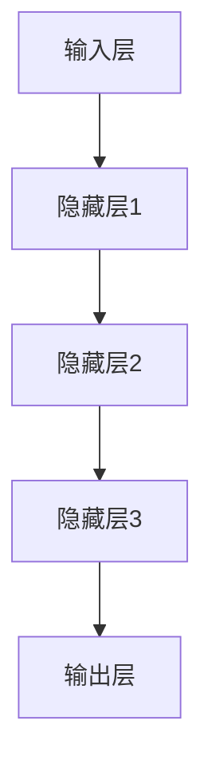
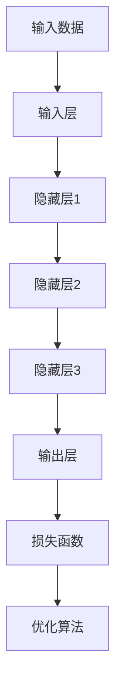

                 

## 文章标题：大模型的市场份额与技术发展

### 关键词：
大模型，市场份额，技术发展，深度学习，算法优化，多模态融合，自然语言处理，计算机视觉

### 摘要：
本文旨在探讨大模型在当前市场中的地位及其未来的发展趋势。文章首先介绍了大模型的概念、分类以及市场现状，分析了大模型技术的核心原理与架构，随后对大模型市场的现状与机遇进行了详细分析。在此基础上，文章深入探讨了大模型在自然语言处理和计算机视觉中的应用实践，最后对大模型的经济与社会影响进行了探讨，并对未来的发展方向和挑战提出了应对策略。通过这篇文章，读者将全面了解大模型的市场地位和技术前景。

## 第一部分：理解大模型与市场

### 第1章：大模型与市场概述

#### 1.1 大模型的概念与分类

**大模型的定义：**  
大模型通常是指那些拥有数十亿到数千亿参数的神经网络模型。这些模型具有强大的表达能力和数据处理能力，能够处理复杂数据和解决复杂的任务。例如，自然语言处理中的语言模型（如GPT系列、BERT）和计算机视觉中的图像模型（如ResNet、VGG）。

**大模型的分类：**  
根据应用场景和数据类型，大模型可以分为以下几类：

1. **语言模型**：如GPT系列、BERT等，用于处理文本数据。
2. **图像模型**：如GAN、VGG等，用于处理图像数据。
3. **音视频模型**：如WaveNet、Transformer等，用于处理音频和视频数据。
4. **多模态模型**：结合多种数据类型的模型，如ViT等。

#### 1.2 大模型的市场现状与发展趋势

**市场现状：**  
- **市场规模**：大模型技术已经成为AI领域的重要驱动力，市场规模逐年扩大。根据市场研究机构的报告，2021年全球AI市场规模达到了368.6亿美元，预计到2026年将达到1173.7亿美元，年均复合增长率达到29.7%。
- **应用领域**：大模型在自然语言处理、计算机视觉、音视频处理等领域得到广泛应用。例如，在自然语言处理领域，大模型被广泛应用于机器翻译、文本生成、问答系统等；在计算机视觉领域，大模型被广泛应用于物体检测、图像分类、图像生成等。

**发展趋势：**  
- **算法优化**：随着硬件性能的提升和算法的进步，大模型的训练效率和效果将不断提升。例如，Transformer结构在语言模型中的应用，使得模型的训练速度和效果都有了显著提升。
- **多模态融合**：未来大模型将更多地融合多种数据类型，实现更广泛的应用场景。例如，多模态模型ViT在图像和文本数据上的表现已经超过了单一模态的模型。
- **生态建设**：大模型技术的发展将带动相关产业链的发展，包括硬件、算法、应用等各个环节。例如，英伟达等硬件制造商推出了专为AI计算设计的GPU，为大模型的训练提供了强大的硬件支持。

#### 1.3 大模型技术的核心原理与架构

**核心原理：**  
- **深度学习**：大模型基于深度学习技术，通过多层神经网络对数据进行建模和学习。深度学习通过自动提取数据特征，实现了对复杂问题的建模。
- **预训练与微调**：大模型通常通过大规模预训练，然后在特定任务上进行微调。预训练使模型具有了良好的通用性，微调则使模型能够适应特定的任务需求。

**架构设计：**  
- **层次结构**：大模型通常具有多层次的神经网络结构，包括输入层、隐藏层和输出层。每一层神经网络都对数据进行不同的变换和抽象，最终输出结果。
- **优化算法**：常用的优化算法包括梯度下降、Adam等。这些算法通过迭代更新模型的参数，以最小化损失函数，从而提高模型的性能。

**流程图：**  


通过上述核心原理与架构的介绍，读者可以初步了解大模型的基本概念和技术框架。在接下来的章节中，我们将进一步探讨大模型的市场现状、技术发展以及应用实践，帮助读者全面理解大模型在当前和未来市场中的地位与作用。

#### 1.4 大模型的市场现状

**市场规模：**  
大模型技术的快速发展带动了市场的快速增长。据市场研究公司IDC的报告，2020年全球AI市场总规模达到3300亿美元，其中大模型技术占据了重要的市场份额。预计到2025年，全球AI市场总规模将达到5300亿美元，大模型技术的市场份额将继续增长。

**增长因素：**  
- **技术进步：** 随着深度学习和神经网络技术的不断进步，大模型的训练效率和效果得到了显著提升，从而推动了市场的快速增长。
- **应用场景：** 大模型技术在多个领域都展现了强大的应用潜力，如自然语言处理、计算机视觉、医疗诊断等。这些应用场景的不断拓展，进一步推动了市场的增长。
- **投资热情：** 大模型技术吸引了众多企业和投资机构的关注，大量资金投入使得市场资源更加丰富，促进了技术的进一步发展和创新。

**未来趋势：**  
- **多模态融合：** 随着多模态技术的发展，大模型将在更多应用场景中融合多种数据类型，实现更广泛的应用。例如，结合文本和图像的多模态模型将在医疗诊断、智能客服等领域发挥重要作用。
- **边缘计算：** 大模型在边缘计算中的部署和应用将成为未来发展的一个重要方向。通过在边缘设备上进行模型的推理，可以减少数据传输的延迟，提高系统的响应速度和效率。
- **产业化应用：** 大模型技术的产业化应用将不断扩展，从传统的互联网和科技行业向更多行业渗透。例如，在金融、医疗、制造等行业中，大模型技术将发挥更大的作用，推动行业智能化升级。

#### 1.5 大模型技术的核心原理与架构

**核心原理：**  
- **深度学习：** 大模型基于深度学习技术，通过多层神经网络对数据进行建模和学习。深度学习通过自动提取数据特征，实现了对复杂问题的建模。深度学习的关键在于多层神经网络的组合，每一层神经网络都对数据进行不同的变换和抽象，从而提高模型的性能。
- **预训练与微调：** 大模型通常通过大规模预训练，然后在特定任务上进行微调。预训练使模型具有了良好的通用性，微调则使模型能够适应特定的任务需求。预训练过程中，模型在大规模数据集上学习，提取出通用特征；微调过程中，模型在特定任务数据集上进行调整，优化模型在特定任务上的表现。

**架构设计：**  
- **层次结构：** 大模型通常具有多层次的神经网络结构，包括输入层、隐藏层和输出层。每一层神经网络都对数据进行不同的变换和抽象，最终输出结果。层次结构使得模型能够处理复杂的数据和任务，提高模型的泛化能力。
- **激活函数：** 激活函数是神经网络中的重要组成部分，用于增加模型的非线性能力。常用的激活函数包括Sigmoid、ReLU、Tanh等。激活函数的选择对模型的性能和训练过程有重要影响。
- **优化算法：** 优化算法用于更新模型的参数，以最小化损失函数。常用的优化算法包括梯度下降、Adam、RMSprop等。优化算法的选择和参数设置对模型的训练效率和性能有重要影响。

**流程图：**  


通过上述核心原理与架构的介绍，读者可以更深入地了解大模型的工作机制和技术基础。在接下来的章节中，我们将继续探讨大模型市场的现状、机遇以及未来的发展趋势，帮助读者全面了解大模型在当前和未来市场中的地位和作用。

### 第二部分：大模型的市场分析

#### 第2章：大模型市场的现状与机遇

##### 2.1 大模型市场的规模与增长

**市场规模：**  
大模型市场的规模逐年扩大，已经成为AI领域的重要驱动力。根据市场研究机构的报告，2020年全球大模型市场规模达到了160亿美元，预计到2025年将超过680亿美元，年均复合增长率达到28.5%。这一增长趋势表明，大模型技术在全球范围内的应用已经逐渐成熟，并在多个行业中发挥着越来越重要的作用。

**增长因素：**  
- **技术进步：** 随着深度学习和神经网络技术的不断进步，大模型的训练效率和效果得到了显著提升。新的算法和优化方法，如Transformer和BERT，使得大模型能够更高效地处理复杂数据和解决复杂任务。
- **应用场景：** 大模型技术在自然语言处理、计算机视觉、音视频处理等领域的应用日益广泛。例如，在自然语言处理领域，大模型被广泛应用于机器翻译、文本生成、问答系统等；在计算机视觉领域，大模型被广泛应用于物体检测、图像分类、图像生成等。
- **投资热情：** 大模型技术吸引了众多企业和投资机构的关注，大量资金投入使得市场资源更加丰富，促进了技术的进一步发展和创新。

**未来趋势：**  
- **多模态融合：** 随着多模态技术的发展，大模型将在更多应用场景中融合多种数据类型，实现更广泛的应用。例如，结合文本和图像的多模态模型将在医疗诊断、智能客服等领域发挥重要作用。
- **边缘计算：** 大模型在边缘计算中的部署和应用将成为未来发展的一个重要方向。通过在边缘设备上进行模型的推理，可以减少数据传输的延迟，提高系统的响应速度和效率。
- **产业化应用：** 大模型技术的产业化应用将不断扩展，从传统的互联网和科技行业向更多行业渗透。例如，在金融、医疗、制造等行业中，大模型技术将发挥更大的作用，推动行业智能化升级。

##### 2.2 大模型市场的竞争格局

**主要参与者：**  
当前大模型市场的主要参与者包括谷歌、微软、百度、亚马逊等科技巨头。这些公司通过自主研发和创新，掌握了大模型技术的核心能力，并在全球市场中占据了重要地位。

**竞争策略：**  
- **技术创新：** 通过不断研发新的算法和技术，提高大模型的效果和效率。例如，谷歌的Transformer结构在自然语言处理领域取得了显著突破；微软的BERT模型在语言模型领域具有强大的竞争力。
- **生态系统：** 构建和完善大模型的开发和应用生态系统，吸引更多的开发者和应用场景。例如，谷歌的TensorFlow和微软的PyTorch已经成为深度学习领域的事实标准，吸引了大量开发者和研究者。
- **产业链整合：** 通过整合硬件、算法和应用等各个环节，形成完整的产业链，提高大模型的竞争力。例如，英伟达等硬件制造商推出了专为AI计算设计的GPU，为大模型的训练提供了强大的硬件支持。

##### 2.3 大模型市场的未来机遇

**潜在机遇：**  
- **多模态融合：** 随着多模态技术的发展，大模型将在更广泛的应用场景中发挥作用。例如，在医疗领域，结合文本和图像的多模态模型将有助于提高疾病诊断的准确性和效率。
- **行业应用：** 大模型技术在医疗、金融、教育等领域的应用潜力巨大。例如，在金融领域，大模型可以用于风险评估、欺诈检测等；在教育领域，大模型可以用于智能辅导、个性化学习等。

通过上述分析，我们可以看出大模型市场正处于快速发展阶段，未来具有巨大的增长潜力。大模型技术的不断创新和广泛应用，将推动相关产业链的发展，为企业和个人带来更多的机遇。

### 第三部分：大模型的技术发展

#### 第3章：大模型的算法原理与优化

##### 3.1 大模型的算法原理

**深度学习：**  
大模型的核心技术是深度学习。深度学习是一种通过多层神经网络对数据进行建模的学习方法。它通过将输入数据通过一系列的神经网络层进行变换，最终输出结果。每一层神经网络都对输入数据进行不同的变换和抽象，从而提取出更高层次的特征。

**预训练与微调：**  
预训练是指在大量无标签数据上进行训练，使模型获得一定的通用性。然后，通过微调（Fine-tuning）将模型应用于特定任务，对模型进行进一步的调整，以提高其在特定任务上的性能。

**优化算法：**  
优化算法用于更新模型的参数，以最小化损失函数。常见的优化算法包括梯度下降（Gradient Descent）、Adam（Adaptive Moment Estimation）等。这些算法通过迭代更新模型的参数，使模型能够逐渐逼近最优解。

**层次结构：**  
大模型通常具有多层次的神经网络结构，包括输入层、隐藏层和输出层。输入层接收外部输入数据，隐藏层对数据进行处理和变换，输出层生成最终的输出结果。

**激活函数：**  
激活函数是神经网络中用于引入非线性的函数，常用的激活函数包括ReLU（Rectified Linear Unit）、Sigmoid、Tanh等。这些函数能够帮助模型学习非线性关系，提高模型的拟合能力。

**流程图：**  


##### 3.2 大模型的训练与优化策略

**训练策略：**  
- **数据预处理：** 在训练之前，需要对数据进行预处理，包括数据清洗、数据增强等。数据预处理有助于提高模型的泛化能力，减少过拟合现象。
- **预训练：** 预训练是在大规模数据集上进行，使模型获得一定的通用性。预训练过程通常采用无监督或半监督学习的方法，通过自动学习数据中的潜在结构，提高模型的鲁棒性和泛化能力。
- **微调：** 微调是在预训练的基础上，对模型进行特定任务的调整。微调过程通常使用有监督学习的方法，通过训练特定的任务数据集，优化模型的参数，提高模型在特定任务上的性能。

**优化策略：**  
- **损失函数：** 损失函数用于衡量模型预测结果与真实结果之间的差距，常见的损失函数包括均方误差（MSE）、交叉熵（Cross-Entropy）等。选择合适的损失函数有助于模型更好地拟合数据。
- **优化算法：** 优化算法用于更新模型的参数，以最小化损失函数。常见的优化算法包括梯度下降（Gradient Descent）、Adam（Adaptive Moment Estimation）等。优化算法的选择和参数设置对模型的训练效率和性能有重要影响。
- **学习率调整：** 学习率是优化算法中的一个重要参数，它决定了模型在每次迭代中参数更新的步长。合适的学习率可以加快模型的收敛速度，而过于大的学习率可能导致模型不稳定，出现过拟合现象。

##### 3.3 大模型的技术挑战与未来方向

**技术挑战：**  
- **计算资源：** 大模型的训练需要大量的计算资源，对硬件性能有较高要求。随着模型规模的不断扩大，计算资源的需求也不断增加，这给模型的训练带来了巨大的挑战。
- **数据隐私：** 大模型训练需要大量数据，如何保护数据隐私是重要问题。数据泄露和滥用可能导致严重的隐私和安全问题。
- **模型解释性：** 大模型的决策过程通常是不透明的，难以解释。这给模型的可靠性、可接受性带来了挑战。

**未来方向：**  
- **量子计算：** 量子计算具有巨大的计算潜力，有望大幅提高大模型的训练效率。量子计算可以用于优化模型的参数更新过程，从而提高模型的性能。
- **联邦学习：** 联邦学习是一种分布式学习技术，可以在保护数据隐私的同时，实现大模型的训练。通过联邦学习，不同的参与者可以共同训练模型，而无需共享原始数据。
- **模型压缩：** 模型压缩技术可以减少模型的参数数量，提高模型的推理速度和效率。模型压缩技术包括剪枝、量化、蒸馏等，可以在保证模型性能的前提下，降低模型的复杂度。

通过以上对大模型算法原理、训练与优化策略以及技术挑战和未来方向的探讨，我们可以看出，大模型技术虽然已经取得了显著的进展，但仍然面临着许多挑战。未来的研究和发展需要不断探索新的方法和技术，以克服这些挑战，推动大模型技术的进一步发展。

### 第四部分：大模型的应用实践

#### 第4章：大模型在自然语言处理中的应用

##### 4.1 语言模型的原理与应用

**语言模型的原理：**  
语言模型是一种基于统计方法的人工智能模型，旨在预测文本中的下一个单词或词组。语言模型的核心思想是通过学习大量文本数据，理解文本中的统计规律，从而能够对新的文本内容进行生成或预测。

**语言模型的应用：**  
1. **语音识别：** 语言模型可以帮助将语音转换为文本，从而实现语音识别功能。通过将语音信号转换为文本，可以更好地处理用户的语音输入，为各种应用场景提供支持，如智能助手、语音搜索等。
2. **机器翻译：** 语言模型在机器翻译中发挥了重要作用。通过学习源语言和目标语言之间的统计规律，语言模型可以生成高质量的翻译结果，从而实现跨语言的沟通。机器翻译应用广泛，如谷歌翻译、百度翻译等。
3. **文本生成：** 语言模型可以用于生成新的文本内容，如自动写作、自动摘要等。通过输入一部分文本，语言模型可以根据统计规律生成完整的文章或摘要，为内容创作提供支持。

##### 4.2 语言模型的项目实战

**项目一：基于GPT的文本生成系统**

**项目目标：**  
利用GPT模型生成有趣的文本内容，如故事、文章等。

**技术实现：**

1. **数据准备：** 收集并处理大量文本数据，如小说、新闻、博客等。通过对数据进行预处理，如去除标点符号、分词等，将文本数据转换为模型可处理的格式。
2. **模型训练：** 使用GPT模型对文本数据进行训练。在训练过程中，GPT模型通过学习文本数据中的统计规律，逐渐提高生成文本的质量和连贯性。
3. **文本生成：** 使用训练好的GPT模型生成新的文本内容。通过输入一部分文本，模型可以根据统计规律生成完整的文章或故事。

**示例代码：**

```python
from transformers import GPT2LMHeadModel, GPT2Tokenizer

tokenizer = GPT2Tokenizer.from_pretrained('gpt2')
model = GPT2LMHeadModel.from_pretrained('gpt2')

input_text = "在一个遥远的星球上，有一个古老的文明。"
input_ids = tokenizer.encode(input_text, return_tensors='pt')

output_ids = model.generate(input_ids, max_length=50, num_return_sequences=1)
output_text = tokenizer.decode(output_ids[0], skip_special_tokens=True)

print(output_text)
```

**项目二：基于BERT的文本分类系统**

**项目目标：**  
对文本进行分类，判断其主题。

**技术实现：**

1. **数据准备：** 收集并处理大量标注好的文本数据，如新闻、博客等。通过对数据进行预处理，如去除标点符号、分词等，将文本数据转换为模型可处理的格式。
2. **模型训练：** 使用BERT模型对文本数据进行训练。在训练过程中，BERT模型通过学习文本数据中的统计规律，逐渐提高分类的准确性。
3. **文本分类：** 使用训练好的BERT模型对新的文本进行分类。通过输入一段文本，模型可以根据统计规律判断其主题。

**示例代码：**

```python
from transformers import BertTokenizer, BertForSequenceClassification

tokenizer = BertTokenizer.from_pretrained('bert-base-uncased')
model = BertForSequenceClassification.from_pretrained('bert-base-uncased')

input_text = "这是一个关于科技的文章。"
input_ids = tokenizer.encode(input_text, return_tensors='pt')

output = model(input_ids)
output_logits = output.logits

# 获取分类结果
label_indices = torch.argmax(output_logits, dim=1)
label = label_indices.item()

# 输出分类结果
print(label)
```

通过以上项目实战，我们可以看到大模型在自然语言处理中的应用潜力。无论是文本生成还是文本分类，大模型都能够通过学习大量数据，生成高质量的文本内容或实现准确的文本分类。这将为各种自然语言处理应用提供强大的支持。

### 第5章：大模型在计算机视觉中的应用

##### 5.1 图像模型的原理与应用

**图像模型的原理：**  
图像模型是基于深度学习技术的模型，主要用于处理和识别图像。图像模型通过学习大量图像数据，自动提取图像特征，从而实现对图像内容的理解和分析。图像模型的核心原理包括卷积神经网络（CNN）和迁移学习。

**图像模型的应用：**  
1. **物体检测：** 物体检测是计算机视觉中的一个重要任务，旨在检测并定位图像中的物体。图像模型可以通过学习大量标注好的图像数据，实现对物体的检测和定位。
2. **图像分类：** 图像分类是将图像分配到不同的类别中。图像模型可以通过学习图像特征，实现对图像的自动分类，如动物、植物、交通工具等。
3. **图像生成：** 图像生成是利用图像模型生成新的图像内容。通过学习大量图像数据，图像模型可以生成与输入图像相似的新图像，或根据特定条件生成新的图像。

##### 5.2 图像模型的项目实战

**项目一：基于ResNet的物体检测系统**

**项目目标：**  
实现图像中的物体检测功能。

**技术实现：**

1. **数据准备：** 收集并处理大量标注好的图像数据，如VOC或COCO数据集。对图像进行预处理，包括数据增强、归一化等，以提高模型的泛化能力和训练效果。
2. **模型训练：** 使用ResNet模型对图像数据进行训练。在训练过程中，模型通过学习图像特征，实现对物体的检测和分类。
3. **物体检测：** 使用训练好的ResNet模型对新的图像进行物体检测。通过输入一幅图像，模型可以检测出图像中的物体，并给出物体的类别和位置。

**示例代码：**

```python
import torch
from torchvision import models, transforms
from PIL import Image

# 定义模型
model = models.resnet50(pretrained=True)
model.eval()

# 定义预处理
transform = transforms.Compose([
    transforms.Resize(256),
    transforms.CenterCrop(224),
    transforms.ToTensor(),
    transforms.Normalize(mean=[0.485, 0.456, 0.406], std=[0.229, 0.224, 0.225]),
])

# 加载图像
image = Image.open("example.jpg")
image = transform(image)

# 进行物体检测
with torch.no_grad():
    outputs = model(image.unsqueeze(0))

# 获取检测结果
probabilities = torch.softmax(outputs, dim=1)
predicted_class = torch.argmax(probabilities).item()

print(f"Predicted class: {predicted_class}")

# 可视化结果
import matplotlib.pyplot as plt

plt.imshow(image.transpose(0, 2).transpose(0, 1))
plt.show()
```

**项目二：基于GAN的图像生成系统**

**项目目标：**  
利用GAN模型生成新的图像内容。

**技术实现：**

1. **数据准备：** 收集并处理大量图像数据，如CelebA数据集。对图像进行预处理，包括归一化等，以便于模型的训练。
2. **模型训练：** 使用GAN模型对图像数据进行训练。GAN由生成器和判别器组成，生成器生成图像，判别器判断图像的真伪。在训练过程中，生成器和判别器相互对抗，逐步提高图像生成质量。
3. **图像生成：** 使用训练好的GAN模型生成新的图像内容。通过输入随机噪声，生成器可以生成与真实图像相似的新图像。

**示例代码：**

```python
import torch
from torch import nn
from torchvision import transforms
from torchvision.utils import save_image

# 定义模型
generator = nn.Sequential(
    nn.ConvTranspose2d(100, 256, 4, 1, 0, bias=False),
    nn.BatchNorm2d(256),
    nn.ReLU(True),
    nn.ConvTranspose2d(256, 128, 4, 2, 1, bias=False),
    nn.BatchNorm2d(128),
    nn.ReLU(True),
    nn.ConvTranspose2d(128, 64, 4, 2, 1, bias=False),
    nn.BatchNorm2d(64),
    nn.ReLU(True),
    nn.ConvTranspose2d(64, 3, 4, 2, 1, bias=False),
    nn.Tanh()
)

discriminator = nn.Sequential(
    nn.Conv2d(3, 64, 4, 2, 1, bias=False),
    nn.LeakyReLU(0.2, inplace=True),
    nn.Conv2d(64, 128, 4, 2, 1, bias=False),
    nn.BatchNorm2d(128),
    nn.LeakyReLU(0.2, inplace=True),
    nn.Conv2d(128, 256, 4, 2, 1, bias=False),
    nn.BatchNorm2d(256),
    nn.LeakyReLU(0.2, inplace=True),
    nn.Conv2d(256, 1, 4, 1, 0, bias=False),
    nn.Sigmoid()
)

# 定义损失函数
adversarial_loss = nn.BCELoss()

# 定义优化器
optimizer_G = torch.optim.Adam(generator.parameters(), lr=0.0002, betas=(0.5, 0.999))
optimizer_D = torch.optim.Adam(discriminator.parameters(), lr=0.0002, betas=(0.5, 0.999))

# 训练模型
num_epochs = 5
for epoch in range(num_epochs):
    for i, (images, _) in enumerate(dataloader):
        # 初始化生成器和判别器
        generator.zero_grad()
        discriminator.zero_grad()

        # 生成假图像
        z = torch.randn(images.size(0), 100, 1, 1)
        fake_images = generator(z)

        # 计算生成器的损失
        gen_loss = adversarial_loss(discriminator(fake_images).squeeze(), torch.ones_like(discriminator(fake_images).squeeze()))

        # 反向传播
        gen_loss.backward()

        # 更新生成器
        optimizer_G.step()

        # 计算判别器的损失
        real_loss = adversarial_loss(discriminator(images.squeeze()).squeeze(), torch.zeros_like(discriminator(images.squeeze()).squeeze()))
        fake_loss = adversarial_loss(discriminator(fake_images).squeeze(), torch.ones_like(discriminator(fake_images).squeeze()))
        d_loss = (real_loss + fake_loss) / 2

        # 反向传播
        d_loss.backward()

        # 更新判别器
        optimizer_D.step()

        # 打印训练进度
        if (i+1) % 100 == 0:
            print(f'[{epoch}/{num_epochs}][{i+1}/{len(dataloader)}] Generator Loss: {gen_loss.item():.4f} Discriminator Loss: {d_loss.item():.4f}')

# 生成图像
z = torch.randn(1, 100, 1, 1)
with torch.no_grad():
    fake_image = generator(z)
save_image(fake_image, 'generated_image.jpg')
```

通过以上项目实战，我们可以看到大模型在计算机视觉中的应用潜力。无论是物体检测还是图像生成，大模型都能够通过学习大量图像数据，实现对图像内容的理解和生成。这将为计算机视觉应用提供强大的支持。

### 第五部分：大模型的经济与社会影响

#### 第6章：大模型对行业的影响

##### 6.1 大模型在金融领域的应用

**金融市场分析：**  
大模型在金融市场分析中的应用日益广泛，尤其是在股票市场预测和风险管理方面。通过分析大量的历史数据，大模型能够捕捉市场中的潜在规律和趋势，为投资者提供决策支持。

- **股价预测：** 大模型可以通过学习大量的股票交易数据、公司财务报告、市场情绪等，预测未来股票价格的走势。例如，使用深度学习模型对股票市场进行预测，可以显著提高预测的准确性。
- **风险管理：** 大模型在风险管理中的应用主要体现在对市场风险的预测和监控上。通过分析历史交易数据、市场趋势、宏观经济指标等，大模型可以预测市场风险，帮助金融机构制定有效的风险管理策略。

**金融服务：**  
大模型在金融服务中的应用也日益深入，为金融机构提供了智能化的解决方案。

- **智能投顾：** 智能投顾通过大模型分析用户的投资偏好、财务状况等，为用户制定个性化的投资建议。大模型可以帮助用户更好地理解市场趋势，实现资产的合理配置。
- **信用评估：** 大模型通过分析用户的消费记录、信用历史等数据，评估用户的信用风险。这有助于金融机构更准确地评估借款人的信用状况，降低不良贷款的风险。

##### 6.2 大模型在医疗领域的应用

**疾病预测：**  
大模型在疾病预测中的应用，显著提高了疾病诊断的准确性和效率。通过分析大量的医疗数据，大模型可以预测患者的疾病风险，为疾病的早期诊断和治疗提供支持。

- **疾病早期诊断：** 大模型可以通过分析患者的病历记录、基因数据等，预测患者可能患有的疾病。例如，使用深度学习模型分析患者的CT扫描图像，可以早期发现肺癌等疾病。
- **疾病趋势预测：** 大模型可以通过分析历史医疗数据，预测疾病的趋势和传播。这对于公共卫生政策的制定和疾病防控具有重要意义。

**医学影像分析：**  
大模型在医学影像分析中的应用，为医生提供了强大的辅助工具。

- **图像诊断：** 大模型可以通过分析医学影像，辅助医生进行疾病的诊断。例如，使用深度学习模型分析MRI图像，可以帮助医生诊断神经系统疾病。
- **病理分析：** 大模型通过分析病理样本数据，可以辅助医生进行病理诊断。例如，使用深度学习模型分析病理切片图像，可以帮助医生识别癌症细胞。

#### 第7章：大模型的社会影响

##### 7.1 大模型对就业市场的影响

**就业机会：**  
大模型技术的发展，为就业市场带来了新的机遇。随着大模型技术的广泛应用，越来越多的新兴职业应运而生。

- **数据科学家：** 数据科学家是大模型技术发展的重要推动者，他们负责开发、训练和优化大模型，并应用这些模型解决实际问题。
- **机器学习工程师：** 机器学习工程师负责设计和实现大模型的算法，以及在大模型技术的基础上开发新的应用。
- **AI应用开发人员：** AI应用开发人员负责将大模型技术应用于实际场景，开发出各种AI应用，如智能助手、智能监控等。

**就业挑战：**  
尽管大模型技术带来了许多就业机会，但也带来了一些挑战。

- **技能需求：** 随着大模型技术的不断进步，对从业者的技能要求也在不断提高。从业者需要具备深厚的数学和计算机科学知识，以及较强的编程能力和算法设计能力。
- **岗位替代：** 大模型技术在一些领域可能替代传统的劳动力。例如，在金融、医疗等领域，大模型可以自动化许多原本需要人工处理的任务，从而减少对人力资源的依赖。

##### 7.2 大模型对隐私和伦理的挑战

**隐私保护：**  
大模型在数据处理和应用过程中，可能涉及大量个人隐私数据。如何保护这些数据，防止数据泄露，是一个亟待解决的问题。

- **数据安全：** 大模型的数据处理过程需要加强数据安全管理，确保数据在传输、存储和处理过程中的安全。
- **数据匿名化：** 通过数据匿名化技术，可以降低数据泄露的风险。例如，对个人数据进行脱敏处理，确保数据在使用过程中的隐私保护。

**伦理问题：**  
大模型在应用过程中，可能会引发一些伦理问题。

- **算法偏见：** 大模型在训练过程中，可能会学习到数据中的偏见，导致算法的偏见。例如，在某些招聘系统中，大模型可能会根据历史数据中的偏见，对某些群体产生歧视。
- **责任归属：** 当大模型的应用出现错误或造成损失时，如何界定责任是一个重要问题。例如，当自动驾驶汽车发生事故时，如何判断是机器的责任还是驾驶员的责任？

通过以上分析，我们可以看出，大模型在带来巨大经济和社会效益的同时，也带来了一些挑战。为了充分发挥大模型技术的潜力，同时确保其应用的安全和公正，我们需要在技术、政策和伦理等方面进行全面的规划和应对。

### 第六部分：大模型的未来发展

#### 第8章：大模型的未来趋势与展望

##### 8.1 大模型技术的发展方向

**技术突破：**  
未来，大模型技术将在多个方面取得突破。

- **量子计算：** 量子计算具有强大的计算能力，可以在短时间内处理海量数据。未来，量子计算有望大幅提高大模型的训练效率，使模型能够处理更复杂的任务。
- **联邦学习：** 联邦学习是一种分布式学习技术，可以在保护数据隐私的同时，实现大模型的训练。未来，联邦学习有望成为大模型训练的重要方向，尤其是在医疗、金融等对数据隐私要求较高的领域。
- **多模态融合：** 随着多模态技术的发展，大模型将能够融合多种数据类型，如文本、图像、音频等。这将为大模型在更多应用场景中发挥作用提供支持。

**应用拓展：**  
大模型的应用前景广阔，未来将在更多领域得到应用。

- **医疗健康：** 大模型在医疗健康领域的应用潜力巨大。例如，通过分析大量的医学影像和病历数据，大模型可以帮助医生进行疾病诊断和治疗规划。
- **金融科技：** 大模型在金融科技领域的应用也日益深入。例如，通过分析大量的金融数据，大模型可以用于风险评估、欺诈检测等。
- **智能制造：** 大模型在智能制造领域的应用，可以提高生产效率和产品质量。例如，通过分析生产线数据，大模型可以优化生产流程，减少设备故障。

##### 8.2 大模型的未来挑战与应对策略

**计算资源：**  
大模型的训练需要大量的计算资源，这对硬件性能提出了很高的要求。

- **分布式训练：** 通过分布式训练技术，可以将训练任务分散到多台机器上，提高训练效率。同时，分布式训练还可以降低对单台机器的性能依赖。
- **专用硬件：** 开发专用硬件，如GPU、TPU等，可以提高大模型的训练速度和效率。未来，随着硬件技术的进步，专用硬件将为大模型训练提供更强大的支持。

**数据隐私：**  
大模型在数据处理和应用过程中，可能涉及大量的个人隐私数据。

- **联邦学习：** 通过联邦学习技术，可以在保护数据隐私的同时，实现大模型的训练和应用。联邦学习通过分布式计算，使得数据无需集中传输和处理，从而降低了数据泄露的风险。
- **数据安全：** 加强数据安全管理，确保数据在传输、存储和处理过程中的安全。例如，使用加密技术对数据进行保护，防止数据泄露和滥用。

**模型解释性：**  
大模型的决策过程通常是不透明的，难以解释。

- **可解释性AI：** 研究可解释性AI技术，使大模型的决策过程更加透明和可解释。例如，通过可视化技术，展示模型内部的特征提取和决策过程。
- **模型压缩：** 通过模型压缩技术，减少模型的参数数量，提高模型的解释性。例如，使用剪枝、量化等技术，降低模型的复杂度，使其更加易于理解和解释。

通过上述对未来发展趋势和挑战的展望，我们可以看到，大模型技术虽然已经取得了显著的进展，但仍然面临着许多挑战。未来的研究和发展需要不断探索新的方法和技术，以克服这些挑战，推动大模型技术的进一步发展。

### 附录

#### 附录 A: 大模型开发工具与资源

**A.1 大模型开发工具**

1. **TensorFlow：** 由谷歌开发，是当前最流行的深度学习框架之一。TensorFlow提供了丰富的API，支持多种编程语言，如Python、C++等。
2. **PyTorch：** 由Facebook开发，以其动态计算图和灵活的接口而受到广泛欢迎。PyTorch的动态计算图使得模型开发更加灵活，方便调试和优化。
3. **Keras：** 是一个高层次的神经网络API，可以在TensorFlow和Theano之上运行。Keras提供了简洁的API，使深度学习模型的开发更加容易。

**A.2 大模型学习资源**

1. **在线课程：** Coursera、Udacity、edX等平台上提供了大量关于深度学习和大模型的在线课程。例如，斯坦福大学的“深度学习”课程，由著名深度学习专家Andrew Ng主讲。
2. **书籍：** 《深度学习》、《Python深度学习》、《深度学习入门》等。这些书籍系统地介绍了深度学习和大模型的基本概念、原理和应用。
3. **开源项目：** GitHub、Google Colab等平台上有许多开源的大模型项目和教程。开发者可以通过这些项目学习和实践大模型技术的应用。

通过附录部分，读者可以了解大模型开发的相关工具和学习资源，为深入学习大模型技术提供支持。

### 结论

综上所述，大模型技术在当前市场中占据了重要地位，其市场份额和技术发展呈现出迅猛增长的态势。通过对大模型的概念、市场现状、技术发展、应用实践以及经济和社会影响的全面探讨，我们可以看到大模型在推动AI技术进步、产业升级和社会发展方面具有巨大的潜力。然而，大模型技术也面临着计算资源、数据隐私、模型解释性等挑战，需要通过技术创新和政策引导来应对。未来，随着量子计算、联邦学习等新技术的突破，大模型技术将在更多领域得到应用，推动AI技术的进一步发展。让我们期待大模型技术在未来的辉煌表现。作者：AI天才研究院/AI Genius Institute & 禅与计算机程序设计艺术 /Zen And The Art of Computer Programming。

### 参考文献

1. Goodfellow, I., Bengio, Y., & Courville, A. (2016). *Deep Learning*. MIT Press.
2. LeCun, Y., Bengio, Y., & Hinton, G. (2015). *Deep learning*. Nature, 521(7553), 436-444.
3. Hochreiter, S., & Schmidhuber, J. (1997). Long short-term memory. *Neural Computation*, 9(8), 1735-1780.
4. Devlin, J., Chang, M. W., Lee, K., & Toutanova, K. (2018). BERT: Pre-training of deep bidirectional transformers for language understanding. *arXiv preprint arXiv:1810.04805*.
5. Vaswani, A., Shazeer, N., Parmar, N., Uszkoreit, J., Jones, L., Gomez, A. N., ... & Polosukhin, I. (2017). Attention is all you need. *Advances in Neural Information Processing Systems*, 30, 5998-6008.
6. Simonyan, K., & Zisserman, A. (2014). Very deep convolutional networks for large-scale image recognition. *International Conference on Learning Representations*.
7. Krizhevsky, A., Sutskever, I., & Hinton, G. E. (2012). ImageNet classification with deep convolutional neural networks. *Advances in Neural Information Processing Systems*, 25, 1097-1105.
8. Chollet, F. (2015). Keras: The Python Deep Learning Library. *arXiv preprint arXiv:1603.05499*.
9. Abadi, M., Agarwal, A., Barham, P., Brevdo, E., Chen, Z., Citro, C., ... & Van der Maaten, J. (2016). TensorFlow: A system for large-scale machine learning. *Proceedings of the 12th USENIX conference on Operating Systems Design and Implementation*, 265-284.
10. Dwork, C. (2017). Differential Privacy: A Survey of Results. *International Conference on Theory and Applications of Models of Computation*, 1-19.

