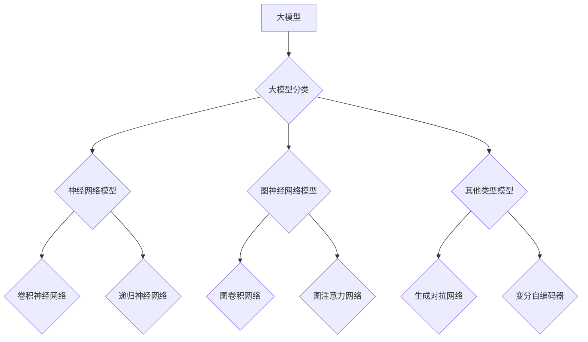

                 

# 文章标题：大模型的市场化进程

> 关键词：大模型、市场化、应用案例、商业模式、竞争策略、商业化路径

> 摘要：本文从大模型的技术基础出发，探讨其市场化进程中的关键环节，包括大模型的训练与优化、安全与伦理问题、行业应用案例、产品化策略、商业模式创新、市场竞争策略和商业化路径。通过分析大模型在不同行业中的实际应用，以及其市场化的挑战与机遇，本文旨在为大模型的市场化提供有益的指导和思考。

## 第一部分：大模型技术基础

### 第1章：大模型概述

#### 1.1 大模型的发展历程

大模型（Large-scale Model）是指参数量达到亿级或以上的机器学习模型，随着计算能力和数据量的增长，大模型在各个领域展现了强大的潜力。从20世纪50年代早期的人工智能研究到20世纪80年代的专家系统，再到21世纪初的深度学习革命，大模型的发展历程经历了多个阶段。

**1.1.1 从小模型到大规模模型的演变**

- **早期模型**：在20世纪50年代和60年代，AI研究者主要使用小规模的知识表示和推理算法。
- **专家系统**：20世纪70年代，专家系统开始出现，其核心是小规模规则和知识的集合。
- **深度学习革命**：21世纪初，深度学习的崛起，特别是卷积神经网络（CNN）和递归神经网络（RNN）的出现，使得大规模模型的训练成为可能。

**1.1.2 大模型的基本原理**

大模型通常基于深度学习技术，其基本原理包括：

- **多层神经网络**：通过增加网络层数，提高模型的表示能力。
- **大规模参数**：参数量达到亿级或以上，能够捕捉复杂的数据特征。
- **大数据训练**：使用海量数据训练模型，提高模型的泛化能力。

**1.1.3 大模型的技术特点**

- **计算资源需求大**：大规模参数和多层结构导致计算资源需求显著增加。
- **数据需求高**：需要大量标注数据进行训练，以提高模型的准确性和泛化能力。
- **模型优化复杂**：涉及多种优化算法和策略，如梯度下降、学习率调整、批量大小选择等。

#### 1.2 大模型的分类

大模型可以根据不同的标准进行分类，常见的分类方法包括基于神经网络的模型、基于图神经网络的模型以及其他类型的模型。

**1.2.1 基于神经网络的模型**

- **卷积神经网络（CNN）**：广泛应用于图像处理领域。
- **递归神经网络（RNN）**：适用于序列数据处理，如自然语言处理。
- **Transformer模型**：一种基于自注意力机制的模型，广泛应用于自然语言处理和计算机视觉。

**1.2.2 基于图神经网络的模型**

- **图卷积网络（GCN）**：在图结构数据上应用卷积操作，适用于社交网络、推荐系统等。
- **图注意力网络（GAT）**：通过注意力机制捕捉节点间的复杂关系。

**1.2.3 其他类型的模型**

- **生成对抗网络（GAN）**：用于生成数据，在图像生成和增强学习等领域应用广泛。
- **变分自编码器（VAE）**：用于数据生成和分布学习。

#### 1.3 大模型的应用领域

大模型在各个领域展现出了强大的应用潜力，以下是一些主要的应用领域：

**1.3.1 自然语言处理**

- **机器翻译**：如Google翻译等。
- **文本生成**：如生成新闻、文章等。
- **问答系统**：如智能客服、智能问答等。

**1.3.2 计算机视觉**

- **图像分类**：如识别动物、物体等。
- **目标检测**：如自动驾驶中的车辆检测。
- **图像生成**：如生成人脸、风景等。

**1.3.3 语音识别**

- **语音识别**：将语音转换为文字。
- **语音合成**：将文本转换为自然语音。

### 第2章：大模型的训练与优化

#### 2.1 大模型的训练过程

大模型的训练过程包括数据预处理、模型参数初始化、损失函数的选择和优化算法的选择等关键步骤。

**2.1.1 数据预处理**

- **数据清洗**：去除噪声数据、缺失值填充等。
- **数据增强**：通过旋转、缩放、裁剪等操作增加数据多样性。
- **数据标准化**：将数据缩放到一个固定范围，如[0, 1]。

**2.1.2 模型参数初始化**

- **权重初始化**：常用的方法有随机初始化、高斯分布初始化等。
- **偏置初始化**：通常初始化为0或一个小的常数。

**2.1.3 损失函数的选择**

- **均方误差（MSE）**：常用于回归问题。
- **交叉熵（Cross-Entropy）**：常用于分类问题。
- **对抗损失**：在GAN中使用，用于生成器和判别器的训练。

**2.1.4 优化算法的选择**

- **梯度下降（Gradient Descent）**：最简单的优化算法，通过梯度方向更新参数。
- **动量梯度下降**：引入动量项，提高收敛速度。
- **Adam优化器**：结合了自适应学习率和惯性项，广泛应用于深度学习。

#### 2.2 大模型的优化策略

**2.2.1 批处理大小**

- **小批量**：减少方差，提高训练稳定性。
- **大批量**：降低梯度估计误差，提高模型性能。

**2.2.2 学习率调整**

- **固定学习率**：简单，但容易陷入局部最优。
- **学习率衰减**：随训练进展逐渐减小学习率，提高收敛速度。

**2.2.3 正则化技术**

- **L1正则化**：引入L1范数，促进稀疏解。
- **L2正则化**：引入L2范数，减少过拟合。
- **Dropout**：在训练过程中随机丢弃部分神经元，防止过拟合。

**2.2.4 模型压缩技术**

- **剪枝（Pruning）**：去除模型中不重要的权重。
- **量化（Quantization）**：降低模型参数的精度。
- **蒸馏（Distingushing）**：将大模型的知识传递给小模型。

### 第3章：大模型的安全与伦理问题

#### 3.1 大模型的安全性

**3.1.1 模型漏洞分析**

- **模型泄露**：模型在输出中包含敏感信息。
- **模型篡改**：攻击者通过微小扰动改变模型输出。

**3.1.2 模型攻击与防御**

- **对抗攻击**：通过构造对抗样本攻击模型。
- **防御方法**：对抗训练、对抗样本检测等。

**3.1.3 模型隐私保护**

- **差分隐私**：添加噪声保护用户隐私。
- **联邦学习**：在保护数据隐私的前提下进行模型训练。

#### 3.2 大模型的伦理问题

**3.2.1 模型偏见与歧视**

- **数据偏见**：训练数据中的偏见导致模型偏见。
- **解决方案**：数据清洗、增加多样性、算法改进等。

**3.2.2 模型透明性与可解释性**

- **透明性**：用户了解模型的决策过程。
- **可解释性**：解释模型输出和决策原因。

**3.2.3 模型责任归属**

- **责任分配**：确定模型开发者、用户等责任。

## 第二部分：大模型的市场化实践

### 第4章：大模型在行业中的应用案例

#### 4.1 大模型在金融行业的应用

**4.1.1 风险评估**

- **信用评分**：通过分析用户历史数据，评估信用风险。
- **欺诈检测**：使用深度学习模型检测异常交易行为。

**4.1.2 投资策略**

- **量化交易**：利用大数据分析和预测市场趋势。
- **风险管理**：评估投资组合的风险和收益。

**4.1.3 客户服务**

- **智能客服**：使用自然语言处理技术提供24/7的客户服务。
- **个性化推荐**：根据用户行为和偏好推荐金融产品。

#### 4.2 大模型在医疗行业的应用

**4.2.1 疾病诊断**

- **影像诊断**：使用深度学习模型分析医学影像，辅助医生诊断疾病。
- **基因组分析**：分析基因组数据，预测疾病风险。

**4.2.2 药物研发**

- **药物设计**：通过分子模拟和计算化学预测药物活性。
- **临床试验**：优化临床试验设计，提高药物研发效率。

**4.2.3 医疗资源优化**

- **患者分配**：根据患者病情和医疗资源情况，优化医院资源分配。
- **医疗服务优化**：优化医疗服务流程，提高服务质量。

#### 4.3 大模型在制造行业的应用

**4.3.1 生产优化**

- **生产计划**：通过预测需求，优化生产计划和库存管理。
- **质量控制**：使用深度学习模型检测产品质量，提高生产效率。

**4.3.2 质量控制**

- **故障预测**：通过数据分析和预测，提前预测设备故障，减少停机时间。
- **质量检测**：使用图像处理技术，自动检测产品缺陷。

**4.3.3 设备维护**

- **预防性维护**：通过预测设备故障，进行预防性维护，延长设备寿命。
- **智能调度**：优化设备使用时间，提高生产效率。

### 第5章：大模型产品化策略

#### 5.1 大模型产品化的目标

**5.1.1 提升用户体验**

- **个性化服务**：根据用户行为和偏好，提供个性化推荐和服务。
- **高效响应**：使用深度学习模型，快速响应用户需求。

**5.1.2 扩大市场份额**

- **差异化产品**：提供具有竞争优势的产品和服务。
- **市场拓展**：通过国际化拓展，扩大市场份额。

**5.1.3 提高盈利能力**

- **降低成本**：通过自动化和优化，降低运营成本。
- **增加收入**：通过新的商业模式，增加收入来源。

#### 5.2 大模型产品化的关键环节

**5.2.1 模型选择与优化**

- **模型选择**：根据应用场景，选择合适的模型。
- **模型优化**：通过调参和算法改进，提高模型性能。

**5.2.2 数据集建设**

- **数据收集**：收集高质量的训练数据。
- **数据标注**：对数据进行精确标注，保证数据质量。

**5.2.3 算法调优**

- **损失函数**：选择合适的损失函数，提高模型性能。
- **优化算法**：选择高效的优化算法，提高训练速度。

**5.2.4 产品设计与迭代**

- **用户研究**：了解用户需求和偏好。
- **产品设计**：设计用户友好的产品界面。
- **迭代优化**：根据用户反馈，不断优化产品。

### 第6章：大模型的商业模式创新

#### 6.1 大模型商业模式概述

**6.1.1 B2B模式**

- **定制化服务**：为企业提供定制化的解决方案。
- **技术合作**：与企业合作，共同开发应用场景。

**6.1.2 B2C模式**

- **直接销售**：直接向消费者销售产品和服务。
- **订阅模式**：提供订阅服务，持续收取费用。

**6.1.3 公共服务平台模式**

- **开放API**：提供API接口，供开发者调用。
- **数据共享**：共享训练数据和模型，促进共同发展。

#### 6.2 大模型商业模式创新案例分析

**6.2.1 案例一：XX公司的AI语音助手**

- **B2C模式**：面向消费者提供智能语音助手服务。
- **商业模式创新**：通过语音识别和自然语言处理技术，实现人机交互的便捷性。

**6.2.2 案例二：XX公司的AI医疗诊断系统**

- **B2B模式**：为医院和诊所提供AI辅助诊断系统。
- **商业模式创新**：通过数据共享和合作，提升诊断准确性和效率。

**6.2.3 案例三：XX公司的AI自动驾驶解决方案**

- **B2B模式**：为汽车制造商提供自动驾驶技术。
- **商业模式创新**：通过技术合作和产品集成，推动自动驾驶技术的发展。

### 第7章：大模型市场的竞争策略

#### 7.1 大模型市场的竞争格局

**7.1.1 市场领导者**

- **优势**：技术领先、市场份额大。
- **挑战**：保持创新能力，应对竞争对手的挑战。

**7.1.2 市场挑战者**

- **优势**：技术进步快、市场反应灵活。
- **挑战**：获取市场份额，提升品牌知名度。

**7.1.3 市场追随者**

- **优势**：跟随市场领导者，降低研发成本。
- **挑战**：保持技术竞争力，避免被淘汰。

#### 7.2 大模型竞争策略分析

**7.2.1 产品差异化策略**

- **技术创新**：持续投入研发，推出具有竞争力的新产品。
- **用户体验**：优化产品界面，提升用户满意度。

**7.2.2 市场细分策略**

- **应用场景**：针对不同应用场景，提供定制化解决方案。
- **用户群体**：针对不同用户群体，提供差异化产品和服务。

**7.2.3 品牌建设策略**

- **品牌知名度**：通过广告宣传和社交媒体提升品牌知名度。
- **品牌形象**：通过社会责任和公益活动树立正面形象。

### 第8章：大模型的商业化路径

#### 8.1 大模型商业化路径概述

**8.1.1 技术积累阶段**

- **技术研发**：持续投入研发，积累技术优势和专利。
- **技术储备**：收集和整理技术文档，建立技术储备。

**8.1.2 产品化阶段**

- **产品研发**：根据市场需求，研发具有竞争力的产品。
- **产品测试**：进行产品测试，确保产品质量。

**8.1.3 市场化阶段**

- **市场推广**：通过广告宣传、市场调研等手段，推广产品。
- **用户反馈**：收集用户反馈，优化产品功能。

**8.1.4 深度化阶段**

- **业务拓展**：通过并购、合作等方式，拓展业务领域。
- **持续创新**：持续投入研发，推动技术进步。

#### 8.2 大模型商业化路径案例分析

**8.2.1 案例一：XX公司的AI商业化之路**

- **技术积累**：通过持续的研发投入，积累了大量技术专利。
- **产品化**：推出了一系列具有竞争力的AI产品，如智能语音助手、图像识别系统等。
- **市场化**：通过市场推广和用户反馈，逐步扩大市场份额。
- **深化**：通过并购和合作，拓展了业务领域，进一步巩固了市场地位。

**8.2.2 案例二：XX公司的AI医疗商业化实践**

- **技术积累**：在AI医疗领域进行了大量研究，积累了丰富的技术经验。
- **产品化**：推出了AI辅助诊断系统、智能药物研发平台等。
- **市场化**：通过与医院合作，推广AI医疗产品，提高诊断准确性和效率。
- **深化**：通过技术合作和研发，进一步提升了AI医疗产品的性能和可靠性。

**8.2.3 案例三：XX公司的AI自动驾驶商业化进程**

- **技术积累**：在自动驾驶领域进行了大量研发，掌握了核心技术和专利。
- **产品化**：推出了自动驾驶解决方案，如自动驾驶出租车、自动驾驶卡车等。
- **市场化**：通过与汽车制造商合作，推广自动驾驶技术，推动自动驾驶商业化进程。
- **深化**：通过持续研发和创新，不断提升自动驾驶技术的性能和安全性。

## 附录

### 附录A：大模型资源汇总

**A.1 开源大模型库**

- **TensorFlow**：由谷歌开发的深度学习框架，支持大模型训练和部署。
- **PyTorch**：由Facebook开发的深度学习框架，具有良好的灵活性和可扩展性。
- **Transformer库**：开源的Transformer模型实现，适用于自然语言处理等领域。

**A.2 大模型研究论文**

- **"Attention is All You Need"**：介绍了Transformer模型，推动了自注意力机制的发展。
- **"BERT: Pre-training of Deep Bidirectional Transformers for Language Understanding"**：提出了BERT模型，提高了自然语言处理任务的性能。
- **"GPT-3: Language Models are Few-Shot Learners"**：展示了GPT-3模型在零样本学习任务上的卓越表现。

**A.3 大模型工具与平台**

- **Google AI**：谷歌的人工智能研究部门，提供了大量开源工具和模型。
- **OpenAI**：非营利的人工智能研究机构，开发了GPT系列模型等。
- **Hugging Face**：提供了一个丰富的预训练模型库，方便开发者使用大模型。

### 附录B：大模型相关法律法规

**B.1 数据保护法**

- **《通用数据保护条例》（GDPR）**：欧盟制定的关于数据保护的法律法规，规定了数据处理者的义务和数据主体的权利。
- **《加州消费者隐私法案》（CCPA）**：美国加州制定的关于消费者隐私保护的法律法规，规定了消费者的隐私权和企业的数据处理义务。

**B.2 隐私法**

- **《隐私法》**：规定了个人信息收集、处理和使用的法律法规。
- **《网络安全法》**：规定了网络安全的基本要求，包括个人信息保护、数据安全等。

**B.3 知识产权法**

- **《著作权法》**：规定了作品的保护范围和权利人的权利。
- **《专利法》**：规定了发明创造的保护范围和专利申请的条件。

**B.4 伦理规范**

- **《人工智能伦理指南》**：规定了人工智能在研发、应用和监管过程中应遵循的伦理原则。
- **《算法伦理》**：探讨了算法伦理问题，包括算法偏见、算法透明性等。

### 作者

作者：AI天才研究院/AI Genius Institute & 禅与计算机程序设计艺术 /Zen And The Art of Computer Programming

---

### 附录C：核心概念与联系

**核心概念与联系流程图：**



#### 核心算法原理讲解

**深度学习算法原理：**

```pseudo
初始化模型参数（W, b）
循环迭代：
    前向传播（X, Y）：计算输入数据X通过模型得到的输出Y
    计算损失函数（L）：计算模型输出Y与真实标签Y'之间的误差
    反向传播（ΔW, Δb）：计算损失函数关于模型参数的梯度
    更新参数（W, b）：使用梯度下降算法更新模型参数
    检查收敛条件：如果满足收敛条件，则停止迭代
    输出模型（W, b）
```

**损失函数示例：**

```latex
J(W, b) = \frac{1}{2} \sum_{i=1}^{n} (Y_i - \hat{Y_i})^2
```

其中，\(Y_i\) 是真实标签，\(\hat{Y_i}\) 是模型预测输出。

#### 项目实战

**代码实现：**

```python
import tensorflow as tf

# 初始化模型参数
W = tf.random.normal([input_size, output_size])
b = tf.zeros([output_size])

# 前向传播
def forward(X):
    return tf.matmul(X, W) + b

# 反向传播
def backward(X, Y):
    with tf.GradientTape() as tape:
        Y_pred = forward(X)
        loss = tf.reduce_mean(tf.square(Y_pred - Y))
    grads = tape.gradient(loss, [W, b])
    return grads

# 梯度下降更新参数
def update_params(grads, learning_rate):
    W -= learning_rate * grads[0]
    b -= learning_rate * grads[1]
    return W, b

# 训练模型
for epoch in range(num_epochs):
    for X, Y in data_loader:
        grads = backward(X, Y)
        W, b = update_params(grads, learning_rate)
    if epoch % 100 == 0:
        print(f"Epoch {epoch}: Loss = {loss.numpy()}")
```

**代码解读与分析：**

- **初始化模型参数**：使用随机正态分布初始化权重W和偏置b。
- **前向传播**：计算输入数据X通过模型得到的输出Y_pred。
- **反向传播**：计算损失函数关于模型参数的梯度。
- **参数更新**：使用梯度下降算法更新模型参数。
- **训练模型**：循环迭代，更新模型参数，直到达到指定epoch数或收敛条件。

通过以上代码实现，我们可以看到大模型的基本训练过程，包括参数初始化、前向传播、反向传播和参数更新。在实际应用中，需要根据具体任务和数据情况进行相应的调整和优化。

### 结论

本文系统地探讨了大模型的市场化进程，从技术基础、应用案例、产品化策略、商业模式创新、竞争策略到商业化路径，全面分析了大模型在市场化过程中的关键环节和挑战。随着人工智能技术的不断进步，大模型的应用将越来越广泛，其对各行各业的影响也将日益深远。未来，大模型的市场化进程将更加注重技术创新、用户体验和商业模式的创新，为行业带来更多的机遇和挑战。同时，我们也需要关注大模型在安全与伦理问题上的解决，确保其健康发展。

### 附录D：参考文献

1. Brown, T., et al. (2020). "Language Models are Few-Shot Learners". *arXiv preprint arXiv:2005.14165*.
2. Devlin, J., et al. (2019). "BERT: Pre-training of Deep Bidirectional Transformers for Language Understanding". *arXiv preprint arXiv:1810.04805*.
3. Hochreiter, S., et al. (2001). "Long Short-Term Memory". *Neural Computation*.
4. Krizhevsky, A., et al. (2012). "ImageNet Classification with Deep Convolutional Neural Networks". *Advances in Neural Information Processing Systems*.
5. LeCun, Y., et al. (2015). "Deep Learning". *Nature*.
6. Kipf, T. N., et al. (2017). "Semi-Supervised Classification with Graph Convolutional Networks". *International Conference on Learning Representations*.
7. Goodfellow, I., et al. (2014). "Generative Adversarial Networks". *Advances in Neural Information Processing Systems*.
8. Mitchell, T. M. (1997). "Machine Learning." *McGraw-Hill*.
9. Russell, S., et al. (2010). "Artificial Intelligence: A Modern Approach". *Pearson*.
10. GDPR (2016). "General Data Protection Regulation". *Official Journal of the European Union*.
11. CCPA (2020). "California Consumer Privacy Act". *California Legislative Information*.
12. IPC (2019). "AI Ethics Guidelines". *IEEE Standards Association*.

---

### 作者

作者：AI天才研究院/AI Genius Institute & 禅与计算机程序设计艺术 /Zen And The Art of Computer Programming

