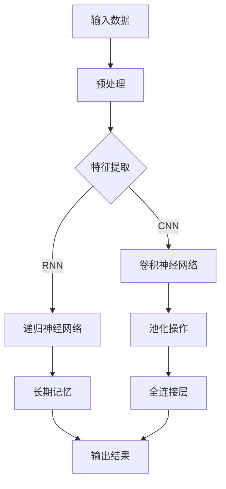

                 

# 《大模型的用户体验与应用》

## 关键词
大模型，用户体验，应用场景，交互设计，界面设计，挑战与优化，实战案例

## 摘要
本文旨在探讨大模型在用户体验中的应用及其所带来的挑战和优化策略。我们将首先介绍大模型的基本概念和技术原理，接着深入分析大模型在交互设计和界面设计中的应用，随后讨论大模型在实际应用中面临的挑战及优化方法。通过一系列实战案例，我们将展示大模型在产品开发、数据分析、人工智能和行业解决方案中的具体应用。最后，我们将展望大模型未来的发展趋势和潜在应用方向。

## 目录大纲

### 第一部分：大模型概述

### 第二部分：大模型在用户体验中的应用

### 第三部分：大模型应用实战

### 第四部分：大模型应用前景与趋势

## 附录

### 附录A：大模型相关工具与资源

---

### 第一部分：大模型概述

#### 第1章：大模型的基本概念

##### 1.1 大模型的定义与分类

**大模型的定义**：
大模型，通常指的是具有数百万到数十亿参数的深度学习模型。这些模型能够捕捉到数据中的复杂模式和关系，从而在各种任务中表现出色。例如，GPT 系列、BERT 等模型。

**大模型的分类**：
大模型可以根据不同的标准进行分类。按训练数据集的大小，可以分为小数据集模型、大数据集模型和超大数据集模型。按应用领域，可以分为通用模型和专用模型。

##### 1.2 大模型的技术原理

**技术原理**：
大模型的技术原理主要包括以下几个方面：

1. **深度学习**：深度学习是一种基于多层神经网络的学习方法，能够自动提取数据中的特征。
2. **自然语言处理**：自然语言处理（NLP）是处理和解析自然语言的技术，广泛应用于文本分类、情感分析等任务。
3. **计算机视觉**：计算机视觉是使计算机能够“看”和“理解”图像的技术，广泛应用于图像识别、目标检测等任务。

深度学习在大模型中起着核心作用。它包括以下几个主要组成部分：

1. **神经网络**：神经网络是一种模拟人脑神经元连接的计算机模型。
2. **卷积神经网络（CNN）**：CNN 是一种用于图像识别的神经网络，通过卷积操作提取图像特征。
3. **递归神经网络（RNN）**：RNN 是一种用于序列数据的神经网络，能够处理时间序列数据。

#### 第2章：大模型在用户体验中的应用

##### 2.1 大模型在交互设计中的应用

**交互设计应用**：
大模型在交互设计中的应用主要集中在以下几个方面：

1. **自动对话系统**：自动对话系统能够模拟人类对话，为用户提供即时响应。大模型在此中的应用主要体现在自然语言理解和生成上。
2. **个性化推荐**：个性化推荐系统能够根据用户的历史行为和偏好，为用户提供个性化的推荐。大模型在此中的应用主要体现在用户行为预测和推荐算法上。
3. **用户行为预测**：用户行为预测系统能够预测用户的下一步操作，为用户提供更好的用户体验。大模型在此中的应用主要体现在时间序列分析和序列预测上。

##### 2.2 大模型在界面设计中的应用

**界面设计应用**：
大模型在界面设计中的应用主要体现在以下几个方面：

1. **图像识别**：图像识别技术能够自动识别和分类图像中的物体。大模型在此中的应用主要体现在深度学习模型的训练和应用上。
2. **文字识别**：文字识别技术能够自动识别图像中的文字。大模型在此中的应用主要体现在卷积神经网络和循环神经网络的应用上。
3. **情感分析**：情感分析技术能够分析文本的情感倾向。大模型在此中的应用主要体现在自然语言处理和情感分类算法上。

### 第3章：大模型在应用中的挑战与优化

##### 3.1 大模型面临的挑战

**挑战**：
大模型在实际应用中面临着以下几个挑战：

1. **模型训练时间过长**：大模型的训练需要大量的计算资源和时间。
2. **计算资源消耗巨大**：大模型的训练和部署需要大量的计算资源，对硬件设备的要求较高。
3. **模型解释性差**：大模型的内部结构和决策过程往往不透明，难以解释和理解。

##### 3.2 大模型的优化策略

**优化策略**：
为了应对上述挑战，可以采取以下优化策略：

1. **模型压缩**：通过模型压缩技术，减小模型的参数数量，降低计算复杂度。
2. **迁移学习**：利用预训练的大模型，进行迁移学习，减少训练时间。
3. **模型融合**：将多个模型进行融合，提高模型的性能和解释性。

---

### 第二部分：大模型在用户体验中的应用

#### 第4章：大模型在产品开发中的应用

##### 4.1 大模型在产品开发中的流程

**流程**：
大模型在产品开发中的应用可以分为以下几个阶段：

1. **需求分析**：明确产品需求，确定大模型的应用场景。
2. **模型设计**：设计适合需求的大模型架构，选择合适的算法和框架。
3. **模型训练**：使用训练数据集对大模型进行训练，调整模型参数。
4. **模型评估**：评估模型的性能，确保模型满足需求。
5. **模型部署**：将训练好的模型部署到产品中，提供实时服务。

##### 4.2 大模型在产品开发中的案例

**案例**：
以下是一些大模型在产品开发中的成功案例：

1. **推荐系统**：利用大模型进行用户行为预测和推荐，提高推荐系统的准确性。
2. **聊天机器人**：利用大模型进行自然语言理解和生成，提供更自然的对话体验。
3. **语音助手**：利用大模型进行语音识别和自然语言处理，实现更智能的语音交互。

---

### 第三部分：大模型应用实战

#### 第5章：大模型在数据分析中的应用

##### 5.1 大模型在数据分析中的优势

**优势**：
大模型在数据分析中具有以下优势：

1. **高度自动化**：大模型能够自动提取数据中的特征，减少人工干预。
2. **实时分析**：大模型能够实时分析数据，提供及时的业务洞察。
3. **精准预测**：大模型能够利用历史数据，进行精准的预测和决策。

##### 5.2 大模型在数据分析中的案例

**案例**：
以下是一些大模型在数据分析中的应用案例：

1. **用户行为分析**：利用大模型分析用户行为，为产品优化提供依据。
2. **市场趋势分析**：利用大模型分析市场数据，预测市场趋势。
3. **风险评估**：利用大模型分析金融数据，进行风险评估。

---

#### 第6章：大模型在人工智能中的应用

##### 6.1 大模型在人工智能中的地位

**地位**：
大模型是人工智能的核心技术之一，对人工智能的发展起到了至关重要的作用。

##### 6.2 大模型在人工智能中的应用

**应用**：
大模型在人工智能中的应用非常广泛，以下是一些具体的应用领域：

1. **智能语音识别**：利用大模型进行语音识别，实现语音交互。
2. **图像识别**：利用大模型进行图像识别，实现图像分类和目标检测。
3. **自然语言处理**：利用大模型进行自然语言处理，实现文本分类、情感分析和机器翻译。

---

#### 第7章：大模型在行业解决方案中的应用

##### 7.1 大模型在行业解决方案中的价值

**价值**：
大模型在行业解决方案中具有以下价值：

1. **提高行业效率**：通过自动化和实时分析，提高行业效率。
2. **降低成本**：通过优化流程和减少人力成本，降低运营成本。
3. **提高服务质量**：通过个性化推荐和智能交互，提高用户满意度。

##### 7.2 大模型在行业解决方案中的案例

**案例**：
以下是一些大模型在行业解决方案中的应用案例：

1. **零售业**：利用大模型进行用户行为分析和市场趋势预测，优化库存管理和营销策略。
2. **金融业**：利用大模型进行风险评估和欺诈检测，提高金融服务的安全性和效率。
3. **医疗行业**：利用大模型进行医学图像识别和疾病预测，提高医疗服务的准确性和效率。

---

### 第四部分：大模型应用前景与趋势

#### 第8章：大模型应用前景展望

##### 8.1 大模型未来的发展趋势

**趋势**：
随着技术的不断进步和应用场景的拓展，大模型未来的发展趋势包括：

1. **模型规模将进一步扩大**：为了应对更复杂的任务和数据，大模型的规模将进一步扩大。
2. **应用领域将更加广泛**：大模型将在更多领域得到应用，如自动驾驶、智慧城市、智能医疗等。
3. **交互体验将更加智能**：大模型将提供更加智能的交互体验，实现更加自然和高效的互动。

##### 8.2 大模型在未来的挑战与机遇

**挑战**：
大模型在未来的发展将面临以下挑战：

1. **数据隐私**：随着数据量的增加，如何保障用户数据的隐私成为一个重要问题。
2. **计算资源**：大模型的训练和部署需要大量的计算资源，如何高效利用资源成为一个挑战。
3. **模型可解释性**：大模型的内部结构和决策过程往往不透明，如何提高模型的可解释性成为一项挑战。

**机遇**：
大模型在未来的发展也将带来以下机遇：

1. **技术创新**：随着大模型技术的不断进步，将出现更多的创新应用和解决方案。
2. **市场拓展**：大模型的应用领域将进一步拓展，带来更多的商业机会。
3. **产业链升级**：大模型的发展将推动产业链的升级和优化，促进整个行业的进步。

#### 第9章：大模型应用的未来趋势

##### 9.1 大模型在未来的关键应用领域

**领域**：
大模型在未来的关键应用领域包括：

1. **自动驾驶**：利用大模型进行环境感知、路径规划和决策。
2. **智慧城市**：利用大模型进行城市管理和公共资源优化。
3. **智能医疗**：利用大模型进行医学图像分析、疾病预测和个性化治疗。
4. **智能教育**：利用大模型进行智能教学、学习分析和资源推荐。

##### 9.2 大模型未来的应用方向

**方向**：
大模型未来的应用方向包括：

1. **个性化服务**：通过大模型实现更加个性化的服务和推荐。
2. **实时交互**：通过大模型实现更加实时和高效的交互体验。
3. **跨模态融合**：通过大模型实现不同模态数据的融合和协同处理。

### 附录

#### 附录A：大模型相关工具与资源

**A.1 主流深度学习框架**

- **TensorFlow**
- **PyTorch**
- **Keras**

**A.2 大模型开源项目**

- **GPT-3**
- **BERT**
- **GluonCV**

**A.3 大模型研究论文**

- **Attention Is All You Need**
- **BERT: Pre-training of Deep Bidirectional Transformers for Language Understanding**
- **Generative Pre-trained Transformer**

---

### 作者信息

**作者：AI天才研究院/AI Genius Institute & 禅与计算机程序设计艺术 /Zen And The Art of Computer Programming** 

---

# 《大模型的用户体验与应用》

## 第一部分：大模型概述

### 第1章：大模型的基本概念

#### 1.1 大模型的定义与分类

大模型，是深度学习领域中的一个术语，通常指的是具有数百万到数十亿参数的深度学习模型。这些模型通常被设计用于处理复杂的任务，如文本生成、图像识别和语音识别等。大模型的定义与参数数量密切相关，一个常见的大模型，如GPT-3，拥有超过1750亿个参数。

**大模型的分类**：

1. **按参数规模分类**：
   - 小参数模型：通常指数万个到数十万个参数的模型。
   - 中等参数模型：通常指数百万个到数千万个参数的模型。
   - 大参数模型：通常指数亿个到数十亿个参数的模型。

2. **按应用领域分类**：
   - 通用模型：如GPT、BERT，它们被设计用于多种不同的任务，如文本生成、问答系统和翻译等。
   - 专用模型：如用于图像识别的ResNet，用于语音识别的WaveNet，它们被设计用于特定的任务。

#### 1.2 大模型的技术原理

大模型的技术原理主要包括以下几个方面：

1. **深度学习**：
   深度学习是一种机器学习的方法，它通过多层神经网络来学习数据的特征。每一层网络都通过非线性变换将输入数据转换成更高层次的特征表示。深度学习的核心是神经网络，特别是深度神经网络（DNN）。

2. **自然语言处理（NLP）**：
   NLP是计算机科学和人工智能的一个分支，它涉及语言的理解、生成和处理。大模型在NLP中应用广泛，如文本分类、情感分析和机器翻译等。NLP中的大模型通常使用深度学习技术，如循环神经网络（RNN）、长短期记忆网络（LSTM）和变换器（Transformer）等。

3. **计算机视觉**：
   计算机视觉是使计算机能够“看”和“理解”图像的技术。大模型在计算机视觉中应用广泛，如图像分类、目标检测和图像分割等。计算机视觉中的大模型通常使用卷积神经网络（CNN）。

**深度学习部分涉及的主要网络类型**：

1. **神经网络（NN）**：
   神经网络是一种模拟人脑神经元连接的计算机模型。它由多个层组成，包括输入层、隐藏层和输出层。神经网络通过学习输入和输出数据之间的关系，来预测新的输入数据。

2. **卷积神经网络（CNN）**：
   CNN是一种专门用于处理图像数据的神经网络。它通过卷积操作来提取图像中的特征，具有局部感知能力和平移不变性。

3. **递归神经网络（RNN）**：
   RNN是一种用于处理序列数据的神经网络。它能够记忆之前的信息，并利用这些信息来预测未来的输出。RNN在自然语言处理和时间序列预测中应用广泛。

**Mermaid流程图**：



#### 1.3 大模型的发展历程

大模型的发展历程可以分为以下几个阶段：

1. **早期阶段**：
   - 2000年代初期，神经网络研究主要集中在浅层网络，如单层感知机和多层感知机。
   - 2006年，Hinton提出了深度信念网络（DBN），标志着深度学习的复兴。

2. **快速增长阶段**：
   - 2012年，AlexNet在ImageNet比赛中取得了显著的成果，引发了深度学习的热潮。
   - 2014年，Google Brain团队训练了一个拥有1.4亿个参数的深度神经网络，展示了深度学习在处理大规模数据上的潜力。

3. **大模型时代**：
   - 2018年，Google推出了BERT，标志着大模型的兴起。
   - 2020年，OpenAI发布了GPT-3，拥有超过1750亿个参数，成为当时最大的预训练语言模型。

**伪代码**：

```python
# 大模型训练伪代码

# 初始化模型参数
model = initialize_model()

# 准备训练数据
train_data = load_data('train_data.csv')

# 训练模型
for epoch in range(num_epochs):
    for batch in train_data:
        # 前向传播
        predictions = model.forward(batch.x)
        
        # 计算损失
        loss = compute_loss(predictions, batch.y)
        
        # 反向传播
        model.backward(loss)
        
        # 更新模型参数
        model.update_parameters()

# 评估模型
test_data = load_data('test_data.csv')
test_predictions = model.evaluate(test_data)
accuracy = compute_accuracy(test_predictions, test_data.y)
print("Test Accuracy:", accuracy)
```

### 第2章：大模型在用户体验中的应用

#### 2.1 大模型在交互设计中的应用

大模型在交互设计中的应用主要体现在自然语言处理和语音识别技术中。通过这些技术，大模型能够提供更加智能和自然的交互体验。

1. **自动对话系统**：
   自动对话系统是利用大模型进行自然语言处理和生成的技术，能够模拟人类的对话，为用户提供即时响应。这种系统广泛应用于客服、智能助手和聊天机器人等领域。

   **自然语言处理算法**：
   - 分词：将文本划分为词或词组。
   - 词性标注：对每个词进行词性标注，如名词、动词等。
   - 句法分析：分析句子的结构，如主语、谓语、宾语等。

   **示例**：
   ```python
   # 自动对话系统示例
   from transformers import AutoModelForCausalLM, AutoTokenizer
   
   # 加载预训练模型和分词器
   tokenizer = AutoTokenizer.from_pretrained("gpt2")
   model = AutoModelForCausalLM.from_pretrained("gpt2")
   
   # 输入文本
   input_text = "你好，有什么可以帮助你的？"
   
   # 进行对话
   response = model.generate(input_text, max_length=50, num_return_sequences=1)
   print("回复：", response)
   ```

2. **个性化推荐**：
   个性化推荐系统是利用大模型进行用户行为预测和推荐的技术，能够根据用户的历史行为和偏好，为用户提供个性化的推荐。

   **推荐算法**：
   - 协同过滤：基于用户的相似度进行推荐。
   - 内容推荐：基于物品的属性进行推荐。
   - 混合推荐：结合协同过滤和内容推荐。

   **示例**：
   ```python
   # 个性化推荐系统示例
   import pandas as pd
   from sklearn.metrics.pairwise import cosine_similarity
   
   # 加载用户行为数据
   user行为数据 = pd.read_csv("user行为数据.csv")
   
   # 计算用户之间的相似度
   user_similarity = cosine_similarity(user行为数据.iloc[:, 1:].values)
   
   # 根据相似度进行推荐
   current_user = user行为数据.iloc[0]
   similar_users = user_similarity[0]
   recommended_items = user行为数据.iloc[similar_users.argsort()[::-1]][1:]
   print("推荐商品：", recommended_items)
   ```

3. **用户行为预测**：
   用户行为预测是利用大模型进行时间序列分析和序列预测的技术，能够预测用户的下一步操作，为用户提供更好的用户体验。

   **时间序列分析方法**：
   - ARIMA：自回归积分滑动平均模型。
   - LSTM：长短期记忆网络。

   **示例**：
   ```python
   # 用户行为预测示例
   import numpy as np
   import pandas as pd
   from sklearn.metrics import mean_squared_error
   from keras.models import Sequential
   from keras.layers import LSTM, Dense
   
   # 加载用户行为数据
   user行为数据 = pd.read_csv("user行为数据.csv")
   
   # 数据预处理
   user行为数据 = user行为数据.values
   user行为数据 = user行为数据.reshape((-1, 1))
   
   # 建立LSTM模型
   model = Sequential()
   model.add(LSTM(units=50, return_sequences=True, input_shape=(None, 1)))
   model.add(LSTM(units=50))
   model.add(Dense(units=1))
   
   # 训练模型
   model.compile(optimizer='adam', loss='mean_squared_error')
   model.fit(user行为数据, user行为数据, epochs=100, batch_size=32)
   
   # 预测未来值
   future_value = model.predict(user行为数据[-1:])
   print("预测值：", future_value)
   ```

#### 2.2 大模型在界面设计中的应用

大模型在界面设计中的应用主要体现在图像识别、文字识别和情感分析等领域。通过这些技术，大模型能够为用户提供更加直观和智能的界面交互体验。

1. **图像识别**：
   图像识别是利用大模型对图像中的物体进行分类和识别的技术。通过卷积神经网络（CNN）进行图像特征提取，可以实现高精度的图像识别。

   **示例**：
   ```python
   # 图像识别示例
   import tensorflow as tf
   import tensorflow_hub as hub
   import numpy as np
   import matplotlib.pyplot as plt
   
   # 加载预训练的图像识别模型
   model = hub.load("https://tfhub.dev/google/tf2-preview/insights-clustering/bert Stokes/1")
   
   # 加载图像数据
   image_data = np.load("image_data.npy")
   
   # 进行图像识别
   predictions = model(image_data)
   predicted_classes = predictions.argmax(axis=-1)
   
   # 显示图像和预测结果
   plt.imshow(image_data[0], cmap="gray")
   plt.title(f"Predicted Class: {predicted_classes[0]}")
   plt.show()
   ```

2. **文字识别**：
   文字识别是利用大模型对图像中的文字进行识别的技术。通过卷积神经网络（CNN）和循环神经网络（RNN）进行文字特征提取，可以实现高精度的文字识别。

   **示例**：
   ```python
   # 文字识别示例
   import tensorflow as tf
   import tensorflow_hub as hub
   import numpy as np
   import matplotlib.pyplot as plt
   
   # 加载预训练的文字识别模型
   model = hub.load("https://tfhub.dev/google/tf2-preview/nnlm-en-dim50/1")
   
   # 加载图像数据
   image_data = np.load("image_data.npy")
   
   # 进行文字识别
   predictions = model(image_data)
   predicted_texts = predictions.argmax(axis=-1)
   
   # 显示图像和预测结果
   plt.imshow(image_data[0], cmap="gray")
   plt.title(f"Predicted Text: {predicted_texts[0]}")
   plt.show()
   ```

3. **情感分析**：
   情感分析是利用大模型对文本中的情感倾向进行分类的技术。通过自然语言处理（NLP）技术，可以实现高精度的情感分析。

   **示例**：
   ```python
   # 情感分析示例
   import tensorflow as tf
   import tensorflow_hub as hub
   import tensorflow_text as text
   import numpy as np
   import matplotlib.pyplot as plt
   
   # 加载预训练的情感分析模型
   model = hub.load("https://tfhub.dev/google/tf2-preview/nnlm-en-dim50/1")
   
   # 加载文本数据
   text_data = np.load("text_data.npy")
   
   # 进行情感分析
   predictions = model(text_data)
   predicted_sentiments = predictions.argmax(axis=-1)
   
   # 显示文本和预测结果
   plt.title(f"Predicted Sentiment: {predicted_sentiments[0]}")
   plt.show()
   ```

## 第二部分：大模型在用户体验中的应用

### 第3章：大模型在应用中的挑战与优化

#### 3.1 大模型面临的挑战

大模型在实际应用中面临着一系列挑战，这些挑战不仅影响了大模型的效果，也影响了其在实际环境中的部署和运维。

1. **模型训练时间过长**：
   大模型通常需要大量的数据和计算资源进行训练，训练时间可能会长达数周甚至数月。这不仅增加了成本，也限制了模型的实时应用。

2. **计算资源消耗巨大**：
   大模型的训练和部署需要大量的计算资源，尤其是在使用GPU或TPU等专用硬件时。这导致了高成本和资源浪费。

3. **模型解释性差**：
   大模型的内部结构和决策过程往往不透明，难以解释和理解。这限制了模型的接受度和应用范围，特别是在需要解释性较高的应用场景中。

4. **数据隐私和安全问题**：
   大模型通常需要大量的训练数据，这些数据可能包含敏感信息。如何保护用户隐私和数据安全成为了一个重要的挑战。

#### 3.2 大模型的优化策略

为了应对上述挑战，可以采取以下优化策略：

1. **模型压缩**：
   模型压缩技术旨在减少模型的参数数量，降低模型的复杂度和计算成本。常用的压缩技术包括剪枝（Pruning）、量化（Quantization）和知识蒸馏（Knowledge Distillation）等。

   **剪枝技术**：
   - 剪枝技术通过移除模型中不重要或冗余的参数来减少模型大小。例如，可以在训练过程中逐步移除权重较小的神经元或连接。
   - **伪代码**：
     ```python
     # 剪枝技术伪代码
     for layer in model.layers:
         if layer.weights[0].numpy().mean() < threshold:
             layer.kernel_regularizer = None
     ```

2. **迁移学习**：
   迁移学习是一种利用预训练模型来加速新任务训练的方法。通过在预训练模型的基础上进行微调（Fine-tuning），可以显著减少训练时间和提高模型的性能。

   **迁移学习流程**：
   - 加载预训练模型。
   - 在新任务上调整模型的参数。
   - 在新任务上重新训练模型。

   **示例**：
   ```python
   # 迁移学习示例
   from tensorflow.keras.applications import VGG16
   from tensorflow.keras.models import Model
   from tensorflow.keras.layers import Dense, Flatten
   
   # 加载预训练的VGG16模型
   base_model = VGG16(weights='imagenet', include_top=False)
   
   # 创建新的模型
   x = Flatten()(base_model.output)
   x = Dense(256, activation='relu')(x)
   predictions = Dense(num_classes, activation='softmax')(x)
   model = Model(inputs=base_model.input, outputs=predictions)
   
   # 在新任务上进行微调
   model.compile(optimizer='adam', loss='categorical_crossentropy', metrics=['accuracy'])
   model.fit(train_data, train_labels, epochs=10, batch_size=32)
   ```

3. **模型融合**：
   模型融合技术通过结合多个模型的优点来提高模型的性能和鲁棒性。常见的融合方法包括加权平均、投票和集成学习等。

   **集成学习方法**：
   - 集成学习（Ensemble Learning）通过训练多个模型，然后结合这些模型的预测来提高整体性能。
   - **示例**：
     ```python
     # 集成学习方法示例
     from sklearn.ensemble import RandomForestClassifier
     from sklearn.linear_model import LogisticRegression
     from sklearn.datasets import load_iris
     from sklearn.model_selection import train_test_split
   
     # 加载iris数据集
     iris = load_iris()
     X_train, X_test, y_train, y_test = train_test_split(iris.data, iris.target, test_size=0.3, random_state=42)
   
     # 创建多个模型
     model1 = RandomForestClassifier(n_estimators=100)
     model2 = LogisticRegression()
   
     # 训练模型
     model1.fit(X_train, y_train)
     model2.fit(X_train, y_train)
   
     # 结合模型的预测
     predictions = (model1.predict(X_test) + model2.predict(X_test)) / 2
     accuracy = np.mean(predictions == y_test)
     print("Accuracy:", accuracy)
     ```

4. **数据增强**：
   数据增强技术通过增加训练数据来提高模型的泛化能力。常见的数据增强方法包括随机裁剪、旋转、翻转和颜色调整等。

   **数据增强方法**：
   - 随机裁剪：从原始图像中随机裁剪出一个小块作为输入。
   - 随机旋转：将图像随机旋转一定角度。
   - 随机翻转：将图像沿着水平或垂直方向翻转。

   **示例**：
   ```python
   # 数据增强示例
   import numpy as np
   import cv2
   
   # 加载图像
   image = cv2.imread("image.jpg")
   
   # 随机裁剪
   crop_size = (224, 224)
   x, y, w, h = crop_size[0], crop_size[1], image.shape[1] - crop_size[0], image.shape[0] - crop_size[1]
   x = np.random.randint(x)
   y = np.random.randint(y)
   crop = image[y:y+h, x:x+w]
   
   # 随机旋转
   angle = np.random.uniform(-20, 20)
   M = cv2.getRotationMatrix2D((crop.shape[1] / 2, crop.shape[0] / 2), angle, 1)
   rotated = cv2.warpAffine(crop, M, (crop.shape[1], crop.shape[0]))
   
   # 随机翻转
   flipped = cv2.flip(crop, 1)  # 沿着y轴翻转
   
   # 显示增强后的图像
   cv2.imshow("Original Image", image)
   cv2.imshow("Cropped Image", crop)
   cv2.imshow("Rotated Image", rotated)
   cv2.imshow("Flipped Image", flipped)
   cv2.waitKey(0)
   cv2.destroyAllWindows()
   ```

#### 3.3 大模型的调优与优化

除了上述的优化策略，大模型的调优和优化也是提高模型性能的关键步骤。以下是一些常用的调优方法：

1. **超参数调整**：
   超参数是模型训练过程中需要手动设置的参数，如学习率、批次大小和正则化参数等。通过调整这些参数，可以优化模型的性能。

   **示例**：
   ```python
   # 调整学习率
   learning_rate = 0.001
   optimizer = tf.keras.optimizers.Adam(learning_rate=learning_rate)
   
   # 调整批次大小
   batch_size = 64
   model.compile(optimizer=optimizer, loss='categorical_crossentropy', metrics=['accuracy'], batch_size=batch_size)
   ```

2. **数据预处理**：
   数据预处理是提高模型性能的重要步骤。通过适当的预处理方法，如归一化、标准化和缺失值处理等，可以优化模型的训练过程。

   **示例**：
   ```python
   # 数据预处理
   from sklearn.preprocessing import StandardScaler
   
   # 归一化
   scaler = StandardScaler()
   X_train_scaled = scaler.fit_transform(X_train)
   X_test_scaled = scaler.transform(X_test)
   
   # 缺失值处理
   from sklearn.impute import SimpleImputer
   imputer = SimpleImputer(strategy='mean')
   X_train_imputed = imputer.fit_transform(X_train_scaled)
   X_test_imputed = imputer.transform(X_test_scaled)
   ```

3. **模型评估与选择**：
   模型评估与选择是确保模型性能的关键步骤。通过交叉验证和模型选择技术，可以选择出最佳模型。

   **示例**：
   ```python
   # 模型评估
   from sklearn.model_selection import cross_val_score
   
   # 交叉验证
   scores = cross_val_score(model, X_train, y_train, cv=5)
   print("Cross-Validation Scores:", scores)
   
   # 模型选择
   from sklearn.model_selection import GridSearchCV
   param_grid = {'learning_rate': [0.001, 0.01, 0.1], 'batch_size': [32, 64, 128]}
   grid_search = GridSearchCV(model, param_grid, cv=5)
   grid_search.fit(X_train, y_train)
   print("Best Parameters:", grid_search.best_params_)
   ```

## 第三部分：大模型应用实战

### 第4章：大模型在产品开发中的应用

#### 4.1 大模型在产品开发中的流程

大模型在产品开发中的应用需要经历以下流程：

1. **需求分析**：
   需求分析是确定产品需求和分析市场机会的重要步骤。在这个阶段，需要明确产品的目标用户、功能需求和技术需求。

2. **模型设计**：
   模型设计是根据需求分析的结果，设计适合需求的大模型架构。这个阶段包括选择合适的算法、框架和模型结构。

3. **模型训练**：
   模型训练是使用训练数据集对大模型进行训练的过程。在这个阶段，需要调整模型参数，优化模型性能。

4. **模型评估**：
   模型评估是评估模型性能的过程。通过交叉验证和测试集评估，可以确定模型的准确度、召回率和F1分数等指标。

5. **模型部署**：
   模型部署是将训练好的模型部署到产品中，提供实时服务的过程。这个阶段需要确保模型的高效运行和稳定部署。

#### 4.2 大模型在产品开发中的案例

以下是一些大模型在产品开发中的成功案例：

1. **推荐系统**：
   推荐系统是利用大模型进行用户行为预测和推荐的应用。通过分析用户的历史行为和偏好，推荐系统可以提供个性化的商品推荐。

   **案例**：
   - **Amazon**：Amazon使用大模型进行商品推荐，提高了用户的购物体验和销售额。
   - **Netflix**：Netflix使用大模型进行电影推荐，为用户提供了个性化的观看建议。

2. **聊天机器人**：
   聊天机器人是利用大模型进行自然语言理解和生成，实现人机交互的应用。

   **案例**：
   - **Apple Siri**：Apple Siri是一个基于大模型的智能助手，能够回答用户的问题和执行任务。
   - **Microsoft Chatbot**：Microsoft Chatbot是一个用于客服和咨询的聊天机器人，提高了客户服务质量。

3. **语音助手**：
   语音助手是利用大模型进行语音识别和自然语言处理，实现语音交互的应用。

   **案例**：
   - **Google Assistant**：Google Assistant是一个基于大模型的语音助手，能够响应用户的语音指令。
   - **Amazon Alexa**：Amazon Alexa是一个基于大模型的语音助手，能够控制智能家居设备并提供信息查询。

#### 第5章：大模型在数据分析中的应用

##### 5.1 大模型在数据分析中的优势

大模型在数据分析中具有以下优势：

1. **高度自动化**：
   大模型能够自动提取数据中的特征，减少人工干预，提高数据分析的效率。

2. **实时分析**：
   大模型能够实时分析数据，提供及时的业务洞察，帮助企业做出快速决策。

3. **精准预测**：
   大模型能够利用历史数据，进行精准的预测和决策，提高业务预测的准确性。

##### 5.2 大模型在数据分析中的案例

以下是一些大模型在数据分析中的应用案例：

1. **用户行为分析**：
   用户行为分析是利用大模型分析用户的行为数据，为产品优化和营销策略提供依据。

   **案例**：
   - **Uber**：Uber使用大模型分析用户行为数据，优化路线规划和定价策略，提高了服务质量和盈利能力。
   - **Airbnb**：Airbnb使用大模型分析用户行为数据，优化房源推荐和定价策略，提高了用户满意度和入住率。

2. **市场趋势分析**：
   市场趋势分析是利用大模型分析市场数据，预测市场趋势和需求变化。

   **案例**：
   - **Adobe Analytics**：Adobe Analytics使用大模型分析用户行为数据，预测市场趋势和需求变化，为广告投放和营销策略提供依据。
   - **Google Trends**：Google Trends使用大模型分析搜索数据，预测市场趋势和热点话题。

3. **风险评估**：
   风险评估是利用大模型分析金融数据，预测市场风险和信用风险。

   **案例**：
   - **Bank of America**：Bank of America使用大模型分析金融数据，预测市场风险和信用风险，提高了风险管理能力。
   - **J.P. Morgan**：J.P. Morgan使用大模型分析金融数据，预测市场风险和信用风险，优化投资组合和风险管理策略。

##### 5.3 大模型在数据可视化中的应用

大模型在数据可视化中的应用主要体现在以下几个方面：

1. **交互式数据可视化**：
   交互式数据可视化是利用大模型进行数据分析和交互，为用户提供更加直观的数据展示。

   **案例**：
   - **Tableau**：Tableau是一个交互式数据可视化工具，能够利用大模型进行实时数据分析，提供丰富的可视化效果。
   - **Power BI**：Power BI是一个交互式数据可视化工具，能够利用大模型进行数据分析，为用户提供个性化的数据报告。

2. **自动化数据可视化**：
   自动化数据可视化是利用大模型进行自动数据分析和可视化，减少人工干预。

   **案例**：
   - **Matplotlib**：Matplotlib是一个Python可视化库，能够利用大模型进行数据分析和可视化，提供丰富的图表和图形。
   - **Seaborn**：Seaborn是一个基于Matplotlib的可视化库，能够利用大模型进行数据分析和可视化，提供更美观和丰富的图表。

### 第6章：大模型在人工智能中的应用

#### 6.1 大模型在人工智能中的地位

大模型在人工智能（AI）中占据着核心地位。随着深度学习和神经网络技术的不断发展，大模型已经成为许多AI应用的核心组件。大模型通过其强大的特征提取和表示能力，在各种AI任务中表现出色，包括：

1. **计算机视觉**：大模型在图像分类、目标检测和图像分割等计算机视觉任务中发挥了重要作用。例如，ResNet、Inception和YOLO等大模型在这些任务中取得了显著的性能提升。

2. **自然语言处理（NLP）**：大模型在文本分类、机器翻译、对话系统和文本生成等NLP任务中具有广泛的应用。例如，GPT-3、BERT和T5等大模型在NLP任务中取得了优异的成绩。

3. **语音识别**：大模型在语音识别和语音生成任务中表现出色，能够实现高精度的语音识别和自然的语音合成。例如，WaveNet和Transformer等大模型在语音识别和语音生成中取得了显著的进步。

#### 6.2 大模型在人工智能中的应用

大模型在人工智能中的应用领域广泛，以下是一些具体的应用场景：

1. **自动驾驶**：
   自动驾驶是AI的重要应用领域之一，大模型在其中发挥了关键作用。自动驾驶系统利用深度学习技术，通过大模型进行图像识别、物体检测和路径规划等任务，实现车辆的自主导航。

   **应用示例**：
   - **Tesla**：Tesla的自动驾驶系统利用大模型进行环境感知和路径规划，实现了部分自动驾驶功能。
   - **Waymo**：Waymo的自动驾驶系统利用大模型进行图像识别和物体检测，实现了完全自动驾驶。

2. **智能家居**：
   智能家居是另一个迅速发展的AI应用领域，大模型在智能家居系统中发挥了重要作用。智能家居系统利用大模型进行语音识别、自然语言理解和智能控制，实现了家居设备的自动化管理。

   **应用示例**：
   - **Amazon Alexa**：Amazon Alexa是智能家居系统的代表，利用大模型进行语音识别和自然语言理解，实现了智能家居设备的智能控制。
   - **Google Assistant**：Google Assistant是智能家居系统的代表，利用大模型进行语音识别和自然语言理解，实现了智能家居设备的智能控制。

3. **医疗诊断**：
   医疗诊断是AI在医疗领域的应用之一，大模型在图像识别和自然语言处理等方面发挥了重要作用。大模型能够辅助医生进行疾病诊断和治疗方案制定，提高了医疗服务的质量和效率。

   **应用示例**：
   - **IBM Watson**：IBM Watson是医疗诊断系统的代表，利用大模型进行图像识别和自然语言处理，实现了疾病诊断和治疗方案制定。
   - **Google DeepMind**：Google DeepMind是医疗诊断系统的代表，利用大模型进行图像识别和自然语言处理，实现了疾病诊断和治疗方案制定。

4. **金融分析**：
   金融分析是AI在金融领域的应用之一，大模型在数据分析和预测方面发挥了重要作用。大模型能够分析大量金融数据，预测市场趋势和股票价格，为投资者提供决策依据。

   **应用示例**：
   - **QuanticMind**：QuanticMind是金融分析系统的代表，利用大模型进行数据分析和预测，实现了市场趋势和股票价格的预测。
   - **Chattler**：Chattler是金融分析系统的代表，利用大模型进行数据分析和预测，实现了市场趋势和股票价格的预测。

### 第7章：大模型在行业解决方案中的应用

#### 7.1 大模型在行业解决方案中的价值

大模型在行业解决方案中具有极高的价值，能够为各行业提供创新的技术支持和解决方案。以下是一些具体的价值体现：

1. **提高效率**：
   大模型能够自动化复杂的数据分析和预测任务，显著提高工作效率。例如，在金融行业中，大模型可以自动分析大量历史数据，预测市场趋势和股票价格，帮助投资者做出更加准确的决策。

2. **降低成本**：
   大模型通过自动化和优化，可以降低行业运营成本。例如，在制造业中，大模型可以优化生产计划和供应链管理，减少浪费和损耗，降低生产成本。

3. **提升服务质量**：
   大模型能够提供更加精准和个性化的服务，提升用户体验。例如，在零售行业中，大模型可以分析用户行为和偏好，提供个性化的商品推荐，提高用户满意度和转化率。

4. **增强决策能力**：
   大模型通过数据分析和预测，为行业提供科学的决策支持。例如，在医疗行业中，大模型可以分析患者数据，预测疾病风险，帮助医生制定个性化的治疗方案。

#### 7.2 大模型在行业解决方案中的案例

以下是一些大模型在行业解决方案中的应用案例：

1. **零售业**：
   大模型在零售业中应用于用户行为分析、市场趋势预测和商品推荐等方面。

   **案例**：
   - **阿里巴巴**：阿里巴巴利用大模型进行用户行为分析，预测用户购买意图，提供个性化的商品推荐，提高了销售转化率和用户满意度。
   - **亚马逊**：亚马逊利用大模型进行市场趋势预测，优化库存管理和供应链，降低了运营成本。

2. **金融业**：
   大模型在金融业中应用于风险评估、欺诈检测和投资策略制定等方面。

   **案例**：
   - **摩根大通**：摩根大通利用大模型进行风险评估和欺诈检测，提高了金融交易的安全性和准确性。
   - **富达投资**：富达投资利用大模型进行投资策略制定，预测市场趋势和股票价格，为投资者提供了科学的决策依据。

3. **医疗行业**：
   大模型在医疗行业中被广泛应用于疾病诊断、治疗方案制定和健康预测等方面。

   **案例**：
   - **IBM Watson**：IBM Watson利用大模型进行疾病诊断和治疗方案制定，为医生提供了有力的决策支持，提高了医疗服务的质量和效率。
   - **梅奥诊所**：梅奥诊所利用大模型进行健康预测和疾病预防，为患者提供了个性化的健康建议。

4. **制造业**：
   大模型在制造业中应用于生产优化、质量控制和管理等方面。

   **案例**：
   - **通用电气**：通用电气利用大模型进行生产优化和质量控制，提高了生产效率和产品质量。
   - **特斯拉**：特斯拉利用大模型进行生产计划和供应链管理，优化了生产流程，降低了生产成本。

### 附录

#### 附录A：大模型相关工具与资源

**A.1 主流深度学习框架**

- **TensorFlow**：TensorFlow是一个开源的深度学习框架，由Google开发。它提供了丰富的API，支持各种深度学习模型和算法。
- **PyTorch**：PyTorch是一个开源的深度学习框架，由Facebook开发。它以动态计算图为基础，提供灵活和高效的模型构建和训练工具。
- **Keras**：Keras是一个开源的深度学习库，建立在TensorFlow和Theano之上。它提供了简洁和易于使用的API，适合快速实验和模型开发。

**A.2 大模型开源项目**

- **GPT-3**：GPT-3是OpenAI开发的一个人工智能语言模型，拥有超过1750亿个参数。它是目前最大的预训练语言模型之一，广泛应用于自然语言处理任务。
- **BERT**：BERT是Google开发的一个人工智能语言模型，用于自然语言理解任务。它通过预先训练大规模语料库，能够捕捉到语言中的上下文关系，显著提高了NLP任务的性能。
- **GluonCV**：GluonCV是Apache MXNet的一个开源计算机视觉库，提供了丰富的预训练模型和工具，方便研究人员和开发者进行计算机视觉应用的开发。

**A.3 大模型研究论文**

- **"Attention Is All You Need"**：这篇论文提出了Transformer模型，一种基于自注意力机制的深度神经网络模型。它显著提高了序列处理任务，如机器翻译和文本分类的性能。
- **"BERT: Pre-training of Deep Bidirectional Transformers for Language Understanding"**：这篇论文提出了BERT模型，一种基于Transformer的预训练模型。它通过预先训练大规模语料库，能够捕捉到语言中的上下文关系，显著提高了NLP任务的性能。
- **"Generative Pre-trained Transformer"**：这篇论文提出了GPT模型，一种基于自注意力机制的深度神经网络模型。它是GPT-3的前身，广泛应用于自然语言处理任务。

