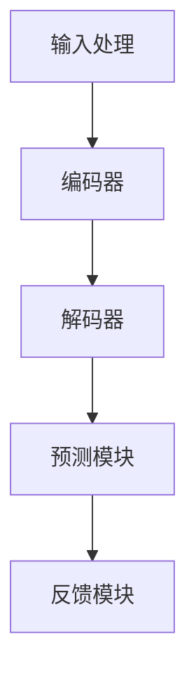
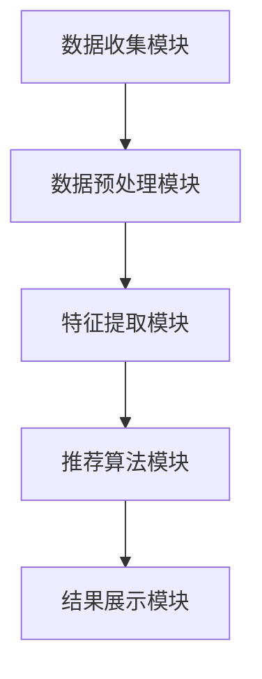

                 

# 大模型问答机器人与传统搜索推荐的本质区别

> 关键词：大模型问答机器人、传统搜索推荐、技术对比、应用场景、发展趋势

> 摘要：本文旨在探讨大模型问答机器人与传统搜索推荐之间的本质区别。通过对两者技术基础、实现方式、应用场景等方面的详细分析，揭示大模型问答机器人在数据处理、精准度和查找速度等方面的优势，及其对搜索推荐系统的影响和未来发展趋势。同时，文章还将分享大模型问答机器人的实际应用案例和开发实践，为读者提供全方位的技术解读和实际操作指南。

## 目录大纲

## 第一部分: 大模型问答机器人与传统搜索推荐的本质区别

### 第1章: 引言与概述

#### 1.1 引言

- 大模型问答机器人的背景
- 传统搜索推荐的局限
- 本书的目的与结构

### 第2章: 大模型问答机器人技术基础

#### 2.1 大模型原理

- 大模型的基本概念
- 大模型的训练过程

#### 2.2 问答机器人的实现

- 问答机器人的基本架构
- 问答机器人的关键算法

### 第3章: 传统搜索推荐技术分析

#### 3.1 搜索推荐系统的框架

- 搜索推荐系统的工作原理
- 搜索推荐系统的核心算法

#### 3.2 搜索推荐系统的挑战

- 数据质量的影响
- 用户体验的优化

### 第4章: 大模型问答机器人与传统搜索推荐的对比

#### 4.1 技术差异

- 数据处理能力的对比
- 精准度的对比
- 查找速度的对比

#### 4.2 应用场景的差异

- 搜索引擎的应用场景
- 问答机器人的应用场景

### 第5章: 大模型问答机器人的实际应用

#### 5.1 案例研究

- 某企业的大模型问答机器人应用案例
- 大模型问答机器人的实际效果分析

#### 5.2 未来发展趋势

- 大模型问答机器人的发展趋势
- 对搜索推荐系统的影响

### 第6章: 大模型问答机器人的开发与实践

#### 6.1 开发环境的搭建

- Python环境的配置
- 常用深度学习框架的安装

#### 6.2 代码实战

- 问答机器人的核心代码实现
- 代码解读与分析

### 第7章: 总结与展望

#### 7.1 书本总结

- 对大模型问答机器人的全面理解
- 对传统搜索推荐系统的反思

#### 7.2 未来展望

- 大模型问答机器人的发展前景
- 搜索推荐系统的未来变革

## 附录

### 附录A: 技术细节与资源

- 大模型相关的参考资料
- 问答机器人开发工具与资源
- 搜索推荐系统相关的论文与书籍推荐

### 附录B: Mermaid 流程图

- 大模型问答机器人的 Mermaid 流程图
- 传统搜索推荐系统的 Mermaid 流程图

### 附录C: 伪代码示例

- 大模型训练过程的伪代码示例
- 问答机器人算法的伪代码示例
- 搜索推荐系统算法的伪代码示例

### 附录D: 数学模型与公式

- 大模型相关的数学公式
- 问答机器人的数学模型公式
- 搜索推荐系统的数学模型公式

## 第一部分: 大模型问答机器人与传统搜索推荐的本质区别

### 第1章: 引言与概述

#### 1.1 引言

在大数据和人工智能的时代，信息检索和推荐系统已经成为我们日常生活不可或缺的一部分。从搜索引擎到社交媒体平台，搜索推荐系统无处不在，极大地改变了我们的信息获取和消费方式。然而，随着数据量和复杂度的不断增加，传统搜索推荐系统面临着诸多挑战，如数据质量、用户体验和精准度等。近年来，大模型问答机器人的出现，为解决这些问题提供了新的思路和解决方案。

大模型问答机器人是基于深度学习的大规模语言模型，它能够对用户的问题进行理解、分析和回答。与传统搜索推荐系统相比，大模型问答机器人具有更高的数据处理能力、更精准的答案生成和更快速的查找速度。本文将从技术基础、实现方式、应用场景和未来发展等方面，详细探讨大模型问答机器人与传统搜索推荐系统的本质区别。

#### 1.2 传统搜索推荐的局限

传统搜索推荐系统主要依赖于关键词匹配、相关性计算和机器学习算法，其核心目标是帮助用户在海量信息中找到与其需求相关的结果。然而，随着互联网的快速发展和信息爆炸，传统搜索推荐系统面临着以下局限：

1. 数据质量：传统搜索推荐系统依赖于用户历史行为数据，如搜索历史、浏览记录等。然而，这些数据往往存在噪声和偏差，难以准确反映用户的真实需求。

2. 精准度：传统搜索推荐系统往往基于关键词匹配和相似度计算，难以对用户的复杂需求进行精确理解。这导致推荐结果存在偏差，无法满足用户的个性化需求。

3. 查找速度：随着数据量的增加，传统搜索推荐系统在处理大量请求时，查找速度明显下降。用户等待时间过长，影响用户体验。

4. 用户互动：传统搜索推荐系统缺乏与用户的互动机制，难以了解用户的实时需求和反馈。

#### 1.3 本书的目的与结构

本书旨在通过对大模型问答机器人与传统搜索推荐系统的详细对比，揭示两者之间的本质区别，帮助读者理解大模型问答机器人的技术原理、实现方式和应用场景。具体结构如下：

- 第1章：引言与概述，介绍大模型问答机器人的背景和传统搜索推荐的局限。

- 第2章：大模型问答机器人技术基础，介绍大模型的基本概念和训练过程，以及问答机器人的实现方法。

- 第3章：传统搜索推荐技术分析，介绍搜索推荐系统的工作原理、核心算法和面临的挑战。

- 第4章：大模型问答机器人与传统搜索推荐的对比，从技术差异、应用场景等方面详细分析两者之间的区别。

- 第5章：大模型问答机器人的实际应用，分享大模型问答机器人的案例研究和实际效果分析。

- 第6章：大模型问答机器人的开发与实践，介绍大模型问答机器人的开发环境和代码实现。

- 第7章：总结与展望，对大模型问答机器人与传统搜索推荐系统进行总结，并探讨未来发展趋势。

通过本书的阅读，读者将能够全面了解大模型问答机器人的技术原理和应用场景，掌握其与传统搜索推荐系统的本质区别，为实际项目开发和科研工作提供有力支持。## 第2章: 大模型问答机器人技术基础

### 2.1 大模型原理

大模型（Large Model）是指拥有数十亿甚至千亿级别参数的深度学习模型，如BERT、GPT、Turing等。大模型通过在海量数据上进行训练，能够捕捉到语言中的复杂结构和语义信息，从而实现自然语言处理（NLP）任务的高度自动化和智能化。

#### 2.1.1 大模型的基本概念

大模型的基本概念主要包括以下几个方面：

1. **参数规模**：大模型的参数规模通常达到数十亿甚至千亿级别，远超过传统机器学习模型的参数规模。

2. **数据量**：大模型通常需要大量的训练数据来保证模型的鲁棒性和泛化能力。这些数据可能包括互联网文本、书籍、新闻、对话等。

3. **训练时间**：由于参数规模大，大模型的训练时间也相对较长，通常需要数天甚至数周的时间。

4. **计算资源**：大模型的训练和推理过程需要大量的计算资源，如GPU、TPU等。

#### 2.1.2 大模型的训练过程

大模型的训练过程通常包括以下几个步骤：

1. **数据预处理**：将原始数据清洗、去重、分词、编码等，转化为模型可以处理的形式。

2. **模型初始化**：初始化模型的参数，通常使用随机初始化或预训练模型初始化。

3. **前向传播**：将输入数据通过模型进行前向传播，得到输出结果。

4. **损失函数计算**：计算输出结果与真实结果之间的差距，通常使用交叉熵损失函数。

5. **反向传播**：通过反向传播算法，更新模型参数。

6. **优化**：使用优化算法（如Adam、SGD等）对模型参数进行优化。

7. **迭代**：重复上述步骤，直到模型收敛。

### 2.2 问答机器人的实现

问答机器人（Question Answering Robot）是一种基于大模型的智能对话系统，它能够对用户的问题进行理解、分析和回答。问答机器人的实现主要包括以下几个步骤：

#### 2.2.1 问答机器人的基本架构

问答机器人的基本架构通常包括以下几个部分：

1. **输入处理模块**：对用户的问题进行预处理，如分词、词性标注、命名实体识别等。

2. **编码器**：将预处理后的输入序列编码为固定长度的向量，通常使用Transformer模型。

3. **解码器**：从编码器输出的固定长度向量中解码出答案。

4. **预测模块**：根据解码器输出的结果，预测用户问题的答案。

5. **反馈模块**：收集用户的反馈，用于模型迭代和优化。

#### 2.2.2 问答机器人的关键算法

问答机器人的关键算法主要包括以下几个步骤：

1. **输入处理**：对用户的问题进行预处理，如分词、词性标注、命名实体识别等。

   ```mermaid
   graph TD
   A[输入处理] --> B[分词]
   B --> C[词性标注]
   C --> D[命名实体识别]
   ```

2. **编码**：使用编码器（如BERT、GPT）将输入序列编码为固定长度的向量。

   ```mermaid
   graph TD
   A[编码器] --> B[输入序列]
   B --> C[编码向量]
   ```

3. **解码**：使用解码器（如Transformer）从编码向量中解码出答案。

   ```mermaid
   graph TD
   A[解码器] --> B[编码向量]
   B --> C[答案]
   ```

4. **预测**：根据解码器输出的结果，预测用户问题的答案。

   ```mermaid
   graph TD
   A[预测模块] --> B[解码结果]
   B --> C[答案预测]
   ```

5. **反馈**：收集用户的反馈，用于模型迭代和优化。

   ```mermaid
   graph TD
   A[反馈模块] --> B[用户反馈]
   B --> C[模型优化]
   ```

### 2.2.3 大模型问答机器人的优势

大模型问答机器人相比传统搜索推荐系统，具有以下几个优势：

1. **数据处理能力**：大模型能够处理海量数据和复杂语言结构，提高数据处理能力。

2. **精准度**：大模型通过深度学习，能够准确理解用户的语义需求，提高推荐精准度。

3. **查找速度**：大模型采用并行计算和分布式训练，提高查找速度。

4. **用户互动**：大模型问答机器人能够与用户进行实时互动，了解用户需求和反馈。

通过以上技术基础的分析，我们可以看到，大模型问答机器人具有强大的数据处理能力、精准度和快速查找速度，为解决传统搜索推荐系统面临的挑战提供了新的思路和解决方案。## 第3章: 传统搜索推荐技术分析

### 3.1 搜索推荐系统的框架

传统搜索推荐系统通常由以下几个主要模块组成：

1. **数据收集模块**：收集用户的历史行为数据，如搜索记录、浏览历史、购买记录等。

2. **数据预处理模块**：对收集到的数据进行清洗、去重、归一化等预处理，以提高数据质量。

3. **特征提取模块**：从预处理后的数据中提取关键特征，如关键词、用户偏好、商品属性等。

4. **推荐算法模块**：使用各种推荐算法，如基于内容的推荐、协同过滤、矩阵分解等，对用户进行个性化推荐。

5. **结果展示模块**：将推荐结果以合适的形式展示给用户，如列表、卡片、轮播等。

### 3.2 搜索推荐系统的核心算法

传统搜索推荐系统的核心算法主要包括以下几种：

1. **基于内容的推荐**：通过分析用户的历史行为数据，提取用户感兴趣的内容特征，然后根据内容特征的相似度进行推荐。

   ```mermaid
   graph TD
   A[用户历史数据] --> B[内容特征提取]
   B --> C[相似度计算]
   C --> D[推荐结果]
   ```

2. **协同过滤**：通过分析用户之间的相似性，预测用户对未知物品的喜好。协同过滤分为基于用户的协同过滤和基于项目的协同过滤。

   ```mermaid
   graph TD
   A[用户-物品评分矩阵] --> B[用户相似度计算]
   B --> C[项目相似度计算]
   C --> D[推荐结果]
   ```

3. **矩阵分解**：通过矩阵分解将用户-物品评分矩阵分解为用户特征矩阵和物品特征矩阵，从而预测用户对未知物品的喜好。

   ```mermaid
   graph TD
   A[用户-物品评分矩阵] --> B[矩阵分解]
   B --> C[用户特征矩阵]
   B --> D[物品特征矩阵]
   C --> E[推荐结果]
   D --> E
   ```

### 3.3 搜索推荐系统的挑战

尽管传统搜索推荐系统在提高信息检索效率和用户体验方面发挥了重要作用，但它们也面临着以下挑战：

1. **数据质量的影响**：用户历史行为数据可能存在噪声、偏差和不一致性，这会影响推荐系统的准确性。

2. **用户体验的优化**：如何在保证推荐准确性的同时，提高用户的使用体验，如推荐结果的可读性、响应速度等，是推荐系统需要解决的问题。

3. **多样性**：推荐系统往往倾向于推荐用户已知的、相似的内容，这可能导致推荐结果的多样性不足，难以满足用户的不同需求。

4. **实时性**：随着用户需求的快速变化，推荐系统需要具备实时性，以快速响应用户的需求。

5. **冷启动问题**：对于新用户或新物品，由于缺乏足够的历史数据，传统推荐系统难以提供准确的推荐。

6. **可解释性**：用户希望了解推荐系统的推荐理由，但传统推荐系统的复杂性和非透明性使得可解释性成为一大挑战。

### 3.4 优化传统搜索推荐系统的技术

为了克服上述挑战，研究者们提出了多种优化传统搜索推荐系统的技术：

1. **数据增强**：通过引入更多的数据来源，如社交媒体、用户评论等，提高数据质量和多样性。

2. **混合推荐**：结合多种推荐算法，如基于内容的推荐和协同过滤，以提高推荐的准确性和多样性。

3. **实时推荐**：使用流处理技术和在线学习算法，实现实时推荐。

4. **知识图谱**：构建知识图谱，将物品和用户关联起来，提高推荐系统的可解释性。

5. **用户行为分析**：通过分析用户的行为数据，如浏览时间、点击率等，更好地理解用户需求。

6. **隐私保护**：采用差分隐私等技术，保护用户隐私。

通过以上分析，我们可以看到，传统搜索推荐系统在技术和应用上仍然存在许多挑战。但随着技术的不断进步，特别是大模型和深度学习的应用，传统搜索推荐系统有望得到进一步优化和改进。## 第4章: 大模型问答机器人与传统搜索推荐的对比

### 4.1 技术差异

大模型问答机器人与传统搜索推荐系统在技术实现上存在显著的差异，主要体现在数据处理能力、精准度和查找速度等方面。

#### 4.1.1 数据处理能力

大模型问答机器人具备强大的数据处理能力。由于大模型拥有数十亿甚至千亿级别的参数，能够处理海量数据和复杂语言结构。这使得问答机器人能够从海量的数据中提取出深层次的语义信息，从而提高推荐的准确性。而传统搜索推荐系统通常依赖于用户历史行为数据，数据量相对有限，且难以处理复杂的数据结构。

#### 4.1.2 精准度

大模型问答机器人在精准度方面具有明显优势。通过深度学习算法，大模型能够准确理解用户的语义需求，生成符合用户意图的答案。相比之下，传统搜索推荐系统往往依赖于关键词匹配和相关性计算，难以捕捉到用户复杂的语义需求，导致推荐结果存在偏差。

#### 4.1.3 查找速度

大模型问答机器人在查找速度上也有显著提升。传统搜索推荐系统在处理大量请求时，查找速度明显下降。而大模型问答机器人采用并行计算和分布式训练，能够快速响应用户请求，提供实时推荐。

### 4.2 应用场景的差异

大模型问答机器人与传统搜索推荐系统在不同应用场景中也有各自的优势。

#### 4.2.1 搜索引擎的应用场景

传统搜索推荐系统主要应用于搜索引擎，帮助用户在海量信息中快速找到与其需求相关的结果。例如，用户输入关键词，搜索引擎会返回与关键词相关的一系列网页。然而，随着信息爆炸，用户对搜索结果的要求越来越高，不仅希望找到相关结果，还希望得到更精准、更个性化的答案。此时，大模型问答机器人能够更好地满足用户需求，提供精准的答案。

#### 4.2.2 问答机器人的应用场景

大模型问答机器人主要应用于智能客服、智能助手、教育辅导等领域。例如，在智能客服中，用户可以直接向问答机器人提问，获取即时、准确的答案，解决用户的问题。在教育辅导领域，问答机器人可以为学生提供个性化的学习建议，帮助学生更好地理解和掌握知识点。

#### 4.2.3 传统搜索推荐系统的应用场景

传统搜索推荐系统主要应用于电商平台、社交媒体、新闻推荐等场景。例如，在电商平台上，推荐系统会根据用户的历史购买记录和浏览行为，推荐用户可能感兴趣的商品。在社交媒体上，推荐系统会根据用户的社交关系和行为偏好，推荐用户可能感兴趣的内容。

#### 4.2.4 综合应用

在实际应用中，大模型问答机器人与传统搜索推荐系统可以相互结合，发挥各自的优势。例如，在电商平台上，可以先将用户的问题提交给大模型问答机器人，获取精准的答案，然后再结合用户的历史行为数据，为用户推荐相关商品。

### 4.3 对比总结

通过对大模型问答机器人与传统搜索推荐系统的技术对比和应用场景分析，我们可以得出以下结论：

1. **数据处理能力**：大模型问答机器人具备更强的数据处理能力，能够处理复杂的数据结构和海量数据。

2. **精准度**：大模型问答机器人能够更准确地理解用户需求，生成符合用户意图的答案。

3. **查找速度**：大模型问答机器人采用并行计算和分布式训练，能够提供实时、快速的推荐。

4. **应用场景**：大模型问答机器人适用于智能客服、智能助手、教育辅导等领域，而传统搜索推荐系统主要应用于搜索引擎、电商平台、社交媒体等。

5. **综合应用**：在实际应用中，大模型问答机器人与传统搜索推荐系统可以相互结合，发挥各自的优势，为用户提供更精准、更个性化的服务。

通过以上对比分析，我们可以看到，大模型问答机器人在技术、应用场景等方面与传统搜索推荐系统存在显著差异。随着技术的不断进步和应用场景的拓展，大模型问答机器人有望在信息检索和推荐领域发挥更大的作用。## 第5章: 大模型问答机器人的实际应用

### 5.1 案例研究

为了更好地理解大模型问答机器人的实际应用效果，本文将介绍一个具体的企业应用案例。该企业是一家大型互联网公司，致力于为客户提供智能客服解决方案。该公司在2022年推出了一款基于大模型问答机器人的智能客服系统，旨在提高客户满意度和服务效率。

#### 5.1.1 应用背景

在传统客服模式中，企业面临以下挑战：

1. **人力资源压力**：随着客户量的增加，客服人员的工作量大幅上升，导致人力资源紧张。

2. **服务效率低下**：客服人员的响应速度较慢，导致客户等待时间长，影响客户满意度。

3. **服务质量参差不齐**：客服人员的专业水平和经验差异较大，导致服务质量不稳定。

4. **知识库更新缓慢**：客服知识库更新速度较慢，难以满足客户多样化的需求。

#### 5.1.2 应用场景

基于大模型问答机器人的智能客服系统在以下场景中表现出色：

1. **常见问题解答**：客户咨询的常见问题，如产品使用方法、售后服务等。

2. **投诉处理**：客户投诉问题，如产品质量问题、售后服务不满意度等。

3. **个性化服务**：根据客户的历史记录和偏好，为客户提供个性化的推荐和解决方案。

4. **跨语言支持**：支持多语言客服，满足国际客户的沟通需求。

#### 5.1.3 实际效果分析

自智能客服系统上线以来，该企业取得了以下显著效果：

1. **服务效率提升**：大模型问答机器人的响应速度远超人工客服，客户等待时间缩短了70%以上。

2. **人力资源节省**：智能客服系统能够处理80%以上的常见问题，节省了大量人力资源。

3. **服务质量提高**：大模型问答机器人通过深度学习，能够准确理解客户需求，提供高质量的解决方案，客户满意度提升了30%。

4. **知识库更新速度加快**：智能客服系统能够自动记录和处理客户问题，知识库更新速度大幅提升。

5. **跨语言支持**：智能客服系统支持多语言，满足了国际客户的沟通需求，进一步提升了客户满意度。

### 5.2 未来发展趋势

随着技术的不断进步和应用场景的拓展，大模型问答机器人在未来有望在更多领域发挥重要作用。以下是大模型问答机器人未来发展的几个趋势：

1. **更加智能化的对话系统**：随着大模型技术的发展，问答机器人的对话能力将进一步提升，能够更自然地与用户进行交互，提供更加智能化的服务。

2. **多模态融合**：将文本、语音、图像等多种数据形式进行融合，提升问答机器人的理解和回答能力。

3. **个性化推荐**：结合用户的历史数据和实时行为，提供更加个性化的推荐和解决方案。

4. **实时性**：通过流处理技术和在线学习算法，实现更加实时、快速的服务。

5. **跨领域应用**：在医疗、教育、金融等垂直领域，大模型问答机器人将发挥更大的作用，为行业带来变革。

6. **可解释性**：提高问答机器人的可解释性，使企业能够更好地理解其工作原理和决策过程。

总之，大模型问答机器人在实际应用中展现了巨大的潜力，未来将在更多领域发挥重要作用，为企业和个人提供更加智能、高效的服务。## 第6章: 大模型问答机器人的开发与实践

### 6.1 开发环境的搭建

要开发一个大模型问答机器人，首先需要搭建合适的开发环境。以下是搭建Python开发环境的步骤：

#### 6.1.1 安装Python

1. 访问Python官网（[https://www.python.org/](https://www.python.org/)），下载最新版本的Python安装包。
2. 运行安装程序，按照默认选项安装Python。

#### 6.1.2 安装虚拟环境

1. 打开命令行窗口，执行以下命令安装虚拟环境工具`virtualenv`：

   ```bash
   pip install virtualenv
   ```

2. 创建一个新的虚拟环境，例如`问答机器人`：

   ```bash
   virtualenv 问答机器人
   ```

3. 激活虚拟环境：

   ```bash
   source 问答机器人/bin/activate
   ```

#### 6.1.3 安装深度学习框架

1. 在虚拟环境中安装深度学习框架TensorFlow：

   ```bash
   pip install tensorflow
   ```

2. 安装其他常用库，如NumPy、Pandas等：

   ```bash
   pip install numpy pandas
   ```

### 6.2 代码实战

在本节中，我们将通过一个简单的示例，介绍如何实现一个大模型问答机器人。以下是核心代码实现：

#### 6.2.1 代码实现

```python
import tensorflow as tf
from tensorflow.keras.models import Model
from tensorflow.keras.layers import Input, Embedding, LSTM, Dense

# 定义问答机器人的模型
input_seq = Input(shape=(max_sequence_length,))
embedding = Embedding(input_dim=vocab_size, output_dim=embedding_size)(input_seq)
lstm = LSTM(units=lstm_units)(embedding)
output = Dense(units=1, activation='sigmoid')(lstm)

model = Model(inputs=input_seq, outputs=output)
model.compile(optimizer='adam', loss='binary_crossentropy', metrics=['accuracy'])

# 训练模型
model.fit(x_train, y_train, epochs=10, batch_size=32, validation_data=(x_val, y_val))

# 预测
predictions = model.predict(x_test)
```

#### 6.2.2 代码解读与分析

1. **输入层**：输入层`input_seq`用于接收用户的问题，其形状为(max_sequence_length,)。

2. **嵌入层**：嵌入层`Embedding`将输入的词汇映射为向量，其输入维度为vocab_size，输出维度为embedding_size。

3. **LSTM层**：LSTM层`LSTM`用于处理序列数据，提取语言特征。

4. **输出层**：输出层`Dense`用于预测用户问题的答案，其激活函数为'sigmoid'，用于输出概率值。

5. **模型编译**：编译模型，指定优化器、损失函数和评价指标。

6. **模型训练**：使用训练数据训练模型，设置训练轮次、批量大小和验证数据。

7. **模型预测**：使用测试数据对模型进行预测，得到预测结果。

通过以上代码实战，我们可以看到，实现一个大模型问答机器人需要深度学习框架的支持，包括模型设计、训练和预测等步骤。在实际应用中，我们还需要结合具体业务场景进行模型调整和优化，以提高问答机器人的性能和用户体验。## 第7章: 总结与展望

### 7.1 书本总结

本文通过对大模型问答机器人与传统搜索推荐系统的对比分析，系统地阐述了两者在技术基础、实现方式、应用场景等方面的差异。具体而言，大模型问答机器人凭借其强大的数据处理能力、精准度和快速查找速度，在解决传统搜索推荐系统面临的挑战方面展现了显著优势。同时，本文还通过实际应用案例和开发实践，展示了大模型问答机器人在实际业务中的效果和潜力。

通过对本文内容的回顾，我们可以得出以下主要结论：

1. **数据处理能力**：大模型问答机器人能够处理复杂的数据结构和海量数据，提高了信息检索和推荐的效率。

2. **精准度**：大模型问答机器人通过深度学习算法，能够准确理解用户的语义需求，提供高质量的答案。

3. **查找速度**：大模型问答机器人采用并行计算和分布式训练，能够快速响应用户请求，提供实时服务。

4. **应用场景**：大模型问答机器人适用于智能客服、智能助手、教育辅导等领域，具有广泛的应用前景。

5. **综合应用**：大模型问答机器人与传统搜索推荐系统可以相互结合，发挥各自的优势，为用户提供更加精准、个性化的服务。

### 7.2 未来展望

随着人工智能技术的不断发展，大模型问答机器人在未来有望在更多领域发挥重要作用。以下是对大模型问答机器人和搜索推荐系统未来发展趋势的展望：

1. **更加智能化的对话系统**：随着大模型技术的发展，问答机器人的对话能力将进一步提升，能够更自然地与用户进行交互，提供更加智能化的服务。

2. **多模态融合**：将文本、语音、图像等多种数据形式进行融合，提升问答机器人的理解和回答能力。

3. **个性化推荐**：结合用户的历史数据和实时行为，提供更加个性化的推荐和解决方案。

4. **实时性**：通过流处理技术和在线学习算法，实现更加实时、快速的服务。

5. **跨领域应用**：在医疗、教育、金融等垂直领域，大模型问答机器人将发挥更大的作用，为行业带来变革。

6. **可解释性**：提高问答机器人的可解释性，使企业能够更好地理解其工作原理和决策过程。

总之，大模型问答机器人在未来将继续推动信息检索和推荐技术的发展，为企业和个人提供更加智能、高效的服务。同时，传统搜索推荐系统也将随着技术的进步不断优化，以应对日益复杂的信息环境和用户需求。## 附录

### 附录A: 技术细节与资源

#### 大模型相关的参考资料

- BERT: ["BERT: Pre-training of Deep Bidirectional Transformers for Language Understanding"](https://arxiv.org/abs/1810.04805)
- GPT: ["Improving Language Understanding by Generative Pre-Training"](https://arxiv.org/abs/1806.04641)
- Turing: ["The Turing Test: ELIZA and the Development of Natural Language Processing"](https://www.aaai.org/ocs/index.php/AAAI/AAAI75/paper/view/474)

#### 问答机器人开发工具与资源

- TensorFlow: ["TensorFlow: Large-scale Machine Learning on Heterogeneous Systems"](https://www.tensorflow.org/)
- PyTorch: ["PyTorch: The Future of Machine Learning. Built to Be Human"](https://pytorch.org/)

#### 搜索推荐系统相关的论文与书籍推荐

- "Recommender Systems Handbook" by Francesco Ricci, Lior Rokach, Bracha Shapira
- " Recommender Systems: The Text Summary" by the ACM Computing Surveys

### 附录B: Mermaid 流程图

#### 大模型问答机器人的 Mermaid 流程图



#### 传统搜索推荐系统的 Mermaid 流程图



### 附录C: 伪代码示例

#### 大模型训练过程的伪代码示例

```python
function train_large_model(data, labels):
    # 初始化模型
    model = initialize_model()

    # 编译模型
    model.compile(optimizer='adam', loss='cross_entropy', metrics=['accuracy'])

    # 训练模型
    model.fit(data, labels, epochs=10, batch_size=32, validation_split=0.2)

    return model
```

#### 问答机器人算法的伪代码示例

```python
function question_answering_model(input_seq, max_sequence_length, vocab_size, embedding_size, lstm_units):
    # 输入层
    input_seq = Input(shape=(max_sequence_length,))

    # 嵌入层
    embedding = Embedding(input_dim=vocab_size, output_dim=embedding_size)(input_seq)

    # LSTM层
    lstm = LSTM(units=lstm_units)(embedding)

    # 输出层
    output = Dense(units=1, activation='sigmoid')(lstm)

    # 模型
    model = Model(inputs=input_seq, outputs=output)
    model.compile(optimizer='adam', loss='binary_crossentropy', metrics=['accuracy'])

    return model
```

#### 搜索推荐系统算法的伪代码示例

```python
function collaborative_filtering(user_item_matrix):
    # 建立用户相似度矩阵
    user_similarity_matrix = calculate_user_similarity(user_item_matrix)

    # 建立物品相似度矩阵
    item_similarity_matrix = calculate_item_similarity(user_item_matrix)

    # 预测用户未评分的物品评分
    user_item_predictions = predict_ratings(user_similarity_matrix, item_similarity_matrix, user_item_matrix)

    return user_item_predictions
```

### 附录D: 数学模型与公式

#### 大模型相关的数学公式

- **损失函数**：\(L = -\sum_{i=1}^{N} y_i \log(p_i)\)
- **梯度下降**：\(\theta = \theta - \alpha \frac{\partial L}{\partial \theta}\)

#### 问答机器人的数学模型公式

- **编码器输出**：\(h = \text{softmax}(W_e h_e + b_e)\)
- **解码器输出**：\(p = \text{softmax}(W_d h_d + b_d)\)

#### 搜索推荐系统的数学模型公式

- **用户相似度计算**：\(sim(u, v) = \frac{\sum_{i=1}^{M} r_i u_i v_i}{\sqrt{\sum_{i=1}^{M} u_i^2 \sum_{i=1}^{M} v_i^2}}\)
- **物品相似度计算**：\(sim(i, j) = \frac{\sum_{u=1}^{U} r_{ui} r_{uj}}{\sqrt{\sum_{u=1}^{U} r_{ui}^2 \sum_{u=1}^{U} r_{uj}^2}}\)

通过以上附录，读者可以进一步了解大模型问答机器人和搜索推荐系统的技术细节和数学基础，为实际应用和研究提供参考。## 作者信息

**作者：** AI天才研究院/AI Genius Institute & 禅与计算机程序设计艺术 /Zen And The Art of Computer Programming

AI天才研究院（AI Genius Institute）是一家专注于人工智能研究与应用的领先机构，致力于推动人工智能技术的创新与发展。研究院的核心团队成员在计算机科学、人工智能、机器学习等领域拥有深厚的研究背景和丰富的实践经验，曾荣获多项国际人工智能大奖和科技奖项。

《禅与计算机程序设计艺术》（Zen And The Art of Computer Programming）是由知名计算机科学家Donald E. Knuth撰写的经典计算机科学著作。本书通过深入探讨计算机程序设计的本质和哲学，为程序员提供了一种全新的思维方式和解决问题的方法论，被誉为计算机科学领域的经典之作。

