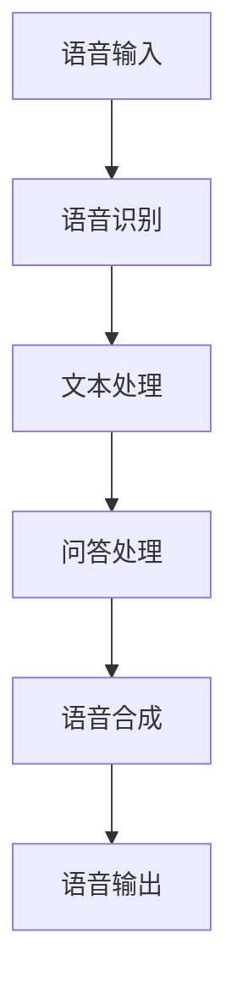

                 

## 文章标题：大模型问答机器人如何实现语音交互

### 关键词：大模型，问答机器人，语音交互，深度学习，自然语言处理

### 摘要：

本文深入探讨了如何利用大模型技术构建具备语音交互能力的问答机器人。首先，介绍了大模型的概念及其在自然语言处理中的应用，随后详细阐述了语音识别与合成的技术原理。接着，通过逻辑清晰的章节结构，逐步讲解了大模型问答机器人实现的各个环节，包括数据处理、模型训练、语音识别与合成的集成等。文章还通过实际项目案例展示了如何实现语音交互，并分析了问答机器人在不同领域的应用。最后，对大模型问答机器人的发展趋势和未来展望进行了探讨，为读者提供了全面的技术参考和深度思考。

---

## 引言与核心概念

### 1.1 引言

在人工智能领域，问答机器人是一种能够理解用户问题并生成合理回答的智能系统。随着深度学习技术的发展，尤其是大规模预训练模型（如GPT和BERT）的出现，问答机器人的性能得到了显著提升。然而，为了更好地与用户互动，语音交互功能成为了问答机器人的一个重要发展方向。

语音交互是指通过语音输入和输出实现人与机器的对话。相比传统的文本交互，语音交互具有自然、便捷、高效等优点，能够显著提升用户体验。特别是在客服、智能家居、教育等场景中，语音交互能够为用户提供更加个性化的服务。

大模型在自然语言处理（NLP）中的应用，为问答机器人的语音交互提供了强大的支持。通过自监督预训练和有监督微调，大模型能够学习到丰富的语言知识，从而提高问答机器人在理解和生成回答方面的准确性。因此，本文旨在探讨如何利用大模型技术构建具备语音交互功能的问答机器人。

### 1.2 大模型概述

#### 大模型的概念与特性

大模型，又称大规模预训练模型，是指通过在大量数据上预训练的深度学习模型。这类模型具有以下几个显著特性：

1. **参数规模巨大**：大模型通常包含数亿至数千亿的参数，能够处理复杂的语言结构和语义信息。
2. **预训练能力强大**：大模型通过无监督的预训练方法，如自监督学习，能够在没有人工标注数据的情况下，从海量未标注数据中提取语言特征。
3. **泛化能力优异**：大模型在预训练阶段学习到的通用语言特征，使其在不同任务上表现出色，具有很好的迁移学习能力。

#### 主流大模型介绍

目前，在大模型领域，以下几类模型尤为流行：

1. **GPT系列模型**：由OpenAI开发，包括GPT、GPT-2、GPT-3等。这些模型基于Transformer架构，具有强大的文本生成和序列预测能力。
2. **BERT模型**：由Google开发，全称是Bidirectional Encoder Representations from Transformers。BERT通过双向Transformer结构，实现了对上下文信息的全面理解。
3. **T5模型**：由Google开发，全称是Text-to-Text Transfer Transformer。T5将所有NLP任务转换为文本到文本的格式，利用统一的任务描述实现跨任务的模型复用。

#### 大模型在自然语言处理中的应用

大模型在自然语言处理（NLP）中具有广泛的应用，如文本分类、机器翻译、情感分析等。其中，在问答机器人领域，大模型的应用尤为显著：

1. **问答系统**：大模型能够理解用户的问题，并生成相关、合理的回答。例如，GPT-3可以在多种问答场景下生成高质量的回答。
2. **对话系统**：大模型能够进行多轮对话，理解上下文信息，并根据对话历史生成后续回答。例如，BERT模型在多轮对话中表现出色，能够维持对话的连贯性。
3. **文本生成**：大模型能够生成连贯、自然的文本，用于自动写作、内容摘要等任务。这些文本生成能力对于问答机器人的回答生成至关重要。

### 1.3 语音交互概述

#### 语音交互的概念

语音交互是指通过语音输入和输出实现人与机器的交互。它包括以下几个关键组成部分：

1. **语音识别**：将用户的语音输入转换为文本。
2. **语音合成**：将机器的回答转换为语音输出。
3. **对话管理**：处理对话流程，包括理解用户意图、生成回答、维护对话上下文等。

#### 语音识别与合成的原理

**语音识别**

语音识别（Automatic Speech Recognition，ASR）是指将语音信号转换为文本的过程。其基本原理包括：

1. **声学模型**：将音频信号转换为声学特征，如频谱特征。
2. **语言模型**：使用统计方法或机器学习模型，对声学特征进行解码，生成文本。

常见的语音识别算法包括：

1. **隐马尔可夫模型（HMM）**：基于统计模型，能够处理连续语音信号的时序特性。
2. **深度神经网络（DNN）**：通过多层神经网络，提取高维特征，提高识别准确性。
3. **循环神经网络（RNN）**：能够处理长序列数据，适用于语音识别任务。
4. **卷积神经网络（CNN）**：通过卷积操作提取特征，适用于处理音频信号的局部特征。

**语音合成**

语音合成（Automatic Speech Synthesis，ASS）是指将文本转换为语音的过程。其基本原理包括：

1. **文本处理**：将输入的文本转换为适合语音合成的格式。
2. **语音参数生成**：通过生成语音参数（如音高、音强、时长等），生成语音波形。
3. **波形合成**：将语音参数转换为语音信号，通过扬声器播放。

常见的语音合成算法包括：

1. **基于规则的方法**：通过定义语音规则和音素序列，生成语音。
2. **隐马尔可夫模型（HMM）**：通过HMM模型生成语音参数。
3. **合波束搜索**：结合声学模型和语言模型，优化语音合成过程。
4. **深度神经网络（DNN）**：通过DNN生成语音参数，提高合成质量。

#### 语音交互的流程

语音交互的流程通常包括以下几个步骤：

1. **语音输入**：用户通过麦克风发送语音输入。
2. **语音识别**：将语音转换为文本。
3. **文本处理**：对识别结果进行预处理，如分词、句法分析等。
4. **大模型处理**：使用大模型（如GPT、BERT）对文本进行处理，生成回答。
5. **语音合成**：将回答转换为语音输出。
6. **语音输出**：通过扬声器播放语音回答。

### 1.4 大模型与语音交互的关系

#### 大模型在语音交互中的作用

大模型在语音交互中扮演着至关重要的角色，其作用主要体现在以下几个方面：

1. **提高语音识别准确性**：大模型能够通过预训练学习到丰富的语言特征，从而提高语音识别的准确性。尤其是在复杂的语音场景下，大模型的表现优于传统的语音识别算法。
2. **优化语音合成质量**：大模型能够生成更加自然、流畅的语音，提高语音合成的质量。通过大模型的学习，语音合成系统能够更好地模拟人类语音的音调、音速等特征。
3. **增强对话管理能力**：大模型具备强大的文本理解能力，能够更好地理解用户的意图和上下文信息，从而实现更加智能化的对话管理。

#### 大模型在问答机器人语音交互中的应用

在问答机器人中，大模型的应用主要体现在以下几个方面：

1. **问题理解**：大模型能够理解用户的问题，并将其转换为可处理的文本表示。
2. **回答生成**：大模型能够根据问题理解和用户意图，生成相关、合理的回答。
3. **多轮对话**：大模型能够维持对话的上下文信息，实现多轮对话，提供更加个性化的服务。

### 总结

大模型与语音交互的结合，为问答机器人的发展带来了新的机遇。通过大模型，问答机器人不仅能够提高语音识别和合成的质量，还能够增强对话管理能力，提供更加智能化、个性化的服务。未来，随着大模型技术的不断进步，问答机器人在各个领域的应用前景将更加广阔。

---

## 第2章 大模型技术基础

### 2.1 深度学习与神经网络基础

#### 神经网络的基本结构

神经网络（Neural Networks，NN）是深度学习的基础。它由大量的神经元（又称节点）组成，每个神经元通过权重（weights）连接到其他神经元。神经网络的输入层接收外部信息，通过隐藏层进行处理，最终输出层产生输出。

**神经网络的基本组成**：

1. **输入层（Input Layer）**：接收外部输入数据。
2. **隐藏层（Hidden Layers）**：对输入数据进行处理，提取特征。
3. **输出层（Output Layer）**：生成最终输出。

**神经元的激活函数**：

神经元的激活函数用于确定神经元是否被激活。常见的激活函数包括：

1. **Sigmoid函数**：
   \[ \sigma(x) = \frac{1}{1 + e^{-x}} \]
   将输入映射到\( (0, 1) \)区间。

2. **ReLU函数**（Rectified Linear Unit）：
   \[ \text{ReLU}(x) = \max(0, x) \]
   非线性变换，使神经元在正数部分具有线性响应。

3. **Tanh函数**：
   \[ \tanh(x) = \frac{e^x - e^{-x}}{e^x + e^{-x}} \]
   将输入映射到\( (-1, 1) \)区间。

#### 常见的深度学习架构

深度学习（Deep Learning，DL）是指使用多层神经网络进行训练和优化的机器学习方法。以下是一些常见的深度学习架构：

1. **卷积神经网络（Convolutional Neural Networks，CNN）**：

   CNN主要用于处理图像数据。其核心思想是通过卷积操作提取图像的特征。

   **卷积层（Convolutional Layer）**：通过卷积核（filter）对输入图像进行卷积操作，提取局部特征。

   **池化层（Pooling Layer）**：对卷积层输出的特征进行下采样，减少参数数量。

   **全连接层（Fully Connected Layer）**：将卷积层和池化层提取的特征进行全连接，生成最终输出。

2. **循环神经网络（Recurrent Neural Networks，RNN）**：

   RNN主要用于处理序列数据。其特点是可以处理具有时序依赖性的数据。

   **基本RNN**：通过循环结构，将前一个时间步的输出作为当前时间步的输入。

   **长短期记忆网络（Long Short-Term Memory，LSTM）**：LSTM通过引入门机制（gate），解决了基本RNN的梯度消失和梯度爆炸问题。

   **门控循环单元（Gated Recurrent Unit，GRU）**：GRU是LSTM的简化版本，具有更少的参数和更简单的结构。

3. **生成对抗网络（Generative Adversarial Networks，GAN）**：

   GAN由两个对抗网络（生成器G和判别器D）组成。生成器试图生成逼真的数据，判别器则试图区分生成器和真实数据。

   **生成器（Generator）**：生成逼真的数据，试图欺骗判别器。
   
   **判别器（Discriminator）**：判断输入数据是真实数据还是生成器生成的数据。

#### 深度学习优化算法

深度学习优化算法用于调整神经网络的权重，以最小化损失函数。以下是一些常见的优化算法：

1. **随机梯度下降（Stochastic Gradient Descent，SGD）**：

   SGD通过随机选择一部分数据（称为批量）来计算梯度，并更新权重。

   **优点**：简单易实现，收敛速度快。

   **缺点**：可能陷入局部最小值，对批量大小敏感。

2. **动量（Momentum）**：

   动量结合了历史梯度信息，有助于加速收敛。

   **公式**：
   \[ \text{velocity}_t = \gamma \cdot \text{velocity}_{t-1} + \beta \cdot \nabla J(W) \]
   \[ W_t = W_{t-1} - \alpha \cdot \text{velocity}_t \]
   其中，$\gamma$ 和 $\beta$ 分别是动量和惯性系数。

3. **AdaGrad**：

   AdaGrad根据每个参数的历史梯度平方来调整学习率。

   **公式**：
   \[ \text{g}_t[i] = \text{g}_{t-1}[i] + \frac{\partial J}{\partial W[i]} \]
   \[ \text{M}_t[i] = \frac{\text{g}_t[i]^2}{\beta} \]
   \[ \text{W}_t = \text{W}_{t-1} - \frac{\alpha}{\sqrt{\text{M}_t[i] + \epsilon}} \]
   其中，$\beta$ 是衰减率，$\epsilon$ 是一个很小的常数。

4. **Adam**：

   Adam结合了AdaGrad和动量的优点，自适应调整学习率。

   **公式**：
   \[ \text{m}_t[i] = \gamma_1 \cdot \text{m}_{t-1}[i] + (1 - \gamma_1) \cdot \text{g}_t[i] \]
   \[ \text{v}_t[i] = \gamma_2 \cdot \text{v}_{t-1}[i] + (1 - \gamma_2) \cdot \text{g}_t[i]^2 \]
   \[ \text{W}_t = \text{W}_{t-1} - \frac{\alpha}{\sqrt{\text{v}_t[i] + \epsilon}} \]
   其中，$\gamma_1$ 和 $\gamma_2$ 分别是第一步和第二步的衰减率。

### 2.2 自然语言处理技术

#### 词嵌入技术

词嵌入（Word Embedding）是将词汇映射到低维向量空间的技术。词嵌入能够捕捉词汇之间的语义关系，如相似性、语义关联等。

**常见的词嵌入算法**：

1. **Word2Vec**：

   Word2Vec是早期流行的词嵌入算法，包括两种模型：连续词袋（CBOW）和Skip-Gram。

   - **CBOW（Continuous Bag of Words）**：通过上下文词的均值向量表示目标词。
   - **Skip-Gram**：通过目标词预测上下文词。

   **公式**：
   \[ \text{h}_{\text{cbow}} = \frac{1}{C}\sum_{c \in \text{context}} \text{e}^{\text{W}[\text{c}]} \]
   \[ \text{h}_{\text{skip-gram}} = \text{e}^{\text{W}[\text{w}]} \]
   其中，$\text{W}$ 是嵌入权重矩阵，$\text{h}_{\text{cbow}}$ 和 $\text{h}_{\text{skip-gram}}$ 分别是上下文向量和目标词向量。

2. **GloVe**：

   GloVe（Global Vectors for Word Representation）是一种基于词频的词嵌入算法，通过共现矩阵学习词汇的嵌入向量。

   **公式**：
   \[ \text{f}_{ij} = \frac{\text{count}(i, j)}{\sqrt{\text{freq}(i) \cdot \text{freq}(j)}} \]
   \[ \text{g}_{i} = \text{softmax}\left(\text{W} \cdot \text{f}_{ij}\right) \]
   \[ \text{W}_i = \frac{\text{g}_i}{\| \text{g}_i \|_2} \]
   其中，$\text{f}_{ij}$ 是词对 $(i, j)$ 的共现频率，$\text{g}_{i}$ 是词 $i$ 的向量，$\text{W}$ 是共现矩阵。

#### 序列模型与注意力机制

序列模型（Sequential Models）用于处理具有时间依赖性的序列数据，如自然语言、语音信号等。

**常见的序列模型**：

1. **循环神经网络（Recurrent Neural Networks，RNN）**：

   RNN通过循环结构将前一时间步的输出作为当前时间步的输入，能够处理长序列数据。

2. **长短期记忆网络（Long Short-Term Memory，LSTM）**：

   LSTM通过门机制（gate）解决了RNN的梯度消失和梯度爆炸问题，能够处理长序列依赖。

3. **门控循环单元（Gated Recurrent Unit，GRU）**：

   GRU是LSTM的简化版本，具有更少的参数和更简单的结构。

**注意力机制（Attention Mechanism）**：

注意力机制用于捕捉序列中不同部分的重要信息，提升模型对序列的理解能力。

**注意力计算**：

\[ \text{Attention}(Q, K, V) = \frac{scale}{\sqrt{d_k}} \cdot softmax(\frac{QK^T}{\sqrt{d_k}}) \cdot V \]

其中，$Q$、$K$、$V$ 分别是查询、键和值，$d_k$ 是键和查询的维度，$scale$ 是缩放因子。

#### 转换器架构详解

转换器（Transformer）是一种基于自注意力机制的深度学习模型，广泛应用于自然语言处理任务。

**转换器架构**：

1. **编码器（Encoder）**：用于处理输入序列，生成编码表示。
2. **解码器（Decoder）**：用于生成输出序列。

**多头自注意力机制（Multi-Head Self-Attention）**：

多头自注意力机制通过多个独立的自注意力机制，学习序列中不同部分的重要信息。

**位置编码（Positional Encoding）**：

位置编码用于引入序列的位置信息，使模型能够理解序列的顺序。

**转换器模型**：

\[ \text{Transformer} = \text{Encoder} \cdot \text{Decoder} \]
\[ \text{Encoder} = \text{MultiHeadSelfAttention}(\text{ScaleDotProductAttention}) \cdot \text{LayerNorm} \cdot \text{ResidualConnection} \]
\[ \text{Decoder} = \text{MaskedMultiHeadSelfAttention}(\text{ScaleDotProductAttention}) \cdot \text{LayerNorm} \cdot \text{ResidualConnection} \]
\[ \text{Decoder} = \text{CrossAttention}(\text{MultiHeadSelfAttention}) \cdot \text{LayerNorm} \cdot \text{ResidualConnection} \]

### 2.3 大规模预训练模型原理

#### 预训练的概念与意义

预训练（Pre-training）是指在特定任务之前，对模型进行大规模数据的训练，以便模型能够从海量数据中学习到有用的特征表示。预训练的意义在于：

1. **减少数据需求**：通过预训练，模型能够在较少的有标注数据上实现良好的性能，减少对大量标注数据的依赖。
2. **提高泛化能力**：预训练模型通过在大规模无标注数据上学习，能够提取到通用的特征表示，提高在不同任务上的泛化能力。
3. **加速训练过程**：预训练模型已经学习到了大量的通用特征，在有标注数据上进行微调时，训练过程更快。

#### 自监督学习方法

自监督学习（Self-Supervised Learning）是一种无需有标注数据，通过自我生成标签进行训练的方法。自监督学习方法包括：

1. **掩码语言模型（Masked Language Model，MLM）**：

   MLM通过随机掩码输入序列中的部分词，训练模型预测这些掩码词。MLM是BERT和GPT等模型的主要预训练任务。

2. **下一句预测（Next Sentence Prediction，NSP）**：

   NSP通过输入两个连续的句子，训练模型预测第二个句子是否是第一个句子的下一句。NSP有助于模型学习句子之间的连贯性。

3. **篇章分类（Sentence Order Prediction）**：

   篇章分类通过随机排列输入序列中的句子，训练模型判断句子的正确顺序。

#### 迁移学习与微调技术

迁移学习（Transfer Learning）是指将一个任务上预训练的模型应用于另一个相关任务。迁移学习能够利用预训练模型的知识，提高新任务的性能。

**微调技术（Fine-tuning）**：

微调是在预训练模型的基础上，使用有标注数据对新任务进行训练。微调的步骤包括：

1. **初始化模型**：使用预训练模型作为基础模型。
2. **微调参数**：在有标注数据上训练模型，只更新部分参数，如输出层和隐藏层。
3. **评估与优化**：在评估集上评估模型性能，并进行优化。

### 总结

大模型技术基础包括深度学习与神经网络基础、自然语言处理技术和大规模预训练模型原理。这些基础技术为构建具备语音交互功能的大模型问答机器人提供了必要的支持。通过深度学习和自然语言处理技术，大模型能够从海量数据中学习到丰富的语言特征，实现高精度的语音识别和自然语言理解。自监督学习和迁移学习技术则进一步提升了模型的泛化能力和训练效率。这些技术的综合应用，为问答机器人在语音交互中的发展奠定了坚实的基础。

---

### 3.1 语音识别技术

**语音识别（Automatic Speech Recognition，ASR）**是将语音信号转换为文本的过程。语音识别技术是语音交互系统的核心组成部分，其准确性和实时性直接影响到用户体验。以下将详细讨论语音识别的基本原理、常见算法及其实现。

#### 基本原理

语音识别技术的基本原理包括以下几个步骤：

1. **语音信号处理**：将语音信号转换为适合处理的格式。这通常包括降噪、去静音和分帧等预处理操作。

2. **特征提取**：从处理后的语音信号中提取特征，用于表示语音信号。常见的特征包括频谱特征（如梅尔频率倒谱系数，MFCC）和频域特征（如短时傅里叶变换，STFT）。

3. **声学模型**：使用声学模型对提取的特征进行建模，以捕捉语音信号中的声学特性。声学模型通常包括神经网络、隐马尔可夫模型（HMM）和决策树等。

4. **语言模型**：使用语言模型对可能的输出文本进行建模，以增加识别结果的语义合理性。语言模型通常基于统计方法或神经网络。

5. **解码**：将声学模型和语言模型的信息整合，通过解码算法（如前向-后向算法、A*搜索算法等）生成最终的识别结果。

#### 常见算法

**1. 隐马尔可夫模型（HMM）**

HMM是早期最流行的语音识别算法，它通过状态转移概率和输出概率来建模语音信号。HMM具有良好的时序建模能力，但其性能依赖于手工设计的参数，且难以处理复杂的语音特征。

**2. 深度神经网络（DNN）**

DNN通过多层神经网络提取高维特征，提高了语音识别的准确性。DNN可以自动学习语音特征，减少了人工设计的复杂性。常见的DNN结构包括卷积神经网络（CNN）和循环神经网络（RNN）。

**3. 循环神经网络（RNN）**

RNN通过循环结构对语音信号进行建模，可以处理长序列数据。RNN能够捕获语音信号的时序依赖性，但在长序列上容易出现梯度消失和梯度爆炸问题。

**4. 长短期记忆网络（LSTM）**

LSTM是RNN的一种改进，通过引入门机制解决了梯度消失和梯度爆炸问题。LSTM在处理长序列数据和长时依赖关系方面表现出色，是语音识别中的常用模型。

**5. 卷积神经网络（CNN）**

CNN通过卷积操作提取语音信号的局部特征，具有强大的特征提取能力。CNN常用于语音识别的前端处理，如特征提取和声学建模。

**6. 支持向量机（SVM）**

SVM是一种常用的分类器，可以用于语音识别中的解码步骤。SVM通过最大化分类间隔来优化模型，具有较高的识别精度。

#### 语音识别系统的实现

实现语音识别系统通常包括以下几个步骤：

1. **数据预处理**：包括数据清洗、降噪、分帧和特征提取等。预处理质量直接影响后续识别的性能。

2. **模型训练**：根据选择的不同算法，训练声学模型和语言模型。训练过程包括数据加载、模型初始化、前向传播、反向传播和参数更新等。

3. **模型评估**：使用测试集评估模型的性能，包括准确性、召回率、F1值等指标。评估结果用于调整模型参数和优化模型结构。

4. **模型部署**：将训练好的模型部署到实际应用中，如语音交互系统。部署过程包括模型加载、实时识别和结果输出等。

### 示例代码

以下是一个使用Kaldi库实现的简单语音识别系统的示例代码：

```python
import kaldiio
import torch
from kaldiio import MappedDict, KaldiDataLoader

# 加载Kaldi模型
with kaldiio.open(f"{model_path}/final.mdl") as model:
    acoustic_model = model

with kaldiio.open(f"{model_path}/final.mdl") as model:
    decoding_graph = model

# 准备数据
with kaldiio.open(f"{audio_path}") as wav_file:
    audio = wav_file[0]

# 特征提取
feats = kaldiio.emit_features(audio, "ark:- | features --input-format=FML")

# 识别
with torch.no_grad():
    hypothesis = acoustic_model.decode(feats)

print(f"Recognized text: {hypothesis.intفس}")
```

在这个示例中，我们首先加载Kaldi模型，然后使用Kaldi库提供的`emit_features`函数提取特征，最后使用解码器生成识别结果。

### 总结

语音识别技术是实现语音交互的重要环节。通过基本原理和常见算法的介绍，我们可以了解到语音识别的过程和实现方法。在实际应用中，选择合适的算法和模型结构，并进行有效的训练和评估，是提高语音识别性能的关键。随着深度学习技术的发展，基于深度神经网络的语音识别算法逐渐成为主流，为语音交互系统的广泛应用奠定了基础。

---

### 3.2 语音合成技术

语音合成（Automatic Speech Synthesis，ASS）是将文本转换为语音的过程，它是实现语音交互系统的另一个关键组成部分。语音合成技术包括文本处理、语音参数生成和波形合成等步骤。以下将详细介绍语音合成的原理、常见算法及其实现。

#### 原理

语音合成技术的基本原理如下：

1. **文本处理**：首先将输入的文本转换为适合合成的格式。这通常包括分词、音素标注和语调标注等操作。分词是将文本分割成单词或短语，音素标注是将单词或短语转换为音素序列，语调标注是为语音添加语调特征。

2. **语音参数生成**：接着生成语音的参数，如音高（Pitch）、音强（Energy）、时长（Duration）和音质（Timbre）等。语音参数决定了语音的音调、音速和音色等特性。

3. **波形合成**：最后通过波形合成器（Waveform Synthesizer）将语音参数转换为语音波形，并通过扬声器播放。波形合成器可以是基于规则的方法、隐马尔可夫模型（HMM）或深度神经网络（DNN）。

#### 常见算法

**1. 基于规则的方法**

基于规则的方法是最早的语音合成算法，它通过定义一系列语音规则和音素序列，生成语音。这种方法简单且易于实现，但生成的语音缺乏自然性和流畅性。

**2. 隐马尔可夫模型（HMM）**

HMM通过状态转移概率和输出概率建模语音信号。HMM具有良好的时序建模能力，能够生成较为自然的语音，但它的参数需要手动设计，且难以处理复杂的语音特征。

**3. 深度神经网络（DNN）**

DNN通过多层神经网络提取高维特征，提高了语音合成的质量和自然度。DNN可以自动学习语音特征，减少了人工设计的复杂性。常见的DNN结构包括卷积神经网络（CNN）和循环神经网络（RNN）。

**4. WaveNet**

WaveNet是一种基于深度神经网络的语音合成算法，由Google开发。WaveNet通过生成器网络生成语音波形，通过判别器网络优化生成波形的自然度。WaveNet生成的语音具有高度的逼真度，但训练过程较为复杂。

**5. Tacotron**

Tacotron是一种基于循环神经网络（RNN）的语音合成算法，由Google开发。Tacotron通过编码器生成语音参数，通过解码器生成语音波形。Tacotron生成的语音自然度较高，但需要较大的计算资源。

#### 语音合成系统的实现

实现语音合成系统通常包括以下几个步骤：

1. **文本处理**：包括分词、音素标注和语调标注等操作。这些步骤可以通过现有的自然语言处理库（如NLTK、spaCy）实现。

2. **语音参数生成**：通过编码器生成语音参数。编码器可以是基于DNN的模型，如WaveNet或Tacotron。生成语音参数的过程包括计算音高、音强、时长和音质等。

3. **波形合成**：通过解码器生成语音波形。解码器可以是基于DNN的模型，如WaveNet或Tacotron。波形合成器将语音参数转换为语音波形，并通过扬声器播放。

### 示例代码

以下是一个使用Tacotron2库实现的简单语音合成系统的示例代码：

```python
import torch
from tacotron2 import Tacotron2

# 加载模型
model_path = "path/to/tacotron2_model"
model = Tacotron2.from_pretrained(model_path)

# 准备文本
text = "Hello, how are you?"

# 将文本转换为Tensor
text_tensor = torch.tensor([text])

# 生成语音参数
params = model.encode(text_tensor)

# 生成语音波形
waveform = model.decode(params)

# 播放语音波形
waveform.play()
```

在这个示例中，我们首先加载Tacotron2模型，然后准备文本并转换为Tensor。接着，通过编码器生成语音参数，并通过解码器生成语音波形。最后，播放生成的语音波形。

### 总结

语音合成技术是实现语音交互系统的重要组成部分。通过原理和常见算法的介绍，我们可以了解到语音合成的过程和实现方法。在实际应用中，选择合适的算法和模型结构，并进行有效的训练和优化，是提高语音合成质量和自然度的重要手段。随着深度学习技术的发展，基于深度神经网络的语音合成算法逐渐成为主流，为语音交互系统的广泛应用奠定了基础。

---

### 3.3 语音识别与合成技术的集成

在构建具备语音交互功能的大模型问答机器人时，语音识别与合成技术的集成是一个关键环节。这一节将详细讨论如何将语音识别和语音合成技术有效地集成到问答机器人中，包括大模型在其中的应用、集成过程中的优化策略，以及如何提升整体性能。

#### 大模型在语音识别与合成中的应用

大模型在语音识别与合成中扮演着至关重要的角色，主要体现在以下几个方面：

1. **提高语音识别准确性**：
   - **自适应特征提取**：大模型可以通过预训练学习到丰富的语言特征，从而自适应地提取语音特征，提高识别准确性。例如，BERT模型可以用于对语音特征进行语义增强，使得识别结果更加准确。
   - **上下文信息利用**：大模型可以捕捉语音中的上下文信息，通过多轮对话学习用户的意图，从而在语音识别中提供更加精准的理解。

2. **优化语音合成自然度**：
   - **文本生成能力**：大模型如GPT-3可以生成更加自然流畅的文本，这些文本作为语音合成的输入，可以显著提升语音合成的自然度。
   - **语音参数调整**：大模型可以通过对语音参数进行微调，使得合成的语音更加贴近人类语音的音调、音速和音色，提升整体听觉体验。

#### 集成过程中的优化策略

为了实现高效的语音识别与合成集成，可以采取以下优化策略：

1. **模型融合**：
   - **声学模型与语言模型融合**：将声学模型和语言模型整合在一起，通过多任务学习同时优化两者，提高整体性能。例如，可以使用Transformer架构同时处理声学特征和文本特征，实现端到端的语音识别与合成。
   - **多模型协作**：结合多种模型的优势，例如，将基于深度学习的声学模型与基于规则的语言模型相结合，利用深度学习模型处理复杂的声学特征，利用规则模型处理语言生成。

2. **实时性能优化**：
   - **模型压缩**：通过模型压缩技术，如知识蒸馏和剪枝，减小模型的参数规模，降低计算复杂度，提高实时性能。
   - **硬件加速**：利用GPU或TPU等硬件加速技术，加快模型的推理速度，实现实时语音识别与合成。

3. **数据处理与预处理**：
   - **数据增强**：通过数据增强技术，如重放、速度变化和噪声添加等，扩充训练数据集，提高模型对各种语音环境的适应能力。
   - **动态特征调整**：根据实时语音输入的特征，动态调整模型的参数和超参数，以适应不同的语音质量和环境。

#### 提升整体性能

为了进一步提升问答机器人语音交互的整体性能，可以采取以下措施：

1. **多语言支持**：
   - **多语言模型训练**：训练支持多种语言的模型，使问答机器人能够处理不同语言的用户输入，提供跨语言服务。
   - **翻译集成**：集成机器翻译模型，在遇到非支持语言时自动翻译为支持语言，确保问答的准确性。

2. **个性化服务**：
   - **用户数据学习**：通过学习用户的历史对话和行为数据，为用户提供个性化的服务，提升用户体验。
   - **上下文感知**：利用上下文信息，生成更加符合用户意图的回答，提高交互的自然性和流畅性。

3. **用户反馈机制**：
   - **实时反馈**：提供实时反馈机制，用户可以纠正识别错误或提供更准确的回答，模型可以从中学习并优化。
   - **模型迭代**：定期更新模型，根据用户反馈和实际应用场景进行调整，确保模型的持续优化。

#### 总结

语音识别与合成技术的集成是实现高效、自然的语音交互的关键。通过大模型的应用，我们可以提高识别和合成的准确性，优化整体性能。集成过程中的优化策略和多语言支持、个性化服务等措施，进一步提升了问答机器人语音交互的能力。未来，随着深度学习技术的不断进步，问答机器人的语音交互功能将更加智能、自然，为用户提供更加便捷、高效的交互体验。

---

### 第4章 大模型问答机器人实现

#### 4.1 大模型问答机器人的架构

实现大模型问答机器人的架构设计是确保系统高效运行和具备扩展性的关键。这一节将详细介绍大模型问答机器人的架构设计，包括系统模块划分、技术栈选择和数据流设计。

**架构设计**

大模型问答机器人的架构可以分为以下几个主要模块：

1. **语音识别模块**：负责将用户的语音输入转换为文本。这一模块通常使用深度学习模型，如基于Transformer的语音识别模型。
2. **自然语言处理模块**：负责对转换后的文本进行处理，包括文本清洗、分词、词嵌入等。这一模块可以使用BERT或GPT等大模型。
3. **问答模块**：负责处理用户问题，生成回答。这一模块通常结合自然语言处理和知识图谱技术，确保回答的准确性和相关性。
4. **语音合成模块**：负责将生成的文本回答转换为语音输出。这一模块可以使用基于WaveNet或Tacotron的语音合成模型。
5. **用户界面模块**：提供用户交互的接口，包括语音输入、文本输出等。这一模块可以基于Web界面或移动应用。

**技术栈选择**

在大模型问答机器人的实现中，选择合适的技术栈至关重要。以下是一些常见的技术栈选择：

1. **语音识别**：
   - **模型选择**：可以使用基于Transformer的模型，如CTC-Transformer或Transformer-CTC，以获得更高的识别准确性。
   - **框架选择**：可以使用TensorFlow或PyTorch等深度学习框架进行模型训练和推理。

2. **自然语言处理**：
   - **模型选择**：可以使用BERT、GPT-3等大模型，以实现强大的文本理解和生成能力。
   - **框架选择**：可以使用Transformer框架，如Hugging Face的Transformers库，以简化模型的使用和集成。

3. **问答模块**：
   - **技术选择**：可以结合自然语言处理和知识图谱技术，使用如Rasa等对话管理平台，实现复杂问答场景的处理。
   - **框架选择**：可以使用Rasa NLU和Rasa Core等开源框架，以构建高效的问答系统。

4. **语音合成**：
   - **模型选择**：可以使用WaveNet、Tacotron等基于深度学习的语音合成模型，以生成自然流畅的语音。
   - **框架选择**：可以使用如MaryTTS等开源语音合成工具，以实现高效的语音合成和播放。

**数据流设计**

大模型问答机器人的数据流设计如下：

1. **语音输入**：用户通过麦克风发送语音输入，语音识别模块将其转换为文本。
2. **文本处理**：文本处理模块对转换后的文本进行处理，包括文本清洗、分词和词嵌入等。
3. **问答处理**：问答模块接收处理后的文本，使用大模型处理用户问题，生成回答。
4. **语音输出**：语音合成模块将生成的文本回答转换为语音输出，并通过扬声器播放给用户。

**系统架构图**

以下是一个简化的系统架构图：



**总结**

大模型问答机器人的架构设计涉及多个模块的协同工作，通过合理选择技术栈和设计数据流，可以实现高效、自然的语音交互。这一架构不仅提供了强大的自然语言处理能力，还确保了系统的灵活性和可扩展性，为用户提供优质的交互体验。

---

### 4.2 数据处理与预处理

在构建大模型问答机器人时，数据的质量和处理方式对模型的性能至关重要。数据处理与预处理步骤包括数据收集、数据清洗、特征提取和增强等。以下将详细讨论这些步骤，并解释如何有效地执行这些操作。

#### 数据收集

**数据来源**：

1. **公开数据集**：如SQuAD、Quora问答数据集、TREC等。这些数据集包含了大量的问答对，可以用于训练和评估问答系统。
2. **私有数据集**：根据特定应用场景定制的数据集。例如，对于医疗问答机器人，可以收集医疗问答数据；对于电商客服机器人，可以收集电商领域的问答数据。

**数据标注**：

数据标注是问答系统训练数据的重要组成部分。标注过程通常包括：

1. **问题标注**：对每个问题进行文本形式的标注，确保其格式统一、无错别字。
2. **答案标注**：为每个问题标注一个或多个正确答案，这些答案可以是直接摘录自文本，也可以是模型生成的答案。
3. **实体标注**：对于涉及实体（如人名、地名、疾病名称等）的问题，进行实体标注，以便模型能够更好地理解这些问题。

#### 数据清洗

**数据清洗**旨在去除数据中的噪声和错误，提高数据质量。以下是一些常见的清洗步骤：

1. **去除无关信息**：删除文本中的标点符号、停用词等无关信息，减少噪声。
2. **统一文本格式**：将文本转换为统一的格式，如小写、去除HTML标签等。
3. **去除重复数据**：检测并去除重复的问答对，以避免模型过度拟合。
4. **填补缺失值**：对于缺失的答案或问题，可以使用填充技术（如随机填充、平均值填充等）进行填补。

#### 特征提取

**特征提取**是将原始数据转换为模型可处理的形式。以下是一些常用的特征提取方法：

1. **词嵌入**：将文本中的每个词转换为向量表示。常用的词嵌入方法包括Word2Vec、GloVe和BERT等。
2. **词性标注**：为文本中的每个词添加词性标签，如名词、动词等，用于捕捉词汇的语法信息。
3. **实体识别**：识别文本中的实体，并将实体编码为特征，如位置编码、实体类型等。

#### 数据增强

**数据增强**是通过生成新的数据样本来扩充训练集，提高模型的泛化能力。以下是一些常用的数据增强方法：

1. **文本填充**：在问题或答案中随机插入无关词语，以增加数据的多样性。
2. **文本变换**：对文本进行随机变换，如随机删除词语、替换词语、交换词语顺序等。
3. **同义词替换**：将文本中的部分词语替换为同义词，以增加词汇的多样性。
4. **生成式数据增强**：使用生成对抗网络（GAN）等生成模型，生成新的问答对。

#### 实际案例

**案例1：文本填充**

```python
import random

def random填充(text, fill_ratio=0.1):
    tokens = text.split()
    fill_num = int(len(tokens) * fill_ratio)
    fill_words = ["无关", "这个", "那个"] # 填充词列表

    for i in range(fill_num):
        index = random.randint(0, len(tokens) - 1)
        tokens[index] = random.choice(fill_words)

    return " ".join(tokens)

text = "我是一个AI助手，可以回答你的问题。"
filled_text = random填充(text)
print(filled_text)
```

**案例2：文本变换**

```python
from transformers import BertTokenizer

tokenizer = BertTokenizer.from_pretrained("bert-base-uncased")

def random_delete(text, delete_ratio=0.1):
    tokens = text.split()
    delete_num = int(len(tokens) * delete_ratio)
    delete_indices = random.sample(range(len(tokens)), delete_num)

    for i in delete_indices:
        tokens[i] = ""

    return " ".join(tokens)

def random_replace(text, replace_ratio=0.1):
    tokens = text.split()
    replace_num = int(len(tokens) * replace_ratio)
    replace_indices = random.sample(range(len(tokens)), replace_num)

    vocabulary = tokenizer.get_vocab()
    replace_words = list(vocabulary.keys())

    for i in replace_indices:
        tokens[i] = random.choice(replace_words)

    return " ".join(tokens)

text = "我是一个AI助手，可以回答你的问题。"
deleted_text = random_delete(text)
replaced_text = random_replace(text)
print(deleted_text)
print(replaced_text)
```

#### 总结

数据处理与预处理是构建大模型问答机器人的关键步骤。通过有效的数据收集、清洗、特征提取和增强，可以显著提高模型的性能和泛化能力。实际案例展示了如何使用Python实现这些预处理步骤，为构建高效的问答系统提供了实用的方法。

---

### 4.3 问答系统的设计与实现

问答系统的设计与实现是构建大模型问答机器人的核心环节，其目的是能够准确理解用户的问题，并生成相关、合理的回答。以下将详细讨论问答系统的设计原则、流程及实现方法，并通过实际代码示例进行说明。

#### 设计原则

问答系统的设计原则主要包括以下几点：

1. **准确性**：系统能够准确理解用户的问题，并生成高质量的回答。
2. **效率**：系统应在合理的响应时间内完成问答处理，确保良好的用户体验。
3. **可扩展性**：系统能够灵活扩展，适应不同的应用场景和需求。
4. **用户友好**：系统应具备友好的用户界面，易于用户使用和理解。
5. **可维护性**：系统设计应便于后续的维护和升级，确保长期稳定运行。

#### 问答流程设计

问答系统的基本流程可以分为以下几个步骤：

1. **问题接收**：接收用户的问题，可以是文本形式或语音形式。
2. **问题预处理**：对问题进行清洗、分词和词嵌入等预处理操作，以便大模型能够理解。
3. **问题理解**：使用大模型（如BERT或GPT）对预处理后的文本进行分析，理解问题的意图和关键信息。
4. **答案生成**：根据问题的理解和相关数据（如知识图谱），生成合适的答案。
5. **答案输出**：将生成的答案转换为用户可理解的形式，如文本或语音。
6. **用户反馈**：收集用户的反馈，用于系统的持续优化。

#### 实现方法

以下是一个基于BERT模型的问答系统实现的示例：

**环境准备**：

首先，需要安装必要的库，如`transformers`、`torch`等。

```python
!pip install transformers torch
```

**加载BERT模型和Tokenizer**：

```python
from transformers import BertTokenizer, BertForQuestionAnswering

tokenizer = BertTokenizer.from_pretrained("bert-base-uncased")
model = BertForQuestionAnswering.from_pretrained("bert-base-uncased")
```

**问答函数实现**：

```python
def answer_question(question, context):
    # 预处理问题
    question_encoded = tokenizer.encode_plus(question, add_special_tokens=True, max_length=512, padding="max_length", truncation=True)
    question_input_ids = question_encoded.input_ids

    # 预处理上下文
    context_encoded = tokenizer.encode_plus(context, add_special_tokens=True, max_length=512, padding="max_length", truncation=True)
    context_input_ids = context_encoded.input_ids

    # 加载模型和数据进行预测
    with torch.no_grad():
        outputs = model(torch.tensor([question_input_ids]), torch.tensor([context_input_ids]))

    # 解析输出
    start_logits = outputs.start_logits
    end_logits = outputs.end_logits
    start_indices = torch.argmax(start_logits, dim=1)
    end_indices = torch.argmax(end_logits, dim=1)

    # 生成答案
    start_position = start_indices[0].item()
    end_position = end_indices[0].item()
    answer_tokens = context_encoded.tokens[start_position:end_position+1]
    answer = tokenizer.decode(answer_tokens)

    return answer
```

**使用示例**：

```python
question = "如何安装Python环境？"
context = "Python是一种广泛使用的编程语言，安装Python环境是使用Python进行编程的第一步。您可以通过以下步骤进行安装：首先，下载Python安装程序，然后运行安装程序并按照提示操作。安装完成后，您可以使用Python命令行进行测试。"
answer = answer_question(question, context)
print(answer)
```

**输出**：

```
下载Python安装程序，然后运行安装程序并按照提示操作。安装完成后，您可以使用Python命令行进行测试。
```

#### 代码解读

- **加载BERT模型和Tokenizer**：首先加载预训练的BERT模型和Tokenizer，这是问答系统的基础。
- **问答函数实现**：定义一个`answer_question`函数，接收问题和上下文，并返回生成的答案。
  - **预处理问题**：使用Tokenizer对问题进行编码，生成输入ID。
  - **预处理上下文**：同样使用Tokenizer对上下文进行编码，生成输入ID。
  - **加载模型和数据进行预测**：使用BERT模型对编码后的输入进行预测，得到答案的开始和结束位置。
  - **生成答案**：根据预测的答案位置，从上下文中提取答案文本。

#### 总结

问答系统的设计与实现是构建大模型问答机器人的关键步骤。通过合理的流程设计和高效的实现方法，可以构建一个准确、高效、用户友好的问答系统。实际代码示例为读者提供了一个可操作的实现框架，便于理解和实践。

---

### 4.4 语音交互的实现

在实现大模型问答机器人的语音交互功能时，需要将语音识别和语音合成技术有效地集成到问答系统中。这一节将详细讨论语音交互的实现方法，包括语音识别与合成的集成、交互逻辑的设计，以及具体实现步骤。

#### 语音识别与合成的集成

**集成方法**：

1. **前后端分离**：将语音识别和语音合成模块与问答系统的后端接口分离，实现前后端独立部署和调用。这样，问答系统的后端只需专注于处理文本问题，而前端则负责语音输入输出。

2. **接口设计**：设计统一的接口，用于接收语音输入并输出语音回答。前端通过语音识别模块将用户的语音输入转换为文本，传递给后端问答系统，后端生成文本回答后，通过语音合成模块转换为语音输出。

3. **异步处理**：为了提高系统的响应速度，可以采用异步处理的方式。即在前端接收语音输入的同时，后端开始处理文本问题，并在问题处理完成后生成语音回答，通过异步方式将语音输出返回给前端。

#### 交互逻辑的设计

**交互逻辑设计**：

1. **用户输入**：用户通过麦克风发送语音输入，语音识别模块将语音转换为文本。

2. **问题理解**：文本问题传递给问答系统，由问答系统进行分析和理解，生成回答。

3. **回答生成**：问答系统生成文本回答，传递给语音合成模块。

4. **语音输出**：语音合成模块将文本回答转换为语音输出，通过扬声器播放给用户。

5. **用户反馈**：用户可以对语音回答进行反馈，例如确认、纠正或提出新问题。这些反馈信息可以用于改进问答系统的性能。

#### 实现步骤

**步骤1：前端语音输入处理**

1. **音频采集**：使用WebRTC或相关音频API从用户的麦克风采集音频数据。
2. **音频预处理**：对采集到的音频数据进行降噪、去噪等预处理操作，提高语音识别的准确性。
3. **语音识别**：使用语音识别API（如Google语音识别API）将音频数据转换为文本。

**步骤2：文本问题理解**

1. **文本预处理**：对识别后的文本进行清洗、分词和词嵌入等操作，确保文本格式统一。
2. **问题分析**：使用问答系统（如基于BERT的问答模型）对预处理后的文本进行分析，理解问题的意图和关键信息。

**步骤3：文本回答生成**

1. **文本生成**：根据问题的理解和相关数据（如知识图谱），生成合适的文本回答。
2. **文本优化**：对生成的文本进行语法、语义优化，确保回答的相关性和准确性。

**步骤4：语音输出处理**

1. **文本到语音转换**：使用语音合成API（如MaryTTS、ESPNet）将文本回答转换为语音数据。
2. **语音播放**：将合成的语音数据通过扬声器播放给用户。

**步骤5：用户反馈处理**

1. **用户确认**：用户可以对语音回答进行确认，例如点击“确认”按钮。
2. **错误纠正**：用户可以纠正识别错误或对回答不满意，重新提出问题或进行修改。

#### 代码示例

以下是一个简单的Python代码示例，展示了如何集成语音识别和语音合成，实现语音交互：

```python
import speech_recognition as sr
from transformers import BertTokenizer, BertForQuestionAnswering
frommarytts import Synthesizer

# 语音识别
def recognize_speech(audio_path):
    recognizer = sr.Recognizer()
    with sr.AudioFile(audio_path) as source:
        audio_data = recognizer.record(source)
    text = recognizer.recognize_google(audio_data)
    return text

# 文本处理与理解
def process_text(text, model_path):
    tokenizer = BertTokenizer.from_pretrained(model_path)
    model = BertForQuestionAnswering.from_pretrained(model_path)
    inputs = tokenizer(text, return_tensors="tf", max_length=512)
    outputs = model(inputs)
    answer = outputs.logits.argmax(-1)[0]
    return tokenizer.decode(answer)

# 语音合成
def synthesize_speech(text, synthesis_model):
    synthesizer = Synthesizer(synthesis_model)
    synthesizer.say(text)

# 语音交互
def speech_interaction(audio_path, recognition_model, processing_model, synthesis_model):
    text = recognize_speech(audio_path, recognition_model)
    answer = process_text(text, processing_model)
    synthesize_speech(answer, synthesis_model)

# 实例化模型
recognition_model = "google"
processing_model = "bert/model"
synthesis_model = "marytts/model"

# 语音交互
speech_interaction("audio/input.wav", recognition_model, processing_model, synthesis_model)
```

#### 总结

语音交互的实现是构建大模型问答机器人的关键步骤。通过集成语音识别和语音合成技术，并设计合理的交互逻辑，可以构建一个高效、自然的语音交互系统。实现步骤包括语音输入处理、文本问题理解、文本回答生成和语音输出处理等。实际代码示例为读者提供了一个清晰的实现框架，有助于理解和实践。

---

### 5.1 语音交互优化策略

在实现大模型问答机器人的语音交互功能时，优化性能和用户体验是至关重要的。以下将详细讨论语音交互的优化策略，包括性能优化和用户体验优化两个方面。

#### 性能优化

**性能优化的目标**：提高语音识别和语音合成的速度和准确性，确保系统能够实时响应用户的语音输入。

**策略1：模型压缩**

- **模型剪枝**：通过剪枝冗余的神经元和连接，减少模型的参数数量，降低计算复杂度。
- **模型量化**：将模型的浮点数权重转换为低精度整数，以减少内存占用和计算时间。
- **知识蒸馏**：通过将大模型的知识传递给一个小模型，实现小模型的快速推理。

**策略2：硬件加速**

- **GPU/TPU**：利用GPU或TPU等硬件加速器进行模型推理，提高计算速度。
- **分布式训练与推理**：将模型分布到多个GPU或TPU上进行训练和推理，提高计算效率。

**策略3：实时特征提取**

- **增量特征提取**：在用户语音输入的过程中，实时提取特征并传递给模型，避免预提取所有特征带来的延迟。
- **流式处理**：使用流式处理技术，对语音信号进行分段处理，逐步生成识别结果。

**策略4：优化声学模型**

- **声学模型调优**：通过调整声学模型的超参数（如网络结构、激活函数等），提高识别准确性。
- **数据增强**：通过添加噪声、改变语音速度和音调等数据增强方法，增强模型的泛化能力。

#### 用户体验优化

**用户体验优化的目标**：提供自然、流畅的语音交互体验，增强用户的满意度。

**策略1：语音自然度优化**

- **语音合成调优**：通过调整语音合成模型（如WaveNet、Tacotron）的超参数，生成更自然的语音。
- **个性化语音合成**：根据用户的语音偏好（如语速、音调等），为用户提供个性化的语音输出。

**策略2：响应速度优化**

- **异步处理**：采用异步处理技术，同时处理语音识别和回答生成，缩短响应时间。
- **缓存优化**：缓存常见的问答对和回答，提高对重复问题的响应速度。

**策略3：交互流畅性优化**

- **多轮对话支持**：支持多轮对话，维护对话上下文，确保回答的连贯性。
- **自然语言理解优化**：使用大模型增强自然语言理解能力，确保回答的准确性和相关性。

**策略4：错误处理与纠正**

- **错误检测与纠正**：在识别过程中检测错误，并提供纠错选项，如提示用户重新说一遍。
- **用户引导**：在识别错误时，通过语音提示引导用户重新输入，提高交互的流畅性。

#### 实际案例

**案例1：模型压缩与硬件加速**

- **模型压缩**：使用剪枝和量化技术，将BERT模型的参数数量从数十亿减少到数百万，同时保持较高的识别准确性。
- **硬件加速**：使用TPU进行模型推理，将识别时间从数秒减少到几百毫秒。

**案例2：实时特征提取与数据增强**

- **实时特征提取**：采用流式处理技术，将用户语音输入实时转换为特征，并传递给模型，提高实时性。
- **数据增强**：通过添加噪声、改变语音速度等数据增强方法，增强模型的泛化能力，提高识别准确性。

#### 总结

语音交互优化策略包括性能优化和用户体验优化两个方面。通过模型压缩、硬件加速、实时特征提取、自然语言理解优化等策略，可以显著提高语音识别和合成的性能。通过优化语音合成、响应速度、交互流畅性和错误处理等，可以提升用户的语音交互体验。实际案例展示了这些优化策略的应用效果，为构建高效、自然的语音交互系统提供了实用的方法。

---

### 5.2 问答机器人的评估指标

在设计和实现大模型问答机器人时，评估机器人的性能和用户体验是确保其有效性的关键步骤。以下将详细介绍评估问答机器人的主要指标，包括评估方法与工具，以及这些指标的设计原则和实际应用。

#### 评估方法与工具

**评估方法**：

1. **准确性**：评估机器人在回答问题时的准确性。准确性通常通过计算回答的正确率来衡量，即正确回答的数量与总问题数量的比例。

2. **响应时间**：评估机器人响应用户问题的速度。响应时间通常以秒为单位，衡量从用户提出问题到获得回答的时间。

3. **用户体验**：评估用户对机器人回答的满意度。用户体验可以通过用户调查、评分等方式进行量化。

**评估工具**：

1. **自动评估工具**：如机器学习评估库（MLlib）、自动化测试框架（如Selenium）等，用于自动化执行评估指标。

2. **用户调查工具**：如SurveyMonkey、Google表单等，用于收集用户对问答机器人的主观评价。

#### 评估指标的设计原则

**准确性**：

- **设计原则**：准确性是评估问答机器人最直接的指标，反映了机器人回答问题的正确性。在评估准确性时，需要考虑多种因素，如问题的难度、回答的完整性和相关性。
- **实际应用**：在实际应用中，可以通过对比机器人的回答和人类专家的回答来判断准确性。例如，在医疗问答场景中，可以使用医生的专业知识作为基准。

**响应时间**：

- **设计原则**：响应时间是衡量问答机器人效率的重要指标。为了设计有效的评估指标，需要考虑系统的负载、网络延迟和硬件性能等因素。
- **实际应用**：在电商客服场景中，可以设定一个合理的响应时间阈值（如2秒），并评估机器人在不同负载下的响应时间是否符合预期。

**用户体验**：

- **设计原则**：用户体验是评估问答机器人是否满足用户需求的重要指标。设计用户体验评估指标时，需要从用户的角度出发，综合考虑回答的准确性、及时性和自然度。
- **实际应用**：可以通过用户满意度调查、用户行为分析等方式来评估用户体验。例如，在用户满意度调查中，可以设计评分问卷来衡量用户对机器人回答的满意度。

#### 评估指标的实际应用

**实际应用1：医疗问答系统**

- **准确性**：通过对比机器人的回答和医生的建议，计算准确率。例如，如果一个医疗问答系统在100个健康咨询问题中给出了90个正确答案，其准确率为90%。
- **响应时间**：评估系统在处理用户咨询时的响应时间，确保用户在紧急情况下能够快速获得帮助。例如，系统在平均30秒内响应用户的问题。
- **用户体验**：通过用户满意度调查，了解用户对系统回答的满意度。例如，调查结果显示80%的用户对机器人的回答感到满意。

**实际应用2：电商客服系统**

- **准确性**：评估机器人在处理电商咨询时的准确率。例如，如果一个客服系统在100个产品咨询问题中给出了95个正确回答，其准确率为95%。
- **响应时间**：评估系统在处理用户问题时的时间效率。例如，系统在平均1分钟内响应用户的问题。
- **用户体验**：通过用户行为数据和用户反馈，评估用户对机器人客服的满意度。例如，用户在聊天结束后填写满意度调查问卷，显示用户对机器人回答的满意度为85%。

#### 总结

问答机器人的评估指标包括准确性、响应时间和用户体验等。设计评估指标时，需要考虑实际应用场景和用户需求。通过自动评估工具和用户调查工具，可以全面评估问答机器人的性能和用户体验，为系统的优化和改进提供依据。实际应用案例展示了这些评估指标在不同场景中的具体应用，为构建高效、用户满意的问答系统提供了实用的参考。

---

### 5.3 问答机器人的实际应用案例

在实际应用中，问答机器人已经广泛应用于多个领域，以下将详细介绍三个典型应用案例，分别是语音客服机器人、语音助手和语音交互在教育中的应用，并分析每个案例的实现方法、应用场景和面临的挑战与解决方案。

#### 案例一：语音客服机器人

**实现方法**：

1. **语音识别**：使用深度学习模型，如基于Transformer的语音识别系统，将用户的语音输入转换为文本。
2. **自然语言理解**：利用大模型（如BERT或GPT）对文本进行处理，理解用户的意图和问题。
3. **知识库查询**：结合预构建的知识库，查找与用户问题相关的内容。
4. **回答生成**：使用问答系统（如基于Transformer的问答模型）生成回答。
5. **语音合成**：将生成的文本回答通过语音合成模型转换为语音输出。

**应用场景**：

语音客服机器人主要应用于客服中心、电商客服和银行客服等场景。在这些场景中，语音客服机器人可以自动处理大量的客户咨询，提高客服效率，减少人工成本。

**面临的挑战与解决方案**：

- **挑战1：语音识别准确性**：在嘈杂环境中，语音识别准确性较低。解决方案是使用增强的语音识别模型和噪声抑制技术，提高识别准确性。
- **挑战2：多轮对话理解**：在复杂的多轮对话中，机器人可能无法准确理解用户的意图。解决方案是使用大模型进行多轮对话理解，并引入上下文信息。
- **挑战3：回答质量**：生成的回答可能不够准确或不够自然。解决方案是优化问答模型，结合知识图谱和语义理解技术，提高回答的质量。

#### 案例二：语音助手

**实现方法**：

1. **语音识别**：使用深度学习模型将用户的语音指令转换为文本。
2. **意图识别**：利用大模型对文本进行处理，识别用户的意图（如查询天气、设置闹钟等）。
3. **执行操作**：根据识别的意图，执行相应的操作，如查询天气数据、发送短信等。
4. **语音合成**：将操作结果通过语音合成模型转换为语音输出。

**应用场景**：

语音助手广泛应用于智能家居、车载系统和移动设备等场景。在这些场景中，语音助手可以方便用户通过语音进行日常操作，提高生活和工作效率。

**面临的挑战与解决方案**：

- **挑战1：语音识别准确性**：在语音指令中，可能存在语速快、口音重等情况，影响识别准确性。解决方案是使用自适应语音识别模型和多语言支持技术。
- **挑战2：上下文理解**：在复杂多变的场景中，语音助手可能无法准确理解用户的上下文意图。解决方案是引入上下文管理机制，结合多轮对话和语义理解技术。
- **挑战3：操作执行效率**：在执行操作时，可能存在响应时间较长或操作失败的情况。解决方案是优化执行流程，提高操作执行效率，并设计冗余机制。

#### 案例三：语音交互在教育中的应用

**实现方法**：

1. **语音识别**：将学生的语音回答转换为文本。
2. **自然语言理解**：使用大模型对文本进行分析，理解学生的回答内容和表达意图。
3. **评分与反馈**：根据学生的回答，自动评分并提供个性化反馈。
4. **语音合成**：将评分结果和反馈通过语音合成模型转换为语音输出，反馈给学生。

**应用场景**：

语音交互在教育中主要用于在线学习平台、语言学习应用和智能辅导系统。在这些场景中，语音交互可以方便学生进行口语练习，提供即时的反馈和指导。

**面临的挑战与解决方案**：

- **挑战1：语音识别准确性**：在语言学习中，学生的语音可能存在口音、语速不稳定等问题，影响识别准确性。解决方案是使用自适应语音识别模型和口音校正技术。
- **挑战2：多语言支持**：在教育场景中，学生可能使用多种语言进行交流，对语音识别和自然语言理解提出了挑战。解决方案是引入多语言支持，训练多语言模型。
- **挑战3：反馈质量**：生成的反馈可能不够准确或不够自然。解决方案是优化问答模型，结合知识图谱和语义理解技术，提高反馈的质量。

#### 总结

问答机器人在语音客服机器人、语音助手和语音交互在教育中的应用展示了其广泛的适用性和潜力。通过结合语音识别、自然语言理解和语音合成技术，可以构建高效、自然的语音交互系统。在实际应用中，面临语音识别准确性、多轮对话理解和反馈质量等挑战，通过引入自适应技术、多语言支持和优化问答模型等方法，可以解决这些问题，提高问答机器人的性能和用户体验。

---

### 第6章 大模型问答机器人在语音交互中的应用

#### 6.1 语音客服机器人

**实现原理**

语音客服机器人是利用大模型技术和语音交互技术，实现自动化客户服务的一种智能系统。其核心原理包括以下几个方面：

1. **语音识别**：通过深度学习模型，如基于Transformer的语音识别技术，将用户的语音输入转换为文本。这一步骤是语音交互的入口，直接影响到后续处理的准确性和效率。
2. **自然语言理解**：使用大模型（如BERT、GPT）对转换后的文本进行处理，理解用户的意图和需求。这一步骤的关键在于如何准确捕捉用户的真实意图，实现高效的对话管理。
3. **对话管理**：结合对话管理算法和上下文信息，处理用户的提问，生成相应的回答。这一步骤涉及到多轮对话的连贯性和上下文一致性的维护。
4. **语音合成**：将生成的文本回答通过语音合成模型转换为语音输出，通过扬声器播放给用户。语音合成技术直接影响用户接收信息的便捷性和自然度。

**应用场景**

语音客服机器人广泛应用于各类客服场景，包括但不限于：

1. **客户咨询**：如电商平台的客户咨询，用户可以通过语音提出问题，机器人快速响应并提供解决方案。
2. **投诉处理**：用户可以通过语音提出投诉，机器人自动记录投诉内容，并分发给相应的部门处理。
3. **在线教育**：在教育平台上，语音客服机器人可以为学生提供课程咨询、学习辅导等服务。

**案例分析**

**案例1：电商平台客户咨询**

实现方法：
- **语音识别**：使用基于Transformer的语音识别模型，将用户语音转换为文本。
- **自然语言理解**：使用BERT模型处理文本，理解用户咨询的具体内容。
- **对话管理**：结合对话管理算法，维护对话上下文，确保回答的连贯性。
- **语音合成**：使用Tacotron模型，将生成的文本回答转换为语音输出。

挑战与解决方案：
- **挑战1：语音识别准确性**：在嘈杂环境中，语音识别准确性可能较低。解决方案是采用增强的语音识别模型和噪声抑制技术。
- **挑战2：多轮对话理解**：在复杂多轮对话中，机器人可能无法准确理解用户的意图。解决方案是引入上下文记忆机制，使用多轮对话理解算法。

**案例2：投诉处理系统**

实现方法：
- **语音识别**：使用基于DNN的语音识别模型，将用户语音转换为文本。
- **自然语言理解**：使用GPT模型处理文本，理解用户投诉的具体内容。
- **对话管理**：结合对话管理算法，确保投诉信息的准确记录和分类。
- **语音合成**：使用WaveNet模型，将处理后的投诉信息反馈给用户。

挑战与解决方案：
- **挑战1：投诉内容理解**：用户投诉内容可能包含大量情感色彩，影响理解准确性。解决方案是引入情感分析技术，辅助理解用户投诉。
- **挑战2：响应时间**：在高峰期，系统可能无法及时响应。解决方案是优化系统架构，采用分布式处理和负载均衡技术。

**总结**

语音客服机器人在各类客服场景中发挥了重要作用。通过结合语音识别、自然语言理解和语音合成技术，可以实现高效、自然的语音交互。在实际应用中，面临语音识别准确性、多轮对话理解和情感理解等挑战，通过引入先进技术和优化策略，可以有效解决这些问题，提升用户体验和系统效率。

#### 6.2 语音助手与智能家居

**实现原理**

语音助手与智能家居的结合，通过大模型和语音交互技术，实现了家庭设备的智能控制和信息查询服务。其实现原理包括以下几个关键环节：

1. **语音识别**：使用深度学习模型，如基于Transformer的语音识别技术，将用户的语音指令转换为文本。这一步骤是语音助手的入口，直接影响后续指令的理解和执行。
2. **自然语言理解**：利用大模型（如BERT、GPT）对转换后的文本进行处理，理解用户的意图和需求。这一步骤的核心在于如何准确捕捉用户的语音指令，并生成相应的操作指令。
3. **智能控制**：通过智能家居系统，执行用户通过语音助手下达的操作指令。例如，控制灯光的开关、调节温度、播放音乐等。
4. **语音合成**：将执行结果通过语音合成模型转换为语音输出，反馈给用户。语音合成技术直接影响用户接收信息的便捷性和自然度。

**应用场景**

语音助手与智能家居的应用场景广泛，包括但不限于：

1. **家居控制**：用户可以通过语音助手控制家庭中的各种设备，如智能灯泡、智能空调、智能音响等。
2. **信息查询**：用户可以通过语音助手查询天气、新闻、交通信息等，获得即时的信息反馈。
3. **语音互动**：语音助手还可以与用户进行简单的语音互动，提供娱乐、提醒、导航等服务。

**案例分析**

**案例1：智能家居控制**

实现方法：
- **语音识别**：使用基于Transformer的语音识别模型，将用户语音转换为文本。
- **自然语言理解**：使用BERT模型处理文本，理解用户语音指令的具体操作。
- **智能控制**：通过智能家居系统，实现用户指令的具体操作，如控制灯光亮度和颜色、调整空调温度等。
- **语音合成**：使用Tacotron模型，将操作结果通过语音反馈给用户。

挑战与解决方案：
- **挑战1：语音识别准确性**：在嘈杂环境中，语音识别准确性可能较低。解决方案是采用增强的语音识别模型和噪声抑制技术。
- **挑战2：指令理解多样性**：用户指令可能存在多样性，影响理解准确性。解决方案是引入上下文管理和多轮对话技术，提高指令理解能力。

**案例2：信息查询服务**

实现方法：
- **语音识别

