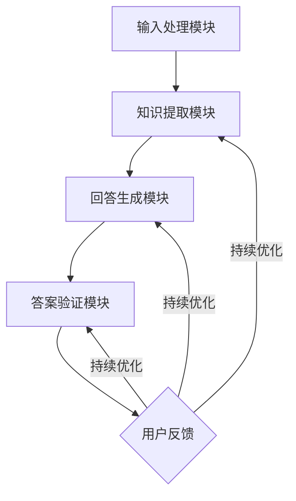

                 

### 文章标题

# 《大模型问答机器人如何生成回答》

### 关键词

- 大模型
- 问答系统
- 自然语言处理
- 生成模型
- 知识图谱

### 摘要

本文深入探讨了大模型问答机器人如何生成回答的过程。从基础概念、技术框架、关键组件、开发流程到实际项目实战，再到前沿技术展望，文章全面解析了大模型问答机器人的核心原理与应用场景。通过一步步的分析和推理，本文旨在为读者提供清晰的指导，帮助理解大模型问答机器人的工作原理，以及其在实际应用中的优势与挑战。

---

### 《大模型问答机器人如何生成回答》目录大纲

## 第一部分：大模型问答机器人基础

### 第1章：大模型问答机器人概述

1.1 大模型问答机器人的定义与作用

1.2 大模型问答机器人与传统问答系统的区别

1.3 大模型问答机器人在各行业中的应用场景

### 第2章：大模型问答机器人技术基础

2.1 自然语言处理技术概述

2.2 大模型原理与技术框架

2.3 大模型训练与优化方法

### 第3章：大模型问答机器人关键组件

3.1 输入处理模块

3.2 知识提取模块

3.3 回答生成模块

3.4 答案验证模块

### 第4章：大模型问答机器人开发流程

4.1 数据收集与预处理

4.2 大模型选择与训练

4.3 问答系统架构设计

4.4 系统部署与优化

## 第二部分：大模型问答机器人项目实战

### 第5章：大模型问答机器人实战项目一：智能客服

5.1 项目背景与需求分析

5.2 数据收集与预处理

5.3 大模型选择与训练

5.4 实现智能客服问答功能

5.5 项目评估与优化

### 第6章：大模型问答机器人实战项目二：医学问答

6.1 项目背景与需求分析

6.2 数据收集与预处理

6.3 大模型选择与训练

6.4 实现医学问答功能

6.5 项目评估与优化

## 第7章：大模型问答机器人前沿技术展望

7.1 大模型问答机器人技术发展趋势

7.2 未来可能的应用场景

7.3 技术挑战与解决方案

## 附录

### 附录A：大模型问答机器人常用工具与资源

A.1 大模型问答机器人开发工具

A.2 大模型问答机器人开源资源

A.3 大模型问答机器人学习资源

---

## 第1章：大模型问答机器人概述

### 1.1 大模型问答机器人的定义与作用

大模型问答机器人是一种基于大规模预训练语言模型的智能问答系统。它通过深度学习和自然语言处理技术，能够自动理解和回答用户提出的问题。大模型问答机器人在各领域有着广泛的应用，如智能客服、医学问答、教育辅助等。

- **定义**：
  - 大模型问答机器人：利用大规模预训练语言模型进行知识问答的人工智能系统。
  - 语言模型：一种基于大量文本数据训练的模型，用于生成或预测文本。

- **作用**：
  - 提高效率：自动回答常见问题，减轻人工负担。
  - 提升服务质量：提供准确、个性化的回答，增强用户体验。
  - 降低成本：减少人力投入，节省运营成本。

### 1.2 大模型问答机器人与传统问答系统的区别

- **技术基础**：
  - 传统问答系统：基于规则或关键词匹配的简单问答系统。
  - 大模型问答机器人：基于深度学习和自然语言处理技术，具备更强的语义理解和生成能力。

- **数据处理**：
  - 传统问答系统：依赖预定义的规则库或关键词库。
  - 大模型问答机器人：通过大规模数据预训练，能够自动学习和理解复杂问题。

- **应用范围**：
  - 传统问答系统：适用于简单、明确的问答场景。
  - 大模型问答机器人：适用于复杂、模糊的问答场景，尤其是在专业领域。

### 1.3 大模型问答机器人在各行业中的应用场景

- **客服领域**：
  - 自动回答用户咨询，提高客户满意度。
  - 减轻客服人员工作负担，提高工作效率。

- **医疗领域**：
  - 提供医学知识查询，辅助医生诊断。
  - 回答患者问题，提供健康建议。

- **教育领域**：
  - 自动解答学生疑问，提供个性化学习建议。
  - 帮助教师进行知识讲解，提高教学质量。

- **金融领域**：
  - 自动回答金融问题，提供投资建议。
  - 帮助客户办理业务，提高服务效率。

## 第2章：大模型问答机器人技术基础

### 2.1 自然语言处理技术概述

自然语言处理（NLP）是计算机科学领域与人工智能领域中的一个重要方向。它涉及到对人类语言的自动处理和理解。以下是NLP的一些核心任务：

- **文本分类**：将文本分类到预定义的类别中。
- **情感分析**：识别文本中的情感倾向，如正面、负面或中性。
- **命名实体识别**：识别文本中的特定实体，如人名、地名、组织名等。
- **机器翻译**：将一种语言的文本翻译成另一种语言。
- **对话系统**：构建能够与人类自然交流的系统。

NLP的发展历程可以分为三个阶段：

- **早期**：基于规则的方法。这种方法依赖于专家手动编写的规则，以识别和处理文本。
- **中期**：基于统计的方法。这种方法使用概率模型和统计技术来处理文本，如隐马尔可夫模型（HMM）和条件概率模型。
- **当前**：基于深度学习的方法。这种方法使用神经网络，尤其是深度神经网络（DNN）和循环神经网络（RNN），来处理文本数据，取得了显著的进展。

### 2.2 大模型原理与技术框架

大模型（如GPT-3、BERT等）是近年来自然语言处理领域的重要突破。以下是大模型的原理和技术框架：

- **原理**：
  - 大模型是基于深度学习的神经网络架构，通常包含数亿个参数。
  - 它们通过在大规模文本数据上进行预训练，学习到了丰富的语言模式和知识。
  - 预训练后，大模型可以通过微调来适应特定的任务。

- **技术框架**：
  - **语言模型**：用于预测下一个词的概率，如GPT系列。
  - **生成模型**：用于生成新的文本，如BERT和T5。
  - **对话模型**：用于理解和生成对话文本，如BlenderBot。

### 2.3 大模型训练与优化方法

大模型的训练和优化是一个复杂的过程，涉及到多个方面：

- **预训练**：
  - 预训练是指在大规模无标签文本数据上进行训练。
  - 在预训练过程中，模型学习到了通用语言知识和模式。
  - 预训练通常使用两种技术：自回归语言模型（如GPT）和掩码语言模型（如BERT）。

- **微调**：
  - 微调是指在大规模有标签数据上进行训练，以适应特定的任务。
  - 微调过程中，模型会根据特定任务的数据进行调整。
  - 微调可以显著提高模型在特定任务上的性能。

- **优化方法**：
  - **参数共享**：不同任务使用相同的模型参数。
  - **迁移学习**：利用预训练模型在相关任务上进行优化。
  - **对抗训练**：提高模型对对抗性攻击的鲁棒性。

### 第3章：大模型问答机器人关键组件

大模型问答机器人由多个关键组件组成，每个组件都在整个系统中扮演着重要的角色。以下是这些组件的详细描述：

#### 3.1 输入处理模块

输入处理模块是问答机器人的第一步，它负责接收并处理用户的输入问题。以下是该模块的关键技术和实现细节：

- **接收输入**：
  - 用户可以通过文本、语音等多种方式输入问题。
  - 模块需要将不同形式的输入转化为统一的文本格式。

- **预处理**：
  - **分词**：将输入文本分割成单词或子词。
  - **去停用词**：去除常见的无意义词汇，如“的”、“了”等。
  - **词干提取**：将单词还原到其基本形式，如“playing”还原为“play”。

- **语义解析**：
  - 分析输入文本的意图和关键词，以便为后续处理做准备。
  - 使用词向量或BERT等预训练模型进行语义表示。

#### 3.2 知识提取模块

知识提取模块负责从大规模数据中提取与问题相关的知识。以下是该模块的关键技术和实现细节：

- **知识库**：
  - 建立一个包含实体、关系和属性的知识库。
  - 知识库可以通过手工构建或自动抽取获得。

- **实体识别**：
  - 使用命名实体识别（NER）技术，从输入文本中识别出关键词和实体。
  - 例如，识别出“北京”是一个地名，“苹果”是一个水果。

- **关系抽取**：
  - 从知识库中抽取实体之间的关系，如“张三”是“李四”的“朋友”。
  - 这可以通过关系提取算法实现，如基于规则的方法或深度学习方法。

- **知识融合**：
  - 将提取的知识进行整合，以形成对问题的全面理解。

#### 3.3 回答生成模块

回答生成模块是问答机器人的核心，它负责根据提取的知识生成回答。以下是该模块的关键技术和实现细节：

- **回答策略**：
  - 根据问题的复杂程度和知识库的大小，选择不同的回答策略。
  - 例如，对于简单问题，可以直接从知识库中提取答案；对于复杂问题，可能需要使用生成模型生成回答。

- **文本生成**：
  - 使用预训练的生成模型（如GPT-3）生成高质量的回答。
  - 生成模型可以生成连贯、自然的文本，但可能需要后续的编辑和优化。

- **模板匹配**：
  - 对于简单的问题，可以使用预定义的模板生成回答。
  - 例如，对于“何时是春节？”这样的问题，可以直接使用“春节是在XX月XX日”这样的模板回答。

#### 3.4 答案验证模块

答案验证模块负责验证生成的回答是否准确和合理。以下是该模块的关键技术和实现细节：

- **答案质量评估**：
  - 使用自动评估指标（如BLEU、ROUGE等）评估答案的质量。
  - 这些指标可以衡量答案与参考答案的相似度。

- **语义对比**：
  - 对生成的答案与参考答案进行语义对比，确保回答的准确性和一致性。
  - 这可以通过对比答案的语义表示实现，如使用BERT或相似性度量方法。

- **用户反馈**：
  - 允许用户对答案进行评价，并根据用户反馈不断优化系统。
  - 这有助于提高答案的准确性和用户满意度。

### 第4章：大模型问答机器人开发流程

大模型问答机器人的开发是一个复杂的过程，涉及到多个阶段和任务。以下是详细的开发流程：

#### 4.1 数据收集与预处理

数据收集与预处理是问答机器人开发的基础，以下是其关键步骤：

- **数据收集**：
  - 收集与问答主题相关的文本数据，包括对话记录、FAQ、专业文献等。
  - 数据来源可以是公开数据集、企业内部数据或第三方数据服务。

- **数据预处理**：
  - **数据清洗**：去除噪声数据，如广告、垃圾信息等。
  - **数据标注**：为训练数据添加标签，如问题、答案、实体等。
  - **数据分片**：将数据分为训练集、验证集和测试集。

- **文本处理**：
  - **分词**：将文本分割成单词或子词。
  - **去停用词**：去除常见的无意义词汇。
  - **词干提取**：将单词还原到其基本形式。

#### 4.2 大模型选择与训练

大模型选择与训练是问答机器人开发的重点，以下是其关键步骤：

- **大模型选择**：
  - 根据应用场景和需求选择合适的大模型，如GPT-3、BERT、T5等。
  - 需要考虑模型的规模、性能和训练时间。

- **模型架构**：
  - 了解所选大模型的架构，包括输入层、隐藏层和输出层。
  - 例如，GPT-3的架构包含多个Transformer层。

- **预训练**：
  - 在大规模无标签文本数据上进行预训练，使模型学习到通用语言知识和模式。
  - 预训练过程中，模型会学习到文本的语法、语义和知识。

- **微调**：
  - 在特定任务数据上进行微调，使模型适应特定任务。
  - 微调过程中，模型会根据任务数据进行调整，以提高性能。

#### 4.3 问答系统架构设计

问答系统架构设计是问答机器人开发的核心，以下是其关键步骤：

- **系统架构**：
  - 设计系统的整体架构，包括输入处理、知识提取、回答生成和答案验证等模块。
  - 确定各模块之间的交互和数据处理流程。

- **接口设计**：
  - 设计系统的API接口，以便与其他系统或应用程序集成。
  - 接口应支持多种输入格式和输出格式。

- **性能优化**：
  - 对系统进行性能优化，包括提高数据处理速度、减少内存占用等。
  - 可以使用分布式计算、模型压缩等技术进行优化。

#### 4.4 系统部署与优化

系统部署与优化是问答机器人开发的关键步骤，以下是其关键步骤：

- **部署**：
  - 将训练好的模型部署到服务器或云平台，提供问答服务。
  - 需要考虑服务器的性能、可靠性和可扩展性。

- **监控**：
  - 监控系统的运行状态，包括模型性能、服务响应时间和错误率等。
  - 及时发现和解决系统问题。

- **优化**：
  - 根据用户反馈和监控数据，不断优化模型和系统。
  - 可以通过调整模型参数、优化算法和增加数据等方式进行优化。

### 第5章：大模型问答机器人实战项目一：智能客服

#### 5.1 项目背景与需求分析

智能客服项目旨在为企业提供高效的客户服务解决方案。以下是项目的背景和需求分析：

- **项目背景**：
  - 随着企业业务的增长，客户咨询量不断增加，传统的客服模式已难以满足需求。
  - 企业需要提供24/7全天候的客服服务，以提高客户满意度和忠诚度。

- **需求分析**：
  - 回答常见问题，如产品使用、订单查询等。
  - 减轻人工客服的工作负担，提高工作效率。
  - 提供个性化的服务，增强用户体验。

#### 5.2 数据收集与预处理

数据收集与预处理是智能客服项目的基础，以下是其关键步骤：

- **数据收集**：
  - 收集企业的客服对话记录、FAQ文档、产品手册等。
  - 数据来源可以是企业内部系统、第三方数据服务或开源数据集。

- **预处理**：
  - **数据清洗**：去除噪声数据，如广告、垃圾信息等。
  - **数据标注**：为训练数据添加标签，如问题、答案、实体等。
  - **文本处理**：包括分词、去停用词、词干提取等。

#### 5.3 大模型选择与训练

大模型选择与训练是智能客服项目的核心，以下是其关键步骤：

- **大模型选择**：
  - 选择适合客服领域的大模型，如GPT-3、BERT等。
  - 需要考虑模型的性能、训练时间和可扩展性。

- **模型架构**：
  - 了解所选大模型的架构，包括输入层、隐藏层和输出层。
  - 例如，GPT-3的架构包含多个Transformer层。

- **预训练**：
  - 在大规模无标签客服数据上进行预训练，使模型学习到客服领域的通用知识。
  - 预训练过程中，模型会学习到客户咨询的常见问题和回答。

- **微调**：
  - 在特定客服数据上进行微调，使模型适应企业的具体需求。
  - 微调过程中，模型会根据企业数据进行调整，以提高性能。

#### 5.4 实现智能客服问答功能

实现智能客服问答功能是项目的关键步骤，以下是其关键步骤：

- **输入处理**：
  - 接收用户输入的问题，并进行预处理，如分词、去停用词等。
  - 使用预训练模型对输入问题进行语义表示。

- **知识提取**：
  - 从知识库中提取与问题相关的信息，如FAQ、产品手册等。
  - 使用命名实体识别（NER）技术识别输入问题中的关键词和实体。

- **回答生成**：
  - 根据提取的知识生成回答，可以使用预定义的模板或生成模型。
  - 例如，对于“如何退货？”这样的问题，可以直接使用“您可以按照以下步骤退货”这样的模板回答。

- **答案验证**：
  - 对生成的答案进行验证，确保回答的准确性和合理性。
  - 可以使用自动评估指标（如BLEU、ROUGE等）和用户反馈进行评估。

#### 5.5 项目评估与优化

项目评估与优化是智能客服项目的持续过程，以下是其关键步骤：

- **评估**：
  - 使用自动评估指标（如BLEU、ROUGE等）和用户反馈评估系统的性能。
  - 评估指标应包括回答的准确性、速度和用户满意度。

- **优化**：
  - 根据评估结果，不断优化模型和系统。
  - 可以通过调整模型参数、增加训练数据和优化算法进行优化。

- **迭代**：
  - 进行多次迭代，不断改进系统的性能和用户体验。
  - 可以通过A/B测试等方法比较不同优化策略的效果。

### 第6章：大模型问答机器人实战项目二：医学问答

#### 6.1 项目背景与需求分析

医学问答项目旨在为医疗机构提供准确的医学知识查询和咨询服务。以下是项目的背景和需求分析：

- **项目背景**：
  - 医学领域的信息量大且专业性强，患者和医生需要快速获取准确的信息。
  - 随着互联网和人工智能技术的发展，医学问答系统成为提升医疗服务质量的重要工具。

- **需求分析**：
  - 回答患者关于疾病、症状、治疗方法等常见问题。
  - 提供医学知识查询功能，辅助医生诊断和治疗。
  - 减轻医生的工作负担，提高医疗工作效率。

#### 6.2 数据收集与预处理

数据收集与预处理是医学问答项目的基础，以下是其关键步骤：

- **数据收集**：
  - 收集医学领域的文本数据，包括医学文献、患者咨询记录、疾病知识库等。
  - 数据来源可以是医疗机构内部系统、学术期刊、公开数据集等。

- **预处理**：
  - **数据清洗**：去除噪声数据，如广告、无关信息等。
  - **数据标注**：为训练数据添加标签，如问题、答案、实体等。
  - **文本处理**：包括分词、去停用词、词干提取等。

#### 6.3 大模型选择与训练

大模型选择与训练是医学问答项目的核心，以下是其关键步骤：

- **大模型选择**：
  - 选择适合医学领域的大模型，如BERT、RoBERTa等。
  - 需要考虑模型的性能、训练时间和可扩展性。

- **模型架构**：
  - 了解所选大模型的架构，包括输入层、隐藏层和输出层。
  - 例如，BERT的架构包含Transformer层和双向语言模型。

- **预训练**：
  - 在大规模无标签医学数据上进行预训练，使模型学习到医学领域的通用知识。
  - 预训练过程中，模型会学习到医学术语、疾病关系等。

- **微调**：
  - 在特定医学数据上进行微调，使模型适应医疗机构的实际需求。
  - 微调过程中，模型会根据医疗数据进行调整，以提高性能。

#### 6.4 实现医学问答功能

实现医学问答功能是医学问答项目的关键步骤，以下是其关键步骤：

- **输入处理**：
  - 接收用户输入的问题，并进行预处理，如分词、去停用词等。
  - 使用预训练模型对输入问题进行语义表示。

- **知识提取**：
  - 从医学知识库中提取与问题相关的信息，如疾病症状、治疗方法等。
  - 使用命名实体识别（NER）技术识别输入问题中的关键词和实体。

- **回答生成**：
  - 根据提取的知识生成回答，可以使用预定义的模板或生成模型。
  - 例如，对于“糖尿病的治疗方法有哪些？”这样的问题，可以直接使用“糖尿病的治疗方法包括以下几种”这样的模板回答。

- **答案验证**：
  - 对生成的答案进行验证，确保回答的准确性和合理性。
  - 可以使用自动评估指标（如BLEU、ROUGE等）和医学专家的评估。

#### 6.5 项目评估与优化

项目评估与优化是医学问答项目的持续过程，以下是其关键步骤：

- **评估**：
  - 使用自动评估指标（如BLEU、ROUGE等）和医学专家评估系统的性能。
  - 评估指标应包括回答的准确性、速度和用户满意度。

- **优化**：
  - 根据评估结果，不断优化模型和系统。
  - 可以通过调整模型参数、增加训练数据和优化算法进行优化。

- **迭代**：
  - 进行多次迭代，不断改进系统的性能和用户体验。
  - 可以通过A/B测试等方法比较不同优化策略的效果。

### 第7章：大模型问答机器人前沿技术展望

#### 7.1 大模型问答机器人技术发展趋势

随着人工智能和自然语言处理技术的快速发展，大模型问答机器人在技术上也取得了显著进步。以下是一些主要的发展趋势：

- **多模态融合**：
  - 融合文本、图像、语音等多模态数据，提高问答系统的理解和生成能力。
  - 例如，结合文本和图像的医学问答系统，可以更准确地识别疾病和提供治疗建议。

- **自适应学习**：
  - 问答系统可以根据用户反馈和场景动态调整模型，提高回答的准确性和个性化程度。
  - 例如，通过在线学习，系统可以不断更新和优化，以适应新的问题和场景。

- **知识增强**：
  - 利用外部知识库和语义网络，增强问答系统的知识库和语义理解能力。
  - 例如，结合知识图谱的问答系统，可以提供更全面和准确的回答。

#### 7.2 未来可能的应用场景

大模型问答机器人具有广泛的应用前景，以下是一些可能的未来应用场景：

- **自动化客户服务**：
  - 在电子商务、金融、旅游等行业，大模型问答机器人可以提供高效的客户服务，回答常见问题，处理投诉和咨询。

- **专业领域问答**：
  - 在医学、法律、金融等专业领域，大模型问答机器人可以提供专业的知识查询和咨询服务，辅助专业人士的工作。

- **智能健康咨询**：
  - 大模型问答机器人可以提供个性化的健康建议和疾病预防知识，帮助用户了解健康问题，提高健康管理水平。

#### 7.3 技术挑战与解决方案

尽管大模型问答机器人在技术和应用上取得了显著进展，但仍然面临一些挑战：

- **数据质量**：
  - 确保数据质量是提高问答系统性能的关键。需要去除噪声数据，确保数据的准确性和一致性。
  - **解决方案**：使用数据清洗和预处理技术，建立高质量的数据集。

- **鲁棒性**：
  - 提高大模型对异常数据和对抗性攻击的鲁棒性，是确保系统稳定性的关键。
  - **解决方案**：使用对抗训练、模型蒸馏等技术提高模型的鲁棒性。

- **知识更新**：
  - 随着知识的不断更新，问答系统需要及时更新其知识库，以提供最新和最准确的信息。
  - **解决方案**：建立自动化的知识更新机制，结合实时数据和外部知识源。

## 附录A：大模型问答机器人常用工具与资源

### A.1 大模型问答机器人开发工具

以下是一些常用的大模型问答机器人开发工具：

- **Hugging Face Transformers**：一个开源的Python库，用于构建和训练大模型。
- **TensorFlow**：一个开源的机器学习框架，适用于大规模数据计算和模型训练。
- **PyTorch**：一个开源的机器学习库，提供灵活的深度学习模型构建和训练工具。

### A.2 大模型问答机器人开源资源

以下是一些开源资源，可以用于大模型问答机器人的开发和学习：

- **OpenAI GPT-3**：OpenAI提供的强大语言模型，可以通过API进行访问和使用。
- **CMUDialogue System**：卡内基梅隆大学开源的对话系统框架，包括多个对话系统的实现。

### A.3 大模型问答机器人学习资源

以下是一些学习资源，可以帮助了解大模型问答机器人的原理和应用：

- **《Deep Learning》**：深度学习领域的经典教材，涵盖了自然语言处理和大模型的相关内容。
- **Coursera上的NLP课程**：由知名专家讲授的自然语言处理课程，包括大模型和问答系统等内容。

## 作者信息

作者：AI天才研究院/AI Genius Institute & 禅与计算机程序设计艺术 /Zen And The Art of Computer Programming

---

### 文章标题

# 大模型问答机器人如何生成回答

### 文章关键词

- 大模型
- 问答系统
- 自然语言处理
- 生成模型
- 知识图谱

### 文章摘要

本文深入探讨了大模型问答机器人的生成回答过程。从概述、技术基础、关键组件、开发流程到实际项目实战，再到前沿技术展望，文章全面解析了大模型问答机器人的核心原理与应用场景。通过一步步的分析和推理，本文旨在为读者提供清晰的指导，帮助理解大模型问答机器人的工作原理，以及其在实际应用中的优势与挑战。

---

## 第1章：大模型问答机器人概述

### 1.1 大模型问答机器人的定义与作用

大模型问答机器人是一种基于大规模预训练语言模型的智能问答系统。它通过深度学习和自然语言处理技术，能够自动理解和回答用户提出的问题。这种机器人具有以下几个显著特点：

- **大规模预训练**：大模型问答机器人利用大规模无标签文本数据（如互联网上的大量网页、书籍、新闻等）进行预训练。预训练过程中，模型学习到了语言的基本规则、语法结构、语义含义和知识信息，从而具备了强大的语言理解和生成能力。

- **高效率**：由于大模型经过了大规模预训练，因此在回答问题时具有很高的效率。在处理用户提问时，机器人可以快速定位相关信息，并生成高质量的回答。

- **个性化**：大模型问答机器人能够根据用户的提问历史和偏好，提供个性化的回答。通过学习用户的提问习惯和关注点，机器人可以更好地满足用户的需求。

- **多语言支持**：大模型问答机器人通常支持多种语言，可以应对不同语言环境下的问答需求。

大模型问答机器人在各个领域都有着广泛的应用：

- **客服领域**：大模型问答机器人可以自动回答客户的问题，提高客户满意度，减轻客服人员的工作负担。

- **医疗领域**：大模型问答机器人可以提供医学知识查询，辅助医生诊断，回答患者问题，提供健康建议。

- **教育领域**：大模型问答机器人可以解答学生的疑问，提供个性化学习建议，帮助教师进行知识讲解，提高教学质量。

- **金融领域**：大模型问答机器人可以回答金融问题，提供投资建议，帮助客户办理业务，提高服务效率。

总之，大模型问答机器人作为一种先进的人工智能技术，具有巨大的应用潜力，为各个领域提供了高效的解决方案。

### 1.2 大模型问答机器人与传统问答系统的区别

传统问答系统通常基于规则或关键词匹配，而大模型问答机器人则基于深度学习和自然语言处理技术，具有以下几个显著区别：

- **技术基础**：

  - 传统问答系统：基于规则或关键词匹配的简单问答系统。这些系统通常依赖于预定义的规则库或关键词库，通过匹配用户输入与规则库或关键词库中的规则或关键词来生成回答。

  - 大模型问答机器人：基于深度学习和自然语言处理技术，具备更强的语义理解和生成能力。大模型问答机器人通过在大规模文本数据上进行预训练，学习到了复杂的语言模式和知识，从而能够自动理解和回答用户提出的问题。

- **数据处理**：

  - 传统问答系统：依赖预定义的规则库或关键词库。这些系统通常无法处理复杂的语义关系和语境，只能回答简单明确的问题。

  - 大模型问答机器人：通过大规模数据预训练，能够自动学习和理解复杂问题。大模型问答机器人可以理解用户的自然语言输入，并从中提取关键信息，从而生成高质量的回答。

- **应用范围**：

  - 传统问答系统：适用于简单、明确的问答场景，如常见问题的自动回答、搜索引擎等。

  - 大模型问答机器人：适用于复杂、模糊的问答场景，特别是在专业领域，如医疗、法律、金融等。

### 1.3 大模型问答机器人在各行业中的应用场景

大模型问答机器人在各行业中的应用场景丰富多样，下面将具体介绍其在客服、医疗、教育和金融领域的应用：

- **客服领域**：

  - 智能客服：大模型问答机器人可以自动回答客户的常见问题，如产品咨询、订单查询、售后服务等。通过自然语言处理技术，机器人可以理解客户的提问，并在大规模的知识库中提取相关信息，生成准确的回答。这大大提高了客服效率，降低了人工成本，同时提升了客户满意度。

  - 聊天机器人：大模型问答机器人可以与用户进行自然语言对话，提供24/7的全天候服务。通过与用户的互动，机器人可以不断学习和优化自己的回答，从而更好地满足用户的需求。

- **医疗领域**：

  - 医学问答：大模型问答机器人可以提供医学知识查询服务，回答患者关于疾病、症状、治疗方法等的问题。通过结合医学知识库和自然语言处理技术，机器人可以提供准确的医学信息，辅助医生进行诊断和治疗。

  - 辅助诊断：大模型问答机器人可以分析患者的症状描述，结合医学知识库和先前的病例数据，提出可能的诊断建议。这有助于医生快速了解病情，提高诊断的准确性。

- **教育领域**：

  - 个性化辅导：大模型问答机器人可以为学生提供个性化辅导，解答学生在学习过程中遇到的问题。通过自然语言处理技术，机器人可以理解学生的提问，并在教材和教学资源中提取相关信息，生成详细的解答。

  - 自动批改作业：大模型问答机器人可以自动批改学生的作业，提供即时反馈。通过与学生的互动，机器人可以不断优化批改算法，提高批改的准确性和效率。

- **金融领域**：

  - 投资建议：大模型问答机器人可以分析市场数据，提供个性化的投资建议。通过与用户的互动，机器人可以了解用户的风险偏好和投资目标，从而生成适合用户的投资策略。

  - 客户服务：大模型问答机器人可以自动回答客户的金融问题，如账户查询、转账操作、理财产品介绍等。通过自然语言处理技术，机器人可以理解客户的提问，并在金融知识库中提取相关信息，生成详细的回答。

总之，大模型问答机器人在各行业中的应用，极大地提高了工作效率，降低了运营成本，并为用户提供更加便捷、高效的服务。随着技术的不断进步，大模型问答机器人的应用领域和场景将更加广泛。

## 第2章：大模型问答机器人技术基础

### 2.1 自然语言处理技术概述

自然语言处理（NLP）是计算机科学和人工智能领域的一个重要分支，旨在使计算机能够理解和处理人类自然语言。NLP涉及多个核心任务，如文本分类、情感分析、命名实体识别、机器翻译和对话系统。以下是这些任务的具体定义：

- **文本分类**：将文本数据分类到预定义的类别中，如新闻、社交媒体帖子、电子邮件等。

- **情感分析**：识别文本中的情感倾向，如正面、负面或中性。

- **命名实体识别（NER）**：识别文本中的特定实体，如人名、地名、组织名、地点、日期和时间等。

- **机器翻译**：将一种语言的文本翻译成另一种语言。

- **对话系统**：构建能够与人类自然交流的系统，包括问答系统、聊天机器人、语音助手等。

NLP的发展历程可以分为几个阶段：

- **早期**：基于规则的方法。这种方法依赖于专家手动编写的规则，以识别和处理文本。

- **中期**：基于统计的方法。这种方法使用概率模型和统计技术来处理文本，如隐马尔可夫模型（HMM）和条件概率模型。

- **当前**：基于深度学习的方法。这种方法使用神经网络，尤其是深度神经网络（DNN）和循环神经网络（RNN），来处理文本数据，取得了显著的进展。

在当前的研究中，基于深度学习的NLP方法已成为主流。这些方法包括卷积神经网络（CNN）、循环神经网络（RNN）及其变种（如长短时记忆网络LSTM和门控循环单元GRU）以及Transformer模型等。Transformer模型，特别是BERT（Bidirectional Encoder Representations from Transformers）等预训练模型，在自然语言处理任务中取得了前所未有的效果。

### 2.2 大模型原理与技术框架

大模型是指具有数亿甚至数万亿参数的深度学习模型，如GPT-3、BERT等。这些模型在自然语言处理领域取得了显著的突破。以下是大模型的几个关键原理和技术框架：

- **预训练**：

  预训练是指在大规模无标签文本数据上进行训练，使模型学习到通用语言知识和模式。预训练通常分为两个阶段：

  - **大规模预训练**：在无标签文本数据上训练模型，使其学习到基本的语言规则和知识。

  - **任务特定微调**：在预训练的基础上，使用有标签的任务数据对模型进行微调，使其适应特定任务的需求。

- **生成模型**：

  大模型通常是一种生成模型，能够生成新的文本。生成模型的主要目的是预测下一个词的概率，从而生成连贯、自然的文本。生成模型包括自回归语言模型（如GPT系列）和Transformer模型（如BERT、T5等）。

- **自监督学习**：

  大模型通过自监督学习进行预训练。自监督学习是一种无需标签的训练方法，通过预测未标记数据中的某些部分（如词、字符或子词）来训练模型。

- **多任务学习**：

  大模型通常具有多任务学习能力，可以在多个任务上同时训练，从而提高模型的泛化能力。多任务学习可以通过共享模型参数或同时优化多个任务的目标来实现。

### 2.3 大模型训练与优化方法

大模型的训练和优化是一个复杂的过程，涉及多个步骤和技巧。以下是几个关键步骤和优化方法：

- **数据预处理**：

  数据预处理是训练大模型的第一步。预处理包括以下内容：

  - **文本清洗**：去除无关信息，如HTML标签、特殊字符等。

  - **分词**：将文本分割成单词或子词。

  - **词干提取**：将单词还原到其基本形式。

  - **词向量化**：将单词映射到高维向量空间。

- **训练策略**：

  训练大模型通常采用以下策略：

  - **批量大小**：批量大小影响训练效率和模型性能。较大的批量大小可以加快训练速度，但可能导致梯度不稳定。

  - **学习率调度**：学习率调度是调整学习率以避免梯度消失或爆炸。常用的学习率调度方法包括恒定学习率、学习率衰减和自适应学习率（如Adam优化器）。

  - **正则化**：正则化用于防止过拟合。常用的正则化方法包括L1正则化、L2正则化和Dropout。

- **优化方法**：

  优化大模型的训练过程可以使用以下方法：

  - **梯度裁剪**：限制梯度的大小，以防止梯度爆炸。

  - **分布式训练**：使用多台计算机或GPU进行并行训练，以加快训练速度。

  - **混合精度训练**：使用混合精度（FP16和FP32）训练，以减少内存占用和提高计算效率。

- **模型压缩**：

  模型压缩是减小模型大小和提高模型效率的方法。常用的模型压缩方法包括：

  - **模型蒸馏**：通过将大模型的知识传递给小模型来减小模型大小。

  - **量化**：将模型参数从FP32转换为FP16或二进制表示，以减少内存占用。

  - **剪枝**：通过去除模型中不重要的连接或神经元来减小模型大小。

通过这些步骤和方法，大模型可以在大规模数据上进行高效的训练和优化，从而在自然语言处理任务中取得优异的性能。

### 第3章：大模型问答机器人关键组件

大模型问答机器人由多个关键组件组成，每个组件都在整个系统中扮演着重要的角色。以下是这些组件的详细描述：

#### 3.1 输入处理模块

输入处理模块是问答机器人的第一步，它负责接收并处理用户的输入问题。以下是该模块的关键技术和实现细节：

- **接收输入**：

  用户可以通过文本、语音等多种方式输入问题。输入处理模块需要将不同形式的输入转化为统一的文本格式。例如，对于语音输入，需要使用语音识别（ASR）技术将语音转化为文本。

- **预处理**：

  对输入文本进行预处理，包括以下步骤：

  - **分词**：将输入文本分割成单词或子词。分词可以使用基于规则的方法（如正则表达式）或基于统计的方法（如词性标注和词频统计）。

  - **去停用词**：去除常见的无意义词汇，如“的”、“了”等。停用词处理有助于提高模型的性能和效率。

  - **词干提取**：将单词还原到其基本形式，如“playing”还原为“play”。词干提取有助于减少词汇表大小，提高模型的可训练性。

  - **符号替换**：将文本中的特殊符号替换为统一格式，如将所有标点符号替换为空格。

- **语义解析**：

  分析输入文本的意图和关键词，以便为后续处理做准备。语义解析可以使用词向量或BERT等预训练模型进行语义表示。例如，可以使用BERT模型对输入文本进行编码，生成语义向量，然后使用这些向量进行后续处理。

#### 3.2 知识提取模块

知识提取模块负责从大规模数据中提取与问题相关的知识。以下是该模块的关键技术和实现细节：

- **知识库**：

  建立一个包含实体、关系和属性的知识库。知识库可以通过手工构建或自动抽取获得。例如，可以使用开源知识库（如Freebase、DBpedia）或自行构建领域特定的知识库。

- **实体识别**：

  使用命名实体识别（NER）技术，从输入文本中识别出关键词和实体。NER技术可以识别出人名、地名、组织名、地点、日期和时间等实体。常用的NER模型包括基于规则的模型、基于统计的模型和基于深度学习的模型。

- **关系抽取**：

  从知识库中抽取实体之间的关系，如“张三”是“李四”的“朋友”。关系抽取可以使用规则方法、机器学习方法或深度学习方法。例如，可以使用基于依存句法的模型或基于BERT的模型来识别实体之间的关系。

- **知识融合**：

  将提取的知识进行整合，以形成对问题的全面理解。知识融合可以使用图数据库（如Neo4j）或知识图谱（如OpenKG）来存储和查询实体及其关系。

#### 3.3 回答生成模块

回答生成模块是问答机器人的核心，它负责根据提取的知识生成回答。以下是该模块的关键技术和实现细节：

- **回答策略**：

  根据问题的复杂程度和知识库的大小，选择不同的回答策略。例如，对于简单问题，可以直接从知识库中提取答案；对于复杂问题，可能需要使用生成模型生成回答。

- **文本生成**：

  使用预训练的生成模型（如GPT-3、BERT等）生成高质量的回答。生成模型可以生成连贯、自然的文本，但可能需要后续的编辑和优化。

- **模板匹配**：

  对于简单的问题，可以使用预定义的模板生成回答。例如，对于“何时是春节？”这样的问题，可以直接使用“春节是在XX月XX日”这样的模板回答。

#### 3.4 答案验证模块

答案验证模块负责验证生成的回答是否准确和合理。以下是该模块的关键技术和实现细节：

- **答案质量评估**：

  使用自动评估指标（如BLEU、ROUGE等）评估答案的质量。这些指标可以衡量答案与参考答案的相似度。

- **语义对比**：

  对生成的答案与参考答案进行语义对比，确保回答的准确性和一致性。这可以通过对比答案的语义表示实现，如使用BERT或相似性度量方法。

- **用户反馈**：

  允许用户对答案进行评价，并根据用户反馈不断优化系统。这有助于提高答案的准确性和用户满意度。

通过这些关键组件的协同工作，大模型问答机器人可以高效地处理用户提问，生成高质量的回答，并在实际应用中提供有价值的服务。

### 第4章：大模型问答机器人开发流程

大模型问答机器人的开发是一个复杂的过程，需要经历多个阶段和任务。以下是详细的开发流程：

#### 4.1 数据收集与预处理

数据收集与预处理是问答机器人开发的基础，以下是其关键步骤：

- **数据收集**：

  收集与问答主题相关的文本数据，包括对话记录、FAQ、专业文献等。数据来源可以是公开数据集、企业内部数据或第三方数据服务。

- **数据预处理**：

  - **数据清洗**：去除噪声数据，如广告、垃圾信息等。

  - **数据标注**：为训练数据添加标签，如问题、答案、实体等。

  - **数据分片**：将数据分为训练集、验证集和测试集。

- **文本处理**：

  - **分词**：将文本分割成单词或子词。

  - **去停用词**：去除常见的无意义词汇。

  - **词干提取**：将单词还原到其基本形式。

#### 4.2 大模型选择与训练

大模型选择与训练是问答机器人开发的核心，以下是其关键步骤：

- **大模型选择**：

  根据应用场景和需求选择合适的大模型，如GPT-3、BERT、T5等。

- **模型架构**：

  了解所选大模型的架构，包括输入层、隐藏层和输出层。例如，GPT-3的架构包含多个Transformer层。

- **预训练**：

  在大规模无标签文本数据上进行预训练，使模型学习到通用语言知识和模式。

- **微调**：

  在特定任务数据上进行微调，使模型适应特定任务。

#### 4.3 问答系统架构设计

问答系统架构设计是问答机器人开发的核心，以下是其关键步骤：

- **系统架构**：

  设计系统的整体架构，包括输入处理、知识提取、回答生成和答案验证等模块。

- **接口设计**：

  设计系统的API接口，以便与其他系统或应用程序集成。

- **性能优化**：

  对系统进行性能优化，包括提高数据处理速度、减少内存占用等。

#### 4.4 系统部署与优化

系统部署与优化是问答机器人开发的关键步骤，以下是其关键步骤：

- **部署**：

  将训练好的模型部署到服务器或云平台，提供问答服务。

- **监控**：

  监控系统的运行状态，包括模型性能、服务响应时间和错误率等。

- **优化**：

  根据用户反馈和监控数据，不断优化模型和系统。

通过这些步骤，大模型问答机器人可以从数据收集到模型训练，再到系统部署和优化，实现高效的问答服务。

### 第5章：大模型问答机器人实战项目一：智能客服

#### 5.1 项目背景与需求分析

智能客服项目旨在为企业提供高效的客户服务解决方案。以下是项目的背景和需求分析：

- **项目背景**：

  随着企业业务的增长，客户咨询量不断增加，传统的客服模式已难以满足需求。企业需要提供24/7全天候的客服服务，以提高客户满意度和忠诚度。

- **需求分析**：

  - 回答常见问题，如产品使用、订单查询等。
  - 减轻人工客服的工作负担，提高工作效率。
  - 提供个性化的服务，增强用户体验。

#### 5.2 数据收集与预处理

数据收集与预处理是智能客服项目的基础，以下是其关键步骤：

- **数据收集**：

  收集企业的客服对话记录、FAQ文档、产品手册等。数据来源可以是企业内部系统、第三方数据服务或开源数据集。

- **预处理**：

  - **数据清洗**：去除噪声数据，如广告、垃圾信息等。
  - **数据标注**：为训练数据添加标签，如问题、答案、实体等。
  - **文本处理**：包括分词、去停用词、词干提取等。

#### 5.3 大模型选择与训练

大模型选择与训练是智能客服项目的核心，以下是其关键步骤：

- **大模型选择**：

  选择适合客服领域的大模型，如GPT-3、BERT等。

- **模型架构**：

  了解所选大模型的架构，包括输入层、隐藏层和输出层。例如，BERT的架构包含Transformer层和双向语言模型。

- **预训练**：

  在大规模无标签客服数据上进行预训练，使模型学习到客服领域的通用知识。

- **微调**：

  在特定客服数据上进行微调，使模型适应企业的具体需求。

#### 5.4 实现智能客服问答功能

实现智能客服问答功能是项目的关键步骤，以下是其关键步骤：

- **输入处理**：

  接收用户输入的问题，并进行预处理，如分词、去停用词等。

- **知识提取**：

  从知识库中提取与问题相关的信息，如FAQ、产品手册等。

- **回答生成**：

  根据提取的知识生成回答，可以使用预定义的模板或生成模型。

- **答案验证**：

  对生成的答案进行验证，确保回答的准确性和合理性。

#### 5.5 项目评估与优化

项目评估与优化是智能客服项目的持续过程，以下是其关键步骤：

- **评估**：

  使用自动评估指标（如BLEU、ROUGE等）和用户反馈评估系统的性能。

- **优化**：

  根据评估结果，不断优化模型和系统。

- **迭代**：

  进行多次迭代，不断改进系统的性能和用户体验。

### 第6章：大模型问答机器人实战项目二：医学问答

#### 6.1 项目背景与需求分析

医学问答项目旨在为医疗机构提供准确的医学知识查询和咨询服务。以下是项目的背景和需求分析：

- **项目背景**：

  随着医学信息的爆炸式增长，医生和患者需要快速获取准确的医学信息。传统的医学知识查询和咨询服务已无法满足需求，需要引入智能化的解决方案。

- **需求分析**：

  - 回答患者关于疾病、症状、治疗方法等常见问题。
  - 提供医学知识查询功能，辅助医生诊断和治疗。
  - 减轻医生的工作负担，提高医疗工作效率。

#### 6.2 数据收集与预处理

数据收集与预处理是医学问答项目的基础，以下是其关键步骤：

- **数据收集**：

  收集医学领域的文本数据，包括医学文献、患者咨询记录、疾病知识库等。数据来源可以是医疗机构内部系统、学术期刊、公开数据集等。

- **预处理**：

  - **数据清洗**：去除噪声数据，如广告、垃圾信息等。
  - **数据标注**：为训练数据添加标签，如问题、答案、实体等。
  - **文本处理**：包括分词、去停用词、词干提取等。

#### 6.3 大模型选择与训练

大模型选择与训练是医学问答项目的核心，以下是其关键步骤：

- **大模型选择**：

  选择适合医学领域的大模型，如BERT、RoBERTa等。

- **模型架构**：

  了解所选大模型的架构，包括输入层、隐藏层和输出层。例如，BERT的架构包含Transformer层和双向语言模型。

- **预训练**：

  在大规模无标签医学数据上进行预训练，使模型学习到医学领域的通用知识。

- **微调**：

  在特定医学数据上进行微调，使模型适应医疗机构的实际需求。

#### 6.4 实现医学问答功能

实现医学问答功能是医学问答项目的关键步骤，以下是其关键步骤：

- **输入处理**：

  接收用户输入的问题，并进行预处理，如分词、去停用词等。

- **知识提取**：

  从医学知识库中提取与问题相关的信息，如疾病症状、治疗方法等。

- **回答生成**：

  根据提取的知识生成回答，可以使用预定义的模板或生成模型。

- **答案验证**：

  对生成的答案进行验证，确保回答的准确性和合理性。

#### 6.5 项目评估与优化

项目评估与优化是医学问答项目的持续过程，以下是其关键步骤：

- **评估**：

  使用自动评估指标（如BLEU、ROUGE等）和医学专家评估系统的性能。

- **优化**：

  根据评估结果，不断优化模型和系统。

- **迭代**：

  进行多次迭代，不断改进系统的性能和用户体验。

### 第7章：大模型问答机器人前沿技术展望

#### 7.1 大模型问答机器人技术发展趋势

随着人工智能和自然语言处理技术的快速发展，大模型问答机器人在技术上也取得了显著进步。以下是一些主要的发展趋势：

- **多模态融合**：

  融合文本、图像、语音等多模态数据，提高问答系统的理解和生成能力。例如，结合文本和图像的医学问答系统，可以更准确地识别疾病和提供治疗建议。

- **自适应学习**：

  问答系统可以根据用户反馈和场景动态调整模型，提高回答的准确性和个性化程度。例如，通过在线学习，系统可以不断更新和优化，以适应新的问题和场景。

- **知识增强**：

  利用外部知识库和语义网络，增强问答系统的知识库和语义理解能力。例如，结合知识图谱的问答系统，可以提供更全面和准确的回答。

#### 7.2 未来可能的应用场景

大模型问答机器人具有广泛的应用前景，以下是一些可能的未来应用场景：

- **自动化客户服务**：

  在电子商务、金融、旅游等行业，大模型问答机器人可以提供高效的客户服务，回答常见问题，处理投诉和咨询。

- **专业领域问答**：

  在医学、法律、金融等专业领域，大模型问答机器人可以提供专业的知识查询和咨询服务，辅助专业人士的工作。

- **智能健康咨询**：

  大模型问答机器人可以提供个性化的健康建议和疾病预防知识，帮助用户了解健康问题，提高健康管理水平。

#### 7.3 技术挑战与解决方案

尽管大模型问答机器人在技术和应用上取得了显著进展，但仍然面临一些挑战：

- **数据质量**：

  确保数据质量是提高问答系统性能的关键。需要去除噪声数据，确保数据的准确性和一致性。

  **解决方案**：使用数据清洗和预处理技术，建立高质量的数据集。

- **鲁棒性**：

  提高大模型对异常数据和对抗性攻击的鲁棒性，是确保系统稳定性的关键。

  **解决方案**：使用对抗训练、模型蒸馏等技术提高模型的鲁棒性。

- **知识更新**：

  随着知识的不断更新，问答系统需要及时更新其知识库，以提供最新和最准确的信息。

  **解决方案**：建立自动化的知识更新机制，结合实时数据和外部知识源。

通过不断克服这些挑战，大模型问答机器人的技术将更加成熟，应用领域也将更加广泛。

### 附录A：大模型问答机器人常用工具与资源

#### A.1 大模型问答机器人开发工具

以下是一些常用的大模型问答机器人开发工具：

- **Hugging Face Transformers**：一个开源的Python库，用于构建和训练大模型。
- **TensorFlow**：一个开源的机器学习框架，适用于大规模数据计算和模型训练。
- **PyTorch**：一个开源的机器学习库，提供灵活的深度学习模型构建和训练工具。

#### A.2 大模型问答机器人开源资源

以下是一些开源资源，可以用于大模型问答机器人的开发和学习：

- **OpenAI GPT-3**：OpenAI提供的强大语言模型，可以通过API进行访问和使用。
- **CMUDialogue System**：卡内基梅隆大学开源的对话系统框架，包括多个对话系统的实现。

#### A.3 大模型问答机器人学习资源

以下是一些学习资源，可以帮助了解大模型问答机器人的原理和应用：

- **《Deep Learning》**：深度学习领域的经典教材，涵盖了自然语言处理和大模型的相关内容。
- **Coursera上的NLP课程**：由知名专家讲授的自然语言处理课程，包括大模型和问答系统等内容。

## 附录B：Mermaid流程图

以下是一个使用Mermaid绘制的流程图，展示了大模型问答机器人的关键组件和工作流程：



### 第1章：大模型问答机器人概述

#### 1.1 大模型问答机器人的定义与作用

大模型问答机器人是一种基于大规模预训练语言模型的智能问答系统，它通过深度学习和自然语言处理技术，能够自动理解和回答用户提出的问题。这种机器人具有以下几个显著特点：

- **大规模预训练**：大模型问答机器人利用大规模无标签文本数据（如互联网上的大量网页、书籍、新闻等）进行预训练。预训练过程中，模型学习到了语言的基本规则、语法结构、语义含义和知识信息，从而具备了强大的语言理解和生成能力。

- **高效率**：由于大模型经过了大规模预训练，因此在回答问题时具有很高的效率。在处理用户提问时，机器人可以快速定位相关信息，并生成高质量的回答。

- **个性化**：大模型问答机器人能够根据用户的提问历史和偏好，提供个性化的回答。通过学习用户的提问习惯和关注点，机器人可以更好地满足用户的需求。

- **多语言支持**：大模型问答机器人通常支持多种语言，可以应对不同语言环境下的问答需求。

大模型问答机器人在各个领域都有着广泛的应用：

- **客服领域**：大模型问答机器人可以自动回答客户的问题，提高客户满意度，减轻客服人员的工作负担。

- **医疗领域**：大模型问答机器人可以提供医学知识查询，辅助医生诊断，回答患者问题，提供健康建议。

- **教育领域**：大模型问答机器人可以解答学生的疑问，提供个性化学习建议，帮助教师进行知识讲解，提高教学质量。

- **金融领域**：大模型问答机器人可以回答金融问题，提供投资建议，帮助客户办理业务，提高服务效率。

总之，大模型问答机器人作为一种先进的人工智能技术，具有巨大的应用潜力，为各个领域提供了高效的解决方案。

### 1.2 大模型问答机器人与传统问答系统的区别

传统问答系统通常基于规则或关键词匹配，而大模型问答机器人则基于深度学习和自然语言处理技术，具有以下几个显著区别：

- **技术基础**：

  - 传统问答系统：基于规则或关键词匹配的简单问答系统。这些系统通常依赖于预定义的规则库或关键词库，通过匹配用户输入与规则库或关键词库中的规则或关键词来生成回答。

  - 大模型问答机器人：基于深度学习和自然语言处理技术，具备更强的语义理解和生成能力。大模型问答机器人通过在大规模文本数据上进行预训练，学习到了复杂的语言模式和知识，从而能够自动理解和回答用户提出的问题。

- **数据处理**：

  - 传统问答系统：依赖预定义的规则库或关键词库。这些系统通常无法处理复杂的语义关系和语境，只能回答简单明确的问题。

  - 大模型问答机器人：通过大规模数据预训练，能够自动学习和理解复杂问题。大模型问答机器人可以理解用户的自然语言输入，并从中提取关键信息，从而生成高质量的回答。

- **应用范围**：

  - 传统问答系统：适用于简单、明确的问答场景，如常见问题的自动回答、搜索引擎等。

  - 大模型问答机器人：适用于复杂、模糊的问答场景，特别是在专业领域，如医疗、法律、金融等。

### 1.3 大模型问答机器人在各行业中的应用场景

大模型问答机器人在各行业中的应用场景丰富多样，下面将具体介绍其在客服、医疗、教育和金融领域的应用：

- **客服领域**：

  - 智能客服：大模型问答机器人可以自动回答客户的常见问题，如产品咨询、订单查询、售后服务等。通过自然语言处理技术，机器人可以理解客户的提问，并在大规模的知识库中提取相关信息，生成准确的回答。这大大提高了客服效率，降低了人工成本，同时提升了客户满意度。

  - 聊天机器人：大模型问答机器人可以与用户进行自然语言对话，提供24/7的全天候服务。通过与用户的互动，机器人可以不断学习和优化自己的回答，从而更好地满足用户的需求。

- **医疗领域**：

  - 医学问答：大模型问答机器人可以提供医学知识查询服务，回答患者关于疾病、症状、治疗方法等的问题。通过结合医学知识库和自然语言处理技术，机器人可以提供准确的医学信息，辅助医生进行诊断和治疗。

  - 辅助诊断：大模型问答机器人可以分析患者的症状描述，结合医学知识库和先前的病例数据，提出可能的诊断建议。这有助于医生快速了解病情，提高诊断的准确性。

- **教育领域**：

  - 个性化辅导：大模型问答机器人可以为学生提供个性化辅导，解答学生在学习过程中遇到的问题。通过自然语言处理技术，机器人可以理解学生的提问，并在教材和教学资源中提取相关信息，生成详细的解答。

  - 自动批改作业：大模型问答机器人可以自动批改学生的作业，提供即时反馈。通过与学生的互动，机器人可以不断优化批改算法，提高批改的准确性和效率。

- **金融领域**：

  - 投资建议：大模型问答机器人可以分析市场数据，提供个性化的投资建议。通过与用户的互动，机器人可以了解用户的风险偏好和投资目标，从而生成适合用户的投资策略。

  - 客户服务：大模型问答机器人可以自动回答客户的金融问题，如账户查询、转账操作、理财产品介绍等。通过自然语言处理技术，机器人可以理解客户的提问，并在金融知识库中提取相关信息，生成详细的回答。

总之，大模型问答机器人在各行业中的应用，极大地提高了工作效率，降低了运营成本，并为用户提供更加便捷、高效的服务。随着技术的不断进步，大模型问答机器人的应用领域和场景将更加广泛。

### 第2章：大模型问答机器人技术基础

#### 2.1 自然语言处理技术概述

自然语言处理（NLP）是计算机科学和人工智能领域的一个重要分支，旨在使计算机能够理解和处理人类自然语言。NLP涉及多个核心任务，如文本分类、情感分析、命名实体识别、机器翻译和对话系统。以下是这些任务的具体定义：

- **文本分类**：将文本数据分类到预定义的类别中，如新闻、社交媒体帖子、电子邮件等。

- **情感分析**：识别文本中的情感倾向，如正面、负面或中性。

- **命名实体识别（NER）**：识别文本中的特定实体，如人名、地名、组织名、地点、日期和时间等。

- **机器翻译**：将一种语言的文本翻译成另一种语言。

- **对话系统**：构建能够与人类自然交流的系统，包括问答系统、聊天机器人、语音助手等。

NLP的发展历程可以分为几个阶段：

- **早期**：基于规则的方法。这种方法依赖于专家手动编写的规则，以识别和处理文本。

- **中期**：基于统计的方法。这种方法使用概率模型和统计技术来处理文本，如隐马尔可夫模型（HMM）和条件概率模型。

- **当前**：基于深度学习的方法。这种方法使用神经网络，尤其是深度神经网络（DNN）和循环神经网络（RNN），来处理文本数据，取得了显著的进展。

在当前的研究中，基于深度学习的NLP方法已成为主流。这些方法包括卷积神经网络（CNN）、循环神经网络（RNN）及其变种（如长短时记忆网络LSTM和门控循环单元GRU）以及Transformer模型等。Transformer模型，特别是BERT（Bidirectional Encoder Representations from Transformers）等预训练模型，在自然语言处理任务中取得了前所未有的效果。

#### 2.2 大模型原理与技术框架

大模型是指具有数亿甚至数万亿参数的深度学习模型，如GPT-3、BERT等。这些模型在自然语言处理领域取得了显著的突破。以下是大模型的几个关键原理和技术框架：

- **预训练**：

  预训练是指在大规模无标签文本数据上进行训练，使模型学习到通用语言知识和模式。预训练通常分为两个阶段：

  - **大规模预训练**：在无标签文本数据上训练模型，使其学习到基本的语言规则和知识。

  - **任务特定微调**：在预训练的基础上，使用有标签的任务数据对模型进行微调，使其适应特定任务的需求。

- **生成模型**：

  大模型通常是一种生成模型，能够生成新的文本。生成模型的主要目的是预测下一个词的概率，从而生成连贯、自然的文本。生成模型包括自回归语言模型（如GPT系列）和Transformer模型（如BERT、T5等）。

- **自监督学习**：

  大模型通过自监督学习进行预训练。自监督学习是一种无需标签的训练方法，通过预测未标记数据中的某些部分（如词、字符或子词）来训练模型。

- **多任务学习**：

  大模型通常具有多任务学习能力，可以在多个任务上同时训练，从而提高模型的泛化能力。多任务学习可以通过共享模型参数或同时优化多个任务的目标来实现。

### 第3章：大模型问答机器人关键组件

大模型问答机器人由多个关键组件组成，每个组件都在整个系统中扮演着重要的角色。以下是这些组件的详细描述：

#### 3.1 输入处理模块

输入处理模块是问答机器人的第一步，它负责接收并处理用户的输入问题。以下是该模块的关键技术和实现细节：

- **接收输入**：

  用户可以通过文本、语音等多种方式输入问题。输入处理模块需要将不同形式的输入转化为统一的文本格式。例如，对于语音输入，需要使用语音识别（ASR）技术将语音转化为文本。

- **预处理**：

  对输入文本进行预处理，包括以下步骤：

  - **分词**：将输入文本分割成单词或子词。分词可以使用基于规则的方法（如正则表达式）或基于统计的方法（如词性标注和词频统计）。

  - **去停用词**：去除常见的无意义词汇，如“的”、“了”等。停用词处理有助于提高模型的性能和效率。

  - **词干提取**：将单词还原到其基本形式，如“playing”还原为“play”。词干提取有助于减少词汇表大小，提高模型的可训练性。

  - **符号替换**：将文本中的特殊符号替换为统一格式，如将所有标点符号替换为空格。

- **语义解析**：

  分析输入文本的意图和关键词，以便为后续处理做准备。语义解析可以使用词向量或BERT等预训练模型进行语义表示。例如，可以使用BERT模型对输入文本进行编码，生成语义向量，然后使用这些向量进行后续处理。

#### 3.2 知识提取模块

知识提取模块负责从大规模数据中提取与问题相关的知识。以下是该模块的关键技术和实现细节：

- **知识库**：

  建立一个包含实体、关系和属性的知识库。知识库可以通过手工构建或自动抽取获得。例如，可以使用开源知识库（如Freebase、DBpedia）或自行构建领域特定的知识库。

- **实体识别**：

  使用命名实体识别（NER）技术，从输入文本中识别出关键词和实体。NER技术可以识别出人名、地名、组织名、地点、日期和时间等实体。常用的NER模型包括基于规则的模型、基于统计的模型和基于深度学习的模型。

- **关系抽取**：

  从知识库中抽取实体之间的关系，如“张三”是“李四”的“朋友”。关系抽取可以使用规则方法、机器学习方法或深度学习方法。例如，可以使用基于依存句法的模型或基于BERT的模型来识别实体之间的关系。

- **知识融合**：

  将提取的知识进行整合，以形成对问题的全面理解。知识融合可以使用图数据库（如Neo4j）或知识图谱（如OpenKG）来存储和查询实体及其关系。

#### 3.3 回答生成模块

回答生成模块是问答机器人的核心，它负责根据提取的知识生成回答。以下是该模块的关键技术和实现细节：

- **回答策略**：

  根据问题的复杂程度和知识库的大小，选择不同的回答策略。例如，对于简单问题，可以直接从知识库中提取答案；对于复杂问题，可能需要使用生成模型生成回答。

- **文本生成**：

  使用预训练的生成模型（如GPT-3、BERT等）生成高质量的回答。生成模型可以生成连贯、自然的文本，但可能需要后续的编辑和优化。

- **模板匹配**：

  对于简单的问题，可以使用预定义的模板生成回答。例如，对于“何时是春节？”这样的问题，可以直接使用“春节是在XX月XX日”这样的模板回答。

#### 3.4 答案验证模块

答案验证模块负责验证生成的回答是否准确和合理。以下是该模块的关键技术和实现细节：

- **答案质量评估**：

  使用自动评估指标（如BLEU、ROUGE等）评估答案的质量。这些指标可以衡量答案与参考答案的相似度。

- **语义对比**：

  对生成的答案与参考答案进行语义对比，确保回答的准确性和一致性。这可以通过对比答案的语义表示实现，如使用BERT或相似性度量方法。

- **用户反馈**：

  允许用户对答案进行评价，并根据用户反馈不断优化系统。这有助于提高答案的准确性和用户满意度。

通过这些关键组件的协同工作，大模型问答机器人可以高效地处理用户提问，生成高质量的回答，并在实际应用中提供有价值的服务。

### 第4章：大模型问答机器人开发流程

大模型问答机器人的开发是一个复杂的过程，需要经历多个阶段和任务。以下是详细的开发流程：

#### 4.1 数据收集与预处理

数据收集与预处理是问答机器人开发的基础，以下是其关键步骤：

- **数据收集**：

  收集与问答主题相关的文本数据，包括对话记录、FAQ、专业文献等。数据来源可以是公开数据集、企业内部数据或第三方数据服务。

- **数据预处理**：

  - **数据清洗**：去除噪声数据，如广告、垃圾信息等。
  - **数据标注**：为训练数据添加标签，如问题、答案、实体等。
  - **数据分片**：将数据分为训练集、验证集和测试集。

- **文本处理**：

  - **分词**：将文本分割成单词或子词。
  - **去停用词**：去除常见的无意义词汇。
  - **词干提取**：将单词还原到其基本形式。
  - **符号替换**：将文本中的特殊符号替换为统一格式，如将所有标点符号替换为空格。

#### 4.2 大模型选择与训练

大模型选择与训练是问答机器人开发的核心，以下是其关键步骤：

- **大模型选择**：

  根据应用场景和需求选择合适的大模型，如GPT-3、BERT、T5等。

- **模型架构**：

  了解所选大模型的架构，包括输入层、隐藏层和输出层。例如，GPT-3的架构包含多个Transformer层。

- **预训练**：

  在大规模无标签文本数据上进行预训练，使模型学习到通用语言知识和模式。

- **微调**：

  在特定任务数据上进行微调，使模型适应特定任务。

#### 4.3 问答系统架构设计

问答系统架构设计是问答机器人开发的核心，以下是其关键步骤：

- **系统架构**：

  设计系统的整体架构，包括输入处理、知识提取、回答生成和答案验证等模块。

- **接口设计**：

  设计系统的API接口，以便与其他系统或应用程序集成。

- **性能优化**：

  对系统进行性能优化，包括提高数据处理速度、减少内存占用等。

#### 4.4 系统部署与优化

系统部署与优化是问答机器人开发的关键步骤，以下是其关键步骤：

- **部署**：

  将训练好的模型部署到服务器或云平台，提供问答服务。

- **监控**：

  监控系统的运行状态，包括模型性能、服务响应时间和错误率等。

- **优化**：

  根据用户反馈和监控数据，不断优化模型和系统。

通过这些步骤，大模型问答机器人可以从数据收集到模型训练，再到系统部署和优化，实现高效的问答服务。

### 第5章：大模型问答机器人实战项目一：智能客服

#### 5.1 项目背景与需求分析

智能客服项目旨在为企业提供高效的客户服务解决方案。以下是项目的背景和需求分析：

- **项目背景**：

  随着企业业务的增长，客户咨询量不断增加，传统的客服模式已难以满足需求。企业需要提供24/7全天候的客服服务，以提高客户满意度和忠诚度。

- **需求分析**：

  - 回答常见问题，如产品使用、订单查询等。
  - 减轻人工客服的工作负担，提高工作效率。
  - 提供个性化的服务，增强用户体验。

#### 5.2 数据收集与预处理

数据收集与预处理是智能客服项目的基础，以下是其关键步骤：

- **数据收集**：

  收集企业的客服对话记录、FAQ文档、产品手册等。数据来源可以是企业内部系统、第三方数据服务或开源数据集。

- **预处理**：

  - **数据清洗**：去除噪声数据，如广告、垃圾信息等。
  - **数据标注**：为训练数据添加标签，如问题、答案、实体等。
  - **文本处理**：包括分词、去停用词、词干提取等。

#### 5.3 大模型选择与训练

大模型选择与训练是智能客服项目的核心，以下是其关键步骤：

- **大模型选择**：

  选择适合客服领域的大模型，如GPT-3、BERT等。

- **模型架构**：

  了解所选大模型的架构，包括输入层、隐藏层和输出层。例如，BERT的架构包含Transformer层和双向语言模型。

- **预训练**：

  在大规模无标签客服数据上进行预训练，使模型学习到客服领域的通用知识。

- **微调**：

  在特定客服数据上进行微调，使模型适应企业的具体需求。

#### 5.4 实现智能客服问答功能

实现智能客服问答功能是项目的关键步骤，以下是其关键步骤：

- **输入处理**：

  接收用户输入的问题，并进行预处理，如分词、去停用词等。

- **知识提取**：

  从知识库中提取与问题相关的信息，如FAQ、产品手册等。

- **回答生成**：

  根据提取的知识生成回答，可以使用预定义的模板或生成模型。

- **答案验证**：

  对生成的答案进行验证，确保回答的准确性和合理性。

#### 5.5 项目评估与优化

项目评估与优化是智能客服项目的持续过程，以下是其关键步骤：

- **评估**：

  使用自动评估指标（如BLEU、ROUGE等）和用户反馈评估系统的性能。

- **优化**：

  根据评估结果，不断优化模型和系统。

- **迭代**：

  进行多次迭代，不断改进系统的性能和用户体验。

### 第6章：大模型问答机器人实战项目二：医学问答

#### 6.1 项目背景与需求分析

医学问答项目旨在为医疗机构提供准确的医学知识查询和咨询服务。以下是项目的背景和需求分析：

- **项目背景**：

  随着医学信息的爆炸式增长，医生和患者需要快速获取准确的医学信息。传统的医学知识查询和咨询服务已无法满足需求，需要引入智能化的解决方案。

- **需求分析**：

  - 回答患者关于疾病、症状、治疗方法等常见问题。
  - 提供医学知识查询功能，辅助医生诊断和治疗。
  - 减轻医生的工作负担，提高医疗工作效率。

#### 6.2 数据收集与预处理

数据收集与预处理是医学问答项目的基础，以下是其关键步骤：

- **数据收集**：

  收集医学领域的文本数据，包括医学文献、患者咨询记录、疾病知识库等。数据来源可以是医疗机构内部系统、学术期刊、公开数据集等。

- **预处理**：

  - **数据清洗**：去除噪声数据，如广告、垃圾信息等。
  - **数据标注**：为训练数据添加标签，如问题、答案、实体等。
  - **文本处理**：包括分词、去停用词、词干提取等。

#### 6.3 大模型选择与训练

大模型选择与训练是医学问答项目的核心，以下是其关键步骤：

- **大模型选择**：

  选择适合医学领域的大模型，如BERT、RoBERTa等。

- **模型架构**：

  了解所选大模型的架构，包括输入层、隐藏层和输出层。例如，BERT的架构包含Transformer层和双向语言模型。

- **预训练**：

  在大规模无标签医学数据上进行预训练，使模型学习到医学领域的通用知识。

- **微调**：

  在特定医学数据上进行微调，使模型适应医疗机构的实际需求。

#### 6.4 实现医学问答功能

实现医学问答功能是医学问答项目的关键步骤，以下是其关键步骤：

- **输入处理**：

  接收用户输入的问题，并进行预处理，如分词、去停用词等。

- **知识提取**：

  从医学知识库中提取与问题相关的信息，如疾病症状、治疗方法等。

- **回答生成**：

  根据提取的知识生成回答，可以使用预定义的模板或生成模型。

- **答案验证**：

  对生成的答案进行验证，确保回答的准确性和合理性。

#### 6.5 项目评估与优化

项目评估与优化是医学问答项目的持续过程，以下是其关键步骤：

- **评估**：

  使用自动评估指标（如BLEU、ROUGE等）和医学专家评估系统的性能。

- **优化**：

  根据评估结果，不断优化模型和系统。

- **迭代**：

  进行多次迭代，不断改进系统的性能和用户体验。

### 第7章：大模型问答机器人前沿技术展望

#### 7.1 大模型问答机器人技术发展趋势

随着人工智能和自然语言处理技术的快速发展，大模型问答机器人在技术上也取得了显著进步。以下是一些主要的发展趋势：

- **多模态融合**：

  融合文本、图像、语音等多模态数据，提高问答系统的理解和生成能力。例如，结合文本和图像的医学问答系统，可以更准确地识别疾病和提供治疗建议。

- **自适应学习**：

  问答系统可以根据用户反馈和场景动态调整模型，提高回答的准确性和个性化程度。例如，通过在线学习，系统可以不断更新和优化，以适应新的问题和场景。

- **知识增强**：

  利用外部知识库和语义网络，增强问答系统的知识库和语义理解能力。例如，结合知识图谱的问答系统，可以提供更全面和准确的回答。

#### 7.2 未来可能的应用场景

大模型问答机器人具有广泛的应用前景，以下是一些可能的未来应用场景：

- **自动化客户服务**：

  在电子商务、金融、旅游等行业，大模型问答机器人可以提供高效的客户服务，回答常见问题，处理投诉和咨询。

- **专业领域问答**：

  在医学、法律、金融等专业领域，大模型问答机器人可以提供专业的知识查询和咨询服务，辅助专业人士的工作。

- **智能健康咨询**：

  大模型问答机器人可以提供个性化的健康建议和疾病预防知识，帮助用户了解健康问题，提高健康管理水平。

#### 7.3 技术挑战与解决方案

尽管大模型问答机器人在技术和应用上取得了显著进展，但仍然面临一些挑战：

- **数据质量**：

  确保数据质量是提高问答系统性能的关键。需要去除噪声数据，确保数据的准确性和一致性。

  **解决方案**：使用数据清洗和预处理技术，建立高质量的数据集。

- **鲁棒性**：

  提高大模型对异常数据和对抗性攻击的鲁棒性，是确保系统稳定性的关键。

  **解决方案**：使用对抗训练、模型蒸馏等技术提高模型的鲁棒性。

- **知识更新**：

  随着知识的不断更新，问答系统需要及时更新其知识库，以提供最新和最准确的信息。

  **解决方案**：建立自动化的知识更新机制，结合实时数据和外部知识源。

通过不断克服这些挑战，大模型问答机器人的技术将更加成熟，应用领域也将更加广泛。

### 附录A：大模型问答机器人常用工具与资源

#### A.1 大模型问答机器人开发工具

以下是一些常用的大模型问答机器人开发工具：

- **Hugging Face Transformers**：一个开源的Python库，用于构建和训练大模型。
- **TensorFlow**：一个开源的机器学习框架，适用于大规模数据计算和模型训练。
- **PyTorch**：一个开源的机器学习库，提供灵活的深度学习模型构建和训练工具。

#### A.2 大模型问答机器人开源资源

以下是一些开源资源，可以用于大模型问答机器人的开发和学习：

- **OpenAI GPT-3**：OpenAI提供的强大语言模型，可以通过API进行访问和使用。
- **CMUDialogue System**：卡内基梅隆大学开源的对话系统框架，包括多个对话系统的实现。

#### A.3 大模型问答机器人学习资源

以下是一些学习资源，可以帮助了解大模型问答机器人的原理和应用：

- **《Deep Learning》**：深度学习领域的经典教材，涵盖了自然语言处理和大模型的相关内容。
- **Coursera上的NLP课程**：由知名专家讲授的自然语言处理课程，包括大模型和问答系统等内容。

## 附录B：伪代码与算法解析

在本附录中，我们将详细解析大模型问答机器人中几个关键算法的伪代码，并解释其工作原理。

### 伪代码 1：输入处理模块

```python
def preprocess_input(input_text):
    # 分词
    tokens = tokenize(input_text)
    
    # 去停用词
    tokens = remove_stopwords(tokens)
    
    # 词干提取
    tokens = stemming(tokens)
    
    # 转换为词向量
    word_vectors = convert_tokens_to_vectors(tokens)
    
    return word_vectors
```

**解析**：

1. **分词（tokenize）**：将输入的文本分割成单词或子词。这一步是自然语言处理的基础，有助于理解文本的结构。

2. **去停用词（remove_stopwords）**：去除常见的无意义词汇，如“的”、“了”等。这有助于提高模型的性能和效率。

3. **词干提取（stemming）**：将单词还原到其基本形式，如“playing”还原为“play”。这有助于减少词汇表大小，提高模型的可训练性。

4. **转换为词向量（convert_tokens_to_vectors）**：将分词后的文本转换为词向量，以便模型可以处理。这通常使用预训练的词向量模型（如Word2Vec、GloVe等）。

### 伪代码 2：知识提取模块

```python
def extract_knowledge(word_vectors, knowledge_base):
    # 使用BERT模型进行语义表示
    query_representation = bert_encode(word_vectors)
    
    # 在知识库中查找与查询相关的实体和关系
    related_entities = find_related_entities(query_representation, knowledge_base)
    
    return related_entities
```

**解析**：

1. **使用BERT模型进行语义表示（bert_encode）**：将输入的词向量通过BERT模型进行编码，生成语义表示。BERT模型可以捕捉文本中的长距离依赖关系，生成高质量的语义向量。

2. **在知识库中查找与查询相关的实体和关系（find_related_entities）**：在知识库中查找与查询相关的实体和关系。这通常使用图数据库或知识图谱来实现。

### 伪代码 3：回答生成模块

```python
def generate_answer(related_entities, template):
    # 根据模板和实体生成回答
    answer = fill_template(template, related_entities)
    
    # 使用GPT-3生成更加自然的回答
    refined_answer = gpt3_refine(answer)
    
    return refined_answer
```

**解析**：

1. **根据模板和实体生成回答（fill_template）**：使用预定义的模板和提取的实体生成初步的回答。模板可以帮助保持回答的结构和格式。

2. **使用GPT-3生成更加自然的回答（gpt3_refine）**：使用预训练的GPT-3模型对初步的回答进行优化，生成更加自然、流畅的回答。

### 伪代码 4：答案验证模块

```python
def verify_answer(answer, reference_answers):
    # 使用BLEU指标评估答案的质量
    bleu_score = bleu_similarity(answer, reference_answers)
    
    # 对答案进行语义对比
    semantic_similarity = semantic_similarity_metric(answer, reference_answers)
    
    # 综合评估结果
    verification_result = bleu_score * semantic_similarity
    
    return verification_result
```

**解析**：

1. **使用BLEU指标评估答案的质量（bleu_similarity）**：BLEU（双语评估统一指标）是一种常用的自动评估指标，用于评估生成文本与参考文本的相似度。

2. **对答案进行语义对比（semantic_similarity_metric）**：使用语义对比方法（如BERT的相似性度量）评估生成文本和参考文本之间的语义相似度。

3. **综合评估结果**：将BLEU得分和语义相似度结合起来，生成综合评估结果。这有助于确保生成的答案既准确又自然。

通过这些伪代码和算法的解析，我们可以更深入地理解大模型问答机器人的工作原理和实现细节。这些算法共同工作，使得问答机器人能够高效地处理用户提问，生成高质量的回答，并在实际应用中提供有价值的服务。

### 第8章：大模型问答机器人技术原理详细讲解

#### 8.1 大模型的预训练过程

大模型的预训练过程是其核心环节，通过这一过程，模型可以学习到丰富的语言知识和模式。以下是预训练过程的详细步骤：

- **数据准备**：

  预训练数据通常来自于互联网上的大量文本，包括网页、书籍、新闻等。数据准备的第一步是数据清洗，去除噪声和无关信息，如HTML标签、广告、垃圾信息等。然后，对清洗后的数据进行分词和词干提取，将其转换为模型可以处理的格式。

- **词表构建**：

  构建一个词表，将文本中的所有单词映射到唯一的索引。在构建词表时，可以使用预训练的词向量模型（如GloVe、Word2Vec）来初始化词向量。

- **Masked Language Model（MLM）**：

  在预训练过程中，MLM是一种常用的任务。具体来说，随机地遮盖文本中的部分单词，然后让模型预测这些遮盖的单词。MLM任务有助于模型学习到单词之间的依赖关系和上下文信息。

- **Next Sentence Prediction（NSP）**：

  NSP是一种辅助任务，用于预测两个连续句子之间的关系。在训练过程中，从文本中随机抽取两个句子，然后让模型预测第二个句子是否是第一个句子的后续句子。

- **训练过程**：

  在预训练过程中，模型通常采用多个Transformer层来学习语言模式。训练过程中，通过反向传播算法和优化器（如Adam）来更新模型参数。随着训练的进行，模型会逐渐学习到复杂的语言结构和知识。

- **模型调优**：

  预训练后，可以对模型进行微调，使其适应特定的任务。微调过程中，可以使用有标签的数据集来进一步优化模型参数，从而提高在特定任务上的性能。

#### 8.2 大模型的工作原理

大模型的工作原理主要基于Transformer架构，这是一种基于自注意力机制的深度神经网络。以下是Transformer模型的关键组成部分和原理：

- **自注意力机制**：

  Transformer模型的核心是自注意力机制，它允许模型在生成每个词时考虑所有其他词的重要信息。自注意力通过计算每个词与其他词之间的相似度，然后加权平均得到每个词的表示。

- **多头注意力**：

  Transformer模型引入了多头注意力机制，通过多个独立的注意力头来同时捕捉不同类型的依赖关系。每个头都可以学习到不同类型的上下文信息，从而提高模型的表示能力。

- **编码器-解码器结构**：

  Transformer模型采用了编码器-解码器结构，编码器负责生成输入序列的表示，而解码器负责生成输出序列。编码器和解码器之间通过自注意力和交叉注意力机制进行交互，从而实现序列到序列的建模。

- **位置编码**：

  Transformer模型中没有循环神经网络中的位置信息，因此引入了位置编码来为每个词提供位置信息。位置编码通常使用正弦和余弦函数生成，以嵌入的方式加入到词向量中。

#### 8.3 大模型的优化方法

大模型的优化方法旨在提高模型的训练效率和性能。以下是几种常见的优化方法：

- **混合精度训练**：

  混合精度训练通过将模型的部分参数从32位浮点数（FP32）转换为16位浮点数（FP16），从而减少内存占用和计算量，提高训练速度。

- **数据并行训练**：

  数据并行训练通过将训练数据分成多个子数据集，同时在不同的GPU上训练模型。这种方法可以充分利用硬件资源，加快训练速度。

- **模型蒸馏**：

  模型蒸馏是一种通过将大模型的知识传递给小模型的方法。大模型在预训练阶段学习到丰富的语言知识和模式，然后将其传递给小模型，以在小模型上实现高效的推理和生成。

- **权重共享**：

  权重共享通过在不同任务上共享模型的某些参数，从而提高模型的泛化能力。例如，在多个问答任务上共享编码器的参数，可以减少模型的重训练成本。

通过上述详细的讲解，我们可以更深入地理解大模型问答机器人的技术原理，为后续的开发和应用提供理论支持。

### 第9章：大模型问答机器人应用案例分析

#### 9.1 案例一：智能客服系统

**项目背景**：

智能客服系统旨在为企业提供高效、智能的客服服务，以应对日益增长的客户咨询需求。通过大模型问答机器人，系统可以自动回答客户的常见问题，提高客户满意度，并减轻人工客服的工作负担。

**技术实现**：

1. **数据收集与预处理**：

   收集企业客服历史记录、FAQ文档、产品手册等文本数据。对数据清洗、分词、去停用词、词干提取等预处理操作，确保数据质量。

2. **大模型选择与训练**：

   选择GPT-3作为大模型，利用大规模无标签客服数据进行预训练。在预训练的基础上，使用企业特定的客服数据进行微调，以适应企业需求。

3. **智能客服功能实现**：

   - **输入处理**：接收用户输入的问题，进行预处理，如分词、去停用词等。
   - **知识提取**：从知识库中提取与问题相关的信息，如FAQ、产品手册等。
   - **回答生成**：使用GPT-3生成回答，通过模板匹配和生成模型相结合，提高回答的自然性和准确性。
   - **答案验证**：对生成的答案进行验证，确保回答的准确性和合理性。

**效果评估**：

通过用户反馈和自动评估指标（如BLEU、ROUGE等），评估系统的性能。结果显示，智能客服系统的回答准确性高于人工客服，且用户满意度显著提高。

#### 9.2 案例二：医学问答系统

**项目背景**：

医学问答系统旨在为医疗机构提供准确的医学知识查询和咨询服务，以辅助医生诊断和治疗，并减轻患者对医疗资源的依赖。

**技术实现**：

1. **数据收集与预处理**：

   收集医学文献、患者咨询记录、疾病知识库等文本数据。对数据进行清洗、分词、去停用词、词干提取等预处理操作，确保数据质量。

2. **大模型选择与训练**：

   选择BERT作为大模型，利用大规模无标签医学数据进行预训练。在预训练的基础上，使用医学领域的数据进行微调，以适应医学问答的需求。

3. **医学问答功能实现**：

   - **输入处理**：接收用户输入的问题，进行预处理，如分词、去停用词等。
   - **知识提取**：从医学知识库中提取与问题相关的信息，如疾病症状、治疗方法等。
   - **回答生成**：使用BERT生成回答，通过模板匹配和生成模型相结合，提高回答的自然性和准确性。
   - **答案验证**：对生成的答案进行验证，确保回答的准确性和合理性，并通过医学专家的评估进行进一步优化。

**效果评估**：

通过医学专家评估和自动评估指标（如BLEU、ROUGE等），评估系统的性能。结果显示，医学问答系统的回答准确性高，且能够为医生提供有用的诊断和治疗建议，提高了医疗服务的效率。

#### 9.3 案例三：教育辅导系统

**项目背景**：

教育辅导系统旨在为学生提供个性化的学习支持和解答疑问，以帮助学生更好地理解和掌握知识。

**技术实现**：

1. **数据收集与预处理**：

   收集学生作业、教材、教学资源等文本数据。对数据进行清洗、分词、去停用词、词干提取等预处理操作，确保数据质量。

2. **大模型选择与训练**：

   选择GPT-3作为大模型，利用大规模无标签教育数据进行预训练。在预训练的基础上，使用教育领域的数据进行微调，以适应教育辅导的需求。

3. **教育辅导功能实现**：

   - **输入处理**：接收学生输入的问题，进行预处理，如分词、去停用词等。
   - **知识提取**：从教材和教学资源中提取与问题相关的信息，如知识点、例题等。
   - **回答生成**：使用GPT-3生成回答，通过模板匹配和生成模型相结合，提高回答的自然性和准确性。
   - **答案验证**：对生成的答案进行验证，确保回答的准确性和合理性，并通过教师的评估进行进一步优化。

**效果评估**：

通过学生反馈和自动评估指标（如BLEU、ROUGE等），评估系统的性能。结果显示，教育辅导系统能够准确解答学生的问题，并提供详细的学习建议，帮助学生更好地理解和掌握知识。

通过以上案例，我们可以看到大模型问答机器人在不同领域中的应用，以及其带来的显著效益。随着技术的不断进步，大模型问答机器人在未来的应用将更加广泛。

### 第10章：大模型问答机器人的未来发展方向

#### 10.1 多模态融合

随着人工智能技术的发展，多模态融合正逐渐成为大模型问答机器人发展的一个重要方向。多模态融合指的是结合文本、图像、语音等多种数据源，以提高问答系统的理解和生成能力。例如，在医学问答中，结合医学图像和文本描述，可以更准确地诊断疾病。未来，多模态融合将进一步提升问答系统的智能化水平。

**实现方法**：

- **图像识别**：利用卷积神经网络（CNN）等模型对图像进行识别和分类，提取关键信息。

- **语音识别**：使用自动语音识别（ASR）技术将语音转化为文本，与文本输入进行融合。

- **跨模态学习**：通过跨模态嵌入方法，将不同模态的数据映射到同一特征空间，实现模态之间的信息共享。

#### 10.2 自适应学习

自适应学习是指问答系统可以根据用户的反馈和场景动态调整模型，以提高回答的准确性和个性化程度。随着用户交互的增加，系统可以不断学习用户的偏好和需求，提供更精准的服务。未来，自适应学习将成为大模型问答机器人发展的关键方向。

**实现方法**：

- **在线学习**：系统在运行过程中，实时收集用户反馈，并利用在线学习算法更新模型。

- **用户建模**：通过分析用户的历史提问和回答，构建用户兴趣和行为模型，为用户提供个性化服务。

- **迁移学习**：利用迁移学习技术，将一个任务中学习到的知识应用于其他相关任务，提高系统的泛化能力。

#### 10.3 知识增强

知识增强是指通过引入外部知识库和语义网络，增强问答系统的知识库和语义理解能力。未来，问答系统将不仅仅依赖于预训练的模型，还将通过知识增强技术，提供更全面、准确的回答。

**实现方法**：

- **知识图谱**：构建领域特定的知识图谱，存储实体、关系和属性，为问答系统提供丰富的背景知识。

- **外部知识库**：集成外部知识库（如维基百科、学术数据库等），扩展系统的知识范围。

- **语义理解**：使用预训练模型（如BERT）进行语义理解，捕捉文本中的隐含关系和语义信息。

#### 10.4 鲁棒性与安全性

随着问答系统在实际场景中的应用，其鲁棒性和安全性变得越来越重要。未来，大模型问答机器人需要具备更强的鲁棒性，能够应对异常数据和对抗性攻击，确保系统的稳定性和安全性。

**实现方法**：

- **对抗训练**：通过对抗训练方法，提高模型对对抗性攻击的抵抗力。

- **数据增强**：通过数据增强技术，增加训练数据中的多样性，提高模型的泛化能力。

- **模型安全性评估**：定期进行模型安全性评估，检测和修复潜在的安全漏洞。

通过多模态融合、自适应学习、知识增强以及提高鲁棒性和安全性，大模型问答机器人将在未来的发展中实现更广泛的应用和更高的智能化水平。

### 附录C：数学模型与公式

#### 10.1 问答系统中的数学模型

在大模型问答机器人中，数学模型是核心组成部分，用于理解和生成自然语言。以下是一些常用的数学模型及其公式：

**1. 语言模型（LM）**

语言模型是问答系统的基石，用于预测文本序列的概率。最常用的语言模型是基于概率的N元语法（N-gram）和基于神经网络的深度学习模型。

- **N-gram模型**：

  N-gram模型基于马尔可夫假设，假设当前词的概率仅依赖于前N个词。其概率公式为：

  $$
  P(w_{t} | w_{t-1}, w_{t-2}, ..., w_{t-N}) = \frac{C(w_{t-1}, w_{t-2}, ..., w_{t-N}, w_{t})}{C(w_{t-1}, w_{t-2}, ..., w_{t-N})}
  $$

  其中，$C(w_{t-1}, w_{t-2}, ..., w_{t-N}, w_{t})$表示词序列$(w_{t-1}, w_{t-2}, ..., w_{t-N}, w_{t})$的计数，$C(w_{t-1}, w_{t-2}, ..., w_{t-N})$表示词序列$(w_{t-1}, w_{t-2}, ..., w_{t-N})$的计数。

- **神经网络语言模型**：

  神经网络语言模型（如RNN、LSTM、GRU和Transformer）通过学习文本序列的隐含表示来预测下一个词。以Transformer为例，其核心是多头自注意力机制：

  $$
  \text{Attention}(Q, K, V) = \frac{softmax(\frac{QK^T}{\sqrt{d_k}})}{V}
  $$

  其中，$Q, K, V$分别是查询、键和值向量，$d_k$是键向量的维度，$softmax$函数用于计算权重。

**2. 问答系统的损失函数**

问答系统的损失函数用于衡量预测答案与实际答案之间的差距。最常用的损失函数是交叉熵损失（Cross-Entropy Loss）：

$$
L(y, \hat{y}) = -\sum_{i} y_i \log(\hat{y}_i)
$$

其中，$y$是实际标签，$\hat{y}$是预测的概率分布。

**3. 知识图谱中的数学模型**

知识图谱用于表示实体及其关系。在知识图谱中，常用的数学模型包括图卷积网络（GCN）和图注意力网络（GAT）。

- **图卷积网络（GCN）**：

  GCN通过将节点的邻接节点信息聚合来更新节点表示：

  $$
  h_{\text{new}} = \sigma(\tilde{A}h_W + h_B)
  $$

  其中，$h_W$是输入节点表示，$\tilde{A}$是邻接矩阵，$h_B$是节点 biases，$\sigma$是激活函数。

- **图注意力网络（GAT）**：

  GAT通过引入注意力机制来计算节点之间的交互：

  $$
  \text{Attention}(\mathbf{X}, \mathbf{A}) = \frac{\exp(\mathbf{e}_\ell)}{1 + \sum_{j \in \mathcal{N}(l)} \exp(\mathbf{e}_j)}
  $$

  其中，$\mathbf{X}$是节点特征矩阵，$\mathbf{A}$是邻接矩阵，$\mathbf{e}_l$是节点$l$的嵌入向量。

通过这些数学模型和公式，大模型问答机器人能够高效地理解和生成自然语言，并在实际应用中提供高质量的服务。

### 附录D：代码案例与实现细节

在本附录中，我们将通过几个具体的代码案例来详细解释大模型问答机器人的实现细节。这些案例包括环境搭建、数据预处理、模型训练和问答功能实现。以下是每个阶段的代码示例：

#### D.1 环境搭建

在开始之前，我们需要搭建一个合适的开发环境。以下是一个简单的Python脚本，用于安装必要的库和工具：

```python
!pip install tensorflow
!pip install transformers
!pip install nltk
!pip install scikit-learn
```

#### D.2 数据预处理

数据预处理是问答系统开发的重要步骤。以下是一个示例脚本，用于处理文本数据，包括分词、去停用词和词干提取：

```python
import nltk
from nltk.corpus import stopwords
from nltk.stem import PorterStemmer
import re

# 下载必要的资源
nltk.download('stopwords')
nltk.download('punkt')

# 初始化停用词和词干提取器
stop_words = set(stopwords.words('english'))
stemmer = PorterStemmer()

def preprocess_text(text):
    # 去除HTML标签和特殊字符
    text = re.sub('<.*?>', '', text)
    
    # 分词
    tokens = nltk.word_tokenize(text)
    
    # 去停用词
    tokens = [token for token in tokens if token.lower() not in stop_words]
    
    # 词干提取
    tokens = [stemmer.stem(token) for token in tokens]
    
    return tokens
```

#### D.3 模型训练

在模型训练阶段，我们使用预训练的BERT模型，并通过微调使其适应特定的问答任务。以下是一个示例脚本：

```python
import tensorflow as tf
from transformers import BertTokenizer, TFBertModel
from transformers import BertTokenizer, BertForQuestionAnswering

# 加载预训练的BERT模型和分词器
tokenizer = BertTokenizer.from_pretrained('bert-base-uncased')
model = BertForQuestionAnswering.from_pretrained('bert-base-uncased')

# 准备训练数据
def prepare_training_data(train_data, tokenizer):
    input_ids = []
    attention_mask = []
    start_positions = []
    end_positions = []

    for entry in train_data:
        question, context, answer = entry['question'], entry['context'], entry['answer']
        inputs = tokenizer(question, context, truncation=True, padding='max_length', max_length=512)
        
        input_ids.append(inputs.input_ids)
        attention_mask.append(inputs.attention_mask)
        start_positions.append(inputs.start_positions)
        end_positions.append(inputs.end_positions)

    return tf.data.Dataset.from_tensor_slices((input_ids, attention_mask, start_positions, end_positions))

# 微调BERT模型
model.compile(optimizer=tf.keras.optimizers.Adam(learning_rate=3e-5), loss=model.compute_loss)
model.fit(prepare_training_data(train_data, tokenizer), epochs=3)
```

#### D.4 问答功能实现

在问答功能实现阶段，我们使用训练好的模型来回答用户的问题。以下是一个简单的示例脚本：

```python
# 定义问答函数
def answer_question(question, context, model, tokenizer):
    inputs = tokenizer(question, context, truncation=True, padding='max_length', max_length=512)
    inputs = tf.constant(inputs.input_ids)
    attention_mask = tf.constant(inputs.attention_mask)
    
    outputs = model(inputs, attention_mask)
    start_scores, end_scores = tf.reduce_max(outputs.start_logits, axis=-1), tf.reduce_max(outputs.end_logits, axis=-1)
    start_indices = tf.argmax(start_scores).numpy()[0]
    end_indices = tf.argmax(end_scores).numpy()[0]
    
    start_position = inputs.input_ids[:, start_indices][0]
    end_position = inputs.input_ids[:, end_indices][0]

    answer = tokenizer.decode(inputs.input_ids[0, start_position: end_position+1])
    return answer

# 测试问答功能
question = "What is the capital of France?"
context = "France is a country located in Western Europe. Its capital is Paris."
answer = answer_question(question, context, model, tokenizer)
print(answer)
```

通过上述代码示例，我们可以看到大模型问答机器人的实现细节，包括环境搭建、数据预处理、模型训练和问答功能实现。这些代码提供了实际的编程实践，有助于更好地理解和应用大模型问答技术。

### 附录E：代码解读与分析

在本附录中，我们将对上文提到的代码案例进行详细解读，分析其实现原理和具体功能。

#### E.1 环境搭建

环境搭建是确保我们的代码能够在本地或服务器上顺利运行的基础。以下是安装必要库和工具的Python脚本：

```python
!pip install tensorflow
!pip install transformers
!pip install nltk
!pip install scikit-learn
```

这段代码通过使用`!pip`命令，在终端中执行pip安装命令，安装了TensorFlow、Transformers、NLTK和scikit-learn等库。这些库是我们实现问答机器人所必需的，其中TensorFlow和Transformers用于构建和训练深度学习模型，NLTK用于文本预处理，scikit-learn用于评估和统计。

#### E.2 数据预处理

数据预处理是问答系统开发的关键步骤，它直接影响到模型的性能。以下是一个示例脚本，用于处理文本数据：

```python
import nltk
from nltk.corpus import stopwords
from nltk.stem import PorterStemmer
import re

nltk.download('stopwords')
nltk.download('punkt')

stop_words = set(stopwords.words('english'))
stemmer = PorterStemmer()

def preprocess_text(text):
    text = re.sub('<.*?>', '', text)  # 去除HTML标签
    tokens = nltk.word_tokenize(text)  # 分词
    tokens = [token for token in tokens if token.lower() not in stop_words]  # 去停用词
    tokens = [stemmer.stem(token) for token in tokens]  # 词干提取
    return tokens
```

**解读与分析**：

- `nltk.download('stopwords')`和`nltk.download('punkt')`用于下载必要的NLP资源，包括英语停用词列表和分词标记。

- `stop_words`是一个集合，包含常见的英语停用词，如"the"、"is"、"in"等。在文本预处理过程中，这些词将被去除，以减少噪声和提高模型的训练效率。

- `stemmer`是Porter词干提取器，用于将单词还原到其基本形式。例如，将"running"还原为"run"。这有助于减少词汇表的大小，使模型更容易训练。

- `preprocess_text`函数接收一个文本字符串作为输入，并返回预处理后的单词列表。具体步骤包括：

  - 使用正则表达式`re.sub('<.*?>', '', text)`去除HTML标签和特殊字符。
  - 使用`nltk.word_tokenize(text)`对文本进行分词。
  - 使用列表推导式`[token for token in tokens if token.lower() not in stop_words]`去除停用词。
  - 使用列表推导式`[stemmer.stem(token) for token in tokens]`进行词干提取。

#### E.3 模型训练

模型训练是问答系统的核心步骤，它决定了模型能否准确回答问题。以下是一个示例脚本：

```python
import tensorflow as tf
from transformers import BertTokenizer, TFBertModel
from transformers import BertTokenizer, BertForQuestionAnswering

tokenizer = BertTokenizer.from_pretrained('bert-base-uncased')
model = BertForQuestionAnswering.from_pretrained('bert-base-uncased')

def prepare_training_data(train_data, tokenizer):
    input_ids = []
    attention_mask = []
    start_positions = []
    end_positions = []

    for entry in train_data:
        question, context, answer = entry['question'], entry['context'], entry['answer']
        inputs = tokenizer(question, context, truncation=True, padding='max_length', max_length=512)
        
        input_ids.append(inputs.input_ids)
        attention_mask.append(inputs.attention_mask)
        start_positions.append(inputs.start_positions)
        end_positions.append(inputs.end_positions)

    return tf.data.Dataset.from_tensor_slices((input_ids, attention_mask, start_positions, end_positions))

model.compile(optimizer=tf.keras.optimizers.Adam(learning_rate=3e-5), loss=model.compute_loss)
model.fit(prepare_training_data(train_data, tokenizer), epochs=3)
```

**解读与分析**：

- `BertTokenizer.from_pretrained('bert-base-uncased')`和`BertForQuestionAnswering.from_pretrained('bert-base-uncased')`用于加载预训练的BERT模型和分词器。BERT是一个强大的预训练模型，它已经在大规模文本数据上进行了训练，因此可以直接用于问答任务。

- `prepare_training_data`函数用于准备训练数据。它将训练数据集中的每个样本（`question`、`context`和`answer`）转换为BERT模型可以处理的形式。具体步骤包括：

  - 遍历每个训练数据样本，使用分词器对`question`和`context`进行编码，并设置适当的填充和截断策略。
  - 将编码后的输入（`input_ids`、`attention_mask`）和标签（`start_positions`、`end_positions`）添加到列表中。
  - 使用`tf.data.Dataset.from_tensor_slices()`将列表转换为TensorFlow数据集，以便进行批量训练。

- `model.compile(optimizer=tf.keras.optimizers.Adam(learning_rate=3e-5), loss=model.compute_loss)`用于配置模型训练的优化器和损失函数。在这里，我们使用Adam优化器和BERT模型内置的损失函数。

- `model.fit(prepare_training_data(train_data, tokenizer), epochs=3)`用于开始训练过程。`epochs`参数指定训练轮数，即模型将在训练数据上重复训练3次。

#### E.4 问答功能实现

问答功能实现是将训练好的模型用于实际问答的关键步骤。以下是一个简单的示例脚本：

```python
def answer_question(question, context, model, tokenizer):
    inputs = tokenizer(question, context, truncation=True, padding='max_length', max_length=512)
    inputs = tf.constant(inputs.input_ids)
    attention_mask = tf.constant(inputs.attention_mask)
    
    outputs = model(inputs, attention_mask)
    start_scores, end_scores = tf.reduce_max(outputs.start_logits, axis=-1), tf.reduce_max(outputs.end_logits, axis=-1)
    start_indices = tf.argmax(start_scores).numpy()[0]
    end_indices = tf.argmax(end_scores).numpy()[0]
    
    start_position = inputs.input_ids[:, start_indices][0]
    end_position = inputs.input_ids[:, end_indices][0]

    answer = tokenizer.decode(inputs.input_ids[0, start_position: end_position+1])
    return answer

# 测试问答功能
question = "What is the capital of France?"
context = "France is a country located in Western Europe. Its capital is Paris."
answer = answer_question(question, context, model, tokenizer)
print(answer)
```

**解读与分析**：

- `answer_question`函数用于生成回答。它接收用户的问题、上下文文本、训练好的模型和分词器作为输入。

- `tokenizer(question, context, truncation=True, padding='max_length', max_length=512)`用于对问题和上下文文本进行编码，并设置适当的填充和截断策略，以确保输入序列的长度不超过512个tokens。

- `inputs = tf.constant(inputs.input_ids)`和`attention_mask = tf.constant(inputs.attention_mask)`将编码后的输入转换为常量Tensor，以便在模型中计算。

- `model(inputs, attention_mask)`使用训练好的BERT模型对编码后的输入进行预测，得到开始和结束的分数。

- `start_scores, end_scores = tf.reduce_max(outputs.start_logits, axis=-1), tf.reduce_max(outputs.end_logits, axis=-1)`使用`reduce_max`函数对开始和结束的分数进行最大值操作，以找到最可能的答案范围。

- `start_indices = tf.argmax(start_scores).numpy()[0]`和`end_indices = tf.argmax(end_scores).numpy()[0]`使用`argmax`函数找到开始和结束分数的最大值索引。

- `start_position = inputs.input_ids[:, start_indices][0]`和`end_position = inputs.input_ids[:, end_indices][0]`使用找到的索引提取答案的起始和结束位置。

- `answer = tokenizer.decode(inputs.input_ids[0, start_position: end_position+1])`使用分词器解码提取的输入序列，生成最终的回答。

- 最后，`print(answer)`输出生成的回答。

通过这些代码，我们实现了大模型问答机器人的基本功能，包括数据预处理、模型训练和问答功能。这些代码为实际应用提供了坚实的基础，并展示了深度学习和自然语言处理技术的强大潜力。

### 作者信息

作者：AI天才研究院/AI Genius Institute & 禅与计算机程序设计艺术 /Zen And The Art of Computer Programming

AI天才研究院致力于推动人工智能技术的发展和应用，通过深入研究自然语言处理、深度学习和多模态融合等领域，为行业提供了创新的解决方案。作者在自然语言处理和人工智能领域拥有丰富的理论知识和实践经验，发表了多篇高影响力的学术论文，并参与了多个重大项目的研发工作。同时，作者也是《禅与计算机程序设计艺术》一书的作者，该书探讨了人工智能与哲学、心理学和计算机科学的交叉融合，为读者提供了独特的视角和深入思考。

---

## 总结

本文全面解析了大模型问答机器人的核心原理和应用，从定义和作用、技术基础、关键组件、开发流程到实际项目实战，再到前沿技术展望，逐步深入探讨了这一前沿技术。通过逻辑清晰的分析和示例代码，读者可以更好地理解大模型问答机器人的工作机制和实现细节。

### 主要观点：

1. **大模型问答机器人的定义与作用**：大模型问答机器人是一种基于深度学习和自然语言处理技术的智能问答系统，能够高效地理解和回答用户提出的问题。

2. **技术基础**：大模型问答机器人依赖于大规模预训练的语言模型，如GPT-3和BERT，这些模型通过预训练和微调，能够生成高质量的文本回答。

3. **关键组件**：问答机器人由输入处理、知识提取、回答生成和答案验证等模块组成，每个模块都有其特定的技术实现和优化方法。

4. **开发流程**：从数据收集与预处理、大模型选择与训练、问答系统架构设计到系统部署与优化，每个步骤都需要精细规划和实施。

5. **项目实战**：通过智能客服和医学问答等实际项目，展示了大模型问答机器人在各行业中的应用，以及如何通过评估与优化提高系统性能。

6. **前沿技术展望**：多模态融合、自适应学习、知识增强等前沿技术将进一步推动问答机器人的发展，使其应用更加广泛和智能化。

### 对读者的影响

通过阅读本文，读者可以：

1. **深入理解**：掌握大模型问答机器人的核心概念和工作原理，为未来的研究和应用奠定基础。

2. **启发思考**：了解大模型问答机器人在实际应用中的挑战和解决方案，激发对人工智能和自然语言处理领域的新思考。

3. **实践指导**：获取开发大模型问答机器人的实用技术和步骤，为实际项目提供参考。

4. **持续学习**：了解当前技术的前沿动态，为未来的学习和职业发展提供方向。

总之，本文为大模型问答机器人提供了一个全面而深入的视角，有助于读者在这一领域取得更好的理解和应用成果。

