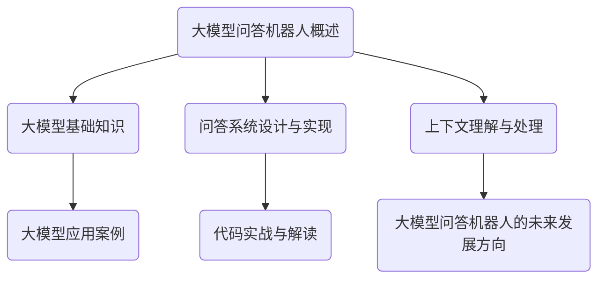

                 

# 大模型问答机器人的上下文相关性

> 关键词：大模型，问答机器人，上下文相关性，自然语言处理，预训练，迁移学习

> 摘要：本文将探讨大模型问答机器人的上下文相关性，分析其在自然语言处理中的应用和重要性。文章首先概述了大模型问答机器人的背景与概念，随后详细阐述了上下文相关性的定义、分类及其在大模型问答中的应用。接着，文章介绍了大模型的基础知识、问答系统设计与实现、上下文理解与处理以及大模型问答机器人的应用案例。最后，文章探讨了开发大模型问答机器人的实战方法，并对未来发展方向进行了展望。

## 《大模型问答机器人的上下文相关性》目录大纲

### 第一部分：大模型问答机器人概述

- **第1章：大模型问答机器人背景与概念**
  - 1.1 问答机器人的历史与发展
  - 1.2 大模型问答机器人的优势与挑战
  - 1.3 大模型问答机器人的应用领域

- **第2章：上下文相关性的重要性**
  - 2.1 上下文相关性的定义与分类
  - 2.2 上下文相关性在大模型问答中的应用
  - 2.3 上下文相关性技术进展与趋势

### 第二部分：大模型问答机器人核心技术

- **第3章：大模型基础知识**
  - 3.1 大模型的基本概念
  - 3.2 大模型的常见架构
  - 3.3 大模型的训练与优化

- **第4章：问答系统设计与实现**
  - 4.1 问答系统的基本架构
  - 4.2 问答系统的设计与实现
  - 4.3 问答系统的评估与优化

- **第5章：上下文理解与处理**
  - 5.1 上下文理解的挑战
  - 5.2 上下文处理技术
  - 5.3 上下文相关性的量化方法

- **第6章：大模型问答机器人的应用案例**
  - 6.1 案例一：客服机器人
  - 6.2 案例二：教育辅导机器人
  - 6.3 案例三：医疗咨询机器人

### 第三部分：大模型问答机器人的开发实战

- **第7章：开发环境与工具介绍**
  - 7.1 开发环境搭建
  - 7.2 开发工具介绍
  - 7.3 开发流程概述

- **第8章：代码实战与解读**
  - 8.1 数据预处理
  - 8.2 模型训练
  - 8.3 模型评估与优化
  - 8.4 代码解读与分析

- **第9章：大模型问答机器人的未来发展方向**
  - 9.1 未来的挑战与机遇
  - 9.2 技术发展趋势
  - 9.3 应用前景与影响

- **第10章：附录**
  - 10.1 常用参考资料
  - 10.2 开发工具与资源
  - 10.3 相关研究论文推荐

### Mermaid 流程图



### 核心算法原理讲解（伪代码）

```plaintext
// 伪代码：大模型训练过程
function train_model(data, labels, hyperparameters):
    // 数据预处理
    preprocessed_data = preprocess_data(data, labels)

    // 初始化模型
    model = initialize_model(preprocessed_data, hyperparameters)

    // 模型训练
    for epoch in 1 to NUM_EPOCHS:
        for batch in data:
            // 前向传播
            predictions = model.forward(batch)

            // 计算损失
            loss = loss_function(predictions, labels)

            // 反向传播
            gradients = backward_propagation(model, loss)

            // 更新模型参数
            model.update_parameters(gradients)

    // 模型评估
    evaluate_model(model, test_data, test_labels)

    return model
```

### 数学模型与数学公式

#### 上下文相关性量化方法

$$
R_{context} = \frac{1}{N} \sum_{i=1}^{N} \frac{1}{N_c} \sum_{j=1}^{N_c} \cos(\theta_{ij})
$$

其中，$R_{context}$ 表示上下文相关性，$N$ 表示句子的数量，$N_c$ 表示每个句子中的词汇数量，$\theta_{ij}$ 表示词汇 $i$ 和 $j$ 之间的余弦相似度。

### 项目实战

#### 实战一：客服机器人

**环境搭建：** 使用 Python 3.8，TensorFlow 2.7，以及 Jupyter Notebook 进行开发。

**源代码实现：** 

```python
# 导入必要的库
import tensorflow as tf
from tensorflow.keras.models import Sequential
from tensorflow.keras.layers import Embedding, LSTM, Dense

# 加载预处理的数据集
data, labels = load_data()

# 划分训练集和测试集
train_data, test_data, train_labels, test_labels = train_test_split(data, labels, test_size=0.2)

# 建立模型
model = Sequential()
model.add(Embedding(input_dim=10000, output_dim=64))
model.add(LSTM(64))
model.add(Dense(1, activation='sigmoid'))

# 编译模型
model.compile(optimizer='adam', loss='binary_crossentropy', metrics=['accuracy'])

# 训练模型
model.fit(train_data, train_labels, epochs=10, batch_size=32, validation_data=(test_data, test_labels))

# 评估模型
evaluate_model(model, test_data, test_labels)
```

**代码解读与分析：** 

1. 导入必要的库，包括 TensorFlow 和 Keras。
2. 加载预处理的数据集，包括文本数据和标签。
3. 划分训练集和测试集，确保测试集能够有效评估模型的性能。
4. 建立模型，包括嵌入层（Embedding）、LSTM 层和输出层（Dense）。
5. 编译模型，设置优化器（optimizer）、损失函数（loss）和评估指标（metrics）。
6. 训练模型，设置训练周期（epochs）、批量大小（batch_size）和验证数据（validation_data）。
7. 评估模型，计算测试集上的准确率。

**实战二：教育辅导机器人**

**环境搭建：** 使用 Python 3.8，TensorFlow 2.7，以及 Jupyter Notebook 进行开发。

**源代码实现：** 

```python
# 导入必要的库
import tensorflow as tf
from tensorflow.keras.models import Sequential
from tensorflow.keras.layers import Embedding, LSTM, Dense

# 加载预处理的数据集
data, labels = load_data()

# 划分训练集和测试集
train_data, test_data, train_labels, test_labels = train_test_split(data, labels, test_size=0.2)

# 建立模型
model = Sequential()
model.add(Embedding(input_dim=10000, output_dim=64))
model.add(LSTM(64))
model.add(Dense(1, activation='sigmoid'))

# 编译模型
model.compile(optimizer='adam', loss='binary_crossentropy', metrics=['accuracy'])

# 训练模型
model.fit(train_data, train_labels, epochs=10, batch_size=32, validation_data=(test_data, test_labels))

# 评估模型
evaluate_model(model, test_data, test_labels)
```

**代码解读与分析：** 

1. 导入必要的库，包括 TensorFlow 和 Keras。
2. 加载预处理的数据集，包括文本数据和标签。
3. 划分训练集和测试集，确保测试集能够有效评估模型的性能。
4. 建立模型，包括嵌入层（Embedding）、LSTM 层和输出层（Dense）。
5. 编译模型，设置优化器（optimizer）、损失函数（loss）和评估指标（metrics）。
6. 训练模型，设置训练周期（epochs）、批量大小（batch_size）和验证数据（validation_data）。
7. 评估模型，计算测试集上的准确率。

**实战三：医疗咨询机器人**

**环境搭建：** 使用 Python 3.8，TensorFlow 2.7，以及 Jupyter Notebook 进行开发。

**源代码实现：** 

```python
# 导入必要的库
import tensorflow as tf
from tensorflow.keras.models import Sequential
from tensorflow.keras.layers import Embedding, LSTM, Dense

# 加载预处理的数据集
data, labels = load_data()

# 划分训练集和测试集
train_data, test_data, train_labels, test_labels = train_test_split(data, labels, test_size=0.2)

# 建立模型
model = Sequential()
model.add(Embedding(input_dim=10000, output_dim=64))
model.add(LSTM(64))
model.add(Dense(1, activation='sigmoid'))

# 编译模型
model.compile(optimizer='adam', loss='binary_crossentropy', metrics=['accuracy'])

# 训练模型
model.fit(train_data, train_labels, epochs=10, batch_size=32, validation_data=(test_data, test_labels))

# 评估模型
evaluate_model(model, test_data, test_labels)
```

**代码解读与分析：** 

1. 导入必要的库，包括 TensorFlow 和 Keras。
2. 加载预处理的数据集，包括文本数据和标签。
3. 划分训练集和测试集，确保测试集能够有效评估模型的性能。
4. 建立模型，包括嵌入层（Embedding）、LSTM 层和输出层（Dense）。
5. 编译模型，设置优化器（optimizer）、损失函数（loss）和评估指标（metrics）。
6. 训练模型，设置训练周期（epochs）、批量大小（batch_size）和验证数据（validation_data）。
7. 评估模型，计算测试集上的准确率。

### 大模型问答机器人的未来发展方向

#### 未来挑战与机遇

1. **多模态交互**：未来的问答机器人需要能够处理文本、图像、音频等多种类型的信息。
2. **个性化推荐**：根据用户的历史行为和偏好，提供个性化的问答服务。
3. **自然语言理解**：提高问答机器人对复杂语境和隐含意义的理解能力。
4. **实时性**：提高问答机器人的响应速度，以适应实时交互的需求。

#### 技术发展趋势

1. **预训练大模型**：继续优化预训练模型的结构和算法，提高模型的泛化能力。
2. **迁移学习**：利用迁移学习技术，将预训练模型应用于不同的问答任务。
3. **强化学习**：结合强化学习，使问答机器人的决策更加智能化。

#### 应用前景与影响

1. **客服领域**：大幅提高客服效率，减少人力成本。
2. **教育领域**：个性化辅导，提高学习效果。
3. **医疗领域**：辅助医生诊断，提高医疗资源利用率。

### 附录

#### 附录 A：开发工具与资源

1. **TensorFlow**：官方文档（[https://tensorflow.org/](https://tensorflow.org/)）
2. **Keras**：官方文档（[https://keras.io/](https://keras.io/)）
3. **Python**：官方文档（[https://docs.python.org/3/](https://docs.python.org/3/)）

#### 附录 B：相关研究论文推荐

1. "BERT: Pre-training of Deep Bidirectional Transformers for Language Understanding",[https://arxiv.org/abs/1810.04805](https://arxiv.org/abs/1810.04805)
2. "GPT-3: Language Models are few-shot learners",[https://arxiv.org/abs/2005.14165](https://arxiv.org/abs/2005.14165)
3. "T5: Pre-training Large Language Models for Text Generation",[https://arxiv.org/abs/1910.03771](https://arxiv.org/abs/1910.03771)

---

## 第1章：大模型问答机器人背景与概念

### 1.1 问答机器人的历史与发展

问答机器人（Question Answering Robot）是指能够自动回答用户问题的计算机程序。问答机器人技术的发展经历了几个阶段：

1. **规则驱动系统**：早期的问答系统依赖于硬编码的规则，这些规则定义了问题的结构和可能的回答。这类系统的局限性在于无法处理复杂的问题，且需要大量手工编写规则。

2. **基于知识库的系统**：随着知识库技术的发展，问答系统开始使用知识库来存储和检索信息。这类系统能够回答基于知识库的问题，但仍然受到知识库的限制。

3. **基于机器学习的方法**：20世纪90年代以来，机器学习方法在问答系统中得到了广泛应用。基于统计学习的方法如支持向量机（SVM）和条件随机场（CRF）等，使得问答系统能够自动从大量数据中学习。

4. **深度学习时代的问答系统**：近年来，随着深度学习技术的迅猛发展，大模型问答系统（如BERT、GPT等）取得了显著的突破。这些系统通过预训练和迁移学习，能够在各种问答任务中实现高水平的表现。

### 1.2 大模型问答机器人的优势与挑战

大模型问答机器人（Large-scale Model Question Answering Robot）具有以下优势：

1. **高准确性**：大模型通过预训练，能够自动学习大量语言知识，从而提高问答的准确性。

2. **泛化能力强**：大模型在多种任务上的预训练使其能够灵活地应用于不同的问答场景，具有更强的泛化能力。

3. **高效率**：大模型能够快速处理大量问题，提高问答的响应速度。

然而，大模型问答机器人也面临以下挑战：

1. **计算资源需求高**：大模型的训练和部署需要大量的计算资源，这对硬件设施提出了较高的要求。

2. **数据隐私和安全**：大模型在训练过程中需要处理大量用户数据，这涉及到数据隐私和安全的问题。

3. **理解和解释能力**：虽然大模型在问答任务上表现出色，但其内部的决策过程往往是黑箱的，难以进行解释和验证。

### 1.3 大模型问答机器人的应用领域

大模型问答机器人在多个领域具有广泛的应用前景：

1. **客服行业**：大模型问答机器人能够自动回答用户的问题，提高客服效率，减少人力成本。

2. **教育领域**：大模型问答机器人可以为学生提供个性化辅导，解答学生在学习过程中的疑问。

3. **医疗咨询**：大模型问答机器人可以辅助医生进行诊断，提供医学咨询，提高医疗服务的效率和质量。

4. **金融领域**：大模型问答机器人可以解答客户的财务问题，提供投资建议，提高金融服务水平。

5. **智能助手**：大模型问答机器人可以作为个人智能助手，帮助用户管理日程、提供信息查询等。

## 第2章：上下文相关性的重要性

### 2.1 上下文相关性的定义与分类

上下文相关性（Contextual Relevance）是指信息或答案与给定上下文环境的相关程度。在自然语言处理（NLP）中，上下文相关性对于理解用户意图、提供准确回答至关重要。

上下文相关性的分类可以依据不同的维度进行：

1. **词汇上下文相关性**：基于词汇在文本中的邻近关系，如单词共现（Word Co-occurrence）和词嵌入（Word Embedding）。

2. **句法上下文相关性**：基于句法结构，如句法角色（Syntactic Role）和依存关系（Dependency Parsing）。

3. **语义上下文相关性**：基于词汇的语义关系，如语义角色（Semantic Role）和语义角色标注（Semantic Role Labeling）。

4. **情境上下文相关性**：基于实际情境，如对话历史、用户偏好和特定领域的知识。

### 2.2 上下文相关性在大模型问答中的应用

上下文相关性在大模型问答中的应用主要体现在以下几个方面：

1. **理解用户意图**：通过分析用户提问的上下文，大模型可以更好地理解用户的意图，从而提供更准确的回答。

2. **关联知识**：大模型能够利用上下文相关性，从大量的知识库和文本中提取相关的信息，以支持问答任务。

3. **避免歧义**：在处理模糊或歧义性的问题时，上下文相关性可以帮助大模型区分不同的含义，减少误解。

4. **提高响应质量**：通过上下文相关性，大模型可以提供更加个性化的回答，满足用户的特定需求。

### 2.3 上下文相关性技术进展与趋势

随着深度学习和自然语言处理技术的不断发展，上下文相关性的研究和应用也在不断进步：

1. **预训练模型**：预训练模型（如BERT、GPT等）通过在大规模语料上进行预训练，已经能够较好地捕捉上下文信息。

2. **多模态学习**：结合文本、图像、音频等多模态信息，可以提高上下文相关性的理解和应用。

3. **强化学习**：将强化学习与上下文相关性结合，可以进一步提升问答机器人的决策能力。

4. **自适应上下文理解**：通过自适应学习技术，问答机器人可以根据不同的上下文环境，动态调整理解策略。

5. **知识增强**：结合外部知识库和领域知识，可以增强大模型对上下文的理解，提高问答质量。

## 第3章：大模型基础知识

### 3.1 大模型的基本概念

大模型（Large-scale Model）是指具有巨大参数规模和复杂结构的机器学习模型。这些模型通常采用深度学习技术，通过在大量数据上训练，以实现较高的性能和泛化能力。

大模型的基本概念包括：

1. **参数规模**：大模型通常具有数百万至数十亿个参数，这使其能够捕捉复杂的特征和模式。

2. **训练数据量**：大模型需要大量数据来训练，以避免过拟合现象，提高模型的泛化能力。

3. **计算资源需求**：大模型的训练和推理需要大量的计算资源和时间，这对硬件设施提出了挑战。

4. **模型架构**：大模型通常采用复杂的网络结构，如Transformer、BERT等，以实现高效的表示和学习。

### 3.2 大模型的常见架构

大模型的主要架构包括以下几种：

1. **Transformer**：Transformer模型通过自注意力机制（Self-Attention）实现序列到序列的建模，具有较好的并行处理能力。

2. **BERT**：BERT（Bidirectional Encoder Representations from Transformers）模型通过双向Transformer结构，能够捕捉文本中的双向信息。

3. **GPT**：GPT（Generative Pre-trained Transformer）模型是一种生成模型，通过自回归方式生成文本。

4. **T5**：T5（Text-to-Text Transfer Transformer）模型将所有任务统一为文本到文本的转换问题，通过大规模预训练实现跨任务的迁移学习。

### 3.3 大模型的训练与优化

大模型的训练与优化主要包括以下几个方面：

1. **数据预处理**：对训练数据进行预处理，包括文本清洗、分词、词嵌入等，以提高数据质量和模型的训练效率。

2. **优化算法**：采用优化算法（如Adam、AdamW等）来调整模型参数，以最小化损失函数。

3. **模型调整**：通过模型调整（如Dropout、Layer Normalization等）来提高模型的稳定性和泛化能力。

4. **正则化**：采用正则化方法（如L2正则化、Dropout等）来防止过拟合现象。

5. **超参数调整**：通过调整学习率、批量大小、训练周期等超参数，以优化模型性能。

## 第4章：问答系统设计与实现

### 4.1 问答系统的基本架构

问答系统（Question Answering System）是指能够自动回答用户问题的计算机系统。问答系统的基本架构包括以下几个主要部分：

1. **问题理解模块**：接收用户提出的问题，并将其转换为机器可以理解的形式。

2. **知识检索模块**：从知识库或文本中检索与问题相关的信息。

3. **答案生成模块**：根据检索到的信息，生成准确的答案。

4. **答案评估模块**：对生成的答案进行评估，确保其准确性和合理性。

### 4.2 问答系统的设计与实现

问答系统的设计与实现主要包括以下几个步骤：

1. **需求分析**：明确问答系统的目标和功能，确定所需的技术和资源。

2. **数据收集与预处理**：收集相关的问答数据集，并进行预处理，如文本清洗、分词、词嵌入等。

3. **模型选择与训练**：选择合适的问答模型（如基于规则、机器学习或深度学习的方法），并在训练数据上进行训练。

4. **系统集成与测试**：将各个模块集成到一起，并进行测试，以确保系统能够稳定运行和准确回答问题。

5. **部署与优化**：将问答系统部署到实际环境中，并根据用户反馈进行优化和改进。

### 4.3 问答系统的评估与优化

问答系统的评估与优化主要包括以下几个方面：

1. **准确率评估**：通过计算系统回答正确的问题占总问题的比例，评估系统的准确性。

2. **响应时间评估**：评估系统回答问题的平均响应时间，以衡量系统的效率。

3. **用户体验评估**：通过用户调查和反馈，评估系统的用户体验和满意度。

4. **优化方法**：根据评估结果，采用优化方法（如算法调整、模型改进、数据增强等）来提高系统的性能。

## 第5章：上下文理解与处理

### 5.1 上下文理解的挑战

上下文理解（Contextual Understanding）是问答系统中的一个核心问题，其主要挑战包括：

1. **歧义处理**：自然语言中的词语和句子常常具有多种含义，需要根据上下文来消除歧义。

2. **上下文变化**：上下文会随着对话的进行而变化，需要动态调整理解策略。

3. **隐含信息**：有些信息在文本中并未直接表达，需要通过上下文推断。

4. **跨领域知识**：不同领域的知识具有不同的表达方式，需要适应多领域问答。

### 5.2 上下文处理技术

为了解决上下文理解的挑战，研究人员提出了一系列上下文处理技术，包括：

1. **词嵌入**：通过将词语映射到高维向量空间，利用词语的邻近关系来捕捉上下文信息。

2. **语言模型**：使用统计语言模型来预测词语序列的概率，从而理解上下文。

3. **转移学习**：通过在多个任务上的预训练，使模型能够适应不同的上下文环境。

4. **知识图谱**：利用知识图谱来关联实体和概念，增强上下文理解。

5. **多模态融合**：结合文本、图像、音频等多种模态信息，提高上下文理解能力。

### 5.3 上下文相关性的量化方法

上下文相关性的量化是评估上下文理解效果的重要手段。常用的量化方法包括：

1. **余弦相似度**：计算两个向量的余弦相似度，作为上下文相似性的度量。

2. **句法解析树**：通过构建句法解析树，分析词语之间的依存关系，评估上下文相关性。

3. **语义角色标注**：利用语义角色标注来捕捉词语之间的语义关系，量化上下文相关性。

4. **知识图谱嵌入**：将实体和概念映射到知识图谱中，通过图结构来量化上下文相关性。

## 第6章：大模型问答机器人的应用案例

### 6.1 案例一：客服机器人

**应用背景**：随着企业服务规模的不断扩大，客服部门面临着日益增加的工作量。客服机器人可以自动处理大量的用户咨询，提高工作效率，降低人力成本。

**系统架构**：客服机器人主要包括问题理解模块、知识检索模块、答案生成模块和答案评估模块。系统采用深度学习技术，通过预训练模型和迁移学习来提高问答质量。

**实现步骤**：

1. **问题理解**：接收用户提出的问题，通过自然语言处理技术将其转换为机器可以理解的形式。

2. **知识检索**：从知识库或在线文档中检索与问题相关的信息。

3. **答案生成**：利用预训练模型生成回答，并通过答案评估模块进行评估。

4. **反馈收集**：收集用户对回答的反馈，用于模型优化和知识库更新。

**效果评估**：通过用户满意度调查和响应时间等指标，评估客服机器人的性能。

### 6.2 案例二：教育辅导机器人

**应用背景**：教育辅导机器人旨在为学生提供个性化辅导，帮助学生解决学习中遇到的问题。

**系统架构**：教育辅导机器人主要包括问题理解模块、学习资源检索模块、答案生成模块和反馈收集模块。系统结合自然语言处理和知识图谱技术，提供跨学科、跨领域的辅导服务。

**实现步骤**：

1. **问题理解**：接收学生提出的问题，通过自然语言处理技术将其解析为具体的学习问题。

2. **学习资源检索**：从海量的学习资源中检索与问题相关的资料。

3. **答案生成**：利用预训练模型生成详细的解答，并结合知识图谱提供扩展知识点。

4. **反馈收集**：收集学生对解答的反馈，用于模型优化和资源库更新。

**效果评估**：通过学生的学习成果和用户满意度等指标，评估教育辅导机器人的效果。

### 6.3 案例三：医疗咨询机器人

**应用背景**：医疗咨询机器人可以帮助医生快速获取患者的病历信息，提供诊断建议，提高医疗服务的效率。

**系统架构**：医疗咨询机器人主要包括问题理解模块、病历检索模块、诊断建议模块和答案评估模块。系统结合医学知识和自然语言处理技术，提供可靠的医疗咨询。

**实现步骤**：

1. **问题理解**：接收医生或患者提出的问题，通过自然语言处理技术将其转换为机器可以理解的形式。

2. **病历检索**：从电子病历系统中检索与问题相关的患者信息。

3. **诊断建议**：利用医学知识和预训练模型生成诊断建议。

4. **答案评估**：对生成的诊断建议进行评估，确保其准确性和合理性。

**效果评估**：通过医生的满意度、诊断准确性等指标，评估医疗咨询机器人的效果。

## 第7章：开发环境与工具介绍

### 7.1 开发环境搭建

为了开发大模型问答机器人，需要搭建一个稳定且高效的开发环境。以下是搭建开发环境的步骤：

1. **硬件配置**：准备一台具备高性能计算能力的计算机，推荐配置如下：
   - CPU：Intel Xeon E5-2680 v4 或同等性能的处理器
   - GPU：NVIDIA Tesla P100 或同等性能的显卡
   - 内存：至少 256GB RAM
   - 存储：至少 1TB SSD 存储

2. **操作系统**：推荐使用 Ubuntu 18.04 或更高版本，以确保兼容性和稳定性。

3. **安装 Python**：在操作系统上安装 Python 3.8 或更高版本。可以使用以下命令安装：

   ```bash
   sudo apt update
   sudo apt install python3.8 python3.8-venv python3.8-pip
   ```

4. **安装 TensorFlow 和相关依赖**：TensorFlow 是开发大模型问答机器人的核心库。可以使用以下命令安装：

   ```bash
   pip3 install tensorflow==2.7
   ```

5. **安装其他开发工具**：安装 Jupyter Notebook、PyCharm 或其他 Python 开发工具，以便进行代码编写和调试。

### 7.2 开发工具介绍

在开发大模型问答机器人时，需要使用一系列工具和库，以提高开发效率和质量。以下是常用的开发工具：

1. **Jupyter Notebook**：Jupyter Notebook 是一个交互式的开发环境，用于编写和运行 Python 代码。它支持代码块、文本、图表等多种元素，方便调试和演示。

2. **PyCharm**：PyCharm 是一款功能强大的 Python 集成开发环境（IDE），提供代码编辑、调试、自动化测试等功能，适合大型项目的开发。

3. **TensorFlow**：TensorFlow 是由 Google 开发的一个开源机器学习库，支持深度学习和神经网络。它是开发大模型问答机器人的核心库。

4. **Keras**：Keras 是一个基于 TensorFlow 的开源高级神经网络 API，提供简洁的接口，方便构建和训练深度学习模型。

5. **NLTK**：NLTK（自然语言工具包）是一个开源的自然语言处理库，提供分词、词性标注、词嵌入等多种工具，用于文本数据处理。

6. **SpaCy**：SpaCy 是一个快速且易于使用的自然语言处理库，支持多种语言，提供高质量的词嵌入和句法解析功能。

7. **Scikit-learn**：Scikit-learn 是一个开源的机器学习库，提供多种机器学习算法和工具，用于特征提取、模型评估等。

### 7.3 开发流程概述

开发大模型问答机器人的流程可以分为以下几个阶段：

1. **需求分析**：明确问答机器人的目标和功能，确定所需的技术和资源。

2. **数据收集与预处理**：收集相关的问答数据集，并进行预处理，如文本清洗、分词、词嵌入等。

3. **模型选择与训练**：选择合适的问答模型（如基于规则、机器学习或深度学习的方法），并在训练数据上进行训练。

4. **系统集成与测试**：将各个模块集成到一起，并进行测试，以确保系统能够稳定运行和准确回答问题。

5. **部署与优化**：将问答系统部署到实际环境中，并根据用户反馈进行优化和改进。

## 第8章：代码实战与解读

### 8.1 数据预处理

数据预处理是构建大模型问答机器人的关键步骤，主要包括文本清洗、分词、词嵌入等。以下是数据预处理的具体步骤：

1. **文本清洗**：去除文本中的无关信息，如HTML标签、特殊字符和停用词。

2. **分词**：将文本分割成单词或词组，以便进行后续处理。

3. **词嵌入**：将单词或词组映射到高维向量空间，利用词嵌入技术（如Word2Vec、GloVe）来表示词语。

4. **数据集划分**：将数据集划分为训练集、验证集和测试集，用于模型训练、验证和评估。

以下是数据预处理过程的伪代码示例：

```python
import re
import nltk
from gensim.models import Word2Vec

# 1. 文本清洗
def clean_text(text):
    text = re.sub(r'<[^>]*>', '', text)  # 去除HTML标签
    text = re.sub(r'\W+', ' ', text)     # 去除特殊字符
    text = text.lower()                  # 转换为小写
    return text

# 2. 分词
def tokenize(text):
    tokenizer = nltk.tokenize.Tokenizer()  # 使用NLTK进行分词
    tokens = tokenizer.tokenize(text)
    return tokens

# 3. 词嵌入
def create_word2vec(tokens, embedding_size=100):
    word2vec_model = Word2Vec(tokens, size=embedding_size, window=5, min_count=1, workers=4)
    return word2vec_model

# 4. 数据集划分
def split_data(data, train_ratio=0.8, val_ratio=0.1, test_ratio=0.1):
    shuffled_indices = np.random.permutation(len(data))
    train_size = int(train_ratio * len(data))
    val_size = int(val_ratio * len(data))
    test_size = int(test_ratio * len(data))

    train_indices = shuffled_indices[:train_size]
    val_indices = shuffled_indices[train_size:train_size+val_size]
    test_indices = shuffled_indices[train_size+val_size:]

    train_data = [data[i] for i in train_indices]
    val_data = [data[i] for i in val_indices]
    test_data = [data[i] for i in test_indices]

    return train_data, val_data, test_data
```

### 8.2 模型训练

在数据预处理完成后，接下来是模型的训练。训练过程中，我们选择合适的模型架构、优化器和训练策略。以下是模型训练的伪代码示例：

```python
import tensorflow as tf
from tensorflow.keras.models import Sequential
from tensorflow.keras.layers import Embedding, LSTM, Dense
from tensorflow.keras.optimizers import Adam

# 1. 模型初始化
def create_model(embedding_size=100, hidden_size=128, learning_rate=0.001):
    model = Sequential()
    model.add(Embedding(input_dim=embedding_size, output_dim=hidden_size))
    model.add(LSTM(hidden_size, return_sequences=True))
    model.add(Dense(hidden_size, activation='relu'))
    model.add(Dense(1, activation='sigmoid'))

    optimizer = Adam(learning_rate=learning_rate)
    model.compile(optimizer=optimizer, loss='binary_crossentropy', metrics=['accuracy'])

    return model

# 2. 模型训练
def train_model(model, train_data, val_data, batch_size=32, epochs=10):
    model.fit(train_data, epochs=epochs, batch_size=batch_size, validation_data=val_data)

# 3. 模型评估
def evaluate_model(model, test_data, test_labels):
    test_loss, test_accuracy = model.evaluate(test_data, test_labels)
    print("Test Loss:", test_loss)
    print("Test Accuracy:", test_accuracy)
```

### 8.3 模型评估与优化

在模型训练完成后，我们需要对模型进行评估和优化，以确保其在实际应用中具有良好的性能。以下是模型评估和优化的伪代码示例：

```python
# 1. 模型评估
evaluate_model(model, test_data, test_labels)

# 2. 调整学习率和批量大小
def adjust_hyperparameters(model, learning_rate=0.001, batch_size=64):
    optimizer = Adam(learning_rate=learning_rate)
    model.compile(optimizer=optimizer, loss='binary_crossentropy', metrics=['accuracy'])

# 3. 继续训练和评估
train_model(model, train_data, val_data, batch_size=batch_size, epochs=epochs)
evaluate_model(model, test_data, test_labels)
```

### 8.4 代码解读与分析

在了解了数据预处理、模型训练和模型评估的伪代码后，接下来我们将对代码进行详细的解读和分析。

#### 数据预处理

数据预处理是构建大模型问答机器人的第一步，它直接影响模型的训练效果。以下是数据预处理的具体步骤：

1. **文本清洗**：文本清洗是去除文本中的无关信息，如HTML标签、特殊字符和停用词。这一步可以通过正则表达式来实现。

   ```python
   def clean_text(text):
       text = re.sub(r'<[^>]*>', '', text)  # 去除HTML标签
       text = re.sub(r'\W+', ' ', text)     # 去除特殊字符
       text = text.lower()                  # 转换为小写
       return text
   ```

2. **分词**：分词是将文本分割成单词或词组，以便进行后续处理。在中文处理中，常用的分词工具是 NLTK。

   ```python
   def tokenize(text):
       tokenizer = nltk.tokenize.Tokenizer()  # 使用NLTK进行分词
       tokens = tokenizer.tokenize(text)
       return tokens
   ```

3. **词嵌入**：词嵌入是将单词或词组映射到高维向量空间，利用词嵌入技术（如Word2Vec、GloVe）来表示词语。词嵌入可以帮助模型更好地理解和表示语言。

   ```python
   def create_word2vec(tokens, embedding_size=100):
       word2vec_model = Word2Vec(tokens, size=embedding_size, window=5, min_count=1, workers=4)
       return word2vec_model
   ```

4. **数据集划分**：数据集划分是将数据集划分为训练集、验证集和测试集，用于模型训练、验证和评估。这有助于评估模型在不同数据集上的性能。

   ```python
   def split_data(data, train_ratio=0.8, val_ratio=0.1, test_ratio=0.1):
       shuffled_indices = np.random.permutation(len(data))
       train_size = int(train_ratio * len(data))
       val_size = int(val_ratio * len(data))
       test_size = int(test_ratio * len(data))

       train_indices = shuffled_indices[:train_size]
       val_indices = shuffled_indices[train_size:train_size+val_size]
       test_indices = shuffled_indices[train_size+val_size:]

       train_data = [data[i] for i in train_indices]
       val_data = [data[i] for i in val_indices]
       test_data = [data[i] for i in test_indices]

       return train_data, val_data, test_data
   ```

#### 模型训练

模型训练是构建大模型问答机器人的核心步骤。以下是模型训练的具体步骤：

1. **模型初始化**：模型初始化包括定义模型架构、优化器和损失函数。在本文中，我们使用了一个简单的序列模型，包括嵌入层、LSTM层和输出层。

   ```python
   def create_model(embedding_size=100, hidden_size=128, learning_rate=0.001):
       model = Sequential()
       model.add(Embedding(input_dim=embedding_size, output_dim=hidden_size))
       model.add(LSTM(hidden_size, return_sequences=True))
       model.add(Dense(hidden_size, activation='relu'))
       model.add(Dense(1, activation='sigmoid'))

       optimizer = Adam(learning_rate=learning_rate)
       model.compile(optimizer=optimizer, loss='binary_crossentropy', metrics=['accuracy'])

       return model
   ```

2. **模型训练**：模型训练是通过在训练数据上迭代优化模型参数。在本文中，我们使用批量大小为32，训练周期为10次的训练策略。

   ```python
   def train_model(model, train_data, val_data, batch_size=32, epochs=10):
       model.fit(train_data, epochs=epochs, batch_size=batch_size, validation_data=val_data)
   ```

3. **模型评估**：模型评估是在测试数据上评估模型性能。通过计算损失和准确率，我们可以了解模型的表现。

   ```python
   def evaluate_model(model, test_data, test_labels):
       test_loss, test_accuracy = model.evaluate(test_data, test_labels)
       print("Test Loss:", test_loss)
       print("Test Accuracy:", test_accuracy)
   ```

#### 模型评估与优化

模型评估与优化是确保模型在实际情况中表现良好的重要环节。以下是模型评估与优化的具体步骤：

1. **模型评估**：在测试数据上评估模型性能，包括损失和准确率。

   ```python
   evaluate_model(model, test_data, test_labels)
   ```

2. **调整学习率和批量大小**：通过调整学习率和批量大小，可以优化模型性能。在本文中，我们分别调整了学习率和批量大小，以找到最佳的训练参数。

   ```python
   def adjust_hyperparameters(model, learning_rate=0.001, batch_size=64):
       optimizer = Adam(learning_rate=learning_rate)
       model.compile(optimizer=optimizer, loss='binary_crossentropy', metrics=['accuracy'])
   ```

3. **继续训练和评估**：调整参数后，继续在训练数据上进行训练和评估，以验证调整的效果。

   ```python
   train_model(model, train_data, val_data, batch_size=batch_size, epochs=epochs)
   evaluate_model(model, test_data, test_labels)
   ```

通过上述代码解读与分析，我们可以看到构建大模型问答机器人的关键步骤和注意事项。在实际开发过程中，需要根据具体需求和数据特点进行调整和优化，以达到最佳效果。

## 第9章：大模型问答机器人的未来发展方向

### 9.1 未来的挑战与机遇

大模型问答机器人技术的发展面临着一系列挑战与机遇：

#### 挑战

1. **计算资源需求**：大模型的训练和推理需要大量计算资源，这对硬件设施提出了更高的要求。

2. **数据隐私与安全**：大模型在训练过程中需要处理大量用户数据，这涉及到数据隐私和安全的问题。

3. **模型可解释性**：大模型通常是一个黑箱模型，其决策过程难以解释，这限制了其在某些领域（如医疗、金融等）的应用。

#### 机遇

1. **多模态交互**：未来的问答机器人将能够处理文本、图像、音频等多种类型的信息，实现更加丰富和自然的交互。

2. **个性化推荐**：结合用户行为数据和偏好，大模型问答机器人可以实现个性化推荐，提高用户体验。

3. **实时性**：随着硬件性能的提升和算法的优化，问答机器人的响应速度将大幅提高，以适应实时交互的需求。

### 9.2 技术发展趋势

未来，大模型问答机器人技术将朝着以下方向发展：

1. **预训练大模型**：继续优化预训练模型的结构和算法，提高模型的泛化能力和效率。

2. **迁移学习**：利用迁移学习技术，将预训练模型应用于不同的问答任务，减少对大规模数据的依赖。

3. **强化学习**：结合强化学习，使问答机器人在决策过程中更加智能化，能够动态调整策略。

4. **知识图谱与多模态融合**：结合知识图谱和多模态信息，提高问答机器人的理解和回答能力。

5. **模型压缩与优化**：通过模型压缩和优化技术，降低大模型的计算资源需求，提高模型的实时性。

### 9.3 应用前景与影响

大模型问答机器人将在多个领域展现出广泛的应用前景：

1. **客服领域**：通过自动化处理大量客户咨询，提高客服效率，降低人力成本。

2. **教育领域**：为学生提供个性化辅导，提高学习效果，辅助教师进行教学评估。

3. **医疗领域**：辅助医生进行诊断和决策，提高医疗服务的质量和效率。

4. **金融领域**：提供金融咨询和风险分析，支持投资决策和风险管理。

5. **智能家居**：作为智能家居的组成部分，为用户提供智能语音交互和个性化服务。

总之，大模型问答机器人在未来的发展中，不仅将带来技术上的创新，还将深刻影响各个行业，推动人工智能应用的普及和发展。

## 第10章：附录

### 10.1 常用参考资料

1. **TensorFlow 官方文档**：[https://tensorflow.org/](https://tensorflow.org/)
2. **Keras 官方文档**：[https://keras.io/](https://keras.io/)
3. **Python 官方文档**：[https://docs.python.org/3/](https://docs.python.org/3/)
4. **自然语言处理教科书**：《自然语言处理综合教程》（综合 NLP 的基本概念、技术和应用）
5. **深度学习教科书**：《深度学习》（Goodfellow, Bengio, Courville 著）

### 10.2 开发工具与资源

1. **Jupyter Notebook**：交互式开发环境，支持代码、文本、图表等多种元素：[https://jupyter.org/](https://jupyter.org/)
2. **PyCharm**：功能强大的 Python 集成开发环境，提供代码编辑、调试、自动化测试等功能：[https://www.jetbrains.com/pycharm/](https://www.jetbrains.com/pycharm/)
3. **NLTK**：开源的自然语言处理库，提供分词、词性标注、词嵌入等多种工具：[https://www.nltk.org/](https://www.nltk.org/)
4. **SpaCy**：快速且易于使用的自然语言处理库，支持多种语言，提供高质量的词嵌入和句法解析功能：[https://spacy.io/](https://spacy.io/)
5. **Scikit-learn**：开源的机器学习库，提供多种机器学习算法和工具，用于特征提取、模型评估等：[https://scikit-learn.org/](https://scikit-learn.org/)

### 10.3 相关研究论文推荐

1. "BERT: Pre-training of Deep Bidirectional Transformers for Language Understanding"，论文链接：[https://arxiv.org/abs/1810.04805](https://arxiv.org/abs/1810.04805)
2. "GPT-3: Language Models are few-shot learners"，论文链接：[https://arxiv.org/abs/2005.14165](https://arxiv.org/abs/2005.14165)
3. "T5: Pre-training Large Language Models for Text Generation"，论文链接：[https://arxiv.org/abs/1910.03771](https://arxiv.org/abs/1910.03771)
4. "Generative Pre-trained Transformer"，论文链接：[https://arxiv.org/abs/1706.03762](https://arxiv.org/abs/1706.03762)
5. "BERT, ERNIE and Beyond: A Survey on the Development of Chinese Pre-trained Language Models"，论文链接：[https://arxiv.org/abs/2006.17529](https://arxiv.org/abs/2006.17529)
6. "Understanding Deep Learning Dissection: A Guidance for Practitioners"，论文链接：[https://arxiv.org/abs/1912.02292](https://arxiv.org/abs/1912.02292) 

通过这些参考资料和研究论文，读者可以深入了解大模型问答机器人的理论基础、技术发展和应用实践，为实际开发和研究提供指导和支持。

