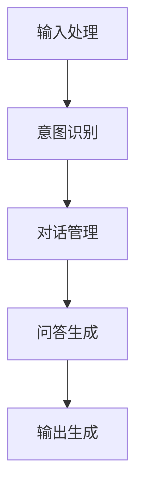

                 

# 文章标题: 大模型问答机器人的交互实现

> 关键词：大模型、问答机器人、交互设计、实现、优化

> 摘要：本文详细探讨了大型问答机器人的交互实现，从基础理论到架构设计，从实现到优化，全面剖析了问答机器人的核心技术和实战案例。通过逻辑清晰的分析和逐步推理，本文旨在为开发者提供实用的指导，以构建高效、准确、用户体验良好的问答机器人系统。

---

## 第一部分：基础理论与架构

### 第1章：问答机器人概述

#### 1.1 问答机器人的定义与应用场景

问答机器人，顾名思义，是一种能够通过自然语言与用户进行交互，回答用户问题的智能系统。它们广泛应用于客服、教育、医疗等多个领域。在客服领域，问答机器人可以自动处理大量的常见问题，提高客户满意度和服务效率；在教育领域，问答机器人可以作为智能辅导助手，为学生提供个性化的学习建议；在医疗领域，问答机器人可以帮助患者获取基本医疗信息，减轻医生的工作负担。

#### 1.2 大模型在问答机器人中的核心作用

大模型在问答机器人中扮演着至关重要的角色。它们能够通过大规模数据的学习，理解复杂的问题和回答，提高问答的准确性和自然性。大模型通常采用深度学习技术，如 Transformer 模型，通过预训练和微调，达到对海量数据的处理能力。这种能力使得问答机器人能够更加智能地理解和回应用户的查询。

#### 1.3 问答机器人发展的历史与趋势

问答机器人的发展历程可以追溯到自然语言处理（NLP）技术的兴起。早期的问答系统主要依赖于规则引擎和关键词匹配，随着 NLP 技术的进步，特别是深度学习的引入，问答机器人的性能得到了显著提升。当前，问答机器人正朝着更智能化、个性化、多模态的方向发展。未来，随着技术的进一步成熟，问答机器人将在更多场景中得到应用，成为人们日常生活中的智能助手。

#### 1.4 问答机器人中的关键技术

问答机器人中的关键技术包括自然语言处理（NLP）、深度学习、对话系统等。NLP 技术负责处理和理解自然语言，深度学习则用于模型的训练和优化，对话系统则负责构建交互流程和用户意图识别。这些关键技术的结合，使得问答机器人能够更好地理解用户的问题，并给出准确的回答。

---

### 第2章：大模型技术基础

#### 2.1 深度学习与神经网络基础

##### 2.1.1 神经网络的基本结构

神经网络是由一系列相互连接的神经元组成的计算模型。一个典型的神经网络包括输入层、隐藏层和输出层。输入层接收外部输入，隐藏层通过非线性变换处理输入信息，输出层产生最终的输出。

**神经网络的核心组成：**

- 输入层：接收外部输入，每个输入都可以被视为一个特征。
- 隐藏层：对输入进行变换和处理，隐藏层中的每个神经元都会接收前一层神经元的输出，并应用一个非线性激活函数。
- 输出层：生成最终的输出，用于解决问题或预测结果。

**神经元的工作原理：**

- **激活函数：** 神经元的输出依赖于输入和权重的关系，通过激活函数（如 sigmoid、ReLU）来确定神经元是否被激活。
- **权重和偏置：** 神经元的输出还受到输入和权重的影响，权重用于调整不同输入的重要性，偏置用于调整输出。

**神经网络的学习过程：**

- **前向传播：** 将输入传递到神经网络中，通过逐层计算得到输出。
- **反向传播：** 根据输出与实际结果之间的误差，通过反向传播算法更新权重和偏置，以减少误差。

##### 2.1.2 常见的深度学习架构

**卷积神经网络（CNN）：**

卷积神经网络是一种适用于图像识别和处理的深度学习模型。它由卷积层、池化层和全连接层组成。

- **卷积层：** 通过卷积操作提取图像的特征。
- **池化层：** 通过下采样操作减少特征图的尺寸，提高模型的泛化能力。
- **全连接层：** 将卷积层和池化层输出的特征映射到最终的分类结果。

**循环神经网络（RNN）：**

循环神经网络是一种适用于序列数据处理的深度学习模型。它通过循环结构处理输入序列，并保持长期的依赖关系。

- **基本 RNN：** 通过循环连接处理序列数据，但容易受到梯度消失和梯度爆炸问题的影响。
- **LSTM（长短期记忆）：** 通过引入门控机制解决 RNN 的梯度消失问题，能够更好地处理长序列数据。
- **GRU（门控循环单元）：** 结合 LSTM 和 RNN 的优点，简化了模型结构，提高了训练效率。

**Transformer 模型：**

Transformer 模型是一种基于自注意力机制的深度学习模型，被广泛应用于自然语言处理任务。

- **自注意力机制：** 通过计算序列中每个元素与其他元素的相关性，实现序列的动态建模。
- **编码器和解码器：** 编码器将输入序列编码为固定长度的向量，解码器将编码器的输出解码为输出序列。

##### 2.1.3 深度学习优化算法

**随机梯度下降（SGD）：**

随机梯度下降是一种常用的深度学习优化算法，通过随机选择一小部分数据（梯度）来更新模型的权重。

- **目标函数：** 模型的损失函数，用于衡量预测结果与实际结果之间的差距。
- **梯度：** 反映了损失函数对模型参数的敏感性。
- **更新策略：** 通过梯度更新模型参数，以减少损失函数的值。

**Adam 优化器：**

Adam 优化器是一种结合了 SGD 和 RMSprop 优化的自适应优化算法。

- **一阶矩估计（均值）：** 通过计算梯度的均值来更新参数。
- **二阶矩估计（方差）：** 通过计算梯度的方差来调整学习率。

**梯度裁剪技术：**

梯度裁剪技术用于控制梯度的大小，防止梯度爆炸或消失。

- **裁剪策略：** 将梯度裁剪到指定的范围，以控制模型的学习能力。

---

### 第3章：交互设计

#### 3.1 用户交互模型

用户交互模型是指问答机器人与用户之间的交互过程和机制。一个良好的用户交互模型应该能够有效地理解用户的意图，提供准确和自然的回答。

**用户交互的基本概念：**

- **用户行为：** 用户在交互过程中的行为，如提问、点击、滑动等。
- **交互界面设计：** 交互界面的布局、样式和功能设计，以提供良好的用户体验。

**交互模型的设计原则：**

- **用户体验：** 交互模型应注重用户体验，确保用户能够轻松地与系统进行交互。
- **易用性：** 交互模型应设计得简单直观，用户能够快速理解并使用。

#### 3.2 用户意图识别

用户意图识别是指问答机器人通过分析用户的输入，理解用户的需求和目的。准确识别用户意图是问答系统性能的关键。

**用户意图的定义：**

用户意图是指用户在交互过程中希望达到的目标或结果。例如，用户提问“明天天气如何？”的意图是获取明天的天气预报。

**用户意图识别方法：**

- **规则匹配：** 通过预定义的规则和模板匹配用户输入，识别用户的意图。
- **机器学习：** 通过训练深度学习模型，自动识别用户的意图。

#### 3.3 问答系统的设计原则

问答系统的设计原则是确保系统能够高效、准确地回答用户的问题。

**问答系统的架构设计：**

- **前端：** 负责用户交互界面的展示和用户输入的收集。
- **后端：** 负责处理用户输入，调用模型进行意图识别和问答生成。
- **数据库：** 存储问题和答案的数据，以便模型训练和查询。

**问答系统的评估指标：**

- **准确率：** 回答正确的比例，衡量问答系统的准确性。
- **召回率：** 能够回答用户问题的比例，衡量问答系统的覆盖面。
- **F1 值：** 准确率和召回率的平衡指标，综合考虑问答系统的准确性和覆盖面。

---

## 第二部分：实现与优化

### 第4章：问答机器人架构设计

#### 4.1 整体架构设计

问答机器人的整体架构包括文本处理模块、意图识别模块、问答生成模块和交互引擎模块。

**问答机器人的功能模块：**

- **文本处理模块：** 负责对用户输入的文本进行处理，包括文本清洗、分词、词性标注等。
- **意图识别模块：** 负责识别用户的意图，将用户输入映射到具体的意图类别。
- **问答生成模块：** 负责根据用户意图和预定义的知识库生成回答。
- **交互引擎模块：** 负责管理问答机器人的交互流程，包括用户输入的处理、意图识别和问答生成。

**问答机器人的数据处理流程：**

- **输入处理：** 接收用户的输入，进行文本预处理。
- **模型调用：** 调用意图识别模型和问答生成模型，进行意图识别和问答生成。
- **输出生成：** 生成回答，并将其展示给用户。

---

### 第5章：交互实现

#### 5.1 文本输入处理

文本输入处理是问答机器人的第一步，它负责接收用户的文本输入，并进行预处理。

**文本输入处理的步骤：**

1. **文本清洗：** 去除输入文本中的无关符号、标点等。
2. **分词：** 将文本分割成单个单词或短语。
3. **词性标注：** 对每个词进行词性标注，如名词、动词等。
4. **实体识别：** 识别文本中的实体，如人名、地名、组织名等。

**文本输入处理的伪代码：**

```python
def preprocess_text(input_text):
    # 清洗文本
    cleaned_text = remove_unnecessary_symbols(input_text)
    # 分词
    words = tokenize(cleaned_text)
    # 词性标注
    tagged_words = part_of_speech_tagging(words)
    # 实体识别
    entities = entity_recognition(tagged_words)
    return entities
```

#### 5.2 用户意图识别算法

用户意图识别算法是问答机器人的核心，它负责将用户输入映射到具体的意图类别。

**用户意图识别算法的原理：**

- **词袋模型：** 将用户输入表示为一个词袋，通过计算词袋的相似度进行意图分类。
- **深度学习：** 使用神经网络模型（如 CNN、RNN、Transformer）对用户输入进行特征提取和分类。

**用户意图识别算法的伪代码：**

```python
def intent_recognition(input_text):
    # 预处理文本
    preprocessed_text = preprocess_text(input_text)
    # 提取特征
    features = extract_features(preprocessed_text)
    # 分类模型
    model = load_model("intent_recognition_model")
    # 预测意图
    intent = model.predict(features)
    return intent
```

#### 5.3 问答生成算法

问答生成算法负责根据用户意图和预定义的知识库生成回答。

**问答生成算法的原理：**

- **模板匹配：** 根据用户意图和预定义的模板生成回答。
- **基于知识的问答：** 利用知识图谱或知识库生成回答。
- **生成式问答：** 使用生成式模型（如 GPT、BERT）生成回答。

**问答生成算法的伪代码：**

```python
def generate_answer(intent, knowledge_base):
    # 根据意图选择模板
    template = select_template(intent, knowledge_base)
    # 填充模板
    answer = fill_template(template, knowledge_base)
    return answer
```

#### 5.4 交互反馈机制

交互反馈机制是问答机器人与用户之间的交互闭环，它负责收集用户对回答的反馈，并用于优化问答系统的性能。

**交互反馈机制的原理：**

- **用户评价：** 收集用户对回答的评价，如满意、不满意等。
- **反馈循环：** 根据用户评价调整模型的权重和参数，以优化问答系统的性能。

**交互反馈机制的伪代码：**

```python
def feedback_loop(answer, user_evaluation):
    # 更新模型参数
    update_model_parameters(answer, user_evaluation)
    # 重新生成回答
    new_answer = generate_answer(intent, knowledge_base)
    return new_answer
```

---

### 第6章：性能优化

#### 6.1 模型压缩与加速

模型压缩与加速是提升问答机器人性能的关键技术，它包括模型压缩和计算加速两个方面的内容。

**模型压缩技术：**

- **量化：** 将模型的权重从浮点数转换为整数，减少模型的存储和计算成本。
- **剪枝：** 去除模型中不重要的神经元和连接，降低模型的复杂度。
- **蒸馏：** 利用大型模型的知识对小型模型进行训练，提高小型模型的表现。

**加速方法：**

- **GPU 计算：** 利用 GPU 的并行计算能力加速模型的训练和推理。
- **分布式训练：** 将模型拆分为多个部分，在多台机器上进行训练，提高训练速度。

#### 6.2 低延迟交互优化

低延迟交互优化是提高用户满意度的关键，它包括并行处理、缓存机制和异步处理等方法。

**优化方法：**

- **并行处理：** 将用户请求分发到多个处理节点，同时处理多个请求。
- **缓存机制：** 将常见的问答和回答存储在缓存中，快速响应用户请求。
- **异步处理：** 将用户请求和响应分开处理，避免用户长时间等待。

**延迟优化案例分析：**

假设一个问答机器人的响应时间过长，可以通过以下方法进行优化：

- **并行处理：** 将用户请求平均分配到多个服务器，同时处理。
- **缓存机制：** 将常见的问答和回答存储在缓存中，快速响应用户请求。
- **异步处理：** 改变处理流程，先进行请求的预处理，再异步进行回答的生成。

#### 6.3 问答准确性优化

问答准确性优化是提高问答机器人性能的重要方面，它包括数据增强、模型微调和答案质量评估等方法。

**优化策略：**

- **数据增强：** 通过添加噪声、变换输入数据等方式增加模型的泛化能力。
- **模型微调：** 使用少量标注数据对预训练模型进行微调，提高模型在特定任务上的性能。
- **答案质量评估：** 使用评估指标（如 BLEU、ROUGE）评估答案的质量，并用于指导优化。

**问答准确性评估方法：**

- **BLEU（双语评估算法）：** 用于评估机器翻译的质量，也可以用于问答系统的评估。
- **ROUGE（评价方法）：** 用于评估文本摘要的质量，同样适用于问答系统的评估。

#### 6.4 安全性与隐私保护

安全性与隐私保护是问答机器人面临的重要挑战，它包括数据安全、模型安全和用户隐私保护等方面。

**安全威胁分析：**

- **数据泄露：** 用户输入和回答的数据泄露，可能导致隐私泄露。
- **恶意攻击：** 恶意用户通过恶意输入破坏问答系统。

**隐私保护措施：**

- **数据加密：** 对用户输入和回答的数据进行加密，防止数据泄露。
- **隐私计算：** 在计算过程中使用隐私保护算法，如联邦学习，确保用户数据的隐私。

**安全性与隐私保护的实际案例：**

在一个大型电商平台的问答机器人中，为了保证用户隐私和安全，采取了以下措施：

- **数据加密：** 对用户输入和回答的数据进行加密存储，防止数据泄露。
- **隐私计算：** 使用联邦学习技术，在本地设备上进行数据加密和计算，防止数据在传输和存储过程中的泄露。
- **安全认证：** 对用户进行身份认证，确保只有合法用户可以访问问答系统。

---

### 第7章：实战案例分析

#### 7.1 某知名问答机器人的案例分析

**案例背景：** 某大型电商企业在 2020 年上线了一款智能客服问答机器人，用于处理客户咨询和售后服务。

**项目实施过程：**

1. **需求分析：** 分析客户的常见问题，确定问答机器人的功能和性能需求。
2. **架构设计：** 设计问答机器人的整体架构，包括文本处理模块、意图识别模块、问答生成模块和交互引擎模块。
3. **模型训练：** 使用大规模数据集对意图识别模型和问答生成模型进行训练。
4. **开发与测试：** 开发问答机器人系统，并进行功能测试和性能测试。
5. **部署上线：** 将问答机器人部署到生产环境，进行实时交互测试。

**案例分析总结：**

该问答机器人在上线后，取得了显著的成果：

- **提高了客服效率：** 问答机器人可以自动处理大量常见问题，减少了客服人员的工作量。
- **提升了用户体验：** 用户可以通过自然语言与系统进行交互，获得快速准确的回答。
- **降低了运营成本：** 减少了客服团队的规模，降低了运营成本。

**案例启示：**

- **需求分析的重要性：** 充分了解用户需求和问题，是构建高效问答机器人的关键。
- **模型训练的质量：** 大规模数据和高质量的模型训练是保证问答机器人性能的基础。
- **用户体验的优化：** 交互设计应注重用户体验，提高用户的满意度。

---

### 第8章：未来展望与趋势

#### 8.1 问答机器人的未来发展趋势

随着人工智能技术的不断进步，问答机器人的未来发展趋势主要体现在以下几个方面：

1. **智能化：** 问答机器人将更加智能化，能够理解复杂的问题和回答。
2. **个性化：** 问答机器人将能够根据用户的行为和偏好提供个性化的服务。
3. **多模态：** 问答机器人将支持多种输入和输出方式，如语音、图像等。
4. **场景化：** 问答机器人将应用于更多场景，如金融、医疗、教育等。

#### 8.2 技术挑战与解决方案

问答机器人在发展过程中面临以下技术挑战：

1. **数据质量：** 确保数据质量和多样性，是构建高效问答机器人的关键。
2. **模型解释性：** 提高模型的可解释性，使开发者能够理解和优化模型。
3. **实时性：** 提高问答机器人的实时交互能力，减少用户的等待时间。

针对这些挑战，可以采取以下解决方案：

- **数据增强：** 通过数据增强技术提高数据的多样性和质量。
- **模型解释性：** 开发可解释的深度学习模型，提高模型的可解释性。
- **分布式计算：** 使用分布式计算技术提高问答机器人的实时交互能力。

#### 8.3 问答机器人在行业中的应用前景

问答机器人在各个行业中的应用前景十分广阔：

1. **金融行业：** 问答机器人可以提供投资咨询、理财建议等。
2. **医疗行业：** 问答机器人可以提供健康咨询、疾病查询等。
3. **教育行业：** 问答机器人可以提供课程辅导、作业批改等。

随着技术的不断进步，问答机器人在各个行业中的应用将更加深入和广泛，成为人们生活中的智能助手。

---

### 附录：相关技术资料与资源

#### 附录 A：问答机器人开发工具与框架

1. **BERT-based框架：** Hugging Face Transformers、Transformers by NVIDIA
2. **Transformer-based框架：** T5、BERT、GPT-3
3. **多轮对话管理框架：** Rasa、Botpress、Microsoft Bot Framework

#### 附录 B：大模型资源与数据集

1. **开源数据集：** Quora Question Pairs、SQuAD、WEBQA
2. **大模型预训练资源：** BERT、GPT-3、T5、GPT-Neo
3. **数据集获取与预处理方法：** 数据集下载、数据清洗、数据预处理

#### 附录 C：推荐阅读文献与参考书籍

1. **《深度学习》：** Goodfellow、Bengio、Courville
2. **《自然语言处理综述》：** Jurafsky、Martin
3. **《问答系统设计与实现》：** Jones、Cardie

---

## 作者信息

**作者：** AI天才研究院/AI Genius Institute & 禅与计算机程序设计艺术 /Zen And The Art of Computer Programming

### 第1章：问答机器人概述

#### 1.1 问答机器人的定义与应用场景

问答机器人是一种基于人工智能技术的智能系统，能够通过自然语言与用户进行交互，理解用户的问题并给出准确的回答。它们广泛应用于各种场景，如客服、教育、医疗、金融等。在客服领域，问答机器人可以自动回答客户常见问题，减少人工客服的工作量，提高服务效率；在教育领域，问答机器人可以作为虚拟教师，为学生提供个性化的学习建议和辅导；在医疗领域，问答机器人可以帮助患者获取医疗信息，减轻医生的工作负担；在金融领域，问答机器人可以提供投资建议、风险提示等。

#### 1.2 大模型在问答机器人中的核心作用

大模型在问答机器人中扮演着至关重要的角色。它们通常采用深度学习技术，如 Transformer 模型，通过预训练和微调，达到对海量数据的处理能力。这种能力使得问答机器人能够更加智能地理解和回应用户的查询。大模型的核心作用主要体现在以下几个方面：

1. **理解复杂问题：** 大模型具有强大的语义理解能力，能够理解用户输入的复杂问题，并给出准确、自然的回答。
2. **知识整合：** 大模型通过预训练积累了丰富的知识，能够将不同领域的知识整合起来，提供跨领域的问答服务。
3. **适应性强：** 大模型能够根据不同的应用场景和用户需求进行微调，适应各种不同的问答场景。
4. **提高效率：** 大模型能够快速处理用户输入，给出回答，提高问答机器人的响应速度和效率。

#### 1.3 问答机器人发展的历史与趋势

问答机器人的发展历程可以追溯到自然语言处理（NLP）技术的兴起。早期的问答系统主要依赖于规则引擎和关键词匹配，如基于关键词搜索的问答系统。随着 NLP 技术的进步，特别是深度学习的引入，问答机器人的性能得到了显著提升。目前，问答机器人正朝着更智能化、个性化、多模态的方向发展。

**问答机器人发展的历史：**

1. **规则引擎阶段：** 早期的问答系统主要基于预定义的规则进行回答，如基于关键词匹配的问答系统。
2. **机器学习阶段：** 随着机器学习技术的发展，问答系统开始采用机器学习算法，如朴素贝叶斯、支持向量机等。
3. **深度学习阶段：** 深度学习的引入使得问答系统的性能得到了显著提升，如基于 Transformer 模型的问答系统。
4. **多模态阶段：** 目前，问答机器人正朝着多模态方向发展，能够处理文本、语音、图像等多种输入形式。

**问答机器人发展的趋势：**

1. **智能化：** 问答机器人将更加智能化，能够理解复杂的用户问题和多层次的语义。
2. **个性化：** 问答机器人将根据用户的行为和偏好提供个性化的服务，提高用户体验。
3. **多模态：** 问答机器人将支持多种输入和输出方式，如语音、图像等，实现更丰富的交互体验。
4. **跨领域：** 问答机器人将能够整合不同领域的知识，提供跨领域的问答服务。
5. **实时性：** 问答机器人将提高实时交互能力，减少用户的等待时间，提供更流畅的交互体验。

#### 1.4 问答机器人中的关键技术

问答机器人中的关键技术包括自然语言处理（NLP）、深度学习、对话系统等。这些关键技术的结合，使得问答机器人能够更好地理解用户的问题，并给出准确的回答。

**自然语言处理（NLP）：**

自然语言处理是问答机器人的基础技术，它负责处理和理解自然语言。NLP 技术主要包括文本预处理、词向量表示、语义分析、情感分析等。在问答机器人中，NLP 技术主要用于以下几个方面：

1. **文本预处理：** 包括去除停用词、标点符号、分词、词性标注等。
2. **词向量表示：** 将文本转换为数字形式，如 Word2Vec、GloVe 等。
3. **语义分析：** 理解文本的语义信息，包括实体识别、关系提取、情感分析等。
4. **情感分析：** 分析文本的情感倾向，如正面、负面、中性等。

**深度学习：**

深度学习是问答机器人的核心技术，它通过多层神经网络对大量数据进行训练，从而提取出有用的特征。在问答机器人中，深度学习主要用于以下几个方面：

1. **模型训练：** 使用大规模数据集对模型进行训练，提高模型的准确性和泛化能力。
2. **特征提取：** 从原始数据中提取出有用的特征，用于表示问题和答案。
3. **预测：** 使用训练好的模型对新的问题进行预测，给出答案。

**对话系统：**

对话系统是问答机器人的应用层技术，它负责构建问答机器人的交互流程。对话系统通常包括意图识别、对话管理、回答生成等模块。

1. **意图识别：** 理解用户输入的意图，确定用户想要解决的问题。
2. **对话管理：** 管理对话的流程，包括上下文维护、对话策略等。
3. **回答生成：** 根据用户意图和对话上下文生成回答。

### 1.5 问答机器人的优势

问答机器人相对于传统的人工服务具有以下优势：

1. **高效性：** 问答机器人可以同时处理大量用户请求，提高服务效率。
2. **准确性：** 大模型和深度学习技术使得问答机器人能够给出准确、自然的回答。
3. **成本效益：** 问答机器人可以减少人工客服的工作量，降低运营成本。
4. **可扩展性：** 问答机器人可以轻松扩展到多个领域和场景。
5. **实时性：** 问答机器人可以实时响应用户请求，提高用户体验。

#### 1.6 问答机器人的挑战

尽管问答机器人具有很多优势，但它们也面临一些挑战：

1. **语义理解：** 理解复杂的用户问题和多层次的语义是一个挑战。
2. **多样性：** 提供多样化、个性化的回答是问答机器人需要解决的问题。
3. **实时性：** 提高问答机器人的实时交互能力，减少用户的等待时间。
4. **数据质量：** 确保数据质量和多样性是构建高效问答机器人的关键。
5. **可解释性：** 提高模型的可解释性，使开发者能够理解和优化模型。

#### 1.7 总结

问答机器人在人工智能领域具有广泛的应用前景，它们能够自动回答用户的问题，提供高效、准确、个性化的服务。随着技术的不断进步，问答机器人将在更多场景中得到应用，成为人们生活中的智能助手。未来，问答机器人将更加智能化、个性化、多模态，为用户提供更好的交互体验。

---

### 第2章：大模型技术基础

#### 2.1 深度学习与神经网络基础

##### 2.1.1 神经网络的基本结构

神经网络（Neural Network，NN）是一种模仿人脑神经结构的计算模型，通过调整网络中的参数（权重和偏置）来学习输入和输出之间的映射关系。一个典型的神经网络包括三个主要部分：输入层（Input Layer）、隐藏层（Hidden Layer）和输出层（Output Layer）。

**输入层（Input Layer）：**
输入层接收外部输入数据，每个输入节点对应一个特征。例如，在图像识别任务中，输入层接收图像的像素值。

**隐藏层（Hidden Layer）：**
隐藏层是神经网络的核心部分，每个隐藏层中的神经元（节点）接收来自前一层的输入，通过激活函数进行非线性变换，然后传递给下一层。隐藏层可以有一个或多个，层数越多，模型的复杂度和表达能力也越高。

**输出层（Output Layer）：**
输出层产生最终的输出结果。对于分类任务，输出层通常是一个或多个softmax层，用于生成每个类别的概率分布。对于回归任务，输出层可能是一个线性层，直接输出预测的数值结果。

**神经网络的核心组成：**

1. **神经元（Neuron）：** 神经网络的基石，每个神经元接受多个输入，通过加权求和后加上偏置（bias），再通过激活函数（activation function）输出一个值。
2. **权重（Weights）：** 用于调整不同输入的重要性，是神经网络参数的重要组成部分。
3. **偏置（Bias）：** 偏置是一个常数项，用于调整输出，增强模型的非线性能力。
4. **激活函数（Activation Function）：** 用于引入非线性，常见的激活函数有 sigmoid、ReLU、Tanh 等。

**神经网络的工作原理：**

1. **前向传播（Forward Propagation）：**
   - 将输入数据传递到输入层。
   - 通过权重矩阵和激活函数，逐层传递到隐藏层和输出层。
   - 计算输出层的预测值。

2. **反向传播（Backpropagation）：**
   - 计算输出层预测值与实际值之间的误差。
   - 将误差反向传播到隐藏层和输入层。
   - 根据误差梯度更新权重和偏置。

通过反复的前向传播和反向传播，神经网络能够不断优化参数，提高预测的准确性。

##### 2.1.2 常见的深度学习架构

深度学习（Deep Learning，DL）是一种基于多层神经网络的机器学习方法，通过自动学习数据的复杂特征，在图像识别、自然语言处理、语音识别等领域取得了显著成果。以下是一些常见的深度学习架构：

**卷积神经网络（Convolutional Neural Network，CNN）：**

卷积神经网络是一种专门用于处理图像数据的深度学习模型，其核心思想是使用卷积操作提取图像的特征。CNN 的主要组成部分包括卷积层（Convolutional Layer）、池化层（Pooling Layer）和全连接层（Fully Connected Layer）。

- **卷积层（Convolutional Layer）：** 通过卷积操作将输入的特征图映射到更高维的特征图。
- **池化层（Pooling Layer）：** 通过下采样操作减少特征图的尺寸，提高模型的泛化能力。
- **全连接层（Fully Connected Layer）：** 将卷积层和池化层输出的特征映射到最终的分类结果。

**循环神经网络（Recurrent Neural Network，RNN）：**

循环神经网络是一种用于处理序列数据的深度学习模型，通过循环结构保持长期的依赖关系。RNN 的基本单元是循环单元，常见的循环单元包括 LSTM（Long Short-Term Memory）和 GRU（Gated Recurrent Unit）。

- **基本 RNN（Simple RNN）：** 通过循环连接处理序列数据，但存在梯度消失和梯度爆炸问题。
- **LSTM（Long Short-Term Memory）：** 通过引入门控机制解决 RNN 的梯度消失问题，能够更好地处理长序列数据。
- **GRU（Gated Recurrent Unit）：** 结合 LSTM 和 RNN 的优点，简化了模型结构，提高了训练效率。

**Transformer 模型：**

Transformer 模型是一种基于自注意力机制的深度学习模型，被广泛应用于自然语言处理任务。与传统的 RNN 和 CNN 不同，Transformer 模型不依赖于序列顺序，而是通过计算序列中每个元素与其他元素的相关性，实现序列的动态建模。

- **自注意力机制（Self-Attention）：** 通过计算序列中每个元素与其他元素的相关性，实现序列的动态建模。
- **编码器（Encoder）：** 将输入序列编码为固定长度的向量。
- **解码器（Decoder）：** 将编码器的输出解码为输出序列。

##### 2.1.3 深度学习优化算法

深度学习优化算法用于调整神经网络中的参数，以减少预测误差。以下是一些常见的深度学习优化算法：

**随机梯度下降（Stochastic Gradient Descent，SGD）：**

随机梯度下降是一种最简单的优化算法，通过随机选择一部分数据（梯度）来更新模型的参数。

- **目标函数（Objective Function）：** 通常为损失函数，用于衡量预测结果与实际结果之间的差距。
- **梯度（Gradient）：** 反映了损失函数对模型参数的敏感性。
- **更新策略：** 通过梯度更新模型参数，以减少损失函数的值。

**Adam 优化器（Adaptive Moment Estimation）：**

Adam 优化器是一种结合了 SGD 和 RMSprop 优化的自适应优化算法，通过计算一阶矩估计（均值）和二阶矩估计（方差）来更新参数。

- **一阶矩估计（均值）：** 通过计算梯度的均值来更新参数。
- **二阶矩估计（方差）：** 通过计算梯度的方差来调整学习率。

**梯度裁剪（Gradient Clipping）：**

梯度裁剪技术用于控制梯度的大小，防止梯度爆炸或消失。

- **裁剪策略：** 将梯度裁剪到指定的范围，以控制模型的学习能力。

#### 2.2 自然语言处理技术概览

自然语言处理（Natural Language Processing，NLP）是深度学习在文本领域的重要应用。NLP 技术包括文本预处理、词向量表示、语义分析等，以下是对这些技术的简要概述：

**文本预处理（Text Preprocessing）：**

文本预处理是 NLP 任务中的第一步，包括去除标点符号、停用词过滤、分词、词性标注等操作，以提高数据的质量和模型的性能。

**词向量表示（Word Embedding）：**

词向量表示是将文本数据转换为数字形式，常见的词向量模型包括 Word2Vec、GloVe 等。词向量表示有助于捕捉词汇的语义信息，是 NLP 任务中的关键环节。

**语义分析（Semantic Analysis）：**

语义分析包括实体识别、关系提取、情感分析等任务，旨在理解文本的语义内容。语义分析是 NLP 领域的重要研究方向，对于问答系统等应用具有重要意义。

**命名实体识别（Named Entity Recognition，NER）：**

命名实体识别是一种用于识别文本中特定名词的技术，如人名、地名、组织名等。NER 对于问答系统等任务至关重要，有助于更好地理解用户的问题和答案。

**关系提取（Relation Extraction）：**

关系提取是一种用于识别文本中实体之间关系的任务，如“张三就职于阿里巴巴”。关系提取有助于建立实体之间的关联，提高问答系统的语义理解能力。

**情感分析（Sentiment Analysis）：**

情感分析是一种用于识别文本中情感倾向的技术，如正面、负面、中性等。情感分析对于情感客服、舆情监控等任务具有重要意义。

#### 2.3 大规模预训练模型原理

大规模预训练模型是当前 NLP 领域的重要研究方向，如 GPT、BERT 等。大规模预训练模型通过在大量无标签文本数据上进行预训练，获得强大的语言理解能力，然后再通过微调（Fine-Tuning）适应特定任务。

**预训练（Pre-training）：**

预训练是指在大规模无标签文本数据上训练模型，使其具备通用语言能力。预训练通常包括两个阶段：

- **自监督学习（Self-Supervised Learning）：** 通过预定义的任务（如填空、 masked language model 等）自动生成监督信号。
- **大规模训练（Massive Training）：** 使用大量的计算资源对模型进行训练，以提高模型的性能。

**微调（Fine-Tuning）：**

微调是指在大规模预训练模型的基础上，使用特定任务的数据对模型进行微调，以适应特定任务。微调通常包括以下步骤：

- **任务定义（Task Definition）：** 确定任务的目标和输入输出格式。
- **数据准备（Data Preparation）：** 准备用于微调的数据集，并进行预处理。
- **模型微调（Model Fine-Tuning）：** 在预训练模型的基础上进行训练，优化模型参数。

**大规模预训练模型的优势：**

- **强大的语言理解能力：** 预训练模型通过在大量文本数据上学习，获得对语言结构的深刻理解。
- **适应性：** 预训练模型可以通过微调适应各种不同的任务，提高任务性能。
- **跨语言性：** 预训练模型可以跨语言进行训练和微调，提高多语言任务的性能。

**大规模预训练模型的挑战：**

- **计算资源需求：** 预训练模型需要大量的计算资源和时间，对于企业和研究机构来说是一大挑战。
- **数据隐私：** 预训练过程中涉及大量文本数据，可能涉及用户隐私问题。
- **模型解释性：** 预训练模型的内部机制复杂，难以进行解释和调试。

通过大规模预训练模型，NLP 技术取得了显著进步，为问答系统等应用提供了强大的技术支持。

---

### 第3章：交互设计

#### 3.1 用户交互模型

用户交互模型是指问答机器人与用户之间的交互过程和机制，它决定了用户如何与系统进行交互，以及系统如何响应用户的操作。一个良好的用户交互模型应该能够有效地理解用户的意图，提供准确和自然的回答，同时确保用户能够轻松地与系统进行交互。

**用户交互的基本概念：**

1. **用户行为（User Behavior）：** 用户在交互过程中的行为，包括提问、点击、滑动、浏览等。
2. **交互界面设计（User Interface Design）：** 交互界面的布局、样式和功能设计，旨在提供良好的用户体验。

**交互模型的设计原则：**

1. **用户体验（User Experience）：** 设计交互模型时，应注重用户体验，确保用户能够轻松地与系统进行交互，减少用户的学习成本。
2. **易用性（Usability）：** 交互模型应设计得简单直观，用户能够快速理解并使用。
3. **灵活性（Flexibility）：** 交互模型应具有一定的灵活性，能够适应不同的用户需求和场景。
4. **一致性（Consistency）：** 交互设计应保持一致性，包括界面风格、交互逻辑和反馈机制。

#### 3.2 用户意图识别

用户意图识别是指问答机器人通过分析用户的输入，理解用户的需求和目的。准确识别用户意图是问答系统性能的关键，它决定了系统如何生成回答，以及回答的质量。

**用户意图的定义：**

用户意图（User Intent）是指用户在交互过程中希望达到的目标或结果。例如，当用户提问“明天天气如何？”时，其意图是获取明天的天气预报。

**用户意图识别的方法：**

1. **规则匹配（Rule-Based Matching）：** 通过预定义的规则和模板匹配用户输入，识别用户的意图。这种方法简单高效，但依赖于规则库的完整性和准确性。
2. **机器学习（Machine Learning）：** 通过训练深度学习模型（如 CNN、RNN、Transformer）自动识别用户的意图。机器学习方法能够处理复杂的用户输入，提高识别的准确性。
3. **混合方法（Hybrid Approach）：** 结合规则匹配和机器学习方法，利用规则处理常见问题，使用机器学习模型处理复杂问题，提高系统的整体性能。

**用户意图识别的挑战：**

1. **多义性（Ambiguity）：** 用户输入可能存在多义性，需要模型能够准确识别用户的真实意图。
2. **上下文依赖（Context Dependency）：** 用户意图往往依赖于上下文信息，需要模型能够理解上下文并识别意图。
3. **变化性（Variability）：** 用户输入可能因为表达方式的不同而变化，需要模型具有较好的泛化能力。

#### 3.3 问答系统的设计原则

问答系统的设计原则是确保系统能够高效、准确地回答用户的问题，并提供良好的用户体验。

**问答系统的架构设计：**

1. **前端（Frontend）：** 负责用户交互界面的展示，接收用户的输入，并将输入传递给后端处理。
2. **后端（Backend）：** 负责处理用户输入，包括文本预处理、意图识别、问答生成等，然后生成回答。
3. **数据库（Database）：** 存储问题和答案的数据，以便模型训练和查询。

**问答系统的关键模块：**

1. **文本预处理（Text Preprocessing）：** 包括文本清洗、分词、词性标注等，为后续处理提供干净的数据。
2. **意图识别（Intent Recognition）：** 理解用户输入的意图，将用户输入映射到具体的意图类别。
3. **问答生成（Question Answering）：** 根据用户意图和知识库生成回答。
4. **对话管理（Dialogue Management）：** 管理对话的流程，包括上下文维护、对话策略等。

**问答系统的评估指标：**

1. **准确率（Accuracy）：** 回答正确的比例，衡量问答系统的准确性。
2. **召回率（Recall）：** 能够回答用户问题的比例，衡量问答系统的覆盖面。
3. **F1 值（F1 Score）：** 准确率和召回率的平衡指标，综合考虑问答系统的准确性和覆盖面。
4. **响应时间（Response Time）：** 从接收用户输入到生成回答所需的时间，衡量问答系统的效率。

#### 3.4 用户交互体验的优化

用户交互体验的优化是问答系统设计的重要方面，它决定了用户对问答机器人的满意度和使用频率。

**用户体验优化的方法：**

1. **界面设计（UI Design）：** 设计简洁、直观的界面，使用户能够快速理解和使用系统。
2. **交互反馈（Feedback）：** 及时提供交互反馈，使用户知道系统正在处理他们的请求。
3. **个性化（Personalization）：** 根据用户的行为和偏好提供个性化的服务，提高用户的满意度。
4. **多模态交互（Multimodal Interaction）：** 支持多种交互方式，如文本、语音、图像等，提高交互的灵活性。
5. **易用性测试（Usability Testing）：** 通过用户测试和反馈，不断优化交互设计。

通过优化用户交互体验，问答机器人可以更好地满足用户需求，提高用户满意度和系统使用率。

#### 3.5 交互设计的案例分析

**案例 1：某电商平台的问答机器人**

某电商平台的问答机器人采用了以下交互设计原则：

- **界面设计：** 界面简洁直观，使用户能够快速找到问题分类和提问入口。
- **交互反馈：** 在用户提问后，立即显示加载动画，并在回答生成后给出明确的反馈。
- **个性化：** 根据用户的历史购买记录和搜索行为，提供个性化的推荐和回答。
- **多模态交互：** 支持文本输入和语音输入，满足不同用户的使用习惯。

通过这些交互设计，该问答机器人取得了良好的用户体验，用户满意度显著提高。

**案例 2：某健康问答机器人**

某健康问答机器人的交互设计注重以下方面：

- **上下文依赖：** 理解用户的上下文信息，如用户当前的疾病状态，提供更准确的回答。
- **多语言支持：** 支持多语言输入和输出，满足不同语言用户的需求。
- **交互反馈：** 在回答后提供进一步的问题建议，引导用户获取更多健康信息。

通过这些设计，该健康问答机器人成为用户获取健康信息的重要工具。

#### 3.6 总结

交互设计在问答机器人的成功中起着至关重要的作用。通过优化用户交互体验，问答机器人可以更好地满足用户需求，提高用户满意度和系统使用率。未来，随着人工智能技术的不断发展，交互设计将在问答系统中发挥更大的作用，为用户提供更加智能化、个性化的服务。

---

### 第4章：问答机器人架构设计

#### 4.1 整体架构设计

问答机器人系统是一个复杂的软件系统，其整体架构设计决定了系统的性能、可扩展性和可靠性。整体架构设计通常包括以下几个关键模块：

1. **文本处理模块（Text Processing Module）：** 负责对用户输入的文本进行预处理，包括分词、词性标注、实体识别等，以生成适合模型处理的数据。
2. **意图识别模块（Intent Recognition Module）：** 负责分析用户输入，识别用户的意图，将文本映射到具体的意图类别。
3. **对话管理模块（Dialogue Management Module）：** 负责管理对话的流程，包括上下文维护、对话策略等，确保系统能够流畅地与用户进行交互。
4. **问答生成模块（Question Answering Module）：** 负责根据用户的意图和对话上下文生成回答。
5. **用户接口（User Interface）：** 负责与用户进行交互，接收用户的输入，展示系统的回答。

**问答机器人的功能模块：**

- **文本处理模块：** 包括分词、词性标注、实体识别等功能，为后续的意图识别和问答生成提供高质量的数据。
- **意图识别模块：** 使用机器学习模型（如 CNN、RNN、Transformer）对用户输入进行意图分类，提高系统的智能化程度。
- **对话管理模块：** 管理对话的上下文，包括对话状态的维护、多轮对话管理等，确保系统能够理解和满足用户的复杂需求。
- **问答生成模块：** 负责从知识库中检索答案，或使用生成式模型（如 GPT-3）生成回答。
- **用户接口：** 负责与用户进行交互，包括文本输入、语音输入、文本输出、语音输出等。

**问答机器人的数据处理流程：**

- **输入处理：** 接收用户的输入，进行文本预处理，包括去除停用词、标点符号、分词等操作。
- **意图识别：** 使用训练好的意图识别模型对预处理后的文本进行分析，识别用户的意图。
- **对话管理：** 根据用户意图和对话上下文，管理对话的流程，包括维护对话状态、选择合适的对话策略等。
- **问答生成：** 根据用户的意图和对话上下文，生成回答。生成回答的过程可以基于预定义的知识库，也可以使用生成式模型。
- **输出生成：** 将生成的回答通过用户接口展示给用户，可以是文本形式，也可以是语音形式。

**问答机器人的数据处理流程图：**



#### 4.2 数据处理模块

数据处理模块是问答机器人的核心组件之一，负责对用户输入的文本进行处理，使其适合模型处理。数据处理模块通常包括以下步骤：

1. **文本清洗（Text Cleaning）：** 去除用户输入中的无用信息，如HTML标签、特殊符号等。
2. **分词（Tokenization）：** 将文本分割成单个单词或短语，为后续处理提供基础。
3. **词性标注（Part-of-Speech Tagging）：** 对每个词进行词性标注，如名词、动词、形容词等，有助于模型理解文本的语义。
4. **实体识别（Entity Recognition）：** 识别文本中的实体，如人名、地名、组织名等，有助于提高问答系统的准确性和智能化程度。

**数据处理模块的工作原理：**

数据处理模块通过一系列预定义的规则和算法，对用户输入的文本进行处理，生成适合模型处理的数据。具体工作原理如下：

- **文本清洗：** 使用正则表达式或专门的文本清洗库（如 NLTK、spaCy）去除无用的信息。
- **分词：** 使用分词算法（如 Jieba、spaCy）将文本分割成单个单词或短语。
- **词性标注：** 使用词性标注库（如 NLTK、spaCy）对每个词进行词性标注。
- **实体识别：** 使用实体识别算法（如 Named Entity Recognition，NER）识别文本中的实体。

**数据处理模块的伪代码：**

```python
def preprocess_text(input_text):
    # 清洗文本
    cleaned_text = clean_text(input_text)
    # 分词
    words = tokenize(cleaned_text)
    # 词性标注
    tagged_words = part_of_speech_tagging(words)
    # 实体识别
    entities = entity_recognition(tagged_words)
    return entities

def clean_text(text):
    # 使用正则表达式去除HTML标签
    text = re.sub('<.*?>', '', text)
    # 使用正则表达式去除特殊符号
    text = re.sub('[^a-zA-Z0-9\s]', '', text)
    return text

def tokenize(text):
    # 使用分词算法进行分词
    words = jieba.cut(text)
    return words

def part_of_speech_tagging(words):
    # 使用词性标注库进行词性标注
    tagged_words = spacy_nlp(' '.join(words))
    return tagged_words

def entity_recognition(tagged_words):
    # 使用实体识别算法进行实体识别
    entities = [word.text for word in tagged_words if word.pos_ in ['PERSON', 'ORG', 'GPE']]
    return entities
```

#### 4.3 模型训练模块

模型训练模块是问答机器人的核心组成部分，负责使用大量数据进行模型的训练和优化，以提高系统的性能和准确性。模型训练模块通常包括以下步骤：

1. **数据准备（Data Preparation）：** 准备用于训练的数据集，包括问题和答案的数据，并进行预处理。
2. **模型选择（Model Selection）：** 根据任务需求和数据特性选择合适的模型架构。
3. **模型训练（Model Training）：** 使用训练数据对模型进行训练，优化模型的参数。
4. **模型评估（Model Evaluation）：** 使用验证数据对模型进行评估，调整模型参数。
5. **模型优化（Model Optimization）：** 使用优化算法（如 Adam、SGD）和正则化技术（如 Dropout、Weight Decay）提高模型性能。

**模型训练模块的工作原理：**

模型训练模块通过以下步骤，使用大量数据对模型进行训练：

- **数据准备：** 预处理数据集，包括文本清洗、分词、词性标注等。
- **模型选择：** 根据任务需求和数据特性，选择合适的模型架构（如 CNN、RNN、Transformer）。
- **模型训练：** 使用训练数据对模型进行训练，通过前向传播和反向传播算法，更新模型参数。
- **模型评估：** 使用验证数据对模型进行评估，计算模型指标（如准确率、召回率、F1 值）。
- **模型优化：** 根据评估结果，调整模型参数，使用优化算法提高模型性能。

**模型训练模块的伪代码：**

```python
def train_model(train_data, validation_data):
    # 准备数据
    preprocessed_train_data = preprocess_data(train_data)
    preprocessed_validation_data = preprocess_data(validation_data)
    
    # 选择模型
    model = choose_model()
    
    # 训练模型
    model.fit(preprocessed_train_data, epochs=10, batch_size=32)
    
    # 评估模型
    evaluation_results = model.evaluate(preprocessed_validation_data)
    
    # 模型优化
    optimize_model(model, evaluation_results)
    
    return model

def preprocess_data(data):
    # 清洗文本
    cleaned_data = clean_text(data['text'])
    # 分词
    words = tokenize(cleaned_data)
    # 词性标注
    tagged_words = part_of_speech_tagging(words)
    # 实体识别
    entities = entity_recognition(tagged_words)
    return {'text': cleaned_data, 'words': words, 'tagged_words': tagged_words, 'entities': entities}

def choose_model():
    # 选择模型架构
    model = create_model()
    return model

def optimize_model(model, evaluation_results):
    # 根据评估结果调整模型参数
    if evaluation_results['accuracy'] < 0.9:
        # 应用正则化技术
        model.add_regularizer('weight_decay')
    elif evaluation_results['recall'] < 0.8:
        # 增加训练数据
        more_data = collect_more_data()
        model.fit(more_data, epochs=5, batch_size=32)
```

#### 4.4 交互引擎设计

交互引擎是问答机器人的核心组件之一，负责管理用户与系统之间的交互流程，包括意图识别、问答生成、对话管理等功能。交互引擎的设计决定了问答机器人的交互体验和响应速度。

**交互引擎的设计原则：**

1. **模块化（Modularity）：** 交互引擎应采用模块化设计，每个模块负责一个特定的功能，如意图识别、问答生成等，便于维护和扩展。
2. **可扩展性（Scalability）：** 交互引擎应能够适应不同规模的应用场景，支持水平扩展和垂直扩展。
3. **响应速度（Latency）：** 交互引擎应设计得高效，以实现快速响应用户请求，减少用户的等待时间。
4. **用户体验（User Experience）：** 交互引擎应注重用户体验，提供流畅、自然的交互体验。

**交互引擎的核心功能：**

1. **意图识别（Intent Recognition）：** 交互引擎应能够快速准确地识别用户的意图，将用户输入映射到具体的意图类别。
2. **问答生成（Question Answering）：** 交互引擎应根据用户的意图和对话上下文生成回答，可以是基于知识库的答案，也可以是生成式模型的回答。
3. **对话管理（Dialogue Management）：** 交互引擎应管理对话的流程，包括上下文维护、对话策略等，确保系统能够理解用户的复杂需求。
4. **多轮对话（Multi-turn Dialogue）：** 交互引擎应支持多轮对话，能够处理复杂的多轮对话场景，提供更自然的交互体验。

**交互引擎的实现细节：**

交互引擎通常采用微服务架构，将不同的功能模块部署在不同的服务中，以提高系统的灵活性和可维护性。以下是一个交互引擎的简单实现：

```python
class DialogueEngine:
    def __init__(self):
        self.intent_recognizer = IntentRecognizer()
        self.question_answerer = QuestionAnswerer()
        self.dialogue_manager = DialogueManager()

    def handle_input(self, user_input):
        intent = self.intent_recognizer.recognize_intent(user_input)
        response = self.question_answerer.generate_answer(intent)
        dialogue_state = self.dialogue_manager.update_state(response)
        return response, dialogue_state

    def continue_dialogue(self, dialogue_state, user_input):
        intent = self.intent_recognizer.recognize_intent(user_input, dialogue_state)
        response = self.question_answerer.generate_answer(intent, dialogue_state)
        dialogue_state = self.dialogue_manager.update_state(response, dialogue_state)
        return response, dialogue_state
```

通过上述设计，交互引擎能够有效地管理用户与系统之间的交互流程，提供流畅、自然的交互体验。

#### 4.5 实时交互优化

实时交互优化是问答机器人性能提升的关键因素，它关系到用户的满意度和使用体验。实时交互优化包括以下几个方面：

1. **并行处理（Parallel Processing）：** 通过并行处理技术，将用户请求分散到多个处理节点，同时处理，提高系统的吞吐量。
2. **缓存机制（Caching）：** 通过缓存机制，将常见的问答和回答存储在缓存中，快速响应用户请求，减少响应时间。
3. **异步处理（Asynchronous Processing）：** 采用异步处理技术，将用户请求和响应分离，减少用户的等待时间。
4. **负载均衡（Load Balancing）：** 通过负载均衡技术，将用户请求均匀分配到不同的服务器，防止单个服务器过载。

**实时交互优化方法：**

1. **并行处理：** 使用多线程或多进程技术，将用户请求分配到多个线程或进程，同时处理，提高系统的并发能力。
2. **缓存机制：** 使用 Redis、Memcached 等缓存技术，将常见的问答和回答存储在缓存中，快速响应用户请求。
3. **异步处理：** 使用异步编程模型（如 asyncio、Tornado），将用户请求和响应分离，减少用户的等待时间。
4. **负载均衡：** 使用 Nginx、HAProxy 等负载均衡器，将用户请求分配到不同的服务器，提高系统的负载均衡能力。

**实时交互优化的案例分析：**

某电商平台在优化其问答机器人系统时，采取了以下实时交互优化方法：

- **并行处理：** 使用多线程技术，将用户请求分散到多个线程处理，提高系统的并发能力。
- **缓存机制：** 使用 Redis 缓存常见的问答和回答，减少数据库访问次数，提高响应速度。
- **异步处理：** 使用 Tornado 框架，实现异步处理，减少用户的等待时间。
- **负载均衡：** 使用 Nginx 作为负载均衡器，将用户请求分配到不同的服务器，提高系统的负载均衡能力。

通过上述优化方法，该电商平台的问答机器人系统实现了快速、高效的实时交互，用户满意度显著提高。

#### 4.6 安全性与隐私保护

安全性与隐私保护是问答机器人系统设计的重要方面，特别是在处理用户敏感信息时。以下是一些安全性与隐私保护的方法：

1. **数据加密（Data Encryption）：** 使用加密算法（如 AES、RSA）对用户数据进行加密，防止数据泄露。
2. **身份验证（Authentication）：** 使用身份验证技术（如 OAuth2.0、JWT），确保只有合法用户可以访问系统。
3. **访问控制（Access Control）：** 使用访问控制列表（ACL）或角色权限控制（RBAC），限制用户对系统的访问权限。
4. **数据脱敏（Data Anonymization）：** 对用户数据进行脱敏处理，如将用户 ID 替换为随机数，保护用户隐私。

**安全性与隐私保护的案例分析：**

某金融公司在设计其问答机器人系统时，采取了以下安全性与隐私保护措施：

- **数据加密：** 使用 AES 算法对用户数据进行加密，确保数据在传输和存储过程中的安全性。
- **身份验证：** 使用 OAuth2.0 实现用户身份验证，确保只有授权用户可以访问系统。
- **访问控制：** 使用 ACL 和 RBAC 策略，限制用户对系统的访问权限，防止恶意攻击。
- **数据脱敏：** 对用户数据进行脱敏处理，如将用户 ID 替换为随机数，保护用户隐私。

通过上述安全性与隐私保护措施，该金融公司的问答机器人系统在安全性方面得到了显著提升。

#### 4.7 总结

问答机器人系统的架构设计决定了系统的性能、可扩展性和可靠性。通过合理的设计和优化，问答机器人可以实现高效、准确的交互，提供优质的用户体验。实时交互优化和安全性与隐私保护是问答系统设计的重要方面，需要充分考虑和实施。未来，随着人工智能技术的不断发展，问答机器人将在更多场景中得到应用，为人类生活带来更多便利。

---

### 第5章：交互实现

#### 5.1 文本输入处理

文本输入处理是问答机器人交互实现的第一步，其目的是将用户的自然语言输入转换为机器可以理解和处理的格式。这一过程通常包括以下几个步骤：

1. **文本清洗（Text Cleaning）：** 去除输入文本中的HTML标签、特殊符号、无效字符等，确保文本的纯净和整洁。
2. **分词（Tokenization）：** 将清洗后的文本分割成单个单词或短语，形成词汇表（token list），以便后续处理。
3. **词性标注（Part-of-Speech Tagging）：** 对每个单词进行词性标注，如名词、动词、形容词等，以帮助模型更好地理解语义。
4. **实体识别（Named Entity Recognition，NER）：** 识别文本中的特定实体，如人名、地名、组织名、时间等，为后续的意图识别提供支持。

**文本输入处理的核心算法原理：**

1. **文本清洗：**
   - **HTML标签去除：** 使用正则表达式或HTML解析库去除HTML标签。
   - **特殊符号去除：** 使用正则表达式或字符串操作函数去除特殊符号。

2. **分词：**
   - **基于规则的分词：** 使用预定义的分词规则进行分词。
   - **基于统计的分词：** 使用基于词频统计的方法进行分词，如使用 Jieba 分词库。

3. **词性标注：**
   - **基于规则的方法：** 使用预定义的词性标注规则。
   - **基于统计的方法：** 使用统计模型进行词性标注，如使用 NLTK 的 POS 标注器。

4. **实体识别：**
   - **基于规则的方法：** 使用预定义的实体识别规则。
   - **基于模型的方法：** 使用训练好的模型进行实体识别，如使用 spaCy 或 Stanford NER。

**文本输入处理的伪代码：**

```python
def preprocess_text(input_text):
    # 清洗文本
    cleaned_text = remove_html_tags(input_text)
    cleaned_text = remove_special_characters(cleaned_text)
    # 分词
    words = tokenize(cleaned_text)
    # 词性标注
    tagged_words = part_of_speech_tagging(words)
    # 实体识别
    entities = named_entity_recognition(tagged_words)
    return words, tagged_words, entities

def remove_html_tags(text):
    return re.sub('<.*?>', '', text)

def remove_special_characters(text):
    return re.sub('[^a-zA-Z0-9\s]', '', text)

def tokenize(text):
    return jieba.cut(text)

def part_of_speech_tagging(words):
    nlp = spacy.load('zh_core_web_sm')
    doc = nlp(' '.join(words))
    tagged_words = [(token.text, token.pos_) for token in doc]
    return tagged_words

def named_entity_recognition(tagged_words):
    entities = []
    for word, pos in tagged_words:
        if pos in ['PERSON', 'ORG', 'GPE']:
            entities.append(word)
    return entities
```

#### 5.2 用户意图识别算法

用户意图识别是问答机器人的核心功能之一，它负责从用户的输入中理解用户的需求和目的，并将其映射到具体的意图类别。这一过程通常涉及以下算法和模型：

1. **规则匹配（Rule-Based Matching）：** 通过预定义的规则和模板匹配用户输入，识别用户的意图。这种方法简单但不够灵活。
2. **机器学习（Machine Learning）：** 使用训练好的机器学习模型，如分类器、序列标注模型等，自动识别用户的意图。这种方法更加灵活和准确。
3. **深度学习（Deep Learning）：** 使用神经网络模型，如卷积神经网络（CNN）、循环神经网络（RNN）、Transformer 等，进行意图识别。这种方法具有较强的语义理解能力。

**用户意图识别算法的原理：**

1. **规则匹配：**
   - **规则库构建：** 根据业务需求和语料库构建预定义的规则库。
   - **规则匹配：** 将用户输入与规则库中的规则进行匹配，识别用户的意图。

2. **机器学习：**
   - **特征提取：** 从用户输入中提取特征，如词袋特征、TF-IDF 特征等。
   - **模型训练：** 使用训练数据集对分类模型进行训练，如朴素贝叶斯（Naive Bayes）、支持向量机（SVM）等。
   - **意图识别：** 使用训练好的模型对新的用户输入进行意图分类。

3. **深度学习：**
   - **特征提取：** 使用神经网络提取深层特征，如 CNN 的卷积特征、RNN 的序列特征等。
   - **模型训练：** 使用大规模训练数据集对深度学习模型进行训练，如 LSTM、GRU、Transformer 等。
   - **意图识别：** 使用训练好的模型对新的用户输入进行意图分类。

**用户意图识别算法的伪代码：**

```python
def intent_recognition(input_text, model):
    # 预处理文本
    preprocessed_text = preprocess_text(input_text)
    # 提取特征
    features = extract_features(preprocessed_text)
    # 预测意图
    intent = model.predict(features)
    return intent

def preprocess_text(input_text):
    # 清洗文本
    cleaned_text = remove_html_tags(input_text)
    cleaned_text = remove_special_characters(cleaned_text)
    # 分词
    words = tokenize(cleaned_text)
    # 词性标注
    tagged_words = part_of_speech_tagging(words)
    # 实体识别
    entities = named_entity_recognition(tagged_words)
    return words, tagged_words, entities

def extract_features(text):
    # 提取词袋特征
    features = word_embedding(words)
    return features

def word_embedding(words):
    # 使用预训练的词向量模型
    model = load_word_embedding_model()
    embeddings = [model[word] for word in words]
    return embeddings

def load_word_embedding_model():
    # 加载预训练的词向量模型
    model = Word2Vec.load('word2vec.model')
    return model

def load_model(model_path):
    # 加载训练好的意图识别模型
    model = load_intent_recognition_model(model_path)
    return model

def load_intent_recognition_model(model_path):
    # 使用 Keras 加载模型
    model = keras.models.load_model(model_path)
    return model
```

#### 5.3 问答生成算法

问答生成算法是问答机器人的核心模块之一，它负责根据用户意图和对话上下文生成合适的回答。问答生成算法可以分为以下几种类型：

1. **基于模板的问答（Rule-Based Question Answering）：** 通过预定义的模板生成回答，这种方法简单但不够灵活。
2. **基于知识的问答（Knowledge-Based Question Answering）：** 从知识库中检索答案，这种方法适用于有明确知识库的领域。
3. **生成式问答（Generative Question Answering）：** 使用生成式模型（如 GPT、BERT）生成回答，这种方法具有较强的语义理解能力。

**问答生成算法的原理：**

1. **基于模板的问答：**
   - **模板库构建：** 根据业务需求和语料库构建预定义的模板库。
   - **模板匹配：** 将用户意图与模板库中的模板进行匹配，生成回答。

2. **基于知识的问答：**
   - **知识库构建：** 构建包含问题和答案的知识库。
   - **答案检索：** 根据用户意图和对话上下文，从知识库中检索合适的答案。

3. **生成式问答：**
   - **特征提取：** 从用户意图和对话上下文提取特征。
   - **生成模型训练：** 使用训练数据集对生成模型进行训练，如 GPT、BERT 等。
   - **答案生成：** 使用训练好的模型生成回答。

**问答生成算法的伪代码：**

```python
def generate_answer(intent, dialogue_state):
    # 基于模板生成回答
    answer = generate_answer_by_template(intent, dialogue_state)
    return answer

def generate_answer_by_template(intent, dialogue_state):
    # 使用预定义的模板库
    template库 = load_template库()
    template = find_template_by_intent(template库，intent)
    answer = fill_template(template，dialogue_state)
    return answer

def load_template库():
    # 加载预定义的模板库
    template库 = load_from_file('template库.txt')
    return template库

def find_template_by_intent(template库，intent):
    # 根据意图查找模板
    for template in template库:
        if template['intent'] == intent:
            return template
    return None

def fill_template(template，dialogue_state):
    # 填充模板生成回答
    answer = template['template']
    for key, value in dialogue_state.items():
        answer = answer.replace('{' + key + '}', value)
    return answer

def load_from_file(file_path):
    # 从文件中加载数据
    with open(file_path, 'r', encoding='utf-8') as f:
        data = json.load(f)
    return data
```

#### 5.4 交互反馈机制

交互反馈机制是问答机器人与用户之间建立的有效沟通桥梁，它负责收集用户对回答的反馈，并用于优化问答系统的性能。交互反馈机制包括以下几个关键步骤：

1. **用户反馈收集（User Feedback Collection）：** 收集用户对回答的满意度评价，如“满意”、“不满意”等。
2. **反馈分析（Feedback Analysis）：** 分析用户反馈，识别问答系统中的问题和不足。
3. **模型调整（Model Adjustment）：** 根据用户反馈调整模型参数，优化问答系统性能。
4. **迭代优化（Iterative Optimization）：** 通过多次迭代，不断优化问答系统，提高用户体验。

**交互反馈机制的核心算法原理：**

1. **用户反馈收集：**
   - **满意度调查：** 使用问卷或交互界面上的评分系统收集用户满意度。
   - **行为分析：** 通过分析用户的行为数据（如点击、停留时间等），识别用户的反馈。

2. **反馈分析：**
   - **评分分析：** 统计用户的满意度评分，识别问答系统的强弱点。
   - **错误分析：** 分析用户不满意的回答，识别系统中的错误和漏洞。

3. **模型调整：**
   - **在线学习：** 使用在线学习算法（如增量学习），实时调整模型参数。
   - **迁移学习：** 利用迁移学习技术，将用户反馈应用到其他相关任务中，提高模型的泛化能力。

4. **迭代优化：**
   - **A/B 测试：** 通过 A/B 测试，比较不同模型的性能，选择最优模型。
   - **持续迭代：** 定期收集用户反馈，持续优化问答系统，提高用户体验。

**交互反馈机制的伪代码：**

```python
def collect_user_feedback(answer, user_evaluation):
    # 收集用户满意度评价
    feedback = {'answer': answer, 'evaluation': user_evaluation}
    # 存储反馈数据
    store_feedback(feedback)
    return feedback

def store_feedback(feedback):
    # 将反馈数据存储到数据库
    database.insert_feedback(feedback)

def analyze_feedback(feedback):
    # 分析用户反馈
    evaluation_scores = feedback['evaluation']
    error_cases = find_error_cases(feedback['answer'])
    return evaluation_scores, error_cases

def find_error_cases(answer):
    # 识别系统中的错误和漏洞
    error_cases = []
    for case in predefined_error_cases:
        if case_matches(answer, case):
            error_cases.append(case)
    return error_cases

def case_matches(answer, case):
    # 检查回答是否与预定义的错误案例匹配
    return answer == case['answer']

def adjust_model(model, feedback):
    # 调整模型参数
    model.update_parameters(feedback)
    return model

def update_parameters(model, feedback):
    # 更新模型参数
    for parameter in model.parameters():
        parameter.value = parameter.value + feedback['adjustment']
    return model
```

通过交互反馈机制，问答机器人可以不断学习和优化，提高回答的准确性和用户体验。

#### 5.5 交互实现过程中的挑战

在交互实现过程中，问答机器人可能会面临以下挑战：

1. **多义性（Ambiguity）：** 用户输入可能存在多义性，需要模型能够准确识别用户的真实意图。
2. **上下文依赖（Context Dependency）：** 用户意图往往依赖于上下文信息，需要模型能够理解上下文并识别意图。
3. **变化性（Variability）：** 用户输入可能因为表达方式的不同而变化，需要模型具有较好的泛化能力。
4. **实时性（Real-time）：** 提高问答机器人的实时交互能力，减少用户的等待时间。
5. **数据质量（Data Quality）：** 确保训练数据的多样性和质量，是构建高效问答机器人的关键。

**挑战的解决方法：**

1. **多义性：** 使用预训练模型和上下文信息，提高模型对多义性的处理能力。
2. **上下文依赖：** 利用对话上下文和历史记录，提高模型对上下文的理解能力。
3. **变化性：** 通过数据增强和模型泛化能力，提高模型对不同表达方式的适应能力。
4. **实时性：** 采用并行处理和缓存技术，提高系统的响应速度。
5. **数据质量：** 使用高质量的数据集和严格的预处理流程，确保训练数据的多样性和质量。

通过解决这些挑战，问答机器人可以实现更准确、更高效、更智能的交互。

#### 5.6 总结

交互实现是问答机器人的关键环节，包括文本输入处理、用户意图识别、问答生成和交互反馈机制。文本输入处理负责将用户的自然语言输入转换为机器可以理解的格式；用户意图识别负责理解用户的需求和目的；问答生成负责生成合适的回答；交互反馈机制负责收集用户反馈，并用于优化问答系统。通过有效的交互实现，问答机器人可以提供高效、准确、个性化的服务，成为用户的智能助手。

---

### 第6章：性能优化

#### 6.1 模型压缩与加速

模型压缩与加速是问答机器人性能优化的关键步骤，它能够显著提高系统的运行效率和响应速度。模型压缩通过减少模型的参数数量和计算量，使得模型在计算资源和存储空间上更加高效；加速则通过优化计算流程和提高硬件利用率，减少系统的延迟。

**模型压缩技术：**

1. **量化（Quantization）：**
   - **原理：** 将模型的权重从高精度的浮点数转换为低精度的整数。
   - **优势：** 减少模型体积和计算量，提高计算速度。
   - **挑战：** 可能会影响模型的准确性和鲁棒性。

2. **剪枝（Pruning）：**
   - **原理：** 去除模型中不重要或冗余的神经元和连接。
   - **优势：** 减少模型参数数量，提高计算效率。
   - **挑战：** 需要精细的设计和调整，以确保不损害模型的性能。

3. **蒸馏（Distillation）：**
   - **原理：** 将知识从大型模型（教师模型）传递到小型模型（学生模型）。
   - **优势：** 提高小型模型的性能，同时保留其简洁性。
   - **挑战：** 需要设计合适的蒸馏策略，以充分利用教师模型的知识。

**加速方法：**

1. **GPU 计算（GPU Acceleration）：**
   - **原理：** 利用图形处理单元（GPU）的并行计算能力，加速模型训练和推理。
   - **优势：** 大幅提高计算速度，适用于大数据集和高维模型。
   - **挑战：** 需要优化模型和算法，以充分利用GPU资源。

2. **分布式训练（Distributed Training）：**
   - **原理：** 将模型拆分为多个部分，在多台机器上进行训练。
   - **优势：** 加快训练速度，提高训练效率。
   - **挑战：** 需要解决数据同步、通信开销等问题。

3. **优化算法（Optimization Algorithms）：**
   - **原理：** 采用高效的优化算法，如 Adam、SGD 等，减少训练时间。
   - **优势：** 提高模型训练速度和收敛速度。
   - **挑战：** 需要针对不同模型和任务选择合适的优化算法。

**案例：**

以一个电商平台上的问答机器人为例，该系统采用了以下模型压缩与加速技术：

- **量化：** 对模型的权重进行量化，将浮点数权重转换为整数，减少模型体积和计算量。
- **剪枝：** 剪枝模型中不重要的神经元和连接，减少计算量。
- **蒸馏：** 使用大型预训练模型（教师模型）的知识，对小型模型（学生模型）进行蒸馏，提高模型性能。
- **GPU 计算：** 利用 GPU 加速模型训练和推理，提高系统响应速度。
- **分布式训练：** 在多台机器上进行分布式训练，提高训练效率。

通过这些技术，该问答机器人显著提高了计算速度和响应速度，提升了用户体验。

#### 6.2 低延迟交互优化

低延迟交互优化是提高问答机器人用户体验的关键，它涉及到从用户输入到系统响应的全过程。以下是一些优化策略：

**优化策略：**

1. **并行处理（Parallel Processing）：**
   - **原理：** 将用户请求分发到多个处理节点，同时处理。
   - **优势：** 提高系统的吞吐量和响应速度。
   - **挑战：** 需要解决负载均衡和资源分配问题。

2. **缓存机制（Caching）：**
   - **原理：** 将常见的问答和回答存储在缓存中，快速响应用户请求。
   - **优势：** 减少数据库访问，提高响应速度。
   - **挑战：** 需要设计合理的缓存策略，确保缓存数据的时效性。

3. **异步处理（Asynchronous Processing）：**
   - **原理：** 将用户请求和响应分离，用户可以在等待响应的同时进行其他操作。
   - **优势：** 提高用户的交互体验，减少系统的负载。
   - **挑战：** 需要处理异步消息队列和并发问题。

4. **负载均衡（Load Balancing）：**
   - **原理：** 将用户请求均匀分配到不同的服务器，防止单个服务器过载。
   - **优势：** 提高系统的稳定性和可靠性。
   - **挑战：** 需要选择合适的负载均衡算法，如轮询、最少连接等。

**案例：**

以一个在线客服问答机器人为例，该系统采用了以下低延迟交互优化策略：

- **并行处理：** 将用户请求分发到多个服务器，同时处理，提高系统的并发能力。
- **缓存机制：** 将常见的问答和回答存储在 Redis 缓存中，减少数据库访问，提高响应速度。
- **异步处理：** 使用 Tornado 框架实现异步处理，减少用户的等待时间。
- **负载均衡：** 使用 Nginx 作为负载均衡器，将用户请求分配到不同的服务器，提高系统的负载均衡能力。

通过这些优化策略，该在线客服问答机器人的响应速度显著提高，用户满意度显著提升。

#### 6.3 问答准确性优化

问答准确性是问答机器人的核心指标，它决定了用户对系统的信任度和满意度。以下是一些问答准确性优化的策略：

**优化策略：**

1. **数据增强（Data Augmentation）：**
   - **原理：** 通过添加噪声、变换输入数据等方式增加训练数据的多样性。
   - **优势：** 提高模型的泛化能力，减少过拟合。
   - **挑战：** 需要设计合理的数据增强方法，避免过度增强。

2. **模型微调（Model Fine-Tuning）：**
   - **原理：** 在预训练模型的基础上，使用特定任务的数据进行微调。
   - **优势：** 利用预训练模型的知识，提高模型在特定任务上的性能。
   - **挑战：** 需要选择合适的预训练模型和微调策略。

3. **知识蒸馏（Knowledge Distillation）：**
   - **原理：** 将知识从大型模型（教师模型）传递到小型模型（学生模型）。
   - **优势：** 提高小型模型的性能，同时保持其简洁性。
   - **挑战：** 需要设计合适的蒸馏策略。

4. **答案多样性（Answer Diversification）：**
   - **原理：** 提供多个可能的答案，供用户选择。
   - **优势：** 提高用户的满意度，减少单一答案的偏见。
   - **挑战：** 需要设计高效的答案生成策略。

**案例：**

以一个医疗问答机器人为例，该系统采用了以下问答准确性优化策略：

- **数据增强：** 使用合成数据、文本转换等方式增加训练数据的多样性。
- **模型微调：** 在预训练的 BERT 模型基础上，使用医疗领域的特定数据集进行微调。
- **知识蒸馏：** 将大型教师模型的知识传递到小型学生模型，提高学生模型的性能。
- **答案多样性：** 提供多个可能的答案，供用户选择，提高用户的满意度。

通过这些优化策略，该医疗问答机器人的问答准确性显著提高，用户满意度显著提升。

#### 6.4 安全性与隐私保护

安全性与隐私保护是问答机器人系统中不可忽视的重要方面，尤其是在处理用户敏感信息和隐私数据时。以下是一些安全性与隐私保护的方法：

**安全性与隐私保护方法：**

1. **数据加密（Data Encryption）：**
   - **原理：** 使用加密算法（如 AES、RSA）对用户数据进行加密。
   - **优势：** 确保数据在传输和存储过程中的安全性。
   - **挑战：** 需要处理加密密钥管理问题。

2. **身份验证（Authentication）：**
   - **原理：** 使用身份验证技术（如 OAuth2.0、JWT）确保只有合法用户可以访问系统。
   - **优势：** 提高系统的访问安全性。
   - **挑战：** 需要设计合理的认证流程。

3. **访问控制（Access Control）：**
   - **原理：** 使用访问控制列表（ACL）或角色权限控制（RBAC）限制用户对系统的访问权限。
   - **优势：** 确保用户只能访问其授权的数据和功能。
   - **挑战：** 需要设计合理的权限管理策略。

4. **数据脱敏（Data Anonymization）：**
   - **原理：** 对用户数据进行脱敏处理，如将用户 ID 替换为随机数。
   - **优势：** 保护用户隐私，防止数据泄露。
   - **挑战：** 需要确保脱敏数据的有效性和可追溯性。

**案例：**

以一个银行客户服务问答机器人为例，该系统采用了以下安全性与隐私保护方法：

- **数据加密：** 使用 AES 算法对用户数据进行加密，确保数据在传输和存储过程中的安全性。
- **身份验证：** 使用 OAuth2.0 实现用户身份验证，确保只有授权用户可以访问系统。
- **访问控制：** 使用 RBAC 策略，限制用户对系统的访问权限，确保用户只能访问其授权的数据和功能。
- **数据脱敏：** 对用户数据进行脱敏处理，如将用户 ID 替换为随机数，保护用户隐私。

通过这些安全性与隐私保护措施，该银行客户服务问答机器人在安全性方面得到了显著提升。

#### 6.5 综合性能优化

综合性能优化是问答机器人系统优化的重要环节，它需要综合考虑模型性能、响应速度、用户体验等多方面因素。以下是一些综合性能优化策略：

**综合性能优化策略：**

1. **多维度性能监控（Multi-dimensional Performance Monitoring）：**
   - **原理：** 监控系统的各个维度（如响应时间、资源使用、错误率等），及时发现性能瓶颈。
   - **优势：** 提高系统的可维护性和稳定性。
   - **挑战：** 需要设计合理的监控指标和监控工具。

2. **动态调整策略（Dynamic Adjustment Strategy）：**
   - **原理：** 根据系统的实时运行状态，动态调整系统的参数和资源分配。
   - **优势：** 提高系统的响应速度和资源利用率。
   - **挑战：** 需要设计高效的调整算法和决策机制。

3. **自动化测试与调优（Automated Testing and Tuning）：**
   - **原理：** 使用自动化工具进行系统测试和性能调优，提高开发效率。
   - **优势：** 提高系统的性能和可靠性。
   - **挑战：** 需要设计合理的测试用例和调优策略。

4. **A/B 测试（A/B Testing）：**
   - **原理：** 对不同的优化策略进行对比测试，选择最优方案。
   - **优势：** 提高系统的性能和用户体验。
   - **挑战：** 需要设计合理的测试方案和评估指标。

**案例：**

以一个电商平台上的问答机器人为例，该系统采用了以下综合性能优化策略：

- **多维度性能监控：** 监控系统的响应时间、资源使用、错误率等指标，及时发现性能瓶颈。
- **动态调整策略：** 根据系统的负载情况，动态调整模型参数和资源分配，提高系统的响应速度。
- **自动化测试与调优：** 使用自动化测试工具进行系统测试和性能调优，提高开发效率。
- **A/B 测试：** 对不同的优化策略进行对比测试，选择最优方案。

通过这些综合性能优化策略，该电商平台的问答机器人系统在性能和用户体验方面得到了显著提升。

#### 6.6 总结

性能优化是问答机器人系统设计的重要环节，它决定了系统的响应速度、准确性和用户体验。通过模型压缩与加速、低延迟交互优化、问答准确性优化和安全性与隐私保护，问答机器人可以提供高效、准确、安全的服务。综合性能优化策略则通过多维度监控、动态调整、自动化测试与调优等方式，进一步提高系统的性能和用户体验。未来，随着人工智能技术的不断发展，问答机器人的性能优化将变得更加智能化和自动化。

---

### 第7章：实战案例分析

#### 7.1 某知名问答机器人的案例分析

**案例背景：**

某知名互联网公司在其电商平台上线了一款智能客服问答机器人，旨在提供24/7全天候的客户服务。该问答机器人能够自动回答客户关于商品信息、订单状态、售后服务等问题，从而提高客服效率，降低运营成本。

**项目实施过程：**

1. **需求分析：**
   - **业务需求：** 明确客户需要了解的信息，如商品描述、价格、库存情况、订单状态等。
   - **技术需求：** 确定使用的技术栈，包括深度学习框架、自然语言处理工具等。
   - **用户体验：** 分析客户交互行为，设计友好的用户界面。

2. **架构设计：**
   - **文本处理模块：** 负责对用户输入的文本进行预处理，包括分词、词性标注、实体识别等。
   - **意图识别模块：** 使用预训练模型（如 BERT）对用户输入进行意图识别。
   - **问答生成模块：** 从预定义的知识库中检索答案，或使用生成式模型生成回答。
   - **用户接口模块：** 提供用户交互界面，接收用户输入，展示回答。

3. **模型训练与优化：**
   - **数据集准备：** 收集大量用户问题和答案数据，进行数据清洗和预处理。
   - **模型训练：** 使用训练数据对意图识别模型和问答生成模型进行训练。
   - **模型优化：** 通过交叉验证、A/B测试等手段优化模型参数，提高模型性能。

4. **开发与测试：**
   - **前端开发：** 使用 React 或 Vue.js 框架开发用户界面。
   - **后端开发：** 使用 Flask 或 Django 框架开发问答机器人服务。
   - **集成测试：** 对前端和后端进行集成测试，确保系统功能的完整性。

5. **部署上线：**
   - **部署：** 将问答机器人部署到生产环境，包括服务器、数据库等。
   - **监控：** 实施实时监控，确保系统的高可用性和稳定性。
   - **上线：** 将问答机器人上线，进行实际运营测试。

**案例分析总结：**

该问答机器人上线后，取得了以下成果：

- **提高客服效率：** 问答机器人能够自动回答客户问题，减少人工客服的工作量，提高服务效率。
- **降低运营成本：** 问答机器人减少了人工客服的需求，降低了运营成本。
- **提升用户体验：** 用户可以通过问答机器人快速获取所需信息，提高满意度。
- **扩展服务能力：** 问答机器人能够处理更多的客户请求，扩展了客服服务的范围和能力。

**案例启示：**

- **需求分析的重要性：** 充分了解客户需求，是构建高效问答机器人的关键。
- **模型训练的质量：** 大规模数据和高质量的模型训练是保证问答机器人性能的基础。
- **用户体验的优化：** 交互设计应注重用户体验，提高用户的满意度。
- **系统的可扩展性：** 设计可扩展的架构，以便在需求变化时能够快速调整。

#### 7.2 实际项目开发流程与经验

**项目开发流程：**

1. **需求分析：** 与业务团队紧密合作，明确项目的业务需求和目标。
2. **技术选型：** 根据需求选择合适的技术栈，如深度学习框架、自然语言处理库等。
3. **数据收集与处理：** 收集用户问题和答案数据，进行数据清洗、预处理和标注。
4. **模型设计：** 设计意图识别模型和问答生成模型，选择合适的网络架构和训练策略。
5. **模型训练：** 使用训练数据进行模型训练，并使用验证数据调整模型参数。
6. **测试与评估：** 对模型进行测试和评估，确保其性能和可靠性。
7. **系统集成与部署：** 开发前端和后端服务，进行集成测试和部署。
8. **监控与维护：** 实施实时监控，确保系统的高可用性和稳定性。

**项目开发经验：**

- **团队合作：** 团队成员之间应密切合作，确保项目的顺利进行。
- **持续集成：** 使用持续集成工具（如 Jenkins），确保代码质量和集成效率。
- **自动化测试：** 使用自动化测试工具进行功能测试和性能测试，提高开发效率。
- **用户反馈：** 及时收集用户反馈，并根据反馈进行优化和改进。
- **弹性设计：** 设计可扩展的架构，以应对不断变化的需求。

#### 7.3 案例总结与启示

**案例总结：**

通过实际项目的开发与运行，该知名问答机器人项目取得了以下总结：

- **成功因素：** 充分的需求分析、高质量的数据集、高效的模型设计和用户体验优化是项目成功的关键。
- **挑战与解决方案：** 在项目开发过程中，团队遇到了数据质量、模型训练效率和用户体验优化等方面的挑战。通过团队合作、自动化测试和持续优化，成功解决了这些挑战。

**启示与未来工作方向：**

- **持续优化：** 问答机器人的性能和用户体验需要不断优化，以应对日益复杂的需求。
- **多模态交互：** 探索多模态交互（如语音、图像等）的可能性，提高问答系统的灵活性和多样性。
- **知识图谱：** 构建知识图谱，提高问答系统的语义理解和知识整合能力。
- **个性化服务：** 利用用户行为数据，提供个性化的问答服务，提高用户的满意度。
- **跨领域应用：** 探索问答机器人在金融、医疗、教育等领域的应用，扩大其应用范围。

通过不断探索和实践，问答机器人在未来有望在更多领域发挥重要作用，成为人们生活中的智能助手。

---

### 附录 A：问答机器人开发工具与框架

在问答机器人开发过程中，选择合适的工具和框架对于实现高效、准确的交互至关重要。以下是一些主流的问答框架和开发工具，以及它们的特点和适用场景。

#### 1. BERT-based框架

BERT（Bidirectional Encoder Representations from Transformers）是一种预训练语言表示模型，由 Google Research 开发。BERT-based框架广泛应用于问答机器人开发，因其强大的语义理解和生成能力而受到青睐。

**特点：**

- **强大的语义理解能力：** BERT 能够通过双向编码器捕捉句子中的上下文信息，提高问答系统的准确性和自然性。
- **广泛的适用性：** BERT 适用于多种自然语言处理任务，如文本分类、命名实体识别、问答等。

**适用场景：**

- **企业客服：** 用于自动回答客户的常见问题，提供高效、准确的客服服务。
- **教育辅导：** 用于提供个性化的学习辅导，帮助学生解答学习中的问题。

**常用框架：**

- **Transformers by Hugging Face：** 提供了丰富的 BERT 模型和预训练资源，易于集成和使用。
- **Google BERT 模型：** Google 官方提供的 BERT 模型，适用于各种自然语言处理任务。

#### 2. Transformer-based框架

Transformer 模型是由 Google 开发的自注意力机制模型，其具有并行处理能力和全局依赖捕捉能力，广泛应用于自然语言处理领域。Transformer-based框架在问答机器人开发中表现出色。

**特点：**

- **高效的并行处理：** Transformer 模型能够并行处理输入序列，提高处理速度。
- **强大的语义理解：** Transformer 模型通过自注意力机制捕捉全局依赖，提高语义理解能力。
- **灵活的架构设计：** Transformer 模型具有模块化的架构设计，易于扩展和定制。

**适用场景：**

- **智能客服：** 用于自动回答客户的查询，提供高效、准确的客服服务。
- **文本生成：** 用于生成文章、摘要、对话等，提高内容生成质量。

**常用框架：**

- **T5（Text-To-Text Transfer Transformer）：** 由 Google 开发，适用于多种自然语言处理任务，如文本分类、问答、文本生成等。
- **GPT-3（Generative Pre-trained Transformer）：** OpenAI 开发的预训练模型，具有极高的生成能力和语义理解能力。

#### 3. 多轮对话管理框架

多轮对话管理框架专门用于处理复杂的多轮对话场景，能够有效管理对话的上下文和信息流。

**特点：**

- **上下文维护：** 能够维护对话的上下文信息，确保对话的连贯性。
- **灵活的对话策略：** 能够根据对话状态和用户需求，选择合适的对话策略。
- **多模态支持：** 支持多种输入和输出方式，如文本、语音、图像等。

**适用场景：**

- **智能客服：** 用于处理复杂的多轮对话，提供个性化的客户服务。
- **聊天机器人：** 用于构建聊天机器人，实现自然、流畅的对话体验。

**常用框架：**

- **Rasa：** 一个开源的对话系统框架，支持多轮对话管理和自定义对话策略。
- **Botpress：** 一个开源的聊天机器人平台，提供丰富的功能模块和扩展性。

#### 4. 开源问答框架

开源问答框架提供了完整的问答系统解决方案，包括意图识别、问答生成、对话管理等功能。

**特点：**

- **一站式解决方案：** 提供了完整的问答系统组件，无需从零开始构建。
- **灵活可定制：** 支持自定义意图识别、问答生成和对话管理模块。
- **社区支持：** 开源框架通常有活跃的社区支持，便于问题的解决和功能的扩展。

**适用场景：**

- **中小企业：** 用于快速构建问答机器人系统，降低开发和维护成本。
- **教育研究：** 用于教学和科研，探索问答机器人的应用和优化。

**常用框架：**

- **Draco：** 一个基于 Python 的开源问答框架，支持多语言和自定义插件。
- **ChatterBot：** 一个基于 Python 的开源聊天机器人框架，提供多种对话管理策略。

#### 5. 开发工具与资源

开发工具和资源为问答机器人开发提供了必要的支持，包括文本预处理工具、深度学习框架、自然语言处理库等。

**特点：**

- **高效的文本预处理：** 提供了丰富的文本预处理工具，如分词、词性标注、实体识别等。
- **强大的深度学习框架：** 支持多种深度学习模型和优化算法，如 TensorFlow、PyTorch 等。
- **丰富的自然语言处理库：** 提供了丰富的自然语言处理工具和库，如 NLTK、spaCy 等。

**适用场景：**

- **文本处理：** 用于处理大规模文本数据，提取特征和实体信息。
- **深度学习：** 用于训练和优化问答系统模型，提高性能和准确性。
- **自然语言处理：** 用于实现文本分类、命名实体识别、情感分析等任务。

**常用工具与资源：**

- **NLTK：** 一个开源的自然语言处理库，提供了丰富的文本处理工具和算法。
- **spaCy：** 一个高性能的 自然语言处理库，支持多种语言和处理任务。
- **TensorFlow：** 一个开源的深度学习框架，提供了丰富的模型和工具。
- **PyTorch：** 一个开源的深度学习框架，具有灵活的模型定义和优化能力。

通过使用这些工具和框架，开发者可以构建高效、准确的问答机器人系统，为用户提供优质的交互体验。

---

### 附录 B：大模型资源与数据集

在构建大型问答机器人时，选择合适的数据集和预训练模型资源至关重要。以下是一些常用的大模型资源和数据集，以及它们的特点和获取方式。

#### 1. BERT 模型

BERT（Bidirectional Encoder Representations from Transformers）是由 Google 开发的一种双向 Transformer 模型，广泛用于自然语言处理任务。BERT 模型具有强大的语义理解能力，适用于文本分类、问答、命名实体识别等。

**特点：**

- **双向编码器：** BERT 使用双向 Transformer 结构，能够捕捉句子中的上下文信息。
- **大规模预训练：** BERT 在海量文本数据上进行预训练，具有很高的语言理解能力。

**获取方式：**

- **Hugging Face：** Hugging Face 提供了大量的 BERT 模型和预训练资源，可以通过他们的 Model Hub 下载和使用。
- **Google Cloud：** Google Cloud 提供了 BERT 的预训练模型和详细教程，适用于不同的应用场景。

#### 2. GPT-3 模型

GPT-3（Generative Pre-trained Transformer）是由 OpenAI 开发的一种生成式 Transformer 模型，具有极高的文本生成能力。GPT-3 模型在自然语言生成、文本摘要、对话系统等方面表现出色。

**特点：**

- **生成式模型：** GPT-3 能够生成连贯、自然的文本，适用于文本生成任务。
- **大规模预训练：** GPT-3 在海量数据上进行预训练，具有丰富的语言知识。

**获取方式：**

- **OpenAI API：** OpenAI 提供了 GPT-3 的 API 接口，开发者可以通过 API 调用 GPT-3 模型。
- **Hugging Face：** Hugging Face 也提供了 GPT-3 的预训练模型，可以通过 Model Hub 下载和使用。

#### 3. T5 模型

T5（Text-To-Text Transfer Transformer）是由 Google 开发的一种通用预训练模型，能够处理多种自然语言处理任务，如文本分类、问答、翻译等。

**特点：**

- **通用性：** T5 模型通过统一文本到文本的转换任务，适用于多种 NLP 任务。
- **高性能：** T5 在多个 NLP 任务上达到了当前的最佳性能。

**获取方式：**

- **Hugging Face：** Hugging Face 提供了 T5 的预训练模型和教程，适用于不同的应用场景。
- **TensorFlow：** TensorFlow 提供了 T5 的预训练模型和代码示例，方便开发者集成和使用。

#### 4. SQuAD 数据集

SQuAD（Stanford Question Answering Dataset）是一个广泛使用的问答数据集，由 Stanford University 开发。SQuAD 数据集包含数百万个问题和对文本的答案，适用于训练和评估问答系统。

**特点：**

- **多样性：** SQuAD 数据集涵盖多种主题和难度级别，适用于不同类型的问答系统。
- **高质量：** SQuAD 数据集的答案由人类编辑，确保答案的准确性和质量。

**获取方式：**

- **SQuAD 官网：** SQuAD 数据集可以在其官方网站上免费下载。
- **GitHub：** SQuAD 数据集的代码和预处理工具也在 GitHub 上开源，方便开发者使用。

#### 5. Quora 数据集

Quora 数据集是由 Quora 公司提供的问答数据集，包含大量用户问题和答案。Quora 数据集广泛应用于问答系统、信息检索和知识图谱构建等领域。

**特点：**

- **大规模：** Quora 数据集包含数十亿个问题和答案，数据量庞大。
- **多样性：** Quora 数据集涵盖了广泛的主题和领域，适用于多样化的问答任务。

**获取方式：**

- **Quora 官网：** Quora 提供了数据集下载链接，开发者可以直接下载和使用。
- **GitHub：** Quora 数据集的代码和预处理工具也在 GitHub 上开源，方便开发者使用。

#### 6. 大模型预训练资源

除了上述模型和数据集，还有许多其他的大模型预训练资源和数据集可供开发者使用。

**特点：**

- **多样性：** 包含多种语言和领域的预训练模型和数据集，适用于多语言和多领域问答系统。
- **开放性：** 大多数预训练模型和数据集都是开源的，开发者可以自由使用和改进。

**获取方式：**

- **Hugging Face：** Hugging Face 提供了丰富的预训练模型和数据集，开发者可以通过 Model Hub 和 Dataset Hub 下载和使用。
- **预训练模型官网：** 许多预训练模型和数据集的官方网站提供了详细的教程和下载链接。

通过使用这些大模型资源和数据集，开发者可以构建高效、准确的问答系统，为用户提供优质的交互体验。

---

### 附录 C：推荐阅读文献与参考书籍

在问答机器人领域，了解最新的研究进展和技术动态对于开发高效、准确的系统至关重要。以下是一些建议的阅读文献和参考书籍，涵盖深度学习、自然语言处理、问答系统等核心领域。

#### 1. 《深度学习》（Deep Learning）

**作者：** Ian Goodfellow、Yoshua Bengio、Aaron Courville

**简介：** 这本书是深度学习领域的经典教材，详细介绍了深度学习的基本原理、算法和应用。对于希望深入了解深度学习技术的开发者来说，这是一本不可或缺的参考书籍。

#### 2. 《自然语言处理综述》（Speech and Language Processing）

**作者：** Daniel Jurafsky、James H. Martin

**简介：** 这本书系统地介绍了自然语言处理的基本概念、技术和应用。从语言模型、词向量表示到序列标注、机器翻译等，涵盖了自然语言处理的各个方面。

#### 3. 《问答系统设计与实现》（Question Answering: A Survey of Methods and Applications）

**作者：** Tom G. Kenter、Philippe G. Mathieu、Maarten de Rijke

**简介：** 这本书详细介绍了问答系统的设计原则、实现方法和应用案例。涵盖了基于知识图谱、生成式模型、强化学习等多种问答技术。

#### 4. 《对话系统：设计与实现》（Dialogue Systems: Design, Implementation and Evaluation）

**作者：** Vimal Mani、Antoine Zachariae

**简介：** 这本书详细介绍了对话系统的基本概念、设计原则和实现方法。包括对话管理、对话策略、用户模型等多个方面，为构建高效的对话系统提供了实用的指导。

#### 5. 《大规模预训练语言模型：技术原理与实践》（Large-scale Language Modeling: Exploring the Limits of Data）

**作者：** Kyunghyun Pyo、David Mimno

**简介：** 这本书深入探讨了大规模预训练语言模型的技术原理和实践。从数据集构建、模型训练到优化方法、应用案例，全面介绍了大规模预训练语言模型的发展趋势和应用前景。

#### 6. 《TensorFlow 实战：基于深度学习的项目实践》（TensorFlow: Practical Projects to Help You Understand Deep Learning）

**作者：** Michael Change、Rui Sheng

**简介：** 这本书通过多个实际项目，详细介绍了如何使用 TensorFlow 深度学习框架实现各种自然语言处理任务。包括文本分类、问答系统、机器翻译等，是深度学习实践的好帮手。

#### 7. 《对话系统年度综述：2019-2022》（Dialogue Systems Annual Review）

**作者：** 多位专家学者

**简介：** 这是一系列综述文章，总结了近年来对话系统领域的最新研究成果和进展。涵盖了对话系统的各个方面，包括技术、应用、挑战等，为开发者提供了全面的技术参考。

通过阅读这些文献和参考书籍，开发者可以深入了解问答机器人的技术原理、实现方法和应用前景，为构建高效的问答系统提供有力的支持。同时，这些文献也为进一步的研究和开发提供了丰富的灵感来源。

