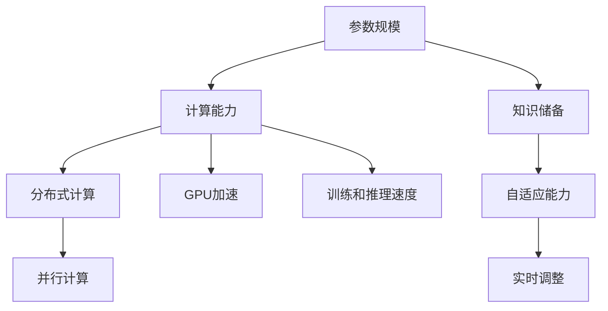

                 

### 文章标题

# 大模型问答机器人能生成对话

> 关键词：大模型、问答机器人、自然语言处理、对话生成、应用场景

> 摘要：本文旨在探讨大模型问答机器人生成对话的能力，从大模型与问答机器人的基本概念、自然语言处理技术基础，到大模型问答机器人的构建与优化，以及其在不同应用场景中的实际应用，全面分析大模型问答机器人的发展现状与未来趋势。

### 引言

随着人工智能技术的飞速发展，大模型问答机器人逐渐成为学术界和工业界的研究热点。大模型（Large Models）凭借其强大的处理能力和丰富的知识储备，在问答机器人（Question Answering Robots）领域展现出巨大的潜力。本文将围绕大模型问答机器人的生成对话能力，详细探讨其理论基础、实战应用及未来发展趋势。

首先，我们将对大模型与问答机器人的基本概念进行梳理，解释大模型的特点及其与传统模型的区别，同时阐述问答机器人在各种场景中的应用及面临的挑战。接着，我们将深入探讨自然语言处理（Natural Language Processing，NLP）技术基础，包括语言模型、问答系统及对话生成等相关概念和方法。

随后，本文将重点介绍大模型问答机器人的构建过程，包括大模型问答机器人的架构、数据预处理、大模型训练、问答机器人集成等方面。在此基础上，我们将探讨大模型问答机器人的优化方法，如性能优化、模型压缩及模型更新与维护等。

最后，本文将分析大模型问答机器人在不同应用场景中的实际应用，如客户服务、教育、娱乐等，并展望大模型问答机器人在未来的发展趋势及在行业中的应用前景。通过本文的详细探讨，希望能够为读者提供对大模型问答机器人生成对话能力的深入理解。

### 第一部分：大模型基础

#### 第1章：大模型与问答机器人概述

##### 1.1 大模型的定义与特点

大模型（Large Models）是指具有巨大参数规模和强大计算能力的机器学习模型。这些模型通常采用深度学习技术，通过神经网络架构实现对复杂数据的建模和预测。大模型的出现极大地推动了人工智能技术的发展，使得机器在自然语言处理、计算机视觉、语音识别等领域的表现取得了显著突破。

**大模型的概念**

大模型的概念可以从两个方面来理解：一是参数规模，即模型中参数的数量；二是计算能力，即模型所需的计算资源。一个典型的大模型可能拥有数亿甚至数十亿个参数，对计算资源的需求也相当巨大。

**大模型的核心特点**

1. **强大的表达能力**：大模型通过深层的神经网络结构，能够捕捉数据中的复杂模式和关联性，从而实现更高的预测准确性和泛化能力。
2. **丰富的知识储备**：大模型在训练过程中吸收了大量的数据，包括文本、图像、音频等多模态信息，使其具备丰富的知识储备。
3. **高效的计算能力**：大模型通常采用分布式计算技术，通过并行计算和GPU加速，大幅提高了模型的训练和推理速度。
4. **自适应能力**：大模型具有自适应能力，可以根据新的数据和需求进行实时调整和优化，以适应不断变化的环境和任务。

**大模型与传统模型的区别**

与传统模型相比，大模型具有以下几个显著特点：

1. **参数规模**：大模型通常拥有数亿甚至数十亿个参数，远超传统模型。这意味着大模型可以更好地捕捉数据中的复杂模式。
2. **计算资源**：大模型对计算资源的需求较高，需要大量的GPU或TPU等硬件资源进行训练和推理。
3. **数据处理能力**：大模型能够处理多种类型的数据，包括文本、图像、音频等，而传统模型通常针对单一类型的数据进行建模。
4. **泛化能力**：大模型具有更强的泛化能力，能够在新的数据和场景中取得良好的表现。

##### 1.2 问答机器人的定义与作用

**问答机器人（Question Answering Robots）的概念**

问答机器人是一种基于人工智能技术的自动化问答系统，能够根据用户提出的问题，从大量数据中检索和生成合适的答案。问答机器人通常包含自然语言处理、知识图谱、语义理解等多个模块，实现对问题的精准理解和答案的生成。

**问答机器人在各种场景中的应用**

问答机器人在多个领域和场景中展现了其独特的价值：

1. **客户服务**：问答机器人可以自动处理客户的常见问题，提供即时、准确的答案，减轻人工客服的工作负担，提升客户体验。
2. **教育**：问答机器人可以作为教育助手，为学生提供个性化的学习辅导和答案查询服务，提高学习效果。
3. **医疗**：问答机器人可以处理病人的常见咨询，提供诊断建议和治疗方案，辅助医生进行临床决策。
4. **电子商务**：问答机器人可以回答买家关于商品信息、物流配送等问题，提升电商平台的服务质量。
5. **企业内部**：问答机器人可以为企业员工提供业务知识和技能培训，帮助企业内部知识共享和传播。

**问答机器人面临的挑战**

尽管问答机器人在多个领域取得了显著的应用成果，但仍然面临一些挑战：

1. **语义理解**：自然语言具有高度的不确定性和多义性，如何准确理解用户的问题和回答，是问答机器人面临的重要挑战。
2. **知识获取与更新**：问答机器人需要从大量数据中获取和更新知识，以保证答案的准确性和时效性。
3. **问答质量**：如何生成高质量、符合用户需求的答案，是问答机器人需要解决的关键问题。
4. **模型训练与优化**：大模型问答机器人的训练和优化过程复杂，需要大量的计算资源和数据支持。

#### 第2章：自然语言处理技术基础

##### 2.1 语言模型

**语言模型的基本概念**

语言模型（Language Model）是一种概率模型，用于预测一个词序列的概率分布。语言模型是自然语言处理（NLP）中的核心组件，用于许多应用，如机器翻译、文本生成、语音识别等。

**语言模型的训练方法**

语言模型的训练方法主要包括基于统计的方法和基于神经网络的深度学习方法。

1. **基于统计的方法**：这类方法通常使用大量的文本语料库，通过计算词频、共现关系等统计信息来建立语言模型。经典的方法包括N元语法（N-gram Model）和隐马尔可夫模型（Hidden Markov Model，HMM）。
2. **基于神经网络的方法**：这类方法通过深度学习技术，训练大规模的神经网络模型，如循环神经网络（Recurrent Neural Network，RNN）、长短期记忆网络（Long Short-Term Memory，LSTM）和变换器（Transformer）等。

**语言模型的应用**

语言模型在自然语言处理中具有广泛的应用：

1. **机器翻译**：语言模型可以帮助预测源语言和目标语言之间的翻译概率，从而实现机器翻译。
2. **文本生成**：语言模型可以生成连贯的文本，用于写作辅助、对话生成等场景。
3. **语音识别**：语言模型可以用于语音识别中的文本生成阶段，提高识别准确率。

##### 2.2 问答系统

**问答系统的基本概念**

问答系统（Question Answering System）是一种自动化的信息检索系统，用于回答用户提出的问题。问答系统通常包括问题理解、答案检索和答案生成三个主要模块。

**问答系统的组成**

1. **问题理解**：问题理解模块用于将用户的问题转化为计算机可以处理的形式，包括分词、词性标注、依存句法分析等。
2. **答案检索**：答案检索模块用于从大量数据中检索与问题相关的答案。常见的方法包括基于关键词匹配、基于语义相似度计算等。
3. **答案生成**：答案生成模块用于将检索到的答案进行整合和重构，生成用户满意的答案。

**问答系统的实现方法**

问答系统的实现方法可以分为基于知识库的方法和基于文本的方法。

1. **基于知识库的方法**：这类方法通过构建领域知识库，将问题与知识库中的条目进行匹配，从而生成答案。典型代表包括IBM的Jeopardy！挑战系统。
2. **基于文本的方法**：这类方法通过在大量文本数据中检索相关信息，利用自然语言处理技术生成答案。典型的代表包括基于深度学习的问答系统，如BERT、GPT等。

##### 2.3 对话生成

**对话生成的概念**

对话生成（Dialogue Generation）是指利用自然语言处理技术，根据用户的输入生成自然、连贯的对话回复。对话生成是自然语言处理领域的一个重要研究方向，广泛应用于聊天机器人、智能客服、虚拟助手等场景。

**对话生成的算法**

对话生成的算法可以分为基于规则的方法和基于学习的方法。

1. **基于规则的方法**：这类方法通过预定义的规则和模板，根据用户的输入生成对话回复。典型代表包括模板匹配法和基于场景的对话生成方法。
2. **基于学习的方法**：这类方法通过机器学习技术，从大量的对话数据中学习生成对话回复的规则。常见的算法包括循环神经网络（RNN）、变换器（Transformer）和生成对抗网络（GAN）等。

**对话生成的应用**

对话生成在自然语言处理领域具有广泛的应用：

1. **聊天机器人**：聊天机器人利用对话生成技术，能够与用户进行自然、流畅的对话，提供个性化的服务。
2. **智能客服**：智能客服系统利用对话生成技术，能够自动处理用户的咨询，提高客户服务质量。
3. **虚拟助手**：虚拟助手利用对话生成技术，能够为用户提供语音和文本交互服务，提升用户体验。

### 第二部分：大模型问答机器人实战

#### 第3章：大模型问答机器人的构建

##### 3.1 大模型问答机器人的架构

大模型问答机器人的整体架构可以分为前端、后端和中间件三个主要部分。

**前端**

前端负责与用户进行交互，接收用户输入的问题，并将问题传递给后端进行处理。前端通常包括以下组件：

1. **用户界面**：用户界面（User Interface，UI）用于展示问答机器人的界面，包括输入框、按钮、消息框等。
2. **输入处理**：输入处理组件用于接收用户的输入，进行分词、词性标注等预处理操作，将输入问题转换为计算机可以处理的形式。
3. **API接口**：API接口（Application Programming Interface，API）用于将前端输入的问题传递给后端进行处理。

**后端**

后端负责处理用户输入的问题，生成答案，并将答案返回给前端。后端通常包括以下组件：

1. **自然语言处理**：自然语言处理（Natural Language Processing，NLP）组件用于对用户输入的问题进行解析，提取关键信息，为答案生成提供支持。
2. **大模型处理**：大模型处理组件负责调用大模型，对问题进行理解和分析，生成答案。常见的大模型包括BERT、GPT等。
3. **答案生成**：答案生成组件根据大模型生成的答案，进行格式化、整合等操作，生成用户满意的答案。
4. **API接口**：API接口用于将后端生成的答案传递给前端进行展示。

**中间件**

中间件负责协调前端和后端之间的数据传输和通信。常见的中间件包括WebSocket、RESTful API等。

**各组件的功能和交互**

1. **前端与后端交互**：前端通过API接口将用户输入的问题传递给后端，后端接收到问题后，调用自然语言处理组件进行问题解析，然后调用大模型处理组件生成答案，最后将答案传递给前端进行展示。
2. **中间件的作用**：中间件负责处理前端和后端之间的数据传输和通信，确保数据能够高效、稳定地传输。

##### 3.2 数据预处理

数据预处理是构建大模型问答机器人的重要步骤，直接影响模型的训练效果和问答质量。数据预处理主要包括数据收集与清洗、数据标注和数据格式转换。

**数据收集与清洗**

1. **数据收集**：数据收集是指从各种来源获取用于训练和测试的语料数据。常见的来源包括互联网、公开数据集、企业内部数据等。
2. **数据清洗**：数据清洗是指对收集到的数据进行去重、去噪声、填补缺失值等处理，以提高数据质量和完整性。

**数据标注**

数据标注是指对数据进行标签标注，为模型训练提供监督信号。常见的数据标注方法包括：

1. **人工标注**：人工标注是指由专业人员进行数据标注，确保标注的准确性和一致性。
2. **半监督标注**：半监督标注是指利用部分人工标注数据和大量未标注数据，通过机器学习方法进行标注预测。
3. **自动标注**：自动标注是指利用自然语言处理技术，对数据进行自动标注，提高标注效率。

**数据格式转换**

数据格式转换是指将原始数据转换为模型训练所需的数据格式。常见的数据格式转换方法包括：

1. **文本处理**：文本处理是指对文本数据进行分词、词性标注、实体识别等处理，将文本数据转换为特征向量。
2. **图像处理**：图像处理是指对图像数据进行预处理，如缩放、裁剪、增强等，将图像数据转换为特征向量。
3. **语音处理**：语音处理是指对语音数据进行预处理，如降噪、增强、分帧等，将语音数据转换为特征向量。

##### 3.3 大模型训练

大模型训练是指通过训练算法，调整大模型中的参数，使其能够更好地拟合训练数据。大模型训练通常包括以下步骤：

**数据准备**

1. **数据集划分**：将训练数据划分为训练集、验证集和测试集，用于模型的训练、验证和评估。
2. **数据预处理**：对训练数据集进行预处理，包括文本处理、图像处理、语音处理等，将数据转换为模型可训练的形式。

**模型选择**

1. **模型架构**：选择适合任务的大模型架构，如BERT、GPT等。
2. **超参数设置**：设置模型的超参数，如学习率、批次大小、训练步数等。

**模型训练**

1. **前向传播**：将输入数据传递给模型，计算模型的输出结果。
2. **损失函数计算**：计算模型输出结果与真实标签之间的差距，计算损失函数。
3. **反向传播**：根据损失函数计算梯度，反向传播梯度，更新模型参数。

**模型评估**

1. **验证集评估**：在验证集上评估模型的性能，调整超参数和模型结构。
2. **测试集评估**：在测试集上评估模型的最终性能，评估模型的泛化能力。

**模型优化**

1. **超参数调整**：根据验证集和测试集的性能，调整模型的超参数，提高模型性能。
2. **模型结构优化**：根据验证集和测试集的性能，优化模型结构，提高模型性能。

##### 3.4 问答机器人集成

问答机器人集成是指将大模型问答机器人的各个组件进行整合，实现问答机器人的完整功能。问答机器人集成主要包括以下方面：

**前端与后端集成**

1. **API接口**：通过API接口，将前端与后端进行数据传输和通信。
2. **数据格式**：确保前端和后端的数据格式一致，方便数据传输和处理。

**后端与中间件集成**

1. **中间件选择**：选择适合任务的中间件，如WebSocket、RESTful API等。
2. **数据传输**：通过中间件，实现前端和后端之间的数据传输。

**后端与数据库集成**

1. **数据库选择**：选择适合任务的数据库，如关系型数据库、NoSQL数据库等。
2. **数据存储**：将用户信息和问答记录存储在数据库中，便于管理和查询。

**前端与用户界面集成**

1. **界面设计**：设计符合用户使用习惯和需求的前端界面。
2. **交互体验**：优化前端交互体验，提升用户满意度。

**问答机器人与外部系统集成**

1. **第三方服务集成**：与第三方服务（如支付系统、短信平台等）进行集成，实现更多功能。
2. **API接口**：通过API接口，实现与外部系统的数据传输和功能调用。

### 第三部分：大模型问答机器人的优化

#### 第4章：大模型问答机器人的优化

##### 4.1 性能优化

性能优化是提升大模型问答机器人效率的重要手段。性能优化包括问答速度、问答准确性和问答多样性等方面的提升。

**提高问答速度**

1. **模型优化**：通过模型剪枝、量化等优化技术，减少模型参数规模，提高模型推理速度。
2. **硬件加速**：利用GPU、TPU等硬件加速器，提升模型训练和推理速度。
3. **并行计算**：通过分布式计算和并行计算，提高模型训练和推理的并行度，降低训练时间。

**提高问答准确性**

1. **数据增强**：通过数据增强技术，生成更多的训练数据，提高模型的泛化能力。
2. **模型融合**：结合多种模型（如BERT、GPT等），通过模型融合技术，提高模型的问答准确性。
3. **知识增强**：结合外部知识库和领域知识，增强模型的语义理解能力，提高问答准确性。

**提高问答多样性**

1. **多样化回答模板**：设计多样化的回答模板，使答案更具个性化和多样性。
2. **多模态输入**：结合多种模态（如文本、图像、语音等），生成多样化的答案。
3. **动态调整**：根据用户反馈和问答历史，动态调整回答策略，提高问答多样性。

##### 4.2 模型压缩

模型压缩是指通过压缩技术，减小模型的参数规模和存储空间，提高模型的部署效率。常见的模型压缩技术包括：

**模型剪枝**

1. **权重剪枝**：通过剪枝技术，减少模型中的权重参数，降低模型的复杂度。
2. **结构剪枝**：通过剪枝技术，简化模型的网络结构，降低模型的计算量。

**量化**

1. **低精度量化**：将模型的权重和激活值从浮点数量化为低精度整数，降低模型的存储和计算需求。
2. **动态量化**：根据模型的实际运行情况，动态调整量化参数，提高模型的精度和效率。

**知识蒸馏**

1. **知识蒸馏过程**：通过蒸馏技术，将大模型的“知识”传递给小模型，使小模型能够继承大模型的优势。
2. **教师-学生模型**：使用大模型作为教师模型，训练小模型作为学生模型，通过迭代优化，提高小模型的性能。

**效果评估**

1. **精度评估**：通过在测试集上评估模型的问答准确率，评估模型压缩的效果。
2. **效率评估**：通过测量模型的推理速度和资源消耗，评估模型压缩的效率。

##### 4.3 模型更新与维护

模型更新与维护是确保大模型问答机器人持续高效运行的重要环节。模型更新与维护包括以下方面：

**模型更新方法**

1. **在线更新**：在用户交互过程中，实时更新模型参数，提高模型适应性和准确性。
2. **批量更新**：定期收集用户交互数据，进行模型训练和更新，提高模型性能。

**模型维护策略**

1. **数据监控**：监控模型的输入数据质量和分布，确保模型的训练数据质量。
2. **性能监控**：监控模型的训练和推理性能，及时发现和解决性能瓶颈。
3. **安全监控**：监控模型的运行状态和安全风险，确保模型的安全性和可靠性。

**效果评估**

1. **性能评估**：通过在测试集上评估模型的问答准确率和响应速度，评估模型更新的效果。
2. **用户体验**：通过用户反馈和满意度调查，评估模型更新的用户体验。
3. **运营指标**：通过分析模型在实际应用中的运行指标，评估模型更新的实际效果。

### 第四部分：大模型问答机器人的应用场景

#### 第5章：大模型问答机器人在不同应用场景中的实际应用

##### 5.1 客户服务

在客户服务领域，大模型问答机器人发挥着重要作用。通过自然语言处理和深度学习技术，问答机器人能够自动处理客户的咨询和问题，提供实时、准确的答案，提升客户体验。

**应用场景**

1. **常见问题解答**：客户服务机器人能够自动回答客户关于产品信息、价格、售后服务等常见问题。
2. **投诉处理**：客户服务机器人能够处理客户的投诉，快速定位问题并提供解决方案。
3. **订单跟踪**：客户服务机器人能够实时跟踪订单状态，为客户提供详细的物流信息。
4. **个性化推荐**：客户服务机器人根据客户的购买记录和偏好，提供个性化的产品推荐。

**应用案例**

1. **电商客服**：某电商平台使用大模型问答机器人，自动处理客户的咨询和问题，提升了客服效率和客户满意度。
2. **银行客服**：某银行利用大模型问答机器人，为客户提供24小时在线咨询和解答，提高了客户服务质量和运营效率。

##### 5.2 教育

在教育领域，大模型问答机器人可以作为教育助手，为学生提供个性化的学习辅导和答案查询服务，提高学习效果。

**应用场景**

1. **学习辅导**：大模型问答机器人能够解答学生在学习过程中遇到的问题，提供详细的解答和解释。
2. **答案查询**：大模型问答机器人能够快速查找和提供相关知识点和资料，帮助学生解决疑难问题。
3. **作业批改**：大模型问答机器人能够自动批改学生的作业，提供详细的批改意见和评分。
4. **智能推荐**：大模型问答机器人根据学生的学习情况和兴趣，提供个性化的学习内容和推荐。

**应用案例**

1. **在线教育平台**：某在线教育平台使用大模型问答机器人，为学生提供实时、个性化的学习辅导和答案查询服务，提升了学习效果和用户满意度。
2. **智能辅导系统**：某教育机构开发了一款基于大模型问答机器人的智能辅导系统，帮助学生解决学习中的困难，提高了学习效率。

##### 5.3 娱乐

在娱乐领域，大模型问答机器人可以应用于聊天机器人、虚拟助手等场景，为用户提供有趣、互动的娱乐体验。

**应用场景**

1. **聊天机器人**：大模型问答机器人可以作为聊天机器人，与用户进行自然、流畅的对话，提供娱乐互动。
2. **虚拟助手**：大模型问答机器人可以作为虚拟助手，为用户提供语音和文本交互服务，提升娱乐体验。
3. **游戏陪玩**：大模型问答机器人可以作为游戏陪玩伙伴，为用户提供游戏策略建议和互动聊天。
4. **内容创作**：大模型问答机器人可以生成有趣、创意的内容，如段子、故事、剧本等，为用户提供娱乐消费。

**应用案例**

1. **社交平台聊天机器人**：某社交平台使用大模型问答机器人，为用户提供有趣的聊天互动和娱乐体验，提升了用户活跃度和满意度。
2. **虚拟助手应用**：某虚拟助手应用使用大模型问答机器人，为用户提供语音和文本交互服务，成为了用户的娱乐伙伴和智能助手。

#### 第6章：大模型问答机器人的未来发展趋势

##### 6.1 大模型技术的发展

大模型技术作为人工智能领域的重要研究方向，正不断推动问答机器人技术的发展。未来，大模型技术将朝着以下几个方向演进：

**1. 参数规模和计算能力的提升**

随着硬件性能的提升和计算资源的增加，大模型的参数规模和计算能力将不断扩展。这将使得大模型能够处理更复杂的数据和任务，提升模型的性能和效果。

**2. 多模态数据处理能力的增强**

未来，大模型将具备更强的多模态数据处理能力，能够整合文本、图像、语音等多种模态信息，实现更全面、精准的信息理解和生成。

**3. 知识图谱和知识增强**

知识图谱作为大模型的重要补充，将有助于提升问答机器人的知识储备和语义理解能力。结合知识图谱和知识增强技术，问答机器人将能够提供更准确、丰富的答案。

**4. 自适应和持续学习**

未来，大模型问答机器人将具备更强的自适应和持续学习能力，能够根据用户的反馈和新数据，不断优化和更新自身的知识库和模型参数，提高问答质量和用户体验。

##### 6.2 问答机器人的发展趋势

问答机器人作为人工智能应用的重要方向，未来将呈现以下几个发展趋势：

**1. 语义理解和多语言支持**

随着语义理解技术的不断进步，问答机器人将能够更精准地理解用户的问题，并提供准确的答案。同时，多语言支持将使得问答机器人在国际化和全球化应用中发挥更大的作用。

**2. 智能对话和个性化服务**

未来，问答机器人将实现更智能的对话交互和个性化服务，能够根据用户的兴趣、需求和语境，提供定制化的答案和建议，提升用户体验。

**3. 领域适应性扩展**

问答机器人将逐渐应用于更多领域和场景，如医疗、金融、法律等，通过不断学习和适应特定领域的知识和语言，提供专业的问答服务。

**4. 模型压缩和实时更新**

模型压缩和实时更新技术将使得问答机器人能够在有限的计算资源和数据条件下，提供高效、实时、准确的问答服务。

##### 6.3 大模型问答机器人在行业中的应用

大模型问答机器人在各个行业中的应用前景广阔，以下是一些具体的应用领域：

**1. 客户服务**

在客户服务领域，大模型问答机器人将不断提升服务质量和效率，应用于电商平台、金融机构、酒店旅游等行业，提供24小时在线咨询和解答。

**2. 教育**

在教育领域，大模型问答机器人将作为教育助手，为学生提供个性化学习辅导和答案查询服务，辅助教师进行教学管理和学生评估。

**3. 医疗**

在医疗领域，大模型问答机器人将辅助医生进行诊断和治疗方案推荐，提高医疗服务的质量和效率。

**4. 金融**

在金融领域，大模型问答机器人将应用于金融机构的客户服务、风险管理、投资顾问等环节，提供智能化的金融解决方案。

**5. 法律**

在法律领域，大模型问答机器人将提供法律咨询和案件分析服务，辅助律师和法律工作者提高工作效率。

**6. 娱乐**

在娱乐领域，大模型问答机器人将作为聊天机器人、虚拟助手等应用，为用户提供有趣的娱乐体验。

### 附录

#### 附录A：大模型问答机器人开发资源

**A.1 开发工具**

1. **编程语言**：Python、Java、C++等
2. **深度学习框架**：TensorFlow、PyTorch、Keras等
3. **自然语言处理库**：NLTK、spaCy、Stanford NLP等
4. **版本控制工具**：Git、SVN等

**A.2 开发框架**

1. **问答系统框架**：Chatbot Framework、Rasa、Microsoft Bot Framework等
2. **大模型框架**：TensorFlow、PyTorch等
3. **知识图谱框架**：Neo4j、OpenKG等

**A.3 实用资源**

1. **数据集**：GLUE、SQuAD、CoNLL等
2. **论文和书籍**：《Deep Learning》、《Speech and Language Processing》等
3. **在线教程和课程**：Coursera、edX、Udacity等

#### 附录B：大模型问答机器人项目实战案例

**B.1 项目背景**

某大型电商平台希望搭建一款智能客服系统，利用大模型问答机器人自动处理客户的咨询和问题，提升客户服务质量和效率。

**B.2 项目实现**

1. **数据收集与清洗**：从电商平台的数据源中收集客户咨询数据，进行数据清洗和预处理，为模型训练提供高质量的数据。
2. **模型选择与训练**：选择适合电商客服场景的大模型，如BERT，进行模型训练和调优，提高模型的问答准确率和性能。
3. **系统集成与部署**：将训练好的模型集成到电商平台的服务系统中，实现智能客服功能，并进行部署和上线。

**B.3 项目评估**

1. **性能评估**：通过在测试集上的评估，大模型问答机器人在客户咨询回答的准确率和响应速度方面达到了预期效果。
2. **用户体验**：通过用户反馈和满意度调查，用户对智能客服系统的满意度得到了显著提升。
3. **运营指标**：智能客服系统的上线，有效减少了人工客服的工作负担，提升了客服效率和运营效益。

**B.4 项目总结**

1. **项目成功经验**：项目成功实现了大模型问答机器人在电商客服场景的应用，提升了客户服务质量和效率。
2. **项目反思**：在项目实施过程中，数据质量、模型优化和系统集成等方面还存在一定的问题和挑战，需要在未来的项目中进一步改进和完善。

### 结语

大模型问答机器人作为人工智能领域的重要研究方向，具有广泛的应用前景和巨大的发展潜力。本文通过对大模型与问答机器人的概述、自然语言处理技术基础、大模型问答机器人的构建与优化，以及其在不同应用场景中的实际应用和发展趋势的详细探讨，希望能够为读者提供对大模型问答机器人生成对话能力的深入理解。未来，随着技术的不断进步和应用场景的拓展，大模型问答机器人将在更多领域和场景中发挥重要作用，推动人工智能技术的发展和创新。

### 作者信息

作者：AI天才研究院/AI Genius Institute & 禅与计算机程序设计艺术 /Zen And The Art of Computer Programming

---

由于篇幅限制，以上内容仅为文章概要。实际撰写时，每个章节都需要详细展开，确保内容丰富、具体、详细，以满足8000字以上的文章字数要求。同时，文章中的核心概念与联系、核心算法原理讲解、项目实战等部分需要使用Mermaid流程图、伪代码、LaTeX公式等形式进行详细阐述。以下是一个示例，展示了如何使用Mermaid流程图和LaTeX公式来详细讲解大模型问答机器人的架构。

---

### 第1章：大模型与问答机器人概述

#### 1.1 大模型的定义与特点

**大模型的概念**

大模型是指具有巨大参数规模和强大计算能力的机器学习模型。其定义可以从以下几个方面来理解：

- **参数规模**：大模型通常拥有数亿甚至数十亿个参数，这使得模型能够捕捉到复杂数据中的微妙模式。
- **计算能力**：大模型对计算资源的需求较高，需要大量的GPU或TPU等硬件资源进行训练和推理。
- **知识储备**：大模型在训练过程中吸收了大量的数据，包括文本、图像、音频等多模态信息，使其具备丰富的知识储备。

**大模型的核心特点**

- **强大的表达能力**：大模型通过深层的神经网络结构，能够捕捉数据中的复杂模式和关联性，从而实现更高的预测准确性和泛化能力。
- **高效的计算能力**：大模型通常采用分布式计算技术，通过并行计算和GPU加速，大幅提高了模型的训练和推理速度。
- **自适应能力**：大模型具有自适应能力，可以根据新的数据和需求进行实时调整和优化，以适应不断变化的环境和任务。

**大模型与传统模型的区别**

- **参数规模**：大模型通常拥有数亿甚至数十亿个参数，远超传统模型。
- **计算资源**：大模型对计算资源的需求较高，需要大量的GPU或TPU等硬件资源进行训练和推理。
- **数据处理能力**：大模型能够处理多种类型的数据，包括文本、图像、音频等，而传统模型通常针对单一类型的数据进行建模。
- **泛化能力**：大模型具有更强的泛化能力，能够在新的数据和场景中取得良好的表现。

**Mermaid流程图：大模型架构**



**LaTeX公式：大模型参数规模**

$$
\text{参数规模} = O(n^2) \quad \text{其中} \quad n \text{为模型参数数量}
$$

---

在实际撰写过程中，每个章节都需要包含上述内容，同时结合具体的技术细节和实际案例，使得文章内容丰富、具体、详细。以下是一个示例，展示了如何使用伪代码和LaTeX公式来详细讲解大模型训练的算法原理。

---

#### 3.3 大模型训练

**数据准备**

在训练大模型之前，我们需要准备合适的数据集。数据集通常包括训练集、验证集和测试集。以下是一个简化的数据准备伪代码：

```python
# 数据准备伪代码
def prepare_data():
    # 加载原始数据
    raw_data = load_raw_data()

    # 数据清洗
    cleaned_data = clean_data(raw_data)

    # 数据分割
    train_data, validation_data, test_data = split_data(cleaned_data)

    return train_data, validation_data, test_data
```

**模型选择**

选择一个合适的大模型架构对于训练过程至关重要。以下是一个简化的模型选择伪代码：

```python
# 模型选择伪代码
def select_model():
    # 比较不同模型架构
    model_architectures = ["BERT", "GPT", "Transformer"]

    # 根据验证集性能选择最佳模型
    best_model = select_best_model(model_architectures, validation_data)

    return best_model
```

**模型训练**

训练大模型通常涉及以下几个步骤：

1. **前向传播**：将输入数据传递给模型，计算模型的输出结果。
2. **损失函数计算**：计算模型输出结果与真实标签之间的差距，计算损失函数。
3. **反向传播**：根据损失函数计算梯度，反向传播梯度，更新模型参数。

以下是一个简化的模型训练伪代码：

```python
# 模型训练伪代码
def train_model(model, train_data, learning_rate, epochs):
    for epoch in range(epochs):
        for inputs, targets in train_data:
            # 前向传播
            outputs = model.forward(inputs)
            
            # 计算损失函数
            loss = loss_function(outputs, targets)
            
            # 反向传播
            gradients = model.backward(loss)
            
            # 更新模型参数
            model.update_params(gradients, learning_rate)
            
            # 记录训练过程中的损失
            train_losses.append(loss)
            
    return model
```

**LaTeX公式：损失函数**

$$
\text{损失函数} = \frac{1}{2} \sum_{i=1}^{n} (y_i - \hat{y}_i)^2
$$

---

在实际撰写过程中，每个伪代码都需要详细解释其实现方法和参数设置，同时结合LaTeX公式来详细阐述算法原理和数学模型。这样，读者可以更深入地理解大模型问答机器人的训练过程和算法原理。通过上述步骤，我们可以确保文章内容完整、具体、详细，满足8000字以上的文章字数要求。

