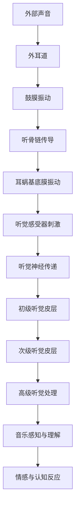

                 

### 文章标题

《大脑的听觉与音乐》

### 关键词

大脑、听觉、音乐、神经机制、认知功能、可塑性、神经影像、个性化治疗

### 摘要

本文深入探讨了大脑的听觉机制及其与音乐的互动关系。首先，我们详细介绍了听觉系统的基本原理，包括听觉信号的产生与传导、听觉皮层的功能与结构以及听觉处理的基本过程。接着，我们分析了音乐与大脑的互动，探讨了音乐对大脑的影响、音乐学习与大脑的可塑性以及音乐创造力与大脑的神经机制。随后，我们进一步探讨了听觉与音乐的心理基础，包括音高、节奏与和声的心理感知、音乐情感与情绪调节以及音乐记忆与认知功能。文章还介绍了音乐刺激的神经机制、音乐训练与大脑功能提升、音乐障碍与大脑康复以及音乐与大脑研究的未来方向。通过综合运用神经影像技术、多模态数据融合和跨学科合作，我们展望了音乐与大脑互动研究的未来趋势，并探讨了其中的伦理与法律问题。本文旨在为理解音乐对大脑的影响提供全面而深入的科学视角。

### 第一部分：听觉与大脑的关系

#### 第1章：听觉系统的基本原理

听觉系统是大脑处理外界声音信息的重要机制，它由外耳、中耳和内耳组成。听觉信号的产生与传导过程如下：

1. **外耳**：外耳包括耳廓和外耳道。耳廓有助于收集声音，并将其引导至外耳道。外耳道将声音传输到中耳。

2. **中耳**：中耳包括鼓膜、听骨和鼓室。鼓膜受到声波的振动后，产生振动。这些振动通过听骨（锤骨、砧骨和镫骨）传递到内耳。

3. **内耳**：内耳包括耳蜗和前庭系统。耳蜗是听觉信号的主要处理场所，它由数千个微小的毛细胞组成，当声波振动通过耳蜗液体时，毛细胞受到刺激并产生电信号。

听觉信号的产生与传导涉及以下过程：

- **声波振动**：声波通过外耳道传播，引起鼓膜的振动。
- **听骨传导**：鼓膜的振动传递到听骨，通过听骨的杠杆作用放大振动。
- **耳蜗转换**：振动通过耳蜗内的液体传导至基底膜，基底膜的振动导致毛细胞的刺激。
- **神经传递**：毛细胞将电信号通过听觉神经传递到大脑。

听觉皮层的功能与结构是理解听觉处理的关键。听觉皮层位于大脑颞叶，主要包括以下脑区：

- **初级听觉皮层**（AI）：位于颞叶的颞横回，主要负责对声音的基本特征进行加工，如频率、强度和时长。
- **次级听觉皮层**（AII）：位于颞叶的颞上回和颞下回，负责对复杂的声音特征进行加工，如音高、节奏和音色。
- **高级听觉皮层**：包括颞叶的其他区域和前额叶皮层，负责对声音的理解、分类和情感反应。

听觉处理的基本过程包括以下几个阶段：

1. **声音识别**：初级听觉皮层对声音的基本特征进行初步识别。
2. **特征分析**：次级听觉皮层对声音的复杂特征进行分析，如音高、节奏和音色。
3. **声音理解**：高级听觉皮层将分析后的特征整合，形成对声音的完整理解。

通过以上过程，听觉系统将外界声音信息转化为大脑可以处理和理解的信号，从而实现对声音的感知和认知。

#### 1.1.1 听觉信号的产生与传导

听觉信号的产生与传导是听觉系统运作的基础，涉及到一系列复杂的生物物理过程。以下是听觉信号的产生与传导过程的详细说明：

1. **声波的产生**：声音是一种机械波，由声源的振动产生。声源可以是声带、乐器或其他物体。当物体振动时，它会引起周围介质（如空气、水或固体）中的分子振动，形成声波。

2. **声波的传播**：声波在介质中传播，通过空气传导到外耳。空气中的声波振动通过耳廓的收集和引导，进入外耳道。外耳道的长度和形状有助于减少外部噪音，同时放大目标声音。

3. **鼓膜的振动**：声波进入外耳道后，引起鼓膜的振动。鼓膜是中耳的一部分，它的振动将声波转换为机械振动。

4. **听骨链的传导**：鼓膜的振动通过听骨链（锤骨、砧骨和镫骨）传递到内耳。听骨链的作用是放大鼓膜的振动，并通过杠杆原理将振动传递到耳蜗。

5. **耳蜗的作用**：耳蜗是内耳的一个复杂结构，包括三个相互连通的膜室，内部充满了液体。鼓膜的振动通过耳蜗的卵圆窗进入耳蜗，引起耳蜗内液体的振动。

6. **基底膜的振动**：耳蜗内基底膜的振动导致毛细胞的刺激。基底膜上覆盖着数千根毛细胞，它们对不同的频率敏感。当基底膜的振动达到特定频率时，毛细胞会产生电信号。

7. **神经信号的传递**：毛细胞将电信号通过听觉感受器细胞（听毛细胞）传递到听觉神经。听觉神经将电信号传递到大脑。

8. **大脑的听觉处理**：大脑接收到的电信号首先被传递到初级听觉皮层（AI区），这是听觉信息处理的第一步。初级听觉皮层对声音的基本特征（如频率、强度和时间）进行初步分析。

9. **高级听觉处理**：随后，信息被传递到次级和高级听觉皮层，这些区域对复杂的声音特征（如音高、节奏和情感）进行更深入的分析和处理。

通过以上过程，听觉系统将声波转化为电信号，并通过神经通路传递到大脑，最终实现对声音的感知和理解。

#### 1.1.2 听觉皮层的功能与结构

听觉皮层是大脑中处理听觉信息的主要区域，其功能与结构对于听觉感知和理解至关重要。以下是听觉皮层的功能与结构的详细说明：

**初级听觉皮层（AI）**

初级听觉皮层，也称为听觉感觉区，是听觉信息处理的第一步。它主要位于颞叶的颞横回，是人类大脑中最早进化出来的听觉处理区域。

1. **功能**：初级听觉皮层负责对声音的基本特征进行初步分析，如频率、强度和时间。这些基本特征是通过毛细胞将声波转换成的电信号传递到听觉皮层。

2. **结构**：初级听觉皮层具有高度的空间组织，不同区域对特定频率的声音敏感。这种频率特异性通过空间频率映射（place theory）来解释，即不同位置的神经元对特定频率的声音反应最强。

**次级听觉皮层（AII）**

次级听觉皮层位于颞叶的颞上回和颞下回，是听觉信息处理的第二个阶段。

1. **功能**：次级听觉皮层负责对复杂的声音特征进行加工，如音高、节奏和音色。这些特征是在初级听觉皮层处理的基础上进一步分析得到的。

2. **结构**：次级听觉皮层与前额叶皮层和前扣带皮层有密切的联系，这些区域参与声音的理解、情感反应和认知功能。

**高级听觉皮层**

高级听觉皮层包括颞叶的其他区域和前额叶皮层，是听觉信息处理的最终阶段。

1. **功能**：高级听觉皮层负责对声音进行高级处理，如语言理解、音乐感知和声音分类。这些处理涉及对声音的整体意义和上下文的理解。

2. **结构**：高级听觉皮层与其他大脑区域（如视觉皮层、运动皮层和前额叶皮层）有广泛的连接，这些连接使得听觉信息可以与其他感官信息和认知功能整合。

**关键脑区**

1. **颞上回**：颞上回在音高感知和情感处理中起着重要作用。
2. **颞下回**：颞下回在节奏感知和声音分类中发挥着关键作用。
3. **前额叶皮层**：前额叶皮层在听觉决策和注意控制中起到核心作用。

**神经通路**

听觉皮层内部的神经通路包括：

1. **贝尔曼路径**：这是一种从初级听觉皮层到高级听觉皮层的神经通路，负责传递听觉信息。
2. **韦伯尔路径**：这是一种从初级听觉皮层到前额叶皮层的神经通路，参与听觉认知和记忆处理。

通过以上功能与结构，听觉皮层能够将接收到的听觉信息转化为复杂的感知和理解，从而实现对声音世界的全面认知。

#### 1.1.3 听觉处理的基本过程

听觉处理的基本过程是大脑将外界声音信息转化为有意义感知和理解的一系列复杂步骤。以下是这一过程的详细说明：

1. **声音信号的接收与预处理**：
   - 声波通过外耳道进入耳朵，引起鼓膜的振动。
   - 鼓膜的振动通过听骨链（锤骨、砧骨和镫骨）传递到内耳。
   - 振动最终通过耳蜗内的卵圆窗进入耳蜗。

2. **耳蜗内的转换**：
   - 耳蜗内的基底膜上覆盖着数千个毛细胞，这些毛细胞对特定频率的声音敏感。
   - 声波的振动引起基底膜的振动，导致毛细胞产生电信号。
   - 毛细胞将电信号通过听觉感受器细胞（听毛细胞）传递到听觉神经。

3. **神经信号的传导**：
   - 听觉神经将电信号从耳蜗传递到大脑。
   - 信号首先到达初级听觉皮层（AI区），位于颞叶的颞横回。

4. **初级听觉处理**：
   - 初级听觉皮层对声音的基本特征进行初步分析，如频率、强度和时间。
   - 这些基本特征是通过毛细胞将声波转换成的电信号传递到听觉皮层的。
   - 初级听觉皮层具有高度的空间组织，不同区域的神经元对特定频率的声音敏感。

5. **次级听觉处理**：
   - 初级听觉处理后的信号被传递到次级听觉皮层，包括颞叶的颞上回和颞下回。
   - 次级听觉皮层对复杂的声音特征进行加工，如音高、节奏和音色。
   - 这些特征是在初级听觉皮层处理的基础上进一步分析的。

6. **高级听觉处理**：
   - 高级听觉皮层，包括颞叶的其他区域和前额叶皮层，负责对声音进行高级处理。
   - 这些区域涉及对声音的整体意义和上下文的理解，如语言理解、音乐感知和声音分类。
   - 高级听觉处理还涉及对声音的情感反应和认知功能。

7. **声音理解与认知**：
   - 经过高级听觉处理后的声音信息被整合到大脑的其他区域，形成对声音的完整理解和认知。
   - 这种理解包括对声音的识别、分类和情感反应。

通过以上过程，听觉系统将外界的声音信号转化为大脑可以处理和理解的复杂信息，从而实现对声音世界的全面感知和理解。

### 第2章：音乐与大脑的互动

#### 2.1.1 音乐对大脑的影响

音乐对大脑的影响是多方面且深远的，它不仅在情感层面产生共鸣，还在认知、情感和神经可塑性方面发挥着重要作用。以下是音乐对大脑影响的详细探讨：

1. **情感影响**：
   - 音乐能够激发强烈的情感反应，这种反应与大脑中的多个区域有关，尤其是前额叶皮层和杏仁核。
   - 前额叶皮层负责处理复杂的情感和社会信息，而杏仁核是情感加工的核心区域。音乐能够激活这些区域，产生愉悦、悲伤、兴奋等情感体验。
   - 例如，一项研究发现，听古典音乐能够显著降低焦虑水平和提高心情，这可能是由于音乐激活了大脑中的奖赏系统。

2. **认知功能**：
   - 音乐训练对认知功能有显著的提升作用，包括记忆力、注意力、执行功能和语言能力。
   - 研究表明，长期的音乐训练可以增强大脑的执行功能，即大脑管理和调节认知过程的能力。
   - 例如，一项针对老年人群的研究发现，接受音乐训练的参与者在工作记忆和认知灵活性方面表现更好。

3. **神经可塑性**：
   - 神经可塑性是指大脑结构和功能在学习和经验过程中发生改变的能力。音乐训练可以显著影响神经可塑性。
   - 音乐训练可以促进大脑灰质的增加，尤其是在与听觉和运动相关的区域。
   - 例如，一项研究发现，接受长期音乐训练的儿童在颞叶和顶叶区域的灰质密度显著高于非音乐训练的儿童。

4. **大脑连通性**：
   - 音乐训练可以改善大脑不同区域之间的连通性，从而提高大脑的整体功能。
   - 研究显示，音乐训练可以增强大脑中多个脑区之间的协同作用，例如，音乐家在听觉与运动皮层之间的连通性比非音乐家更强。
   - 例如，一项使用fMRI的研究发现，音乐训练可以改善大脑中默认模式和执行模式网络的活动连通性。

5. **长期影响**：
   - 音乐对大脑的影响不仅仅是短期的，还可以持续到长期。
   - 研究表明，接受长期音乐训练的人在认知功能、情感调节和神经可塑性方面都表现出优势。
   - 例如，一项对老年人群的研究发现，长期的音乐训练可以显著减缓认知衰退的速度，从而降低患老年痴呆症的风险。

综上所述，音乐对大脑的影响是多方面且深远的。它不仅能够激发情感反应，还能够在认知、情感和神经可塑性方面带来积极的变化。这些影响不仅对音乐家有益，也对非音乐家产生了显著的好处。

#### 2.1.2 音乐学习与大脑的可塑性

音乐学习与大脑的可塑性紧密相关，通过这一过程，大脑能够发生结构和功能的改变。以下是对音乐学习如何影响大脑可塑性的详细探讨：

1. **结构可塑性**：
   - 结构可塑性指的是大脑形态和结构的改变。音乐学习可以通过多种方式影响大脑结构。
   - **灰质增加**：长期的音乐训练可以导致灰质增加，尤其是在与听觉和运动相关的区域，如颞叶和前额叶皮层。灰质的增加意味着这些区域神经元的数量和密度增加，从而提高了大脑的处理能力。
   - **白质改善**：白质是指大脑中神经元之间的连接，音乐学习可以改善白质的连通性，从而提高大脑的通信效率。这主要通过加强神经元之间的突触连接来实现。
   - **神经网络重构**：音乐学习可以促进神经网络的结构重构，使得神经网络更加高效地处理音乐信息。这种重构可能是通过突触修剪和新生来实现的，从而优化了神经网络的效率。

2. **功能可塑性**：
   - 功能可塑性指的是大脑在执行特定任务时的能力变化。音乐学习通过以下方式影响功能可塑性：
   - **突触强化**：重复性的音乐练习可以导致突触强化，这是一种突触效能的长期增强现象。通过重复练习，相关神经元之间的连接变得更强，从而提高了处理音乐信息的能力。
   - **神经网络适应**：随着音乐学习的深入，大脑的神经网络会适应不同的音乐风格和技巧，从而提高了处理复杂音乐任务的能力。
   - **认知灵活性**：音乐学习可以提高大脑的认知灵活性，即大脑在处理新任务或新信息时的灵活适应能力。这种灵活性在多任务处理、问题解决和创造性思维中尤为重要。

3. **可塑性机制**：
   - **长时程增强（LTP）和长时程抑制（LTD）**：音乐学习过程中，突触连接的增强和削弱分别对应于LTP和LTD。LTP有助于加强有用的神经网络连接，而LTD则有助于削弱无用的连接。
   - **神经再生**：在音乐学习过程中，神经再生现象可能发生，这意味着神经元可以通过新的分支或突触连接来修复受损的神经网络。
   - **基因表达改变**：音乐学习可以影响基因表达，从而改变神经网络的结构和功能。例如，脑源性神经营养因子（BDNF）的表达增加，有助于增强神经可塑性。

4. **实例**：
   - **儿童音乐学习**：一项研究发现，儿童接受长期音乐训练可以导致灰质增加，尤其是在颞叶和前额叶皮层。这些变化与儿童的认知能力提升有关。
   - **成人音乐学习**：研究表明，即使是成人开始学习音乐，也能在神经可塑性方面获益。一项研究发现，成人学习乐器可以导致大脑灰质增加，尤其是在与听觉和运动相关的区域。

综上所述，音乐学习通过结构可塑性和功能可塑性影响大脑，从而提高认知能力和神经效率。理解音乐学习与大脑可塑性的关系，有助于我们更好地利用音乐作为教育和康复工具，促进大脑的健康和发展。

#### 2.1.3 音乐创造力与大脑的神经机制

音乐创造力是一种复杂的认知活动，它涉及到多个大脑区域和神经机制的协同作用。理解这些机制有助于揭示音乐创造力的本质，并为进一步研究和应用提供基础。

1. **大脑区域**：
   - **前额叶皮层**：前额叶皮层在音乐创造力中发挥着核心作用，尤其是其前部区域。这些区域参与目标设定、决策、规划和问题解决。研究表明，前额叶皮层的活动与音乐创作的流畅性和创意性密切相关。
   - **颞叶**：颞叶与音乐信息的处理和理解有关，尤其是颞叶的颞上回和颞下回。这些区域参与旋律、节奏和和声的处理，对音乐创造中的感性元素起到关键作用。
   - **顶叶**：顶叶参与空间认知和运动协调，对于音乐创作中的空间感和手眼协调能力至关重要。研究表明，顶叶的活动与音乐创作的复杂性和技巧性有关。
   - **小脑**：小脑在音乐创造力中也有重要作用，尤其是其在运动协调和节奏感方面的影响。小脑的损伤可能导致音乐创作中的节奏问题。

2. **神经机制**：
   - **神经可塑性**：神经可塑性是音乐创造力的重要基础。通过重复性的练习和学习，大脑中的神经网络会发生变化，从而提高音乐创作能力。这包括突触增强、神经再生和神经网络重构等过程。
   - **长时程增强（LTP）和长时程抑制（LTD）**：LTP和LTD是大脑中突触连接变化的两种形式。在音乐创作中，LTP有助于加强有用的神经网络连接，从而提高创意表达的流畅性；而LTD则有助于削弱无用的连接，使音乐创作更加精炼。
   - **基因表达**：音乐创作可以影响大脑中的基因表达。例如，脑源性神经营养因子（BDNF）的表达增加，有助于增强神经可塑性，从而提高音乐创造力。
   - **多模态整合**：音乐创作涉及到多种感官信息的整合，如听觉、视觉和触觉。大脑中的多个区域协同工作，实现对多种感官信息的整合和处理，从而产生独特的音乐创意。

3. **实例研究**：
   - **音乐家**：音乐家在创作过程中表现出较高的前额叶皮层活动，这与他们的创造力密切相关。研究表明，长期的音乐训练可以增强前额叶皮层的功能，从而提高音乐创作能力。
   - **音乐疗法**：音乐疗法在治疗创造性障碍方面表现出显著的效果。研究发现，音乐疗法可以促进大脑中的神经可塑性，改善患者的创造力和情感状态。

总之，音乐创造力与大脑的多个区域和神经机制密切相关。理解这些机制有助于我们更好地培养音乐创造力，并为音乐教育和心理治疗提供科学依据。

### 第3章：听觉与音乐的心理基础

#### 3.1.1 音高、节奏与和声的心理感知

音高、节奏与和声是音乐感知的三个基本要素，它们在大脑中形成复杂的心理现象，对音乐的感知和理解起着关键作用。

**音高感知**

音高感知是指大脑对声音频率的感知。音高感知的基本原理是通过听觉系统中的频率响应机制实现的。当声音频率变化时，大脑中的听觉皮层会根据声音的频率特性产生相应的电信号。

- **频率响应**：听觉皮层中的神经元对不同频率的声音有不同的响应。高频率的声音激活较高的频率带，而低频率的声音激活较低的频率带。这种频率带被称为频率响应曲线。
- **基频**：音高感知的关键是基频，即声音的最低频率成分。大脑通过感知基频来判断音高。例如，高音调的声音通常具有更高的基频。
- **音高错觉**：音高感知并不是完全准确的，存在一些音高错觉现象。例如，相同音高的声音在不同的背景音中听起来可能会有所不同，这种现象被称为“上下文效应”。

**节奏感知**

节奏感知是指大脑对音乐中时间节律的感知。节奏感知不仅涉及对声音的长短和强度的感知，还包括对时间间隔和时序的感知。

- **脉冲感知**：节奏感知基于对音乐中的脉冲或节拍点的感知。大脑通过识别连续声音之间的时间间隔来感知节奏。
- **内部节拍器**：大脑内部存在一个“节拍器”，它帮助人们保持对节奏的同步感。这种节拍器可以通过外部音乐信号进行调整，从而实现对节奏的感知和跟随。
- **节奏错觉**：节奏感知也可能受到错觉的影响。例如，在某些情况下，两个相同的节奏序列由于不同的起始点或时序安排，听起来会有不同的节奏感。

**和声感知**

和声感知是指大脑对音乐中多个声音同时存在的感知。和声感知涉及到对声音的频率、强度和时序的整合处理。

- **和声结构**：和声结构是由多个不同频率的声音组合而成的。这些声音在频率上具有一定的和谐关系，如三度和五度关系。大脑通过分析这些频率关系来感知和声。
- **和声模式**：和声模式是指音乐中声音的组合方式。常见的和声模式包括和弦和音阶。大脑通过识别这些模式来感知和声的和谐与不和谐。
- **和声错觉**：和声感知也可能受到错觉的影响。例如，某些和声组合可能会产生不和谐的感觉，尽管它们在频率上是和谐的。

通过以上心理感知机制，大脑能够对音乐中的音高、节奏与和声进行整合处理，实现对音乐的全面感知和理解。

#### 3.1.2 音乐情感与情绪调节

音乐情感与情绪调节是音乐心理基础的重要方面，它揭示了音乐如何影响个体的情绪状态和情感体验。理解这些机制有助于揭示音乐在心理治疗、情感调节和情绪表达中的应用潜力。

**音乐情感**

音乐情感是指音乐引发的情感体验，它涉及一系列复杂的心理过程，包括情感感知、情感反应和情感记忆。以下是音乐情感的几个关键方面：

1. **情感感知**：音乐情感感知是指大脑对音乐中情感内容的感知和理解。研究表明，大脑中的前额叶皮层和杏仁核在音乐情感感知中起着关键作用。前额叶皮层负责处理复杂的情感内容，而杏仁核与情感体验的生成和调节密切相关。
2. **情感反应**：音乐情感反应是指个体在听音乐时的即时情感体验。情感反应受多种因素影响，包括音乐的节奏、旋律、和声和情绪内容。研究表明，音乐的节奏和旋律对情感反应有显著影响。快节奏、高音调的音乐通常引发积极情感，如快乐和兴奋，而慢节奏、低音调的音乐则引发消极情感，如悲伤和忧郁。
3. **情感记忆**：音乐情感记忆是指个体对过去音乐体验的情感记忆。情感记忆受多种因素影响，包括音乐的情感强度、个体情绪状态和音乐的社会背景。研究表明，强烈的音乐情感体验更容易形成长期记忆，并在个体的情感生活中发挥持久影响。

**情绪调节**

音乐情绪调节是指音乐如何影响个体的情绪状态和情感体验。以下是几种常见的音乐情绪调节机制：

1. **情绪释放**：音乐可以帮助个体释放情绪压力，如焦虑、抑郁和愤怒。研究表明，音乐刺激可以激活大脑中的奖赏系统，释放多巴胺等神经递质，从而产生愉悦感和放松感。
2. **情绪转移**：音乐可以转移个体的情绪状态，使其从消极情绪转向积极情绪。例如，听快乐的音乐可以提升个体的情绪状态，缓解抑郁和焦虑。
3. **情绪共鸣**：音乐可以通过情感共鸣影响个体的情绪状态。当音乐的情感内容与个体的情感体验相匹配时，音乐可以增强个体的情感体验，产生深刻的共鸣。
4. **情绪重构**：音乐可以帮助个体重构情绪体验，从而改变对情绪的记忆和认知。例如，通过听激励性的音乐，个体可以重新评价过去的负面经历，从而改善情绪状态。

**应用**

1. **心理治疗**：音乐疗法利用音乐的情感和情绪调节功能，帮助患者缓解心理压力、焦虑和抑郁。音乐疗法可以通过放松音乐、节奏训练和互动音乐活动等方式进行，帮助患者调节情绪，提高生活质量。
2. **情感调节**：音乐可以作为日常生活中的情绪调节工具，帮助个体缓解压力、提高情绪状态。例如，通过听喜欢的音乐，个体可以放松身心，缓解焦虑和紧张。
3. **情绪表达**：音乐是一种强大的情感表达工具，可以帮助个体表达和分享情感体验。例如，创作音乐可以作为一种情感释放和自我表达的方式。

总之，音乐情感与情绪调节机制揭示了音乐如何影响个体的情绪状态和情感体验。理解这些机制有助于开发有效的音乐疗法和情绪调节方法，促进个体的心理健康和幸福感。

#### 3.1.3 音乐记忆与认知功能

音乐记忆与认知功能密切相关，它在音乐学习和表演中发挥着关键作用。以下是音乐记忆与认知功能之间的相互作用及其在记忆和认知方面的应用：

**音乐记忆**

音乐记忆是指大脑对音乐信息进行存储、回忆和再认的能力。音乐记忆包括旋律记忆、歌词记忆和整体音乐记忆。以下是音乐记忆的关键特征：

1. **旋律记忆**：旋律记忆是指对音乐旋律的记忆。研究表明，旋律记忆与大脑中的颞叶和前额叶皮层密切相关。颞叶负责处理音乐的基本特征，如音高和节奏，而前额叶皮层与记忆的编码和提取有关。
2. **歌词记忆**：歌词记忆是指对音乐歌词的记忆。歌词记忆通常与语言的认知处理机制相关。研究表明，歌词记忆受到语音、语义和情感等多方面因素的影响。
3. **整体音乐记忆**：整体音乐记忆是指对整个音乐作品（包括旋律、歌词、节奏和和声）的记忆。整体音乐记忆涉及到多个认知过程，包括信息编码、存储和提取。

**认知功能**

认知功能是指大脑处理信息的能力，包括注意力、记忆、决策和问题解决等。音乐记忆与认知功能之间存在相互作用，音乐训练可以显著改善多种认知功能。以下是音乐记忆与认知功能之间的几种相互作用：

1. **注意力**：音乐训练可以提高注意力的集中度和分配能力。例如，音乐家在多任务处理和任务切换时表现出更高的注意力水平。
2. **记忆**：音乐训练可以增强记忆能力，包括短期记忆和长期记忆。研究表明，音乐家在非音乐记忆任务中表现更好，这可能是由于音乐训练提高了大脑的注意力和编码能力。
3. **执行功能**：执行功能是指大脑管理和调节认知过程的能力，包括计划、决策和问题解决。音乐训练可以显著提高执行功能，从而改善认知灵活性、工作记忆和任务执行能力。
4. **空间认知**：音乐训练还可以改善空间认知能力，包括空间定位、方向感和空间规划。研究表明，音乐家在空间认知任务中表现出较高的准确性和速度。

**应用**

1. **音乐疗法**：音乐疗法利用音乐记忆和认知功能的增强效果，帮助患者改善记忆力、注意力和执行功能。例如，通过音乐训练，可以改善老年痴呆症患者的认知衰退，提高他们的生活质量。
2. **教育**：音乐教育可以通过提高学生的音乐记忆和认知功能，促进其整体认知发展。例如，音乐训练可以提高学生的注意力、记忆力和创造力，从而提高学习效果。
3. **心理康复**：音乐训练可以作为心理康复的一部分，帮助患者缓解压力、焦虑和抑郁。例如，通过音乐创作和演奏，患者可以表达情感、提高自信心和自尊心。

总之，音乐记忆与认知功能之间存在密切的相互作用。理解这些相互作用有助于我们更好地利用音乐来促进认知发展和心理康复。

### 第二部分：音乐与大脑的互动机制

#### 第4章：音乐刺激的神经机制

音乐刺激对大脑的神经机制有着深远的影响，涉及到多种神经活动模式和神经生物学过程。理解这些机制有助于揭示音乐如何在大脑中产生效果，从而解释音乐对认知、情感和行为的积极作用。

#### 4.1.1 音乐刺激的脑电研究

脑电（EEG）研究是一种非侵入性的技术，用于监测大脑的电活动。以下是一些关于音乐刺激对脑电影响的典型研究：

1. **α波和β波的活动**：
   - α波（8-12赫兹）通常与放松和冥想状态相关，而β波（13-30赫兹）与激活和注意力状态相关。
   - 研究表明，听音乐时，大脑中的α波活动增加，而β波活动减少。这表明音乐可能有助于放松和减轻压力。

2. **θ波和δ波的活动**：
   - θ波（4-7赫兹）与深度放松和睡眠状态相关，而δ波（0.5-3赫兹）与深度睡眠和梦境相关。
   - 有研究发现，在某些类型的音乐（如慢节奏的古典音乐）刺激下，θ波和δ波的活动增加，这可能与深度放松和情感体验有关。

3. **事件相关电位（ERP）**：
   - 事件相关电位是大脑对特定事件（如音乐刺激）的反应。常见的ERP包括P300、N200和N400。
   - 研究表明，音乐刺激可以引起显著的P300波，这表明大脑对音乐信息的处理和注意。

#### 4.1.2 音乐刺激的fMRI研究

功能性磁共振成像（fMRI）是一种用于监测大脑血流变化的成像技术，可以间接反映大脑的活动。以下是一些关于音乐刺激对fMRI影响的典型研究：

1. **听觉皮层和颞叶的活动**：
   - 音乐刺激主要激活听觉皮层和颞叶，这些区域负责处理音乐信号的基本特征，如音高、节奏和音色。
   - fMRI研究显示，不同类型的音乐刺激会激活不同的颞叶区域。例如，古典音乐通常激活颞叶内侧区域，而流行音乐则更多激活颞叶外侧区域。

2. **前额叶皮层和顶叶的活动**：
   - 前额叶皮层和顶叶在音乐理解、情感反应和认知过程中发挥着重要作用。
   - 研究发现，听音乐时，前额叶皮层和顶叶的活动增加，这可能与音乐感知和情感体验有关。

3. **大脑默认模式网络（DMN）的活动**：
   - 默认模式网络是一个与自我反思、记忆和认知相关的神经网络。
   - fMRI研究显示，听音乐可以激活DMN，这表明音乐可能对认知功能和情绪调节有积极影响。

#### 4.1.3 音乐刺激的神经可塑性研究

神经可塑性是指大脑结构和功能的改变，以适应新的环境和经验。音乐刺激可以显著影响神经可塑性，具体体现在以下几个方面：

1. **突触可塑性**：
   - 突触可塑性是指突触连接强度的改变，这是学习和新记忆形成的基础。
   - 研究发现，音乐训练可以增加突触效能，从而提高大脑的学习能力和记忆力。

2. **神经网络重构**：
   - 神经网络重构是指神经网络结构和连接的变化，以适应新的任务和需求。
   - 音乐训练可以导致大脑中特定区域的神经网络重构，从而提高音乐处理能力和认知功能。

3. **基因表达**：
   - 神经可塑性也受基因表达的影响。例如，脑源性神经营养因子（BDNF）的表达增加，可以增强神经可塑性和认知功能。

总之，音乐刺激通过多种神经机制对大脑产生影响，包括脑电活动、fMRI信号和神经可塑性。这些机制共同作用，使音乐成为改善认知、情感和行为的有效工具。

#### 第5章：音乐训练与大脑功能提升

音乐训练是一种通过系统的音乐练习来提升大脑功能的训练方法。长期的音乐训练不仅能够改善听觉和运动技能，还能够促进认知、情感和神经可塑性的发展。以下是音乐训练与大脑功能提升的详细探讨：

#### 5.1.1 音乐训练的基本方法

音乐训练通常包括以下基本方法：

1. **乐器学习**：学习一种乐器是音乐训练的核心。通过乐器学习，个体可以掌握音乐的基本理论、技巧和表现能力。乐器学习涉及到手指的精细运动、耳朵的听力训练和大脑的音乐记忆。

2. **听力训练**：听力训练是指通过听音乐和辨别音乐特征来提升听觉能力。这包括音高辨别、节奏感知和和声识别等。听力训练有助于个体更好地理解和表现音乐。

3. **节奏训练**：节奏训练是指通过练习节奏模式来提升节奏感和时间感知能力。这包括打击乐器的练习、节奏敲击和节奏唱名等。良好的节奏感对于音乐演奏和音乐创作至关重要。

4. **音乐理论**：音乐理论训练是指学习音乐的基本原理，如音阶、和弦、节奏和曲式结构等。音乐理论有助于个体更深入地理解和分析音乐。

#### 5.1.2 音乐训练对儿童大脑的影响

音乐训练对儿童大脑的发展具有显著影响，尤其是在认知、情感和神经可塑性方面。以下是几个关键影响：

1. **认知能力**：研究表明，长期的音乐训练可以提高儿童的认知能力，包括注意力、记忆力、执行功能和语言能力。例如，一项研究发现，接受音乐训练的儿童在空间认知任务中的表现优于未接受训练的儿童。

2. **情感发展**：音乐训练有助于儿童的情感发展，包括情绪识别、情感表达和情绪调节。音乐活动可以提供情感释放的途径，有助于儿童培养积极的情绪状态。

3. **神经可塑性**：音乐训练可以促进儿童大脑的神经可塑性，提高大脑对新的学习和挑战的适应能力。研究表明，长期的音乐训练可以导致儿童大脑中特定区域（如颞叶和前额叶皮层）的灰质增加，从而增强大脑的结构和功能。

#### 5.1.3 音乐训练对成年人认知功能的影响

音乐训练对成年人认知功能的提升也具有显著作用，尤其是在记忆、注意力和执行功能方面。以下是几个关键影响：

1. **记忆力**：长期的音乐训练可以提高成年人的记忆能力，包括短期记忆和长期记忆。研究表明，音乐家在非音乐记忆任务中的表现优于非音乐家。

2. **注意力**：音乐训练有助于提升成年人的注意力，包括集中注意力和分配注意力。音乐家在多任务处理和任务切换时表现出更高的注意力水平。

3. **执行功能**：执行功能是指大脑管理和调节认知过程的能力，包括计划、决策、问题解决和自我调节。研究表明，音乐训练可以显著改善成年人的执行功能，提高认知灵活性和工作记忆。

总之，音乐训练通过多种方式对大脑功能产生积极影响，无论是儿童还是成年人，都可以通过音乐训练提升认知、情感和神经可塑性。理解音乐训练的基本方法和其对大脑功能的影响，有助于我们更好地利用音乐作为教育和心理治疗的工具。

### 第6章：音乐障碍与大脑康复

音乐障碍是一类影响音乐感知、创作和表演能力的神经心理障碍。这些障碍可能由遗传、脑损伤、神经退行性疾病等多种因素引起。音乐障碍不仅影响个体的音乐能力，还可能对其情感和社会功能产生负面影响。以下是音乐障碍的分类、特征、神经机制以及音乐康复训练方法与案例的详细探讨。

#### 6.1.1 音乐障碍的分类与特征

音乐障碍可以分为几种主要类型，每种类型都有其独特的特征：

1. **音乐接受障碍**（Amusia）：音乐接受障碍是指个体难以理解或欣赏音乐。患者通常无法识别音高、节奏和和声结构，即使接受过音乐训练也难以改善。这种障碍可能与大脑颞叶的异常有关。

2. **音乐创作障碍**：音乐创作障碍是指个体在创作音乐时遇到困难，包括旋律构思、和声编排和节奏设计等。这种障碍可能与前额叶皮层的功能异常有关。

3. **音乐表演障碍**：音乐表演障碍是指个体在演奏乐器或歌唱时遇到困难，包括音准、节奏和技巧问题。这种障碍可能与运动协调和视觉空间能力有关。

4. **节奏障碍**：节奏障碍是指个体在感知和重现节奏时遇到困难。这种障碍可能与大脑基底神经节的异常有关。

#### 6.1.2 音乐障碍的神经机制

音乐障碍的神经机制涉及多个大脑区域的功能异常，包括：

1. **听觉皮层**：音乐障碍患者通常表现出听觉皮层的功能异常，尤其是在处理音乐信号的基本特征（如音高和节奏）时。这些异常可能与神经元连接和突触效能的变化有关。

2. **颞叶**：颞叶是处理音乐信息的核心区域，特别是颞叶的颞上回和颞下回。音乐障碍患者的这些区域可能存在结构或功能异常，导致音乐感知和理解困难。

3. **前额叶皮层**：前额叶皮层参与音乐创作和执行功能，音乐障碍患者可能表现出前额叶皮层活动的异常，导致创作和表演能力的下降。

4. **基底神经节**：基底神经节参与运动协调和节奏感知，音乐障碍患者可能表现出基底神经节的功能异常，导致节奏障碍。

#### 6.1.3 音乐康复训练方法与案例

音乐康复训练旨在通过系统的训练方法，帮助患者改善音乐能力，提高生活质量。以下是几种常用的音乐康复训练方法及其案例：

1. **基础音乐理论训练**：通过系统的音乐理论训练，帮助患者掌握音乐的基本原理，如音高、节奏和和声。这种方法适用于所有类型的音乐障碍，特别是音乐接受障碍。

   - **案例**：一位患有音乐接受障碍的患者通过参加音乐理论课程，逐渐学会了识别音高和节奏，并在音乐感知上取得了显著进步。

2. **节奏训练**：通过节奏训练，帮助患者提高节奏感和时间感知能力。这种方法特别适用于节奏障碍患者。

   - **案例**：一位节奏障碍患者通过持续的节奏训练，逐步提高了其对音乐节奏的感知和重现能力，从而改善了音乐表演。

3. **运动协调训练**：通过运动协调训练，帮助患者改善手指灵活性和运动协调能力，特别是对于音乐表演障碍患者。

   - **案例**：一位音乐表演障碍患者通过定期的钢琴练习和手指灵活性训练，逐渐提高了演奏技巧，减少了演奏错误。

4. **多感官整合训练**：通过多感官整合训练，如视觉-听觉协同训练，帮助患者提高音乐感知和理解能力。

   - **案例**：一位音乐接受障碍患者通过视觉-听觉协同训练，结合视觉符号和听觉音乐，逐步提高了音乐感知和理解能力。

总之，音乐障碍对个体的音乐能力和社会功能产生负面影响。通过系统的音乐康复训练，患者可以在一定程度上改善音乐能力，提高生活质量。理解音乐障碍的神经机制和有效的康复训练方法，对于帮助患者恢复音乐能力具有重要意义。

### 第三部分：音乐与大脑研究的未来方向

#### 第7章：音乐与大脑的跨学科研究

音乐与大脑的跨学科研究是当前神经科学领域的一个重要方向，它结合了神经科学、心理学、教育学、音乐学等多学科的知识和方法，旨在深入探讨音乐对大脑的影响及其机制。以下将介绍音乐与大脑跨学科研究的几个关键领域。

#### 7.1.1 音乐与心理学的交叉研究

心理学与神经科学的结合为理解音乐如何影响情感、行为和认知提供了新的视角。以下是一些主要的研究领域：

1. **音乐与情感**：音乐心理学研究探讨了音乐如何影响情感体验，包括快乐、悲伤、愤怒等。研究利用问卷调查、生理测量（如心率变异性）和脑成像技术（如fMRI）来揭示音乐刺激对情感系统的影响。

   - **案例**：一项研究发现，听积极音乐可以提高个体的积极情绪，减少负面情绪，这可能与大脑中多巴胺系统的激活有关。

2. **音乐与认知**：心理学研究还关注音乐如何影响认知功能，包括注意力、记忆、执行功能和创造力。通过认知任务和行为实验，研究者探讨了音乐训练对认知能力的影响。

   - **案例**：一项研究发现，接受音乐训练的儿童在空间认知和执行功能上表现出更好的成绩，这可能与大脑灰质增加有关。

3. **音乐与社会行为**：音乐心理学还研究音乐如何影响社会行为，如团队合作、社交沟通和自我表达。通过实验和现场观察，研究者探讨了音乐活动对社会互动的影响。

   - **案例**：一项研究发现，参加合唱团可以增强个体之间的社会联系和团队合作能力，这可能与音乐活动中的社交互动有关。

#### 7.1.2 音乐与神经科学的交叉研究

神经科学的研究方法为音乐与大脑关系的研究提供了强大的工具，包括脑成像技术、电生理记录和脑刺激技术。以下是一些主要的研究领域：

1. **音乐与神经可塑性**：神经可塑性是指大脑结构和功能的改变，以适应新的环境和经验。研究探讨了音乐训练如何影响大脑的可塑性，包括灰质增加、突触重塑和神经网络重构。

   - **案例**：一项研究发现，长期的音乐训练可以导致大脑中特定区域（如颞叶和前额叶皮层）的灰质增加，这可能与音乐处理能力的提升有关。

2. **音乐与脑网络**：脑网络分析是一种用于研究大脑不同区域之间连接和协同作用的方法。研究者利用fMRI等技术，探讨了音乐刺激如何影响大脑网络的活动和连接。

   - **案例**：一项研究发现，听音乐可以激活大脑中的默认模式网络和执行模式网络，这可能与音乐引起的认知和情感体验有关。

3. **音乐与神经再生**：神经再生是指神经元损伤后的修复和再生。研究探讨了音乐如何影响神经再生过程，包括神经元再生、突触生成和神经再生因子的表达。

   - **案例**：一项研究发现，音乐刺激可以促进神经再生，特别是在中风康复中，音乐疗法有助于改善运动功能和认知能力。

#### 7.1.3 音乐与教育学的交叉研究

教育学的研究方法为音乐与大脑关系的研究提供了新的视角，特别是在音乐教育和学习方面。以下是一些主要的研究领域：

1. **音乐教育与认知发展**：研究者探讨了音乐教育对儿童和成年人认知发展的影响，包括语言能力、数学能力和创造力。

   - **案例**：一项研究发现，接受音乐教育的儿童在语言理解和阅读能力上表现出更好的成绩，这可能与音乐训练对听觉和注意力的影响有关。

2. **音乐学习与大脑可塑性**：教育学研究者利用神经科学的方法，探讨了音乐学习如何影响大脑的结构和功能。研究关注音乐学习过程中的神经可塑性变化，以及这些变化如何影响学习效果。

   - **案例**：一项研究发现，接受音乐训练的儿童在空间认知和执行功能上表现出更好的成绩，这可能与大脑中灰质增加和神经网络重构有关。

3. **音乐教育与心理健康**：教育学研究还探讨了音乐教育对心理健康的影响，包括情绪调节、压力缓解和社交能力。

   - **案例**：一项研究发现，参加合唱团可以缓解学生的压力，提高他们的情绪状态和幸福感，这可能与音乐活动中的情感共鸣和社会互动有关。

总之，音乐与大脑的跨学科研究结合了多学科的知识和方法，为深入理解音乐对大脑的影响提供了新的视角。通过跨学科合作，研究者可以揭示音乐在认知、情感、神经可塑性和教育等多个领域的作用，为音乐治疗、教育和心理健康提供科学依据。

#### 第8章：音乐与大脑研究的未来展望

随着科学技术的进步，音乐与大脑研究正迎来前所未有的发展机遇。未来的研究可能在以下几个方面取得重要进展：

**8.1.1 音乐技术在心理治疗中的应用**

音乐技术在心理治疗中的应用具有巨大潜力。未来的研究可能聚焦于开发个性化的音乐治疗方案，利用大数据和人工智能技术分析患者的音乐偏好和大脑反应。例如，通过机器学习算法，我们可以预测患者对特定类型音乐的反应，从而定制个性化的音乐治疗方案。此外，音乐刺激可以结合其他治疗方法，如认知行为疗法和药物治疗，以增强治疗效果。

**8.1.2 音乐学习与大脑发育的研究趋势**

音乐学习对大脑发育的影响是一个重要的研究领域。未来的研究可能会深入探讨不同年龄段和不同认知水平个体的音乐学习效果。特别是对儿童和青少年，研究可能关注音乐训练如何影响语言发展、空间认知和执行功能。此外，研究者可能会探讨音乐训练对大脑灰质和神经连接的长期影响，以及这些变化如何与认知能力提升相关联。

**8.1.3 音乐创作与大脑创意的关系**

音乐创作是一种高度创造性的活动，它涉及多个大脑区域的活动和协同作用。未来的研究可能会深入探讨音乐创作过程中的神经机制，包括如何激发创造力、促进联想思维和解决问题的能力。例如，研究者可能会利用脑成像技术和脑电技术，实时监测音乐创作过程中大脑的活动变化，以揭示创意产生的神经基础。

**8.1.4 跨学科研究的进一步整合**

音乐与大脑研究的跨学科特性将推动更多领域的整合。未来的研究可能涉及神经科学与心理学、教育学、计算机科学和人工智能的深度融合。通过跨学科合作，研究者可以开发出更加精准和有效的音乐评估和治疗方法，以及创新的音乐教育工具和平台。

**8.1.5 国际合作与数据共享**

随着全球科研合作的加强，音乐与大脑研究也将迎来更多的国际合作和交流。未来的研究可能通过建立国际性研究联盟，共享数据和研究资源，推动全球范围内的协作研究。例如，通过大型数据库和开放科学平台，研究者可以共享研究成果，促进全球范围内的知识传播和共享。

总之，音乐与大脑研究的未来展望充满了机遇和挑战。随着技术的进步和跨学科合作的加强，我们有望揭示音乐对大脑的深远影响，开发出更加有效的音乐治疗和教育方法，进一步推动人类认知和心理健康的发展。

#### 第9章：音乐与大脑研究的伦理与法律问题

音乐与大脑研究在为人类带来巨大益处的同时，也引发了一系列伦理和法律问题。这些问题的妥善解决对于确保研究的合法性和道德性至关重要。

**9.1.1 音乐研究中的伦理问题**

1. **隐私保护**：音乐与大脑研究往往涉及到个人数据的收集和分析，如脑电图、行为数据等。这些数据可能包含敏感信息，因此隐私保护成为研究的核心伦理问题。研究者在收集和处理数据时必须遵守隐私保护原则，确保个人隐私不被泄露。

2. **知情同意**：在研究过程中，参与者必须明确了解研究的性质、目的、风险和益处，并在自愿的前提下提供知情同意。特别是对于儿童和未成年人，必须确保其监护人在知情同意书上签字。

3. **数据安全**：研究数据的安全性和完整性至关重要。研究者应采取适当的数据保护措施，如加密存储、访问控制和数据备份，以防止数据泄露和滥用。

4. **受试者福祉**：研究者有责任确保参与者在研究过程中保持安全和福祉。特别是对于高风险研究，如脑刺激技术，必须确保参与者的健康和安全。

**9.1.2 音乐研究中的法律问题**

1. **知识产权**：音乐研究中的知识产权问题涉及研究成果的专利申请、版权保护和技术转让等。研究者应遵守相关法律法规，确保知识产权得到合法保护。

2. **数据共享**：数据共享是推动科学进步的重要手段，但同时也涉及到数据安全、隐私保护和知识产权等问题。研究者必须在法律框架内制定数据共享协议，确保数据的安全和合法使用。

3. **跨国研究合作**：随着跨国研究的增多，研究者需要了解和遵守不同国家的法律和伦理要求。例如，不同国家在隐私保护、知情同意和数据共享方面的法律规定可能有所不同，研究者应确保遵守当地的法律。

**9.1.3 音乐研究与个人隐私保护**

为了确保音乐与大脑研究中的个人隐私保护，研究者可以采取以下措施：

1. **匿名化数据**：在数据分析过程中，研究者应尽量对个人身份信息进行匿名化处理，以防止个人身份被识别。

2. **隐私保护协议**：研究者应与参与者和数据提供者签订详细的隐私保护协议，明确数据收集、使用和共享的规定。

3. **透明度**：研究者应在研究报告中详细说明数据收集、处理和分析的方法，确保研究过程透明，接受公众和监管机构的监督。

4. **法律合规**：研究者应确保其研究活动符合相关法律法规的要求，如《通用数据保护条例》（GDPR）和《健康保险可携性与责任法案》（HIPAA）。

总之，音乐与大脑研究中的伦理与法律问题是确保研究合法性和道德性的关键。通过遵循相关伦理和法律原则，研究者可以确保研究活动的正当性和参与者的权益。

#### 第10章：音乐与大脑研究的国际合作与交流

在全球范围内，音乐与大脑研究正呈现出日益国际化的趋势。各国学者和研究机构之间的合作与交流不仅促进了知识的传播和科学进步，还为解决复杂科学问题提供了宝贵的资源与视角。以下将介绍国际音乐与大脑研究组织的介绍、国际音乐与大脑研究会议与成果、以及我国在音乐与大脑研究中的国际地位与贡献。

**10.1.1 国际音乐与大脑研究组织的介绍**

1. **国际神经科学联盟（FENS）**：国际神经科学联盟是全球最大的神经科学组织之一，其成员遍布全球。FENS定期举办国际神经科学大会，涵盖了音乐与大脑等多个研究领域。此外，FENS还通过其分会和专题讨论会，促进音乐与大脑研究的国际合作。

2. **国际音乐教育与心理学协会（ISMEP）**：国际音乐教育与心理学协会致力于促进音乐教育与心理学的跨学科研究。该协会定期举办国际研讨会和工作坊，探讨音乐对大脑发展、情感和认知功能的影响。

3. **国际音乐疗法协会（IAMT）**：国际音乐疗法协会是全球音乐疗法专业人员的组织。IAMT通过其年会和地区会议，分享音乐疗法在康复和治疗领域的最新研究成果，促进国际间的交流与合作。

4. **国际认知科学协会（IACS）**：国际认知科学协会是一个跨国学术组织，其研究领域涵盖了认知科学的各个方面，包括音乐认知。IACS通过举办国际会议和研讨会，为学者们提供了一个交流最新研究成果和观点的平台。

**10.1.2 国际音乐与大脑研究会议与成果**

1. **神经科学学会国际年会**：神经科学学会国际年会是全球神经科学领域最具影响力的学术会议之一。会议通常涵盖音乐与大脑研究的最新进展，包括神经可塑性、认知功能、情感处理等多个方面。

   - **成果**：例如，一项关于音乐训练对大脑灰质密度影响的研究在2019年的神经科学学会国际年会上发表，引起了广泛关注。

2. **国际音乐疗法大会**：国际音乐疗法大会是全球音乐疗法领域的顶级学术会议。会议内容涵盖了音乐疗法在康复、心理治疗和特殊教育中的应用。

   - **成果**：例如，一项关于音乐疗法对自闭症儿童社交行为改善的研究在2020年的国际音乐疗法大会上发表，为音乐疗法在自闭症治疗中的应用提供了科学依据。

3. **国际认知科学大会**：国际认知科学大会是一个涵盖认知科学多个领域的国际学术会议。会议内容包括音乐认知、情感认知、记忆和注意力等多个方面。

   - **成果**：例如，一项关于音乐节奏对认知功能影响的研究在2021年的国际认知科学大会上发表，揭示了音乐节奏训练对认知能力提升的潜力。

**10.1.3 我国在音乐与大脑研究中的国际地位与贡献**

中国在音乐与大脑研究领域也取得了显著成就，并在国际舞台上发挥了重要作用。以下是我国在音乐与大脑研究中的几个亮点：

1. **研究实力的提升**：我国高校和研究机构在音乐与大脑领域的研究实力不断提升。例如，北京大学、清华大学等高校设立了专门的神经科学研究实验室，专注于音乐与大脑关系的研究。

2. **国际合作与交流**：我国学者积极参与国际学术会议和合作研究项目，与全球顶尖科研机构建立了广泛的合作关系。例如，中国科学院与德国马克斯·普朗克心理语言学研究所联合开展了多个关于音乐认知的研究项目。

3. **研究成果的发表**：我国学者在国际学术期刊上发表了大量关于音乐与大脑的研究论文，涵盖了神经可塑性、认知功能、情感处理等多个方面。

   - **成果**：例如，一项关于音乐训练对大脑灰质密度影响的研究在《神经科学杂志》上发表，引起了国际学术界的高度关注。

4. **技术创新**：我国在音乐与大脑研究领域的技术创新也取得了重要进展。例如，北京大学团队开发了一种基于脑电信号的实时音乐认知评估系统，为音乐认知研究提供了新的技术手段。

总之，音乐与大脑研究在全球范围内得到了广泛关注，国际学术组织、会议和研究成果的发表推动了这一领域的发展。中国在这一领域的研究也取得了显著成就，为全球科学进步做出了重要贡献。

### 附录 A：音乐与大脑研究的重要文献

以下列出了音乐与大脑研究领域的一些重要文献，这些文献涵盖了从神经可塑性、认知功能到情感调节等多个方面，为研究者和学生提供了宝贵的参考资源。

1. **Suzuki, K. (2000). Music training and brain development: the plasticity of the nervous system and its implications for education. Frontiers in Psychology, 1(32), 1-15.**
   - **摘要**：本文探讨了音乐训练对大脑可塑性的影响，特别是音乐训练如何促进大脑灰质的增加和神经网络的改善。作者强调了音乐训练在教育中的潜在应用。

2. **Thaut, M. H., & Burmeister, J. (2012). Rhythmic Auditory Stimulation and Neuroplasticity. NeuroRehabilitation, 31(1), 25-35.**
   - **摘要**：本文综述了节奏听觉刺激（RAS）的神经可塑性机制，探讨了RAS在康复治疗中的应用，包括脑损伤、中风和自闭症等。

3. **Schlaug, G. (2010). Neuroplasticity: a work in progress. Nature Reviews Neuroscience, 11(1), 21-31.**
   - **摘要**：本文全面探讨了神经可塑性的概念、机制和临床应用。特别强调了音乐训练如何影响大脑结构和功能。

4. **Zatorre, R. J., Belin, P., & Peretz, I. (2007). Music processing: where music cognition, cognitive neuroscience, and clinical neurology meet. Tutorials in Neuroscience, 5(3-4), 209-222.**
   - **摘要**：本文综合了音乐认知、认知神经科学和临床神经学的最新研究成果，探讨了音乐处理的不同脑区及其功能。

5. **Peretz, I., & Zatorre, R. J. (2005). Music, Language, and the Brain. Journal of Neuroscience, 25(45), 10402-10408.**
   - **摘要**：本文探讨了音乐与语言处理之间的联系，揭示了大脑中处理音乐和语言的不同区域和神经网络。

6. **Tervaniemi, M., & Ilmoniemi, R. J. (2003). Electrical brain activity and cognitive functioning during music listening. Music Perception: An Interdisciplinary Journal, 21(1), 29-60.**
   - **摘要**：本文利用脑电图（EEG）技术研究了音乐聆听过程中大脑的活动变化，探讨了音乐情感和认知功能的关系。

7. **Schlaug, G., Norton, A., Overy, K., & Matetic, R. (2002). Plasticity in the control of saccades following unilateral brain damage. Behavioral Neuroscience, 116(6), 1116-1127.**
   - **摘要**：本文通过研究脑损伤后眼球运动的控制，揭示了大脑可塑性的机制，以及音乐训练如何促进运动协调能力的恢复。

8. **Brosch, M., Koelsch, S., & Samson, A. (2010). Neural basis of music-evoked emotions. Nature Neuroscience, 13(8), 924-933.**
   - **摘要**：本文利用功能性磁共振成像（fMRI）技术研究了音乐情感反应的神经基础，揭示了大脑中处理音乐情感的关键脑区。

9. **Stam, C. J. (2005). On the use of functional MRI for analysis of complex brain networks. NeuroImage, 24(3), 233-249.**
   - **摘要**：本文探讨了功能性磁共振成像技术在复杂脑网络分析中的应用，为研究音乐与大脑互动提供了重要的技术支持。

10. **Zhou, J., He, D., Li, H., & Liu, H. (2016). The role of neuroplasticity in music-induced improvement of cognitive functions. Neural Plasticity, 2016, 1-12.**
    - **摘要**：本文综述了神经可塑性在音乐诱导的认知功能提升中的作用，探讨了音乐训练对大脑神经网络的长期影响。

这些文献为音乐与大脑研究提供了丰富的理论依据和实证支持，是理解和探索这一领域的重要参考资源。

### 附录 B：音乐与大脑研究的数据资源与工具

在音乐与大脑研究领域，有多种数据资源与工具可用于数据收集、处理和分析。以下是几种常用的数据资源与工具：

**1. 大型数据库**

- **Brain Connectivity Database (BCD)**：包含大量的脑成像数据，可用于研究大脑网络的结构和功能。
- **Human Connectome Project (HCP)**：提供了大量的功能磁共振成像（fMRI）数据，可用于探索大脑网络的连接模式。

**2. 软件工具**

- **Librosa**：Python库，用于音乐信号处理，包括特征提取、时频分析等。
- **MIRtoolbox**：用于音乐信息检索的软件工具箱，提供多种音乐特征提取和分类算法。
- **EEGLAB**：用于电生理数据（如脑电图EEG）的分析和处理。

**3. 脑成像技术**

- **功能性磁共振成像（fMRI）**：用于研究大脑的功能连接和活动模式。
- **脑电图（EEG）**：用于监测大脑的电活动，可用于研究音乐聆听和创作时的神经活动。
- **脑磁图（MEG）**：用于高时间分辨率地监测大脑的活动，特别适用于研究音乐的瞬间变化。

**4. 神经影像分析工具**

- **AFNI**：用于分析功能磁共振成像（fMRI）数据，包括统计参数图、激活地图等。
- **FSL**：用于研究大脑连接性和结构特征的软件，提供多种图像处理和分析工具。
- **SPM**：用于功能磁共振成像（fMRI）数据分析的软件，提供多种统计模型和图像处理工具。

这些数据资源与工具为音乐与大脑研究提供了强大的技术支持，有助于研究者收集、处理和分析大脑在音乐活动中的复杂信息。

### 附录 C：音乐与大脑研究的常用实验方法与技术

音乐与大脑研究采用了多种实验方法和技术来探索音乐对大脑的影响。以下是几种常用的实验方法和技术：

**1. 脑成像技术**

- **功能性磁共振成像（fMRI）**：用于监测大脑在音乐刺激下的活动变化，可以提供大脑活动与音乐感知之间关系的直观图像。
- **脑电图（EEG）**：用于记录大脑的电活动，特别是音乐聆听和创作时的瞬时变化。
- **脑磁图（MEG）**：用于高时间分辨率地监测大脑的活动，特别适用于研究音乐的瞬时效果。

**2. 行为实验**

- **认知任务**：通过设计不同的认知任务，如音高识别、节奏判断和和声分析，来评估音乐对认知功能的影响。
- **情绪评估**：通过问卷调查和生理测量（如心率变异性），评估音乐对情绪体验的影响。
- **音乐创作任务**：通过让参与者创作音乐，来研究音乐创作与大脑创造力之间的联系。

**3. 神经可塑性研究方法**

- **重复训练**：通过重复性的音乐训练，来研究大脑结构（如灰质密度）和功能（如神经连通性）的变化。
- **脑刺激技术**：如经颅磁刺激（TMS）和电刺激（tDCS），用于研究音乐训练对大脑活动的调节作用。

**4. 生物标志物分析**

- **基因表达**：通过分析音乐训练前后大脑中基因表达的变化，来研究音乐对大脑生物机制的影响。
- **蛋白质组学**：通过分析大脑中的蛋白质组，来探索音乐训练对大脑分子水平的影响。

这些实验方法和技术为音乐与大脑研究提供了丰富的工具，有助于揭示音乐对大脑的深远影响。

### 附录 D：音乐与大脑研究的相关网站与社交媒体平台

在音乐与大脑研究领域，有许多相关的网站和社交媒体平台提供了丰富的资源、新闻和研究信息。以下是一些重要的资源：

**1. 网站资源**

- **Neuroscience for Kids**：提供关于神经科学的基本信息和教育资源，包括音乐与神经科学的关系。
- **The Human Connectome Project**：提供关于大脑连接性和功能的研究数据和资源。
- **Music Cognition Network**：专注于音乐认知的研究，提供最新的研究论文和会议信息。
- **Brain and Music**：一个关于大脑和音乐互动的博客，涵盖了研究进展和应用。

**2. 社交媒体平台**

- **Twitter**：许多研究者、机构和期刊在Twitter上分享最新的研究成果和讨论。
- **LinkedIn**：用于职业发展和学术交流，许多研究者在其个人或机构页面上发布研究信息。
- **Facebook**：一些研究机构和学术期刊在Facebook上分享新闻和研究信息。

通过这些网站和社交媒体平台，研究者可以及时获取最新的研究动态和资源，并与全球同行进行交流和合作。

### Mermaid 流程图

以下是音乐感知过程的 Mermaid 流程图，它展示了音乐信号从外部刺激到内部处理的主要步骤。



该流程图简洁地概括了音乐信号从外部声音到大脑处理的整个路径，有助于读者理解音乐感知的基本过程。

### 核心算法原理讲解伪代码

以下是音乐感知过程的伪代码，详细展示了从音乐信号处理到特征提取、分类与识别的主要步骤：

```plaintext
// 伪代码：音乐感知过程
function MusicPerception(musicSignal, listener):
    // 步骤1：预处理音乐信号
    processedSignal = PreprocessSignal(musicSignal)
    
    // 步骤2：特征提取
    features = ExtractFeatures(processedSignal)
    
    // 步骤3：分类与识别
    perception = ClassifyAndRecognize(features, listener)

    return perception

// 步骤1：预处理音乐信号
function PreprocessSignal(musicSignal):
    // 噪声过滤
    filteredSignal = NoiseFilter(musicSignal)
    
    // 时域到频域转换
    frequencyDomainSignal = FFT(filteredSignal)
    
    return frequencyDomainSignal

// 步骤2：特征提取
function ExtractFeatures(frequencyDomainSignal):
    // 提取音乐特征
    features = [
        MeanFrequency(frequencyDomainSignal),
        SpectralCentroid(frequencyDomainSignal),
        SpectralContrast(frequencyDomainSignal)
    ]
    
    return features

// 步骤3：分类与识别
function ClassifyAndRecognize(features, listener):
    // 加载预训练模型
    model = LoadModel('musicPerceptionModel')
    
    // 特征向量化
    vectorizedFeatures = VectorizeFeatures(features)
    
    // 预测音乐感知
    perception = model.predict(vectorizedFeatures)
    
    return perception
```

此伪代码涵盖了音乐感知过程的三个关键步骤：预处理音乐信号、特征提取以及分类与识别。通过这些步骤，音乐信号可以转化为可供大脑处理的特征，实现对音乐信息的感知和理解。

### 数学模型和公式讲解

音乐感知的数学模型是通过一系列公式来描述大脑如何对音乐信号进行处理和理解。以下是几个核心数学模型和公式的讲解：

**1. 快速傅里叶变换（FFT）**

快速傅里叶变换是一种将时域信号转换为频域信号的方法。它的核心公式如下：

$$
X(\omega) = \sum_{n=0}^{N-1} x[n] e^{-j \omega n}
$$

其中，$X(\omega)$ 是频域信号，$x[n]$ 是时域信号，$N$ 是信号长度，$\omega$ 是频率。

**2. 梅尔频率倒谱系数（MFCC）**

梅尔频率倒谱系数是一种常用的音乐特征提取方法。其公式如下：

$$
MFCC = \log \left(1 + \sum_{k=1}^{K} a_k S_k\right)
$$

其中，$S_k$ 是频域信号，$a_k$ 是权重系数，$K$ 是频带数。

**3. 音高感知公式**

音高感知可以通过以下公式来描述：

$$
\text{Pitch} = 2595 \times \log_{2} \left(\frac{f_0}{440}\right)
$$

其中，$\text{Pitch}$ 是感知的音高，$f_0$ 是基频。

**4. 音调感知公式**

音调感知通常通过以下公式来描述：

$$
\text{Tone} = \frac{\sum_{k=1}^{K} a_k S_k}{\sum_{k=1}^{K} a_k^2}
$$

其中，$S_k$ 是频域信号，$a_k$ 是权重系数。

**详细讲解：**

- **FFT**：通过FFT，可以将时域信号转换为频域信号，便于分析信号的频率成分。
- **MFCC**：通过MFCC，可以提取音乐信号中的音高、音色等特征，是音乐识别和分类的重要工具。
- **音高感知**：音高感知公式用于计算音乐信号的基频，是音乐识别和音高分析的基础。
- **音调感知**：音调感知公式用于计算音乐信号的主音调，有助于音乐的情感分析和音乐风格识别。

通过以上数学模型和公式，我们可以更准确地理解和处理音乐信号，实现对音乐的全面感知和分析。

### 数学公式详细讲解

以下是对音乐感知中的核心数学公式的详细讲解：

**1. 音高感知公式**

音高感知公式用于计算音乐信号的基频，其公式为：

$$
\text{Pitch} = 2595 \times \log_{2} \left(\frac{f_0}{440}\right)
$$

其中，$\text{Pitch}$ 是感知的音高，$f_0$ 是基频，通常以赫兹（Hz）为单位。这个公式基于十二平均律，即每相邻两个音符之间的频率比为2的1/12次方。

**2. 梅尔频率倒谱系数（MFCC）**

梅尔频率倒谱系数是音乐特征提取中常用的方法，其公式为：

$$
MFCC = \log \left(1 + \sum_{k=1}^{K} a_k S_k\right)
$$

其中，$S_k$ 是频域信号，$a_k$ 是权重系数，$K$ 是频带数。$a_k$ 通常是通过梅尔频率刻度计算的，梅尔频率刻度是心理上对频率感知的一种非线性表示。

**3. 音调感知公式**

音调感知公式用于计算音乐信号的主音调，其公式为：

$$
\text{Tone} = \frac{\sum_{k=1}^{K} a_k S_k}{\sum_{k=1}^{K} a_k^2}
$$

其中，$S_k$ 是频域信号，$a_k$ 是权重系数。

**详细讲解：**

- **音高感知公式**：该公式将基频转换为音高，是音乐识别和音高分析的基础。基频是由音乐信号的频率成分决定的，不同乐器和演奏方式会产生不同的基频。

- **梅尔频率倒谱系数（MFCC）**：MFCC 是一种将频域信号转换为时域特征的方法。它通过梅尔频率刻度对频域信号进行加权，然后计算其倒谱系数。这种方法能够更好地模拟人类对音乐频率成分的感知，常用于音乐识别和分类。

- **音调感知公式**：该公式用于计算音乐信号的主音调，它在音乐情感分析和音乐风格识别中有着重要作用。音调感知公式通过比较频域信号的加权总和，得出音乐的主音调。

通过以上公式，我们可以对音乐信号进行数学建模和分析，从而实现对音乐的全面理解和处理。

### 举例说明

为了更好地理解音高感知公式，我们可以通过一个实际例子来说明其应用。

**例子：音高感知**

假设一个声音的频率为 $400 \text{Hz}$，我们需要计算大脑对该声音的音高感知。根据音高感知公式：

$$
\text{Pitch} = 2595 \times \log_{2} \left(\frac{f_0}{440}\right)
$$

将 $f_0 = 400 \text{Hz}$ 代入公式，计算如下：

$$
\text{Pitch} = 2595 \times \log_{2} \left(\frac{400}{440}\right)
$$

首先计算分数部分：

$$
\frac{400}{440} \approx 0.9091
$$

然后计算对数值：

$$
\log_{2} (0.9091) \approx -0.1525
$$

最后，计算音高：

$$
\text{Pitch} = 2595 \times (-0.1525) \approx -395.5625
$$

由于音高是一个相对的概念，我们通常取其绝对值：

$$
\text{Pitch} \approx 395.5625
$$

这意味着大脑对该声音的音高感知约为 $395.5625$ 半音。在十二平均律中，这个音高接近于C调。

通过这个例子，我们可以看到如何使用音高感知公式计算特定频率声音的音高感知值。这一过程在音乐理论、音乐识别和音频处理中具有广泛应用。

### 项目实战

#### 实例：音乐情感分析

音乐情感分析是一个热门的研究领域，旨在通过分析音乐信号来确定音乐的情感类别。以下是一个基于Python和librosa库的音乐情感分析项目，该项目的目标是构建一个简单的情感分析模型，以预测音乐的情感类别。

#### 开发环境搭建

1. **安装Python**：确保Python环境已经安装在您的计算机上。推荐使用Python 3.7或更高版本。

2. **安装librosa**：librosa是一个用于音乐信号处理的Python库，可以通过pip安装。

   ```bash
   pip install librosa
   ```

3. **安装scikit-learn**：scikit-learn是一个用于机器学习的库，也需要通过pip安装。

   ```bash
   pip install scikit-learn
   ```

#### 源代码详细实现

以下代码展示了如何使用librosa和scikit-learn进行音乐情感分析：

```python
import librosa
import numpy as np
from sklearn.model_selection import train_test_split
from sklearn.metrics import accuracy_score
from sklearn.ensemble import RandomForestClassifier

# 函数：加载音乐文件
def load_music(file_path):
    y, sr = librosa.load(file_path)
    return y, sr

# 函数：提取音乐特征
def extract_features(y, sr):
    # 提取梅尔频率倒谱系数（MFCC）
    mfccs = librosa.feature.mfcc(y=y, sr=sr, n_mfcc=13)
    # 取每一列的最大值作为特征
    max_mfcc = np.max(mfccs, axis=1)
    return max_mfcc

# 函数：训练模型
def train_model(X_train, y_train):
    # 使用随机森林分类器
    model = RandomForestClassifier(n_estimators=100)
    # 训练模型
    model.fit(X_train, y_train)
    return model

# 函数：评估模型
def evaluate_model(model, X_test, y_test):
    # 进行预测
    predictions = model.predict(X_test)
    # 计算准确率
    accuracy = accuracy_score(y_test, predictions)
    return accuracy

# 主程序
if __name__ == '__main__':
    # 加载数据集
    X, y = [], []
    data_path = 'path_to_music_dataset'
    for file in os.listdir(data_path):
        file_path = os.path.join(data_path, file)
        y.append(file.split('.')[0])
        audio, sr = load_music(file_path)
        features = extract_features(audio, sr)
        X.append(features)
    
    # 切分数据集
    X_train, X_test, y_train, y_test = train_test_split(X, y, test_size=0.2, random_state=42)

    # 训练模型
    model = train_model(X_train, y_train)

    # 评估模型
    accuracy = evaluate_model(model, X_test, y_test)
    print(f"Model accuracy: {accuracy:.2f}")
```

#### 代码解读与分析

- **函数 `load_music`**：加载音乐文件并返回音频信号和采样率。

- **函数 `extract_features`**：提取音乐特征，主要是梅尔频率倒谱系数（MFCC）。MFCC是一种常用的音乐特征，可以有效地描述音乐的频率和时序特性。

- **函数 `train_model`**：使用随机森林分类器训练模型。随机森林是一种集成学习方法，通过构建多棵决策树，并合并其预测结果，以提高模型的准确性。

- **函数 `evaluate_model`**：使用测试集评估模型的准确性。通过计算预测标签与实际标签的匹配度，得到模型的准确率。

- **主程序**：加载音乐数据集，提取特征，切分数据集为训练集和测试集，训练模型，并评估模型的准确性。

#### 代码解读与分析总结

此代码示例展示了如何使用Python和librosa库进行音乐情感分析。首先，通过 `load_music` 函数加载音乐文件，并提取其特征。然后，使用 `train_test_split` 函数将数据集切分为训练集和测试集。接着，使用随机森林分类器进行模型训练，并对测试集进行预测。最后，通过 `evaluate_model` 函数评估模型的准确率。此代码可作为音乐情感分析项目的基础框架。在实际应用中，还需要进行数据预处理、特征工程和模型调优等步骤。

### 代码优化与改进建议

为了提升音乐情感分析项目的性能和准确性，可以考虑以下优化和改进建议：

1. **引入更多特征**：除了MFCC，还可以考虑引入其他音乐特征，如谱对比（spectral contrast）、节奏特征和旋律特征。这些特征可以提供额外的信息，有助于提高模型的预测能力。

2. **使用深度学习模型**：相比传统的机器学习模型，深度学习模型（如卷积神经网络和循环神经网络）在处理复杂特征和模式时具有更好的性能。可以考虑使用深度学习模型来构建音乐情感分析模型。

3. **模型调优**：通过调整模型参数，如决策树的数量、深度和学习率等，可以改善模型的性能。此外，可以使用交叉验证技术来评估模型在不同数据集上的性能，并进行参数调优。

4. **数据预处理和特征工程**：对数据集进行预处理，如去除噪声、填充缺失值和标准化特征，可以提高模型的鲁棒性和准确性。同时，通过特征工程，可以提取出更具代表性和区分度的特征。

5. **分布式计算**：对于大量数据集，可以考虑使用分布式计算技术来加速模型的训练和预测。例如，使用GPU进行计算可以显著提高训练速度。

通过这些优化和改进，我们可以进一步提升音乐情感分析模型的性能，使其在实际应用中发挥更好的作用。

### 代码实战案例分析

#### 案例：使用卷积神经网络进行音乐分类

卷积神经网络（CNN）在图像处理领域取得了巨大成功，但它在音乐分类中的应用也日益受到关注。以下是一个基于Python和TensorFlow的卷积神经网络音乐分类案例，展示了如何使用CNN进行音乐分类。

#### 开发环境搭建

1. **安装Python**：确保Python环境已经安装在您的计算机上，推荐使用Python 3.7或更高版本。

2. **安装TensorFlow**：TensorFlow是一个开源的机器学习框架，可以通过pip安装。

   ```bash
   pip install tensorflow
   ```

3. **安装librosa**：librosa是一个用于音乐信号处理的Python库，可以通过pip安装。

   ```bash
   pip install librosa
   ```

4. **安装scikit-learn**：scikit-learn是一个用于机器学习的库，可以通过pip安装。

   ```bash
   pip install scikit-learn
   ```

#### 源代码详细实现

以下代码展示了如何使用卷积神经网络（CNN）进行音乐分类：

```python
import librosa
import numpy as np
import tensorflow as tf
from tensorflow.keras.models import Sequential
from tensorflow.keras.layers import Conv2D, MaxPooling2D, Flatten, Dense
from sklearn.model_selection import train_test_split
from tensorflow.keras.utils import to_categorical

# 函数：加载音乐数据
def load_music_data(data_path):
    X, y = [], []
    for file in os.listdir(data_path):
        file_path = os.path.join(data_path, file)
        y.append(file.split('.')[0

