                 

# 《大脑的视觉与情感》

## 关键词
- 视觉系统
- 情感认知
- 生物基础
- 认知作用
- 应用实践

## 摘要
本文旨在深入探讨大脑的视觉与情感之间的关系。通过分析视觉与情感的基础概念、生物基础、感受机制以及交互作用，本文揭示了视觉情感在认知、社会交往、艺术创作和心理学治疗中的应用。同时，本文还讨论了视觉情感研究的最新进展和未来方向，为读者提供了丰富的理论和实践知识。

# 《大脑的视觉与情感》目录大纲

## 第一部分：视觉与情感基础

### 第1章：视觉与情感概述

#### 1.1 视觉系统的基本结构
- 视网膜结构与功能
- 视觉信息处理的基本过程

#### 1.2 情感的基本概念
- 情感与情绪的区别
- 情感的分类与表达

### 第2章：视觉与情感的生物基础

#### 2.1 视觉神经系统的功能与结构
- 视觉通路的功能与结构
- 视觉皮层的组织与功能

#### 2.2 情感神经系统的功能与结构
- 情感调节的中枢机制
- 情感识别的相关结构

### 第3章：视觉与情感的感受机制

#### 3.1 视觉信息的感知与处理
- 视觉信息的初步处理
- 视觉感知的注意机制

#### 3.2 情感的体验与表达
- 情感的情绪体验
- 情感表达的语言与非语言形式

## 第二部分：视觉与情感的交互作用

### 第4章：视觉情感在认知中的作用

#### 4.1 视觉情感对记忆的影响
- 视觉情感如何增强记忆
- 情感记忆的理论模型

#### 4.2 视觉情感对思维的影响
- 视觉情感如何影响判断与决策
- 情感思维的理论框架

### 第5章：视觉情感与社会交往

#### 5.1 视觉情感在人际关系中的作用
- 视觉情感如何影响人际互动
- 社交中的情感表达与解读

#### 5.2 视觉情感在群体行为中的作用
- 视觉情感如何影响集体意识
- 情感传染与群体行为的形成

## 第三部分：视觉情感的应用与实践

### 第6章：视觉情感在艺术创作中的运用

#### 6.1 艺术创作中的视觉情感表达
- 通过色彩、线条和形状等元素传达情感
- 情感在艺术作品中的层次感与深度

#### 6.2 视觉情感与观众的情感共鸣
- 视觉情感如何激发观众的共鸣
- 观众的情感反应与作品情感表达的关系

### 第7章：视觉情感在心理学治疗中的应用

#### 7.1 视觉情感在心理咨询中的应用
- 视觉情感如何帮助个体情绪调节
- 心理咨询师如何运用视觉情感辅导技术

#### 7.2 视觉情感在心理治疗中的运用
- 视觉情感治疗的理论基础
- 视觉情感治疗的具体案例

### 第8章：视觉情感研究的最新进展

#### 8.1 视觉情感研究的现状与挑战
- 视觉情感识别技术的最新进展
- 视觉情感增强技术的应用场景

#### 8.2 视觉情感技术的开发与应用
- 视觉情感识别技术的开发
- 视觉情感增强技术的应用

## 附录：视觉情感相关资源与工具

### 附录 A：视觉情感研究资源
- 相关研究论文与书籍推荐
- 视觉情感研究的数据集

### 附录 B：视觉情感技术工具
- 开源视觉情感识别工具
- 商业视觉情感分析平台介绍

---

## 第1章：视觉与情感概述

### 1.1 视觉系统的基本结构

视觉系统是人类感知外界信息的重要途径，其基本结构可以分为视网膜、视神经、视觉皮层等部分。视网膜位于眼球内部，是视觉信息接收和初步处理的地方。视网膜上的感光细胞（视杆细胞和视锥细胞）能够将光信号转换为电信号，通过视网膜的神经元传递给视神经。

以下是一个描述视觉系统基本结构的Mermaid流程图：

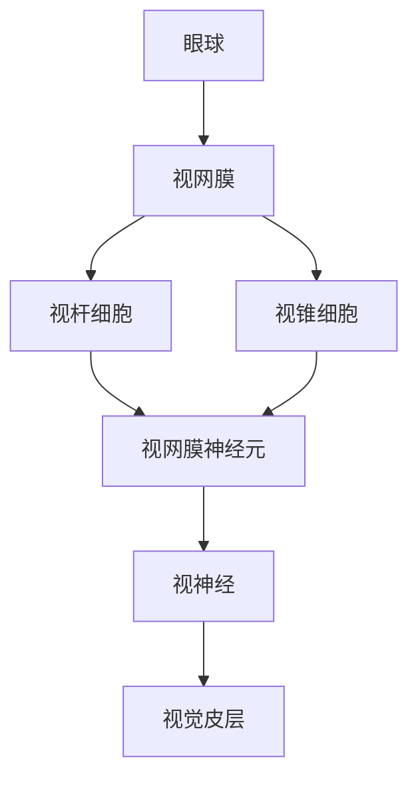

视觉信息在视网膜上经过初步处理后，通过视神经传输到视觉皮层，视觉皮层进一步处理和分析视觉信息，形成我们对外界的感知。

### 1.2 视觉信息处理的基本过程

视觉信息处理的基本过程可以分为以下几个阶段：

1. 光线进入眼球，经过角膜、晶状体等折射后，聚焦在视网膜上。
2. 视网膜上的感光细胞（视杆细胞和视锥细胞）将光信号转换为电信号。
3. 电信号通过视网膜神经元传递到视神经。
4. 视神经将电信号传输到大脑视觉皮层。
5. 视觉皮层对电信号进行进一步处理和分析，形成我们对外界的感知。

以下是一个描述视觉信息处理过程的伪代码：

```python
# 光线进入眼球，经过折射聚焦在视网膜上
def focus_light():
    # 光线聚焦在视网膜上
    light_focused_on_reina

# 视网膜上的感光细胞将光信号转换为电信号
def convert_to_electric_signal():
    # 视杆细胞和视锥细胞工作
    sensory_cells_active

# 电信号通过视网膜神经元传递到视神经
def transmit_signal_to_optic_nerve():
    # 视网膜神经元传递电信号
    neurons_pass_electric_signal

# 视神经将电信号传输到大脑视觉皮层
def transmit_signal_to_visual_cortex():
    # 视神经传递电信号
    optic_nerve_passes_signal

# 视觉皮层对电信号进行进一步处理和分析
def process_and_analyze_signal():
    # 视觉皮层处理电信号
    visual_cortex_processes_signal

# 形成我们对外界的感知
def perceive_world():
    # 我们对外界的感知
    perception_of_world
```

通过上述流程和伪代码，我们可以初步了解视觉系统的基本结构和信息处理过程。

### 1.3 情感的基本概念

情感是人类心理体验的重要组成部分，与情绪、情感体验和情感表达密切相关。

#### 1.3.1 情感与情绪的区别

情感与情绪有密切的联系，但又有一定的区别。情绪是指个体在特定情境下产生的一种短暂的、通常与生理反应相关的感觉状态。而情感则是一种更持久、更深刻的心理体验，通常与个体的价值观、信念和经验相关。

以下是一个描述情感与情绪区别的Mermaid流程图：

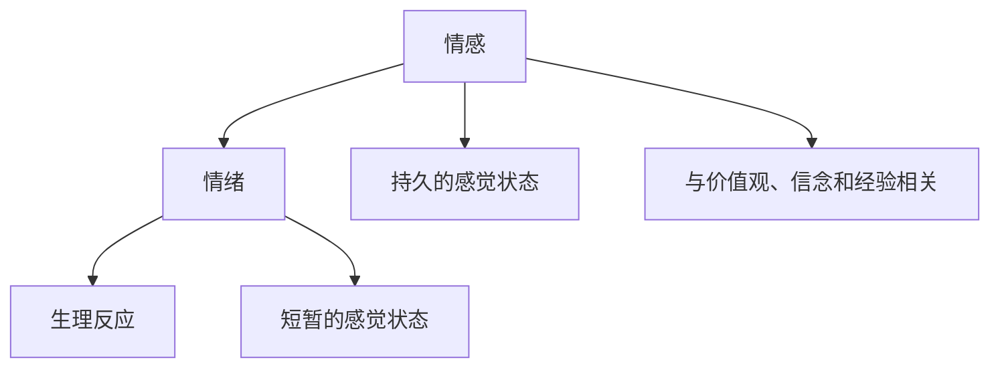

#### 1.3.2 情感的分类与表达

情感可以有多种分类方式，根据情感体验的不同，可以分为愉悦、悲伤、愤怒、恐惧等基本情感。根据情感表达的不同，可以分为语言表达、非语言表达和面部表情等。

以下是一个描述情感分类与表达的Mermaid流程图：

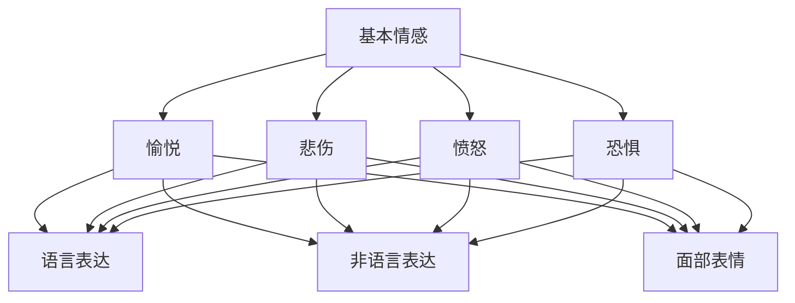

通过上述流程和分类，我们可以更好地理解情感的基本概念和分类方式。

### 第2章：视觉与情感的生物基础

#### 2.1 视觉神经系统的功能与结构

视觉神经系统是大脑中负责处理视觉信息的重要组成部分。它包括视网膜、视神经和视觉皮层等部分。

##### 2.1.1 视觉通路的功能与结构

视觉通路是指从视网膜到视觉皮层的神经传导路径。它包括以下主要结构：

1. 视网膜：视网膜是视觉信息接收和初步处理的地方，由视杆细胞和视锥细胞组成。
2. 视神经：视神经是将视网膜上的电信号传输到大脑的神经纤维束。
3. 视交叉：视神经在脑干处交叉，形成视交叉。
4. 视束：视束是将视交叉处的信号传输到视觉皮层的神经纤维束。
5. 视觉皮层：视觉皮层是大脑中负责处理视觉信息的主要区域，包括枕叶、颞叶和顶叶等。

以下是一个描述视觉通路结构的Mermaid流程图：

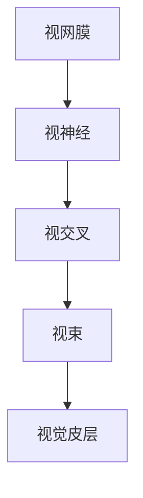

##### 2.1.2 视觉皮层的组织与功能

视觉皮层是大脑中负责处理视觉信息的主要区域，包括以下主要部分：

1. 视觉皮质柱：视觉皮质柱是视觉皮层的基本功能单位，由多层神经元组成，负责处理不同类型的视觉信息。
2. 视觉信息处理：视觉皮层对视网膜上传来的视觉信息进行复杂的处理，包括感知、识别、理解等。
3. 视觉功能区域：视觉皮层包括多个功能区域，如V1、V2、V3等，每个区域负责处理不同类型的视觉信息。

以下是一个描述视觉皮层组织的Mermaid流程图：

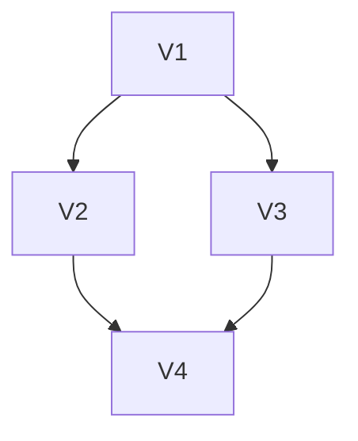

通过上述结构和功能的描述，我们可以更好地理解视觉神经系统的组织与功能。

#### 2.2 情感神经系统的功能与结构

情感神经系统是大脑中负责处理情感信息的重要组成部分。它包括情感调节的中枢机制和情感识别的相关结构。

##### 2.2.1 情感调节的中枢机制

情感调节的中枢机制涉及多个脑区，包括前额叶皮层、杏仁核、扣带回等。这些脑区通过神经网络相互连接，共同调节情感体验。

1. 前额叶皮层：前额叶皮层是大脑中负责情感调节的重要区域，参与情感体验的决策、控制和调节。
2. 杏仁核：杏仁核是情感神经系统的重要结构，参与情感体验的生成、调节和表达。
3. 扣带回：扣带回是大脑中负责情感调节的另一个重要区域，与情感体验的记忆、理解和情感表达相关。

以下是一个描述情感调节中枢机制的Mermaid流程图：

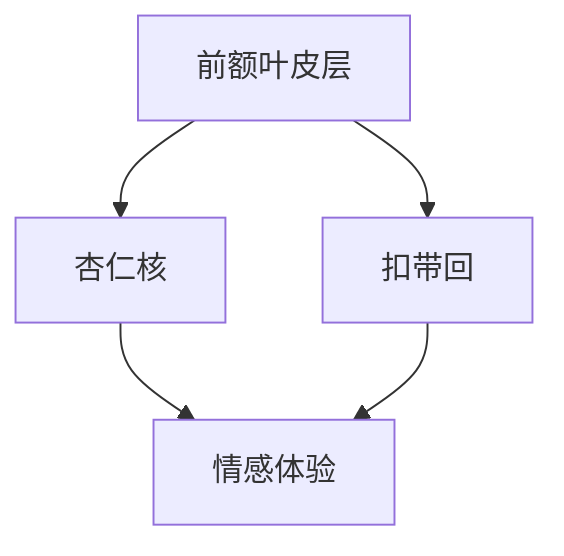

##### 2.2.2 情感识别的相关结构

情感识别是情感神经系统的核心功能之一，涉及多个脑区，包括颞叶、前额叶皮层、岛叶等。这些脑区通过神经网络相互连接，共同实现情感识别。

1. 颞叶：颞叶是情感识别的重要区域，参与情感体验的理解和识别。
2. 前额叶皮层：前额叶皮层是情感识别的关键脑区，参与情感体验的决策、控制和调节。
3. 岛叶：岛叶是情感识别的另一个重要区域，参与情感体验的理解和表达。

以下是一个描述情感识别相关结构的Mermaid流程图：

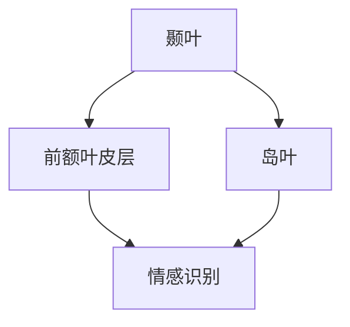

通过上述结构和功能的描述，我们可以更好地理解情感神经系统的组织与功能。

### 第3章：视觉与情感的感受机制

#### 3.1 视觉信息的感知与处理

视觉信息的感知与处理是大脑中一个复杂的过程，涉及多个脑区和神经通路的协同工作。

##### 3.1.1 视觉信息的初步处理

视觉信息的初步处理主要发生在视网膜上。视网膜上的感光细胞（视杆细胞和视锥细胞）能够将光信号转换为电信号，并通过视网膜神经元传递给视神经。这个过程可以看作是视觉信息的基本输入。

以下是一个描述视觉信息初步处理的Mermaid流程图：

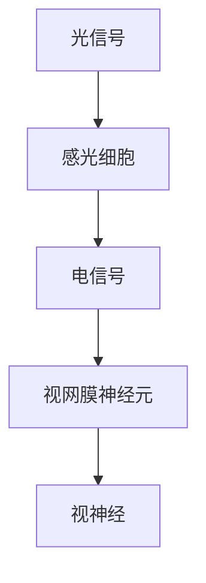

##### 3.1.2 视觉感知的注意机制

视觉感知的注意机制是指大脑在处理视觉信息时，选择性地关注某些特定信息而忽视其他信息。这个机制在视觉信息的感知与处理中起着重要作用。

以下是一个描述视觉感知注意机制的Mermaid流程图：

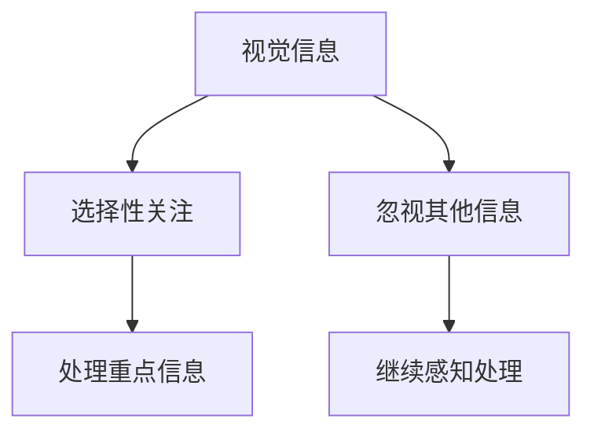

通过上述流程和机制的描述，我们可以更好地理解视觉信息的感知与处理过程。

#### 3.2 情感的体验与表达

情感的体验与表达是情感认知的重要组成部分，涉及大脑中多个脑区的协同工作。

##### 3.2.1 情感的情绪体验

情感的体验是指个体在特定情境下产生的心理体验，包括愉悦、悲伤、愤怒等基本情绪。这种体验通常与大脑中的情感中枢有关，如杏仁核、前额叶皮层等。

以下是一个描述情感情绪体验的Mermaid流程图：

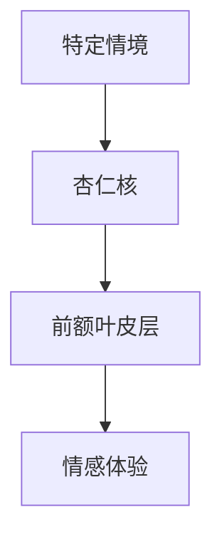

##### 3.2.2 情感表达的语言与非语言形式

情感的表达是指个体通过语言、面部表情、身体语言等方式将情感体验传达给他人的过程。这种表达形式可以看作是情感体验的外在表现。

以下是一个描述情感表达语言与非语言形式的Mermaid流程图：

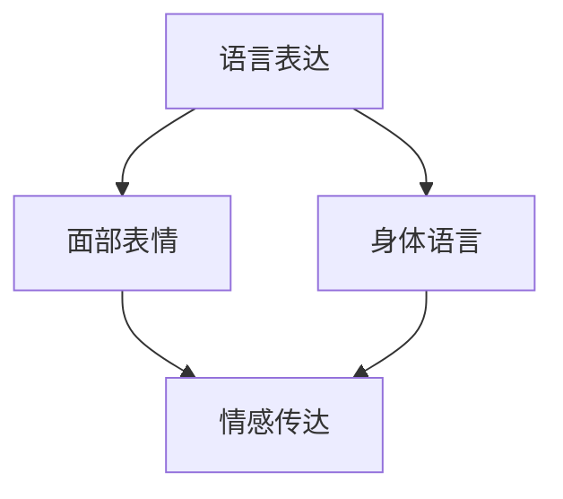

通过上述流程和机制的描述，我们可以更好地理解情感的体验与表达过程。

### 第4章：视觉情感在认知中的作用

#### 4.1 视觉情感对记忆的影响

视觉情感对记忆的影响是一个复杂的过程，涉及多个脑区和神经通路的协同工作。视觉情感可以通过增强记忆的编码、存储和回忆来提高记忆效果。

##### 4.1.1 视觉情感如何增强记忆

视觉情感对记忆的增强作用主要通过以下几个机制实现：

1. 情感编码：当个体处于强烈的情感体验中时，大脑会加强记忆的编码过程，使得情感相关的信息更容易被记住。
2. 情感增强记忆：情感可以增强记忆的存储过程，使得情感相关的信息在记忆中更加稳定和持久。
3. 情感记忆的回忆：情感可以增强记忆的回忆过程，使得个体更容易回忆起情感相关的信息。

以下是一个描述视觉情感如何增强记忆的Mermaid流程图：

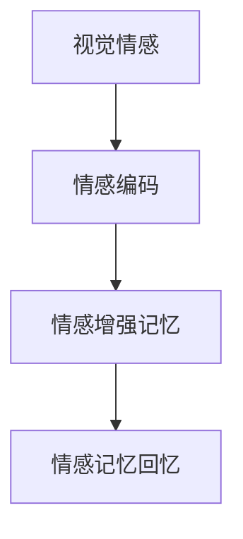

##### 4.1.2 情感记忆的理论模型

情感记忆的理论模型主要包括以下几种：

1. 基于情境的理论：该理论认为情感记忆是情境驱动的，即个体在特定情境下产生的情感体验会影响记忆的编码和存储。
2. 基于脑区的理论：该理论认为情感记忆是由大脑中的特定脑区（如杏仁核、前额叶皮层等）共同作用实现的。
3. 基于神经可塑性的理论：该理论认为情感记忆是通过神经可塑性机制实现的，即大脑在情感体验中发生结构和功能的变化，从而影响记忆。

以下是一个描述情感记忆的理论模型的Mermaid流程图：

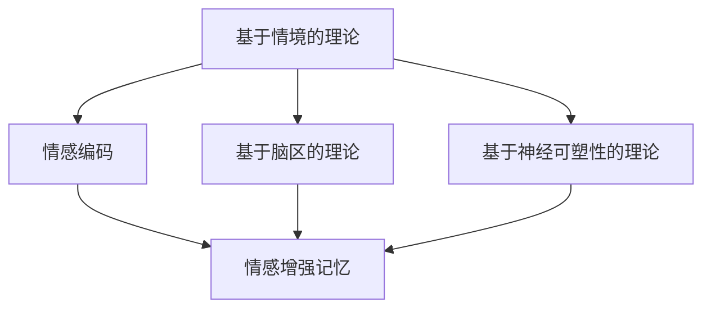

通过上述流程和理论模型的描述，我们可以更好地理解视觉情感对记忆的影响机制。

#### 4.2 视觉情感对思维的影响

视觉情感对思维的影响是一个多维度、多层次的过程，涉及认知过程的各个方面。

##### 4.2.1 视觉情感如何影响判断与决策

视觉情感可以通过以下方式影响判断与决策：

1. 情感偏见：情感可以导致个体在判断与决策过程中出现偏见，如过度自信、情绪化等。
2. 情感启发：情感可以启发个体在判断与决策过程中寻找相关信息，从而影响决策的准确性。
3. 情感调节：情感可以调节个体在判断与决策过程中的认知资源分配，从而影响决策的效率和质量。

以下是一个描述视觉情感如何影响判断与决策的Mermaid流程图：

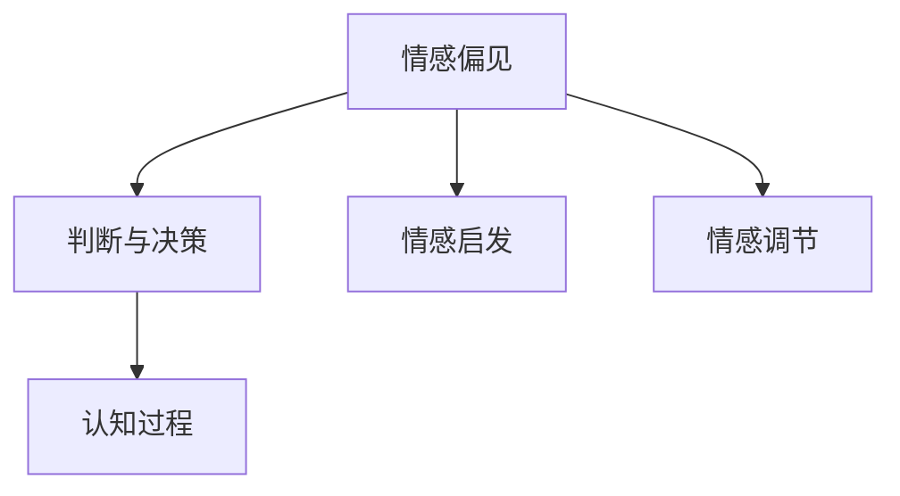

##### 4.2.2 情感思维的理论框架

情感思维的理论框架主要包括以下几种：

1. 情感认知框架：该框架认为情感与认知过程相互交织，情感影响认知，认知影响情感。
2. 情感功能框架：该框架认为情感在认知过程中具有特定的功能，如情感判断、情感记忆等。
3. 情感动机框架：该框架认为情感是动机系统的一部分，情感影响个体的行为选择。

以下是一个描述情感思维的理论框架的Mermaid流程图：

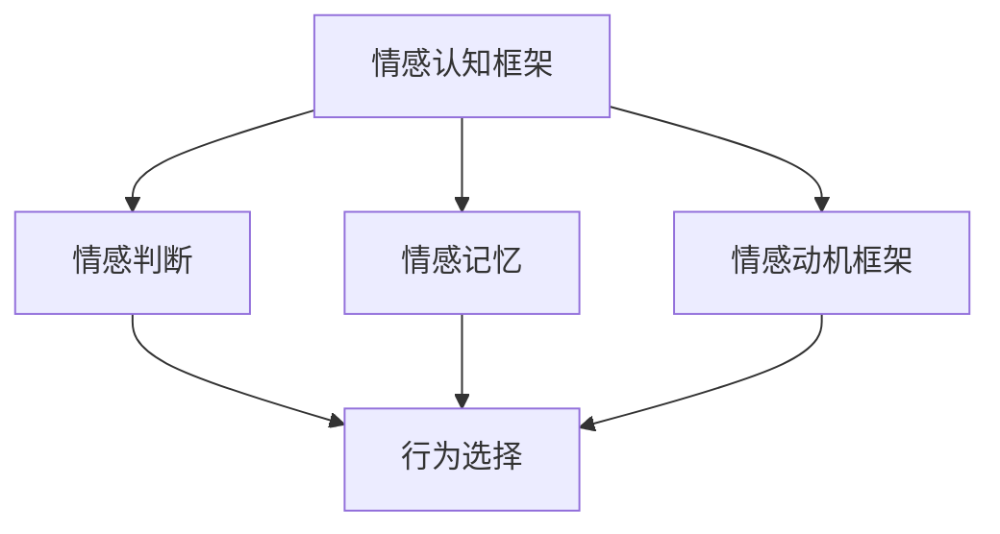

通过上述流程和理论框架的描述，我们可以更好地理解视觉情感对思维的影响机制。

### 第5章：视觉情感与社会交往

#### 5.1 视觉情感在人际关系中的作用

视觉情感在人际关系中起着重要的作用，可以影响人际互动、信任和合作关系。

##### 5.1.1 视觉情感如何影响人际互动

视觉情感可以通过以下方式影响人际互动：

1. 非语言沟通：视觉情感可以通过面部表情、身体语言等方式传达情感信息，影响人际互动。
2. 情感共鸣：视觉情感可以引发共鸣，使个体在情感上产生共鸣，促进人际互动。
3. 情感表达：视觉情感的表达可以传递情感信息，影响他人对个体的看法和态度。

以下是一个描述视觉情感如何影响人际互动的Mermaid流程图：

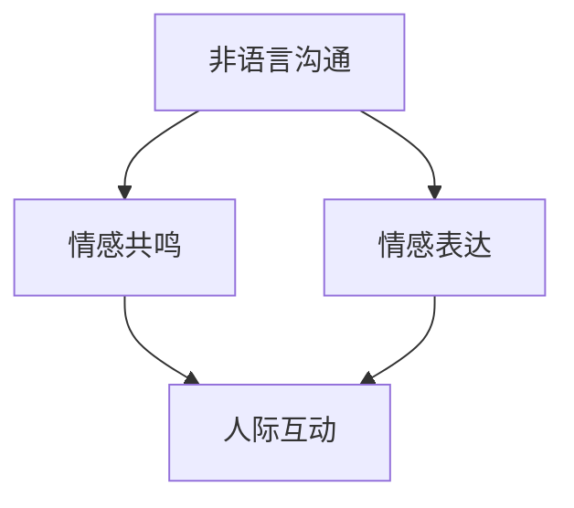

##### 5.1.2 社交中的情感表达与解读

社交中的情感表达与解读是一个复杂的过程，涉及个体的情感认知能力和社交技能。

1. 情感表达：个体通过面部表情、身体语言等方式表达情感，影响他人对情感的解读。
2. 情感解读：个体通过观察他人的面部表情、身体语言等方式解读他人的情感，从而影响人际互动。

以下是一个描述社交中情感表达与解读的Mermaid流程图：

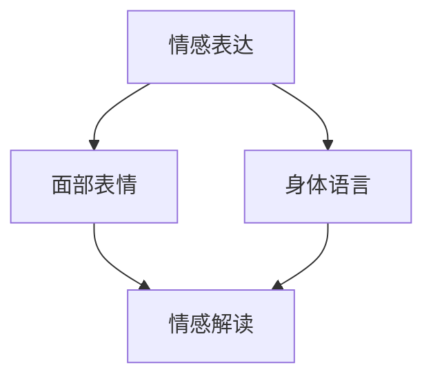

通过上述流程和机制的描述，我们可以更好地理解视觉情感在人际关系中的作用。

#### 5.2 视觉情感在群体行为中的作用

视觉情感在群体行为中起着重要的作用，可以影响集体意识、情感传染和群体行为的形成。

##### 5.2.1 视觉情感如何影响集体意识

视觉情感可以通过以下方式影响集体意识：

1. 情感共鸣：视觉情感可以引发集体情感共鸣，使个体在情感上产生共鸣，形成集体意识。
2. 情感传递：视觉情感可以通过面部表情、身体语言等方式传递情感信息，影响集体情感状态。
3. 情感调节：视觉情感可以调节个体的情绪状态，从而影响集体情感状态。

以下是一个描述视觉情感如何影响集体意识的Mermaid流程图：

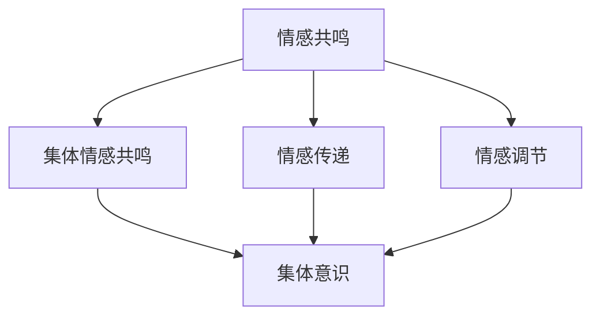

##### 5.2.2 情感传染与群体行为的形成

情感传染是指个体在群体中感染情感，从而导致群体行为的一致性。视觉情感在情感传染中起着重要作用。

1. 情感传染机制：个体通过观察他人的情感状态，产生情感共鸣，从而感染情感。
2. 群体行为形成：感染情感后，个体在情感驱动下产生一致的行为反应，形成群体行为。

以下是一个描述情感传染与群体行为形成的Mermaid流程图：

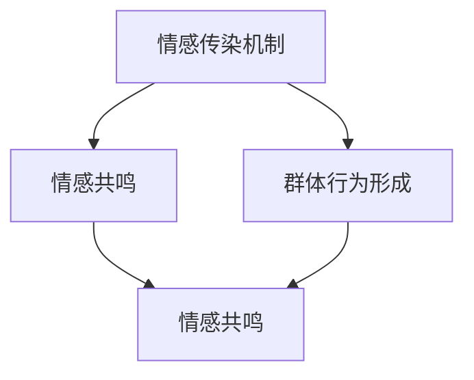

通过上述流程和机制的描述，我们可以更好地理解视觉情感在群体行为中的作用。

### 第6章：视觉情感在艺术创作中的运用

#### 6.1 艺术创作中的视觉情感表达

艺术创作中的视觉情感表达是通过色彩、线条、形状等视觉元素来传达情感的一种艺术手法。

##### 6.1.1 艺术作品中的情感传达

艺术作品中的情感传达主要依赖于以下几个元素：

1. 色彩：色彩在艺术作品中具有强烈的情感表现力，不同的色彩可以传达不同的情感氛围。
2. 线条：线条在艺术作品中具有动态感和情感表现力，通过线条的形状、粗细、方向等可以传达不同的情感。
3. 形状：形状在艺术作品中具有视觉张力，通过形状的排列、组合等可以传达情感。

以下是一个描述艺术作品中的情感传达的Mermaid流程图：

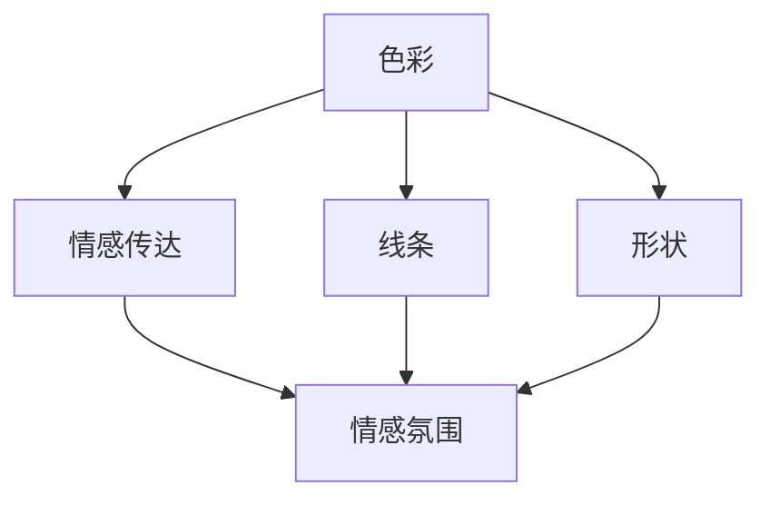

##### 6.1.2 情感在艺术作品中的层次感与深度

情感在艺术作品中的层次感与深度是通过视觉元素的组合和运用实现的。

1. 层次感：通过不同层次的视觉元素（如前景、中景、背景）来展现情感的层次感。
2. 深度：通过透视、光影等手法来增强艺术作品的深度感，使情感更加丰富和立体。

以下是一个描述情感在艺术作品中的层次感与深度的Mermaid流程图：

```mermaid
graph TD
A[层次感] --> B[前景]
A --> C[中景]
A --> D[背景]
B --> E[情感层次]
C --> E
D --> E
```

通过上述流程和机制的描述，我们可以更好地理解视觉情感在艺术创作中的表达技巧。

#### 6.2 视觉情感与观众的情感共鸣

视觉情感与观众的情感共鸣是艺术作品创作和欣赏的重要目标之一。

##### 6.2.1 视觉情感如何激发观众的共鸣

视觉情感可以激发观众的情感共鸣，主要通过以下几个途径：

1. 情感共振：艺术作品中的情感元素与观众内心的情感产生共鸣，使观众产生情感共振。
2. 情感认同：观众通过艺术作品中的情感表达，认同作品中的情感状态，从而产生情感共鸣。
3. 情感表达：艺术作品中的情感表达可以引导观众的情感表达，使观众在情感上产生共鸣。

以下是一个描述视觉情感如何激发观众共鸣的Mermaid流程图：

```mermaid
graph TD
A[情感共振] --> B[情感共鸣]
A --> C[情感认同]
A --> D[情感表达]
B --> E[观众共鸣]
C --> E
D --> E
```

##### 6.2.2 观众的情感反应与作品情感表达的关系

观众的情感反应与作品情感表达之间存在密切的关系。

1. 情感反应：观众在欣赏艺术作品时，会产生情感反应，如愉悦、悲伤、愤怒等。
2. 作品情感表达：艺术作品通过视觉元素的组合和运用，传达情感表达，引导观众的情感反应。

以下是一个描述观众的情感反应与作品情感表达关系的Mermaid流程图：

```mermaid
graph TD
A[观众情感反应] --> B[作品情感表达]
A --> C[情感共鸣]
B --> C
```

通过上述流程和关系的描述，我们可以更好地理解视觉情感与观众情感共鸣的机制。

### 第7章：视觉情感在心理学治疗中的应用

#### 7.1 视觉情感在心理咨询中的应用

视觉情感在心理咨询中具有重要的应用价值，可以通过视觉元素的运用来调节个体的情绪状态。

##### 7.1.1 视觉情感如何帮助个体情绪调节

视觉情感可以帮助个体情绪调节，主要通过以下几个途径：

1. 情感投射：个体通过观察艺术作品中的情感表达，将自己的情感投射到作品中，从而实现情感调节。
2. 情感共鸣：个体通过艺术作品中的情感表达，与作品产生情感共鸣，从而实现情绪调节。
3. 情感表达：个体通过视觉元素的运用，表达自己的情感，从而实现情绪调节。

以下是一个描述视觉情感如何帮助个体情绪调节的Mermaid流程图：

```mermaid
graph TD
A[情感投射] --> B[情感共鸣]
A --> C[情感表达]
B --> D[情绪调节]
C --> D
```

##### 7.1.2 心理咨询师如何运用视觉情感辅导技术

心理咨询师在运用视觉情感辅导技术时，可以采取以下几种策略：

1. 视觉艺术治疗：通过视觉艺术创作，如绘画、雕塑等，帮助个体表达情感，实现情绪调节。
2. 视觉叙事治疗：通过视觉叙事，如照片、影片等，帮助个体回顾和反思自己的情感体验，实现情绪调节。
3. 视觉引导：通过视觉引导，如视觉引导训练、视觉想象等，帮助个体调节情绪，实现心理辅导。

以下是一个描述心理咨询师如何运用视觉情感辅导技术的Mermaid流程图：

```mermaid
graph TD
A[视觉艺术治疗] --> B[视觉叙事治疗]
A --> C[视觉引导]
B --> D[情绪调节]
C --> D
```

通过上述流程和策略的描述，我们可以更好地理解视觉情感在心理咨询中的应用。

#### 7.2 视觉情感在心理治疗中的运用

视觉情感在心理治疗中具有重要的应用价值，可以通过视觉元素的运用来改善个体的情感状态。

##### 7.2.1 视觉情感治疗的理论基础

视觉情感治疗的理论基础主要包括以下几个方面：

1. 认知行为理论：认知行为理论认为情感体验是通过认知评价产生的，通过改变认知评价可以改善情感状态。
2. 心理动力学理论：心理动力学理论认为情感体验与潜意识有关，通过视觉元素可以引发潜意识的改变，从而改善情感状态。
3. 神经可塑性理论：神经可塑性理论认为情感体验可以通过神经可塑性机制改变，视觉元素可以刺激神经可塑性，从而改善情感状态。

以下是一个描述视觉情感治疗的理论基础的Mermaid流程图：

```mermaid
graph TD
A[认知行为理论] --> B[心理动力学理论]
A --> C[神经可塑性理论]
B --> D[情感体验改善]
C --> D
```

##### 7.2.2 视觉情感治疗的具体案例

视觉情感治疗在不同心理障碍中的应用案例包括：

1. 抑郁症：通过视觉艺术创作，如绘画、雕塑等，帮助个体表达情感，缓解抑郁情绪。
2. 强迫症：通过视觉叙事，如照片、影片等，帮助个体回顾和反思自己的情感体验，改善强迫症状。
3. 焦虑症：通过视觉引导，如视觉引导训练、视觉想象等，帮助个体调节情绪，缓解焦虑症状。

以下是一个描述视觉情感治疗的具体案例的Mermaid流程图：

```mermaid
graph TD
A[抑郁症] --> B[视觉艺术创作]
A --> C[强迫症]
A --> D[焦虑症]
B --> E[情感表达]
C --> E
D --> E
```

通过上述流程和案例的描述，我们可以更好地理解视觉情感在心理治疗中的运用。

### 第8章：视觉情感研究的最新进展

#### 8.1 视觉情感研究的现状与挑战

视觉情感研究在近年来取得了显著的进展，但仍面临一些挑战。

##### 8.1.1 视觉情感识别技术的最新进展

视觉情感识别技术是视觉情感研究的一个重要方向，近年来取得了以下进展：

1. 大规模预训练模型：如GPT、BERT等预训练模型在视觉情感识别任务中取得了显著的效果，提升了识别准确性。
2. 情感分类算法：基于深度学习的情感分类算法，如卷积神经网络（CNN）、循环神经网络（RNN）等，在情感识别任务中取得了较高的准确性。
3. 跨模态情感识别：通过结合视觉、听觉、语言等多模态信息，实现了更准确的情感识别。

以下是一个描述视觉情感识别技术最新进展的Mermaid流程图：

```mermaid
graph TD
A[大规模预训练模型] --> B[情感分类算法]
A --> C[跨模态情感识别]
B --> D[识别准确性提升]
C --> D
```

##### 8.1.2 视觉情感增强技术的应用场景

视觉情感增强技术是一种通过算法和视觉元素来增强情感表达的技术，具有广泛的应用场景：

1. 艺术创作：通过情感增强技术，艺术家可以更加精细地表达情感，提升艺术作品的表现力。
2. 娱乐产业：在电影、电视剧、游戏等娱乐作品中，情感增强技术可以提升观众的体验，增强情感共鸣。
3. 心理学治疗：在心理咨询和治疗中，情感增强技术可以用于辅助个体情感调节和情绪管理。

以下是一个描述视觉情感增强技术应用场景的Mermaid流程图：

```mermaid
graph TD
A[艺术创作] --> B[娱乐产业]
A --> C[心理学治疗]
B --> D[情感表达增强]
C --> D
```

##### 8.1.3 视觉情感研究的挑战

视觉情感研究在取得进展的同时，也面临一些挑战：

1. 数据集的多样性与泛化能力：当前多数视觉情感识别数据集存在数据不平衡、标注不准确等问题，影响了模型的泛化能力。
2. 情感识别的准确性提升：随着模型的复杂度和计算资源的增加，如何进一步提升情感识别准确性仍是一个挑战。
3. 情感增强技术的伦理问题：在情感增强技术的应用过程中，如何平衡个体权益和社会利益是一个重要的问题。

以下是一个描述视觉情感研究挑战的Mermaid流程图：

```mermaid
graph TD
A[数据集的多样性与泛化能力] --> B[情感识别的准确性提升]
A --> C[情感增强技术的伦理问题]
B --> D[研究挑战]
C --> D
```

通过上述流程和挑战的描述，我们可以更好地了解视觉情感研究的现状和未来发展方向。

#### 8.2 视觉情感技术的开发与应用

视觉情感技术的开发与应用是视觉情感研究的重要组成部分，涉及算法设计、应用实践和优化等方面。

##### 8.2.1 视觉情感识别技术的开发

视觉情感识别技术的开发主要包括以下几个步骤：

1. 数据集准备：收集和整理大规模、多样化的视觉情感数据集，确保数据集的多样性和泛化能力。
2. 算法设计：设计基于深度学习、机器学习等算法的视觉情感识别模型，通过模型训练和优化，提高识别准确性。
3. 模型评估：对训练好的模型进行评估，包括准确性、泛化能力、实时性等方面，确保模型性能满足应用需求。

以下是一个描述视觉情感识别技术开发的Mermaid流程图：

```mermaid
graph TD
A[数据集准备] --> B[算法设计]
A --> C[模型评估]
B --> D[模型优化]
C --> D
```

##### 8.2.2 视觉情感增强技术的应用

视觉情感增强技术的应用主要包括以下几个领域：

1. 艺术创作：在艺术创作中，通过情感增强技术，艺术家可以更加精细地表达情感，提升作品的表现力。
2. 娱乐产业：在电影、电视剧、游戏等娱乐作品中，情感增强技术可以提升观众的体验，增强情感共鸣。
3. 心理学治疗：在心理咨询和治疗中，情感增强技术可以用于辅助个体情感调节和情绪管理。

以下是一个描述视觉情感增强技术应用的Mermaid流程图：

```mermaid
graph TD
A[艺术创作] --> B[娱乐产业]
A --> C[心理学治疗]
B --> D[情感表达增强]
C --> D
```

##### 8.2.3 视觉情感技术的优化

视觉情感技术的优化是提升技术性能和应用效果的重要途径，主要包括以下几个方面：

1. 算法优化：通过改进算法设计，如神经网络结构、优化超参数等，提升模型性能和识别准确性。
2. 计算资源优化：通过分布式计算、GPU加速等手段，提升模型训练和推理的实时性。
3. 应用场景优化：针对不同应用场景，优化情感增强技术的实现和效果，确保技术性能满足应用需求。

以下是一个描述视觉情感技术优化的Mermaid流程图：

```mermaid
graph TD
A[算法优化] --> B[计算资源优化]
A --> C[应用场景优化]
B --> D[技术性能提升]
C --> D
```

通过上述流程和优化的描述，我们可以更好地了解视觉情感技术的开发与应用。

### 附录：视觉情感相关资源与工具

#### 附录 A：视觉情感研究资源

视觉情感研究资源包括相关研究论文、书籍和数据集等，为研究者和开发者提供丰富的理论依据和实践指导。

1. **相关研究论文与书籍推荐**：
   - 《视觉情感计算：基础、方法与应用》
   - 《情感计算：技术与应用》
   - 《情感识别与表达：理论、方法与系统》
   - 《大规模预训练模型：技术与应用》

2. **视觉情感研究的数据集**：
   - AffectNet：一个包含多种情感类别的大规模视觉情感数据集。
   - FER2013：一个用于面部情感识别的数据集，包含6种情感类别。
   - RAVDESS：一个包含音乐情感标注的数据集，包含8种情感类别。

#### 附录 B：视觉情感技术工具

视觉情感技术工具包括开源视觉情感识别工具和商业视觉情感分析平台，为开发者提供便捷的技术支持和应用平台。

1. **开源视觉情感识别工具**：
   - OpenCV：一个开源的计算机视觉库，支持多种视觉情感识别算法。
   - TensorFlow：一个开源的深度学习框架，支持大规模预训练模型的训练和部署。

2. **商业视觉情感分析平台**：
   - Affectiva：一个商业视觉情感分析平台，提供面部情感识别、情感分析等服务。
   - Microsoft Azure：一个商业云计算平台，提供视觉情感分析API和服务。

通过附录中的相关资源和工具，读者可以进一步了解视觉情感研究的最新动态和技术应用。

