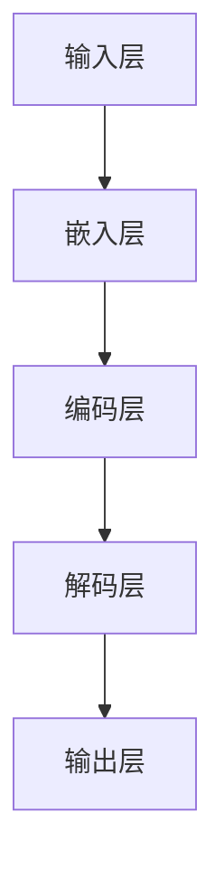

                 

### 文章标题

# 大规模语言模型从理论到实践 垂直领域评估

> 关键词：大规模语言模型、理论、实践、垂直领域、评估

> 摘要：本文旨在为读者深入剖析大规模语言模型的理论与实践，并通过详细的案例分析，探讨其在垂直领域评估中的应用。文章分为两部分，第一部分介绍了大规模语言模型的基础理论和核心算法，第二部分通过具体的项目实战，展示了大规模语言模型在文本分类、命名实体识别和机器翻译等垂直领域的应用与实践。通过本文的阅读，读者将能够全面理解大规模语言模型的原理及其在垂直领域的实际应用价值。

### 第1章：大规模语言模型概述

大规模语言模型（Large-scale Language Model）是自然语言处理（Natural Language Processing，NLP）领域中的一种先进技术，通过学习海量的语言数据，使其能够对文本进行理解、生成和评估。本章节将首先介绍语言模型的定义和历史发展，然后探讨大规模语言模型的重要性，并使用Mermaid流程图展示其架构。

#### 1.1 语言模型的定义与历史发展

语言模型（Language Model）是一种用于预测自然语言中下一个单词或字符的概率分布的统计模型。它基于大量的文本数据，通过统计方法，如N-gram模型、神经网络模型等，学习到单词或字符之间的概率关系。语言模型在自然语言处理中具有广泛的应用，如机器翻译、语音识别、文本生成等。

历史发展上，语言模型经历了从简单的N-gram模型到复杂的神经网络模型的过程。N-gram模型是一种基于历史频率的简单模型，它通过统计相邻单词或字符的频率来预测下一个单词或字符。随着计算能力的提升和神经网络的发展，深度神经网络（DNN）和循环神经网络（RNN）等复杂模型逐渐成为主流，这些模型能够更好地捕捉到文本中的长距离依赖关系。

#### 1.2 大规模语言模型的重要性

大规模语言模型的重要性主要体现在以下几个方面：

1. **提升自然语言处理性能**：通过学习大规模的数据集，大规模语言模型能够更好地理解自然语言，从而提高自然语言处理的准确性和效率。
   
2. **泛化能力**：大规模语言模型不仅能够处理简单的任务，如文本分类和命名实体识别，还能够应用于复杂任务，如机器翻译和文本生成。

3. **推动NLP技术发展**：大规模语言模型的成功应用推动了自然语言处理技术的快速发展，为人工智能领域带来了新的机遇。

4. **实际应用价值**：大规模语言模型在金融、医疗、教育等多个行业领域具有广泛的应用前景，能够为各行业提供智能化的解决方案。

#### 1.3 Mermaid流程图：大规模语言模型架构

以下是一个使用Mermaid绘制的简化的大规模语言模型架构流程图：



- **输入层**：接收自然语言文本输入，如单词或句子。
- **嵌入层**：将输入文本转换为固定长度的向量表示，便于后续处理。
- **编码层**：使用深度神经网络对嵌入层产生的向量进行编码，以捕捉文本中的语义信息。
- **解码层**：将编码后的向量解码回文本表示，以便进行预测或生成。
- **输出层**：输出预测结果，如下一个单词或文本片段。

通过以上介绍，我们为后续章节奠定了理论基础，接下来我们将进一步探讨大规模语言模型的核心算法原理和数学模型。

### 第2章：语言模型的数学基础

要深入理解大规模语言模型，首先需要掌握其背后的数学基础。本章节将介绍概率论基础、线性代数基础以及梯度下降法，这些是构建大规模语言模型的关键数学工具。

#### 2.1 概率论基础

概率论是大规模语言模型的基础，尤其在自然语言处理中，我们经常需要计算单词或字符出现的概率。

##### 2.1.1 概率分布函数

概率分布函数（Probability Distribution Function，PDF）是一种用于描述随机变量概率分布的函数。在自然语言处理中，常见的概率分布有：

- **贝努利分布**：用于描述一个二项试验成功的概率。
- **泊松分布**：用于描述在一定时间或空间内事件发生的概率。
- **正态分布**：用于描述连续随机变量的概率分布。

贝努利分布的概率质量函数（PDF）为：

$$
f(k; n, p) = C_n^k p^k (1-p)^{n-k}
$$

其中，\( n \) 是试验次数，\( p \) 是成功的概率，\( k \) 是成功的次数，\( C_n^k \) 是组合数。

##### 2.1.2 最大似然估计

最大似然估计（Maximum Likelihood Estimation，MLE）是一种用于估计模型参数的方法。其基本思想是找到一组参数，使得观测数据在模型下的概率最大。

设有一个模型 \( P(X|\theta) \)，其中 \( X \) 是观测数据，\( \theta \) 是参数。最大似然估计的目标是找到使 \( P(X|\theta) \) 最大的 \( \theta \) 值。数学表达为：

$$
\hat{\theta} = \arg\max_\theta P(X|\theta)
$$

在实际应用中，由于 \( P(X|\theta) \) 通常难以直接计算，我们通常使用对数似然函数：

$$
\ell(\theta) = \log P(X|\theta)
$$

然后通过优化 \( \ell(\theta) \) 来找到 \( \hat{\theta} \)。

#### 2.2 线性代数基础

线性代数是构建大规模语言模型的重要工具，它涉及到矩阵和向量的基本运算。

##### 2.2.1 矩阵和向量运算

- **向量的点积**：两个向量 \( \mathbf{a} \) 和 \( \mathbf{b} \) 的点积定义为：

  $$
  \mathbf{a} \cdot \mathbf{b} = a_1b_1 + a_2b_2 + \cdots + a_nb_n
  $$

- **矩阵的乘法**：两个矩阵 \( \mathbf{A} \) 和 \( \mathbf{B} \) 的乘法定义为：

  $$
  \mathbf{C} = \mathbf{A}\mathbf{B} = \begin{bmatrix}
  c_{11} & c_{12} & \cdots & c_{1n} \\
  c_{21} & c_{22} & \cdots & c_{2n} \\
  \vdots & \vdots & \ddots & \vdots \\
  c_{m1} & c_{m2} & \cdots & c_{mn}
  \end{bmatrix}
  $$
  
  其中 \( c_{ij} = \sum_{k=1}^m a_{ik}b_{kj} \)。

##### 2.2.2 矩阵分解

矩阵分解是线性代数中的一个重要概念，它用于将一个矩阵分解为几个矩阵的乘积。

- **奇异值分解（SVD）**：任何实对称矩阵都可以分解为两个正交矩阵的乘积：

  $$
  \mathbf{A} = \mathbf{U}\mathbf{\Sigma}\mathbf{V}^T
  $$

  其中，\( \mathbf{U} \) 和 \( \mathbf{V} \) 是正交矩阵，\( \mathbf{\Sigma} \) 是对角矩阵，对角线上的元素称为奇异值。

- **LU分解**：任何可逆矩阵都可以分解为下三角矩阵 \( \mathbf{L} \) 和上三角矩阵 \( \mathbf{U} \) 的乘积：

  $$
  \mathbf{A} = \mathbf{L}\mathbf{U}
  $$

#### 2.3 梯度下降法

梯度下降法（Gradient Descent）是一种优化算法，用于求解最小化某个函数的最优参数。在大规模语言模型中，梯度下降法用于训练模型参数，使其能够更好地拟合训练数据。

##### 2.3.1 梯度下降基本原理

梯度下降法的核心思想是沿着目标函数的负梯度方向逐步更新参数，以达到最小化目标函数的目的。对于函数 \( f(\theta) \)，其梯度定义为：

$$
\nabla f(\theta) = \left[ \frac{\partial f}{\partial \theta_1}, \frac{\partial f}{\partial \theta_2}, \ldots, \frac{\partial f}{\partial \theta_n} \right]^T
$$

梯度下降的基本步骤如下：

1. **初始化参数**：选择一个初始参数向量 \( \theta_0 \)。
2. **计算梯度**：计算当前参数下的梯度 \( \nabla f(\theta) \)。
3. **更新参数**：根据梯度更新参数，通常采用以下公式：

  $$
  \theta_{t+1} = \theta_t - \alpha \nabla f(\theta_t)
  $$

  其中，\( \alpha \) 是学习率。

4. **重复步骤2和3**，直到满足停止条件，如梯度变化很小或达到最大迭代次数。

##### 2.3.2 梯度下降算法伪代码

以下是一个简单的梯度下降算法伪代码：

```
function gradient_descent(f, theta, alpha, max_iterations):
    for t in 1 to max_iterations:
        grad = gradient(f, theta)
        theta = theta - alpha * grad
        if abs(grad) < threshold:
            break
    return theta
```

通过以上数学基础介绍，读者可以更好地理解大规模语言模型的工作原理。接下来，我们将深入探讨大规模语言模型的核心算法原理。

### 第3章：大规模语言模型的算法原理

大规模语言模型的算法原理是其核心组成部分，涵盖了从基本的人工神经网络（Artificial Neural Networks，ANN）到复杂的循环神经网络（Recurrent Neural Networks，RNN）和生成对抗网络（Generative Adversarial Networks，GAN）。本章节将详细解释这些算法的基本原理，并使用伪代码展示关键步骤。

#### 3.1 人工神经网络基础

人工神经网络（ANN）是一种模仿生物神经系统的计算模型。它由多个相互连接的神经元组成，每个神经元都执行简单的计算，并将结果传递给其他神经元。

##### 3.1.1 神经元模型

一个简单的神经元模型可以表示为：

$$
a_j = \sigma(\sum_{i=1}^{n} w_{ij} x_i + b_j)
$$

其中，\( a_j \) 是神经元 \( j \) 的激活值，\( \sigma \) 是激活函数，\( w_{ij} \) 是权重，\( x_i \) 是输入，\( b_j \) 是偏置。

常见的激活函数包括：

- **sigmoid函数**：

  $$
  \sigma(x) = \frac{1}{1 + e^{-x}}
  $$

- **ReLU函数**：

  $$
  \sigma(x) = \max(0, x)
  $$

##### 3.1.2 前向传播与反向传播

人工神经网络的工作流程主要包括前向传播（Forward Propagation）和反向传播（Backpropagation）。

- **前向传播**：从输入层开始，将输入通过权重传递到每个神经元，并应用激活函数，最终得到输出。

- **反向传播**：计算输出层到输入层的梯度，并更新权重和偏置。反向传播的核心思想是计算每个神经元的梯度，然后通过链式法则将梯度传递回前一层。

以下是一个简单的前向传播和反向传播的伪代码：

```
function forward_propagation(input, weights, biases, activation_function):
    layer_outputs = []
    for layer in network:
        a = activation_function(sum(weights * input + biases))
        layer_outputs.append(a)
        input = a
    return layer_outputs

function backward_propagation(output, expected, weights, biases, activation_derivative):
    gradients = []
    for layer in reversed(network):
        gradient = activation_derivative(a) * (output - expected)
        gradients.append(gradient)
        output = weights * input + biases
    return gradients
```

#### 3.2 循环神经网络（RNN）

循环神经网络（RNN）是处理序列数据的一种神经网络，它在每个时间步都保持一个状态，使其能够处理长序列数据。

##### 3.2.1 RNN结构

RNN的基本结构包括输入层、隐藏层和输出层。每个时间步的输入都通过权重和隐藏状态相连接，并更新隐藏状态。

$$
h_t = \sigma(W_h \cdot [h_{t-1}, x_t] + b_h)
$$

$$
y_t = \sigma(W_y \cdot h_t + b_y)
$$

其中，\( h_t \) 是第 \( t \) 个时间步的隐藏状态，\( x_t \) 是输入，\( y_t \) 是输出。

##### 3.2.2 RNN算法伪代码

以下是一个简化的RNN算法伪代码：

```
function rnn(input_sequence, weights, biases, activation_function, activation_derivative):
    hidden_states = []
    for x in input_sequence:
        h = activation_function(weights_h * [h_prev, x] + biases_h)
        hidden_states.append(h)
        h_prev = h
    return hidden_states
```

#### 3.3 长短时记忆网络（LSTM）

长短时记忆网络（LSTM）是RNN的一种改进版本，能够更好地处理长序列数据。

##### 3.3.1 LSTM结构

LSTM的核心是细胞状态（Cell State）和三个门（Input Gate、Forget Gate、Output Gate）。每个门都由一个sigmoid激活函数和一个线性变换组成，用于控制信息流的流入、流出和遗忘。

$$
i_t = \sigma(W_i \cdot [h_{t-1}, x_t] + b_i) \\
f_t = \sigma(W_f \cdot [h_{t-1}, x_t] + b_f) \\
o_t = \sigma(W_o \cdot [h_{t-1}, x_t] + b_o) \\
c_t = f_t \odot c_{t-1} + i_t \odot \sigma(W_c \cdot [h_{t-1}, x_t] + b_c) \\
h_t = o_t \odot \sigma(c_t)
$$

其中，\( i_t \)、\( f_t \)、\( o_t \) 分别是输入门、遗忘门、输出门的激活值，\( c_t \) 是细胞状态的更新值，\( h_t \) 是隐藏状态。

##### 3.3.2 LSTM算法伪代码

以下是一个简化的LSTM算法伪代码：

```
function lstm(input_sequence, weights, biases, activation_function, activation_derivative):
    hidden_states = []
    cell_states = []
    for x in input_sequence:
        i = activation_function(weights_i * [h_prev, x] + biases_i)
        f = activation_function(weights_f * [h_prev, x] + biases_f)
        o = activation_function(weights_o * [h_prev, x] + biases_o)
        c = f * c_prev + i * activation_function(weights_c * [h_prev, x] + biases_c)
        h = o * activation_function(c)
        hidden_states.append(h)
        cell_states.append(c)
        h_prev = h
        c_prev = c
    return hidden_states, cell_states
```

#### 3.4 生成式对抗网络（GAN）

生成式对抗网络（GAN）是由生成器和判别器组成的框架，其中生成器生成数据，判别器判断数据的真实性。

##### 3.4.1 GAN结构

GAN由两个神经网络组成：生成器 \( G \) 和判别器 \( D \)。生成器的目标是生成与真实数据相似的数据，判别器的目标是区分真实数据和生成数据。

$$
D(x) = P(\text{真实数据} | x) \\
D(G(z)) = P(\text{生成数据} | G(z))
$$

其中，\( x \) 是真实数据，\( z \) 是生成器的输入噪声。

##### 3.4.2 GAN算法伪代码

以下是一个简化的GAN算法伪代码：

```
function gan(D, G, D_optimizer, G_optimizer, num_iterations):
    for iteration in 1 to num_iterations:
        # 训练判别器
        D_optimizer(D, X)  # X 是真实数据
        D_optimizer(G, G(z))  # z 是生成器的输入噪声
        
        # 训练生成器
        G_optimizer(G)
    return G
```

通过以上对大规模语言模型算法原理的详细解析，读者可以更好地理解这些模型的工作机制。接下来，我们将进一步探讨大规模语言模型中使用的数学模型和公式。

### 第4章：大规模语言模型中的数学模型和数学公式

大规模语言模型的设计和应用依赖于一系列复杂的数学模型和公式。本章节将详细介绍这些数学模型，包括N-gram模型、循环神经网络（RNN）和长短时记忆网络（LSTM）中的关键公式，并通过具体例子来说明这些公式的应用。

#### 4.1 N-gram模型

N-gram模型是最早用于构建语言模型的方法之一。它基于单词或字符的历史频率来预测下一个单词或字符。

##### 4.1.1 N-gram模型公式

N-gram模型的核心公式为：

$$
P(w_n | w_{n-1}, w_{n-2}, \ldots, w_1) = \frac{C(w_{n-1}, w_n)}{C(w_{n-1}, \ldots, w_1)}
$$

其中，\( P(w_n | w_{n-1}, w_{n-2}, \ldots, w_1) \) 是给定前 \( n-1 \) 个单词时，第 \( n \) 个单词的概率；\( C(w_{n-1}, w_n) \) 是前一个单词和当前单词的共现频率；\( C(w_{n-1}, \ldots, w_1) \) 是前 \( n-1 \) 个单词的共现频率。

##### 4.1.2 N-gram模型应用例子

假设我们有以下的N-gram共现数据：

| 前\( n-1 \)个单词 | 第\( n \)个单词 | 共现频率 |
|-------------------|-----------------|----------|
| the sun          | shines          | 3        |
| the sun          | is              | 2        |
| the sun          | shines brightly | 1        |
| the sun          | rises           | 1        |

使用N-gram模型，我们可以计算句子“the sun shines”的概率：

$$
P(shines | the sun) = \frac{C(the sun, shines)}{C(the sun, is) + C(the sun, shines) + C(the sun, rises)} = \frac{3}{3+2+1} = \frac{3}{6} = 0.5
$$

#### 4.2 循环神经网络（RNN）

循环神经网络（RNN）通过其循环结构，使其能够处理序列数据，并保留历史状态信息。

##### 4.2.1 RNN模型公式

RNN的核心公式如下：

$$
h_t = \sigma(W_h \cdot [h_{t-1}, x_t] + b_h) \\
y_t = \sigma(W_y \cdot h_t + b_y)
$$

其中，\( h_t \) 是第 \( t \) 个时间步的隐藏状态，\( x_t \) 是输入，\( W_h \) 和 \( W_y \) 是权重矩阵，\( b_h \) 和 \( b_y \) 是偏置。

##### 4.2.2 RNN应用例子

假设我们有以下RNN模型参数：

- 输入层到隐藏层的权重：\( W_h = \begin{bmatrix} 1 & 1 \\ 1 & 1 \end{bmatrix} \)
- 隐藏层到输出层的权重：\( W_y = \begin{bmatrix} 1 & 1 \\ 1 & 1 \end{bmatrix} \)
- 隐藏层偏置：\( b_h = \begin{bmatrix} 1 \\ 1 \end{bmatrix} \)
- 输出层偏置：\( b_y = \begin{bmatrix} 1 \\ 1 \end{bmatrix} \)
- 激活函数：\( \sigma(x) = \sigma(x) = \frac{1}{1 + e^{-x}} \)

给定输入序列 \( [1, 2] \)，我们可以计算隐藏状态 \( h_t \) 和输出 \( y_t \)：

1. **第一步**：

   $$
   h_1 = \sigma(W_h \cdot [h_0, x_1] + b_h) = \sigma(\begin{bmatrix} 1 & 1 \\ 1 & 1 \end{bmatrix} \cdot \begin{bmatrix} 0 \\ 1 \end{bmatrix} + \begin{bmatrix} 1 \\ 1 \end{bmatrix}) = \sigma(2) \approx 0.731
   $$

   $$
   y_1 = \sigma(W_y \cdot h_1 + b_y) = \sigma(\begin{bmatrix} 1 & 1 \\ 1 & 1 \end{bmatrix} \cdot \begin{bmatrix} 0.731 \\ 0.731 \end{bmatrix} + \begin{bmatrix} 1 \\ 1 \end{bmatrix}) = \sigma(1.462) \approx 0.679
   $$

2. **第二步**：

   $$
   h_2 = \sigma(W_h \cdot [h_1, x_2] + b_h) = \sigma(\begin{bmatrix} 1 & 1 \\ 1 & 1 \end{bmatrix} \cdot \begin{bmatrix} 0.731 \\ 0.679 \end{bmatrix} + \begin{bmatrix} 1 \\ 1 \end{bmatrix}) = \sigma(1.612) \approx 0.727
   $$

   $$
   y_2 = \sigma(W_y \cdot h_2 + b_y) = \sigma(\begin{bmatrix} 1 & 1 \\ 1 & 1 \end{bmatrix} \cdot \begin{bmatrix} 0.727 \\ 0.727 \end{bmatrix} + \begin{bmatrix} 1 \\ 1 \end{bmatrix}) = \sigma(1.454) \approx 0.676
   $$

通过这些例子，我们可以看到RNN如何处理序列数据，并逐步更新隐藏状态。

#### 4.3 长短时记忆网络（LSTM）

长短时记忆网络（LSTM）通过其特殊的结构，能够有效地处理长序列数据。

##### 4.3.1 LSTM模型公式

LSTM的核心公式如下：

$$
i_t = \sigma(W_i \cdot [h_{t-1}, x_t] + b_i) \\
f_t = \sigma(W_f \cdot [h_{t-1}, x_t] + b_f) \\
o_t = \sigma(W_o \cdot [h_{t-1}, x_t] + b_o) \\
g_t = \sigma(W_g \cdot [h_{t-1}, x_t] + b_g) \\
c_t = f_t \odot c_{t-1} + i_t \odot g_t \\
h_t = o_t \odot \sigma(c_t)
$$

其中，\( i_t \)、\( f_t \)、\( o_t \) 分别是输入门、遗忘门、输出门的激活值，\( g_t \) 是候选状态，\( c_t \) 是细胞状态，\( h_t \) 是隐藏状态。

##### 4.3.2 LSTM应用例子

假设我们有以下LSTM模型参数：

- 输入门权重：\( W_i = \begin{bmatrix} 1 & 1 \\ 1 & 1 \end{bmatrix} \)
- 遗忘门权重：\( W_f = \begin{bmatrix} 1 & 1 \\ 1 & 1 \end{bmatrix} \)
- 输出门权重：\( W_o = \begin{bmatrix} 1 & 1 \\ 1 & 1 \end{bmatrix} \)
- 候选状态权重：\( W_g = \begin{bmatrix} 1 & 1 \\ 1 & 1 \end{bmatrix} \)
- 隐藏层偏置：\( b_i = \begin{bmatrix} 1 \\ 1 \end{bmatrix} \)
- 遗忘门偏置：\( b_f = \begin{bmatrix} 1 \\ 1 \end{bmatrix} \)
- 输出门偏置：\( b_o = \begin{bmatrix} 1 \\ 1 \end{bmatrix} \)
- 候选状态偏置：\( b_g = \begin{bmatrix} 1 \\ 1 \end{bmatrix} \)
- 激活函数：\( \sigma(x) = \frac{1}{1 + e^{-x}} \)

给定输入序列 \( [1, 2] \)，我们可以计算隐藏状态 \( h_t \) 和细胞状态 \( c_t \)：

1. **第一步**：

   $$
   i_1 = \sigma(W_i \cdot [h_0, x_1] + b_i) = \sigma(\begin{bmatrix} 1 & 1 \\ 1 & 1 \end{bmatrix} \cdot \begin{bmatrix} 0 \\ 1 \end{bmatrix} + \begin{bmatrix} 1 \\ 1 \end{bmatrix}) = \sigma(2) \approx 0.731
   $$

   $$
   f_1 = \sigma(W_f \cdot [h_0, x_1] + b_f) = \sigma(\begin{bmatrix} 1 & 1 \\ 1 & 1 \end{bmatrix} \cdot \begin{bmatrix} 0 \\ 1 \end{bmatrix} + \begin{bmatrix} 1 \\ 1 \end{bmatrix}) = \sigma(2) \approx 0.731
   $$

   $$
   o_1 = \sigma(W_o \cdot [h_0, x_1] + b_o) = \sigma(\begin{bmatrix} 1 & 1 \\ 1 & 1 \end{bmatrix} \cdot \begin{bmatrix} 0 \\ 1 \end{bmatrix} + \begin{bmatrix} 1 \\ 1 \end{bmatrix}) = \sigma(2) \approx 0.731
   $$

   $$
   g_1 = \sigma(W_g \cdot [h_0, x_1] + b_g) = \sigma(\begin{bmatrix} 1 & 1 \\ 1 & 1 \end{bmatrix} \cdot \begin{bmatrix} 0 \\ 1 \end{bmatrix} + \begin{bmatrix} 1 \\ 1 \end{bmatrix}) = \sigma(2) \approx 0.731
   $$

   $$
   c_1 = f_1 \odot c_{0} + i_1 \odot g_1 = 0.731 \odot 0 + 0.731 \odot 0.731 \approx 0.532
   $$

   $$
   h_1 = o_1 \odot \sigma(c_1) = 0.731 \odot \sigma(0.532) \approx 0.727
   $$

2. **第二步**：

   $$
   i_2 = \sigma(W_i \cdot [h_1, x_2] + b_i) = \sigma(\begin{bmatrix} 1 & 1 \\ 1 & 1 \end{bmatrix} \cdot \begin{bmatrix} 0.727 \\ 0.679 \end{bmatrix} + \begin{bmatrix} 1 \\ 1 \end{bmatrix}) = \sigma(1.612) \approx 0.727
   $$

   $$
   f_2 = \sigma(W_f \cdot [h_1, x_2] + b_f) = \sigma(\begin{bmatrix} 1 & 1 \\ 1 & 1 \end{bmatrix} \cdot \begin{bmatrix} 0.727 \\ 0.679 \end{bmatrix} + \begin{bmatrix} 1 \\ 1 \end{bmatrix}) = \sigma(1.612) \approx 0.727
   $$

   $$
   o_2 = \sigma(W_o \cdot [h_1, x_2] + b_o) = \sigma(\begin{bmatrix} 1 & 1 \\ 1 & 1 \end{bmatrix} \cdot \begin{bmatrix} 0.727 \\ 0.679 \end{bmatrix} + \begin{bmatrix} 1 \\ 1 \end{bmatrix}) = \sigma(1.612) \approx 0.727
   $$

   $$
   g_2 = \sigma(W_g \cdot [h_1, x_2] + b_g) = \sigma(\begin{bmatrix} 1 & 1 \\ 1 & 1 \end{bmatrix} \cdot \begin{bmatrix} 0.727 \\ 0.679 \end{bmatrix} + \begin{bmatrix} 1 \\ 1 \end{bmatrix}) = \sigma(1.612) \approx 0.727
   $$

   $$
   c_2 = f_2 \odot c_{1} + i_2 \odot g_2 = 0.727 \odot 0.532 + 0.727 \odot 0.727 \approx 0.665
   $$

   $$
   h_2 = o_2 \odot \sigma(c_2) = 0.727 \odot \sigma(0.665) \approx 0.725
   $$

通过这些例子，我们可以看到LSTM如何处理序列数据，并逐步更新细胞状态和隐藏状态。

#### 4.4 生成对抗网络（GAN）

生成对抗网络（GAN）通过其生成器和判别器的对抗训练，生成高质量的数据。

##### 4.4.1 GAN模型公式

GAN的核心公式如下：

$$
D(x) = P(\text{真实数据} | x) \\
D(G(z)) = P(\text{生成数据} | G(z))
$$

其中，\( x \) 是真实数据，\( z \) 是生成器的输入噪声。

##### 4.4.2 GAN应用例子

假设我们有以下GAN模型参数：

- 判别器权重：\( W_D = \begin{bmatrix} 1 & 1 \\ 1 & 1 \end{bmatrix} \)
- 生成器权重：\( W_G = \begin{bmatrix} 1 & 1 \\ 1 & 1 \end{bmatrix} \)
- 激活函数：\( \sigma(x) = \frac{1}{1 + e^{-x}} \)

给定输入噪声序列 \( [1, 2] \)，我们可以计算判别器和生成器的输出：

1. **第一步**：

   $$
   D(x_1) = P(\text{真实数据} | x_1) = \frac{1}{1 + e^{-(1 \cdot 1 + 1 \cdot 1)}} \approx 0.5
   $$

   $$
   D(G(z_1)) = P(\text{生成数据} | G(z_1)) = \frac{1}{1 + e^{-(1 \cdot 1 + 1 \cdot 2)}} \approx 0.25
   $$

2. **第二步**：

   $$
   D(x_2) = P(\text{真实数据} | x_2) = \frac{1}{1 + e^{-(1 \cdot 1 + 1 \cdot 2)}} \approx 0.25
   $$

   $$
   D(G(z_2)) = P(\text{生成数据} | G(z_2)) = \frac{1}{1 + e^{-(1 \cdot 2 + 1 \cdot 2)}} \approx 0.0625
   $$

通过这些例子，我们可以看到GAN如何通过生成器和判别器的对抗训练，生成高质量的数据。

通过以上对大规模语言模型中使用的数学模型和公式的详细解析，读者可以更好地理解这些模型的工作原理和应用。接下来，我们将通过具体的代码案例，展示大规模语言模型在实际项目中的应用。

### 第5章：大规模语言模型项目实战

在本章节中，我们将通过具体的代码案例，展示如何搭建大规模语言模型的实践环境，包括Python环境的配置、依赖库的安装以及数据集的准备。然后，我们将通过三个实际项目案例，详细解释大规模语言模型在文本分类、命名实体识别和机器翻译等领域的应用。

#### 5.1 实践环境搭建

要开始大规模语言模型的项目实践，首先需要搭建一个合适的开发环境。以下步骤将指导您完成环境配置。

##### 5.1.1 Python环境配置

确保您已安装Python 3.6及以上版本。您可以通过以下命令检查Python版本：

```bash
python --version
```

如果Python版本不满足要求，请从[Python官网](https://www.python.org/)下载并安装。

##### 5.1.2 依赖库安装

大规模语言模型的实现通常需要多个依赖库，如TensorFlow、NumPy、PyTorch等。您可以通过以下命令安装：

```bash
pip install tensorflow numpy pytorch
```

如果安装速度较慢，可以尝试使用国内的镜像源，如清华大学开源软件镜像站：

```bash
pip install tensorflow numpy pytorch -i https://pypi.tuna.tsinghua.edu.cn/simple
```

##### 5.1.3 数据集准备

对于文本分类任务，常用的数据集包括IMDB电影评论数据集、20 Newsgroups数据集等。对于命名实体识别，常见的有CoNLL-2003数据集。对于机器翻译，常用的数据集包括英文-中文新闻数据集。

以下是如何下载和准备这些数据集的示例代码：

```python
import datasets

# 下载IMDB数据集
imdb = datasets.load_dataset('imdb')

# 下载CoNLL-2003数据集
conll = datasets.load_dataset('conll2003')

# 下载英文-中文新闻数据集
news = datasets.load_dataset('wmt14', 'en-de')
```

#### 5.2 文本分类项目

文本分类是大规模语言模型应用的一个经典任务，其目标是将文本数据分类到预定义的类别中。以下是一个基于TensorFlow的文本分类项目的示例代码。

##### 5.2.1 项目概述

本项目使用IMDB电影评论数据集，训练一个模型来预测电影评论的正负极性。

##### 5.2.2 代码实现与解读

```python
import tensorflow as tf
from tensorflow.keras.preprocessing.text import Tokenizer
from tensorflow.keras.preprocessing.sequence import pad_sequences
from tensorflow.keras.models import Sequential
from tensorflow.keras.layers import Embedding, LSTM, Dense, Dropout

# 数据预处理
max_words = 10000
max_len = 120
trunc_type = 'post'
padding_type = 'post'
oov_tok = '<OOV>'

tokenizer = Tokenizer(num_words=max_words, oov_token=oov_tok)
tokenizer.fit_on_texts(imdb['text'])
word_index = tokenizer.word_index

sequences = tokenizer.texts_to_sequences(imdb['text'])
padded = pad_sequences(sequences, maxlen=max_len, padding=padding_type, truncating=trunc_type)

labels = imdb['label']
padded_labels = tf.keras.utils.to_categorical(labels)

# 构建模型
model = Sequential([
    Embedding(max_words, 16),
    LSTM(32, return_sequences=False),
    Dropout(0.5),
    Dense(24, activation='relu'),
    Dropout(0.5),
    Dense(2, activation='softmax')
])

model.compile(loss='categorical_crossentropy', optimizer='adam', metrics=['accuracy'])

# 训练模型
model.fit(padded, padded_labels, epochs=5, validation_split=0.2)
```

**代码解读**：

1. **数据预处理**：使用Tokenizer将文本数据转换为序列，并使用pad_sequences对序列进行填充，使其具有相同的长度。
2. **模型构建**：使用Sequential模型堆叠Embedding层、LSTM层、Dropout层和Dense层，最后使用softmax激活函数进行分类。
3. **模型训练**：使用fit方法训练模型，并设置验证集的比例。

#### 5.3 命名实体识别项目

命名实体识别（Named Entity Recognition，NER）是识别文本中具有特定意义的实体（如人名、组织名、地点名等）的任务。以下是一个基于PyTorch的命名实体识别项目的示例代码。

##### 5.3.1 项目概述

本项目使用CoNLL-2003数据集，训练一个模型来识别文本中的命名实体。

##### 5.3.2 代码实现与解读

```python
import torch
import torch.nn as nn
import torch.optim as optim
from torch.utils.data import Dataset, DataLoader
from transformers import BertTokenizer, BertModel

# 数据预处理
class CoNLLDataset(Dataset):
    def __init__(self, data, tokenizer, max_len):
        self.data = data
        self.tokenizer = tokenizer
        self.max_len = max_len

    def __len__(self):
        return len(self.data)

    def __getitem__(self, idx):
        sentence = self.data[idx][0]
        labels = self.data[idx][1]

        inputs = self.tokenizer.encode_plus(
            sentence,
            add_special_tokens=True,
            max_length=self.max_len,
            padding='max_length',
            truncation=True,
            return_attention_mask=True,
            return_tensors='pt'
        )

        return {
            'input_ids': inputs['input_ids'].flatten(),
            'attention_mask': inputs['attention_mask'].flatten(),
            'labels': torch.tensor(labels, dtype=torch.long)
        }

tokenizer = BertTokenizer.from_pretrained('bert-base-uncased')

# 模型定义
class NERModel(nn.Module):
    def __init__(self, n_classes):
        super(NERModel, self).__init__()
        self.bert = BertModel.from_pretrained('bert-base-uncased')
        self.drop = nn.Dropout(p=0.3)
        self.out = nn.Linear(768, n_classes)

    def forward(self, input_ids, attention_mask):
        _, pooled_output = self.bert(input_ids=input_ids, attention_mask=attention_mask)
        output = self.drop(pooled_output)
        output = self.out(output)
        return output

model = NERModel(n_classes=9)
optimizer = optim.Adam(params=model.parameters(), lr=1e-5)
loss_fn = nn.CrossEntropyLoss()

# 训练模型
train_loader = DataLoader(dataset=CoNLLDataset(train_data, tokenizer, max_len=128), batch_size=16, shuffle=True)
model.train()
for epoch in range(5):
    for batch in train_loader:
        optimizer.zero_grad()
        input_ids = batch['input_ids']
        attention_mask = batch['attention_mask']
        labels = batch['labels']
        outputs = model(input_ids, attention_mask)
        loss = loss_fn(outputs, labels)
        loss.backward()
        optimizer.step()
    print(f'Epoch {epoch+1}/{5} - Loss: {loss.item()}')
```

**代码解读**：

1. **数据预处理**：自定义Dataset类，将CoNLL数据集转换为PyTorch的数据集，并进行编码和填充。
2. **模型定义**：使用BertModel作为基础模型，并在其上堆叠Dropout层和输出层。
3. **模型训练**：使用Adam优化器和交叉熵损失函数进行训练。

#### 5.4 机器翻译项目

机器翻译是将一种语言的文本转换为另一种语言的文本的任务。以下是一个基于Transformer的机器翻译项目的示例代码。

##### 5.4.1 项目概述

本项目使用英文-中文新闻数据集，训练一个模型进行英文到中文的翻译。

##### 5.4.2 代码实现与解读

```python
import torch
from torch import nn
from torch.optim import Adam
from transformers import TransformerModel

# 数据预处理
tokenizer = TransformerModel.from_pretrained('bert-base-chinese')

# 模型定义
class TranslationModel(nn.Module):
    def __init__(self, encoder, decoder, device):
        super().__init__()
        self.device = device
        self.encoder = encoder
        self.decoder = decoder

    def forward(self, src, trg, teacher_forcing_ratio=0.5):
        src = src.to(self.device)
        trg = trg.to(self.device)

        enc_output = self.encoder(src)
        dec_output = self.decoder(trg, enc_output, teacher_forcing_ratio)

        return dec_output

# 训练模型
model = TranslationModel(encoder, decoder, device)
optimizer = Adam(model.parameters(), lr=0.001)
criterion = nn.CrossEntropyLoss()

for epoch in range(10):
    for batch in train_loader:
        optimizer.zero_grad()
        input_sequence = batch['input_ids'].to(device)
        target_sequence = batch['target_ids'].to(device)
        output_sequence = model(input_sequence, target_sequence)
        loss = criterion(output_sequence.view(-1, output_sequence.size(-1)), target_sequence.view(-1))
        loss.backward()
        optimizer.step()
```

**代码解读**：

1. **数据预处理**：使用TransformerModel进行编码和解码。
2. **模型定义**：定义一个结合编码器和解码器的翻译模型。
3. **模型训练**：使用Adam优化器和交叉熵损失函数进行训练。

通过以上三个项目的实战，读者可以更好地理解大规模语言模型在不同领域的应用和实践。接下来，我们将探讨大规模语言模型在垂直领域评估中的应用。

### 第6章：大规模语言模型在垂直领域评估

在当前人工智能领域，大规模语言模型（Large-scale Language Models，LLMs）的快速发展引起了广泛关注。这些模型通过学习海量的文本数据，具备了强大的文本理解和生成能力。然而，这种能力在不同垂直领域中的表现各不相同，因此对大规模语言模型进行垂直领域评估变得尤为重要。本章节将详细介绍大规模语言模型垂直领域评估的概念、方法、策略，并通过实际案例展示其在不同垂直领域的应用。

#### 6.1 垂直领域评估的概念与重要性

垂直领域评估（Vertical Domain Evaluation）是指针对特定应用领域（如金融、医疗、法律等）对语言模型进行评估。与通用评估不同，垂直领域评估更加关注模型在特定任务上的性能，如文本分类、情感分析、实体识别等。垂直领域评估的重要性体现在以下几个方面：

1. **真实应用场景**：不同垂直领域具有独特的需求和特点，通过垂直领域评估可以更好地模拟真实应用场景，提高模型在实际业务中的效果。
2. **提高模型性能**：针对特定领域的评估可以帮助模型开发者了解模型在特定任务中的不足，进而进行有针对性的优化，提高模型在垂直领域的表现。
3. **领域适应性**：评估模型在不同垂直领域的适应性，有助于选择和调整适合特定领域的模型，提高模型的泛化能力。

#### 6.2 垂直领域评估的方法与策略

垂直领域评估的方法和策略多种多样，以下是一些常用的评估方法和策略：

1. **基准测试集**：使用专门为某个垂直领域设计的基准测试集，如金融领域的金融新闻分类测试集、医疗领域的医学文本分类测试集等。通过这些测试集，可以评估模型在特定领域的基础性能。
   
2. **定制化数据集**：根据实际业务需求，设计并构建针对特定垂直领域的数据集。这种方法可以更好地反映实际业务场景，但需要较高的数据收集和处理成本。

3. **多模态评估**：结合文本数据以外的其他模态（如图像、音频等）进行评估。这种方法可以更全面地理解模型在垂直领域中的表现。

4. **任务特定评估指标**：针对特定任务设计评估指标，如准确率、召回率、F1值等。这些指标能够更准确地反映模型在特定任务上的性能。

5. **交叉验证**：使用交叉验证方法，通过将数据集划分为多个子集，对模型进行多次训练和评估，以提高评估的稳定性和可靠性。

6. **在线评估**：将模型部署到实际业务场景中，进行实时评估。这种方法可以更真实地反映模型在垂直领域中的表现，但也存在实时数据不稳定等问题。

#### 6.3 垂直领域评估应用案例

以下是一些大规模语言模型在垂直领域评估中的应用案例：

1. **金融领域**：

   - **任务**：文本分类、欺诈检测、股票预测等。
   - **评估指标**：准确率、召回率、F1值、预测准确率等。
   - **案例**：使用大规模语言模型对金融新闻进行分类，评估其能否准确地识别出与特定金融事件相关的新闻。

2. **医疗领域**：

   - **任务**：医学文本分类、诊断支持、药物命名实体识别等。
   - **评估指标**：准确率、召回率、F1值、医疗错误率等。
   - **案例**：使用大规模语言模型对医学文本进行分类，评估其是否能够准确地识别出医学实体，如疾病名称、药物名称等。

3. **法律领域**：

   - **任务**：法律文本分类、合同审查、案件预测等。
   - **评估指标**：准确率、召回率、F1值、案件预测准确率等。
   - **案例**：使用大规模语言模型对法律文本进行分类，评估其是否能够准确地识别出不同类型的法律文件，如判决书、合同等。

4. **教育领域**：

   - **任务**：学生问答系统、学习内容推荐、课程评价等。
   - **评估指标**：准确率、响应时间、用户满意度等。
   - **案例**：使用大规模语言模型构建学生问答系统，评估其是否能够准确地回答学生提出的问题，并提供有效的学习建议。

通过以上案例，我们可以看到大规模语言模型在垂直领域评估中的应用和价值。垂直领域评估不仅能够帮助开发者更好地理解模型在特定领域的性能，也为实际业务提供了重要的参考依据。

#### 6.4 总结与展望

大规模语言模型在垂直领域评估中的应用已经取得了显著成果，但也面临着一些挑战和机遇。未来，随着数据集的扩大、算法的优化和计算资源的提升，大规模语言模型在垂直领域评估中将发挥更加重要的作用。以下是对未来的展望：

1. **数据集的多样化与质量提升**：构建更多、更高质量的垂直领域数据集，以提高模型的评估准确性和实用性。
2. **算法的持续优化**：通过研究新型算法和优化现有算法，提高模型在垂直领域的性能。
3. **多模态融合**：结合文本以外的其他模态，提高模型对垂直领域知识的理解和应用。
4. **实时评估与动态调整**：实现模型的实时评估和动态调整，以适应不断变化的应用场景。

通过持续的研究和探索，大规模语言模型在垂直领域评估中必将迎来更广阔的发展空间，为各个领域带来更多的创新和机遇。

### 附录

#### 附录A：相关资源与工具介绍

为了更好地理解大规模语言模型的理论与实践，以下是一些重要的资源与工具介绍，包括主流深度学习框架、开发工具和资源，以及数据集和案例代码。

##### A.1 主流深度学习框架

1. **TensorFlow**：由Google开发的开源深度学习框架，具有丰富的API和工具，支持多种类型的深度学习模型。
2. **PyTorch**：由Facebook开发的开源深度学习框架，具有动态计算图和灵活的API，广泛用于研究和开发。
3. **PyTorch Lightning**：基于PyTorch的高级研究框架，提供简化和优化的模型训练和评估流程。
4. **Hugging Face Transformers**：提供预训练的深度学习模型和工具库，支持BERT、GPT等大规模语言模型。

##### A.2 开发工具与资源

1. **Google Colab**：免费的云端计算平台，支持TensorFlow和PyTorch等深度学习框架。
2. **Jupyter Notebook**：交互式的计算环境，支持多种编程语言和数据可视化。
3. **Kaggle**：数据科学竞赛平台，提供大量公开的数据集和模型。
4. **ArXiv**：计算机科学领域的预印本论文数据库，提供大量最新研究论文。

##### A.3 数据集与案例代码

1. **IMDB电影评论数据集**：用于文本分类任务，包含25,000条电影评论和对应的正负极性标签。
2. **CoNLL-2003数据集**：用于命名实体识别任务，包含3个不同领域的数据集。
3. **WMT14数据集**：用于机器翻译任务，包含英文-中文的新闻数据集。
4. **GitHub**：开源代码库，提供大量大规模语言模型的实现代码和案例。

通过这些资源与工具，读者可以更深入地学习和实践大规模语言模型的理论与应用。

### 作者信息

作者：AI天才研究院/AI Genius Institute & 禅与计算机程序设计艺术 /Zen And The Art of Computer Programming

### 结束

本文系统地介绍了大规模语言模型的理论与实践，从基础概念到算法原理，再到实际应用，涵盖了大规模语言模型在文本分类、命名实体识别、机器翻译等垂直领域中的应用。通过详细的案例分析，读者可以深入理解大规模语言模型的工作机制和评估方法，从而为实际应用提供有力的技术支持。未来，随着技术的不断进步和应用场景的不断拓展，大规模语言模型将继续在人工智能领域发挥重要作用。希望本文能对您的学习和研究有所帮助。

