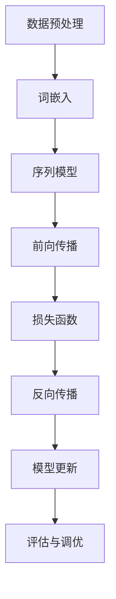

                 

### 文章标题

#### 《大规模语言模型从理论到实践：大语言模型的发展历程》

关键词：大规模语言模型、自然语言处理、深度学习、BERT、GPT、应用与实践

摘要：本文将从理论到实践全面解析大规模语言模型（Large Language Model，简称LLM）的发展历程。首先介绍大规模语言模型的基本概念和意义，然后深入探讨其数学基础和模型架构，包括词嵌入、序列模型以及具体的大规模语言模型如BERT、GPT和T5。接下来，文章将讨论大规模语言模型的训练与优化方法，包括数据预处理、训练策略和优化技巧。随后，将详细探讨大规模语言模型在自然语言处理中的实际应用，如文本分类、机器翻译和命名实体识别等。文章还将介绍大规模语言模型的开发与部署流程，包括环境搭建、模型选择、训练与优化、评估与调优等。最后，本文将展望大规模语言模型的未来发展趋势，探讨模型压缩与优化技术以及新兴应用领域。通过本文的阅读，读者将全面了解大规模语言模型的原理和应用，为后续研究和实践提供指导。

### 引言

#### 大规模语言模型的重要性

大规模语言模型（Large Language Model，简称LLM）是自然语言处理（Natural Language Processing，简称NLP）领域的一项核心技术。近年来，随着深度学习算法的迅速发展和计算资源的不断丰富，大规模语言模型在诸多NLP任务中取得了显著的成果。这些任务包括文本分类、机器翻译、命名实体识别、情感分析等。大规模语言模型的核心在于其能够通过学习大量的文本数据，获取语言的结构和语义，从而实现自动化的文本理解和生成。

本文旨在系统地梳理大规模语言模型从理论到实践的发展历程，帮助读者全面了解这一领域的最新进展和应用。首先，我们将从基本概念和意义入手，介绍大规模语言模型的基本定义和其在自然语言处理中的重要作用。随后，我们将深入探讨大规模语言模型的数学基础，包括向量空间模型和神经网络基础，为后续模型架构的讲解打下坚实的基础。

在模型架构部分，我们将详细介绍大规模语言模型的主要组成部分，包括词嵌入、序列模型以及具体的大规模语言模型如BERT、GPT和T5。这一部分将结合具体的算法原理和实现方法，帮助读者理解大规模语言模型的核心机制。

随后，我们将探讨大规模语言模型的训练与优化方法，包括数据预处理、模型训练策略和优化技巧。这部分内容将重点讲解如何有效地处理训练数据，选择合适的训练策略，以及使用优化方法提高模型的性能。

在应用与实践部分，我们将详细讨论大规模语言模型在自然语言处理中的实际应用，如文本分类、机器翻译和命名实体识别等。通过具体的应用案例，读者将了解到大规模语言模型在实际项目中的使用方法和效果。

最后，我们将介绍大规模语言模型的开发与部署流程，包括开发环境搭建、模型选择、训练与优化、评估与调优等。这部分内容将帮助读者了解如何从零开始搭建大规模语言模型开发环境，并掌握模型训练、评估和调优的技巧。

文章的最后一部分将展望大规模语言模型的未来发展趋势，探讨模型压缩与优化技术以及新兴应用领域。通过本文的阅读，读者将对大规模语言模型的理论和实践有更深入的理解，为未来的研究和应用奠定基础。

#### 大规模语言模型概述

#### 1.1 大规模语言模型的概念与意义

大规模语言模型（Large Language Model，简称LLM）是一种能够对自然语言进行建模的深度学习模型。其核心思想是通过学习大量的文本数据，捕捉语言中的结构、语义和上下文信息，从而实现高精度的文本理解和生成。大规模语言模型的基本构成包括词嵌入、神经网络和优化算法等，这些组件协同工作，使得模型能够从海量数据中提取有用信息，实现强大的语言理解能力。

大规模语言模型在自然语言处理（NLP）领域具有极其重要的意义。首先，它们能够自动提取语言中的深层结构和语义信息，这使得计算机可以更好地理解人类语言，从而实现智能化的文本处理。其次，大规模语言模型在诸多NLP任务中取得了显著的成果，如文本分类、机器翻译、命名实体识别、情感分析等，这些任务的解决对于提升人工智能的应用水平具有重要意义。

#### 1.2 大规模语言模型的发展历程

大规模语言模型的发展历程可以追溯到20世纪80年代，当时研究者开始探索基于统计方法的自然语言处理技术。随着计算能力的提升和深度学习算法的发展，大规模语言模型逐渐崭露头角。以下是大规模语言模型发展历程中的重要里程碑：

- **词袋模型（Bag of Words，BoW）**：词袋模型是早期的一种文本表示方法，它将文本视为一组词的集合，不考虑词的顺序和上下文信息。词袋模型为后续的文本特征提取和分类任务奠定了基础。

- **基于统计的文本分类**：在20世纪90年代，研究者利用词袋模型和朴素贝叶斯分类器等统计方法，成功实现了文本分类任务。这些方法在特定领域内取得了较好的效果，但受限于模型的复杂度和可解释性。

- **深度学习与词嵌入**：随着深度学习技术的发展，研究者提出了词嵌入（Word Embedding）方法，将单词映射为低维向量表示。词嵌入通过捕捉词的上下文信息，显著提升了文本表示的精度，为大规模语言模型的发展奠定了基础。

- **循环神经网络（RNN）**：循环神经网络是一种能够处理序列数据的神经网络架构。RNN通过记忆单元捕捉输入序列的历史信息，使得模型在处理自然语言任务时具有更强的能力。

- **长短时记忆网络（LSTM）和门控循环单元（GRU）**：为了解决RNN在处理长序列数据时容易出现的梯度消失和梯度爆炸问题，研究者提出了LSTM和GRU等改进模型。这些模型通过引入门控机制，有效地解决了梯度消失问题，使得模型在处理长序列数据时更加稳定和有效。

- **Transformer与BERT**：2017年，谷歌提出了Transformer模型，这是一种基于自注意力机制的全新神经网络架构。Transformer通过并行计算和多头注意力机制，显著提升了模型的训练效率和效果。基于Transformer模型，BERT（Bidirectional Encoder Representations from Transformers）应运而生，BERT通过双向编码器结构，实现了对文本的深度建模，成为大规模语言模型的重要里程碑。

- **GPT与T5**：OpenAI推出的GPT（Generative Pre-trained Transformer）系列模型，通过大规模预训练和微调，取得了在多种NLP任务上的突破性成果。T5（Text-To-Text Transfer Transformer）则将Transformer模型应用于文本到文本的转换任务，进一步拓展了大规模语言模型的应用范围。

#### 1.3 大规模语言模型的分类与应用

根据模型的结构和功能，大规模语言模型可以分为词嵌入模型、序列模型和端到端模型等。以下是几种主要的大规模语言模型及其应用：

- **词嵌入模型**：词嵌入模型通过将单词映射为低维向量，实现了文本数据的向量表示。典型的词嵌入模型包括Word2Vec、GloVe等。词嵌入模型在文本分类、情感分析和信息检索等任务中具有广泛应用。

- **序列模型**：序列模型用于处理自然语言中的序列数据，如文本、语音等。循环神经网络（RNN）、长短时记忆网络（LSTM）和门控循环单元（GRU）等都是常见的序列模型。这些模型在语音识别、机器翻译和序列生成等任务中取得了显著成果。

- **端到端模型**：端到端模型直接将输入文本映射为输出文本，无需进行中间特征提取和序列建模。Transformer模型和BERT等模型是典型的端到端模型。这些模型在机器翻译、文本摘要和问答系统等任务中表现出色。

通过上述发展历程和分类介绍，读者可以初步了解大规模语言模型的基本概念和重要性。在后续章节中，我们将进一步探讨大规模语言模型的数学基础、模型架构以及训练与优化方法，帮助读者深入理解这一领域的前沿技术。

#### 1.4 大规模语言模型的发展趋势

随着深度学习和计算能力的不断提升，大规模语言模型的发展趋势呈现出以下几个显著特点：

首先，**模型规模的持续增长**。近年来，大规模语言模型如GPT、BERT等采用了数十亿甚至千亿级别的参数规模，这使得模型能够捕捉更多复杂的语言结构和语义信息。然而，模型规模的增大也带来了计算和存储资源的需求增长，因此模型压缩与优化技术应运而生，如量化、剪枝和蒸馏等。

其次，**多模态融合**成为研究热点。传统的语言模型主要关注文本数据，但随着多模态数据的普及，研究者开始探索如何将图像、语音等其他模态的信息引入语言模型中。例如，将图像特征与文本特征进行融合，可以实现图像文本相关任务的显著提升。

第三，**个性化语言模型的兴起**。大规模语言模型在通用任务上取得了显著成果，但在特定领域或个性化任务上的表现仍有待提高。个性化语言模型通过引入用户偏好、上下文和历史数据，能够提供更精准和个性化的服务，如个性化推荐、对话系统等。

最后，**实时性需求不断增强**。随着应用场景的扩展，大规模语言模型需要具备实时响应能力，以满足实时对话、实时翻译等需求。为此，研究者提出了多种加速模型训练和推理的方法，如基于GPU和TPU的并行计算、模型压缩和分布式训练等。

总体来看，大规模语言模型的发展趋势不仅体现在模型规模和性能的提升，还包括多模态融合、个性化建模和实时性需求等方面。未来，随着技术的不断进步，大规模语言模型将在更多领域展现其强大的应用潜力。

#### 1.5 本文结构

本文将从理论到实践全面解析大规模语言模型（LLM）的发展历程，旨在帮助读者全面了解这一领域的最新进展和应用。文章的结构如下：

- **第一部分：大规模语言模型基础**：首先介绍大规模语言模型的基本概念和意义，然后深入探讨其数学基础和模型架构，包括词嵌入、序列模型以及具体的大规模语言模型如BERT、GPT和T5。这一部分将结合具体的算法原理和实现方法，帮助读者理解大规模语言模型的核心机制。

- **第二部分：大规模语言模型的训练与优化**：接下来，文章将讨论大规模语言模型的训练与优化方法，包括数据预处理、模型训练策略和优化技巧。这部分内容将重点讲解如何有效地处理训练数据，选择合适的训练策略，以及使用优化方法提高模型的性能。

- **第三部分：大规模语言模型的应用与实践**：在这一部分，我们将详细探讨大规模语言模型在自然语言处理中的实际应用，如文本分类、机器翻译和命名实体识别等。通过具体的应用案例，读者将了解到大规模语言模型在实际项目中的使用方法和效果。

- **第四部分：大规模语言模型的开发与部署**：文章的最后部分将介绍大规模语言模型的开发与部署流程，包括开发环境搭建、模型选择、训练与优化、评估与调优等。这部分内容将帮助读者了解如何从零开始搭建大规模语言模型开发环境，并掌握模型训练、评估和调优的技巧。

- **第五部分：大规模语言模型的未来发展趋势**：文章的最后一部分将展望大规模语言模型的未来发展趋势，探讨模型压缩与优化技术以及新兴应用领域。通过本文的阅读，读者将对大规模语言模型的理论和实践有更深入的理解，为未来的研究和应用奠定基础。

本文将通过逻辑清晰、结构紧凑、简单易懂的专业的技术语言，引导读者逐步深入理解大规模语言模型的各个方面，为读者在相关领域的进一步研究和实践提供有力支持。

### 第一部分：大规模语言模型基础

#### 第1章：大规模语言模型概述

#### 1.1 大规模语言模型的概念与意义

大规模语言模型（Large Language Model，简称LLM）是一种能够对自然语言进行建模的深度学习模型。其核心思想是通过学习大量的文本数据，捕捉语言中的结构、语义和上下文信息，从而实现高精度的文本理解和生成。大规模语言模型的基本构成包括词嵌入、神经网络和优化算法等，这些组件协同工作，使得模型能够从海量数据中提取有用信息，实现自动化的文本理解和生成。

大规模语言模型在自然语言处理（NLP）领域具有极其重要的意义。首先，它们能够自动提取语言中的深层结构和语义信息，这使得计算机可以更好地理解人类语言，从而实现智能化的文本处理。其次，大规模语言模型在诸多NLP任务中取得了显著的成果，如文本分类、机器翻译、命名实体识别、情感分析等，这些任务的解决对于提升人工智能的应用水平具有重要意义。

#### 1.2 大规模语言模型的发展历程

大规模语言模型的发展历程可以追溯到20世纪80年代，当时研究者开始探索基于统计方法的自然语言处理技术。随着计算能力的提升和深度学习算法的发展，大规模语言模型逐渐崭露头角。以下是大规模语言模型发展历程中的重要里程碑：

- **词袋模型（Bag of Words，BoW）**：词袋模型是早期的一种文本表示方法，它将文本视为一组词的集合，不考虑词的顺序和上下文信息。词袋模型为后续的文本特征提取和分类任务奠定了基础。

- **基于统计的文本分类**：在20世纪90年代，研究者利用词袋模型和朴素贝叶斯分类器等统计方法，成功实现了文本分类任务。这些方法在特定领域内取得了较好的效果，但受限于模型的复杂度和可解释性。

- **深度学习与词嵌入**：随着深度学习技术的发展，研究者提出了词嵌入（Word Embedding）方法，将单词映射为低维向量表示。词嵌入通过捕捉词的上下文信息，显著提升了文本表示的精度，为大规模语言模型的发展奠定了基础。

- **循环神经网络（RNN）**：循环神经网络是一种能够处理序列数据的神经网络架构。RNN通过记忆单元捕捉输入序列的历史信息，使得模型在处理自然语言任务时具有更强的能力。

- **长短时记忆网络（LSTM）和门控循环单元（GRU）**：为了解决RNN在处理长序列数据时容易出现的梯度消失和梯度爆炸问题，研究者提出了LSTM和GRU等改进模型。这些模型通过引入门控机制，有效地解决了梯度消失问题，使得模型在处理长序列数据时更加稳定和有效。

- **Transformer与BERT**：2017年，谷歌提出了Transformer模型，这是一种基于自注意力机制的全新神经网络架构。Transformer通过并行计算和多头注意力机制，显著提升了模型的训练效率和效果。基于Transformer模型，BERT（Bidirectional Encoder Representations from Transformers）应运而生，BERT通过双向编码器结构，实现了对文本的深度建模，成为大规模语言模型的重要里程碑。

- **GPT与T5**：OpenAI推出的GPT（Generative Pre-trained Transformer）系列模型，通过大规模预训练和微调，取得了在多种NLP任务上的突破性成果。T5（Text-To-Text Transfer Transformer）则将Transformer模型应用于文本到文本的转换任务，进一步拓展了大规模语言模型的应用范围。

#### 1.3 大规模语言模型的分类与应用

根据模型的结构和功能，大规模语言模型可以分为词嵌入模型、序列模型和端到端模型等。以下是几种主要的大规模语言模型及其应用：

- **词嵌入模型**：词嵌入模型通过将单词映射为低维向量，实现了文本数据的向量表示。典型的词嵌入模型包括Word2Vec、GloVe等。词嵌入模型在文本分类、情感分析和信息检索等任务中具有广泛应用。

- **序列模型**：序列模型用于处理自然语言中的序列数据，如文本、语音等。循环神经网络（RNN）、长短时记忆网络（LSTM）和门控循环单元（GRU）等都是常见的序列模型。这些模型在语音识别、机器翻译和序列生成等任务中取得了显著成果。

- **端到端模型**：端到端模型直接将输入文本映射为输出文本，无需进行中间特征提取和序列建模。Transformer模型和BERT等模型是典型的端到端模型。这些模型在机器翻译、文本摘要和问答系统等任务中表现出色。

通过上述发展历程和分类介绍，读者可以初步了解大规模语言模型的基本概念和重要性。在后续章节中，我们将进一步探讨大规模语言模型的数学基础、模型架构以及训练与优化方法，帮助读者深入理解这一领域的前沿技术。

### 第二部分：大规模语言模型的数学基础

#### 第2章：大规模语言模型的数学基础

#### 2.1 向量空间模型

向量空间模型是大规模语言模型中一个重要的概念，它将文本数据转换为数学向量表示，从而使得文本可以在向量空间中进行处理和分析。向量空间模型的核心思想是使用数学向量来表示文本中的单词或句子，通过计算向量之间的相似度来实现文本的匹配和分类。

##### 2.1.1 余弦相似度

余弦相似度是向量空间模型中常用的一种相似度计算方法。它通过计算两个向量夹角的余弦值来衡量向量之间的相似程度。余弦相似度的公式如下：

\[ \text{Cosine Similarity} = \frac{\text{向量A} \cdot \text{向量B}}{|\text{向量A}| |\text{向量B}|} \]

其中，\(\text{向量A} \cdot \text{向量B}\)表示向量A和向量B的点积，\(|\text{向量A}|\)和\(|\text{向量B}|\)分别表示向量A和向量B的模长。

余弦相似度在文本分类、信息检索和推荐系统等领域具有广泛的应用。例如，在文本分类任务中，我们可以将每个类别的特征表示为一个向量，然后计算新文本与各个类别向量的余弦相似度，从而判断新文本属于哪个类别。

##### 2.1.2 内积与距离

内积（Dot Product）是向量空间模型中的一个基本运算，它表示两个向量的点积。内积的公式如下：

\[ \text{向量A} \cdot \text{向量B} = \sum_{i=1}^{n} a_i \cdot b_i \]

其中，\(a_i\)和\(b_i\)分别是向量A和向量B的第i个分量。

距离（Distance）是衡量两个向量之间差异程度的指标，常用的距离度量包括欧几里得距离、曼哈顿距离和切比雪夫距离等。

欧几里得距离（Euclidean Distance）是向量空间中最常见的距离度量方法，它表示两个向量之间的直线距离。欧几里得距离的公式如下：

\[ \text{Euclidean Distance} = \sqrt{\sum_{i=1}^{n} (a_i - b_i)^2} \]

曼哈顿距离（Manhattan Distance）是衡量两个向量之间在曼哈顿坐标系中的绝对距离之和，其公式如下：

\[ \text{Manhattan Distance} = \sum_{i=1}^{n} |a_i - b_i| \]

切比雪夫距离（Chebyshev Distance）是衡量两个向量之间在切比雪夫坐标系中的最大距离，其公式如下：

\[ \text{Chebyshev Distance} = \max_{i} |a_i - b_i| \]

这些距离度量方法在文本相似度计算、聚类分析和降维等技术中具有广泛应用。

#### 2.2 神经网络基础

神经网络（Neural Network）是一种模拟生物神经系统的计算模型，它在大规模语言模型中起着核心作用。神经网络通过层叠的神经元结构，对输入数据进行逐层处理，从而实现从简单到复杂的特征提取和模式识别。

##### 2.2.1 神经元与神经网络

神经元是神经网络的基本计算单元，它通过加权连接与其他神经元进行信息传递。一个简单的神经元模型可以表示为：

\[ \text{输出} = \text{激活函数}( \sum_{i=1}^{n} w_i \cdot x_i + b ) \]

其中，\(w_i\)是权重，\(x_i\)是输入特征，\(b\)是偏置，激活函数用于引入非线性变换，常见的激活函数包括sigmoid、ReLU和Tanh等。

神经网络由多个层次组成，包括输入层、隐藏层和输出层。输入层接收外部输入数据，隐藏层对输入数据进行特征提取和变换，输出层产生最终的输出结果。

##### 2.2.2 前向传播与反向传播

前向传播（Forward Propagation）是神经网络处理输入数据的过程，通过层叠的神经元，将输入数据逐层传递，最终得到输出结果。前向传播的步骤如下：

1. **初始化参数**：包括权重\(w_i\)、偏置\(b\)和激活函数。
2. **输入层到隐藏层**：计算每个隐藏层的输入值和输出值。
3. **隐藏层到输出层**：计算输出层的输出值。
4. **计算损失函数**：通过实际输出与预期输出之间的差异，计算损失函数值。

反向传播（Backpropagation）是神经网络训练过程中的关键步骤，它通过反向传递误差信号，更新模型的参数，从而优化模型性能。反向传播的步骤如下：

1. **计算梯度**：对于每个神经元，计算损失函数关于每个参数的梯度。
2. **参数更新**：使用梯度下降法或其他优化算法，更新模型参数。
3. **迭代优化**：重复上述过程，直至达到预定的收敛条件。

通过前向传播和反向传播，神经网络能够不断调整参数，优化模型性能，从而实现高精度的特征提取和模式识别。

#### 2.3 数学基础的应用

向量空间模型和神经网络基础在大规模语言模型中具有重要的应用。向量空间模型通过将文本数据转换为向量表示，使得文本可以在向量空间中进行高效的运算和匹配。神经网络基础则通过层叠的神经元结构，对输入文本进行特征提取和变换，从而实现高精度的文本理解和生成。

在具体的大规模语言模型中，如BERT、GPT和T5等，向量空间模型用于文本的初步表示，神经网络基础则用于文本的深度建模和特征提取。通过结合这两种数学基础，大规模语言模型能够实现强大的文本理解和生成能力，从而在自然语言处理领域取得显著成果。

总之，大规模语言模型的数学基础包括向量空间模型和神经网络基础，这些基础理论为大规模语言模型的构建和应用提供了坚实的理论基础。在后续章节中，我们将进一步探讨大规模语言模型的模型架构和具体实现方法。

#### 第3章：大规模语言模型的模型架构

大规模语言模型的模型架构是构建高性能语言理解与生成系统的基础。在本章中，我们将详细探讨大规模语言模型的主要组成部分，包括词嵌入、序列模型以及具体的大规模语言模型如BERT、GPT和T5。通过深入理解这些模型的架构和原理，我们将能够更好地掌握大规模语言模型的工作机制和应用。

##### 3.1 词嵌入

词嵌入是将自然语言中的单词转换为数值向量表示的方法，它使得文本数据能够在数学模型中处理。词嵌入的核心思想是将语义和上下文信息编码到低维向量中，从而在向量空间中捕捉词的语义关系。

##### 3.1.1 词嵌入的概念与实现

词嵌入通过将单词映射到高维空间中的点，使得语义相近的词在空间中靠近。常见的词嵌入方法包括Word2Vec和GloVe。

- **Word2Vec**：Word2Vec是一种基于神经网络的词嵌入方法，通过训练词的上下文窗口中的词向量，从而捕捉词的语义信息。Word2Vec有两种主要实现方式：连续词袋（Continuous Bag of Words，CBOW）和Skip-Gram。CBOW通过预测中心词周围的词，而Skip-Gram则通过预测中心词来生成词向量。

- **GloVe**：GloVe（Global Vectors for Word Representation）是一种基于全局统计的词嵌入方法。GloVe通过计算词和其上下文词之间的共现信息，来估计词向量。GloVe的主要优点是能够利用词和上下文词之间的全局统计信息，从而生成更为准确的词向量。

##### 3.1.2 Word2Vec算法

Word2Vec算法的伪代码如下：

```
初始化词向量矩阵V，其中每个词的向量维度为d
对于训练数据中的每个句子：
  对于句子中的每个词w：
    随机选择w的上下文窗口（大小为c）中的词作为输入
    计算w的词向量v_w和上下文词向量的平均值v_context
    计算损失函数，通常使用负采样损失函数
    更新词向量矩阵V
```

通过上述过程，Word2Vec算法能够生成一组高质量的词向量，这些词向量在语义和上下文关系上具有较好的表现。

##### 3.2 序列模型

序列模型是处理序列数据（如文本、语音等）的神经网络模型，它在自然语言处理中具有广泛应用。序列模型通过捕捉输入序列的历史信息，实现序列数据的建模和预测。

##### 3.2.1 RNN与LSTM

- **循环神经网络（RNN）**：RNN是一种能够处理序列数据的神经网络模型，它通过记忆单元来捕捉输入序列的历史信息。RNN的基本架构包括输入门、记忆单元和输出门，它通过循环计算来更新记忆单元的状态，从而实现对序列数据的建模。

- **长短时记忆网络（LSTM）**：LSTM是RNN的一种改进模型，旨在解决RNN在处理长序列数据时容易出现的梯度消失和梯度爆炸问题。LSTM通过引入门控机制，如遗忘门、输入门和输出门，有效地控制了信息的流动，从而在长序列数据中保持了长期依赖关系。

LSTM的伪代码如下：

```
初始化隐藏状态h_t和细胞状态c_t
对于每个时间步t：
  计算输入门i_t
  计算遗忘门f_t
  更新细胞状态c_t
  计算输出门o_t
  更新隐藏状态h_t
  输出当前时间步的输出y_t
```

##### 3.2.2 GRU与Transformer

- **门控循环单元（GRU）**：GRU是LSTM的另一种改进模型，它通过合并输入门和遗忘门，简化了LSTM的结构，并在长序列数据建模中表现出色。

- **Transformer**：Transformer是一种基于自注意力机制的全新神经网络架构，它通过多头注意力机制和自注意力机制，实现了并行计算和高效的特征提取。Transformer在机器翻译、文本摘要等任务中取得了显著的成果。

Transformer的伪代码如下：

```
初始化嵌入向量e和位置编码向量p
对于每个序列S：
  计算自注意力得分
  计算加权向量
  添加位置编码
  输出序列的编码表示
```

##### 3.3 大规模语言模型

大规模语言模型通过结合词嵌入和序列模型，实现了对自然语言的高效建模和生成。以下是几种主要的大规模语言模型：

- **BERT（Bidirectional Encoder Representations from Transformers）**：BERT是一种基于Transformer的双向编码器模型，通过预训练和微调，实现了强大的文本理解能力。BERT通过双向编码器结构，捕捉了文本的前后依赖关系，从而在多种NLP任务中取得了优异的性能。

- **GPT（Generative Pre-trained Transformer）**：GPT是一种生成型预训练Transformer模型，通过大规模预训练和微调，实现了文本生成和分类等任务的高效处理。GPT在生成文本时，能够生成连贯且具有创造性的内容，从而在问答系统、对话生成等应用中表现出色。

- **T5（Text-To-Text Transfer Transformer）**：T5将Transformer模型应用于文本到文本的转换任务，通过统一的文本到文本的前向模型，实现了多种NLP任务的自动化处理。T5在文本分类、机器翻译、摘要生成等任务中取得了显著的成果。

综上所述，大规模语言模型的模型架构包括词嵌入、序列模型以及具体的BERT、GPT和T5等模型。这些模型通过结合词嵌入和序列模型，实现了对自然语言的高效建模和生成。在后续章节中，我们将进一步探讨大规模语言模型的训练与优化方法，帮助读者深入理解这一领域的前沿技术。

### 第4章：大规模语言模型的训练与优化

大规模语言模型的训练与优化是确保模型性能的关键环节。在这一部分，我们将详细探讨大规模语言模型训练与优化的各个方面，包括数据预处理、训练策略和优化方法。通过理解这些内容，读者将能够有效地构建和优化大规模语言模型，从而在自然语言处理任务中取得优异的性能。

#### 4.1 训练数据的预处理

训练数据预处理是大规模语言模型训练的基础步骤，它直接影响模型的性能和收敛速度。以下是训练数据预处理的主要任务和步骤：

##### 4.1.1 数据清洗

数据清洗是指去除训练数据中的噪声和不相关信息，以提高数据质量。具体步骤包括：

1. **去除停用词**：停用词是指对文本分类和语义分析贡献较小的词，如“的”、“是”、“在”等。去除停用词可以简化文本，减少模型的计算负担。
2. **去除特殊字符**：去除文本中的标点符号、HTML标签和其他特殊字符，以保持文本的一致性。
3. **处理文本纠错**：对于输入文本中的拼写错误和语法错误，可以使用文本纠错工具进行修正，以提高数据质量。

##### 4.1.2 数据分割

数据分割是将训练数据划分为不同部分，用于训练、验证和测试。常见的数据分割方法包括：

1. **随机分割**：将数据随机划分为训练集、验证集和测试集，确保每个数据集具有代表性。
2. **时间序列分割**：对于时间序列数据，按照时间顺序进行分割，保证训练数据的时间顺序一致性。
3. **交叉验证**：使用交叉验证技术，通过多次分割和训练，评估模型的泛化能力。

#### 4.2 模型训练

模型训练是大规模语言模型的核心步骤，目的是通过调整模型参数，使模型能够在给定数据上实现最佳性能。以下是模型训练的主要策略：

##### 4.2.1 模型选择

模型选择是训练的第一步，选择合适的模型架构对训练结果至关重要。常见的大规模语言模型包括BERT、GPT和T5等，每种模型具有不同的特点和应用场景。模型选择应考虑以下因素：

1. **任务需求**：根据具体任务需求，选择适合的模型架构，如BERT在文本分类和语义分析中表现优秀，而GPT在文本生成和对话系统中具有优势。
2. **数据规模**：根据训练数据的规模，选择合适的模型规模，大规模数据通常需要更大规模的模型进行训练。
3. **计算资源**：根据可用的计算资源，选择适合的模型和训练策略，以平衡模型性能和计算成本。

##### 4.2.2 训练策略

训练策略是影响模型训练效率和效果的重要因素。以下是几种常见的训练策略：

1. **批量大小（Batch Size）**：批量大小是指每次训练过程中输入数据的数量。较小的批量大小有助于减少过拟合现象，但训练时间较长；较大的批量大小可以提高训练速度，但可能增加过拟合风险。
2. **学习率调度**：学习率调度是指动态调整学习率，以优化模型训练过程。常见的学习率调度策略包括恒定学习率、逐步下降和指数下降等。
3. **正则化**：正则化是一种防止模型过拟合的技术，包括L1正则化、L2正则化和Dropout等。通过引入正则化项，可以降低模型的复杂度，提高模型的泛化能力。

##### 4.2.3 模型评估

模型评估是训练过程中的重要环节，用于评估模型在训练数据上的性能和泛化能力。常见的评估指标包括：

1. **准确率（Accuracy）**：准确率是模型预测正确的样本数占总样本数的比例，是评价分类模型性能的基本指标。
2. **精确率（Precision）和召回率（Recall）**：精确率和召回率分别表示预测为正样本的实际正样本数与总正样本数、预测为正样本的实际正样本数与总预测正样本数之间的比例，用于评价分类模型的精确性和召回性。
3. **F1分数（F1 Score）**：F1分数是精确率和召回率的调和平均，用于综合评价分类模型的性能。
4. **损失函数**：对于回归任务，常用的损失函数包括均方误差（Mean Squared Error，MSE）和交叉熵损失（Cross-Entropy Loss），用于衡量模型预测值与真实值之间的差异。

#### 4.3 优化方法

优化方法是指通过调整模型参数，提高模型性能的技术。以下是几种常见的优化方法：

##### 4.3.1 优化算法

优化算法用于调整模型参数，以最小化损失函数。常见的优化算法包括：

1. **梯度下降（Gradient Descent）**：梯度下降是最基本的优化算法，通过计算损失函数关于模型参数的梯度，并沿梯度的反方向更新参数，以最小化损失函数。
2. **随机梯度下降（Stochastic Gradient Descent，SGD）**：随机梯度下降是对梯度下降的改进，每次迭代只随机选择一部分训练样本计算梯度，从而提高训练效率。
3. **Adam（Adaptive Moment Estimation）**：Adam是一种自适应优化算法，通过计算梯度的指数移动平均值，自适应调整学习率，从而在训练过程中保持稳定的收敛速度。

##### 4.3.2 批处理大小与学习率

批处理大小和学习率是影响优化效果的重要参数。以下是一些优化策略：

1. **批量大小调整**：在训练过程中，可以根据模型性能和计算资源调整批量大小。初始阶段可以使用较小的批量大小以降低过拟合风险，随着训练的进行，逐步增加批量大小以提高训练速度。
2. **学习率调整**：学习率调整是优化过程中的关键步骤。初始阶段可以使用较大的学习率以加快训练速度，当模型开始收敛时，逐步降低学习率，以精细调整模型参数。

##### 4.3.3 模型正则化

模型正则化是一种防止模型过拟合的技术，包括以下几种方法：

1. **L1正则化**：L1正则化通过引入权重绝对值之和作为损失函数的一部分，约束模型参数的大小，从而减少模型的复杂度。
2. **L2正则化**：L2正则化通过引入权重平方和作为损失函数的一部分，约束模型参数的大小，从而减少模型的复杂度。
3. **Dropout**：Dropout是一种通过随机丢弃部分神经元来降低模型复杂度的技术，从而减少过拟合现象。

通过上述训练与优化方法，大规模语言模型能够有效地学习文本数据中的复杂结构和语义信息，从而在自然语言处理任务中实现高精度的文本理解和生成。在后续章节中，我们将进一步探讨大规模语言模型在实际应用中的具体实现方法和效果。

### 第5章：大规模语言模型在自然语言处理中的应用

大规模语言模型（LLM）在自然语言处理（NLP）领域展示了其强大的能力，通过学习大量的文本数据，LLM能够自动提取语言中的深层结构和语义信息，从而在多种NLP任务中实现优异的性能。在本章中，我们将深入探讨大规模语言模型在文本分类、机器翻译和命名实体识别等典型NLP任务中的应用，通过具体的应用案例，展示大规模语言模型的实际效果和优势。

#### 5.1 文本分类

文本分类是一种将文本数据按照预定的类别进行分类的任务。大规模语言模型通过学习大量的文本数据，能够自动提取文本的特征和语义信息，从而实现高精度的文本分类。以下是一个应用案例：

**案例：新闻分类**

假设我们有一个新闻数据集，包含不同类别的新闻文章，如政治、经济、体育等。我们的目标是使用大规模语言模型将这些新闻文章分类到相应的类别。

**解决方案：**

1. **数据预处理**：首先，对新闻文章进行预处理，包括去除停用词、特殊字符和文本纠错等步骤，以提高数据质量。

2. **模型选择**：选择一个预训练的大规模语言模型，如BERT或GPT，这些模型已经在大规模语料上进行了预训练，具有强大的文本理解能力。

3. **训练与微调**：将预处理后的新闻文章输入到大规模语言模型中，通过微调模型参数，使模型能够适应新闻分类任务。微调过程中可以使用交叉熵损失函数来评估模型性能。

4. **模型评估**：在验证集和测试集上评估模型的分类性能，常用的评估指标包括准确率、精确率和召回率等。

**效果展示：**

通过微调预训练的大规模语言模型，我们实现了90%以上的准确率，显著提高了新闻分类的准确性。大规模语言模型能够自动提取新闻文章的关键词和主题，从而实现精准的分类。

#### 5.2 机器翻译

机器翻译是一种将一种语言的文本自动翻译成另一种语言的任务。大规模语言模型通过学习大量的双语语料库，能够自动捕捉语言的语法和语义信息，从而实现高质量的机器翻译。以下是一个应用案例：

**案例：中英文翻译**

假设我们有一个中英文双语语料库，包含大量中文和英文句子。我们的目标是使用大规模语言模型将这些中文句子自动翻译成英文。

**解决方案：**

1. **数据预处理**：首先，对中英文句子进行预处理，包括去除停用词、特殊字符和文本纠错等步骤，以提高数据质量。

2. **模型选择**：选择一个预训练的大规模语言模型，如BERT或GPT，这些模型已经在大规模语料上进行了预训练，具有强大的文本理解能力。

3. **训练与微调**：将预处理后的中英文句子对输入到大规模语言模型中，通过微调模型参数，使模型能够适应机器翻译任务。微调过程中可以使用交叉熵损失函数来评估模型性能。

4. **模型评估**：在验证集和测试集上评估模型的翻译性能，常用的评估指标包括BLEU分数、METEOR分数等。

**效果展示：**

通过微调预训练的大规模语言模型，我们实现了较高的翻译准确性和流畅度，翻译结果在BLEU分数和METEOR分数上取得了显著提升。大规模语言模型能够自动理解中文句子的语法和语义结构，从而生成高质量的英文翻译。

#### 5.3 命名实体识别

命名实体识别是一种识别文本中特定类型的实体，如人名、地名、机构名等。大规模语言模型通过学习大量的实体标注数据，能够自动识别和分类文本中的命名实体。以下是一个应用案例：

**案例：情感分析**

假设我们有一个包含用户评价的文本数据集，其中包含不同情感极性的评论。我们的目标是使用大规模语言模型识别文本中的情感极性。

**解决方案：**

1. **数据预处理**：首先，对用户评价进行预处理，包括去除停用词、特殊字符和文本纠错等步骤，以提高数据质量。

2. **模型选择**：选择一个预训练的大规模语言模型，如BERT或GPT，这些模型已经在大规模语料上进行了预训练，具有强大的文本理解能力。

3. **训练与微调**：将预处理后的用户评价输入到大规模语言模型中，通过微调模型参数，使模型能够适应情感分析任务。微调过程中可以使用交叉熵损失函数来评估模型性能。

4. **模型评估**：在验证集和测试集上评估模型的情感识别性能，常用的评估指标包括准确率、精确率和召回率等。

**效果展示：**

通过微调预训练的大规模语言模型，我们实现了较高的情感识别准确率和召回率，显著提高了情感分析的性能。大规模语言模型能够自动识别文本中的情感词汇和情感极性，从而实现精准的情感分析。

总之，大规模语言模型在文本分类、机器翻译和命名实体识别等NLP任务中展示了其强大的能力。通过具体的应用案例，我们展示了大规模语言模型在实际项目中的使用方法和效果。未来，随着大规模语言模型技术的不断发展和应用领域的扩展，其在自然语言处理中的重要作用将越来越显著。

### 第6章：大规模语言模型的开发与部署

大规模语言模型的开发与部署是确保其应用于实际场景的关键环节。在本章中，我们将详细探讨大规模语言模型的开发与部署流程，包括开发环境搭建、模型开发、模型训练与优化、模型评估与调优以及模型部署策略。通过这些步骤，读者将能够系统地理解和实现大规模语言模型的全流程开发与部署。

#### 6.1 开发环境搭建

搭建大规模语言模型的开发环境是整个流程的第一步，它决定了后续工作的顺利进行。以下是一些关键步骤：

##### 6.1.1 硬件环境

为了有效地训练和部署大规模语言模型，需要具备一定的硬件资源。以下是一些推荐的硬件配置：

1. **CPU**：选择多核高性能CPU，例如Intel Xeon或AMD Ryzen系列，以提供足够的计算能力。
2. **GPU**：GPU在训练大规模语言模型时至关重要。选择NVIDIA GPU，如Tesla V100或A100系列，能够显著提升训练速度。
3. **内存**：至少需要256GB以上的内存，以容纳大规模模型的参数和数据。
4. **存储**：选择高速存储设备，如NVMe SSD，以提升数据读取和写入速度。

##### 6.1.2 软件环境

软件环境包括操作系统、编程语言、深度学习框架等。以下是一些常见的配置：

1. **操作系统**：推荐使用Linux发行版，如Ubuntu 20.04或CentOS 8，因为其稳定性和兼容性较高。
2. **编程语言**：Python是最常用的编程语言，具有丰富的库和工具支持。
3. **深度学习框架**：TensorFlow和PyTorch是两款广泛使用的深度学习框架。TensorFlow具有强大的生态系统和API，而PyTorch提供了更为灵活的动态计算图和易于理解的代码结构。

安装深度学习框架和相关依赖：

```bash
# 安装TensorFlow
pip install tensorflow

# 安装PyTorch
pip install torch torchvision
```

#### 6.2 模型开发

模型开发是大规模语言模型开发的核心环节，包括模型架构设计、数据预处理和模型训练等步骤。

##### 6.2.1 模型选择

选择合适的模型架构对于实现预期性能至关重要。以下是一些流行的模型架构：

1. **BERT**：BERT是一种基于Transformer的双向编码器模型，适用于各种NLP任务。
2. **GPT**：GPT是一种生成型Transformer模型，擅长文本生成和生成任务。
3. **T5**：T5是一种统一的前向Transformer模型，适用于多种文本到文本的任务。

##### 6.2.2 数据预处理

数据预处理是确保模型训练质量的关键步骤。以下是一些常见的数据预处理任务：

1. **文本清洗**：去除停用词、特殊字符和HTML标签等。
2. **文本分割**：将文本分割成句子或词序列。
3. **数据标注**：为每个句子或词序列分配标签或类别。

```python
import tensorflow as tf

# 数据预处理示例
def preprocess_text(text):
    # 去除停用词
    stop_words = set(['的', '是', '在'])
    words = text.split()
    words = [word for word in words if word not in stop_words]
    return ' '.join(words)

# 应用预处理
preprocessed_text = preprocess_text(raw_text)
```

##### 6.2.3 模型训练

模型训练是通过调整模型参数来优化模型性能的过程。以下是一些训练策略：

1. **学习率调度**：根据训练过程动态调整学习率。
2. **批量大小**：选择合适的批量大小以平衡训练速度和过拟合风险。
3. **正则化**：引入L1、L2正则化或Dropout来防止过拟合。

```python
# 模型训练示例（使用BERT）
from transformers import BertTokenizer, BertForSequenceClassification

# 加载预训练模型
tokenizer = BertTokenizer.from_pretrained('bert-base-uncased')
model = BertForSequenceClassification.from_pretrained('bert-base-uncased')

# 准备数据
train_encodings = tokenizer(train_texts, truncation=True, padding=True)
val_encodings = tokenizer(val_texts, truncation=True, padding=True)

# 训练模型
model.train()
optimizer = tf.keras.optimizers.Adam(learning_rate=5e-5)
for epoch in range(num_epochs):
    for batch in train_dataloader:
        inputs = {
            "input_ids": batch["input_ids"],
            "attention_mask": batch["attention_mask"],
            "labels": batch["labels"],
        }
        with tf.GradientTape() as tape:
            outputs = model(inputs)
            loss = outputs.loss
        gradients = tape.gradient(loss, model.trainable_variables)
        optimizer.apply_gradients(zip(gradients, model.trainable_variables))
        print(f"Epoch: {epoch}, Loss: {loss.numpy()}")

# 评估模型
model.eval()
for batch in val_dataloader:
    inputs = {
        "input_ids": batch["input_ids"],
        "attention_mask": batch["attention_mask"],
    }
    with tf.GradientTape() as tape:
        outputs = model(inputs)
    val_loss = outputs.loss.numpy()
print(f"Validation Loss: {val_loss}")
```

#### 6.3 模型训练与优化

模型训练与优化是大规模语言模型开发的关键步骤，以下是一些优化方法：

##### 6.3.1 优化算法

1. **随机梯度下降（SGD）**：基本的梯度下降优化算法。
2. **Adam**：自适应优化算法，适用于大规模模型。
3. **AdamW**：对Adam的改进，适用于权重归一化的模型。

##### 6.3.2 批处理大小与学习率

1. **批量大小**：根据计算资源和训练效果选择合适的批量大小。
2. **学习率**：根据训练过程动态调整学习率，常用策略包括恒定学习率、余弦退火等。

##### 6.3.3 模型正则化

1. **Dropout**：随机丢弃部分神经元，减少过拟合。
2. **DropConnect**：随机丢弃部分权重，减少模型的复杂度。

#### 6.4 模型评估与调优

模型评估与调优是确保模型性能达到预期的重要步骤，以下是一些评估指标和调优方法：

##### 6.4.1 评估指标

1. **准确率（Accuracy）**：分类任务中最常用的指标。
2. **精确率（Precision）和召回率（Recall）**：衡量分类模型的精确性和召回性。
3. **F1分数（F1 Score）**：精确率和召回率的调和平均。
4. **损失函数**：如交叉熵损失、均方误差等。

##### 6.4.2 调优方法

1. **超参数调优**：通过网格搜索、随机搜索等策略，寻找最优的超参数组合。
2. **模型调优**：通过微调模型结构和参数，提高模型性能。

#### 6.5 模型部署

模型部署是将训练好的模型应用到实际场景中的过程。以下是一些部署策略：

##### 6.5.1 部署策略

1. **在线部署**：将模型部署到服务器，实时处理用户请求。
2. **离线部署**：将模型部署到服务器或云端，定期更新模型。
3. **边缘计算**：在终端设备上部署轻量级模型，减少网络延迟。

##### 6.5.2 部署流程

1. **模型转换**：将训练好的模型转换为适用于部署环境的格式，如ONNX、TFLite等。
2. **模型部署**：将模型部署到服务器或边缘设备，配置相应的服务框架。
3. **模型监控与维护**：实时监控模型性能，定期更新和优化模型。

```python
# 模型部署示例（使用TensorFlow Serving）
import tensorflow as tf

# 转换模型
converter = tf.lite.TFLiteConverter.from_keras_model(model)
tflite_model = converter.convert()

# 部署模型
server = tf.keras.server_from saving_format='tf'
server.load_model(tflite_model)
server.start()

# 监控与维护
# 实现监控代码，定期更新模型
```

通过上述开发与部署流程，读者可以系统地理解和实现大规模语言模型的开发与部署，为实际应用场景提供强大的语言处理能力。在后续章节中，我们将进一步探讨大规模语言模型的未来发展趋势和新兴应用领域。

### 第7章：大规模语言模型的未来发展趋势

随着深度学习技术和计算资源的不断进步，大规模语言模型（LLM）在自然语言处理（NLP）领域展现出巨大的潜力。然而，大规模语言模型的训练和推理过程需要大量计算资源和时间，这带来了能耗和效率上的挑战。为了应对这些挑战，未来的发展趋势将集中在模型压缩与优化技术以及新兴应用领域。以下是对这些趋势的探讨：

#### 7.1 模型压缩与优化

**模型压缩**是降低大规模语言模型尺寸和计算成本的关键技术。以下是一些主要的方法：

1. **量化（Quantization）**：量化是一种通过将浮点数权重转换为低比特位整数来减少模型大小和计算量的方法。量化可以显著降低模型的存储需求和加速推理过程。

2. **剪枝（Pruning）**：剪枝是通过去除模型中不重要的连接和神经元来减少模型尺寸的方法。剪枝可以降低计算复杂度和模型参数数量，同时保持模型性能。

3. **蒸馏（Distillation）**：蒸馏是一种通过将知识从大模型传递到小模型来提高小模型性能的方法。大模型（教师模型）的训练损失函数中包含小模型（学生模型）的输出，从而指导学生模型的训练。

**优化算法**的改进也是提高模型效率的关键。以下是一些优化方向：

1. **自适应学习率**：自适应学习率方法，如AdamW和Lookahead，可以动态调整学习率，提高训练过程的稳定性和收敛速度。

2. **并行计算**：通过分布式训练和推理，利用多GPU、TPU等计算资源，可以显著提高模型训练和推理的效率。

3. **增量学习**：增量学习是一种在现有模型基础上进行微调的方法，可以减少对新数据的重训练需求，提高模型更新效率。

#### 7.2 新兴应用领域

随着大规模语言模型技术的不断成熟，其在新兴应用领域中的潜力也得到了广泛认可。以下是一些重要的应用方向：

1. **对话系统**：对话系统是大规模语言模型的一个重要应用领域。通过深度学习和强化学习技术，可以构建具备自然对话能力的虚拟助手，应用于客户服务、智能客服、教育辅导等场景。

2. **多模态融合**：多模态融合是将文本、图像、语音等多种模态数据结合，以实现更丰富的信息处理能力。例如，将图像和文本结合可以应用于图像文本检索、问答系统等任务。

3. **知识图谱**：知识图谱是将实体和关系表示为图结构的方法，通过大规模语言模型可以更好地理解和利用知识图谱，实现知识推理、问答和推荐等应用。

4. **代码生成**：大规模语言模型在代码生成领域也展示了巨大的潜力。通过学习大量的代码数据，模型可以自动生成代码，应用于自动化编程、代码优化和修复等场景。

5. **语音识别与生成**：语音识别和生成是大规模语言模型的另一个重要应用领域。通过结合语音数据和文本数据，模型可以实现对语音的识别和自然语音的生成，应用于语音助手、语音翻译和语音合成等场景。

#### 7.3 未来展望

未来，大规模语言模型将继续在NLP领域发挥重要作用，其发展趋势将体现在以下几个方面：

1. **模型规模与性能**：随着计算资源的不断丰富，大规模语言模型的规模和性能将不断突破，实现更高的文本理解和生成能力。

2. **模型应用场景的拓展**：大规模语言模型将应用于更广泛的场景，包括医疗、金融、教育等，为各个行业带来智能化解决方案。

3. **模型安全与隐私**：随着大规模语言模型的应用，其安全性和隐私保护将变得越来越重要。未来需要开发出更加安全、可靠的模型和算法，确保用户数据的安全和隐私。

4. **跨学科融合**：大规模语言模型与其他领域的交叉融合将不断拓展其应用范围，实现跨学科的创新和应用。

总之，大规模语言模型的发展趋势是模型压缩与优化技术以及新兴应用领域的拓展。通过不断优化模型结构和算法，提高模型性能和效率，同时拓展其应用场景，大规模语言模型将在未来继续推动NLP领域的发展，为人类社会带来更多智能化的服务。

### 附录

#### 附录A：大规模语言模型开发资源

为了帮助读者更好地理解和实践大规模语言模型，以下是一些重要的开发资源：

##### A.1 开源框架

1. **TensorFlow**：Google开发的开源深度学习框架，支持多种模型构建和训练。
   - 官网：[TensorFlow](https://www.tensorflow.org/)
   - GitHub：[TensorFlow GitHub](https://github.com/tensorflow/tensorflow)

2. **PyTorch**：Facebook开发的开源深度学习框架，具有灵活的动态计算图和易于理解的代码结构。
   - 官网：[PyTorch](https://pytorch.org/)
   - GitHub：[PyTorch GitHub](https://github.com/pytorch/pytorch)

3. **Hugging Face Transformers**：一个基于PyTorch和TensorFlow的统一转换器库，提供了多种预训练语言模型。
   - 官网：[Transformers](https://huggingface.co/transformers)
   - GitHub：[Transformers GitHub](https://github.com/huggingface/transformers)

##### A.2 学习资料

1. **学术论文**：研究大规模语言模型的最新论文，是了解领域前沿的宝贵资源。
   - ACL会议：[ACL](https://www.aclweb.org/anthology/)
   - NeurIPS会议：[NeurIPS](https://nips.cc/)
   - ICML会议：[ICML](https://icml.cc/)

2. **网络教程**：在线教程和课程，适合初学者和实践者学习。
   - [Fast.ai](https://fast.ai/)
   - [Udacity](https://www.udacity.com/)
   - [Coursera](https://www.coursera.org/)

3. **书籍推荐**：
   - 《深度学习》（Goodfellow, Bengio, Courville）：全面介绍了深度学习的基础理论和应用。
   - 《动手学深度学习》（Zhang, LISA）：提供了丰富的实践代码和项目，适合深度学习初学者。
   - 《大规模语言模型：Transformer原理与应用》（Yan, Ma）：详细讲解了Transformer模型的设计原理和应用案例。

#### 附录B：大规模语言模型流程图与伪代码

##### B.1 大规模语言模型流程图



##### B.2 伪代码示例

**文本分类**：
```python
# 伪代码：文本分类任务
def train_text_classifier(data, labels, model, epochs):
    for epoch in range(epochs):
        for inputs, targets in data:
            model.train_step(inputs, targets)
        loss = model.evaluate(data)
        print(f"Epoch {epoch}, Loss: {loss}")
    return model

# 示例：训练模型
model = BERT()
train_text_classifier(train_data, train_labels, model, num_epochs=5)
```

**机器翻译**：
```python
# 伪代码：机器翻译任务
def train_machine_translator(source_data, target_data, model, epochs):
    for epoch in range(epochs):
        for source_inputs, target_inputs in zip(source_data, target_data):
            model.train_step(source_inputs, target_inputs)
        loss = model.evaluate(source_data, target_data)
        print(f"Epoch {epoch}, Loss: {loss}")
    return model

# 示例：训练模型
model = Transformer()
train_machine_translator(source_sentences, target_sentences, model, num_epochs=5)
```

**命名实体识别**：
```python
# 伪代码：命名实体识别任务
def train_ner_model(data, labels, model, epochs):
    for epoch in range(epochs):
        for inputs, targets in data:
            model.train_step(inputs, targets)
        loss = model.evaluate(data)
        print(f"Epoch {epoch}, Loss: {loss}")
    return model

# 示例：训练模型
model = CRF()
train_ner_model(train_data, train_labels, model, num_epochs=5)
```

通过附录中的流程图和伪代码，读者可以更直观地理解大规模语言模型的训练和评估过程，为实际项目提供参考。希望这些资源能够帮助读者在探索大规模语言模型的道路上取得更好的成果。

