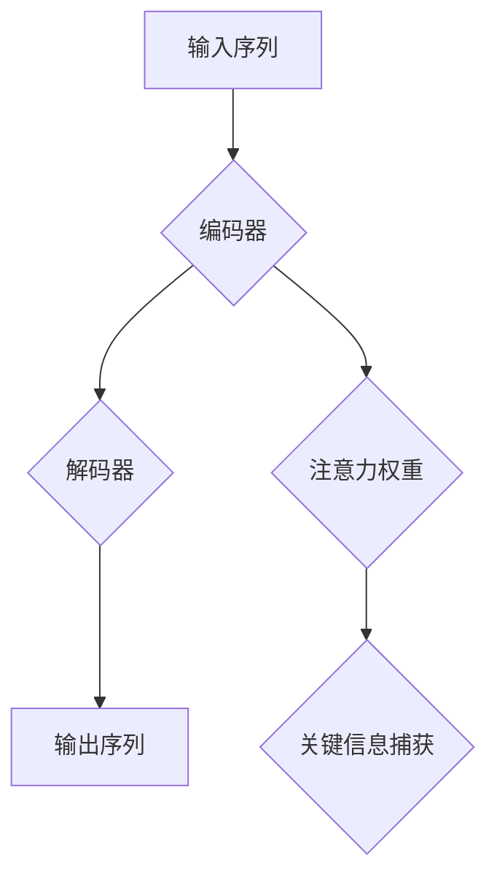
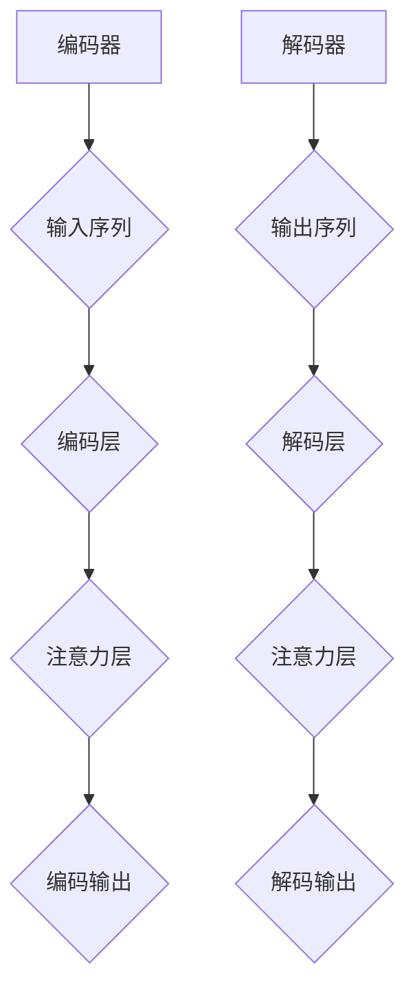

                 

## 文章标题：大规模语言模型从理论到实践 实践思考

### 关键词：大规模语言模型，自然语言处理，深度学习，算法优化，项目实战

### 摘要：

本文旨在深入探讨大规模语言模型的原理、算法和实践。首先，我们概述了大规模语言模型的定义和特点，详细介绍了其核心算法，包括词嵌入、序列模型与注意力机制、转换器架构。随后，本文通过具体的项目实战，展示了大规模语言模型在文本分类、机器翻译、问答系统等任务中的应用。此外，文章还讨论了大规模语言模型的优化方法，包括梯度下降优化和模型调优技巧。最后，我们对大规模语言模型的挑战和未来机遇进行了展望，并提供了相关开发工具和资源。通过本文的阅读，读者将全面了解大规模语言模型的理论和实践，为未来的研究和应用打下坚实基础。

---

### 第一部分：大规模语言模型概述

#### 第1章：大规模语言模型的定义与特点

##### 1.1 大规模语言模型的定义

大规模语言模型（Large-scale Language Model，简称LLM）是一种基于深度学习技术的自然语言处理模型。与传统语言模型相比，大规模语言模型具有显著的参数规模和训练数据量优势。通过学习海量的文本数据，大规模语言模型能够捕捉到复杂的语言结构和语义信息，从而在语言理解和生成任务中表现出色。

##### 1.2 大规模语言模型的特点

1. **数据量巨大**：

   大规模语言模型通常需要数十亿甚至数万亿个参数，以存储和表示复杂的语言模式。这些参数的规模使得模型能够学习到丰富的语言特征，从而在语言理解、文本生成等任务中表现出色。

2. **自适应性**：

   大规模语言模型通过预训练和微调，可以适应各种语言任务。预训练阶段，模型在大规模语料库上学习语言的一般特征；微调阶段，模型针对特定任务进行参数调整，从而实现任务优化。

3. **语言理解能力**：

   大规模语言模型具备较强的语言理解能力，能够理解语言的结构、语义和上下文。这使得模型在问答系统、文本生成等任务中能够生成准确、连贯的文本。

#### 第2章：大规模语言模型的核心算法

##### 2.1 词嵌入技术

词嵌入（Word Embedding）是一种将词汇映射为高维向量表示的技术。通过词嵌入，大规模语言模型可以学习词汇之间的语义关系，从而更好地理解语言。

- **One-hot编码**：一种简单的词嵌入方法，将词汇映射为稀疏向量。然而，该方法存在维度灾难问题，即向量维度极高，导致存储和计算效率低下。

- **词袋模型（Bag-of-Words）**：将文本表示为词汇的集合，忽略词汇的顺序信息。词袋模型虽然简化了文本表示，但未能捕捉到词汇之间的语义关系。

- **词嵌入技术**：通过将词汇映射为稠密向量，词嵌入技术能够捕捉词汇之间的语义关系。常见的词嵌入方法包括Word2Vec、GloVe等。

  ```mermaid
  graph TD
  A[词嵌入技术] --> B[Word2Vec]
  A --> C[GloVe]
  B --> D{稠密向量表示}
  C --> D
  ```

##### 2.2 序列模型与注意力机制

序列模型（Sequential Model）是一种用于处理序列数据的模型，如自然语言文本。常见的序列模型包括循环神经网络（RNN）和长短期记忆网络（LSTM）。

- **循环神经网络（RNN）**：RNN能够处理序列数据，但存在梯度消失和梯度爆炸问题，导致训练困难。

- **长短期记忆网络（LSTM）**：LSTM通过门控机制解决了RNN的梯度消失问题，提高了序列模型的训练效果。

注意力机制（Attention Mechanism）是一种用于捕捉文本序列中关键信息的技术。通过注意力机制，模型能够关注重要的上下文信息，从而提高语言理解能力。



##### 2.3 转换器架构

转换器架构（Transformer Architecture）是一种基于注意力机制的序列到序列模型。与传统的循环神经网络相比，转换器架构具有更高的并行计算能力，从而提高了训练效率。

转换器架构包括编码器（Encoder）和解码器（Decoder）两部分。编码器用于处理输入序列，解码器用于生成输出序列。



---

### 第二部分：大规模语言模型的实践

#### 第3章：大规模语言模型的项目实战

##### 3.1 项目实战1：文本分类

**任务描述**：文本分类（Text Classification）是一种常见的自然语言处理任务，其目标是根据文本内容将其分类到预定义的类别中。例如，将新闻文本分类为体育、娱乐、科技等类别。

**算法实现**：

1. **数据预处理**：对文本数据进行清洗和分词，将文本表示为词向量。
2. **词嵌入**：使用预训练的词嵌入模型（如Word2Vec、GloVe）将词汇映射为高维向量。
3. **模型构建**：使用转换器架构构建文本分类模型，包括编码器和解码器。
4. **训练**：使用标记数据进行模型训练，优化模型参数。
5. **评估**：使用未标记的数据进行模型评估，计算分类准确率、召回率等指标。

```python
# 数据预处理
def preprocess_text(text):
    # 清洗文本
    text = text.lower()
    text = re.sub(r"[^a-zA-Z0-9]", " ", text)
    return text

# 词嵌入
word2vec = Word2Vec.load("word2vec.model")
vocab = word2vec.wv

# 模型构建
encoder = Encoder(vocab.size(), hidden_size=512)
decoder = Decoder(vocab.size(), hidden_size=512)
model = TransformerModel(encoder, decoder)

# 训练
optimizer = optim.Adam(model.parameters(), lr=0.001)
for epoch in range(num_epochs):
    for text, label in train_loader:
        model.zero_grad()
        output = model(text, label)
        loss = loss_fn(output, label)
        loss.backward()
        optimizer.step()

# 评估
with torch.no_grad():
    correct = 0
    total = 0
    for text, label in test_loader:
        output = model(text, label)
        predicted = torch.argmax(output, dim=1)
        total += label.size(0)
        correct += (predicted == label).sum().item()

print(f"Accuracy: {100 * correct / total}%")
```

##### 3.2 项目实战2：机器翻译

**任务描述**：机器翻译（Machine Translation）是一种将一种语言的文本翻译成另一种语言的自然语言处理任务。例如，将英文文本翻译成中文文本。

**算法实现**：

1. **数据预处理**：对文本数据进行清洗和分词，将文本表示为词向量。
2. **词嵌入**：使用预训练的词嵌入模型（如Word2Vec、GloVe）将词汇映射为高维向量。
3. **模型构建**：使用转换器架构构建机器翻译模型，包括编码器和解码器。
4. **训练**：使用标记数据进行模型训练，优化模型参数。
5. **评估**：使用未标记的数据进行模型评估，计算翻译准确率、BLEU等指标。

```python
# 数据预处理
def preprocess_text(text):
    # 清洗文本
    text = text.lower()
    text = re.sub(r"[^a-zA-Z0-9]", " ", text)
    return text

# 词嵌入
word2vec = Word2Vec.load("word2vec.model")
vocab = word2vec.wv

# 模型构建
encoder = Encoder(vocab.size(), hidden_size=512)
decoder = Decoder(vocab.size(), hidden_size=512)
model = TransformerModel(encoder, decoder)

# 训练
optimizer = optim.Adam(model.parameters(), lr=0.001)
for epoch in range(num_epochs):
    for text, target in train_loader:
        model.zero_grad()
        output = model(text, target)
        loss = loss_fn(output, target)
        loss.backward()
        optimizer.step()

# 评估
with torch.no_grad():
    correct = 0
    total = 0
    for text, target in test_loader:
        output = model(text, target)
        predicted = torch.argmax(output, dim=1)
        total += target.size(0)
        correct += (predicted == target).sum().item()

print(f"Accuracy: {100 * correct / total}%")
```

##### 3.3 项目实战3：问答系统

**任务描述**：问答系统（Question Answering System）是一种根据用户的问题从大量文本中检索并生成答案的自然语言处理任务。例如，搜索引擎、智能客服等。

**算法实现**：

1. **数据预处理**：对文本数据进行清洗和分词，将文本表示为词向量。
2. **词嵌入**：使用预训练的词嵌入模型（如Word2Vec、GloVe）将词汇映射为高维向量。
3. **模型构建**：使用转换器架构结合检索算法构建问答系统模型。
4. **训练**：使用标记数据进行模型训练，优化模型参数。
5. **评估**：使用未标记的数据进行模型评估，计算答案准确率、F1等指标。

```python
# 数据预处理
def preprocess_text(text):
    # 清洗文本
    text = text.lower()
    text = re.sub(r"[^a-zA-Z0-9]", " ", text)
    return text

# 词嵌入
word2vec = Word2Vec.load("word2vec.model")
vocab = word2vec.wv

# 模型构建
encoder = Encoder(vocab.size(), hidden_size=512)
decoder = Decoder(vocab.size(), hidden_size=512)
model = TransformerModel(encoder, decoder)

# 训练
optimizer = optim.Adam(model.parameters(), lr=0.001)
for epoch in range(num_epochs):
    for question, answer in train_loader:
        model.zero_grad()
        output = model(question, answer)
        loss = loss_fn(output, answer)
        loss.backward()
        optimizer.step()

# 评估
with torch.no_grad():
    correct = 0
    total = 0
    for question, answer in test_loader:
        output = model(question, answer)
        predicted = torch.argmax(output, dim=1)
        total += answer.size(0)
        correct += (predicted == answer).sum().item()

print(f"Accuracy: {100 * correct / total}%")
```

---

### 第三部分：大规模语言模型的优化与调优

#### 第4章：大规模语言模型的优化方法

##### 4.1 梯度下降优化

梯度下降（Gradient Descent）是一种用于优化模型参数的常用方法。其基本思想是通过计算损失函数关于模型参数的梯度，沿着梯度的反方向更新参数，以最小化损失函数。

- **基本原理**：

  梯度下降方法通过迭代更新模型参数，具体步骤如下：

  ```math
  \text{对于每个参数} \theta_{j}:
  \theta_{j} \leftarrow \theta_{j} - \alpha \cdot \nabla_{\theta_{j}} J(\theta)
  ```

  其中，\( \alpha \) 为学习率，\( \nabla_{\theta_{j}} J(\theta) \) 为损失函数关于参数 \( \theta_{j} \) 的梯度。

- **优化算法**：

  - **随机梯度下降（Stochastic Gradient Descent，SGD）**：每次迭代仅随机选取一个样本计算梯度，从而加快收敛速度。

    ```math
    \theta_{j} \leftarrow \theta_{j} - \alpha \cdot \nabla_{\theta_{j}} J(\theta; x^{(i)}, y^{(i)})
    ```

  - **Adam优化算法**：结合SGD和动量项，能够更好地处理稀疏数据和局部最小值问题。

    ```math
    m_{t} = \beta_{1} m_{t-1} + (1 - \beta_{1}) \nabla_{\theta} J(\theta; x^{(i)}, y^{(i)})
    v_{t} = \beta_{2} v_{t-1} + (1 - \beta_{2}) (\nabla_{\theta} J(\theta; x^{(i)}, y^{(i)})^2)
    \theta_{t} = \theta_{t-1} - \alpha \frac{m_{t}}{\sqrt{v_{t}} + \epsilon}
    ```

##### 4.2 模型调优技巧

1. **超参数调优**：

   超参数（Hyperparameters）是模型中不易通过梯度下降优化调整的参数，如学习率、批量大小、隐藏层大小等。超参数的选择对模型性能有重要影响。常用的超参数调优方法包括：

   - **网格搜索（Grid Search）**：在预定义的超参数网格中遍历所有可能的组合，选择最佳组合。
   - **随机搜索（Random Search）**：从超参数空间中随机选择一组参数，重复多次，选择最佳组合。
   - **贝叶斯优化（Bayesian Optimization）**：基于概率模型进行超参数搜索，能够更快地找到最优超参数。

2. **模型压缩与加速**：

   随着大规模语言模型的参数规模不断扩大，模型的存储和计算需求也显著增加。为了应对这一挑战，可以采用以下方法进行模型压缩与加速：

   - **剪枝（Pruning）**：通过移除模型中不重要的连接和神经元，降低模型大小和计算需求。
   - **量化（Quantization）**：将模型中的浮点数权重转换为低精度的整数表示，降低存储和计算需求。
   - **蒸馏（Distillation）**：使用大型预训练模型指导小型模型的学习，将大型模型的知识转移到小型模型中。

---

### 第四部分：大规模语言模型的未来展望

#### 第5章：大规模语言模型的挑战与机遇

##### 5.1 面临的挑战

1. **数据隐私**：

   大规模语言模型通常需要训练大量的用户数据，这可能导致数据隐私问题。为了保护用户隐私，可以采用以下方法：

   - **数据去识别化**：对用户数据进行匿名化处理，消除个人识别信息。
   - **差分隐私（Differential Privacy）**：在训练过程中引入噪声，确保模型对单个用户数据的依赖性降低。

2. **计算资源消耗**：

   大规模语言模型的训练和推理过程需要大量的计算资源。为了降低计算资源消耗，可以采用以下方法：

   - **分布式训练**：将训练任务分布在多台机器上，提高训练效率。
   - **模型压缩与加速**：采用模型压缩技术，降低模型大小和计算需求。

##### 5.2 未来的机遇

1. **跨模态学习**：

   跨模态学习（Cross-modal Learning）是一种将文本、图像、声音等多种模态进行融合的方法。通过跨模态学习，可以实现对多模态数据的更好理解和生成。

   - **文本-图像生成**：将文本描述生成相应的图像。
   - **文本-声音生成**：将文本描述生成相应的声音。

2. **通用预训练模型**：

   通用预训练模型（General Pre-trained Model）是一种可以适用于多种任务的预训练模型。通过通用预训练模型，可以降低模型在不同任务上的调优成本，提高模型的应用范围。

   - **多任务学习**：将多个任务共同训练，提高模型的泛化能力。
   - **迁移学习**：将预训练模型的知识迁移到新的任务上，减少模型调优需求。

---

### 附录

#### 附录 A：大规模语言模型开发工具与资源

1. **主流深度学习框架**：

   - **TensorFlow**：谷歌开发的开源深度学习框架，提供丰富的API和工具。
   - **PyTorch**：基于Python的深度学习框架，具有灵活的动态计算图。
   - **TensorFlow 2.x**：TensorFlow的升级版本，简化了API，提高了使用体验。

2. **开源预训练模型**：

   - **GPT**：基于转换器架构的预训练语言模型，具有强大的语言理解和生成能力。
   - **BERT**：基于转换器架构的预训练语言模型，能够提高文本分类、问答等任务的性能。
   - **RoBERTa**：基于BERT的改进版本，通过调整训练策略和网络结构，提高了性能。

3. **参考书籍与论文**：

   - **《深度学习》（Goodfellow, Bengio, Courville）**：深度学习的经典教材，详细介绍了深度学习的基本概念和方法。
   - **《自然语言处理综论》（Jurafsky, Martin）**：自然语言处理的经典教材，涵盖了自然语言处理的基本理论和应用。
   - **《Attention Is All You Need》（Vaswani et al.）**：介绍了转换器架构的原理和应用，是大规模语言模型的重要论文。

---

### 作者信息

作者：AI天才研究院/AI Genius Institute & 禅与计算机程序设计艺术 /Zen And The Art of Computer Programming

---

本文从大规模语言模型的定义和特点入手，详细介绍了其核心算法，并通过具体项目实战展示了其在文本分类、机器翻译、问答系统等任务中的应用。此外，文章还讨论了大规模语言模型的优化方法，包括梯度下降优化和模型调优技巧。最后，文章展望了大规模语言模型的未来挑战与机遇，并提供了相关开发工具和资源。通过本文的阅读，读者将全面了解大规模语言模型的理论和实践，为未来的研究和应用打下坚实基础。

