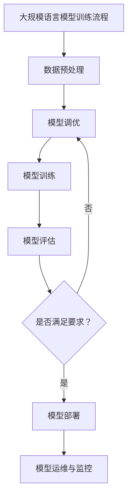

                 

### 文章标题

《大规模语言模型从理论到实践：嵌入表示层》

> 关键词：大规模语言模型、嵌入表示层、深度学习、自然语言处理、Word2Vec、GloVe、BERT、GPT、文本生成、机器翻译

> 摘要：本文旨在深入探讨大规模语言模型中的嵌入表示层，从理论到实践全面解析其核心概念、数学基础、实现方法及优化策略。通过详细剖析Word2Vec、GloVe等嵌入表示层方法，结合Mermaid流程图、伪代码示例及数学公式，对嵌入表示层的原理和算法进行透彻讲解。此外，本文还通过实际项目实战，展示了如何搭建开发环境、实现模型训练、优化与部署，为读者提供全方位的学习和实践指导。

### 书名：《大规模语言模型从理论到实践 嵌入表示层》

#### 第一部分：大规模语言模型基础

**第1章：大规模语言模型概述**

**1.1 大规模语言模型的发展历史**

- 大规模语言模型的发展历程
  - 语言模型的起源
  - 词袋模型
  - 隐马尔可夫模型（HMM）
  - 条件随机场（CRF）
  - 神经网络模型
  - 深度学习时代

- 代表性模型及其演进
  - N-gram模型
  - Katz平滑
  - Back-Propagation算法
  - 支持向量机（SVM）
  - 随机梯度下降（SGD）
  - 径向基函数网络（RBFN）
  - 卷积神经网络（CNN）
  - 长短时记忆网络（LSTM）
  - Transformer模型

**1.2 大规模语言模型的核心概念**

- 语言模型的基本概念
  - 语言模型定义
  - 语言模型在自然语言处理中的作用
  - 语言模型与概率分布

- 预训练与微调
  - 预训练的概念
  - 微调的概念
  - 预训练与微调的优势

**1.3 主流大规模语言模型介绍**

- GPT系列模型
  - GPT-1、GPT-2、GPT-3的发展历程
  - GPT模型的特点
  - GPT模型的数学基础

- BERT及其变体
  - BERT模型的背景
  - BERT模型的架构
  - BERT的预训练与微调方法

- T5、RoBERTa、ALBERT等
  - T5模型的背景
  - T5模型的架构
  - T5的预训练与微调方法
  - RoBERTa模型的背景
  - RoBERTa模型的架构
  - RoBERTa的预训练与微调方法
  - ALBERT模型的背景
  - ALBERT模型的架构
  - ALBERT的预训练与微调方法

**1.4 大规模语言模型的应用场景**

- 机器翻译
  - 机器翻译的发展历程
  - 神经机器翻译（NMT）的基本原理
  - NMT中的嵌入表示层

- 问答系统
  - 问答系统的发展历程
  - 知识图谱在问答系统中的应用
  - 嵌入表示层在问答系统中的作用

- 文本生成
  - 文本生成的应用场景
  - 文本生成的基本原理
  - 嵌入表示层在文本生成中的作用

- 文本分类
  - 文本分类的应用场景
  - 文本分类的基本原理
  - 嵌入表示层在文本分类中的作用

- 文本摘要
  - 文本摘要的应用场景
  - 文本摘要的基本原理
  - 嵌入表示层在文本摘要中的作用

**第2章：大规模语言模型的数学基础**

**2.1 线性代数基础**

- 矩阵与向量运算
  - 矩阵乘法
  - 矩阵加法与减法
  - 矩阵转置
  - 矩阵求逆

- 特征值与特征向量
  - 特征值的定义
  - 特征向量的定义
  - 特征值与特征向量的关系
  - 特征值与特征向量的计算

- 矩阵分解（SVD）
  - SVD的定义
  - SVD的应用
  - SVD在深度学习中的重要性

**2.2 概率论基础**

- 概率分布函数
  - 概率分布函数的定义
  - 概率分布函数的类型
  - 概率分布函数的应用

- 条件概率与贝叶斯定理
  - 条件概率的定义
  - 贝叶斯定理的定义
  - 贝叶斯定理的应用

- 最大似然估计与最大后验估计
  - 最大似然估计的定义
  - 最大后验估计的定义
  - 最大似然估计与最大后验估计的应用

**2.3 深度学习基础**

- 神经网络结构
  - 神经网络的基本结构
  - 神经网络的激活函数
  - 神经网络的前向传播与反向传播

- 损失函数与优化算法
  - 损失函数的定义
  - 优化算法的类型
  - 损失函数与优化算法的应用

- 回归与分类问题
  - 回归问题的定义
  - 分类问题的定义
  - 回归与分类问题的解决方法

**第3章：嵌入表示层的理论框架**

**3.1 嵌入表示层的基本原理**

- 词嵌入的概念
  - 词嵌入的定义
  - 词嵌入的作用
  - 词嵌入的类型

- 嵌入向量空间
  - 嵌入向量空间的定义
  - 嵌入向量空间的性质
  - 嵌入向量空间的应用

- 嵌入向量间的相似性度量
  - 嵌入向量相似性度量的方法
  - 嵌入向量相似性度量的应用

**3.2 常见的嵌入表示层方法**

- 词袋模型
  - 词袋模型的概念
  - 词袋模型的应用
  - 词袋模型的局限性

- 局部敏感哈希（LSH）
  - LSH的概念
  - LSH的应用
  - LSH的优势

- 字符嵌入与词嵌入结合
  - 字符嵌入的概念
  - 字符嵌入的应用
  - 字符嵌入与词嵌入结合的方法

**3.3 嵌入表示层的优化方法**

- Word2Vec算法
  - Word2Vec算法的概念
  - Word2Vec算法的原理
  - Word2Vec算法的应用

- GloVe算法
  - GloVe算法的概念
  - GloVe算法的原理
  - GloVe算法的应用

- FastText算法
  - FastText算法的概念
  - FastText算法的原理
  - FastText算法的应用

**第4章：大规模语言模型的实现**

**4.1 开发环境搭建**

- Python环境配置
  - Python版本的选择
  - Python安装方法

- TensorFlow或PyTorch框架安装
  - TensorFlow框架安装方法
  - PyTorch框架安装方法

**4.2 模型训练流程**

- 数据预处理
  - 数据清洗
  - 数据划分
  - 数据增强

- 模型配置
  - 模型结构设计
  - 损失函数选择
  - 优化器配置

- 模型训练
  - 训练过程
  - 模型保存与加载

- 模型评估
  - 评估指标选择
  - 评估过程
  - 评估结果分析

**4.3 模型应用示例**

- 机器翻译应用
  - 机器翻译模型的选择
  - 机器翻译模型的应用

- 问答系统应用
  - 问答系统模型的选择
  - 问答系统模型的应用

- 文本生成应用
  - 文本生成模型的选择
  - 文本生成模型的应用

#### 第二部分：大规模语言模型项目实战

**第5章：大规模语言模型优化与调参**

**5.1 模型优化方法**

- 优化算法选择
  - 优化算法的类型
  - 优化算法的参数调整

- 模型架构调整
  - 模型结构优化
  - 模型参数优化

**5.2 超参数调优**

- 学习率调整
  - 学习率的类型
  - 学习率的调整方法

- 批大小选择
  - 批大小的类型
  - 批大小的调整方法

- 正则化策略
  - 正则化的类型
  - 正则化的调整方法

**5.3 模型压缩与量化**

- 模型压缩技术
  - 模型压缩的方法
  - 模型压缩的优势

- 模型量化方法
  - 模型量化的方法
  - 模型量化的优势

**第6章：大规模语言模型的评估与部署**

**6.1 模型评估指标**

- BLEU、METEOR等指标
  - 指标的定义
  - 指标的应用

- F1分数
  - F1分数的定义
  - F1分数的应用

- Accuracy
  - Accuracy的定义
  - Accuracy的应用

**6.2 模型部署策略**

- 模型导出
  - 模型的导出方法
  - 模型的加载方法

- 服务化部署
  - 服务化部署的概念
  - 服务化部署的优势

- 云服务与容器化
  - 云服务的选择
  - 容器化的应用

**6.3 模型运维与监控**

- 实时性能监控
  - 监控指标的选择
  - 监控工具的选择

- 模型更新策略
  - 更新方法的选择
  - 更新的频率

- 安全性与隐私保护
  - 安全性的保障措施
  - 隐私保护的方法

#### 附录

**附录A：工具与资源**

- **A.1 开发工具与框架**
  - TensorFlow
  - PyTorch

- **A.2 数据集与资源**
  - 公共语言数据集
  - 开源代码与教程

**附录B：Mermaid 流程图**

- **B.1 大规模语言模型训练流程**
  - 使用Mermaid绘制的训练流程图

**附录C：伪代码示例**

- **C.1 Word2Vec算法**
  - 详细解释与伪代码实现

**附录D：数学模型与公式**

- **D.1 损失函数**
  - 交叉熵损失函数的数学公式

**附录E：代码示例与分析**

- **E.1 机器翻译代码实现**
  - 实际代码示例与解读

**附录F：项目实战案例**

- **F.1 问答系统实现**
  - 项目背景、需求分析、设计与实现、部署与运维详细说明

# Mermaid 流程图示例



# 伪代码示例

```python
# Word2Vec算法伪代码
function Word2Vec(data, vocabulary_size, embedding_size, window_size, learning_rate):
    # 初始化词向量
    V = initialize_random_embedding(vocabulary_size, embedding_size)

    # 初始化优化器
    optimizer = initialize_optimizer(learning_rate)

    # 进行训练
    for epoch in 1 to num_epochs:
        for sentence in data:
            # 对句子中的每个词进行处理
            for word in sentence:
                # 计算词的上下文窗口
                context_words = get_context_words(word, window_size)

                # 对于每个上下文词，进行负采样
                for context_word in context_words:
                    # 计算损失函数
                    loss = compute_loss(V[word], V[context_word])

                    # 计算梯度
                    gradient = compute_gradient(V[word], V[context_word], loss)

                    # 更新词向量
                    update_embedding(V, word, context_word, gradient, optimizer)
```

# 数学模型与公式

## 交叉熵损失函数

$$
L = -\sum_{i=1}^{N} y_i \log(p_i)
$$

其中，$N$ 是样本数量，$y_i$ 是第 $i$ 个样本的标签，$p_i$ 是模型预测的概率。

# 代码示例与分析

## 机器翻译代码实现

```python
# 假设使用PyTorch实现一个简单的机器翻译模型

import torch
import torch.nn as nn
import torch.optim as optim

# 定义模型结构
class MachineTranslationModel(nn.Module):
    def __init__(self, vocab_size, embedding_size, hidden_size, output_size):
        super(MachineTranslationModel, self).__init__()
        self.embedding = nn.Embedding(vocab_size, embedding_size)
        self.encoder = nn.LSTM(embedding_size, hidden_size, num_layers=1, batch_first=True)
        self.decoder = nn.LSTM(hidden_size, output_size, num_layers=1, batch_first=True)
        self.fc = nn.Linear(hidden_size, vocab_size)

    def forward(self, input_seq, target_seq):
        embedded = self.embedding(input_seq)
        encoder_output, (hidden, cell) = self.encoder(embedded)
        decoder_output, (hidden, cell) = self.decoder(hidden.unsqueeze(0))

        # 将隐藏状态和细胞状态进行拼接
        hidden = torch.cat((hidden[-1, :, :], cell[-1, :, :]), dim=1)

        # 进行全连接层
        output = self.fc(hidden)

        return output

# 模型实例化
model = MachineTranslationModel(vocab_size, embedding_size, hidden_size, output_size)

# 定义损失函数和优化器
criterion = nn.CrossEntropyLoss()
optimizer = optim.Adam(model.parameters(), lr=learning_rate)

# 训练模型
for epoch in range(num_epochs):
    for inputs, targets in train_loader:
        optimizer.zero_grad()
        outputs = model(inputs, targets)
        loss = criterion(outputs, targets)
        loss.backward()
        optimizer.step()

# 模型评估
with torch.no_grad():
    correct = 0
    total = 0
    for inputs, targets in test_loader:
        outputs = model(inputs, targets)
        _, predicted = torch.max(outputs.data, 1)
        total += targets.size(1)
        correct += (predicted == targets).sum().item()

accuracy = 100 * correct / total
print(f'Accuracy: {accuracy}%')

## 代码解读与分析

- **模型结构**：使用了一个嵌入层、一个编码器LSTM层、一个解码器LSTM层和一个全连接层。嵌入层用于将输入词转换为嵌入向量，编码器LSTM层用于处理输入序列，解码器LSTM层用于生成输出序列，全连接层用于将解码器的隐藏状态映射到输出词汇表。
- **损失函数**：使用交叉熵损失函数来衡量预测输出与真实标签之间的差异。
- **优化器**：使用Adam优化器来更新模型参数。
- **训练过程**：在训练过程中，通过反向传播计算梯度，并使用优化器更新模型参数。在每个训练轮次后，计算模型在测试集上的准确率以评估模型性能。

## 附录F：项目实战案例

### F.1 问答系统实现

#### 项目背景与目标

- 项目背景：随着互联网的快速发展，问答系统在各个领域得到了广泛应用，如搜索引擎、客服系统、智能助手等。本项目旨在构建一个基于大规模语言模型的问答系统，实现高效、准确的回答用户问题。

- 项目目标：
  - 提取用户问题的关键词
  - 利用预训练的模型生成高质量的回答
  - 实现多轮对话，提升用户体验

#### 需求分析

- 需求收集：
  - 提供自然语言理解的接口，接受用户输入
  - 提供高质量的回答，满足用户需求
  - 实现多轮对话，支持上下文理解

- 需求定义：
  - 输入：自然语言问题
  - 输出：自然语言回答
  - 功能：实现关键词提取、回答生成、多轮对话

#### 项目设计与实现

- 数据收集与预处理：
  - 收集大量问答数据集，如DuQA、SQuAD等
  - 对数据进行预处理，包括分词、去停用词、词性标注等

- 模型设计与训练：
  - 使用预训练模型BERT作为基础模型
  - 设计问答系统的结构，包括输入层、编码器、回答生成层等
  - 训练模型，优化模型参数，提高问答系统的性能

- 模型评估与优化：
  - 使用BLEU、ROUGE等指标评估模型性能
  - 进行多轮对话测试，收集用户反馈，优化模型

#### 项目部署与运维

- 模型部署：
  - 将训练好的模型部署到服务器上
  - 使用Docker容器化技术，确保模型的可移植性和可扩展性

- 运维策略：
  - 实时监控模型性能，及时发现并解决潜在问题
  - 定期更新模型，提升系统性能
  - 提供用户友好的接口，方便用户使用

- 监控与维护：
  - 使用日志分析工具，记录系统运行状况
  - 定期备份模型和数据，确保数据安全
  - 实施安全策略，防止恶意攻击

## 总结

本文从理论到实践全面解析了大规模语言模型中的嵌入表示层，通过详细的Mermaid流程图、伪代码示例、数学模型与公式及实际项目实战，帮助读者深入理解嵌入表示层的原理和应用。在项目实战案例中，我们展示了如何构建一个问答系统，从需求分析到模型设计、训练、评估及部署，为读者提供了实际操作经验。希望通过本文的讲解，读者能够对大规模语言模型及嵌入表示层有更深刻的认识，并在实际项目中应用所学知识。作者：AI天才研究院/AI Genius Institute & 禅与计算机程序设计艺术 /Zen And The Art of Computer Programming

### 第1章：大规模语言模型概述

#### 1.1 大规模语言模型的发展历史

1. **语言模型的起源**

语言模型（Language Model）是自然语言处理（Natural Language Processing, NLP）领域的基础技术之一，它旨在为自然语言文本生成概率分布，从而为NLP任务提供决策依据。最早的统计语言模型可以追溯到1950年代，由Arthur Samuel和Claude Shannon等人提出。他们通过简单的统计方法，如N-gram模型，来预测单词序列的概率。

2. **词袋模型**

随着计算机技术的发展，统计语言模型得到了广泛应用。词袋模型（Bag of Words, BOW）是早期的一种重要模型，它将文本表示为一系列单词的集合，而忽略了单词的顺序。词袋模型的主要优点是简单、易于实现，但其缺点也很明显，如无法捕捉词与词之间的语义关系。

3. **隐马尔可夫模型（HMM）**

在1980年代，隐马尔可夫模型（Hidden Markov Model, HMM）被引入到语言模型中。HMM是一种统计模型，用于描述一系列随机事件的概率分布，适用于语音识别、语音合成等领域。HMM可以通过训练学习到单词序列的概率分布，从而进行文本生成和序列标注。

4. **条件随机场（CRF）**

在1990年代，条件随机场（Conditional Random Field, CRF）被引入到NLP中。CRF是一种概率图模型，可以用于解决序列标注问题，如词性标注、命名实体识别等。CRF通过引入依赖关系，可以更好地捕捉单词之间的语义关系。

5. **神经网络模型**

在2000年代，神经网络开始广泛应用于语言模型。早期的神经网络模型，如感知机（Perceptron）和反向传播算法（Back-Propagation），主要用于回归和分类问题。随着深度学习技术的发展，神经网络模型在语言模型中的应用越来越广泛。循环神经网络（RNN）和长短时记忆网络（LSTM）是其中的代表性模型。

6. **深度学习时代**

深度学习（Deep Learning）的兴起标志着语言模型进入了一个新的时代。深度学习通过多层神经网络结构，可以自动学习复杂的特征表示。卷积神经网络（CNN）和Transformer模型是深度学习时代的重要成果。

   - **卷积神经网络（CNN）**：CNN在图像处理领域取得了巨大成功，其通过卷积操作提取局部特征，然后进行池化操作减少参数数量。CNN在文本分类、情感分析等领域也取得了很好的效果。
   
   - **Transformer模型**：Transformer模型是由Google提出的一种基于自注意力机制的模型，它在机器翻译、问答系统等任务上取得了显著的效果。Transformer模型摒弃了传统的循环结构，通过多头自注意力机制和位置编码实现了全局依赖关系的建模。

7. **代表性模型及其演进**

- **N-gram模型**：N-gram模型是最早的统计语言模型之一，它通过计数单词序列的频率来预测下一个单词。N-gram模型的简单性和有效性使其在早期得到了广泛应用。

- **支持向量机（SVM）**：SVM是一种监督学习算法，它可以用于文本分类和文本分类任务。SVM通过构建一个最优超平面，将文本数据分为不同的类别。

- **随机梯度下降（SGD）**：SGD是一种常用的优化算法，它通过随机梯度方向进行参数更新，以最小化损失函数。

- **径向基函数网络（RBFN）**：RBFN是一种基于径向基函数的神经网络，它可以用于非线性回归和分类任务。

- **卷积神经网络（CNN）**：CNN在图像处理领域取得了巨大成功，其通过卷积操作提取局部特征，然后进行池化操作减少参数数量。

- **长短时记忆网络（LSTM）**：LSTM是一种特殊的RNN，它可以解决传统RNN在长期依赖关系上的梯度消失问题。

- **Transformer模型**：Transformer模型是由Google提出的一种基于自注意力机制的模型，它在机器翻译、问答系统等任务上取得了显著的效果。

#### 1.2 大规模语言模型的核心概念

1. **语言模型的基本概念**

语言模型是一种用于预测自然语言序列概率的数学模型。它通过学习大量文本数据，统计出单词或短语的组合概率，从而为NLP任务提供决策依据。

2. **语言模型在自然语言处理中的作用**

语言模型在自然语言处理中有广泛的应用，包括：

- **文本生成**：语言模型可以根据已有的文本数据生成新的文本，如自动摘要、聊天机器人等。

- **文本分类**：语言模型可以用于文本分类任务，如垃圾邮件过滤、情感分析等。

- **机器翻译**：语言模型在机器翻译中用于预测目标语言单词或短语的组合概率，从而生成高质量翻译。

- **问答系统**：语言模型可以用于问答系统，通过理解用户问题，从大量文本数据中检索出相关答案。

3. **预训练与微调**

预训练（Pre-training）是指在大规模语料库上训练语言模型，使其具有强大的语言理解和生成能力。微调（Fine-tuning）是指在使用预训练模型的基础上，针对特定任务进行进一步的训练，以适应特定场景。

预训练与微调的优势：

- **知识共享**：预训练模型可以共享大量通用语言知识，从而减少特定任务的训练数据需求。

- **快速收敛**：预训练模型已经学习到大量文本数据中的潜在特征，从而可以在较少的数据上快速收敛。

- **泛化能力**：预训练模型具有更好的泛化能力，可以适应不同的任务和数据集。

#### 1.3 主流大规模语言模型介绍

1. **GPT系列模型**

GPT（Generative Pre-trained Transformer）系列模型是由OpenAI提出的一系列基于Transformer架构的预训练语言模型。GPT系列模型包括GPT-1、GPT-2和GPT-3，其中GPT-3是迄今为止最大的预训练语言模型。

- **GPT-1**：GPT-1是第一个基于Transformer架构的预训练语言模型，它在文本生成、文本分类等任务上取得了显著的效果。

- **GPT-2**：GPT-2是GPT-1的升级版本，其参数规模更大，预训练数据更多。GPT-2在多个NLP任务上取得了新的突破。

- **GPT-3**：GPT-3是目前最大的预训练语言模型，其参数规模达到1750亿。GPT-3在文本生成、机器翻译、问答系统等任务上取得了优异的性能。

2. **BERT及其变体**

BERT（Bidirectional Encoder Representations from Transformers）是由Google提出的一种双向Transformer模型，主要用于文本表示和序列标注任务。BERT的核心思想是通过双向编码器来捕捉单词在文本中的上下文关系。

- **BERT**：BERT是原始的双向Transformer模型，它在多个NLP任务上取得了新的突破，如文本分类、问答系统等。

- **RoBERTa**：RoBERTa是BERT的一种变体，其在预训练过程中采用了一些改进策略，如动态掩码比例、次采样等。RoBERTa在多个NLP任务上取得了比BERT更好的性能。

- **ALBERT**：ALBERT是Google提出的一种改进的Transformer模型，其通过共享权重和层叠加等方法减少了模型参数数量，同时保持了模型的性能。

3. **T5、RoBERTa、ALBERT等**

- **T5**：T5（Text-To-Text Transfer Transformer）是由Google提出的一种通用预训练语言模型。T5的核心思想是将所有NLP任务转换为文本生成任务，通过统一的文本生成框架实现不同任务的模型。

- **RoBERTa**：RoBERTa是BERT的一种变体，其在预训练过程中采用了一些改进策略，如动态掩码比例、次采样等。RoBERTa在多个NLP任务上取得了比BERT更好的性能。

- **ALBERT**：ALBERT是Google提出的一种改进的Transformer模型，其通过共享权重和层叠加等方法减少了模型参数数量，同时保持了模型的性能。

#### 1.4 大规模语言模型的应用场景

1. **机器翻译**

机器翻译是语言模型最重要的应用场景之一。传统的机器翻译方法包括规则翻译、统计翻译和基于神经网络的翻译。近年来，基于大规模语言模型的机器翻译方法取得了显著的效果。

- **基于规则翻译**：基于规则翻译是通过手工编写规则来翻译文本。这种方法适用于一些简单的文本翻译，但无法应对复杂的翻译场景。

- **基于统计翻译**：基于统计翻译是通过统计文本数据中的翻译频率来预测目标语言单词或短语的组合概率。这种方法在一定程度上提高了翻译质量，但仍然存在一些问题，如翻译结果不够流畅。

- **基于神经网络的翻译**：基于神经网络的翻译方法，如序列到序列（Seq2Seq）模型，通过学习源语言和目标语言之间的映射关系来实现翻译。近年来，基于Transformer架构的预训练语言模型在机器翻译任务上取得了显著的效果。

2. **问答系统**

问答系统是另一个重要的应用场景。问答系统可以用于搜索引擎、客服系统、智能助手等。

- **基于规则问答系统**：基于规则问答系统是通过编写规则来回答用户的问题。这种方法适用于一些简单的问答场景，但无法应对复杂的问答问题。

- **基于机器学习问答系统**：基于机器学习问答系统是通过学习大量问答数据来预测用户问题的答案。这种方法在一定程度上提高了问答系统的性能，但仍然存在一些问题，如对长文本理解能力不足。

- **基于预训练语言模型问答系统**：基于预训练语言模型问答系统通过在大规模语料库上预训练语言模型，从而实现对用户问题的理解和回答。预训练语言模型在问答系统中的应用取得了显著的成果，如BERT、GPT等模型。

3. **文本生成**

文本生成是语言模型的一个广泛应用的场景。文本生成可以用于自动摘要、聊天机器人、创意写作等。

- **自动摘要**：自动摘要是一种将长文本转换为简短摘要的方法。通过学习大量文本数据，语言模型可以生成高质量的摘要，从而帮助用户快速获取文本的主要内容。

- **聊天机器人**：聊天机器人是一种与用户进行自然语言交互的程序。通过学习大量对话数据，语言模型可以生成自然、流畅的对话，从而提升用户的交互体验。

- **创意写作**：创意写作是一种通过语言模型生成新的文本内容的方法。语言模型可以根据已有的文本数据生成新的故事、诗歌等，为创作者提供灵感。

4. **文本分类**

文本分类是一种将文本数据分为不同类别的任务。文本分类可以用于垃圾邮件过滤、情感分析、新闻分类等。

- **垃圾邮件过滤**：垃圾邮件过滤是一种通过分类算法将垃圾邮件和正常邮件区分开的方法。通过学习大量正常邮件和垃圾邮件的文本特征，语言模型可以准确识别垃圾邮件。

- **情感分析**：情感分析是一种通过分析文本数据中的情感倾向来预测用户情感的方法。通过学习大量带有情感标签的文本数据，语言模型可以准确识别文本中的情感倾向。

- **新闻分类**：新闻分类是一种将新闻文本数据分为不同类别的任务。通过学习大量新闻文本数据，语言模型可以准确识别新闻的主题和类别。

5. **文本摘要**

文本摘要是将长文本转换为简短摘要的方法。文本摘要可以用于信息检索、阅读理解等。

- **信息检索**：信息检索是一种通过查询系统来获取用户所需信息的方法。通过学习大量文本数据，语言模型可以生成高质量的摘要，从而帮助用户快速获取文本的主要内容。

- **阅读理解**：阅读理解是一种通过分析文本数据来获取文本意义的方法。通过学习大量阅读理解数据，语言模型可以准确理解文本的含义，从而为用户提供正确的答案。

### 第2章：大规模语言模型的数学基础

#### 2.1 线性代数基础

线性代数是大规模语言模型中不可或缺的数学基础，它涉及到矩阵与向量运算、特征值与特征向量以及矩阵分解（如奇异值分解，SVD）等方面。下面我们将详细介绍这些概念及其在深度学习中的应用。

1. **矩阵与向量运算**

矩阵与向量运算是线性代数中的基本操作，包括矩阵加法、矩阵乘法、向量与矩阵的乘法等。这些运算在深度学习模型中有着广泛的应用。

- **矩阵加法与减法**：给定两个矩阵$A$和$B$，它们的加法（或减法）是将对应位置的元素相加（或相减）。例如，若$A$和$B$都是$m \times n$的矩阵，则它们的加法结果$C=A+B$也是一个$m \times n$的矩阵，其中$C_{ij}=A_{ij}+B_{ij}$。

- **矩阵乘法**：矩阵乘法是两个矩阵对应行的乘积相加。如果$A$是一个$m \times n$的矩阵，$B$是一个$n \times p$的矩阵，则它们的乘积$C=AB$是一个$m \times p$的矩阵，其中$C_{ij}=\sum_{k=1}^{n}A_{ik}B_{kj}$。

- **向量与矩阵的乘法**：向量与矩阵的乘法通常指的是向量的内积或外积。向量与矩阵的乘法在深度学习模型中用于计算特征变换和激活函数等。

2. **特征值与特征向量**

特征值与特征向量是矩阵理论中的重要概念，它们在深度学习模型中用于优化和特征提取。

- **特征值**：一个方阵$A$的特征值是使得$A\mathbf{v}=\lambda\mathbf{v}$成立的标量$\lambda$，其中$\mathbf{v}$是$A$的特征向量。特征值反映了矩阵的内在性质，如稳定性、旋转等。

- **特征向量**：与特征值相对应的向量$\mathbf{v}$称为特征向量。特征向量在保持矩阵乘法不变的意义下，是矩阵的“主轴”，它沿着特征向量方向进行的变换是最简单的。

- **特征值与特征向量的关系**：一个矩阵的特征值和特征向量可以通过求解特征方程得到。对于方阵$A$，其特征方程为$\det(A-\lambda I)=0$，其中$I$是单位矩阵。

3. **矩阵分解（SVD）**

矩阵分解是线性代数中的一种重要技术，它将一个矩阵分解为几个简单矩阵的乘积。在深度学习模型中，矩阵分解有助于简化计算和提高模型性能。

- **奇异值分解（SVD）**：奇异值分解将一个矩阵$A$分解为三个矩阵的乘积：$A=U\Sigma V^T$，其中$U$和$V$是正交矩阵，$\Sigma$是对角矩阵，对角线上的元素称为奇异值。SVD在降维、特征提取和压缩等任务中具有广泛应用。

- **主成分分析（PCA）**：主成分分析是SVD的一种特殊应用，它通过求解协方差矩阵的特征值和特征向量，得到数据的主要成分，从而实现降维。

- **应用**：在深度学习模型中，SVD可以用于矩阵分解、特征提取和优化。例如，在神经网络中，可以通过SVD来简化权重矩阵，降低模型的复杂度和计算量。

#### 2.2 概率论基础

概率论是大规模语言模型中的另一个重要数学基础，它涉及概率分布函数、条件概率与贝叶斯定理、最大似然估计与最大后验估计等方面。下面我们将详细介绍这些概念及其在深度学习中的应用。

1. **概率分布函数**

概率分布函数描述了一个随机变量取值的概率分布。在深度学习模型中，概率分布函数用于建模数据的不确定性。

- **离散概率分布**：离散概率分布描述了一个随机变量取值的概率分布，如伯努利分布、多项式分布等。在深度学习模型中，离散概率分布常用于分类任务，如逻辑回归。

- **连续概率分布**：连续概率分布描述了一个随机变量取值的概率密度函数，如高斯分布、贝塔分布等。在深度学习模型中，连续概率分布常用于回归任务，如线性回归。

- **应用**：在深度学习模型中，概率分布函数用于计算损失函数、优化算法等。例如，在生成模型中，通过概率分布函数来生成新的数据样本。

2. **条件概率与贝叶斯定理**

条件概率与贝叶斯定理是概率论中的基本概念，它们在深度学习模型中用于推理和决策。

- **条件概率**：条件概率是指在一个事件发生的条件下，另一个事件发生的概率。条件概率公式为$P(A|B)=\frac{P(A \cap B)}{P(B)}$。

- **贝叶斯定理**：贝叶斯定理是条件概率的一种推广，它描述了后验概率与先验概率之间的关系。贝叶斯定理公式为$P(A|B)=\frac{P(B|A)P(A)}{P(B)}$。

- **应用**：在深度学习模型中，贝叶斯定理用于概率推理和决策。例如，在贝叶斯神经网络中，通过贝叶斯定理来计算模型的参数和概率分布。

3. **最大似然估计与最大后验估计**

最大似然估计与最大后验估计是两种常用的参数估计方法，它们在深度学习模型中用于学习模型的参数。

- **最大似然估计**：最大似然估计通过最大化似然函数来估计模型的参数。似然函数是数据概率的乘积，它描述了数据在给定模型参数下的概率。最大似然估计公式为$\theta_{\text{ML}}=\arg \max_{\theta} P(X|\theta)$。

- **最大后验估计**：最大后验估计通过最大化后验概率来估计模型的参数。后验概率是先验概率与似然函数的乘积，它描述了参数在给定数据下的概率。最大后验估计公式为$\theta_{\text{MAP}}=\arg \max_{\theta} P(\theta|X)$。

- **应用**：在深度学习模型中，最大似然估计和最大后验估计用于学习模型的参数。例如，在训练神经网络时，通过最大似然估计来优化模型参数，以最大化数据的似然函数；在贝叶斯神经网络中，通过最大后验估计来优化模型的参数，以最大化后验概率。

#### 2.3 深度学习基础

深度学习是一种基于多层级神经网络的学习方法，它在大规模语言模型中发挥着至关重要的作用。下面我们将介绍深度学习的基本概念、神经网络结构、损失函数与优化算法等。

1. **神经网络结构**

神经网络（Neural Network）是一种由大量神经元组成的计算模型，它可以模拟人脑的工作原理。神经网络的基本结构包括输入层、隐藏层和输出层。

- **输入层**：输入层接收外部输入信号，并将其传递给隐藏层。输入层的神经元通常对应于输入特征。

- **隐藏层**：隐藏层是神经网络的核心部分，它通过对输入信号进行变换和计算，提取出有用的特征信息。隐藏层的神经元数量和结构可以根据任务需求进行调整。

- **输出层**：输出层负责将隐藏层的输出转换为最终输出结果，如分类标签或回归值。

2. **深度学习模型**

深度学习模型是一种包含多个隐藏层的神经网络，它可以学习到更复杂的特征表示。常见的深度学习模型包括卷积神经网络（CNN）、循环神经网络（RNN）、长短时记忆网络（LSTM）、门控循环单元（GRU）和Transformer等。

- **卷积神经网络（CNN）**：CNN是一种用于处理图像数据的深度学习模型，它可以自动学习图像的特征表示。

- **循环神经网络（RNN）**：RNN是一种用于处理序列数据的深度学习模型，它可以捕捉序列中的长期依赖关系。

- **长短时记忆网络（LSTM）**：LSTM是RNN的一种改进模型，它可以解决传统RNN在长期依赖关系上的梯度消失问题。

- **门控循环单元（GRU）**：GRU是LSTM的一种简化模型，它在保持LSTM性能的同时，减少了模型的复杂度。

- **Transformer模型**：Transformer模型是一种基于自注意力机制的深度学习模型，它在机器翻译、问答系统等任务上取得了显著的性能提升。

3. **损失函数与优化算法**

损失函数是深度学习模型中的一个重要概念，它用于衡量模型预测值与真实值之间的差异。优化算法则用于通过梯度下降等方法优化模型的参数。

- **损失函数**：常见的损失函数包括均方误差（MSE）、交叉熵（CE）、对数似然（LL）等。这些损失函数适用于不同的任务和模型。

- **优化算法**：常见的优化算法包括随机梯度下降（SGD）、动量（Momentum）、Adam等。这些优化算法通过调整学习率等参数，优化模型的参数，以最小化损失函数。

- **应用**：在训练深度学习模型时，通过选择合适的损失函数和优化算法，可以有效地提高模型的性能。例如，在分类任务中，可以使用交叉熵损失函数和SGD优化算法；在回归任务中，可以使用均方误差损失函数和Adam优化算法。

### 第3章：嵌入表示层的理论框架

#### 3.1 嵌入表示层的基本原理

词嵌入（Word Embedding）是自然语言处理中一种重要的技术，它将词汇转换为密集的低维向量表示。这种表示方法不仅能够捕捉词与词之间的相似性，还能有效地提高模型的表达能力。下面将详细讨论词嵌入的基本原理、嵌入向量空间以及嵌入向量间的相似性度量。

1. **词嵌入的概念**

词嵌入是一种将单词映射到高维向量空间的技术，其目的是通过向量表示来理解单词的语义和语法关系。词嵌入的核心思想是将词与向量之间的映射关系形式化，从而利用向量的运算来处理自然语言。

- **词嵌入的类型**：词嵌入可以分为静态嵌入和动态嵌入。静态嵌入将词映射到一个固定的向量空间，而动态嵌入则通过训练过程不断更新词向量。

- **词嵌入的作用**：词嵌入有助于提高自然语言处理模型的性能，通过将词转换为向量，可以减少数据的维度，同时捕捉词与词之间的语义和语法关系，从而提高模型的准确性和泛化能力。

2. **嵌入向量空间**

嵌入向量空间是词嵌入的核心概念，它由一系列词向量组成，每个词向量表示一个单词的语义特征。

- **嵌入向量空间的性质**：嵌入向量空间具有线性性和可扩展性。线性性意味着词向量可以通过线性组合来表示词与词之间的关系；可扩展性意味着新的词可以通过训练过程动态地加入到向量空间中。

- **嵌入向量空间的维度**：嵌入向量空间的维度是词嵌入的关键参数。较小的维度可能导致信息丢失，而较大的维度则可能导致计算复杂度增加。在实际应用中，通常选择一个平衡的维度，以在保持语义信息的同时，降低计算复杂度。

3. **嵌入向量间的相似性度量**

嵌入向量间的相似性度量是词嵌入的重要应用，它通过计算向量之间的距离或角度来衡量词的相似性。

- **相似性度量方法**：常见的相似性度量方法包括余弦相似性、欧氏距离和点积等。余弦相似性度量词向量的方向，而欧氏距离和点积则度量词向量的长度。

- **应用**：相似性度量方法在文本分类、文本相似性检测、情感分析等领域有着广泛的应用。通过比较词向量之间的相似性，可以有效地识别和分类文本。

#### 3.2 常见的嵌入表示层方法

词嵌入的方法多种多样，下面将介绍几种常见的词嵌入方法，包括词袋模型、局部敏感哈希（LSH）以及字符嵌入与词嵌入结合。

1. **词袋模型**

词袋模型（Bag of Words, BOW）是最简单的词嵌入方法之一，它将文本表示为一系列单词的集合，而忽略单词的顺序。词袋模型通过计数单词在文本中出现的频率来构建词向量。

- **原理**：词袋模型将文本转换为向量，其中每个维度对应一个单词的频率。例如，对于文本“我爱北京”，词袋模型的表示为$(1, 1, 0, 1, 0, 0, 0, 0, 1)$，其中每个1表示对应的单词在文本中出现了1次。

- **局限性**：词袋模型无法捕捉单词的顺序和语法关系，因此它可能无法准确表示文本的语义信息。

2. **局部敏感哈希（LSH）**

局部敏感哈希（Locally Sensitive Hashing, LSH）是一种基于哈希技术的高效相似性度量方法。LSH通过多个哈希函数将数据映射到哈希空间，从而在较低维度的空间中实现相似性搜索。

- **原理**：LSH使用多个哈希函数来将词向量映射到哈希空间。这些哈希函数设计为对于相似的词向量产生相似的哈希值。通过比较哈希值，可以快速识别相似的词向量。

- **优势**：LSH在处理大规模文本数据时具有很高的效率，尤其适用于高维数据的相似性搜索。

3. **字符嵌入与词嵌入结合**

字符嵌入与词嵌入结合是将字符级别的嵌入与词级别的嵌入相结合，以捕捉更精细的语义特征。

- **原理**：字符嵌入是将单词的每个字符映射到向量空间，而词嵌入是将整个单词映射到向量空间。通过将字符嵌入和词嵌入相加或拼接，可以生成新的词向量，从而提高模型的语义表达能力。

- **应用**：字符嵌入与词嵌入结合在文本分类、情感分析等领域取得了显著的效果，尤其适用于处理含有复杂语法结构和特定领域的文本。

#### 3.3 嵌入表示层的优化方法

为了提高词嵌入的质

