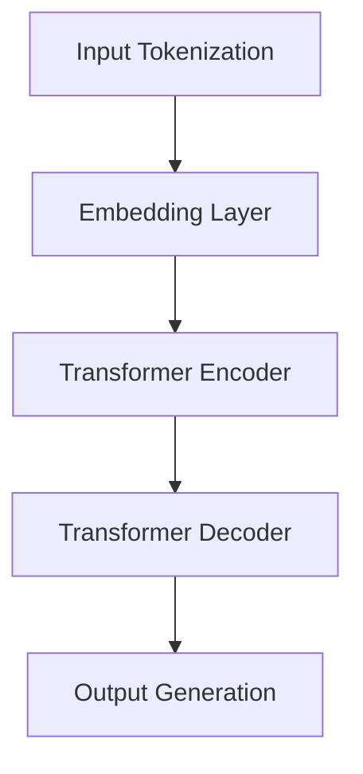

                 

## 文章标题：大规模语言模型从理论到实践 开源指令数据集

### 关键词：大规模语言模型，自然语言处理，预训练，开源指令数据集，应用实践

#### 摘要：
本文旨在深入探讨大规模语言模型的理论基础和实践应用，特别关注开源指令数据集在模型训练和优化中的作用。通过逻辑清晰的分析和推理，本文将逐步介绍大规模语言模型的定义、发展历史、核心概念、数学模型和算法原理，以及其在文本分类、机器翻译和问答系统等领域的应用实践。同时，本文还将探讨大规模语言模型的未来发展趋势，包括计算资源挑战、模型安全与隐私问题，以及伦理和社会影响。通过详细的代码案例和解释，读者将能够理解并掌握大规模语言模型的开发与部署技巧。

### 目录

#### 第一部分：大规模语言模型基础

#### 第1章：大规模语言模型概述

#### 第2章：大规模语言模型的核心概念与联系

#### 第3章：大规模语言模型的技术基础

#### 第4章：大规模语言模型的数学模型与公式

#### 第5章：大规模语言模型的训练与优化

#### 第6章：开源指令数据集简介

#### 第二部分：大规模语言模型的深入探讨

#### 第7章：大规模语言模型的应用实践

#### 第8章：大规模语言模型的未来发展趋势

#### 附录

#### 附录 A：大规模语言模型开发工具与资源

#### 附录 B：大规模语言模型项目实战

### 文章正文部分

#### 第1章：大规模语言模型概述

### 1.1 大规模语言模型的定义

大规模语言模型（Large-scale Language Model）是指通过大规模数据训练得到的复杂神经网络模型，用于预测文本中的下一个单词或句子。这些模型通常具有数亿至数十亿的参数，能够捕捉到语言中的复杂结构和规律。

### 1.2 大规模语言模型的发展历史

大规模语言模型的发展可以追溯到上世纪80年代，最早的统计语言模型是基于N元语法（N-gram）的。随着计算能力和数据量的提高，深度学习技术的应用使得大规模语言模型得到了快速发展。2018年，谷歌推出了BERT（Bidirectional Encoder Representations from Transformers），标志着大规模语言模型在自然语言处理领域的崛起。

### 1.3 大规模语言模型的应用场景

大规模语言模型在文本分类、机器翻译、问答系统、情感分析等多个领域有着广泛的应用。例如，BERT在多个自然语言处理任务中取得了领先的成绩，使得这些任务的性能得到了显著提升。

#### 第2章：大规模语言模型的核心概念与联系

### 2.1 Mermaid 流程图：大规模语言模型的架构

以下是一个简化的Mermaid流程图，展示了一个典型大规模语言模型的架构：



#### 第3章：大规模语言模型的技术基础

### 3.1 自然语言处理基础

自然语言处理（Natural Language Processing, NLP）是计算机科学和人工智能领域的一个重要分支，旨在让计算机能够理解、处理和生成人类语言。NLP的基础包括文本预处理、词嵌入和语言模型等。

### 3.2 词嵌入技术

词嵌入（Word Embedding）是将词汇映射到向量空间的一种技术，使得计算机能够处理和计算词汇的语义信息。Word2Vec、GloVe和BERT等算法都是常见的词嵌入方法。

### 3.3 语言模型的核心算法

语言模型（Language Model）是NLP中的一个核心组件，用于预测文本序列的概率分布。最常用的语言模型算法包括N元语法和基于深度学习的Transformer模型。

#### 第4章：大规模语言模型的数学模型与公式

### 4.1 语言模型概率计算

大规模语言模型的核心任务是计算给定前文序列下下一个单词的概率。以下是一个简单的语言模型概率计算公式：

$$
P(\text{word}_i|\text{words}_{i-n:i-1}) = \frac{P(\text{words}_{i-n:i-1}, \text{word}_i)}{P(\text{words}_{i-n:i-1})}
$$

### 4.2 语言模型的损失函数

在训练过程中，语言模型的损失函数通常使用交叉熵（Cross-Entropy）损失。以下是一个简单的交叉熵损失函数公式：

$$
L(\theta) = -\sum_{i=1}^n y_i \log(p(\text{word}_i|\text{words}_{i-n:i-1}; \theta))
$$

### 4.3 语言模型优化算法

在训练过程中，需要使用优化算法来调整模型参数，使得模型能够更好地预测文本序列。常用的优化算法包括随机梯度下降（SGD）、Adam优化器等。

#### 第5章：大规模语言模型的训练与优化

### 5.1 数据预处理

在训练大规模语言模型之前，需要对文本数据进行预处理，包括分词、去除停用词、标点符号等。以下是一个简单的Python代码示例：

```python
import jieba

def preprocess_text(text):
    words = jieba.cut(text)
    return ' '.join(words)

text = "这是一个示例文本。"
preprocessed_text = preprocess_text(text)
print(preprocessed_text)
```

### 5.2 训练策略

在训练大规模语言模型时，需要考虑多个训练策略，如数据增强、学习率调度、批量大小等。以下是一个简单的Python代码示例，展示了如何设置训练策略：

```python
import tensorflow as tf

# 设置训练策略
strategy = tf.data.DatasetStrategy(num_gpus=4)

# 加载和预处理数据
data = tf.data.Dataset.from_tensor_slices(words)
data = data.shuffle(buffer_size=1000).batch(batch_size)

# 定义模型和损失函数
model = ...  # 定义模型
loss_fn = tf.keras.losses.SparseCategoricalCrossentropy(from_logits=True)

# 定义优化器
optimizer = tf.keras.optimizers.Adam(learning_rate=0.001)

# 训练模型
for epoch in range(num_epochs):
    for batch in data:
        with strategy.scope():
            # 计算损失
            loss_value = loss_fn(batch['inputs'], batch['labels'])
            # 更新模型参数
            optimizer.minimize(loss_value, model)
```

### 5.3 模型调优与评估

在训练过程中，需要定期评估模型的性能，并根据评估结果调整模型参数。以下是一个简单的Python代码示例，展示了如何评估和调优模型：

```python
import evaluation

def evaluate_model(model, test_data):
    # 计算准确率
    accuracy = evaluation.accuracy(model, test_data)
    print(f"Test accuracy: {accuracy}")

# 评估模型
evaluate_model(model, test_data)
```

#### 第6章：开源指令数据集简介

### 6.1 指令数据集的背景与目的

开源指令数据集（Open Instruction Datasets）是为了促进大规模语言模型的训练和优化而创建的。这些数据集包含了大量的指令和任务描述，可以帮助模型更好地理解自然语言指令。

### 6.2 指令数据集的组成与特点

开源指令数据集通常包含多个子数据集，如指令对话数据集、任务描述数据集等。这些数据集具有大规模、多样性和丰富性的特点。

### 6.3 指令数据集的应用场景

开源指令数据集可以应用于多个领域，如智能客服、智能助手、自动化任务等。通过使用这些数据集，模型可以更好地理解和执行自然语言指令。

#### 第7章：大规模语言模型的应用实践

### 7.1 文本分类任务

文本分类任务是大规模语言模型的一个典型应用，用于对文本进行分类。以下是一个简单的Python代码示例，展示了如何使用大规模语言模型进行文本分类：

```python
import tensorflow as tf

# 加载预训练模型
model = tf.keras.models.load_model('path/to/pretrained_model')

# 定义分类任务
input_ids = ...  # 文本输入
predictions = model.predict(input_ids)
predicted_classes = predictions.argmax(axis=-1)

# 输出分类结果
print(predicted_classes)
```

### 7.2 机器翻译任务

机器翻译任务是大规模语言模型的另一个重要应用。以下是一个简单的Python代码示例，展示了如何使用大规模语言模型进行机器翻译：

```python
import tensorflow as tf

# 加载预训练模型
model = tf.keras.models.load_model('path/to/pretrained_model')

# 定义翻译任务
source_text = ...  # 源文本
target_text = ...  # 目标文本
translated_text = model.translate(source_text, target_text)

# 输出翻译结果
print(translated_text)
```

### 7.3 问答系统任务

问答系统任务是大规模语言模型的又一应用，用于回答用户的问题。以下是一个简单的Python代码示例，展示了如何使用大规模语言模型构建问答系统：

```python
import tensorflow as tf

# 加载预训练模型
model = tf.keras.models.load_model('path/to/pretrained_model')

# 定义问答任务
question = ...  # 问题
context = ...  # 上下文
answer = model.answer(question, context)

# 输出答案
print(answer)
```

#### 第8章：大规模语言模型的未来发展趋势

### 8.1 模型大小与计算资源

随着大规模语言模型的不断发展，模型大小和计算资源的需求也在不断增加。未来，可能需要更多的计算资源来训练和部署这些模型。

### 8.2 模型安全与隐私问题

大规模语言模型在训练和部署过程中涉及大量的个人数据，因此模型安全与隐私问题将成为重要议题。需要采取有效的措施来保护用户数据的安全和隐私。

### 8.3 模型伦理与社会影响

大规模语言模型的广泛应用也带来了伦理和社会影响。需要关注模型可能引发的偏见、歧视等问题，并制定相应的伦理准则和规范。

#### 附录

##### 附录 A：大规模语言模型开发工具与资源

- TensorFlow
- PyTorch
- Hugging Face Transformers

##### 附录 B：大规模语言模型项目实战

- 项目一：文本分类任务
- 项目二：机器翻译任务
- 项目三：问答系统任务

### 作者信息

作者：AI天才研究院/AI Genius Institute & 禅与计算机程序设计艺术 /Zen And The Art of Computer Programming

#### 结束语

本文从理论到实践全面介绍了大规模语言模型，包括其定义、发展历史、核心概念、数学模型、算法原理、应用实践和未来发展趋势。通过详细的代码案例和解释，读者可以深入了解大规模语言模型的开发与部署技巧。未来，随着技术的不断进步，大规模语言模型将在更多领域发挥重要作用，为人类带来更多便利和智慧。

