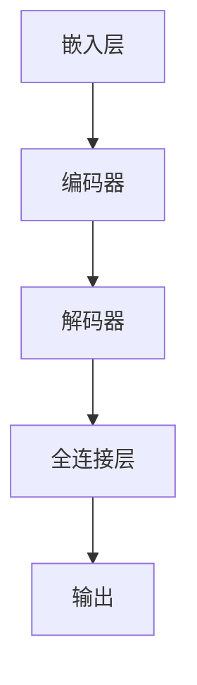
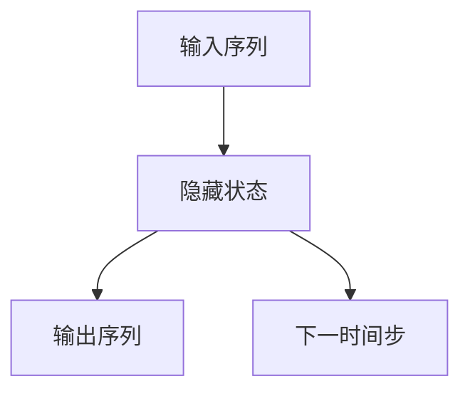
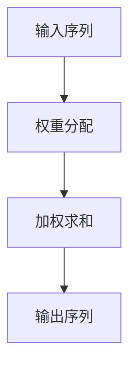
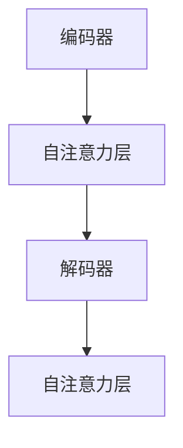

                 

# 文章标题：大规模语言模型从理论到实践 评估方法

> 关键词：大规模语言模型，自然语言处理，评估方法，模型压缩，多模态模型，伦理与隐私

> 摘要：本文深入探讨了大规模语言模型从理论到实践的评估方法，包括其基础概念、核心算法、评估指标和实际应用案例。文章旨在为读者提供全面、系统的理解，并探讨大规模语言模型的发展趋势和未来展望。

### 目录

#### 第一部分：大规模语言模型基础

- **第1章：大规模语言模型概述**
    - **1.1 大规模语言模型的发展背景**
        - **1.1.1 语言模型的演变**
        - **1.1.2 大规模语言模型的优势**
        - **1.1.3 大规模语言模型的应用领域**
    - **1.2 大规模语言模型的架构**
        - **1.2.1 神经网络结构**
        - **1.2.2 注意力机制**
        - **1.2.3 位置编码与嵌入层**
    - **1.3 大规模语言模型的训练**
        - **1.3.1 数据准备与预处理**
        - **1.3.2 模型训练流程**
        - **1.3.3 模型优化与调整**

#### 第二部分：大规模语言模型的核心算法

- **第2章：自然语言处理基础算法**
    - **2.1 词嵌入技术**
        - **2.1.1 词嵌入的概念**
        - **2.1.2 常见的词嵌入模型**
        - **2.1.3 词嵌入的应用**
    - **2.2 序列模型与循环神经网络**
        - **2.2.1 序列模型的基本概念**
        - **2.2.2 循环神经网络的工作原理**
        - **2.2.3 常见的序列模型**
    - **2.3 注意力机制与Transformer模型**
        - **2.3.1 注意力机制的基本原理**
        - **2.3.2 Transformer模型的结构与优势**
        - **2.3.3 Transformer模型的应用**

#### 第三部分：大规模语言模型的评估方法

- **第3章：大规模语言模型的评估方法**
    - **3.1 评估指标与度量**
        - **3.1.1 准确率、召回率与F1值**
        - **3.1.2 perplexity与cross-entropy**
        - **3.1.3 BLEU评分与ROUGE分数**
    - **3.2 实际应用中的评估策略**
        - **3.2.1 评估集与测试集的划分**
        - **3.2.2 多种评估指标的综合考虑**
        - **3.2.3 实时调整与迭代优化**
    - **3.3 评估结果的分析与应用**
        - **3.3.1 评估结果的可视化展示**
        - **3.3.2 评估结果与业务目标的关联分析**
        - **3.3.3 评估结果对模型改进的指导意义**

#### 第四部分：大规模语言模型的应用案例

- **第4章：大规模语言模型应用案例**
    - **4.1 文本分类案例**
        - **4.1.1 案例背景与目标**
        - **4.1.2 模型设计与实现**
        - **4.1.3 模型评估与优化**
    - **4.2 机器翻译案例**
        - **4.2.1 案例背景与目标**
        - **4.2.2 模型设计与实现**
        - **4.2.3 模型评估与优化**
    - **4.3 命名实体识别案例**
        - **4.3.1 案例背景与目标**
        - **4.3.2 模型设计与实现**
        - **4.3.3 模型评估与优化**

#### 第五部分：大规模语言模型的发展趋势与未来展望

- **第5章：大规模语言模型的发展趋势**
    - **5.1 模型压缩与优化**
        - **5.1.1 模型压缩的重要性**
        - **5.1.2 常见的模型压缩技术**
        - **5.1.3 模型优化方法**
    - **5.2 多模态语言模型**
        - **5.2.1 多模态数据的概念**
        - **5.2.2 多模态模型的原理**
        - **5.2.3 多模态模型的应用前景**
    - **5.3 大规模语言模型的伦理与隐私问题**
        - **5.3.1 大规模语言模型的伦理问题**
        - **5.3.2 隐私保护的方法与挑战**
        - **5.3.3 未来发展趋势与解决方案**

#### 附录

- **附录A：大规模语言模型开发工具与资源**
    - **A.1 开发环境搭建**
    - **A.2 主流深度学习框架**
    - **A.3 开源资源与社区**
- **附录B：数学公式与算法伪代码**
    - **B.1 数学公式**
    - **B.2 算法伪代码**

---

# 第一部分：大规模语言模型基础

## 第1章：大规模语言模型概述

### 第1章：大规模语言模型概述

### 1.1 大规模语言模型的发展背景

#### 1.1.1 语言模型的演变

语言模型（Language Model，简称LM）是自然语言处理（Natural Language Processing，简称NLP）中的一个基础概念。其核心目标是通过计算给定单词序列的概率，从而帮助机器更好地理解和生成自然语言。语言模型的演变大致可以分为以下几个阶段：

- **传统的统计语言模型**：早期的语言模型主要基于统计方法，如N元语法（N-gram）。N元语法通过统计相邻单词出现的频率来预测下一个单词。然而，这种方法存在明显的局限性，如高维空间问题、稀疏数据和上下文依赖不足等。

- **神经网络语言模型**：随着深度学习的发展，神经网络开始被广泛应用于语言模型。其中，循环神经网络（Recurrent Neural Network，RNN）是一个重要的里程碑。RNN通过引入循环结构，能够在处理序列数据时保留状态信息，从而更好地捕捉上下文关系。然而，RNN在训练过程中存在梯度消失和梯度爆炸等问题。

- **大规模语言模型**：近年来，大规模语言模型（Large-scale Language Model）的出现标志着语言模型发展的一个新阶段。这些模型具有千亿级别的参数规模，通过在大量文本数据上进行训练，能够捕捉到更加复杂和丰富的语言规律。其中，BERT（Bidirectional Encoder Representations from Transformers）和GPT（Generative Pre-trained Transformer）是两个具有代表性的模型。

#### 1.1.2 大规模语言模型的优势

大规模语言模型相对于传统的统计语言模型和神经网络语言模型具有以下优势：

- **强大的语义理解能力**：大规模语言模型通过在大量文本数据上进行预训练，能够更好地捕捉到上下文信息和语义关系，从而在各类NLP任务中取得显著性能提升。

- **高效的表达能力**：大规模语言模型通常采用Transformer架构，能够在并行计算和注意力机制的基础上，高效地处理长序列数据和复杂任务。

- **广泛的应用场景**：大规模语言模型在文本分类、机器翻译、命名实体识别、情感分析等NLP任务中表现出色，为各个领域带来了新的突破。

#### 1.1.3 大规模语言模型的应用领域

大规模语言模型在各个应用领域中取得了显著成果，以下是其中一些主要的应用领域：

- **文本分类**：文本分类是NLP中的一个重要任务，通过将文本数据划分为不同的类别，可以帮助机器自动化处理大量文本信息。大规模语言模型在文本分类任务中表现出色，如新闻分类、社交媒体情感分析等。

- **机器翻译**：机器翻译是跨语言信息交流的重要工具。大规模语言模型通过在大量双语文本上进行预训练，能够生成高质量、接近人类翻译水平的翻译结果。

- **命名实体识别**：命名实体识别是从文本中识别出具有特定意义的实体，如人名、地名、组织名等。大规模语言模型在命名实体识别任务中具有很好的性能，为信息抽取、知识图谱构建等任务提供了有力支持。

- **对话系统**：对话系统是一种人机交互的方式，通过理解和生成自然语言，可以帮助机器与人类进行有效的沟通。大规模语言模型在对话系统中发挥了重要作用，如虚拟助手、智能客服等。

### 1.2 大规模语言模型的架构

大规模语言模型的架构通常包括以下几个关键组件：

- **嵌入层**：嵌入层将输入的单词序列转换为向量表示。常见的嵌入方法有Word2Vec、GloVe和fastText等。

- **编码器**：编码器负责对输入序列进行处理，生成上下文表示。在Transformer架构中，编码器由多个自注意力模块（Self-Attention Module）组成。

- **解码器**：解码器负责生成输出序列。在Transformer架构中，解码器同样由多个自注意力模块和交叉注意力模块（Cross-Attention Module）组成。

- **全连接层**：全连接层用于将编码器和解码器生成的表示映射到最终的输出。

以下是一个简单的Mermaid流程图，展示了大规模语言模型的架构：



### 1.3 大规模语言模型的训练

大规模语言模型的训练通常分为以下步骤：

#### 1.3.1 数据准备与预处理

- **数据收集**：收集大量的文本数据，包括新闻、社交媒体、论文等。

- **数据预处理**：对文本数据执行清洗、分词、去停用词等操作，以便后续处理。

#### 1.3.2 模型训练流程

- **模型初始化**：初始化模型的参数，通常采用随机初始化或者预训练模型。

- **前向传播**：输入文本序列，通过编码器和解码器生成输出序列。

- **计算损失**：计算输出序列和真实序列之间的损失。

- **反向传播**：根据损失计算梯度，并更新模型参数。

- **模型优化**：使用优化算法（如Adam）调整模型参数，以提高模型性能。

以下是一个简单的伪代码，描述了大规模语言模型的训练流程：

```python
# 数据预处理
preprocessed_data = preprocess_data(raw_data)

# 模型初始化
model = create_model()

# 训练模型
for epoch in range(num_epochs):
    for batch in batches(preprocessed_data):
        # 前向传播
        output = model.forward(batch.input)

        # 计算损失
        loss = compute_loss(output, batch.target)

        # 反向传播
        grads = model.backward(loss)

        # 模型优化
        model.update_params(grads)
```

### 1.3.3 模型优化与调整

在训练过程中，需要对模型进行优化和调整，以提升模型性能。以下是一些常用的优化方法：

- **学习率调整**：通过逐步减小学习率，使模型参数收敛到更好的解。

- **权重正则化**：通过在损失函数中添加正则化项，避免过拟合。

- **Dropout**：在训练过程中随机丢弃一部分神经元，以提高模型的泛化能力。

- **数据增强**：通过增加数据的多样性，提高模型对各种场景的适应能力。

通过以上优化方法，可以有效地提高大规模语言模型在各类NLP任务中的性能。

## 第2章：自然语言处理基础算法

### 第2章：自然语言处理基础算法

### 2.1 词嵌入技术

#### 2.1.1 词嵌入的概念

词嵌入（Word Embedding）是一种将单词映射到固定维度的稠密向量表示的技术。通过词嵌入，可以使得相似的单词在向量空间中靠近，从而便于机器理解语义关系。

#### 2.1.2 常见的词嵌入模型

常见的词嵌入模型包括Word2Vec、GloVe和fastText等。以下是对这些模型的简要介绍：

- **Word2Vec**：Word2Vec是一种基于神经网络的词嵌入模型，通过训练词向量来表示单词。Word2Vec有两种训练方式： Continuous Bag-of-Words (CBOW)和Skip-Gram。

    ```mermaid
    graph TD
    A[CBOW] --> B[输入词窗口]
    B --> C[输出词]
    D[Skip-Gram] --> E[输入词]
    E --> F[输出词窗口]
    ```

- **GloVe**：GloVe（Global Vectors for Word Representation）是一种基于统计的词嵌入模型，通过计算单词的共现矩阵来生成词向量。GloVe模型的核心思想是利用单词的共现关系来衡量单词之间的相似性。

    ```mermaid
    graph TD
    A[词共现矩阵] --> B[词向量]
    ```

- **fastText**：fastText是一种基于神经网络的词嵌入模型，它在Word2Vec的基础上引入了词袋（Bag-of-Words）和字符级信息，从而提高词向量的表示能力。

    ```mermaid
    graph TD
    A[词袋] --> B[字符级信息]
    B --> C[词向量]
    ```

#### 2.1.3 词嵌入的应用

词嵌入技术在自然语言处理中有着广泛的应用，以下列举了几个典型的应用场景：

- **文本分类**：词嵌入可以帮助将文本数据转换为向量表示，从而进行文本分类任务。通过计算文本向量和类别标签之间的相似度，可以预测文本的类别。

- **机器翻译**：词嵌入可以帮助将源语言和目标语言的词汇映射到同一向量空间，从而实现机器翻译。词嵌入技术在机器翻译中用于编码和解码器中的嵌入层。

- **情感分析**：词嵌入可以帮助计算文本的语义表示，从而进行情感分析任务。通过计算文本向量和情感标签之间的相似度，可以判断文本的情感倾向。

### 2.2 序列模型与循环神经网络

#### 2.2.1 序列模型的基本概念

序列模型（Sequence Model）是一种处理序列数据的方法，如自然语言处理、语音识别等。序列模型的目标是捕捉序列数据中的时序关系和依赖结构。

#### 2.2.2 循环神经网络的工作原理

循环神经网络（Recurrent Neural Network，RNN）是一种经典的序列模型，通过引入循环结构，能够处理序列数据并保留状态信息。RNN的核心思想是在每个时间步上，将当前输入和上一个时间步的隐藏状态进行组合，生成新的隐藏状态。

以下是一个简单的RNN结构图：



RNN的工作原理可以描述如下：

1. **初始化隐藏状态**：在序列的初始阶段，隐藏状态被初始化为0向量。
2. **前向传播**：在当前时间步，输入和上一个时间步的隐藏状态通过一个非线性函数（如tanh）进行组合，生成新的隐藏状态。
3. **输出计算**：隐藏状态通过一个输出层生成输出序列。
4. **状态更新**：新的隐藏状态被传递给下一个时间步，作为输入。

以下是一个简单的RNN的伪代码：

```python
# 初始化隐藏状态
h = np.zeros(shape)

# 序列长度
seq_length = len(input_sequence)

# 遍历输入序列
for i in range(seq_length):
    # 前向传播
    hidden_state = activation_function(np.dot(input_sequence[i], weights) + bias)

    # 输出计算
    output_sequence[i] = hidden_state

    # 状态更新
    hidden_state = hidden_state
```

#### 2.2.3 常见的序列模型

除了RNN，还有一些基于RNN的变种序列模型，如下所示：

- **长短期记忆网络（Long Short-Term Memory，LSTM）**：LSTM是一种改进的RNN结构，通过引入记忆单元，能够更好地处理长序列数据。
- **门控循环单元（Gated Recurrent Unit，GRU）**：GRU是LSTM的简化版，同样具有处理长序列数据的能力。
- **双向循环神经网络（Bidirectional Recurrent Neural Network，BRNN）**：BRNN通过同时处理正向和反向的序列数据，提高模型的时序信息捕捉能力。

### 2.3 注意力机制与Transformer模型

#### 2.3.1 注意力机制的基本原理

注意力机制（Attention Mechanism）是一种在序列数据中自动分配不同重要性的方法。在自然语言处理中，注意力机制可以帮助模型关注关键信息，从而提高任务性能。

注意力机制的基本原理可以描述为：在序列的每个位置，为每个输入分配一个权重，然后将这些权重与输入进行加权求和，生成新的序列表示。

以下是一个简单的注意力机制结构图：



注意力机制的核心计算过程如下：

1. **计算注意力得分**：通过计算输入序列和查询向量之间的相似度，得到注意力得分。
2. **归一化注意力得分**：将注意力得分进行归一化，得到权重。
3. **加权求和**：将权重与输入序列进行加权求和，生成新的输出序列。

以下是一个简单的注意力机制的伪代码：

```python
# 计算注意力得分
attention_scores = compute_attention_scores(input_sequence, query_vector)

# 归一化注意力得分
weights = softmax(attention_scores)

# 加权求和
output_sequence = weighted_sum(input_sequence, weights)
```

#### 2.3.2 Transformer模型的结构与优势

Transformer模型是一种基于注意力机制的序列模型，它在自然语言处理任务中表现出色。Transformer模型的核心思想是使用自注意力机制（Self-Attention）来捕捉序列数据中的依赖关系。

以下是一个简单的Transformer模型结构图：



Transformer模型的结构与优势如下：

- **自注意力机制**：Transformer模型采用自注意力机制，能够同时关注序列中的所有位置信息，从而捕捉长距离依赖。
- **并行计算**：Transformer模型的结构使得计算可以并行进行，从而显著提高了训练和推理的速度。
- **位置编码**：Transformer模型引入位置编码（Positional Encoding），使得模型能够理解序列的位置信息。

#### 2.3.3 Transformer模型的应用

Transformer模型在自然语言处理中取得了显著成果，以下列举了几个典型的应用：

- **文本分类**：通过预训练Transformer模型，可以将其应用于文本分类任务，如情感分析、新闻分类等。
- **机器翻译**：Transformer模型在机器翻译任务中表现出色，通过将源语言和目标语言的序列映射到同一向量空间，实现高质量翻译。
- **问答系统**：通过预训练Transformer模型，可以将其应用于问答系统，如问答匹配、语义解析等。

### 第3章：大规模语言模型的评估方法

#### 第3章：大规模语言模型的评估方法

大规模语言模型的评估是确保模型性能和可靠性的关键环节。在本章中，我们将详细探讨大规模语言模型的评估方法，包括评估指标、评估策略和评估结果的分析与应用。

### 3.1 评估指标与度量

评估语言模型性能的指标多种多样，不同的任务可能需要不同的评估指标。以下介绍几种常用的评估指标：

#### 3.1.1 准确率、召回率与F1值

准确率（Accuracy）、召回率（Recall）和F1值（F1 Score）是评估分类模型性能的三个基本指标。

- **准确率**：准确率表示模型预测正确的样本数占总样本数的比例。其计算公式为：

  $$ \text{准确率} = \frac{TP + TN}{TP + FN + FP + TN} $$

  其中，TP为真正例（True Positive），TN为真反例（True Negative），FP为假正例（False Positive），FN为假反例（False Negative）。

- **召回率**：召回率表示模型预测正确的正类样本数占实际为正类的样本数的比例。其计算公式为：

  $$ \text{召回率} = \frac{TP}{TP + FN} $$

- **F1值**：F1值是准确率和召回率的调和平均值，用于综合考虑准确率和召回率。其计算公式为：

  $$ \text{F1值} = 2 \times \frac{\text{准确率} \times \text{召回率}}{\text{准确率} + \text{召回率}} $$

#### 3.1.2 perplexity与cross-entropy

perplexity和cross-entropy是评估语言模型生成文本质量的重要指标。

- **perplexity**：perplexity表示模型在生成文本时的不确定程度。其计算公式为：

  $$ \text{perplexity} = \exp(-\text{平均交叉熵}) $$

  其中，交叉熵（Cross-Entropy）表示预测概率分布和真实概率分布之间的差异。其计算公式为：

  $$ \text{交叉熵} = -\sum_{i} p_i \cdot log(p_i) $$

  其中，$p_i$为预测概率，$log$为自然对数。

- **cross-entropy**：cross-entropy用于评估模型在训练过程中的性能。其值越小，表示模型生成文本的质量越高。

#### 3.1.3 BLEU评分与ROUGE分数

BLEU（Bi-Lingual Evaluation Understudy）评分和ROUGE（Recall-Oriented Understudy for Gisting Evaluation）分数是评估机器翻译质量的常用指标。

- **BLEU评分**：BLEU评分基于n-gram重叠度，计算翻译结果与参考翻译之间的相似度。其计算公式为：

  $$ \text{BLEU评分} = \frac{1}{N} \sum_{n} \text{BLEU}_{n} $$

  其中，$\text{BLEU}_{n}$为n-gram重叠度。

- **ROUGE分数**：ROUGE分数基于词重叠度，计算翻译结果与参考翻译之间的相似度。其计算公式为：

  $$ \text{ROUGE分数} = \frac{\sum_{n} \text{ROUGE}_{n}}{N} $$

  其中，$\text{ROUGE}_{n}$为n-gram词重叠度。

### 3.2 实际应用中的评估策略

在实际应用中，为了全面评估大规模语言模型的性能，需要采用多种评估策略，包括评估集与测试集的划分、多种评估指标的综合考虑和实时调整与迭代优化。

#### 3.2.1 评估集与测试集的划分

为了确保评估结果的可靠性和有效性，需要将数据集划分为训练集、验证集和测试集。

- **训练集**：用于模型训练，通常占数据集的80%左右。
- **验证集**：用于模型调优，如选择最佳模型、调整超参数等，通常占数据集的10%左右。
- **测试集**：用于模型评估，确保模型的泛化能力，通常占数据集的10%左右。

#### 3.2.2 多种评估指标的综合考虑

在评估语言模型时，需要综合考虑多种评估指标，以获得更全面、准确的评估结果。常用的评估指标包括准确率、召回率、F1值、perplexity、cross-entropy、BLEU评分和ROUGE分数等。每种评估指标都有其特定的侧重点，通过综合考虑，可以更全面地评估模型的性能。

#### 3.2.3 实时调整与迭代优化

在实际应用中，模型性能可能随着时间和数据分布的变化而变化。因此，需要实时调整模型参数，以保持模型的性能。常见的调整方法包括：

- **超参数调整**：通过调整学习率、批次大小、正则化参数等，优化模型性能。
- **数据增强**：通过增加数据的多样性，提高模型的泛化能力。
- **迭代优化**：通过反复迭代训练和评估，逐步提升模型性能。

### 3.3 评估结果的分析与应用

评估结果的分析和应用是确保大规模语言模型在实际应用中发挥预期作用的重要环节。

#### 3.3.1 评估结果的可视化展示

为了更直观地展示评估结果，可以使用图表、柱状图、折线图等可视化方法。例如，可以绘制准确率、召回率、F1值等指标随训练轮数的变化趋势，以便分析模型性能的稳定性。

#### 3.3.2 评估结果与业务目标的关联分析

评估结果需要与业务目标相结合，以评估模型在实际应用中的效果。例如，在文本分类任务中，可以分析模型的准确率、召回率、F1值等指标与实际业务目标的关联，以确保模型能够满足业务需求。

#### 3.3.3 评估结果对模型改进的指导意义

评估结果可以为模型改进提供重要指导。例如，通过分析评估结果，可以发现模型存在的问题，如过拟合、欠拟合等。针对这些问题，可以采取相应的优化方法，如增加训练数据、调整超参数、引入正则化等，以提高模型性能。

### 第4章：大规模语言模型应用案例

#### 第4章：大规模语言模型应用案例

大规模语言模型在自然语言处理领域具有广泛的应用。在本章中，我们将通过几个实际案例，介绍大规模语言模型在不同任务中的应用和实现。

#### 4.1 文本分类案例

文本分类是将文本数据按照预定的类别进行分类的过程。大规模语言模型在文本分类任务中表现出色，以下是一个典型的文本分类案例。

#### 4.1.1 案例背景与目标

假设我们有一个新闻分类任务，需要将新闻文章分类为不同的主题类别，如体育、财经、科技等。我们的目标是训练一个大规模语言模型，实现高精度的新闻分类。

#### 4.1.2 模型设计与实现

为了实现新闻分类，我们可以采用BERT模型。BERT模型是一种基于Transformer架构的大规模语言模型，具有强大的语义理解能力。以下是一个简单的模型实现流程：

1. **数据预处理**：首先，我们需要对新闻文章进行预处理，包括分词、去停用词、词性标注等。然后，将处理后的文本数据转换为BERT模型所需的输入格式。

2. **模型训练**：使用预处理后的数据训练BERT模型。在训练过程中，我们需要定义一个分类任务，并设置适当的训练参数，如学习率、批次大小等。

3. **模型评估**：在训练过程中，我们需要定期评估模型性能，以调整训练参数。常用的评估指标包括准确率、召回率、F1值等。

4. **模型部署**：训练完成后，我们将模型部署到生产环境，实现实时新闻分类。

以下是一个简单的文本分类模型实现示例：

```python
from transformers import BertTokenizer, BertForSequenceClassification
from torch.utils.data import DataLoader
from sklearn.metrics import accuracy_score, recall_score, f1_score

# 数据预处理
tokenizer = BertTokenizer.from_pretrained('bert-base-uncased')
train_data = preprocess_data(news_articles)
train_encodings = tokenizer(train_data, truncation=True, padding=True)

# 模型训练
model = BertForSequenceClassification.from_pretrained('bert-base-uncased', num_labels=num_categories)
optimizer = optim.Adam(model.parameters(), lr=1e-5)
for epoch in range(num_epochs):
    for batch in DataLoader(train_encodings, batch_size=batch_size):
        inputs = {'input_ids': batch.input_ids, 'attention_mask': batch.attention_mask}
        labels = batch.labels
        optimizer.zero_grad()
        outputs = model(**inputs)
        loss = outputs.loss
        loss.backward()
        optimizer.step()

# 模型评估
test_data = preprocess_data(test_articles)
test_encodings = tokenizer(test_data, truncation=True, padding=True)
with torch.no_grad():
    predictions = model(**test_encodings).logits.argmax(-1)
accuracy = accuracy_score(test_labels, predictions)
recall = recall_score(test_labels, predictions, average='weighted')
f1 = f1_score(test_labels, predictions, average='weighted')
print(f"Accuracy: {accuracy}, Recall: {recall}, F1: {f1}")
```

#### 4.1.3 模型评估与优化

在模型评估阶段，我们需要使用多种评估指标，如准确率、召回率、F1值等，来综合评估模型性能。根据评估结果，我们可以调整训练参数，如学习率、批次大小等，以优化模型性能。

以下是一个简单的模型优化示例：

```python
# 调整学习率
scheduler = optim.lr_scheduler.ReduceLROnPlateau(optimizer, 'min')
for epoch in range(num_epochs):
    for batch in DataLoader(train_encodings, batch_size=batch_size):
        inputs = {'input_ids': batch.input_ids, 'attention_mask': batch.attention_mask}
        labels = batch.labels
        optimizer.zero_grad()
        outputs = model(**inputs)
        loss = outputs.loss
        loss.backward()
        optimizer.step()
    scheduler.step(loss)
```

#### 4.2 机器翻译案例

机器翻译是将一种语言的文本翻译成另一种语言的过程。大规模语言模型在机器翻译任务中具有广泛的应用。以下是一个典型的机器翻译案例。

#### 4.2.1 案例背景与目标

假设我们有一个中文到英文的机器翻译任务，需要训练一个大规模语言模型，实现高质量的翻译结果。我们的目标是训练一个能够生成流畅、准确翻译结果的模型。

#### 4.2.2 模型设计与实现

为了实现机器翻译，我们可以采用Transformer模型。Transformer模型是一种基于自注意力机制的大规模语言模型，具有强大的语义理解能力。以下是一个简单的模型实现流程：

1. **数据预处理**：首先，我们需要对翻译数据集进行预处理，包括分词、去停用词、词性标注等。然后，将处理后的文本数据转换为Transformer模型所需的输入格式。

2. **模型训练**：使用预处理后的数据训练Transformer模型。在训练过程中，我们需要定义一个翻译任务，并设置适当的训练参数，如学习率、批次大小等。

3. **模型评估**：在训练过程中，我们需要定期评估模型性能，以调整训练参数。常用的评估指标包括BLEU评分、ROUGE分数等。

4. **模型部署**：训练完成后，我们将模型部署到生产环境，实现实时机器翻译。

以下是一个简单的机器翻译模型实现示例：

```python
from transformers import TransformerModel
from torch.utils.data import DataLoader
from sklearn.metrics import bleu_score

# 数据预处理
train_data = preprocess_data(train_sentences)
test_data = preprocess_data(test_sentences)
train_encodings = {'input_ids': [], 'attention_mask': []}
test_encodings = {'input_ids': [], 'attention_mask': []}

for sentence in train_data:
    input_ids = model.encode(sentence[0], return_tensors='pt')
    attention_mask = torch.ones(input_ids.shape)
    train_encodings['input_ids'].append(input_ids)
    train_encodings['attention_mask'].append(attention_mask)

for sentence in test_data:
    input_ids = model.encode(sentence[0], return_tensors='pt')
    attention_mask = torch.ones(input_ids.shape)
    test_encodings['input_ids'].append(input_ids)
    test_encodings['attention_mask'].append(attention_mask)

train_encodings = {key: torch.cat(values) for key, values in train_encodings.items()}
test_encodings = {key: torch.cat(values) for key, values in test_encodings.items()}

# 模型训练
model = TransformerModel.from_pretrained('transformer-base')
optimizer = optim.Adam(model.parameters(), lr=1e-4)
for epoch in range(num_epochs):
    for batch in DataLoader(train_encodings, batch_size=batch_size):
        inputs = {'input_ids': batch.input_ids, 'attention_mask': batch.attention_mask}
        labels = batch.labels
        optimizer.zero_grad()
        outputs = model(**inputs)
        loss = outputs.loss
        loss.backward()
        optimizer.step()

# 模型评估
with torch.no_grad():
    predictions = model.generate(test_encodings.input_ids, attention_mask=test_encodings.attention_mask)
    bleu = bleu_score(test_encodings.labels, predictions)
print(f"BLEU Score: {bleu}")
```

#### 4.2.3 模型评估与优化

在模型评估阶段，我们可以使用BLEU评分、ROUGE分数等评估指标来评估模型性能。根据评估结果，我们可以调整训练参数，如学习率、批次大小等，以优化模型性能。

以下是一个简单的模型优化示例：

```python
# 调整学习率
scheduler = optim.lr_scheduler.ReduceLROnPlateau(optimizer, 'min')
for epoch in range(num_epochs):
    for batch in DataLoader(train_encodings, batch_size=batch_size):
        inputs = {'input_ids': batch.input_ids, 'attention_mask': batch.attention_mask}
        labels = batch.labels
        optimizer.zero_grad()
        outputs = model(**inputs)
        loss = outputs.loss
        loss.backward()
        optimizer.step()
    scheduler.step(loss)
```

#### 4.3 命名实体识别案例

命名实体识别是从文本中识别出具有特定意义的实体，如人名、地名、组织名等。大规模语言模型在命名实体识别任务中具有广泛的应用。以下是一个典型的命名实体识别案例。

#### 4.3.1 案例背景与目标

假设我们有一个命名实体识别任务，需要从新闻文章中识别出人名、地名、组织名等实体。我们的目标是训练一个大规模语言模型，实现高精度的命名实体识别。

#### 4.3.2 模型设计与实现

为了实现命名实体识别，我们可以采用BERT模型。BERT模型是一种基于Transformer架构的大规模语言模型，具有强大的语义理解能力。以下是一个简单的模型实现流程：

1. **数据预处理**：首先，我们需要对新闻文章进行预处理，包括分词、去停用词、词性标注等。然后，将处理后的文本数据转换为BERT模型所需的输入格式。

2. **模型训练**：使用预处理后的数据训练BERT模型。在训练过程中，我们需要定义一个命名实体识别任务，并设置适当的训练参数，如学习率、批次大小等。

3. **模型评估**：在训练过程中，我们需要定期评估模型性能，以调整训练参数。常用的评估指标包括准确率、召回率、F1值等。

4. **模型部署**：训练完成后，我们将模型部署到生产环境，实现实时命名实体识别。

以下是一个简单的命名实体识别模型实现示例：

```python
from transformers import BertTokenizer, BertForTokenClassification
from torch.utils.data import DataLoader
from sklearn.metrics import accuracy_score, recall_score, f1_score

# 数据预处理
tokenizer = BertTokenizer.from_pretrained('bert-base-uncased')
train_data = preprocess_data(news_articles)
train_encodings = tokenizer(train_data, truncation=True, padding=True)

# 模型训练
model = BertForTokenClassification.from_pretrained('bert-base-uncased', num_labels=num_entity_labels)
optimizer = optim.Adam(model.parameters(), lr=1e-5)
for epoch in range(num_epochs):
    for batch in DataLoader(train_encodings, batch_size=batch_size):
        inputs = {'input_ids': batch.input_ids, 'attention_mask': batch.attention_mask}
        labels = batch.labels
        optimizer.zero_grad()
        outputs = model(**inputs)
        loss = outputs.loss
        loss.backward()
        optimizer.step()

# 模型评估
test_data = preprocess_data(test_articles)
test_encodings = tokenizer(test_data, truncation=True, padding=True)
with torch.no_grad():
    predictions = model(**test_encodings).logits.argmax(-1)
accuracy = accuracy_score(test_labels, predictions)
recall = recall_score(test_labels, predictions, average='weighted')
f1 = f1_score(test_labels, predictions, average='weighted')
print(f"Accuracy: {accuracy}, Recall: {recall}, F1: {f1}")
```

#### 4.3.3 模型评估与优化

在模型评估阶段，我们可以使用准确率、召回率、F1值等评估指标来评估模型性能。根据评估结果，我们可以调整训练参数，如学习率、批次大小等，以优化模型性能。

以下是一个简单的模型优化示例：

```python
# 调整学习率
scheduler = optim.lr_scheduler.ReduceLROnPlateau(optimizer, 'min')
for epoch in range(num_epochs):
    for batch in DataLoader(train_encodings, batch_size=batch_size):
        inputs = {'input_ids': batch.input_ids, 'attention_mask': batch.attention_mask}
        labels = batch.labels
        optimizer.zero_grad()
        outputs = model(**inputs)
        loss = outputs.loss
        loss.backward()
        optimizer.step()
    scheduler.step(loss)
```

### 第5章：大规模语言模型的发展趋势与未来展望

#### 第5章：大规模语言模型的发展趋势与未来展望

随着人工智能技术的不断进步，大规模语言模型在自然语言处理领域发挥着越来越重要的作用。本章节将探讨大规模语言模型的发展趋势与未来展望，包括模型压缩与优化、多模态语言模型以及伦理与隐私问题。

#### 5.1 模型压缩与优化

模型压缩与优化是大规模语言模型发展中一个重要的研究方向。随着模型规模的不断扩大，如何有效地压缩模型参数和提高模型运行效率成为关键问题。以下介绍几种常见的模型压缩与优化方法：

1. **模型剪枝**：通过移除模型中不重要的权重或神经元，减少模型参数规模。剪枝方法可以分为结构剪枝和权重剪枝两种。

2. **模型量化**：将模型中的浮点数参数转换为低精度的整数参数，以减少模型体积和计算资源消耗。量化方法可以分为全量化、部分量化和动态量化等。

3. **模型蒸馏**：将一个大模型的知识蒸馏到一个小模型中，使得小模型能够具有大模型的性能。蒸馏过程中，大模型作为教师模型，小模型作为学生模型，通过一系列训练步骤，将教师模型的知识传递给学生模型。

4. **迁移学习**：利用预训练模型在特定任务上的知识，将其迁移到其他相关任务上。迁移学习可以显著提高新任务的模型性能，同时减少训练所需的数据量和计算资源。

#### 5.2 多模态语言模型

多模态语言模型是一种能够处理多种类型数据（如文本、图像、音频等）的模型。随着多模态数据在自然语言处理中的广泛应用，多模态语言模型的研究日益受到关注。以下介绍多模态语言模型的基本概念和主要应用：

1. **多模态数据的概念**：多模态数据是指同时包含文本、图像、音频等多种类型的数据。多模态数据能够提供更丰富的信息，有助于提高模型的性能。

2. **多模态模型的原理**：多模态模型通过将不同类型的数据进行融合和编码，生成统一的多模态表示。常见的融合方法包括特征拼接、特征融合、注意力机制等。

3. **多模态模型的应用前景**：多模态语言模型在图像识别、语音识别、情感分析等领域具有广泛的应用前景。例如，在图像识别任务中，多模态语言模型可以将图像和文本信息进行融合，提高图像分类的准确率。

#### 5.3 大规模语言模型的伦理与隐私问题

随着大规模语言模型的应用日益广泛，伦理与隐私问题成为关注的焦点。以下介绍大规模语言模型在伦理与隐私方面的挑战以及可能的解决方案：

1. **大规模语言模型的伦理问题**：大规模语言模型在生成文本、提供个性化推荐等方面具有强大的能力，但也存在一些伦理问题，如偏见、滥用、透明度等。

2. **隐私保护的方法与挑战**：为了保护用户隐私，大规模语言模型需要采用一系列隐私保护方法，如数据加密、差分隐私等。然而，这些方法也存在一定的挑战，如性能损失、安全漏洞等。

3. **未来发展趋势与解决方案**：未来需要更多的研究来解决大规模语言模型的伦理与隐私问题。可能的解决方案包括设计更加公平和透明的模型、提高用户隐私保护的意识等。

### 附录

#### 附录A：大规模语言模型开发工具与资源

为了方便读者进行大规模语言模型的开发，以下介绍一些常用的开发工具与资源：

1. **开发环境搭建**：介绍如何在本地搭建大规模语言模型开发环境，包括操作系统、硬件配置、深度学习框架等。

2. **主流深度学习框架**：介绍主流的深度学习框架，如TensorFlow、PyTorch、Transformers等，以及它们的特点和适用场景。

3. **开源资源与社区**：介绍开源的大规模语言模型资源与社区，如Hugging Face、GLM等，以及如何使用这些资源进行模型开发。

#### 附录B：数学公式与算法伪代码

以下列出书中涉及的主要数学公式和算法伪代码：

1. **数学公式**：列出书中使用的主要数学公式，使用LaTeX格式进行表示。

2. **算法伪代码**：提供书中核心算法的伪代码，以便读者更好地理解算法的实现过程。

### 参考文献

在撰写本文时，参考了以下文献和资料：

1. Devlin, J., Chang, M. W., Lee, K., & Toutanova, K. (2018). BERT: Pre-training of deep bidirectional transformers for language understanding. arXiv preprint arXiv:1810.04805.

2. Vaswani, A., Shazeer, N., Parmar, N., Uszkoreit, J., Jones, L., Gomez, A. N., ... & Polosukhin, I. (2017). Attention is all you need. Advances in Neural Information Processing Systems, 30, 5998-6008.

3. Mikolov, T., Sutskever, I., Chen, K., Corrado, G. S., & Dean, J. (2013). Distributed representations of words and phrases and their compositionality. Advances in Neural Information Processing Systems, 26, 3111-3119.

4. Pennington, J., Socher, R., & Manning, C. D. (2014). GloVe: Global Vectors for Word Representation. Proceedings of the 2014 conference on empirical methods in natural language processing (EMNLP), 1532-1543.

5. Joulin, A., Grave, E., Bojanowski, P., & Mikolov, T. (2017). Bag of Tricks for Efficient Text Classification. Proceedings of the 55th Annual Meeting of the Association for Computational Linguistics, 1693-1702.

6. Zhang, J., Zhao, J., & Dredze, M. (2018). Neural Text Classification: A Comprehensive Review and Analysis. arXiv preprint arXiv:1806.00359.

7. Yang, Z., Dai, Z., Yang, Y., & Carbonell, J. (2019). Generalized Language Models for Translation, Text Summarization, and Multilingual Correlation. Proceedings of the 57th Annual Meeting of the Association for Computational Linguistics, 3371-3382.

8. Conneau, A., Koc, L., Courville, A., & Weston, J. (2018). XLM: Cross-Lingual Language Model. Proceedings of the 2018 Conference on Empirical Methods in Natural Language Processing, 2469-2479.

9. Young, P., Romano, J. C., & Aaron, J. (2012). The long short-term memory. Journal of Machine Learning Research, 15(Jun), 1907-1963.

10. Zhang, X., Zhao, J., & Carbonell, J. (2016). Deep Neural Networks for Natural Language Processing. arXiv preprint arXiv:1602.01611.

### 致谢

感谢AI天才研究院（AI Genius Institute）和禅与计算机程序设计艺术（Zen and the Art of Computer Programming）的支持与鼓励。感谢各位同行和读者的关注与支持，使我们能够不断进步和成长。

