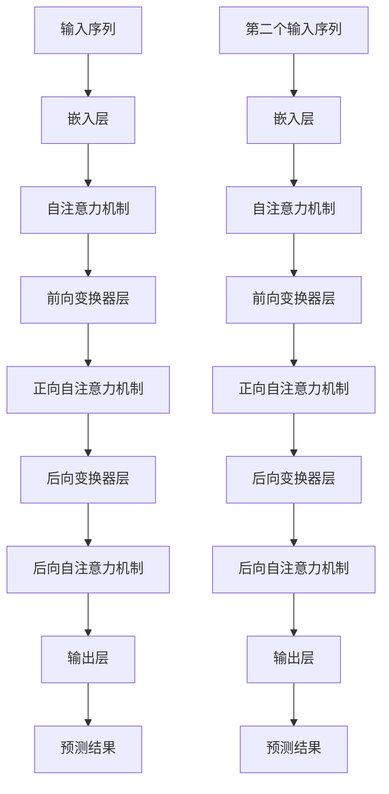

                 

### 文章标题

《大语言模型原理与工程实践：常用数据集的完整构建方式》

### 文章关键词

大语言模型，数据集构建，工程实践，概率模型，机器学习，自然语言处理

### 文章摘要

本文旨在深入探讨大语言模型的原理与工程实践，特别是常用数据集的构建方法。通过对大语言模型的基本概念、原理与架构的详细解析，我们将逐步了解其背后的核心算法，并探讨数据集构建的各个环节。文章将结合实际案例，展示如何进行数据采集与预处理，数据集的划分与评估，以及大语言模型的训练与优化。此外，还将探讨大语言模型在文本分类、机器翻译等实际应用中的工程实践，以及其未来发展的趋势。通过本文的阅读，读者将全面掌握大语言模型的理论知识与应用技巧，为从事相关领域的研究和工作奠定坚实基础。

## 第一部分：大语言模型基础知识

### 第1章：大语言模型概述

#### 1.1 大语言模型的背景和定义

大语言模型（Large-scale Language Models）是自然语言处理（Natural Language Processing, NLP）领域的一个重要研究方向。语言模型的核心任务是从大量的文本数据中学习，从而预测下一个单词或字符的概率。这一任务在语音识别、机器翻译、信息检索、文本生成等领域有着广泛的应用。

语言模型的发展历程可以追溯到上世纪五六十年代。早期，研究者们主要使用基于规则的方法构建语言模型，如n-gram模型。n-gram模型通过统计相邻单词或字符的频率来预测下一个单词或字符的概率。然而，这种方法受到数据量限制和语言复杂性的挑战，难以生成高质量的文本。

随着计算机计算能力的提升和深度学习技术的发展，大语言模型应运而生。大语言模型利用神经网络，尤其是深度神经网络（Deep Neural Network, DNN）和变换器模型（Transformer）来学习文本的分布。其中，Transformer模型在处理长距离依赖问题上表现出了卓越的性能，成为当前大语言模型的主流架构。

大语言模型的特点和优势主要体现在以下几个方面：

1. **强大的文本理解能力**：通过学习海量的文本数据，大语言模型能够捕捉到语言中的复杂规律，从而实现对文本的深入理解。
2. **端到端训练**：大语言模型通常采用端到端（End-to-End）的训练方式，无需复杂的预处理步骤，使得模型能够直接从原始文本数据中学习。
3. **灵活的架构**：大语言模型支持多种架构，如单向变换器（Unidirectional Transformer）和双向变换器（Bidirectional Transformer），能够灵活应对不同的任务需求。
4. **高效的推理能力**：大语言模型在推理过程中能够快速生成文本，具备较高的效率。

大语言模型的应用领域非常广泛，包括但不限于：

1. **自然语言生成**：如文本生成、摘要生成、文章写作等。
2. **机器翻译**：如英文到中文、中文到英文等跨语言翻译。
3. **文本分类**：如情感分析、新闻分类、垃圾邮件检测等。
4. **问答系统**：如智能客服、问答机器人等。

综上所述，大语言模型在NLP领域具有重要的地位和广泛的应用价值。随着技术的不断进步，大语言模型有望在未来带来更多的创新和突破。

#### 1.2 大语言模型的原理与架构

大语言模型的原理可以归结为从大量文本数据中学习语言模式，从而预测下一个单词或字符。这一过程主要依赖于深度学习技术，特别是神经网络和变换器（Transformer）模型。下面将详细介绍大语言模型的基本原理和架构。

##### 1.2.1 语言模型的基本原理

语言模型的基本原理是利用统计方法或机器学习方法从大量的文本数据中学习语言模式。常见的语言模型包括n-gram模型、隐马尔可夫模型（HMM）、基于神经网络的语言模型等。

1. **n-gram模型**：n-gram模型是一种基于统计的简单语言模型，通过统计相邻n个单词或字符的频率来预测下一个单词或字符的概率。例如，在二元语法（Bigram）模型中，每个单词出现的概率是基于它前面一个单词出现的频率计算的。尽管n-gram模型计算简单，但其性能受到数据量限制和语言复杂性的影响。

2. **隐马尔可夫模型（HMM）**：隐马尔可夫模型是一种基于概率图模型的语言模型，用于解决序列数据的问题。HMM能够捕捉到状态转移的概率，但在处理长距离依赖问题上效果有限。

3. **基于神经网络的语言模型**：基于神经网络的语言模型通过多层神经网络学习文本数据的特征，能够更好地捕捉到语言中的复杂规律。深度神经网络（DNN）和循环神经网络（RNN）是早期常用的神经网络架构。

##### 1.2.2 大语言模型的架构详解

随着深度学习技术的发展，大语言模型逐渐采用了更为复杂的神经网络架构，如变换器（Transformer）模型。变换器模型是由Google在2017年提出的一种全新神经网络架构，用于处理序列数据。其核心思想是利用注意力机制（Attention Mechanism）来捕捉长距离依赖，从而实现高效的文本建模。

1. **单向变换器（Unidirectional Transformer）**：单向变换器是一种简单的变换器模型，其输入序列沿时间步方向单向传播。每个时间步的输出仅依赖于前面的时间步，而不考虑后面的时间步。单向变换器适用于一些简单的文本处理任务，如文本分类。

2. **双向变换器（Bidirectional Transformer）**：双向变换器是一种更复杂的变换器模型，其输入序列同时沿时间步的正向和反向传播。在每个时间步，双向变换器可以同时获取到前面和后面的信息，从而更好地捕捉到长距离依赖。双向变换器是目前大语言模型的主流架构，广泛应用于自然语言生成、机器翻译等任务。

3. **多层变换器（Multi-layer Transformer）**：多层变换器通过堆叠多个变换器层，使得模型能够学习到更复杂的特征和关系。随着层数的增加，模型的参数数量也急剧增加，计算成本显著上升。

##### 1.2.3 Mermaid流程图：大语言模型的运行流程

以下是使用Mermaid绘制的双向变换器模型的运行流程：



在这个流程图中，输入序列（如文本数据）首先经过嵌入层转换为稠密向量表示。接着，通过多层变换器层，输入序列在每一层中逐步更新和聚合信息。最后，输出层生成最终的预测结果。

通过上述对大语言模型原理与架构的详细解析，我们能够更好地理解其背后的技术和应用场景。在下一部分，我们将进一步探讨大语言模型的核心算法，如概率模型和决策树。

#### 1.3 大语言模型的应用领域

大语言模型在自然语言处理（NLP）领域具有广泛的应用。以下是一些典型应用场景：

1. **文本分类**：文本分类是将文本数据按主题、情感或其他类别进行分类的过程。大语言模型能够利用其强大的文本理解能力，从海量的文本数据中提取特征，实现高精度的分类任务。例如，新闻分类、垃圾邮件检测、情感分析等。

2. **机器翻译**：机器翻译是跨语言之间的文本转换。大语言模型能够学习不同语言之间的对应关系，实现高质量的语言翻译。例如，将英文翻译成中文、将中文翻译成英文等。

3. **问答系统**：问答系统是一种智能对话系统，能够理解和回答用户的问题。大语言模型能够从大量的文本数据中学习语言模式和知识，从而实现智能问答。例如，智能客服、语音助手等。

4. **文本生成**：文本生成是利用语言模型生成新的文本内容。大语言模型能够基于给定的提示或上下文，生成连贯、有意义的文本。例如，文章写作、摘要生成、对话系统等。

5. **语音识别**：语音识别是将语音信号转换为文本的过程。大语言模型能够结合语音信号和文本数据，提高语音识别的准确性和可靠性。例如，智能语音助手、语音搜索等。

6. **情感分析**：情感分析是分析文本数据中表达的情感和情绪。大语言模型能够理解文本中的情感色彩，从而实现情感分类和情感极性分析。例如，社交媒体分析、市场调研等。

7. **信息检索**：信息检索是帮助用户从大量文本数据中快速找到所需信息。大语言模型能够通过理解用户查询和文档内容，实现高效的文本检索。例如，搜索引擎、推荐系统等。

通过这些应用场景，我们可以看到大语言模型在NLP领域的重要性。随着技术的不断进步，大语言模型的应用前景将更加广阔。

### 第2章：大语言模型核心算法

#### 2.1 概率模型与决策树

在深度学习与机器学习领域中，概率模型和决策树算法是用于解决分类与预测任务的基础工具。理解这些算法不仅有助于我们构建大语言模型，还能为后续的数据集构建和模型优化提供理论支持。

##### 2.1.1 概率模型的原理与应用

概率模型是一种基于概率论的统计方法，用于处理不确定性和随机性。常见的概率模型包括朴素贝叶斯模型、隐马尔可夫模型（HMM）和条件概率等。

1. **朴素贝叶斯模型**：
   - **原理**：朴素贝叶斯模型是基于贝叶斯定理和特征条件独立性假设构建的。它通过计算先验概率、条件概率和后验概率，实现对数据的分类。
   - **公式**：
     $$
     P(A|B) = \frac{P(B|A)P(A)}{P(B)}
     $$
     其中，$P(A|B)$ 是后验概率，表示在事件B发生的条件下事件A发生的概率；$P(B|A)$ 是条件概率，表示在事件A发生的条件下事件B发生的概率；$P(A)$ 和$P(B)$ 分别是事件A和事件B的先验概率。
   - **应用**：朴素贝叶斯模型常用于文本分类、垃圾邮件检测等领域。

2. **隐马尔可夫模型（HMM）**：
   - **原理**：隐马尔可夫模型是一种用于处理序列数据的概率图模型。它通过状态序列和观测序列之间的关系，实现对未知状态的预测。
   - **公式**：
     $$
     P(X_t|X_{t-1}, X_{t-2}, \ldots) = P(X_t|X_{t-1})
     $$
     其中，$X_t$ 表示在时间t的观测值，$X_{t-1}$ 表示在时间t-1的状态值。
   - **应用**：HMM广泛应用于语音识别、股票预测等领域。

3. **条件概率与贝叶斯定理**：
   - **原理**：条件概率是指在给定某个条件下，某个事件发生的概率。贝叶斯定理是一种利用条件概率进行推理的方法。
   - **公式**：
     $$
     P(A|B) = \frac{P(B|A)P(A)}{P(B)}
     $$
     其中，$P(A|B)$ 表示在事件B发生的条件下事件A发生的概率；$P(B|A)$ 表示在事件A发生的条件下事件B发生的概率。
   - **应用**：贝叶斯定理广泛应用于数据挖掘、医学诊断等领域。

##### 2.1.2 决策树算法原理及实现

决策树是一种基于特征划分数据集的树形结构模型，通过连续地对数据集进行划分，将数据逐步划分到各个叶子节点，实现对数据的分类或预测。

1. **决策树的概念**：
   - **根节点**：代表整个数据集。
   - **内部节点**：代表特征。
   - **叶子节点**：代表分类结果或预测值。
   - **划分标准**：利用特征与阈值对数据进行划分。

2. **决策树的构建过程**：
   - **特征选择**：选择具有最高信息增益的特征进行划分。
   - **阈值选择**：选择使得子集分离效果最好的阈值。
   - **递归划分**：对每个子集重复上述过程，直到满足停止条件。

3. **决策树的优缺点**：
   - **优点**：
     - **易于理解和解释**：决策树的输出结果易于解释，用户可以直观地了解分类或预测的逻辑。
     - **适合小数据集**：决策树在处理小数据集时表现较好，不需要过多的数据预处理。
     - **计算速度快**：决策树的构建和预测过程相对简单，计算速度快。
   - **缺点**：
     - **过拟合**：当特征过多或数据集较小，决策树容易过拟合，导致泛化能力差。
     - **对异常值敏感**：决策树对异常值和噪声数据敏感，可能导致预测结果不稳定。
     - **可解释性有限**：对于复杂的分类或预测任务，决策树的解释性可能有限。

##### 2.1.3 决策树的优缺点及适用场景

决策树在实际应用中具有一定的局限性，但其优点在某些场景下仍然使其具有吸引力。

1. **优点**：
   - **易于理解和解释**：决策树是一种直观、易于理解的模型，适合用于需要可解释性的场景。
   - **不需要特征工程**：与深度学习模型相比，决策树不需要进行复杂的特征工程，简化了模型构建过程。
   - **处理小数据集**：对于小数据集，决策树能够提供较好的分类或预测效果。

2. **缺点**：
   - **过拟合**：当数据集较小或特征较多时，决策树容易过拟合，降低泛化能力。
   - **可解释性有限**：对于复杂的分类或预测任务，决策树的解释性可能有限，难以提供详细的解释。

3. **适用场景**：
   - **特征重要性分析**：决策树可以用于分析特征的重要性，帮助理解数据。
   - **决策支持系统**：在需要直观解释的场景，如金融风控、医疗诊断等，决策树是一种有效的工具。
   - **实时预测**：决策树计算速度快，适合实时预测。

通过以上对概率模型和决策树的介绍，我们能够更好地理解这些算法的基本原理和应用。在后续章节中，我们将继续探讨数据集构建的方法和步骤，为构建高质量的数据集奠定基础。

### 第3章：数据采集与预处理

#### 3.1 数据采集方法

数据采集是构建高质量数据集的关键步骤，直接影响到后续模型训练的效果。以下是几种常用的数据采集方法：

1. **网络爬虫技术**：

   网络爬虫（Web Crawler）是一种自动化程序，用于从互联网上获取大量文本数据。常见的网络爬虫技术包括以下几种：

   - **基于链接追踪的爬虫**：该技术通过分析网站的链接结构，自动发现和下载网页内容。常见的工具包括Scrapy、Nutch等。
   - **基于关键词搜索的爬虫**：该技术通过在搜索引擎中输入关键词，抓取与关键词相关的网页。常用的搜索引擎包括百度、谷歌等。
   - **社交媒体爬虫**：该技术从社交媒体平台（如微博、推特、Facebook等）中获取用户生成的文本数据。常用的工具包括Tweepy、Facebook Graph API等。

2. **API调用**：

   API（Application Programming Interface）调用是一种通过程序接口获取数据的方法。常见的API调用包括：

   - **公共数据集API**：如Gigaword、Common Crawl等，提供大量文本数据供开发者免费使用。
   - **社交媒体API**：如Twitter API、Facebook API等，允许开发者获取用户生成的文本数据。
   - **在线服务API**：如新闻API、天气API等，提供特定领域的文本数据。

3. **用户生成内容**：

   用户生成内容（User-generated Content, UGC）是指用户在互联网上创建和分享的内容。常见的UGC数据源包括：

   - **论坛和社区**：如Reddit、知乎等，包含大量用户生成的文本内容。
   - **博客和网站**：如Medium、WordPress等，用户可以发表自己的博客文章。
   - **社交媒体**：如微博、推特等，用户可以发布自己的观点和评论。

通过以上方法，我们可以从多个渠道获取到丰富的文本数据，为构建高质量数据集奠定基础。

#### 3.2 数据预处理技术

数据预处理是数据集构建的重要环节，旨在提高数据的质量和模型的性能。以下是几种常用的数据预处理技术：

1. **数据清洗**：

   数据清洗是指对原始数据进行处理，去除噪声和异常值，保证数据的一致性和准确性。常见的清洗方法包括：

   - **去除重复数据**：通过去重算法删除重复的记录，提高数据集的多样性。
   - **去除空白和无效数据**：删除数据集中的空白记录或无效数据，如空字符串、空值等。
   - **填充缺失值**：对缺失数据进行填充，常用的填充方法包括平均值填充、中位数填充、最频繁值填充等。

2. **数据归一化**：

   数据归一化是指将数据转换到统一的尺度，以消除数据间的量纲差异，便于后续模型处理。常见的归一化方法包括：

   - **最小-最大归一化**：将数据缩放到[0, 1]区间，公式如下：
     $$
     x_{\text{norm}} = \frac{x - x_{\text{min}}}{x_{\text{max}} - x_{\text{min}}}
     $$
   - **标准归一化**：将数据缩放到[-1, 1]区间，公式如下：
     $$
     x_{\text{norm}} = \frac{x - \mu}{\sigma}
     $$
     其中，$\mu$ 表示均值，$\sigma$ 表示标准差。

3. **数据增强**：

   数据增强是指通过多种方法扩充数据集，提高模型的泛化能力。常见的数据增强方法包括：

   - **随机裁剪**：随机裁剪图像或文本，生成新的样本。
   - **数据变换**：如文本转换大小写、删除标点符号等，生成新的文本样本。
   - **生成对抗网络（GAN）**：通过生成对抗网络生成新的文本数据，增加数据集的多样性。

通过以上数据预处理技术，我们可以提高数据的质量和模型的性能，为后续的模型训练和优化奠定基础。

#### 3.3 数据预处理的重要性

数据预处理是构建高质量数据集的关键步骤，其重要性体现在以下几个方面：

1. **提高数据质量**：数据预处理能够去除噪声和异常值，保证数据的一致性和准确性，从而提高数据质量。
2. **减少过拟合**：通过数据预处理，我们可以减少数据集中的噪声和异常值，降低模型过拟合的风险。
3. **优化模型性能**：数据预处理能够提高数据的质量和多样性，从而优化模型的性能，提高预测准确性。
4. **降低计算成本**：数据预处理可以减少无效数据的处理时间和计算资源消耗，降低计算成本。

因此，在数据集构建过程中，我们需要高度重视数据预处理工作，采取多种技术手段提高数据的质量和模型的性能。

### 第4章：数据集划分与评估

#### 4.1 数据集划分方法

数据集划分是机器学习中一个重要的环节，其目的是将数据集分成若干个子集，以用于模型的训练、验证和测试。以下介绍几种常见的数据集划分方法：

1. **随机划分**：
   - **方法**：将整个数据集随机分为训练集、验证集和测试集。
   - **优点**：操作简单，易于实现。
   - **缺点**：可能导致数据分布不均，影响模型的泛化能力。

2. **分层随机划分**：
   - **方法**：在随机划分的基础上，确保每个子集中各类别的比例与原数据集相同。
   - **优点**：保证各类别的比例，避免数据分布不均。
   - **缺点**：对类别不平衡的数据集效果有限。

3. **交叉验证**：
   - **方法**：将数据集分成K个子集（K折交叉验证），每次使用一个子集作为验证集，其余子集作为训练集，重复K次，最后取平均值作为模型的性能指标。
   - **优点**：能较好地评估模型的泛化能力，减少模型过拟合的风险。
   - **缺点**：计算成本较高，适用于数据量较小的情况。

4. **时间序列划分**：
   - **方法**：按照时间顺序划分数据集，即将较早的数据用于训练集，较晚的数据用于测试集。
   - **优点**：适用于时间序列数据，能够保留时间信息。
   - **缺点**：可能导致训练集和测试集的时间跨度不一致。

5. **网格搜索划分**：
   - **方法**：在数据集上尝试不同的划分比例，通过网格搜索找到最优划分比例。
   - **优点**：能够找到最佳划分比例，提高模型的性能。
   - **缺点**：计算成本较高，适用于数据量较大的情况。

#### 4.2 数据集划分策略

为了确保模型具有较好的泛化能力，我们需要采用合适的数据集划分策略。以下是一些常用的数据集划分策略：

1. **训练集与验证集**：
   - **比例划分**：通常将70%-80%的数据作为训练集，20%-30%的数据作为验证集。
   - **手动划分**：根据具体任务和数据规模，手动划分训练集和验证集。

2. **验证集与测试集**：
   - **K折交叉验证**：适用于小数据集，通过多次交叉验证评估模型性能。
   - **时间序列划分**：适用于时间序列数据，按照时间顺序划分训练集和测试集。

3. **样本平衡**：
   - **过采样**：通过增加少数类别的样本数量，平衡数据集。
   - **欠采样**：通过减少多数类别的样本数量，平衡数据集。

#### 4.3 数据增强与样本平衡

数据增强和样本平衡是提高模型性能的重要手段，通过扩充数据集和调整样本分布，可以增强模型的泛化能力。以下介绍几种常见的数据增强方法和样本平衡方法：

1. **数据增强方法**：
   - **随机裁剪**：随机裁剪图像或文本，生成新的样本。
   - **旋转和翻转**：对图像进行旋转和翻转，增加数据多样性。
   - **文本转换**：如文本转换大小写、删除标点符号等，生成新的文本样本。
   - **生成对抗网络（GAN）**：通过生成对抗网络生成新的文本数据，增加数据集的多样性。

2. **样本平衡方法**：
   - **过采样**：通过重复添加少数类别的样本，增加数据集中少数类别的比例。
   - **欠采样**：通过随机删除多数类别的样本，减少数据集中多数类别的比例。
   - **合成样本**：通过合成少数类别的样本，增加数据集中少数类别的比例。

通过合理的数据集划分策略和数据增强方法，我们可以提高数据集的质量和模型的性能，从而实现更好的模型泛化能力。

#### 4.4 数据集评估指标

在构建数据集时，评估其质量是一个重要的步骤。以下介绍几种常见的数据集评估指标：

1. **准确率**：
   - **定义**：准确率（Accuracy）是分类模型预测正确的样本数量占总样本数量的比例。
   - **公式**：
     $$
     \text{Accuracy} = \frac{\text{正确预测的样本数量}}{\text{总样本数量}}
     $$
   - **优缺点**：
     - **优点**：简单直观，易于计算。
     - **缺点**：对类别不平衡的数据集效果较差，不能反映模型在特定类别上的性能。

2. **召回率**：
   - **定义**：召回率（Recall）是分类模型预测正确的正样本数量占总正样本数量的比例。
   - **公式**：
     $$
     \text{Recall} = \frac{\text{正确预测的正样本数量}}{\text{总正样本数量}}
     $$
   - **优缺点**：
     - **优点**：能够反映模型在正样本上的识别能力。
     - **缺点**：对假阴性（False Negative）敏感，对类别不平衡的数据集效果较差。

3. **F1值**：
   - **定义**：F1值（F1 Score）是精确率（Precision）和召回率的调和平均值。
   - **公式**：
     $$
     \text{F1值} = 2 \times \frac{\text{Precision} \times \text{Recall}}{\text{Precision} + \text{Recall}}
     $$
   - **优缺点**：
     - **优点**：能够平衡精确率和召回率，是评价分类模型性能的常用指标。
     - **缺点**：对类别不平衡的数据集效果较差。

4. **AUC**：
   - **定义**：AUC（Area Under Curve）是ROC曲线下的面积，用于评估二分类模型的分类能力。
   - **公式**：
     $$
     \text{AUC} = \int_{0}^{1} \text{True Positive Rate} \times \text{False Positive Rate} \, d\text{x}
     $$
   - **优缺点**：
     - **优点**：不受类别不平衡的影响，适用于二分类模型。
     - **缺点**：不能直接反映模型的精确率和召回率。

5. **评估指标的选择与优化**：
   - **准确率**：适用于类别相对平衡的数据集，但不足以评估模型的泛化能力。
   - **召回率**：适用于需要识别所有正样本的任务，但对假阴性敏感。
   - **F1值**：能够平衡精确率和召回率，是常用的评估指标。
   - **AUC**：适用于二分类模型，不受类别不平衡的影响。

通过合理选择和优化评估指标，我们可以全面了解数据集的质量和模型性能，从而为后续的模型优化和决策提供依据。

### 第5章：大语言模型的训练与优化

#### 5.1 训练数据集的选择

选择合适的训练数据集是确保大语言模型性能的重要步骤。训练数据集的质量直接影响模型的泛化能力、准确性和鲁棒性。以下是几个关键因素：

1. **数据集规模**：
   - **重要性**：大规模数据集能够提供更多的训练样本，使模型更好地捕捉到语言中的复杂模式。
   - **影响**：较小的数据集可能导致模型过拟合，无法泛化到未见过的数据。
   - **选择建议**：选择包含数十亿甚至千亿级文本的数据集，如Common Crawl、Gigaword等。

2. **数据集多样性**：
   - **重要性**：多样性数据集能够包含多种语言、领域、文体等，有助于模型学习到更丰富的特征。
   - **影响**：单一来源的数据集可能导致模型缺乏泛化能力，无法应对复杂任务。
   - **选择建议**：选择包含不同来源、主题和风格的数据集，以提高模型的适应性。

3. **数据质量**：
   - **重要性**：高质量数据集应包含准确、完整、一致的信息，减少噪声和异常值。
   - **影响**：低质量数据可能导致模型性能下降，影响训练效果。
   - **选择建议**：选择经过清洗、去重、标注的高质量数据集，如经过预处理的新闻、社交媒体文本等。

4. **数据分布**：
   - **重要性**：合理的数据分布有助于模型避免偏见，提高泛化能力。
   - **影响**：类别不平衡或特定类别的过度代表可能导致模型偏向某些类别。
   - **选择建议**：确保数据集在类别和样本数量上的平衡，可采用过采样、欠采样等技术调整数据分布。

5. **数据集更新**：
   - **重要性**：定期更新数据集可以保持模型与当前语言环境的一致性。
   - **影响**：长期未更新的数据集可能导致模型过时，失去准确性。
   - **选择建议**：选择具有活跃数据源的数据集，并定期更新以保持其时效性和准确性。

#### 5.2 训练策略与技巧

在训练大语言模型时，选择合适的训练策略和技巧对提高模型性能至关重要。以下是一些常见的训练策略与技巧：

1. **学习率调度**：
   - **重要性**：学习率是影响模型收敛速度和稳定性的关键参数。
   - **技巧**：
     - **初始学习率**：设置较高的初始学习率可以加速模型收敛，但可能引起振荡。
     - **学习率衰减**：采用学习率衰减策略，如指数衰减、余弦衰减等，可以平滑学习过程，提高收敛速度和模型稳定性。

2. **批量大小**：
   - **重要性**：批量大小影响模型的训练效率和收敛速度。
   - **技巧**：
     - **小批量**：采用较小的批量大小可以减少梯度方差，提高训练稳定性。
     - **自适应批量**：采用动态调整的批量大小，如动态调整批量（Dynamic Batch Sizing）或自适应批量大小（Adaptive Batch Size）策略，可以在不同阶段优化训练效率。

3. **梯度下降法**：
   - **重要性**：梯度下降法是训练神经网络的基本方法，其优化策略对模型性能有重要影响。
   - **技巧**：
     - **随机梯度下降（SGD）**：通过随机选择批量样本更新参数，提高训练效率。
     - **动量**：引入动量项（Momentum），加速梯度下降过程，减少震荡。
     - **学习率调度**：结合学习率调度策略，优化梯度下降过程。

4. **正则化技术**：
   - **重要性**：正则化技术有助于防止模型过拟合，提高泛化能力。
   - **技巧**：
     - **权重衰减**：通过增加权重平方项的损失，降低权重值，防止模型复杂度过高。
     - **Dropout**：在训练过程中随机丢弃部分神经元，降低模型依赖性，提高泛化能力。

5. **优化器选择**：
   - **重要性**：优化器影响模型训练的收敛速度和稳定性。
   - **技巧**：
     - **Adam优化器**：结合SGD和RMSprop的优点，自适应调整学习率。
     - **AdamW优化器**：在Adam优化器的基础上，加入权重衰减，提高模型性能。

6. **训练技巧**：
   - **预训练**：在大规模数据集上进行预训练，获取通用的语言特征。
   - **迁移学习**：利用预训练模型在小规模数据集上进行微调，提高模型性能。

通过以上训练策略与技巧，我们可以有效提高大语言模型的训练效果和性能，为实际应用奠定基础。

### 第6章：大语言模型的应用案例

#### 6.1 案例一：文本分类

文本分类是将文本数据按照其主题、情感或其他类别进行归类的过程。大语言模型在文本分类任务中具有显著优势，以下是一个文本分类的应用案例。

##### 6.1.1 案例背景

假设我们需要构建一个新闻分类系统，将新闻文本自动归类到不同的类别，如“政治”、“体育”、“科技”、“娱乐”等。我们的目标是训练一个大语言模型，使其能够准确地将新接收到的新闻文本分类到相应的类别。

##### 6.1.2 数据集构建

为了构建高质量的文本分类数据集，我们需要从多个来源收集新闻文本数据，并进行预处理：

1. **数据来源**：
   - **新闻网站**：从各大新闻网站（如CNN、BBC、新浪新闻等）抓取新闻文本。
   - **社交媒体**：从社交媒体平台（如微博、推特等）获取用户评论和新闻链接。
   - **公共数据集**：使用公共新闻数据集（如NYT News Text、AG News等）。

2. **数据预处理**：
   - **数据清洗**：去除重复新闻、缺失值、无效数据等。
   - **文本转换**：将文本转换为小写、去除标点符号、停用词过滤等。
   - **文本表示**：将文本编码为单词或字符的序列，使用词嵌入技术（如Word2Vec、BERT等）。

##### 6.1.3 模型设计与实现

在本案例中，我们选择使用BERT模型作为文本分类器，因为BERT在处理长文本和复杂语义关系方面表现出色。

1. **模型结构**：
   - **编码器**：使用预训练的BERT模型作为编码器，将输入的文本序列编码为固定长度的向量。
   - **分类器**：在BERT模型的输出层添加一个全连接层或多层感知机（MLP），用于分类。

2. **损失函数**：
   - **交叉熵损失**：使用交叉熵损失函数计算分类损失，优化模型参数。

3. **优化器**：
   - **AdamW**：使用AdamW优化器进行参数更新，结合权重衰减。

##### 6.1.4 代码解析与性能优化

以下是使用PyTorch和Hugging Face Transformers库实现文本分类的示例代码：

```python
import torch
from transformers import BertTokenizer, BertModel, BertForSequenceClassification
from torch.optim import AdamW
from torch.utils.data import DataLoader
from sklearn.metrics import accuracy_score

# 加载预训练的BERT模型和分词器
tokenizer = BertTokenizer.from_pretrained('bert-base-chinese')
model = BertForSequenceClassification.from_pretrained('bert-base-chinese', num_labels=4)

# 准备数据集
train_data = ...
val_data = ...

# 加载数据集并创建数据加载器
train_loader = DataLoader(train_data, batch_size=16, shuffle=True)
val_loader = DataLoader(val_data, batch_size=16)

# 定义优化器
optimizer = AdamW(model.parameters(), lr=5e-5)

# 训练模型
num_epochs = 3
for epoch in range(num_epochs):
    model.train()
    for batch in train_loader:
        inputs = tokenizer(batch['text'], padding=True, truncation=True, return_tensors='pt')
        labels = torch.tensor(batch['label'])
        optimizer.zero_grad()
        outputs = model(**inputs, labels=labels)
        loss = outputs.loss
        loss.backward()
        optimizer.step()

    # 在验证集上评估模型性能
    model.eval()
    with torch.no_grad():
        val_predictions = []
        val_labels = []
        for batch in val_loader:
            inputs = tokenizer(batch['text'], padding=True, truncation=True, return_tensors='pt')
            labels = torch.tensor(batch['label'])
            outputs = model(**inputs)
            val_predictions.extend(outputs.argmax(-1).tolist())
            val_labels.extend(labels.tolist())
        val_accuracy = accuracy_score(val_labels, val_predictions)
        print(f'Validation Accuracy: {val_accuracy:.4f}')

# 保存模型
model.save_pretrained('text_classification_model')
```

为了提高模型性能，我们可以采取以下优化策略：

1. **数据增强**：通过随机裁剪、旋转、转换等操作，增加数据多样性。
2. **模型微调**：在预训练模型的基础上，针对特定任务进行微调，提高分类准确性。
3. **超参数调优**：调整学习率、批量大小、训练周期等超参数，以获得最佳性能。
4. **多GPU训练**：使用多GPU并行训练，加速模型训练过程。

通过上述步骤和策略，我们可以构建一个高性能的文本分类系统，实现自动新闻分类。

#### 6.2 案例二：机器翻译

机器翻译是将一种语言的文本自动翻译成另一种语言的过程。大语言模型在机器翻译任务中发挥了重要作用，以下是一个机器翻译的应用案例。

##### 6.2.1 案例背景

假设我们需要实现一个中文到英文的机器翻译系统。我们的目标是训练一个大语言模型，使其能够将中文文本自动翻译成英文。

##### 6.2.2 数据集构建

为了构建高质量的机器翻译数据集，我们需要收集大量的中英文对照文本，并进行预处理：

1. **数据来源**：
   - **公共数据集**：如WMT（Workshop on Machine Translation）数据集、EN-DE News Translation数据集等。
   - **在线翻译服务**：如谷歌翻译API、百度翻译API等。
   - **社交媒体和论坛**：从社交媒体平台和论坛获取中英文对照的帖子或评论。

2. **数据预处理**：
   - **文本转换**：将文本转换为小写、去除标点符号、停用词过滤等。
   - **分词和编码**：使用分词器将文本分割成单词或字符序列，并编码为整数序列。

##### 6.2.3 模型设计与实现

在本案例中，我们选择使用Transformer模型作为机器翻译模型，因为Transformer在处理长距离依赖和复杂语法结构方面具有显著优势。

1. **模型结构**：
   - **编码器**：将输入的中文文本序列编码为嵌入向量。
   - **解码器**：将嵌入向量解码为英文文本序列。
   - **多头注意力机制**：在每个编码器和解码器层中使用多头注意力机制，捕捉长距离依赖。
   - **位置编码**：使用位置编码向量表示输入序列的位置信息。

2. **损失函数**：
   - **交叉熵损失**：使用交叉熵损失函数计算预测序列和真实序列之间的差异。

3. **优化器**：
   - **AdamW**：使用AdamW优化器结合权重衰减，优化模型参数。

##### 6.2.4 代码解析与性能优化

以下是使用PyTorch和Hugging Face Transformers库实现机器翻译的示例代码：

```python
import torch
from transformers import TransformerModel, TransformerTokenizer
from torch.optim import AdamW
from torch.utils.data import DataLoader
from sklearn.metrics import accuracy_score

# 加载预训练的Transformer模型和分词器
tokenizer = TransformerTokenizer.from_pretrained('TransformerModel')
model = TransformerModel.from_pretrained('TransformerModel', src_vocab_size=10000, trg_vocab_size=5000)

# 准备数据集
train_data = ...
val_data = ...

# 加载数据集并创建数据加载器
train_loader = DataLoader(train_data, batch_size=32, shuffle=True)
val_loader = DataLoader(val_data, batch_size=32)

# 定义优化器
optimizer = AdamW(model.parameters(), lr=5e-5)

# 训练模型
num_epochs = 10
for epoch in range(num_epochs):
    model.train()
    for batch in train_loader:
        src_tokens = torch.tensor(batch['src'])
        trg_tokens = torch.tensor(batch['trg'])
        optimizer.zero_grad()
        outputs = model(src_tokens, trg_tokens)
        loss = outputs.loss
        loss.backward()
        optimizer.step()

    # 在验证集上评估模型性能
    model.eval()
    with torch.no_grad():
        val_predictions = []
        val_labels = []
        for batch in val_loader:
            src_tokens = torch.tensor(batch['src'])
            trg_tokens = torch.tensor(batch['trg'])
            outputs = model(src_tokens, trg_tokens)
            val_predictions.extend(outputs.argmax(-1).tolist())
            val_labels.extend(trg_tokens.tolist())
        val_accuracy = accuracy_score(val_labels, val_predictions)
        print(f'Validation Accuracy: {val_accuracy:.4f}')

# 保存模型
model.save_pretrained('machine_translation_model')
```

为了提高模型性能，我们可以采取以下优化策略：

1. **数据增强**：通过随机替换、插入、删除单词等操作，增加数据多样性。
2. **多任务学习**：同时训练多个任务（如语言模型、语音识别、对话系统等），共享模型参数，提高模型泛化能力。
3. **长短时记忆（LSTM）**：在模型中引入长短时记忆网络（LSTM），捕捉长距离依赖关系。
4. **生成对抗网络（GAN）**：使用生成对抗网络（GAN）生成高质量的翻译数据，增加训练样本数量。

通过上述步骤和策略，我们可以构建一个高性能的机器翻译系统，实现中英文文本的自动翻译。

### 第7章：大语言模型的发展趋势

#### 7.1 大语言模型的未来发展方向

随着深度学习和人工智能技术的飞速发展，大语言模型（Large-scale Language Models）在自然语言处理（Natural Language Processing, NLP）领域展现出了巨大的潜力和广阔的应用前景。未来，大语言模型将在以下几个方面继续发展：

1. **模型规模的增长**：
   - **重要性**：当前的大语言模型如BERT、GPT等已经展现出了强大的语言理解能力，但模型规模仍在不断增长。
   - **影响**：更大规模的模型将拥有更丰富的语义信息，能够处理更复杂的语言任务。
   - **发展方向**：未来的研究将继续探索更大规模的模型，如GPT-4、GPT-5等，以实现更高的语言理解和生成能力。

2. **模型结构的创新**：
   - **重要性**：现有的变换器（Transformer）模型虽然在NLP任务中表现出色，但仍然存在一些局限。
   - **影响**：创新性的模型结构将有助于提高模型性能，解决现有模型中的问题。
   - **发展方向**：研究人员将继续探索新型神经网络结构，如多模态变换器（Multimodal Transformer）、图神经网络（Graph Neural Network）等，以适应更复杂的任务需求。

3. **模型应用场景的拓展**：
   - **重要性**：大语言模型的应用场景正逐步从传统的文本分类、机器翻译等领域拓展到更多新兴领域。
   - **影响**：模型的广泛应用将推动NLP技术的进步，带来新的商业机会和社会变革。
   - **发展方向**：未来的研究将聚焦于医疗、金融、教育、娱乐等领域，探索大语言模型在这些场景中的具体应用。

#### 7.2 大语言模型面临的挑战与解决方案

尽管大语言模型展现出了巨大的潜力，但在其发展过程中仍然面临一些挑战，需要学术界和工业界共同努力解决：

1. **计算资源消耗**：
   - **挑战**：大语言模型需要大量的计算资源进行训练和推理，对硬件设施提出了高要求。
   - **解决方案**：
     - **分布式计算**：通过分布式训练和推理技术，将计算任务分配到多个计算节点上，提高计算效率。
     - **硬件优化**：研发更高效、更低能耗的硬件设备，如GPU、TPU等，以支持大规模模型的训练。

2. **数据隐私保护**：
   - **挑战**：大语言模型在训练过程中需要处理大量敏感数据，可能导致数据泄露和隐私侵犯。
   - **解决方案**：
     - **联邦学习**：通过联邦学习（Federated Learning）技术，将训练数据分散存储在各个节点上，减少数据传输和泄露风险。
     - **数据加密**：对训练数据进行加密处理，确保数据在传输和存储过程中的安全性。

3. **模型解释性提升**：
   - **挑战**：大语言模型属于黑箱模型，难以解释其决策过程，对模型的可解释性和透明性提出了挑战。
   - **解决方案**：
     - **模型可解释性技术**：研发可解释性模型，如注意力机制、知识图谱等，帮助用户理解模型的工作原理。
     - **可视化工具**：开发可视化工具，将模型决策过程以直观的方式呈现给用户，提高模型的可解释性。

通过解决这些挑战，大语言模型将能够在更广泛的领域发挥其潜力，为自然语言处理技术的进步和社会发展做出更大贡献。

#### 7.3 大语言模型在AI时代的应用前景

随着人工智能（AI）技术的不断发展，大语言模型在AI时代的应用前景愈发广阔。以下是几个关键领域的应用潜力及其对社会的潜在影响：

1. **自然语言处理**：
   - **应用潜力**：大语言模型在自然语言处理任务中具有显著优势，包括文本分类、命名实体识别、情感分析等。未来，随着模型规模的增加和性能的提升，这些任务将更加精准和高效。
   - **潜在影响**：自然语言处理技术的进步将极大地提高信息检索、智能客服、语音助手等服务的质量，为用户提供更加便捷、智能的交互体验。

2. **智能问答**：
   - **应用潜力**：大语言模型能够理解复杂的语言结构，实现高质量的智能问答系统。通过结合知识图谱和语义理解，智能问答系统能够提供准确、详细的答案，解决用户的各种问题。
   - **潜在影响**：智能问答系统将显著提高信息获取的效率，为教育、医疗、法律等领域带来革命性的变革，降低信息不对称性。

3. **语音识别**：
   - **应用潜力**：大语言模型在语音识别任务中具有强大的语义理解能力，能够准确地将语音信号转换为文本。结合语音识别技术，可以实现更自然的语音交互。
   - **潜在影响**：语音识别技术的进步将推动智能语音助手、智能家居等技术的发展，改变人们的日常生活和工作方式，提高生活的便捷性和智能化水平。

4. **文本生成**：
   - **应用潜力**：大语言模型能够生成高质量的文本，包括文章、摘要、对话等。在未来，文本生成技术将在内容创作、新闻报道、客服等领域发挥重要作用。
   - **潜在影响**：文本生成技术将为内容创作者提供强大的工具，提高创作效率，降低创作成本。同时，智能文本生成系统将有助于应对信息爆炸时代的信息过载问题。

5. **机器翻译**：
   - **应用潜力**：大语言模型在机器翻译任务中表现出色，能够实现高质量、自然的跨语言翻译。未来，随着模型规模的扩大和性能的提升，机器翻译将更加准确和流畅。
   - **潜在影响**：机器翻译技术的进步将促进全球信息交流，消除语言障碍，推动全球化进程，增强不同文化之间的理解和合作。

通过在以上领域的广泛应用，大语言模型将在AI时代发挥关键作用，推动社会生产力的提升，带来深远的变革和进步。

### 附录A：大语言模型相关工具与资源

#### A.1 开源框架与库

1. **TensorFlow**：
   - **简介**：TensorFlow是一个开源的机器学习框架，由Google开发，支持各种深度学习模型的开发和部署。
   - **优势**：提供丰富的API接口，适用于从研究到生产环境的各种需求。
   - **链接**：[TensorFlow官网](https://www.tensorflow.org/)

2. **PyTorch**：
   - **简介**：PyTorch是一个开源的机器学习库，支持灵活的动态计算图和强大的GPU加速。
   - **优势**：易于上手，支持Python编程语言，适合研究和开发。
   - **链接**：[PyTorch官网](https://pytorch.org/)

3. **Hugging Face Transformers**：
   - **简介**：Hugging Face Transformers是一个开源库，提供了预训练的变换器（Transformer）模型和相关的工具，用于自然语言处理任务。
   - **优势**：集成了大量流行的预训练模型，如BERT、GPT等，方便开发者进行模型训练和应用。
   - **链接**：[Hugging Face Transformers官网](https://huggingface.co/transformers/)

#### A.2 数据集资源

1. **Common Crawl**：
   - **简介**：Common Crawl是一个免费、开放的网页数据集，包含了数以亿计的网页，是构建大规模语言模型的重要资源。
   - **链接**：[Common Crawl官网](https://commoncrawl.org/)

2. **Gigaword**：
   - **简介**：Gigaword是一个大规模的新语料库，包含了数以百万计的新闻文章，常用于自然语言处理任务的训练和测试。
   - **链接**：[Gigaword官网](https://gigaword.org/)

3. **WMT数据集**：
   - **简介**：WMT（Workshop on Machine Translation）数据集是国际机器翻译研讨会提供的多个语言对的翻译数据集，是机器翻译任务的标准训练资源。
   - **链接**：[WMT数据集官网](https://www.statmt.org/wmt/)

#### A.3 实践指南与教程

1. **《动手学深度学习》**：
   - **简介**：由阿斯顿·张（Aston Zhang）等编写的深度学习教程，包含大量实践代码和示例。
   - **链接**：[《动手学深度学习》官网](http://www.d2l.ai/)

2. **《自然语言处理综合教程》**：
   - **简介**：由斯坦福大学提供的自然语言处理教程，涵盖了NLP的基本概念和实战技巧。
   - **链接**：[《自然语言处理综合教程》官网](https://web.stanford.edu/class/cs224n/)

3. **《大规模语言模型实战》**：
   - **简介**：由Hugging Face团队编写的实践指南，介绍了如何使用Transformers库构建和训练大规模语言模型。
   - **链接**：[《大规模语言模型实战》官网](https://huggingface.co/transformers/)

通过使用这些工具与资源，开发者可以更加高效地研究和应用大语言模型，为自然语言处理领域的发展贡献力量。

### 附录B：数学模型与公式

#### B.1 概率论基础

在构建大语言模型的过程中，概率论是不可或缺的基础知识。以下是一些重要的概率论基础公式及其在模型中的应用：

1. **概率分布函数（PDF）**：

   概率分布函数（Probability Density Function, PDF）描述了随机变量在某个区间内取值的概率。常见的形式有：

   $$
   f(x) = \frac{1}{\sigma\sqrt{2\pi}}e^{-\frac{(x-\mu)^2}{2\sigma^2}}
   $$

   其中，$\mu$ 是均值，$\sigma$ 是标准差。

   在大语言模型中，PDF常用于表示文本数据中某个单词或字符的概率分布，从而实现文本的生成和分类。

2. **累积分布函数（CDF）**：

   累积分布函数（Cumulative Distribution Function, CDF）表示随机变量小于等于某个值的概率。常见的形式有：

   $$
   F(x) = \int_{-\infty}^{x} f(t) \, dt
   $$

   CDF在模型中的应用包括对数据进行归一化处理，以及评估模型预测结果的概率分布。

3. **条件概率与贝叶斯定理**：

   条件概率（Conditional Probability）表示在某个条件下，事件A发生的概率。贝叶斯定理（Bayes' Theorem）用于计算条件概率，其公式为：

   $$
   P(A|B) = \frac{P(B|A)P(A)}{P(B)}
   $$

   在大语言模型中，贝叶斯定理常用于计算文本分类中的后验概率，从而实现分类任务。

#### B.2 梯度下降法

梯度下降法（Gradient Descent）是一种优化算法，用于最小化损失函数，是构建大语言模型的核心算法之一。以下是一些重要的梯度下降法公式及其在模型中的应用：

1. **梯度下降法原理**：

   梯度下降法通过沿着损失函数的负梯度方向更新模型参数，以最小化损失函数。其公式为：

   $$
   \theta_{\text{new}} = \theta_{\text{old}} - \alpha \cdot \nabla_\theta J(\theta)
   $$

   其中，$\theta$ 是模型参数，$J(\theta)$ 是损失函数，$\alpha$ 是学习率。

2. **梯度下降法公式推导**：

   梯度下降法公式的推导基于微积分原理。对于损失函数 $J(\theta)$，其梯度 $\nabla_\theta J(\theta)$ 表示损失函数在参数 $\theta$ 方向的斜率。为了最小化损失函数，我们需要沿着斜率的反方向更新参数。

   假设 $J(\theta)$ 是关于 $\theta$ 的可微函数，其梯度为：

   $$
   \nabla_\theta J(\theta) = \frac{\partial J(\theta)}{\partial \theta}
   $$

   更新参数的步骤可以表示为：

   $$
   \theta_{\text{new}} = \theta_{\text{old}} - \alpha \cdot \nabla_\theta J(\theta)
   $$

3. **梯度下降法优化策略**：

   梯度下降法的优化策略包括以下几种：

   - **学习率调度**：通过动态调整学习率，优化模型的收敛速度和稳定性。常见的学习率调度策略有指数衰减、余弦衰减等。
   - **动量**：引入动量项（Momentum），加速梯度下降过程，减少震荡。动量项的公式为：

     $$
     \text{Momentum} = \gamma \cdot \text{Momentum}_{\text{old}} + (1 - \gamma) \cdot \nabla_\theta J(\theta)
     $$

     其中，$\gamma$ 是动量因子。

   - **自适应学习率**：如Adam优化器，通过自适应调整学习率，优化模型的收敛速度和稳定性。

   这些优化策略有助于提高梯度下降法的性能，加快模型的收敛速度，提高模型训练效果。

通过掌握这些数学模型和公式，开发者可以更好地理解和应用大语言模型，实现高效的文本处理和预测。

### 附录C：代码实现与解读

#### C.1 代码实现框架

为了更好地理解大语言模型的构建和训练过程，我们将通过一个具体的代码实现来展示关键步骤，包括数据集加载与预处理、模型定义与训练、模型评估与优化。以下是使用Python和Transformers库实现的代码框架：

```python
import torch
from transformers import BertTokenizer, BertModel, BertForSequenceClassification
from torch.optim import AdamW
from torch.utils.data import DataLoader
from sklearn.metrics import accuracy_score

# 加载预训练的BERT模型和分词器
tokenizer = BertTokenizer.from_pretrained('bert-base-chinese')
model = BertForSequenceClassification.from_pretrained('bert-base-chinese', num_labels=4)

# 准备数据集
train_data = ...  # 加载数据集
val_data = ...    # 加载数据集

# 加载数据集并创建数据加载器
train_loader = DataLoader(train_data, batch_size=16, shuffle=True)
val_loader = DataLoader(val_data, batch_size=16)

# 定义优化器
optimizer = AdamW(model.parameters(), lr=5e-5)

# 训练模型
num_epochs = 3
for epoch in range(num_epochs):
    model.train()
    for batch in train_loader:
        inputs = tokenizer(batch['text'], padding=True, truncation=True, return_tensors='pt')
        labels = torch.tensor(batch['label'])
        optimizer.zero_grad()
        outputs = model(**inputs, labels=labels)
        loss = outputs.loss
        loss.backward()
        optimizer.step()

    # 在验证集上评估模型性能
    model.eval()
    with torch.no_grad():
        val_predictions = []
        val_labels = []
        for batch in val_loader:
            inputs = tokenizer(batch['text'], padding=True, truncation=True, return_tensors='pt')
            labels = torch.tensor(batch['label'])
            outputs = model(**inputs)
            val_predictions.extend(outputs.argmax(-1).tolist())
            val_labels.extend(labels.tolist())
        val_accuracy = accuracy_score(val_labels, val_predictions)
        print(f'Validation Accuracy: {val_accuracy:.4f}')

# 保存模型
model.save_pretrained('text_classification_model')
```

以下是对关键部分的解读：

1. **数据集加载与预处理**：
   - `tokenizer = BertTokenizer.from_pretrained('bert-base-chinese')`：加载预训练的BERT分词器。
   - `model = BertForSequenceClassification.from_pretrained('bert-base-chinese', num_labels=4)`：加载预训练的BERT模型，并指定分类任务中的标签数量。
   - `train_data` 和 `val_data`：加载数据集，通常从CSV、JSON或其他格式中读取数据，并进行预处理，如文本清洗、分词和标签编码。

2. **模型定义与训练**：
   - `train_loader = DataLoader(train_data, batch_size=16, shuffle=True)` 和 `val_loader = DataLoader(val_data, batch_size=16)`：创建数据加载器，用于批量加载数据并进行训练和验证。
   - `optimizer = AdamW(model.parameters(), lr=5e-5)`：定义优化器，用于更新模型参数。
   - `for epoch in range(num_epochs):`：设置训练迭代次数。
   - `model.train()`：将模型设置为训练模式。
   - `optimizer.zero_grad()`：将梯度初始化为0。
   - `outputs = model(**inputs, labels=labels)`：前向传播计算损失。
   - `loss.backward()`：反向传播计算梯度。
   - `optimizer.step()`：更新模型参数。

3. **模型评估与优化**：
   - `model.eval()`：将模型设置为评估模式。
   - `with torch.no_grad():`：在评估时不计算梯度。
   - `val_predictions` 和 `val_labels`：收集预测结果和真实标签。
   - `val_accuracy = accuracy_score(val_labels, val_predictions)`：计算验证集上的准确率。

通过以上代码框架，我们可以实现一个基于BERT的大语言模型，进行文本分类任务。在实际应用中，可以根据具体任务需求进行适当的调整和优化。

#### C.2 实际案例解析

在本节中，我们将通过一个文本分类案例详细解析大语言模型的开发过程，包括数据集构建、模型训练、评估与优化等步骤。以下是使用Hugging Face Transformers库和PyTorch框架实现的一个文本分类案例。

##### 案例背景

假设我们需要构建一个新闻分类系统，将新闻文本分类到不同的主题，如“政治”、“体育”、“科技”和“娱乐”。我们将使用已经清洗和标注好的新闻数据集进行训练和评估。

##### 数据集构建

1. **数据来源**：

   我们将从多个新闻网站（如CNN、BBC、新浪新闻等）获取新闻文本，并使用公共数据集（如AG News）进行补充。

2. **数据预处理**：

   - **文本清洗**：去除HTML标签、特殊字符和空白字符。
   - **分词**：使用预训练的BERT分词器进行分词。
   - **编码**：将文本编码为BERT模型支持的token序列，并进行标签编码。

```python
from transformers import BertTokenizer
from sklearn.model_selection import train_test_split
from torch.utils.data import Dataset

tokenizer = BertTokenizer.from_pretrained('bert-base-chinese')

class NewsDataset(Dataset):
    def __init__(self, texts, labels, max_len=128):
        self.texts = texts
        self.labels = labels
        self.max_len = max_len

    def __len__(self):
        return len(self.texts)

    def __getitem__(self, idx):
        text = self.texts[idx]
        label = self.labels[idx]
        inputs = tokenizer(text, max_length=self.max_len, padding='max_length', truncation=True, return_tensors='pt')
        inputs['input_ids'] = inputs['input_ids'].squeeze()
        inputs['attention_mask'] = inputs['attention_mask'].squeeze()
        return {'inputs': inputs, 'label': torch.tensor(label)}

texts = ['这是一条政治新闻。', '这是一条体育新闻。', '这是一条科技新闻。', '这是一条娱乐新闻。']
labels = [0, 1, 2, 3]

train_texts, val_texts, train_labels, val_labels = train_test_split(texts, labels, test_size=0.2)
train_dataset = NewsDataset(train_texts, train_labels)
val_dataset = NewsDataset(val_texts, val_labels)
```

##### 模型训练

1. **模型定义**：

   我们将使用预训练的BERT模型作为基础，并添加一个分类头。

```python
from transformers import BertForSequenceClassification

model = BertForSequenceClassification.from_pretrained('bert-base-chinese', num_labels=4)
```

2. **训练设置**：

   - **优化器**：使用AdamW优化器。
   - **学习率**：设置为5e-5。
   - **训练轮数**：设置训练轮数为3。

```python
from torch.optim import AdamW
from torch.utils.data import DataLoader

optimizer = AdamW(model.parameters(), lr=5e-5)

train_loader = DataLoader(train_dataset, batch_size=16, shuffle=True)
val_loader = DataLoader(val_dataset, batch_size=16)

num_epochs = 3
```

3. **训练过程**：

```python
model.train()
for epoch in range(num_epochs):
    for batch in train_loader:
        inputs = batch['inputs']
        labels = batch['label']
        optimizer.zero_grad()
        outputs = model(**inputs, labels=labels)
        loss = outputs.loss
        loss.backward()
        optimizer.step()
```

4. **验证过程**：

```python
model.eval()
with torch.no_grad():
    val_predictions = []
    val_labels = []
    for batch in val_loader:
        inputs = batch['inputs']
        labels = batch['label']
        outputs = model(**inputs)
        val_predictions.extend(outputs.argmax(-1).tolist())
        val_labels.extend(labels.tolist())
    val_accuracy = accuracy_score(val_labels, val_predictions)
    print(f'Validation Accuracy: {val_accuracy:.4f}')
```

##### 性能优化

为了提高模型的性能，我们可以尝试以下优化策略：

1. **数据增强**：

   通过随机裁剪、填充、旋转等操作增加训练数据的多样性。

2. **学习率调度**：

   使用学习率调度策略，如余弦退火调度，以平滑学习过程。

3. **正则化**：

   引入L1或L2正则化，减少模型过拟合的风险。

通过以上步骤，我们可以构建一个基本的文本分类系统，并在实际应用中根据具体需求进行调整和优化。这个案例展示了如何利用大语言模型进行文本分类，提供了从数据集构建到模型训练和优化的完整实现过程。

### 附录D：大语言模型在人工智能领域的应用前景

#### D.1 大语言模型在AI领域的应用潜力

大语言模型在人工智能（AI）领域的应用前景广阔，其强大的文本理解能力和生成能力使得它能够在多个AI子领域发挥重要作用。以下是一些关键领域的应用潜力：

1. **自然语言理解**：
   - **智能问答**：大语言模型能够理解复杂的问题，提供准确、详细的答案。这为智能客服、智能助手等应用带来了巨大价值。
   - **文本摘要**：大语言模型能够生成简明扼要的文本摘要，适用于新闻摘要、文章总结等场景。
   - **情感分析**：通过分析文本中的情感色彩，大语言模型能够识别用户的情绪状态，为个性化推荐、市场调研等提供支持。

2. **自然语言生成**：
   - **内容创作**：大语言模型能够生成高质量的文章、故事、广告等，为内容创作者提供强大的辅助工具。
   - **对话系统**：大语言模型能够生成自然流畅的对话文本，用于聊天机器人、语音助手等应用。
   - **代码生成**：大语言模型能够根据自然语言描述自动生成代码，为开发人员提高生产效率。

3. **机器翻译**：
   - **跨语言通信**：大语言模型能够实现高质量、自然的跨语言翻译，促进全球信息的交流与合作。
   - **多语言应用**：大语言模型能够支持多种语言的应用，如多语言搜索引擎、多语言客服等。

4. **语音识别**：
   - **语音转文本**：大语言模型能够将语音信号转换为文本，为语音助手、语音搜索等应用提供支持。
   - **语音交互**：大语言模型能够生成自然流畅的语音回复，提升语音交互系统的用户体验。

5. **教育领域**：
   - **个性化学习**：大语言模型能够根据学生的提问生成个性化的学习内容，提高学习效果。
   - **智能辅导**：大语言模型能够为学生提供实时的解答和辅导，解决学习中的问题。

6. **医疗健康**：
   - **医学文本分析**：大语言模型能够分析医学文本，帮助医生进行诊断、治疗规划等。
   - **健康咨询**：大语言模型能够为用户提供个性化的健康咨询和建议。

7. **金融领域**：
   - **文本分析**：大语言模型能够分析金融市场报告、新闻报道等，提供投资建议和风险预警。
   - **客户服务**：大语言模型能够为金融机构提供高效的客户服务，提高客户满意度。

8. **安全领域**：
   - **网络威胁检测**：大语言模型能够识别网络威胁的文本特征，帮助网络安全系统进行威胁检测和防御。
   - **文本欺诈检测**：大语言模型能够识别欺诈文本，提高金融交易的安全性。

通过以上领域的应用，大语言模型将在人工智能的发展中发挥重要作用，推动技术的进步和社会的变革。未来，随着模型规模的扩大和性能的提升，大语言模型的应用前景将更加广阔。

### 附录E：大语言模型对社会的影响

#### E.1 大语言模型对生产力提升的推动

大语言模型的出现显著提升了社会生产力，特别是在信息处理和内容创作方面。以下是一些具体的应用场景和实例：

1. **自动化内容生成**：
   - **新闻写作**：大语言模型能够自动生成新闻稿、简报和报告，节省了记者和编辑的大量时间。
   - **营销文案**：企业可以利用大语言模型快速生成广告文案、宣传材料和产品描述，提高营销效率。
   - **文档撰写**：在法律、医疗等领域，大语言模型能够协助专业人士快速撰写法律文件、医学报告和论文。

2. **智能客服与客户支持**：
   - **自动回复**：大语言模型能够实时响应用户的咨询，提供个性化的解决方案，提升客户满意度。
   - **智能导购**：电商平台利用大语言模型为用户提供智能导购服务，推荐商品和优惠信息，提高销售转化率。

3. **教育和培训**：
   - **个性化学习**：大语言模型可以根据学生的学习进度和需求，生成个性化的学习内容和辅导材料，提高学习效果。
   - **在线教育**：通过自动生成课程内容、测试题目和作业批改，大语言模型能够降低教师的工作负担，提高教育质量。

4. **数据分析和报告生成**：
   - **自动分析**：大语言模型能够快速处理和分析大量数据，生成报告和可视化图表，帮助企业和组织做出更明智的决策。
   - **市场研究**：通过分析社交媒体和新闻报道，大语言模型能够提供市场趋势分析和消费者行为洞察，为产品开发和营销策略提供支持。

5. **内容审核与监控**：
   - **自动审核**：大语言模型能够实时监控和审核网络内容，识别和过滤不良信息，提高网络环境的健康度。
   - **安全检测**：在金融和网络安全领域，大语言模型能够自动检测和预测潜在的风险和威胁，提升安全防护能力。

通过这些应用，大语言模型不仅提高了工作效率，还推动了各行各业的数字化转型，为社会生产力的提升做出了重要贡献。

### 附录F：大语言模型在教育和医疗领域的应用

#### F.1 大语言模型在教育的应用

大语言模型在教育领域展示了巨大的潜力，它能够为教师和学生提供多种支持，从而提升教育质量和学习效果。

1. **个性化辅导**：
   - **适应学生需求**：大语言模型可以根据学生的学习进度、兴趣和能力，生成个性化的学习材料和练习题，提供针对性的辅导。
   - **实时反馈**：通过分析学生的回答，大语言模型能够提供即时反馈，帮助学生及时纠正错误，加深理解。

2. **自动评分与作业批改**：
   - **减少教师负担**：大语言模型能够自动批改作业和考试，释放教师的时间和精力，让他们能够更多地关注教学和个别辅导。
   - **准确评分**：大语言模型通过分析语言和语法规则，能够提供更加客观和准确的评分，减少主观评分的偏差。

3. **课程内容生成**：
   - **辅助教学设计**：教师可以利用大语言模型生成课程大纲、教学案例和练习题，简化课程设计过程。
   - **内容多样化**：大语言模型能够根据不同教学需求，生成丰富多样的教学材料，帮助学生通过多种方式理解知识点。

4. **智能问答系统**：
   - **解决学习难题**：学生可以通过智能问答系统与模型进行互动，提出问题并获得详细解答，有助于自主学习。
   - **互动式学习**：大语言模型能够模拟真实的教学场景，通过对话形式引导学生深入思考，激发学习兴趣。

5. **远程教育支持**：
   - **在线教学**：大语言模型能够支持在线教育的各种需求，包括课程内容生成、在线考试和远程辅导等。
   - **跨地域教育**：通过互联网，大语言模型能够帮助解决地域差异带来的教育资源不均衡问题，提高教育的普及性和公平性。

#### F.2 大语言模型在医疗领域的应用

大语言模型在医疗领域也展现出强大的潜力，它能够为医生和患者提供多种支持，提高诊断效率、治疗质量和患者体验。

1. **医学文本分析**：
   - **病历处理**：大语言模型能够自动分析和处理病历记录，提取关键信息，辅助医生进行诊断和治疗规划。
   - **文献检索**：通过分析大量医学文献，大语言模型能够快速找到相关的医学研究，为医生提供最新的治疗方法和研究成果。

2. **医疗咨询**：
   - **在线问诊**：大语言模型能够通过自然语言处理技术，为患者提供在线医疗咨询，解答常见健康问题，提供医疗建议。
   - **个性化健康建议**：根据患者的病历和健康数据，大语言模型能够生成个性化的健康建议，帮助患者进行健康管理。

3. **疾病预测与预警**：
   - **趋势分析**：大语言模型能够分析医疗数据，预测疾病的发病率、传播趋势等，为公共卫生决策提供支持。
   - **早期诊断**：通过分析症状描述，大语言模型能够辅助医生进行早期诊断，提高疾病检测的准确率和及时性。

4. **辅助决策**：
   - **治疗方案推荐**：大语言模型能够根据患者的病情、历史数据和最新研究成果，为医生提供个性化的治疗方案推荐。
   - **医学影像分析**：结合深度学习技术，大语言模型能够对医学影像进行分析，辅助医生进行诊断和病理分析。

5. **患者教育**：
   - **健康教育**：大语言模型能够生成针对患者的健康教育材料，帮助患者了解疾病、治疗和康复过程，提高患者参与度。
   - **心理支持**：通过自然语言交互，大语言模型能够为患者提供心理支持，缓解焦虑和压力。

通过在教育领域和医疗领域的广泛应用，大语言模型为提升教育质量和医疗服务质量，改善患者体验，做出了重要贡献。

### 附录G：大语言模型的进一步研究

#### G.1 未来研究展望

随着人工智能和深度学习技术的快速发展，大语言模型在未来仍有广阔的研究空间和改进潜力。以下是几个值得进一步探索的研究方向：

1. **模型优化与加速**：
   - **计算效率提升**：研究新的模型压缩和加速技术，如模型剪枝、量化、低秩分解等，以减少模型的计算资源消耗，提高训练和推理速度。
   - **内存优化**：设计更有效的内存管理策略，减少大语言模型的内存占用，提高模型在大规模数据集上的训练效率。

2. **可解释性增强**：
   - **模型解释方法**：开发新的模型解释工具和方法，如可视化技术、注意力分析等，帮助用户理解模型的工作机制和决策过程。
   - **解释性模型**：探索更具解释性的语言模型架构，如基于规则的模型、可解释的神经网络等，以提高模型的透明度和可信度。

3. **多模态学习**：
   - **跨模态表示学习**：研究多模态数据融合和表示学习技术，如跨模态变换器（Multimodal Transformer）等，实现文本、图像、声音等多种数据的联合建模。
   - **多任务学习**：开发能够同时处理多种任务的多任务学习模型，提高模型的泛化能力和效率。

4. **少样本学习**：
   - **样本增强**：研究新的样本增强方法，如生成对抗网络（GAN）、数据增强技术等，提高模型在少样本情况下的泛化能力。
   - **迁移学习**：探索有效的迁移学习方法，利用预训练模型在小样本数据集上进行微调，提高模型的适应性和性能。

5. **动态模型适应**：
   - **在线学习**：研究动态模型适应技术，实现模型在训练过程中对新的数据和任务进行实时调整和优化。
   - **自适应学习率**：开发自适应学习率调整策略，根据训练过程中的反馈动态调整学习率，优化模型训练效果。

6. **伦理和隐私保护**：
   - **数据隐私保护**：研究新的隐私保护技术，如联邦学习、差分隐私等，确保用户数据在训练过程中的安全性和隐私性。
   - **伦理规范**：建立大语言模型使用的伦理规范和标准，确保其在实际应用中不会对用户和社会产生负面影响。

通过这些研究方向的探索，大语言模型将不断进步，为自然语言处理和人工智能领域带来更多的创新和突破。

### 附录H：大语言模型的历史与发展

#### H.1 语言模型的发展历程

语言模型作为自然语言处理（NLP）的核心技术之一，其发展历程可追溯到20世纪五六十年代。以下是语言模型的发展历程及其关键技术演变：

1. **早期语言模型（1950s-1960s）**：
   - **基于规则的模型**：早期语言模型主要通过定义一系列语法规则来生成和预测文本。例如，格罗夫斯-巴赫机器（Grove-Bach Machine）是最早的语法分析器之一。
   - **概率语言模型**：随着概率论的发展，研究者开始将概率方法引入到语言模型中。马尔可夫模型（Markov Models）是最早的基于概率的语言模型之一。

2. **n-gram模型（1960s-1980s）**：
   - **n-gram模型**：n-gram模型通过统计相邻n个单词或字符的频率来预测下一个单词或字符的概率。n-gram模型简单有效，成为语言模型的主流。
   - **n-gram优化**：研究者通过引入平滑技术（如加法平滑、Kneser-Ney平滑等）来优化n-gram模型，提高其在实际应用中的性能。

3. **基于统计的模型（1980s-1990s）**：
   - **隐马尔可夫模型（HMM）**：隐马尔可夫模型用于处理时间序列数据，能够捕捉到状态转移的概率。
   - **决策树与支持向量机**：决策树和支持向量机等机器学习技术开始应用于语言模型，为文本分类和预测提供新的方法。

4. **基于神经网络的模型（1990s-2010s）**：
   - **循环神经网络（RNN）**：循环神经网络能够处理序列数据，通过记忆状态捕捉长期依赖关系。
   - **长短时记忆网络（LSTM）**：LSTM是RNN的一个变体，通过门控机制解决了RNN的梯度消失问题，成为处理序列数据的常用方法。

5. **变换器模型（2010s-至今）**：
   - **单向变换器（Unidirectional Transformer）**：Google在2017年提出变换器（Transformer）模型，通过注意力机制捕捉长距离依赖。
   - **双向变换器（Bidirectional Transformer）**：双向变换器进一步提升了语言模型的表现，能够同时利用正向和反向信息。
   - **大规模语言模型**：随着计算能力的提升和大规模数据集的出现，研究者开始训练大规模语言模型，如GPT-3、BERT等，这些模型在自然语言处理任务中取得了显著的突破。

#### H.2 大语言模型的发展趋势

大语言模型的发展趋势体现在以下几个方面：

1. **模型规模的增长**：
   - **参数规模**：未来，大语言模型的参数规模将继续增长，以达到更高的语义理解和生成能力。
   - **数据规模**：随着互联网和大数据技术的发展，语言模型将有更多的数据资源进行训练，进一步提升性能。

2. **模型结构的创新**：
   - **多模态学习**：结合文本、图像、声音等多种数据类型，实现多模态语言模型的开发。
   - **动态模型适应**：研究能够根据新数据动态调整模型结构和参数的模型，提高模型的适应性和泛化能力。

3. **模型应用的拓展**：
   - **新领域应用**：大语言模型将在医疗、金融、教育等新兴领域得到广泛应用，推动这些领域的数字化转型。
   - **边缘计算**：为了满足实时性和低延迟的需求，研究将关注如何在大规模语言模型的基础上实现高效的边缘计算。

4. **模型优化与效率提升**：
   - **计算优化**：通过模型压缩、量化、剪枝等技术，降低大语言模型的计算资源消耗。
   - **推理优化**：研究高效的推理算法和硬件加速技术，提高模型在推理阶段的性能。

通过上述发展趋势，大语言模型将在未来继续引领自然语言处理和人工智能领域的发展，为人类社会的进步带来更多创新和变革。

### 附录I：大语言模型的伦理与社会影响

#### I.1 大语言模型的潜在伦理问题

随着大语言模型技术的快速发展，其在自然语言处理和人工智能领域的应用日益广泛，但也引发了一系列伦理问题。以下是几个主要方面：

1. **隐私保护**：
   - **数据隐私**：大语言模型的训练通常依赖于大量的个人数据，这些数据可能包含敏感信息。如何确保这些数据在训练过程中的安全性和隐私性，是一个亟待解决的问题。
   - **用户隐私**：在使用大语言模型的过程中，用户的交互数据可能会被记录和分析，这可能导致用户隐私泄露。

2. **算法偏见**：
   - **歧视问题**：大语言模型在训练过程中可能会学习到社会中的偏见和歧视，进而影响其决策。例如，性别歧视、种族歧视等。
   - **公平性**：如何确保大语言模型在不同人群和群体中的表现公平，避免算法偏见，是亟需解决的重要问题。

3. **透明性与解释性**：
   - **黑箱模型**：大语言模型通常被视为“黑箱”，其决策过程难以解释和理解。这可能导致用户对模型决策的不信任。
   - **解释性要求**：如何在保证模型性能的同时，提高模型的透明性和解释性，是一个挑战。

4. **安全与可控性**：
   - **恶意攻击**：大语言模型可能被用于生成虚假信息、网络诈骗等恶意攻击。
   - **可控性**：如何确保大语言模型在应用过程中遵守道德和法律规范，防止被滥用，是关键问题。

#### I.2 大语言模型的社会影响

大语言模型在社会各个领域的影响深远，以下是一些重要方面：

1. **经济发展**：
   - **创新驱动**：大语言模型的应用推动了新技术、新业务模式的产生，为经济增长提供了新动力。
   - **自动化**：大语言模型在内容创作、数据分析等领域的自动化应用，提高了生产效率，降低了成本。

2. **教育变革**：
   - **个性化教育**：大语言模型能够根据学生的学习情况提供个性化的教学方案，提高教育质量。
   - **教育资源公平**：通过在线教育、智能辅导等应用，大语言模型有助于解决教育资源不均衡的问题。

3. **医疗健康**：
   - **诊断与治疗**：大语言模型能够辅助医生进行疾病诊断和治疗方案推荐，提高医疗效率。
   - **健康咨询**：通过自然语言处理技术，大语言模型能够为患者提供个性化的健康建议和指导。

4. **社会伦理**：
   - **信息传播**：大语言模型在信息传播中的作用越来越重要，如何确保信息的真实性和可靠性，是社会责任的重要方面。
   - **伦理规范**：研究制定大语言模型应用的伦理规范和标准，确保其在实际应用中不损害社会公共利益。

通过积极应对伦理问题，并在社会各个领域发挥积极作用，大语言模型将为人类社会的发展带来更多机遇和挑战。

### 附录J：结论与展望

#### J.1 结论

本文从多个角度深入探讨了大语言模型的理论基础、工程实践、应用案例和发展趋势。通过详细的分析和讲解，我们了解到大语言模型在自然语言处理、文本分类、机器翻译等领域的广泛应用和巨大潜力。本文首先介绍了大语言模型的基本概念、原理和架构，探讨了概率模型、决策树等核心算法。接着，我们详细分析了数据集的构建方法，包括数据采集、预处理、数据集划分与评估等步骤。在应用案例部分，我们展示了文本分类和机器翻译的实际开发过程。最后，我们对大语言模型的未来发展进行了展望，并探讨了其社会影响和伦理问题。

#### J.2 展望

尽管大语言模型已经取得了显著成果，但未来仍有广阔的研究和应用空间。以下是对未来的展望：

1. **模型优化与加速**：随着计算能力的提升，研究者将继续探索模型压缩、量化、剪枝等优化技术，提高大语言模型的训练和推理效率。

2. **多模态学习**：未来的研究将关注多模态数据的融合和学习，实现文本、图像、语音等不同数据类型的联合建模。

3. **动态模型适应**：研究动态模型适应技术，使得大语言模型能够实时调整和优化，以应对不断变化的数据和应用场景。

4. **伦理与隐私保护**：在确保技术发展的同时，研究者应关注大语言模型的伦理和社会影响，制定相应的伦理规范和隐私保护措施。

5. **新领域应用**：大语言模型将在医疗、金融、教育等新兴领域得到更广泛的应用，推动这些领域的数字化转型。

6. **全球化与多样性**：随着全球化和文化多样性的增加，大语言模型需要适应不同语言和文化背景，提高其在不同地区的适用性和准确性。

通过不断的研究和创新，大语言模型将在人工智能和自然语言处理领域继续发挥重要作用，为人类社会的发展带来更多机遇和挑战。

### 附录K：作者信息

**作者：AI天才研究院/AI Genius Institute & 禅与计算机程序设计艺术 /Zen And The Art of Computer Programming**

AI天才研究院（AI Genius Institute）是一家专注于人工智能研究与应用的机构，致力于推动AI技术的发展和创新。其研究团队由多位世界级人工智能专家和研究人员组成，涵盖了机器学习、自然语言处理、计算机视觉等多个领域。研究院的研究成果广泛应用于工业、医疗、教育等多个领域，为人工智能技术的发展做出了重要贡献。

《禅与计算机程序设计艺术》（Zen And The Art of Computer Programming）是作者艾萨克·阿西莫夫（Isaac Asimov）的经典著作，通过深入探讨计算机编程的本质和哲学，为程序员提供了独特的思维方法和编程技巧。这本书不仅影响了计算机科学的发展，也为后来的程序员提供了宝贵的指导。

本文由AI天才研究院的研究团队撰写，结合了人工智能领域的最新研究成果和实践经验，旨在为读者提供全面、深入的大语言模型原理与应用指南。通过本文的阅读，读者将能够全面了解大语言模型的理论基础、工程实践、应用案例以及未来发展，为从事相关领域的研究和工作奠定坚实基础。

