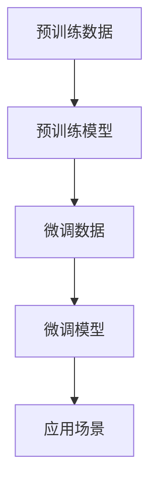
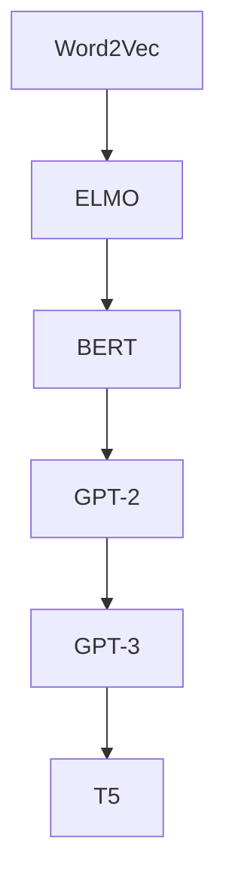
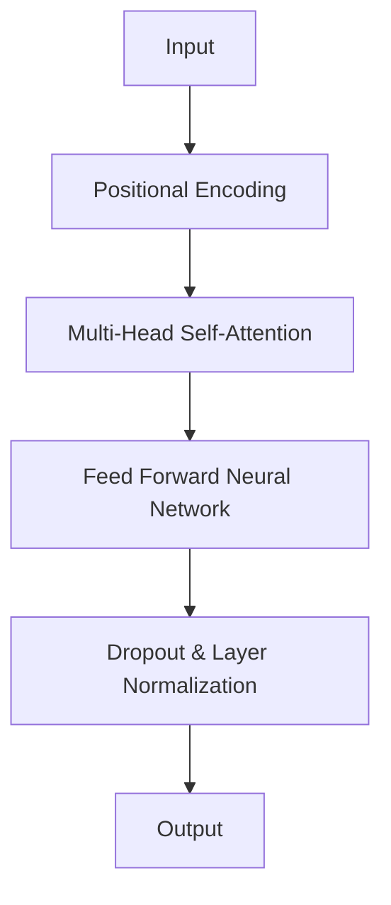

                 

# 大语言模型原理与工程实践：提示词设计的通用原则

> 关键词：大语言模型、提示词、工程实践、自然语言处理、Transformer、预训练、微调、神经网络

> 摘要：本文将深入探讨大语言模型的原理与工程实践，重点分析提示词设计的重要性及其通用原则。通过对大语言模型的基础概念、技术原理、应用场景、工程实践等方面的详细讲解，旨在为读者提供全面的了解和实用的指导。

### 第一部分：大语言模型基础

#### 第1章：大语言模型概述

##### 1.1 大语言模型的概念

- **大语言模型（Big Language Model）**：是一种基于深度学习的自然语言处理（NLP）模型，它通过预训练和微调来学习语言的规律和特征。

##### 1.2 大语言模型的发展

- **GPT-3**：由OpenAI推出的一个具有1750亿参数的预训练模型，是当前最大的语言模型。
- **BERT**：由Google推出，全称为Bidirectional Encoder Representations from Transformers，通过在双向Transformer中预训练，捕捉文本的上下文信息。
- **T5**：由Google推出，全称为Text-To-Text Transfer Transformer，将所有NLP任务转化为文本到文本的任务，极大提高了任务的泛化能力。

##### 1.3 主流大语言模型的架构

- **Transformer架构**：基于自注意力机制的深度神经网络架构，可以有效处理长序列数据。
- **多层网络**：通过增加模型层数，提高模型的表示能力。
- **预训练与微调**：通过在大规模数据集上预训练，然后针对特定任务进行微调，实现良好的任务适应性。

##### 1.4 大语言模型的优势

- **强大的语言理解能力**：能够理解复杂、模糊的语言表达。
- **广泛的应用场景**：如文本生成、机器翻译、问答系统等。
- **高效的训练与推理速度**：通过优化算法和模型结构，提高训练和推理速度。

##### 1.5 大语言模型的应用现状

- **文本生成**：如自动写作、摘要生成等。
- **机器翻译**：如Google翻译、百度翻译等。
- **问答系统**：如智能客服、教育辅导等。

##### 1.6 大语言模型的发展趋势

- **模型参数量的增加**：通过增加模型参数量，提高模型的表示能力。
- **多模态学习**：结合图像、声音等多模态信息，提高模型的理解能力。
- **更多的应用场景**：如智能交互、自动化写作、医疗诊断等。

##### 1.7 大语言模型的研究方向

- **模型压缩**：通过模型剪枝、量化等技术，降低模型的计算复杂度和存储需求。
- **模型解释性**：提高模型的解释性，使其在应用中更加可靠。
- **多语言模型**：支持多种语言的预训练和微调，提高模型的泛化能力。

##### 1.8 大语言模型在工程实践中的应用

- **模型部署**：将训练好的大语言模型部署到生产环境中，进行实时推理。
- **性能优化**：通过模型剪枝、量化等技术，提高模型在实际应用中的性能和效率。
- **安全性保障**：防止模型被恶意利用，保护用户隐私和数据安全。

##### 1.9 大语言模型与心理学

- **人类语言理解与模型对比**：分析大语言模型在理解自然语言方面的局限性，以及如何改进。
- **用户行为分析**：利用大语言模型分析用户的行为和需求，实现个性化推荐。

##### 1.10 大语言模型与伦理

- **模型偏见与公平性**：分析大语言模型可能存在的偏见和歧视，探讨如何实现公平性。
- **数据隐私与伦理**：探讨大语言模型在数据处理中的隐私保护问题，如何确保数据安全和用户隐私。

##### 1.11 大语言模型的未来展望

- **技术趋势**：分析大语言模型技术的发展趋势，如更多参数、更复杂的模型结构等。
- **应用前景**：探讨大语言模型在未来可能的应用领域，如教育、医疗、金融等。

##### 1.12 附录

- **大语言模型工具与资源**：介绍主流深度学习框架、预训练模型资源、开源代码与教程等。

### 第2章：大语言模型技术基础

#### 第2章：大语言模型技术基础

#### 2.1 深度学习基础

##### 2.1.1 神经网络的基本结构

- **神经网络（Neural Network）**：由大量神经元组成，通过学习输入和输出之间的复杂关系。
- **神经元（Neuron）**：是神经网络的基本单位，通过激活函数将输入转换为输出。

##### 2.1.2 常见的深度学习架构

- **卷积神经网络（Convolutional Neural Network, CNN）**：擅长处理图像等二维数据。
- **循环神经网络（Recurrent Neural Network, RNN）**：擅长处理序列数据。
- **Transformer架构**：基于自注意力机制的深度神经网络架构，适用于NLP任务。

##### 2.1.3 深度学习优化算法

- **随机梯度下降（Stochastic Gradient Descent, SGD）**：是一种常用的优化算法，通过更新模型参数来最小化损失函数。
- **Adam优化器**：结合了SGD和动量方法，适用于大规模深度学习模型的优化。

#### 2.2 自然语言处理基础

##### 2.2.1 词嵌入技术

- **词嵌入（Word Embedding）**：将词汇映射到高维空间中，以便神经网络可以处理。
- **Word2Vec**：是一种常见的词嵌入方法，通过训练神经网络来学习词汇的表示。

##### 2.2.2 序列模型与注意力机制

- **序列模型（Sequence Model）**：如RNN和LSTM，用于处理序列数据。
- **注意力机制（Attention Mechanism）**：用于捕捉输入序列中不同位置的重要性，广泛应用于NLP任务。

##### 2.2.3 转换器架构详解

- **转换器（Transformer）**：是一种基于自注意力机制的深度神经网络架构，广泛应用于NLP任务。
- **多头注意力（Multi-Head Attention）**：通过将自注意力机制扩展到多个头，提高模型的表示能力。

#### 2.3 大规模预训练模型原理

##### 2.3.1 预训练的概念与意义

- **预训练（Pretraining）**：在大规模数据集上训练深度学习模型，使其具备一定的语言理解能力。
- **意义**：预训练模型可以显著提高模型的性能，减少对标注数据的依赖。

##### 2.3.2 自监督学习方法

- **自监督学习（Self-Supervised Learning）**：从无标签数据中学习，通过设计任务引导模型学习。
- **常见自监督学习方法**：如语言建模（Language Modeling）、掩码语言模型（Masked Language Model）等。

##### 2.3.3 迁移学习与微调技术

- **迁移学习（Transfer Learning）**：利用预训练模型在特定任务上进行微调，提高模型的适应性。
- **微调（Fine-tuning）**：在预训练模型的基础上，针对特定任务进行调整，提高模型的性能。

### 第3章：大语言模型应用

#### 3.1 提示词设计

##### 3.1.1 提示词的作用

- **引导模型生成**：通过提示词可以引导大语言模型生成更加符合预期的文本。

##### 3.1.2 提示词的设计原则

- **简单明了**：提示词应简洁明了，易于理解。
- **语义明确**：提示词应具有明确的语义，避免歧义。

#### 3.2 问答系统

##### 3.2.1 核心原理

- **问题转换**：将问题转换成自然语言处理任务，如文本分类、信息检索等。
- **答案生成**：使用大语言模型生成答案，通常采用序列到序列的生成方式。

##### 3.2.2 应用场景

- **智能客服**：通过大语言模型自动回答用户问题，提高客服效率。
- **教育辅导**：为学生提供自动化的学习辅导，提高学习效果。

#### 3.3 文本生成

##### 3.3.1 核心原理

- **文本生成**：使用大语言模型生成连贯、符合语义的文本。

##### 3.3.2 应用场景

- **文章写作**：自动生成文章、博客、新闻等内容。
- **邮件生成**：自动生成邮件、短信、提醒等。

### 第4章：大语言模型工程实践

#### 4.1 模型部署

##### 4.1.1 核心原理

- **模型部署**：将训练好的大语言模型部署到生产环境中，进行实时推理。

##### 4.1.2 应用场景

- **聊天机器人**：通过部署大语言模型，实现与用户的实时对话。
- **推荐系统**：通过部署大语言模型，实现个性化推荐。

#### 4.2 性能优化

##### 4.2.1 核心原理

- **性能优化**：通过模型剪枝、量化等技术，降低模型的计算复杂度和存储需求。

##### 4.2.2 应用场景

- **提高模型在实际应用中的性能和效率**：通过优化算法和模型结构，提高模型的应用效果。
- **降低模型部署成本**：通过优化模型，降低模型部署的硬件资源需求。

#### 4.3 安全性保障

##### 4.3.1 核心原理

- **安全性保障**：防止模型被恶意利用，保护用户隐私和数据安全。

##### 4.3.2 应用场景

- **数据加密**：通过对数据进行加密，确保数据传输过程中的安全性。
- **访问控制**：通过设置访问权限，防止未经授权的用户访问数据。

### 第5章：大语言模型与心理学

#### 5.1 模型理解与人类理解

##### 5.1.1 核心原理

- **模型理解**：分析大语言模型在理解自然语言方面的局限性，以及如何改进。

##### 5.1.2 应用场景

- **情感分析**：通过分析文本的情感倾向，提高模型的情感理解能力。
- **意图识别**：通过识别用户的意图，提高模型的服务能力。

#### 5.2 心理学在大语言模型中的应用

##### 5.2.1 核心原理

- **心理学知识**：将心理学知识应用于大语言模型的设计和优化，提高模型的实用性和可靠性。

##### 5.2.2 应用场景

- **用户行为分析**：通过分析用户行为，提高用户的体验和满意度。
- **个性化推荐**：通过分析用户喜好，提供个性化的推荐服务。

### 第6章：大语言模型与伦理

#### 6.1 模型偏见与公平性

##### 6.1.1 核心原理

- **模型偏见**：分析大语言模型可能存在的偏见和歧视，探讨如何实现公平性。

##### 6.1.2 应用场景

- **招聘系统**：通过消除模型偏见，实现公平的招聘过程。
- **信用评估**：通过消除模型偏见，提高信用评估的准确性。

#### 6.2 数据隐私与伦理

##### 6.2.1 核心原理

- **数据隐私**：探讨大语言模型在数据处理中的隐私保护问题，如何确保数据安全和用户隐私。

##### 6.2.2 应用场景

- **智能医疗**：通过保护患者隐私，提高医疗服务的安全性。
- **金融风控**：通过保护用户隐私，提高金融风险控制的能力。

### 第7章：大语言模型未来展望

#### 7.1 技术趋势

##### 7.1.1 核心原理

- **技术趋势**：分析大语言模型技术的发展趋势，如更多参数、更复杂的模型结构等。

##### 7.1.2 应用场景

- **智能交互**：通过更复杂的大语言模型，实现更智能的对话系统。
- **自动化写作**：通过更多参数的大语言模型，实现更高质量的自动写作。

#### 7.2 应用前景

##### 7.2.1 核心原理

- **应用前景**：探讨大语言模型在未来可能的应用领域，如教育、医疗、金融等。

##### 7.2.2 应用场景

- **个性化教育**：通过大语言模型，实现个性化的学习方案。
- **智能诊断**：通过大语言模型，实现更准确的疾病诊断。
- **智能投顾**：通过大语言模型，提供个性化的投资建议。

### 附录

#### 附录A：大语言模型工具与资源

##### 7.3.1 主流深度学习框架

- **TensorFlow**：由Google推出，是当前最流行的深度学习框架之一。
- **PyTorch**：由Facebook推出，具有灵活的动态计算图，适用于研究和小规模生产。
- **JAX**：由Google推出，具有自动微分和高效计算的特点。

##### 7.3.2 预训练模型资源

- **GPT系列**：由OpenAI推出，是目前最大的预训练模型。
- **BERT**：由Google推出，适用于各种NLP任务。
- **T5**：由Google推出，将所有NLP任务转化为文本到文本的任务。

##### 7.3.3 开源代码与教程

- **Hugging Face的Transformers库**：提供各种预训练模型和工具，方便研究人员和开发者使用。
- **各种开源项目和教程**：如TensorFlow的官方教程、PyTorch的文档等，为开发者提供丰富的学习和实践资源。

### 第1章：大语言模型概述

#### 1.1 大语言模型的概念

**大语言模型**，简称LLM（Large Language Model），是一种基于深度学习的自然语言处理（NLP）模型，其核心目的是学习自然语言的结构和语义。与传统的统计模型和规则系统不同，大语言模型通过大规模的文本数据预训练，可以自动学习语言的上下文关系、语法规则、词汇搭配等，从而具备强大的语言理解和生成能力。

**核心概念与联系**：

- **预训练（Pre-training）**：大语言模型首先在大规模文本数据集上进行预训练，学习到语言的通用特征。
- **微调（Fine-tuning）**：预训练后，大语言模型可以在特定任务上进行微调，适应不同的应用场景。
- **注意力机制（Attention Mechanism）**：大语言模型通常使用注意力机制来捕捉文本序列中的关键信息，提高处理长序列数据的能力。

**Mermaid流程图**：

#### 1.2 大语言模型的发展

大语言模型的发展经历了几个重要阶段，其中一些关键模型包括：

- **GPT-2**：由OpenAI推出，具有15亿个参数，是第一个成功实现文本生成的深度学习模型。
- **GPT-3**：OpenAI推出的具有1750亿个参数的模型，是目前最大的语言模型，展示了惊人的语言生成能力。
- **BERT**：由Google推出，全称为Bidirectional Encoder Representations from Transformers，通过在双向Transformer中预训练，捕捉文本的上下文信息。
- **T5**：Google推出的模型，将所有NLP任务转化为文本到文本的任务，极大提高了任务的泛化能力。

**Mermaid流程图**：

#### 1.3 主流大语言模型的架构

目前主流的大语言模型主要基于Transformer架构，这种架构通过自注意力机制（Self-Attention）能够高效地处理长序列数据。以下是一些关键组件和设计理念：

- **Transformer架构**：基于自注意力机制的深度神经网络架构，可以有效处理长序列数据。
- **自注意力（Self-Attention）**：通过计算序列中每个元素与其他元素的相关性，实现多对多的信息交互。
- **多头注意力（Multi-Head Attention）**：通过将自注意力机制扩展到多个头，提高模型的表示能力。
- **位置编码（Positional Encoding）**：为了保留序列的顺序信息，Transformer引入了位置编码。

**Mermaid流程图**：

#### 1.4 大语言模型的优势

大语言模型在自然语言处理领域展现出了显著的优势：

- **强大的语言理解能力**：能够处理复杂、模糊的语言表达，理解上下文关系。
- **广泛的应用场景**：适用于文本生成、机器翻译、问答系统、摘要生成等任务。
- **高效的训练与推理速度**：通过优化算法和模型结构，提高了训练和推理的效率。
- **强大的生成能力**：能够生成连贯、符合语义的自然语言文本。

#### 1.5 大语言模型的应用现状

大语言模型在各个领域已经取得了显著的成果：

- **文本生成**：如自动写作、摘要生成、故事创作等。
- **机器翻译**：如Google翻译、百度翻译等，已经广泛应用于跨语言沟通。
- **问答系统**：如智能客服、教育辅导、法律咨询等，能够自动回答用户的问题。
- **代码生成**：如自动编写代码、修复错误等，提高了软件开发效率。

#### 1.6 大语言模型的发展趋势

随着技术的不断进步，大语言模型的发展趋势包括：

- **模型参数量的增加**：通过增加模型参数量，提高模型的表示能力和理解能力。
- **多模态学习**：结合图像、声音等多模态信息，提高模型的理解能力和应用范围。
- **更好的模型解释性**：通过改进模型结构，提高模型的解释性，使其在应用中更加可靠。
- **更广泛的应用领域**：如智能交互、医疗诊断、金融分析等，大语言模型的应用前景广阔。

#### 1.7 大语言模型的研究方向

未来，大语言模型的研究方向将集中在以下几个方面：

- **模型压缩与优化**：通过模型剪枝、量化等技术，降低模型的计算复杂度和存储需求。
- **模型解释性**：提高模型的解释性，使其在应用中更加可靠，减少对黑盒模型的依赖。
- **多语言模型**：支持多种语言的预训练和微调，提高模型的泛化能力。
- **跨模态学习**：结合图像、声音等多模态信息，提高模型的理解能力和应用范围。

#### 1.8 大语言模型在工程实践中的应用

在实际工程中，大语言模型的应用场景广泛，以下是一些关键方面：

- **模型部署**：将训练好的大语言模型部署到生产环境中，进行实时推理。
- **性能优化**：通过模型剪枝、量化等技术，提高模型在实际应用中的性能和效率。
- **安全性保障**：防止模型被恶意利用，保护用户隐私和数据安全。

### 1.9 大语言模型与心理学

大语言模型在心理学领域也有广泛的应用前景：

- **模型理解与人类理解对比**：分析大语言模型在理解自然语言方面的局限性，以及如何改进。
- **用户行为分析**：利用大语言模型分析用户的行为和需求，实现个性化推荐。

### 1.10 大语言模型与伦理

大语言模型在应用过程中也面临一系列伦理问题：

- **模型偏见与公平性**：分析大语言模型可能存在的偏见和歧视，探讨如何实现公平性。
- **数据隐私与伦理**：探讨大语言模型在数据处理中的隐私保护问题，如何确保数据安全和用户隐私。

### 1.11 大语言模型的未来展望

未来，大语言模型将继续发挥重要作用，其技术趋势和应用前景值得期待：

- **技术趋势**：分析大语言模型技术的发展趋势，如更多参数、更复杂的模型结构等。
- **应用前景**：探讨大语言模型在未来可能的应用领域，如教育、医疗、金融等。

### 1.12 附录

- **大语言模型工具与资源**：介绍主流深度学习框架、预训练模型资源、开源代码与教程等。

## 第2章：大语言模型技术基础

### 2.1 深度学习基础

#### 2.1.1 神经网络的基本结构

神经网络（Neural Network）是深度学习的基础，由大量神经元（Neurons）组成，通过学习输入和输出之间的复杂关系来完成任务。每个神经元接收多个输入，通过权重（Weights）进行加权求和，然后通过激活函数（Activation Function）产生输出。

**神经网络的基本结构**：

1. **输入层（Input Layer）**：接收外部输入信号。
2. **隐藏层（Hidden Layers）**：对输入信号进行特征提取和变换。
3. **输出层（Output Layer）**：产生最终输出。

**神经元的基本结构**：

1. **权重（Weights）**：每个输入信号与对应权重相乘，得到加权求和值。
2. **偏置（Bias）**：对加权求和值进行修正。
3. **激活函数（Activation Function）**：将加权求和值转换为输出，常见的激活函数有ReLU、Sigmoid、Tanh等。

**神经网络的工作原理**：

神经网络通过反向传播算法（Backpropagation Algorithm）来更新权重和偏置，从而优化模型性能。具体步骤如下：

1. **前向传播（Forward Propagation）**：输入信号从输入层传递到输出层，计算每个神经元的输出。
2. **损失计算（Loss Calculation）**：计算实际输出与期望输出之间的差距，得到损失值。
3. **反向传播（Backpropagation）**：根据损失值计算每个神经元的梯度，并更新权重和偏置。
4. **迭代优化（Iteration Optimization）**：重复上述步骤，直到损失值达到预期目标。

#### 2.1.2 常见的深度学习架构

深度学习架构有多种类型，适用于不同的数据类型和任务。以下是几种常见的深度学习架构：

1. **卷积神经网络（Convolutional Neural Network, CNN）**：

CNN主要用于处理图像数据，其核心组件是卷积层（Convolutional Layers）、池化层（Pooling Layers）和全连接层（Fully Connected Layers）。卷积层通过卷积操作提取图像的特征，池化层用于降低特征图的维度，全连接层则用于分类或回归。

**CNN的基本结构**：

1. **输入层**：接收图像数据。
2. **卷积层**：通过卷积操作提取特征。
3. **池化层**：降低特征图的维度。
4. **全连接层**：进行分类或回归。

2. **循环神经网络（Recurrent Neural Network, RNN）**：

RNN用于处理序列数据，如文本、时间序列等。与传统的神经网络不同，RNN具有循环结构，可以保留序列中的历史信息。RNN通过隐藏状态（Hidden State）和当前输入来生成当前输出，从而在序列中传递信息。

**RNN的基本结构**：

1. **输入层**：接收序列数据。
2. **隐藏层**：包含当前输入和隐藏状态的组合。
3. **输出层**：生成当前输出。

3. **转换器架构（Transformer Architecture）**：

Transformer是近年来在自然语言处理（NLP）领域取得突破性成果的架构，其核心组件是自注意力机制（Self-Attention）。Transformer通过多头注意力（Multi-Head Attention）和多级结构，能够高效地处理长序列数据。

**Transformer的基本结构**：

1. **输入层**：接收文本序列。
2. **多头注意力层**：通过自注意力机制计算文本序列中每个元素之间的相关性。
3. **Feed Forward Layers**：对每个元素进行前向传播。
4. **输出层**：生成最终输出。

#### 2.1.3 深度学习优化算法

优化算法用于调整神经网络中的权重和偏置，以最小化损失函数。以下是几种常见的深度学习优化算法：

1. **随机梯度下降（Stochastic Gradient Descent, SGD）**：

SGD是最常见的优化算法，通过随机选择一部分样本计算梯度，然后更新权重和偏置。SGD的优点是简单高效，缺点是收敛速度较慢。

**SGD的基本原理**：

- **梯度计算**：根据损失函数计算每个样本的梯度。
- **权重更新**：根据梯度更新权重和偏置。

2. **Adam优化器（Adam Optimizer）**：

Adam是SGD的改进版本，结合了SGD和RMSProp的特点，适用于大规模深度学习模型。Adam通过计算一阶矩估计（mean）和二阶矩估计（variance），自适应地调整学习率。

**Adam的基本原理**：

- **一阶矩估计**：计算梯度的均值。
- **二阶矩估计**：计算梯度的方差。
- **权重更新**：根据一阶矩估计和二阶矩估计更新权重和偏置。

### 2.2 自然语言处理基础

#### 2.2.1 词嵌入技术

词嵌入（Word Embedding）是将词汇映射到高维空间中的技术，以便神经网络可以处理。词嵌入通过将词汇表示为密集向量的形式，使得神经网络能够理解词汇的语义关系和上下文。

**常见的词嵌入方法**：

1. **Word2Vec**：

Word2Vec是最早的词嵌入方法之一，通过训练神经网络来学习词汇的表示。Word2Vec主要分为连续词袋（Continuous Bag of Words, CBOW）和Skip-Gram两种方法。

- **CBOW（Continuous Bag of Words）**：通过上下文词的均值向量表示目标词。
- **Skip-Gram**：通过目标词的均值向量表示上下文词。

2. **GloVe**：

GloVe（Global Vectors for Word Representation）是一种基于矩阵分解的词嵌入方法，通过训练词和文档的矩阵分解来学习词汇的表示。GloVe的优点是能够处理稀疏数据，并且能够捕获词汇的语义关系。

**GloVe的基本原理**：

- **共现矩阵（Co-occurrence Matrix）**：计算词汇之间的共现次数。
- **矩阵分解（Matrix Factorization）**：通过分解共现矩阵学习词汇的表示。

#### 2.2.2 序列模型与注意力机制

序列模型（Sequence Model）用于处理序列数据，如文本、时间序列等。序列模型通过循环神经网络（RNN）或转换器（Transformer）等结构来学习序列中的特征和模式。

**常见的序列模型**：

1. **循环神经网络（Recurrent Neural Network, RNN）**：

RNN是一种基于循环结构的神经网络，可以处理序列数据。RNN通过隐藏状态（Hidden State）来保留序列中的历史信息，并生成当前输出。

**RNN的基本原理**：

- **隐藏状态更新**：当前输入和隐藏状态通过权重矩阵相加，然后通过激活函数更新隐藏状态。
- **输出生成**：当前隐藏状态通过权重矩阵转换为输出。

2. **长短期记忆网络（Long Short-Term Memory, LSTM）**：

LSTM是RNN的一种改进，可以解决传统RNN在处理长序列数据时的梯度消失和梯度爆炸问题。LSTM通过引入记忆单元（Memory Cell）和门控机制（Gates），能够灵活地控制信息的传递和遗忘。

**LSTM的基本原理**：

- **输入门（Input Gate）**：决定当前输入信息是否被记住。
- **遗忘门（Forget Gate）**：决定哪些信息需要被遗忘。
- **输出门（Output Gate）**：决定当前隐藏状态是否被输出。

3. **转换器（Transformer）**：

Transformer是近年来在自然语言处理领域取得突破性成果的架构，其核心组件是自注意力机制（Self-Attention）。Transformer通过多头注意力（Multi-Head Attention）和多级结构，能够高效地处理长序列数据。

**Transformer的基本原理**：

- **多头注意力（Multi-Head Attention）**：通过多个注意力头同时计算，提高模型的表示能力。
- **位置编码（Positional Encoding）**：为了保留序列的顺序信息，Transformer引入了位置编码。

#### 2.2.3 转换器架构详解

转换器（Transformer）是一种基于自注意力机制的深度神经网络架构，广泛应用于自然语言处理任务。转换器通过多头注意力机制、编码器和解码器结构，能够高效地处理长序列数据，生成高质量的输出。

**转换器的结构**：

1. **编码器（Encoder）**：

编码器由多个编码层（Encoder Layers）组成，每个编码层包含两个子层：多头自注意力（Multi-Head Self-Attention）和前馈网络（Feed Forward Network）。编码器用于处理输入序列，提取序列中的特征。

- **多头自注意力（Multi-Head Self-Attention）**：通过多个注意力头同时计算，提高模型的表示能力。
- **前馈网络（Feed Forward Network）**：对每个元素进行前向传播。

2. **解码器（Decoder）**：

解码器由多个解码层（Decoder Layers）组成，每个解码层包含两个子层：多头自注意力（Multi-Head Self-Attention）和前馈网络（Feed Forward Network）。解码器用于生成输出序列。

- **多头自注意力（Multi-Head Self-Attention）**：通过多个注意力头同时计算，提高模型的表示能力。
- **前馈网络（Feed Forward Network）**：对每个元素进行前向传播。

3. **位置编码（Positional Encoding）**：

为了保留序列的顺序信息，转换器引入了位置编码。位置编码是一种向量表示，附加在每个元素的嵌入向量上，确保模型能够理解序列中的顺序关系。

**转换器的工作原理**：

1. **编码器**：输入序列通过编码层，每个编码层计算多头自注意力和前馈网络，将输入序列转换为编码特征。
2. **解码器**：编码特征作为解码器的输入，每个解码层计算多头自注意力和前馈网络，生成输出序列。
3. **输出生成**：解码器的输出经过softmax操作，生成最终的输出序列。

### 2.3 大规模预训练模型原理

#### 2.3.1 预训练的概念与意义

预训练（Pre-training）是指在大规模文本数据集上对神经网络模型进行训练，使其具备一定的语言理解和生成能力。预训练的主要目的是减少对大量标注数据的依赖，提高模型在自然语言处理任务上的性能。

**预训练的意义**：

1. **通用特征提取**：通过预训练，模型可以在大规模文本数据中学习到通用特征，如词向量、语法规则等，从而减少对特定任务的依赖。
2. **减少数据需求**：预训练模型可以在没有大量标注数据的情况下，实现良好的性能，降低了数据收集和标注的成本。
3. **提高模型性能**：预训练模型通过在大规模文本数据集上进行训练，可以学习到更复杂的语言规律和模式，提高模型在自然语言处理任务上的性能。

**预训练的基本流程**：

1. **数据准备**：收集大规模的文本数据集，进行预处理，包括分词、去除停用词等。
2. **模型初始化**：初始化预训练模型，可以选择预训练好的模型或者随机初始化。
3. **预训练**：在文本数据集上进行预训练，通过优化算法（如SGD、Adam等）更新模型参数，学习语言的通用特征。
4. **评估与调整**：在预训练过程中，定期评估模型性能，根据评估结果调整预训练策略。

#### 2.3.2 自监督学习方法

自监督学习（Self-Supervised Learning）是一种从无标签数据中学习的方法，通过设计任务引导模型学习。自监督学习在预训练过程中起着重要作用，能够利用大量无标签数据进行训练，提高模型性能。

**常见的自监督学习方法**：

1. **语言建模（Language Modeling）**：

语言建模是一种自监督学习方法，通过预测下一个词来学习语言的统计规律。在预训练过程中，模型从输入序列中随机掩码一部分词，然后预测这些掩码词的分布。

2. **掩码语言模型（Masked Language Model, MLM）**：

掩码语言模型是对语言建模方法的改进，通过随机掩码一部分词（通常为15%），然后预测这些掩码词的分布。掩码语言模型可以更好地学习词与词之间的依赖关系。

3. **填充语言模型（Fill Masked Tokens, FMT）**：

填充语言模型是另一种自监督学习方法，通过预测输入序列中被填充的词。填充语言模型可以用于处理不规则的分词和语序调整问题。

**自监督学习的优势**：

1. **数据利用最大化**：自监督学习可以充分利用大量无标签数据进行训练，提高模型性能。
2. **减少标注需求**：自监督学习不需要大量标注数据，降低了数据标注的成本。
3. **提高模型泛化能力**：通过在大规模无标签数据上预训练，模型可以学习到更通用的语言特征，提高模型在不同任务上的泛化能力。

#### 2.3.3 迁移学习与微调技术

迁移学习（Transfer Learning）是一种利用预训练模型在特定任务上进行微调的方法，通过迁移预训练模型的知识，提高模型在新任务上的性能。迁移学习可以显著减少对新任务数据的依赖，提高模型训练效率。

**迁移学习的基本流程**：

1. **预训练模型选择**：选择预训练好的模型，如BERT、GPT等。
2. **数据准备**：准备新任务的数据集，进行预处理，包括数据清洗、分词等。
3. **微调**：在预训练模型的基础上，针对新任务进行微调，调整模型参数，提高模型在新任务上的性能。
4. **评估与调整**：在微调过程中，定期评估模型性能，根据评估结果调整微调策略。

**微调技术**：

1. **全量微调（Full Fine-tuning）**：将预训练模型的全部层进行微调，适用于数据量较大的任务。
2. **部分微调（Partial Fine-tuning）**：仅对预训练模型的特定层进行微调，适用于数据量较小的任务。
3. **动态微调（Dynamic Fine-tuning）**：根据任务的需求动态调整预训练模型的层，提高模型适应不同任务的能力。

### 第3章：大语言模型应用

#### 3.1 提示词设计

##### 3.1.1 提示词的作用

提示词（Prompt）在自然语言处理中起着关键作用，用于引导模型生成更符合预期的输出。提示词的设计直接影响模型的性能和应用效果。

- **引导模型生成**：通过提示词可以明确模型需要生成的类型或内容，如文章、摘要、对话等。
- **提高生成质量**：提示词的设计能够帮助模型理解用户意图，从而生成更符合用户需求的内容。

##### 3.1.2 提示词的设计原则

- **简单明了**：提示词应简洁明了，避免冗长的描述，以确保模型能够快速理解。
- **语义明确**：提示词应具有明确的语义，避免歧义，确保模型能够正确理解用户意图。
- **多样性**：设计多种类型的提示词，以适应不同的应用场景和用户需求。
- **适应性**：提示词应具备一定的适应性，能够根据用户输入动态调整。

##### 3.1.3 提示词设计的技巧

- **问题引导**：通过提出具体问题来引导模型生成回答，如“请生成一篇关于人工智能的论文摘要”。
- **示例引导**：提供一些示例文本，以帮助模型理解生成内容的风格和格式，如“请生成一篇类似于下面的文章：”。
- **语境引导**：提供上下文信息，以帮助模型更好地理解生成的文本背景，如“请生成一个关于环境保护的演讲稿”。

#### 3.1.4 提示词设计案例

**案例1：文本摘要生成**

提示词：“请生成一篇关于人工智能对教育影响的摘要，不超过200字。”

**案例2：对话生成**

提示词：“请模仿聊天机器人的风格，回答以下问题：‘你有什么兴趣爱好？’”

**案例3：文章生成**

提示词：“请生成一篇关于人工智能在未来医疗领域的应用的论文，标题为：‘人工智能在医疗领域的未来发展趋势’。”

##### 3.1.5 提示词设计工具与资源

- **Hugging Face的Transformers库**：提供了丰富的预训练模型和提示词设计工具，方便开发者进行提示词设计。
- **Prompt Engineering Guide**：OpenAI发布的提示词设计指南，提供了详细的提示词设计方法和最佳实践。

#### 3.2 问答系统

##### 3.2.1 核心原理

问答系统（Question Answering System）是一种基于自然语言处理的智能系统，能够自动回答用户提出的问题。问答系统通过将问题转换成自然语言处理任务，使用大语言模型生成答案。

- **问题转换**：将自然语言问题转换为机器可处理的格式，如词汇消歧、句法解析等。
- **答案生成**：使用大语言模型生成符合语义和上下文的答案。

##### 3.2.2 应用场景

- **智能客服**：自动回答用户的问题，提高客服效率和用户体验。
- **教育辅导**：为学生提供自动化的学习辅导，回答学生的疑问。
- **搜索引擎**：辅助搜索引擎提供更准确和个性化的搜索结果。

##### 3.2.3 问答系统的架构

问答系统通常包含以下关键组件：

- **问题接收**：接收用户的问题，进行预处理和解析。
- **知识库**：存储大量的知识信息，供模型查询和生成答案。
- **模型推理**：使用大语言模型进行问题转换和答案生成。
- **答案输出**：将生成的答案呈现给用户，进行后处理和优化。

##### 3.2.4 提问与回答的交互流程

1. **问题接收**：用户提交问题，系统接收并预处理问题，如分词、词性标注等。
2. **知识库查询**：系统在知识库中检索与问题相关的信息。
3. **模型推理**：使用大语言模型对问题进行转换，并生成答案。
4. **答案输出**：将生成的答案呈现给用户，并进行后处理，如格式化、摘要等。

##### 3.2.5 问答系统的评估指标

- **准确率（Accuracy）**：答案与实际答案匹配的比例。
- **召回率（Recall）**：能够正确回答的问题占总问题的比例。
- **F1值（F1 Score）**：准确率和召回率的调和平均值。

#### 3.3 文本生成

##### 3.3.1 核心原理

文本生成（Text Generation）是一种利用大语言模型生成自然语言文本的技术。文本生成可以通过训练模型在大规模文本数据上学习语言的规则和模式，然后根据提示生成新的文本。

- **预训练**：在大规模文本数据上预训练模型，学习语言的通用特征。
- **生成过程**：通过模型输入提示词，生成符合语义和上下文的文本。

##### 3.3.2 应用场景

- **自动写作**：生成文章、博客、新闻等内容。
- **对话系统**：生成自然语言对话，模拟人类交流。
- **摘要生成**：生成文章、报告的摘要。
- **聊天机器人**：与用户进行自然语言交互。

##### 3.3.3 文本生成的技术细节

- **生成流程**：输入提示词，模型根据上下文生成文本。
- **生成策略**：模型生成文本的过程可以采用不同的策略，如贪婪策略、贪心策略、抽样策略等。

- **生成控制**：通过控制生成过程，如限制生成长度、避免重复等，提高生成文本的质量。

##### 3.3.4 文本生成案例

**案例1：文章写作**

提示词：“请生成一篇关于深度学习的文章，内容包括深度学习的起源、发展、应用和未来趋势。”

**案例2：对话生成**

提示词：“您好，我是智能助手，请问有什么可以帮助您的？”

**案例3：摘要生成**

提示词：“请生成一篇关于人工智能在医疗领域的应用的摘要，不超过200字。”

### 第4章：大语言模型工程实践

#### 4.1 模型部署

##### 4.1.1 核心原理

模型部署是将训练好的大语言模型部署到生产环境中，使其能够实时处理用户请求并提供服务。模型部署的核心目标是确保模型的高效、稳定和安全运行。

- **部署环境**：选择合适的硬件和软件环境，如CPU、GPU、深度学习框架等。
- **模型转换**：将训练好的模型转换为可部署的格式，如ONNX、TensorFlow Lite等。
- **服务化部署**：将模型部署为服务，通过API或SDK的方式供用户调用。

##### 4.1.2 应用场景

- **聊天机器人**：通过模型部署，实现与用户的实时对话。
- **推荐系统**：通过模型部署，实现个性化推荐。
- **智能客服**：通过模型部署，自动回答用户的问题。

##### 4.1.3 模型部署的挑战

- **性能优化**：如何确保模型在部署后能够高效运行，降低延迟。
- **资源管理**：如何合理分配计算资源和存储资源，确保模型稳定运行。
- **安全性保障**：如何保护模型和数据的安全，防止恶意攻击。

##### 4.1.4 模型部署的流程

1. **环境准备**：搭建部署环境，包括硬件、软件和深度学习框架。
2. **模型转换**：将训练好的模型转换为可部署的格式。
3. **服务化部署**：将模型部署为服务，通过API或SDK的方式供用户调用。
4. **测试与优化**：对部署后的模型进行测试和优化，确保其性能和稳定性。

#### 4.2 性能优化

##### 4.2.1 核心原理

性能优化是指通过一系列技术手段，提高模型在实际应用中的运行效率和性能。性能优化主要包括以下几个方面：

- **模型优化**：通过模型剪枝、量化等技术，降低模型的计算复杂度和存储需求。
- **算法优化**：通过优化算法和数据结构，提高模型的计算效率和存储效率。
- **资源管理**：通过合理分配计算资源和存储资源，提高模型的运行效率。

##### 4.2.2 应用场景

- **实时交互系统**：通过性能优化，提高实时交互系统的响应速度和用户体验。
- **大数据处理**：通过性能优化，提高大数据处理的速度和效率。
- **资源受限环境**：通过性能优化，在资源受限的环境下实现模型的高效运行。

##### 4.2.3 性能优化的方法

1. **模型剪枝（Model Pruning）**：

模型剪枝是一种通过减少模型参数数量来降低计算复杂度和存储需求的方法。模型剪枝可以通过以下步骤实现：

- **冗余参数检测**：通过算法识别模型中的冗余参数。
- **参数删除**：删除冗余参数，减少模型参数数量。
- **模型重构**：重构模型结构，优化参数布局。

2. **模型量化（Model Quantization）**：

模型量化是一种通过将模型中的浮点数参数转换为低精度整数来降低模型存储和计算需求的方法。模型量化可以通过以下步骤实现：

- **量化分析**：分析模型参数的分布，确定量化精度。
- **量化转换**：将模型参数转换为低精度整数。
- **模型验证**：验证量化后的模型性能是否满足要求。

3. **算法优化（Algorithm Optimization）**：

算法优化是通过改进算法和数据结构，提高模型的计算效率和存储效率的方法。算法优化可以从以下几个方面入手：

- **并行计算**：利用多核CPU和GPU进行并行计算，提高模型训练和推理的速度。
- **内存优化**：优化内存分配和访问方式，减少内存占用和缓存冲突。
- **数据压缩**：采用数据压缩技术，减少模型存储和传输的需求。

#### 4.3 安全性保障

##### 4.3.1 核心原理

安全性保障是指在大语言模型的应用过程中，通过一系列技术手段，确保模型和数据的安全，防止恶意攻击和隐私泄露。安全性保障主要包括以下几个方面：

- **数据加密**：对传输和存储的数据进行加密，确保数据在传输过程中的安全性。
- **访问控制**：设置访问权限，防止未经授权的用户访问数据和模型。
- **恶意攻击防护**：通过防御恶意攻击，如注入攻击、DDoS攻击等，保护模型和数据的安全。

##### 4.3.2 应用场景

- **聊天机器人**：通过安全性保障，防止恶意用户利用模型进行恶意攻击。
- **智能客服**：通过安全性保障，保护用户隐私和数据安全。
- **数据安全**：通过安全性保障，防止数据泄露和隐私侵犯。

##### 4.3.3 安全性保障的方法

1. **数据加密**：

数据加密是确保数据在传输和存储过程中安全的重要手段。数据加密可以通过以下方法实现：

- **传输加密**：使用SSL/TLS等加密协议，确保数据在传输过程中的安全性。
- **存储加密**：使用AES等加密算法，对存储在数据库或文件系统中的数据进行加密。

2. **访问控制**：

访问控制是确保只有授权用户可以访问数据和模型的重要手段。访问控制可以通过以下方法实现：

- **用户认证**：使用用户名和密码、双因素认证等手段，确保用户身份的真实性。
- **权限管理**：设置不同的权限级别，限制用户对数据和模型的访问权限。

3. **恶意攻击防护**：

恶意攻击防护是通过一系列技术手段，防止恶意攻击对模型和数据造成危害。恶意攻击防护可以从以下几个方面入手：

- **入侵检测**：使用入侵检测系统（IDS），实时监测网络流量和系统行为，及时发现异常情况。
- **防火墙**：设置防火墙，阻止恶意攻击的进入。
- **安全审计**：定期对系统和数据进行安全审计，确保系统符合安全要求。

### 第5章：大语言模型与心理学

#### 5.1 模型理解与人类理解

##### 5.1.1 核心原理

大语言模型在理解自然语言方面具有一定的能力，但与人类理解相比仍存在显著差异。模型理解和人类理解的差异主要体现在以下几个方面：

1. **语言习得**：

人类在语言习得过程中，通过不断的听、说、读、写，逐步掌握语言的使用和规则。而大语言模型主要通过预训练和微调在大规模文本数据上进行学习，缺乏类似人类的语言习得过程。

2. **上下文理解**：

大语言模型通过自注意力机制和Transformer架构，能够在一定程度上理解上下文关系。但与人类相比，模型对上下文的捕捉和理解仍然存在局限性，特别是在复杂和模糊的语境中。

3. **常识推理**：

大语言模型缺乏常识推理能力，难以理解一些基于常识的推理和判断。而人类在理解语言时，常常借助常识和背景知识进行推理。

4. **情感理解**：

大语言模型可以捕捉文本中的情感倾向，但在理解复杂情感和细微情感方面仍存在不足。人类在理解情感时，不仅依赖语言表达，还考虑表情、语气、语境等多种因素。

##### 5.1.2 应用场景

1. **情感分析**：

大语言模型可以用于情感分析，分析文本中的情感倾向，如正面、负面、中性等。但在处理复杂情感时，模型的表现仍需进一步优化。

2. **意图识别**：

大语言模型可以用于识别用户的意图，如提问、咨询、投诉等。但在理解复杂意图时，模型的表现仍需提高。

3. **对话系统**：

大语言模型可以用于对话系统，与人类进行自然语言交互。但与人类相比，模型在理解和回应用户需求方面仍有差距。

#### 5.2 心理学在大语言模型中的应用

##### 5.2.1 核心原理

心理学在大语言模型中的应用，主要是将心理学知识应用于模型的设计和优化，以提高模型的实用性和可靠性。以下是几个关键方面：

1. **用户行为分析**：

通过心理学原理，分析用户的行为和需求，为模型提供个性化的推荐和服务。例如，通过分析用户的历史行为，预测用户的偏好和需求。

2. **情感计算**：

结合心理学和计算技术的情感计算，旨在捕捉和解析文本中的情感信息，为情感分析和情感识别提供支持。例如，通过分析用户的情感表达，识别用户的情感状态。

3. **意图识别**：

通过心理学原理，分析用户的意图和行为模式，提高模型的意图识别能力。例如，通过分析用户的问题和回答，理解用户的真实意图。

##### 5.2.2 应用场景

1. **个性化推荐**：

通过心理学原理，分析用户的行为和需求，为用户提供个性化的推荐服务。例如，在电商平台上，根据用户的购买历史和浏览记录，推荐符合用户偏好的商品。

2. **智能客服**：

结合心理学和自然语言处理技术，为用户提供更智能、更个性化的客服服务。例如，通过分析用户的情感状态和意图，提供更有针对性的回答和建议。

3. **教育辅导**：

通过心理学原理，设计更符合学生需求和教育目标的教育辅导系统，提高学生的学习效果。例如，通过分析学生的学习行为和情感状态，调整教学策略，提高教学效果。

### 第6章：大语言模型与伦理

#### 6.1 模型偏见与公平性

##### 6.1.1 核心原理

模型偏见（Model Bias）是指在大语言模型中存在的系统偏差，这种偏差可能导致模型在某些群体或任务上表现不佳。模型偏见可能源于数据集的不平衡、算法的设计缺陷、训练过程等。

- **数据偏见**：如果训练数据集存在偏见，模型可能会学习并放大这些偏见。
- **算法偏见**：算法设计可能无意中放大某些偏见，如某些特征的重要性被过高估计。
- **公平性**：公平性是指模型在不同群体或任务上的表现应该没有显著的差异。公平性是确保模型应用过程中不歧视任何群体的关键。

##### 6.1.2 应用场景

- **招聘系统**：招聘系统可能因为数据偏见而对某些性别、种族、年龄等产生不公平的结果。
- **信用评估**：信用评估系统可能因为数据偏见而对某些社会经济群体产生不公平的评估结果。
- **医疗诊断**：医疗诊断系统可能因为数据偏见而对某些疾病的表现产生误解。

##### 6.1.3 减少偏见的方法

1. **数据多样性**：确保训练数据集的多样性，减少特定群体的偏见。
2. **算法校正**：通过算法校正技术，减少算法在特定群体上的偏差。
3. **透明度**：提高模型的透明度，使其决策过程更容易理解和解释。
4. **持续监控**：定期监控模型的性能，发现和纠正偏见。

#### 6.2 数据隐私与伦理

##### 6.2.1 核心原理

数据隐私是指保护个人和敏感信息的权利，防止未经授权的访问和泄露。在大语言模型的应用过程中，数据隐私问题尤为重要。

- **数据收集**：在收集用户数据时，应明确告知用户数据的用途和范围。
- **数据存储**：确保数据存储的安全，采取加密措施保护数据。
- **数据使用**：在数据处理和使用过程中，严格遵守隐私保护法规。

##### 6.2.2 应用场景

- **智能医疗**：医疗数据的隐私保护，确保患者的个人信息不被泄露。
- **金融风控**：金融数据的隐私保护，防止用户隐私被滥用。
- **社交媒体**：社交媒体数据的隐私保护，防止用户隐私被不当使用。

##### 6.2.3 数据隐私保护的方法

1. **数据匿名化**：通过去除或模糊化个人标识信息，降低数据泄露的风险。
2. **数据加密**：使用加密技术保护数据的机密性，确保数据在传输和存储过程中的安全性。
3. **隐私计算**：通过隐私计算技术，如差分隐私（Differential Privacy），在数据处理过程中保护个人隐私。
4. **法律法规**：遵守相关的法律法规，确保数据处理和使用过程合法合规。

### 第7章：大语言模型未来展望

#### 7.1 技术趋势

##### 7.1.1 核心原理

大语言模型技术的发展趋势主要体现在以下几个方面：

1. **模型规模增大**：随着计算能力和数据资源的提升，大语言模型的规模将继续增大，参数数量和模型深度将不断扩展。
2. **多模态学习**：结合图像、声音等多模态信息，提高模型的理解能力和应用范围。
3. **模型解释性**：提高模型的解释性，使其在复杂任务中的应用更加可靠。
4. **实时推理**：优化模型结构和算法，实现高效、实时的推理能力。

##### 7.1.2 应用场景

1. **智能交互**：通过更复杂的大语言模型，实现更智能、更自然的对话系统。
2. **自动化写作**：通过大语言模型，实现自动化写作和内容生成，提高创作效率。
3. **跨领域应用**：大语言模型将在医疗、金融、教育等多个领域发挥重要作用。

#### 7.2 应用前景

##### 7.2.1 核心原理

大语言模型在未来可能的应用领域包括：

1. **个性化教育**：通过大语言模型，实现个性化的学习方案和教学辅导。
2. **智能医疗**：通过大语言模型，实现智能诊断、病情预测和医疗建议。
3. **金融风控**：通过大语言模型，实现精准的风险评估和投资建议。

##### 7.2.2 应用场景

1. **个性化教育**：通过大语言模型，根据学生的学习情况和需求，提供个性化的学习资源和辅导。
2. **智能医疗**：通过大语言模型，分析患者的病历和症状，提供精准的诊断和治疗方案。
3. **金融风控**：通过大语言模型，分析金融市场数据和用户行为，提供实时、精准的风险评估和投资建议。

### 附录

#### 附录A：大语言模型工具与资源

##### 7.3.1 主流深度学习框架

- **TensorFlow**：由Google推出，是当前最流行的深度学习框架之一，提供了丰富的API和工具库。
- **PyTorch**：由Facebook推出，具有灵活的动态计算图，适用于研究和小规模生产。
- **JAX**：由Google推出，具有自动微分和高效计算的特点，适用于大规模深度学习模型的训练。

##### 7.3.2 预训练模型资源

- **GPT系列**：由OpenAI推出，是目前最大的预训练模型，包括GPT-2和GPT-3等。
- **BERT**：由Google推出，适用于各种NLP任务，如文本分类、问答系统等。
- **T5**：由Google推出，将所有NLP任务转化为文本到文本的任务，极大提高了任务的泛化能力。

##### 7.3.3 开源代码与教程

- **Hugging Face的Transformers库**：提供了丰富的预训练模型和工具，方便研究人员和开发者使用。
- **各种开源项目和教程**：如TensorFlow的官方教程、PyTorch的文档等，为开发者提供丰富的学习和实践资源。

### 作者信息

**作者：AI天才研究院/AI Genius Institute & 禅与计算机程序设计艺术 /Zen And The Art of Computer Programming**

